Ejemplo de template de RMD para producir análisis, que se guardan en MD
================
\[incluir nombre o nickname aqui\]
Mon Mar 21, 2022

# Abrir datos

## Cargar datos

``` r
#------------------------------------------------------------------------------
# abrir datos
#------------------------------------------------------------------------------

#----------------------------------------------------------
# crear objeto de datos
#----------------------------------------------------------

data_16 <- psi2301::iccs_2016
```

## Inspeccionar datos

``` r
#------------------------------------------------------------------------------
# inspeccionar datos
#------------------------------------------------------------------------------

#----------------------------------------------------------
# dimensiones
#----------------------------------------------------------

dim(data_16)
```

    ## [1] 94603   622

``` r
# Resultado: dim() nos entrega dos resultados,
#            toma como input a una tabla o matriz
#            la cantidad de filas (i.e., casos)
#            la cantidad de columnas (i.e., variables)

#----------------------------------------------------------
# inspeccionar datos con codigo base
#----------------------------------------------------------

str(data_16)
```

    ## tibble [94,603 × 622] (S3: tbl_df/tbl/data.frame)
    ##  $ COUNTRY     : chr [1:94603] "BFL" "BFL" "BFL" "BFL" ...
    ##   ..- attr(*, "label")= chr "Participant Alphanumeric Code"
    ##  $ IDCNTRY     : 'haven_labelled' num [1:94603] 956 956 956 956 956 956 956 956 956 956 ...
    ##   ..- attr(*, "label")= chr "Participant Code"
    ##   ..- attr(*, "labels")= Named num [1:2] 999998 999999
    ##   .. ..- attr(*, "names")= chr [1:2] "Not administered" "Omitted"
    ##  $ IDSTUD      : 'haven_labelled' num [1:94603] 10010301 10010302 10010303 10010304 10010305 ...
    ##   ..- attr(*, "label")= chr "STUDENT ID"
    ##   ..- attr(*, "labels")= Named num [1:2] 99999998 99999999
    ##   .. ..- attr(*, "names")= chr [1:2] "Not administered" "Omitted"
    ##  $ IDSCHOOL    : 'haven_labelled' num [1:94603] 1001 1001 1001 1001 1001 ...
    ##   ..- attr(*, "label")= chr "SCHOOL ID"
    ##   ..- attr(*, "labels")= Named num [1:2] 9998 9999
    ##   .. ..- attr(*, "names")= chr [1:2] "Not administered" "Omitted"
    ##  $ IDCLASS     : 'haven_labelled' num [1:94603] 100103 100103 100103 100103 100103 ...
    ##   ..- attr(*, "label")= chr "CLASS ID"
    ##   ..- attr(*, "labels")= Named num [1:2] 999998 999999
    ##   .. ..- attr(*, "names")= chr [1:2] "Not administered" "Omitted"
    ##  $ IDGRADE     : 'haven_labelled' num [1:94603] 8 8 8 8 8 8 8 8 8 8 ...
    ##   ..- attr(*, "label")= chr "Grade ID"
    ##   ..- attr(*, "labels")= Named num [1:6] 7 8 9 10 98 99
    ##   .. ..- attr(*, "names")= chr [1:6] "Grade 7" "Grade 8" "Grade 9" "Grade 10" ...
    ##  $ IDPOP       : 'haven_labelled' num [1:94603] 2 2 2 2 2 2 2 2 2 2 ...
    ##   ..- attr(*, "label")= chr "Population ID"
    ##   ..- attr(*, "labels")= Named num [1:4] 2 3 8 9
    ##   .. ..- attr(*, "names")= chr [1:4] "Target grade" "Additional grade" "Not administered" "Omitted"
    ##  $ IS3G03      : 'haven_labelled' num [1:94603] 1 1 1 1 1 1 1 NA 1 1 ...
    ##   ..- attr(*, "label")= chr "About You/What is the highest level of education you expect to complete"
    ##   ..- attr(*, "labels")= Named num [1:7] 1 2 3 4 7 8 9
    ##   .. ..- attr(*, "names")= chr [1:7] "<ISCED level 6, 7 or 8>" "<ISCED level 4 or 5>" "<ISCED level 3>" "<ISCED level 2> or below" ...
    ##  $ IS3G03BA    : 'haven_labelled' num [1:94603] 1 1 1 1 1 1 1 NA 1 1 ...
    ##   ..- attr(*, "label")= chr "Your Home and your Family/Do any of these people live at home with you most or all of the time/Mother"
    ##   ..- attr(*, "labels")= Named num [1:5] 1 2 7 8 9
    ##   .. ..- attr(*, "names")= chr [1:5] "Yes" "No" "Invalid" "Not administered" ...
    ##  $ IS3G03BB    : 'haven_labelled' num [1:94603] 2 2 2 2 2 2 2 NA 2 2 ...
    ##   ..- attr(*, "label")= chr "Your Home and your Family/Do any of these people live at home with you most or all of the time/Other <female guardian>"
    ##   ..- attr(*, "labels")= Named num [1:5] 1 2 7 8 9
    ##   .. ..- attr(*, "names")= chr [1:5] "Yes" "No" "Invalid" "Not administered" ...
    ##  $ IS3G03BC    : 'haven_labelled' num [1:94603] 1 1 1 1 1 2 2 NA 1 1 ...
    ##   ..- attr(*, "label")= chr "Your Home and your Family/Do any of these people live at home with you most or all of the time/Father"
    ##   ..- attr(*, "labels")= Named num [1:5] 1 2 7 8 9
    ##   .. ..- attr(*, "names")= chr [1:5] "Yes" "No" "Invalid" "Not administered" ...
    ##  $ IS3G03BD    : 'haven_labelled' num [1:94603] 2 2 2 2 2 1 2 NA 2 2 ...
    ##   ..- attr(*, "label")= chr "Your Home and your Family/Do any of these people live at home with you most or all of the time/Other <male guardian>"
    ##   ..- attr(*, "labels")= Named num [1:5] 1 2 7 8 9
    ##   .. ..- attr(*, "names")= chr [1:5] "Yes" "No" "Invalid" "Not administered" ...
    ##  $ IS3G03BE    : 'haven_labelled' num [1:94603] 1 1 1 1 1 1 2 NA 1 1 ...
    ##   ..- attr(*, "label")= chr "Your Home and your Family/Do any of these people live at home with you most or all of the time/Siblings"
    ##   ..- attr(*, "labels")= Named num [1:5] 1 2 7 8 9
    ##   .. ..- attr(*, "names")= chr [1:5] "Yes" "No" "Invalid" "Not administered" ...
    ##  $ IS3G03BF    : 'haven_labelled' num [1:94603] 2 2 2 2 2 2 2 NA 2 2 ...
    ##   ..- attr(*, "label")= chr "Your Home and your Family/Do any of these people live at home with you most or all of the time/Grandparents"
    ##   ..- attr(*, "labels")= Named num [1:5] 1 2 7 8 9
    ##   .. ..- attr(*, "names")= chr [1:5] "Yes" "No" "Invalid" "Not administered" ...
    ##  $ IS3G03BG    : 'haven_labelled' num [1:94603] 2 2 2 2 2 2 2 NA 2 2 ...
    ##   ..- attr(*, "label")= chr "Your Home and your Family/Do any of these people live at home with you most or all of the time/Others"
    ##   ..- attr(*, "labels")= Named num [1:5] 1 2 7 8 9
    ##   .. ..- attr(*, "names")= chr [1:5] "Yes" "No" "Invalid" "Not administered" ...
    ##  $ IS3G04A     : 'haven_labelled' num [1:94603] 1 1 1 1 1 1 0 NA 1 1 ...
    ##   ..- attr(*, "label")= chr "Your Home and your Family/In what country were you and your parents born/You"
    ##   ..- attr(*, "labels")= Named num [1:5] 0 1 7 8 9
    ##   .. ..- attr(*, "names")= chr [1:5] "Other" "Country of birth is country of test" "Invalid" "Not administered" ...
    ##  $ IS3G04B     : 'haven_labelled' num [1:94603] 1 1 1 1 1 1 0 NA 1 1 ...
    ##   ..- attr(*, "label")= chr "Your Home and your Family/In what country were you and your parents born/Mother or <female guardian>"
    ##   ..- attr(*, "labels")= Named num [1:5] 0 1 7 8 9
    ##   .. ..- attr(*, "names")= chr [1:5] "Other" "Country of birth is country of test" "Invalid" "Not administered" ...
    ##  $ IS3G04C     : 'haven_labelled' num [1:94603] 1 1 1 1 1 1 1 NA 1 1 ...
    ##   ..- attr(*, "label")= chr "Your Home and your Family/In what country were you and your parents born/Father or <male guardian>"
    ##   ..- attr(*, "labels")= Named num [1:5] 0 1 7 8 9
    ##   .. ..- attr(*, "names")= chr [1:5] "Other" "Country of birth is country of test" "Invalid" "Not administered" ...
    ##  $ IS3G05      : 'haven_labelled' num [1:94603] 1 1 1 1 1 1 0 NA 1 1 ...
    ##   ..- attr(*, "label")= chr "Your Home and your Family/What language do you speak at home most of the time"
    ##   ..- attr(*, "labels")= Named num [1:5] 0 1 7 8 9
    ##   .. ..- attr(*, "names")= chr [1:5] "Other" "Language at home is language of test" "Invalid" "Not administered" ...
    ##  $ IS3G07      : 'haven_labelled' num [1:94603] 1 1 1 1 1 1 1 NA 1 1 ...
    ##   ..- attr(*, "label")= chr "Your Home and your Family/What is the highest level of education completed by your mother or <female guardian>"
    ##   ..- attr(*, "labels")= Named num [1:8] 1 2 3 4 5 7 8 9
    ##   .. ..- attr(*, "names")= chr [1:8] "<ISCED level 6, 7 or 8>" "<ISCED level 4 or 5>" "<ISCED level 3>" "<ISCED level 2>" ...
    ##  $ IS3G09      : 'haven_labelled' num [1:94603] 1 1 1 1 2 3 1 NA 1 1 ...
    ##   ..- attr(*, "label")= chr "Your Home and your Family/What is the highest level of education completed by your father or <male guardian>"
    ##   ..- attr(*, "labels")= Named num [1:8] 1 2 3 4 5 7 8 9
    ##   .. ..- attr(*, "names")= chr [1:8] "<ISCED level 6, 7 or 8>" "<ISCED level 4 or 5>" "<ISCED level 3>" "<ISCED level 2>" ...
    ##  $ IS3G10A     : 'haven_labelled' num [1:94603] 3 2 4 3 4 4 3 NA 2 2 ...
    ##   ..- attr(*, "label")= chr "Your Home and your Family/How interested in political and social issues/You"
    ##   ..- attr(*, "labels")= Named num [1:7] 1 2 3 4 7 8 9
    ##   .. ..- attr(*, "names")= chr [1:7] "Very interested" "Quite interested" "Not very interested" "Not interested at all" ...
    ##  $ IS3G10B     : 'haven_labelled' num [1:94603] 3 2 2 2 2 3 2 NA 2 3 ...
    ##   ..- attr(*, "label")= chr "Your Home and your Family/How interested in political and social issues/Mother or <female guardian>"
    ##   ..- attr(*, "labels")= Named num [1:7] 1 2 3 4 7 8 9
    ##   .. ..- attr(*, "names")= chr [1:7] "Very interested" "Quite interested" "Not very interested" "Not interested at all" ...
    ##  $ IS3G10C     : 'haven_labelled' num [1:94603] 2 3 2 2 2 3 2 NA 2 2 ...
    ##   ..- attr(*, "label")= chr "Your Home and your Family/How interested in political and social issues/Father or <male guardian>"
    ##   ..- attr(*, "labels")= Named num [1:7] 1 2 3 4 7 8 9
    ##   .. ..- attr(*, "names")= chr [1:7] "Very interested" "Quite interested" "Not very interested" "Not interested at all" ...
    ##  $ IS3G11      : 'haven_labelled' num [1:94603] 3 5 3 2 5 3 4 NA 5 3 ...
    ##   ..- attr(*, "label")= chr "Your Home and your Family/About how many books are there in your home"
    ##   ..- attr(*, "labels")= Named num [1:8] 1 2 3 4 5 7 8 9
    ##   .. ..- attr(*, "names")= chr [1:8] "None or very few (0–10 books)" "Enough to fill one shelf (11–25 books)" "Enough to fill one bookcase (26–100 books)" "Enough to fill two bookcase (101–200 books)" ...
    ##  $ IS3G12A     : 'haven_labelled' num [1:94603] 3 3 2 4 4 3 3 NA 2 3 ...
    ##   ..- attr(*, "label")= chr "Your Home and your Family/How many devices are used regularly/Desktop or portable computers (laptop, notebook or netbook)"
    ##   ..- attr(*, "labels")= Named num [1:7] 1 2 3 4 7 8 9
    ##   .. ..- attr(*, "names")= chr [1:7] "None" "One" "Two" "Three or more" ...
    ##  $ IS3G12B     : 'haven_labelled' num [1:94603] 4 4 2 2 3 3 2 NA 2 4 ...
    ##   ..- attr(*, "label")= chr "Your Home and your Family/How many devices are used regularly/Tablet devices or e-readers (e.g. <iPad> or <Kindle>)"
    ##   ..- attr(*, "labels")= Named num [1:7] 1 2 3 4 7 8 9
    ##   .. ..- attr(*, "names")= chr [1:7] "None" "One" "Two" "Three or more" ...
    ##  $ IS3G12C     : 'haven_labelled' num [1:94603] 4 3 3 4 4 4 3 NA 4 3 ...
    ##   ..- attr(*, "label")= chr "Your Home and your Family/How many devices are used regularly/Mobile phones with internet access (e.g. <smart phones>)"
    ##   ..- attr(*, "labels")= Named num [1:7] 1 2 3 4 7 8 9
    ##   .. ..- attr(*, "names")= chr [1:7] "None" "One" "Two" "Three or more" ...
    ##  $ IS3G13      : 'haven_labelled' num [1:94603] 1 1 1 1 1 1 1 NA 1 1 ...
    ##   ..- attr(*, "label")= chr "Your Home and your Family/Do you have an Internet connection at home"
    ##   ..- attr(*, "labels")= Named num [1:5] 1 2 7 8 9
    ##   .. ..- attr(*, "names")= chr [1:5] "Yes" "No" "Invalid" "Not administered" ...
    ##  $ IS3G14A     : 'haven_labelled' num [1:94603] 2 3 1 1 1 1 4 NA 3 2 ...
    ##   ..- attr(*, "label")= chr "Your Activities Outside School/How often involved/Talking with your parent(s) about political or social issues"
    ##   ..- attr(*, "labels")= Named num [1:7] 1 2 3 4 7 8 9
    ##   .. ..- attr(*, "names")= chr [1:7] "Never or hardly ever" "Monthly (at least once a month)" "Weekly (at least once a week)" "Daily or almost daily" ...
    ##  $ IS3G14B     : 'haven_labelled' num [1:94603] 3 2 1 4 1 3 3 NA 4 4 ...
    ##   ..- attr(*, "label")= chr "Your Activities Outside School/How often involved/Watching television to inform about national and international news"
    ##   ..- attr(*, "labels")= Named num [1:7] 1 2 3 4 7 8 9
    ##   .. ..- attr(*, "names")= chr [1:7] "Never or hardly ever" "Monthly (at least once a month)" "Weekly (at least once a week)" "Daily or almost daily" ...
    ##  $ IS3G14C     : 'haven_labelled' num [1:94603] 1 2 4 1 1 1 1 NA 3 4 ...
    ##   ..- attr(*, "label")= chr "Your Activities Outside School/How often involved/Reading newspaper to inform about national and international news"
    ##   ..- attr(*, "labels")= Named num [1:7] 1 2 3 4 7 8 9
    ##   .. ..- attr(*, "names")= chr [1:7] "Never or hardly ever" "Monthly (at least once a month)" "Weekly (at least once a week)" "Daily or almost daily" ...
    ##  $ IS3G14D     : 'haven_labelled' num [1:94603] 1 2 1 1 1 1 1 NA 2 1 ...
    ##   ..- attr(*, "label")= chr "Your Activities Outside School/How often involved/Talking with friends about political or social issues"
    ##   ..- attr(*, "labels")= Named num [1:7] 1 2 3 4 7 8 9
    ##   .. ..- attr(*, "names")= chr [1:7] "Never or hardly ever" "Monthly (at least once a month)" "Weekly (at least once a week)" "Daily or almost daily" ...
    ##  $ IS3G14E     : 'haven_labelled' num [1:94603] 2 3 1 3 1 2 4 NA 4 2 ...
    ##   ..- attr(*, "label")= chr "Your Activities Outside School/How often involved/Talking with your parent(s) about what is happening in other countries"
    ##   ..- attr(*, "labels")= Named num [1:7] 1 2 3 4 7 8 9
    ##   .. ..- attr(*, "names")= chr [1:7] "Never or hardly ever" "Monthly (at least once a month)" "Weekly (at least once a week)" "Daily or almost daily" ...
    ##  $ IS3G14F     : 'haven_labelled' num [1:94603] 1 2 1 2 1 1 2 NA 2 2 ...
    ##   ..- attr(*, "label")= chr "Your Activities Outside School/How often involved/Talking with friends about what is happening in other countries"
    ##   ..- attr(*, "labels")= Named num [1:7] 1 2 3 4 7 8 9
    ##   .. ..- attr(*, "names")= chr [1:7] "Never or hardly ever" "Monthly (at least once a month)" "Weekly (at least once a week)" "Daily or almost daily" ...
    ##  $ IS3G14G     : 'haven_labelled' num [1:94603] 2 1 1 1 1 1 1 NA 2 2 ...
    ##   ..- attr(*, "label")= chr "Your Activities Outside School/How often involved/Using internet to find information about political or social issues"
    ##   ..- attr(*, "labels")= Named num [1:7] 1 2 3 4 7 8 9
    ##   .. ..- attr(*, "names")= chr [1:7] "Never or hardly ever" "Monthly (at least once a month)" "Weekly (at least once a week)" "Daily or almost daily" ...
    ##  $ IS3G14H     : 'haven_labelled' num [1:94603] 1 1 1 1 1 1 1 NA 1 1 ...
    ##   ..- attr(*, "label")= chr "Your Activities Outside School/How often involved/Posting a comment or image regarding a political or social is"| __truncated__
    ##   ..- attr(*, "labels")= Named num [1:7] 1 2 3 4 7 8 9
    ##   .. ..- attr(*, "names")= chr [1:7] "Never or hardly ever" "Monthly (at least once a month)" "Weekly (at least once a week)" "Daily or almost daily" ...
    ##  $ IS3G14I     : 'haven_labelled' num [1:94603] 1 1 1 1 1 1 2 NA 1 1 ...
    ##   ..- attr(*, "label")= chr "Your Activities Outside School/How often involved/Sharing or commenting on another person’s online post regardi"| __truncated__
    ##   ..- attr(*, "labels")= Named num [1:7] 1 2 3 4 7 8 9
    ##   .. ..- attr(*, "names")= chr [1:7] "Never or hardly ever" "Monthly (at least once a month)" "Weekly (at least once a week)" "Daily or almost daily" ...
    ##  $ IS3G15A     : 'haven_labelled' num [1:94603] 3 3 3 3 3 3 3 NA 3 3 ...
    ##   ..- attr(*, "label")= chr "Your Activities Outside School/Have you ever been involved/A youth organisation affiliated with political party or union"
    ##   ..- attr(*, "labels")= Named num [1:6] 1 2 3 7 8 9
    ##   .. ..- attr(*, "names")= chr [1:6] "Yes, I have done this within the last twelve months" "Yes, I have done this but more than a year ago" "No, I have never done this" "Invalid" ...
    ##  $ IS3G15B     : 'haven_labelled' num [1:94603] 3 3 3 2 3 3 2 NA 3 3 ...
    ##   ..- attr(*, "label")= chr "Your Activities Outside School/Have you ever been involved/An environmental action group or organisation"
    ##   ..- attr(*, "labels")= Named num [1:6] 1 2 3 7 8 9
    ##   .. ..- attr(*, "names")= chr [1:6] "Yes, I have done this within the last twelve months" "Yes, I have done this but more than a year ago" "No, I have never done this" "Invalid" ...
    ##  $ IS3G15C     : 'haven_labelled' num [1:94603] 3 3 3 3 3 3 3 NA 3 3 ...
    ##   ..- attr(*, "label")= chr "Your Activities Outside School/Have you ever been involved/A Human Rights organisation"
    ##   ..- attr(*, "labels")= Named num [1:6] 1 2 3 7 8 9
    ##   .. ..- attr(*, "names")= chr [1:6] "Yes, I have done this within the last twelve months" "Yes, I have done this but more than a year ago" "No, I have never done this" "Invalid" ...
    ##  $ IS3G15D     : 'haven_labelled' num [1:94603] 3 3 3 3 1 3 2 NA 2 1 ...
    ##   ..- attr(*, "label")= chr "Your Activities Outside School/Have you ever been involved/A voluntary group doing something to help the community"
    ##   ..- attr(*, "labels")= Named num [1:6] 1 2 3 7 8 9
    ##   .. ..- attr(*, "names")= chr [1:6] "Yes, I have done this within the last twelve months" "Yes, I have done this but more than a year ago" "No, I have never done this" "Invalid" ...
    ##  $ IS3G15E     : 'haven_labelled' num [1:94603] 1 1 2 3 2 1 1 NA 3 1 ...
    ##   ..- attr(*, "label")= chr "Your Activities Outside School/Have you ever been involved/An organisation collecting money for a social cause"
    ##   ..- attr(*, "labels")= Named num [1:6] 1 2 3 7 8 9
    ##   .. ..- attr(*, "names")= chr [1:6] "Yes, I have done this within the last twelve months" "Yes, I have done this but more than a year ago" "No, I have never done this" "Invalid" ...
    ##  $ IS3G15F     : 'haven_labelled' num [1:94603] 3 3 3 3 3 3 3 NA 3 3 ...
    ##   ..- attr(*, "label")= chr "Your Activities Outside School/Have you ever been involved/A group of young people campaigning for an issue"
    ##   ..- attr(*, "labels")= Named num [1:6] 1 2 3 7 8 9
    ##   .. ..- attr(*, "names")= chr [1:6] "Yes, I have done this within the last twelve months" "Yes, I have done this but more than a year ago" "No, I have never done this" "Invalid" ...
    ##  $ IS3G15G     : 'haven_labelled' num [1:94603] 3 3 3 2 3 3 3 NA 3 3 ...
    ##   ..- attr(*, "label")= chr "Your Activities Outside School/Have you ever been involved/An animal rights or animal welfare group"
    ##   ..- attr(*, "labels")= Named num [1:6] 1 2 3 7 8 9
    ##   .. ..- attr(*, "names")= chr [1:6] "Yes, I have done this within the last twelve months" "Yes, I have done this but more than a year ago" "No, I have never done this" "Invalid" ...
    ##  $ IS3G15H     : 'haven_labelled' num [1:94603] 3 3 3 3 3 3 2 NA 3 1 ...
    ##   ..- attr(*, "label")= chr "Your Activities Outside School/Have you ever been involved/A religious group or organisation"
    ##   ..- attr(*, "labels")= Named num [1:6] 1 2 3 7 8 9
    ##   .. ..- attr(*, "names")= chr [1:6] "Yes, I have done this within the last twelve months" "Yes, I have done this but more than a year ago" "No, I have never done this" "Invalid" ...
    ##  $ IS3G15I     : 'haven_labelled' num [1:94603] 2 2 1 2 1 1 2 NA 3 2 ...
    ##   ..- attr(*, "label")= chr "Your Activities Outside School/Have you ever been involved/A community youth group (such as <boys/girls scouts, YMCA>)"
    ##   ..- attr(*, "labels")= Named num [1:6] 1 2 3 7 8 9
    ##   .. ..- attr(*, "names")= chr [1:6] "Yes, I have done this within the last twelve months" "Yes, I have done this but more than a year ago" "No, I have never done this" "Invalid" ...
    ##  $ IS3G15J     : 'haven_labelled' num [1:94603] 1 1 1 1 1 1 1 NA 1 1 ...
    ##   ..- attr(*, "label")= chr "Your Activities Outside School/Have you ever been involved/A sports team"
    ##   ..- attr(*, "labels")= Named num [1:6] 1 2 3 7 8 9
    ##   .. ..- attr(*, "names")= chr [1:6] "Yes, I have done this within the last twelve months" "Yes, I have done this but more than a year ago" "No, I have never done this" "Invalid" ...
    ##  $ IS3G16A     : 'haven_labelled' num [1:94603] 2 2 3 3 3 3 2 NA 2 1 ...
    ##   ..- attr(*, "label")= chr "Your School/At school, have you ever done/Active participation in an organised debate"
    ##   ..- attr(*, "labels")= Named num [1:6] 1 2 3 7 8 9
    ##   .. ..- attr(*, "names")= chr [1:6] "Yes, I have done this within the last twelve months" "Yes, I have done this but more than a year ago" "No, I have never done this" "Invalid" ...
    ##  $ IS3G16B     : 'haven_labelled' num [1:94603] 2 2 3 2 2 1 3 NA 1 1 ...
    ##   ..- attr(*, "label")= chr "Your School/At school, have you ever done/Voting for <class representative> or <school parliament>"
    ##   ..- attr(*, "labels")= Named num [1:6] 1 2 3 7 8 9
    ##   .. ..- attr(*, "names")= chr [1:6] "Yes, I have done this within the last twelve months" "Yes, I have done this but more than a year ago" "No, I have never done this" "Invalid" ...
    ##  $ IS3G16C     : 'haven_labelled' num [1:94603] 3 3 3 2 3 2 3 NA 2 1 ...
    ##   ..- attr(*, "label")= chr "Your School/At school, have you ever done/Taking part in decision-making about how the school is run"
    ##   ..- attr(*, "labels")= Named num [1:6] 1 2 3 7 8 9
    ##   .. ..- attr(*, "names")= chr [1:6] "Yes, I have done this within the last twelve months" "Yes, I have done this but more than a year ago" "No, I have never done this" "Invalid" ...
    ##  $ IS3G16D     : 'haven_labelled' num [1:94603] 3 1 3 3 2 3 3 NA 3 1 ...
    ##   ..- attr(*, "label")= chr "Your School/At school, have you ever done/Taking part in discussions at a <student assembly>"
    ##   ..- attr(*, "labels")= Named num [1:6] 1 2 3 7 8 9
    ##   .. ..- attr(*, "names")= chr [1:6] "Yes, I have done this within the last twelve months" "Yes, I have done this but more than a year ago" "No, I have never done this" "Invalid" ...
    ##  $ IS3G16E     : 'haven_labelled' num [1:94603] 3 2 3 3 2 2 3 NA 2 1 ...
    ##   ..- attr(*, "label")= chr "Your School/At school, have you ever done/Becoming a candidate for <class representative> or <school parliament>"
    ##   ..- attr(*, "labels")= Named num [1:6] 1 2 3 7 8 9
    ##   .. ..- attr(*, "names")= chr [1:6] "Yes, I have done this within the last twelve months" "Yes, I have done this but more than a year ago" "No, I have never done this" "Invalid" ...
    ##  $ IS3G16F     : 'haven_labelled' num [1:94603] 3 1 3 2 1 2 2 NA 2 1 ...
    ##   ..- attr(*, "label")= chr "Your School/At school, have you ever done/Participating in an activity to make school more <environmentally friendly>"
    ##   ..- attr(*, "labels")= Named num [1:6] 1 2 3 7 8 9
    ##   .. ..- attr(*, "names")= chr [1:6] "Yes, I have done this within the last twelve months" "Yes, I have done this but more than a year ago" "No, I have never done this" "Invalid" ...
    ##  $ IS3G16G     : 'haven_labelled' num [1:94603] 2 1 3 2 1 2 1 NA 3 2 ...
    ##   ..- attr(*, "label")= chr "Your School/At school, have you ever done/Voluntary participation in school based music or drama activities out"| __truncated__
    ##   ..- attr(*, "labels")= Named num [1:6] 1 2 3 7 8 9
    ##   .. ..- attr(*, "names")= chr [1:6] "Yes, I have done this within the last twelve months" "Yes, I have done this but more than a year ago" "No, I have never done this" "Invalid" ...
    ##  $ IS3G17A     : 'haven_labelled' num [1:94603] 3 2 1 3 4 2 4 NA 1 2 ...
    ##   ..- attr(*, "label")= chr "Your School/Discussing issues, how often happen/Teachers encourage students to make up their own minds"
    ##   ..- attr(*, "labels")= Named num [1:7] 1 2 3 4 7 8 9
    ##   .. ..- attr(*, "names")= chr [1:7] "Never" "Rarely" "Sometimes" "Often" ...
    ##  $ IS3G17B     : 'haven_labelled' num [1:94603] 3 2 2 1 3 1 4 NA 1 2 ...
    ##   ..- attr(*, "label")= chr "Your School/Discussing issues, how often happen/Teachers encourage students to express their opinions"
    ##   ..- attr(*, "labels")= Named num [1:7] 1 2 3 4 7 8 9
    ##   .. ..- attr(*, "names")= chr [1:7] "Never" "Rarely" "Sometimes" "Often" ...
    ##  $ IS3G17C     : 'haven_labelled' num [1:94603] 2 2 1 2 2 2 1 NA 1 1 ...
    ##   ..- attr(*, "label")= chr "Your School/Discussing issues, how often happen/Students bring up current political events for discussion in class"
    ##   ..- attr(*, "labels")= Named num [1:7] 1 2 3 4 7 8 9
    ##   .. ..- attr(*, "names")= chr [1:7] "Never" "Rarely" "Sometimes" "Often" ...
    ##  $ IS3G17D     : 'haven_labelled' num [1:94603] 4 3 4 4 4 3 3 NA 3 1 ...
    ##   ..- attr(*, "label")= chr "Your School/Discussing issues, how often happen/Students express opinions in class even when opinions are different"
    ##   ..- attr(*, "labels")= Named num [1:7] 1 2 3 4 7 8 9
    ##   .. ..- attr(*, "names")= chr [1:7] "Never" "Rarely" "Sometimes" "Often" ...
    ##  $ IS3G17E     : 'haven_labelled' num [1:94603] 2 3 1 2 1 1 4 NA 2 2 ...
    ##   ..- attr(*, "label")= chr "Your School/Discussing issues, how often happen/Teachers encourage to discuss with people having different opinions"
    ##   ..- attr(*, "labels")= Named num [1:7] 1 2 3 4 7 8 9
    ##   .. ..- attr(*, "names")= chr [1:7] "Never" "Rarely" "Sometimes" "Often" ...
    ##  $ IS3G17F     : 'haven_labelled' num [1:94603] 3 4 3 4 3 2 3 NA 1 1 ...
    ##   ..- attr(*, "label")= chr "Your School/Discussing issues, how often happen/Teachers present several sides of issues when explaining them in class"
    ##   ..- attr(*, "labels")= Named num [1:7] 1 2 3 4 7 8 9
    ##   .. ..- attr(*, "names")= chr [1:7] "Never" "Rarely" "Sometimes" "Often" ...
    ##  $ IS3G18A     : 'haven_labelled' num [1:94603] 3 2 1 2 4 2 4 NA 4 2 ...
    ##   ..- attr(*, "label")= chr "Your School/At school, to what extent have you learned/How citizens can vote in local or national elections"
    ##   ..- attr(*, "labels")= Named num [1:7] 1 2 3 4 7 8 9
    ##   .. ..- attr(*, "names")= chr [1:7] "To a large extent" "To a moderate extent" "To a small extent" "Not at all" ...
    ##  $ IS3G18B     : 'haven_labelled' num [1:94603] 3 4 4 3 4 2 4 NA 3 2 ...
    ##   ..- attr(*, "label")= chr "Your School/At school, to what extent have you learned/How laws are introduced and changed in <country of test>"
    ##   ..- attr(*, "labels")= Named num [1:7] 1 2 3 4 7 8 9
    ##   .. ..- attr(*, "names")= chr [1:7] "To a large extent" "To a moderate extent" "To a small extent" "Not at all" ...
    ##  $ IS3G18C     : 'haven_labelled' num [1:94603] 2 1 1 2 1 1 1 NA 2 1 ...
    ##   ..- attr(*, "label")= chr "Your School/At school, to what extent have you learned/How to protect the environment"
    ##   ..- attr(*, "labels")= Named num [1:7] 1 2 3 4 7 8 9
    ##   .. ..- attr(*, "names")= chr [1:7] "To a large extent" "To a moderate extent" "To a small extent" "Not at all" ...
    ##  $ IS3G18D     : 'haven_labelled' num [1:94603] 3 4 4 3 4 3 3 NA 3 2 ...
    ##   ..- attr(*, "label")= chr "Your School/At school, to what extent have you learned/How to contribute to solving problems in the <local community>"
    ##   ..- attr(*, "labels")= Named num [1:7] 1 2 3 4 7 8 9
    ##   .. ..- attr(*, "names")= chr [1:7] "To a large extent" "To a moderate extent" "To a small extent" "Not at all" ...
    ##  $ IS3G18E     : 'haven_labelled' num [1:94603] 3 4 4 4 4 4 4 NA 3 3 ...
    ##   ..- attr(*, "label")= chr "Your School/At school, to what extent have you learned/How citizen rights are protected in <country of test>"
    ##   ..- attr(*, "labels")= Named num [1:7] 1 2 3 4 7 8 9
    ##   .. ..- attr(*, "names")= chr [1:7] "To a large extent" "To a moderate extent" "To a small extent" "Not at all" ...
    ##  $ IS3G18F     : 'haven_labelled' num [1:94603] 3 3 4 2 2 3 4 NA 4 2 ...
    ##   ..- attr(*, "label")= chr "Your School/At school, to what extent have you learned/Political issues and events in other countries"
    ##   ..- attr(*, "labels")= Named num [1:7] 1 2 3 4 7 8 9
    ##   .. ..- attr(*, "names")= chr [1:7] "To a large extent" "To a moderate extent" "To a small extent" "Not at all" ...
    ##  $ IS3G18G     : 'haven_labelled' num [1:94603] 3 4 4 3 3 3 4 NA 4 2 ...
    ##   ..- attr(*, "label")= chr "Your School/At school, to what extent have you learned/How the economy works"
    ##   ..- attr(*, "labels")= Named num [1:7] 1 2 3 4 7 8 9
    ##   .. ..- attr(*, "names")= chr [1:7] "To a large extent" "To a moderate extent" "To a small extent" "Not at all" ...
    ##  $ IS3G19A     : 'haven_labelled' num [1:94603] 1 3 2 2 2 2 2 NA 1 2 ...
    ##   ..- attr(*, "label")= chr "Your School/Teachers and students at your school/Most of my teachers treat me fairly"
    ##   ..- attr(*, "labels")= Named num [1:7] 1 2 3 4 7 8 9
    ##   .. ..- attr(*, "names")= chr [1:7] "Strongly agree" "Agree" "Disagree" "Strongly disagree" ...
    ##  $ IS3G19B     : 'haven_labelled' num [1:94603] 2 2 3 3 3 4 2 NA 2 3 ...
    ##   ..- attr(*, "label")= chr "Your School/Teachers and students at your school/Students get along well with most teachers"
    ##   ..- attr(*, "labels")= Named num [1:7] 1 2 3 4 7 8 9
    ##   .. ..- attr(*, "names")= chr [1:7] "Strongly agree" "Agree" "Disagree" "Strongly disagree" ...
    ##  $ IS3G19C     : 'haven_labelled' num [1:94603] 2 2 2 2 2 3 2 NA 2 3 ...
    ##   ..- attr(*, "label")= chr "Your School/Teachers and students at your school/Most teachers are interested in students’ well-being"
    ##   ..- attr(*, "labels")= Named num [1:7] 1 2 3 4 7 8 9
    ##   .. ..- attr(*, "names")= chr [1:7] "Strongly agree" "Agree" "Disagree" "Strongly disagree" ...
    ##  $ IS3G19D     : 'haven_labelled' num [1:94603] 1 2 2 2 2 4 2 NA 1 2 ...
    ##   ..- attr(*, "label")= chr "Your School/Teachers and students at your school/Most of my teachers listen to what I have to say"
    ##   ..- attr(*, "labels")= Named num [1:7] 1 2 3 4 7 8 9
    ##   .. ..- attr(*, "names")= chr [1:7] "Strongly agree" "Agree" "Disagree" "Strongly disagree" ...
    ##  $ IS3G19E     : 'haven_labelled' num [1:94603] 1 2 2 2 2 2 2 NA 2 3 ...
    ##   ..- attr(*, "label")= chr "Your School/Teachers and students at your school/If I need extra help, I receive it from my teachers"
    ##   ..- attr(*, "labels")= Named num [1:7] 1 2 3 4 7 8 9
    ##   .. ..- attr(*, "names")= chr [1:7] "Strongly agree" "Agree" "Disagree" "Strongly disagree" ...
    ##  $ IS3G19F     : 'haven_labelled' num [1:94603] 2 1 2 1 1 2 2 NA 1 1 ...
    ##   ..- attr(*, "label")= chr "Your School/Teachers and students at your school/Most teachers would stop students from being bullied"
    ##   ..- attr(*, "labels")= Named num [1:7] 1 2 3 4 7 8 9
    ##   .. ..- attr(*, "names")= chr [1:7] "Strongly agree" "Agree" "Disagree" "Strongly disagree" ...
    ##  $ IS3G19G     : 'haven_labelled' num [1:94603] 1 4 2 2 3 4 3 NA 2 2 ...
    ##   ..- attr(*, "label")= chr "Your School/Teachers and students at your school/Most students at my school treat each other with respect"
    ##   ..- attr(*, "labels")= Named num [1:7] 1 2 3 4 7 8 9
    ##   .. ..- attr(*, "names")= chr [1:7] "Strongly agree" "Agree" "Disagree" "Strongly disagree" ...
    ##  $ IS3G19H     : 'haven_labelled' num [1:94603] 1 2 2 2 2 4 2 NA 2 2 ...
    ##   ..- attr(*, "label")= chr "Your School/Teachers and students at your school/Most students at my school get along well with each other"
    ##   ..- attr(*, "labels")= Named num [1:7] 1 2 3 4 7 8 9
    ##   .. ..- attr(*, "names")= chr [1:7] "Strongly agree" "Agree" "Disagree" "Strongly disagree" ...
    ##  $ IS3G19I     : 'haven_labelled' num [1:94603] 1 2 2 2 2 3 2 NA 2 2 ...
    ##   ..- attr(*, "label")= chr "Your School/Teachers and students at your school/My school is a place where students feel safe"
    ##   ..- attr(*, "labels")= Named num [1:7] 1 2 3 4 7 8 9
    ##   .. ..- attr(*, "names")= chr [1:7] "Strongly agree" "Agree" "Disagree" "Strongly disagree" ...
    ##  $ IS3G19J     : 'haven_labelled' num [1:94603] 3 3 4 3 4 4 3 NA 3 3 ...
    ##   ..- attr(*, "label")= chr "Your School/Teachers and students at your school/I am afraid of being bullied by other students"
    ##   ..- attr(*, "labels")= Named num [1:7] 1 2 3 4 7 8 9
    ##   .. ..- attr(*, "names")= chr [1:7] "Strongly agree" "Agree" "Disagree" "Strongly disagree" ...
    ##  $ IS3G20A     : 'haven_labelled' num [1:94603] 1 2 1 3 1 1 3 NA 1 3 ...
    ##   ..- attr(*, "label")= chr "Your School/How often did you experience/A student called you by an offensive nickname"
    ##   ..- attr(*, "labels")= Named num [1:7] 1 2 3 4 7 8 9
    ##   .. ..- attr(*, "names")= chr [1:7] "Not at all" "Once" "2 to 4 times" "5 times or more" ...
    ##  $ IS3G20B     : 'haven_labelled' num [1:94603] 1 2 1 3 1 1 3 NA 1 2 ...
    ##   ..- attr(*, "label")= chr "Your School/How often did you experience/A student said things about you to make others laugh"
    ##   ..- attr(*, "labels")= Named num [1:7] 1 2 3 4 7 8 9
    ##   .. ..- attr(*, "names")= chr [1:7] "Not at all" "Once" "2 to 4 times" "5 times or more" ...
    ##  $ IS3G20C     : 'haven_labelled' num [1:94603] 1 2 1 1 1 1 1 NA 1 1 ...
    ##   ..- attr(*, "label")= chr "Your School/How often did you experience/A student threatened to hurt you"
    ##   ..- attr(*, "labels")= Named num [1:7] 1 2 3 4 7 8 9
    ##   .. ..- attr(*, "names")= chr [1:7] "Not at all" "Once" "2 to 4 times" "5 times or more" ...
    ##  $ IS3G20D     : 'haven_labelled' num [1:94603] 1 2 1 1 1 1 1 NA 1 1 ...
    ##   ..- attr(*, "label")= chr "Your School/How often did you experience/You were physically attacked by another student"
    ##   ..- attr(*, "labels")= Named num [1:7] 1 2 3 4 7 8 9
    ##   .. ..- attr(*, "names")= chr [1:7] "Not at all" "Once" "2 to 4 times" "5 times or more" ...
    ##  $ IS3G20E     : 'haven_labelled' num [1:94603] 1 2 1 1 1 1 1 NA 1 2 ...
    ##   ..- attr(*, "label")= chr "Your School/How often did you experience/A student broke something belonging to you on purpose"
    ##   ..- attr(*, "labels")= Named num [1:7] 1 2 3 4 7 8 9
    ##   .. ..- attr(*, "names")= chr [1:7] "Not at all" "Once" "2 to 4 times" "5 times or more" ...
    ##  $ IS3G20F     : 'haven_labelled' num [1:94603] 1 1 1 1 1 1 1 NA 1 1 ...
    ##   ..- attr(*, "label")= chr "Your School/How often did you experience/A student posted offensive pictures or text about you on the Internet"
    ##   ..- attr(*, "labels")= Named num [1:7] 1 2 3 4 7 8 9
    ##   .. ..- attr(*, "names")= chr [1:7] "Not at all" "Once" "2 to 4 times" "5 times or more" ...
    ##  $ IS3G21A     : 'haven_labelled' num [1:94603] 2 1 2 2 2 2 2 NA 2 1 ...
    ##   ..- attr(*, "label")= chr "Your School/Student participation/Student participation in how schools are run can make schools better"
    ##   ..- attr(*, "labels")= Named num [1:7] 1 2 3 4 7 8 9
    ##   .. ..- attr(*, "names")= chr [1:7] "Strongly agree" "Agree" "Disagree" "Strongly disagree" ...
    ##  $ IS3G21B     : 'haven_labelled' num [1:94603] 2 1 1 2 1 2 2 NA 2 1 ...
    ##   ..- attr(*, "label")= chr "Your School/Student participation/Lots of positive changes can happen in schools when students work together"
    ##   ..- attr(*, "labels")= Named num [1:7] 1 2 3 4 7 8 9
    ##   .. ..- attr(*, "names")= chr [1:7] "Strongly agree" "Agree" "Disagree" "Strongly disagree" ...
    ##  $ IS3G21C     : 'haven_labelled' num [1:94603] 2 1 1 2 2 2 2 NA 1 1 ...
    ##   ..- attr(*, "label")= chr "Your School/Student participation/Organising groups of students to express their opinions could help solve problems"
    ##   ..- attr(*, "labels")= Named num [1:7] 1 2 3 4 7 8 9
    ##   .. ..- attr(*, "names")= chr [1:7] "Strongly agree" "Agree" "Disagree" "Strongly disagree" ...
    ##  $ IS3G21D     : 'haven_labelled' num [1:94603] 2 1 1 2 1 2 2 NA 2 1 ...
    ##   ..- attr(*, "label")= chr "Your School/Student participation/Students can have more influence on what happens in schools if they act together"
    ##   ..- attr(*, "labels")= Named num [1:7] 1 2 3 4 7 8 9
    ##   .. ..- attr(*, "names")= chr [1:7] "Strongly agree" "Agree" "Disagree" "Strongly disagree" ...
    ##  $ IS3G21E     : 'haven_labelled' num [1:94603] 2 3 2 2 3 3 3 NA 2 2 ...
    ##   ..- attr(*, "label")= chr "Your School/Student participation/Voting in student elections can make a difference to what happens at schools"
    ##   ..- attr(*, "labels")= Named num [1:7] 1 2 3 4 7 8 9
    ##   .. ..- attr(*, "names")= chr [1:7] "Strongly agree" "Agree" "Disagree" "Strongly disagree" ...
    ##  $ IS3G22A     : 'haven_labelled' num [1:94603] 3 3 3 2 1 3 2 NA 2 3 ...
    ##   ..- attr(*, "label")= chr "Citizens and Society/Situations for democracy/Political leaders give government jobs to their family members"
    ##   ..- attr(*, "labels")= Named num [1:6] 1 2 3 7 8 9
    ##   .. ..- attr(*, "names")= chr [1:6] "Good for democracy" "Neither good nor bad for democracy" "Bad for democracy" "Invalid" ...
    ##  $ IS3G22B     : 'haven_labelled' num [1:94603] 3 3 3 2 3 2 3 NA 3 3 ...
    ##   ..- attr(*, "label")= chr "Citizens and Society/Situations for democracy/One company or the government owns all newspapers in a country"
    ##   ..- attr(*, "labels")= Named num [1:6] 1 2 3 7 8 9
    ##   .. ..- attr(*, "names")= chr [1:6] "Good for democracy" "Neither good nor bad for democracy" "Bad for democracy" "Invalid" ...
    ##  $ IS3G22C     : 'haven_labelled' num [1:94603] 2 1 2 1 2 1 1 NA 2 1 ...
    ##   ..- attr(*, "label")= chr "Citizens and Society/Situations for democracy/People are allowed to publicly criticise the government"
    ##   ..- attr(*, "labels")= Named num [1:6] 1 2 3 7 8 9
    ##   .. ..- attr(*, "names")= chr [1:6] "Good for democracy" "Neither good nor bad for democracy" "Bad for democracy" "Invalid" ...
    ##  $ IS3G22D     : 'haven_labelled' num [1:94603] 1 1 1 1 1 1 1 NA 1 1 ...
    ##   ..- attr(*, "label")= chr "Citizens and Society/Situations for democracy/All adult citizens have the right to elect their political leaders"
    ##   ..- attr(*, "labels")= Named num [1:6] 1 2 3 7 8 9
    ##   .. ..- attr(*, "names")= chr [1:6] "Good for democracy" "Neither good nor bad for democracy" "Bad for democracy" "Invalid" ...
    ##  $ IS3G22E     : 'haven_labelled' num [1:94603] 2 1 1 2 1 2 2 NA 2 2 ...
    ##   ..- attr(*, "label")= chr "Citizens and Society/Situations for democracy/People are able to protest if they think a law is unfair"
    ##   ..- attr(*, "labels")= Named num [1:6] 1 2 3 7 8 9
    ##   .. ..- attr(*, "names")= chr [1:6] "Good for democracy" "Neither good nor bad for democracy" "Bad for democracy" "Invalid" ...
    ##  $ IS3G22F     : 'haven_labelled' num [1:94603] 3 2 3 2 2 3 1 NA 3 2 ...
    ##   ..- attr(*, "label")= chr "Citizens and Society/Situations for democracy/The police have right to hold people in jail without trial"
    ##   ..- attr(*, "labels")= Named num [1:6] 1 2 3 7 8 9
    ##   .. ..- attr(*, "names")= chr [1:6] "Good for democracy" "Neither good nor bad for democracy" "Bad for democracy" "Invalid" ...
    ##  $ IS3G22G     : 'haven_labelled' num [1:94603] 2 2 1 2 1 1 1 NA 1 1 ...
    ##   ..- attr(*, "label")= chr "Citizens and Society/Situations for democracy/Differences in income between poor and rich people are small"
    ##   ..- attr(*, "labels")= Named num [1:6] 1 2 3 7 8 9
    ##   .. ..- attr(*, "names")= chr [1:6] "Good for democracy" "Neither good nor bad for democracy" "Bad for democracy" "Invalid" ...
    ##  $ IS3G22H     : 'haven_labelled' num [1:94603] 2 3 3 2 3 2 1 NA 2 3 ...
    ##   ..- attr(*, "label")= chr "Citizens and Society/Situations for democracy/The government influences decisions by courts of justice"
    ##   ..- attr(*, "labels")= Named num [1:6] 1 2 3 7 8 9
    ##   .. ..- attr(*, "names")= chr [1:6] "Good for democracy" "Neither good nor bad for democracy" "Bad for democracy" "Invalid" ...
    ##  $ IS3G22I     : 'haven_labelled' num [1:94603] 1 1 2 1 1 1 1 NA 1 2 ...
    ##   ..- attr(*, "label")= chr "Citizens and Society/Situations for democracy/All <ethnic/racial> groups in the country have the same rights"
    ##   ..- attr(*, "labels")= Named num [1:6] 1 2 3 7 8 9
    ##   .. ..- attr(*, "names")= chr [1:6] "Good for democracy" "Neither good nor bad for democracy" "Bad for democracy" "Invalid" ...
    ##  $ IS3G23A     : 'haven_labelled' num [1:94603] 2 1 2 2 1 3 1 NA 2 1 ...
    ##   ..- attr(*, "label")= chr "Citizens and Society/How important behaviours/Voting in every national election"
    ##   ..- attr(*, "labels")= Named num [1:7] 1 2 3 4 7 8 9
    ##   .. ..- attr(*, "names")= chr [1:7] "Very important" "Quite important" "Not very important" "Not important at all" ...
    ##   [list output truncated]

``` r
# Resultado: str() nos entrega la estructura de un objeto
#            despues de cada $ indica el nombre de un vector o variable
#            luego, despliega cada atributo que posee la tabla

#----------------------------------------------------------
# inspeccionar con glimpse
#----------------------------------------------------------

dplyr::glimpse(data_16)
```

    ## Rows: 94,603
    ## Columns: 622
    ## $ COUNTRY      <chr> "BFL", "BFL", "BFL", "BFL", "BFL", "BFL", "BFL", "BFL", "…
    ## $ IDCNTRY      <hvn_lbll> 956, 956, 956, 956, 956, 956, 956, 956, 956, 956, 95…
    ## $ IDSTUD       <hvn_lbll> 10010301, 10010302, 10010303, 10010304, 10010305, 10…
    ## $ IDSCHOOL     <hvn_lbll> 1001, 1001, 1001, 1001, 1001, 1001, 1001, 1001, 1001…
    ## $ IDCLASS      <hvn_lbll> 100103, 100103, 100103, 100103, 100103, 100103, 1001…
    ## $ IDGRADE      <hvn_lbll> 8, 8, 8, 8, 8, 8, 8, 8, 8, 8, 8, 8, 8, 8, 8, 8, 8, 8…
    ## $ IDPOP        <hvn_lbll> 2, 2, 2, 2, 2, 2, 2, 2, 2, 2, 2, 2, 2, 2, 2, 2, 2, 2…
    ## $ IS3G03       <hvn_lbll> 1, 1, 1, 1, 1, 1, 1, NA, 1, 1, 1, 1, 1, 1, 4, 1, 1, …
    ## $ IS3G03BA     <hvn_lbll> 1, 1, 1, 1, 1, 1, 1, NA, 1, 1, 1, 1, 1, 1, 1, 1, 1, …
    ## $ IS3G03BB     <hvn_lbll> 2, 2, 2, 2, 2, 2, 2, NA, 2, 2, 2, 2, 2, 2, 2, 2, 2, …
    ## $ IS3G03BC     <hvn_lbll> 1, 1, 1, 1, 1, 2, 2, NA, 1, 1, 1, 1, 1, 1, 1, 1, 1, …
    ## $ IS3G03BD     <hvn_lbll> 2, 2, 2, 2, 2, 1, 2, NA, 2, 2, 2, 2, 2, 2, 2, 2, 2, …
    ## $ IS3G03BE     <hvn_lbll> 1, 1, 1, 1, 1, 1, 2, NA, 1, 1, 1, 1, 1, 1, 1, 1, 1, …
    ## $ IS3G03BF     <hvn_lbll> 2, 2, 2, 2, 2, 2, 2, NA, 2, 2, 2, 2, 2, 2, 2, 2, 2, …
    ## $ IS3G03BG     <hvn_lbll> 2, 2, 2, 2, 2, 2, 2, NA, 2, 2, 2, 2, 2, 2, 2, 2, 2, …
    ## $ IS3G04A      <hvn_lbll> 1, 1, 1, 1, 1, 1, 0, NA, 1, 1, 1, 1, 1, 1, 1, 1, 1, …
    ## $ IS3G04B      <hvn_lbll> 1, 1, 1, 1, 1, 1, 0, NA, 1, 1, 1, 1, 1, 1, 1, 1, 1, …
    ## $ IS3G04C      <hvn_lbll> 1, 1, 1, 1, 1, 1, 1, NA, 1, 1, 1, 1, 1, 1, 1, 1, 1, …
    ## $ IS3G05       <hvn_lbll> 1, 1, 1, 1, 1, 1, 0, NA, 1, 1, 1, 1, 1, 1, 1, 1, 1, …
    ## $ IS3G07       <hvn_lbll> 1, 1, 1, 1, 1, 1, 1, NA, 1, 1, 1, 1, 1, 1, 1, 3, 1, …
    ## $ IS3G09       <hvn_lbll> 1, 1, 1, 1, 2, 3, 1, NA, 1, 1, 1, 1, 1, 1, 1, 1, 1, …
    ## $ IS3G10A      <hvn_lbll> 3, 2, 4, 3, 4, 4, 3, NA, 2, 2, 3, 2, 3, 3, 3, 3, 3, …
    ## $ IS3G10B      <hvn_lbll> 3, 2, 2, 2, 2, 3, 2, NA, 2, 3, 3, 3, 2, 2, 2, 2, 2, …
    ## $ IS3G10C      <hvn_lbll> 2, 3, 2, 2, 2, 3, 2, NA, 2, 2, 3, 2, 1, 2, 2, 2, 2, …
    ## $ IS3G11       <hvn_lbll> 3, 5, 3, 2, 5, 3, 4, NA, 5, 3, 4, 1, 3, 3, 3, 2, 4, …
    ## $ IS3G12A      <hvn_lbll> 3, 3, 2, 4, 4, 3, 3, NA, 2, 3, 4, 3, 3, 3, 4, 4, 4, …
    ## $ IS3G12B      <hvn_lbll> 4, 4, 2, 2, 3, 3, 2, NA, 2, 4, 3, 4, 3, 3, 2, 4, 4, …
    ## $ IS3G12C      <hvn_lbll> 4, 3, 3, 4, 4, 4, 3, NA, 4, 3, 4, 3, 4, 4, 4, 4, 4, …
    ## $ IS3G13       <hvn_lbll> 1, 1, 1, 1, 1, 1, 1, NA, 1, 1, 1, 1, 1, 1, 1, 1, 1, …
    ## $ IS3G14A      <hvn_lbll> 2, 3, 1, 1, 1, 1, 4, NA, 3, 2, 1, 2, 2, 1, 1, 2, 2, …
    ## $ IS3G14B      <hvn_lbll> 3, 2, 1, 4, 1, 3, 3, NA, 4, 4, 1, 3, 4, 2, 4, 4, 4, …
    ## $ IS3G14C      <hvn_lbll> 1, 2, 4, 1, 1, 1, 1, NA, 3, 4, 1, 3, 2, 4, 4, 4, 2, …
    ## $ IS3G14D      <hvn_lbll> 1, 2, 1, 1, 1, 1, 1, NA, 2, 1, 1, 2, 1, 2, 1, 1, 1, …
    ## $ IS3G14E      <hvn_lbll> 2, 3, 1, 3, 1, 2, 4, NA, 4, 2, 1, 3, 3, 2, 3, 2, 1, …
    ## $ IS3G14F      <hvn_lbll> 1, 2, 1, 2, 1, 1, 2, NA, 2, 2, 1, 4, 1, 2, 1, 1, 1, …
    ## $ IS3G14G      <hvn_lbll> 2, 1, 1, 1, 1, 1, 1, NA, 2, 2, 1, 4, 1, 1, 1, 1, 1, …
    ## $ IS3G14H      <hvn_lbll> 1, 1, 1, 1, 1, 1, 1, NA, 1, 1, 1, 3, 1, 1, 1, 1, 1, …
    ## $ IS3G14I      <hvn_lbll> 1, 1, 1, 1, 1, 1, 2, NA, 1, 1, 1, 1, 1, 1, 1, 1, 1, …
    ## $ IS3G15A      <hvn_lbll> 3, 3, 3, 3, 3, 3, 3, NA, 3, 3, 3, 3, 3, 3, 3, 3, 3, …
    ## $ IS3G15B      <hvn_lbll> 3, 3, 3, 2, 3, 3, 2, NA, 3, 3, 3, 3, 3, 3, 3, 3, 3, …
    ## $ IS3G15C      <hvn_lbll> 3, 3, 3, 3, 3, 3, 3, NA, 3, 3, 3, 3, 3, 3, 3, 3, 3, …
    ## $ IS3G15D      <hvn_lbll> 3, 3, 3, 3, 1, 3, 2, NA, 2, 1, 3, 3, 3, 3, 3, 2, 3, …
    ## $ IS3G15E      <hvn_lbll> 1, 1, 2, 3, 2, 1, 1, NA, 3, 1, 1, 1, 2, 1, 2, 1, 2, …
    ## $ IS3G15F      <hvn_lbll> 3, 3, 3, 3, 3, 3, 3, NA, 3, 3, 3, 3, 3, 3, 3, 3, 3, …
    ## $ IS3G15G      <hvn_lbll> 3, 3, 3, 2, 3, 3, 3, NA, 3, 3, 3, 3, 3, 3, 3, 3, 3, …
    ## $ IS3G15H      <hvn_lbll> 3, 3, 3, 3, 3, 3, 2, NA, 3, 1, 3, 3, 3, 3, 3, 3, 3, …
    ## $ IS3G15I      <hvn_lbll> 2, 2, 1, 2, 1, 1, 2, NA, 3, 2, 3, 2, 1, 3, 1, 2, 3, …
    ## $ IS3G15J      <hvn_lbll> 1, 1, 1, 1, 1, 1, 1, NA, 1, 1, 1, 1, 1, 1, 1, 1, 1, …
    ## $ IS3G16A      <hvn_lbll> 2, 2, 3, 3, 3, 3, 2, NA, 2, 1, 3, 2, 3, 3, 1, 3, 2, …
    ## $ IS3G16B      <hvn_lbll> 2, 2, 3, 2, 2, 1, 3, NA, 1, 1, 3, 1, 1, 1, 1, 2, 2, …
    ## $ IS3G16C      <hvn_lbll> 3, 3, 3, 2, 3, 2, 3, NA, 2, 1, 2, 2, 3, 2, 1, 1, 2, …
    ## $ IS3G16D      <hvn_lbll> 3, 1, 3, 3, 2, 3, 3, NA, 3, 1, 3, 1, 3, 3, 1, 3, 2, …
    ## $ IS3G16E      <hvn_lbll> 3, 2, 3, 3, 2, 2, 3, NA, 2, 1, 3, 2, 2, 2, 1, 2, 2, …
    ## $ IS3G16F      <hvn_lbll> 3, 1, 3, 2, 1, 2, 2, NA, 2, 1, 2, 2, 3, 3, 3, 2, 2, …
    ## $ IS3G16G      <hvn_lbll> 2, 1, 3, 2, 1, 2, 1, NA, 3, 2, 3, 2, 2, 3, 3, 3, 3, …
    ## $ IS3G17A      <hvn_lbll> 3, 2, 1, 3, 4, 2, 4, NA, 1, 2, 4, 2, 2, 4, 3, 2, 3, …
    ## $ IS3G17B      <hvn_lbll> 3, 2, 2, 1, 3, 1, 4, NA, 1, 2, 4, 4, 4, 4, 3, 3, 4, …
    ## $ IS3G17C      <hvn_lbll> 2, 2, 1, 2, 2, 2, 1, NA, 1, 1, 1, 3, 1, 2, 2, 1, 2, …
    ## $ IS3G17D      <hvn_lbll> 4, 3, 4, 4, 4, 3, 3, NA, 3, 1, 4, 4, 3, 4, 4, 3, 3, …
    ## $ IS3G17E      <hvn_lbll> 2, 3, 1, 2, 1, 1, 4, NA, 2, 2, 3, 4, 2, 1, 4, 1, 3, …
    ## $ IS3G17F      <hvn_lbll> 3, 4, 3, 4, 3, 2, 3, NA, 1, 1, 3, 4, 2, 2, 2, 1, 3, …
    ## $ IS3G18A      <hvn_lbll> 3, 2, 1, 2, 4, 2, 4, NA, 4, 2, 2, 2, 4, 2, 3, 4, 3, …
    ## $ IS3G18B      <hvn_lbll> 3, 4, 4, 3, 4, 2, 4, NA, 3, 2, 4, 1, 4, 4, 3, 2, 3, …
    ## $ IS3G18C      <hvn_lbll> 2, 1, 1, 2, 1, 1, 1, NA, 2, 1, 1, 1, 4, 1, 2, 2, 2, …
    ## $ IS3G18D      <hvn_lbll> 3, 4, 4, 3, 4, 3, 3, NA, 3, 2, 2, 2, 4, 4, 3, 4, 3, …
    ## $ IS3G18E      <hvn_lbll> 3, 4, 4, 4, 4, 4, 4, NA, 3, 3, 4, 1, 4, 4, 3, 4, 3, …
    ## $ IS3G18F      <hvn_lbll> 3, 3, 4, 2, 2, 3, 4, NA, 4, 2, 2, 2, 4, 4, 2, 2, 3, …
    ## $ IS3G18G      <hvn_lbll> 3, 4, 4, 3, 3, 3, 4, NA, 4, 2, 2, 3, 4, 4, 4, 3, 3, …
    ## $ IS3G19A      <hvn_lbll> 1, 3, 2, 2, 2, 2, 2, NA, 1, 2, 2, 2, 3, 2, 2, 1, 1, …
    ## $ IS3G19B      <hvn_lbll> 2, 2, 3, 3, 3, 4, 2, NA, 2, 3, 3, 3, 2, 2, 3, 2, 2, …
    ## $ IS3G19C      <hvn_lbll> 2, 2, 2, 2, 2, 3, 2, NA, 2, 3, 2, 2, 3, 1, 2, 1, 2, …
    ## $ IS3G19D      <hvn_lbll> 1, 2, 2, 2, 2, 4, 2, NA, 1, 2, 2, 2, 2, 2, 3, 1, 2, …
    ## $ IS3G19E      <hvn_lbll> 1, 2, 2, 2, 2, 2, 2, NA, 2, 3, 2, 2, 2, 2, 3, 1, 2, …
    ## $ IS3G19F      <hvn_lbll> 2, 1, 2, 1, 1, 2, 2, NA, 1, 1, 2, 1, 3, 4, 1, 1, 2, …
    ## $ IS3G19G      <hvn_lbll> 1, 4, 2, 2, 3, 4, 3, NA, 2, 2, 2, 3, 2, 3, 2, 1, 2, …
    ## $ IS3G19H      <hvn_lbll> 1, 2, 2, 2, 2, 4, 2, NA, 2, 2, 2, 3, 2, 2, 1, 2, 2, …
    ## $ IS3G19I      <hvn_lbll> 1, 2, 2, 2, 2, 3, 2, NA, 2, 2, 2, 2, 2, 2, 2, 1, 2, …
    ## $ IS3G19J      <hvn_lbll> 3, 3, 4, 3, 4, 4, 3, NA, 3, 3, 3, 2, 4, 3, 4, 3, 2, …
    ## $ IS3G20A      <hvn_lbll> 1, 2, 1, 3, 1, 1, 3, NA, 1, 3, 2, 3, 1, 2, 1, 1, 2, …
    ## $ IS3G20B      <hvn_lbll> 1, 2, 1, 3, 1, 1, 3, NA, 1, 2, 3, 3, 1, 3, 1, 1, 1, …
    ## $ IS3G20C      <hvn_lbll> 1, 2, 1, 1, 1, 1, 1, NA, 1, 1, 4, 1, 1, 1, 1, 1, 1, …
    ## $ IS3G20D      <hvn_lbll> 1, 2, 1, 1, 1, 1, 1, NA, 1, 1, 1, 1, 1, 1, 2, 1, 1, …
    ## $ IS3G20E      <hvn_lbll> 1, 2, 1, 1, 1, 1, 1, NA, 1, 2, 2, 1, 1, 1, 1, 1, 1, …
    ## $ IS3G20F      <hvn_lbll> 1, 1, 1, 1, 1, 1, 1, NA, 1, 1, 1, 1, 1, 1, 1, 1, 1, …
    ## $ IS3G21A      <hvn_lbll> 2, 1, 2, 2, 2, 2, 2, NA, 2, 1, 2, 2, 2, 1, 2, 1, 1, …
    ## $ IS3G21B      <hvn_lbll> 2, 1, 1, 2, 1, 2, 2, NA, 2, 1, 2, 1, 2, 1, 2, 1, 2, …
    ## $ IS3G21C      <hvn_lbll> 2, 1, 1, 2, 2, 2, 2, NA, 1, 1, 2, 1, 2, 2, 2, 1, 2, …
    ## $ IS3G21D      <hvn_lbll> 2, 1, 1, 2, 1, 2, 2, NA, 2, 1, 2, 1, 1, 3, 2, 1, 2, …
    ## $ IS3G21E      <hvn_lbll> 2, 3, 2, 2, 3, 3, 3, NA, 2, 2, 2, 3, 3, 1, 2, 1, 3, …
    ## $ IS3G22A      <hvn_lbll> 3, 3, 3, 2, 1, 3, 2, NA, 2, 3, 3, 3, 3, 3, 3, 3, 2, …
    ## $ IS3G22B      <hvn_lbll> 3, 3, 3, 2, 3, 2, 3, NA, 3, 3, 3, 3, 3, 3, 2, 2, 3, …
    ## $ IS3G22C      <hvn_lbll> 2, 1, 2, 1, 2, 1, 1, NA, 2, 1, 1, 1, 1, 2, 2, 1, 2, …
    ## $ IS3G22D      <hvn_lbll> 1, 1, 1, 1, 1, 1, 1, NA, 1, 1, 1, 1, 1, 1, 1, 1, 1, …
    ## $ IS3G22E      <hvn_lbll> 2, 1, 1, 2, 1, 2, 2, NA, 2, 2, 1, 1, 2, 3, 3, 1, 3, …
    ## $ IS3G22F      <hvn_lbll> 3, 2, 3, 2, 2, 3, 1, NA, 3, 2, 3, 2, 2, 3, 3, 3, 3, …
    ## $ IS3G22G      <hvn_lbll> 2, 2, 1, 2, 1, 1, 1, NA, 1, 1, 1, 1, 2, 1, 3, 1, 2, …
    ## $ IS3G22H      <hvn_lbll> 2, 3, 3, 2, 3, 2, 1, NA, 2, 3, 2, 2, 2, 3, 2, 3, 2, …
    ## $ IS3G22I      <hvn_lbll> 1, 1, 2, 1, 1, 1, 1, NA, 1, 2, 1, 1, 2, 2, 3, 1, 2, …
    ## $ IS3G23A      <hvn_lbll> 2, 1, 2, 2, 1, 3, 1, NA, 2, 1, 2, 2, 2, 3, 3, 1, 2, …
    ## $ IS3G23B      <hvn_lbll> 4, 3, 4, 3, 4, 4, 3, NA, 3, 3, 3, 4, 4, 4, 4, 3, 3, …
    ## $ IS3G23C      <hvn_lbll> 3, 3, 4, 2, 3, 3, 1, NA, 2, 2, 2, 2, 3, 2, 2, 2, 3, …
    ## $ IS3G23D      <hvn_lbll> 2, 2, 3, 2, 2, 2, 2, NA, 2, 2, 2, 1, 2, 3, 2, 1, 2, …
    ## $ IS3G23E      <hvn_lbll> 1, 2, 2, 2, 2, 2, 2, NA, 2, 1, 2, 2, 2, 1, 2, 1, 2, …
    ## $ IS3G23F      <hvn_lbll> 3, 2, 4, 2, 3, 3, 3, NA, 3, 3, 4, 3, 2, 3, 3, 3, 3, …
    ## $ IS3G23G      <hvn_lbll> 2, 3, 2, 3, 3, 3, 3, NA, 2, 4, 2, 2, 3, 4, 3, 3, 3, …
    ## $ IS3G23H      <hvn_lbll> 2, 2, 1, 2, 2, 1, 1, NA, 2, 3, 2, 2, 3, 3, 2, 2, 2, …
    ## $ IS3G23I      <hvn_lbll> 1, 2, 1, 2, 2, 1, 1, NA, 2, 4, 2, 2, 2, 4, 2, 2, 2, …
    ## $ IS3G23J      <hvn_lbll> 1, 2, 1, 2, 2, 1, 1, NA, 2, 2, 2, 3, 2, 4, 3, 2, 2, …
    ## $ IS3G23K      <hvn_lbll> 2, 1, 2, 1, 1, 1, 2, NA, 1, 1, 2, 1, 2, 1, 2, 1, 2, …
    ## $ IS3G23L      <hvn_lbll> 2, 1, 2, 1, 1, 1, 2, NA, 1, 1, 2, 1, 2, 2, 2, 1, 2, …
    ## $ IS3G23M      <hvn_lbll> 1, 2, 2, 2, 1, 1, 1, NA, 1, 1, 2, 1, 2, 1, 1, 1, 1, …
    ## $ IS3G23N      <hvn_lbll> 2, 2, 1, 1, 1, 1, 1, NA, 2, 1, 2, 2, 2, 2, 2, 1, 1, …
    ## $ IS3G23O      <hvn_lbll> 1, 1, 1, 1, 1, 1, 2, NA, 1, 1, 2, 2, 1, 1, 2, 1, 1, …
    ## $ IS3G23P      <hvn_lbll> 1, 2, 1, 2, 1, 1, 2, NA, 2, 1, 2, 1, 1, 2, 3, 1, 2, …
    ## $ IS3G23Q      <hvn_lbll> 1, 3, 1, 2, 2, 2, 2, NA, 2, 2, 2, 2, 1, 3, 3, 1, 2, …
    ## $ IS3G24A      <hvn_lbll> 1, 1, 1, 1, 1, 1, 1, NA, 1, 1, 1, 1, 1, 1, 2, 1, 1, …
    ## $ IS3G24B      <hvn_lbll> 1, 1, 1, 1, 1, 1, 1, NA, 1, 2, 1, 1, 1, 1, 1, 1, 1, …
    ## $ IS3G24C      <hvn_lbll> 4, 4, 4, 4, 4, 4, 4, NA, 4, 4, 4, 1, 4, 4, 3, 4, 4, …
    ## $ IS3G24D      <hvn_lbll> 4, 4, 4, 4, 4, 4, 4, NA, 4, 2, 4, 3, 4, 4, 3, 4, 4, …
    ## $ IS3G24E      <hvn_lbll> 1, 1, 1, 1, 1, 1, 1, NA, 1, 2, 1, 2, 1, 1, 1, 1, 1, …
    ## $ IS3G24F      <hvn_lbll> 4, 4, 4, 4, 4, 4, 4, NA, 3, 3, 4, 3, 4, 4, 2, 4, 3, …
    ## $ IS3G24G      <hvn_lbll> 4, 3, 3, 4, 4, 4, 4, NA, 3, 2, 4, 2, 4, 3, 3, 4, 3, …
    ## $ IS3G25A      <hvn_lbll> 1, 1, 1, 2, 1, 1, 1, NA, 1, 3, 1, 2, 1, 1, 4, 1, 1, …
    ## $ IS3G25B      <hvn_lbll> 1, 1, 1, 2, 1, 1, 1, NA, 2, 3, 1, 2, 2, 1, 3, 1, 1, …
    ## $ IS3G25C      <hvn_lbll> 1, 1, 1, 2, 1, 1, 1, NA, 2, 2, 1, 2, 1, 1, 3, 1, 2, …
    ## $ IS3G25D      <hvn_lbll> 2, 1, 3, 3, 3, 3, 3, NA, 2, 4, 2, 3, 3, 3, 3, 3, 3, …
    ## $ IS3G25E      <hvn_lbll> 1, 1, 1, 2, 1, 1, 1, NA, 2, 2, 1, 2, 1, 1, 3, 1, 2, …
    ## $ IS3G26A      <hvn_lbll> 2, 2, 3, 2, 2, 2, 2, NA, 2, 1, 3, 2, 2, 3, 2, 2, 2, …
    ## $ IS3G26B      <hvn_lbll> 2, 2, 3, 2, 2, 2, 2, NA, 2, 2, 3, 2, 2, 2, 2, 2, 2, …
    ## $ IS3G26C      <hvn_lbll> 2, 2, 3, 2, 1, 2, 1, NA, 1, 1, 2, 2, 2, 3, 2, 2, 2, …
    ## $ IS3G26D      <hvn_lbll> 2, 2, 2, 2, 2, 2, 2, NA, 1, 1, 3, 3, 2, 3, 2, 1, 2, …
    ## $ IS3G26E      <hvn_lbll> 2, 2, 3, 2, 2, 3, 3, NA, 2, 3, 3, 2, 2, 4, 2, 1, 3, …
    ## $ IS3G26F      <hvn_lbll> 2, 2, 3, 2, 2, 2, 2, NA, 2, 1, 3, 2, 2, 3, 2, 1, 2, …
    ## $ IS3G26G      <hvn_lbll> 2, 3, 3, 2, 3, 3, 3, NA, 3, 2, 3, 3, 3, 4, 3, 4, 3, …
    ## $ IS3G26H      <hvn_lbll> 2, 4, 3, 3, 3, 4, 3, NA, 3, 4, 3, 3, 3, 4, 3, 4, 3, …
    ## $ IS3G26I      <hvn_lbll> 2, 2, 2, 2, 2, 2, 1, NA, 2, 1, 3, 3, 3, 3, 1, 1, 2, …
    ## $ IS3G26J      <hvn_lbll> 2, 2, 2, 2, 1, 2, 2, NA, 1, 2, 2, 2, 2, 1, 3, 1, 2, …
    ## $ IS3G26K      <hvn_lbll> 2, 1, 3, 2, 2, 2, 2, NA, 1, 1, 3, 2, 2, 3, 2, 1, 2, …
    ## $ IS3G26L      <hvn_lbll> 3, 2, 2, 2, 2, 3, 2, NA, 2, 2, 3, 3, 3, 2, 2, 4, 2, …
    ## $ IS3G26M      <hvn_lbll> 2, 2, 3, 2, 2, 2, 2, NA, 2, 2, 3, 2, 2, 3, 2, 2, 2, …
    ## $ IS3G26N      <hvn_lbll> 2, 2, 3, 2, 2, 2, 2, NA, 2, 2, 3, 2, 2, 3, 2, 1, 2, …
    ## $ IS3G26O      <hvn_lbll> 2, 2, 3, 2, 2, 2, 2, NA, 2, 2, 3, 2, 2, 3, 2, 1, 2, …
    ## $ IS3G27A      <hvn_lbll> 2, 1, 3, 1, 3, 3, 3, NA, 2, 2, 2, 2, 4, 3, 3, 2, 1, …
    ## $ IS3G27B      <hvn_lbll> 1, 1, 2, 1, 2, 2, 2, NA, 2, 2, 2, 2, 2, 2, 2, 1, 1, …
    ## $ IS3G27C      <hvn_lbll> 1, 3, 2, 1, 2, 3, 2, NA, 2, 1, 2, 1, 4, 1, 1, 1, 2, …
    ## $ IS3G27D      <hvn_lbll> 1, 2, 1, 1, 2, 2, 3, NA, 2, 1, 2, 1, 4, 1, 2, 1, 2, …
    ## $ IS3G27E      <hvn_lbll> 2, 2, 3, 1, 3, 2, 3, NA, 2, 1, 3, 1, 3, 3, 1, 2, 2, …
    ## $ IS3G28A      <hvn_lbll> 1, 1, 1, 1, 1, 1, 1, NA, 1, 1, 1, 1, 1, 1, 1, 1, 1, …
    ## $ IS3G28B      <hvn_lbll> 2, 4, 3, 2, 3, 1, 1, NA, 2, 2, 2, 1, 2, 3, 2, 2, 1, …
    ## $ IS3G28C      <hvn_lbll> 2, 3, 3, 2, 2, 1, 2, NA, 3, 2, 2, 1, 2, 4, 1, 1, 2, …
    ## $ IS3G28D      <hvn_lbll> 1, 1, 2, 2, 2, 1, 2, NA, 3, 2, 2, 1, 3, 1, 1, 1, 3, …
    ## $ IS3G28E      <hvn_lbll> 1, 2, 1, 2, 4, 1, 1, NA, 2, 1, 1, 1, 1, 2, 1, 1, 2, …
    ## $ IS3G28F      <hvn_lbll> 1, 1, 2, 1, 2, 2, 2, NA, 2, 1, 2, 2, 2, 1, 1, 1, 2, …
    ## $ IS3G28G      <hvn_lbll> 1, 1, 1, 3, 3, 1, 2, NA, 3, 2, 1, 2, 2, 1, 1, 1, 2, …
    ## $ IS3G28H      <hvn_lbll> 1, 3, 1, 2, 3, 1, 2, NA, 2, 2, 1, 1, 2, 2, 1, 1, 1, …
    ## $ IS3G28I      <hvn_lbll> 1, 1, 1, 1, 1, 1, 1, NA, 1, 1, 1, 2, 2, 1, 1, 1, 1, …
    ## $ IS3G28J      <hvn_lbll> 2, 3, 1, 3, 3, 1, 3, NA, 3, 2, 2, 2, 3, 2, 2, 2, 2, …
    ## $ IS3G28K      <hvn_lbll> 3, 1, 1, 1, 3, 1, 2, NA, 2, 1, 1, 2, 2, 1, 2, 1, 2, …
    ## $ IS3G28L      <hvn_lbll> 2, 2, 1, 2, 2, 2, 1, NA, 2, 1, 1, 1, 3, 1, 1, 1, 1, …
    ## $ IS3G28M      <hvn_lbll> 1, 1, 2, 1, 2, 1, 1, NA, 1, 1, 1, 1, 3, 1, 1, 1, 2, …
    ## $ IS3G29A      <hvn_lbll> 3, 2, 4, 2, 2, 3, 2, NA, 2, 2, 3, 3, 2, 3, 2, 2, 2, …
    ## $ IS3G29B      <hvn_lbll> 2, 2, 4, 2, 1, 2, 2, NA, 3, 2, 3, 2, 3, 3, 2, 2, 2, …
    ## $ IS3G29C      <hvn_lbll> 3, 2, 4, 3, 2, 4, 3, NA, 3, 1, 3, 3, 3, 1, 2, 2, 2, …
    ## $ IS3G29D      <hvn_lbll> 3, 2, 4, 2, 3, 3, 3, NA, 3, 1, 3, 4, 2, 3, 2, 1, 2, …
    ## $ IS3G29E      <hvn_lbll> 3, 2, 4, 2, 4, 4, 3, NA, 1, 2, 3, 3, 3, 4, 2, 2, 3, …
    ## $ IS3G29F      <hvn_lbll> 3, 2, 4, 4, 2, 3, 3, NA, 2, 4, 3, 4, 2, 3, 3, 3, 2, …
    ## $ IS3G29G      <hvn_lbll> 3, 2, 4, 3, 3, 3, 3, NA, 2, 2, 3, 2, 3, 4, 3, 3, 2, …
    ## $ IS3G30A      <hvn_lbll> 2, 3, 2, 2, 3, 2, 3, NA, 2, 2, 3, 2, 2, 3, 2, 3, 3, …
    ## $ IS3G30B      <hvn_lbll> 3, 4, 3, 3, 3, 3, 3, NA, 3, 3, 3, 3, 2, 3, 3, 3, 3, …
    ## $ IS3G30C      <hvn_lbll> 3, 3, 2, 3, 3, 3, 2, NA, 3, 4, 3, 3, 2, 4, 3, 2, 2, …
    ## $ IS3G30D      <hvn_lbll> 3, 3, 3, 4, 3, 4, 3, NA, 3, 4, 3, 3, 3, 2, 3, 2, 3, …
    ## $ IS3G30E      <hvn_lbll> 3, 3, 3, 3, 3, 3, 3, NA, 2, 4, 3, 3, 3, 3, 3, 3, 2, …
    ## $ IS3G30F      <hvn_lbll> 3, 3, 4, 3, 3, 4, 4, NA, 3, 4, 3, 4, 2, 3, 3, 3, 3, …
    ## $ IS3G30G      <hvn_lbll> 3, 3, 1, 3, 3, 3, 3, NA, 3, 3, 3, 2, 2, 3, 3, 3, 3, …
    ## $ IS3G30H      <hvn_lbll> 1, 2, 1, 2, 1, 1, 2, NA, 2, 3, 3, 2, 1, 1, 2, 3, 2, …
    ## $ IS3G30I      <hvn_lbll> 4, 2, 4, 4, 4, 4, 3, NA, 4, 4, 3, 4, 3, 4, 4, 4, 4, …
    ## $ IS3G30J      <hvn_lbll> 4, 4, 4, 4, 4, 4, 4, NA, 4, 4, 3, 4, 4, 4, 4, 4, 4, …
    ## $ IS3G30K      <hvn_lbll> 4, 4, 4, 4, 4, 4, 4, NA, 4, 4, 3, 4, 4, 4, 4, 4, 4, …
    ## $ IS3G31A      <hvn_lbll> 1, 1, 2, 2, 2, 4, 2, NA, 1, 1, 1, 1, 1, 2, 2, 2, 1, …
    ## $ IS3G31B      <hvn_lbll> 1, 1, 2, 2, 2, 4, 2, NA, 1, 1, 1, 1, 1, 2, 2, 2, 1, …
    ## $ IS3G31C      <hvn_lbll> 3, 1, 2, 3, 3, 2, 2, NA, 1, 1, 1, 1, 1, 2, 2, 2, 2, …
    ## $ IS3G31D      <hvn_lbll> 3, 3, 2, 3, 3, 3, 3, NA, 2, 3, 3, 3, 3, 3, 3, 2, 2, …
    ## $ IS3G31E      <hvn_lbll> 4, 3, 4, 4, 4, 4, 3, NA, 4, 4, 4, 3, 3, 3, 3, 4, 3, …
    ## $ IS3G31F      <hvn_lbll> 4, 4, 4, 4, 4, 3, 3, NA, 4, 4, 4, 4, 3, 3, 3, 4, 3, …
    ## $ IS3G31G      <hvn_lbll> 4, 3, 4, 4, 4, 4, 3, NA, 4, 4, 4, 3, 3, 3, 3, 4, 3, …
    ## $ IS3G31H      <hvn_lbll> 4, 2, 3, 4, 2, 4, 3, NA, 4, 3, 4, 3, 2, 3, 3, 4, 3, …
    ## $ IS3G31I      <hvn_lbll> 2, 2, 3, 3, 2, 2, 2, NA, 2, 3, 3, 3, 2, 2, 2, 3, 2, …
    ## $ IS3G31J      <hvn_lbll> 1, 1, 2, 2, 1, 2, 2, NA, 2, 1, 4, 3, 2, 3, 3, 3, 2, …
    ## $ IS3G31K      <hvn_lbll> 1, 1, 2, 2, 2, 2, 2, NA, 1, 1, 2, 1, 1, 2, 2, 1, 1, …
    ## $ IS3G31L      <hvn_lbll> 1, 1, 2, 2, 2, 2, 2, NA, 1, 1, 2, 2, 1, 2, 2, 2, 1, …
    ## $ IS3G32A      <hvn_lbll> 3, 1, 4, 2, 2, 3, 2, NA, 2, 1, 3, 1, 2, 1, 1, 2, 1, …
    ## $ IS3G32B      <hvn_lbll> 3, 2, 4, 3, 4, 3, 3, NA, 3, 2, 3, 3, 2, 3, 3, 2, 3, …
    ## $ IS3G32C      <hvn_lbll> 3, 3, 4, 3, 3, 4, 3, NA, 3, 1, 3, 3, 2, 2, 1, 3, 3, …
    ## $ IS3G32D      <hvn_lbll> 3, 3, 4, 3, 2, 2, 3, NA, 3, 2, 3, 3, 3, 3, 1, 3, 3, …
    ## $ IS3G32E      <hvn_lbll> 3, 3, 4, 4, 3, 4, 4, NA, 2, 3, 4, 4, 3, 2, 2, 3, 2, …
    ## $ IS3G33       <hvn_lbll> 1, 1, 1, 1, 1, 1, 1, NA, 1, 1, 0, 1, 1, 1, 1, 1, 1, …
    ## $ IS3G34       <hvn_lbll> 3, 3, 2, 1, 3, 2, 2, NA, 3, 4, 3, 2, 1, 2, 3, 3, 3, …
    ## $ IS3G35A      <hvn_lbll> 3, 4, 4, 4, 3, 3, 2, NA, 4, 3, 4, 3, 3, 3, 3, 2, 3, …
    ## $ IS3G35B      <hvn_lbll> 3, 2, 4, 4, 4, 3, 3, NA, 3, 2, 4, 4, 4, 3, 3, 2, 3, …
    ## $ IS3G35C      <hvn_lbll> 3, 3, 4, 4, 4, 4, 3, NA, 4, 3, 4, 4, 4, 3, 3, 3, 3, …
    ## $ IS3G35D      <hvn_lbll> 3, 2, 4, 3, 2, 3, 3, NA, 3, 2, 4, 3, 3, 3, 3, 1, 2, …
    ## $ IS3G35E      <hvn_lbll> 3, 4, 4, 4, 4, 4, 3, NA, 4, 3, 4, 3, 4, 3, 3, 2, 3, …
    ## $ IS3G35F      <hvn_lbll> 1, 1, 1, 2, 1, 1, 2, NA, 1, 3, 1, 2, 2, 1, 2, 1, 3, …
    ## $ IS3G35G      <hvn_lbll> 3, 4, 4, 4, 4, 4, 3, NA, 4, 2, 4, 3, 4, 4, 3, 3, 3, …
    ## $ IS3G02BN     <hvn_lbll> 95602, 95602, 95601, 95602, 95602, 95602, 95607, NA,…
    ## $ IS3G04AN     <hvn_lbll> 95601, 95601, 95601, 95601, 95601, 95601, 95604, NA,…
    ## $ IS3G04BN     <hvn_lbll> 95601, 95601, 95601, 95601, 95601, 95601, 95604, NA,…
    ## $ IS3G04CN     <hvn_lbll> 95601, 95601, 95601, 95601, 95601, 95601, 95601, NA,…
    ## $ IS3G05N      <hvn_lbll> 95601, 95601, 95601, 95601, 95601, 95601, 95606, NA,…
    ## $ IS3G33N      <hvn_lbll> 95606, 95602, 95602, 95602, 95603, 95606, 95602, NA,…
    ## $ IDBOOK       <hvn_lbll> 7, 8, 1, 2, 3, 4, 5, 6, 7, 8, 1, 2, 3, 4, 5, 6, 7, 8…
    ## $ ITADMINI     <hvn_lbll> 1, 1, 1, 1, 1, 1, 1, 1, 1, 1, 1, 1, 1, 1, 1, 1, 1, 1…
    ## $ ITLANG       <hvn_lbll> 12, 12, 12, 12, 12, 12, 12, 12, 12, 12, 12, 12, 12, …
    ## $ ILRELIAB     <hvn_lbll> 0, 1, 0, 0, 1, 0, 0, 0, 1, 0, 0, 0, 0, 0, 0, 0, 0, 0…
    ## $ STREAM       <hvn_lbll> NA, NA, NA, NA, NA, NA, NA, NA, NA, NA, NA, NA, NA, …
    ## $ S_AGE        <hvn_lbll> 14, 14, 13, 14, 13, 14, 14, 13, 14, 14, 13, 13, 14, …
    ## $ S_FINT       <hvn_lbll> 2, 1, 2, 2, 2, 1, 2, NA, 2, 2, 1, 2, 3, 2, 2, 2, 2, …
    ## $ S_FISCED     <hvn_lbll> 4, 4, 4, 4, 3, 2, 4, NA, 4, 4, 4, 4, 4, 4, 4, 4, 4, …
    ## $ S_FISCO      <hvn_lbll> 9705, 2164, 1330, 1420, 7543, 7111, 3313, 9998, 2431…
    ## $ S_FISEI      <hvn_lbll> NA, 60, 77, 56, 32, 40, 47, NA, 64, 85, 89, 47, 63, …
    ## $ S_GENDER     <hvn_lbll> 1, 0, 1, 0, 1, 1, 0, 1, 0, 0, 0, 0, 0, 0, 0, 1, 1, 0…
    ## $ S_HINT       <hvn_lbll> 2, 2, 2, 2, 2, 1, 2, NA, 2, 2, 1, 2, 3, 2, 2, 2, 2, …
    ## $ S_HISCED     <hvn_lbll> 4, 4, 4, 4, 4, 4, 4, NA, 4, 4, 4, 4, 4, 4, 4, 4, 4, …
    ## $ S_HISEI      <hvn_lbll> 52, 85, 77, 56, 51, 40, 47, NA, 64, 85, 89, 69, 63, …
    ## $ S_HOMLIT     <hvn_lbll> 2, 4, 2, 1, 4, 2, 3, NA, 4, 2, 3, 0, 2, 2, 2, 1, 3, …
    ## $ S_IMMIG      <hvn_lbll> 1, 1, 1, 1, 1, 1, 1, NA, 1, 1, 1, 1, 1, 1, 1, 1, 1, …
    ## $ S_ISCED      <hvn_lbll> 3, 3, 3, 3, 3, 3, 3, NA, 3, 3, 3, 3, 3, 3, 0, 3, 3, …
    ## $ S_MINT       <hvn_lbll> 1, 2, 2, 2, 2, 1, 2, NA, 2, 1, 1, 1, 2, 2, 2, 2, 2, …
    ## $ S_MISCED     <hvn_lbll> 4, 4, 4, 4, 4, 4, 4, NA, 4, 4, 4, 4, 4, 4, 4, 2, 4, …
    ## $ S_MISCO      <hvn_lbll> 2222, 2611, 2142, 1420, 2266, 5223, 9334, 9998, 3332…
    ## $ S_MISEI      <hvn_lbll> 52, 85, 76, 56, 51, 31, 20, NA, 56, 66, 89, 69, 42, …
    ## $ S_RELIG      <hvn_lbll> 1, 1, 1, 1, 1, 1, 1, NA, 1, 1, 0, 1, 1, 1, 1, 1, 1, …
    ## $ S_RELSER     <hvn_lbll> 2, 2, 1, 0, 2, 1, 1, NA, 2, 3, 2, 1, 0, 1, 2, 2, 2, …
    ## $ S_SINT       <hvn_lbll> 1, 2, 0, 1, 0, 0, 1, NA, 2, 2, 1, 2, 1, 1, 1, 1, 1, …
    ## $ S_TLANG      <hvn_lbll> 1, 1, 1, 1, 1, 1, 0, NA, 1, 1, 1, 1, 1, 1, 1, 1, 1, …
    ## $ S_ABUSE      <hvn_lbll> 37, 58, 37, 56, 37, 37, 56, NA, 37, 56, 62, 56, 37, …
    ## $ S_CNTATT     <hvn_lbll> 53, 47, 41, 65, 38, 38, 36, NA, 44, 53, 41, 53, 28, …
    ## $ S_CITCON     <hvn_lbll> 44, 50, 34, 50, 44, 39, 53, NA, 47, 53, 44, 47, 44, …
    ## $ S_CITEFF     <hvn_lbll> 43, 55, 17, 47, 49, 39, 45, NA, 51, 55, 41, 41, 47, …
    ## $ S_CITRESP    <hvn_lbll> 52, 46, 52, 52, 60, 60, 46, NA, 52, 60, 41, 52, 49, …
    ## $ S_CITSOC     <hvn_lbll> 55, 44, 59, 44, 44, 55, 55, NA, 48, 32, 48, 44, 41, …
    ## $ S_CIVLRN     <hvn_lbll> 42, 38, 38, 44, 38, 45, 34, NA, 36, 53, 47, 57, 14, …
    ## $ S_ELECPART   <hvn_lbll> 51, 62, 47, 43, 43, 34, 47, NA, 62, 62, 62, 62, 62, …
    ## $ S_ETHRGHT    <hvn_lbll> 59, 66, 54, 41, 54, 54, 54, NA, 48, 34, 59, 41, 51, …
    ## $ S_GENEQL     <hvn_lbll> 64, 64, 64, 64, 64, 64, 64, NA, 56, 44, 64, 43, 64, …
    ## $ S_ILLACT     <hvn_lbll> 39, 49, 39, 39, 39, 39, 45, NA, 39, 39, 54, 39, 45, …
    ## $ S_INTACT     <hvn_lbll> 68, 40, 50, 50, 44, 29, 44, NA, 50, 50, 50, 40, 50, …
    ## $ S_INTRUST    <hvn_lbll> 54, 54, 43, 54, 57, 52, 54, NA, 60, 62, 43, 52, 54, …
    ## $ S_LEGACT     <hvn_lbll> 45, 41, 49, 43, 43, 41, 43, NA, 48, 37, 43, 45, 53, …
    ## $ S_OPDISC     <hvn_lbll> 49, 47, 39, 47, 49, 37, 53, NA, 33, 33, 53, 59, 43, …
    ## $ S_POLDISC    <hvn_lbll> 48, 59, 35, 51, 35, 43, 61, NA, 61, 51, 35, 61, 51, …
    ## $ S_POLPART    <hvn_lbll> 36, 49, 43, 36, 43, 40, 49, NA, 40, 40, 36, 46, 52, …
    ## $ S_COMPART    <hvn_lbll> 52, 52, 47, 52, 55, 52, 57, NA, 47, 57, 52, 52, 47, …
    ## $ S_SCHPART    <hvn_lbll> 43, 57, 29, 47, 52, 52, 43, NA, 54, 78, 43, 59, 47, …
    ## $ S_RELINF     <hvn_lbll> 46, 44, 28, 34, 40, 40, 48, NA, 37, 52, 28, 42, 37, …
    ## $ S_SCACT      <hvn_lbll> 41, 48, 21, 41, 44, 39, 41, NA, 46, 55, 39, 44, 48, …
    ## $ S_SOCMED     <hvn_lbll> 49, 39, 39, 39, 39, 39, 49, NA, 49, 49, 39, 65, 39, …
    ## $ S_STUTREL    <hvn_lbll> 60, 45, 45, 45, 45, 36, 49, NA, 57, 40, 45, 45, 42, …
    ## $ S_VALPARTS   <hvn_lbll> 46, 57, 57, 46, 50, 42, 42, NA, 50, 61, 46, 54, 46, …
    ## $ S_NISB       <hvn_lbll> 0.48, 1.76, 1.17, 0.22, 0.83, 0.15, 0.72, NA, 1.19, …
    ## $ PV1CIV       <hvn_lbll> 610, 749, 675, 622, 668, 641, 619, 685, 571, 684, 69…
    ## $ PV2CIV       <hvn_lbll> 610, 693, 688, 585, 701, 562, 605, 602, 635, 650, 64…
    ## $ PV3CIV       <hvn_lbll> 628, 661, 697, 646, 645, 624, 587, 652, 650, 664, 69…
    ## $ PV4CIV       <hvn_lbll> 615, 672, 631, 538, 631, 632, 614, 634, 602, 667, 62…
    ## $ PV5CIV       <hvn_lbll> 619, 682, 724, 610, 634, 601, 673, 626, 579, 618, 66…
    ## $ INICS16      <hvn_lbll> 1, 1, 1, 1, 1, 1, 1, 1, 1, 1, 1, 1, 1, 1, 1, 1, 1, 1…
    ## $ WGTFAC1      <hvn_lbll> 3.7, 3.7, 3.7, 3.7, 3.7, 3.7, 3.7, 3.7, 3.7, 3.7, 3.…
    ## $ WGTADJ1S     <hvn_lbll> 1, 1, 1, 1, 1, 1, 1, 1, 1, 1, 1, 1, 1, 1, 1, 1, 1, 1…
    ## $ WGTFAC2S     <hvn_lbll> 6, 6, 6, 6, 6, 6, 6, 6, 6, 6, 6, 6, 6, 6, 6, 6, 6, 6…
    ## $ WGTADJ2S     <hvn_lbll> 1, 1, 1, 1, 1, 1, 1, 1, 1, 1, 1, 1, 1, 1, 1, 1, 1, 1…
    ## $ WGTADJ3S     <hvn_lbll> 1, 1, 1, 1, 1, 1, 1, 1, 1, 1, 1, 1, 1, 1, 1, 1, 1, 1…
    ## $ TOTWGTS      <hvn_lbll> 23, 23, 23, 23, 23, 23, 23, 23, 23, 23, 23, 23, 23, …
    ## $ JKZONES      <hvn_lbll> 30, 30, 30, 30, 30, 30, 30, 30, 30, 30, 30, 30, 30, …
    ## $ JKREPS       <hvn_lbll> 0, 0, 0, 0, 0, 0, 0, 0, 0, 0, 0, 0, 0, 0, 0, 0, 0, 0…
    ## $ SRWGT1       <hvn_lbll> 23, 23, 23, 23, 23, 23, 23, 23, 23, 23, 23, 23, 23, …
    ## $ SRWGT2       <hvn_lbll> 23, 23, 23, 23, 23, 23, 23, 23, 23, 23, 23, 23, 23, …
    ## $ SRWGT3       <hvn_lbll> 23, 23, 23, 23, 23, 23, 23, 23, 23, 23, 23, 23, 23, …
    ## $ SRWGT4       <hvn_lbll> 23, 23, 23, 23, 23, 23, 23, 23, 23, 23, 23, 23, 23, …
    ## $ SRWGT5       <hvn_lbll> 23, 23, 23, 23, 23, 23, 23, 23, 23, 23, 23, 23, 23, …
    ## $ SRWGT6       <hvn_lbll> 23, 23, 23, 23, 23, 23, 23, 23, 23, 23, 23, 23, 23, …
    ## $ SRWGT7       <hvn_lbll> 23, 23, 23, 23, 23, 23, 23, 23, 23, 23, 23, 23, 23, …
    ## $ SRWGT8       <hvn_lbll> 23, 23, 23, 23, 23, 23, 23, 23, 23, 23, 23, 23, 23, …
    ## $ SRWGT9       <hvn_lbll> 23, 23, 23, 23, 23, 23, 23, 23, 23, 23, 23, 23, 23, …
    ## $ SRWGT10      <hvn_lbll> 23, 23, 23, 23, 23, 23, 23, 23, 23, 23, 23, 23, 23, …
    ## $ SRWGT11      <hvn_lbll> 23, 23, 23, 23, 23, 23, 23, 23, 23, 23, 23, 23, 23, …
    ## $ SRWGT12      <hvn_lbll> 23, 23, 23, 23, 23, 23, 23, 23, 23, 23, 23, 23, 23, …
    ## $ SRWGT13      <hvn_lbll> 23, 23, 23, 23, 23, 23, 23, 23, 23, 23, 23, 23, 23, …
    ## $ SRWGT14      <hvn_lbll> 23, 23, 23, 23, 23, 23, 23, 23, 23, 23, 23, 23, 23, …
    ## $ SRWGT15      <hvn_lbll> 23, 23, 23, 23, 23, 23, 23, 23, 23, 23, 23, 23, 23, …
    ## $ SRWGT16      <hvn_lbll> 23, 23, 23, 23, 23, 23, 23, 23, 23, 23, 23, 23, 23, …
    ## $ SRWGT17      <hvn_lbll> 23, 23, 23, 23, 23, 23, 23, 23, 23, 23, 23, 23, 23, …
    ## $ SRWGT18      <hvn_lbll> 23, 23, 23, 23, 23, 23, 23, 23, 23, 23, 23, 23, 23, …
    ## $ SRWGT19      <hvn_lbll> 23, 23, 23, 23, 23, 23, 23, 23, 23, 23, 23, 23, 23, …
    ## $ SRWGT20      <hvn_lbll> 23, 23, 23, 23, 23, 23, 23, 23, 23, 23, 23, 23, 23, …
    ## $ SRWGT21      <hvn_lbll> 23, 23, 23, 23, 23, 23, 23, 23, 23, 23, 23, 23, 23, …
    ## $ SRWGT22      <hvn_lbll> 23, 23, 23, 23, 23, 23, 23, 23, 23, 23, 23, 23, 23, …
    ## $ SRWGT23      <hvn_lbll> 23, 23, 23, 23, 23, 23, 23, 23, 23, 23, 23, 23, 23, …
    ## $ SRWGT24      <hvn_lbll> 23, 23, 23, 23, 23, 23, 23, 23, 23, 23, 23, 23, 23, …
    ## $ SRWGT25      <hvn_lbll> 23, 23, 23, 23, 23, 23, 23, 23, 23, 23, 23, 23, 23, …
    ## $ SRWGT26      <hvn_lbll> 23, 23, 23, 23, 23, 23, 23, 23, 23, 23, 23, 23, 23, …
    ## $ SRWGT27      <hvn_lbll> 23, 23, 23, 23, 23, 23, 23, 23, 23, 23, 23, 23, 23, …
    ## $ SRWGT28      <hvn_lbll> 23, 23, 23, 23, 23, 23, 23, 23, 23, 23, 23, 23, 23, …
    ## $ SRWGT29      <hvn_lbll> 23, 23, 23, 23, 23, 23, 23, 23, 23, 23, 23, 23, 23, …
    ## $ SRWGT30      <hvn_lbll> 23, 23, 23, 23, 23, 23, 23, 23, 23, 23, 23, 23, 23, …
    ## $ SRWGT31      <hvn_lbll> 23, 23, 23, 23, 23, 23, 23, 23, 23, 23, 23, 23, 23, …
    ## $ SRWGT32      <hvn_lbll> 23, 23, 23, 23, 23, 23, 23, 23, 23, 23, 23, 23, 23, …
    ## $ SRWGT33      <hvn_lbll> 23, 23, 23, 23, 23, 23, 23, 23, 23, 23, 23, 23, 23, …
    ## $ SRWGT34      <hvn_lbll> 23, 23, 23, 23, 23, 23, 23, 23, 23, 23, 23, 23, 23, …
    ## $ SRWGT35      <hvn_lbll> 23, 23, 23, 23, 23, 23, 23, 23, 23, 23, 23, 23, 23, …
    ## $ SRWGT36      <hvn_lbll> 23, 23, 23, 23, 23, 23, 23, 23, 23, 23, 23, 23, 23, …
    ## $ SRWGT37      <hvn_lbll> 23, 23, 23, 23, 23, 23, 23, 23, 23, 23, 23, 23, 23, …
    ## $ SRWGT38      <hvn_lbll> 23, 23, 23, 23, 23, 23, 23, 23, 23, 23, 23, 23, 23, …
    ## $ SRWGT39      <hvn_lbll> 23, 23, 23, 23, 23, 23, 23, 23, 23, 23, 23, 23, 23, …
    ## $ SRWGT40      <hvn_lbll> 23, 23, 23, 23, 23, 23, 23, 23, 23, 23, 23, 23, 23, …
    ## $ SRWGT41      <hvn_lbll> 23, 23, 23, 23, 23, 23, 23, 23, 23, 23, 23, 23, 23, …
    ## $ SRWGT42      <hvn_lbll> 23, 23, 23, 23, 23, 23, 23, 23, 23, 23, 23, 23, 23, …
    ## $ SRWGT43      <hvn_lbll> 23, 23, 23, 23, 23, 23, 23, 23, 23, 23, 23, 23, 23, …
    ## $ SRWGT44      <hvn_lbll> 23, 23, 23, 23, 23, 23, 23, 23, 23, 23, 23, 23, 23, …
    ## $ SRWGT45      <hvn_lbll> 23, 23, 23, 23, 23, 23, 23, 23, 23, 23, 23, 23, 23, …
    ## $ SRWGT46      <hvn_lbll> 23, 23, 23, 23, 23, 23, 23, 23, 23, 23, 23, 23, 23, …
    ## $ SRWGT47      <hvn_lbll> 23, 23, 23, 23, 23, 23, 23, 23, 23, 23, 23, 23, 23, …
    ## $ SRWGT48      <hvn_lbll> 23, 23, 23, 23, 23, 23, 23, 23, 23, 23, 23, 23, 23, …
    ## $ SRWGT49      <hvn_lbll> 23, 23, 23, 23, 23, 23, 23, 23, 23, 23, 23, 23, 23, …
    ## $ SRWGT50      <hvn_lbll> 23, 23, 23, 23, 23, 23, 23, 23, 23, 23, 23, 23, 23, …
    ## $ SRWGT51      <hvn_lbll> 23, 23, 23, 23, 23, 23, 23, 23, 23, 23, 23, 23, 23, …
    ## $ SRWGT52      <hvn_lbll> 23, 23, 23, 23, 23, 23, 23, 23, 23, 23, 23, 23, 23, …
    ## $ SRWGT53      <hvn_lbll> 23, 23, 23, 23, 23, 23, 23, 23, 23, 23, 23, 23, 23, …
    ## $ SRWGT54      <hvn_lbll> 23, 23, 23, 23, 23, 23, 23, 23, 23, 23, 23, 23, 23, …
    ## $ SRWGT55      <hvn_lbll> 23, 23, 23, 23, 23, 23, 23, 23, 23, 23, 23, 23, 23, …
    ## $ SRWGT56      <hvn_lbll> 23, 23, 23, 23, 23, 23, 23, 23, 23, 23, 23, 23, 23, …
    ## $ SRWGT57      <hvn_lbll> 23, 23, 23, 23, 23, 23, 23, 23, 23, 23, 23, 23, 23, …
    ## $ SRWGT58      <hvn_lbll> 23, 23, 23, 23, 23, 23, 23, 23, 23, 23, 23, 23, 23, …
    ## $ SRWGT59      <hvn_lbll> 23, 23, 23, 23, 23, 23, 23, 23, 23, 23, 23, 23, 23, …
    ## $ SRWGT60      <hvn_lbll> 23, 23, 23, 23, 23, 23, 23, 23, 23, 23, 23, 23, 23, …
    ## $ SRWGT61      <hvn_lbll> 23, 23, 23, 23, 23, 23, 23, 23, 23, 23, 23, 23, 23, …
    ## $ SRWGT62      <hvn_lbll> 23, 23, 23, 23, 23, 23, 23, 23, 23, 23, 23, 23, 23, …
    ## $ SRWGT63      <hvn_lbll> 23, 23, 23, 23, 23, 23, 23, 23, 23, 23, 23, 23, 23, …
    ## $ SRWGT64      <hvn_lbll> 23, 23, 23, 23, 23, 23, 23, 23, 23, 23, 23, 23, 23, …
    ## $ SRWGT65      <hvn_lbll> 23, 23, 23, 23, 23, 23, 23, 23, 23, 23, 23, 23, 23, …
    ## $ SRWGT66      <hvn_lbll> 23, 23, 23, 23, 23, 23, 23, 23, 23, 23, 23, 23, 23, …
    ## $ SRWGT67      <hvn_lbll> 23, 23, 23, 23, 23, 23, 23, 23, 23, 23, 23, 23, 23, …
    ## $ SRWGT68      <hvn_lbll> 0, 0, 0, 0, 0, 0, 0, 0, 0, 0, 0, 0, 0, 0, 0, 0, 0, 0…
    ## $ SRWGT69      <hvn_lbll> 23, 23, 23, 23, 23, 23, 23, 23, 23, 23, 23, 23, 23, …
    ## $ SRWGT70      <hvn_lbll> 23, 23, 23, 23, 23, 23, 23, 23, 23, 23, 23, 23, 23, …
    ## $ SRWGT71      <hvn_lbll> 23, 23, 23, 23, 23, 23, 23, 23, 23, 23, 23, 23, 23, …
    ## $ SRWGT72      <hvn_lbll> 23, 23, 23, 23, 23, 23, 23, 23, 23, 23, 23, 23, 23, …
    ## $ SRWGT73      <hvn_lbll> 23, 23, 23, 23, 23, 23, 23, 23, 23, 23, 23, 23, 23, …
    ## $ SRWGT74      <hvn_lbll> 23, 23, 23, 23, 23, 23, 23, 23, 23, 23, 23, 23, 23, …
    ## $ SRWGT75      <hvn_lbll> 23, 23, 23, 23, 23, 23, 23, 23, 23, 23, 23, 23, 23, …
    ## $ VERSION      <hvn_lbll> 32, 32, 32, 32, 32, 32, 32, 32, 32, 32, 32, 32, 32, …
    ## $ SCOPE        <hvn_lbll> 3, 3, 3, 3, 3, 3, 3, 3, 3, 3, 3, 3, 3, 3, 3, 3, 3, 3…
    ## $ id_k         <dbl> 23, 23, 23, 23, 23, 23, 23, 23, 23, 23, 23, 23, 23, 23, 2…
    ## $ id_s         <dbl> 2330, 2330, 2330, 2330, 2330, 2330, 2330, 2330, 2330, 233…
    ## $ id_j         <dbl> 231001, 231001, 231001, 231001, 231001, 231001, 231001, 2…
    ## $ id_i         <dbl> 1, 2, 3, 4, 5, 6, 7, 8, 9, 10, 11, 12, 13, 14, 15, 16, 17…
    ## $ IC3G01       <hvn_lbll> 3, 3, 3, 3, 3, 3, 3, 3, 3, 3, 3, 3, 3, 3, 3, 3, 3, 3…
    ## $ IC3G02A      <hvn_lbll> 2, 2, 2, 2, 2, 2, 2, 2, 2, 2, 2, 2, 2, 2, 2, 2, 2, 2…
    ## $ IC3G02B      <hvn_lbll> 3, 3, 3, 3, 3, 3, 3, 3, 3, 3, 3, 3, 3, 3, 3, 3, 3, 3…
    ## $ IC3G02C      <hvn_lbll> 2, 2, 2, 2, 2, 2, 2, 2, 2, 2, 2, 2, 2, 2, 2, 2, 2, 2…
    ## $ IC3G02D      <hvn_lbll> 2, 2, 2, 2, 2, 2, 2, 2, 2, 2, 2, 2, 2, 2, 2, 2, 2, 2…
    ## $ IC3G02E      <hvn_lbll> 3, 3, 3, 3, 3, 3, 3, 3, 3, 3, 3, 3, 3, 3, 3, 3, 3, 3…
    ## $ IC3G03A      <hvn_lbll> 2, 2, 2, 2, 2, 2, 2, 2, 2, 2, 2, 2, 2, 2, 2, 2, 2, 2…
    ## $ IC3G03B      <hvn_lbll> 3, 3, 3, 3, 3, 3, 3, 3, 3, 3, 3, 3, 3, 3, 3, 3, 3, 3…
    ## $ IC3G03C      <hvn_lbll> 2, 2, 2, 2, 2, 2, 2, 2, 2, 2, 2, 2, 2, 2, 2, 2, 2, 2…
    ## $ IC3G03D      <hvn_lbll> 2, 2, 2, 2, 2, 2, 2, 2, 2, 2, 2, 2, 2, 2, 2, 2, 2, 2…
    ## $ IC3G03E      <hvn_lbll> 2, 2, 2, 2, 2, 2, 2, 2, 2, 2, 2, 2, 2, 2, 2, 2, 2, 2…
    ## $ IC3G03F      <hvn_lbll> 2, 2, 2, 2, 2, 2, 2, 2, 2, 2, 2, 2, 2, 2, 2, 2, 2, 2…
    ## $ IC3G03G      <hvn_lbll> 2, 2, 2, 2, 2, 2, 2, 2, 2, 2, 2, 2, 2, 2, 2, 2, 2, 2…
    ## $ IC3G03H      <hvn_lbll> 3, 3, 3, 3, 3, 3, 3, 3, 3, 3, 3, 3, 3, 3, 3, 3, 3, 3…
    ## $ IC3G04A      <hvn_lbll> 1, 1, 1, 1, 1, 1, 1, 1, 1, 1, 1, 1, 1, 1, 1, 1, 1, 1…
    ## $ IC3G04B      <hvn_lbll> 2, 2, 2, 2, 2, 2, 2, 2, 2, 2, 2, 2, 2, 2, 2, 2, 2, 2…
    ## $ IC3G04C      <hvn_lbll> 2, 2, 2, 2, 2, 2, 2, 2, 2, 2, 2, 2, 2, 2, 2, 2, 2, 2…
    ## $ IC3G04D      <hvn_lbll> 1, 1, 1, 1, 1, 1, 1, 1, 1, 1, 1, 1, 1, 1, 1, 1, 1, 1…
    ## $ IC3G04E      <hvn_lbll> 4, 4, 4, 4, 4, 4, 4, 4, 4, 4, 4, 4, 4, 4, 4, 4, 4, 4…
    ## $ IC3G04F      <hvn_lbll> 4, 4, 4, 4, 4, 4, 4, 4, 4, 4, 4, 4, 4, 4, 4, 4, 4, 4…
    ## $ IC3G04G      <hvn_lbll> 4, 4, 4, 4, 4, 4, 4, 4, 4, 4, 4, 4, 4, 4, 4, 4, 4, 4…
    ## $ IC3G04H      <hvn_lbll> 4, 4, 4, 4, 4, 4, 4, 4, 4, 4, 4, 4, 4, 4, 4, 4, 4, 4…
    ## $ IC3G04I      <hvn_lbll> 3, 3, 3, 3, 3, 3, 3, 3, 3, 3, 3, 3, 3, 3, 3, 3, 3, 3…
    ## $ IC3G05A      <hvn_lbll> 2, 2, 2, 2, 2, 2, 2, 2, 2, 2, 2, 2, 2, 2, 2, 2, 2, 2…
    ## $ IC3G05B      <hvn_lbll> 2, 2, 2, 2, 2, 2, 2, 2, 2, 2, 2, 2, 2, 2, 2, 2, 2, 2…
    ## $ IC3G06A      <hvn_lbll> 1, 1, 1, 1, 1, 1, 1, 1, 1, 1, 1, 1, 1, 1, 1, 1, 1, 1…
    ## $ IC3G06B      <hvn_lbll> 1, 1, 1, 1, 1, 1, 1, 1, 1, 1, 1, 1, 1, 1, 1, 1, 1, 1…
    ## $ IC3G06C      <hvn_lbll> 3, 3, 3, 3, 3, 3, 3, 3, 3, 3, 3, 3, 3, 3, 3, 3, 3, 3…
    ## $ IC3G06D      <hvn_lbll> 3, 3, 3, 3, 3, 3, 3, 3, 3, 3, 3, 3, 3, 3, 3, 3, 3, 3…
    ## $ IC3G06E      <hvn_lbll> 1, 1, 1, 1, 1, 1, 1, 1, 1, 1, 1, 1, 1, 1, 1, 1, 1, 1…
    ## $ IC3G06F      <hvn_lbll> 2, 2, 2, 2, 2, 2, 2, 2, 2, 2, 2, 2, 2, 2, 2, 2, 2, 2…
    ## $ IC3G07A      <hvn_lbll> 1, 1, 1, 1, 1, 1, 1, 1, 1, 1, 1, 1, 1, 1, 1, 1, 1, 1…
    ## $ IC3G07B      <hvn_lbll> 2, 2, 2, 2, 2, 2, 2, 2, 2, 2, 2, 2, 2, 2, 2, 2, 2, 2…
    ## $ IC3G07C      <hvn_lbll> 1, 1, 1, 1, 1, 1, 1, 1, 1, 1, 1, 1, 1, 1, 1, 1, 1, 1…
    ## $ IC3G07D      <hvn_lbll> 1, 1, 1, 1, 1, 1, 1, 1, 1, 1, 1, 1, 1, 1, 1, 1, 1, 1…
    ## $ IC3G07E      <hvn_lbll> 1, 1, 1, 1, 1, 1, 1, 1, 1, 1, 1, 1, 1, 1, 1, 1, 1, 1…
    ## $ IC3G07F      <hvn_lbll> 1, 1, 1, 1, 1, 1, 1, 1, 1, 1, 1, 1, 1, 1, 1, 1, 1, 1…
    ## $ IC3G07G      <hvn_lbll> 1, 1, 1, 1, 1, 1, 1, 1, 1, 1, 1, 1, 1, 1, 1, 1, 1, 1…
    ## $ IC3G07H      <hvn_lbll> 1, 1, 1, 1, 1, 1, 1, 1, 1, 1, 1, 1, 1, 1, 1, 1, 1, 1…
    ## $ IC3G08A      <hvn_lbll> 2, 2, 2, 2, 2, 2, 2, 2, 2, 2, 2, 2, 2, 2, 2, 2, 2, 2…
    ## $ IC3G08B      <hvn_lbll> 3, 3, 3, 3, 3, 3, 3, 3, 3, 3, 3, 3, 3, 3, 3, 3, 3, 3…
    ## $ IC3G08C      <hvn_lbll> 3, 3, 3, 3, 3, 3, 3, 3, 3, 3, 3, 3, 3, 3, 3, 3, 3, 3…
    ## $ IC3G08D      <hvn_lbll> 2, 2, 2, 2, 2, 2, 2, 2, 2, 2, 2, 2, 2, 2, 2, 2, 2, 2…
    ## $ IC3G08E      <hvn_lbll> 3, 3, 3, 3, 3, 3, 3, 3, 3, 3, 3, 3, 3, 3, 3, 3, 3, 3…
    ## $ IC3G08F      <hvn_lbll> 1, 1, 1, 1, 1, 1, 1, 1, 1, 1, 1, 1, 1, 1, 1, 1, 1, 1…
    ## $ IC3G09A      <hvn_lbll> 2, 2, 2, 2, 2, 2, 2, 2, 2, 2, 2, 2, 2, 2, 2, 2, 2, 2…
    ## $ IC3G09B      <hvn_lbll> 2, 2, 2, 2, 2, 2, 2, 2, 2, 2, 2, 2, 2, 2, 2, 2, 2, 2…
    ## $ IC3G09C      <hvn_lbll> 3, 3, 3, 3, 3, 3, 3, 3, 3, 3, 3, 3, 3, 3, 3, 3, 3, 3…
    ## $ IC3G09D      <hvn_lbll> 1, 1, 1, 1, 1, 1, 1, 1, 1, 1, 1, 1, 1, 1, 1, 1, 1, 1…
    ## $ IC3G09E      <hvn_lbll> 2, 2, 2, 2, 2, 2, 2, 2, 2, 2, 2, 2, 2, 2, 2, 2, 2, 2…
    ## $ IC3G10A      <hvn_lbll> 1, 1, 1, 1, 1, 1, 1, 1, 1, 1, 1, 1, 1, 1, 1, 1, 1, 1…
    ## $ IC3G10B      <hvn_lbll> 2, 2, 2, 2, 2, 2, 2, 2, 2, 2, 2, 2, 2, 2, 2, 2, 2, 2…
    ## $ IC3G10C      <hvn_lbll> 2, 2, 2, 2, 2, 2, 2, 2, 2, 2, 2, 2, 2, 2, 2, 2, 2, 2…
    ## $ IC3G10D      <hvn_lbll> 2, 2, 2, 2, 2, 2, 2, 2, 2, 2, 2, 2, 2, 2, 2, 2, 2, 2…
    ## $ IC3G10E      <hvn_lbll> 2, 2, 2, 2, 2, 2, 2, 2, 2, 2, 2, 2, 2, 2, 2, 2, 2, 2…
    ## $ IC3G11A      <hvn_lbll> 1, 1, 1, 1, 1, 1, 1, 1, 1, 1, 1, 1, 1, 1, 1, 1, 1, 1…
    ## $ IC3G11B      <hvn_lbll> 1, 1, 1, 1, 1, 1, 1, 1, 1, 1, 1, 1, 1, 1, 1, 1, 1, 1…
    ## $ IC3G11C      <hvn_lbll> 1, 1, 1, 1, 1, 1, 1, 1, 1, 1, 1, 1, 1, 1, 1, 1, 1, 1…
    ## $ IC3G11D      <hvn_lbll> 1, 1, 1, 1, 1, 1, 1, 1, 1, 1, 1, 1, 1, 1, 1, 1, 1, 1…
    ## $ IC3G11E      <hvn_lbll> 1, 1, 1, 1, 1, 1, 1, 1, 1, 1, 1, 1, 1, 1, 1, 1, 1, 1…
    ## $ IC3G11F      <hvn_lbll> 1, 1, 1, 1, 1, 1, 1, 1, 1, 1, 1, 1, 1, 1, 1, 1, 1, 1…
    ## $ IC3G11G      <hvn_lbll> 1, 1, 1, 1, 1, 1, 1, 1, 1, 1, 1, 1, 1, 1, 1, 1, 1, 1…
    ## $ IC3G11H      <hvn_lbll> 1, 1, 1, 1, 1, 1, 1, 1, 1, 1, 1, 1, 1, 1, 1, 1, 1, 1…
    ## $ IC3G11I      <hvn_lbll> 1, 1, 1, 1, 1, 1, 1, 1, 1, 1, 1, 1, 1, 1, 1, 1, 1, 1…
    ## $ IC3G11J      <hvn_lbll> 1, 1, 1, 1, 1, 1, 1, 1, 1, 1, 1, 1, 1, 1, 1, 1, 1, 1…
    ## $ IC3G12A      <hvn_lbll> 4, 4, 4, 4, 4, 4, 4, 4, 4, 4, 4, 4, 4, 4, 4, 4, 4, 4…
    ## $ IC3G12B      <hvn_lbll> 4, 4, 4, 4, 4, 4, 4, 4, 4, 4, 4, 4, 4, 4, 4, 4, 4, 4…
    ## $ IC3G12C      <hvn_lbll> 4, 4, 4, 4, 4, 4, 4, 4, 4, 4, 4, 4, 4, 4, 4, 4, 4, 4…
    ## $ IC3G12D      <hvn_lbll> 4, 4, 4, 4, 4, 4, 4, 4, 4, 4, 4, 4, 4, 4, 4, 4, 4, 4…
    ## $ IC3G12E      <hvn_lbll> 4, 4, 4, 4, 4, 4, 4, 4, 4, 4, 4, 4, 4, 4, 4, 4, 4, 4…
    ## $ IC3G12F      <hvn_lbll> 4, 4, 4, 4, 4, 4, 4, 4, 4, 4, 4, 4, 4, 4, 4, 4, 4, 4…
    ## $ IC3G12G      <hvn_lbll> 4, 4, 4, 4, 4, 4, 4, 4, 4, 4, 4, 4, 4, 4, 4, 4, 4, 4…
    ## $ IC3G12H      <hvn_lbll> 4, 4, 4, 4, 4, 4, 4, 4, 4, 4, 4, 4, 4, 4, 4, 4, 4, 4…
    ## $ IC3G12I      <hvn_lbll> 4, 4, 4, 4, 4, 4, 4, 4, 4, 4, 4, 4, 4, 4, 4, 4, 4, 4…
    ## $ IC3G12J      <hvn_lbll> 4, 4, 4, 4, 4, 4, 4, 4, 4, 4, 4, 4, 4, 4, 4, 4, 4, 4…
    ## $ IC3G12K      <hvn_lbll> 3, 3, 3, 3, 3, 3, 3, 3, 3, 3, 3, 3, 3, 3, 3, 3, 3, 3…
    ## $ IC3G12L      <hvn_lbll> 3, 3, 3, 3, 3, 3, 3, 3, 3, 3, 3, 3, 3, 3, 3, 3, 3, 3…
    ## $ IC3G13A      <hvn_lbll> NA, NA, NA, NA, NA, NA, NA, NA, NA, NA, NA, NA, NA, …
    ## $ IC3G13B      <hvn_lbll> 2, 2, 2, 2, 2, 2, 2, 2, 2, 2, 2, 2, 2, 2, 2, 2, 2, 2…
    ## $ IC3G13C      <hvn_lbll> 1, 1, 1, 1, 1, 1, 1, 1, 1, 1, 1, 1, 1, 1, 1, 1, 1, 1…
    ## $ IC3G13D      <hvn_lbll> 1, 1, 1, 1, 1, 1, 1, 1, 1, 1, 1, 1, 1, 1, 1, 1, 1, 1…
    ## $ IC3G13E      <hvn_lbll> 1, 1, 1, 1, 1, 1, 1, 1, 1, 1, 1, 1, 1, 1, 1, 1, 1, 1…
    ## $ IC3G14A      <hvn_lbll> 1, 1, 1, 1, 1, 1, 1, 1, 1, 1, 1, 1, 1, 1, 1, 1, 1, 1…
    ## $ IC3G14B      <hvn_lbll> 1, 1, 1, 1, 1, 1, 1, 1, 1, 1, 1, 1, 1, 1, 1, 1, 1, 1…
    ## $ IC3G14C      <hvn_lbll> 2, 2, 2, 2, 2, 2, 2, 2, 2, 2, 2, 2, 2, 2, 2, 2, 2, 2…
    ## $ IC3G14D      <hvn_lbll> 1, 1, 1, 1, 1, 1, 1, 1, 1, 1, 1, 1, 1, 1, 1, 1, 1, 1…
    ## $ IC3G14E      <hvn_lbll> 1, 1, 1, 1, 1, 1, 1, 1, 1, 1, 1, 1, 1, 1, 1, 1, 1, 1…
    ## $ IC3G14F      <hvn_lbll> 1, 1, 1, 1, 1, 1, 1, 1, 1, 1, 1, 1, 1, 1, 1, 1, 1, 1…
    ## $ IC3G14G      <hvn_lbll> 1, 1, 1, 1, 1, 1, 1, 1, 1, 1, 1, 1, 1, 1, 1, 1, 1, 1…
    ## $ IC3G14H      <hvn_lbll> 1, 1, 1, 1, 1, 1, 1, 1, 1, 1, 1, 1, 1, 1, 1, 1, 1, 1…
    ## $ IC3G15       <hvn_lbll> 3, 3, 3, 3, 3, 3, 3, 3, 3, 3, 3, 3, 3, 3, 3, 3, 3, 3…
    ## $ IC3G16A      <hvn_lbll> 1, 1, 1, 1, 1, 1, 1, 1, 1, 1, 1, 1, 1, 1, 1, 1, 1, 1…
    ## $ IC3G16B      <hvn_lbll> 2, 2, 2, 2, 2, 2, 2, 2, 2, 2, 2, 2, 2, 2, 2, 2, 2, 2…
    ## $ IC3G16C      <hvn_lbll> 1, 1, 1, 1, 1, 1, 1, 1, 1, 1, 1, 1, 1, 1, 1, 1, 1, 1…
    ## $ IC3G16D      <hvn_lbll> 2, 2, 2, 2, 2, 2, 2, 2, 2, 2, 2, 2, 2, 2, 2, 2, 2, 2…
    ## $ IC3G16E      <hvn_lbll> 2, 2, 2, 2, 2, 2, 2, 2, 2, 2, 2, 2, 2, 2, 2, 2, 2, 2…
    ## $ IC3G16F      <hvn_lbll> 2, 2, 2, 2, 2, 2, 2, 2, 2, 2, 2, 2, 2, 2, 2, 2, 2, 2…
    ## $ IC3G16G      <hvn_lbll> 1, 1, 1, 1, 1, 1, 1, 1, 1, 1, 1, 1, 1, 1, 1, 1, 1, 1…
    ## $ IC3G16H      <hvn_lbll> 2, 2, 2, 2, 2, 2, 2, 2, 2, 2, 2, 2, 2, 2, 2, 2, 2, 2…
    ## $ IC3G16I      <hvn_lbll> 2, 2, 2, 2, 2, 2, 2, 2, 2, 2, 2, 2, 2, 2, 2, 2, 2, 2…
    ## $ IC3G16J      <hvn_lbll> 2, 2, 2, 2, 2, 2, 2, 2, 2, 2, 2, 2, 2, 2, 2, 2, 2, 2…
    ## $ IC3G20       <hvn_lbll> 3, 3, 3, 3, 3, 3, 3, 3, 3, 3, 3, 3, 3, 3, 3, 3, 3, 3…
    ## $ IC3G21A      <hvn_lbll> 4, 4, 4, 4, 4, 4, 4, 4, 4, 4, 4, 4, 4, 4, 4, 4, 4, 4…
    ## $ IC3G21B      <hvn_lbll> 2, 2, 2, 2, 2, 2, 2, 2, 2, 2, 2, 2, 2, 2, 2, 2, 2, 2…
    ## $ C_COMP       <hvn_lbll> 1, 1, 1, 1, 1, 1, 1, 1, 1, 1, 1, 1, 1, 1, 1, 1, 1, 1…
    ## $ C_GENROL_CAT <hvn_lbll> 3, 3, 3, 3, 3, 3, 3, 3, 3, 3, 3, 3, 3, 3, 3, 3, 3, 3…
    ## $ C_SCSIZE_CAT <hvn_lbll> 4, 4, 4, 4, 4, 4, 4, 4, 4, 4, 4, 4, 4, 4, 4, 4, 4, 4…
    ## $ C_TGPERC     <hvn_lbll> 18, 18, 18, 18, 18, 18, 18, 18, 18, 18, 18, 18, 18, …
    ## $ C_URBAN      <hvn_lbll> 0, 0, 0, 0, 0, 0, 0, 0, 0, 0, 0, 0, 0, 0, 0, 0, 0, 0…
    ## $ C_AVRESCOM   <hvn_lbll> 67, 67, 67, 67, 67, 67, 67, 67, 67, 67, 67, 67, 67, …
    ## $ C_BULACT     <hvn_lbll> 61, 61, 61, 61, 61, 61, 61, 61, 61, 61, 61, 61, 61, …
    ## $ C_BULSCH     <hvn_lbll> 54, 54, 54, 54, 54, 54, 54, 54, 54, 54, 54, 54, 54, …
    ## $ C_COMCRI     <hvn_lbll> 44, 44, 44, 44, 44, 44, 44, 44, 44, 44, 44, 44, 44, …
    ## $ C_COMETN     <hvn_lbll> 40, 40, 40, 40, 40, 40, 40, 40, 40, 40, 40, 40, 40, …
    ## $ C_COMPOV     <hvn_lbll> 33, 33, 33, 33, 33, 33, 33, 33, 33, 33, 33, 33, 33, …
    ## $ C_ENGAGE     <hvn_lbll> 34, 34, 34, 34, 34, 34, 34, 34, 34, 34, 34, 34, 34, …
    ## $ C_ENPRAC     <hvn_lbll> 49, 49, 49, 49, 49, 49, 49, 49, 49, 49, 49, 49, 49, …
    ## $ C_STDCOM     <hvn_lbll> 45, 45, 45, 45, 45, 45, 45, 45, 45, 45, 45, 45, 45, …
    ## $ C_STSBELS    <hvn_lbll> 30, 30, 30, 30, 30, 30, 30, 30, 30, 30, 30, 30, 30, …
    ## $ C_TCPART     <hvn_lbll> 43, 43, 43, 43, 43, 43, 43, 43, 43, 43, 43, 43, 43, …
    ## $ C_TCSBELS    <hvn_lbll> 28, 28, 28, 28, 28, 28, 28, 28, 28, 28, 28, 28, 28, …
    ## $ WGTADJ1C     <hvn_lbll> 1.1, 1.1, 1.1, 1.1, 1.1, 1.1, 1.1, 1.1, 1.1, 1.1, 1.…
    ## $ TOTWGTC      <hvn_lbll> 4.1, 4.1, 4.1, 4.1, 4.1, 4.1, 4.1, 4.1, 4.1, 4.1, 4.…
    ## $ JKZONEC      <hvn_lbll> 5, 5, 5, 5, 5, 5, 5, 5, 5, 5, 5, 5, 5, 5, 5, 5, 5, 5…
    ## $ JKREPC       <hvn_lbll> 0, 0, 0, 0, 0, 0, 0, 0, 0, 0, 0, 0, 0, 0, 0, 0, 0, 0…
    ## $ CRWGT1       <hvn_lbll> 4.1, 4.1, 4.1, 4.1, 4.1, 4.1, 4.1, 4.1, 4.1, 4.1, 4.…
    ## $ CRWGT2       <hvn_lbll> 4.1, 4.1, 4.1, 4.1, 4.1, 4.1, 4.1, 4.1, 4.1, 4.1, 4.…
    ## $ CRWGT3       <hvn_lbll> 4.1, 4.1, 4.1, 4.1, 4.1, 4.1, 4.1, 4.1, 4.1, 4.1, 4.…
    ## $ CRWGT4       <hvn_lbll> 4.1, 4.1, 4.1, 4.1, 4.1, 4.1, 4.1, 4.1, 4.1, 4.1, 4.…
    ## $ CRWGT5       <hvn_lbll> 4.1, 4.1, 4.1, 4.1, 4.1, 4.1, 4.1, 4.1, 4.1, 4.1, 4.…
    ## $ CRWGT6       <hvn_lbll> 4.1, 4.1, 4.1, 4.1, 4.1, 4.1, 4.1, 4.1, 4.1, 4.1, 4.…
    ## $ CRWGT7       <hvn_lbll> 4.1, 4.1, 4.1, 4.1, 4.1, 4.1, 4.1, 4.1, 4.1, 4.1, 4.…
    ## $ CRWGT8       <hvn_lbll> 4.1, 4.1, 4.1, 4.1, 4.1, 4.1, 4.1, 4.1, 4.1, 4.1, 4.…
    ## $ CRWGT9       <hvn_lbll> 4.1, 4.1, 4.1, 4.1, 4.1, 4.1, 4.1, 4.1, 4.1, 4.1, 4.…
    ## $ CRWGT10      <hvn_lbll> 4.1, 4.1, 4.1, 4.1, 4.1, 4.1, 4.1, 4.1, 4.1, 4.1, 4.…
    ## $ CRWGT11      <hvn_lbll> 4.1, 4.1, 4.1, 4.1, 4.1, 4.1, 4.1, 4.1, 4.1, 4.1, 4.…
    ## $ CRWGT12      <hvn_lbll> 4.1, 4.1, 4.1, 4.1, 4.1, 4.1, 4.1, 4.1, 4.1, 4.1, 4.…
    ## $ CRWGT13      <hvn_lbll> 4.1, 4.1, 4.1, 4.1, 4.1, 4.1, 4.1, 4.1, 4.1, 4.1, 4.…
    ## $ CRWGT14      <hvn_lbll> 4.1, 4.1, 4.1, 4.1, 4.1, 4.1, 4.1, 4.1, 4.1, 4.1, 4.…
    ## $ CRWGT15      <hvn_lbll> 4.1, 4.1, 4.1, 4.1, 4.1, 4.1, 4.1, 4.1, 4.1, 4.1, 4.…
    ## $ CRWGT16      <hvn_lbll> 4.1, 4.1, 4.1, 4.1, 4.1, 4.1, 4.1, 4.1, 4.1, 4.1, 4.…
    ## $ CRWGT17      <hvn_lbll> 4.1, 4.1, 4.1, 4.1, 4.1, 4.1, 4.1, 4.1, 4.1, 4.1, 4.…
    ## $ CRWGT18      <hvn_lbll> 4.1, 4.1, 4.1, 4.1, 4.1, 4.1, 4.1, 4.1, 4.1, 4.1, 4.…
    ## $ CRWGT19      <hvn_lbll> 4.1, 4.1, 4.1, 4.1, 4.1, 4.1, 4.1, 4.1, 4.1, 4.1, 4.…
    ## $ CRWGT20      <hvn_lbll> 4.1, 4.1, 4.1, 4.1, 4.1, 4.1, 4.1, 4.1, 4.1, 4.1, 4.…
    ## $ CRWGT21      <hvn_lbll> 4.1, 4.1, 4.1, 4.1, 4.1, 4.1, 4.1, 4.1, 4.1, 4.1, 4.…
    ## $ CRWGT22      <hvn_lbll> 4.1, 4.1, 4.1, 4.1, 4.1, 4.1, 4.1, 4.1, 4.1, 4.1, 4.…
    ## $ CRWGT23      <hvn_lbll> 4.1, 4.1, 4.1, 4.1, 4.1, 4.1, 4.1, 4.1, 4.1, 4.1, 4.…
    ## $ CRWGT24      <hvn_lbll> 4.1, 4.1, 4.1, 4.1, 4.1, 4.1, 4.1, 4.1, 4.1, 4.1, 4.…
    ## $ CRWGT25      <hvn_lbll> 4.1, 4.1, 4.1, 4.1, 4.1, 4.1, 4.1, 4.1, 4.1, 4.1, 4.…
    ## $ CRWGT26      <hvn_lbll> 4.1, 4.1, 4.1, 4.1, 4.1, 4.1, 4.1, 4.1, 4.1, 4.1, 4.…
    ## $ CRWGT27      <hvn_lbll> 4.1, 4.1, 4.1, 4.1, 4.1, 4.1, 4.1, 4.1, 4.1, 4.1, 4.…
    ## $ CRWGT28      <hvn_lbll> 4.1, 4.1, 4.1, 4.1, 4.1, 4.1, 4.1, 4.1, 4.1, 4.1, 4.…
    ## $ CRWGT29      <hvn_lbll> 4.1, 4.1, 4.1, 4.1, 4.1, 4.1, 4.1, 4.1, 4.1, 4.1, 4.…
    ## $ CRWGT30      <hvn_lbll> 4.1, 4.1, 4.1, 4.1, 4.1, 4.1, 4.1, 4.1, 4.1, 4.1, 4.…
    ## $ CRWGT31      <hvn_lbll> 4.1, 4.1, 4.1, 4.1, 4.1, 4.1, 4.1, 4.1, 4.1, 4.1, 4.…
    ## $ CRWGT32      <hvn_lbll> 4.1, 4.1, 4.1, 4.1, 4.1, 4.1, 4.1, 4.1, 4.1, 4.1, 4.…
    ## $ CRWGT33      <hvn_lbll> 4.1, 4.1, 4.1, 4.1, 4.1, 4.1, 4.1, 4.1, 4.1, 4.1, 4.…
    ## $ CRWGT34      <hvn_lbll> 4.1, 4.1, 4.1, 4.1, 4.1, 4.1, 4.1, 4.1, 4.1, 4.1, 4.…
    ## $ CRWGT35      <hvn_lbll> 4.1, 4.1, 4.1, 4.1, 4.1, 4.1, 4.1, 4.1, 4.1, 4.1, 4.…
    ## $ CRWGT36      <hvn_lbll> 4.1, 4.1, 4.1, 4.1, 4.1, 4.1, 4.1, 4.1, 4.1, 4.1, 4.…
    ## $ CRWGT37      <hvn_lbll> 4.1, 4.1, 4.1, 4.1, 4.1, 4.1, 4.1, 4.1, 4.1, 4.1, 4.…
    ## $ CRWGT38      <hvn_lbll> 4.1, 4.1, 4.1, 4.1, 4.1, 4.1, 4.1, 4.1, 4.1, 4.1, 4.…
    ## $ CRWGT39      <hvn_lbll> 4.1, 4.1, 4.1, 4.1, 4.1, 4.1, 4.1, 4.1, 4.1, 4.1, 4.…
    ## $ CRWGT40      <hvn_lbll> 4.1, 4.1, 4.1, 4.1, 4.1, 4.1, 4.1, 4.1, 4.1, 4.1, 4.…
    ## $ CRWGT41      <hvn_lbll> 4.1, 4.1, 4.1, 4.1, 4.1, 4.1, 4.1, 4.1, 4.1, 4.1, 4.…
    ## $ CRWGT42      <hvn_lbll> 4.1, 4.1, 4.1, 4.1, 4.1, 4.1, 4.1, 4.1, 4.1, 4.1, 4.…
    ## $ CRWGT43      <hvn_lbll> 4.1, 4.1, 4.1, 4.1, 4.1, 4.1, 4.1, 4.1, 4.1, 4.1, 4.…
    ## $ CRWGT44      <hvn_lbll> 4.1, 4.1, 4.1, 4.1, 4.1, 4.1, 4.1, 4.1, 4.1, 4.1, 4.…
    ## $ CRWGT45      <hvn_lbll> 4.1, 4.1, 4.1, 4.1, 4.1, 4.1, 4.1, 4.1, 4.1, 4.1, 4.…
    ## $ CRWGT46      <hvn_lbll> 4.1, 4.1, 4.1, 4.1, 4.1, 4.1, 4.1, 4.1, 4.1, 4.1, 4.…
    ## $ CRWGT47      <hvn_lbll> 4.1, 4.1, 4.1, 4.1, 4.1, 4.1, 4.1, 4.1, 4.1, 4.1, 4.…
    ## $ CRWGT48      <hvn_lbll> 4.1, 4.1, 4.1, 4.1, 4.1, 4.1, 4.1, 4.1, 4.1, 4.1, 4.…
    ## $ CRWGT49      <hvn_lbll> 4.1, 4.1, 4.1, 4.1, 4.1, 4.1, 4.1, 4.1, 4.1, 4.1, 4.…
    ## $ CRWGT50      <hvn_lbll> 4.1, 4.1, 4.1, 4.1, 4.1, 4.1, 4.1, 4.1, 4.1, 4.1, 4.…
    ## $ CRWGT51      <hvn_lbll> 4.1, 4.1, 4.1, 4.1, 4.1, 4.1, 4.1, 4.1, 4.1, 4.1, 4.…
    ## $ CRWGT52      <hvn_lbll> 4.1, 4.1, 4.1, 4.1, 4.1, 4.1, 4.1, 4.1, 4.1, 4.1, 4.…
    ## $ CRWGT53      <hvn_lbll> 4.1, 4.1, 4.1, 4.1, 4.1, 4.1, 4.1, 4.1, 4.1, 4.1, 4.…
    ## $ CRWGT54      <hvn_lbll> 4.1, 4.1, 4.1, 4.1, 4.1, 4.1, 4.1, 4.1, 4.1, 4.1, 4.…
    ## $ CRWGT55      <hvn_lbll> 4.1, 4.1, 4.1, 4.1, 4.1, 4.1, 4.1, 4.1, 4.1, 4.1, 4.…
    ## $ CRWGT56      <hvn_lbll> 4.1, 4.1, 4.1, 4.1, 4.1, 4.1, 4.1, 4.1, 4.1, 4.1, 4.…
    ## $ CRWGT57      <hvn_lbll> 4.1, 4.1, 4.1, 4.1, 4.1, 4.1, 4.1, 4.1, 4.1, 4.1, 4.…
    ## $ CRWGT58      <hvn_lbll> 4.1, 4.1, 4.1, 4.1, 4.1, 4.1, 4.1, 4.1, 4.1, 4.1, 4.…
    ## $ CRWGT59      <hvn_lbll> 4.1, 4.1, 4.1, 4.1, 4.1, 4.1, 4.1, 4.1, 4.1, 4.1, 4.…
    ## $ CRWGT60      <hvn_lbll> 4.1, 4.1, 4.1, 4.1, 4.1, 4.1, 4.1, 4.1, 4.1, 4.1, 4.…
    ## $ CRWGT61      <hvn_lbll> 4.1, 4.1, 4.1, 4.1, 4.1, 4.1, 4.1, 4.1, 4.1, 4.1, 4.…
    ## $ CRWGT62      <hvn_lbll> 0.0, 0.0, 0.0, 0.0, 0.0, 0.0, 0.0, 0.0, 0.0, 0.0, 0.…
    ## $ CRWGT63      <hvn_lbll> 4.1, 4.1, 4.1, 4.1, 4.1, 4.1, 4.1, 4.1, 4.1, 4.1, 4.…
    ## $ CRWGT64      <hvn_lbll> 4.1, 4.1, 4.1, 4.1, 4.1, 4.1, 4.1, 4.1, 4.1, 4.1, 4.…
    ## $ CRWGT65      <hvn_lbll> 4.1, 4.1, 4.1, 4.1, 4.1, 4.1, 4.1, 4.1, 4.1, 4.1, 4.…
    ## $ CRWGT66      <hvn_lbll> 4.1, 4.1, 4.1, 4.1, 4.1, 4.1, 4.1, 4.1, 4.1, 4.1, 4.…
    ## $ CRWGT67      <hvn_lbll> 4.1, 4.1, 4.1, 4.1, 4.1, 4.1, 4.1, 4.1, 4.1, 4.1, 4.…
    ## $ CRWGT68      <hvn_lbll> 4.1, 4.1, 4.1, 4.1, 4.1, 4.1, 4.1, 4.1, 4.1, 4.1, 4.…
    ## $ CRWGT69      <hvn_lbll> 4.1, 4.1, 4.1, 4.1, 4.1, 4.1, 4.1, 4.1, 4.1, 4.1, 4.…
    ## $ CRWGT70      <hvn_lbll> 4.1, 4.1, 4.1, 4.1, 4.1, 4.1, 4.1, 4.1, 4.1, 4.1, 4.…
    ## $ CRWGT71      <hvn_lbll> 4.1, 4.1, 4.1, 4.1, 4.1, 4.1, 4.1, 4.1, 4.1, 4.1, 4.…
    ## $ CRWGT72      <hvn_lbll> 4.1, 4.1, 4.1, 4.1, 4.1, 4.1, 4.1, 4.1, 4.1, 4.1, 4.…
    ## $ CRWGT73      <hvn_lbll> 4.1, 4.1, 4.1, 4.1, 4.1, 4.1, 4.1, 4.1, 4.1, 4.1, 4.…
    ## $ CRWGT74      <hvn_lbll> 4.1, 4.1, 4.1, 4.1, 4.1, 4.1, 4.1, 4.1, 4.1, 4.1, 4.…
    ## $ CRWGT75      <hvn_lbll> 4.1, 4.1, 4.1, 4.1, 4.1, 4.1, 4.1, 4.1, 4.1, 4.1, 4.…
    ## $ C_PRIVATE    <hvn_lbll> 1, 1, 1, 1, 1, 1, 1, 1, 1, 1, 1, 1, 1, 1, 1, 1, 1, 1…
    ## $ n_j          <int> 13, 13, 13, 13, 13, 13, 13, 13, 13, 13, 13, 13, 13, 13, 1…
    ## $ T_AGE_c      <dbl> 43, 43, 43, 43, 43, 43, 43, 43, 43, 43, 43, 43, 43, 43, 4…
    ## $ T_CCESUB_c   <dbl> 0.38, 0.38, 0.38, 0.38, 0.38, 0.38, 0.38, 0.38, 0.38, 0.3…
    ## $ T_GENDER_c   <dbl> 1.0, 1.0, 1.0, 1.0, 1.0, 1.0, 1.0, 1.0, 1.0, 1.0, 1.0, 1.…
    ## $ T_TIME_c     <dbl> 0.55, 0.55, 0.55, 0.55, 0.55, 0.55, 0.55, 0.55, 0.55, 0.5…
    ## $ T_BULSCH_c   <dbl> 51, 51, 51, 51, 51, 51, 51, 51, 51, 51, 51, 51, 51, 51, 5…
    ## $ T_CIVCLAS_c  <dbl> 40, 40, 40, 40, 40, 40, 40, 40, 40, 40, 40, 40, 40, 40, 4…
    ## $ T_PCCLIM_c   <dbl> 47, 47, 47, 47, 47, 47, 47, 47, 47, 47, 47, 47, 47, 47, 4…
    ## $ T_PDACCE_c   <dbl> 53, 53, 53, 53, 53, 53, 53, 53, 53, 53, 53, 53, 53, 53, 5…
    ## $ T_PDATCH_c   <dbl> 53, 53, 53, 53, 53, 53, 53, 53, 53, 53, 53, 53, 53, 53, 5…
    ## $ T_PROBSC_c   <dbl> 56, 56, 56, 56, 56, 56, 56, 56, 56, 56, 56, 56, 56, 56, 5…
    ## $ T_PRPCCE_c   <dbl> 44, 44, 44, 44, 44, 44, 44, 44, 44, 44, 44, 44, 44, 44, 4…
    ## $ T_STDCOM_c   <dbl> 48, 48, 48, 48, 48, 48, 48, 48, 48, 48, 48, 48, 48, 48, 4…
    ## $ T_STUDB_c    <dbl> 48, 48, 48, 48, 48, 48, 48, 48, 48, 48, 48, 48, 48, 48, 4…
    ## $ T_TCHPRT_c   <dbl> 45, 45, 45, 45, 45, 45, 45, 45, 45, 45, 45, 45, 45, 45, 4…
    ## $ T_AGE_m      <dbl> 45, 45, 45, 45, 45, 45, 45, 45, 45, 45, 45, 45, 45, 45, 4…
    ## $ T_CCESUB_m   <dbl> 0, 0, 0, 0, 0, 0, 0, 0, 0, 0, 0, 0, 0, 0, 0, 0, 0, 0, 0, …
    ## $ T_GENDER_m   <dbl> 1, 1, 1, 1, 1, 1, 1, 1, 1, 1, 1, 1, 1, 1, 1, 1, 1, 1, 1, …
    ## $ T_TIME_m     <dbl> 0.5, 0.5, 0.5, 0.5, 0.5, 0.5, 0.5, 0.5, 0.5, 0.5, 0.5, 0.…
    ## $ T_BULSCH_m   <dbl> 52, 52, 52, 52, 52, 52, 52, 52, 52, 52, 52, 52, 52, 52, 5…
    ## $ T_CIVCLAS_m  <dbl> 39, 39, 39, 39, 39, 39, 39, 39, 39, 39, 39, 39, 39, 39, 3…
    ## $ T_PCCLIM_m   <dbl> 43, 43, 43, 43, 43, 43, 43, 43, 43, 43, 43, 43, 43, 43, 4…
    ## $ T_PDACCE_m   <dbl> 53, 53, 53, 53, 53, 53, 53, 53, 53, 53, 53, 53, 53, 53, 5…
    ## $ T_PDATCH_m   <dbl> 54, 54, 54, 54, 54, 54, 54, 54, 54, 54, 54, 54, 54, 54, 5…
    ## $ T_PROBSC_m   <dbl> 57, 57, 57, 57, 57, 57, 57, 57, 57, 57, 57, 57, 57, 57, 5…
    ## $ T_PRPCCE_m   <dbl> 45, 45, 45, 45, 45, 45, 45, 45, 45, 45, 45, 45, 45, 45, 4…
    ## $ T_STDCOM_m   <dbl> 52, 52, 52, 52, 52, 52, 52, 52, 52, 52, 52, 52, 52, 52, 5…
    ## $ T_STUDB_m    <dbl> 47, 47, 47, 47, 47, 47, 47, 47, 47, 47, 47, 47, 47, 47, 4…
    ## $ T_TCHPRT_m   <dbl> 44, 44, 44, 44, 44, 44, 44, 44, 44, 44, 44, 44, 44, 44, 4…
    ## $ T_AGE_d      <dbl> 10, 10, 10, 10, 10, 10, 10, 10, 10, 10, 10, 10, 10, 10, 1…
    ## $ T_CCESUB_d   <dbl> 0.51, 0.51, 0.51, 0.51, 0.51, 0.51, 0.51, 0.51, 0.51, 0.5…
    ## $ T_GENDER_d   <dbl> 0.00, 0.00, 0.00, 0.00, 0.00, 0.00, 0.00, 0.00, 0.00, 0.0…
    ## $ T_TIME_d     <dbl> 0.22, 0.22, 0.22, 0.22, 0.22, 0.22, 0.22, 0.22, 0.22, 0.2…
    ## $ T_BULSCH_d   <dbl> 9.3, 9.3, 9.3, 9.3, 9.3, 9.3, 9.3, 9.3, 9.3, 9.3, 9.3, 9.…
    ## $ T_CIVCLAS_d  <dbl> 3.5, 3.5, 3.5, 3.5, 3.5, 3.5, 3.5, 3.5, 3.5, 3.5, 3.5, 3.…
    ## $ T_PCCLIM_d   <dbl> 9.5, 9.5, 9.5, 9.5, 9.5, 9.5, 9.5, 9.5, 9.5, 9.5, 9.5, 9.…
    ## $ T_PDACCE_d   <dbl> 8.9, 8.9, 8.9, 8.9, 8.9, 8.9, 8.9, 8.9, 8.9, 8.9, 8.9, 8.…
    ## $ T_PDATCH_d   <dbl> 6, 6, 6, 6, 6, 6, 6, 6, 6, 6, 6, 6, 6, 6, 6, 6, 6, 6, 6, …
    ## $ T_PROBSC_d   <dbl> 7.4, 7.4, 7.4, 7.4, 7.4, 7.4, 7.4, 7.4, 7.4, 7.4, 7.4, 7.…
    ## $ T_PRPCCE_d   <dbl> 7.3, 7.3, 7.3, 7.3, 7.3, 7.3, 7.3, 7.3, 7.3, 7.3, 7.3, 7.…
    ## $ T_STDCOM_d   <dbl> 9.9, 9.9, 9.9, 9.9, 9.9, 9.9, 9.9, 9.9, 9.9, 9.9, 9.9, 9.…
    ## $ T_STUDB_d    <dbl> 7.2, 7.2, 7.2, 7.2, 7.2, 7.2, 7.2, 7.2, 7.2, 7.2, 7.2, 7.…
    ## $ T_TCHPRT_d   <dbl> 5.7, 5.7, 5.7, 5.7, 5.7, 5.7, 5.7, 5.7, 5.7, 5.7, 5.7, 5.…
    ## $ T_AGE_g      <dbl> 40, 40, 40, 40, 40, 40, 40, 40, 40, 40, 40, 40, 40, 40, 4…
    ## $ T_CCESUB_g   <dbl> 0.36, 0.36, 0.36, 0.36, 0.36, 0.36, 0.36, 0.36, 0.36, 0.3…
    ## $ T_GENDER_g   <dbl> 0.67, 0.67, 0.67, 0.67, 0.67, 0.67, 0.67, 0.67, 0.67, 0.6…
    ## $ T_TIME_g     <dbl> 0.45, 0.45, 0.45, 0.45, 0.45, 0.45, 0.45, 0.45, 0.45, 0.4…
    ## $ T_BULSCH_g   <dbl> 54, 54, 54, 54, 54, 54, 54, 54, 54, 54, 54, 54, 54, 54, 5…
    ## $ T_CIVCLAS_g  <dbl> 45, 45, 45, 45, 45, 45, 45, 45, 45, 45, 45, 45, 45, 45, 4…
    ## $ T_PCCLIM_g   <dbl> 48, 48, 48, 48, 48, 48, 48, 48, 48, 48, 48, 48, 48, 48, 4…
    ## $ T_PDACCE_g   <dbl> 46, 46, 46, 46, 46, 46, 46, 46, 46, 46, 46, 46, 46, 46, 4…
    ## $ T_PDATCH_g   <dbl> 51, 51, 51, 51, 51, 51, 51, 51, 51, 51, 51, 51, 51, 51, 5…
    ## $ T_PROBSC_g   <dbl> 57, 57, 57, 57, 57, 57, 57, 57, 57, 57, 57, 57, 57, 57, 5…
    ## $ T_PRPCCE_g   <dbl> 45, 45, 45, 45, 45, 45, 45, 45, 45, 45, 45, 45, 45, 45, 4…
    ## $ T_STDCOM_g   <dbl> 49, 49, 49, 49, 49, 49, 49, 49, 49, 49, 49, 49, 49, 49, 4…
    ## $ T_STUDB_g    <dbl> 48, 48, 48, 48, 48, 48, 48, 48, 48, 48, 48, 48, 48, 48, 4…
    ## $ T_TCHPRT_g   <dbl> 47, 47, 47, 47, 47, 47, 47, 47, 47, 47, 47, 47, 47, 47, 4…
    ## $ wt           <dbl> 23, 23, 23, 23, 23, 23, 23, 23, 23, 23, 23, 23, 23, 23, 2…
    ## $ wi           <dbl> 6, 6, 6, 6, 6, 6, 6, 6, 6, 6, 6, 6, 6, 6, 6, 6, 6, 6, 6, …
    ## $ wj           <dbl> 3.8, 3.8, 3.8, 3.8, 3.8, 3.8, 3.8, 3.8, 3.8, 3.8, 3.8, 3.…
    ## $ wh           <dbl> 23, 23, 23, 23, 23, 23, 23, 23, 23, 23, 23, 23, 23, 23, 2…
    ## $ wa1          <dbl> 1, 1, 1, 1, 1, 1, 1, 1, 1, 1, 1, 1, 1, 1, 1, 1, 1, 1, 1, …
    ## $ wa2          <dbl> 0.75, 0.75, 0.75, 0.75, 0.75, 0.75, 0.75, 0.75, 0.75, 0.7…
    ## $ wb1          <dbl> 1, 1, 1, 1, 1, 1, 1, 1, 1, 1, 1, 1, 1, 1, 1, 1, 1, 1, 1, …
    ## $ wb2          <dbl> 0.75, 0.75, 0.75, 0.75, 0.75, 0.75, 0.75, 0.75, 0.75, 0.7…
    ## $ ws           <dbl> 0.31, 0.31, 0.31, 0.31, 0.31, 0.31, 0.31, 0.31, 0.31, 0.3…

``` r
# Resultado: dplyr::glimpse() entrega información resumida de los datos
#            en las primeras lineas entrega las filas y columnas
#            el resto de la información que entrega es de cada vector
#            de la tabla, su tipo (e.g., chr, dbl) y  una muestra de valores.
```

# Cantidad de casos por cluster

Los datos de ICCS 2016, se encuentran anidados por por dos factores
relevantes: escuelas, y paises.

En los siguientes ejemplos, obtendremos la cantidad de cada cluster:
paises y escuelas.

-   La variable país es ‘IDCNTRY’
-   La variable escuela es ‘IDSCHOOL’

## Cantidad de casos por país

``` r
#------------------------------------------------------------------------------
# casos por país
#------------------------------------------------------------------------------

#----------------------------------------------------------
# nombres de paises
#----------------------------------------------------------

country_list <- read.table(text = "
IDCNTRY        ctry_text              
100     'Bulgaria'
152     'Chile'
158     'Chinese Taipei'
170     'Colombia'
191     'Croatia'
208     'Denmark'
214     'Dominican Republic'
233     'Estonia'
246     'Finland'
344     'Hong Kong SAR'
380     'Italy'
410     'Korea, Republic of'
428     'Latvia'
440     'Lithuania'
470     'Malta'
484     'Mexico'
528     'Netherlands'
578     'Norway'
604     'Peru'
643     'Russian Federation'
705     'Slovenia'
752     'Sweden'
956     'Belgium (Flemish)'
276001  'North Rhine-Westphalia'
",
header=TRUE, stringsAsFactors = FALSE)

# Nota: ctry_text es la variable que contendrá los nombres de paises.

#----------------------------------------------------------
# agregar nombres de paises
#----------------------------------------------------------

library(dplyr) # cargamos dplyr, para poder ocupar "%>%" entre comandos
data_model <- data_16 %>%
              psi2301::remove_labels() %>%
              dplyr::left_join(., country_list,
                by = 'IDCNTRY')

# Nota: dplyr::left_join() nos permite agregar
#       informacion a una tabla pre-existente, empleando
#       empleando una segunda tabla. El argumento
#       "by = '[variable_clace o viables_clave]' "
#       es requerida para que R haga un match uno a uno respecto
#       a donde agregar las variables nuevas.


#----------------------------------------------------------
# cantidad de casos por país via table()
#----------------------------------------------------------

table(data_model$ctry_text)
```

    ## 
    ##      Belgium (Flemish)               Bulgaria                  Chile 
    ##                   2931                   2966                   5081 
    ##         Chinese Taipei               Colombia                Croatia 
    ##                   3953                   5609                   3896 
    ##                Denmark     Dominican Republic                Estonia 
    ##                   6254                   3937                   2857 
    ##                Finland          Hong Kong SAR                  Italy 
    ##                   3173                   2653                   3450 
    ##     Korea, Republic of                 Latvia              Lithuania 
    ##                   2601                   3224                   3631 
    ##                  Malta                 Mexico            Netherlands 
    ##                   3764                   5526                   2812 
    ## North Rhine-Westphalia                 Norway                   Peru 
    ##                   1451                   6271                   5166 
    ##     Russian Federation               Slovenia                 Sweden 
    ##                   7289                   2844                   3264

``` r
#----------------------------------------------------------
# cantidad de casos por país via xtabs()
#----------------------------------------------------------

xtabs(~ ctry_text, data = data_model)
```

    ## ctry_text
    ##      Belgium (Flemish)               Bulgaria                  Chile 
    ##                   2931                   2966                   5081 
    ##         Chinese Taipei               Colombia                Croatia 
    ##                   3953                   5609                   3896 
    ##                Denmark     Dominican Republic                Estonia 
    ##                   6254                   3937                   2857 
    ##                Finland          Hong Kong SAR                  Italy 
    ##                   3173                   2653                   3450 
    ##     Korea, Republic of                 Latvia              Lithuania 
    ##                   2601                   3224                   3631 
    ##                  Malta                 Mexico            Netherlands 
    ##                   3764                   5526                   2812 
    ## North Rhine-Westphalia                 Norway                   Peru 
    ##                   1451                   6271                   5166 
    ##     Russian Federation               Slovenia                 Sweden 
    ##                   7289                   2844                   3264

``` r
#----------------------------------------------------------
# cantidad de casos por país via dplyr::count
#----------------------------------------------------------

data_model %>%
dplyr::count(ctry_text) %>%
knitr::kable()
```

| ctry_text              |    n |
|:-----------------------|-----:|
| Belgium (Flemish)      | 2931 |
| Bulgaria               | 2966 |
| Chile                  | 5081 |
| Chinese Taipei         | 3953 |
| Colombia               | 5609 |
| Croatia                | 3896 |
| Denmark                | 6254 |
| Dominican Republic     | 3937 |
| Estonia                | 2857 |
| Finland                | 3173 |
| Hong Kong SAR          | 2653 |
| Italy                  | 3450 |
| Korea, Republic of     | 2601 |
| Latvia                 | 3224 |
| Lithuania              | 3631 |
| Malta                  | 3764 |
| Mexico                 | 5526 |
| Netherlands            | 2812 |
| North Rhine-Westphalia | 1451 |
| Norway                 | 6271 |
| Peru                   | 5166 |
| Russian Federation     | 7289 |
| Slovenia               | 2844 |
| Sweden                 | 3264 |

## Gráfico de cantidad de casos por país (via `barplot`)

``` r
#------------------------------------------------------------------------------
# casos por país
#------------------------------------------------------------------------------

#----------------------------------------------------------
# nombres de paises
#----------------------------------------------------------

sample_i <- data_model %>%
            dplyr::count(ctry_text) %>%
            arrange(n)

# Nota: a la tabla que describe la cantidad de casos, la llamaremos
#       'sample_i'; mientras que a la tabla de escuelas, la llamaremos
#       'sample_j'. En datos que se encuentran anidados, es muy comun
#       refereir a los casos como "i" (de 1 a n), y referir
#       a los clusters como "j" (de 1 a n). De modo tal, que se
#       habla del caso "i" en el cluster "j" (e.g., estudiante "i", en la escuela "j").

#----------------------------------------------------------
# gráfico simple
#----------------------------------------------------------

barplot(
        height = sample_i$n,             # cifra graficada
        names.arg = sample_i$ctry_text,  # nombres de cada barra en eje x
        )
```

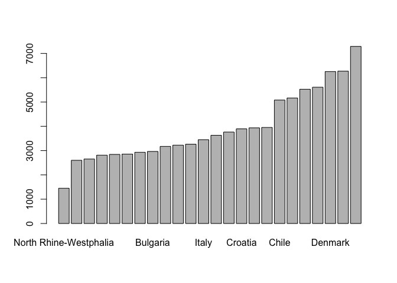<!-- -->

``` r
#----------------------------------------------------------
# gráfico editado
#----------------------------------------------------------


# definir margenes del plot
par(mar=c(10,4,4,4))

# ‘mar’ A numerical vector of the form ‘c(bottom, left, top, right)’
#        which gives the number of lines of margin to be specified on
#        the four sides of the plot.  The default is ‘c(5, 4, 4, 2) +
#        0.1’.

barplot(
        height = sample_i$n,             # cifra graficada
        names.arg = sample_i$ctry_text,  # nombres de cada barra en eje x
        col = c('#397CDA'),               # color de barras
        las=2,                            # mueve los nombres de cada barra en perpendicular al graficp
        cex.names=.8                      # tamaño de los textos
        )
```

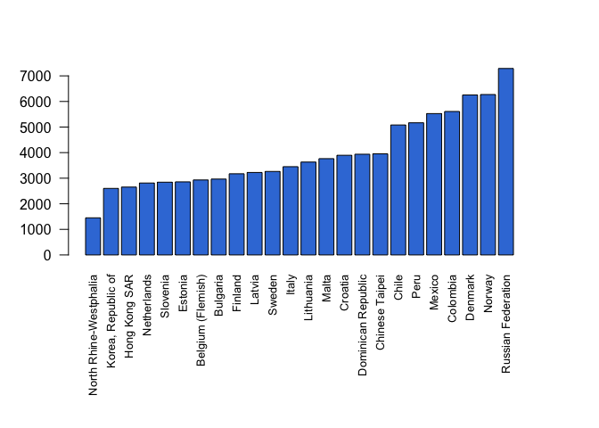<!-- -->

## Gráfico de cantidad de casos por país (via `ggplot`)

``` r
#------------------------------------------------------------------------------
# casos por país
#------------------------------------------------------------------------------

#----------------------------------------------------------
# nombres de paises
#----------------------------------------------------------

data_plot <- data_model %>%
             dplyr::count(ctry_text) %>%
             arrange(n)

#----------------------------------------------------------
# gráfico simple
#----------------------------------------------------------


library(ggplot2)
ggplot(
        data = data_plot, 
        aes(
            x = ctry_text, 
            y = n
            )
        ) +
    geom_bar(stat="identity")
```

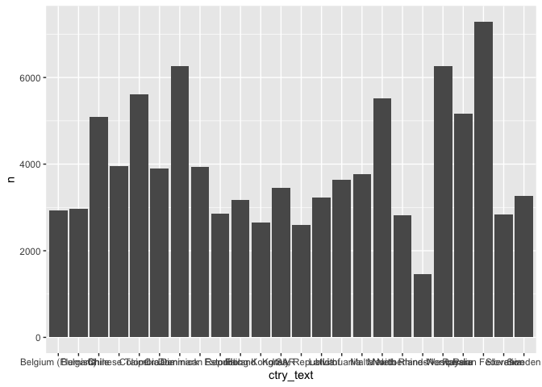<!-- -->

``` r
#----------------------------------------------------------
# gráfico editado
#----------------------------------------------------------

library(ggplot2)
ggplot(
        data = data_plot,                # datos a graficar
        aes(
            x = reorder(ctry_text, n),   # reorden de las barras a graficar
            y = n                        # vector que contiene las cifras que se grafican
            )
        ) +
    geom_bar(                            # objeto empleado para visualizar barras
        colour = "black",                # color de los bordes de las barras
        stat = "identity",               # especifica que se emplean las cifras de la tabla 
        fill = "#397CDA"                 # especifica el color de las barras en su interior
        ) +
    theme_minimal() +                    # aplica un template basico de plot
    ylab('Tamaño Muestral') +            # indica el titulo del eje y
    xlab('Países') +                     # indica el titulo del eje x
    guides(                              # edita la dirección del texto del eje x
        x =  guide_axis(angle = 90)
        )
```

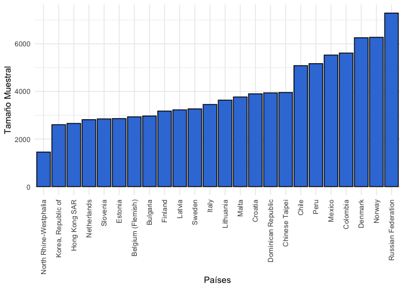<!-- -->

## Cantidad de escuelas por país

``` r
#------------------------------------------------------------------------------
# cantidad de escuelas
#------------------------------------------------------------------------------

#----------------------------------------------------------
# seleccionar variables y y filtrar casos críticos
#----------------------------------------------------------

data_schools <- data_model %>%
                # conservar solo las variables que necesitamos: paises y escuelas
                dplyr::select(ctry_text, IDSCHOOL) %>%
                # elminar todos los casos redundantes
                unique()

# Nota: si seleccionamos solo las variables de país (ctry_text)
#       y escuela (IDSCHOOL), ahora tenemos una gran tabla
#       que tiene a los casos de estudiantes, de cada escuela, en cada país.
#       Lo anterior, lo logramos aplicando la función 'dplyr::select()'.
#       Debido a que queremos solo la información de las escuelas, necesitamos
#       solo conservar la información "no redundante". Es decir,                 
#       necesitamos la cantidad de escuelas de cada pais. Aplicamos
#       la función "unique()". En esta secuencia, el resultado de "unique()" es
#       una tabla que contiene a cada pais, y una fila por cada escuela.

#----------------------------------------------------------
# tabla de cantidad de escuelas por país
#----------------------------------------------------------

xtabs(~ ctry_text, data = data_schools) %>%
tibble::as_tibble() %>%
knitr::kable()
```

| ctry_text              |   n |
|:-----------------------|----:|
| Belgium (Flemish)      | 162 |
| Bulgaria               | 147 |
| Chile                  | 178 |
| Chinese Taipei         | 141 |
| Colombia               | 150 |
| Croatia                | 175 |
| Denmark                | 184 |
| Dominican Republic     | 141 |
| Estonia                | 164 |
| Finland                | 179 |
| Hong Kong SAR          |  91 |
| Italy                  | 170 |
| Korea, Republic of     |  93 |
| Latvia                 | 147 |
| Lithuania              | 182 |
| Malta                  |  47 |
| Mexico                 | 213 |
| Netherlands            | 123 |
| North Rhine-Westphalia |  59 |
| Norway                 | 148 |
| Peru                   | 206 |
| Russian Federation     | 352 |
| Slovenia               | 145 |
| Sweden                 | 155 |

``` r
# Nota: podemos transformar el reusltados de "xtabs" a una tabla
#       tipo tibble, y luego este objeto lo podemos
#       mostrar como una tabla en la consola.

#----------------------------------------------------------
# tabla de cantidad de escuelas por país
#----------------------------------------------------------

dplyr::count(data_schools, ctry_text)
```

    ## # A tibble: 24 × 2
    ##    ctry_text              n
    ##    <chr>              <int>
    ##  1 Belgium (Flemish)    162
    ##  2 Bulgaria             147
    ##  3 Chile                178
    ##  4 Chinese Taipei       141
    ##  5 Colombia             150
    ##  6 Croatia              175
    ##  7 Denmark              184
    ##  8 Dominican Republic   141
    ##  9 Estonia              164
    ## 10 Finland              179
    ## # … with 14 more rows

``` r
# Nota: el resultado de "dplyr::count()" es muy similar al
#       conjunto de funciones aplicadas en la secuencia anterior.
```

## Gráfico de cantidad de escuelas por país (via `barplot`)

``` r
#------------------------------------------------------------------------------
# casos por país
#------------------------------------------------------------------------------

#----------------------------------------------------------
# nombres de paises
#----------------------------------------------------------

sample_j <- data_schools %>%
            dplyr::count(ctry_text) %>%
            arrange(n)


# Nota: a la tabla que describe la cantidad de casos, la llamaremos
#       'sample_i'; mientras que a la tabla de escuelas, la llamaremos
#       'sample_j'. En datos que se encuentran anidados, es muy comun
#       refereir a los casos como "i" (de 1 a n), y referir
#       a los clusters como "j" (de 1 a n). De modo tal, que se
#       habla del caso "i" en el cluster "j" (e.g., estudiante "i", en la escuela "j").

#----------------------------------------------------------
# gráfico simple
#----------------------------------------------------------

barplot(
        height = sample_j$n,             # cifra graficada
        names.arg = sample_j$ctry_text,  # nombres de cada barra en eje x
        )
```

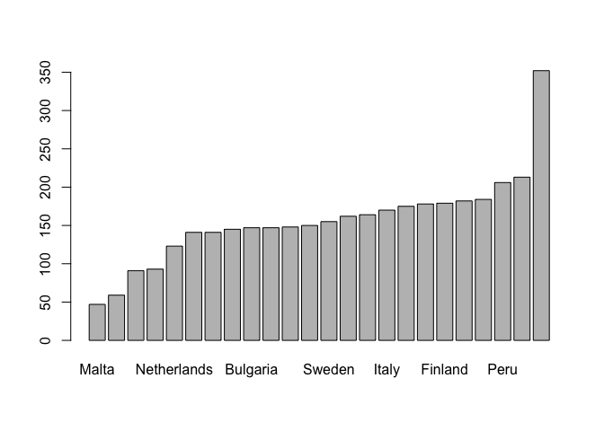<!-- -->

``` r
#----------------------------------------------------------
# gráfico editado
#----------------------------------------------------------


# definir margenes del plot
par(mar=c(10,4,4,4))

# ‘mar’ A numerical vector of the form ‘c(bottom, left, top, right)’
#        which gives the number of lines of margin to be specified on
#        the four sides of the plot.  The default is ‘c(5, 4, 4, 2) +
#        0.1’.

barplot(
        height = sample_j$n,             # cifra graficada
        names.arg = sample_j$ctry_text,  # nombres de cada barra en eje x
        col = c('#397CDA'),              # color de barras
        las=2,                           # mueve los nombres de cada barra en perpendicular al graficp
        cex.names=.8                     # tamaño de los textos
        )
```

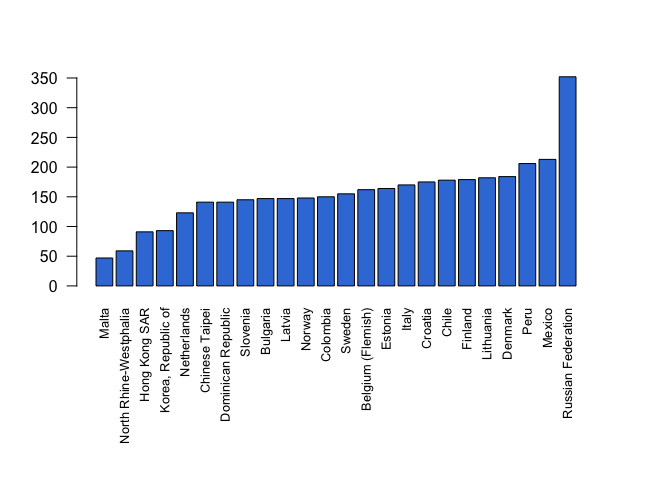<!-- -->

## Gráfico de cantidad de escuelas por país (via `ggplot`)

``` r
#------------------------------------------------------------------------------
# casos por país
#------------------------------------------------------------------------------

#----------------------------------------------------------
# nombres de paises
#----------------------------------------------------------

sample_j <- data_schools %>%
            dplyr::count(ctry_text) %>%
            arrange(n)


# Nota: a la tabla que describe la cantidad de casos, la llamaremos
#       'sample_i'; mientras que a la tabla de escuelas, la llamaremos
#       'sample_j'. En datos que se encuentran anidados, es muy comun
#       refereir a los casos como "i" (de 1 a n), y referir
#       a los clusters como "j" (de 1 a n). De modo tal, que se
#       habla del caso "i" en el cluster "j" (e.g., estudiante "i", en la escuela "j").

#----------------------------------------------------------
# gráfico simple
#----------------------------------------------------------


library(ggplot2)
ggplot(
        data = sample_j, 
        aes(
            x = ctry_text, 
            y = n
            )
        ) +
    geom_bar(stat="identity")
```

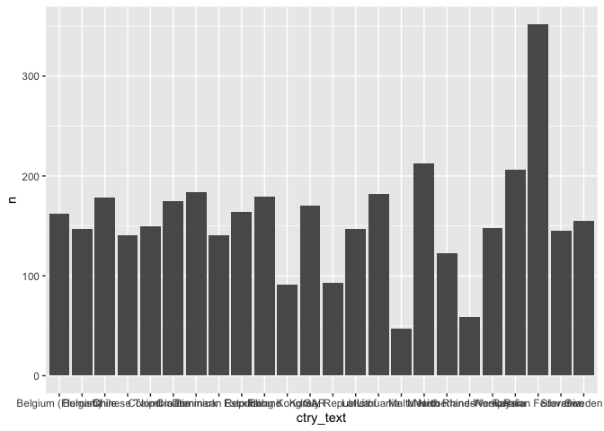<!-- -->

``` r
#----------------------------------------------------------
# gráfico editado
#----------------------------------------------------------

library(ggplot2)
ggplot(
        data = sample_j,                # datos a graficar
        aes(
            x = reorder(ctry_text, n),   # reorden de las barras a graficar
            y = n                        # vector que contiene las cifras que se grafican
            )
        ) +
    geom_bar(                            # objeto empleado para visualizar barras
        colour = "black",                # color de los bordes de las barras
        stat = "identity",               # especifica que se emplean las cifras de la tabla 
        fill = "#397CDA"                 # especifica el color de las barras en su interior
        ) +
    theme_minimal() +                    # aplica un template basico de plot
    ylab('Cantidad de escuelas') +            # indica el titulo del eje y
    xlab('Países') +                     # indica el titulo del eje x
    guides(                              # edita la dirección del texto del eje x
        x =  guide_axis(angle = 90)
        )
```

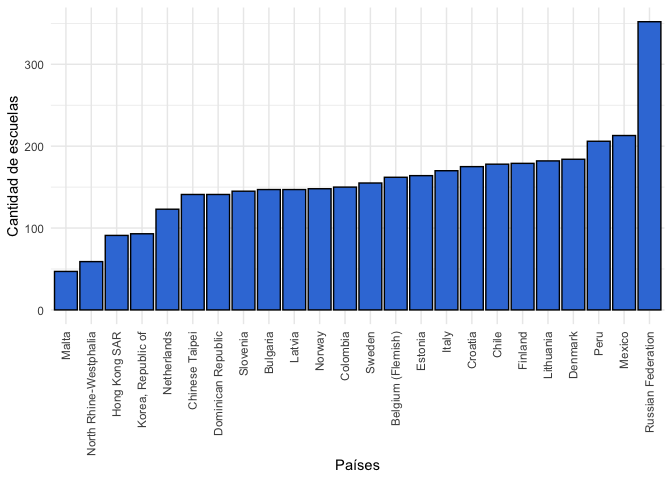<!-- -->

# Tipos de cluster

Los datos de ICCS 2016, incluye a muestras representativas de
estudiantes de cada país. Se muestrean escuelas, y dentro de las
escuelas, se muestrean estudiantes de una misma sala de clases. Cada
país tiene diferentes tipos de escuelas. Una clasificación comúna varios
países participantes, son las escuelas **privadas**.

Para obtener descriptivos de la cantidad de escuelas de cada tipo,
emplearemos las siguientes variables:

-   La variable país es ‘IDCNTRY’
-   La variable escuela es ‘IDSCHOOL’
-   La variable escuela es ‘C_PRIVATE’ + Valores de la variable
    C_PRIVATE

<!-- -->


      value label           
      <chr> <chr>           
    1 0     Public school   
    2 1     Private school  
    3 7     Invalid         
    4 8     Not administered
    5 9     Omitted     

## Cantidad de escuelas por tipo en toda la muestra

``` r
#------------------------------------------------------------------------------
# cantidad de escuelas por pais
#------------------------------------------------------------------------------


#----------------------------------------------------------
# seleccionar variables y y filtrar casos críticos
#----------------------------------------------------------

school_type <- data_model %>%
                # conservar solo las variables que necesitamos: paises y escuelas
                dplyr::select(ctry_text, IDSCHOOL, C_PRIVATE) %>%
                # elminar todos los casos redundantes
                unique()

# Nota: si seleccionamos solo las variables de país (ctry_text)
#       y escuela (IDSCHOOL), ahora tenemos una gran tabla
#       que tiene a los casos de estudiantes, de cada escuela, en cada país.
#       Lo anterior, lo logramos aplicando la función 'dplyr::select()'.
#       Debido a que queremos solo la información de las escuelas, necesitamos
#       solo conservar la información "no redundante". Es decir,                 
#       necesitamos la cantidad de escuelas de cada pais. Aplicamos
#       la función "unique()". En esta secuencia, el resultado de "unique()" es
#       una tabla que contiene a cada pais, y una fila por cada escuela.


#----------------------------------------------------------
# cantidad de casos por país via table()
#----------------------------------------------------------

table(school_type$C_PRIVATE)
```

    ## 
    ##    0    1 
    ## 2932  596

``` r
#----------------------------------------------------------
# cantidad de casos por país via table() incluyendo NA
#----------------------------------------------------------

table(school_type$C_PRIVATE, useNA = "always")
```

    ## 
    ##    0    1 <NA> 
    ## 2932  596  224

``` r
#----------------------------------------------------------
# cantidad de casos por país via table() y with()
#----------------------------------------------------------

with(school_type, table(C_PRIVATE))
```

    ## C_PRIVATE
    ##    0    1 
    ## 2932  596

``` r
# Nota: ocupamos la funcion with() de modo que la función table() 
#       resuelve los resultados, empleando a la tabla de datos
#       'school_type'


#----------------------------------------------------------
# cantidad de casos por país via xtabs()
#----------------------------------------------------------

xtabs(~ C_PRIVATE, data = school_type)
```

    ## C_PRIVATE
    ##    0    1 
    ## 2932  596

``` r
#----------------------------------------------------------
# cantidad de casos por país via xtabs() incluyendo a los NA
#----------------------------------------------------------

xtabs(~ C_PRIVATE, data = school_type, addNA = TRUE)
```

    ## C_PRIVATE
    ##    0    1 <NA> 
    ## 2932  596  224

``` r
#----------------------------------------------------------
# cantidad de casos por país via dplyr::count
#----------------------------------------------------------

school_type %>%
dplyr::count(C_PRIVATE) %>%
knitr::kable()
```

| C_PRIVATE |    n |
|----------:|-----:|
|         0 | 2932 |
|         1 |  596 |
|           |  224 |

``` r
# Nota: la función dplyr::count() cuenta a todos los casos posibles.
#       Lo anterior, incluye a las escuelas sin clasificación.

#----------------------------------------------------------
# tabla tipo APA (empleando base)
#----------------------------------------------------------

tabla_1 <- table(school_type$C_PRIVATE, useNA = "always")
tabla_1 <- as.data.frame(tabla_1)
tabla_1$n <- tabla_1$Freq
tabla_1$porcentaje <- tabla_1$Freq/sum(tabla_1$Freq)
tabla_1$tipo <- NA
tabla_1$tipo[is.na(tabla_1$Var1)] <- 'Sin información'
tabla_1$tipo[tabla_1$Var1==0] <- 'Públicas'
tabla_1$tipo[tabla_1$Var1==1] <- 'Privadas'
tabla_1 <- tabla_1[c('tipo','n','porcentaje')]
tabla_1
```

    ##              tipo    n porcentaje
    ## 1        Públicas 2932       0.78
    ## 2        Privadas  596       0.16
    ## 3 Sin información  224       0.06

``` r
knitr::kable(tabla_1)
```

| tipo            |    n | porcentaje |
|:----------------|-----:|-----------:|
| Públicas        | 2932 |       0.78 |
| Privadas        |  596 |       0.16 |
| Sin información |  224 |       0.06 |

``` r
#----------------------------------------------------------
# tabla tipo APA (empleando dplyr)
#----------------------------------------------------------

table_1 <- school_type %>%
           dplyr::count(C_PRIVATE) %>%
           mutate(tipo = case_when(
                C_PRIVATE == 0 ~ 'Públicas',
                C_PRIVATE == 1 ~ 'Privadas',
                TRUE ~ 'Sin información'
                )) %>%
           mutate(porcentaje = n/sum(n)) %>%
           dplyr::select(tipo, n, porcentaje)

knitr::kable(table_1)
```

| tipo            |    n | porcentaje |
|:----------------|-----:|-----------:|
| Públicas        | 2932 |       0.78 |
| Privadas        |  596 |       0.16 |
| Sin información |  224 |       0.06 |

## Cantidad de escuelas por tipo en cada país

``` r
#------------------------------------------------------------------------------
# cantidad de escuelas por pais
#------------------------------------------------------------------------------


#----------------------------------------------------------
# seleccionar variables y y filtrar casos críticos
#----------------------------------------------------------

school_type <- data_model %>%
                # conservar solo las variables que necesitamos: paises y escuelas
                dplyr::select(ctry_text, IDSCHOOL, C_PRIVATE) %>%
                # elminar todos los casos redundantes
                unique()

# Nota: si seleccionamos solo las variables de país (ctry_text)
#       y escuela (IDSCHOOL), ahora tenemos una gran tabla
#       que tiene a los casos de estudiantes, de cada escuela, en cada país.
#       Lo anterior, lo logramos aplicando la función 'dplyr::select()'.
#       Debido a que queremos solo la información de las escuelas, necesitamos
#       solo conservar la información "no redundante". Es decir,                 
#       necesitamos la cantidad de escuelas de cada pais. Aplicamos
#       la función "unique()". En esta secuencia, el resultado de "unique()" es
#       una tabla que contiene a cada pais, y una fila por cada escuela.


#----------------------------------------------------------
# cantidad de casos por país via table()
#----------------------------------------------------------

table(school_type$ctry_text, school_type$C_PRIVATE)
```

    ##                         
    ##                            0   1
    ##   Belgium (Flemish)       35 114
    ##   Bulgaria               140   5
    ##   Chile                   67  91
    ##   Chinese Taipei         125  15
    ##   Colombia               100  28
    ##   Croatia                172   0
    ##   Denmark                135  44
    ##   Dominican Republic      99  28
    ##   Estonia                103   2
    ##   Finland                166   8
    ##   Hong Kong SAR           64  24
    ##   Italy                  159   4
    ##   Korea, Republic of      72  21
    ##   Latvia                 133   3
    ##   Lithuania              179   3
    ##   Malta                   18  29
    ##   Mexico                 184  29
    ##   Netherlands             47  56
    ##   North Rhine-Westphalia  40  10
    ##   Norway                 138   4
    ##   Peru                   156  50
    ##   Russian Federation     350   2
    ##   Slovenia               134   1
    ##   Sweden                 116  25

``` r
#----------------------------------------------------------
# cantidad de casos por país via table() y with()
#----------------------------------------------------------

with(school_type, table(ctry_text, C_PRIVATE))
```

    ##                         C_PRIVATE
    ## ctry_text                  0   1
    ##   Belgium (Flemish)       35 114
    ##   Bulgaria               140   5
    ##   Chile                   67  91
    ##   Chinese Taipei         125  15
    ##   Colombia               100  28
    ##   Croatia                172   0
    ##   Denmark                135  44
    ##   Dominican Republic      99  28
    ##   Estonia                103   2
    ##   Finland                166   8
    ##   Hong Kong SAR           64  24
    ##   Italy                  159   4
    ##   Korea, Republic of      72  21
    ##   Latvia                 133   3
    ##   Lithuania              179   3
    ##   Malta                   18  29
    ##   Mexico                 184  29
    ##   Netherlands             47  56
    ##   North Rhine-Westphalia  40  10
    ##   Norway                 138   4
    ##   Peru                   156  50
    ##   Russian Federation     350   2
    ##   Slovenia               134   1
    ##   Sweden                 116  25

``` r
# Nota: ocupamos la funcion with() de modo que la función table() 
#       resuelve los resultados, empleando a la tabla de datos
#       'school_type'

#----------------------------------------------------------
# cantidad de casos por país via xtabs()
#----------------------------------------------------------

xtabs(~ ctry_text + C_PRIVATE, data = school_type)
```

    ##                         C_PRIVATE
    ## ctry_text                  0   1
    ##   Belgium (Flemish)       35 114
    ##   Bulgaria               140   5
    ##   Chile                   67  91
    ##   Chinese Taipei         125  15
    ##   Colombia               100  28
    ##   Croatia                172   0
    ##   Denmark                135  44
    ##   Dominican Republic      99  28
    ##   Estonia                103   2
    ##   Finland                166   8
    ##   Hong Kong SAR           64  24
    ##   Italy                  159   4
    ##   Korea, Republic of      72  21
    ##   Latvia                 133   3
    ##   Lithuania              179   3
    ##   Malta                   18  29
    ##   Mexico                 184  29
    ##   Netherlands             47  56
    ##   North Rhine-Westphalia  40  10
    ##   Norway                 138   4
    ##   Peru                   156  50
    ##   Russian Federation     350   2
    ##   Slovenia               134   1
    ##   Sweden                 116  25

``` r
#----------------------------------------------------------
# cantidad de casos por país via dplyr::count
#----------------------------------------------------------

school_type %>%
dplyr::count(ctry_text, C_PRIVATE) %>%
tidyr::spread(
        key = 'C_PRIVATE',
        value = 'n'
        ) %>%
knitr::kable()
```

| ctry_text              |   0 |   1 | <NA> |
|:-----------------------|----:|----:|-----:|
| Belgium (Flemish)      |  35 | 114 |   13 |
| Bulgaria               | 140 |   5 |    2 |
| Chile                  |  67 |  91 |   20 |
| Chinese Taipei         | 125 |  15 |    1 |
| Colombia               | 100 |  28 |   22 |
| Croatia                | 172 |     |    3 |
| Denmark                | 135 |  44 |    5 |
| Dominican Republic     |  99 |  28 |   14 |
| Estonia                | 103 |   2 |   59 |
| Finland                | 166 |   8 |    5 |
| Hong Kong SAR          |  64 |  24 |    3 |
| Italy                  | 159 |   4 |    7 |
| Korea, Republic of     |  72 |  21 |      |
| Latvia                 | 133 |   3 |   11 |
| Lithuania              | 179 |   3 |      |
| Malta                  |  18 |  29 |      |
| Mexico                 | 184 |  29 |      |
| Netherlands            |  47 |  56 |   20 |
| North Rhine-Westphalia |  40 |  10 |    9 |
| Norway                 | 138 |   4 |    6 |
| Peru                   | 156 |  50 |      |
| Russian Federation     | 350 |   2 |      |
| Slovenia               | 134 |   1 |   10 |
| Sweden                 | 116 |  25 |   14 |

``` r
# Nota: la función dplyr::count() cuenta a todos los casos posibles.
#       Lo anterior, incluye a las escuelas sin clasificación.
```

## Cantidad de escuelas por tipo en cada país en porcentajes por país

``` r
#------------------------------------------------------------------------------
# cantidad de escuelas por pais
#------------------------------------------------------------------------------


#----------------------------------------------------------
# seleccionar variables y y filtrar casos críticos
#----------------------------------------------------------

school_type <- data_model %>%
                # conservar solo las variables que necesitamos: paises y escuelas
                dplyr::select(ctry_text, IDSCHOOL, C_PRIVATE) %>%
                # elminar todos los casos redundantes
                unique()

# Nota: si seleccionamos solo las variables de país (ctry_text)
#       y escuela (IDSCHOOL), ahora tenemos una gran tabla
#       que tiene a los casos de estudiantes, de cada escuela, en cada país.
#       Lo anterior, lo logramos aplicando la función 'dplyr::select()'.
#       Debido a que queremos solo la información de las escuelas, necesitamos
#       solo conservar la información "no redundante". Es decir,                 
#       necesitamos la cantidad de escuelas de cada pais. Aplicamos
#       la función "unique()". En esta secuencia, el resultado de "unique()" es
#       una tabla que contiene a cada pais, y una fila por cada escuela.


#----------------------------------------------------------
# cantidad de casos por país via table()
#----------------------------------------------------------

table(school_type$ctry_text, school_type$C_PRIVATE) %>%
proportions(margin = 1)
```

    ##                         
    ##                               0      1
    ##   Belgium (Flemish)      0.2349 0.7651
    ##   Bulgaria               0.9655 0.0345
    ##   Chile                  0.4241 0.5759
    ##   Chinese Taipei         0.8929 0.1071
    ##   Colombia               0.7812 0.2188
    ##   Croatia                1.0000 0.0000
    ##   Denmark                0.7542 0.2458
    ##   Dominican Republic     0.7795 0.2205
    ##   Estonia                0.9810 0.0190
    ##   Finland                0.9540 0.0460
    ##   Hong Kong SAR          0.7273 0.2727
    ##   Italy                  0.9755 0.0245
    ##   Korea, Republic of     0.7742 0.2258
    ##   Latvia                 0.9779 0.0221
    ##   Lithuania              0.9835 0.0165
    ##   Malta                  0.3830 0.6170
    ##   Mexico                 0.8638 0.1362
    ##   Netherlands            0.4563 0.5437
    ##   North Rhine-Westphalia 0.8000 0.2000
    ##   Norway                 0.9718 0.0282
    ##   Peru                   0.7573 0.2427
    ##   Russian Federation     0.9943 0.0057
    ##   Slovenia               0.9926 0.0074
    ##   Sweden                 0.8227 0.1773

``` r
#----------------------------------------------------------
# cantidad de casos por país via table() y with()
#----------------------------------------------------------

with(school_type, table(ctry_text, C_PRIVATE)) %>%
proportions(margin = 1)
```

    ##                         C_PRIVATE
    ## ctry_text                     0      1
    ##   Belgium (Flemish)      0.2349 0.7651
    ##   Bulgaria               0.9655 0.0345
    ##   Chile                  0.4241 0.5759
    ##   Chinese Taipei         0.8929 0.1071
    ##   Colombia               0.7812 0.2188
    ##   Croatia                1.0000 0.0000
    ##   Denmark                0.7542 0.2458
    ##   Dominican Republic     0.7795 0.2205
    ##   Estonia                0.9810 0.0190
    ##   Finland                0.9540 0.0460
    ##   Hong Kong SAR          0.7273 0.2727
    ##   Italy                  0.9755 0.0245
    ##   Korea, Republic of     0.7742 0.2258
    ##   Latvia                 0.9779 0.0221
    ##   Lithuania              0.9835 0.0165
    ##   Malta                  0.3830 0.6170
    ##   Mexico                 0.8638 0.1362
    ##   Netherlands            0.4563 0.5437
    ##   North Rhine-Westphalia 0.8000 0.2000
    ##   Norway                 0.9718 0.0282
    ##   Peru                   0.7573 0.2427
    ##   Russian Federation     0.9943 0.0057
    ##   Slovenia               0.9926 0.0074
    ##   Sweden                 0.8227 0.1773

``` r
# Nota: ocupamos la funcion with() de modo que la función table() 
#       resuelve los resultados, empleando a la tabla de datos
#       'school_type'

#----------------------------------------------------------
# cantidad de casos por país via xtabs()
#----------------------------------------------------------

xtabs(~ ctry_text + C_PRIVATE, data = school_type) %>%
proportions(margin = 1)
```

    ##                         C_PRIVATE
    ## ctry_text                     0      1
    ##   Belgium (Flemish)      0.2349 0.7651
    ##   Bulgaria               0.9655 0.0345
    ##   Chile                  0.4241 0.5759
    ##   Chinese Taipei         0.8929 0.1071
    ##   Colombia               0.7812 0.2188
    ##   Croatia                1.0000 0.0000
    ##   Denmark                0.7542 0.2458
    ##   Dominican Republic     0.7795 0.2205
    ##   Estonia                0.9810 0.0190
    ##   Finland                0.9540 0.0460
    ##   Hong Kong SAR          0.7273 0.2727
    ##   Italy                  0.9755 0.0245
    ##   Korea, Republic of     0.7742 0.2258
    ##   Latvia                 0.9779 0.0221
    ##   Lithuania              0.9835 0.0165
    ##   Malta                  0.3830 0.6170
    ##   Mexico                 0.8638 0.1362
    ##   Netherlands            0.4563 0.5437
    ##   North Rhine-Westphalia 0.8000 0.2000
    ##   Norway                 0.9718 0.0282
    ##   Peru                   0.7573 0.2427
    ##   Russian Federation     0.9943 0.0057
    ##   Slovenia               0.9926 0.0074
    ##   Sweden                 0.8227 0.1773

``` r
#----------------------------------------------------------
# cantidad de casos por país via dplyr::count
#----------------------------------------------------------

school_type %>%
dplyr::count(ctry_text, C_PRIVATE) %>%
tidyr::spread(
        key = 'C_PRIVATE',
        value = 'n'
        ) %>%
rename(
publicas = 2,
privadas = 3,
sin_info = 4
) %>%
mutate(n_tot = rowSums(cbind(publicas, privadas, sin_info), na.rm=TRUE)) %>%
mutate(p_pub = publicas/n_tot) %>%
mutate(p_pri = privadas/n_tot) %>%
mutate(p_sin = sin_info/n_tot) %>%
dplyr::select(
        ctry_text, 
        n_tot,
        publicas,
        privadas,
        sin_info,
        p_pub,
        p_pri,
        p_sin
        ) %>%
knitr::kable()
```

| ctry_text              | n_tot | publicas | privadas | sin_info | p_pub | p_pri | p_sin |
|:-----------------------|------:|---------:|---------:|---------:|------:|------:|------:|
| Belgium (Flemish)      |   162 |       35 |      114 |       13 |  0.22 |  0.70 |  0.08 |
| Bulgaria               |   147 |      140 |        5 |        2 |  0.95 |  0.03 |  0.01 |
| Chile                  |   178 |       67 |       91 |       20 |  0.38 |  0.51 |  0.11 |
| Chinese Taipei         |   141 |      125 |       15 |        1 |  0.89 |  0.11 |  0.01 |
| Colombia               |   150 |      100 |       28 |       22 |  0.67 |  0.19 |  0.15 |
| Croatia                |   175 |      172 |          |        3 |  0.98 |       |  0.02 |
| Denmark                |   184 |      135 |       44 |        5 |  0.73 |  0.24 |  0.03 |
| Dominican Republic     |   141 |       99 |       28 |       14 |  0.70 |  0.20 |  0.10 |
| Estonia                |   164 |      103 |        2 |       59 |  0.63 |  0.01 |  0.36 |
| Finland                |   179 |      166 |        8 |        5 |  0.93 |  0.04 |  0.03 |
| Hong Kong SAR          |    91 |       64 |       24 |        3 |  0.70 |  0.26 |  0.03 |
| Italy                  |   170 |      159 |        4 |        7 |  0.94 |  0.02 |  0.04 |
| Korea, Republic of     |    93 |       72 |       21 |          |  0.77 |  0.23 |       |
| Latvia                 |   147 |      133 |        3 |       11 |  0.90 |  0.02 |  0.07 |
| Lithuania              |   182 |      179 |        3 |          |  0.98 |  0.02 |       |
| Malta                  |    47 |       18 |       29 |          |  0.38 |  0.62 |       |
| Mexico                 |   213 |      184 |       29 |          |  0.86 |  0.14 |       |
| Netherlands            |   123 |       47 |       56 |       20 |  0.38 |  0.46 |  0.16 |
| North Rhine-Westphalia |    59 |       40 |       10 |        9 |  0.68 |  0.17 |  0.15 |
| Norway                 |   148 |      138 |        4 |        6 |  0.93 |  0.03 |  0.04 |
| Peru                   |   206 |      156 |       50 |          |  0.76 |  0.24 |       |
| Russian Federation     |   352 |      350 |        2 |          |  0.99 |  0.01 |       |
| Slovenia               |   145 |      134 |        1 |       10 |  0.92 |  0.01 |  0.07 |
| Sweden                 |   155 |      116 |       25 |       14 |  0.75 |  0.16 |  0.09 |

``` r
# Nota: la función dplyr::count() cuenta a todos los casos posibles.
#       Lo anterior, incluye a las escuelas sin clasificación.
```

# Datos por cluster

## Preparar datos

``` r
#------------------------------------------------------------------------------
# preparar datos
#------------------------------------------------------------------------------

#----------------------------------------------------------
# preparar datos
#----------------------------------------------------------

school_data <- data_model %>%
                # conservar solo las variables que necesitamos: paises y escuelas
                dplyr::select(IDCNTRY, ctry_text, IDSCHOOL, C_PRIVATE, PV1CIV) %>%
                # preparar datos
                mutate(id_k = as.factor(paste0(IDCNTRY))) %>%
                mutate(id_k = as.numeric(id_k)) %>%
                mutate(id_j = as.factor(paste0(IDCNTRY, "_",IDSCHOOL))) %>%
                mutate(id_j = as.numeric(id_j)) %>%
                mutate(y_ij = PV1CIV) %>%
                mutate(y_j  = psi2301::c_mean(y_ij, id_j)) %>%
                mutate(adm = case_when(
                     C_PRIVATE == 0 ~ 'Públicas',
                     C_PRIVATE == 1 ~ 'Privadas',
                     TRUE ~ 'Sin información')) %>%                
                dplyr::select(id_k, ctry_text, id_j, adm, y_j) %>%
                # elminar todos los casos redundantes
                unique()
```

# Distribuciones de puntajes de escuelas

## Obtener datos de una escuela

``` r
#------------------------------------------------------------------------------
# resultados por escuela
#------------------------------------------------------------------------------

#----------------------------------------------------------
# mostrar solo el dato de puntaje (via codigo base)
#----------------------------------------------------------

school_data[school_data$id_j == 3591,'y_j']
```

    ## # A tibble: 1 × 1
    ##     y_j
    ##   <dbl>
    ## 1  633.

``` r
#----------------------------------------------------------
# mostrar toda la fila de puntaje (via codigo base)
#----------------------------------------------------------

school_data[school_data$id_j == 3591,]
```

    ## # A tibble: 1 × 5
    ##    id_k ctry_text          id_j adm        y_j
    ##   <dbl> <chr>             <dbl> <chr>    <dbl>
    ## 1    24 Belgium (Flemish)  3591 Privadas  633.

``` r
#----------------------------------------------------------
# mostrar solo el dato de puntaje (via dplyr)
#----------------------------------------------------------

school_data %>%
dplyr::filter(id_j == 3591) %>%
dplyr::select(y_j) %>%
knitr::kable()
```

| y_j |
|----:|
| 633 |

``` r
#----------------------------------------------------------
# mostrar toda la fila de puntaje (via dplyr)
#----------------------------------------------------------

school_data %>%
dplyr::filter(id_j == 3591) %>%
knitr::kable()
```

| id_k | ctry_text         | id_j | adm      | y_j |
|-----:|:------------------|-----:|:---------|----:|
|   24 | Belgium (Flemish) | 3591 | Privadas | 633 |

# Distribuciones de puntajes de escuelas

## Histogramas con Base

``` r
#------------------------------------------------------------------------------
# histogramas para visualizar distribuciones
#------------------------------------------------------------------------------

#----------------------------------------------------------
# via hist
#----------------------------------------------------------

par(mfrow = c(1,1))
hist(school_data$y_j[school_data$adm=='Públicas'], 
        breaks = 40,
        las = 1,
        ylim=c(0,400),
        xlim=c(200,800),
        xlab = 'Score',
        main = 'Públicas'
        )
```

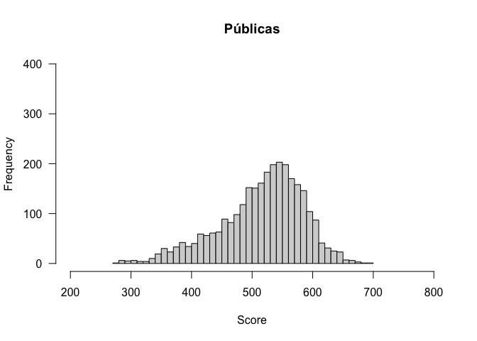<!-- -->

``` r
par(mfrow = c(1,1))
hist(school_data$y_j[school_data$adm=='Privadas'], 
        breaks = 40,
        las = 1,
        ylim=c(0,400),
        xlim=c(200,800),
        xlab = 'Score',
        main = 'Privadas'
        )
```

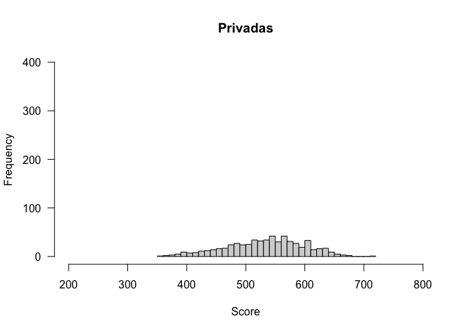<!-- -->

``` r
par(mfrow = c(1,1))
hist(school_data$y_j[school_data$adm=='Sin información'], 
        breaks = 40,
        las = 1,
        ylim=c(0,400),
        xlim=c(200,800),
        xlab = 'Score',
        main = 'Sin información'
        )
```

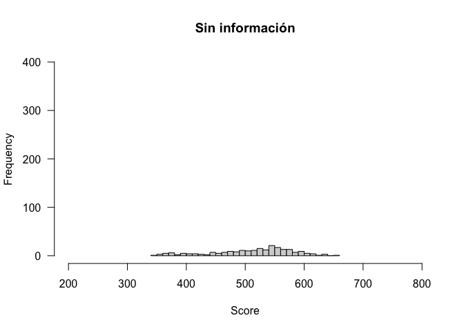<!-- -->

## Histogramas con ggplot

``` r
#------------------------------------------------------------------------------
# histogramas para visualizar distribuciones
#------------------------------------------------------------------------------

#----------------------------------------------------------
# via ggplot
#----------------------------------------------------------

library(ggplot2)
plot_1 <- school_data %>%
dplyr::filter(adm == 'Públicas') %>%
ggplot(. , aes(x = y_j)) +
geom_histogram(
  position = "identity", 
  alpha = 0.4, 
  color = '#3876BA',
  fill  = '#3876BA',
  binwidth = 10
  ) +
xlab('Score') +
ylab('Frequency') +
labs(title="Públicas") +
ylim(c(0,250)) +
theme_minimal() +
theme(
  panel.background = element_blank(),
  panel.grid.minor = element_blank(),
  panel.grid.major = element_blank(),            
  axis.ticks = element_blank(),
  plot.title = element_text(hjust = 0.5)
  )
plot_1
```

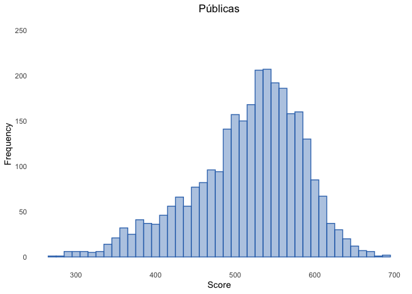<!-- -->

``` r
library(ggplot2)
plot_2 <- school_data %>%
dplyr::filter(adm == 'Privadas') %>%
ggplot(. , aes(x = y_j)) +
geom_histogram(
  position = "identity", 
  alpha = 0.4, 
  color = '#3876BA',
  fill  = '#3876BA',
  binwidth = 10
  ) +
xlab('Score') +
ylab('Frequency') +
labs(title="Públicas") +
ylim(c(0,250)) +
theme_minimal() +
theme(
  panel.background = element_blank(),
  panel.grid.minor = element_blank(),
  panel.grid.major = element_blank(),            
  axis.ticks = element_blank(),
  plot.title = element_text(hjust = 0.5)
  )
plot_2
```

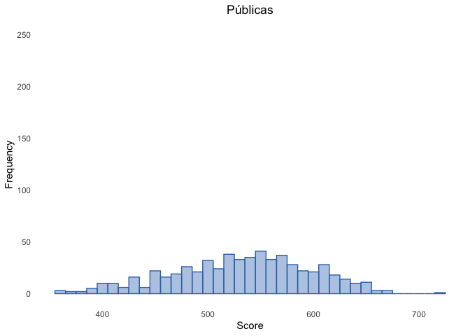<!-- -->

``` r
library(ggplot2)
plot_3 <- school_data %>%
dplyr::filter(adm == 'Sin información') %>%
ggplot(. , aes(x = y_j)) +
geom_histogram(
  position = "identity", 
  alpha = 0.4, 
  color = '#3876BA',
  fill  = '#3876BA',
  binwidth = 10
  ) +
xlab('Score') +
ylab('Frequency') +
labs(title="Públicas") +
ylim(c(0,250)) +
theme_minimal() +
theme(
  panel.background = element_blank(),
  panel.grid.minor = element_blank(),
  panel.grid.major = element_blank(),            
  axis.ticks = element_blank(),
  plot.title = element_text(hjust = 0.5)
  )
plot_3
```

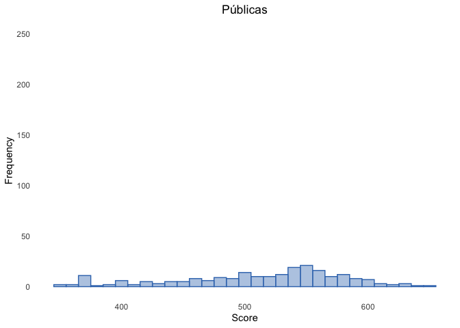<!-- -->

## Histogramas con ggplot

``` r
#------------------------------------------------------------------------------
# histogramas para visualizar distribuciones
#------------------------------------------------------------------------------

#----------------------------------------------------------
# histogramas superpuestos
#----------------------------------------------------------

school_data %>%
psi2301::remove_labels() %>%
ggplot(., 
 aes(
 x = y_j, 
 color  = adm,
 fill  = adm
        )
 ) +
geom_histogram(
        binwidth = 10,
        position="identity", 
        alpha=0.5
        ) +
scale_color_manual(
values = c(
  'Públicas'         = 'black',
  'Privadas'         = 'black',
  'Sin información'  = 'black'
  )
) +
scale_fill_manual(
values = c(
  'Públicas'         = '#FCFAF9',
  'Privadas'         = '#FFCF00',
  'Sin información'  = '#ED271D'
  )
) +
ylab('n') +
xlab('Score') +
theme_minimal() +
theme(
  panel.background = element_blank(),
  panel.grid.minor = element_blank(),
  panel.grid.major = element_blank(),            
  axis.ticks = element_blank(),
  plot.title = element_text(hjust = 0.5)
  )
```

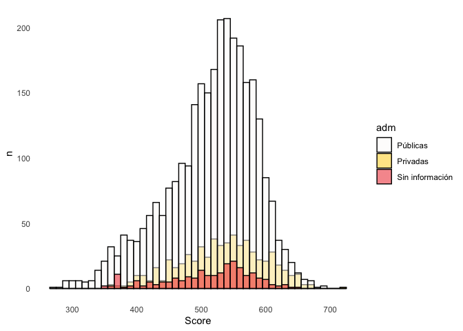<!-- -->
