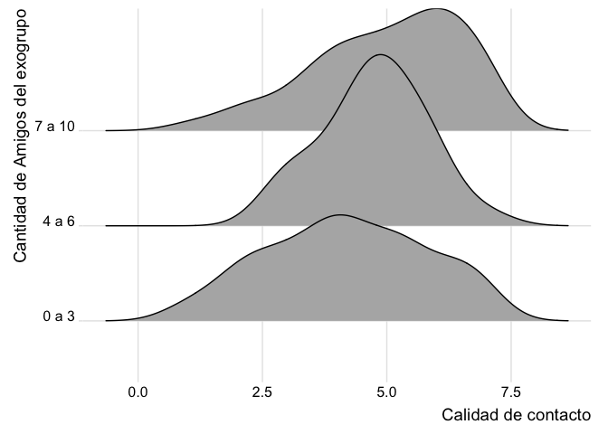

ANOVA: F y p value
================

# Pregunta: homocedasticidad de varianzas

¡Buenas tardes Pablo y Profesor!

Espero estén muy bien, les escribo porque a raíz de la pregunta que hizo
Jorge en clases sobre el incumplimiento del supuesto de
homocedasticidad, realicé la corrección mediante el siguiente código:
anova1 = oneway.test(c\_contac \~ factor(amig\_exog), data=a\_ig,
var.equal =FALSE) anova1

y me arrojó lo siguiente: One-way analysis of means (not assuming equal
variances) data:  c\_contac and factor(amig\_exog) F = 3.3803, num df =
2.00, denom df = 73.98, p-value = 0.03937

Sin embargo, me parece que no me entrega todos los datos necesarios para
completar la tabla de anova (como por ejemplo, la suma de cuadrados), en
esta misma línea me gustaría saber si num df y denom df son los grados
de libertad inter e intragrupal, respectivamente.

Por otro lado, al igual que a mi compañero, no me permite calcular la
prueba de Tukey y muestra el siguiente error

``` r
# Post hoc Tukey
tukey_test = TukeyHSD(anova1)
tukey_test

# Error in UseMethod("TukeyHSD") :
# no applicable method for 'TukeyHSD' applied to an object of class "htest"
# tukey_test
# Error: objeto 'tukey_test' no encontrado
```

Quedo atenta a su respuesta y agradezco desde ya su disposición :)
¡Saludos!

Carolina.

# Respuesta

En un escenario en que hubieran no equivalencia de varianza entre los
grupos, una alternativa a la comparación multiple de Tukey, es el
procedimiento de Games-Howell (ver Sauder & Demars, 2019). Este se
encuentra implementado en la libreria “rstatix”. En el siguiente codigo
se incluyen secciones para:

-   preparar los datos
-   ajustar un ANOVA
-   generar comparaciones multiples ignorando la falta de equivalencia
    entre varianzas
-   ajustar un ANOVA con corrección de Welch
-   generar comparaciones multiples empleando Games-Howell

## Preparar datos

``` r
# -----------------------------------------------------------------------------
# abrir dplyr y los datos
# -----------------------------------------------------------------------------

# -----------------------------------------------
# actualizar psi2301
# -----------------------------------------------

# credentials::set_github_pat()
# devtools::install_github("dacarras/psi2301", force = TRUE)

# -----------------------------------------------
# abrir datos
# -----------------------------------------------

datos_amistad <- psi2301::amistad_intergrupal %>%
                 rename_all(tolower) %>%
                 dplyr::glimpse()
```

    ## Rows: 200
    ## Columns: 29
    ## $ id     <dbl> 1, 2, 3, 4, 5, 6, 7, 8, 9, 10, 11, 12, 13, 14, 15, 16, 17, 18, …
    ## $ affo1  <dbl> 7, 6, 5, 4, 4, 6, 6, -99, 5, -99, 4, 6, 4, 6, 2, 5, 5, 4, 6, 6,…
    ## $ affo2  <dbl> 3, 7, 4, 4, 3, 7, 3, 3, 4, 5, 4, 6, 7, 7, -99, 4, 6, 7, 7, -99,…
    ## $ affo3  <dbl> 7, 7, 5, 4, 2, 5, 1, 4, 4, 4, 3, 5, 7, 5, 1, 2, 5, 5, 1, 4, 4, …
    ## $ outt1  <dbl> 7, 6, 4, 4, 3, 5, 5, 6, 3, 4, 3, 5, 4, 6, 1, 5, 1, 4, 3, 4, 2, …
    ## $ outt2  <dbl> 3, 1, 2, 2, 3, 2, 1, 1, 1, 4, 2, 1, 1, 1, 4, 3, 2, 3, 1, 4, 5, …
    ## $ outt3  <dbl> 7, 6, 4, 4, 4, 3, 5, 4, 2, 4, 3, 4, 7, 7, 1, 5, 3, 3, 2, 4, 4, …
    ## $ famn1  <dbl> 7, 7, 5, 7, 1, 6, 7, 4, 6, 5, 4, 5, 4, 6, 4, 3, 4, 4, 7, 5, 4, …
    ## $ famn2  <dbl> 7, 6, 6, 4, 2, 5, 7, 3, 7, 5, 3, 6, 4, 6, 4, 3, -99, 4, 7, 5, 4…
    ## $ famn3  <dbl> 7, 6, 5, 4, 4, 6, 1, 4, 7, 5, 2, 5, 4, 4, 1, 3, 4, 5, 7, -99, -…
    ## $ clan1  <dbl> 4, 6, 5, 4, 4, 6, 1, 4, 2, 4, 3, 6, 4, 3, 1, 3, 6, 7, 4, 2, 5, …
    ## $ clan2  <dbl> 3, 6, 5, 4, 3, 4, 7, 3, 2, 4, 3, 6, 4, 4, 1, 3, 5, 4, 4, 4, 4, …
    ## $ clan3  <dbl> 5, 6, 5, 4, 4, 6, 1, 4, 2, 4, 2, 5, 4, 4, 6, 3, 5, 4, 4, 4, 5, …
    ## $ natic1 <dbl> 5, 6, 5, 4, 5, 7, 1, 3, 4, 5, 2, 5, 4, 7, -99, 2, 4, 4, 7, 4, 4…
    ## $ natic2 <dbl> 6, -99, 6, -99, 6, 6, 1, 5, 5, 5, 1, 5, 4, 7, 3, 3, -99, 4, 7, …
    ## $ natic3 <dbl> 7, 7, 7, 4, -99, -99, 1, 4, 6, 7, 2, 7, 7, 7, 4, 7, 6, 4, 7, 7,…
    ## $ idma1  <dbl> 7, 7, 1, 1, 2, 7, 1, 2, 4, 4, 2, 4, 1, 7, 1, 2, 2, 2, 7, 1, 4, …
    ## $ idma2  <dbl> 7, 7, 1, 1, -99, 6, 1, 3, 4, 3, 1, 4, -99, 5, -99, 1, 5, -99, 7…
    ## $ idma3  <dbl> 7, 7, 1, 1, -99, 6, 1, 2, 4, 3, 2, 4, 1, 6, 1, 2, -99, 4, 7, 1,…
    ## $ qous1  <dbl> 7, 2, 4, 4, 4, 5, 6, 5, 5, 4, 4, 6, 2, 5, 1, 1, 4, 3, 5, 5, 4, …
    ## $ qous2  <dbl> 6, 3, 4, 4, 3, 6, 7, 4, 6, 4, 5, 6, 2, 5, 1, -99, 6, 3, 5, 4, 4…
    ## $ qous3  <dbl> 7, 6, 4, 4, 2, 5, -99, 5, 7, 4, 6, -99, 2, 5, 1, 2, 7, 3, 6, 4,…
    ## $ qous4  <dbl> 7, 6, 4, 4, 4, 5, 7, 3, 7, 4, 4, 7, 2, 4, 1, 2, 6, 3, 5, 3, 4, …
    ## $ qous5  <dbl> 6, 6, 4, -99, 3, 6, 7, 4, 7, 4, 7, 6, 3, 4, 1, 2, 7, 4, 7, 2, 5…
    ## $ goufr  <dbl> 10, 10, 1, 10, 5, 10, 0, 3, 10, 3, 10, 3, 2, 1, 2, 2, 7, 0, 10,…
    ## $ ethnia <chr> "CHI", "CHI", "CHI", "CHI", "CHI", "CHI", "CHI", "CHI", "CHI", …
    ## $ sex    <dbl> 2, 2, 1, 1, 1, 1, 2, 1, 2, 1, 2, 2, 2, 1, 1, 2, 2, 2, 1, 1, 2, …
    ## $ region <dbl> 2, 2, 1, 2, 2, 2, 2, 2, 2, 2, 2, 2, 1, 1, 2, 2, 2, 1, 2, 2, 1, …
    ## $ age    <dbl> 16, 15, 14, 14, 15, 14, 15, 15, 14, 14, 14, 15, 16, 17, 14, 15,…

``` r
# -----------------------------------------------------------------------------
# valores de sin respuesta
# -----------------------------------------------------------------------------

# -----------------------------------------------
# descriptivos de todas las variables numericas
# -----------------------------------------------

datos_amistad %>%
  dplyr::select(-ethnia) %>%
  r4sda::get_desc() %>%
  knitr::kable(., digits = 2)
```

| var    | missing | complete |   n |   mean |    sd | min | p25 | median |   p75 | max |   skew |  kurt | hist     |
|:-------|--------:|---------:|----:|-------:|------:|----:|----:|-------:|------:|----:|-------:|------:|:---------|
| id     |       0 |        1 | 200 | 100.50 | 57.88 |   1 |  51 |  100.5 | 150.2 | 200 |   0.00 |   1.8 | ▇▇▇▇▇▇▇▇ |
| affo1  |       0 |        1 | 200 |   0.66 | 21.73 | -99 |   4 |    6.0 |   6.0 |   7 |  -4.36 |  20.1 | ▁▁▁▁▁▁▁▇ |
| affo2  |       0 |        1 | 200 |  -5.58 | 30.40 | -99 |   2 |    4.0 |   6.0 |   7 |  -2.74 |   8.6 | ▁▁▁▁▁▁▁▇ |
| affo3  |       0 |        1 | 200 |  -1.92 | 24.64 | -99 |   3 |    4.0 |   5.0 |   7 |  -3.68 |  14.6 | ▁▁▁▁▁▁▁▇ |
| outt1  |       0 |        1 | 200 |   2.25 | 14.60 | -99 |   3 |    4.0 |   6.0 |   7 |  -6.71 |  46.7 | ▁▁▁▁▁▁▁▇ |
| outt2  |       0 |        1 | 200 |  -1.23 | 21.36 | -99 |   1 |    3.0 |   5.0 |   7 |  -4.33 |  19.9 | ▁▁▁▁▁▁▁▇ |
| outt3  |       0 |        1 | 200 |   0.62 | 19.10 | -99 |   3 |    4.0 |   5.0 |   7 |  -4.99 |  26.2 | ▁▁▁▁▁▁▁▇ |
| famn1  |       0 |        1 | 200 |   1.70 | 17.84 | -99 |   4 |    5.0 |   6.0 |   7 |  -5.42 |  30.7 | ▁▁▁▁▁▁▁▇ |
| famn2  |       0 |        1 | 200 |  -2.54 | 26.58 | -99 |   3 |    5.0 |   6.0 |   7 |  -3.35 |  12.3 | ▁▁▁▁▁▁▁▇ |
| famn3  |       0 |        1 | 200 |   2.38 | 14.63 | -99 |   3 |    4.0 |   6.0 |   7 |  -6.70 |  46.6 | ▁▁▁▁▁▁▁▇ |
| clan1  |       0 |        1 | 200 |   3.77 |  7.50 | -99 |   3 |    4.0 |   6.0 |   7 | -12.93 | 177.7 | ▁▁▁▁▁▁▁▇ |
| clan2  |       0 |        1 | 200 |  -3.50 | 27.31 | -99 |   3 |    4.0 |   5.2 |   7 |  -3.21 |  11.3 | ▁▁▁▁▁▁▁▇ |
| clan3  |       0 |        1 | 200 |   2.62 | 12.68 | -99 |   3 |    4.0 |   5.0 |   7 |  -7.77 |  62.5 | ▁▁▁▁▁▁▁▇ |
| natic1 |       0 |        1 | 200 |  -5.00 | 30.58 | -99 |   3 |    5.0 |   6.0 |   7 |  -2.75 |   8.6 | ▁▁▁▁▁▁▁▇ |
| natic2 |       0 |        1 | 200 |  -3.72 | 29.16 | -99 |   4 |    5.0 |   7.0 |   7 |  -2.96 |   9.8 | ▁▁▁▁▁▁▁▇ |
| natic3 |       0 |        1 | 200 |   3.62 | 14.80 | -99 |   4 |    7.0 |   7.0 |   7 |  -6.72 |  46.7 | ▁▁▁▁▁▁▁▇ |
| idma1  |       0 |        1 | 200 |  -2.71 | 25.54 | -99 |   1 |    4.0 |   6.0 |   7 |  -3.49 |  13.3 | ▁▁▁▁▁▁▁▇ |
| idma2  |       0 |        1 | 200 |  -5.05 | 28.78 | -99 |   1 |    3.0 |   5.0 |   7 |  -2.95 |   9.8 | ▁▁▁▁▁▁▁▇ |
| idma3  |       0 |        1 | 200 |  -3.94 | 27.22 | -99 |   1 |    3.5 |   5.2 |   7 |  -3.19 |  11.3 | ▁▁▁▁▁▁▁▇ |
| qous1  |       0 |        1 | 200 |  -2.46 | 25.58 | -99 |   3 |    4.0 |   5.0 |   7 |  -3.50 |  13.3 | ▁▁▁▁▁▁▁▇ |
| qous2  |       0 |        1 | 200 |   3.19 | 12.75 | -99 |   4 |    5.0 |   6.0 |   7 |  -7.77 |  62.5 | ▁▁▁▁▁▁▁▇ |
| qous3  |       0 |        1 | 200 |  -1.31 | 24.80 | -99 |   3 |    5.0 |   6.2 |   7 |  -3.67 |  14.6 | ▁▁▁▁▁▁▁▇ |
| qous4  |       0 |        1 | 200 |  -3.96 | 29.09 | -99 |   3 |    5.0 |   6.0 |   7 |  -2.96 |   9.8 | ▁▁▁▁▁▁▁▇ |
| qous5  |       0 |        1 | 200 |  -3.85 | 29.12 | -99 |   3 |    5.0 |   6.0 |   7 |  -2.96 |   9.8 | ▁▁▁▁▁▁▁▇ |
| goufr  |       0 |        1 | 200 |  -1.84 | 28.93 | -99 |   2 |    7.0 |  10.0 |  10 |  -3.02 |  10.3 | ▁▁▁▁▁▁▁▇ |
| sex    |       0 |        1 | 200 |   1.48 |  0.50 |   1 |   1 |    1.0 |   2.0 |   2 |   0.08 |   1.0 | ▇▁▁▁▁▁▁▇ |
| region |       0 |        1 | 200 |   1.80 |  0.40 |   1 |   2 |    2.0 |   2.0 |   2 |  -1.54 |   3.4 | ▂▁▁▁▁▁▁▇ |
| age    |       0 |        1 | 200 |  14.86 |  0.76 |  14 |  14 |   15.0 |  15.0 |  17 |   0.65 |   3.1 | ▆▁▇▁▁▂▁▁ |

``` r
# -----------------------------------------------
# frecuencia del uso de categorias
# -----------------------------------------------

datos_amistad %>%
  dplyr::select(affo1:goufr, sex, region) %>%
  r4sda::wide_resp() %>%
  knitr::kable(., digits = 2)
```

| variable |  -99 |   00 |   01 |   02 |   03 |   04 |   05 |   06 |   07 |   08 |   09 |   10 | hist     |
|:---------|-----:|-----:|-----:|-----:|-----:|-----:|-----:|-----:|-----:|-----:|-----:|-----:|:---------|
| affo1    | 0.04 |      | 0.02 | 0.03 | 0.04 | 0.17 | 0.17 | 0.29 | 0.23 |      |      |      | ▁▁▁▁▁▁▁▇ |
| affo2    | 0.10 |      | 0.13 | 0.04 | 0.12 | 0.20 | 0.16 | 0.13 | 0.12 |      |      |      | ▁▁▁▁▁▁▁▇ |
| affo3    | 0.06 |      | 0.08 | 0.07 | 0.12 | 0.23 | 0.21 | 0.14 | 0.09 |      |      |      | ▁▁▁▁▁▁▁▇ |
| outt1    | 0.02 |      | 0.10 | 0.04 | 0.12 | 0.24 | 0.21 | 0.16 | 0.10 |      |      |      | ▁▁▁▁▁▁▁▇ |
| outt2    | 0.04 |      | 0.26 | 0.13 | 0.10 | 0.16 | 0.13 | 0.12 | 0.06 |      |      |      | ▁▁▁▁▁▁▁▇ |
| outt3    | 0.04 |      | 0.10 | 0.07 | 0.12 | 0.24 | 0.18 | 0.13 | 0.12 |      |      |      | ▁▁▁▁▁▁▁▇ |
| famn1    | 0.03 |      | 0.08 | 0.04 | 0.09 | 0.17 | 0.17 | 0.20 | 0.21 |      |      |      | ▁▁▁▁▁▁▁▇ |
| famn2    | 0.07 |      | 0.06 | 0.06 | 0.09 | 0.18 | 0.20 | 0.16 | 0.17 |      |      |      | ▁▁▁▁▁▁▁▇ |
| famn3    | 0.02 |      | 0.09 | 0.06 | 0.09 | 0.27 | 0.16 | 0.16 | 0.15 |      |      |      | ▁▁▁▁▁▁▁▇ |
| clan1    | 0.00 |      | 0.09 | 0.06 | 0.14 | 0.30 | 0.14 | 0.15 | 0.12 |      |      |      | ▁▁▁▁▁▁▁▇ |
| clan2    | 0.07 |      | 0.08 | 0.06 | 0.16 | 0.26 | 0.13 | 0.16 | 0.10 |      |      |      | ▁▁▁▁▁▁▁▇ |
| clan3    | 0.01 |      | 0.09 | 0.07 | 0.14 | 0.25 | 0.22 | 0.14 | 0.08 |      |      |      | ▁▁▁▁▁▁▁▇ |
| natic1   | 0.10 |      | 0.04 | 0.09 | 0.06 | 0.17 | 0.16 | 0.17 | 0.22 |      |      |      | ▁▁▁▁▁▁▁▇ |
| natic2   | 0.09 |      | 0.05 | 0.04 | 0.07 | 0.12 | 0.19 | 0.18 | 0.26 |      |      |      | ▁▁▁▁▁▁▁▇ |
| natic3   | 0.02 |      | 0.04 | 0.04 | 0.05 | 0.12 | 0.08 | 0.15 | 0.51 |      |      |      | ▁▁▁▁▁▁▁▇ |
| idma1    | 0.06 |      | 0.19 | 0.13 | 0.07 | 0.16 | 0.11 | 0.07 | 0.21 |      |      |      | ▁▁▁▁▁▁▁▇ |
| idma2    | 0.09 |      | 0.21 | 0.11 | 0.11 | 0.15 | 0.13 | 0.08 | 0.12 |      |      |      | ▁▁▁▁▁▁▁▇ |
| idma3    | 0.07 |      | 0.24 | 0.10 | 0.07 | 0.12 | 0.12 | 0.07 | 0.17 |      |      |      | ▁▁▁▁▁▁▁▇ |
| qous1    | 0.06 |      | 0.09 | 0.07 | 0.12 | 0.25 | 0.17 | 0.10 | 0.14 |      |      |      | ▁▁▁▁▁▁▁▇ |
| qous2    | 0.01 |      | 0.04 | 0.09 | 0.09 | 0.22 | 0.18 | 0.18 | 0.18 |      |      |      | ▁▁▁▁▁▁▁▇ |
| qous3    | 0.06 |      | 0.04 | 0.09 | 0.07 | 0.16 | 0.16 | 0.17 | 0.25 |      |      |      | ▁▁▁▁▁▁▁▇ |
| qous4    | 0.09 |      | 0.04 | 0.04 | 0.11 | 0.19 | 0.15 | 0.17 | 0.21 |      |      |      | ▁▁▁▁▁▁▁▇ |
| qous5    | 0.09 |      | 0.04 | 0.04 | 0.08 | 0.19 | 0.14 | 0.17 | 0.24 |      |      |      | ▁▁▁▁▁▁▁▇ |
| goufr    | 0.08 | 0.04 | 0.06 | 0.09 | 0.07 | 0.06 | 0.04 | 0.04 | 0.04 | 0.04 | 0.03 | 0.42 | ▁▁▁▁▁▁▁▇ |
| sex      |      |      | 0.52 | 0.48 |      |      |      |      |      |      |      |      | ▇▁▁▁▁▁▁▇ |
| region   |      |      | 0.20 | 0.80 |      |      |      |      |      |      |      |      | ▂▁▁▁▁▁▁▇ |

``` r
# Nota: todas las variables ordinales presentan valores -99
#       a excepcion de las variables dummy (sex, region).


# -----------------------------------------------
# declarar como NA todos los valores -99
# -----------------------------------------------

datos_amistad <- datos_amistad %>%
                 dplyr::na_if(-99)

# -----------------------------------------------
# revisar conversion
# -----------------------------------------------

datos_amistad %>%
  dplyr::select(-ethnia) %>%
  r4sda::get_desc() %>%
  knitr::kable(., digits = 2)
```

| var    | missing | complete |   n |  mean |    sd | min | p25 | median | p75 | max |  skew | kurt | hist     |
|:-------|--------:|---------:|----:|------:|------:|----:|----:|-------:|----:|----:|------:|-----:|:---------|
| id     |    0.00 |     1.00 | 200 | 100.5 | 57.88 |   1 |  51 |    100 | 150 | 200 |  0.00 |  1.8 | ▇▇▇▇▇▇▇▇ |
| affo1  |    0.04 |     0.96 | 200 |   5.4 |  1.44 |   1 |   4 |      6 |   6 |   7 | -0.87 |  3.4 | ▁▁▁▅▁▅▇▆ |
| affo2  |    0.10 |     0.90 | 200 |   4.2 |  1.89 |   1 |   3 |      4 |   6 |   7 | -0.27 |  2.1 | ▅▂▅▇▁▆▅▅ |
| affo3  |    0.06 |     0.94 | 200 |   4.3 |  1.67 |   1 |   3 |      4 |   5 |   7 | -0.31 |  2.4 | ▃▂▃▇▁▇▅▃ |
| outt1  |    0.02 |     0.98 | 200 |   4.3 |  1.72 |   1 |   3 |      4 |   6 |   7 | -0.38 |  2.4 | ▃▂▃▇▁▇▅▃ |
| outt2  |    0.04 |     0.96 | 200 |   3.4 |  1.98 |   1 |   1 |      3 |   5 |   7 |  0.22 |  1.7 | ▇▃▃▅▁▃▃▂ |
| outt3  |    0.04 |     0.96 | 200 |   4.2 |  1.78 |   1 |   3 |      4 |   6 |   7 | -0.24 |  2.3 | ▃▂▃▇▁▆▅▃ |
| famn1  |    0.03 |     0.97 | 200 |   4.8 |  1.83 |   1 |   4 |      5 |   6 |   7 | -0.60 |  2.4 | ▃▂▃▆▁▆▇▇ |
| famn2  |    0.07 |     0.93 | 200 |   4.7 |  1.72 |   1 |   4 |      5 |   6 |   7 | -0.47 |  2.4 | ▂▂▃▇▁▇▆▆ |
| famn3  |    0.02 |     0.98 | 200 |   4.5 |  1.78 |   1 |   4 |      4 |   6 |   7 | -0.34 |  2.3 | ▂▂▂▇▁▅▅▅ |
| clan1  |    0.00 |     1.00 | 200 |   4.3 |  1.73 |   1 |   3 |      4 |   6 |   7 | -0.17 |  2.3 | ▂▂▃▇▁▃▅▃ |
| clan2  |    0.07 |     0.92 | 200 |   4.2 |  1.70 |   1 |   3 |      4 |   6 |   7 | -0.16 |  2.3 | ▂▂▅▇▁▅▅▃ |
| clan3  |    0.01 |     0.98 | 200 |   4.2 |  1.66 |   1 |   3 |      4 |   5 |   7 | -0.24 |  2.4 | ▃▂▅▇▁▇▅▂ |
| natic1 |    0.10 |     0.90 | 200 |   4.9 |  1.80 |   1 |   4 |      5 |   6 |   7 | -0.52 |  2.3 | ▂▃▂▆▁▆▆▇ |
| natic2 |    0.09 |     0.92 | 200 |   5.1 |  1.74 |   1 |   4 |      5 |   7 |   7 | -0.78 |  2.8 | ▂▁▂▃▁▆▆▇ |
| natic3 |    0.02 |     0.98 | 200 |   5.7 |  1.73 |   1 |   5 |      7 |   7 |   7 | -1.22 |  3.4 | ▁▁▁▂▁▁▂▇ |
| idma1  |    0.06 |     0.94 | 200 |   4.0 |  2.22 |   1 |   2 |      4 |   6 |   7 |  0.04 |  1.6 | ▇▅▂▆▁▅▂▇ |
| idma2  |    0.09 |     0.92 | 200 |   3.7 |  2.08 |   1 |   2 |      4 |   5 |   7 |  0.16 |  1.8 | ▇▅▅▆▁▅▃▅ |
| idma3  |    0.07 |     0.92 | 200 |   3.8 |  2.25 |   1 |   1 |      4 |   6 |   7 |  0.12 |  1.6 | ▇▃▂▅▁▅▂▆ |
| qous1  |    0.06 |     0.94 | 200 |   4.3 |  1.77 |   1 |   3 |      4 |   5 |   7 | -0.15 |  2.3 | ▃▂▃▇▁▆▃▅ |
| qous2  |    0.01 |     0.98 | 200 |   4.8 |  1.69 |   1 |   4 |      5 |   6 |   7 | -0.38 |  2.3 | ▁▃▃▇▁▇▇▇ |
| qous3  |    0.06 |     0.94 | 200 |   4.9 |  1.82 |   1 |   4 |      5 |   7 |   7 | -0.53 |  2.2 | ▂▃▂▅▁▅▆▇ |
| qous4  |    0.09 |     0.92 | 200 |   4.9 |  1.71 |   1 |   4 |      5 |   6 |   7 | -0.44 |  2.3 | ▂▂▅▇▁▆▆▇ |
| qous5  |    0.09 |     0.92 | 200 |   5.0 |  1.74 |   1 |   4 |      5 |   7 |   7 | -0.57 |  2.5 | ▂▂▂▆▁▅▆▇ |
| goufr  |    0.08 |     0.92 | 200 |   6.6 |  3.66 |   0 |   3 |      8 |  10 |  10 | -0.46 |  1.6 | ▂▂▁▂▁▁▁▇ |
| sex    |    0.00 |     1.00 | 200 |   1.5 |  0.50 |   1 |   1 |      1 |   2 |   2 |  0.08 |  1.0 | ▇▁▁▁▁▁▁▇ |
| region |    0.00 |     1.00 | 200 |   1.8 |  0.40 |   1 |   2 |      2 |   2 |   2 | -1.54 |  3.4 | ▂▁▁▁▁▁▁▇ |
| age    |    0.00 |     1.00 | 200 |  14.9 |  0.76 |  14 |  14 |     15 |  15 |  17 |  0.65 |  3.1 | ▆▁▇▁▁▂▁▁ |

## Items invertidos

-   Los datos de “amistad\_intergrupal” incluyen un item invertido.
-   Este es el item `outt2`, de la escala de confianza en el exogrupo
-   Miremos estos items en conjunto:

´´´text

outt1 La mayoría de los &lt;<exogrupo>&gt; son confiables.

outt2 Creo que los &lt;<exogrupo>&gt; tratan de aprovecharse de los
demás.

outt3 Pienso que los &lt;<exogrupo>&gt; actúan correctamente.

´´´

Del total de items empleados, este es el único item que no puede ser
interpretado como “mayor valor de respuesta, mayor expresion del
atributo”.

-   Una forma de trabajar con estos items, es invertirlos, antes de
    generar puntajes totales por escala.

``` r
# -----------------------------------------------------------------------------
# items invertidos
# -----------------------------------------------------------------------------

# -----------------------------------------------
# frecuencia del uso de categorias
# -----------------------------------------------

datos_amistad %>%
  dplyr::select(outt1:outt3) %>%
  r4sda::wide_resp() %>%
  knitr::kable(., digits = 2)
```

| variable |   01 |   02 |   03 |   04 |   05 |   06 |   07 |   NA | hist     |
|:---------|-----:|-----:|-----:|-----:|-----:|-----:|-----:|-----:|:---------|
| outt1    | 0.10 | 0.04 | 0.12 | 0.24 | 0.21 | 0.16 | 0.10 | 0.02 | ▃▂▃▇▁▇▅▃ |
| outt2    | 0.26 | 0.13 | 0.10 | 0.16 | 0.13 | 0.12 | 0.06 | 0.04 | ▇▃▃▅▁▃▃▂ |
| outt3    | 0.10 | 0.07 | 0.12 | 0.24 | 0.18 | 0.13 | 0.12 | 0.04 | ▃▂▃▇▁▆▅▃ |

``` r
# Nota: se ve que el histograma de uso de categorias
#       del item outt2, presenta más respuestas en las 
#       categorias de respuesta de menor valor.
#       Por el contenido del item, en contraste al resto
#       de las afirmaciones empleadas en la escala de
#       "confianza en el exogrupo", llegamos a la conclusión
#       de que `outt2` es un item invertido


# -----------------------------------------------
# recodificar item invertido
# -----------------------------------------------

datos_amistad <- datos_amistad %>%
                 mutate(outt2r = case_when(
                  outt2 == 1 ~ 7,
                  outt2 == 2 ~ 6,
                  outt2 == 3 ~ 5,
                  outt2 == 4 ~ 4,
                  outt2 == 5 ~ 3,
                  outt2 == 6 ~ 2,
                  outt2 == 7 ~ 1
                  ))

# -----------------------------------------------
# mostrar recodificacion
# -----------------------------------------------

dplyr::count(datos_amistad, outt2, outt2r)
```

    ## # A tibble: 8 x 3
    ##   outt2 outt2r     n
    ##   <dbl>  <dbl> <int>
    ## 1     1      7    52
    ## 2     2      6    26
    ## 3     3      5    20
    ## 4     4      4    31
    ## 5     5      3    26
    ## 6     6      2    25
    ## 7     7      1    11
    ## 8    NA     NA     9

## Recodificacion de variables dummy

-   Copnvencionalmente las, variables dummy se recodifican como
    variables 0 y 1, de modo tal que 1 exprese la categoria de interes,
    mientras que 0 exprese la categoria de referencia.
-   Esta convensión proviene de la inclusión de variables dummy en
    modelos de regresion.
-   No obstante, es muy común que en los procesos de digitación, las
    respuestas sean digitadas de izquierda a derecha, y por tanto tomen
    valores 1 y 2, segun el orden en que estas fueron presentadas en el
    cuestionario.
-   En el siguiente codigo vamos a recodificar estos valores a dummy
    para modelos de regresion.

``` r
# -----------------------------------------------------------------------------
# variables dummy
# -----------------------------------------------------------------------------

# -----------------------------------------------
# recodificar sociodemograficas
# -----------------------------------------------

datos_amistad <- datos_amistad %>%
                 mutate(ingroup = case_when(
                  ethnia == 'CHI' ~ 1, # estudidantes no indigenas
                  ethnia == 'MAP' ~ 0  # estudidantes indigenas
                  )
                 ) %>%
                 mutate(fem = case_when(
                  sex == 1 ~ 0, # niños (boy)
                  sex == 2 ~ 1  # niñas (girl)
                  )
                 ) %>%
                 mutate(stgo = case_when(
                  region == 1 ~ 1, # Santiago
                  region == 2 ~ 0  # Temuco
                  )
                 ) %>%
                 mutate(amig_exog = case_when(
                  between(goufr, 0, 3) ~ 1, # pocos  0 a 3
                  between(goufr, 4, 6) ~ 2, # varios 4 a 7
                  between(goufr, 0, 10) ~ 3 # muchos 8 a 10
                  )
                 ) %>%
                mutate(amig_exog_group = case_when(
                  between(goufr, 0, 3)  ~ '0 a 3', # pocos  0 a 3
                  between(goufr, 4, 6)  ~ '4 a 6', # varios 4 a 7
                  between(goufr, 0, 10) ~ '7 a 10' # muchos 8 a 10
                  )
                 )                 

# -----------------------------------------------
# revision de recodificaciones
# -----------------------------------------------

dplyr::count(datos_amistad, ethnia, ingroup)
```

    ## # A tibble: 2 x 3
    ##   ethnia ingroup     n
    ##   <chr>    <dbl> <int>
    ## 1 CHI          1   100
    ## 2 MAP          0   100

``` r
dplyr::count(datos_amistad, sex, fem)
```

    ## # A tibble: 2 x 3
    ##     sex   fem     n
    ##   <dbl> <dbl> <int>
    ## 1     1     0   104
    ## 2     2     1    96

``` r
dplyr::count(datos_amistad, region, stgo)
```

    ## # A tibble: 2 x 3
    ##   region  stgo     n
    ##    <dbl> <dbl> <int>
    ## 1      1     1    39
    ## 2      2     0   161

``` r
dplyr::count(datos_amistad, goufr, amig_exog)
```

    ## # A tibble: 12 x 3
    ##    goufr amig_exog     n
    ##    <dbl>     <dbl> <int>
    ##  1     0         1     9
    ##  2     1         1    13
    ##  3     2         1    17
    ##  4     3         1    14
    ##  5     4         2    11
    ##  6     5         2     9
    ##  7     6         2     8
    ##  8     7         3     7
    ##  9     8         3     7
    ## 10     9         3     6
    ## 11    10         3    83
    ## 12    NA        NA    16

## Crear puntajes

-   En general, en diferentes estudios de ciencias sociales, los
    articulos emplean puntajes para representar atributos o constructos
    teóricos en base a respuestas a diferentes preguntas.
-   Estos puntajes pueden ser generados por diferentes metodos tales
    como: promedios de respuestas, sumas de respuestas, o el empleo de
    un modelo de respuesta (e.g., *confirmatory factor analysis*, *item
    response theory models*).
-   Los datos contenidos en “Amistad Integrupal” incluyen diferentes
    respuestas a diferentes afirmaciones, las cuales se encuentran
    agrupadas en los siguientes constrcuctos:
    -   Reacciones afectivas al exogrupo (affo1, affo2, affo3)
    -   Confianza al exogrupo (outt1, outt2r, outt3)
        -   outt2r incluye las respuestas invertidas del item outt2
    -   Normas familiares de apoyo al contacto con el exogrupo (famn1,
        famn2, famn3)
    -   Normas e compañeros de curso de apoyo al contacto con el
        exogrupo (clan1, clan2, clan3)
    -   Identificación con Chile (natic1, natic2, natic3)
    -   Identificación con el pueblo Mapuche (idma1, idma2, idma3)  
    -   Calidad de contacto (qous1, qous2, qous3, qous4, qous5)

``` r
# -----------------------------------------------------------------------------
# crear suma de puntajes
# -----------------------------------------------------------------------------

# -----------------------------------------------
# aislar matrices de respuesta por constructo
# -----------------------------------------------

affec_items <- dplyr::select(datos_amistad, affo1, affo2, affo3)
trust_items <- dplyr::select(datos_amistad, outt1, outt2r, outt3)
normf_items <- dplyr::select(datos_amistad, famn1, famn2, famn3)
normp_items <- dplyr::select(datos_amistad, clan1, clan2, natic3)
idnat_items <- dplyr::select(datos_amistad, natic1, natic2, natic3)
idmap_items <- dplyr::select(datos_amistad, idma1, idma2, idma3)
contq_items <- dplyr::select(datos_amistad, qous1, qous2, qous3, qous4, qous5)

# -----------------------------------------------
# tabla de confiabilidad de puntajes
# -----------------------------------------------

data.frame(
scales = c(
  'Affectos',
  'Confianza',
  'Normas Familiares',
  'Normas Grupo curso',
  'Identidad con Chile',
  'Identidad con el pueblo Mapuche',
  'Calidad de contacto con exogrupo'
),
alpha = 
  c(
psych::alpha(affec_items)$total$raw_alpha,
psych::alpha(trust_items)$total$raw_alpha,
psych::alpha(normf_items)$total$raw_alpha,
psych::alpha(normp_items)$total$raw_alpha,
psych::alpha(idnat_items)$total$raw_alpha,
psych::alpha(idmap_items)$total$raw_alpha,
psych::alpha(contq_items)$total$raw_alpha
  )
) %>%
knitr::kable(., digits = 2)
```

| scales                           | alpha |
|:---------------------------------|------:|
| Affectos                         |  0.80 |
| Confianza                        |  0.57 |
| Normas Familiares                |  0.85 |
| Normas Grupo curso               |  0.58 |
| Identidad con Chile              |  0.89 |
| Identidad con el pueblo Mapuche  |  0.95 |
| Calidad de contacto con exogrupo |  0.90 |

``` r
# Nota: la generación de puntajes en base a respuestas o 
#       valores de diferentes indicadores, se evaluan en base
#       a indicadores de confiabilidad. Estos indicadores
#       de confiabilidad, como el "Alpha de Cronbach" nos
#       nos indican que tanta precision tienen los puntajes
#       generados, para poder distinguir entre las personas
#       o unidades representadas con los puntajes. En general,
#       valores cercanos a .70 son deseables.

# -----------------------------------------------
# crear promedios de puntaje
# -----------------------------------------------

datos_amistad <- datos_amistad %>%
                 mutate(affec = psi2301::mean_score(affec_items)) %>%
                 mutate(trust = psi2301::mean_score(trust_items)) %>%
                 mutate(normf = psi2301::mean_score(normf_items)) %>%
                 mutate(normp = psi2301::mean_score(normp_items)) %>%
                 mutate(idnat = psi2301::mean_score(idnat_items)) %>%
                 mutate(idmap = psi2301::mean_score(idmap_items)) %>%
                 mutate(contq = psi2301::mean_score(contq_items))

# -----------------------------------------------
# inspeccionar base de datos creada
# -----------------------------------------------

datos_amistad %>%
r4sda::variables_table() %>%
knitr::kable()
```

| variable          | type | values                        | labels                    |
|:------------------|:-----|:------------------------------|:--------------------------|
| id                | dbl  | 10, 11, 12, 13, 14, 15, 16,…  | === no variable label === |
| affo1             | dbl  | , NA, 4, 6, 4, 6, 2, 5, 5, 4… | === no variable label === |
| affo2             | dbl  | 5, 4, 6, 7, 7, NA, 4, 6, 7,…  | === no variable label === |
| affo3             | dbl  | 4, 3, 5, 7, 5, 1, 2, 5, 5, …  | === no variable label === |
| outt1             | dbl  | 4, 3, 5, 4, 6, 1, 5, 1, 4, …  | === no variable label === |
| outt2             | dbl  | 4, 2, 1, 1, 1, 4, 3, 2, 3, …  | === no variable label === |
| outt3             | dbl  | 4, 3, 4, 7, 7, 1, 5, 3, 3, …  | === no variable label === |
| famn1             | dbl  | 5, 4, 5, 4, 6, 4, 3, 4, 4, …  | === no variable label === |
| famn2             | dbl  | 5, 3, 6, 4, 6, 4, 3, NA, 4,…  | === no variable label === |
| famn3             | dbl  | 5, 2, 5, 4, 4, 1, 3, 4, 5, …  | === no variable label === |
| clan1             | dbl  | 4, 3, 6, 4, 3, 1, 3, 6, 7, …  | === no variable label === |
| clan2             | dbl  | 4, 3, 6, 4, 4, 1, 3, 5, 4, …  | === no variable label === |
| clan3             | dbl  | 4, 2, 5, 4, 4, 6, 3, 5, 4, …  | === no variable label === |
| natic1            | dbl  | 5, 2, 5, 4, 7, NA, 2, 4, 4,…  | === no variable label === |
| natic2            | dbl  | 5, 5, 1, 5, 4, 7, 3, 3, NA, … | === no variable label === |
| natic3            | dbl  | 6, 7, 2, 7, 7, 7, 4, 7, 6, 4… | === no variable label === |
| idma1             | dbl  | 4, 2, 4, 1, 7, 1, 2, 2, 2, …  | === no variable label === |
| idma2             | dbl  | , 3, 1, 4, NA, 5, NA, 1, 5, … | === no variable label === |
| idma3             | dbl  | , 3, 2, 4, 1, 6, 1, 2, NA, 4… | === no variable label === |
| qous1             | dbl  | 4, 4, 6, 2, 5, 1, 1, 4, 3, …  | === no variable label === |
| qous2             | dbl  | 4, 5, 6, 2, 5, 1, NA, 6, 3,…  | === no variable label === |
| qous3             | dbl  | , 4, 6, NA, 2, 5, 1, 2, 7, 3… | === no variable label === |
| qous4             | dbl  | 4, 4, 7, 2, 4, 1, 2, 6, 3, …  | === no variable label === |
| qous5             | dbl  | , 4, 7, 6, 3, 4, 1, 2, 7, 4,… | === no variable label === |
| goufr             | dbl  | , 10, 3, 10, 3, 2, 1, 2, 2, … | === no variable label === |
| ethnia            | chr  | , “CHI”, “CHI”, “CHI”, “CHI”… | === no variable label === |
| sex               | dbl  | 1, 2, 2, 2, 1, 1, 2, 2, 2, …  | === no variable label === |
| region            | dbl  | 2, 2, 2, 1, 1, 2, 2, 2, 1, …  | === no variable label === |
| age               | dbl  | , 15, 14, 14, 14, 15, 16, 17… | === no variable label === |
| outt2r            | dbl  | 4, 6, 7, 7, 7, 4, 5, 6, 5, …  | === no variable label === |
| ingroup           | dbl  | 1, 1, 1, 1, 1, 1, 1, 1, 1, …  | === no variable label === |
| fem               | dbl  | 0, 1, 1, 1, 0, 0, 1, 1, 1, …  | === no variable label === |
| stgo              | dbl  | 0, 0, 0, 1, 1, 0, 0, 0, 1, …  | === no variable label === |
| amig\_exog        | dbl  | 1, 3, 1, 1, 1, 1, 1, 3, 1, …  | === no variable label === |
| amig\_exog\_group | chr  | “,”7 a 10“,”4 a 6“,”7 a 1…    | === no variable label === |
| affec             | dbl  | .0, 3.3, 3.5, 4.3, 4.5, 3.7,… | === no variable label === |
| trust             | dbl  | .7, 5.7, 5.7, 4.0, 4.0, 4.0,… | === no variable label === |
| normf             | dbl  | .7, 5.0, 3.7, 6.7, 5.0, 3.0,… | === no variable label === |
| normp             | dbl  | .0, 3.0, 3.7, 3.3, 5.0, 2.7,… | === no variable label === |
| idnat             | dbl  | .5, 1.0, 4.0, 5.0, 5.7, 1.7,… | === no variable label === |
| idmap             | dbl  | .3, 1.0, 2.3, 4.0, 3.3, 1.7,… | === no variable label === |
| contq             | dbl  | .4, 6.8, 4.2, 6.4, 4.0, 5.2,… | === no variable label === |

# ANOVA

## Caso 1: Residuales no normales, y varianzas no equivalentes

``` r
# -----------------------------------------------------------------------------
# traditional anova
# -----------------------------------------------------------------------------

# -----------------------------------------------
# crear tabla de descriptivos (medias y sd)
# -----------------------------------------------

aov(contq ~ as.factor(amig_exog), data = datos_amistad)
```

    ## Call:
    ##    aov(formula = contq ~ as.factor(amig_exog), data = datos_amistad)
    ## 
    ## Terms:
    ##                 as.factor(amig_exog) Residuals
    ## Sum of Squares                    23       389
    ## Deg. of Freedom                    2       181
    ## 
    ## Residual standard error: 1.5
    ## Estimated effects may be unbalanced
    ## 16 observations deleted due to missingness

``` r
# -----------------------------------------------
# normality
# -----------------------------------------------

datos_amistad %>%
dplyr::select(contq, amig_exog) %>%
na.omit() %>%
lm(contq ~ as.factor(amig_exog), data = .) %>%
residuals(.) %>%
shapiro.test()
```

    ## 
    ##  Shapiro-Wilk normality test
    ## 
    ## data:  .
    ## W = 1, p-value = 0.008

``` r
# -----------------------------------------------
# homocesdasticity
# -----------------------------------------------

# test 1
car::leveneTest(
  contq ~ as.factor(amig_exog), 
  data = datos_amistad, 
  center = 'mean')
```

    ## Levene's Test for Homogeneity of Variance (center = "mean")
    ##        Df F value Pr(>F)  
    ## group   2    3.62  0.029 *
    ##       181                 
    ## ---
    ## Signif. codes:  0 '***' 0.001 '**' 0.01 '*' 0.05 '.' 0.1 ' ' 1

``` r
# No equivalentes

# test 2
bartlett.test(contq ~ as.factor(amig_exog), data = datos_amistad)
```

    ## 
    ##  Bartlett test of homogeneity of variances
    ## 
    ## data:  contq by as.factor(amig_exog)
    ## Bartlett's K-squared = 6, df = 2, p-value = 0.05

``` r
# Casi Equivalentes.

# -----------------------------------------------
# n balance
# -----------------------------------------------

dplyr::count(datos_amistad, amig_exog)
```

    ## # A tibble: 4 x 2
    ##   amig_exog     n
    ##       <dbl> <int>
    ## 1         1    53
    ## 2         2    28
    ## 3         3   103
    ## 4        NA    16

``` r
# -----------------------------------------------
# multiple comparison ignoring assumptions
# -----------------------------------------------

anova_example <- aov(contq ~ as.factor(amig_exog), data = datos_amistad)
TukeyHSD(anova_example)
```

    ##   Tukey multiple comparisons of means
    ##     95% family-wise confidence level
    ## 
    ## Fit: aov(formula = contq ~ as.factor(amig_exog), data = datos_amistad)
    ## 
    ## $`as.factor(amig_exog)`
    ##     diff   lwr upr p adj
    ## 2-1 0.54 -0.27 1.4  0.26
    ## 3-1 0.81  0.23 1.4  0.00
    ## 3-2 0.27 -0.47 1.0  0.66

## Alternativas: Games-Howell Post Hoc Test

``` r
# -----------------------------------------------------------------------------
# Welch Anova
# -----------------------------------------------------------------------------

oneway.test(contq ~ as.factor(amig_exog), 
  data = datos_amistad, var.equal = FALSE)
```

    ## 
    ##  One-way analysis of means (not assuming equal variances)
    ## 
    ## data:  contq and as.factor(amig_exog)
    ## F = 5, num df = 2, denom df = 80, p-value = 0.01

``` r
# -----------------------------------------------
# Games-Howell Post Hoc Test via "rstatix"
# -----------------------------------------------

rstatix::games_howell_test(
  data = datos_amistad, 
  formula = contq ~ amig_exog_group, 
  conf.level = 0.95, detailed = TRUE)
```

    ## # A tibble: 3 x 14
    ##   .y.   group1 group2    n1    n2 estimate conf.low conf.high    se statistic
    ## * <chr> <chr>  <chr>  <int> <int>    <dbl>    <dbl>     <dbl> <dbl>     <dbl>
    ## 1 contq 0 a 3  4 a 6     53    28    0.542   -0.165     1.25  0.209      1.83
    ## 2 contq 0 a 3  7 a 10    53   103    0.814    0.183     1.44  0.187      3.07
    ## 3 contq 4 a 6  7 a 10    28   103    0.272   -0.318     0.861 0.173      1.11
    ## # … with 4 more variables: df <dbl>, p.adj <dbl>, p.adj.signif <chr>,
    ## #   method <chr>

## Visualización de histogramas para los puntajes de confianza

``` r
# -----------------------------------------------------------------------------
# visualization of trust score distribution by group
# -----------------------------------------------------------------------------

# -----------------------------------------------
# plot trust scores
# -----------------------------------------------

library(ggplot2)
library(ggridges)

datos_amistad %>%
dplyr::select(contq, amig_exog_group) %>%
na.omit() %>%
ggplot(., aes(x = contq, y = amig_exog_group, group = amig_exog_group)) + 
  geom_density_ridges() +
   theme_ridges() +
   ylab('Cantidad de Amigos del exogrupo') +
   xlab('Calidad de contacto')
```

    ## Picking joint bandwidth of 0.548

<!-- -->

## Tabla de medias de puntajes de confianza

``` r
# -----------------------------------------------------------------------------
# descriptives by grup
# -----------------------------------------------------------------------------

# -----------------------------------------------
# mean table
# -----------------------------------------------

datos_amistad %>%
group_by(amig_exog_group) %>%
summarize(
  mean = mean(contq, na.rm = TRUE),
  n = n()) %>%
  knitr::kable(., digits = 2)
```

| amig\_exog\_group | mean |   n |
|:------------------|-----:|----:|
| 0 a 3             |  4.2 |  53 |
| 4 a 6             |  4.7 |  28 |
| 7 a 10            |  5.0 | 103 |
|                   |  5.3 |  16 |

``` r
# Nota: procurar que los resultados generados, 
#       no incluyan a los datos perdidos 
#       (que no tienen datos sobre la cantidad
#        de amigos del exogrupo).
```
