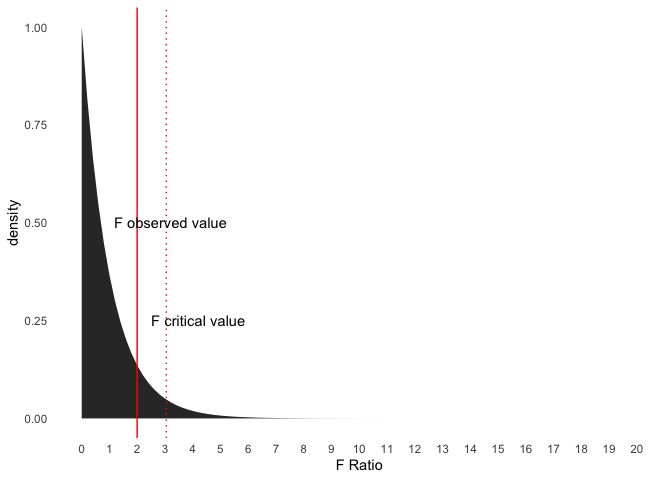
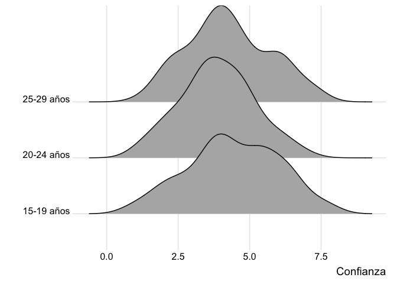

ANOVA: F y p value
================

# Pregunta: consistencia de valores F y p\_value

Buenas tardes profesor!! Espero se encuentre muy bien :) Tal como
hablamos en la clase, con mi grupo tenemos una pregunta en torno al
valor F y el p value. La base de datos que estamos usando para la
entrega es la encuesta INJUV 2012. Para el desarrollo de uno de nuestros
ANOVA , realizamos el cruce entre la variable de múltiples preguntas
`C1_1 - C1_9` (categorizada de la siguiente manera:

``` r
(INJUV$CONFIANZA=with(INJUV,rowMeans(cbind(C1_1,C1_2,C1_3,C1_4,C1_5,C1_6,C1_7,C1_8,C1_9),na.rm = TRUE)) 
```

que responden a la pregunta ¿cuánto confías en cada una de estas
personas? y la variable sociodemográfica de edad, la cual categorizamos
en tres intervalos:

``` r
INJUV$EDAD_EXACTA [INJUV$EDAD_EXACTA >= 15 & INJUV$EDAD_EXACTA <= 19] = 1
INJUV$EDAD_EXACTA [INJUV$EDAD_EXACTA >= 20 & INJUV$EDAD_EXACTA <= 24] = 2
INJUV$EDAD_EXACTA [INJUV$EDAD_EXACTA >= 25 & INJUV$EDAD_EXACTA <= 29] = 3
INJUV$EDAD_EXACTA<-factor(INJUV$EDAD_EXACTA, labels=c("15-19", "20-24", "25-29"))
```

Al aplicar la prueba ANOVA entre estas variables, usando el siguiente
código:

``` r
anova_1 = aov(CONFIANZA ~ (EDAD_EXACTA), data=INJUV)
summary(anova_1)
```

nos arroja el output que le adjunté. En este output se puede ver que el
F es mayor a 1 y que el p value es mayor a 0.05, por lo que ahí está la
contradicción… ¿qué hacemos? ¿cómo podemos explicar que la hipótesis
nula se acepta (tal como indica el p valor) y a la vez el valor F
presenta diferencias que vuelven razonable el rechazo de la hipótesis
nula? Muchísimas gracias por su tiempo! Saludos, Rosario.

# Respuesta

Un F de 2, para una distribución F de 3 grupos, y de 180 casos en total
(i.e. df1 = 2, df2 = 177), es menor al F critico esperado (F = 3.05),
para una prueba con un alpha de .05.

Dependiendo de la cantidad de casos, y de la cantidad de grupos
comparados, cual es el valor de F crítico, para rechazar la hipotesis
nula, y argumentar que hay diferencias entre los grupos respecto a la
variable dependiente o de respuesta.

En este caso, si bien las medias de estos grupos pueden ser nominalmente
diferentes, la diferencia entre estas es muy pequeña, como para que
afirmar que los grupos etarios generados explica las medias de los
puntajes de confianza.

A a continuación, se incluyen los siguientes códigos:

-   códigos que preparan los datos para conducir el ANOVA en cuestión
-   el calculo de la tabla de ANOVA
-   una visualización que compara el F observado, en relacion al F
    critico, en una distribucion de F de 2 y 177 grados de libertad.
-   un plot que compara los puntajes de confianza entre los grupos
    etarios generados
-   un tabla de medias para cada grupo etario

## Preparar datos

``` r
# -----------------------------------------------------------------------------
# abrir dplyr y los datos
# -----------------------------------------------------------------------------

# -----------------------------------------------
# actualizar psi2301
# -----------------------------------------------

# credentials::set_github_pat()
# devtools::install_github("dacarras/psi2301", force = TRUE)

# -----------------------------------------------
# abrir datos
# -----------------------------------------------

library(dplyr)
datos_injuv <- psi2301::injuv_2012

# -----------------------------------------------
# preparar los datos
# -----------------------------------------------

datos_injuv %>%
r4sda::variables_table() %>%
knitr::kable()
```

| variable     | type | values                                                 | labels                    |
|:-------------|:-----|:-------------------------------------------------------|:--------------------------|
| SEXO         | dbl  | 2, 1, 1, 2, 1, 2, 2, 2, 1, 2, 2, 2, 1, 2, 1, 2, 1, 2…  | === no variable label === |
| EDAD\_EXACTA | dbl  | 5, 15, 15, 15, 15, 15, 15, 15, 15, 15, 15, 15, 15, 15… | === no variable label === |
| GSE          | dbl  | 2, 3, 3, 3, 3, 3, 3, 4, 4, 4, 4, 4, 4, 4, 4, 4, 4, 4…  | === no variable label === |
| E9\_1        | dbl  | 4, 3, 5, 5, 5, 2, 4, 5, 4, 5, 5, 4, 2, 5, 2, 5, 5, 4…  | === no variable label === |
| E9\_2        | dbl  | 4, 4, 5, 5, 4, 3, 2, 3, 3, 5, 4, 3, 3, 3, 4, 4, 2, 4…  | === no variable label === |
| E9\_3        | dbl  | 4, 99, 1, 5, 4, 3, 2, 5, 4, 99, 1, 4, 3, 3, 4, 2, 2,…  | === no variable label === |
| E9\_4        | dbl  | 2, 99, 1, 99, 3, 1, 4, 1, 3, 4, 2, 1, 3, 3, 1, 2, 4,…  | === no variable label === |
| E9\_5        | dbl  | 3, 2, 5, 99, 4, 1, 2, 3, 2, 5, 5, 2, 3, 3, 5, 1, 4, …  | === no variable label === |
| F1\_1        | dbl  | 4, 5, 5, 5, 5, 5, 5, 5, 4, 5, 4, 4, 4, 5, 4, 5, 5, 4…  | === no variable label === |
| F1\_2        | dbl  | 4, 3, 5, 5, 5, 4, 4, 5, 3, 5, 4, 3, 4, 5, 4, 3, 4, 4…  | === no variable label === |
| F1\_3        | dbl  | 4, 99, 3, 1, 5, 3, 99, 3, 3, 99, 3, 3, 3, 99, 5, 4, …  | === no variable label === |
| F1\_4        | dbl  | 4, 4, 5, 3, 5, 1, 3, 4, 2, 1, 4, 4, 4, 1, 4, 4, 2, 4…  | === no variable label === |
| F1\_5        | dbl  | 4, 4, 1, 3, 3, 1, 99, 99, 4, 99, 2, 3, 3, 1, 5, 4, 4…  | === no variable label === |
| F1\_6        | dbl  | 4, 3, 3, 99, 2, 3, 4, 4, 4, 99, 3, 5, 3, 99, 5, 4, 4…  | === no variable label === |
| F2\_1        | dbl  | 2, 4, 5, 5, 4, 4, 4, 2, 4, 99, 5, 5, 4, 5, 2, 5, 4, …  | === no variable label === |
| F2\_2        | dbl  | 2, 4, 1, 5, 4, 4, 4, 5, 5, 99, 4, 5, 4, 5, 4, 5, 4, …  | === no variable label === |
| F2\_3        | dbl  | 2, 4, 3, 99, 99, 3, 3, 2, 4, 99, 5, 3, 3, 3, 4, 2, 4…  | === no variable label === |
| F6\_1        | dbl  | , 1, 2, 2, 1, 1, 2, 2, 1, 2, 2, 2, 2, 2, 2, 2, 1, 2, … | === no variable label === |
| F6\_2        | dbl  | , 1, 2, 2, 1, 2, 2, 2, 1, 2, 2, 2, 2, 2, 1, 2, 2, 2, … | === no variable label === |
| F6\_3        | dbl  | , 2, 2, 2, 1, 1, 2, 2, 1, 2, 2, 1, 2, 2, 2, 2, 2, 2, … | === no variable label === |
| I1           | dbl  | 3, 2, 1, 3, 1, 1, 1, 2, 1, 1, 1, 1, 1, 1, 3, 2, 2, 1…  | === no variable label === |
| I10          | dbl  | , 3, 3, 1, 2, 3, 99, 3, 3, 2, 99, 3, 3, 3, 99, 3, 1, … | === no variable label === |
| I11          | dbl  | , 9, 10, 4, 10, 10, 99, 99, 6, 10, 99, 7, 7, 7, 99, 7… | === no variable label === |
| I12          | dbl  | , 2, 7, 6, 7, 4, 99, 99, 4, 5, 99, 10, 8, 5, 99, 5, 6… | === no variable label === |
| I13\_1       | dbl  | , 6, 10, 10, 7, 1, 3, 99, 99, 10, 5, 7, 10, 7, 10, 10… | === no variable label === |
| I13\_2       | dbl  | , 5, 10, 10, 10, 10, 8, 10, 10, 10, 5, 7, 10, 5, 10, … | === no variable label === |
| I13\_3       | dbl  | , 5, 10, 10, 7, 10, 8, 10, 9, 10, 5, 10, 10, 8, 10, 1… | === no variable label === |
| I13\_4       | dbl  | , 3, 10, 1, 1, 99, 1, 99, 1, 2, 99, 7, 1, 2, 1, 5, 7,… | === no variable label === |
| I13\_5       | dbl  | , 3, 10, 10, 10, 7, 9, 99, 10, 99, 10, 6, 9, 6, 10, 7… | === no variable label === |
| I13\_6       | dbl  | , 5, 10, 10, 99, 10, 9, 10, 10, 5, 99, 6, 99, 8, 8, 1… | === no variable label === |
| I13\_7       | dbl  | , 3, 10, 1, 99, 6, 4, 10, 8, 2, 10, 2, 10, 6, 4, 1, 8… | === no variable label === |
| I13\_8       | dbl  | , 9, 10, 10, 10, 10, 10, 10, 10, 10, 10, 10, 10, 8, 1… | === no variable label === |
| C1\_1        | dbl  | 5, 5, 5, 8, 8, 4, 4, 6, 7, 5, 3, 5, 5, 9, 5, 5, 6, 1…  | === no variable label === |
| C1\_2        | dbl  | , 3, 6, 2, 6, 2, 3, 4, 1, 1, 5, 6, 5, 3, 1, 7, 4, 4, … | === no variable label === |
| C1\_3        | dbl  | , 1, 3, 2, 5, 1, 4, 3, 1, 6, 4, 6, 3, 2, 4, 4, 1, 4, … | === no variable label === |
| C1\_4        | dbl  | , 2, 5, 1, 4, 2, 1, 4, 1, 2, 4, 5, 8, 4, 3, 8, 6, 6, … | === no variable label === |
| C1\_5        | dbl  | , 1, 5, 1, 5, 1, 3, 3, 1, 5, 4, 5, 7, 2, 3, 6, 3, 5, … | === no variable label === |
| C1\_6        | dbl  | 1, 6, 4, 5, 5, 5, 5, 7, 3, 8, 10, 6, 5, 10, 9, 5, 8,…  | === no variable label === |
| C1\_7        | dbl  | 2, 7, 6, 5, 5, 6, 5, 2, 4, 8, 6, 5, 5, 5, 8, 4, 8, 1…  | === no variable label === |
| C1\_8        | dbl  | 1, 5, 8, 9, 6, 8, 4, 4, 4, 5, 3, 8, 4, 10, 5, 4, 10,…  | === no variable label === |
| C1\_9        | dbl  | 2, 6, 4, 9, 7, 8, 4, 4, 5, 5, 6, 8, 4, 10, 6, 5, 9, …  | === no variable label === |
| T1           | dbl  | , 3, 2, 4, 5, 3, 5, 4, 5, 5, 99, 3, 5, 5, 4, 5, 4, 4,… | === no variable label === |
| T3\_1        | dbl  | , 5, 2, 5, 3, 4, 4, 3, 99, 5, 3, 4, 4, 3, 5, 99, 4, 5… | === no variable label === |
| T3\_2        | dbl  | , 5, 2, 3, 3, 4, 5, 2, 99, 5, 3, 4, 4, 3, 5, 99, 4, 4… | === no variable label === |
| T3\_3        | dbl  | , 2, 3, 3, 3, 4, 5, 2, 99, 4, 4, 4, 3, 3, 5, 99, 4, 4… | === no variable label === |
| T3\_4        | dbl  | , 5, 2, 4, 99, 5, 5, 2, 99, 5, 5, 4, 4, 3, 4, 99, 2, … | === no variable label === |
| T3\_5        | dbl  | , 5, 4, 4, 5, 1, 3, 5, 4, 5, 5, 3, 4, 1, 5, 99, 4, 4,… | === no variable label === |
| T3\_6        | dbl  | , 5, 4, 3, 3, 2, 2, 5, 99, 5, 5, 3, 2, 4, 5, 99, 4, 4… | === no variable label === |
| T3\_7        | dbl  | , 5, 4, 4, 3, 2, 2, 5, 4, 4, 5, 4, 5, 4, 5, 99, 4, 4,… | === no variable label === |
| Z1           | dbl  | 1, 1, 1, 1, 1, 1, 1, 1, 1, 1, 1, 1, 1, 1, 1, 1, 1, 1…  | === no variable label === |
| Z2           | dbl  | 1, 1, 1, 3, 1, 1, 1, 1, 1, 1, 3, 1, 1, 1, 1, 1, 1, 1…  | === no variable label === |
| Z5           | dbl  | 1, 1, 1, 1, 2, 1, 1, 1, 1, 1, 1, 1, 1, 1, 1, 1, 1, 1…  | === no variable label === |
| Z8           | dbl  | 2, 2, 1, 2, 2, 2, 1, 3, 3, 2, NA, 2, 1, 2, 3, 2, 1, …  | === no variable label === |
| Z10          | dbl  | A, NA, NA, NA, NA, NA, NA, NA, NA, NA, NA, 2, NA, NA,… | === no variable label === |
| Z12\_1       | dbl  | 2, 3, 5, 3, 2, 3, 5, 3, 3, 3, 3, 3, 3, 2, 3, 2, 5, 3…  | === no variable label === |
| Z12\_2       | dbl  | , 4, 4, 99, 4, 4, 4, 99, 4, 3, 99, 4, 3, 99, 2, 3, 99… | === no variable label === |
| Z20\_1       | dbl  | , 5, 99, 5, 5, 5, 2, 5, 4, 5, 4, 4, 5, 4, 4, 4, 4, 4,… | === no variable label === |
| Z20\_2       | dbl  | 5, 4, 5, 5, 4, 4, 3, 4, 5, 4, 2, 5, 4, 4, 5, 4, 4, 4…  | === no variable label === |
| Z20\_3       | dbl  | 2, 1, 4, 3, 3, 2, 2, 4, 4, 4, 2, 4, 2, 4, 1, 4, 4, 1…  | === no variable label === |
| Z20\_4       | dbl  | 4, 5, 5, 5, 4, 3, 4, 4, 5, 4, 4, 5, 4, 4, 3, 4, 1, 4…  | === no variable label === |
| Z20\_5       | dbl  | 4, 4, 5, 5, 4, 4, 4, 2, 5, 3, 2, 5, 2, 4, 4, 4, 2, 1…  | === no variable label === |
| Z20\_6       | dbl  | 5, 5, 5, 4, 5, 4, 4, 4, 5, 4, 4, 5, 4, 4, 4, 4, 1, 4…  | === no variable label === |
| Z20\_7       | dbl  | 4, 1, 5, 1, 5, 3, 2, 1, 1, 3, 1, 1, 1, 3, 2, 1, 1, 1…  | === no variable label === |
| Z20\_8       | dbl  | 2, 1, 1, 5, 3, 1, 1, 1, 1, 1, 1, 1, 1, 1, 1, 4, 1, 1…  | === no variable label === |
| Z20\_9       | dbl  | 2, 3, 1, 1, 2, 1, 2, 5, 4, 1, 2, 5, 1, 1, 2, 3, 1, 1…  | === no variable label === |
| Z20\_10      | dbl  | 4, 1, 1, 5, 1, 1, 2, 2, 2, 1, 1, 1, 1, 1, 1, 2, 1, 4…  | === no variable label === |
| Z20\_11      | dbl  | , 5, 99, 5, 5, 5, 2, 5, 4, 5, 4, 4, 5, 4, 4, 4, 4, 4,… | === no variable label === |
| Z22          | dbl  | 1, 1, 5, 1, 1, 1, NA, 2, 1, NA, 2, 1, 1, NA, 1, 9, 1…  | === no variable label === |
| W3           | dbl  | 2, 3, 2, 3, 3, 2, 3, 2, 3, 3, 3, 3, 3, 3, 3, 2, 3, 2…  | === no variable label === |
| W13          | dbl  | 2, 2, 2, 2, 1, 2, 2, 2, 2, 99, 2, 2, 2, 2, 2, 1, 2, …  | === no variable label === |

``` r
# -----------------------------------------------
# preparar los datos
# -----------------------------------------------

datos_injuv <- datos_injuv %>%
               rename_all(tolower) %>%
               dplyr::glimpse()
```

    ## Rows: 180
    ## Columns: 70
    ## $ sexo        <dbl> 2, 1, 2, 1, 1, 2, 1, 2, 2, 2, 1, 2, 2, 2, 1, 2, 1, 2, 1, 2…
    ## $ edad_exacta <dbl> 15, 15, 15, 15, 15, 15, 15, 15, 15, 15, 15, 15, 15, 15, 15…
    ## $ gse         <dbl> 2, 2, 2, 3, 3, 3, 3, 3, 3, 4, 4, 4, 4, 4, 4, 4, 4, 4, 4, 4…
    ## $ e9_1        <dbl> 4, 4, 4, 3, 5, 5, 5, 2, 4, 5, 4, 5, 5, 4, 2, 5, 2, 5, 5, 4…
    ## $ e9_2        <dbl> 4, 4, 4, 4, 5, 5, 4, 3, 2, 3, 3, 5, 4, 3, 3, 3, 4, 4, 2, 4…
    ## $ e9_3        <dbl> 3, 3, 4, 99, 1, 5, 4, 3, 2, 5, 4, 99, 1, 4, 3, 3, 4, 2, 2,…
    ## $ e9_4        <dbl> 2, 1, 2, 99, 1, 99, 3, 1, 4, 1, 3, 4, 2, 1, 3, 3, 1, 2, 4,…
    ## $ e9_5        <dbl> 4, 3, 3, 2, 5, 99, 4, 1, 2, 3, 2, 5, 5, 2, 3, 3, 5, 1, 4, …
    ## $ f1_1        <dbl> 4, 4, 4, 5, 5, 5, 5, 5, 5, 5, 4, 5, 4, 4, 4, 5, 4, 5, 5, 4…
    ## $ f1_2        <dbl> 3, 3, 4, 3, 5, 5, 5, 4, 4, 5, 3, 5, 4, 3, 4, 5, 4, 3, 4, 4…
    ## $ f1_3        <dbl> 3, 3, 4, 99, 3, 1, 5, 3, 99, 3, 3, 99, 3, 3, 3, 99, 5, 4, …
    ## $ f1_4        <dbl> 4, 3, 4, 4, 5, 3, 5, 1, 3, 4, 2, 1, 4, 4, 4, 1, 4, 4, 2, 4…
    ## $ f1_5        <dbl> 3, 3, 4, 4, 1, 3, 3, 1, 99, 99, 4, 99, 2, 3, 3, 1, 5, 4, 4…
    ## $ f1_6        <dbl> 3, 4, 4, 3, 3, 99, 2, 3, 4, 4, 4, 99, 3, 5, 3, 99, 5, 4, 4…
    ## $ f2_1        <dbl> 4, 3, 2, 4, 5, 5, 4, 4, 4, 2, 4, 99, 5, 5, 4, 5, 2, 5, 4, …
    ## $ f2_2        <dbl> 2, 3, 2, 4, 1, 5, 4, 4, 4, 5, 5, 99, 4, 5, 4, 5, 4, 5, 4, …
    ## $ f2_3        <dbl> 4, 3, 2, 4, 3, 99, 99, 3, 3, 2, 4, 99, 5, 3, 3, 3, 4, 2, 4…
    ## $ f6_1        <dbl> 1, 99, 1, 2, 2, 1, 1, 2, 2, 1, 2, 2, 2, 2, 2, 2, 2, 1, 2, …
    ## $ f6_2        <dbl> 1, 99, 1, 2, 2, 1, 2, 2, 2, 1, 2, 2, 2, 2, 2, 1, 2, 2, 2, …
    ## $ f6_3        <dbl> 1, 99, 2, 2, 2, 1, 1, 2, 2, 1, 2, 2, 1, 2, 2, 2, 2, 2, 2, …
    ## $ i1          <dbl> 2, 1, 3, 2, 1, 3, 1, 1, 1, 2, 1, 1, 1, 1, 1, 1, 3, 2, 2, 1…
    ## $ i10         <dbl> 3, 99, 3, 3, 1, 2, 3, 99, 3, 3, 2, 99, 3, 3, 3, 99, 3, 1, …
    ## $ i11         <dbl> 5, 99, 9, 10, 4, 10, 10, 99, 99, 6, 10, 99, 7, 7, 7, 99, 7…
    ## $ i12         <dbl> 4, 99, 2, 7, 6, 7, 4, 99, 99, 4, 5, 99, 10, 8, 5, 99, 5, 6…
    ## $ i13_1       <dbl> 6, 99, 6, 10, 10, 7, 1, 3, 99, 99, 10, 5, 7, 10, 7, 10, 10…
    ## $ i13_2       <dbl> 8, 99, 5, 10, 10, 10, 10, 8, 10, 10, 10, 5, 7, 10, 5, 10, …
    ## $ i13_3       <dbl> 7, 99, 5, 10, 10, 7, 10, 8, 10, 9, 10, 5, 10, 10, 8, 10, 1…
    ## $ i13_4       <dbl> 3, 99, 3, 10, 1, 1, 99, 1, 99, 1, 2, 99, 7, 1, 2, 1, 5, 7,…
    ## $ i13_5       <dbl> 5, 99, 3, 10, 10, 10, 7, 9, 99, 10, 99, 10, 6, 9, 6, 10, 7…
    ## $ i13_6       <dbl> 7, 99, 5, 10, 10, 99, 10, 9, 10, 10, 5, 99, 6, 99, 8, 8, 1…
    ## $ i13_7       <dbl> 3, 99, 3, 10, 1, 99, 6, 4, 10, 8, 2, 10, 2, 10, 6, 4, 1, 8…
    ## $ i13_8       <dbl> 8, 99, 9, 10, 10, 10, 10, 10, 10, 10, 10, 10, 10, 10, 8, 1…
    ## $ c1_1        <dbl> 4, 4, 5, 5, 5, 8, 8, 4, 4, 6, 7, 5, 3, 5, 5, 9, 5, 5, 6, 1…
    ## $ c1_2        <dbl> 3, 99, 3, 6, 2, 6, 2, 3, 4, 1, 1, 5, 6, 5, 3, 1, 7, 4, 4, …
    ## $ c1_3        <dbl> 3, 99, 1, 3, 2, 5, 1, 4, 3, 1, 6, 4, 6, 3, 2, 4, 4, 1, 4, …
    ## $ c1_4        <dbl> 3, 99, 2, 5, 1, 4, 2, 1, 4, 1, 2, 4, 5, 8, 4, 3, 8, 6, 6, …
    ## $ c1_5        <dbl> 3, 99, 1, 5, 1, 5, 1, 3, 3, 1, 5, 4, 5, 7, 2, 3, 6, 3, 5, …
    ## $ c1_6        <dbl> 5, 5, 1, 6, 4, 5, 5, 5, 5, 7, 3, 8, 10, 6, 5, 10, 9, 5, 8,…
    ## $ c1_7        <dbl> 5, 5, 2, 7, 6, 5, 5, 6, 5, 2, 4, 8, 6, 5, 5, 5, 8, 4, 8, 1…
    ## $ c1_8        <dbl> 5, 4, 1, 5, 8, 9, 6, 8, 4, 4, 4, 5, 3, 8, 4, 10, 5, 4, 10,…
    ## $ c1_9        <dbl> 4, 4, 2, 6, 4, 9, 7, 8, 4, 4, 5, 5, 6, 8, 4, 10, 6, 5, 9, …
    ## $ t1          <dbl> 3, 99, 3, 2, 4, 5, 3, 5, 4, 5, 5, 99, 3, 5, 5, 4, 5, 4, 4,…
    ## $ t3_1        <dbl> 4, 99, 5, 2, 5, 3, 4, 4, 3, 99, 5, 3, 4, 4, 3, 5, 99, 4, 5…
    ## $ t3_2        <dbl> 4, 99, 5, 2, 3, 3, 4, 5, 2, 99, 5, 3, 4, 4, 3, 5, 99, 4, 4…
    ## $ t3_3        <dbl> 3, 99, 2, 3, 3, 3, 4, 5, 2, 99, 4, 4, 4, 3, 3, 5, 99, 4, 4…
    ## $ t3_4        <dbl> 4, 99, 5, 2, 4, 99, 5, 5, 2, 99, 5, 5, 4, 4, 3, 4, 99, 2, …
    ## $ t3_5        <dbl> 4, 99, 5, 4, 4, 5, 1, 3, 5, 4, 5, 5, 3, 4, 1, 5, 99, 4, 4,…
    ## $ t3_6        <dbl> 4, 99, 5, 4, 3, 3, 2, 2, 5, 99, 5, 5, 3, 2, 4, 5, 99, 4, 4…
    ## $ t3_7        <dbl> 4, 99, 5, 4, 4, 3, 2, 2, 5, 4, 4, 5, 4, 5, 4, 5, 99, 4, 4,…
    ## $ z1          <dbl> 1, 1, 1, 1, 1, 1, 1, 1, 1, 1, 1, 1, 1, 1, 1, 1, 1, 1, 1, 1…
    ## $ z2          <dbl> 2, 1, 1, 1, 1, 3, 1, 1, 1, 1, 1, 1, 3, 1, 1, 1, 1, 1, 1, 1…
    ## $ z5          <dbl> 1, 1, 1, 1, 1, 1, 2, 1, 1, 1, 1, 1, 1, 1, 1, 1, 1, 1, 1, 1…
    ## $ z8          <dbl> 3, 2, 2, 2, 1, 2, 2, 2, 1, 3, 3, 2, NA, 2, 1, 2, 3, 2, 1, …
    ## $ z10         <dbl> NA, NA, NA, NA, NA, NA, NA, NA, NA, NA, NA, NA, 2, NA, NA,…
    ## $ z12_1       <dbl> 2, 3, 2, 3, 5, 3, 2, 3, 5, 3, 3, 3, 3, 3, 3, 2, 3, 2, 5, 3…
    ## $ z12_2       <dbl> 99, 4, 4, 4, 99, 4, 4, 4, 99, 4, 3, 99, 4, 3, 99, 2, 3, 99…
    ## $ z20_1       <dbl> 99, 5, 5, 99, 5, 5, 5, 2, 5, 4, 5, 4, 4, 5, 4, 4, 4, 4, 4,…
    ## $ z20_2       <dbl> 4, 4, 5, 4, 5, 5, 4, 4, 3, 4, 5, 4, 2, 5, 4, 4, 5, 4, 4, 4…
    ## $ z20_3       <dbl> 1, 2, 2, 1, 4, 3, 3, 2, 2, 4, 4, 4, 2, 4, 2, 4, 1, 4, 4, 1…
    ## $ z20_4       <dbl> 1, 1, 4, 5, 5, 5, 4, 3, 4, 4, 5, 4, 4, 5, 4, 4, 3, 4, 1, 4…
    ## $ z20_5       <dbl> 2, 5, 4, 4, 5, 5, 4, 4, 4, 2, 5, 3, 2, 5, 2, 4, 4, 4, 2, 1…
    ## $ z20_6       <dbl> 5, 5, 5, 5, 5, 4, 5, 4, 4, 4, 5, 4, 4, 5, 4, 4, 4, 4, 1, 4…
    ## $ z20_7       <dbl> 2, 5, 4, 1, 5, 1, 5, 3, 2, 1, 1, 3, 1, 1, 1, 3, 2, 1, 1, 1…
    ## $ z20_8       <dbl> 1, 1, 2, 1, 1, 5, 3, 1, 1, 1, 1, 1, 1, 1, 1, 1, 1, 4, 1, 1…
    ## $ z20_9       <dbl> 4, 1, 2, 3, 1, 1, 2, 1, 2, 5, 4, 1, 2, 5, 1, 1, 2, 3, 1, 1…
    ## $ z20_10      <dbl> 1, 1, 4, 1, 1, 5, 1, 1, 2, 2, 2, 1, 1, 1, 1, 1, 1, 2, 1, 4…
    ## $ z20_11      <dbl> 99, 5, 5, 99, 5, 5, 5, 2, 5, 4, 5, 4, 4, 5, 4, 4, 4, 4, 4,…
    ## $ z22         <dbl> 1, 1, 1, 1, 5, 1, 1, 1, NA, 2, 1, NA, 2, 1, 1, NA, 1, 9, 1…
    ## $ w3          <dbl> 3, 3, 2, 3, 2, 3, 3, 2, 3, 2, 3, 3, 3, 3, 3, 3, 3, 2, 3, 2…
    ## $ w13         <dbl> 2, 2, 2, 2, 2, 2, 1, 2, 2, 2, 2, 99, 2, 2, 2, 2, 2, 1, 2, …

``` r
# -----------------------------------------------
# descriptivo de frecuencias
# -----------------------------------------------

datos_injuv %>%
  dplyr::select(-edad_exacta) %>%
  r4sda::wide_resp() %>%
  knitr::kable(., digits = 2)
```

| variable |   01 |   02 |   03 |   04 |   05 |   06 |   07 |   08 |   09 |   10 |   12 |   99 |   NA | hist     |
|:---------|-----:|-----:|-----:|-----:|-----:|-----:|-----:|-----:|-----:|-----:|-----:|-----:|-----:|:---------|
| sexo     | 0.45 | 0.55 |      |      |      |      |      |      |      |      |      |      |      | ▆▁▁▁▁▁▁▇ |
| gse      | 0.05 | 0.19 | 0.28 | 0.42 | 0.05 |      |      |      |      |      |      |      |      | ▁▃▁▆▁▇▁▁ |
| e9\_1    | 0.06 | 0.19 | 0.15 | 0.29 | 0.30 |      |      |      |      |      |      | 0.01 |      | ▇▁▁▁▁▁▁▁ |
| e9\_2    | 0.05 | 0.15 | 0.34 | 0.34 | 0.10 |      |      |      |      |      |      | 0.02 |      | ▇▁▁▁▁▁▁▁ |
| e9\_3    | 0.13 | 0.18 | 0.27 | 0.27 | 0.12 |      |      |      |      |      |      | 0.03 |      | ▇▁▁▁▁▁▁▁ |
| e9\_4    | 0.21 | 0.27 | 0.23 | 0.18 | 0.08 |      |      |      |      |      |      | 0.04 |      | ▇▁▁▁▁▁▁▁ |
| e9\_5    | 0.12 | 0.28 | 0.27 | 0.21 | 0.10 |      |      |      |      |      |      | 0.02 |      | ▇▁▁▁▁▁▁▁ |
| f1\_1    | 0.01 | 0.01 | 0.04 | 0.44 | 0.49 |      |      |      |      |      |      | 0.01 |      | ▇▁▁▁▁▁▁▁ |
| f1\_2    | 0.03 | 0.09 | 0.14 | 0.42 | 0.31 |      |      |      |      |      |      | 0.01 |      | ▇▁▁▁▁▁▁▁ |
| f1\_3    | 0.05 | 0.11 | 0.26 | 0.36 | 0.16 |      |      |      |      |      |      | 0.07 |      | ▇▁▁▁▁▁▁▁ |
| f1\_4    | 0.07 | 0.15 | 0.13 | 0.35 | 0.28 |      |      |      |      |      |      | 0.02 |      | ▇▁▁▁▁▁▁▁ |
| f1\_5    | 0.08 | 0.08 | 0.29 | 0.34 | 0.14 |      |      |      |      |      |      | 0.06 |      | ▇▁▁▁▁▁▁▁ |
| f1\_6    | 0.03 | 0.10 | 0.26 | 0.39 | 0.14 |      |      |      |      |      |      | 0.08 |      | ▇▁▁▁▁▁▁▁ |
| f2\_1    | 0.06 | 0.09 | 0.18 | 0.42 | 0.21 |      |      |      |      |      |      | 0.04 |      | ▇▁▁▁▁▁▁▁ |
| f2\_2    | 0.03 | 0.12 | 0.17 | 0.37 | 0.27 |      |      |      |      |      |      | 0.04 |      | ▇▁▁▁▁▁▁▁ |
| f2\_3    | 0.06 | 0.23 | 0.31 | 0.23 | 0.09 |      |      |      |      |      |      | 0.07 |      | ▇▁▁▁▁▁▁▁ |
| f6\_1    | 0.26 | 0.74 |      |      |      |      |      |      |      |      |      | 0.01 |      | ▇▁▁▁▁▁▁▁ |
| f6\_2    | 0.24 | 0.76 |      |      |      |      |      |      |      |      |      | 0.01 |      | ▇▁▁▁▁▁▁▁ |
| f6\_3    | 0.13 | 0.86 |      |      |      |      |      |      |      |      |      | 0.01 |      | ▇▁▁▁▁▁▁▁ |
| i1       | 0.58 | 0.30 | 0.08 | 0.04 |      |      |      |      |      |      |      |      |      | ▇▁▅▁▁▁▁▁ |
| i10      | 0.10 | 0.24 | 0.41 | 0.15 | 0.01 |      |      |      |      |      |      | 0.09 |      | ▇▁▁▁▁▁▁▁ |
| i11      | 0.01 | 0.01 | 0.01 | 0.02 | 0.09 | 0.14 | 0.11 | 0.13 | 0.13 | 0.28 |      | 0.08 |      | ▇▁▁▁▁▁▁▁ |
| i12      | 0.04 | 0.03 | 0.03 | 0.11 | 0.25 | 0.18 | 0.15 | 0.09 | 0.03 | 0.02 |      | 0.08 |      | ▇▁▁▁▁▁▁▁ |
| i13\_1   | 0.03 | 0.01 | 0.02 | 0.03 | 0.11 | 0.07 | 0.11 | 0.12 | 0.09 | 0.36 |      | 0.05 |      | ▇▁▁▁▁▁▁▁ |
| i13\_2   |      |      | 0.01 | 0.02 | 0.07 | 0.07 | 0.05 | 0.13 | 0.11 | 0.51 |      | 0.04 |      | ▇▁▁▁▁▁▁▁ |
| i13\_3   | 0.01 |      | 0.02 | 0.02 | 0.09 | 0.09 | 0.09 | 0.13 | 0.09 | 0.43 |      | 0.03 |      | ▇▁▁▁▁▁▁▁ |
| i13\_4   | 0.33 | 0.08 | 0.09 | 0.05 | 0.07 | 0.08 | 0.08 | 0.06 | 0.02 | 0.07 |      | 0.07 |      | ▇▁▁▁▁▁▁▁ |
| i13\_5   | 0.02 | 0.02 | 0.03 | 0.01 | 0.14 | 0.10 | 0.12 | 0.08 | 0.07 | 0.32 |      | 0.09 |      | ▇▁▁▁▁▁▁▁ |
| i13\_6   | 0.05 |      | 0.02 | 0.03 | 0.13 | 0.11 | 0.07 | 0.11 | 0.12 | 0.33 |      | 0.05 |      | ▇▁▁▁▁▁▁▁ |
| i13\_7   | 0.06 | 0.04 | 0.06 | 0.04 | 0.14 | 0.13 | 0.14 | 0.11 | 0.04 | 0.19 |      | 0.03 |      | ▇▁▁▁▁▁▁▁ |
| i13\_8   |      |      | 0.01 | 0.01 | 0.04 | 0.04 | 0.03 | 0.11 | 0.06 | 0.68 |      | 0.02 |      | ▇▁▁▁▁▁▁▁ |
| c1\_1    | 0.07 | 0.04 | 0.11 | 0.11 | 0.27 | 0.15 | 0.13 | 0.08 | 0.03 | 0.01 |      |      |      | ▃▃▃▇▅▃▂▁ |
| c1\_2    | 0.24 | 0.12 | 0.17 | 0.13 | 0.18 | 0.08 | 0.04 | 0.02 |      | 0.01 |      | 0.02 |      | ▇▁▁▁▁▁▁▁ |
| c1\_3    | 0.36 | 0.14 | 0.14 | 0.12 | 0.11 | 0.08 | 0.02 | 0.01 |      |      |      | 0.01 |      | ▇▁▁▁▁▁▁▁ |
| c1\_4    | 0.28 | 0.11 | 0.09 | 0.15 | 0.16 | 0.11 | 0.02 | 0.05 | 0.01 | 0.01 |      | 0.01 |      | ▇▁▁▁▁▁▁▁ |
| c1\_5    | 0.36 | 0.11 | 0.16 | 0.11 | 0.16 | 0.07 | 0.03 |      |      |      |      | 0.01 |      | ▇▁▁▁▁▁▁▁ |
| c1\_6    | 0.11 | 0.02 | 0.07 | 0.13 | 0.23 | 0.13 | 0.08 | 0.10 | 0.03 | 0.09 |      | 0.01 |      | ▇▁▁▁▁▁▁▁ |
| c1\_7    | 0.13 | 0.07 | 0.09 | 0.09 | 0.23 | 0.15 | 0.07 | 0.08 | 0.04 | 0.04 |      | 0.01 |      | ▇▁▁▁▁▁▁▁ |
| c1\_8    | 0.11 | 0.08 | 0.08 | 0.14 | 0.23 | 0.11 | 0.08 | 0.08 | 0.03 | 0.04 |      | 0.01 |      | ▇▁▁▁▁▁▁▁ |
| c1\_9    | 0.08 | 0.09 | 0.08 | 0.13 | 0.25 | 0.12 | 0.06 | 0.10 | 0.04 | 0.03 |      | 0.01 |      | ▇▁▁▁▁▁▁▁ |
| t1       | 0.06 | 0.08 | 0.11 | 0.20 | 0.36 | 0.13 | 0.04 |      |      |      |      | 0.03 |      | ▇▁▁▁▁▁▁▁ |
| t3\_1    | 0.01 | 0.10 | 0.22 | 0.44 | 0.17 |      |      |      |      |      |      | 0.06 |      | ▇▁▁▁▁▁▁▁ |
| t3\_2    | 0.02 | 0.07 | 0.21 | 0.49 | 0.17 |      |      |      |      |      |      | 0.04 |      | ▇▁▁▁▁▁▁▁ |
| t3\_3    | 0.04 | 0.07 | 0.20 | 0.47 | 0.17 |      |      |      |      |      |      | 0.05 |      | ▇▁▁▁▁▁▁▁ |
| t3\_4    | 0.03 | 0.09 | 0.19 | 0.41 | 0.21 |      |      |      |      |      |      | 0.07 |      | ▇▁▁▁▁▁▁▁ |
| t3\_5    | 0.03 | 0.05 | 0.09 | 0.45 | 0.33 |      |      |      |      |      |      | 0.04 |      | ▇▁▁▁▁▁▁▁ |
| t3\_6    | 0.02 | 0.06 | 0.13 | 0.48 | 0.28 |      |      |      |      |      |      | 0.04 |      | ▇▁▁▁▁▁▁▁ |
| t3\_7    | 0.01 | 0.06 | 0.14 | 0.49 | 0.27 |      |      |      |      |      |      | 0.03 |      | ▇▁▁▁▁▁▁▁ |
| z1       | 0.93 |      |      | 0.02 |      | 0.05 |      |      |      |      |      |      |      | ▇▁▁▁▁▁▁▁ |
| z2       | 0.44 | 0.08 | 0.26 | 0.02 | 0.18 | 0.01 |      |      |      |      |      | 0.02 |      | ▇▁▁▁▁▁▁▁ |
| z5       | 0.81 | 0.17 |      | 0.01 |      |      |      |      |      |      |      | 0.02 |      | ▇▁▁▁▁▁▁▁ |
| z8       | 0.04 | 0.17 | 0.07 | 0.04 | 0.04 | 0.16 | 0.02 |      |      |      |      | 0.02 | 0.44 | ▇▁▁▁▁▁▁▁ |
| z10      | 0.07 | 0.14 | 0.14 |      | 0.02 | 0.01 | 0.01 | 0.02 | 0.02 |      |      | 0.01 | 0.56 | ▇▁▁▁▁▁▁▁ |
| z12\_1   | 0.07 | 0.28 | 0.61 |      | 0.04 |      |      |      |      |      |      | 0.01 |      | ▇▁▁▁▁▁▁▁ |
| z12\_2   | 0.06 | 0.32 | 0.30 | 0.23 |      |      |      |      |      |      |      | 0.09 |      | ▇▁▁▁▁▁▁▁ |
| z20\_1   | 0.11 | 0.07 | 0.04 | 0.22 | 0.47 |      |      |      |      |      |      | 0.08 |      | ▇▁▁▁▁▁▁▁ |
| z20\_2   | 0.21 | 0.11 | 0.07 | 0.27 | 0.32 |      |      |      |      |      |      | 0.03 |      | ▇▁▁▁▁▁▁▁ |
| z20\_3   | 0.23 | 0.20 | 0.09 | 0.23 | 0.22 |      |      |      |      |      |      | 0.03 |      | ▇▁▁▁▁▁▁▁ |
| z20\_4   | 0.21 | 0.09 | 0.13 | 0.18 | 0.37 |      |      |      |      |      |      | 0.02 |      | ▇▁▁▁▁▁▁▁ |
| z20\_5   | 0.23 | 0.11 | 0.14 | 0.24 | 0.26 |      |      |      |      |      |      | 0.02 |      | ▇▁▁▁▁▁▁▁ |
| z20\_6   | 0.17 | 0.07 | 0.07 | 0.23 | 0.44 |      |      |      |      |      |      | 0.02 |      | ▇▁▁▁▁▁▁▁ |
| z20\_7   | 0.49 | 0.17 | 0.12 | 0.11 | 0.08 |      |      |      |      |      |      | 0.03 |      | ▇▁▁▁▁▁▁▁ |
| z20\_8   | 0.67 | 0.16 | 0.07 | 0.07 | 0.01 |      |      |      |      |      |      | 0.02 |      | ▇▁▁▁▁▁▁▁ |
| z20\_9   | 0.44 | 0.15 | 0.09 | 0.13 | 0.17 |      |      |      |      |      |      | 0.02 |      | ▇▁▁▁▁▁▁▁ |
| z20\_10  | 0.63 | 0.18 | 0.05 | 0.09 | 0.02 |      |      |      |      |      |      | 0.02 |      | ▇▁▁▁▁▁▁▁ |
| z20\_11  | 0.11 | 0.07 | 0.04 | 0.22 | 0.47 |      |      |      |      |      |      | 0.08 |      | ▇▁▁▁▁▁▁▁ |
| z22      | 0.45 | 0.12 |      |      | 0.02 |      |      |      | 0.02 |      | 0.02 |      | 0.37 | ▇▁▁▁▁▁▁▁ |
| w3       | 0.37 | 0.38 | 0.24 |      |      |      |      |      |      |      |      | 0.02 |      | ▇▁▁▁▁▁▁▁ |
| w13      | 0.16 | 0.84 |      |      |      |      |      |      |      |      |      | 0.01 |      | ▇▁▁▁▁▁▁▁ |

``` r
# -----------------------------------------------
# descriptivo parar edad
# -----------------------------------------------

datos_injuv %>%
dplyr::select(edad_exacta) %>%
r4sda::get_desc() %>%
knitr::kable(., digits = 2)
```

| var          | missing | complete |   n | mean |  sd | min | p25 | median | p75 | max | skew | kurt | hist     |
|:-------------|--------:|---------:|----:|-----:|----:|----:|----:|-------:|----:|----:|-----:|-----:|:---------|
| edad\_exacta |       0 |        1 | 180 |   21 | 4.2 |  15 |  18 |     21 |  24 |  29 | 0.14 |  1.9 | ▇▆▅▆▃▇▃▅ |

``` r
# Nota: edad no tiene valores perdidos (99).

# -----------------------------------------------
# convertir valores 99 a NA
# -----------------------------------------------

datos_injuv <- datos_injuv %>%
               na_if(99)


# -----------------------------------------------
# revisión de frecuencias
# -----------------------------------------------

datos_injuv %>%
  dplyr::select(-edad_exacta) %>%
  r4sda::wide_resp() %>%
  knitr::kable(., digits = 2)
```

| variable |   01 |   02 |   03 |   04 |   05 |   06 |   07 |   08 |   09 |   10 |   12 |   NA | hist     |
|:---------|-----:|-----:|-----:|-----:|-----:|-----:|-----:|-----:|-----:|-----:|-----:|-----:|:---------|
| sexo     | 0.45 | 0.55 |      |      |      |      |      |      |      |      |      |      | ▆▁▁▁▁▁▁▇ |
| gse      | 0.05 | 0.19 | 0.28 | 0.42 | 0.05 |      |      |      |      |      |      |      | ▁▃▁▆▁▇▁▁ |
| e9\_1    | 0.06 | 0.19 | 0.15 | 0.29 | 0.30 |      |      |      |      |      |      | 0.01 | ▂▅▁▃▁▇▁▇ |
| e9\_2    | 0.05 | 0.15 | 0.34 | 0.34 | 0.10 |      |      |      |      |      |      | 0.02 | ▁▃▁▇▁▇▁▂ |
| e9\_3    | 0.13 | 0.18 | 0.27 | 0.27 | 0.12 |      |      |      |      |      |      | 0.03 | ▃▆▁▇▁▇▁▃ |
| e9\_4    | 0.21 | 0.27 | 0.23 | 0.18 | 0.08 |      |      |      |      |      |      | 0.04 | ▆▇▁▇▁▅▁▂ |
| e9\_5    | 0.12 | 0.28 | 0.27 | 0.21 | 0.10 |      |      |      |      |      |      | 0.02 | ▃▇▁▇▁▆▁▃ |
| f1\_1    | 0.01 | 0.01 | 0.04 | 0.44 | 0.49 |      |      |      |      |      |      | 0.01 | ▁▁▁▁▁▇▁▇ |
| f1\_2    | 0.03 | 0.09 | 0.14 | 0.42 | 0.31 |      |      |      |      |      |      | 0.01 | ▁▂▁▂▁▇▁▆ |
| f1\_3    | 0.05 | 0.11 | 0.26 | 0.36 | 0.16 |      |      |      |      |      |      | 0.07 | ▁▂▁▆▁▇▁▃ |
| f1\_4    | 0.07 | 0.15 | 0.13 | 0.35 | 0.28 |      |      |      |      |      |      | 0.02 | ▂▃▁▃▁▇▁▆ |
| f1\_5    | 0.08 | 0.08 | 0.29 | 0.34 | 0.14 |      |      |      |      |      |      | 0.06 | ▂▂▁▇▁▇▁▃ |
| f1\_6    | 0.03 | 0.10 | 0.26 | 0.39 | 0.14 |      |      |      |      |      |      | 0.08 | ▁▂▁▅▁▇▁▃ |
| f2\_1    | 0.06 | 0.09 | 0.18 | 0.42 | 0.21 |      |      |      |      |      |      | 0.04 | ▁▂▁▃▁▇▁▃ |
| f2\_2    | 0.03 | 0.12 | 0.17 | 0.37 | 0.27 |      |      |      |      |      |      | 0.04 | ▁▂▁▃▁▇▁▆ |
| f2\_3    | 0.06 | 0.23 | 0.31 | 0.23 | 0.09 |      |      |      |      |      |      | 0.07 | ▂▆▁▇▁▆▁▂ |
| f6\_1    | 0.26 | 0.74 |      |      |      |      |      |      |      |      |      | 0.01 | ▃▁▁▁▁▁▁▇ |
| f6\_2    | 0.24 | 0.76 |      |      |      |      |      |      |      |      |      | 0.01 | ▂▁▁▁▁▁▁▇ |
| f6\_3    | 0.13 | 0.86 |      |      |      |      |      |      |      |      |      | 0.01 | ▁▁▁▁▁▁▁▇ |
| i1       | 0.58 | 0.30 | 0.08 | 0.04 |      |      |      |      |      |      |      |      | ▇▁▅▁▁▁▁▁ |
| i10      | 0.10 | 0.24 | 0.41 | 0.15 | 0.01 |      |      |      |      |      |      | 0.09 | ▂▅▁▇▁▃▁▁ |
| i11      | 0.01 | 0.01 | 0.01 | 0.02 | 0.09 | 0.14 | 0.11 | 0.13 | 0.13 | 0.28 |      | 0.08 | ▁▁▁▂▃▂▂▇ |
| i12      | 0.04 | 0.03 | 0.03 | 0.11 | 0.25 | 0.18 | 0.15 | 0.09 | 0.03 | 0.02 |      | 0.08 | ▂▁▃▇▆▅▃▂ |
| i13\_1   | 0.03 | 0.01 | 0.02 | 0.03 | 0.11 | 0.07 | 0.11 | 0.12 | 0.09 | 0.36 |      | 0.05 | ▁▁▁▂▁▂▂▇ |
| i13\_2   |      |      | 0.01 | 0.02 | 0.07 | 0.07 | 0.05 | 0.13 | 0.11 | 0.51 |      | 0.04 | ▁▁▁▁▁▂▂▇ |
| i13\_3   | 0.01 |      | 0.02 | 0.02 | 0.09 | 0.09 | 0.09 | 0.13 | 0.09 | 0.43 |      | 0.03 | ▁▁▁▂▂▂▂▇ |
| i13\_4   | 0.33 | 0.08 | 0.09 | 0.05 | 0.07 | 0.08 | 0.08 | 0.06 | 0.02 | 0.07 |      | 0.07 | ▇▂▁▂▂▂▁▂ |
| i13\_5   | 0.02 | 0.02 | 0.03 | 0.01 | 0.14 | 0.10 | 0.12 | 0.08 | 0.07 | 0.32 |      | 0.09 | ▁▁▁▃▂▂▂▇ |
| i13\_6   | 0.05 |      | 0.02 | 0.03 | 0.13 | 0.11 | 0.07 | 0.11 | 0.12 | 0.33 |      | 0.05 | ▁▁▁▂▂▁▂▇ |
| i13\_7   | 0.06 | 0.04 | 0.06 | 0.04 | 0.14 | 0.13 | 0.14 | 0.11 | 0.04 | 0.19 |      | 0.03 | ▃▂▂▅▅▅▃▇ |
| i13\_8   |      |      | 0.01 | 0.01 | 0.04 | 0.04 | 0.03 | 0.11 | 0.06 | 0.68 |      | 0.02 | ▁▁▁▁▁▁▁▇ |
| c1\_1    | 0.07 | 0.04 | 0.11 | 0.11 | 0.27 | 0.15 | 0.13 | 0.08 | 0.03 | 0.01 |      |      | ▃▃▃▇▅▃▂▁ |
| c1\_2    | 0.24 | 0.12 | 0.17 | 0.13 | 0.18 | 0.08 | 0.04 | 0.02 |      | 0.01 |      | 0.02 | ▇▃▃▃▂▁▁▁ |
| c1\_3    | 0.36 | 0.14 | 0.14 | 0.12 | 0.11 | 0.08 | 0.02 | 0.01 |      |      |      | 0.01 | ▇▃▃▃▂▂▁▁ |
| c1\_4    | 0.28 | 0.11 | 0.09 | 0.15 | 0.16 | 0.11 | 0.02 | 0.05 | 0.01 | 0.01 |      | 0.01 | ▇▂▃▃▂▁▁▁ |
| c1\_5    | 0.36 | 0.11 | 0.16 | 0.11 | 0.16 | 0.07 | 0.03 |      |      |      |      | 0.01 | ▇▂▃▂▁▃▂▁ |
| c1\_6    | 0.11 | 0.02 | 0.07 | 0.13 | 0.23 | 0.13 | 0.08 | 0.10 | 0.03 | 0.09 |      | 0.01 | ▅▂▅▇▅▃▃▅ |
| c1\_7    | 0.13 | 0.07 | 0.09 | 0.09 | 0.23 | 0.15 | 0.07 | 0.08 | 0.04 | 0.04 |      | 0.01 | ▇▃▃▇▅▂▃▂ |
| c1\_8    | 0.11 | 0.08 | 0.08 | 0.14 | 0.23 | 0.11 | 0.08 | 0.08 | 0.03 | 0.04 |      | 0.01 | ▆▃▅▇▃▃▃▂ |
| c1\_9    | 0.08 | 0.09 | 0.08 | 0.13 | 0.25 | 0.12 | 0.06 | 0.10 | 0.04 | 0.03 |      | 0.01 | ▆▂▅▇▃▂▃▂ |
| t1       | 0.06 | 0.08 | 0.11 | 0.20 | 0.36 | 0.13 | 0.04 |      |      |      |      | 0.03 | ▂▂▂▅▁▇▃▁ |
| t3\_1    | 0.01 | 0.10 | 0.22 | 0.44 | 0.17 |      |      |      |      |      |      | 0.06 | ▁▂▁▅▁▇▁▃ |
| t3\_2    | 0.02 | 0.07 | 0.21 | 0.49 | 0.17 |      |      |      |      |      |      | 0.04 | ▁▁▁▃▁▇▁▃ |
| t3\_3    | 0.04 | 0.07 | 0.20 | 0.47 | 0.17 |      |      |      |      |      |      | 0.05 | ▁▁▁▃▁▇▁▃ |
| t3\_4    | 0.03 | 0.09 | 0.19 | 0.41 | 0.21 |      |      |      |      |      |      | 0.07 | ▁▂▁▃▁▇▁▃ |
| t3\_5    | 0.03 | 0.05 | 0.09 | 0.45 | 0.33 |      |      |      |      |      |      | 0.04 | ▁▁▁▂▁▇▁▆ |
| t3\_6    | 0.02 | 0.06 | 0.13 | 0.48 | 0.28 |      |      |      |      |      |      | 0.04 | ▁▁▁▂▁▇▁▅ |
| t3\_7    | 0.01 | 0.06 | 0.14 | 0.49 | 0.27 |      |      |      |      |      |      | 0.03 | ▁▁▁▂▁▇▁▅ |
| z1       | 0.93 |      |      | 0.02 |      | 0.05 |      |      |      |      |      |      | ▇▁▁▁▁▁▁▁ |
| z2       | 0.44 | 0.08 | 0.26 | 0.02 | 0.18 | 0.01 |      |      |      |      |      | 0.02 | ▇▂▁▅▁▁▃▁ |
| z5       | 0.81 | 0.17 |      | 0.01 |      |      |      |      |      |      |      | 0.02 | ▇▁▂▁▁▁▁▁ |
| z8       | 0.04 | 0.17 | 0.07 | 0.04 | 0.04 | 0.16 | 0.02 |      |      |      |      | 0.46 | ▂▇▃▂▁▂▇▁ |
| z10      | 0.07 | 0.14 | 0.14 |      | 0.02 | 0.01 | 0.01 | 0.02 | 0.02 |      |      | 0.57 | ▇▆▁▁▁▁▁▁ |
| z12\_1   | 0.07 | 0.28 | 0.61 |      | 0.04 |      |      |      |      |      |      | 0.01 | ▁▃▁▇▁▁▁▁ |
| z12\_2   | 0.06 | 0.32 | 0.30 | 0.23 |      |      |      |      |      |      |      | 0.09 | ▂▁▇▁▁▇▁▆ |
| z20\_1   | 0.11 | 0.07 | 0.04 | 0.22 | 0.47 |      |      |      |      |      |      | 0.08 | ▂▁▁▁▁▃▁▇ |
| z20\_2   | 0.21 | 0.11 | 0.07 | 0.27 | 0.32 |      |      |      |      |      |      | 0.03 | ▅▂▁▂▁▇▁▇ |
| z20\_3   | 0.23 | 0.20 | 0.09 | 0.23 | 0.22 |      |      |      |      |      |      | 0.03 | ▇▇▁▃▁▇▁▇ |
| z20\_4   | 0.21 | 0.09 | 0.13 | 0.18 | 0.37 |      |      |      |      |      |      | 0.02 | ▅▂▁▃▁▃▁▇ |
| z20\_5   | 0.23 | 0.11 | 0.14 | 0.24 | 0.26 |      |      |      |      |      |      | 0.02 | ▇▃▁▅▁▇▁▇ |
| z20\_6   | 0.17 | 0.07 | 0.07 | 0.23 | 0.44 |      |      |      |      |      |      | 0.02 | ▃▁▁▁▁▅▁▇ |
| z20\_7   | 0.49 | 0.17 | 0.12 | 0.11 | 0.08 |      |      |      |      |      |      | 0.03 | ▇▃▁▂▁▂▁▂ |
| z20\_8   | 0.67 | 0.16 | 0.07 | 0.07 | 0.01 |      |      |      |      |      |      | 0.02 | ▇▂▁▁▁▁▁▁ |
| z20\_9   | 0.44 | 0.15 | 0.09 | 0.13 | 0.17 |      |      |      |      |      |      | 0.02 | ▇▃▁▂▁▂▁▃ |
| z20\_10  | 0.63 | 0.18 | 0.05 | 0.09 | 0.02 |      |      |      |      |      |      | 0.02 | ▇▂▁▁▁▁▁▁ |
| z20\_11  | 0.11 | 0.07 | 0.04 | 0.22 | 0.47 |      |      |      |      |      |      | 0.08 | ▂▁▁▁▁▃▁▇ |
| z22      | 0.45 | 0.12 |      |      | 0.02 |      |      |      | 0.02 |      | 0.02 | 0.37 | ▇▁▁▁▁▁▁▁ |
| w3       | 0.37 | 0.38 | 0.24 |      |      |      |      |      |      |      |      | 0.02 | ▇▁▁▇▁▁▁▅ |
| w13      | 0.16 | 0.84 |      |      |      |      |      |      |      |      |      | 0.01 | ▂▁▁▁▁▁▁▇ |

``` r
# -----------------------------------------------
# crear variables de ejemplo
# -----------------------------------------------

trust_items <- dplyr::select(datos_injuv, c1_1:c1_9)

datos_injuv <- datos_injuv %>%
               # puuntajes promedio de confianza
               mutate(tru = psi2301::mean_score(trust_items)) %>%
               mutate(ager = case_when(
                between(edad_exacta,  0, 19) ~ 1,
                between(edad_exacta, 20, 24) ~ 3,
                between(edad_exacta, 25, 29) ~ 2
                )
               ) %>%
               dplyr::glimpse()
```

    ## Rows: 180
    ## Columns: 72
    ## $ sexo        <dbl> 2, 1, 2, 1, 1, 2, 1, 2, 2, 2, 1, 2, 2, 2, 1, 2, 1, 2, 1, 2…
    ## $ edad_exacta <dbl> 15, 15, 15, 15, 15, 15, 15, 15, 15, 15, 15, 15, 15, 15, 15…
    ## $ gse         <dbl> 2, 2, 2, 3, 3, 3, 3, 3, 3, 4, 4, 4, 4, 4, 4, 4, 4, 4, 4, 4…
    ## $ e9_1        <dbl> 4, 4, 4, 3, 5, 5, 5, 2, 4, 5, 4, 5, 5, 4, 2, 5, 2, 5, 5, 4…
    ## $ e9_2        <dbl> 4, 4, 4, 4, 5, 5, 4, 3, 2, 3, 3, 5, 4, 3, 3, 3, 4, 4, 2, 4…
    ## $ e9_3        <dbl> 3, 3, 4, NA, 1, 5, 4, 3, 2, 5, 4, NA, 1, 4, 3, 3, 4, 2, 2,…
    ## $ e9_4        <dbl> 2, 1, 2, NA, 1, NA, 3, 1, 4, 1, 3, 4, 2, 1, 3, 3, 1, 2, 4,…
    ## $ e9_5        <dbl> 4, 3, 3, 2, 5, NA, 4, 1, 2, 3, 2, 5, 5, 2, 3, 3, 5, 1, 4, …
    ## $ f1_1        <dbl> 4, 4, 4, 5, 5, 5, 5, 5, 5, 5, 4, 5, 4, 4, 4, 5, 4, 5, 5, 4…
    ## $ f1_2        <dbl> 3, 3, 4, 3, 5, 5, 5, 4, 4, 5, 3, 5, 4, 3, 4, 5, 4, 3, 4, 4…
    ## $ f1_3        <dbl> 3, 3, 4, NA, 3, 1, 5, 3, NA, 3, 3, NA, 3, 3, 3, NA, 5, 4, …
    ## $ f1_4        <dbl> 4, 3, 4, 4, 5, 3, 5, 1, 3, 4, 2, 1, 4, 4, 4, 1, 4, 4, 2, 4…
    ## $ f1_5        <dbl> 3, 3, 4, 4, 1, 3, 3, 1, NA, NA, 4, NA, 2, 3, 3, 1, 5, 4, 4…
    ## $ f1_6        <dbl> 3, 4, 4, 3, 3, NA, 2, 3, 4, 4, 4, NA, 3, 5, 3, NA, 5, 4, 4…
    ## $ f2_1        <dbl> 4, 3, 2, 4, 5, 5, 4, 4, 4, 2, 4, NA, 5, 5, 4, 5, 2, 5, 4, …
    ## $ f2_2        <dbl> 2, 3, 2, 4, 1, 5, 4, 4, 4, 5, 5, NA, 4, 5, 4, 5, 4, 5, 4, …
    ## $ f2_3        <dbl> 4, 3, 2, 4, 3, NA, NA, 3, 3, 2, 4, NA, 5, 3, 3, 3, 4, 2, 4…
    ## $ f6_1        <dbl> 1, NA, 1, 2, 2, 1, 1, 2, 2, 1, 2, 2, 2, 2, 2, 2, 2, 1, 2, …
    ## $ f6_2        <dbl> 1, NA, 1, 2, 2, 1, 2, 2, 2, 1, 2, 2, 2, 2, 2, 1, 2, 2, 2, …
    ## $ f6_3        <dbl> 1, NA, 2, 2, 2, 1, 1, 2, 2, 1, 2, 2, 1, 2, 2, 2, 2, 2, 2, …
    ## $ i1          <dbl> 2, 1, 3, 2, 1, 3, 1, 1, 1, 2, 1, 1, 1, 1, 1, 1, 3, 2, 2, 1…
    ## $ i10         <dbl> 3, NA, 3, 3, 1, 2, 3, NA, 3, 3, 2, NA, 3, 3, 3, NA, 3, 1, …
    ## $ i11         <dbl> 5, NA, 9, 10, 4, 10, 10, NA, NA, 6, 10, NA, 7, 7, 7, NA, 7…
    ## $ i12         <dbl> 4, NA, 2, 7, 6, 7, 4, NA, NA, 4, 5, NA, 10, 8, 5, NA, 5, 6…
    ## $ i13_1       <dbl> 6, NA, 6, 10, 10, 7, 1, 3, NA, NA, 10, 5, 7, 10, 7, 10, 10…
    ## $ i13_2       <dbl> 8, NA, 5, 10, 10, 10, 10, 8, 10, 10, 10, 5, 7, 10, 5, 10, …
    ## $ i13_3       <dbl> 7, NA, 5, 10, 10, 7, 10, 8, 10, 9, 10, 5, 10, 10, 8, 10, 1…
    ## $ i13_4       <dbl> 3, NA, 3, 10, 1, 1, NA, 1, NA, 1, 2, NA, 7, 1, 2, 1, 5, 7,…
    ## $ i13_5       <dbl> 5, NA, 3, 10, 10, 10, 7, 9, NA, 10, NA, 10, 6, 9, 6, 10, 7…
    ## $ i13_6       <dbl> 7, NA, 5, 10, 10, NA, 10, 9, 10, 10, 5, NA, 6, NA, 8, 8, 1…
    ## $ i13_7       <dbl> 3, NA, 3, 10, 1, NA, 6, 4, 10, 8, 2, 10, 2, 10, 6, 4, 1, 8…
    ## $ i13_8       <dbl> 8, NA, 9, 10, 10, 10, 10, 10, 10, 10, 10, 10, 10, 10, 8, 1…
    ## $ c1_1        <dbl> 4, 4, 5, 5, 5, 8, 8, 4, 4, 6, 7, 5, 3, 5, 5, 9, 5, 5, 6, 1…
    ## $ c1_2        <dbl> 3, NA, 3, 6, 2, 6, 2, 3, 4, 1, 1, 5, 6, 5, 3, 1, 7, 4, 4, …
    ## $ c1_3        <dbl> 3, NA, 1, 3, 2, 5, 1, 4, 3, 1, 6, 4, 6, 3, 2, 4, 4, 1, 4, …
    ## $ c1_4        <dbl> 3, NA, 2, 5, 1, 4, 2, 1, 4, 1, 2, 4, 5, 8, 4, 3, 8, 6, 6, …
    ## $ c1_5        <dbl> 3, NA, 1, 5, 1, 5, 1, 3, 3, 1, 5, 4, 5, 7, 2, 3, 6, 3, 5, …
    ## $ c1_6        <dbl> 5, 5, 1, 6, 4, 5, 5, 5, 5, 7, 3, 8, 10, 6, 5, 10, 9, 5, 8,…
    ## $ c1_7        <dbl> 5, 5, 2, 7, 6, 5, 5, 6, 5, 2, 4, 8, 6, 5, 5, 5, 8, 4, 8, 1…
    ## $ c1_8        <dbl> 5, 4, 1, 5, 8, 9, 6, 8, 4, 4, 4, 5, 3, 8, 4, 10, 5, 4, 10,…
    ## $ c1_9        <dbl> 4, 4, 2, 6, 4, 9, 7, 8, 4, 4, 5, 5, 6, 8, 4, 10, 6, 5, 9, …
    ## $ t1          <dbl> 3, NA, 3, 2, 4, 5, 3, 5, 4, 5, 5, NA, 3, 5, 5, 4, 5, 4, 4,…
    ## $ t3_1        <dbl> 4, NA, 5, 2, 5, 3, 4, 4, 3, NA, 5, 3, 4, 4, 3, 5, NA, 4, 5…
    ## $ t3_2        <dbl> 4, NA, 5, 2, 3, 3, 4, 5, 2, NA, 5, 3, 4, 4, 3, 5, NA, 4, 4…
    ## $ t3_3        <dbl> 3, NA, 2, 3, 3, 3, 4, 5, 2, NA, 4, 4, 4, 3, 3, 5, NA, 4, 4…
    ## $ t3_4        <dbl> 4, NA, 5, 2, 4, NA, 5, 5, 2, NA, 5, 5, 4, 4, 3, 4, NA, 2, …
    ## $ t3_5        <dbl> 4, NA, 5, 4, 4, 5, 1, 3, 5, 4, 5, 5, 3, 4, 1, 5, NA, 4, 4,…
    ## $ t3_6        <dbl> 4, NA, 5, 4, 3, 3, 2, 2, 5, NA, 5, 5, 3, 2, 4, 5, NA, 4, 4…
    ## $ t3_7        <dbl> 4, NA, 5, 4, 4, 3, 2, 2, 5, 4, 4, 5, 4, 5, 4, 5, NA, 4, 4,…
    ## $ z1          <dbl> 1, 1, 1, 1, 1, 1, 1, 1, 1, 1, 1, 1, 1, 1, 1, 1, 1, 1, 1, 1…
    ## $ z2          <dbl> 2, 1, 1, 1, 1, 3, 1, 1, 1, 1, 1, 1, 3, 1, 1, 1, 1, 1, 1, 1…
    ## $ z5          <dbl> 1, 1, 1, 1, 1, 1, 2, 1, 1, 1, 1, 1, 1, 1, 1, 1, 1, 1, 1, 1…
    ## $ z8          <dbl> 3, 2, 2, 2, 1, 2, 2, 2, 1, 3, 3, 2, NA, 2, 1, 2, 3, 2, 1, …
    ## $ z10         <dbl> NA, NA, NA, NA, NA, NA, NA, NA, NA, NA, NA, NA, 2, NA, NA,…
    ## $ z12_1       <dbl> 2, 3, 2, 3, 5, 3, 2, 3, 5, 3, 3, 3, 3, 3, 3, 2, 3, 2, 5, 3…
    ## $ z12_2       <dbl> NA, 4, 4, 4, NA, 4, 4, 4, NA, 4, 3, NA, 4, 3, NA, 2, 3, NA…
    ## $ z20_1       <dbl> NA, 5, 5, NA, 5, 5, 5, 2, 5, 4, 5, 4, 4, 5, 4, 4, 4, 4, 4,…
    ## $ z20_2       <dbl> 4, 4, 5, 4, 5, 5, 4, 4, 3, 4, 5, 4, 2, 5, 4, 4, 5, 4, 4, 4…
    ## $ z20_3       <dbl> 1, 2, 2, 1, 4, 3, 3, 2, 2, 4, 4, 4, 2, 4, 2, 4, 1, 4, 4, 1…
    ## $ z20_4       <dbl> 1, 1, 4, 5, 5, 5, 4, 3, 4, 4, 5, 4, 4, 5, 4, 4, 3, 4, 1, 4…
    ## $ z20_5       <dbl> 2, 5, 4, 4, 5, 5, 4, 4, 4, 2, 5, 3, 2, 5, 2, 4, 4, 4, 2, 1…
    ## $ z20_6       <dbl> 5, 5, 5, 5, 5, 4, 5, 4, 4, 4, 5, 4, 4, 5, 4, 4, 4, 4, 1, 4…
    ## $ z20_7       <dbl> 2, 5, 4, 1, 5, 1, 5, 3, 2, 1, 1, 3, 1, 1, 1, 3, 2, 1, 1, 1…
    ## $ z20_8       <dbl> 1, 1, 2, 1, 1, 5, 3, 1, 1, 1, 1, 1, 1, 1, 1, 1, 1, 4, 1, 1…
    ## $ z20_9       <dbl> 4, 1, 2, 3, 1, 1, 2, 1, 2, 5, 4, 1, 2, 5, 1, 1, 2, 3, 1, 1…
    ## $ z20_10      <dbl> 1, 1, 4, 1, 1, 5, 1, 1, 2, 2, 2, 1, 1, 1, 1, 1, 1, 2, 1, 4…
    ## $ z20_11      <dbl> NA, 5, 5, NA, 5, 5, 5, 2, 5, 4, 5, 4, 4, 5, 4, 4, 4, 4, 4,…
    ## $ z22         <dbl> 1, 1, 1, 1, 5, 1, 1, 1, NA, 2, 1, NA, 2, 1, 1, NA, 1, 9, 1…
    ## $ w3          <dbl> 3, 3, 2, 3, 2, 3, 3, 2, 3, 2, 3, 3, 3, 3, 3, 3, 3, 2, 3, 2…
    ## $ w13         <dbl> 2, 2, 2, 2, 2, 2, 1, 2, 2, 2, 2, NA, 2, 2, 2, 2, 2, 1, 2, …
    ## $ tru         <dbl> 3.9, 4.4, 2.0, 5.3, 3.7, 6.2, 4.1, 4.7, 4.0, 3.0, 4.1, 5.3…
    ## $ ager        <dbl> 1, 1, 1, 1, 1, 1, 1, 1, 1, 1, 1, 1, 1, 1, 1, 1, 1, 1, 1, 1…

# ANOVA

## Generar ANOVA

``` r
# -----------------------------------------------------------------------------
# abrir dplyr y los datos
# -----------------------------------------------------------------------------

# -----------------------------------------------
# listado de putajes generados
# -----------------------------------------------

anova_trust <- aov(tru ~ as.factor(ager), data= datos_injuv)
summary(anova_trust)
```

    ##                  Df Sum Sq Mean Sq F value Pr(>F)
    ## as.factor(ager)   2      9    4.31       2   0.14
    ## Residuals       177    382    2.16

## Visualización de p value

``` r
# -----------------------------------------------------------------------------
# visualization of p value
# -----------------------------------------------------------------------------

# -----------------------------------------------
# retrieve observed f value
# -----------------------------------------------


f_value <- aov(tru ~ as.factor(ager), data= datos_injuv) %>%
           broom::tidy() %>%
           dplyr::filter(term != 'Residuals') %>%
           dplyr::select(statistic) %>%
           pull() %>%
           as.numeric()

# -----------------------------------------------
# compute p value
# -----------------------------------------------

pf(f_value, df1 = 2, df2 = 177, lower.tail = FALSE) %>%
r4sda::decimal(., 2)
```

    ## [1] "0.14"

``` r
# -----------------------------------------------
# retrieve f critical value for alpha .05
# -----------------------------------------------

f_critic <- qf(.95, df1 = 2, df2 = 177)
f_critic
```

    ## [1] 3

``` r
# -----------------------------------------------
# plot observed and expected F value
# -----------------------------------------------

library(ggplot2)
ggplot(data.frame(x = c(0, 20)), aes(x)) +
  stat_function(fun = df, args = list(df1 = 2, df2 = 177), geom = "area") +
  geom_vline(xintercept = f_value, color = 'red') +
  geom_vline(xintercept = f_critic, color = 'red', linetype = 'dotted') +
  scale_x_continuous(breaks=seq(0, 20, 1)) + 
  # xlim(0,10) +
  ylim(0,1) +
  labs(
    x = 'F Ratio', 
    y = 'density') +
  theme_minimal() +
  theme(
  panel.background = element_blank(),
  panel.grid.minor = element_blank(),
  panel.grid.major = element_blank()
  ) +
  annotate("text", x = 4.2, y = .25, label = "F critical value") +
  annotate("text", x = 3.2, y = .50, label = "F observed value")
```

<!-- -->

## Visualización de histogramas para los puntajes de confianza

``` r
# -----------------------------------------------------------------------------
# visualization of trust score distribution by group
# -----------------------------------------------------------------------------

# -----------------------------------------------
# plot trust scores
# -----------------------------------------------

library(ggplot2)
library(ggridges)

datos_injuv %>%
mutate(age_group = case_when(
  ager == 1 ~ '15-19 años',
  ager == 2 ~ '20-24 años',
  ager == 3 ~ '25-29 años'
  )) %>%
ggplot(., aes(x = tru, y = age_group, group = age_group)) + 
  geom_density_ridges() +
   theme_ridges() +
   ylab('') +
   xlab('Confianza')
```

    ## Picking joint bandwidth of 0.536

<!-- -->

## Tabla de medias de puntajes de confianza

``` r
# -----------------------------------------------------------------------------
# descriptives by grup
# -----------------------------------------------------------------------------

# -----------------------------------------------
# mean table
# -----------------------------------------------

datos_injuv %>%
mutate(age_group = case_when(
  ager == 1 ~ '15-19 años',
  ager == 2 ~ '20-24 años',
  ager == 3 ~ '25-29 años'
  )) %>%
group_by(age_group) %>%
summarize(
  mean = mean(tru, na.rm = TRUE),
  n = n()) %>%
  knitr::kable(., digits = 2)
```

| age\_group | mean |   n |
|:-----------|-----:|----:|
| 15-19 años |  4.4 |  70 |
| 20-24 años |  3.9 |  41 |
| 25-29 años |  4.3 |  69 |
