Ayudantía 2
================

# Ejercicios Ayudantía 1:

A continuación, se incluye los códigos de ejercicios empleados en la
ayudantía anterior.

``` r
# ---------------------------------------------------------
# ejercicio 1
# ---------------------------------------------------------

# excelente instancia para recordar que no es buena idea usar mayúsculas
# u otros nombres complejos

carlos <- 56
camila <- 54
fernanda <- 62
roberto <- 52
jacinta <- 60

# podemos ocupar códigos como a1, a2. Pero es importante que tengan
# algo para acordarse de quién es quien

# ---------------------------------------------------------
# ejercicio 2
# ---------------------------------------------------------

# para esto requiero utilizar la función c()

c("carlos", "camila", "fernanda", "roberto", "jacinta")
```

    ## [1] "carlos"   "camila"   "fernanda" "roberto"  "jacinta"

``` r
# esto genera un vector que contiene todos los valores pero
# falta la asignación de valores


est <- c("carlos", "camila", "fernanda", "roberto", "jacinta")

# ---------------------------------------------------------
# ejercicio 3
# ---------------------------------------------------------

notas <- c("56", "54", "62", "52", "60")

# ---------------------------------------------------------
# ejercicio 4
# ---------------------------------------------------------

# ¿Cómo podemos integrar ambos valores?
# En lo que determinamos como una base de datos
# donde cada fila corresponderá a una persona 
# y cada columna será una característica

psi <- cbind(est, notas)
psi
```

    ##      est        notas
    ## [1,] "carlos"   "56" 
    ## [2,] "camila"   "54" 
    ## [3,] "fernanda" "62" 
    ## [4,] "roberto"  "52" 
    ## [5,] "jacinta"  "60"

# Ayudantía 2: Introducción a estadística descriptiva

En la ayudantía anterior tuvimos nuestro primer acercamiento a R. Antes
de comenzar asegurate de tener los siguientes pasos listos:

1.  instalación de programa `R` y `Rstudio`
2.  instalación de librerías `tidyverse`, `remotes` y `psi2301`
3.  carpeta del curso para guardar tus archivos

Hoy en la ayudantía comenzaremos a ver Estadística Descriptiva. Para
aquello revisaremos y ejercitaremos la presentación de tablas y gráfica
de datos. Además, consideraremos contenidos relacionados a la teoría de
las escalas de medición de S.S. Stevens y los tipos de variables y
escalas de medición que se desprenden de dicha teoría.

A continuación, comenzaremos una serie de pasos que empezarás a
automatizar con el tiempo.

# Crear un documento

Luego de abrir nuestro software lo primero es crear un nuevo documento.
Para lograr esto, recuerda los pasos vistos en la ayudantía 1.

> Nota: “En la parte superior haremos click en la hoja y seleccionaremos
> el archivo en formato R Markdown”

# Formato R-Markdown

Tal cómo lo mencionamos en la ayudantía anterior, el formato R-Markdown
es un formato que permite integrar texto plano en formato markdown (para
ver más información del formato has click
[aquí](https://www.markdownguide.org/cheat-sheet/)) en conjunto con
espacios de codificación de código. En la secciones de texto plano a
través de la sintaxis de markdown podemos organizar nuestro texto de
manera sencilla (por ejemplo si deseamos colocar un título anteponemos
el signo `#`). La secciones de código se pueden generar a través de lo
que se denomina *chunk*. Este es una porción que permitirá utilizar R
dentro del archivo.

Los *chunks* pueden ser generados a través de comando (`control+alt+I`
en el caso de Windows y `Cmd+Option+I` en el caso de MacOS) o
directamente en la esquina superior en la barra de tareas del editor.

Esta estructura es la que estaremos utilizando durante todo el semestre.

# Instalación de librerías

Las librerías ya fueron instaladas en la ayudantía 1, y estos se
necesitan instalar sólo una vez (a menos que salgan actualizaciones).
Sin embargo, cada vez que sea necesario hacer uso de una librería, esta
debe ser “llamada” o “cargada” para emplear sus funciones en la sesión
de trabajo.

Por otro lado, la librería del curso, requiere ser “actualizada” sesión
a sesión, ya que constantemente estamos actualizando el contenido de
esta librería, para incluir más bases de datos para los diferentes
clases y ayudantías.

> Nota: Instalar y cargar las librerías es un paso muy importante. Si
> una librería no está cargada en la sesión, no es posible hacer uso de
> sus funciones, objetos y datos.

``` r
# ---------------------------------------------------------
# bajar libreria del curso
# ---------------------------------------------------------

# remotes::install_github('dacarras/psi2301', force = TRUE)
# el especificación force = TRUE asegura 
# que la librería vuelva se descargada y se actualice

# ---------------------------------------------------------
# instalar libraries para esta ayudantía
# ---------------------------------------------------------

# librerias para generar descriptivos de forma rápida
# install.packages('psych')
# install.packages('skimr')
# remotes::install_github('dacarras/r4sda')


# librería para generar plots de mosaico
# install.packages('ggmosaic')
```

# Cargar datos

Con cargar datos, nos referimos a la acción de poder abrir datos en un
sesión de R. En otros textos, esta acción puede ser descrita como:

-   abrir datos
-   importar datos
-   cargar datos
-   leer datos

En termimos generales, todas estas acciones refieren a la idea de que
los datos que queremos analizar constituyan un objeto tabla que podamos
manipular dentro de un paquete estadístico u otro software que nos
permita realizar calculos.

En diferentes ejemplos de ayudantía, cargaremos los datos desde la
libería del curso: `library(psi2301)`. No obstante, esta no es la única
manera de cargar datos en una sesión. También es posible leer datos
desde archivos Excel, CSV, TXT, entre otros formatos. De la misma
manera, es posible leer datos que provienen de otros paquetes
estadísticos como SAS, STATA y SPSS. Asi mismo, es posible guardar datos
en diferentes formatos (e.g., txt, csv, xlsx, sav, dta).

En terminos generales, todas las operaciones de lectura de archivos
siguen la siguiente forma:


    [nombre_del_objecto] <- libreria::funcion_de_lectura('[nombre_del_archivo]')

Un ejemplo de la operación anterior puede ser la siguiente. -
`iccs_data <- haven::read_sav('ICCS_MERGE.sav`).

En el ejemplo anterior, estamos empleando la libreria `haven`, y su
función `read_sav`, para abrir datos en formato SPSS en R.

## Abrir datos de una librería

A continuación cargaremos la librería del curso y la base de datos
llamada `dem_16`. Para ésto, se requiere que se encuentre instalada la
librería `psi2301`. Para cargar los datos de la librería del curso,
emplearemos la función `data()`. Con esta función, llamaremos a los
datos `dem_16`, de la sigiuente manera: `data(dem_16)`.

Una vez ejecutado el *chunk* en el “ambiente” o “environment” debe
aparecer el nombre de la base de datos, el numero total de observaciones
y cantidad de variables.

``` r
#------------------------------------------------------------------------------
# abrir datos
#------------------------------------------------------------------------------

# ---------------------------------------------------------
# cargar libreria del curso
# ---------------------------------------------------------

library(psi2301)

# ---------------------------------------------------------
# cargar datos
# ---------------------------------------------------------

data(dem_16)

# ---------------------------------------------------------
# ver objeto
# ---------------------------------------------------------

dem_16
```

    ##       id_i               ctry sex   age dem  dem_group   aut    civ   ses edu
    ## 1     8093              Chile   1 13.50   2    complex 42.55 514.89 -0.19   0
    ## 2     9243              Chile   0 13.83   3    limited 57.94 334.68 -0.56   0
    ## 3     7484              Chile   0 14.17   3    limited 17.67 527.46 -0.23   0
    ## 4     7187              Chile   0 14.50   2    complex 17.67 612.81 -0.81   0
    ## 5     9208              Chile   1 13.42   1 minimalist 38.07 479.65 -0.17   0
    ## 6     6863              Chile   1 13.33   2    complex 47.94 556.01  1.08   1
    ## 7     8736              Chile   0 13.92   3    limited 59.24 548.08 -1.03   0
    ## 8     9067              Chile   1 13.42   2    complex 51.06 391.79 -0.54   0
    ## 9     9691              Chile   0 14.25   3    limited 27.06 530.32  0.01   0
    ## 10    7096              Chile   1 14.25   1 minimalist 49.54 481.76  0.50   0
    ## 11    8552              Chile   0 13.92   1 minimalist 55.30 424.80 -0.11   0
    ## 12    8273              Chile   1 13.83   1 minimalist 40.44 340.27 -0.46   0
    ## 13    6745              Chile   0 14.25   1 minimalist 59.24 268.90 -0.80   0
    ## 14    7433              Chile   0 13.83   2    complex 42.55 517.04  0.66   1
    ## 15    6210              Chile   1 13.58   3    limited 44.48 467.67 -0.20   0
    ## 16    8166              Chile   0 14.00   2    complex 38.07 538.94  0.94   1
    ## 17    6231              Chile   0 13.83   1 minimalist 17.67 522.42  1.08   1
    ## 18    7630              Chile   1 14.08   2    complex 35.30 609.69 -0.50   0
    ## 19    6355              Chile   1 13.42   2    complex 47.94 548.19 -0.74   0
    ## 20    6181              Chile   1 13.92   2    complex 35.30 608.55  2.49   1
    ## 21    6766              Chile   0 14.00   3    limited 17.67 439.43  2.13   1
    ## 22    8750              Chile   0 14.67   1 minimalist 52.52 463.54 -0.88   0
    ## 23   10668              Chile   0 13.67   3    limited 42.55 531.62  0.83   1
    ## 24   10623              Chile   0 15.42   1 minimalist 35.30 396.08 -0.87   0
    ## 25    9775              Chile   1 14.25   2    complex 35.30 504.49 -0.61   0
    ## 26    6223              Chile   1 13.33   3    limited 59.24 495.21  0.61   1
    ## 27   10028              Chile   0 13.50   1 minimalist 70.18 376.07 -1.29   0
    ## 28    7384              Chile   1 14.25   2    complex 35.30 568.43  0.34   0
    ## 29    7060              Chile   1 14.08   1 minimalist 49.54 492.53 -0.24   0
    ## 30    8910              Chile   1 14.75   1 minimalist 44.48 487.01 -1.12   0
    ## 31    7883              Chile   0 16.58   1 minimalist 52.52 498.39  0.36   0
    ## 32    7444              Chile   0 13.92   1 minimalist 44.48 559.90  2.03   0
    ## 33    9305              Chile   1 13.50   2    complex 84.74 521.65  0.78   0
    ## 34    8812              Chile   1 13.83   1 minimalist 35.30 574.73  1.97   1
    ## 35    6645              Chile   1 14.08   3    limited 46.26 535.52  0.95   0
    ## 36    6441              Chile   1 13.75   1 minimalist 53.93 415.39 -0.57   0
    ## 37    7010              Chile   1 13.67   2    complex 17.67 548.03  1.97   1
    ## 38    6550              Chile   0 13.83   1 minimalist 40.44 560.16 -0.17   0
    ## 39    7299              Chile   1 14.08   3    limited 55.30 399.44 -0.37   0
    ## 40    8958              Chile   1 15.67   3    limited 43.51 494.15  0.88   1
    ## 41    9921              Chile   1 14.33   1 minimalist 44.48 581.47 -0.64   0
    ## 42    9414              Chile   1 14.00   1 minimalist 40.44 651.40  1.99   1
    ## 43    9028              Chile   1 14.08   1 minimalist 38.07 525.20 -0.40   0
    ## 44    6919              Chile   1 14.17   1 minimalist 17.67 643.39  2.13   1
    ## 45    7522              Chile   1 16.83   1 minimalist 44.48 520.63 -1.04   0
    ## 46    8756              Chile   1 13.42   3    limited 52.52 517.53 -0.42   0
    ## 47    7217              Chile   0 13.67   3    limited 38.07 416.61  0.72   1
    ## 48    9457              Chile   0 14.17   3    limited 61.87 367.63 -0.90   0
    ## 49    7211              Chile   0 14.00   3    limited 32.73 435.67 -1.76   0
    ## 50    5972              Chile   1 14.17   2    complex 31.87 507.24 -0.70   0
    ## 51   10678              Chile   0 14.17   2    complex 31.87 645.72  1.58   1
    ## 52    9563              Chile   1 13.58   1 minimalist 52.03 462.39 -0.89   0
    ## 53    8624              Chile   0 16.50   3    limited 85.37 304.15 -1.16   0
    ## 54    9374              Chile   1 13.83   2    complex 35.30 590.75 -0.07   0
    ## 55    6757              Chile   0 14.25   1 minimalist 52.52 323.86 -1.36   0
    ## 56    7160              Chile   1 14.00   2    complex 31.87 495.03 -1.04   0
    ## 57    9667              Chile   0 14.67   2    complex 46.26 589.80 -0.27   0
    ## 58    8840              Chile   1 15.25   1 minimalist 55.30 426.78 -0.67   0
    ## 59    8662              Chile   0 13.75   2    complex 17.67 513.15  1.09   0
    ## 60    9174              Chile   0 14.33   3    limited 59.24 357.95 -0.51   0
    ## 61    7887              Chile   0 15.17   2    complex 42.55 486.99 -1.15   0
    ## 62    7523              Chile   1 15.25   1 minimalist 38.07 532.98 -0.51   0
    ## 63    9267              Chile   1 13.67   2    complex 31.87 596.97  1.83   1
    ## 64    8255              Chile   1 14.00   2    complex 40.44 487.17 -0.03   0
    ## 65   10387              Chile   0 14.58   2    complex 31.87 604.37  1.99   1
    ## 66   10357              Chile   0 13.58   1 minimalist 52.52 523.67  0.45   1
    ## 67    6260              Chile   0 15.25   1 minimalist    NA 561.47  1.05   1
    ## 68    8278              Chile   1 14.25   2    complex 42.55 552.98  1.99   1
    ## 69   10537              Chile   1 14.33   2    complex 46.26 487.70 -1.09   0
    ## 70    6283              Chile   1 14.25   1 minimalist 47.94 496.10  1.03   0
    ## 71   10701              Chile   0 15.33   1 minimalist 63.24 340.08 -1.58   0
    ## 72    9081              Chile   0 13.42   1 minimalist 59.24 390.92 -0.43   0
    ## 73    6490              Chile   1 14.75   2    complex 38.07 470.95 -1.61   0
    ## 74    9525              Chile   0 14.00   1 minimalist 59.22 353.40  0.06   0
    ## 75    7197              Chile   1 15.92   1 minimalist    NA 427.52    NA  NA
    ## 76    7285              Chile   1 14.00   3    limited 47.94 516.72 -0.12   0
    ## 77    8581              Chile   1 14.25   2    complex 36.02 571.04  1.52   1
    ## 78    6625              Chile   0 14.42   3    limited 47.94 450.66  0.76   0
    ## 79   10146              Chile   0 14.25   1 minimalist 17.67 506.91 -0.87   0
    ## 80    8264              Chile   1 14.00   1 minimalist 61.87 282.22 -0.13   0
    ## 81    6996              Chile   1 14.17   2    complex 27.06 507.78  1.52   1
    ## 82    8996              Chile   1 14.00   1 minimalist 35.30 450.37  1.47   1
    ## 83   10196              Chile   1 13.58   2    complex 46.26 416.41 -0.04   0
    ## 84    6906              Chile   1 13.83   3    limited 47.55 445.89  1.63   1
    ## 85    7916              Chile   0 14.83   1 minimalist 60.54 313.23 -1.25   0
    ## 86    7758              Chile   1 14.25   1 minimalist 31.87 451.50 -1.08   0
    ## 87    9570              Chile   0 13.83   3    limited 46.26 393.35 -0.88   0
    ## 88    7147              Chile   1 13.83   1 minimalist 51.06 414.60 -0.23   0
    ## 89    9588              Chile   1 14.17   3    limited 46.35 438.05 -1.75   0
    ## 90    8866              Chile   1 14.25   1 minimalist 53.93 287.85  0.54   0
    ## 91    9020              Chile   1 14.92   1 minimalist 61.87 448.38 -0.44   0
    ## 92   10329              Chile   1 14.75   1 minimalist 51.06 359.03    NA   0
    ## 93    8836              Chile   1 14.25   1 minimalist 49.54 519.59 -1.50   0
    ## 94   10517              Chile   0 14.67   1 minimalist 42.55 538.31  1.46   1
    ## 95    7608              Chile   0 16.92   3    limited 49.54 481.30 -1.18   0
    ## 96    9000              Chile   1 13.92   2    complex 38.07 571.20 -0.60   0
    ## 97    8107              Chile   1 14.17   2    complex 42.55 558.05  1.61   1
    ## 98    8620              Chile   1 14.08   2    complex 40.44 578.56  1.39   1
    ## 99   10549              Chile   1 14.25   1 minimalist 44.48 465.62 -1.30   0
    ## 100   7641              Chile   1 14.67   1 minimalist 17.67 378.44 -0.39   0
    ## 101   8049              Chile   1 14.67   1 minimalist 40.64 404.92 -1.19   0
    ## 102   7291              Chile   1 14.58   2    complex 45.54 400.07  1.07   1
    ## 103   7652              Chile   1 13.75   1 minimalist 35.30 447.56  1.01   0
    ## 104   7286              Chile   0 16.17   3    limited 55.30 360.94 -0.30   0
    ## 105   9965              Chile   1 14.42   1 minimalist 53.83 540.35  0.39   1
    ## 106   6558              Chile   0 14.50   3    limited 59.24 413.54    NA  NA
    ## 107  10430              Chile   0 13.92   3    limited 49.54 477.72  0.69   1
    ## 108   8395              Chile   0 15.58   3    limited 46.26 316.78  0.07   0
    ## 109   9725              Chile   1 14.08   3    limited 40.44 554.11 -0.90   0
    ## 110   9357              Chile   0 14.92   3    limited 56.63 433.53 -0.23   0
    ## 111   8141              Chile   0 14.08   2    complex 17.67 587.99  1.16   1
    ## 112   6232              Chile   0 15.33   2    complex 17.67 468.88  1.14   1
    ## 113   8259              Chile   1 13.50   3    limited 60.54 296.07 -0.24   0
    ## 114   9467              Chile   0 13.83   1 minimalist 51.06 360.77 -0.95   0
    ## 115   7860              Chile   1 13.50   1 minimalist 49.54 538.98 -0.94   0
    ## 116   6533              Chile   0 15.17   1 minimalist 52.52 486.72 -0.38   0
    ## 117   7729              Chile   1 14.17   2    complex 35.30 634.06  1.83   1
    ## 118   6171              Chile   1 14.25   2    complex 27.06 533.77 -0.51   0
    ## 119  10181              Chile   0 14.08   1 minimalist 57.94 243.81  1.25   1
    ## 120   8751              Chile   0 14.17   3    limited 51.06 466.30 -1.41   0
    ## 121   7717              Chile   1 14.75   1 minimalist 46.26 403.96 -1.62   0
    ## 122   9011              Chile   1 13.58   3    limited 61.87 359.38 -0.76   0
    ## 123  10594              Chile   0 14.08   2    complex 46.26 431.80  0.66   1
    ## 124  10694              Chile   0 14.00   1 minimalist 49.54 389.86 -0.55   0
    ## 125  10630              Chile   1 14.00   2    complex 47.94 451.55 -0.23   0
    ## 126   9590              Chile   0 13.67   3    limited 53.93 412.16 -1.80   0
    ## 127   9110              Chile   1 14.00   2    complex 40.44 525.03  0.23   0
    ## 128   9294              Chile   1 16.00   2    complex 31.87 592.69 -0.56   0
    ## 129   9131              Chile   1 14.08   1 minimalist 44.48 453.53  1.52   1
    ## 130   6945              Chile   1 13.58   1 minimalist 49.54 487.64  0.85   1
    ## 131  10341              Chile   1 14.00   2    complex 44.48 466.51 -1.36   0
    ## 132   6076              Chile   0 13.33   3    limited 27.06 262.69  0.48   0
    ## 133  10128              Chile   0 14.17   2    complex 35.30 523.01  0.14   0
    ## 134  10407              Chile   0 13.33   3    limited 55.30 361.52 -0.87   0
    ## 135   9105              Chile   1 13.67   2    complex 49.54 490.75 -0.12   0
    ## 136   9238              Chile   1 13.58   1 minimalist 46.26 583.71  0.25   0
    ## 137  10044              Chile   1 13.33   1 minimalist 61.87 373.93 -1.24   0
    ## 138   9295              Chile   0 14.25   1 minimalist 42.55 585.30  0.14   0
    ## 139  10242              Chile   1 13.50   1 minimalist 44.48 572.33 -1.36   0
    ## 140  10325              Chile   0 14.08   3    limited 17.67 428.11 -0.89   0
    ## 141   9985              Chile   1 13.83   1 minimalist 27.06 647.22  0.72   0
    ## 142   8364              Chile   0 15.08   3    limited 40.44 510.82  0.20   0
    ## 143  10343              Chile   0 13.67   3    limited 57.94 377.01  0.49   0
    ## 144   6527              Chile   0 14.33   3    limited 49.54 584.27 -0.40   0
    ## 145   8277              Chile   1 14.42   2    complex    NA 531.40    NA  NA
    ## 146  10878              Chile   0 14.00   3    limited 59.24 429.07 -1.91   0
    ## 147   7087              Chile   1 13.75   1 minimalist 52.52 485.39  0.87   0
    ## 148   7794              Chile   1 14.08   1 minimalist 52.52 508.30 -0.23   0
    ## 149   9378              Chile   1 14.00   1 minimalist 50.83 442.63 -0.17   0
    ## 150   6474              Chile   0 13.58   3    limited 59.24 449.48 -1.15   0
    ## 151   9551              Chile   0 13.75   3    limited 50.36 360.33  0.85   1
    ## 152   7719              Chile   1 15.00   1 minimalist 53.93 499.29  1.18   1
    ## 153   7362              Chile   1 13.67   1 minimalist 44.48 583.63  0.99   1
    ## 154   8512              Chile   0 14.25   1 minimalist 27.06 684.53  0.39   0
    ## 155   9360              Chile   0 13.33   2    complex 17.67 560.15  0.42   0
    ## 156   7859              Chile   0 15.33   1 minimalist 47.94 396.91  0.11   0
    ## 157  10688              Chile   0 13.67   1 minimalist 56.63 318.10 -0.20   0
    ## 158   8669              Chile   1 14.92   1 minimalist 56.63 420.90 -1.45   0
    ## 159   8461              Chile   1 14.33   1 minimalist 38.07 372.41 -0.87   0
    ## 160  10534              Chile   0 14.33   2    complex 40.44 608.98  0.20   0
    ## 161   8770              Chile   1 15.58   1 minimalist 52.52 407.28 -1.30   0
    ## 162  10868              Chile   0 14.08   3    limited 64.69 269.98 -1.31   0
    ## 163   8306              Chile   0 13.92   2    complex 31.87 548.52  1.41   1
    ## 164  10137              Chile   1 13.92   2    complex 31.87 495.44  0.75   1
    ## 165   9470              Chile   0 14.17   1 minimalist 46.26 536.41 -0.04   0
    ## 166   7778              Chile   1 13.75   2    complex 35.30 570.12  1.09   0
    ## 167   8210              Chile   0 14.00   2    complex 40.44 695.01  2.13   1
    ## 168   6348              Chile   0 13.58   2    complex 44.48 490.06  0.29   0
    ## 169   8420              Chile   1 14.42   2    complex 55.30 466.13  0.92   1
    ## 170  10496              Chile   1 13.58   1 minimalist 42.55 330.44  0.43   0
    ## 171   6305              Chile   1 13.75   1 minimalist 49.15 450.43 -0.59   0
    ## 172   9298              Chile   0 15.58   3    limited 60.54 428.82  0.07   0
    ## 173   9838              Chile   1 13.75   1 minimalist 47.94 484.90  1.61   1
    ## 174   7330              Chile   1 14.58   1 minimalist 46.26 374.16 -0.24   0
    ## 175   9469              Chile   0 14.00   3    limited 46.26 327.29 -1.45   0
    ## 176   8612              Chile   0 13.42   3    limited 44.48 488.70  0.39  NA
    ## 177  10269              Chile   1 14.00   3    limited 47.94 442.83 -1.58   0
    ## 178   6987              Chile   0 13.92   1 minimalist 53.93 354.09 -2.22   0
    ## 179   7364              Chile   0 14.42   1 minimalist 49.54 463.54  2.49   1
    ## 180   7552              Chile   1 14.75   2    complex 40.44 738.34  1.54   1
    ## 181   6875              Chile   1 13.50   1 minimalist 38.07 581.49  0.34   0
    ## 182   7118              Chile   1 13.75   3    limited 27.06 418.13 -1.74   0
    ## 183   9657              Chile   0 14.25   2    complex 44.48 556.92  0.98   0
    ## 184   7757              Chile   0 14.92   3    limited 44.70 482.80 -1.36   0
    ## 185   6290              Chile   1 15.42   2    complex 27.06 538.55 -0.32   0
    ## 186  10312              Chile   0 15.25   3    limited 47.94 331.25 -0.34   0
    ## 187   8535              Chile   1 14.00   2    complex 38.07 677.29  1.63   1
    ## 188   9881              Chile   0 13.75   3    limited 49.54 561.83  1.18   1
    ## 189   6857              Chile   0 13.67   2    complex 17.67 573.99 -0.85   0
    ## 190  10939              Chile   1 13.50   1 minimalist 42.55 599.78  0.09   0
    ## 191   8593              Chile   1 14.17   3    limited 51.06 505.96 -1.29   0
    ## 192   7325              Chile   1 13.75   2    complex 31.87 584.82    NA  NA
    ## 193   7340              Chile   0 14.25   1 minimalist 44.48 567.71 -0.17   0
    ## 194   8636              Chile   1 14.25   3    limited 38.07 440.75  0.13   0
    ## 195   9282              Chile   0 13.75   1 minimalist 47.94 302.25    NA  NA
    ## 196   7441              Chile   0 14.33   2    complex 17.67 602.40  1.11   1
    ## 197   9140              Chile   0 14.17   2    complex 51.06 453.16  1.39   1
    ## 198   7346              Chile   1 14.33   2    complex 44.48 639.14  1.33   1
    ## 199   9702              Chile   0 14.00   3    limited 57.94 435.24  0.02   1
    ## 200   8171              Chile   0 14.17   2    complex 38.07 571.92 -0.70   0
    ## 201   6159              Chile   1 13.42   2    complex 46.26 473.45  0.74   0
    ## 202  10788              Chile   1 14.00   2    complex 31.87 647.00  0.34   0
    ## 203   6846              Chile   1 14.25   1 minimalist 51.06 464.68 -1.24   0
    ## 204   9014              Chile   1 14.08   2    complex 35.30 587.81  0.36   1
    ## 205  10398              Chile   0 15.17   3    limited 64.69 283.06 -0.95   0
    ## 206   8715              Chile   1 14.17   1 minimalist 56.63 455.42  0.41   0
    ## 207  10595              Chile   1 13.50   3    limited 51.06 375.08 -0.71   0
    ## 208   8892              Chile   0 13.75   2    complex 28.08 504.23 -0.81   0
    ## 209   5931              Chile   0 14.08   2    complex 40.44 550.62  0.38   1
    ## 210  10721              Chile   0 14.00   1 minimalist 47.94 469.52 -0.37   0
    ## 211   6792              Chile   1 14.25   1 minimalist 46.26 559.83 -1.00   0
    ## 212  10038              Chile   1 14.17   1 minimalist 51.06 463.09 -1.04   0
    ## 213   9466              Chile   0 13.83   1 minimalist 53.93 378.58  0.00   0
    ## 214   6823              Chile   1 14.25   2    complex 18.94 416.17  2.13   1
    ## 215  10012              Chile   1 14.00   1 minimalist 55.30 425.60  1.00   1
    ## 216   8664              Chile   1 13.75   1 minimalist 55.30 336.90 -0.46   0
    ## 217   9944              Chile   1 17.00   1 minimalist 68.06 357.80 -0.63   0
    ## 218   7813              Chile   0 13.75   1 minimalist 40.44 470.62 -0.89  NA
    ## 219   6504              Chile   1 13.33   3    limited 49.15 301.01 -1.29   0
    ## 220   6866              Chile   1 13.92   2    complex 27.06 537.50  0.08   0
    ## 221  10656              Chile   0 13.83   3    limited 52.52 374.80 -0.12   0
    ## 222  10546              Chile   0 14.83   3    limited 53.93 358.10 -1.28   0
    ## 223  10604              Chile   0 14.42   1 minimalist 85.37 286.30 -1.15   0
    ## 224   7812              Chile   1 14.17   1 minimalist 49.54 517.04  0.16   0
    ## 225  10767              Chile   0 14.75   2    complex 47.94 516.08  1.11   1
    ## 226  10610              Chile   0 14.00   3    limited 17.67 450.48 -1.45   0
    ## 227   5906              Chile   1 14.17   2    complex 40.44 567.65  2.38   1
    ## 228   6398              Chile   0 13.67   3    limited 27.06 430.40 -0.32   0
    ## 229   6725              Chile   1 13.67   3    limited 52.52 254.79 -1.09   0
    ## 230  10531              Chile   0 13.67   1 minimalist 35.30 562.97  0.02   0
    ## 231   7344              Chile   1 13.75   2    complex 35.30 538.95  1.46   1
    ## 232   9500              Chile   1 13.75   1 minimalist 27.06 475.38  1.97   1
    ## 233   8919              Chile   1 13.50   3    limited 52.52 412.37  0.33   1
    ## 234  10056              Chile   1 14.00   3    limited 49.54 306.54 -0.64   0
    ## 235   8794              Chile   1 14.00   1 minimalist 44.48 443.39 -1.42   0
    ## 236   8986              Chile   0 14.00   2    complex 46.26 536.24  1.53   1
    ## 237   9271              Chile   1 14.42   2    complex 17.67 665.89  2.08   1
    ## 238   9385              Chile   1 14.08   2    complex 59.24 441.33 -0.79   0
    ## 239   6706              Chile   1 13.58   1 minimalist 52.52 519.21  0.02   0
    ## 240   6211              Chile   1 13.75   1 minimalist 40.44 449.14  0.16   0
    ## 241   9873              Chile   0 14.08   1 minimalist 40.44 468.69 -0.05   0
    ## 242   9098              Chile   0 13.42   2    complex 35.30 620.04  1.66   1
    ## 243   5901              Chile   1 14.00   2    complex 31.87 575.29  1.63   1
    ## 244   7855              Chile   1 13.58   2    complex 64.69 446.64 -0.38   0
    ## 245   6528              Chile   1 14.83   1 minimalist 44.48 332.75  0.59   0
    ## 246   8804              Chile   1 13.42   2    complex 57.94 507.42 -0.70   0
    ## 247   9891              Chile   1 14.00   2    complex 40.44 537.16  1.27   1
    ## 248   7816              Chile   1 14.17   2    complex 38.07 462.45 -0.54   0
    ## 249   6010              Chile   0 13.75   2    complex 55.30 468.15  0.34   0
    ## 250   7880              Chile   0 14.25   2    complex 53.93 521.75  1.12   1
    ## 251   8980              Chile   0 14.08   1 minimalist 47.94 515.63  1.36   0
    ## 252  10873              Chile   1 13.58   2    complex 27.06 628.07  1.78   0
    ## 253   8550              Chile   1 13.92   1 minimalist 53.93 581.21  0.03   0
    ## 254   6035              Chile   0 14.25   1 minimalist 53.93 567.94  0.07   0
    ## 255   9222              Chile   0 14.50   2    complex 27.06 493.13  0.81   0
    ## 256   8462              Chile   1 14.17   1 minimalist 44.48 560.43  0.81   0
    ## 257  10191              Chile   1 15.17   3    limited 55.30 430.47 -0.27   0
    ## 258   9296              Chile   1 14.42   3    limited 53.93 456.85  1.30   1
    ## 259  10256              Chile   0 16.75   1 minimalist 68.06 359.27 -1.91   0
    ## 260   8923              Chile   1 14.58   1 minimalist 52.52 500.96 -0.78   0
    ## 261   6188              Chile   1 13.75   1 minimalist 47.94 492.34  2.49   1
    ## 262   9553              Chile   0 14.08   3    limited 47.94 481.30 -0.20   0
    ## 263  10120              Chile   0 14.25   2    complex 46.26 490.93 -1.58   0
    ## 264   9403              Chile   1 13.58   1 minimalist 66.28 349.04 -0.19   0
    ## 265  10025              Chile   1 13.92   1 minimalist 66.28 333.78  0.08   0
    ## 266   8835              Chile   0 13.67   2    complex 31.87 489.79 -0.50   0
    ## 267   9847              Chile   0 14.25   1 minimalist 51.06 382.33 -0.14   0
    ## 268   7863              Chile   0 13.42   3    limited 64.69 415.94  1.06   0
    ## 269   6122              Chile   0 14.08   3    limited 47.94 509.38  1.47   1
    ## 270   8341              Chile   0 15.33   3    limited 55.30 316.47 -0.40   0
    ## 271   8270              Chile   1 14.33   2    complex 35.30 517.81 -0.70   0
    ## 272   8745              Chile   1 14.00   2    complex 47.94 580.34 -0.74   0
    ## 273  10935              Chile   0 13.83   1 minimalist 51.06 425.21 -0.17   0
    ## 274   8183              Chile   1 14.50   2    complex 17.67 590.98  1.91   1
    ## 275   8621              Chile   0 16.08   2    complex 51.06 534.32  0.19   0
    ## 276   7649              Chile   0 14.42   1 minimalist 46.26 424.63 -0.79   0
    ## 277   5940              Chile   1 13.50   2    complex 35.30 582.25  0.29   0
    ## 278   8558              Chile   1 14.25   2    complex 52.52 505.86 -0.42   0
    ## 279   6001              Chile   1 13.92   3    limited 52.52 436.07  0.19   0
    ## 280   8397              Chile   0 13.67   2    complex 31.87 641.74  0.42   0
    ## 281   8965              Chile   1 13.75   1 minimalist 46.26 591.77  0.08   0
    ## 282   7874              Chile   0 14.25   1 minimalist 59.24 384.09 -0.52   0
    ## 283  10657              Chile   1 13.83   1 minimalist 47.94 551.31 -0.08   0
    ## 284   6905              Chile   0 13.75   2    complex 40.44 552.10 -0.50   0
    ## 285   6037              Chile   0 14.17   2    complex 52.52 508.97 -0.67   0
    ## 286  10457              Chile   0 14.17   1 minimalist 46.26 471.19  1.69   1
    ## 287   8896              Chile   0 13.58   3    limited 52.52 480.81 -1.63   0
    ## 288   9603              Chile   0 13.50   1 minimalist 56.63 416.01 -0.87   0
    ## 289  10144              Chile   0 13.50   2    complex 60.54 457.82 -0.14   0
    ## 290   9980              Chile   1 14.42   2    complex 31.87 634.75 -0.03   0
    ## 291  10647              Chile   1 16.67   1 minimalist 63.24 315.05  2.18   1
    ## 292   8426              Chile   1 13.50   1 minimalist 56.63 320.22 -0.69   0
    ## 293   8856              Chile   0 13.83   1 minimalist 63.24 329.89 -0.07   1
    ## 294   6012              Chile   1 13.75   1 minimalist 61.87 540.29 -0.35   0
    ## 295  10295              Chile   1 14.25   3    limited 51.06 572.90  2.15   1
    ## 296   7051              Chile   0 15.17   2    complex 44.70 605.67  1.91   1
    ## 297  10111              Chile   1 14.17   2    complex 17.67 591.24  0.13   0
    ## 298  10350              Chile   1 14.67   3    limited 51.06 511.04  1.36   1
    ## 299   7718              Chile   0 15.00   1 minimalist 53.93 424.80  1.63   1
    ## 300  10173              Chile   1 13.42   1 minimalist 52.52 321.25 -0.33   0
    ## 301   7218              Chile   0 14.00   2    complex 17.67 487.85  1.06   0
    ## 302   9754              Chile   1 13.83   2    complex 17.67 565.73  0.77   1
    ## 303  10617              Chile   0 13.92   3    limited 53.93 380.52  1.83   1
    ## 304   6612              Chile   0 13.58   2    complex 35.30 566.10  1.33   1
    ## 305  10570              Chile   0 14.00   2    complex 42.55 513.00  0.83   1
    ## 306   8810              Chile   1 14.92   1 minimalist 53.93 464.47  1.06   0
    ## 307   9354              Chile   0 14.17   1 minimalist 17.67 464.70  0.54   0
    ## 308   9159              Chile   0 16.92   1 minimalist 69.39 283.37 -0.76   0
    ## 309   8152              Chile   1 14.33   2    complex 46.72 639.82  1.80   1
    ## 310   8542              Chile   0 14.50   2    complex 40.44 574.41 -0.22   0
    ## 311   8487              Chile   1 13.42   1 minimalist 31.87 647.28 -0.54   0
    ## 312   8656              Chile   0 14.83   3    limited 47.94 484.50  0.59   0
    ## 313   6663              Chile   1 13.67   1 minimalist 35.30 396.02 -1.12   0
    ## 314   6369              Chile   1 14.08   1 minimalist 55.30 471.95 -0.59   0
    ## 315   6627              Chile   0 14.00   1 minimalist 49.54 553.97 -0.90   0
    ## 316   7190              Chile   1 13.92   2    complex 27.06 564.02  0.65   0
    ## 317   7255              Chile   0 14.92   3    limited 61.87 245.35  0.39   1
    ## 318  10842              Chile   1 15.33   3    limited 42.55 368.63 -0.36   0
    ## 319   6814              Chile   0 13.58   2    complex 59.24 457.68 -0.04   0
    ## 320   7939              Chile   1 13.75   2    complex 38.07 556.86  1.20   0
    ## 321   8744              Chile   0 13.83   1 minimalist 70.18 380.85 -0.37   0
    ## 322   6052              Chile   0 13.92   3    limited 49.54 310.53 -1.47   0
    ## 323   5959              Chile   1 14.42   3    limited 56.63 431.59 -1.36   0
    ## 324   8500              Chile   0 13.83   1 minimalist 85.37 354.25  0.45   0
    ## 325   7121              Chile   1 13.83   3    limited 61.87 301.76 -1.91   0
    ## 326  10680              Chile   0 14.00   2    complex 35.30 591.59  0.87   0
    ## 327   8761              Chile   0 14.92   1 minimalist 60.54 447.54  0.47   1
    ## 328  10169              Chile   0 13.50   3    limited 57.94 382.29 -1.04   0
    ## 329   6869              Chile   1 14.17   1 minimalist 52.52 495.15 -0.38   0
    ## 330   6381              Chile   0 14.25   1 minimalist 35.30 481.97 -0.23   0
    ## 331  10481              Chile   1 13.58   2    complex 17.67 615.95 -1.47   0
    ## 332   8304              Chile   0 13.67   3    limited 51.06 519.19  0.00   0
    ## 333   8775              Chile   0 13.58   3    limited 47.94 399.58 -0.78   0
    ## 334   8826              Chile   0 13.58   2    complex 27.06 623.28  0.61   1
    ## 335   9861              Chile   0 15.67   1 minimalist 55.30 457.84 -1.25   0
    ## 336   8864              Chile   0 14.08   1 minimalist 17.67 308.92    NA  NA
    ## 337   8570              Chile   0 14.08   1 minimalist 52.52 490.20  1.72   1
    ## 338   6744              Chile   0 13.92   3    limited 51.06 384.72 -0.19   0
    ## 339   7792              Chile   1 13.75   1 minimalist 46.26 579.71  1.18   1
    ## 340   7945              Chile   1 13.92   3    limited 47.94 358.30  0.33   0
    ## 341   6152              Chile   1 13.33   1 minimalist 38.07 492.57 -1.11   0
    ## 342  10054              Chile   0 13.75   2    complex 47.94 321.66    NA  NA
    ## 343   8073              Chile   1 14.42   2    complex 31.87 659.37  2.07   1
    ## 344   9325              Chile   0 13.75   1 minimalist 40.44 516.37 -0.32   0
    ## 345   9987              Chile   1 13.58   2    complex 17.67 664.74  0.09   0
    ## 346   6492              Chile   0 14.33   1 minimalist 47.94 477.92  1.83   1
    ## 347   7347              Chile   1 13.58   1 minimalist 31.87 483.49  1.47   1
    ## 348   9097              Chile   0 13.83   2    complex 27.06 661.89 -0.04   0
    ## 349   9459              Chile   1 14.92   1 minimalist 47.94 396.73 -0.54   0
    ## 350   8248              Chile   0 14.33   1 minimalist 42.55 469.23 -0.03   0
    ## 351  10718              Chile   0 15.58   3    limited 63.24 306.03 -1.15   0
    ## 352   6513              Chile   0 13.75   2    complex 38.07 527.19  0.36   0
    ## 353   8206              Chile   0 14.33   1 minimalist 17.67 661.96  1.46   1
    ## 354   9788              Chile   1 14.00   2    complex 17.67 554.37  0.16   0
    ## 355   6594              Chile   1 13.42   2    complex 35.30 627.66  1.63   1
    ## 356   6760              Chile   1 13.92   1 minimalist 59.24 472.12  0.23   0
    ## 357   6168              Chile   0 15.00   3    limited 52.03 514.24  0.36   0
    ## 358  10556              Chile   0 13.50   2    complex 46.26 550.08 -0.40   0
    ## 359   9446              Chile   0 13.58   1 minimalist 38.07 561.67  0.30   0
    ## 360   7830              Chile   0 15.50   3    limited 52.52 460.83 -1.70   0
    ## 361   9306              Chile   0 14.75   3    limited 57.94 390.32  0.24   0
    ## 362   6318              Chile   0 14.50   3    limited 55.30 402.97  1.22   1
    ## 363   5996              Chile   0 14.17   1 minimalist 49.54 462.15  0.92   0
    ## 364   9698              Chile   0 13.42   3    limited 38.07 496.66 -0.20   0
    ## 365   8510              Chile   1 14.17   1 minimalist 40.44 624.36  2.08   1
    ## 366   8084              Chile   0 14.25   2    complex 44.48 687.08  1.05   1
    ## 367   9247              Chile   1 14.00   2    complex 46.26 579.58  0.58   1
    ## 368   7532              Chile   1 13.67   2    complex 44.48 631.88 -0.20   0
    ## 369   7359              Chile   0 13.58   2    complex 35.30 650.82  2.38   1
    ## 370   9490              Chile   0 14.17   2    complex 44.48 543.08  0.87   0
    ## 371   7827              Chile   1 13.92   2    complex 44.48 504.07  1.38   1
    ## 372   7843              Chile   1 14.17   1 minimalist 56.99 377.81 -1.15   0
    ## 373   7137              Chile   1 14.67   2    complex 44.48 598.00  1.97   1
    ## 374   6508              Chile   0 13.58   1 minimalist 60.54 341.63  0.34   0
    ## 375  10753              Chile   1 14.08   1 minimalist 44.48 535.86 -0.20   0
    ## 376   6391              Chile   0 14.33   3    limited 60.54 342.50  0.35   0
    ## 377   6405              Chile   0 13.58   2    complex 27.06 541.65 -0.12   0
    ## 378   7569              Chile   0 13.75   2    complex 42.55 532.13  1.33   1
    ## 379   8632              Chile   0 14.08   3    limited 53.93 299.67 -1.16   0
    ## 380   8153              Chile   1 13.75   2    complex 38.07 562.53  1.30   1
    ## 381  10613              Chile   1 14.33   3    limited 49.54 480.53 -0.92  NA
    ## 382  10127              Chile   1 13.67   1 minimalist 49.54 500.19  0.26   0
    ## 383   8629              Chile   0 14.42   3    limited 60.54 351.06 -0.73   0
    ## 384   8800              Chile   0 14.17   3    limited 27.06 485.01  0.29   0
    ## 385   7845              Chile   0 14.67   1 minimalist 49.54 415.39 -0.37   0
    ## 386   8403              Chile   1 13.42   2    complex 38.07 539.03 -0.37   0
    ## 387   5948              Chile   0 14.50   1 minimalist 60.54 388.57 -0.74   0
    ## 388   9638              Chile   0 13.67   3    limited 38.07 394.53  0.87   0
    ## 389   5907              Chile   1 14.42   2    complex 47.94 679.81  1.44   1
    ## 390  10333              Chile   0 14.25   2    complex 51.06 534.69 -1.00   0
    ## 391   7888              Chile   1 14.33   2    complex 44.48 546.86  0.10   0
    ## 392  10082              Chile   1 13.42   1 minimalist 35.30 547.17  2.49   1
    ## 393  10279              Chile   1 13.92   2    complex 17.67 668.35  2.16   1
    ## 394   6856              Chile   1 13.33   3    limited 47.39 392.60  1.10   1
    ## 395   9523              Chile   0 13.83   1 minimalist 59.24 438.68 -0.65   0
    ## 396   8221              Chile   0 13.42   1 minimalist 52.52 391.92 -0.33   0
    ## 397   9537              Chile   1 14.08   2    complex 47.15 429.96 -0.98   0
    ## 398   6215              Chile   1 16.33   1 minimalist 35.30 535.07  1.52   1
    ## 399  10148              Chile   0 14.17   2    complex 53.93 437.57 -0.51   0
    ## 400   8962              Chile   0 13.42   3    limited 17.67 454.32  1.39   1
    ## 401   6827              Chile   0 15.33   1 minimalist    NA 319.68    NA  NA
    ## 402   8931              Chile   0 13.67   1 minimalist 42.55 584.64 -0.79   0
    ## 403   8035              Chile   1 13.67   2    complex 35.30 535.37  0.75   0
    ## 404   9161              Chile   0 14.00   3    limited 52.52 319.07 -0.75   0
    ## 405  10511              Chile   1 14.08   1 minimalist 44.48 488.04  0.11   0
    ## 406  10932              Chile   1 13.92   1 minimalist 17.67 573.83  0.11   0
    ## 407  10073              Chile   1 14.00   3    limited 46.26 591.08  2.13   1
    ## 408   9711              Chile   0 14.00   3    limited 57.94 470.87 -0.95   0
    ## 409   9580              Chile   0 14.08   1 minimalist 53.93 412.30 -1.45   0
    ## 410   8833              Chile   0 14.33   2    complex 35.30 517.56 -0.13   0
    ## 411   7381              Chile   1 14.75   3    limited 57.94 343.61 -1.29   0
    ## 412   8081              Chile   0 13.58   2    complex 31.87 536.99  0.60   0
    ## 413   9453              Chile   0 16.17   1 minimalist 70.18 311.01  0.19   1
    ## 414   6918              Chile   0 13.58   1 minimalist 44.48 538.15  0.07   0
    ## 415   9805              Chile   1 14.25   1 minimalist 35.30 569.17  1.06   0
    ## 416   6949              Chile   0 14.17   1 minimalist 49.54 487.97 -0.33   0
    ## 417   7397              Chile   0 13.75   3    limited 51.06 359.34 -0.70   0
    ## 418  10479              Chile   1 13.58   2    complex 38.07 508.88  0.07   0
    ## 419   8938              Chile   0 13.75   2    complex 47.94 476.11 -0.21   0
    ## 420   8970              Chile   0 14.00   1 minimalist 47.94 546.26  0.62   0
    ## 421   8283              Chile   0 12.58   1 minimalist 56.63 369.13 -0.95   0
    ## 422   7039              Chile   1 14.25   1 minimalist 35.30 440.41  1.33   1
    ## 423   8229              Chile   1 14.00   3    limited 46.26 544.62  0.14   0
    ## 424   7513              Chile   1 13.92   2    complex 17.67 596.01  0.35   0
    ## 425   7634              Chile   1 14.00   2    complex 40.44 548.92  0.13   0
    ## 426   8451              Chile   0 13.83   2    complex 47.94 538.48  0.28   0
    ## 427  10366              Chile   0 14.08   2    complex 38.07 551.00  2.49   1
    ## 428   8639              Chile   1 13.92   1 minimalist 57.94 458.76 -0.51   0
    ## 429   9138              Chile   1 14.00   2    complex 31.87 628.05  0.56   0
    ## 430   6529              Chile   0 14.08   1 minimalist 46.26 417.59 -0.51   0
    ## 431   6517              Chile   1 15.83   1 minimalist 53.93 418.79  0.71   1
    ## 432   7220              Chile   1 14.17   1 minimalist 38.07 496.74  0.05   0
    ## 433   8613              Chile   0 14.00   1 minimalist 47.94 444.47 -0.79   0
    ## 434   8734              Chile   0 13.50   3    limited 17.67 464.99 -0.44   0
    ## 435   9439              Chile   0 14.17   1 minimalist 47.94 344.44  0.07   0
    ## 436   9499              Chile   0 14.75   2    complex 47.94 608.47  0.19   0
    ## 437  10186              Chile   0 14.33   2    complex 27.06 530.29 -1.04   0
    ## 438   7965              Chile   1 14.33   1 minimalist 44.48 544.22 -1.36   0
    ## 439   7238              Chile   1 13.50   1 minimalist 40.44 554.66  0.47   1
    ## 440   9858              Chile   0 14.42   3    limited 52.52 249.74 -0.23   0
    ## 441  10116              Chile   0 13.83   1 minimalist 35.30 489.88  1.18   1
    ## 442  10130              Chile   0 13.83   2    complex 51.06 575.92  1.72   1
    ## 443  10174              Chile   0 14.58   1 minimalist 51.06 357.26 -0.37   0
    ## 444   8343              Chile   0 16.67   1 minimalist 51.06 356.83 -0.99   0
    ## 445   6773              Chile   0 16.00   3    limited 64.69 299.45 -0.98   0
    ## 446   5903              Chile   0 14.50   2    complex 35.30 553.44  2.38   1
    ## 447   8506              Chile   0 14.50   3    limited 49.54 431.87  0.20   0
    ## 448   7439              Chile   0 15.08   1 minimalist 56.63 432.63 -1.01   0
    ## 449  10665              Chile   1 14.00   2    complex 35.30 549.27  1.80   1
    ## 450   6313              Chile   0 14.58   3    limited 55.30 471.57 -0.71   0
    ## 451   8589              Chile   1 14.00   1 minimalist 38.07 596.79 -0.37   0
    ## 452   7124              Chile   1 13.83   3    limited 44.48 508.11  0.13   0
    ## 453   9416              Chile   1 14.17   2    complex 17.67 618.29  0.59   0
    ## 454   7560              Chile   1 13.50   2    complex 59.24 417.43  0.96   1
    ## 455  10154              Chile   1 14.75   3    limited 56.63 479.51 -0.93   0
    ## 456  10276              Chile   1 14.08   3    limited 42.55 453.12 -1.97   0
    ## 457   9867              Chile   1 13.75   1 minimalist 47.94 505.09  1.86   1
    ## 458   6039              Chile   1 13.92   3    limited 51.06 545.77 -0.08   0
    ## 459   7800              Chile   0 13.75   3    limited 52.52 438.62  1.11   1
    ## 460  10649              Chile   0 14.17   1 minimalist 68.06 333.76 -1.28   0
    ## 461   7822              Chile   1 14.00   2    complex 38.07 525.02 -1.22   0
    ## 462   9023              Chile   1 16.08   1 minimalist 53.93 449.56 -1.75   0
    ## 463   7076              Chile   0 14.00   1 minimalist 17.67 434.09 -0.06   1
    ## 464   7022              Chile   0 13.92   2    complex 17.67 607.22 -1.55   0
    ## 465   9502              Chile   0 14.00   2    complex 27.06 595.76  2.13   1
    ## 466   8481              Chile   1 15.50   2    complex 49.54 498.79 -0.08   0
    ## 467   8124              Chile   0 14.00   2    complex 31.87 633.24  0.03   0
    ## 468   6227              Chile   0 15.00   3    limited 56.63 377.48  1.63   1
    ## 469  10224              Chile   1 14.17   2    complex 40.44 511.04 -0.26   0
    ## 470   8038              Chile   0 15.17   3    limited 63.24 349.27 -0.98   0
    ## 471   9952              Chile   1 13.75   1 minimalist 53.93 460.01 -0.87   0
    ## 472   9424              Chile   1 14.17   1 minimalist 44.48 571.73  0.42   0
    ## 473   9923              Chile   1 14.25   2    complex 40.44 576.04  1.52   1
    ## 474  10754              Chile   0 14.33   1 minimalist 44.48 443.70 -0.87   0
    ## 475   6820              Chile   0 14.00   3    limited 42.55 421.11 -1.14   0
    ## 476   8739              Chile   0 15.67   1 minimalist 38.07 452.85  1.36   1
    ## 477   8769              Chile   1 14.92   1 minimalist 51.06 477.91 -0.58   0
    ## 478   9925              Chile   0 14.17   2    complex 31.87 576.42 -1.11   0
    ## 479   9748              Chile   0 14.08   2    complex 42.55 545.96  0.87   0
    ## 480   9862              Chile   1 14.00   2    complex 17.67 612.30 -1.80   0
    ## 481   9706              Chile   0 13.83   3    limited 68.06 371.98  0.83   0
    ## 482   6798              Chile   0 14.17   2    complex 46.26 438.27  0.38   1
    ## 483   6040              Chile   0 14.08   3    limited 59.24 534.21  1.26   1
    ## 484   9055              Chile   0 14.08   3    limited 66.28 393.32  0.21   0
    ## 485   8478              Chile   1 13.67   2    complex 27.06 568.91 -0.25   0
    ## 486  10723              Chile   0 14.17   2    complex 38.07 596.23  1.32   1
    ## 487   8271              Chile   0 14.17   2    complex 27.06 549.43  1.05   1
    ## 488   7934              Chile   1 13.83   2    complex 47.94 501.28 -0.21   0
    ## 489   6577              Chile   0 13.75   1 minimalist 52.52 502.23  1.30   1
    ## 490   6547              Chile   0 15.00   1 minimalist 51.06 514.90 -0.76   0
    ## 491   9936              Chile   1 14.08   2    complex 49.54 552.31  0.51   1
    ## 492  10200              Chile   0 13.67   2    complex 42.55 531.66 -0.58   0
    ## 493   6106              Chile   0 14.17   2    complex 27.06 660.59  1.88   1
    ## 494  10516              Chile   1 14.08   2    complex 35.30 607.10 -0.70   0
    ## 495   8936              Chile   1 14.42   1 minimalist 46.26 451.42 -0.57   0
    ## 496   6014              Chile   0 14.25   2    complex 23.22 353.83  0.65   0
    ## 497   7611              Chile   0 15.25   3    limited 66.28 366.07  0.42   0
    ## 498   7454              Chile   0 14.08   2    complex 17.67 651.99  0.11   0
    ## 499   9933              Chile   0 14.42   1 minimalist 35.30 554.19  1.00   0
    ## 500   9226              Chile   1 13.83   3    limited 35.30 525.16 -0.40   0
    ## 501  14854           Colombia   1 16.50   1 minimalist 66.28 404.13  0.77   1
    ## 502  13876           Colombia   0 13.67   2    complex 42.55 563.61  1.36   1
    ## 503  16267           Colombia   1 14.42   1 minimalist 55.30 346.37 -1.05   0
    ## 504  14164           Colombia   0 14.33   1 minimalist 40.44 481.74 -0.90   0
    ## 505  13812           Colombia   0 14.25   1 minimalist 49.54 544.52  0.59   0
    ## 506  13748           Colombia   0 14.42   2    complex 42.55 556.09  0.38   0
    ## 507  13390           Colombia   1 15.00   1 minimalist 52.52 430.84 -1.69   0
    ## 508  14327           Colombia   1 14.92   1 minimalist 55.30 529.03 -0.66   0
    ## 509  11800           Colombia   0 12.67   1 minimalist 60.54 408.82  0.23   0
    ## 510  12626           Colombia   0 16.58   1 minimalist 55.82 355.18 -0.42   0
    ## 511  14896           Colombia   1 15.83   1 minimalist 35.30 508.69 -0.36   0
    ## 512  12294           Colombia   1 15.58   1 minimalist 35.30 484.57 -0.95   0
    ## 513  11240           Colombia   0 13.58   1 minimalist 44.48 648.03  1.38   1
    ## 514  13832           Colombia   1 15.50   1 minimalist 72.02 333.39 -0.33   0
    ## 515  13251           Colombia   0 14.33   1 minimalist 57.94 367.62  1.27   1
    ## 516  11282           Colombia   1 14.25   1 minimalist 52.52 448.59 -0.87   0
    ## 517  14836           Colombia   0 16.92   1 minimalist 38.07 506.58 -1.50   0
    ## 518  16419           Colombia   0 16.25   3    limited 68.06 357.26  1.01   1
    ## 519  15654           Colombia   1 13.83   1 minimalist 38.07 468.57 -0.28   0
    ## 520  14575           Colombia   1 12.67   1 minimalist 52.52 458.52  0.50   1
    ## 521  11824           Colombia   0 15.33   1 minimalist 40.44 506.10  1.77   1
    ## 522  12002           Colombia   0 14.33   1 minimalist 53.93 463.96 -0.99   0
    ## 523  16569           Colombia   0 14.25   1 minimalist 49.54 487.25  0.52   1
    ## 524  14757           Colombia   0 14.58   1 minimalist 52.52 544.72  1.39   1
    ## 525  14286           Colombia   0 13.25   1 minimalist 17.67 443.06  1.36   1
    ## 526  14491           Colombia   1 13.83   1 minimalist 44.48 560.94  0.51   0
    ## 527  12549           Colombia   0 15.83   1 minimalist 60.66 272.33 -0.28   0
    ## 528  15934           Colombia   0 14.17   1 minimalist 44.48 507.25 -1.39   0
    ## 529  15851           Colombia   0 14.42   1 minimalist 51.06 513.98  0.52   1
    ## 530  14398           Colombia   1 14.50   1 minimalist 47.94 546.64 -1.10   0
    ## 531  12513           Colombia   0 13.83   1 minimalist 38.07 482.29 -0.41   0
    ## 532  13665           Colombia   1 14.42   1 minimalist 55.30 404.29 -1.28   0
    ## 533  15143           Colombia   0 14.58   1 minimalist 59.24 361.80 -0.77   0
    ## 534  12902           Colombia   0 13.75   1 minimalist 17.67 574.42  1.03   0
    ## 535  11288           Colombia   0 13.58   3    limited 59.24 434.47 -0.66   0
    ## 536  11547           Colombia   0 14.08   1 minimalist 35.30 607.65  0.87   0
    ## 537  14471           Colombia   1 14.92   1 minimalist 51.06 561.03 -0.36   0
    ## 538  13159           Colombia   1 14.25   2    complex 51.06 412.35  1.37   1
    ## 539  13047           Colombia   0 16.00   1 minimalist 63.24 415.30 -0.02   1
    ## 540  15864           Colombia   0 15.67   1 minimalist 51.06 501.31 -0.18   0
    ## 541  11046           Colombia   0 15.17   1 minimalist 56.63 472.06 -0.16   0
    ## 542  15923           Colombia   1 15.17   1 minimalist 49.54 468.18 -0.52   0
    ## 543  11343           Colombia   1 13.83   1 minimalist 40.44 553.11 -0.18   0
    ## 544  14068           Colombia   1 14.50   1 minimalist 51.06 523.21  0.23   0
    ## 545  16130           Colombia   1 13.33   1 minimalist 57.94 406.15 -0.64   0
    ## 546  14064           Colombia   0 14.17   1 minimalist 47.94 591.49 -0.58   0
    ## 547  15735           Colombia   0 14.25   1 minimalist 46.26 516.08 -0.58   0
    ## 548  13974           Colombia   0 15.00   1 minimalist 53.93 441.04  0.31   0
    ## 549  14873           Colombia   1 16.42   1 minimalist 46.26 592.39  0.15   0
    ## 550  13878           Colombia   0 16.58   1 minimalist 52.52 499.00 -1.61   0
    ## 551  11149           Colombia   0 15.92   1 minimalist 61.87 383.84  1.43   0
    ## 552  14280           Colombia   0 14.00   1 minimalist 51.06 553.89  2.19   1
    ## 553  12033           Colombia   1 14.33   1 minimalist 63.24 412.75 -0.82   0
    ## 554  12132           Colombia   1 13.83   1 minimalist 52.52 577.84 -1.17   0
    ## 555  11217           Colombia   1 14.58   1 minimalist 53.93 484.51 -0.64   0
    ## 556  11021           Colombia   1 14.17   1 minimalist 63.24 280.66 -0.28   0
    ## 557  12219           Colombia   1 14.42   1 minimalist 35.30 576.04 -0.27   0
    ## 558  13682           Colombia   0 14.25   1 minimalist 53.93 472.00 -0.47   0
    ## 559  15497           Colombia   0 14.58   1 minimalist 52.52 428.54 -1.26   0
    ## 560  11088           Colombia   0 15.58   1 minimalist 55.30 298.59 -0.84   0
    ## 561  14370           Colombia   0 14.67   1 minimalist 61.87 364.91 -0.77   0
    ## 562  14379           Colombia   1 15.58   1 minimalist 59.24 326.33 -0.59   0
    ## 563  15949           Colombia   0 14.33   3    limited 35.30 522.80  1.17   1
    ## 564  11281           Colombia   1 13.67   3    limited 72.09 406.98  0.25   1
    ## 565  16194           Colombia   0 15.33   3    limited 51.06 575.71  0.50   0
    ## 566  15991           Colombia   0 14.08   1 minimalist 40.44 590.81  1.60   1
    ## 567  12792           Colombia   1 15.67   1 minimalist 60.54 300.70 -0.41   0
    ## 568  13713           Colombia   0 13.92   3    limited 47.94 368.89  0.25   0
    ## 569  16217           Colombia   1 15.75   1 minimalist 49.54 479.52 -1.34   0
    ## 570  15714           Colombia   0 14.33   2    complex 49.54 528.84  1.03   0
    ## 571  12375           Colombia   0 16.33   1 minimalist 46.26 533.54  0.05   0
    ## 572  12588           Colombia   1 13.08   3    limited 47.94 537.64  2.30   1
    ## 573  14045           Colombia   0 14.42   1 minimalist 49.54 543.73  0.62   0
    ## 574  11353           Colombia   0 15.00   1 minimalist 46.26 446.26  0.71   0
    ## 575  13040           Colombia   0 14.08   2    complex 42.55 424.12  0.06   0
    ## 576  13330           Colombia   0 14.83   1 minimalist 57.94 388.27  0.25   1
    ## 577  13463           Colombia   0 14.42   1 minimalist 42.55 495.06  2.03   1
    ## 578  13845           Colombia   0 14.33   3    limited 52.52 393.23 -1.28   0
    ## 579  12275           Colombia   1 13.58   1 minimalist 53.93 458.19 -0.30   0
    ## 580  11008           Colombia   0 15.67   1 minimalist 52.03 485.61  0.60   1
    ## 581  11228           Colombia   1 15.50   1 minimalist 49.54 539.54  1.79   1
    ## 582  14622           Colombia   1 13.67   1 minimalist 27.06 590.69  1.37   0
    ## 583  11336           Colombia   1 14.42   1 minimalist 51.06 448.11 -1.15   0
    ## 584  11861           Colombia   0 15.08   3    limited 44.48 507.17  0.66   0
    ## 585  12521           Colombia   0 14.08   1 minimalist 51.06 485.03  0.23   1
    ## 586  16384           Colombia   1 14.42   1 minimalist 52.52 500.89  1.01   1
    ## 587  15360           Colombia   1 14.25   1 minimalist 55.30 532.54  0.56   0
    ## 588  15423           Colombia   0 15.75   1 minimalist 51.06 468.11 -0.18   0
    ## 589  12212           Colombia   0 14.42   1 minimalist 72.89 464.34  0.20   1
    ## 590  12067           Colombia   0 15.33   1 minimalist 42.55 502.95 -0.69   0
    ## 591  15970           Colombia   1 15.83   2    complex 35.30 562.63 -0.16   0
    ## 592  14468           Colombia   0 15.58   1 minimalist 64.69 347.14  0.36   1
    ## 593  15524           Colombia   0 13.92   3    limited 55.30 438.92  1.38   1
    ## 594  14581           Colombia   0 13.67   1 minimalist 47.94 569.30  1.36   1
    ## 595  16010           Colombia   0 15.50   1 minimalist 40.44 500.17 -0.18   0
    ## 596  15499           Colombia   0 15.08   3    limited 59.24 358.17 -0.36   0
    ## 597  12799           Colombia   0 13.92   3    limited 52.52 406.86  0.77   1
    ## 598  11742           Colombia   1 13.92   1 minimalist 38.07 488.79 -0.58   0
    ## 599  15492           Colombia   1 13.17   1 minimalist 44.48 460.59  1.43   0
    ## 600  14580           Colombia   0 14.17   2    complex 49.54 612.75 -0.38   0
    ## 601  15562           Colombia   1 16.42   3    limited 40.44 513.37  0.78   0
    ## 602  15736           Colombia   1 14.17   1 minimalist 61.87 503.05 -0.96   0
    ## 603  12021           Colombia   1 14.50   1 minimalist 44.48 493.93  0.20   0
    ## 604  14926           Colombia   1 13.50   1 minimalist 57.94 453.22 -1.53   0
    ## 605  11255           Colombia   0 14.58   2    complex 47.94 601.11  1.90   1
    ## 606  11543           Colombia   0 15.33   1 minimalist 31.87 511.24  0.25   0
    ## 607  13265           Colombia   1 14.58   1 minimalist 44.48 467.90 -1.21   0
    ## 608  13749           Colombia   0 14.25   2    complex 35.30 632.98  2.22   1
    ## 609  14262           Colombia   1 16.08   1 minimalist 17.67 547.28 -0.20   0
    ## 610  14359           Colombia   1 14.42   3    limited 46.26 446.08 -0.99   0
    ## 611  13700           Colombia   0 15.50   3    limited 44.48 558.63 -0.79   0
    ## 612  12222           Colombia   1 13.67   1 minimalist 46.26 506.46  0.84   1
    ## 613  13273           Colombia   0 16.83   3    limited 59.24 454.37 -0.19   0
    ## 614  11383           Colombia   1 13.17   1 minimalist 49.54 533.49 -1.04   0
    ## 615  14315           Colombia   1 13.92   1 minimalist 57.94 382.39  1.47   1
    ## 616  12043           Colombia   0 17.08   1 minimalist 57.94 443.89  0.27   0
    ## 617  11203           Colombia   1 15.50   1 minimalist 57.94 287.96 -0.60   0
    ## 618  11581           Colombia   1 14.50   1 minimalist 63.24 405.90  0.04   1
    ## 619  15026           Colombia   0 15.25   1 minimalist 17.67 627.42  0.64   0
    ## 620  15720           Colombia   1 14.92   1 minimalist 27.06 594.49  1.81   1
    ## 621  14777           Colombia   0 14.42   1 minimalist 49.54 475.66 -0.33   0
    ## 622  16371           Colombia   1 14.17   1 minimalist 52.52 395.59  0.97   1
    ## 623  13335           Colombia   1 14.25   1 minimalist 61.87 400.06 -0.25   0
    ## 624  13851           Colombia   1 14.42   1 minimalist 47.94 523.14 -1.69   0
    ## 625  12180           Colombia   0 14.17   1 minimalist 55.30 468.22  0.73   1
    ## 626  11767           Colombia   0 13.75   1 minimalist 44.48 404.13  1.52   1
    ## 627  15042           Colombia   0 13.83   1 minimalist 44.48 664.33  0.22   0
    ## 628  13631           Colombia   1 14.25   1 minimalist 53.93 478.11 -1.28   0
    ## 629  12663           Colombia   0 13.67   1 minimalist 52.52 459.65  0.39   1
    ## 630  13651           Colombia   1 14.08   1 minimalist 63.24 440.03  1.36   1
    ## 631  16116           Colombia   0 16.42   3    limited 46.35 522.63 -0.18   0
    ## 632  11180           Colombia   0 15.00   1 minimalist 38.07 516.54  1.01   0
    ## 633  12333           Colombia   1 13.33   1 minimalist 49.54 467.72 -0.76   0
    ## 634  14368           Colombia   0 16.17   1 minimalist 56.63 445.49  0.08   0
    ## 635  13405           Colombia   0 14.50   3    limited 56.63 300.95 -0.72   0
    ## 636  14030           Colombia   0 19.00   1 minimalist 57.94 465.65  0.09   0
    ## 637  12698           Colombia   0 13.58   1 minimalist 68.06 474.58 -0.30   0
    ## 638  15663           Colombia   1 14.50   1 minimalist 47.94 474.81  0.54   0
    ## 639  12801           Colombia   0 14.33   1 minimalist 35.30 508.24 -1.22   0
    ## 640  12797           Colombia   0 17.75   3    limited 59.24 358.95 -0.95   0
    ## 641  15375           Colombia   1 13.75   1 minimalist 53.93 415.75  2.35   1
    ## 642  15156           Colombia   1 14.00   3    limited 35.30 536.58 -0.41   0
    ## 643  13006           Colombia   1 16.08   1 minimalist 44.48 376.28 -1.69   0
    ## 644  13228           Colombia   1 14.08   1 minimalist 53.93 468.32  0.21   0
    ## 645  13118           Colombia   0 14.17   1 minimalist 55.30 435.38  1.00   1
    ## 646  15164           Colombia   0 15.58   1 minimalist 56.63 408.55  0.36   1
    ## 647  11261           Colombia   1 14.00   1 minimalist 51.06 582.13  1.01   1
    ## 648  12785           Colombia   0 12.92   1 minimalist 38.07 568.32 -0.38   0
    ## 649  15520           Colombia   0 16.75   3    limited 45.54 393.48  0.79   1
    ## 650  10998           Colombia   1 14.75   1 minimalist 53.93 426.43 -0.96   0
    ## 651  16249           Colombia   1 13.83   3    limited 55.30 440.58  0.36   1
    ## 652  11243           Colombia   1 15.08   3    limited 44.48 541.86  2.43   1
    ## 653  11259           Colombia   1 14.33   1 minimalist 51.06 494.32 -0.87   0
    ## 654  13979           Colombia   0 13.92   1 minimalist 55.30 459.89 -0.01   0
    ## 655  15363           Colombia   1 13.83   1 minimalist 17.67 570.14  1.79   1
    ## 656  15065           Colombia   1 14.33   2    complex 31.87 630.17  1.41   1
    ## 657  11345           Colombia   1 14.25   1 minimalist 44.48 556.53  1.55   1
    ## 658  11242           Colombia   0 14.08   2    complex 42.55 615.35  1.41   1
    ## 659  16273           Colombia   1 14.00   1 minimalist 52.52 446.97 -0.93   0
    ## 660  15680           Colombia   1 16.17   1 minimalist 51.06 533.85  1.19   1
    ## 661  13489           Colombia   1 17.50   1 minimalist 46.26 602.55 -0.30   0
    ## 662  13404           Colombia   0 14.42   1 minimalist 70.18 341.71  1.14   1
    ## 663  15253           Colombia   1 14.42   1 minimalist 44.48 596.43 -0.25   0
    ## 664  12458           Colombia   0 16.17   2    complex 17.67 587.55 -0.21   0
    ## 665  12365           Colombia   1 14.58   1 minimalist 55.30 510.34 -0.20   0
    ## 666  12515           Colombia   1 13.75   1 minimalist 59.24 392.88 -1.01   0
    ## 667  14400           Colombia   1 15.42   1 minimalist 53.93 409.74  1.82   1
    ## 668  15992           Colombia   0 15.33   2    complex 35.30 614.17 -0.19   0
    ## 669  15450           Colombia   1 14.17   1 minimalist 35.30 529.75 -0.68   0
    ## 670  12091           Colombia   1 13.75   1 minimalist 38.07 506.34  1.17   1
    ## 671  12920           Colombia   0 13.08   2    complex 38.07 609.40  2.19   1
    ## 672  12188           Colombia   1 14.08   1 minimalist 65.45 429.26  0.79   1
    ## 673  14375           Colombia   1 17.75   1 minimalist 59.24 289.19 -0.77   0
    ## 674  11694           Colombia   1 14.08   1 minimalist 38.07 585.58 -0.08   0
    ## 675  15612           Colombia   1 17.25   1 minimalist 47.94 590.59 -0.14   0
    ## 676  11369           Colombia   0 14.00   2    complex 42.55 560.42 -1.22   0
    ## 677  16407           Colombia   1 13.92   1 minimalist 42.55 491.00  1.55   1
    ## 678  11867           Colombia   0 13.42   1 minimalist 40.44 471.22  0.13   0
    ## 679  11269           Colombia   0 14.50   2    complex 38.07 569.95 -0.30   0
    ## 680  13675           Colombia   1 13.50   3    limited 51.06 486.23  0.69   1
    ## 681  11691           Colombia   1 15.42   2    complex 47.94 434.79 -0.03   0
    ## 682  14820           Colombia   0 14.67   1 minimalist 53.93 381.15 -0.51   0
    ## 683  11797           Colombia   0 13.92   3    limited 55.30 478.77 -0.69   0
    ## 684  16314           Colombia   1 14.17   1 minimalist 47.94 530.95  0.09   1
    ## 685  13311           Colombia   1 14.50   3    limited 53.93 415.05 -1.79   0
    ## 686  13799           Colombia   0 14.83   1 minimalist 51.06 483.96  0.39   0
    ## 687  16049           Colombia   1 14.00   1 minimalist 38.07 551.93  0.76   1
    ## 688  16492           Colombia   0 14.25   1 minimalist 47.94 479.63  0.22   1
    ## 689  13340           Colombia   1 17.33   1 minimalist 51.06 511.16 -0.80   0
    ## 690  15559           Colombia   1 14.17   1 minimalist 49.54 575.95 -0.27   0
    ## 691  12846           Colombia   1 14.42   1 minimalist 38.07 594.97  1.63   1
    ## 692  12143           Colombia   0 13.50   2    complex 47.94 566.41  0.10   0
    ## 693  14813           Colombia   0 14.58   3    limited 59.24 268.75  0.23   1
    ## 694  12047           Colombia   0 18.25   1 minimalist 53.93 466.93 -1.41   0
    ## 695  16145           Colombia   0 15.75   1 minimalist 56.63 345.92  0.02   0
    ## 696  16343           Colombia   1 14.08   1 minimalist 49.54 367.53  0.40  NA
    ## 697  15731           Colombia   1 15.33   1 minimalist 17.67 469.25  0.25   0
    ## 698  13884           Colombia   0 15.75   1 minimalist 56.63 412.91 -1.69   0
    ## 699  14547           Colombia   0 14.25   1 minimalist 53.93 404.57 -1.28   0
    ## 700  15597           Colombia   1 14.83   1 minimalist 44.48 450.13 -0.16   0
    ## 701  13991           Colombia   1 16.25   1 minimalist 61.87 397.26  1.08   1
    ## 702  12299           Colombia   0 13.83   1 minimalist 35.30 545.78  1.01   1
    ## 703  14361           Colombia   1 15.17   1 minimalist 47.94 540.78 -0.50   0
    ## 704  16019           Colombia   1 16.08   3    limited 49.54 346.98 -0.71   0
    ## 705  13681           Colombia   1 13.75   1 minimalist 38.07 489.60  0.68   0
    ## 706  13022           Colombia   1 16.58   3    limited 52.52 573.01 -0.67   0
    ## 707  15683           Colombia   0 14.25   1 minimalist 35.30 500.40  0.68   1
    ## 708  14563           Colombia   0 13.58   3    limited 53.93 433.09 -1.45   0
    ## 709  13759           Colombia   0 13.17   1 minimalist 49.54 510.26  1.95   1
    ## 710  13661           Colombia   1 13.42   2    complex 51.06 569.03  0.87   1
    ## 711  12291           Colombia   0 15.00   3    limited 46.98 550.00  1.68   1
    ## 712  15616           Colombia   1 14.92   1 minimalist 31.87 589.70  0.22   0
    ## 713  12350           Colombia   0 16.50   1 minimalist 31.87 594.64  0.25   0
    ## 714  11585           Colombia   1 16.75   1 minimalist 53.93 533.26 -1.01   0
    ## 715  13689           Colombia   1 14.58   1 minimalist 49.54 476.24  0.71   1
    ## 716  14272           Colombia   1 14.92   1 minimalist 17.67 603.57  0.57   1
    ## 717  15260           Colombia   1 14.17   1 minimalist 27.06 645.57  0.99   0
    ## 718  12157           Colombia   0 14.83   1 minimalist 52.52 501.85 -0.18   0
    ## 719  16199           Colombia   0 14.42   1 minimalist 55.30 446.52 -0.12   1
    ## 720  11975           Colombia   0 15.17   1 minimalist 46.26 423.82 -0.87   0
    ## 721  11083           Colombia   0 14.75   1 minimalist 49.54 457.77 -0.29   1
    ## 722  16169           Colombia   0 14.17   2    complex 17.67 607.36  2.35   1
    ## 723  11954           Colombia   1 15.58   1 minimalist 52.52 483.16 -0.75   0
    ## 724  14527           Colombia   1 13.58   1 minimalist 40.44 528.62  0.73   1
    ## 725  13973           Colombia   1 14.08   1 minimalist 49.54 509.86  1.22   0
    ## 726  12193           Colombia   1 14.92   2    complex 47.94 486.37  1.00   1
    ## 727  14025           Colombia   1 13.75   1 minimalist 51.06 485.26 -1.13   0
    ## 728  13671           Colombia   1 13.75   1 minimalist 49.54 439.15 -0.23   1
    ## 729  13692           Colombia   1 13.33   2    complex 40.44 440.38 -1.07   0
    ## 730  11296           Colombia   1 12.92   1 minimalist 47.94 512.23  0.64   0
    ## 731  11412           Colombia   0 14.17   2    complex 44.48 492.67  0.98   1
    ## 732  12924           Colombia   0 14.33   1 minimalist 46.26 507.57 -0.18   0
    ## 733  12593           Colombia   1 13.83   1 minimalist 31.87 611.51  1.06   0
    ## 734  11486           Colombia   1 15.08   1 minimalist 40.44 505.13  1.02   0
    ## 735  15020           Colombia   1 13.67   1 minimalist 38.07 549.61  0.74   1
    ## 736  12591           Colombia   0 13.50   3    limited 49.54 377.02 -0.17   0
    ## 737  13358           Colombia   0 14.58   1 minimalist 63.24 400.61  0.12   1
    ## 738  14792           Colombia   1 14.08   3    limited 46.26 388.02 -1.69   0
    ## 739  12504           Colombia   0 15.17   1 minimalist 55.30 411.05  0.58   1
    ## 740  16552           Colombia   0 16.00   1 minimalist 49.54 570.63  1.95   1
    ## 741  12832           Colombia   1 15.58   1 minimalist 46.26 527.41  0.12   0
    ## 742  13397           Colombia   0 13.92   1 minimalist 47.94 496.41  1.41   1
    ## 743  15064           Colombia   1 13.75   1 minimalist 17.67 528.78  0.60   1
    ## 744  12784           Colombia   0 14.42   3    limited 40.44 445.68 -0.99   0
    ## 745  15264           Colombia   1 14.00   1 minimalist 49.54 553.39  0.62   0
    ## 746  14448           Colombia   0 14.83   3    limited 55.30 404.46 -0.69   0
    ## 747  14218           Colombia   0 15.17   3    limited 68.06 401.97 -1.25   0
    ## 748  11858           Colombia   0 13.25   1 minimalist 17.67 553.37  1.03   0
    ## 749  13369           Colombia   1 14.33   1 minimalist 50.83 239.86  0.09   0
    ## 750  13949           Colombia   0 14.33   1 minimalist 56.63 519.07  2.01   1
    ## 751  12802           Colombia   0 15.67   3    limited 51.06 490.87 -0.74   0
    ## 752  11411           Colombia   0 13.75   2    complex 46.26 535.45  1.01   1
    ## 753  16503           Colombia   1 16.25   1 minimalist 51.06 493.40 -0.60   0
    ## 754  13331           Colombia   1 13.42   3    limited 68.06 413.49 -1.18   0
    ## 755  16162           Colombia   0 14.42   1 minimalist 51.06 504.25  1.68   1
    ## 756  13070           Colombia   0 15.17   1 minimalist 57.94 419.15  1.14   1
    ## 757  14556           Colombia   1 12.58   2    complex 44.48 544.82 -0.77   0
    ## 758  15406           Colombia   1 15.75   1 minimalist 55.30 417.90 -0.16   0
    ## 759  12697           Colombia   1 14.83   1 minimalist 49.54 458.22  0.08   0
    ## 760  12196           Colombia   1 13.92   2    complex 52.52 481.65  1.01   1
    ## 761  13225           Colombia   1 13.42   1 minimalist 44.48 538.49  1.00   1
    ## 762  16015           Colombia   1 14.75   1 minimalist 52.52 474.08  0.64   0
    ## 763  13353           Colombia   0 16.92   1 minimalist 59.24 430.19  1.41   1
    ## 764  11322           Colombia   0 14.50   1 minimalist 44.48 535.15  0.04   0
    ## 765  15371           Colombia   1 13.42   1 minimalist 46.26 463.57  1.70   0
    ## 766  13479           Colombia   1 13.33   1 minimalist 54.02 475.14 -0.94   0
    ## 767  16046           Colombia   1 14.67   1 minimalist 51.06 409.82 -0.18   1
    ## 768  14417           Colombia   0 14.92   2    complex 53.93 329.27 -1.20   0
    ## 769  15535           Colombia   1 14.25   1 minimalist 47.94 427.87  1.41   1
    ## 770  11374           Colombia   0 13.67   2    complex 52.52 567.02 -0.71   0
    ## 771  12822           Colombia   0 15.33   1 minimalist 42.55 538.17 -0.28   0
    ## 772  11473           Colombia   0 15.33   3    limited 47.94 454.10  1.77   1
    ## 773  11544           Colombia   1 14.08   1 minimalist 40.44 601.47  0.26   0
    ## 774  13223           Colombia   1 13.83   1 minimalist 57.94 443.42  0.54   1
    ## 775  12706           Colombia   1 14.58   2    complex 40.44 546.28 -0.65   0
    ## 776  12508           Colombia   0 16.67   1 minimalist 17.67 482.33 -0.81   0
    ## 777  14810           Colombia   0 16.42   3    limited 61.87 323.35 -0.53   1
    ## 778  12191           Colombia   1 13.67   2    complex 52.52 614.98  2.70   1
    ## 779  14208           Colombia   0 14.25   2    complex 42.55 644.44  2.30   1
    ## 780  13326           Colombia   1 14.25   1 minimalist 52.52 511.36  0.00   0
    ## 781  13580           Colombia   0 13.58   2    complex 38.07 609.60  0.09   1
    ## 782  11777           Colombia   0 17.50   1 minimalist 63.24 355.00 -0.63   1
    ## 783  16387           Colombia   1 13.67   1 minimalist 52.52 323.39 -1.12   0
    ## 784  12938           Colombia   0 12.83   1 minimalist 47.94 405.70  1.09   1
    ## 785  14960           Colombia   0 16.42   1 minimalist 61.87 465.04  0.52   0
    ## 786  11488           Colombia   0 13.83   1 minimalist 44.48 546.26  0.56   0
    ## 787  12296           Colombia   0 15.50   1 minimalist 49.54 530.50 -0.53   0
    ## 788  15915           Colombia   1 14.33   3    limited 55.30 490.31  0.60   1
    ## 789  11552           Colombia   0 16.42   3    limited 53.93 354.60  1.00   1
    ## 790  11860           Colombia   1 14.42   1 minimalist 35.30 596.08 -0.30   0
    ## 791  12968           Colombia   0 12.92   3    limited 55.30 517.81 -0.30   0
    ## 792  11026           Colombia   1 14.92   3    limited 61.87 321.83  0.98   1
    ## 793  12615           Colombia   0 16.58   1 minimalist 49.54 416.38 -1.69   0
    ## 794  15521           Colombia   0 13.00   1 minimalist 46.26 552.36  2.70   1
    ## 795  12590           Colombia   1 14.08   3    limited 44.48 473.24  0.06   0
    ## 796  11490           Colombia   0 16.67   2    complex 40.44 655.61  2.35   1
    ## 797  15573           Colombia   1 15.67   1 minimalist 56.63 321.73 -1.69   0
    ## 798  15570           Colombia   0 16.42   1 minimalist 56.63 509.63 -1.07   0
    ## 799  14506           Colombia   0 14.17   3    limited 56.63 386.11  0.41   1
    ## 800  15868           Colombia   1 13.92   3    limited 53.93 367.77 -0.18   0
    ## 801  16202           Colombia   1 14.58   1 minimalist 51.06 519.44  1.14   1
    ## 802  12736           Colombia   0 13.42   1 minimalist 57.94 432.14 -0.49   0
    ## 803  15151           Colombia   1 13.92   1 minimalist 52.52 454.64 -0.18   0
    ## 804  11964           Colombia   0 15.17   1 minimalist 54.37 347.74 -1.53   0
    ## 805  13988           Colombia   0 14.25   1 minimalist 46.26 561.29  0.19   0
    ## 806  15657           Colombia   0 13.58   2    complex 47.94 566.14  0.65   0
    ## 807  15094           Colombia   0 15.00   1 minimalist 40.44 567.10  0.10   0
    ## 808  12221           Colombia   0 14.58   2    complex 31.87 558.37  0.34   1
    ## 809  12325           Colombia   0 13.92   1 minimalist 55.30 348.92 -0.16   0
    ## 810  14504           Colombia   1 13.92   1 minimalist 38.07 520.17  1.27   1
    ## 811  13140           Colombia   0 14.67   1 minimalist 47.94 513.99 -0.75   0
    ## 812  13352           Colombia   0 16.17   1 minimalist 49.54 495.96  1.00   1
    ## 813  15127           Colombia   0 13.42   3    limited 52.52 501.01 -0.55   0
    ## 814  14755           Colombia   0 14.75   1 minimalist 47.94 515.59  0.43   0
    ## 815  11610           Colombia   1 15.17   1 minimalist 55.30 400.82 -0.18   0
    ## 816  13866           Colombia   1 14.42   1 minimalist 53.93 451.90 -0.15   1
    ## 817  14809           Colombia   1 16.75   1 minimalist 53.93 482.35 -1.28   0
    ## 818  13898           Colombia   1 13.58   1 minimalist 38.07 576.82  1.27   1
    ## 819  12210           Colombia   1 17.00   3    limited 51.06 472.30 -0.25   0
    ## 820  11310           Colombia   1 14.58   1 minimalist 55.30 483.52  0.92   1
    ## 821  15081           Colombia   1 15.42   1 minimalist 55.30 557.60 -1.28   0
    ## 822  13987           Colombia   1 13.50   2    complex 22.34 193.94    NA  NA
    ## 823  12824           Colombia   1 15.58   1 minimalist 42.55 521.39 -0.69   0
    ## 824  11841           Colombia   0 14.00   1 minimalist 46.98 524.58  0.21   0
    ## 825  12131           Colombia   1 13.33   1 minimalist 63.24 408.44  0.15   0
    ## 826  15669           Colombia   0 17.00   1 minimalist 52.52 480.76 -0.89   0
    ## 827  14050           Colombia   0 14.33   1 minimalist 52.52 515.59  0.06   1
    ## 828  16139           Colombia   0 13.42   1 minimalist 70.18 394.53  1.38   1
    ## 829  11385           Colombia   1 15.33   3    limited 47.94 529.57 -0.75   0
    ## 830  14453           Colombia   1 14.83   1 minimalist 46.26 422.77 -1.13   0
    ## 831  15576           Colombia   1 16.25   1 minimalist 55.30 424.51  0.91   0
    ## 832  15376           Colombia   0 13.50   1 minimalist 47.94 459.20 -0.74   0
    ## 833  12369           Colombia   0 14.33   1 minimalist 51.06 437.70  0.23   0
    ## 834  14717           Colombia   1 14.67   1 minimalist 27.06 642.21  2.05   1
    ## 835  16190           Colombia   1 14.33   1 minimalist 53.93 306.77 -1.69   0
    ## 836  14271           Colombia   1 14.00   1 minimalist 55.14 436.76  1.27   1
    ## 837  14004           Colombia   1 14.42   1 minimalist 46.26 569.43 -1.28   0
    ## 838  16406           Colombia   1 14.33   1 minimalist 38.07 493.67 -0.93   0
    ## 839  16361           Colombia   1 13.42   3    limited 51.06 470.54 -1.05   0
    ## 840  15951           Colombia   0 16.25   2    complex 59.24 415.71 -0.99   0
    ## 841  16078           Colombia   1 13.92   1 minimalist 46.26 463.09  1.55   1
    ## 842  14495           Colombia   1 13.83   2    complex 17.67 615.20  1.82   1
    ## 843  12585           Colombia   1 13.67   1 minimalist 44.48 567.88  2.22   1
    ## 844  15484           Colombia   0 13.33   2    complex 17.67 663.20 -0.20   0
    ## 845  12571           Colombia   1 16.33   3    limited 55.30 329.48 -0.08   0
    ## 846  13703           Colombia   1 14.25   1 minimalist 55.30 515.30 -0.75   0
    ## 847  14761           Colombia   0 13.67   1 minimalist 51.06 436.54  0.92   1
    ## 848  15105           Colombia   1 16.17   1 minimalist 56.63 414.78  1.52   0
    ## 849  13517           Colombia   1 15.67   3    limited 51.06 483.11 -0.02   1
    ## 850  12013           Colombia   0 13.83   2    complex 40.44 556.94  1.03   0
    ## 851  11613           Colombia   0 14.08   1 minimalist 52.52 511.85  1.27   1
    ## 852  15069           Colombia   0 12.83   1 minimalist 35.30 623.80  0.88   1
    ## 853  13179           Colombia   0 14.58   1 minimalist 54.32 468.35 -0.26   0
    ## 854  13256           Colombia   1 12.58   1 minimalist 47.94 481.22  1.01   1
    ## 855  11348           Colombia   0 14.42   1 minimalist 55.30 485.37  0.23   0
    ## 856  15899           Colombia   1 15.08   1 minimalist 57.94 471.78 -1.18   0
    ## 857  13510           Colombia   1 15.50   1 minimalist 47.94 363.72 -1.28   0
    ## 858  14321           Colombia   0 19.67   1 minimalist 53.93 418.21 -0.86   0
    ## 859  16224           Colombia   0 14.67   3    limited 53.26 419.88 -1.69   0
    ## 860  13984           Colombia   0 14.50   1 minimalist 56.63 492.39 -1.18   0
    ## 861  15728           Colombia   0 13.58   1 minimalist 38.07 571.48  1.42   1
    ## 862  14509           Colombia   1 14.67   1 minimalist 42.55 519.82  0.04   0
    ## 863  11063           Colombia   1 13.83   1 minimalist 35.30 638.71  1.41   0
    ## 864  14420           Colombia   1 14.00   1 minimalist 52.52 551.24 -0.77   0
    ## 865  12385           Colombia   0 14.58   1 minimalist 56.63 289.65 -1.69   0
    ## 866  13816           Colombia   0 14.25   2    complex 31.87 612.69  0.68   0
    ## 867  15668           Colombia   0 15.42   1 minimalist 56.63 494.33 -1.03   0
    ## 868  13400           Colombia   1 13.00   1 minimalist 52.52 466.56  0.00   0
    ## 869  15427           Colombia   0 14.33   2    complex 46.26 580.69  0.51   0
    ## 870  13498           Colombia   0 14.42   1 minimalist 44.36 390.50 -0.95   0
    ## 871  15563           Colombia   1 14.58   1 minimalist 42.55 483.78 -0.85   0
    ## 872  14845           Colombia   1 15.08   1 minimalist 53.93 330.91 -0.75   0
    ## 873  12703           Colombia   0 12.67   1 minimalist 40.44 492.86 -0.60   0
    ## 874  11013           Colombia   0 14.83   1 minimalist 48.60 509.03 -0.66   0
    ## 875  11545           Colombia   0 15.67   2    complex 42.55 635.75  1.43   0
    ## 876  14294           Colombia   0 16.08   1 minimalist 46.26 379.27  0.09   0
    ## 877  11459           Colombia   0 13.08   1 minimalist 51.06 499.36  0.53   1
    ## 878  12201           Colombia   1 13.33   1 minimalist 35.30 480.29  2.35   1
    ## 879  11953           Colombia   1 14.33   2    complex 17.67 552.76  0.61   0
    ## 880  15082           Colombia   0 15.67   1 minimalist 47.94 483.74 -0.33   0
    ## 881  14196           Colombia   0 14.17   1 minimalist 44.48 527.20  0.36   1
    ## 882  12292           Colombia   0 14.42   1 minimalist 47.94 483.61 -0.79   0
    ## 883  11419           Colombia   0 16.42   2    complex 35.30 630.79  0.64   0
    ## 884  11181           Colombia   1 14.00   1 minimalist 49.54 480.58  2.19   1
    ## 885  14950           Colombia   1 15.17   1 minimalist 37.74 492.44 -0.60   0
    ## 886  16208           Colombia   0 14.83   3    limited 53.93 380.78 -1.55  NA
    ## 887  13092           Colombia   1 14.42   3    limited 68.06 370.90  0.62   0
    ## 888  11780           Colombia   0 16.42   1 minimalist 44.48 480.59  0.89   0
    ## 889  12105           Colombia   1 13.08   1 minimalist 40.44 566.52 -0.56   0
    ## 890  16157           Colombia   0 14.42   2    complex 47.94 501.69  1.95   1
    ## 891  15553           Colombia   1 13.58   1 minimalist 52.52 492.92  0.81   0
    ## 892  15091           Colombia   1 15.33   2    complex 35.30 608.32  0.38   0
    ## 893  11994           Colombia   1 17.42   1 minimalist 53.93 489.40 -1.45   0
    ## 894  14529           Colombia   1 14.42   1 minimalist 52.52 522.87 -0.71   0
    ## 895  15526           Colombia   0 17.08   3    limited 59.24 410.33  0.98   1
    ## 896  12011           Colombia   1 14.33   1 minimalist 47.94 465.21 -1.79   0
    ## 897  11278           Colombia   1 14.25   3    limited 49.54 394.13  0.02   0
    ## 898  13257           Colombia   1 14.25   1 minimalist 52.52 476.26  0.47   1
    ## 899  12205           Colombia   0 14.42   1 minimalist 70.18 365.72 -1.13   0
    ## 900  13067           Colombia   1 14.00   1 minimalist 54.70 560.79 -1.26   0
    ## 901  16436           Colombia   1 15.75   1 minimalist 61.87 335.19 -0.82   0
    ## 902  14818           Colombia   0 16.08   3    limited 44.48 487.75 -0.25   0
    ## 903  16318           Colombia   1 13.08   1 minimalist 46.26 476.78  1.55   1
    ## 904  11595           Colombia   1 14.58   1 minimalist 51.06 527.41 -0.02   0
    ## 905  12556           Colombia   0 16.08   1 minimalist 42.55 506.14 -0.15   0
    ## 906  14445           Colombia   1 13.92   1 minimalist 53.93 462.09  0.23   0
    ## 907  14212           Colombia   1 13.92   1 minimalist 52.20 430.87 -1.22   0
    ## 908  15985           Colombia   0 14.08   1 minimalist 17.67 539.51 -0.71   0
    ## 909  13096           Colombia   1 13.58   1 minimalist 55.30 420.70  0.20   0
    ## 910  14787           Colombia   1 15.67   2    complex 31.87 339.20  1.81   1
    ## 911  12118           Colombia   1 13.67   1 minimalist 44.48 449.00  0.40   0
    ## 912  16180           Colombia   1 13.92   1 minimalist 57.94 371.04  0.29   1
    ## 913  13921           Colombia   0 14.33   1 minimalist 51.06 516.88  1.22   1
    ## 914  13368           Colombia   0 15.92   3    limited 53.93 477.11  1.41   1
    ## 915  14255           Colombia   0 13.92   1 minimalist 17.67 605.44 -0.18   0
    ## 916  14595           Colombia   0 13.33   1 minimalist 40.44 528.30 -0.85   0
    ## 917  16181           Colombia   0 16.50   1 minimalist 55.30 328.74 -0.08   1
    ## 918  11098           Colombia   1 14.58   1 minimalist 55.30 479.69 -1.28   0
    ## 919  15373           Colombia   1 14.08   1 minimalist 52.52 530.10 -1.29   0
    ## 920  11097           Colombia   1 16.33   1 minimalist 49.54 325.40 -1.32   0
    ## 921  14460           Colombia   1 14.83   1 minimalist 57.94 477.11 -0.55   0
    ## 922  14236           Colombia   0 15.33   3    limited 51.06 532.38  0.34  NA
    ## 923  15866           Colombia   0 14.00   2    complex 38.07 606.48  1.81   1
    ## 924  15952           Colombia   0 14.42   1 minimalist 35.30 518.70  0.14   0
    ## 925  12406           Colombia   0 14.00   1 minimalist 55.30 340.99 -1.45   0
    ## 926  14483           Colombia   1 14.25   1 minimalist 17.67 586.56  0.04   0
    ## 927  11378           Colombia   1 14.67   1 minimalist 46.26 513.76  1.81   1
    ## 928  14542           Colombia   1 14.25   1 minimalist 42.55 671.38 -0.28   0
    ## 929  13343           Colombia   0 16.00   3    limited 53.93 289.82 -0.79   0
    ## 930  16322           Colombia   1 13.50   1 minimalist 61.87 444.84  1.68   1
    ## 931  14841           Colombia   0 15.75   1 minimalist 59.24 581.63 -0.93   0
    ## 932  15458           Colombia   0 14.17   1 minimalist 46.26 480.01 -0.19   0
    ## 933  15104           Colombia   0 17.25   2    complex 51.06 591.24 -1.69   0
    ## 934  13291           Colombia   1 13.92   2    complex 52.52 489.59 -1.45   0
    ## 935  12009           Colombia   0 15.25   1 minimalist 47.94 511.24 -1.10   0
    ## 936  13980           Colombia   0 16.83   3    limited 49.54 508.03 -0.30   0
    ## 937  12199           Colombia   1 13.42   1 minimalist 44.48 480.62  2.60   1
    ## 938  11196           Colombia   0 16.33   1 minimalist 60.54 316.66 -1.35   0
    ## 939  12859           Colombia   0 16.83   1 minimalist 60.54 400.08 -0.27   0
    ## 940  11557           Colombia   1 14.00   1 minimalist 47.94 509.48 -0.47   0
    ## 941  12169           Colombia   0 13.58   1 minimalist 51.06 487.02 -0.14   0
    ## 942  14314           Colombia   1 14.33   1 minimalist 52.52 373.85 -1.07   0
    ## 943  12030           Colombia   1 13.50   1 minimalist 53.93 424.40 -0.66   0
    ## 944  13318           Colombia   1 15.67   3    limited 59.24 429.50 -0.30   0
    ## 945  15519           Colombia   0 15.83   3    limited 17.67 464.41  1.27   1
    ## 946  16545           Colombia   0 13.75   1 minimalist 57.94 438.89 -0.48   0
    ## 947  15394           Colombia   0 14.25   1 minimalist 45.17 478.57 -0.64   0
    ## 948  12405           Colombia   0 14.17   1 minimalist 52.52 520.63 -0.73   0
    ## 949  14395           Colombia   0 14.00   1 minimalist 60.54 387.76 -0.02   1
    ## 950  15978           Colombia   1 15.33   1 minimalist 56.63 478.49  0.42   1
    ## 951  13249           Colombia   1 13.50   1 minimalist 44.48 518.41 -0.18   0
    ## 952  11085           Colombia   1 14.25   2    complex 40.44 489.68 -0.55   0
    ## 953  14496           Colombia   1 14.00   2    complex 17.67 751.08  1.70   0
    ## 954  13039           Colombia   1 14.25   1 minimalist 35.30 594.47 -0.18   0
    ## 955  13247           Colombia   0 13.33   3    limited 42.55 542.06  0.23   0
    ## 956  12018           Colombia   1 16.33   1 minimalist 44.48 496.33 -0.55   0
    ## 957  13690           Colombia   1 15.33   1 minimalist 38.07 508.52  0.04   1
    ## 958  16188           Colombia   1 15.75   1 minimalist 52.52 336.58 -0.53   1
    ## 959  15138           Colombia   0 13.83   3    limited 52.52 525.29 -0.25   0
    ## 960  11090           Colombia   1 14.17   1 minimalist 57.94 468.58 -0.74   0
    ## 961  12017           Colombia   0 15.50   1 minimalist 53.93 450.28 -0.68   0
    ## 962  14071           Colombia   0 14.08   3    limited 53.93 558.97  0.36   1
    ## 963  13336           Colombia   1 14.33   1 minimalist 48.21 494.27 -1.53   0
    ## 964  15500           Colombia   0 15.08   3    limited 51.06 425.12 -1.70   0
    ## 965  13356           Colombia   1 13.83   1 minimalist 55.30 335.28 -0.55   0
    ## 966  15467           Colombia   0 14.08   1 minimalist 49.54 440.04 -0.08   0
    ## 967  15248           Colombia   1 14.58   1 minimalist 31.87 588.83  0.11   0
    ## 968  12536           Colombia   0 15.33   1 minimalist 57.94 445.67 -1.47   0
    ## 969  14543           Colombia   1 13.92   2    complex 27.06 640.91 -0.20   0
    ## 970  14604           Colombia   1 15.42   1 minimalist 52.52 444.99 -0.31   0
    ## 971  14882           Colombia   0 15.58   3    limited 51.06 544.35 -1.10   0
    ## 972  13492           Colombia   1 15.75   1 minimalist 49.54 464.58  0.40   0
    ## 973  14605           Colombia   1 14.00   3    limited 56.63 388.05  0.44   1
    ## 974  13924           Colombia   0 14.00   1 minimalist 49.54 552.25 -0.05   0
    ## 975  15989           Colombia   0 14.50   1 minimalist 46.26 591.29 -0.95   0
    ## 976  15426           Colombia   1 14.33   1 minimalist 42.55 482.83  1.44   1
    ## 977  12397           Colombia   1 13.75   1 minimalist 60.54 348.52 -1.69   0
    ## 978  11169           Colombia   1 13.42   1 minimalist 31.87 535.14 -0.60   0
    ## 979  11558           Colombia   1 14.92   1 minimalist 52.23 331.42 -0.33   0
    ## 980  15319           Colombia   1 13.75   3    limited 53.93 372.64 -0.39   0
    ## 981  14005           Colombia   0 13.67   1 minimalist 46.26 621.64  1.77   1
    ## 982  13355           Colombia   1 15.08   1 minimalist 63.24 361.26 -0.62  NA
    ## 983  14433           Colombia   1 16.83   1 minimalist 55.30 476.33 -1.34   0
    ## 984  12779           Colombia   0 14.17   1 minimalist 51.06 500.21 -0.83   0
    ## 985  11192           Colombia   1 13.25   1 minimalist 40.44 597.25  2.30   1
    ## 986  11210           Colombia   0 14.58   1 minimalist 56.63 395.23 -1.15   0
    ## 987  16176           Colombia   0 14.42   2    complex 40.44 527.92  2.17   1
    ## 988  11837           Colombia   1 14.33   2    complex 40.44 593.26  0.23   0
    ## 989  12540           Colombia   0 14.58   1 minimalist 55.30 353.44 -0.69   0
    ## 990  16165           Colombia   0 14.50   1 minimalist 57.94 536.08  1.79   1
    ## 991  11562           Colombia   1 15.08   1 minimalist 51.06 281.74 -0.93   0
    ## 992  12322           Colombia   1 13.75   1 minimalist 59.24 363.22 -0.82   0
    ## 993  13046           Colombia   0 13.33   1 minimalist 57.94 398.06 -0.02   0
    ## 994  14963           Colombia   0 13.92   1 minimalist 53.93 477.03  0.93   1
    ## 995  15725           Colombia   1 13.42   1 minimalist 47.94 588.99  0.76   0
    ## 996  16342           Colombia   1 13.33   1 minimalist 49.54 551.95  0.64   0
    ## 997  14352           Colombia   0 15.33   1 minimalist 56.63 409.19 -0.60   0
    ## 998  16411           Colombia   1 16.50   1 minimalist 55.64 308.79 -0.99   0
    ## 999  13543           Colombia   1 16.58   1 minimalist 51.06 518.90  0.17   1
    ## 1000 15691           Colombia   0 13.50   3    limited 49.54 514.94  0.64   0
    ## 1001 26915 Dominican Republic   1 13.42   1 minimalist 57.32 370.19 -0.51   0
    ## 1002 24964 Dominican Republic   0 14.00   2    complex 27.06 509.79  1.27   1
    ## 1003 25472 Dominican Republic   0 15.33   1 minimalist 72.89 317.75 -0.93   0
    ## 1004 27697 Dominican Republic   1 13.42   1 minimalist 56.63 307.33 -0.17   0
    ## 1005 26016 Dominican Republic   1 13.75   1 minimalist 49.54 433.36 -0.37   0
    ## 1006 25243 Dominican Republic   0 16.17   3    limited 52.52 419.14  0.64   1
    ## 1007 24302 Dominican Republic   1 12.67   1 minimalist 64.69 411.52 -0.43   0
    ## 1008 26224 Dominican Republic   1 15.17   1 minimalist 40.44 406.19 -0.22   0
    ## 1009 26697 Dominican Republic   1 12.92   1 minimalist 52.52 435.55  0.87   1
    ## 1010 26831 Dominican Republic   1 13.25   1 minimalist 40.44 414.82 -0.22   0
    ## 1011 25537 Dominican Republic   0 13.50   1 minimalist 49.54 398.96  0.57   0
    ## 1012 27973 Dominican Republic   1 12.33   1 minimalist 63.66 339.57 -1.31   0
    ## 1013 26154 Dominican Republic   0 15.42   2    complex 46.26 464.93  0.34   0
    ## 1014 24590 Dominican Republic   0 14.33   1 minimalist 56.63 333.47 -1.41   0
    ## 1015 24488 Dominican Republic   1 13.83   1 minimalist 53.83 394.11  0.98   1
    ## 1016 26668 Dominican Republic   0 14.42   3    limited 64.69 307.78 -0.80   0
    ## 1017 26507 Dominican Republic   0 13.33   1 minimalist 64.72 279.33 -1.14   0
    ## 1018 26788 Dominican Republic   1 13.92   1 minimalist 35.30 502.27  0.02   0
    ## 1019 26554 Dominican Republic   1 14.42   1 minimalist 27.06 336.27    NA   0
    ## 1020 26434 Dominican Republic   0 17.17   1 minimalist 56.63 356.50  1.68   1
    ## 1021 26508 Dominican Republic   1 12.92   3    limited 72.68 271.41 -0.22   0
    ## 1022 27674 Dominican Republic   1 15.00   1 minimalist 64.69 324.21 -1.07   0
    ## 1023 25122 Dominican Republic   0 13.42   1 minimalist 42.55 400.72 -1.75   0
    ## 1024 26535 Dominican Republic   1 14.08   3    limited 49.54 302.47 -0.22   0
    ## 1025 25292 Dominican Republic   1 13.50   1 minimalist 47.94 449.47 -1.35   0
    ## 1026 25760 Dominican Republic   1 14.58   1 minimalist 70.18 359.60 -1.17   0
    ## 1027 26425 Dominican Republic   0 12.42   1 minimalist 44.48 491.42 -0.35   0
    ## 1028 24541 Dominican Republic   0 16.33   1 minimalist 70.18 287.50  0.50   0
    ## 1029 28170 Dominican Republic   0 16.50   1 minimalist 72.02 289.07 -0.85   0
    ## 1030 27792 Dominican Republic   0 13.17   1 minimalist 52.52 470.25 -0.35   0
    ## 1031 27319 Dominican Republic   0 13.25   1 minimalist 35.30 377.68 -0.53   0
    ## 1032 27036 Dominican Republic   1 12.83   3    limited 38.07 493.96  0.58   1
    ## 1033 24496 Dominican Republic   0 14.17   1 minimalist 53.93 302.82 -0.19   0
    ## 1034 28226 Dominican Republic   1 12.50   1 minimalist 57.94 519.50  2.53   1
    ## 1035 25585 Dominican Republic   0 15.75   1 minimalist 52.52 350.88 -1.75   0
    ## 1036 28206 Dominican Republic   1 14.33   3    limited 61.87 310.87  0.53   0
    ## 1037 27631 Dominican Republic   1 14.67   1 minimalist 63.24 345.65  0.12   0
    ## 1038 25416 Dominican Republic   0 14.17   1 minimalist 60.54 351.18 -0.11   0
    ## 1039 27165 Dominican Republic   0 13.17   1 minimalist 47.94 418.91  0.73   0
    ## 1040 24647 Dominican Republic   0 15.42   1 minimalist 52.52 346.04 -1.41   0
    ## 1041 26409 Dominican Republic   0 13.58   3    limited 63.24 367.83 -1.35   0
    ## 1042 26349 Dominican Republic   1 13.75   3    limited 53.93 366.14 -0.45   0
    ## 1043 27188 Dominican Republic   0 13.67   1 minimalist 57.94 342.02 -1.59   0
    ## 1044 25965 Dominican Republic   1 15.25   1 minimalist 59.24 383.77 -0.93   0
    ## 1045 26100 Dominican Republic   1 14.42   1 minimalist 55.30 415.46 -0.81   0
    ## 1046 25381 Dominican Republic   0 13.00   1 minimalist 56.63 368.09  0.28   0
    ## 1047 25160 Dominican Republic   1 13.25   1 minimalist 53.93 369.05  0.18   0
    ## 1048 28162 Dominican Republic   0 14.25   1 minimalist 63.24 319.97 -0.61   0
    ## 1049 27790 Dominican Republic   0 14.92   1 minimalist 52.52 439.88  0.57   0
    ## 1050 27779 Dominican Republic   0 13.75   1 minimalist 59.24 323.39  0.00   0
    ## 1051 26163 Dominican Republic   0 14.67   1 minimalist 52.52 476.89 -0.57   0
    ## 1052 27873 Dominican Republic   1 14.33   1 minimalist 56.63 404.97 -0.29   0
    ## 1053 27737 Dominican Republic   1 13.58   1 minimalist 68.06 398.92 -1.30   0
    ## 1054 26960 Dominican Republic   0 15.92   1 minimalist 52.52 481.93 -1.39   0
    ## 1055 25166 Dominican Republic   0 16.50   1 minimalist 55.30 461.53  2.08   1
    ## 1056 26922 Dominican Republic   0 14.42   1 minimalist 51.06 364.63  0.29   0
    ## 1057 27111 Dominican Republic   1 12.17   1 minimalist 17.67 397.12 -0.12   0
    ## 1058 27770 Dominican Republic   0 17.17   1 minimalist 47.94 367.37 -0.49   0
    ## 1059 25407 Dominican Republic   1 13.00   1 minimalist 52.52 426.24  0.62   0
    ## 1060 25506 Dominican Republic   1 13.42   3    limited 52.48 415.25  0.95   1
    ## 1061 25520 Dominican Republic   0 13.33   1 minimalist 44.48 420.71 -1.01   0
    ## 1062 27929 Dominican Republic   0 14.92   1 minimalist 61.87 265.21 -1.24   0
    ## 1063 25302 Dominican Republic   0 14.08   1 minimalist 55.30 426.40  1.29   0
    ## 1064 25624 Dominican Republic   0 13.42   3    limited 66.28 352.27  1.29   1
    ## 1065 26543 Dominican Republic   1 13.58   1 minimalist 63.24 391.00 -0.52   0
    ## 1066 27128 Dominican Republic   1 13.92   1 minimalist 47.94 444.95 -1.35   0
    ## 1067 26467 Dominican Republic   1 12.33   1 minimalist 46.26 438.19  1.05   1
    ## 1068 27881 Dominican Republic   1 13.42   3    limited 52.52 465.58 -0.38   0
    ## 1069 26822 Dominican Republic   1 13.17   1 minimalist 37.12 491.13 -0.11   0
    ## 1070 27928 Dominican Republic   0 13.83   1 minimalist 85.37 125.34  0.95   1
    ## 1071 26760 Dominican Republic   0 13.83   3    limited 63.24 330.43  0.99   0
    ## 1072 25548 Dominican Republic   1 14.33   3    limited 53.93 310.63 -0.24   0
    ## 1073 25615 Dominican Republic   1 12.50   1 minimalist 40.44 414.48 -0.03   0
    ## 1074 25531 Dominican Republic   0 14.25   3    limited 52.03 488.50 -0.93   0
    ## 1075 27267 Dominican Republic   1 13.75   1 minimalist 40.44 527.74 -0.74   0
    ## 1076 26416 Dominican Republic   1 13.92   1 minimalist 56.63 350.05 -1.29   0
    ## 1077 27206 Dominican Republic   1 13.83   1 minimalist 46.26 356.71  1.42   1
    ## 1078 27635 Dominican Republic   0 13.50   1 minimalist 47.94 399.25 -0.27   0
    ## 1079 26430 Dominican Republic   0 13.58   1 minimalist 61.87 294.20 -0.50   0
    ## 1080 27742 Dominican Republic   1 13.17   1 minimalist 57.94 458.76  0.40   0
    ## 1081 26817 Dominican Republic   0 14.42   1 minimalist 56.27 208.91  0.77   1
    ## 1082 26106 Dominican Republic   0 13.17   1 minimalist 49.54 470.59  0.56   1
    ## 1083 25513 Dominican Republic   0 13.50   1 minimalist 61.87 315.99  0.02   0
    ## 1084 26189 Dominican Republic   0 12.58   1 minimalist 55.30 458.40  1.93   1
    ## 1085 26662 Dominican Republic   0 13.00   1 minimalist 61.87 387.41  0.80   1
    ## 1086 26972 Dominican Republic   0 15.25   1 minimalist 51.06 408.80 -0.85   0
    ## 1087 27877 Dominican Republic   0 13.17   3    limited 62.13 283.87  1.68   0
    ## 1088 27134 Dominican Republic   0 14.17   1 minimalist 49.54 414.03 -0.32   0
    ## 1089 26843 Dominican Republic   1 14.17   1 minimalist 47.55 399.22 -1.29   0
    ## 1090 25460 Dominican Republic   1 15.17   3    limited 49.54 536.31 -1.01   0
    ## 1091 27911 Dominican Republic   0 14.17   1 minimalist 59.24 164.24 -1.38   0
    ## 1092 25797 Dominican Republic   0 13.08   1 minimalist 60.54 269.18 -0.35   0
    ## 1093 25244 Dominican Republic   0 14.25   1 minimalist 51.06 435.33  1.20   1
    ## 1094 25258 Dominican Republic   1 13.42   1 minimalist 66.28 344.58 -1.09   0
    ## 1095 25453 Dominican Republic   0 13.33   1 minimalist 49.54 390.46  0.02   0
    ## 1096 26955 Dominican Republic   0 13.67   1 minimalist 72.89 379.32 -0.52   0
    ## 1097 25123 Dominican Republic   1 13.17   3    limited 63.24 365.29 -1.75   0
    ## 1098 24730 Dominican Republic   0 16.25   1 minimalist 59.24 326.31 -0.96   0
    ## 1099 27508 Dominican Republic   1 14.08   1 minimalist 46.26 385.68 -1.54   0
    ## 1100 25469 Dominican Republic   0 16.42   2    complex 57.94 433.11 -1.29   0
    ## 1101 24778 Dominican Republic   0 14.67   1 minimalist 65.45 324.20 -0.77   0
    ## 1102 24489 Dominican Republic   1 13.25   3    limited 48.21 460.59 -0.38   0
    ## 1103 28012 Dominican Republic   1 15.00   1 minimalist 59.24 330.62 -1.30   0
    ## 1104 27640 Dominican Republic   1 13.92   1 minimalist 49.54 403.04 -0.51   0
    ## 1105 27899 Dominican Republic   0 12.67   1 minimalist 53.65 408.77  1.56   1
    ## 1106 27570 Dominican Republic   0 15.17   3    limited 57.94 363.55 -0.94   0
    ## 1107 27296 Dominican Republic   1 15.83   1 minimalist 55.50 426.70 -0.51   0
    ## 1108 27328 Dominican Republic   1 13.42   1 minimalist 49.54 424.80  0.59   1
    ## 1109 27350 Dominican Republic   1 13.75   3    limited 52.52 500.48  0.53   1
    ## 1110 24795 Dominican Republic   0 14.08   1 minimalist 59.24 376.45 -0.91   0
    ## 1111 26819 Dominican Republic   0 12.92   1 minimalist 68.06 343.38  1.07   0
    ## 1112 26173 Dominican Republic   1 13.58   1 minimalist 35.30 582.83 -0.04   0
    ## 1113 27680 Dominican Republic   1 16.50   1 minimalist 53.93 288.12  0.36   0
    ## 1114 25823 Dominican Republic   1 13.42   1 minimalist 55.30 513.89 -1.59   0
    ## 1115 26622 Dominican Republic   1 14.75   2    complex 56.63 353.04 -0.67   0
    ## 1116 27253 Dominican Republic   1 14.67   1 minimalist 56.63 352.34 -1.05   0
    ## 1117 26456 Dominican Republic   1 14.17   1 minimalist 67.22 221.88 -0.90   0
    ## 1118 26916 Dominican Republic   1 13.58   1 minimalist 53.93 396.47  0.45   1
    ## 1119 26350 Dominican Republic   0 18.17   1 minimalist 59.87 365.75 -0.50   0
    ## 1120 26428 Dominican Republic   1 15.75   1 minimalist 85.37 435.92  0.58   0
    ## 1121 25685 Dominican Republic   0 15.08   1 minimalist 63.24 370.31 -0.80   0
    ## 1122 27386 Dominican Republic   0 12.58   1 minimalist 64.69 241.73 -0.16   0
    ## 1123 25184 Dominican Republic   1 16.08   1 minimalist 61.87 269.95  0.70   0
    ## 1124 27884 Dominican Republic   0 14.08   2    complex 31.87 586.62  2.27   1
    ## 1125 28066 Dominican Republic   1 13.33   3    limited 51.06 385.32 -0.51   0
    ## 1126 26579 Dominican Republic   1 14.92   1 minimalist 49.54 460.64  2.48   1
    ## 1127 26065 Dominican Republic   0 16.50   3    limited 60.54 329.09 -0.46   0
    ## 1128 24300 Dominican Republic   0 15.08   1 minimalist 53.93 341.99  1.42   1
    ## 1129 28227 Dominican Republic   0 14.33   1 minimalist 61.87 331.21  1.58   1
    ## 1130 27268 Dominican Republic   1 13.50   1 minimalist 53.93 445.96  1.21   1
    ## 1131 25240 Dominican Republic   1 15.50   1 minimalist 59.24 338.60  0.85   1
    ## 1132 26773 Dominican Republic   1 14.50   1 minimalist 47.94 506.62 -0.48   0
    ## 1133 28036 Dominican Republic   1 13.58   1 minimalist 59.24 321.00  1.23   0
    ## 1134 26149 Dominican Republic   1 14.00   1 minimalist 49.54 447.88  0.57   0
    ## 1135 25329 Dominican Republic   1 13.33   1 minimalist 46.26 447.67  0.56   1
    ## 1136 25638 Dominican Republic   0 14.50   1 minimalist 55.30 321.15 -0.74   0
    ## 1137 27387 Dominican Republic   0 13.42   1 minimalist 49.54 453.56  1.74   1
    ## 1138 28039 Dominican Republic   1 13.42   1 minimalist 52.52 501.88  0.10   0
    ## 1139 27346 Dominican Republic   0 12.67   1 minimalist 49.54 388.89 -0.38   0
    ## 1140 25805 Dominican Republic   0 13.33   1 minimalist 57.94 362.94 -0.61   0
    ## 1141 25288 Dominican Republic   0 14.50   1 minimalist 52.52 441.54 -0.85   0
    ## 1142 25113 Dominican Republic   0 17.33   1 minimalist 64.69 284.31  0.32   0
    ## 1143 25640 Dominican Republic   0 15.08   1 minimalist 52.52 426.62 -0.74   0
    ## 1144 25181 Dominican Republic   1 15.75   1 minimalist 57.94 377.16 -0.71   0
    ## 1145 26221 Dominican Republic   1 14.83   1 minimalist 49.54 349.04  0.45   1
    ## 1146 28017 Dominican Republic   0 13.33   1 minimalist 59.24 418.25  1.11   1
    ## 1147 25356 Dominican Republic   0 13.50   1 minimalist 56.63 379.91  0.08   0
    ## 1148 24311 Dominican Republic   1 14.50   1 minimalist 85.37 337.38  0.74  NA
    ## 1149 26776 Dominican Republic   1 13.17   1 minimalist 54.56 334.25 -1.22   0
    ## 1150 28024 Dominican Republic   0 17.42   3    limited 17.67 309.48 -0.06   0
    ## 1151 27487 Dominican Republic   0 13.92   1 minimalist 61.87 312.82  0.00   0
    ## 1152 26675 Dominican Republic   0 14.00   1 minimalist 52.52 377.05  0.89   0
    ## 1153 27948 Dominican Republic   0 15.58   1 minimalist 42.55 533.12 -0.06   0
    ## 1154 27597 Dominican Republic   0 15.08   2    complex 52.52 458.27 -0.26   0
    ## 1155 27055 Dominican Republic   0 13.92   3    limited 52.52 400.65 -0.16   0
    ## 1156 26264 Dominican Republic   0 13.50   1 minimalist 53.93 299.86 -0.69   0
    ## 1157 26925 Dominican Republic   1 13.50   3    limited 52.52 488.06    NA   0
    ## 1158 27409 Dominican Republic   0 13.75   1 minimalist 57.94 367.50 -0.56   0
    ## 1159 26721 Dominican Republic   0 13.92   1 minimalist 46.26 552.13  0.69   1
    ## 1160 26259 Dominican Republic   1 13.75   1 minimalist 51.06 424.10  0.08   0
    ## 1161 26439 Dominican Republic   0 14.50   1 minimalist 52.78 367.45  0.57   0
    ## 1162 28001 Dominican Republic   0 12.83   3    limited 46.26 429.68  0.53   1
    ## 1163 25586 Dominican Republic   1 15.25   1 minimalist 61.87 295.69 -1.30   0
    ## 1164 27136 Dominican Republic   0 16.83   1 minimalist 64.69 201.21 -1.76   0
    ## 1165 27591 Dominican Republic   0 15.50   1 minimalist    NA 301.32 -0.72   0
    ## 1166 27481 Dominican Republic   0 12.83   3    limited 52.52 435.27  1.42   1
    ## 1167 24335 Dominican Republic   0 15.33   1 minimalist 72.89 314.59 -0.69   0
    ## 1168 28067 Dominican Republic   1 15.42   1 minimalist 66.28 253.09 -0.80   0
    ## 1169 24568 Dominican Republic   1 14.33   1 minimalist 52.52 416.26  0.69   1
    ## 1170 24879 Dominican Republic   0 13.25   1 minimalist 51.06 251.26 -0.26   0
    ## 1171 26152 Dominican Republic   0 13.83   1 minimalist 53.93 416.92 -0.03   0
    ## 1172 27930 Dominican Republic   1 13.33   1 minimalist 61.87 364.37 -0.37   0
    ## 1173 25112 Dominican Republic   0 14.00   1 minimalist 56.63 321.61 -1.30   0
    ## 1174 28061 Dominican Republic   1 13.42   1 minimalist 63.24 334.49 -0.72   0
    ## 1175 27798 Dominican Republic   1 12.67   1 minimalist 52.52 507.72 -0.35   0
    ## 1176 27611 Dominican Republic   1 13.33   1 minimalist 55.30 251.95 -0.35   0
    ## 1177 25384 Dominican Republic   1 13.42   1 minimalist 52.52 465.44  1.16   1
    ## 1178 26930 Dominican Republic   1 13.50   1 minimalist 70.18 298.89 -0.32   0
    ## 1179 25454 Dominican Republic   0 17.92   1 minimalist 64.69 254.32 -0.73   0
    ## 1180 24887 Dominican Republic   0 13.92   3    limited 55.30 433.83  1.08   1
    ## 1181 27418 Dominican Republic   1 16.50   1 minimalist 51.06 333.72 -1.85   0
    ## 1182 25379 Dominican Republic   1 12.75   1 minimalist 47.94 387.23 -0.38   0
    ## 1183 25827 Dominican Republic   0 11.50   1 minimalist 70.18 276.79  0.23   0
    ## 1184 25836 Dominican Republic   1 13.08   1 minimalist 17.67 500.18  1.74   1
    ## 1185 25385 Dominican Republic   1 15.00   1 minimalist 44.48 497.71  0.63   0
    ## 1186 25948 Dominican Republic   0 16.25   1 minimalist 49.54 361.56 -0.50   0
    ## 1187 26097 Dominican Republic   1 14.42   1 minimalist 17.67 554.08  1.27   0
    ## 1188 25159 Dominican Republic   0 16.42   1 minimalist 72.89 294.88  0.05   0
    ## 1189 25755 Dominican Republic   1 13.17   1 minimalist 42.55 399.14  1.35   1
    ## 1190 26081 Dominican Republic   1 14.08   1 minimalist 35.30 379.68 -1.25   0
    ## 1191 25033 Dominican Republic   1 13.33   1 minimalist 60.54 384.50 -0.22   0
    ## 1192 25085 Dominican Republic   1 14.92   1 minimalist 56.63 300.72  0.08   0
    ## 1193 24369 Dominican Republic   1 14.33   1 minimalist 47.94 577.31 -1.17   0
    ## 1194 26617 Dominican Republic   1 16.58   1 minimalist 52.52 323.16  0.45   1
    ## 1195 25514 Dominican Republic   0 13.50   1 minimalist 49.54 404.88  1.82   1
    ## 1196 25387 Dominican Republic   0 13.92   1 minimalist 53.93 382.60 -0.59   0
    ## 1197 25742 Dominican Republic   0 14.33   1 minimalist 59.24 365.75  0.22   1
    ## 1198 24956 Dominican Republic   1 14.58   3    limited 64.69 342.50 -0.61   0
    ## 1199 25165 Dominican Republic   0 13.25   1 minimalist 52.52 501.85  0.69   1
    ## 1200 24309 Dominican Republic   1 15.58   1 minimalist 35.30 439.01 -1.35   0
    ## 1201 25834 Dominican Republic   0 12.75   1 minimalist 57.94 489.93 -0.56   0
    ## 1202 24491 Dominican Republic   0 13.33   1 minimalist    NA 415.15    NA  NA
    ## 1203 26388 Dominican Republic   1 12.92   1 minimalist 53.93 397.15 -0.17   0
    ## 1204 26378 Dominican Republic   1 13.33   2    complex 17.67 456.83  1.79   1
    ## 1205 25774 Dominican Republic   0 15.50   1 minimalist 85.37 338.65 -0.32   0
    ## 1206 25987 Dominican Republic   0 13.33   1 minimalist 63.24 358.59 -0.32   0
    ## 1207 27221 Dominican Republic   1 17.42   3    limited 58.05 288.32    NA  NA
    ## 1208 25202 Dominican Republic   1 13.50   3    limited 38.07 424.55 -1.54   0
    ## 1209 26279 Dominican Republic   1 13.92   1 minimalist 61.87 442.22  0.02   0
    ## 1210 26754 Dominican Republic   0 13.58   1 minimalist    NA 324.64  0.12   0
    ## 1211 25111 Dominican Republic   0 16.50   1 minimalist 56.63 380.42 -1.06   0
    ## 1212 26537 Dominican Republic   1 14.00   1 minimalist 68.06 298.06  0.84   0
    ## 1213 26674 Dominican Republic   0 16.33   3    limited 85.37 344.68 -1.11   0
    ## 1214 28104 Dominican Republic   1 16.33   1 minimalist 40.44 492.67 -0.16   0
    ## 1215 27115 Dominican Republic   1 13.25   1 minimalist 40.44 493.15  1.03   0
    ## 1216 24992 Dominican Republic   0 12.42   1 minimalist 66.28 192.33  0.42   1
    ## 1217 25815 Dominican Republic   1 14.25   1 minimalist 51.49 300.95 -0.32   0
    ## 1218 26245 Dominican Republic   0 15.25   1 minimalist 65.94 362.59 -1.25   0
    ## 1219 27784 Dominican Republic   0 15.83   1 minimalist 70.18 363.28 -0.34   1
    ## 1220 24304 Dominican Republic   0 14.08   1 minimalist 27.06 539.86  0.60   0
    ## 1221 25781 Dominican Republic   0 13.17   1 minimalist 56.63 329.13 -0.38   0
    ## 1222 24295 Dominican Republic   0 13.08   1 minimalist 55.30 323.28  0.05   0
    ## 1223 27604 Dominican Republic   0 16.33   1 minimalist 49.54 427.02 -1.29   0
    ## 1224 27511 Dominican Republic   1 12.33   1 minimalist 57.94 313.96 -0.69   0
    ## 1225 26974 Dominican Republic   1 14.58   1 minimalist 53.93 243.44 -1.54   0
    ## 1226 24528 Dominican Republic   1 13.92   1 minimalist 49.54 562.40  0.97   0
    ## 1227 27093 Dominican Republic   0 14.83   1 minimalist 59.24 348.99  0.72   1
    ## 1228 24314 Dominican Republic   1 13.67   1 minimalist 53.93 356.29 -0.35   0
    ## 1229 25198 Dominican Republic   1 12.67   3    limited 64.69 386.31  2.37   1
    ## 1230 25118 Dominican Republic   0 16.08   3    limited 57.94 307.88 -1.11   0
    ## 1231 25374 Dominican Republic   0 13.92   3    limited 56.63 543.32  1.61   1
    ## 1232 26091 Dominican Republic   0 14.50   1 minimalist 57.94 347.73 -0.80   0
    ## 1233 27818 Dominican Republic   0 14.42   1 minimalist 55.30 295.55 -1.54   0
    ## 1234 24959 Dominican Republic   0 13.33   1 minimalist 52.52 448.78  2.35   1
    ## 1235 25699 Dominican Republic   0 14.50   1 minimalist 56.07 375.06  0.05   0
    ## 1236 27599 Dominican Republic   1 15.50   1 minimalist 56.63 309.85 -0.74   0
    ## 1237 26393 Dominican Republic   0 14.33   3    limited 27.06 292.20 -1.12   0
    ## 1238 25229 Dominican Republic   0 14.58   1 minimalist 31.87 533.16  2.00   1
    ## 1239 25911 Dominican Republic   0 16.17   1 minimalist 64.69 353.98  0.85   1
    ## 1240 25328 Dominican Republic   1 13.50   1 minimalist 53.93 503.86 -1.22   0
    ## 1241 26302 Dominican Republic   1 13.67   1 minimalist 56.63 365.20  1.93  NA
    ## 1242 24681 Dominican Republic   0 16.25   2    complex 64.69 284.77 -1.75   0
    ## 1243 26379 Dominican Republic   1 13.75   2    complex 46.26 566.12  1.48   1
    ## 1244 27187 Dominican Republic   0 13.17   3    limited 60.54 306.24 -0.84   0
    ## 1245 27812 Dominican Republic   1 14.17   1 minimalist 46.26 501.71  1.59   1
    ## 1246 24805 Dominican Republic   1 15.42   1 minimalist 61.87 336.35 -1.22   0
    ## 1247 28062 Dominican Republic   1 13.92   1 minimalist 70.18 354.76 -0.32   0
    ## 1248 27139 Dominican Republic   1 15.17   3    limited 56.63 348.98 -0.62   0
    ## 1249 24542 Dominican Republic   1 13.75   1 minimalist 52.52 430.79  0.87   0
    ## 1250 24875 Dominican Republic   0 13.83   2    complex 57.94 389.46 -0.67   0
    ## 1251 26431 Dominican Republic   1 13.42   1 minimalist 61.87 367.32 -0.35   0
    ## 1252 27846 Dominican Republic   0 14.42   3    limited 72.89 331.52 -0.85   0
    ## 1253 26212 Dominican Republic   1 12.92   1 minimalist 49.54 506.88 -0.74   0
    ## 1254 26423 Dominican Republic   1 13.08   1 minimalist 44.48 552.00  0.00   0
    ## 1255 26741 Dominican Republic   1 13.25   1 minimalist 42.55 555.77  0.96   1
    ## 1256 28151 Dominican Republic   0 14.08   1 minimalist 51.06 299.87  0.05   0
    ## 1257 28093 Dominican Republic   1 14.33   3    limited 63.25 299.15 -0.74   0
    ## 1258 26342 Dominican Republic   1 13.83   1 minimalist 57.94 366.62 -0.85   0
    ## 1259 27095 Dominican Republic   0 13.33   1 minimalist 61.87 462.27  1.85   1
    ## 1260 24893 Dominican Republic   1 13.33   1 minimalist 44.48 425.55  0.82   0
    ## 1261 27480 Dominican Republic   1 15.25   1 minimalist 64.69 384.65 -0.64   1
    ## 1262 25592 Dominican Republic   1 14.50   1 minimalist 53.93 471.09  2.08   1
    ## 1263 24359 Dominican Republic   0 16.33   1 minimalist 49.54 303.27 -1.17   0
    ## 1264 26177 Dominican Republic   1 13.25   1 minimalist 59.24 421.67  0.45   1
    ## 1265 25020 Dominican Republic   0 13.92   1 minimalist 49.54 459.57 -0.22   0
    ## 1266 28089 Dominican Republic   0 14.08   1 minimalist 59.24 331.08  1.35   1
    ## 1267 26291 Dominican Republic   1 13.25   1 minimalist 51.06 338.50 -0.67   0
    ## 1268 27653 Dominican Republic   1 14.33   3    limited 61.17 371.55 -0.61   0
    ## 1269 26490 Dominican Republic   1 15.08   1 minimalist 40.44 468.01 -1.35   0
    ## 1270 27158 Dominican Republic   0 14.08   1 minimalist 49.54 414.97 -0.12   0
    ## 1271 26529 Dominican Republic   0 13.50   3    limited 53.93 280.79 -0.44   0
    ## 1272 24562 Dominican Republic   0 13.50   1 minimalist 57.94 300.39  0.05   0
    ## 1273 26080 Dominican Republic   0 14.25   1 minimalist 53.93 309.61 -1.35   0
    ## 1274 25489 Dominican Republic   1 13.58   1 minimalist 52.52 569.64  1.48   1
    ## 1275 24523 Dominican Republic   1 13.67   2    complex 40.44 593.80  1.48   1
    ## 1276 27900 Dominican Republic   1 13.92   3    limited 49.54 454.82  1.45   1
    ## 1277 25485 Dominican Republic   1 13.67   1 minimalist 44.48 506.67  1.48   1
    ## 1278 26219 Dominican Republic   0 12.42   3    limited 66.28 376.70  0.05   0
    ## 1279 25819 Dominican Republic   0 13.33   1 minimalist 61.87 355.89  0.02   0
    ## 1280 25767 Dominican Republic   0 13.00   1 minimalist 52.52 396.26  0.56   1
    ## 1281 25060 Dominican Republic   1 13.67   1 minimalist 56.63 373.17 -0.50   0
    ## 1282 26778 Dominican Republic   0 13.83   1 minimalist 70.48 217.92  0.23   0
    ## 1283 24971 Dominican Republic   0 13.50   1 minimalist 46.26 489.04  1.74   1
    ## 1284 24936 Dominican Republic   1 16.75   1 minimalist    NA 234.51  0.93   0
    ## 1285 24904 Dominican Republic   1 12.00   1 minimalist 38.07 500.22  2.03   0
    ## 1286 27795 Dominican Republic   1 16.58   1 minimalist 57.94 408.14 -1.01   0
    ## 1287 26478 Dominican Republic   0 14.08   1 minimalist 68.06 354.03    NA   0
    ## 1288 25977 Dominican Republic   1 14.92   1 minimalist 38.07 375.46 -0.90   0
    ## 1289 27467 Dominican Republic   0 12.50   1 minimalist 72.89 374.14  1.30   1
    ## 1290 25550 Dominican Republic   1 14.17   1 minimalist 68.06 301.55  0.70   0
    ## 1291 24428 Dominican Republic   0 15.83   1 minimalist 51.06 389.97 -1.29   0
    ## 1292 24770 Dominican Republic   0 12.75   3    limited 57.94 497.48 -0.45   0
    ## 1293 26274 Dominican Republic   0 13.50   1 minimalist 57.94 392.95  1.28   0
    ## 1294 24301 Dominican Republic   0 13.00   1 minimalist 60.54 414.40  1.93   1
    ## 1295 27079 Dominican Republic   1 14.00   1 minimalist 55.30 372.75 -0.61   0
    ## 1296 24871 Dominican Republic   1 13.33   3    limited 53.93 357.83  0.03   0
    ## 1297 27263 Dominican Republic   0 15.92   1 minimalist 63.36 315.93  0.03   1
    ## 1298 25157 Dominican Republic   1 13.83   1 minimalist 53.93 426.93 -0.22   0
    ## 1299 25154 Dominican Republic   1 13.33   1 minimalist 65.30 345.84 -1.35   0
    ## 1300 26195 Dominican Republic   0 14.08   1 minimalist 53.93 540.55  2.48   1
    ## 1301 28220 Dominican Republic   0 13.25   1 minimalist 49.54 517.82  1.48   1
    ## 1302 24595 Dominican Republic   0 13.42   2    complex 35.30 445.66  1.61   1
    ## 1303 24674 Dominican Republic   1 15.83   1 minimalist 48.61 433.53 -1.56   0
    ## 1304 26550 Dominican Republic   0 13.75   1 minimalist 63.24 311.78 -0.32   0
    ## 1305 25842 Dominican Republic   1 13.75   1 minimalist 63.24 239.44  0.11   0
    ## 1306 26684 Dominican Republic   0 13.58   2    complex 50.83 445.25 -0.32   0
    ## 1307 25176 Dominican Republic   1 17.25   1 minimalist 58.33 372.85  0.07   0
    ## 1308 25236 Dominican Republic   1 15.08   1 minimalist 56.63 297.98  0.89   0
    ## 1309 28094 Dominican Republic   0 15.33   1 minimalist 70.18 274.92  1.35   1
    ## 1310 27670 Dominican Republic   0 15.92   1 minimalist 64.69 263.44  0.29   0
    ## 1311 25549 Dominican Republic   1 13.42   1 minimalist 60.54 399.29  0.67   0
    ## 1312 24820 Dominican Republic   1 14.67   1 minimalist 51.06 398.28 -0.72   0
    ## 1313 25706 Dominican Republic   0 14.42   3    limited 53.93 262.40 -0.06   0
    ## 1314 24808 Dominican Republic   1 12.50   1 minimalist 51.06 348.44  0.74   1
    ## 1315 27522 Dominican Republic   1 14.58   1 minimalist 23.36 365.80 -0.03   0
    ## 1316 25486 Dominican Republic   1 14.75   1 minimalist 55.30 390.88 -0.49   0
    ## 1317 24686 Dominican Republic   0 14.83   1 minimalist 49.54 443.34 -1.75   0
    ## 1318 24659 Dominican Republic   0 13.50   3    limited 55.30 344.84 -0.63   0
    ## 1319 25426 Dominican Republic   0 13.83   1 minimalist 47.94 425.53 -0.38   0
    ## 1320 26007 Dominican Republic   0 13.58   1 minimalist 55.30 332.69  0.96   1
    ## 1321 24687 Dominican Republic   1 15.08   1 minimalist 63.24 349.51 -0.74   0
    ## 1322 26381 Dominican Republic   0 13.92   1 minimalist 57.94 386.73 -0.45   0
    ## 1323 27173 Dominican Republic   0 16.75   1 minimalist 66.28 327.72 -1.11   0
    ## 1324 25822 Dominican Republic   1 12.92   1 minimalist 56.63 416.65 -1.75   0
    ## 1325 25344 Dominican Republic   1 13.50   1 minimalist 45.18 274.99 -0.32   0
    ## 1326 25345 Dominican Republic   1 13.00   1 minimalist 55.30 404.73  0.28   0
    ## 1327 25430 Dominican Republic   0 15.00   3    limited 49.54 431.59 -0.27   0
    ## 1328 26167 Dominican Republic   1 13.67   1 minimalist 49.54 582.87  1.08   1
    ## 1329 27744 Dominican Republic   0 14.17   1 minimalist 60.54 372.28  0.97   0
    ## 1330 27478 Dominican Republic   1 13.67   1 minimalist 41.37 441.79  1.72   1
    ## 1331 26252 Dominican Republic   1 13.50   1 minimalist 49.54 377.92 -1.01   0
    ## 1332 26583 Dominican Republic   0 13.00   1 minimalist 42.55 442.13 -1.20   0
    ## 1333 27540 Dominican Republic   0 13.25   1 minimalist 44.48 538.98  2.77   1
    ## 1334 24725 Dominican Republic   0 14.33   3    limited 49.54 333.13  0.05   0
    ## 1335 25658 Dominican Republic   1 14.17   1 minimalist 52.37 463.88  0.63   0
    ## 1336 26187 Dominican Republic   0 14.08   2    complex 42.55 534.15  2.09   1
    ## 1337 28077 Dominican Republic   1 14.67   1 minimalist 55.30 449.63  0.57   0
    ## 1338 27246 Dominican Republic   1 16.67   1 minimalist 49.54 384.79 -1.51   0
    ## 1339 24329 Dominican Republic   0 13.17   1 minimalist 70.18 236.90  0.93   1
    ## 1340 28041 Dominican Republic   1 16.25   1 minimalist 57.94 383.18 -0.74   0
    ## 1341 26463 Dominican Republic   0 16.58   1 minimalist 66.73 280.61  0.95   1
    ## 1342 26588 Dominican Republic   1 12.92   1 minimalist 57.94 362.60  0.84   0
    ## 1343 26917 Dominican Republic   0 13.33   1 minimalist 47.94 434.71 -1.15   0
    ## 1344 27848 Dominican Republic   1 12.50   3    limited 59.24 401.07 -0.69   0
    ## 1345 24977 Dominican Republic   0 13.58   1 minimalist 46.26 464.35  1.48   1
    ## 1346 28115 Dominican Republic   1 14.00   1 minimalist 42.55 411.76 -0.72   0
    ## 1347 26765 Dominican Republic   1 13.75   1 minimalist 66.28 290.85 -0.35   0
    ## 1348 26496 Dominican Republic   0 13.58   1 minimalist 70.18 223.71 -0.45   0
    ## 1349 26468 Dominican Republic   1 13.75   2    complex 51.06 506.37 -0.56   0
    ## 1350 24935 Dominican Republic   1 12.92   1 minimalist 53.93 394.76 -0.90   0
    ## 1351 25411 Dominican Republic   0 14.25   1 minimalist 64.69 310.92 -0.16   0
    ## 1352 27947 Dominican Republic   0 15.42   3    limited 64.69 359.93 -1.31   0
    ## 1353 27369 Dominican Republic   1 13.25   3    limited 52.52 418.36  0.42   0
    ## 1354 26092 Dominican Republic   0 14.58   1 minimalist 68.06 416.58 -0.48   0
    ## 1355 26024 Dominican Republic   1 16.00   1 minimalist 65.30 299.96 -0.75   0
    ## 1356 24316 Dominican Republic   0 15.92   3    limited 61.87 278.67 -0.64   0
    ## 1357 25254 Dominican Republic   1 12.00   1 minimalist 52.52 551.90  0.13   0
    ## 1358 26852 Dominican Republic   0 13.42   1 minimalist 52.52 488.78  0.67   0
    ## 1359 26725 Dominican Republic   1 13.92   1 minimalist 53.93 362.35  1.42   0
    ## 1360 26639 Dominican Republic   1 15.67   2    complex 49.35 321.54 -0.57   0
    ## 1361 27228 Dominican Republic   0 14.08   1 minimalist    NA 302.99  1.19   1
    ## 1362 25022 Dominican Republic   1 13.50   3    limited 52.52 382.38  1.64   1
    ## 1363 27293 Dominican Republic   0 14.33   1 minimalist 70.18 341.94 -0.61   0
    ## 1364 25211 Dominican Republic   0 16.92   1 minimalist 52.52 238.19  0.19   0
    ## 1365 26797 Dominican Republic   0 13.17   1 minimalist 56.63 458.12  1.29  NA
    ## 1366 27247 Dominican Republic   0 14.42   1 minimalist 61.87 309.55 -0.17   0
    ## 1367 27663 Dominican Republic   1 13.75   1 minimalist 85.37 329.67 -1.49   0
    ## 1368 27507 Dominican Republic   1 13.67   1 minimalist 44.48 529.06  0.53   0
    ## 1369 27676 Dominican Republic   1 14.33   1 minimalist 57.94 323.41 -1.20   0
    ## 1370 27011 Dominican Republic   0 16.67   1 minimalist 55.30 336.95 -0.80   0
    ## 1371 24408 Dominican Republic   0 15.25   1 minimalist 64.69 306.48 -0.40   0
    ## 1372 27954 Dominican Republic   0 15.92   1 minimalist 53.93 264.03 -1.35   0
    ## 1373 25456 Dominican Republic   0 14.33   1 minimalist 58.05 338.30 -1.75   0
    ## 1374 24980 Dominican Republic   1 14.00   1 minimalist 44.48 571.64  0.39   0
    ## 1375 27896 Dominican Republic   0 14.00   1 minimalist 51.06 508.88  1.86   0
    ## 1376 26655 Dominican Republic   1 14.58   1 minimalist 47.94 308.76 -0.71   0
    ## 1377 25543 Dominican Republic   1 13.25   3    limited 60.54 350.81 -1.59   0
    ## 1378 26412 Dominican Republic   0 12.83   1 minimalist 49.54 387.67 -0.80   0
    ## 1379 27636 Dominican Republic   0 15.75   3    limited 52.52 330.41 -0.69   0
    ## 1380 26251 Dominican Republic   0 13.33   3    limited 56.63 317.67  0.95   1
    ## 1381 25058 Dominican Republic   0 13.25   1 minimalist 61.87 415.05  0.13   0
    ## 1382 27747 Dominican Republic   0 16.83   1 minimalist 60.54 328.57  0.46   0
    ## 1383 25546 Dominican Republic   0 15.33   1 minimalist 55.30 309.71 -0.22   0
    ## 1384 28084 Dominican Republic   0 15.50   1 minimalist 40.44 391.98  2.53   1
    ## 1385 26551 Dominican Republic   0 14.67   1 minimalist 47.37 219.18 -0.43   0
    ## 1386 24584 Dominican Republic   1 17.92   1 minimalist 68.06 450.64 -1.17   0
    ## 1387 27127 Dominican Republic   0 16.92   1 minimalist 53.63 198.56 -0.16   0
    ## 1388 25779 Dominican Republic   1 14.00   1 minimalist 52.52 494.81 -1.11   0
    ## 1389 26293 Dominican Republic   1 12.25   1 minimalist 56.63 411.46 -0.51   0
    ## 1390 25490 Dominican Republic   1 13.42   1 minimalist 35.30 453.76  0.02   0
    ## 1391 26518 Dominican Republic   1 15.00   1 minimalist 59.93 374.72  0.32   0
    ## 1392 24294 Dominican Republic   1 13.58   1 minimalist 55.30 370.52  0.96   1
    ## 1393 27162 Dominican Republic   1 15.33   3    limited 53.93 286.51  0.85   1
    ## 1394 26114 Dominican Republic   1 13.58   1 minimalist 42.55 523.64  0.35   1
    ## 1395 24515 Dominican Republic   0 12.50   1 minimalist 53.93 495.20  2.14   1
    ## 1396 25167 Dominican Republic   1 14.17   3    limited 38.07 410.08 -0.43   0
    ## 1397 25906 Dominican Republic   1 13.33   3    limited 57.94 306.67 -0.85   0
    ## 1398 26191 Dominican Republic   0 12.58   1 minimalist 44.48 543.65  2.11   1
    ## 1399 24654 Dominican Republic   1 14.17   3    limited 44.48 481.85  0.29   0
    ## 1400 26514 Dominican Republic   1 13.25   1 minimalist 55.68 321.50 -1.41   0
    ## 1401 25843 Dominican Republic   0 15.17   1 minimalist 57.94 355.01  0.93   0
    ## 1402 27308 Dominican Republic   0 13.08   1 minimalist 49.54 471.59  0.83   0
    ## 1403 27931 Dominican Republic   1 13.33   1 minimalist 46.26 463.30 -0.40   0
    ## 1404 25093 Dominican Republic   1 15.17   1 minimalist 59.24 406.89  0.98   1
    ## 1405 28037 Dominican Republic   0 14.08   3    limited 66.28 287.02 -0.43   0
    ## 1406 27087 Dominican Republic   0 14.17   1 minimalist 53.93 352.18  1.51   1
    ## 1407 26025 Dominican Republic   0 15.67   1 minimalist 66.28 231.78 -1.07   0
    ## 1408 25101 Dominican Republic   0 13.08   1 minimalist 57.94 363.25  0.08   0
    ## 1409 26969 Dominican Republic   1 14.25   1 minimalist 46.26 426.59 -0.73   0
    ## 1410 26481 Dominican Republic   1 16.25   1 minimalist 55.30 401.92 -0.38   0
    ## 1411 27773 Dominican Republic   0 15.58   1 minimalist 70.18 297.25  0.59   1
    ## 1412 25607 Dominican Republic   1 14.42   1 minimalist 42.55 439.23 -0.05   1
    ## 1413 27072 Dominican Republic   0 13.58   1 minimalist 56.63 425.10  0.35   1
    ## 1414 27912 Dominican Republic   1 14.17   1 minimalist 51.06 475.76 -0.17   0
    ## 1415 25632 Dominican Republic   1 14.08   1 minimalist 55.30 461.72 -0.69   0
    ## 1416 28013 Dominican Republic   1 14.25   1 minimalist 55.30 328.18 -0.32   0
    ## 1417 27034 Dominican Republic   1 16.08   1 minimalist 60.54 344.56 -0.78   0
    ## 1418 24388 Dominican Republic   0 14.50   1 minimalist 56.63 420.42  0.85   1
    ## 1419 27612 Dominican Republic   0 14.50   1 minimalist 59.24 342.79 -0.35   0
    ## 1420 26421 Dominican Republic   1 13.67   1 minimalist 47.94 551.78 -0.95   0
    ## 1421 27804 Dominican Republic   0 15.17   1 minimalist 39.72 488.60 -0.90   0
    ## 1422 28215 Dominican Republic   0 14.33   1 minimalist 63.24 364.24 -0.90   0
    ## 1423 28158 Dominican Republic   0 13.83   1 minimalist 56.63 363.95  0.50   1
    ## 1424 25120 Dominican Republic   1 13.08   1 minimalist 55.30 313.37 -0.28   0
    ## 1425 24788 Dominican Republic   0 15.25   1 minimalist 68.06 249.89 -0.16   0
    ## 1426 27673 Dominican Republic   1 16.33   1 minimalist 52.52 391.08 -0.37   0
    ## 1427 27810 Dominican Republic   1 13.92   1 minimalist 55.30 287.91 -1.08   0
    ## 1428 24683 Dominican Republic   0 16.67   1 minimalist 17.67 342.69 -0.03   0
    ## 1429 26028 Dominican Republic   0 14.50   1 minimalist 68.06 266.41  0.05   0
    ## 1430 27704 Dominican Republic   0 15.83   1 minimalist 63.24 314.24 -0.29   0
    ## 1431 25932 Dominican Republic   1 13.83   3    limited 47.94 438.00  0.69   0
    ## 1432 25278 Dominican Republic   1 13.25   1 minimalist 52.52 360.08 -0.90   0
    ## 1433 25705 Dominican Republic   0 16.50   3    limited 51.06 292.56 -0.22   0
    ## 1434 24939 Dominican Republic   1 14.67   3    limited 55.30 342.37 -0.56   0
    ## 1435 26010 Dominican Republic   1 12.58   1 minimalist 59.24 348.55  1.35   1
    ## 1436 25225 Dominican Republic   1 14.25   1 minimalist 47.94 376.93 -1.25   0
    ## 1437 27940 Dominican Republic   1 13.33   1 minimalist 42.55 507.20 -1.35   0
    ## 1438 25059 Dominican Republic   1 14.50   1 minimalist 60.54 363.69  0.34   0
    ## 1439 26605 Dominican Republic   1 14.92   1 minimalist    NA 245.76 -1.11   0
    ## 1440 27968 Dominican Republic   0 15.58   3    limited 57.94 304.22 -1.56   0
    ## 1441 24733 Dominican Republic   1 15.08   1 minimalist 56.63 314.19  0.09   0
    ## 1442 26061 Dominican Republic   0 13.75   1 minimalist 85.37 309.72 -1.24   0
    ## 1443 24957 Dominican Republic   0 14.17   1 minimalist 47.94 453.16 -0.67   0
    ## 1444 26755 Dominican Republic   0 13.50   1 minimalist 53.93 403.09 -0.27   0
    ## 1445 24360 Dominican Republic   0 15.25   1 minimalist 54.04 456.36  0.02   0
    ## 1446 28130 Dominican Republic   1 13.00   3    limited 49.54 416.79 -0.88   0
    ## 1447 27543 Dominican Republic   0 17.17   1 minimalist 38.07 497.31 -0.17   0
    ## 1448 28166 Dominican Republic   0 16.17   3    limited 55.30 370.45 -1.05   0
    ## 1449 26540 Dominican Republic   0 16.33   1 minimalist 53.93 429.01 -0.64   0
    ## 1450 27962 Dominican Republic   1 13.25   3    limited 53.93 435.37  0.37   0
    ## 1451 24682 Dominican Republic   0 13.50   1 minimalist 51.06 469.00  0.38   0
    ## 1452 27829 Dominican Republic   0 14.00   1 minimalist 51.06 365.86 -1.14   0
    ## 1453 26522 Dominican Republic   1 13.75   1 minimalist 84.16 231.28 -0.84   0
    ## 1454 26120 Dominican Republic   0 13.75   1 minimalist 49.54 477.65  1.48   1
    ## 1455 26811 Dominican Republic   0 12.33   1 minimalist 47.94 341.63  2.08   1
    ## 1456 24575 Dominican Republic   1 14.08   1 minimalist 56.63 382.82 -0.27   0
    ## 1457 28087 Dominican Republic   1 14.33   1 minimalist 64.69 285.86 -0.51   0
    ## 1458 27260 Dominican Republic   0 13.58   3    limited 52.52 331.33 -0.38   0
    ## 1459 24797 Dominican Republic   1 14.00   1 minimalist 53.93 336.97 -0.65   0
    ## 1460 27545 Dominican Republic   1 14.33   1 minimalist 52.52 300.74  0.81   0
    ## 1461 27789 Dominican Republic   0 15.50   1 minimalist    NA 275.17  0.05   0
    ## 1462 25014 Dominican Republic   0 16.92   1 minimalist 53.93 308.80  0.69   1
    ## 1463 25501 Dominican Republic   0 13.42   1 minimalist 53.93 410.81  1.48   1
    ## 1464 25796 Dominican Republic   0 12.25   1 minimalist 59.24 311.15  0.12   0
    ## 1465 25602 Dominican Republic   0 13.25   1 minimalist 60.88 307.18  0.29   0
    ## 1466 28043 Dominican Republic   1 14.00   1 minimalist 55.30 452.95 -0.09   0
    ## 1467 25390 Dominican Republic   1 13.25   1 minimalist 55.30 422.90 -0.11   0
    ## 1468 26887 Dominican Republic   1 15.00   1 minimalist 56.63 358.46 -0.35   0
    ## 1469 24921 Dominican Republic   1 13.58   1 minimalist 64.69 412.85  1.74   1
    ## 1470 25790 Dominican Republic   1 13.58   1 minimalist 52.52 440.49 -0.61   0
    ## 1471 28182 Dominican Republic   0 15.58   1 minimalist 47.94 381.20 -0.71   0
    ## 1472 27276 Dominican Republic   1 13.42   1 minimalist 52.73 378.43  1.72   1
    ## 1473 25545 Dominican Republic   1 16.17   1 minimalist 64.69 139.21 -0.32   0
    ## 1474 26749 Dominican Republic   0 13.75   3    limited 43.01 305.84  0.26   1
    ## 1475 28027 Dominican Republic   1 13.50   1 minimalist 53.93 464.65 -0.45   0
    ## 1476 24867 Dominican Republic   0 13.17   1 minimalist 49.54 313.67 -0.27   0
    ## 1477 25161 Dominican Republic   0 14.00   1 minimalist 47.94 492.08 -0.38   0
    ## 1478 27641 Dominican Republic   1 15.67   3    limited 28.91  88.26 -0.69   0
    ## 1479 24751 Dominican Republic   0 14.83   1 minimalist 70.18 274.86  1.29   1
    ## 1480 24790 Dominican Republic   0 14.25   1 minimalist 53.93 372.10  0.65   0
    ## 1481 27474 Dominican Republic   1 15.67   1 minimalist 57.32 416.90 -0.90   0
    ## 1482 25227 Dominican Republic   1 13.33   1 minimalist 53.93 349.18  0.44   0
    ## 1483 25210 Dominican Republic   0 15.58   1 minimalist 70.18 306.08 -0.83   0
    ## 1484 26146 Dominican Republic   1 12.33   1 minimalist 38.07 530.31  0.95   1
    ## 1485 25782 Dominican Republic   0 14.08   1 minimalist 52.52 361.68 -1.59   0
    ## 1486 25478 Dominican Republic   0 14.17   1 minimalist    NA 407.53 -0.38   0
    ## 1487 27125 Dominican Republic   1 15.17   1 minimalist 53.93 380.54 -1.35   0
    ## 1488 27960 Dominican Republic   1 13.58   1 minimalist 44.48 528.81 -0.35   0
    ## 1489 28058 Dominican Republic   0 18.83   3    limited 64.13 317.62 -0.95   0
    ## 1490 26095 Dominican Republic   0 14.25   3    limited 47.94 321.45  1.17   0
    ## 1491 24623 Dominican Republic   0 13.42   1 minimalist 63.24 460.09  0.74   1
    ## 1492 25027 Dominican Republic   0 15.50   1 minimalist 55.30 307.90 -0.72   0
    ## 1493 26709 Dominican Republic   1 13.50   1 minimalist 40.44 542.60  2.77   1
    ## 1494 25684 Dominican Republic   0 12.83   3    limited 64.69 286.00  0.04   0
    ## 1495 27868 Dominican Republic   1 13.08   1 minimalist 67.12 279.36 -1.29   0
    ## 1496 24678 Dominican Republic   0 14.08   1 minimalist 55.30 414.17 -0.35   0
    ## 1497 26485 Dominican Republic   0 13.92   1 minimalist 49.54 523.48  1.69   1
    ## 1498 27760 Dominican Republic   1 15.92   1 minimalist 64.69 350.24 -0.31   0
    ## 1499 27159 Dominican Republic   0 14.08   1 minimalist 72.89 196.79  0.40   1
    ## 1500 26491 Dominican Republic   1 13.58   3    limited 60.54 396.43 -1.35   0
    ## 1501 54227             Mexico   1 13.33   1 minimalist 53.93 480.40  0.05   0
    ## 1502 58216             Mexico   1 13.50   1 minimalist 49.54 376.51 -0.25   0
    ## 1503 58873             Mexico   0 16.17   3    limited 56.63 356.47 -1.40   0
    ## 1504 57405             Mexico   0 13.42   1 minimalist 55.30 470.44 -0.17   0
    ## 1505 59074             Mexico   1 13.42   1 minimalist 52.52 514.06 -0.13   0
    ## 1506 58790             Mexico   1 13.83   1 minimalist 47.94 438.89 -1.02   0
    ## 1507 57398             Mexico   1 14.42   1 minimalist 47.94 548.12  0.16   0
    ## 1508 54316             Mexico   0 13.67   1 minimalist 42.55 445.65  0.34   1
    ## 1509 54673             Mexico   1 13.67   1 minimalist 44.48 602.50  2.02   1
    ## 1510 54567             Mexico   0 13.67   1 minimalist 53.93 464.81 -0.14   0
    ## 1511 54607             Mexico   0 14.58   3    limited    NA 353.56 -0.08   1
    ## 1512 59020             Mexico   0 13.67   1 minimalist 53.93 418.64 -1.40   0
    ## 1513 54856             Mexico   0 13.50   3    limited 72.89 342.17 -0.90   0
    ## 1514 58360             Mexico   0 13.50   2    complex 44.48 559.39  1.19   1
    ## 1515 57324             Mexico   1 13.42   1 minimalist 47.94 447.33 -0.44   0
    ## 1516 56524             Mexico   1 13.92   2    complex 27.06 588.77  0.06   0
    ## 1517 57219             Mexico   0 14.83   3    limited 85.37 338.70  1.12   1
    ## 1518 58396             Mexico   0 13.33   3    limited 56.63 428.68 -0.40   0
    ## 1519 58122             Mexico   1 14.67   2    complex 31.87 628.00  2.27   1
    ## 1520 55971             Mexico   1 14.25   1 minimalist 49.54 537.53 -0.49   0
    ## 1521 54616             Mexico   0 14.33   3    limited 55.30 468.59 -0.69   0
    ## 1522 56500             Mexico   0 14.67   3    limited 47.94 520.22  1.77   1
    ## 1523 57348             Mexico   0 13.67   3    limited 72.89 395.21 -1.13   0
    ## 1524 56722             Mexico   0 13.50   1 minimalist 42.55 548.11  1.58   1
    ## 1525 57329             Mexico   0 13.83   2    complex 27.06 536.82 -0.69   0
    ## 1526 56170             Mexico   1 14.17   1 minimalist 63.24 432.51  1.70   1
    ## 1527 54427             Mexico   0 13.58   3    limited 47.94 390.53 -0.23   0
    ## 1528 56680             Mexico   1 14.92   1 minimalist 38.07 587.97  0.73   0
    ## 1529 54908             Mexico   1 14.25   3    limited 56.63 426.50 -0.86   0
    ## 1530 55821             Mexico   1 13.75   1 minimalist 56.63 471.21 -0.90   0
    ## 1531 53992             Mexico   1 13.58   1 minimalist 51.06 528.27  1.11   1
    ## 1532 56497             Mexico   1 14.08   1 minimalist 46.26 435.89  0.40   0
    ## 1533 58926             Mexico   1 13.50   1 minimalist 55.30 396.40 -0.96   0
    ## 1534 54336             Mexico   1 13.33   1 minimalist 60.54 307.46  0.66   0
    ## 1535 55264             Mexico   1 14.00   1 minimalist 40.44 506.53  0.77   0
    ## 1536 58598             Mexico   0 13.67   1 minimalist 32.48 574.83 -0.80   0
    ## 1537 57674             Mexico   1 14.25   1 minimalist 55.30 418.12 -0.96   0
    ## 1538 56370             Mexico   0 14.08   2    complex 31.87 594.88  1.16   0
    ## 1539 57620             Mexico   1 13.92   1 minimalist 68.81 351.49 -0.40   0
    ## 1540 54518             Mexico   1 14.75   1 minimalist 56.63 422.54 -1.24   0
    ## 1541 53828             Mexico   0 14.00   3    limited 57.94 456.19 -0.61   0
    ## 1542 56806             Mexico   0 13.92   1 minimalist 51.06 346.97  0.39   1
    ## 1543 56601             Mexico   0 13.58   1 minimalist 51.06 473.49  0.82   1
    ## 1544 55522             Mexico   1 13.83   3    limited 17.67 524.13  0.32   0
    ## 1545 58149             Mexico   1 13.58   1 minimalist 47.94 518.16  0.72   0
    ## 1546 56626             Mexico   1 14.42   1 minimalist 17.67 524.75  1.11   1
    ## 1547 54600             Mexico   0 14.17   3    limited 67.48 387.93  0.93   0
    ## 1548 55747             Mexico   1 13.75   1 minimalist 57.94 485.33 -0.86   0
    ## 1549 57194             Mexico   0 13.67   1 minimalist 42.55 486.89  0.02   0
    ## 1550 55532             Mexico   0 14.25   1 minimalist 27.06 529.19 -1.40   0
    ## 1551 58086             Mexico   1 14.00   1 minimalist 17.67 557.87  0.78   1
    ## 1552 54300             Mexico   0 15.33   2    complex 52.52 454.95 -1.57   0
    ## 1553 54937             Mexico   1 13.92   2    complex 55.30 444.78  0.86   1
    ## 1554 57259             Mexico   1 13.33   1 minimalist 27.06 457.97 -0.35   0
    ## 1555 55559             Mexico   0 14.17   3    limited 66.28 384.73  0.93   1
    ## 1556 54991             Mexico   1 14.33   1 minimalist 46.26 513.57  0.32   0
    ## 1557 56453             Mexico   1 14.00   1 minimalist 45.54 515.99 -0.05   0
    ## 1558 55750             Mexico   1 13.75   3    limited 38.07 387.89 -0.86   0
    ## 1559 56347             Mexico   0 14.17   1 minimalist 47.94 523.49  1.06   1
    ## 1560 56427             Mexico   0 13.50   3    limited 38.07 416.24  0.96   1
    ## 1561 58372             Mexico   1 13.42   1 minimalist 35.30 629.02  1.81   1
    ## 1562 54905             Mexico   1 14.50   1 minimalist 17.67 568.43  0.25   0
    ## 1563 58601             Mexico   1 13.58   1 minimalist 56.88 433.75 -0.41   0
    ## 1564 56898             Mexico   1 14.00   1 minimalist 49.54 529.15 -0.52   0
    ## 1565 54993             Mexico   0 14.58   1 minimalist 31.87 441.41  1.01   1
    ## 1566 55456             Mexico   1 13.33   2    complex 44.48 553.05 -0.75   0
    ## 1567 55108             Mexico   0 14.25   2    complex 52.52 463.81  0.32   0
    ## 1568 56813             Mexico   1 14.50   2    complex 17.67 544.72 -1.57   0
    ## 1569 58678             Mexico   1 13.92   1 minimalist 68.06 507.26  0.93   0
    ## 1570 58354             Mexico   1 14.00   1 minimalist 35.30 588.55 -0.85   0
    ## 1571 54699             Mexico   1 13.42   1 minimalist 40.60 541.74  0.00   0
    ## 1572 55089             Mexico   1 14.17   3    limited 61.87 449.17 -0.91   0
    ## 1573 57994             Mexico   1 14.42   3    limited 35.30 588.28  0.77   0
    ## 1574 55404             Mexico   0 13.33   1 minimalist 56.63 430.72  0.44   0
    ## 1575 55570             Mexico   1 14.42   1 minimalist 49.54 477.85  0.21   0
    ## 1576 58991             Mexico   1 13.75   3    limited 51.06 450.77 -0.35   0
    ## 1577 54026             Mexico   1 13.67   3    limited 57.94 437.99 -1.24   0
    ## 1578 53784             Mexico   1 13.75   1 minimalist 64.69 362.77 -1.07   0
    ## 1579 54094             Mexico   0 15.33   3    limited 17.67 511.50  0.13   0
    ## 1580 57072             Mexico   0 14.08   3    limited 46.26 487.31 -0.61   0
    ## 1581 56749             Mexico   0 14.08   1 minimalist 42.55 430.61  2.63   1
    ## 1582 56897             Mexico   1 13.50   1 minimalist 52.52 432.04 -0.52   0
    ## 1583 58215             Mexico   0 13.42   1 minimalist 38.07 426.13  0.73   1
    ## 1584 54921             Mexico   1 16.67   3    limited 51.06 347.67 -1.07   0
    ## 1585 56580             Mexico   1 13.58   1 minimalist 27.06 587.32 -1.00   0
    ## 1586 57470             Mexico   0 14.25   1 minimalist 47.94 521.54  2.14   1
    ## 1587 59116             Mexico   1 13.83   1 minimalist 52.52 427.90  2.29   1
    ## 1588 53760             Mexico   1 13.33   1 minimalist 35.30 581.35  0.82   1
    ## 1589 58301             Mexico   1 14.08   1 minimalist 40.44 510.14 -0.90   0
    ## 1590 55385             Mexico   1 13.67   1 minimalist 61.81 403.07  0.26   0
    ## 1591 54077             Mexico   0 14.50   3    limited 68.06 315.69  1.10   0
    ## 1592 59194             Mexico   0 14.08   1 minimalist 66.28 442.18  0.39   0
    ## 1593 56695             Mexico   0 14.83   1 minimalist 58.83 589.42  1.06   1
    ## 1594 55182             Mexico   0 14.08   1 minimalist 46.26 516.73  2.29   1
    ## 1595 57250             Mexico   0 14.33   1 minimalist 51.06 554.66  1.24   1
    ## 1596 57474             Mexico   0 13.50   1 minimalist 35.30 472.41  0.77   1
    ## 1597 53940             Mexico   1 13.92   1 minimalist 46.26 503.57 -0.53   0
    ## 1598 55223             Mexico   1 13.92   1 minimalist 56.63 337.12  0.28   0
    ## 1599 54839             Mexico   1 13.75   3    limited 51.06 585.12  0.64   0
    ## 1600 56159             Mexico   1 13.75   1 minimalist 61.87 471.95  0.21   0
    ## 1601 58406             Mexico   0 13.33   1 minimalist 40.44 391.81  0.43   0
    ## 1602 56389             Mexico   1 14.00   1 minimalist 46.26 506.79  1.07   1
    ## 1603 56615             Mexico   1 14.08   1 minimalist 44.48 544.47 -0.54   0
    ## 1604 54189             Mexico   1 13.33   1 minimalist 55.30 457.91 -0.73   0
    ## 1605 53951             Mexico   0 13.58   1 minimalist 42.55 590.73  2.11   1
    ## 1606 58059             Mexico   1 13.42   1 minimalist 46.26 526.09  0.43   0
    ## 1607 59088             Mexico   1 13.50   1 minimalist 52.52 461.08  0.81   0
    ## 1608 57937             Mexico   0 14.25   3    limited 61.87 353.99    NA   1
    ## 1609 57195             Mexico   0 14.50   2    complex 35.30 501.29  0.10   0
    ## 1610 54681             Mexico   0 14.33   1 minimalist 53.93 390.87 -0.01   0
    ## 1611 54118             Mexico   0 14.00   1 minimalist 44.48 365.70 -0.23   0
    ## 1612 54711             Mexico   1 14.75   1 minimalist 60.54 367.45  1.42   1
    ## 1613 57624             Mexico   0 13.92   1 minimalist 70.18 343.26 -0.75   0
    ## 1614 58475             Mexico   1 13.67   2    complex 38.07 582.00 -1.13   0
    ## 1615 58770             Mexico   0 14.75   3    limited 52.52 459.16 -1.24   0
    ## 1616 55155             Mexico   1 13.75   1 minimalist 45.64 497.41  0.05   0
    ## 1617 57914             Mexico   0 13.67   1 minimalist 61.87 397.27 -1.10   0
    ## 1618 54308             Mexico   1 16.08   2    complex 46.26 559.70 -1.23   0
    ## 1619 55681             Mexico   0 13.33   3    limited 64.69 316.68 -1.21   0
    ## 1620 56802             Mexico   0 13.58   1 minimalist 51.06 484.97  0.25   0
    ## 1621 55464             Mexico   0 14.33   3    limited 49.54 460.80 -0.69   0
    ## 1622 58024             Mexico   1 13.92   3    limited 64.69 337.35 -0.09   0
    ## 1623 58628             Mexico   0 14.33   1 minimalist 55.30 406.03 -1.10   0
    ## 1624 54761             Mexico   1 13.58   1 minimalist 56.63 358.34 -0.97   0
    ## 1625 56532             Mexico   0 14.00   2    complex 49.54 550.19 -0.41   0
    ## 1626 58165             Mexico   1 14.08   1 minimalist 60.54 400.31 -0.47   0
    ## 1627 55548             Mexico   0 13.92   1 minimalist 27.06 422.45 -0.67   0
    ## 1628 55592             Mexico   1 13.92   1 minimalist 42.55 455.40 -1.07   0
    ## 1629 58369             Mexico   0 13.83   2    complex 38.07 568.82  2.74   1
    ## 1630 57867             Mexico   0 13.92   3    limited 61.87 445.10 -0.66   0
    ## 1631 56352             Mexico   0 14.17   1 minimalist 60.54 354.52 -0.90   0
    ## 1632 57591             Mexico   1 14.25   1 minimalist 44.48 475.71 -0.74   0
    ## 1633 58811             Mexico   0 14.17   1 minimalist 42.55 609.12  1.07   0
    ## 1634 54188             Mexico   1 14.25   1 minimalist 35.30 496.13 -1.24   0
    ## 1635 56868             Mexico   1 14.00   3    limited 51.06 445.45 -0.17   0
    ## 1636 58595             Mexico   1 13.75   1 minimalist 42.55 482.12 -1.24   0
    ## 1637 56569             Mexico   1 14.25   1 minimalist 31.87 559.18 -0.63   0
    ## 1638 56652             Mexico   1 14.00   1 minimalist 35.30 512.41 -0.34   0
    ## 1639 57379             Mexico   0 13.75   1 minimalist 59.24 419.21  0.05   0
    ## 1640 54397             Mexico   1 14.42   1 minimalist 47.94 622.18  2.74   1
    ## 1641 55560             Mexico   0 13.42   3    limited 42.55 387.19  0.74   1
    ## 1642 56061             Mexico   1 13.58   2    complex 42.55 480.11  0.37   1
    ## 1643 55739             Mexico   0 15.83   1 minimalist 74.36 398.98 -0.52   0
    ## 1644 55946             Mexico   0 14.25   1 minimalist 68.06 422.43  1.95   1
    ## 1645 57581             Mexico   0 14.42   2    complex 52.52 536.70  1.91   1
    ## 1646 58998             Mexico   1 13.42   1 minimalist 53.93 343.41 -1.07   0
    ## 1647 54570             Mexico   0 13.42   3    limited 49.54 520.77 -0.28   0
    ## 1648 56931             Mexico   0 13.33   1 minimalist 66.28 491.39  0.44   1
    ## 1649 59056             Mexico   1 14.08   2    complex 38.07 531.05 -0.05   0
    ## 1650 54264             Mexico   1 13.33   1 minimalist 38.07 511.68  0.18   0
    ## 1651 56160             Mexico   0 13.50   1 minimalist 35.30 588.35  0.25   0
    ## 1652 55868             Mexico   0 13.58   3    limited 40.44 590.42 -0.91   0
    ## 1653 56956             Mexico   1 13.83   1 minimalist 52.52 465.93 -0.34   0
    ## 1654 58899             Mexico   1 14.08   1 minimalist 57.94 409.95  0.32   0
    ## 1655 54123             Mexico   1 13.67   2    complex 35.30 628.31  2.11   1
    ## 1656 57681             Mexico   0 13.42   1 minimalist 40.44 384.73  0.33   1
    ## 1657 54605             Mexico   0 14.17   1 minimalist 67.12 323.90  1.74   1
    ## 1658 56449             Mexico   0 13.67   1 minimalist 46.26 403.74 -0.60   0
    ## 1659 55020             Mexico   1 15.33   3    limited 56.63 444.02 -1.13   0
    ## 1660 55189             Mexico   0 14.42   1 minimalist 66.28 294.01 -0.94   0
    ## 1661 56662             Mexico   0 14.08   1 minimalist 44.48 528.32  1.24   1
    ## 1662 57888             Mexico   0 13.33   1 minimalist 53.93 458.05  0.43   0
    ## 1663 59136             Mexico   1 13.58   3    limited 46.26 521.55 -0.90   0
    ## 1664 55805             Mexico   1 13.58   1 minimalist 63.24 503.01  0.09   0
    ## 1665 56777             Mexico   1 14.33   3    limited 17.67 464.80  1.88   1
    ## 1666 57177             Mexico   1 13.33   1 minimalist 27.06 587.43  0.39   0
    ## 1667 54016             Mexico   0 13.50   3    limited 49.54 511.43 -0.86   0
    ## 1668 57726             Mexico   0 14.75   1 minimalist 57.94 411.14 -1.40   0
    ## 1669 55250             Mexico   0 14.67   1 minimalist 61.87 272.79 -0.91   0
    ## 1670 54769             Mexico   1 14.08   1 minimalist 40.44 571.04  0.43   0
    ## 1671 56314             Mexico   1 15.25   1 minimalist 61.87 386.78 -1.08   0
    ## 1672 59192             Mexico   0 13.50   1 minimalist 52.52 546.23  2.25   1
    ## 1673 56740             Mexico   1 13.58   1 minimalist 51.06 603.66 -0.01   0
    ## 1674 58819             Mexico   0 13.33   1 minimalist 53.93 508.58 -0.25   0
    ## 1675 57394             Mexico   0 13.83   3    limited 55.30 268.82 -0.80   0
    ## 1676 57357             Mexico   1 14.08   2    complex 38.07 519.34  0.32   0
    ## 1677 55084             Mexico   1 13.67   1 minimalist 38.07 437.54 -0.97   0
    ## 1678 54198             Mexico   0 13.42   1 minimalist 56.63 319.02 -1.07   0
    ## 1679 56820             Mexico   1 13.67   3    limited 52.52 352.76 -1.02   0
    ## 1680 55494             Mexico   1 13.42   1 minimalist 17.67 615.68  1.41   1
    ## 1681 56675             Mexico   0 13.75   1 minimalist 40.44 493.72  0.13   0
    ## 1682 57391             Mexico   0 14.00   3    limited 59.24 417.45 -1.07   0
    ## 1683 57746             Mexico   1 13.33   1 minimalist 38.07 566.41  0.67   0
    ## 1684 55994             Mexico   0 14.83   3    limited 60.54 357.49 -0.92   0
    ## 1685 58526             Mexico   0 14.08   3    limited 60.54 357.57 -0.72   0
    ## 1686 58793             Mexico   1 14.33   1 minimalist 52.52 398.64 -0.49   0
    ## 1687 58076             Mexico   0 13.50   1 minimalist 42.55 555.53  1.58   1
    ## 1688 56016             Mexico   1 13.33   1 minimalist 47.94 531.84 -0.89   0
    ## 1689 54306             Mexico   1 14.58   1 minimalist 51.06 504.92 -1.07   0
    ## 1690 54512             Mexico   0 13.50   1 minimalist 35.30 464.73  1.43   1
    ## 1691 56936             Mexico   1 13.83   3    limited 46.26 446.68  0.60   0
    ## 1692 55557             Mexico   1 13.83   1 minimalist 17.67 534.45    NA  NA
    ## 1693 56309             Mexico   0 13.67   1 minimalist 55.30 493.65 -0.83   0
    ## 1694 57527             Mexico   1 14.00   1 minimalist 38.07 488.13  0.82   0
    ## 1695 57523             Mexico   0 14.25   1 minimalist 38.07 610.51  0.47   0
    ## 1696 56562             Mexico   1 14.17   3    limited 49.54 447.97 -0.86   0
    ## 1697 56452             Mexico   1 14.75   3    limited 51.06 450.94 -0.80   0
    ## 1698 55794             Mexico   0 13.50   1 minimalist 53.93 516.31  0.77   0
    ## 1699 58575             Mexico   1 14.50   2    complex 46.26 586.65  0.25   0
    ## 1700 57450             Mexico   0 14.17   1 minimalist 49.54 454.07 -0.52   0
    ## 1701 56914             Mexico   0 13.33   1 minimalist 68.06 412.82  1.10   1
    ## 1702 57252             Mexico   0 14.58   1 minimalist 35.30 545.46 -0.32   0
    ## 1703 56666             Mexico   1 14.08   1 minimalist 44.48 527.10  0.19   0
    ## 1704 54638             Mexico   0 13.67   2    complex 38.07 630.82  1.10   1
    ## 1705 54197             Mexico   0 13.67   1 minimalist 52.52 505.01 -1.24   0
    ## 1706 59220             Mexico   0 13.92   3    limited 60.54 363.12 -0.37   0
    ## 1707 57862             Mexico   0 13.33   1 minimalist 51.06 441.69 -0.39   0
    ## 1708 57356             Mexico   0 13.33   3    limited 59.24 348.78 -0.18   0
    ## 1709 59024             Mexico   0 13.33   1 minimalist 46.26 508.46 -1.30   0
    ## 1710 56346             Mexico   0 13.33   1 minimalist 38.07 501.82 -0.22   0
    ## 1711 56037             Mexico   0 13.58   3    limited 63.24 406.58 -0.82   0
    ## 1712 56448             Mexico   0 14.58   3    limited 49.54 552.80 -1.30   0
    ## 1713 58395             Mexico   1 13.50   1 minimalist 60.54 441.27 -0.40   0
    ## 1714 56436             Mexico   1 14.25   1 minimalist 17.67 594.85  1.33   1
    ## 1715 55247             Mexico   1 13.92   1 minimalist 40.44 487.97  0.45   0
    ## 1716 54483             Mexico   0 14.67   3    limited 60.54 326.94 -0.47   0
    ## 1717 55852             Mexico   1 14.08   3    limited 60.54 392.87 -0.86   0
    ## 1718 54145             Mexico   1 14.42   1 minimalist 44.48 541.04  1.43   1
    ## 1719 53921             Mexico   0 13.50   1 minimalist 38.07 515.92  0.00   0
    ## 1720 54783             Mexico   0 14.25   2    complex 31.87 544.35 -0.15   0
    ## 1721 58594             Mexico   1 14.33   1 minimalist 49.54 423.78 -0.58   0
    ## 1722 53965             Mexico   0 13.83   1 minimalist 60.54 392.30 -0.29   0
    ## 1723 56313             Mexico   0 13.75   3    limited 70.18 412.91 -0.28  NA
    ## 1724 55032             Mexico   0 14.92   1 minimalist 52.52 411.25 -0.29   0
    ## 1725 56196             Mexico   1 13.75   3    limited 64.69 395.23 -0.57   0
    ## 1726 54573             Mexico   1 13.33   3    limited 53.93 396.04  0.05   0
    ## 1727 54187             Mexico   1 13.67   3    limited 17.67 368.29 -1.40   0
    ## 1728 58768             Mexico   1 13.67   3    limited 40.44 392.63 -0.48   0
    ## 1729 56208             Mexico   1 13.83   1 minimalist 52.52 452.45  0.15   0
    ## 1730 57865             Mexico   1 14.08   1 minimalist 38.07 603.86  2.63   1
    ## 1731 57798             Mexico   0 13.33   1 minimalist 51.06 402.06  1.86   1
    ## 1732 54866             Mexico   0 13.75   1 minimalist 42.55 545.29  1.64   1
    ## 1733 57993             Mexico   0 14.00   2    complex 47.94 525.92 -0.02   0
    ## 1734 57021             Mexico   1 13.75   1 minimalist 47.94 507.06  0.35  NA
    ## 1735 56766             Mexico   0 13.50   1 minimalist 35.30 523.46  2.33   1
    ## 1736 59009             Mexico   1 14.08   1 minimalist 44.48 422.70 -0.89   0
    ## 1737 55740             Mexico   0 12.75   3    limited 53.93 353.54  1.30   1
    ## 1738 56379             Mexico   1 13.42   1 minimalist 47.94 534.80 -0.08   0
    ## 1739 56954             Mexico   0 14.33   3    limited 57.94 343.58  0.07   0
    ## 1740 53797             Mexico   1 13.33   1 minimalist 38.07 497.12 -0.80   0
    ## 1741 58386             Mexico   1 14.25   1 minimalist 46.26 507.83 -0.23   0
    ## 1742 55003             Mexico   0 14.17   1 minimalist 44.48 543.74 -0.36   0
    ## 1743 58308             Mexico   0 13.83   2    complex 49.54 496.46 -1.08   0
    ## 1744 57098             Mexico   1 14.08   3    limited 60.54 367.33  0.20   1
    ## 1745 54117             Mexico   0 14.33   1 minimalist 43.51 498.81 -0.24   0
    ## 1746 54535             Mexico   0 14.58   1 minimalist 53.93 442.86  1.20   1
    ## 1747 54601             Mexico   1 13.50   1 minimalist 66.28 355.28  0.17   1
    ## 1748 57816             Mexico   1 13.58   1 minimalist 49.54 531.01  1.18   0
    ## 1749 56554             Mexico   0 13.42   1 minimalist 35.30 472.34 -0.77   0
    ## 1750 55554             Mexico   1 13.42   1 minimalist 51.06 514.52  1.06   1
    ## 1751 57342             Mexico   1 14.17   1 minimalist 51.06 449.38 -0.97   0
    ## 1752 55656             Mexico   0 13.50   3    limited 59.24 358.57  1.97   1
    ## 1753 56703             Mexico   0 13.75   1 minimalist 55.30 491.86  1.58   1
    ## 1754 55068             Mexico   1 14.08   1 minimalist 31.87 563.72 -0.15   0
    ## 1755 54812             Mexico   0 14.08   1 minimalist 51.06 470.03  0.89   1
    ## 1756 58761             Mexico   0 14.33   1 minimalist 68.06 378.87 -0.91   0
    ## 1757 58803             Mexico   1 13.58   1 minimalist 59.24 360.67 -1.30   0
    ## 1758 53915             Mexico   1 13.92   1 minimalist 17.67 631.87 -0.47   0
    ## 1759 56891             Mexico   1 13.33   1 minimalist 17.67 583.66 -0.01   0
    ## 1760 58344             Mexico   1 14.25   2    complex 42.55 517.77  1.81   1
    ## 1761 54958             Mexico   0 15.25   1 minimalist 62.15 303.32 -0.29   0
    ## 1762 55479             Mexico   1 14.08   2    complex 47.94 548.50  1.42   0
    ## 1763 55187             Mexico   1 13.33   1 minimalist 31.87 484.22  1.64   1
    ## 1764 58391             Mexico   1 13.42   1 minimalist 49.54 544.46  0.56   1
    ## 1765 58947             Mexico   0 13.33   1 minimalist 57.62 343.71 -0.80   0
    ## 1766 54259             Mexico   0 13.75   1 minimalist 49.54 349.92 -0.57   0
    ## 1767 56886             Mexico   1 14.33   2    complex 42.55 560.14  0.77   0
    ## 1768 58993             Mexico   0 14.83   1 minimalist 51.06 420.76 -1.24   0
    ## 1769 56390             Mexico   1 14.17   1 minimalist 51.06 604.97 -0.80   0
    ## 1770 56757             Mexico   1 14.17   3    limited 57.94 362.90  0.85   1
    ## 1771 57898             Mexico   0 15.42   3    limited 52.52 345.38 -1.21   0
    ## 1772 59138             Mexico   1 14.17   1 minimalist 35.30 522.11 -0.39   0
    ## 1773 54459             Mexico   0 13.58   1 minimalist 46.26 578.07 -1.04   0
    ## 1774 54081             Mexico   1 13.33   1 minimalist 44.48 454.00 -1.10   0
    ## 1775 53772             Mexico   1 13.92   3    limited 59.24 373.92 -1.04   0
    ## 1776 57173             Mexico   1 14.33   1 minimalist 44.48 491.90 -0.37   0
    ## 1777 56730             Mexico   1 13.33   1 minimalist 46.26 523.42 -0.52   0
    ## 1778 57117             Mexico   1 14.92   1 minimalist 49.54 506.28 -0.94   0
    ## 1779 58996             Mexico   1 13.33   3    limited 52.52 389.29 -1.07   0
    ## 1780 57017             Mexico   1 14.00   3    limited 51.06 567.31 -1.24   0
    ## 1781 54356             Mexico   0 13.83   3    limited 57.94 367.04 -0.10   0
    ## 1782 55163             Mexico   1 13.92   3    limited 59.24 387.10  0.39   0
    ## 1783 58641             Mexico   0 13.33   3    limited 46.26 375.10 -0.91   0
    ## 1784 54860             Mexico   0 13.75   3    limited 60.54 341.22 -1.40   0
    ## 1785 55185             Mexico   0 13.75   1 minimalist 44.48 452.44 -0.50   0
    ## 1786 54303             Mexico   0 16.00   1 minimalist 57.94 487.41 -1.40   0
    ## 1787 57393             Mexico   1 13.92   1 minimalist 27.06 553.00 -0.58   0
    ## 1788 54157             Mexico   1 13.33   1 minimalist 57.94 418.05 -0.71   0
    ## 1789 55812             Mexico   0 14.17   1 minimalist 66.28 480.34 -0.29   0
    ## 1790 56912             Mexico   0 14.25   1 minimalist 40.44 462.06  1.43   1
    ## 1791 58123             Mexico   1 14.58   3    limited 49.54 494.77  1.81   1
    ## 1792 55904             Mexico   1 13.67   1 minimalist 17.67 633.91  0.19   0
    ## 1793 57747             Mexico   0 13.92   1 minimalist 59.22 442.91 -0.50   0
    ## 1794 56610             Mexico   0 14.33   3    limited 47.94 417.74  1.22   1
    ## 1795 57521             Mexico   0 13.42   2    complex 47.94 447.22 -0.28   0
    ## 1796 55056             Mexico   1 14.17   1 minimalist 52.52 520.76 -0.50   0
    ## 1797 55349             Mexico   1 13.33   1 minimalist 49.54 328.46 -0.94  NA
    ## 1798 58033             Mexico   1 13.33   1 minimalist 36.27 455.82  0.39   0
    ## 1799 54180             Mexico   0 14.25   1 minimalist 40.44 492.25 -0.88   0
    ## 1800 55166             Mexico   0 13.67   1 minimalist 40.44 475.09 -0.36   0
    ## 1801 57413             Mexico   0 14.25   1 minimalist 56.63 514.07 -0.85   0
    ## 1802 55596             Mexico   0 15.50   1 minimalist 60.47 425.08 -0.97   0
    ## 1803 54299             Mexico   0 14.17   1 minimalist 59.24 349.64 -1.35   0
    ## 1804 56307             Mexico   0 14.42   1 minimalist 56.63 412.69 -0.60   0
    ## 1805 58878             Mexico   1 13.33   1 minimalist 64.05 353.22 -1.24   0
    ## 1806 57240             Mexico   1 13.75   1 minimalist 44.48 567.27  2.04   1
    ## 1807 54433             Mexico   0 13.75   3    limited 47.94 501.28 -0.03   0
    ## 1808 56705             Mexico   0 15.75   3    limited 57.94 507.62 -0.24   0
    ## 1809 57296             Mexico   1 13.42   3    limited 55.30 436.11 -0.39   0
    ## 1810 57921             Mexico   0 13.50   3    limited 68.06 360.98  0.74   0
    ## 1811 58153             Mexico   1 13.50   2    complex 27.06 550.01  2.29   1
    ## 1812 57362             Mexico   0 14.17   3    limited 47.94 377.98 -0.75   0
    ## 1813 54930             Mexico   1 14.42   3    limited 52.52 363.19 -0.73   0
    ## 1814 57944             Mexico   1 14.25   1 minimalist 17.67 519.41  0.64   0
    ## 1815 58755             Mexico   1 13.33   3    limited 51.06 481.56 -1.50   0
    ## 1816 56087             Mexico   0 13.42   1 minimalist 61.87 563.68  1.02   0
    ## 1817 57873             Mexico   0 13.33   1 minimalist 56.63 475.40 -0.57   0
    ## 1818 58451             Mexico   1 13.42   1 minimalist 40.44 468.64 -0.18   0
    ## 1819 57851             Mexico   1 13.67   2    complex 27.06 524.39 -0.20   0
    ## 1820 56643             Mexico   0 13.50   1 minimalist 38.07 559.80  0.85   1
    ## 1821 53861             Mexico   1 14.08   1 minimalist 40.44 468.65 -0.11   0
    ## 1822 53898             Mexico   1 13.67   1 minimalist 42.55 486.76 -1.00   0
    ## 1823 57541             Mexico   1 13.42   1 minimalist 42.55 527.60 -0.80   0
    ## 1824 56972             Mexico   1 14.42   1 minimalist 42.55 452.12  0.77   0
    ## 1825 54195             Mexico   1 14.33   1 minimalist 17.67 600.24 -1.38   0
    ## 1826 56608             Mexico   1 13.92   1 minimalist 57.94 523.94  0.74   1
    ## 1827 55256             Mexico   1 14.17   2    complex 44.48 574.63 -0.80   0
    ## 1828 54614             Mexico   0 14.17   1 minimalist 31.87 436.30  0.54   0
    ## 1829 57010             Mexico   0 13.67   3    limited 56.63 343.46 -0.63   0
    ## 1830 55531             Mexico   1 14.25   1 minimalist 51.06 556.27  0.06   0
    ## 1831 57519             Mexico   1 13.33   1 minimalist 56.63 400.66 -1.23   0
    ## 1832 55318             Mexico   1 13.58   3    limited 44.48 526.47  1.24   0
    ## 1833 55164             Mexico   0 13.67   1 minimalist 59.24 467.74 -0.72   0
    ## 1834 56732             Mexico   0 14.08   1 minimalist 42.55 645.01  1.02   1
    ## 1835 54451             Mexico   1 13.67   2    complex 44.48 360.83  0.35   0
    ## 1836 54612             Mexico   1 13.75   2    complex 27.06 586.68  0.47   0
    ## 1837 55885             Mexico   1 14.17   3    limited 60.54 399.89 -1.30   0
    ## 1838 53862             Mexico   0 14.25   1 minimalist 46.26 581.21  0.24   0
    ## 1839 58771             Mexico   1 14.00   2    complex 52.52 578.70 -0.75   0
    ## 1840 57745             Mexico   1 13.58   1 minimalist 31.87 590.24  0.87   0
    ## 1841 58765             Mexico   0 13.33   3    limited 61.87 296.56 -0.77   0
    ## 1842 55412             Mexico   0 13.50   1 minimalist 56.63 480.75  0.36   0
    ## 1843 59219             Mexico   1 13.58   1 minimalist 64.69 366.29 -0.59   0
    ## 1844 59143             Mexico   0 13.58   1 minimalist 38.07 457.28 -0.43   1
    ## 1845 59035             Mexico   0 13.92   2    complex 46.26 551.76 -0.60   0
    ## 1846 58114             Mexico   0 13.92   1 minimalist 57.94 441.32 -0.31   0
    ## 1847 54677             Mexico   0 14.17   1 minimalist 42.55 481.06 -0.03   0
    ## 1848 54824             Mexico   1 13.83   1 minimalist 47.94 447.34  1.42   1
    ## 1849 56255             Mexico   0 14.50   3    limited 49.54 497.46 -0.01   0
    ## 1850 58194             Mexico   1 13.83   1 minimalist 44.48 566.01 -0.13   0
    ## 1851 55384             Mexico   1 13.33   1 minimalist 63.24 511.85  0.40   0
    ## 1852 57783             Mexico   1 13.58   1 minimalist 38.07 512.01 -0.28   0
    ## 1853 54074             Mexico   1 14.58   1 minimalist 66.28 453.90 -0.63   0
    ## 1854 55154             Mexico   0 13.92   1 minimalist 57.94 461.60  0.81   0
    ## 1855 56262             Mexico   0 13.50   1 minimalist 42.55 594.12 -0.24   0
    ## 1856 55269             Mexico   1 13.50   1 minimalist 52.52 452.57  0.37   0
    ## 1857 55065             Mexico   0 14.58   1 minimalist 70.18 426.95  0.66   0
    ## 1858 57967             Mexico   1 13.42   1 minimalist 46.26 539.25 -0.43   0
    ## 1859 58509             Mexico   0 14.17   1 minimalist 85.37 426.83 -0.60   0
    ## 1860 55313             Mexico   1 13.67   1 minimalist 17.67 530.17 -0.48   0
    ## 1861 55216             Mexico   1 14.58   1 minimalist 31.87 566.39  0.14   0
    ## 1862 54263             Mexico   1 15.08   1 minimalist 55.30 491.24 -1.35   0
    ## 1863 59150             Mexico   0 13.83   1 minimalist 49.54 445.16  0.17   0
    ## 1864 56474             Mexico   0 13.58   1 minimalist    NA 575.39 -0.56   0
    ## 1865 55174             Mexico   1 14.17   3    limited 40.44 423.50  0.84   1
    ## 1866 56707             Mexico   1 13.50   3    limited 49.54 478.02  1.38   1
    ## 1867 55938             Mexico   0 14.25   3    limited 44.48 546.11 -0.47   0
    ## 1868 54668             Mexico   0 13.42   1 minimalist 49.54 464.16 -0.61   0
    ## 1869 56150             Mexico   0 14.50   3    limited 17.67 470.16  0.77   0
    ## 1870 55709             Mexico   0 13.33   1 minimalist 47.94 364.47 -0.14   0
    ## 1871 56589             Mexico   1 15.00   1 minimalist 17.67 582.66 -0.77   0
    ## 1872 54520             Mexico   0 14.67   1 minimalist 42.55 572.90 -0.91   0
    ## 1873 56627             Mexico   1 14.83   3    limited 52.52 410.22 -0.34   0
    ## 1874 58687             Mexico   1 14.17   1 minimalist 51.06 526.27  0.59   0
    ## 1875 58130             Mexico   0 14.75   2    complex 38.07 618.32  2.22   1
    ## 1876 57589             Mexico   0 14.17   3    limited 47.94 566.62 -0.19   0
    ## 1877 55025             Mexico   0 13.33   1 minimalist 53.93 357.96 -0.73   0
    ## 1878 54322             Mexico   1 13.92   1 minimalist 47.94 526.71 -0.56  NA
    ## 1879 54754             Mexico   1 14.25   1 minimalist 56.63 289.55  0.07   0
    ## 1880 56468             Mexico   1 14.42   1 minimalist 44.48 419.52  0.43   0
    ## 1881 56979             Mexico   1 14.42   1 minimalist 35.30 563.82 -0.34   0
    ## 1882 58689             Mexico   0 14.25   1 minimalist 47.94 522.13  1.52   1
    ## 1883 58378             Mexico   0 13.75   1 minimalist 52.52 423.48  0.80   0
    ## 1884 56563             Mexico   1 14.17   3    limited 47.94 452.11  0.77   1
    ## 1885 57750             Mexico   1 13.83   2    complex 38.07 639.42  0.34   0
    ## 1886 55156             Mexico   0 13.58   1 minimalist 60.54 476.51  0.73   0
    ## 1887 55221             Mexico   0 13.42   3    limited 64.69 320.73 -1.21   0
    ## 1888 56080             Mexico   1 14.50   1 minimalist 35.30 645.94  1.58   1
    ## 1889 56269             Mexico   0 14.58   3    limited 59.22 383.36 -0.52   0
    ## 1890 55719             Mexico   1 14.25   2    complex 35.30 607.68  0.78   1
    ## 1891 58368             Mexico   1 14.33   1 minimalist 17.67 692.15  2.01  NA
    ## 1892 57535             Mexico   0 14.92   1 minimalist 61.87 310.22 -1.35   0
    ## 1893 58307             Mexico   0 13.92   1 minimalist 44.48 538.42  0.06   0
    ## 1894 54917             Mexico   0 13.83   3    limited 60.54 329.51 -0.18   0
    ## 1895 54617             Mexico   0 14.00   2    complex 56.63 472.00  0.75   1
    ## 1896 57878             Mexico   0 14.42   1 minimalist    NA 375.74 -0.66   0
    ## 1897 54330             Mexico   1 13.33   1 minimalist 52.52 442.11 -0.61   0
    ## 1898 58966             Mexico   0 13.83   3    limited 17.67 383.67  1.91   1
    ## 1899 56926             Mexico   1 13.33   1 minimalist 56.63 578.74 -0.23   0
    ## 1900 55519             Mexico   1 13.83   2    complex 40.44 546.91  0.36   0
    ## 1901 59003             Mexico   1 14.33   2    complex 40.44 480.42 -0.41   0
    ## 1902 56882             Mexico   1 13.50   1 minimalist 49.54 543.24  1.10   1
    ## 1903 54694             Mexico   1 13.67   1 minimalist 44.48 462.02  0.55   0
    ## 1904 57028             Mexico   1 13.33   1 minimalist 61.87 431.04 -0.80   0
    ## 1905 57850             Mexico   1 14.42   1 minimalist 27.06 529.53  2.11   1
    ## 1906 55139             Mexico   0 13.33   1 minimalist 61.87 505.60  0.15   0
    ## 1907 56401             Mexico   1 13.42   1 minimalist 38.07 527.68  0.91   1
    ## 1908 56591             Mexico   1 13.83   1 minimalist 46.26 456.14 -1.00   0
    ## 1909 54212             Mexico   0 14.08   2    complex 46.26 549.52  1.97   1
    ## 1910 56960             Mexico   0 14.58   3    limited 61.87 462.26 -0.94   0
    ## 1911 58776             Mexico   0 13.83   1 minimalist 42.55 485.21 -0.96   0
    ## 1912 54372             Mexico   1 14.17   1 minimalist 46.26 512.92 -0.13   0
    ## 1913 59213             Mexico   0 13.67   1 minimalist 70.18 326.49  0.96   1
    ## 1914 56199             Mexico   1 13.42   1 minimalist 52.52 478.57  0.44   0
    ## 1915 59221             Mexico   1 13.42   1 minimalist 52.52 406.47 -0.19   0
    ## 1916 57797             Mexico   0 13.58   1 minimalist 31.87 526.02 -0.46   0
    ## 1917 54182             Mexico   1 14.08   1 minimalist 40.44 525.20 -1.24   0
    ## 1918 55533             Mexico   0 14.25   1 minimalist 35.30 552.73 -0.47   0
    ## 1919 54780             Mexico   0 14.00   1 minimalist 53.93 498.65  0.60   0
    ## 1920 55837             Mexico   1 13.83   1 minimalist 52.52 478.49 -1.10   0
    ## 1921 54409             Mexico   1 13.33   2    complex 46.26 582.18  0.66   0
    ## 1922 54270             Mexico   1 14.92   1 minimalist 49.54 481.53 -0.32   0
    ## 1923 58976             Mexico   0 14.50   3    limited 57.94 356.25 -0.83   0
    ## 1924 58921             Mexico   0 14.25   3    limited 49.54 415.64  0.78   0
    ## 1925 55123             Mexico   0 13.67   1 minimalist 53.93 452.09 -1.21   0
    ## 1926 58470             Mexico   0 14.08   3    limited 52.52 443.33  0.06   0
    ## 1927 53800             Mexico   1 13.67   1 minimalist 42.55 524.73 -1.24   0
    ## 1928 59107             Mexico   0 15.17   2    complex 52.52 544.99  1.53   1
    ## 1929 55406             Mexico   1 13.92   1 minimalist 31.87 556.92 -0.97   0
    ## 1930 57920             Mexico   1 14.25   1 minimalist 49.54 506.46  0.14   0
    ## 1931 57301             Mexico   0 14.17   2    complex 46.26 559.94  0.58   1
    ## 1932 58202             Mexico   0 14.92   1 minimalist 44.48 560.43  0.02   0
    ## 1933 54786             Mexico   1 13.58   1 minimalist 64.69 413.63 -0.61   0
    ## 1934 55641             Mexico   0 14.50   1 minimalist 68.06 401.50  0.93   0
    ## 1935 54591             Mexico   1 13.92   1 minimalist 68.06 413.66 -0.83   0
    ## 1936 54789             Mexico   1 14.25   1 minimalist 49.54 619.66 -0.59   0
    ## 1937 58617             Mexico   0 13.50   3    limited 56.63 333.61 -0.82   0
    ## 1938 55183             Mexico   1 14.25   1 minimalist 40.44 425.45 -1.03   0
    ## 1939 56951             Mexico   0 13.67   1 minimalist 59.24 374.35 -0.86   0
    ## 1940 56439             Mexico   0 14.42   1 minimalist 42.55 580.02  0.87   0
    ## 1941 54924             Mexico   1 13.75   1 minimalist 55.30 394.16 -0.88   0
    ## 1942 54632             Mexico   0 15.83   1 minimalist 61.87 485.37 -0.37   0
    ## 1943 58545             Mexico   0 13.67   1 minimalist 68.06 499.00 -1.13   0
    ## 1944 55397             Mexico   1 13.58   1 minimalist 59.24 381.92  0.36   0
    ## 1945 55246             Mexico   0 14.67   1 minimalist 44.48 435.32 -0.03   0
    ## 1946 58634             Mexico   1 16.17   3    limited 56.63 381.66 -0.91   0
    ## 1947 57042             Mexico   1 13.75   2    complex 17.67 556.95 -0.34   0
    ## 1948 58140             Mexico   1 13.75   1 minimalist 35.30 539.07 -0.13   0
    ## 1949 58102             Mexico   0 14.17   1 minimalist 50.99 543.97  0.81   1
    ## 1950 53721             Mexico   1 14.33   1 minimalist 52.52 436.00 -0.47   0
    ## 1951 57925             Mexico   1 13.83   1 minimalist 42.55 513.40 -0.03   0
    ## 1952 57108             Mexico   1 14.25   1 minimalist 47.94 327.49  1.22   1
    ## 1953 53989             Mexico   0 13.75   1 minimalist 27.06 535.31 -1.40   0
    ## 1954 58818             Mexico   1 14.17   1 minimalist 35.30 565.57  1.53   1
    ## 1955 56592             Mexico   0 13.67   1 minimalist 27.06 609.34 -0.08   0
    ## 1956 58701             Mexico   0 13.42   2    complex 17.67 453.88  1.24   0
    ## 1957 53819             Mexico   0 13.42   1 minimalist 53.93 537.39 -0.44   0
    ## 1958 58214             Mexico   0 14.08   1 minimalist 63.24 501.70 -0.88   0
    ## 1959 57504             Mexico   1 14.08   1 minimalist 38.07 532.45  0.19   0
    ## 1960 54469             Mexico   1 14.42   1 minimalist 57.94 387.78 -0.56   0
    ## 1961 54878             Mexico   1 14.17   1 minimalist 53.93 477.90  0.55   0
    ## 1962 56138             Mexico   1 13.67   1 minimalist 27.06 397.14  1.55   1
    ## 1963 57560             Mexico   1 13.50   2    complex 53.93 529.01  0.91   1
    ## 1964 54857             Mexico   0 13.50   3    limited 56.63 287.21 -1.24   0
    ## 1965 53814             Mexico   0 13.58   3    limited 38.07 526.77 -1.30   0
    ## 1966 57026             Mexico   0 13.42   1 minimalist 44.48 525.14 -0.17   0
    ## 1967 59214             Mexico   0 13.33   1 minimalist 49.54 553.19 -0.57   0
    ## 1968 58989             Mexico   1 13.67   3    limited 49.54 448.03 -1.57   0
    ## 1969 55258             Mexico   1 13.92   1 minimalist 47.94 588.42 -0.81   0
    ## 1970 54510             Mexico   1 13.83   1 minimalist 40.44 534.64  1.66   1
    ## 1971 56377             Mexico   0 14.75   1 minimalist 27.06 500.62  0.96   1
    ## 1972 56200             Mexico   0 13.67   1 minimalist 60.54 418.57 -0.69   0
    ## 1973 57859             Mexico   0 13.92   3    limited 56.63 465.09 -1.07   0
    ## 1974 56231             Mexico   0 15.17   1 minimalist 61.87 525.03  0.38   0
    ## 1975 55019             Mexico   1 14.25   3    limited 57.94 520.44 -0.97   0
    ## 1976 58835             Mexico   1 14.25   1 minimalist 46.26 560.44 -0.97   0
    ## 1977 54292             Mexico   1 13.42   1 minimalist 51.06 469.06 -1.30   0
    ## 1978 58756             Mexico   0 15.25   1 minimalist 56.63 465.94 -1.24   0
    ## 1979 56212             Mexico   0 14.83   1 minimalist 44.48 523.30 -0.52   0
    ## 1980 56687             Mexico   0 15.00   2    complex 44.48 601.42  1.40   1
    ## 1981 57369             Mexico   1 13.67   1 minimalist 35.30 457.65 -0.59   0
    ## 1982 55827             Mexico   0 14.50   1 minimalist 64.69 365.59 -0.71   0
    ## 1983 56410             Mexico   1 13.67   1 minimalist 35.30 549.84  1.30   1
    ## 1984 55759             Mexico   1 13.67   3    limited 40.44 413.82 -0.02  NA
    ## 1985 54810             Mexico   1 14.08   1 minimalist 17.67 514.20  0.21   0
    ## 1986 57197             Mexico   0 13.42   1 minimalist 49.54 438.07  0.73   1
    ## 1987 58731             Mexico   1 13.67   2    complex 35.30 598.31  2.38   1
    ## 1988 57796             Mexico   0 13.33   1 minimalist 56.63 565.81  1.12   1
    ## 1989 56213             Mexico   0 14.17   3    limited 46.26 482.72 -1.07   0
    ## 1990 55147             Mexico   0 13.33   3    limited 63.25 479.95 -0.88   0
    ## 1991 59034             Mexico   1 15.00   3    limited 59.24 442.07 -0.96   0
    ## 1992 57639             Mexico   1 13.42   3    limited 52.52 330.89 -1.24   0
    ## 1993 55288             Mexico   1 13.58   3    limited 51.06 489.94    NA  NA
    ## 1994 57075             Mexico   1 14.42   1 minimalist    NA 334.37 -1.03   0
    ## 1995 57349             Mexico   0 16.33   1 minimalist 55.30 402.77 -0.63   0
    ## 1996 57251             Mexico   0 14.25   2    complex 27.06 617.62  1.47   1
    ## 1997 54760             Mexico   1 15.08   1 minimalist 57.94 273.88  0.48   0
    ## 1998 56508             Mexico   0 13.58   3    limited 47.94 471.58  0.31   1
    ## 1999 58587             Mexico   0 13.83   1 minimalist 52.52 616.26 -0.86   0
    ## 2000 56384             Mexico   0 13.83   1 minimalist 31.87 580.88  1.50   1
    ## 2001 72487               Peru   1 13.33   1 minimalist 52.52 501.76  1.38   1
    ## 2002 73866               Peru   0 15.58   1 minimalist 56.63 379.01 -0.42   0
    ## 2003 73656               Peru   1 14.58   2    complex 53.93 450.69  0.89   1
    ## 2004 72627               Peru   0 13.17   1 minimalist 47.94 579.40  0.23   0
    ## 2005 75323               Peru   1 14.75   3    limited 47.94 434.38  0.19   0
    ## 2006 73093               Peru   0 13.67   3    limited 55.30 540.29  1.66   1
    ## 2007 72951               Peru   1 14.17   1 minimalist 55.30 443.54 -0.79   0
    ## 2008 72325               Peru   0 14.67   1 minimalist 68.06 281.83 -0.26   0
    ## 2009 73597               Peru   0 15.75   1 minimalist 51.06 315.54 -1.87   0
    ## 2010 73457               Peru   1 13.25   1 minimalist 44.48 553.95  1.43   1
    ## 2011 77179               Peru   1 14.83   1 minimalist 57.94 385.78 -0.03   0
    ## 2012 76051               Peru   0 15.50   1 minimalist 57.94 304.61 -0.44   0
    ## 2013 76301               Peru   1 14.75   1 minimalist 53.93 442.61 -1.14   0
    ## 2014 75774               Peru   1 14.42   1 minimalist 53.93 429.73 -0.82   0
    ## 2015 76649               Peru   1 13.33   1 minimalist 51.06 361.03  0.89   1
    ## 2016 72341               Peru   1 13.92   3    limited 56.63 294.34  0.69   1
    ## 2017 74194               Peru   1 13.42   1 minimalist 38.07 544.65  1.16   1
    ## 2018 74272               Peru   0 13.42   1 minimalist 57.94 449.12  1.27   1
    ## 2019 74870               Peru   0 14.75   1 minimalist 66.28 319.54  0.85   1
    ## 2020 74923               Peru   0 13.75   1 minimalist 49.54 628.55  0.10   0
    ## 2021 75525               Peru   1 15.08   1 minimalist 49.54 434.06 -0.01   0
    ## 2022 73295               Peru   1 14.17   1 minimalist 59.24 348.03 -1.11   0
    ## 2023 72103               Peru   1 13.50   1 minimalist 57.94 475.77 -0.40   0
    ## 2024 74934               Peru   0 13.67   1 minimalist 46.26 512.37  1.63   1
    ## 2025 75633               Peru   0 13.25   1 minimalist 51.06 536.56 -0.12   0
    ## 2026 74435               Peru   0 13.92   1 minimalist 53.93 472.30 -0.31   0
    ## 2027 74817               Peru   1 13.50   1 minimalist 27.06 556.98 -0.11   1
    ## 2028 73750               Peru   0 13.08   3    limited 57.94 485.11 -0.04   0
    ## 2029 73166               Peru   1 13.50   1 minimalist 42.55 537.21  0.00   0
    ## 2030 76591               Peru   0 15.33   1 minimalist 53.93 358.14 -0.94   0
    ## 2031 74238               Peru   0 14.08   1 minimalist 42.55 527.21  1.76   1
    ## 2032 72387               Peru   0 13.58   1 minimalist 40.44 490.45 -0.37   0
    ## 2033 75682               Peru   1 13.25   3    limited 68.06 327.77 -0.50   0
    ## 2034 75940               Peru   0 13.00   1 minimalist 59.24 319.30 -1.87   0
    ## 2035 74854               Peru   1 13.83   2    complex 47.94 573.95 -0.15   0
    ## 2036 73946               Peru   0 16.58   1 minimalist 46.26 314.22  0.78   0
    ## 2037 74055               Peru   1 13.58   1 minimalist 49.54 454.52 -0.14   0
    ## 2038 74652               Peru   0 12.83   1 minimalist 49.54 492.36 -1.50   0
    ## 2039 72508               Peru   0 12.75   1 minimalist 61.87 408.38 -0.47   0
    ## 2040 74998               Peru   1 14.75   1 minimalist 44.48 457.46 -0.90   0
    ## 2041 76497               Peru   0 13.67   1 minimalist 57.94 391.49 -1.87   0
    ## 2042 73396               Peru   0 14.17   1 minimalist 47.94 404.80 -0.19   0
    ## 2043 75933               Peru   0 14.83   1 minimalist 56.63 418.82 -1.29   0
    ## 2044 75706               Peru   1 15.42   1 minimalist 56.63 244.65  0.44   0
    ## 2045 75779               Peru   0 13.33   1 minimalist 61.87 456.87 -0.53   0
    ## 2046 76641               Peru   0 14.92   1 minimalist 70.37 346.49 -0.08   0
    ## 2047 77201               Peru   0 14.00   3    limited 55.30 330.00 -1.34   0
    ## 2048 75155               Peru   1 13.50   1 minimalist 51.06 561.16  0.19   0
    ## 2049 75085               Peru   1 13.50   1 minimalist 51.06 554.66  0.43   0
    ## 2050 75648               Peru   0 13.75   1 minimalist 63.24 358.86  0.95   1
    ## 2051 72441               Peru   0 15.25   1 minimalist 61.87 277.24  0.89   1
    ## 2052 74827               Peru   1 14.17   1 minimalist 46.26 593.28  1.27   0
    ## 2053 75298               Peru   0 12.92   1 minimalist 66.28 358.30 -0.42   0
    ## 2054 75266               Peru   0 13.50   1 minimalist 55.30 538.20 -0.56   0
    ## 2055 74547               Peru   0 13.08   1 minimalist 38.07 503.75  0.34   0
    ## 2056 76839               Peru   0 13.83   1 minimalist 51.06 484.43 -0.74   0
    ## 2057 72221               Peru   1 14.00   2    complex 31.87 514.75  0.74   1
    ## 2058 77057               Peru   0 15.42   2    complex 35.30 454.07 -0.83   0
    ## 2059 75938               Peru   0 13.33   1 minimalist 59.24 442.09 -1.30   0
    ## 2060 76978               Peru   1 13.58   1 minimalist 47.94 312.40 -0.79   0
    ## 2061 72461               Peru   0 13.83   2    complex 40.44 649.67  2.05   1
    ## 2062 74730               Peru   0 13.92   3    limited 46.26 455.44  0.48   0
    ## 2063 72101               Peru   0 13.75   3    limited 56.63 331.49  1.31   1
    ## 2064 75655               Peru   0 13.42   1 minimalist 38.07 484.45  0.06   0
    ## 2065 72155               Peru   1 14.42   3    limited 52.52 436.65 -1.11   0
    ## 2066 72310               Peru   0 13.67   2    complex 49.54 557.02  0.01   0
    ## 2067 75556               Peru   1 13.92   1 minimalist 35.30 301.67 -0.17   0
    ## 2068 75726               Peru   0 13.67   1 minimalist 17.67 572.41  0.84   1
    ## 2069 75387               Peru   0 13.67   1 minimalist 56.63 567.57  1.25   1
    ## 2070 75567               Peru   0 16.17   1 minimalist 53.93 293.80 -1.85   0
    ## 2071 72803               Peru   1 13.25   1 minimalist 52.52 497.19  2.06   1
    ## 2072 75537               Peru   0 14.00   1 minimalist 47.94 547.34  1.18   1
    ## 2073 76868               Peru   0 13.92   1 minimalist 61.87 364.52  1.43   1
    ## 2074 72121               Peru   1 13.42   1 minimalist 55.30 415.66  0.42   1
    ## 2075 72876               Peru   0 15.33   3    limited 56.63 225.13 -0.60   0
    ## 2076 75487               Peru   0 11.92   1 minimalist 53.93 379.33 -0.69   0
    ## 2077 73390               Peru   0 15.50   1 minimalist 57.94 480.53 -0.96   0
    ## 2078 74445               Peru   1 15.33   2    complex 52.52 461.55  0.80   0
    ## 2079 72950               Peru   1 13.75   2    complex 42.55 384.78  0.24   0
    ## 2080 73795               Peru   1 13.83   2    complex 31.87 568.56 -1.13   0
    ## 2081 72556               Peru   0 14.75   1 minimalist 56.63 373.15  0.52   0
    ## 2082 76130               Peru   0 13.58   3    limited 52.52 452.71 -0.37   0
    ## 2083 72280               Peru   1 13.67   1 minimalist 46.26 441.11 -0.27   0
    ## 2084 76810               Peru   0 13.42   1 minimalist 63.24 458.25  0.17   0
    ## 2085 75301               Peru   0 13.75   1 minimalist 51.06 473.04  1.43   1
    ## 2086 74813               Peru   0 14.83   1 minimalist 40.44 504.54  0.86   0
    ## 2087 72758               Peru   0 14.75   3    limited 56.63 365.50 -0.40   1
    ## 2088 75326               Peru   0 13.92   1 minimalist 40.44 544.03 -0.68   0
    ## 2089 76304               Peru   1 13.67   1 minimalist 35.30 591.96 -0.05   0
    ## 2090 73302               Peru   0 12.92   3    limited 35.30 507.19  0.34   0
    ## 2091 74810               Peru   1 13.25   1 minimalist 57.94 445.12 -0.51   0
    ## 2092 76815               Peru   1 13.67   1 minimalist 46.26 501.26  2.05   1
    ## 2093 73378               Peru   0 14.92   1 minimalist 59.24 435.11 -0.31   0
    ## 2094 74257               Peru   0 12.42   1 minimalist 47.94 257.57 -0.93   0
    ## 2095 75102               Peru   1 13.83   3    limited 49.54 400.76  0.65   1
    ## 2096 74954               Peru   0 14.17   1 minimalist 52.52 348.89 -1.29   0
    ## 2097 72898               Peru   0 13.83   1 minimalist 53.93 478.36  0.68   1
    ## 2098 76612               Peru   1 16.00   1 minimalist 51.85 315.47 -0.88   0
    ## 2099 77155               Peru   1 13.58   1 minimalist 55.64 344.50  0.19   1
    ## 2100 74955               Peru   0 13.50   3    limited 52.52 433.30 -1.17   0
    ## 2101 74840               Peru   1 13.50   3    limited 51.06 324.07  0.06   0
    ## 2102 72914               Peru   1 13.50   2    complex 47.94 532.14  0.79   0
    ## 2103 73054               Peru   1 14.92   3    limited 53.93 384.80  1.04   1
    ## 2104 77210               Peru   0 12.50   1 minimalist 55.30 410.16  0.06   1
    ## 2105 75909               Peru   0 13.75   3    limited 51.06 433.95  1.07   1
    ## 2106 77093               Peru   0 15.67   1 minimalist 47.94 475.28 -1.34   0
    ## 2107 74727               Peru   0 13.75   1 minimalist 51.06 416.73 -0.47   0
    ## 2108 73403               Peru   1 13.58   3    limited 66.28 411.41  0.48   0
    ## 2109 76731               Peru   0 14.42   1 minimalist 49.54 502.74  0.80   1
    ## 2110 72456               Peru   0 13.50   1 minimalist 52.52 465.18 -0.76   0
    ## 2111 73272               Peru   0 14.92   3    limited 55.30 337.97 -0.60   0
    ## 2112 74719               Peru   0 13.83   1 minimalist 46.26 502.91 -0.18   0
    ## 2113 75866               Peru   1 15.67   1 minimalist 42.55 475.97 -0.19   0
    ## 2114 73180               Peru   0 13.33   1 minimalist 56.63 448.79 -0.56   0
    ## 2115 74706               Peru   1 13.58   1 minimalist 44.36 540.82  1.20   0
    ## 2116 75449               Peru   1 12.33   1 minimalist 44.48 529.03  0.03   0
    ## 2117 72937               Peru   0 15.58   1 minimalist 53.93 399.86  1.89   1
    ## 2118 73929               Peru   1 14.17   1 minimalist 49.54 486.77 -0.56   0
    ## 2119 74658               Peru   0 13.92   2    complex 52.52 398.76 -0.70   0
    ## 2120 74615               Peru   1 14.50   1 minimalist 56.12 153.93 -1.87   0
    ## 2121 75184               Peru   1 13.42   1 minimalist 51.06 528.87  1.18   1
    ## 2122 72334               Peru   0 14.08   1 minimalist 47.94 491.04  0.05   0
    ## 2123 75328               Peru   1 13.25   1 minimalist 63.24 392.51 -0.75   0
    ## 2124 72793               Peru   1 13.75   3    limited 49.54 513.16  0.64   0
    ## 2125 74052               Peru   1 14.58   1 minimalist 27.06 470.91  0.38   0
    ## 2126 77122               Peru   1 14.00   1 minimalist 55.30 450.00 -1.00   0
    ## 2127 76900               Peru   0 14.83   1 minimalist 63.24 419.13  0.34   0
    ## 2128 74787               Peru   0 15.08   3    limited 49.54 337.36  0.48   0
    ## 2129 77001               Peru   1 13.75   1 minimalist 44.48 523.11 -0.31   0
    ## 2130 75620               Peru   1 13.33   3    limited 55.30 314.70 -1.06   0
    ## 2131 73064               Peru   1 14.08   1 minimalist 47.94 443.24  0.80   0
    ## 2132 77023               Peru   0 14.08   1 minimalist 44.48 561.16 -1.14   0
    ## 2133 74140               Peru   0 14.08   1 minimalist 35.30 582.67  1.00   1
    ## 2134 75189               Peru   0 13.25   3    limited 55.30 498.89 -0.03   0
    ## 2135 76172               Peru   0 16.17   1 minimalist 56.63 372.88 -0.69   0
    ## 2136 72777               Peru   0 13.67   1 minimalist 53.93 544.65  1.38   1
    ## 2137 77098               Peru   0 15.00   1 minimalist 63.24 453.25 -0.24   0
    ## 2138 73111               Peru   0 13.25   1 minimalist 61.87 407.59 -0.66   0
    ## 2139 72569               Peru   1 14.67   1 minimalist 61.87 213.59 -1.50   0
    ## 2140 75313               Peru   0 15.00   1 minimalist 49.54 493.27 -0.60   0
    ## 2141 75576               Peru   1 14.50   1 minimalist 53.93 351.74 -0.52   0
    ## 2142 74162               Peru   1 13.75   1 minimalist 55.30 435.18 -0.78   0
    ## 2143 72274               Peru   1 13.83   1 minimalist 52.52 557.58  0.44   1
    ## 2144 72156               Peru   1 13.00   3    limited 49.54 472.81 -0.19   0
    ## 2145 75555               Peru   0 13.92   1 minimalist 46.26 385.13 -0.06   0
    ## 2146 76070               Peru   1 13.67   1 minimalist 53.93 334.33 -1.34   0
    ## 2147 73741               Peru   1 15.58   1 minimalist 52.52 427.53  0.93   1
    ## 2148 73902               Peru   1 12.83   1 minimalist 56.63 367.86 -0.42   0
    ## 2149 74436               Peru   1 13.33   1 minimalist 56.63 491.47  1.15   1
    ## 2150 75398               Peru   0 13.58   2    complex 46.26 560.24  1.89   1
    ## 2151 76525               Peru   0 15.17   1 minimalist 55.30 410.81 -1.62   0
    ## 2152 73248               Peru   0 14.08   1 minimalist 53.93 407.84 -1.30   0
    ## 2153 74901               Peru   1 14.25   2    complex 47.94 383.69 -0.50   0
    ## 2154 76438               Peru   1 13.08   1 minimalist 57.94 379.58 -0.60   0
    ## 2155 77167               Peru   0 15.17   1 minimalist 46.26 397.23  1.67   1
    ## 2156 76723               Peru   1 13.75   1 minimalist 40.44 586.55  1.23   1
    ## 2157 75983               Peru   1 13.50   1 minimalist 51.06 497.71 -0.37   0
    ## 2158 72993               Peru   1 13.33   1 minimalist 46.26 530.23 -0.66   0
    ## 2159 72594               Peru   0 16.08   1 minimalist 56.63 435.53 -1.04   0
    ## 2160 74812               Peru   1 13.33   1 minimalist 47.94 461.92  1.29   1
    ## 2161 75946               Peru   1 16.08   1 minimalist 61.81 329.96 -0.38   0
    ## 2162 75399               Peru   0 15.08   2    complex 42.55 648.42  1.44   1
    ## 2163 72879               Peru   1 14.58   3    limited 35.30 402.60 -1.39   0
    ## 2164 77207               Peru   1 13.25   1 minimalist 52.03 495.48 -1.34   0
    ## 2165 75433               Peru   0 13.42   1 minimalist 42.55 408.92 -0.67   0
    ## 2166 72867               Peru   0 16.00   1 minimalist 49.54 384.74 -0.98   0
    ## 2167 75693               Peru   1 17.17   1 minimalist 52.52 273.58 -0.57   0
    ## 2168 72542               Peru   0 14.75   1 minimalist 63.24 395.69  0.44   0
    ## 2169 75179               Peru   0 13.33   1 minimalist 42.55 484.21  1.00   1
    ## 2170 74847               Peru   1 12.83   1 minimalist 46.26 565.74  1.34   1
    ## 2171 75413               Peru   1 14.58   2    complex 51.06 511.22 -0.38   0
    ## 2172 73982               Peru   1 13.42   1 minimalist 38.07 605.16  2.17   1
    ## 2173 76681               Peru   1 14.67   1 minimalist 47.94 373.65 -0.87   0
    ## 2174 77030               Peru   0 13.75   1 minimalist 44.48 512.20 -0.24   0
    ## 2175 74654               Peru   1 14.83   1 minimalist 55.30 275.49 -1.34   0
    ## 2176 77183               Peru   0 13.83   1 minimalist 49.54 364.53  0.36   1
    ## 2177 76538               Peru   0 14.25   3    limited 55.30 264.15  0.31   1
    ## 2178 74862               Peru   0 13.33   1 minimalist 49.54 565.37  0.12   0
    ## 2179 75757               Peru   1 13.75   3    limited 53.93 332.79 -0.47   0
    ## 2180 73253               Peru   0 17.25   1 minimalist 56.63 381.63 -1.24   0
    ## 2181 77191               Peru   0 13.25   1 minimalist 47.94 422.70 -1.34   0
    ## 2182 76257               Peru   1 14.67   1 minimalist 63.24 279.20 -1.38   0
    ## 2183 75439               Peru   0 14.17   1 minimalist 60.54 387.99 -1.44   0
    ## 2184 72623               Peru   0 15.50   1 minimalist 74.36 327.93 -0.01   0
    ## 2185 72593               Peru   0 13.50   1 minimalist 85.37 321.44  0.24   1
    ## 2186 76909               Peru   0 14.00   3    limited 52.52 553.51  2.06   1
    ## 2187 75704               Peru   0 13.75   3    limited 49.54 333.07 -0.31   0
    ## 2188 72361               Peru   0 13.42   1 minimalist 46.26 480.81 -0.44   0
    ## 2189 76210               Peru   0 14.67   1 minimalist 42.55 386.78 -1.31   0
    ## 2190 76774               Peru   1 16.58   1 minimalist 49.54 401.36 -1.62   0
    ## 2191 72648               Peru   1 14.17   1 minimalist 44.48 461.11  1.43   1
    ## 2192 76365               Peru   1 13.42   2    complex 47.94 545.58  2.01   1
    ## 2193 76359               Peru   0 13.67   1 minimalist 52.52 583.41  1.59   1
    ## 2194 76134               Peru   0 13.83   3    limited 56.63 383.61 -0.90   0
    ## 2195 75385               Peru   1 14.17   1 minimalist 44.48 578.13  1.45   1
    ## 2196 72935               Peru   1 13.42   1 minimalist 61.87 328.78 -0.14   0
    ## 2197 73196               Peru   1 15.08   1 minimalist 51.06 532.76 -1.13   0
    ## 2198 73498               Peru   0 14.42   1 minimalist 52.52 557.47  0.30   0
    ## 2199 76147               Peru   1 13.42   1 minimalist 49.54 476.19 -0.69   0
    ## 2200 72588               Peru   0 13.25   1 minimalist 38.07 494.08 -0.14   0
    ## 2201 76928               Peru   0 13.75   1 minimalist 47.94 604.99  0.38   0
    ## 2202 72802               Peru   1 13.50   1 minimalist 42.55 429.15  0.30   0
    ## 2203 75913               Peru   0 13.50   1 minimalist 57.94 400.98 -0.24   0
    ## 2204 74839               Peru   0 15.25   1 minimalist 53.93 363.88 -0.89   0
    ## 2205 74941               Peru   0 13.83   1 minimalist 47.94 549.10  1.02   1
    ## 2206 73599               Peru   1 17.92   1 minimalist 85.37 159.85 -0.10   0
    ## 2207 74965               Peru   1 14.00   2    complex 31.87 495.67  1.27   0
    ## 2208 75488               Peru   0 13.25   1 minimalist 47.94 477.66  0.48   0
    ## 2209 75688               Peru   1 15.50   3    limited 55.51 302.44  1.30   1
    ## 2210 74595               Peru   0 13.92   1 minimalist 51.06 587.52  0.23   0
    ## 2211 74113               Peru   0 14.00   1 minimalist 55.30 504.44 -0.73   0
    ## 2212 72703               Peru   1 13.50   1 minimalist 47.94 437.33 -1.50   0
    ## 2213 74236               Peru   0 13.83   3    limited 56.63 454.64  2.05   1
    ## 2214 72495               Peru   1 13.67   1 minimalist 51.06 501.31  2.52   1
    ## 2215 72381               Peru   1 13.58   1 minimalist 40.44 478.54 -0.13   0
    ## 2216 73290               Peru   0 13.33   3    limited 56.63 394.29 -1.35  NA
    ## 2217 75208               Peru   1 12.83   3    limited 49.54 534.81 -0.47   1
    ## 2218 76862               Peru   1 13.75   1 minimalist 61.87 277.81 -1.34   0
    ## 2219 77079               Peru   0 13.42   1 minimalist 47.94 496.88 -0.53   0
    ## 2220 75674               Peru   0 13.42   1 minimalist 57.94 335.83 -0.70   0
    ## 2221 72905               Peru   0 13.58   2    complex 55.30 492.35  1.18   1
    ## 2222 72790               Peru   0 14.00   1 minimalist 51.06 454.17  0.06   0
    ## 2223 74820               Peru   1 13.83   1 minimalist 53.93 368.15  1.31   1
    ## 2224 73189               Peru   1 16.67   3    limited 44.48 371.50 -0.54   0
    ## 2225 75827               Peru   1 18.50   1 minimalist 56.63 308.96 -0.65   0
    ## 2226 74135               Peru   0 13.33   1 minimalist 44.48 516.12  0.43   0
    ## 2227 74703               Peru   1 14.00   1 minimalist 52.52 521.62  0.33   0
    ## 2228 74589               Peru   1 12.42   2    complex 17.67 695.32  1.56   1
    ## 2229 74846               Peru   0 13.42   2    complex 60.54 537.54  1.56   1
    ## 2230 76148               Peru   1 13.92   1 minimalist 46.26 357.60  0.72   0
    ## 2231 76293               Peru   1 14.67   1 minimalist 47.94 394.97  0.06   0
    ## 2232 73721               Peru   1 13.17   1 minimalist 55.30 450.24  0.98   1
    ## 2233 74454               Peru   1 13.58   1 minimalist 38.07 523.63  0.11   0
    ## 2234 74707               Peru   0 13.50   1 minimalist 56.63 380.37  0.01   0
    ## 2235 75242               Peru   1 13.58   1 minimalist 56.63 358.77 -1.10   0
    ## 2236 75664               Peru   1 17.17   3    limited 52.52 356.83 -1.17   0
    ## 2237 74601               Peru   0 12.50   3    limited 66.28 532.50  1.76   1
    ## 2238 72604               Peru   0 14.42   1 minimalist 52.52 331.21 -0.93   0
    ## 2239 74879               Peru   0 15.33   1 minimalist 56.63 420.89  2.15   1
    ## 2240 74558               Peru   0 13.75   1 minimalist 60.54 399.44  0.06   0
    ## 2241 75199               Peru   1 13.67   1 minimalist 51.06 361.74 -1.67   0
    ## 2242 74463               Peru   1 14.00   1 minimalist 49.54 460.30 -0.14   0
    ## 2243 75630               Peru   1 14.33   3    limited 42.55 457.38 -0.73   0
    ## 2244 74811               Peru   1 13.42   1 minimalist 52.52 487.44  0.48   0
    ## 2245 73494               Peru   0 15.08   3    limited 57.94 352.25  1.46   1
    ## 2246 73351               Peru   1 13.42   1 minimalist 46.26 602.16  0.18   0
    ## 2247 77133               Peru   1 13.92   1 minimalist 47.94 428.59 -0.46   0
    ## 2248 76728               Peru   0 13.58   1 minimalist 55.30 499.43  0.43   0
    ## 2249 72176               Peru   1 15.58   1 minimalist 59.24 447.17  0.85   1
    ## 2250 73819               Peru   1 15.17   1 minimalist 49.54 470.20  0.13   0
    ## 2251 72503               Peru   0 15.25   1 minimalist 31.87 464.42  0.49   0
    ## 2252 76812               Peru   1 14.17   1 minimalist 51.06 531.17  0.66   0
    ## 2253 75136               Peru   0 13.75   1 minimalist 35.30 601.14  1.30   1
    ## 2254 75425               Peru   0 15.00   1 minimalist 53.93 374.74 -1.67   0
    ## 2255 76205               Peru   0 13.75   1 minimalist 85.37 295.09 -1.20   0
    ## 2256 75138               Peru   0 13.50   1 minimalist 64.69 434.95  1.07   0
    ## 2257 76182               Peru   1 14.67   1 minimalist 53.93 396.66 -0.87   0
    ## 2258 74832               Peru   0 13.58   1 minimalist 52.52 445.13 -1.32   0
    ## 2259 72172               Peru   0 13.58   1 minimalist 55.30 450.39  0.85   1
    ## 2260 76539               Peru   1 14.00   1 minimalist 49.54 400.51 -1.17   0
    ## 2261 76480               Peru   0 13.83   1 minimalist 53.93 466.55 -1.24   0
    ## 2262 72791               Peru   0 13.00   1 minimalist 55.57 390.97  1.69   1
    ## 2263 77008               Peru   0 13.92   1 minimalist 53.93 327.86 -0.73   0
    ## 2264 75902               Peru   0 13.92   1 minimalist 61.87 440.07  0.01   0
    ## 2265 75477               Peru   1 13.58   1 minimalist 38.07 430.08 -0.74   0
    ## 2266 72858               Peru   0 13.42   1 minimalist 35.30 517.95  1.33   1
    ## 2267 75236               Peru   1 14.08   1 minimalist 57.94 401.51 -0.56   0
    ## 2268 73691               Peru   0 13.50   3    limited 44.48 411.06  0.21   0
    ## 2269 75812               Peru   0 14.00   1 minimalist 40.44 448.88 -0.90   0
    ## 2270 72114               Peru   1 14.92   1 minimalist 55.30 467.15 -0.37   0
    ## 2271 73265               Peru   0 16.25   1 minimalist 64.69 380.95  0.27   0
    ## 2272 72576               Peru   0 13.58   3    limited 52.52 291.71 -1.49   0
    ## 2273 72286               Peru   0 13.50   1 minimalist 47.94 502.57  0.23   0
    ## 2274 75331               Peru   1 14.25   1 minimalist 53.93 435.92 -1.34   0
    ## 2275 74066               Peru   0 13.92   1 minimalist 44.48 421.13 -0.69   0
    ## 2276 75238               Peru   0 13.75   1 minimalist 56.63 466.09 -0.53   0
    ## 2277 75941               Peru   0 14.00   1 minimalist 56.63 361.07  0.01   1
    ## 2278 73441               Peru   1 13.42   1 minimalist 49.54 529.65  1.06   1
    ## 2279 72277               Peru   0 13.25   1 minimalist 52.52 361.82  0.85   1
    ## 2280 73208               Peru   0 13.00   1 minimalist 46.26 469.16  1.06   1
    ## 2281 75480               Peru   1 13.67   1 minimalist 47.94 477.87  0.40   0
    ## 2282 75707               Peru   0 14.08   1 minimalist 49.54 313.55  0.86   0
    ## 2283 73438               Peru   0 13.42   1 minimalist 66.28 436.82  0.09   0
    ## 2284 75195               Peru   1 15.00   3    limited 46.26 200.28 -1.24   0
    ## 2285 74256               Peru   0 14.58   1 minimalist 47.94 357.27 -1.25   0
    ## 2286 74693               Peru   0 14.92   1 minimalist 53.93 250.49 -0.67   0
    ## 2287 72476               Peru   1 13.67   1 minimalist 42.55 463.32  1.69   1
    ## 2288 74362               Peru   1 13.50   1 minimalist 53.93 531.88 -0.42   0
    ## 2289 76190               Peru   0 13.50   1 minimalist 57.94 561.25 -0.14   0
    ## 2290 74808               Peru   0 13.92   2    complex 44.48 510.70  1.66   1
    ## 2291 72193               Peru   0 13.50   1 minimalist 49.54 433.91  1.60   1
    ## 2292 73288               Peru   1 13.58   1 minimalist 44.48 446.66 -0.58   0
    ## 2293 76694               Peru   0 14.25   3    limited 49.54 246.55 -0.93   0
    ## 2294 72386               Peru   0 13.25   3    limited 55.30 457.23 -0.44   0
    ## 2295 73123               Peru   0 14.00   1 minimalist 66.28 423.78 -0.14   0
    ## 2296 74191               Peru   1 13.50   2    complex 17.67 547.31  0.68   0
    ## 2297 73714               Peru   1 13.25   1 minimalist 55.30 348.30  1.40   0
    ## 2298 76149               Peru   1 14.17   1 minimalist 44.48 560.40 -0.15   0
    ## 2299 73571               Peru   1 13.83   1 minimalist 52.52 455.91 -0.60   0
    ## 2300 77074               Peru   0 13.92   1 minimalist 35.30 489.26  1.82   1
    ## 2301 76970               Peru   1 15.25   1 minimalist 55.30 286.58 -0.50   0
    ## 2302 77086               Peru   1 14.83   3    limited 56.63 460.76  1.58   1
    ## 2303 74482               Peru   0 14.00   1 minimalist 46.26 506.00  0.66   0
    ## 2304 75132               Peru   0 14.00   1 minimalist 27.06 470.96 -0.97   0
    ## 2305 77157               Peru   0 13.75   3    limited 61.87 489.89 -0.19   0
    ## 2306 74137               Peru   0 13.58   1 minimalist 53.83 467.76  0.07   0
    ## 2307 74695               Peru   1 14.42   1 minimalist 72.89 258.01 -0.18   0
    ## 2308 74419               Peru   1 13.75   1 minimalist 51.06 459.86  0.61   0
    ## 2309 76471               Peru   0 15.67   1 minimalist 66.28 317.96 -0.27   0
    ## 2310 77088               Peru   1 13.33   1 minimalist 47.94 460.86 -0.67   0
    ## 2311 75101               Peru   1 13.42   2    complex 44.48 585.32  1.38   1
    ## 2312 74422               Peru   0 13.33   1 minimalist 17.67 492.18  0.25   0
    ## 2313 76656               Peru   0 14.42   2    complex 56.63 334.89 -1.26   0
    ## 2314 74776               Peru   0 15.17   3    limited 53.93 412.13 -0.73   0
    ## 2315 73658               Peru   1 15.50   1 minimalist 51.06 400.36  0.46   1
    ## 2316 74039               Peru   1 13.58   1 minimalist 35.30 550.08 -0.73   0
    ## 2317 72431               Peru   0 14.42   1 minimalist 59.24 336.00  1.07   1
    ## 2318 74495               Peru   0 14.17   1 minimalist 57.94 428.81 -0.60   0
    ## 2319 77196               Peru   0 13.75   1 minimalist 31.87 371.49 -1.62   0
    ## 2320 72736               Peru   0 13.50   3    limited 44.48 418.91  0.85   1
    ## 2321 73574               Peru   0 13.83   3    limited 51.06 516.21  1.39   1
    ## 2322 75114               Peru   1 13.83   1 minimalist 49.54 354.36 -1.50   0
    ## 2323 72366               Peru   0 13.75   3    limited 53.93 463.17  1.19   0
    ## 2324 76947               Peru   1 13.08   1 minimalist 57.94 290.58  0.89   1
    ## 2325 73186               Peru   0 14.25   1 minimalist 57.94 435.20 -1.29   0
    ## 2326 76106               Peru   1 13.58   1 minimalist 51.06 461.40 -0.55   0
    ## 2327 73240               Peru   0 14.33   1 minimalist 70.18 304.27    NA   1
    ## 2328 75496               Peru   1 13.42   3    limited 52.52 266.04 -1.08   0
    ## 2329 76383               Peru   1 13.25   3    limited 40.44 493.15 -1.21   0
    ## 2330 73324               Peru   1 14.33   1 minimalist 44.48 408.25 -0.92  NA
    ## 2331 72204               Peru   1 14.00   2    complex 38.07 548.79  0.71   0
    ## 2332 75586               Peru   0 12.67   1 minimalist 44.48 571.39 -0.89   0
    ## 2333 74911               Peru   1 13.42   1 minimalist 52.52 307.58 -1.31   0
    ## 2334 76886               Peru   0 13.92   1 minimalist 44.70 524.38  0.44   0
    ## 2335 74094               Peru   0 13.25   1 minimalist 56.63 366.19 -0.73   0
    ## 2336 76795               Peru   0 15.58   3    limited 47.94 439.84 -0.83   0
    ## 2337 75703               Peru   1 14.42   1 minimalist 49.54 278.82 -0.52   0
    ## 2338 72151               Peru   0 13.83   3    limited 63.24 268.61 -1.30   0
    ## 2339 72657               Peru   0 13.50   1 minimalist 47.94 443.83  1.56   1
    ## 2340 76518               Peru   0 13.42   1 minimalist 51.06 493.32 -1.32   0
    ## 2341 75719               Peru   1 13.17   1 minimalist 52.52 507.11  1.40   1
    ## 2342 76188               Peru   0 13.83   1 minimalist 53.93 460.69 -0.14   0
    ## 2343 75558               Peru   0 12.83   1 minimalist 63.24 274.94 -0.29   0
    ## 2344 76930               Peru   0 13.92   1 minimalist 53.93 455.67 -0.94   0
    ## 2345 75734               Peru   0 13.50   3    limited 49.54 450.17 -0.67   0
    ## 2346 76029               Peru   0 13.25   2    complex 42.55 601.04  1.20   1
    ## 2347 75473               Peru   1 13.92   3    limited 53.93 288.94 -1.34   0
    ## 2348 75550               Peru   0 13.50   1 minimalist 68.06 284.18 -0.76   0
    ## 2349 75426               Peru   0 13.75   1 minimalist 56.63 413.33 -1.87   0
    ## 2350 75871               Peru   1 13.33   1 minimalist 52.52 495.24  1.64   1
    ## 2351 76053               Peru   1 14.58   1 minimalist 59.24 384.52 -1.04   0
    ## 2352 74045               Peru   1 15.33   1 minimalist 55.30 304.19  0.44   0
    ## 2353 75293               Peru   1 13.58   1 minimalist 52.52 389.40 -0.23   0
    ## 2354 76227               Peru   0 14.17   3    limited 52.52 429.49 -0.36   0
    ## 2355 73132               Peru   0 14.92   1 minimalist 49.54 514.00  0.70   1
    ## 2356 74153               Peru   0 13.17   1 minimalist 53.93 423.55  0.00   0
    ## 2357 77244               Peru   0 13.42   1 minimalist 47.94 415.97 -0.56   0
    ## 2358 75472               Peru   0 13.50   1 minimalist 51.06 530.79 -0.51   0
    ## 2359 76226               Peru   0 14.58   3    limited 17.67 528.04  1.39   1
    ## 2360 76420               Peru   0 13.67   1 minimalist 42.55 499.69  1.69   1
    ## 2361 77087               Peru   1 13.33   3    limited 56.63 398.24  2.40  NA
    ## 2362 72539               Peru   1 13.75   1 minimalist 46.26 382.26  0.88   1
    ## 2363 74526               Peru   0 13.67   1 minimalist 52.52 550.81 -0.72   0
    ## 2364 73401               Peru   1 14.25   1 minimalist 51.06 466.03 -0.23   0
    ## 2365 73261               Peru   1 15.50   1 minimalist 49.54 381.08 -1.44   0
    ## 2366 74824               Peru   1 13.42   1 minimalist 56.63 478.32 -0.86   0
    ## 2367 74146               Peru   0 13.25   1 minimalist 47.94 511.51  0.57   1
    ## 2368 76876               Peru   0 14.00   1 minimalist 72.89 273.94 -1.87   0
    ## 2369 72985               Peru   0 14.67   1 minimalist 47.94 480.22  0.19   0
    ## 2370 74880               Peru   1 13.75   1 minimalist 47.94 420.89  1.13   1
    ## 2371 73831               Peru   1 13.83   1 minimalist 47.94 483.06  1.01   1
    ## 2372 72965               Peru   1 14.42   1 minimalist 55.30 356.95 -0.94   0
    ## 2373 77185               Peru   0 13.25   1 minimalist 51.06 444.53  0.40   0
    ## 2374 74819               Peru   1 13.75   1 minimalist 47.94 479.12  1.06   0
    ## 2375 73139               Peru   1 13.25   1 minimalist 40.44 500.30  0.79   0
    ## 2376 75733               Peru   1 13.83   3    limited 60.54 437.26  0.67   0
    ## 2377 72646               Peru   1 13.83   1 minimalist 52.52 509.32 -0.60   0
    ## 2378 72460               Peru   0 13.67   1 minimalist 56.63 460.66 -0.99   0
    ## 2379 74822               Peru   0 13.92   1 minimalist 51.06 557.34  0.77   1
    ## 2380 74802               Peru   0 13.17   1 minimalist 60.54 337.03 -0.31   0
    ## 2381 72465               Peru   0 13.75   2    complex 44.48 507.05  1.17   1
    ## 2382 72859               Peru   0 13.67   3    limited 52.52 484.42  1.27   1
    ## 2383 72808               Peru   1 14.67   1 minimalist 51.06 433.45 -1.31   0
    ## 2384 72807               Peru   0 14.00   1 minimalist 52.52 502.97 -0.42   0
    ## 2385 74441               Peru   0 13.25   1 minimalist 49.54 518.08  0.84   1
    ## 2386 75501               Peru   1 14.08   1 minimalist 57.94 324.71 -1.46   0
    ## 2387 74026               Peru   0 13.67   1 minimalist 63.24 396.24 -0.42   0
    ## 2388 75763               Peru   0 18.17   1 minimalist 55.30 348.87 -1.11   0
    ## 2389 76755               Peru   1 13.92   1 minimalist 51.06 473.39  0.36   0
    ## 2390 72587               Peru   1 13.83   1 minimalist 56.63 526.40  1.43   1
    ## 2391 73412               Peru   1 14.92   1 minimalist 51.06 498.08  0.34   0
    ## 2392 74260               Peru   0 13.92   3    limited 47.45 284.25 -1.46   0
    ## 2393 72754               Peru   1 13.75   1 minimalist 60.54 423.82  0.01   1
    ## 2394 75492               Peru   0 13.42   1 minimalist 49.54 415.45 -0.92   0
    ## 2395 76600               Peru   0 14.50   1 minimalist 49.54 299.86 -0.85   0
    ## 2396 75504               Peru   0 14.33   3    limited 57.94 322.88 -0.57   0
    ## 2397 74247               Peru   1 14.00   2    complex 55.30 348.40  0.17   1
    ## 2398 76560               Peru   1 13.83   1 minimalist 59.24 338.58 -0.31   0
    ## 2399 77200               Peru   1 13.67   1 minimalist 55.30 331.27  2.06   1
    ## 2400 76686               Peru   1 13.42   1 minimalist 56.63 382.77 -0.76   0
    ## 2401 76378               Peru   0 13.33   3    limited 61.87 408.01 -1.20   0
    ## 2402 72470               Peru   1 13.58   1 minimalist 46.26 523.72  0.89   0
    ## 2403 74072               Peru   1 13.00   1 minimalist 49.54 426.06 -1.44   0
    ## 2404 75862               Peru   1 13.33   3    limited 38.07 451.64 -0.42   0
    ## 2405 73673               Peru   0 14.42   1 minimalist 63.24 443.87  0.69   1
    ## 2406 76375               Peru   1 14.67   3    limited 57.94 361.69  0.63   0
    ## 2407 75680               Peru   0 13.42   1 minimalist 46.26 448.80  0.44   0
    ## 2408 72250               Peru   0 14.17   1 minimalist 47.94 546.10  0.78   1
    ## 2409 76916               Peru   0 13.92   1 minimalist 38.07 528.28  1.32   1
    ## 2410 72358               Peru   0 13.25   1 minimalist 60.54 460.12 -0.52   0
    ## 2411 76840               Peru   1 13.50   1 minimalist 53.93 461.71 -1.08   0
    ## 2412 75998               Peru   1 13.67   1 minimalist 64.69 254.95  0.14   1
    ## 2413 73000               Peru   1 14.42   1 minimalist 46.26 434.05 -1.31   0
    ## 2414 74085               Peru   1 13.33   1 minimalist 47.94 260.41 -0.23   0
    ## 2415 74711               Peru   1 13.83   1 minimalist 55.30 449.51 -0.40   0
    ## 2416 75287               Peru   1 13.00   3    limited 53.93 378.45  2.06   1
    ## 2417 73235               Peru   0 13.50   2    complex 47.94 532.72 -0.15   0
    ## 2418 73790               Peru   1 13.25   1 minimalist 52.52 398.18  1.43   1
    ## 2419 75174               Peru   0 13.25   3    limited 51.06 536.61  0.06   0
    ## 2420 76115               Peru   1 13.92   1 minimalist 42.55 462.51 -0.52   0
    ## 2421 73881               Peru   1 12.42   1 minimalist 46.26 409.55 -0.17   0
    ## 2422 73181               Peru   0 13.92   1 minimalist 49.54 520.21  1.31   1
    ## 2423 75835               Peru   1 13.50   2    complex 51.06 362.66 -1.04  NA
    ## 2424 72991               Peru   1 14.58   1 minimalist 47.94 465.10 -0.51   0
    ## 2425 73747               Peru   0 12.92   1 minimalist 47.94 535.43  1.30   1
    ## 2426 72383               Peru   1 13.50   1 minimalist 51.06 561.48 -0.89   0
    ## 2427 72770               Peru   0 13.33   3    limited 68.06 310.03  0.29   0
    ## 2428 75187               Peru   0 14.08   3    limited 46.26 449.17 -0.60   0
    ## 2429 77083               Peru   1 13.67   1 minimalist 27.06 573.28  0.66   0
    ## 2430 72710               Peru   1 12.83   1 minimalist 44.48 475.53 -0.94   0
    ## 2431 75751               Peru   0 17.75   1 minimalist    NA 310.11 -0.39   0
    ## 2432 72442               Peru   0 13.42   1 minimalist 56.63 448.06 -0.01   0
    ## 2433 75440               Peru   0 13.67   1 minimalist 44.48 432.27 -0.93   0
    ## 2434 74172               Peru   1 14.75   1 minimalist 49.54 410.43 -0.54   0
    ## 2435 74412               Peru   0 13.83   1 minimalist 49.54 537.78 -0.37   0
    ## 2436 72690               Peru   0 14.08   1 minimalist 38.07 565.92  1.07   1
    ## 2437 76967               Peru   0 15.17   1 minimalist 63.24 225.51 -0.87   0
    ## 2438 75990               Peru   1 13.58   1 minimalist 52.52 327.90 -1.50   0
    ## 2439 72413               Peru   1 13.75   2    complex 47.94 453.13 -0.88   0
    ## 2440 74912               Peru   0 15.17   3    limited 61.87 405.81 -1.34   0
    ## 2441 77176               Peru   0 13.17   1 minimalist 70.18 242.69 -0.84   0
    ## 2442 74622               Peru   0 14.00   1 minimalist 46.26 443.50 -1.50   0
    ## 2443 72291               Peru   0 13.58   3    limited 52.52 461.67  0.06   0
    ## 2444 76811               Peru   1 14.75   1 minimalist 46.26 393.49 -0.56   0
    ## 2445 74906               Peru   1 13.25   1 minimalist 51.06 412.48 -0.73   0
    ## 2446 74662               Peru   1 17.67   1 minimalist 56.63 286.39 -1.06   0
    ## 2447 76311               Peru   1 15.17   1 minimalist 47.94 452.50 -1.26   0
    ## 2448 76093               Peru   0 13.92   1 minimalist 35.30 405.37  2.06   1
    ## 2449 77114               Peru   1 14.00   1 minimalist 46.26 542.00  0.25   0
    ## 2450 76995               Peru   1 13.75   1 minimalist 49.54 510.41 -0.29   0
    ## 2451 74916               Peru   0 13.33   3    limited 44.48 494.12  0.78   0
    ## 2452 72798               Peru   1 13.92   1 minimalist 42.55 415.96 -0.35   0
    ## 2453 76408               Peru   0 13.83   3    limited 51.06 401.71 -0.56   0
    ## 2454 75329               Peru   1 15.83   1 minimalist 56.63 325.92 -1.29   0
    ## 2455 74351               Peru   1 13.00   1 minimalist 53.93 431.07  2.27   1
    ## 2456 75310               Peru   1 13.33   1 minimalist 47.94 488.37 -0.98   0
    ## 2457 77205               Peru   0 13.67   1 minimalist 49.54 333.30 -0.93   0
    ## 2458 72388               Peru   1 15.17   1 minimalist 53.93 418.61 -1.30   0
    ## 2459 77037               Peru   1 12.58   1 minimalist 59.24 284.54 -0.27   0
    ## 2460 73007               Peru   0 14.25   1 minimalist 17.67 494.81  1.43   1
    ## 2461 76644               Peru   0 13.25   1 minimalist 68.06 445.42  2.15   1
    ## 2462 72842               Peru   0 13.67   1 minimalist 17.67 603.01  0.95   1
    ## 2463 77215               Peru   0 13.58   1 minimalist 64.69 385.22 -0.42   0
    ## 2464 72598               Peru   0 14.42   1 minimalist 47.94 569.10 -0.92   0
    ## 2465 74508               Peru   1 13.58   2    complex 42.55 554.40  2.06   1
    ## 2466 72801               Peru   0 13.92   1 minimalist 60.54 440.70 -0.62   0
    ## 2467 74624               Peru   1 13.75   1 minimalist 64.60 332.01 -0.19   0
    ## 2468 75191               Peru   1 13.50   1 minimalist 51.06 542.61  0.38   0
    ## 2469 76515               Peru   1 13.42   1 minimalist 52.52 403.49 -0.56   0
    ## 2470 73279               Peru   0 13.33   1 minimalist 47.94 476.33 -1.16   0
    ## 2471 76674               Peru   0 14.67   1 minimalist 53.93 344.95 -1.46   0
    ## 2472 74510               Peru   0 13.75   1 minimalist 46.26 484.03  1.22   1
    ## 2473 74144               Peru   1 14.00   1 minimalist 51.06 439.24  1.06   1
    ## 2474 75482               Peru   0 14.00   1 minimalist 51.06 265.65 -1.30   0
    ## 2475 75182               Peru   1 13.25   1 minimalist 46.26 520.38 -0.55   0
    ## 2476 73133               Peru   1 13.58   1 minimalist 47.94 523.83 -0.42   0
    ## 2477 72931               Peru   1 13.83   1 minimalist 55.30 413.72 -0.49   0
    ## 2478 72926               Peru   1 14.00   1 minimalist 56.63 297.29 -0.98   0
    ## 2479 74814               Peru   1 13.25   1 minimalist 35.30 552.58  0.65   1
    ## 2480 77066               Peru   0 14.83   1 minimalist 47.94 401.06  1.22   1
    ## 2481 76934               Peru   1 14.00   1 minimalist 57.94 362.38 -1.39   0
    ## 2482 74189               Peru   1 13.17   1 minimalist 38.07 580.02  2.06   1
    ## 2483 77047               Peru   0 13.42   1 minimalist 46.26 430.77 -0.49   0
    ## 2484 72562               Peru   1 14.58   1 minimalist 68.06 327.08 -1.82   0
    ## 2485 76962               Peru   0 14.75   1 minimalist 60.54 262.56 -0.10   1
    ## 2486 72186               Peru   0 13.92   1 minimalist 59.24 421.48 -0.46   0
    ## 2487 73869               Peru   1 14.08   1 minimalist 31.87 554.51  0.27   0
    ## 2488 74313               Peru   1 15.83   1 minimalist 49.97 493.84 -0.17   0
    ## 2489 75057               Peru   1 13.50   1 minimalist 49.54 329.33 -0.77   0
    ## 2490 74342               Peru   1 14.00   3    limited 44.48 461.27 -0.74   0
    ## 2491 72655               Peru   0 13.58   1 minimalist 38.07 610.55  0.97   1
    ## 2492 74583               Peru   0 14.67   1 minimalist 55.30 428.96  0.14   1
    ## 2493 76263               Peru   0 16.00   1 minimalist 56.63 299.04 -0.90   0
    ## 2494 72276               Peru   1 13.42   1 minimalist 44.48 564.91 -0.26   0
    ## 2495 75997               Peru   0 15.75   1 minimalist 63.24 343.47 -1.46   0
    ## 2496 75233               Peru   1 13.50   1 minimalist 49.54 362.17 -1.87   0
    ## 2497 77084               Peru   0 13.75   2    complex 52.52 473.59  0.32   1
    ## 2498 77085               Peru   0 13.50   2    complex 52.52 424.67 -1.33  NA
    ## 2499 76297               Peru   0 13.33   1 minimalist 64.69 433.13 -0.19   0
    ## 2500 74492               Peru   0 13.50   1 minimalist 45.54 544.85  0.15   0
    ##      level level_lab
    ## 1        2   level 2
    ## 2        0   level 0
    ## 3        2   level 2
    ## 4        3   level 3
    ## 5        2   level 2
    ## 6        2   level 2
    ## 7        2   level 2
    ## 8        0   level 0
    ## 9        2   level 2
    ## 10       2   level 2
    ## 11       1   level 1
    ## 12       0   level 0
    ## 13       0   level 0
    ## 14       2   level 2
    ## 15       1   level 1
    ## 16       2   level 2
    ## 17       2   level 2
    ## 18       3   level 3
    ## 19       2   level 2
    ## 20       3   level 3
    ## 21       1   level 1
    ## 22       1   level 1
    ## 23       2   level 2
    ## 24       1   level 1
    ## 25       2   level 2
    ## 26       2   level 2
    ## 27       0   level 0
    ## 28       3   level 3
    ## 29       2   level 2
    ## 30       2   level 2
    ## 31       2   level 2
    ## 32       2   level 2
    ## 33       2   level 2
    ## 34       3   level 3
    ## 35       2   level 2
    ## 36       1   level 1
    ## 37       2   level 2
    ## 38       2   level 2
    ## 39       1   level 1
    ## 40       2   level 2
    ## 41       3   level 3
    ## 42       3   level 3
    ## 43       2   level 2
    ## 44       3   level 3
    ## 45       2   level 2
    ## 46       2   level 2
    ## 47       1   level 1
    ## 48       0   level 0
    ## 49       1   level 1
    ## 50       2   level 2
    ## 51       3   level 3
    ## 52       1   level 1
    ## 53       0   level 0
    ## 54       3   level 3
    ## 55       0   level 0
    ## 56       2   level 2
    ## 57       3   level 3
    ## 58       1   level 1
    ## 59       2   level 2
    ## 60       0   level 0
    ## 61       2   level 2
    ## 62       2   level 2
    ## 63       3   level 3
    ## 64       2   level 2
    ## 65       3   level 3
    ## 66       2   level 2
    ## 67       2   level 2
    ## 68       2   level 2
    ## 69       2   level 2
    ## 70       2   level 2
    ## 71       0   level 0
    ## 72       0   level 0
    ## 73       1   level 1
    ## 74       0   level 0
    ## 75       1   level 1
    ## 76       2   level 2
    ## 77       3   level 3
    ## 78       1   level 1
    ## 79       2   level 2
    ## 80       0   level 0
    ## 81       2   level 2
    ## 82       1   level 1
    ## 83       1   level 1
    ## 84       1   level 1
    ## 85       0   level 0
    ## 86       1   level 1
    ## 87       0   level 0
    ## 88       1   level 1
    ## 89       1   level 1
    ## 90       0   level 0
    ## 91       1   level 1
    ## 92       0   level 0
    ## 93       2   level 2
    ## 94       2   level 2
    ## 95       2   level 2
    ## 96       3   level 3
    ## 97       2   level 2
    ## 98       3   level 3
    ## 99       1   level 1
    ## 100      0   level 0
    ## 101      1   level 1
    ## 102      1   level 1
    ## 103      1   level 1
    ## 104      0   level 0
    ## 105      2   level 2
    ## 106      1   level 1
    ## 107      1   level 1
    ## 108      0   level 0
    ## 109      2   level 2
    ## 110      1   level 1
    ## 111      3   level 3
    ## 112      1   level 1
    ## 113      0   level 0
    ## 114      0   level 0
    ## 115      2   level 2
    ## 116      2   level 2
    ## 117      3   level 3
    ## 118      2   level 2
    ## 119      0   level 0
    ## 120      1   level 1
    ## 121      1   level 1
    ## 122      0   level 0
    ## 123      1   level 1
    ## 124      0   level 0
    ## 125      1   level 1
    ## 126      1   level 1
    ## 127      2   level 2
    ## 128      3   level 3
    ## 129      1   level 1
    ## 130      2   level 2
    ## 131      1   level 1
    ## 132      0   level 0
    ## 133      2   level 2
    ## 134      0   level 0
    ## 135      2   level 2
    ## 136      3   level 3
    ## 137      0   level 0
    ## 138      3   level 3
    ## 139      3   level 3
    ## 140      1   level 1
    ## 141      3   level 3
    ## 142      2   level 2
    ## 143      0   level 0
    ## 144      3   level 3
    ## 145      2   level 2
    ## 146      1   level 1
    ## 147      2   level 2
    ## 148      2   level 2
    ## 149      1   level 1
    ## 150      1   level 1
    ## 151      0   level 0
    ## 152      2   level 2
    ## 153      3   level 3
    ## 154      3   level 3
    ## 155      2   level 2
    ## 156      1   level 1
    ## 157      0   level 0
    ## 158      1   level 1
    ## 159      0   level 0
    ## 160      3   level 3
    ## 161      1   level 1
    ## 162      0   level 0
    ## 163      2   level 2
    ## 164      2   level 2
    ## 165      2   level 2
    ## 166      3   level 3
    ## 167      3   level 3
    ## 168      2   level 2
    ## 169      1   level 1
    ## 170      0   level 0
    ## 171      1   level 1
    ## 172      1   level 1
    ## 173      2   level 2
    ## 174      0   level 0
    ## 175      0   level 0
    ## 176      2   level 2
    ## 177      1   level 1
    ## 178      0   level 0
    ## 179      1   level 1
    ## 180      3   level 3
    ## 181      3   level 3
    ## 182      1   level 1
    ## 183      2   level 2
    ## 184      2   level 2
    ## 185      2   level 2
    ## 186      0   level 0
    ## 187      3   level 3
    ## 188      2   level 2
    ## 189      3   level 3
    ## 190      3   level 3
    ## 191      2   level 2
    ## 192      3   level 3
    ## 193      3   level 3
    ## 194      1   level 1
    ## 195      0   level 0
    ## 196      3   level 3
    ## 197      1   level 1
    ## 198      3   level 3
    ## 199      1   level 1
    ## 200      3   level 3
    ## 201      1   level 1
    ## 202      3   level 3
    ## 203      1   level 1
    ## 204      3   level 3
    ## 205      0   level 0
    ## 206      1   level 1
    ## 207      0   level 0
    ## 208      2   level 2
    ## 209      2   level 2
    ## 210      1   level 1
    ## 211      2   level 2
    ## 212      1   level 1
    ## 213      0   level 0
    ## 214      1   level 1
    ## 215      1   level 1
    ## 216      0   level 0
    ## 217      0   level 0
    ## 218      1   level 1
    ## 219      0   level 0
    ## 220      2   level 2
    ## 221      0   level 0
    ## 222      0   level 0
    ## 223      0   level 0
    ## 224      2   level 2
    ## 225      2   level 2
    ## 226      1   level 1
    ## 227      3   level 3
    ## 228      1   level 1
    ## 229      0   level 0
    ## 230      2   level 2
    ## 231      2   level 2
    ## 232      1   level 1
    ## 233      1   level 1
    ## 234      0   level 0
    ## 235      1   level 1
    ## 236      2   level 2
    ## 237      3   level 3
    ## 238      1   level 1
    ## 239      2   level 2
    ## 240      1   level 1
    ## 241      1   level 1
    ## 242      3   level 3
    ## 243      3   level 3
    ## 244      1   level 1
    ## 245      0   level 0
    ## 246      2   level 2
    ## 247      2   level 2
    ## 248      1   level 1
    ## 249      1   level 1
    ## 250      2   level 2
    ## 251      2   level 2
    ## 252      3   level 3
    ## 253      3   level 3
    ## 254      3   level 3
    ## 255      2   level 2
    ## 256      2   level 2
    ## 257      1   level 1
    ## 258      1   level 1
    ## 259      0   level 0
    ## 260      2   level 2
    ## 261      2   level 2
    ## 262      2   level 2
    ## 263      2   level 2
    ## 264      0   level 0
    ## 265      0   level 0
    ## 266      2   level 2
    ## 267      0   level 0
    ## 268      1   level 1
    ## 269      2   level 2
    ## 270      0   level 0
    ## 271      2   level 2
    ## 272      3   level 3
    ## 273      1   level 1
    ## 274      3   level 3
    ## 275      2   level 2
    ## 276      1   level 1
    ## 277      3   level 3
    ## 278      2   level 2
    ## 279      1   level 1
    ## 280      3   level 3
    ## 281      3   level 3
    ## 282      0   level 0
    ## 283      2   level 2
    ## 284      2   level 2
    ## 285      2   level 2
    ## 286      1   level 1
    ## 287      2   level 2
    ## 288      1   level 1
    ## 289      1   level 1
    ## 290      3   level 3
    ## 291      0   level 0
    ## 292      0   level 0
    ## 293      0   level 0
    ## 294      2   level 2
    ## 295      3   level 3
    ## 296      3   level 3
    ## 297      3   level 3
    ## 298      2   level 2
    ## 299      1   level 1
    ## 300      0   level 0
    ## 301      2   level 2
    ## 302      3   level 3
    ## 303      0   level 0
    ## 304      3   level 3
    ## 305      2   level 2
    ## 306      1   level 1
    ## 307      1   level 1
    ## 308      0   level 0
    ## 309      3   level 3
    ## 310      3   level 3
    ## 311      3   level 3
    ## 312      2   level 2
    ## 313      1   level 1
    ## 314      1   level 1
    ## 315      2   level 2
    ## 316      3   level 3
    ## 317      0   level 0
    ## 318      0   level 0
    ## 319      1   level 1
    ## 320      2   level 2
    ## 321      0   level 0
    ## 322      0   level 0
    ## 323      1   level 1
    ## 324      0   level 0
    ## 325      0   level 0
    ## 326      3   level 3
    ## 327      1   level 1
    ## 328      0   level 0
    ## 329      2   level 2
    ## 330      2   level 2
    ## 331      3   level 3
    ## 332      2   level 2
    ## 333      1   level 1
    ## 334      3   level 3
    ## 335      1   level 1
    ## 336      0   level 0
    ## 337      2   level 2
    ## 338      0   level 0
    ## 339      3   level 3
    ## 340      0   level 0
    ## 341      2   level 2
    ## 342      0   level 0
    ## 343      3   level 3
    ## 344      2   level 2
    ## 345      3   level 3
    ## 346      1   level 1
    ## 347      2   level 2
    ## 348      3   level 3
    ## 349      1   level 1
    ## 350      1   level 1
    ## 351      0   level 0
    ## 352      2   level 2
    ## 353      3   level 3
    ## 354      2   level 2
    ## 355      3   level 3
    ## 356      1   level 1
    ## 357      2   level 2
    ## 358      2   level 2
    ## 359      2   level 2
    ## 360      1   level 1
    ## 361      0   level 0
    ## 362      1   level 1
    ## 363      1   level 1
    ## 364      2   level 2
    ## 365      3   level 3
    ## 366      3   level 3
    ## 367      3   level 3
    ## 368      3   level 3
    ## 369      3   level 3
    ## 370      2   level 2
    ## 371      2   level 2
    ## 372      0   level 0
    ## 373      3   level 3
    ## 374      0   level 0
    ## 375      2   level 2
    ## 376      0   level 0
    ## 377      2   level 2
    ## 378      2   level 2
    ## 379      0   level 0
    ## 380      2   level 2
    ## 381      2   level 2
    ## 382      2   level 2
    ## 383      0   level 0
    ## 384      2   level 2
    ## 385      1   level 1
    ## 386      2   level 2
    ## 387      0   level 0
    ## 388      0   level 0
    ## 389      3   level 3
    ## 390      2   level 2
    ## 391      2   level 2
    ## 392      2   level 2
    ## 393      3   level 3
    ## 394      0   level 0
    ## 395      1   level 1
    ## 396      0   level 0
    ## 397      1   level 1
    ## 398      2   level 2
    ## 399      1   level 1
    ## 400      1   level 1
    ## 401      0   level 0
    ## 402      3   level 3
    ## 403      2   level 2
    ## 404      0   level 0
    ## 405      2   level 2
    ## 406      3   level 3
    ## 407      3   level 3
    ## 408      1   level 1
    ## 409      1   level 1
    ## 410      2   level 2
    ## 411      0   level 0
    ## 412      2   level 2
    ## 413      0   level 0
    ## 414      2   level 2
    ## 415      3   level 3
    ## 416      2   level 2
    ## 417      0   level 0
    ## 418      2   level 2
    ## 419      1   level 1
    ## 420      2   level 2
    ## 421      0   level 0
    ## 422      1   level 1
    ## 423      2   level 2
    ## 424      3   level 3
    ## 425      2   level 2
    ## 426      2   level 2
    ## 427      2   level 2
    ## 428      1   level 1
    ## 429      3   level 3
    ## 430      1   level 1
    ## 431      1   level 1
    ## 432      2   level 2
    ## 433      1   level 1
    ## 434      1   level 1
    ## 435      0   level 0
    ## 436      3   level 3
    ## 437      2   level 2
    ## 438      2   level 2
    ## 439      2   level 2
    ## 440      0   level 0
    ## 441      2   level 2
    ## 442      3   level 3
    ## 443      0   level 0
    ## 444      0   level 0
    ## 445      0   level 0
    ## 446      2   level 2
    ## 447      1   level 1
    ## 448      1   level 1
    ## 449      2   level 2
    ## 450      1   level 1
    ## 451      3   level 3
    ## 452      2   level 2
    ## 453      3   level 3
    ## 454      1   level 1
    ## 455      2   level 2
    ## 456      1   level 1
    ## 457      2   level 2
    ## 458      2   level 2
    ## 459      1   level 1
    ## 460      0   level 0
    ## 461      2   level 2
    ## 462      1   level 1
    ## 463      1   level 1
    ## 464      3   level 3
    ## 465      3   level 3
    ## 466      2   level 2
    ## 467      3   level 3
    ## 468      0   level 0
    ## 469      2   level 2
    ## 470      0   level 0
    ## 471      1   level 1
    ## 472      3   level 3
    ## 473      3   level 3
    ## 474      1   level 1
    ## 475      1   level 1
    ## 476      1   level 1
    ## 477      1   level 1
    ## 478      3   level 3
    ## 479      2   level 2
    ## 480      3   level 3
    ## 481      0   level 0
    ## 482      1   level 1
    ## 483      2   level 2
    ## 484      0   level 0
    ## 485      3   level 3
    ## 486      3   level 3
    ## 487      2   level 2
    ## 488      2   level 2
    ## 489      2   level 2
    ## 490      2   level 2
    ## 491      2   level 2
    ## 492      2   level 2
    ## 493      3   level 3
    ## 494      3   level 3
    ## 495      1   level 1
    ## 496      0   level 0
    ## 497      0   level 0
    ## 498      3   level 3
    ## 499      2   level 2
    ## 500      2   level 2
    ## 501      1   level 1
    ## 502      3   level 3
    ## 503      0   level 0
    ## 504      2   level 2
    ## 505      2   level 2
    ## 506      2   level 2
    ## 507      1   level 1
    ## 508      2   level 2
    ## 509      1   level 1
    ## 510      0   level 0
    ## 511      2   level 2
    ## 512      2   level 2
    ## 513      3   level 3
    ## 514      0   level 0
    ## 515      0   level 0
    ## 516      1   level 1
    ## 517      2   level 2
    ## 518      0   level 0
    ## 519      1   level 1
    ## 520      1   level 1
    ## 521      2   level 2
    ## 522      1   level 1
    ## 523      2   level 2
    ## 524      2   level 2
    ## 525      1   level 1
    ## 526      2   level 2
    ## 527      0   level 0
    ## 528      2   level 2
    ## 529      2   level 2
    ## 530      2   level 2
    ## 531      2   level 2
    ## 532      1   level 1
    ## 533      0   level 0
    ## 534      3   level 3
    ## 535      1   level 1
    ## 536      3   level 3
    ## 537      2   level 2
    ## 538      1   level 1
    ## 539      1   level 1
    ## 540      2   level 2
    ## 541      1   level 1
    ## 542      1   level 1
    ## 543      2   level 2
    ## 544      2   level 2
    ## 545      1   level 1
    ## 546      3   level 3
    ## 547      2   level 2
    ## 548      1   level 1
    ## 549      3   level 3
    ## 550      2   level 2
    ## 551      0   level 0
    ## 552      2   level 2
    ## 553      1   level 1
    ## 554      3   level 3
    ## 555      2   level 2
    ## 556      0   level 0
    ## 557      3   level 3
    ## 558      1   level 1
    ## 559      1   level 1
    ## 560      0   level 0
    ## 561      0   level 0
    ## 562      0   level 0
    ## 563      2   level 2
    ## 564      1   level 1
    ## 565      3   level 3
    ## 566      3   level 3
    ## 567      0   level 0
    ## 568      0   level 0
    ## 569      2   level 2
    ## 570      2   level 2
    ## 571      2   level 2
    ## 572      2   level 2
    ## 573      2   level 2
    ## 574      1   level 1
    ## 575      1   level 1
    ## 576      0   level 0
    ## 577      2   level 2
    ## 578      0   level 0
    ## 579      1   level 1
    ## 580      2   level 2
    ## 581      2   level 2
    ## 582      3   level 3
    ## 583      1   level 1
    ## 584      2   level 2
    ## 585      2   level 2
    ## 586      2   level 2
    ## 587      2   level 2
    ## 588      1   level 1
    ## 589      1   level 1
    ## 590      2   level 2
    ## 591      2   level 2
    ## 592      0   level 0
    ## 593      1   level 1
    ## 594      3   level 3
    ## 595      2   level 2
    ## 596      0   level 0
    ## 597      1   level 1
    ## 598      2   level 2
    ## 599      1   level 1
    ## 600      3   level 3
    ## 601      2   level 2
    ## 602      2   level 2
    ## 603      2   level 2
    ## 604      1   level 1
    ## 605      3   level 3
    ## 606      2   level 2
    ## 607      1   level 1
    ## 608      3   level 3
    ## 609      2   level 2
    ## 610      1   level 1
    ## 611      2   level 2
    ## 612      2   level 2
    ## 613      1   level 1
    ## 614      2   level 2
    ## 615      0   level 0
    ## 616      1   level 1
    ## 617      0   level 0
    ## 618      1   level 1
    ## 619      3   level 3
    ## 620      3   level 3
    ## 621      1   level 1
    ## 622      1   level 1
    ## 623      1   level 1
    ## 624      2   level 2
    ## 625      1   level 1
    ## 626      1   level 1
    ## 627      3   level 3
    ## 628      1   level 1
    ## 629      1   level 1
    ## 630      1   level 1
    ## 631      2   level 2
    ## 632      2   level 2
    ## 633      1   level 1
    ## 634      1   level 1
    ## 635      0   level 0
    ## 636      1   level 1
    ## 637      1   level 1
    ## 638      1   level 1
    ## 639      2   level 2
    ## 640      0   level 0
    ## 641      1   level 1
    ## 642      2   level 2
    ## 643      0   level 0
    ## 644      1   level 1
    ## 645      1   level 1
    ## 646      1   level 1
    ## 647      3   level 3
    ## 648      3   level 3
    ## 649      0   level 0
    ## 650      1   level 1
    ## 651      1   level 1
    ## 652      2   level 2
    ## 653      2   level 2
    ## 654      1   level 1
    ## 655      3   level 3
    ## 656      3   level 3
    ## 657      2   level 2
    ## 658      3   level 3
    ## 659      1   level 1
    ## 660      2   level 2
    ## 661      3   level 3
    ## 662      0   level 0
    ## 663      3   level 3
    ## 664      3   level 3
    ## 665      2   level 2
    ## 666      0   level 0
    ## 667      1   level 1
    ## 668      3   level 3
    ## 669      2   level 2
    ## 670      2   level 2
    ## 671      3   level 3
    ## 672      1   level 1
    ## 673      0   level 0
    ## 674      3   level 3
    ## 675      3   level 3
    ## 676      2   level 2
    ## 677      2   level 2
    ## 678      1   level 1
    ## 679      3   level 3
    ## 680      2   level 2
    ## 681      1   level 1
    ## 682      0   level 0
    ## 683      1   level 1
    ## 684      2   level 2
    ## 685      1   level 1
    ## 686      2   level 2
    ## 687      2   level 2
    ## 688      2   level 2
    ## 689      2   level 2
    ## 690      3   level 3
    ## 691      3   level 3
    ## 692      3   level 3
    ## 693      0   level 0
    ## 694      1   level 1
    ## 695      0   level 0
    ## 696      0   level 0
    ## 697      1   level 1
    ## 698      1   level 1
    ## 699      1   level 1
    ## 700      1   level 1
    ## 701      1   level 1
    ## 702      2   level 2
    ## 703      2   level 2
    ## 704      0   level 0
    ## 705      2   level 2
    ## 706      3   level 3
    ## 707      2   level 2
    ## 708      1   level 1
    ## 709      2   level 2
    ## 710      3   level 3
    ## 711      2   level 2
    ## 712      3   level 3
    ## 713      3   level 3
    ## 714      2   level 2
    ## 715      1   level 1
    ## 716      3   level 3
    ## 717      3   level 3
    ## 718      2   level 2
    ## 719      1   level 1
    ## 720      1   level 1
    ## 721      1   level 1
    ## 722      3   level 3
    ## 723      2   level 2
    ## 724      2   level 2
    ## 725      2   level 2
    ## 726      2   level 2
    ## 727      2   level 2
    ## 728      1   level 1
    ## 729      1   level 1
    ## 730      2   level 2
    ## 731      2   level 2
    ## 732      2   level 2
    ## 733      3   level 3
    ## 734      2   level 2
    ## 735      2   level 2
    ## 736      0   level 0
    ## 737      1   level 1
    ## 738      0   level 0
    ## 739      1   level 1
    ## 740      3   level 3
    ## 741      2   level 2
    ## 742      2   level 2
    ## 743      2   level 2
    ## 744      1   level 1
    ## 745      2   level 2
    ## 746      1   level 1
    ## 747      1   level 1
    ## 748      2   level 2
    ## 749      0   level 0
    ## 750      2   level 2
    ## 751      2   level 2
    ## 752      2   level 2
    ## 753      2   level 2
    ## 754      1   level 1
    ## 755      2   level 2
    ## 756      1   level 1
    ## 757      2   level 2
    ## 758      1   level 1
    ## 759      1   level 1
    ## 760      2   level 2
    ## 761      2   level 2
    ## 762      1   level 1
    ## 763      1   level 1
    ## 764      2   level 2
    ## 765      1   level 1
    ## 766      1   level 1
    ## 767      1   level 1
    ## 768      0   level 0
    ## 769      1   level 1
    ## 770      3   level 3
    ## 771      2   level 2
    ## 772      1   level 1
    ## 773      3   level 3
    ## 774      1   level 1
    ## 775      2   level 2
    ## 776      2   level 2
    ## 777      0   level 0
    ## 778      3   level 3
    ## 779      3   level 3
    ## 780      2   level 2
    ## 781      3   level 3
    ## 782      0   level 0
    ## 783      0   level 0
    ## 784      1   level 1
    ## 785      1   level 1
    ## 786      2   level 2
    ## 787      2   level 2
    ## 788      2   level 2
    ## 789      0   level 0
    ## 790      3   level 3
    ## 791      2   level 2
    ## 792      0   level 0
    ## 793      1   level 1
    ## 794      2   level 2
    ## 795      1   level 1
    ## 796      3   level 3
    ## 797      0   level 0
    ## 798      2   level 2
    ## 799      0   level 0
    ## 800      0   level 0
    ## 801      2   level 2
    ## 802      1   level 1
    ## 803      1   level 1
    ## 804      0   level 0
    ## 805      2   level 2
    ## 806      3   level 3
    ## 807      3   level 3
    ## 808      2   level 2
    ## 809      0   level 0
    ## 810      2   level 2
    ## 811      2   level 2
    ## 812      2   level 2
    ## 813      2   level 2
    ## 814      2   level 2
    ## 815      1   level 1
    ## 816      1   level 1
    ## 817      2   level 2
    ## 818      3   level 3
    ## 819      1   level 1
    ## 820      2   level 2
    ## 821      2   level 2
    ## 822      0   level 0
    ## 823      2   level 2
    ## 824      2   level 2
    ## 825      1   level 1
    ## 826      2   level 2
    ## 827      2   level 2
    ## 828      0   level 0
    ## 829      2   level 2
    ## 830      1   level 1
    ## 831      1   level 1
    ## 832      1   level 1
    ## 833      1   level 1
    ## 834      3   level 3
    ## 835      0   level 0
    ## 836      1   level 1
    ## 837      3   level 3
    ## 838      2   level 2
    ## 839      1   level 1
    ## 840      1   level 1
    ## 841      1   level 1
    ## 842      3   level 3
    ## 843      3   level 3
    ## 844      3   level 3
    ## 845      0   level 0
    ## 846      2   level 2
    ## 847      1   level 1
    ## 848      1   level 1
    ## 849      2   level 2
    ## 850      2   level 2
    ## 851      2   level 2
    ## 852      3   level 3
    ## 853      1   level 1
    ## 854      2   level 2
    ## 855      2   level 2
    ## 856      1   level 1
    ## 857      0   level 0
    ## 858      1   level 1
    ## 859      1   level 1
    ## 860      2   level 2
    ## 861      3   level 3
    ## 862      2   level 2
    ## 863      3   level 3
    ## 864      2   level 2
    ## 865      0   level 0
    ## 866      3   level 3
    ## 867      2   level 2
    ## 868      1   level 1
    ## 869      3   level 3
    ## 870      0   level 0
    ## 871      2   level 2
    ## 872      0   level 0
    ## 873      2   level 2
    ## 874      2   level 2
    ## 875      3   level 3
    ## 876      0   level 0
    ## 877      2   level 2
    ## 878      2   level 2
    ## 879      2   level 2
    ## 880      2   level 2
    ## 881      2   level 2
    ## 882      2   level 2
    ## 883      3   level 3
    ## 884      2   level 2
    ## 885      2   level 2
    ## 886      0   level 0
    ## 887      0   level 0
    ## 888      2   level 2
    ## 889      3   level 3
    ## 890      2   level 2
    ## 891      2   level 2
    ## 892      3   level 3
    ## 893      2   level 2
    ## 894      2   level 2
    ## 895      1   level 1
    ## 896      1   level 1
    ## 897      0   level 0
    ## 898      1   level 1
    ## 899      0   level 0
    ## 900      2   level 2
    ## 901      0   level 0
    ## 902      2   level 2
    ## 903      1   level 1
    ## 904      2   level 2
    ## 905      2   level 2
    ## 906      1   level 1
    ## 907      1   level 1
    ## 908      2   level 2
    ## 909      1   level 1
    ## 910      0   level 0
    ## 911      1   level 1
    ## 912      0   level 0
    ## 913      2   level 2
    ## 914      1   level 1
    ## 915      3   level 3
    ## 916      2   level 2
    ## 917      0   level 0
    ## 918      2   level 2
    ## 919      2   level 2
    ## 920      0   level 0
    ## 921      1   level 1
    ## 922      2   level 2
    ## 923      3   level 3
    ## 924      2   level 2
    ## 925      0   level 0
    ## 926      3   level 3
    ## 927      2   level 2
    ## 928      3   level 3
    ## 929      0   level 0
    ## 930      1   level 1
    ## 931      3   level 3
    ## 932      2   level 2
    ## 933      3   level 3
    ## 934      2   level 2
    ## 935      2   level 2
    ## 936      2   level 2
    ## 937      2   level 2
    ## 938      0   level 0
    ## 939      1   level 1
    ## 940      2   level 2
    ## 941      2   level 2
    ## 942      0   level 0
    ## 943      1   level 1
    ## 944      1   level 1
    ## 945      1   level 1
    ## 946      1   level 1
    ## 947      1   level 1
    ## 948      2   level 2
    ## 949      0   level 0
    ## 950      1   level 1
    ## 951      2   level 2
    ## 952      2   level 2
    ## 953      3   level 3
    ## 954      3   level 3
    ## 955      2   level 2
    ## 956      2   level 2
    ## 957      2   level 2
    ## 958      0   level 0
    ## 959      2   level 2
    ## 960      1   level 1
    ## 961      1   level 1
    ## 962      2   level 2
    ## 963      2   level 2
    ## 964      1   level 1
    ## 965      0   level 0
    ## 966      1   level 1
    ## 967      3   level 3
    ## 968      1   level 1
    ## 969      3   level 3
    ## 970      1   level 1
    ## 971      2   level 2
    ## 972      1   level 1
    ## 973      0   level 0
    ## 974      2   level 2
    ## 975      3   level 3
    ## 976      2   level 2
    ## 977      0   level 0
    ## 978      2   level 2
    ## 979      0   level 0
    ## 980      0   level 0
    ## 981      3   level 3
    ## 982      0   level 0
    ## 983      1   level 1
    ## 984      2   level 2
    ## 985      3   level 3
    ## 986      1   level 1
    ## 987      2   level 2
    ## 988      3   level 3
    ## 989      0   level 0
    ## 990      2   level 2
    ## 991      0   level 0
    ## 992      0   level 0
    ## 993      1   level 1
    ## 994      1   level 1
    ## 995      3   level 3
    ## 996      2   level 2
    ## 997      1   level 1
    ## 998      0   level 0
    ## 999      2   level 2
    ## 1000     2   level 2
    ## 1001     0   level 0
    ## 1002     2   level 2
    ## 1003     0   level 0
    ## 1004     0   level 0
    ## 1005     1   level 1
    ## 1006     1   level 1
    ## 1007     1   level 1
    ## 1008     1   level 1
    ## 1009     1   level 1
    ## 1010     1   level 1
    ## 1011     1   level 1
    ## 1012     0   level 0
    ## 1013     1   level 1
    ## 1014     0   level 0
    ## 1015     0   level 0
    ## 1016     0   level 0
    ## 1017     0   level 0
    ## 1018     2   level 2
    ## 1019     0   level 0
    ## 1020     0   level 0
    ## 1021     0   level 0
    ## 1022     0   level 0
    ## 1023     1   level 1
    ## 1024     0   level 0
    ## 1025     1   level 1
    ## 1026     0   level 0
    ## 1027     2   level 2
    ## 1028     0   level 0
    ## 1029     0   level 0
    ## 1030     1   level 1
    ## 1031     0   level 0
    ## 1032     2   level 2
    ## 1033     0   level 0
    ## 1034     2   level 2
    ## 1035     0   level 0
    ## 1036     0   level 0
    ## 1037     0   level 0
    ## 1038     0   level 0
    ## 1039     1   level 1
    ## 1040     0   level 0
    ## 1041     0   level 0
    ## 1042     0   level 0
    ## 1043     0   level 0
    ## 1044     0   level 0
    ## 1045     1   level 1
    ## 1046     0   level 0
    ## 1047     0   level 0
    ## 1048     0   level 0
    ## 1049     1   level 1
    ## 1050     0   level 0
    ## 1051     1   level 1
    ## 1052     1   level 1
    ## 1053     1   level 1
    ## 1054     2   level 2
    ## 1055     1   level 1
    ## 1056     0   level 0
    ## 1057     1   level 1
    ## 1058     0   level 0
    ## 1059     1   level 1
    ## 1060     1   level 1
    ## 1061     1   level 1
    ## 1062     0   level 0
    ## 1063     1   level 1
    ## 1064     0   level 0
    ## 1065     0   level 0
    ## 1066     1   level 1
    ## 1067     1   level 1
    ## 1068     1   level 1
    ## 1069     2   level 2
    ## 1070     0   level 0
    ## 1071     0   level 0
    ## 1072     0   level 0
    ## 1073     1   level 1
    ## 1074     2   level 2
    ## 1075     2   level 2
    ## 1076     0   level 0
    ## 1077     0   level 0
    ## 1078     1   level 1
    ## 1079     0   level 0
    ## 1080     1   level 1
    ## 1081     0   level 0
    ## 1082     1   level 1
    ## 1083     0   level 0
    ## 1084     1   level 1
    ## 1085     0   level 0
    ## 1086     1   level 1
    ## 1087     0   level 0
    ## 1088     1   level 1
    ## 1089     1   level 1
    ## 1090     2   level 2
    ## 1091     0   level 0
    ## 1092     0   level 0
    ## 1093     1   level 1
    ## 1094     0   level 0
    ## 1095     0   level 0
    ## 1096     0   level 0
    ## 1097     0   level 0
    ## 1098     0   level 0
    ## 1099     0   level 0
    ## 1100     1   level 1
    ## 1101     0   level 0
    ## 1102     1   level 1
    ## 1103     0   level 0
    ## 1104     1   level 1
    ## 1105     1   level 1
    ## 1106     0   level 0
    ## 1107     1   level 1
    ## 1108     1   level 1
    ## 1109     2   level 2
    ## 1110     0   level 0
    ## 1111     0   level 0
    ## 1112     3   level 3
    ## 1113     0   level 0
    ## 1114     2   level 2
    ## 1115     0   level 0
    ## 1116     0   level 0
    ## 1117     0   level 0
    ## 1118     1   level 1
    ## 1119     0   level 0
    ## 1120     1   level 1
    ## 1121     0   level 0
    ## 1122     0   level 0
    ## 1123     0   level 0
    ## 1124     3   level 3
    ## 1125     0   level 0
    ## 1126     1   level 1
    ## 1127     0   level 0
    ## 1128     0   level 0
    ## 1129     0   level 0
    ## 1130     1   level 1
    ## 1131     0   level 0
    ## 1132     2   level 2
    ## 1133     0   level 0
    ## 1134     1   level 1
    ## 1135     1   level 1
    ## 1136     0   level 0
    ## 1137     1   level 1
    ## 1138     2   level 2
    ## 1139     0   level 0
    ## 1140     0   level 0
    ## 1141     1   level 1
    ## 1142     0   level 0
    ## 1143     1   level 1
    ## 1144     0   level 0
    ## 1145     0   level 0
    ## 1146     1   level 1
    ## 1147     0   level 0
    ## 1148     0   level 0
    ## 1149     0   level 0
    ## 1150     0   level 0
    ## 1151     0   level 0
    ## 1152     0   level 0
    ## 1153     2   level 2
    ## 1154     1   level 1
    ## 1155     1   level 1
    ## 1156     0   level 0
    ## 1157     2   level 2
    ## 1158     0   level 0
    ## 1159     2   level 2
    ## 1160     1   level 1
    ## 1161     0   level 0
    ## 1162     1   level 1
    ## 1163     0   level 0
    ## 1164     0   level 0
    ## 1165     0   level 0
    ## 1166     1   level 1
    ## 1167     0   level 0
    ## 1168     0   level 0
    ## 1169     1   level 1
    ## 1170     0   level 0
    ## 1171     1   level 1
    ## 1172     0   level 0
    ## 1173     0   level 0
    ## 1174     0   level 0
    ## 1175     2   level 2
    ## 1176     0   level 0
    ## 1177     1   level 1
    ## 1178     0   level 0
    ## 1179     0   level 0
    ## 1180     1   level 1
    ## 1181     0   level 0
    ## 1182     0   level 0
    ## 1183     0   level 0
    ## 1184     2   level 2
    ## 1185     2   level 2
    ## 1186     0   level 0
    ## 1187     2   level 2
    ## 1188     0   level 0
    ## 1189     1   level 1
    ## 1190     0   level 0
    ## 1191     0   level 0
    ## 1192     0   level 0
    ## 1193     3   level 3
    ## 1194     0   level 0
    ## 1195     1   level 1
    ## 1196     0   level 0
    ## 1197     0   level 0
    ## 1198     0   level 0
    ## 1199     2   level 2
    ## 1200     1   level 1
    ## 1201     2   level 2
    ## 1202     1   level 1
    ## 1203     1   level 1
    ## 1204     1   level 1
    ## 1205     0   level 0
    ## 1206     0   level 0
    ## 1207     0   level 0
    ## 1208     1   level 1
    ## 1209     1   level 1
    ## 1210     0   level 0
    ## 1211     0   level 0
    ## 1212     0   level 0
    ## 1213     0   level 0
    ## 1214     2   level 2
    ## 1215     2   level 2
    ## 1216     0   level 0
    ## 1217     0   level 0
    ## 1218     0   level 0
    ## 1219     0   level 0
    ## 1220     2   level 2
    ## 1221     0   level 0
    ## 1222     0   level 0
    ## 1223     1   level 1
    ## 1224     0   level 0
    ## 1225     0   level 0
    ## 1226     2   level 2
    ## 1227     0   level 0
    ## 1228     0   level 0
    ## 1229     0   level 0
    ## 1230     0   level 0
    ## 1231     2   level 2
    ## 1232     0   level 0
    ## 1233     0   level 0
    ## 1234     1   level 1
    ## 1235     0   level 0
    ## 1236     0   level 0
    ## 1237     0   level 0
    ## 1238     2   level 2
    ## 1239     0   level 0
    ## 1240     2   level 2
    ## 1241     0   level 0
    ## 1242     0   level 0
    ## 1243     3   level 3
    ## 1244     0   level 0
    ## 1245     2   level 2
    ## 1246     0   level 0
    ## 1247     0   level 0
    ## 1248     0   level 0
    ## 1249     1   level 1
    ## 1250     0   level 0
    ## 1251     0   level 0
    ## 1252     0   level 0
    ## 1253     2   level 2
    ## 1254     2   level 2
    ## 1255     2   level 2
    ## 1256     0   level 0
    ## 1257     0   level 0
    ## 1258     0   level 0
    ## 1259     1   level 1
    ## 1260     1   level 1
    ## 1261     0   level 0
    ## 1262     1   level 1
    ## 1263     0   level 0
    ## 1264     1   level 1
    ## 1265     1   level 1
    ## 1266     0   level 0
    ## 1267     0   level 0
    ## 1268     0   level 0
    ## 1269     1   level 1
    ## 1270     1   level 1
    ## 1271     0   level 0
    ## 1272     0   level 0
    ## 1273     0   level 0
    ## 1274     3   level 3
    ## 1275     3   level 3
    ## 1276     1   level 1
    ## 1277     2   level 2
    ## 1278     0   level 0
    ## 1279     0   level 0
    ## 1280     1   level 1
    ## 1281     0   level 0
    ## 1282     0   level 0
    ## 1283     2   level 2
    ## 1284     0   level 0
    ## 1285     2   level 2
    ## 1286     1   level 1
    ## 1287     0   level 0
    ## 1288     0   level 0
    ## 1289     0   level 0
    ## 1290     0   level 0
    ## 1291     0   level 0
    ## 1292     2   level 2
    ## 1293     0   level 0
    ## 1294     1   level 1
    ## 1295     0   level 0
    ## 1296     0   level 0
    ## 1297     0   level 0
    ## 1298     1   level 1
    ## 1299     0   level 0
    ## 1300     2   level 2
    ## 1301     2   level 2
    ## 1302     1   level 1
    ## 1303     1   level 1
    ## 1304     0   level 0
    ## 1305     0   level 0
    ## 1306     1   level 1
    ## 1307     0   level 0
    ## 1308     0   level 0
    ## 1309     0   level 0
    ## 1310     0   level 0
    ## 1311     1   level 1
    ## 1312     1   level 1
    ## 1313     0   level 0
    ## 1314     0   level 0
    ## 1315     0   level 0
    ## 1316     0   level 0
    ## 1317     1   level 1
    ## 1318     0   level 0
    ## 1319     1   level 1
    ## 1320     0   level 0
    ## 1321     0   level 0
    ## 1322     0   level 0
    ## 1323     0   level 0
    ## 1324     1   level 1
    ## 1325     0   level 0
    ## 1326     1   level 1
    ## 1327     1   level 1
    ## 1328     3   level 3
    ## 1329     0   level 0
    ## 1330     1   level 1
    ## 1331     0   level 0
    ## 1332     1   level 1
    ## 1333     2   level 2
    ## 1334     0   level 0
    ## 1335     1   level 1
    ## 1336     2   level 2
    ## 1337     1   level 1
    ## 1338     0   level 0
    ## 1339     0   level 0
    ## 1340     0   level 0
    ## 1341     0   level 0
    ## 1342     0   level 0
    ## 1343     1   level 1
    ## 1344     1   level 1
    ## 1345     1   level 1
    ## 1346     1   level 1
    ## 1347     0   level 0
    ## 1348     0   level 0
    ## 1349     2   level 2
    ## 1350     0   level 0
    ## 1351     0   level 0
    ## 1352     0   level 0
    ## 1353     1   level 1
    ## 1354     1   level 1
    ## 1355     0   level 0
    ## 1356     0   level 0
    ## 1357     2   level 2
    ## 1358     2   level 2
    ## 1359     0   level 0
    ## 1360     0   level 0
    ## 1361     0   level 0
    ## 1362     0   level 0
    ## 1363     0   level 0
    ## 1364     0   level 0
    ## 1365     1   level 1
    ## 1366     0   level 0
    ## 1367     0   level 0
    ## 1368     2   level 2
    ## 1369     0   level 0
    ## 1370     0   level 0
    ## 1371     0   level 0
    ## 1372     0   level 0
    ## 1373     0   level 0
    ## 1374     3   level 3
    ## 1375     2   level 2
    ## 1376     0   level 0
    ## 1377     0   level 0
    ## 1378     0   level 0
    ## 1379     0   level 0
    ## 1380     0   level 0
    ## 1381     1   level 1
    ## 1382     0   level 0
    ## 1383     0   level 0
    ## 1384     0   level 0
    ## 1385     0   level 0
    ## 1386     1   level 1
    ## 1387     0   level 0
    ## 1388     2   level 2
    ## 1389     1   level 1
    ## 1390     1   level 1
    ## 1391     0   level 0
    ## 1392     0   level 0
    ## 1393     0   level 0
    ## 1394     2   level 2
    ## 1395     2   level 2
    ## 1396     1   level 1
    ## 1397     0   level 0
    ## 1398     2   level 2
    ## 1399     2   level 2
    ## 1400     0   level 0
    ## 1401     0   level 0
    ## 1402     1   level 1
    ## 1403     1   level 1
    ## 1404     1   level 1
    ## 1405     0   level 0
    ## 1406     0   level 0
    ## 1407     0   level 0
    ## 1408     0   level 0
    ## 1409     1   level 1
    ## 1410     1   level 1
    ## 1411     0   level 0
    ## 1412     1   level 1
    ## 1413     1   level 1
    ## 1414     1   level 1
    ## 1415     1   level 1
    ## 1416     0   level 0
    ## 1417     0   level 0
    ## 1418     1   level 1
    ## 1419     0   level 0
    ## 1420     2   level 2
    ## 1421     2   level 2
    ## 1422     0   level 0
    ## 1423     0   level 0
    ## 1424     0   level 0
    ## 1425     0   level 0
    ## 1426     0   level 0
    ## 1427     0   level 0
    ## 1428     0   level 0
    ## 1429     0   level 0
    ## 1430     0   level 0
    ## 1431     1   level 1
    ## 1432     0   level 0
    ## 1433     0   level 0
    ## 1434     0   level 0
    ## 1435     0   level 0
    ## 1436     0   level 0
    ## 1437     2   level 2
    ## 1438     0   level 0
    ## 1439     0   level 0
    ## 1440     0   level 0
    ## 1441     0   level 0
    ## 1442     0   level 0
    ## 1443     1   level 1
    ## 1444     1   level 1
    ## 1445     1   level 1
    ## 1446     1   level 1
    ## 1447     2   level 2
    ## 1448     0   level 0
    ## 1449     1   level 1
    ## 1450     1   level 1
    ## 1451     1   level 1
    ## 1452     0   level 0
    ## 1453     0   level 0
    ## 1454     1   level 1
    ## 1455     0   level 0
    ## 1456     0   level 0
    ## 1457     0   level 0
    ## 1458     0   level 0
    ## 1459     0   level 0
    ## 1460     0   level 0
    ## 1461     0   level 0
    ## 1462     0   level 0
    ## 1463     1   level 1
    ## 1464     0   level 0
    ## 1465     0   level 0
    ## 1466     1   level 1
    ## 1467     1   level 1
    ## 1468     0   level 0
    ## 1469     1   level 1
    ## 1470     1   level 1
    ## 1471     0   level 0
    ## 1472     0   level 0
    ## 1473     0   level 0
    ## 1474     0   level 0
    ## 1475     1   level 1
    ## 1476     0   level 0
    ## 1477     2   level 2
    ## 1478     0   level 0
    ## 1479     0   level 0
    ## 1480     0   level 0
    ## 1481     1   level 1
    ## 1482     0   level 0
    ## 1483     0   level 0
    ## 1484     2   level 2
    ## 1485     0   level 0
    ## 1486     1   level 1
    ## 1487     0   level 0
    ## 1488     2   level 2
    ## 1489     0   level 0
    ## 1490     0   level 0
    ## 1491     1   level 1
    ## 1492     0   level 0
    ## 1493     2   level 2
    ## 1494     0   level 0
    ## 1495     0   level 0
    ## 1496     1   level 1
    ## 1497     2   level 2
    ## 1498     0   level 0
    ## 1499     0   level 0
    ## 1500     1   level 1
    ## 1501     2   level 2
    ## 1502     0   level 0
    ## 1503     0   level 0
    ## 1504     1   level 1
    ## 1505     2   level 2
    ## 1506     1   level 1
    ## 1507     2   level 2
    ## 1508     1   level 1
    ## 1509     3   level 3
    ## 1510     1   level 1
    ## 1511     0   level 0
    ## 1512     1   level 1
    ## 1513     0   level 0
    ## 1514     2   level 2
    ## 1515     1   level 1
    ## 1516     3   level 3
    ## 1517     0   level 0
    ## 1518     1   level 1
    ## 1519     3   level 3
    ## 1520     2   level 2
    ## 1521     1   level 1
    ## 1522     2   level 2
    ## 1523     1   level 1
    ## 1524     2   level 2
    ## 1525     2   level 2
    ## 1526     1   level 1
    ## 1527     0   level 0
    ## 1528     3   level 3
    ## 1529     1   level 1
    ## 1530     1   level 1
    ## 1531     2   level 2
    ## 1532     1   level 1
    ## 1533     1   level 1
    ## 1534     0   level 0
    ## 1535     2   level 2
    ## 1536     3   level 3
    ## 1537     1   level 1
    ## 1538     3   level 3
    ## 1539     0   level 0
    ## 1540     1   level 1
    ## 1541     1   level 1
    ## 1542     0   level 0
    ## 1543     1   level 1
    ## 1544     2   level 2
    ## 1545     2   level 2
    ## 1546     2   level 2
    ## 1547     0   level 0
    ## 1548     2   level 2
    ## 1549     2   level 2
    ## 1550     2   level 2
    ## 1551     2   level 2
    ## 1552     1   level 1
    ## 1553     1   level 1
    ## 1554     1   level 1
    ## 1555     0   level 0
    ## 1556     2   level 2
    ## 1557     2   level 2
    ## 1558     0   level 0
    ## 1559     2   level 2
    ## 1560     1   level 1
    ## 1561     3   level 3
    ## 1562     3   level 3
    ## 1563     1   level 1
    ## 1564     2   level 2
    ## 1565     1   level 1
    ## 1566     2   level 2
    ## 1567     1   level 1
    ## 1568     2   level 2
    ## 1569     2   level 2
    ## 1570     3   level 3
    ## 1571     2   level 2
    ## 1572     1   level 1
    ## 1573     3   level 3
    ## 1574     1   level 1
    ## 1575     1   level 1
    ## 1576     1   level 1
    ## 1577     1   level 1
    ## 1578     0   level 0
    ## 1579     2   level 2
    ## 1580     2   level 2
    ## 1581     1   level 1
    ## 1582     1   level 1
    ## 1583     1   level 1
    ## 1584     0   level 0
    ## 1585     3   level 3
    ## 1586     2   level 2
    ## 1587     1   level 1
    ## 1588     3   level 3
    ## 1589     2   level 2
    ## 1590     1   level 1
    ## 1591     0   level 0
    ## 1592     1   level 1
    ## 1593     3   level 3
    ## 1594     2   level 2
    ## 1595     2   level 2
    ## 1596     1   level 1
    ## 1597     2   level 2
    ## 1598     0   level 0
    ## 1599     3   level 3
    ## 1600     1   level 1
    ## 1601     0   level 0
    ## 1602     2   level 2
    ## 1603     2   level 2
    ## 1604     1   level 1
    ## 1605     3   level 3
    ## 1606     2   level 2
    ## 1607     1   level 1
    ## 1608     0   level 0
    ## 1609     2   level 2
    ## 1610     0   level 0
    ## 1611     0   level 0
    ## 1612     0   level 0
    ## 1613     0   level 0
    ## 1614     3   level 3
    ## 1615     1   level 1
    ## 1616     2   level 2
    ## 1617     1   level 1
    ## 1618     2   level 2
    ## 1619     0   level 0
    ## 1620     2   level 2
    ## 1621     1   level 1
    ## 1622     0   level 0
    ## 1623     1   level 1
    ## 1624     0   level 0
    ## 1625     2   level 2
    ## 1626     1   level 1
    ## 1627     1   level 1
    ## 1628     1   level 1
    ## 1629     3   level 3
    ## 1630     1   level 1
    ## 1631     0   level 0
    ## 1632     1   level 1
    ## 1633     3   level 3
    ## 1634     2   level 2
    ## 1635     1   level 1
    ## 1636     2   level 2
    ## 1637     2   level 2
    ## 1638     2   level 2
    ## 1639     1   level 1
    ## 1640     3   level 3
    ## 1641     0   level 0
    ## 1642     2   level 2
    ## 1643     1   level 1
    ## 1644     1   level 1
    ## 1645     2   level 2
    ## 1646     0   level 0
    ## 1647     2   level 2
    ## 1648     2   level 2
    ## 1649     2   level 2
    ## 1650     2   level 2
    ## 1651     3   level 3
    ## 1652     3   level 3
    ## 1653     1   level 1
    ## 1654     1   level 1
    ## 1655     3   level 3
    ## 1656     0   level 0
    ## 1657     0   level 0
    ## 1658     1   level 1
    ## 1659     1   level 1
    ## 1660     0   level 0
    ## 1661     2   level 2
    ## 1662     1   level 1
    ## 1663     2   level 2
    ## 1664     2   level 2
    ## 1665     1   level 1
    ## 1666     3   level 3
    ## 1667     2   level 2
    ## 1668     1   level 1
    ## 1669     0   level 0
    ## 1670     3   level 3
    ## 1671     0   level 0
    ## 1672     2   level 2
    ## 1673     3   level 3
    ## 1674     2   level 2
    ## 1675     0   level 0
    ## 1676     2   level 2
    ## 1677     1   level 1
    ## 1678     0   level 0
    ## 1679     0   level 0
    ## 1680     3   level 3
    ## 1681     2   level 2
    ## 1682     1   level 1
    ## 1683     3   level 3
    ## 1684     0   level 0
    ## 1685     0   level 0
    ## 1686     1   level 1
    ## 1687     2   level 2
    ## 1688     2   level 2
    ## 1689     2   level 2
    ## 1690     1   level 1
    ## 1691     1   level 1
    ## 1692     2   level 2
    ## 1693     2   level 2
    ## 1694     2   level 2
    ## 1695     3   level 3
    ## 1696     1   level 1
    ## 1697     1   level 1
    ## 1698     2   level 2
    ## 1699     3   level 3
    ## 1700     1   level 1
    ## 1701     1   level 1
    ## 1702     2   level 2
    ## 1703     2   level 2
    ## 1704     3   level 3
    ## 1705     2   level 2
    ## 1706     0   level 0
    ## 1707     1   level 1
    ## 1708     0   level 0
    ## 1709     2   level 2
    ## 1710     2   level 2
    ## 1711     1   level 1
    ## 1712     2   level 2
    ## 1713     1   level 1
    ## 1714     3   level 3
    ## 1715     2   level 2
    ## 1716     0   level 0
    ## 1717     0   level 0
    ## 1718     2   level 2
    ## 1719     2   level 2
    ## 1720     2   level 2
    ## 1721     1   level 1
    ## 1722     0   level 0
    ## 1723     1   level 1
    ## 1724     1   level 1
    ## 1725     1   level 1
    ## 1726     1   level 1
    ## 1727     0   level 0
    ## 1728     0   level 0
    ## 1729     1   level 1
    ## 1730     3   level 3
    ## 1731     1   level 1
    ## 1732     2   level 2
    ## 1733     2   level 2
    ## 1734     2   level 2
    ## 1735     2   level 2
    ## 1736     1   level 1
    ## 1737     0   level 0
    ## 1738     2   level 2
    ## 1739     0   level 0
    ## 1740     2   level 2
    ## 1741     2   level 2
    ## 1742     2   level 2
    ## 1743     2   level 2
    ## 1744     0   level 0
    ## 1745     2   level 2
    ## 1746     1   level 1
    ## 1747     0   level 0
    ## 1748     2   level 2
    ## 1749     1   level 1
    ## 1750     2   level 2
    ## 1751     1   level 1
    ## 1752     0   level 0
    ## 1753     2   level 2
    ## 1754     3   level 3
    ## 1755     1   level 1
    ## 1756     0   level 0
    ## 1757     0   level 0
    ## 1758     3   level 3
    ## 1759     3   level 3
    ## 1760     2   level 2
    ## 1761     0   level 0
    ## 1762     2   level 2
    ## 1763     2   level 2
    ## 1764     2   level 2
    ## 1765     0   level 0
    ## 1766     0   level 0
    ## 1767     2   level 2
    ## 1768     1   level 1
    ## 1769     3   level 3
    ## 1770     0   level 0
    ## 1771     0   level 0
    ## 1772     2   level 2
    ## 1773     3   level 3
    ## 1774     1   level 1
    ## 1775     0   level 0
    ## 1776     2   level 2
    ## 1777     2   level 2
    ## 1778     2   level 2
    ## 1779     0   level 0
    ## 1780     3   level 3
    ## 1781     0   level 0
    ## 1782     0   level 0
    ## 1783     0   level 0
    ## 1784     0   level 0
    ## 1785     1   level 1
    ## 1786     2   level 2
    ## 1787     2   level 2
    ## 1788     1   level 1
    ## 1789     2   level 2
    ## 1790     1   level 1
    ## 1791     2   level 2
    ## 1792     3   level 3
    ## 1793     1   level 1
    ## 1794     1   level 1
    ## 1795     1   level 1
    ## 1796     2   level 2
    ## 1797     0   level 0
    ## 1798     1   level 1
    ## 1799     2   level 2
    ## 1800     1   level 1
    ## 1801     2   level 2
    ## 1802     1   level 1
    ## 1803     0   level 0
    ## 1804     1   level 1
    ## 1805     0   level 0
    ## 1806     3   level 3
    ## 1807     2   level 2
    ## 1808     2   level 2
    ## 1809     1   level 1
    ## 1810     0   level 0
    ## 1811     2   level 2
    ## 1812     0   level 0
    ## 1813     0   level 0
    ## 1814     2   level 2
    ## 1815     2   level 2
    ## 1816     3   level 3
    ## 1817     1   level 1
    ## 1818     1   level 1
    ## 1819     2   level 2
    ## 1820     2   level 2
    ## 1821     1   level 1
    ## 1822     2   level 2
    ## 1823     2   level 2
    ## 1824     1   level 1
    ## 1825     3   level 3
    ## 1826     2   level 2
    ## 1827     3   level 3
    ## 1828     1   level 1
    ## 1829     0   level 0
    ## 1830     2   level 2
    ## 1831     1   level 1
    ## 1832     2   level 2
    ## 1833     1   level 1
    ## 1834     3   level 3
    ## 1835     0   level 0
    ## 1836     3   level 3
    ## 1837     1   level 1
    ## 1838     3   level 3
    ## 1839     3   level 3
    ## 1840     3   level 3
    ## 1841     0   level 0
    ## 1842     2   level 2
    ## 1843     0   level 0
    ## 1844     1   level 1
    ## 1845     2   level 2
    ## 1846     1   level 1
    ## 1847     2   level 2
    ## 1848     1   level 1
    ## 1849     2   level 2
    ## 1850     3   level 3
    ## 1851     2   level 2
    ## 1852     2   level 2
    ## 1853     1   level 1
    ## 1854     1   level 1
    ## 1855     3   level 3
    ## 1856     1   level 1
    ## 1857     1   level 1
    ## 1858     2   level 2
    ## 1859     1   level 1
    ## 1860     2   level 2
    ## 1861     3   level 3
    ## 1862     2   level 2
    ## 1863     1   level 1
    ## 1864     3   level 3
    ## 1865     1   level 1
    ## 1866     1   level 1
    ## 1867     2   level 2
    ## 1868     1   level 1
    ## 1869     1   level 1
    ## 1870     0   level 0
    ## 1871     3   level 3
    ## 1872     3   level 3
    ## 1873     1   level 1
    ## 1874     2   level 2
    ## 1875     3   level 3
    ## 1876     3   level 3
    ## 1877     0   level 0
    ## 1878     2   level 2
    ## 1879     0   level 0
    ## 1880     1   level 1
    ## 1881     3   level 3
    ## 1882     2   level 2
    ## 1883     1   level 1
    ## 1884     1   level 1
    ## 1885     3   level 3
    ## 1886     1   level 1
    ## 1887     0   level 0
    ## 1888     3   level 3
    ## 1889     0   level 0
    ## 1890     3   level 3
    ## 1891     3   level 3
    ## 1892     0   level 0
    ## 1893     2   level 2
    ## 1894     0   level 0
    ## 1895     1   level 1
    ## 1896     0   level 0
    ## 1897     1   level 1
    ## 1898     0   level 0
    ## 1899     3   level 3
    ## 1900     2   level 2
    ## 1901     2   level 2
    ## 1902     2   level 2
    ## 1903     1   level 1
    ## 1904     1   level 1
    ## 1905     2   level 2
    ## 1906     2   level 2
    ## 1907     2   level 2
    ## 1908     1   level 1
    ## 1909     2   level 2
    ## 1910     1   level 1
    ## 1911     2   level 2
    ## 1912     2   level 2
    ## 1913     0   level 0
    ## 1914     1   level 1
    ## 1915     1   level 1
    ## 1916     2   level 2
    ## 1917     2   level 2
    ## 1918     2   level 2
    ## 1919     2   level 2
    ## 1920     1   level 1
    ## 1921     3   level 3
    ## 1922     2   level 2
    ## 1923     0   level 0
    ## 1924     1   level 1
    ## 1925     1   level 1
    ## 1926     1   level 1
    ## 1927     2   level 2
    ## 1928     2   level 2
    ## 1929     2   level 2
    ## 1930     2   level 2
    ## 1931     2   level 2
    ## 1932     2   level 2
    ## 1933     1   level 1
    ## 1934     1   level 1
    ## 1935     1   level 1
    ## 1936     3   level 3
    ## 1937     0   level 0
    ## 1938     1   level 1
    ## 1939     0   level 0
    ## 1940     3   level 3
    ## 1941     0   level 0
    ## 1942     2   level 2
    ## 1943     2   level 2
    ## 1944     0   level 0
    ## 1945     1   level 1
    ## 1946     0   level 0
    ## 1947     2   level 2
    ## 1948     2   level 2
    ## 1949     2   level 2
    ## 1950     1   level 1
    ## 1951     2   level 2
    ## 1952     0   level 0
    ## 1953     2   level 2
    ## 1954     3   level 3
    ## 1955     3   level 3
    ## 1956     1   level 1
    ## 1957     2   level 2
    ## 1958     2   level 2
    ## 1959     2   level 2
    ## 1960     0   level 0
    ## 1961     1   level 1
    ## 1962     1   level 1
    ## 1963     2   level 2
    ## 1964     0   level 0
    ## 1965     2   level 2
    ## 1966     2   level 2
    ## 1967     2   level 2
    ## 1968     1   level 1
    ## 1969     3   level 3
    ## 1970     2   level 2
    ## 1971     2   level 2
    ## 1972     1   level 1
    ## 1973     1   level 1
    ## 1974     2   level 2
    ## 1975     2   level 2
    ## 1976     2   level 2
    ## 1977     1   level 1
    ## 1978     1   level 1
    ## 1979     2   level 2
    ## 1980     3   level 3
    ## 1981     1   level 1
    ## 1982     0   level 0
    ## 1983     2   level 2
    ## 1984     1   level 1
    ## 1985     2   level 2
    ## 1986     1   level 1
    ## 1987     3   level 3
    ## 1988     3   level 3
    ## 1989     2   level 2
    ## 1990     2   level 2
    ## 1991     1   level 1
    ## 1992     0   level 0
    ## 1993     2   level 2
    ## 1994     0   level 0
    ## 1995     1   level 1
    ## 1996     3   level 3
    ## 1997     0   level 0
    ## 1998     1   level 1
    ## 1999     3   level 3
    ## 2000     3   level 3
    ## 2001     2   level 2
    ## 2002     0   level 0
    ## 2003     1   level 1
    ## 2004     3   level 3
    ## 2005     1   level 1
    ## 2006     2   level 2
    ## 2007     1   level 1
    ## 2008     0   level 0
    ## 2009     0   level 0
    ## 2010     2   level 2
    ## 2011     0   level 0
    ## 2012     0   level 0
    ## 2013     1   level 1
    ## 2014     1   level 1
    ## 2015     0   level 0
    ## 2016     0   level 0
    ## 2017     2   level 2
    ## 2018     1   level 1
    ## 2019     0   level 0
    ## 2020     3   level 3
    ## 2021     1   level 1
    ## 2022     0   level 0
    ## 2023     1   level 1
    ## 2024     2   level 2
    ## 2025     2   level 2
    ## 2026     1   level 1
    ## 2027     2   level 2
    ## 2028     2   level 2
    ## 2029     2   level 2
    ## 2030     0   level 0
    ## 2031     2   level 2
    ## 2032     2   level 2
    ## 2033     0   level 0
    ## 2034     0   level 0
    ## 2035     3   level 3
    ## 2036     0   level 0
    ## 2037     1   level 1
    ## 2038     2   level 2
    ## 2039     1   level 1
    ## 2040     1   level 1
    ## 2041     0   level 0
    ## 2042     1   level 1
    ## 2043     1   level 1
    ## 2044     0   level 0
    ## 2045     1   level 1
    ## 2046     0   level 0
    ## 2047     0   level 0
    ## 2048     2   level 2
    ## 2049     2   level 2
    ## 2050     0   level 0
    ## 2051     0   level 0
    ## 2052     3   level 3
    ## 2053     0   level 0
    ## 2054     2   level 2
    ## 2055     2   level 2
    ## 2056     2   level 2
    ## 2057     2   level 2
    ## 2058     1   level 1
    ## 2059     1   level 1
    ## 2060     0   level 0
    ## 2061     3   level 3
    ## 2062     1   level 1
    ## 2063     0   level 0
    ## 2064     2   level 2
    ## 2065     1   level 1
    ## 2066     2   level 2
    ## 2067     0   level 0
    ## 2068     3   level 3
    ## 2069     3   level 3
    ## 2070     0   level 0
    ## 2071     2   level 2
    ## 2072     2   level 2
    ## 2073     0   level 0
    ## 2074     1   level 1
    ## 2075     0   level 0
    ## 2076     0   level 0
    ## 2077     2   level 2
    ## 2078     1   level 1
    ## 2079     0   level 0
    ## 2080     3   level 3
    ## 2081     0   level 0
    ## 2082     1   level 1
    ## 2083     1   level 1
    ## 2084     1   level 1
    ## 2085     1   level 1
    ## 2086     2   level 2
    ## 2087     0   level 0
    ## 2088     2   level 2
    ## 2089     3   level 3
    ## 2090     2   level 2
    ## 2091     1   level 1
    ## 2092     2   level 2
    ## 2093     1   level 1
    ## 2094     0   level 0
    ## 2095     1   level 1
    ## 2096     0   level 0
    ## 2097     1   level 1
    ## 2098     0   level 0
    ## 2099     0   level 0
    ## 2100     1   level 1
    ## 2101     0   level 0
    ## 2102     2   level 2
    ## 2103     0   level 0
    ## 2104     1   level 1
    ## 2105     1   level 1
    ## 2106     1   level 1
    ## 2107     1   level 1
    ## 2108     1   level 1
    ## 2109     2   level 2
    ## 2110     1   level 1
    ## 2111     0   level 0
    ## 2112     2   level 2
    ## 2113     1   level 1
    ## 2114     1   level 1
    ## 2115     2   level 2
    ## 2116     2   level 2
    ## 2117     1   level 1
    ## 2118     2   level 2
    ## 2119     1   level 1
    ## 2120     0   level 0
    ## 2121     2   level 2
    ## 2122     2   level 2
    ## 2123     0   level 0
    ## 2124     2   level 2
    ## 2125     1   level 1
    ## 2126     1   level 1
    ## 2127     1   level 1
    ## 2128     0   level 0
    ## 2129     2   level 2
    ## 2130     0   level 0
    ## 2131     1   level 1
    ## 2132     2   level 2
    ## 2133     3   level 3
    ## 2134     2   level 2
    ## 2135     0   level 0
    ## 2136     2   level 2
    ## 2137     1   level 1
    ## 2138     1   level 1
    ## 2139     0   level 0
    ## 2140     2   level 2
    ## 2141     0   level 0
    ## 2142     1   level 1
    ## 2143     2   level 2
    ## 2144     1   level 1
    ## 2145     0   level 0
    ## 2146     0   level 0
    ## 2147     1   level 1
    ## 2148     0   level 0
    ## 2149     2   level 2
    ## 2150     2   level 2
    ## 2151     1   level 1
    ## 2152     1   level 1
    ## 2153     0   level 0
    ## 2154     0   level 0
    ## 2155     1   level 1
    ## 2156     3   level 3
    ## 2157     2   level 2
    ## 2158     2   level 2
    ## 2159     1   level 1
    ## 2160     1   level 1
    ## 2161     0   level 0
    ## 2162     3   level 3
    ## 2163     1   level 1
    ## 2164     2   level 2
    ## 2165     1   level 1
    ## 2166     0   level 0
    ## 2167     0   level 0
    ## 2168     1   level 1
    ## 2169     2   level 2
    ## 2170     3   level 3
    ## 2171     2   level 2
    ## 2172     3   level 3
    ## 2173     0   level 0
    ## 2174     2   level 2
    ## 2175     0   level 0
    ## 2176     0   level 0
    ## 2177     0   level 0
    ## 2178     3   level 3
    ## 2179     0   level 0
    ## 2180     0   level 0
    ## 2181     1   level 1
    ## 2182     0   level 0
    ## 2183     0   level 0
    ## 2184     0   level 0
    ## 2185     0   level 0
    ## 2186     2   level 2
    ## 2187     0   level 0
    ## 2188     2   level 2
    ## 2189     0   level 0
    ## 2190     1   level 1
    ## 2191     1   level 1
    ## 2192     2   level 2
    ## 2193     3   level 3
    ## 2194     0   level 0
    ## 2195     3   level 3
    ## 2196     0   level 0
    ## 2197     2   level 2
    ## 2198     2   level 2
    ## 2199     1   level 1
    ## 2200     2   level 2
    ## 2201     3   level 3
    ## 2202     1   level 1
    ## 2203     1   level 1
    ## 2204     0   level 0
    ## 2205     2   level 2
    ## 2206     0   level 0
    ## 2207     2   level 2
    ## 2208     1   level 1
    ## 2209     0   level 0
    ## 2210     3   level 3
    ## 2211     2   level 2
    ## 2212     1   level 1
    ## 2213     1   level 1
    ## 2214     2   level 2
    ## 2215     1   level 1
    ## 2216     0   level 0
    ## 2217     2   level 2
    ## 2218     0   level 0
    ## 2219     2   level 2
    ## 2220     0   level 0
    ## 2221     2   level 2
    ## 2222     1   level 1
    ## 2223     0   level 0
    ## 2224     0   level 0
    ## 2225     0   level 0
    ## 2226     2   level 2
    ## 2227     2   level 2
    ## 2228     3   level 3
    ## 2229     2   level 2
    ## 2230     0   level 0
    ## 2231     0   level 0
    ## 2232     1   level 1
    ## 2233     2   level 2
    ## 2234     0   level 0
    ## 2235     0   level 0
    ## 2236     0   level 0
    ## 2237     2   level 2
    ## 2238     0   level 0
    ## 2239     1   level 1
    ## 2240     1   level 1
    ## 2241     0   level 0
    ## 2242     1   level 1
    ## 2243     1   level 1
    ## 2244     2   level 2
    ## 2245     0   level 0
    ## 2246     3   level 3
    ## 2247     1   level 1
    ## 2248     2   level 2
    ## 2249     1   level 1
    ## 2250     1   level 1
    ## 2251     1   level 1
    ## 2252     2   level 2
    ## 2253     3   level 3
    ## 2254     0   level 0
    ## 2255     0   level 0
    ## 2256     1   level 1
    ## 2257     1   level 1
    ## 2258     1   level 1
    ## 2259     1   level 1
    ## 2260     1   level 1
    ## 2261     1   level 1
    ## 2262     0   level 0
    ## 2263     0   level 0
    ## 2264     1   level 1
    ## 2265     1   level 1
    ## 2266     2   level 2
    ## 2267     1   level 1
    ## 2268     1   level 1
    ## 2269     1   level 1
    ## 2270     1   level 1
    ## 2271     0   level 0
    ## 2272     0   level 0
    ## 2273     2   level 2
    ## 2274     1   level 1
    ## 2275     1   level 1
    ## 2276     1   level 1
    ## 2277     0   level 0
    ## 2278     2   level 2
    ## 2279     0   level 0
    ## 2280     1   level 1
    ## 2281     1   level 1
    ## 2282     0   level 0
    ## 2283     1   level 1
    ## 2284     0   level 0
    ## 2285     0   level 0
    ## 2286     0   level 0
    ## 2287     1   level 1
    ## 2288     2   level 2
    ## 2289     2   level 2
    ## 2290     2   level 2
    ## 2291     1   level 1
    ## 2292     1   level 1
    ## 2293     0   level 0
    ## 2294     1   level 1
    ## 2295     1   level 1
    ## 2296     2   level 2
    ## 2297     0   level 0
    ## 2298     2   level 2
    ## 2299     1   level 1
    ## 2300     2   level 2
    ## 2301     0   level 0
    ## 2302     1   level 1
    ## 2303     2   level 2
    ## 2304     1   level 1
    ## 2305     2   level 2
    ## 2306     1   level 1
    ## 2307     0   level 0
    ## 2308     1   level 1
    ## 2309     0   level 0
    ## 2310     1   level 1
    ## 2311     3   level 3
    ## 2312     2   level 2
    ## 2313     0   level 0
    ## 2314     1   level 1
    ## 2315     1   level 1
    ## 2316     2   level 2
    ## 2317     0   level 0
    ## 2318     1   level 1
    ## 2319     0   level 0
    ## 2320     1   level 1
    ## 2321     2   level 2
    ## 2322     0   level 0
    ## 2323     1   level 1
    ## 2324     0   level 0
    ## 2325     1   level 1
    ## 2326     1   level 1
    ## 2327     0   level 0
    ## 2328     0   level 0
    ## 2329     2   level 2
    ## 2330     1   level 1
    ## 2331     2   level 2
    ## 2332     3   level 3
    ## 2333     0   level 0
    ## 2334     2   level 2
    ## 2335     0   level 0
    ## 2336     1   level 1
    ## 2337     0   level 0
    ## 2338     0   level 0
    ## 2339     1   level 1
    ## 2340     2   level 2
    ## 2341     2   level 2
    ## 2342     1   level 1
    ## 2343     0   level 0
    ## 2344     1   level 1
    ## 2345     1   level 1
    ## 2346     3   level 3
    ## 2347     0   level 0
    ## 2348     0   level 0
    ## 2349     1   level 1
    ## 2350     2   level 2
    ## 2351     0   level 0
    ## 2352     0   level 0
    ## 2353     0   level 0
    ## 2354     1   level 1
    ## 2355     2   level 2
    ## 2356     1   level 1
    ## 2357     1   level 1
    ## 2358     2   level 2
    ## 2359     2   level 2
    ## 2360     2   level 2
    ## 2361     1   level 1
    ## 2362     0   level 0
    ## 2363     2   level 2
    ## 2364     1   level 1
    ## 2365     0   level 0
    ## 2366     1   level 1
    ## 2367     2   level 2
    ## 2368     0   level 0
    ## 2369     2   level 2
    ## 2370     1   level 1
    ## 2371     2   level 2
    ## 2372     0   level 0
    ## 2373     1   level 1
    ## 2374     2   level 2
    ## 2375     2   level 2
    ## 2376     1   level 1
    ## 2377     2   level 2
    ## 2378     1   level 1
    ## 2379     2   level 2
    ## 2380     0   level 0
    ## 2381     2   level 2
    ## 2382     2   level 2
    ## 2383     1   level 1
    ## 2384     2   level 2
    ## 2385     2   level 2
    ## 2386     0   level 0
    ## 2387     1   level 1
    ## 2388     0   level 0
    ## 2389     1   level 1
    ## 2390     2   level 2
    ## 2391     2   level 2
    ## 2392     0   level 0
    ## 2393     1   level 1
    ## 2394     1   level 1
    ## 2395     0   level 0
    ## 2396     0   level 0
    ## 2397     0   level 0
    ## 2398     0   level 0
    ## 2399     0   level 0
    ## 2400     0   level 0
    ## 2401     1   level 1
    ## 2402     2   level 2
    ## 2403     1   level 1
    ## 2404     1   level 1
    ## 2405     1   level 1
    ## 2406     0   level 0
    ## 2407     1   level 1
    ## 2408     2   level 2
    ## 2409     2   level 2
    ## 2410     1   level 1
    ## 2411     1   level 1
    ## 2412     0   level 0
    ## 2413     1   level 1
    ## 2414     0   level 0
    ## 2415     1   level 1
    ## 2416     0   level 0
    ## 2417     2   level 2
    ## 2418     1   level 1
    ## 2419     2   level 2
    ## 2420     1   level 1
    ## 2421     1   level 1
    ## 2422     2   level 2
    ## 2423     0   level 0
    ## 2424     1   level 1
    ## 2425     2   level 2
    ## 2426     2   level 2
    ## 2427     0   level 0
    ## 2428     1   level 1
    ## 2429     3   level 3
    ## 2430     1   level 1
    ## 2431     0   level 0
    ## 2432     1   level 1
    ## 2433     1   level 1
    ## 2434     1   level 1
    ## 2435     2   level 2
    ## 2436     3   level 3
    ## 2437     0   level 0
    ## 2438     0   level 0
    ## 2439     1   level 1
    ## 2440     1   level 1
    ## 2441     0   level 0
    ## 2442     1   level 1
    ## 2443     1   level 1
    ## 2444     0   level 0
    ## 2445     1   level 1
    ## 2446     0   level 0
    ## 2447     1   level 1
    ## 2448     1   level 1
    ## 2449     2   level 2
    ## 2450     2   level 2
    ## 2451     2   level 2
    ## 2452     1   level 1
    ## 2453     1   level 1
    ## 2454     0   level 0
    ## 2455     1   level 1
    ## 2456     2   level 2
    ## 2457     0   level 0
    ## 2458     1   level 1
    ## 2459     0   level 0
    ## 2460     2   level 2
    ## 2461     1   level 1
    ## 2462     3   level 3
    ## 2463     0   level 0
    ## 2464     3   level 3
    ## 2465     2   level 2
    ## 2466     1   level 1
    ## 2467     0   level 0
    ## 2468     2   level 2
    ## 2469     1   level 1
    ## 2470     1   level 1
    ## 2471     0   level 0
    ## 2472     2   level 2
    ## 2473     1   level 1
    ## 2474     0   level 0
    ## 2475     2   level 2
    ## 2476     2   level 2
    ## 2477     1   level 1
    ## 2478     0   level 0
    ## 2479     2   level 2
    ## 2480     1   level 1
    ## 2481     0   level 0
    ## 2482     3   level 3
    ## 2483     1   level 1
    ## 2484     0   level 0
    ## 2485     0   level 0
    ## 2486     1   level 1
    ## 2487     2   level 2
    ## 2488     2   level 2
    ## 2489     0   level 0
    ## 2490     1   level 1
    ## 2491     3   level 3
    ## 2492     1   level 1
    ## 2493     0   level 0
    ## 2494     3   level 3
    ## 2495     0   level 0
    ## 2496     0   level 0
    ## 2497     1   level 1
    ## 2498     1   level 1
    ## 2499     1   level 1
    ## 2500     2   level 2

Una forma alternativa de abrir los datos de una librería, consiste en
llamar al objeto dentro de la librería. Esta forma, requiere que el
usuario, conozca de antemano el nombre de los datos que quiere cargar en
sesión. Esta forma de abrir datos, emplea la siguiente estructura de
código `libreria::nombre_datos`.

``` r
#------------------------------------------------------------------------------
# abrir datos
#------------------------------------------------------------------------------

# ---------------------------------------------------------
# cargar datos de una librería y ver objeto
# ---------------------------------------------------------

psi2301::dem_16
```

    ##       id_i               ctry sex   age dem  dem_group   aut    civ   ses edu
    ## 1     8093              Chile   1 13.50   2    complex 42.55 514.89 -0.19   0
    ## 2     9243              Chile   0 13.83   3    limited 57.94 334.68 -0.56   0
    ## 3     7484              Chile   0 14.17   3    limited 17.67 527.46 -0.23   0
    ## 4     7187              Chile   0 14.50   2    complex 17.67 612.81 -0.81   0
    ## 5     9208              Chile   1 13.42   1 minimalist 38.07 479.65 -0.17   0
    ## 6     6863              Chile   1 13.33   2    complex 47.94 556.01  1.08   1
    ## 7     8736              Chile   0 13.92   3    limited 59.24 548.08 -1.03   0
    ## 8     9067              Chile   1 13.42   2    complex 51.06 391.79 -0.54   0
    ## 9     9691              Chile   0 14.25   3    limited 27.06 530.32  0.01   0
    ## 10    7096              Chile   1 14.25   1 minimalist 49.54 481.76  0.50   0
    ## 11    8552              Chile   0 13.92   1 minimalist 55.30 424.80 -0.11   0
    ## 12    8273              Chile   1 13.83   1 minimalist 40.44 340.27 -0.46   0
    ## 13    6745              Chile   0 14.25   1 minimalist 59.24 268.90 -0.80   0
    ## 14    7433              Chile   0 13.83   2    complex 42.55 517.04  0.66   1
    ## 15    6210              Chile   1 13.58   3    limited 44.48 467.67 -0.20   0
    ## 16    8166              Chile   0 14.00   2    complex 38.07 538.94  0.94   1
    ## 17    6231              Chile   0 13.83   1 minimalist 17.67 522.42  1.08   1
    ## 18    7630              Chile   1 14.08   2    complex 35.30 609.69 -0.50   0
    ## 19    6355              Chile   1 13.42   2    complex 47.94 548.19 -0.74   0
    ## 20    6181              Chile   1 13.92   2    complex 35.30 608.55  2.49   1
    ## 21    6766              Chile   0 14.00   3    limited 17.67 439.43  2.13   1
    ## 22    8750              Chile   0 14.67   1 minimalist 52.52 463.54 -0.88   0
    ## 23   10668              Chile   0 13.67   3    limited 42.55 531.62  0.83   1
    ## 24   10623              Chile   0 15.42   1 minimalist 35.30 396.08 -0.87   0
    ## 25    9775              Chile   1 14.25   2    complex 35.30 504.49 -0.61   0
    ## 26    6223              Chile   1 13.33   3    limited 59.24 495.21  0.61   1
    ## 27   10028              Chile   0 13.50   1 minimalist 70.18 376.07 -1.29   0
    ## 28    7384              Chile   1 14.25   2    complex 35.30 568.43  0.34   0
    ## 29    7060              Chile   1 14.08   1 minimalist 49.54 492.53 -0.24   0
    ## 30    8910              Chile   1 14.75   1 minimalist 44.48 487.01 -1.12   0
    ## 31    7883              Chile   0 16.58   1 minimalist 52.52 498.39  0.36   0
    ## 32    7444              Chile   0 13.92   1 minimalist 44.48 559.90  2.03   0
    ## 33    9305              Chile   1 13.50   2    complex 84.74 521.65  0.78   0
    ## 34    8812              Chile   1 13.83   1 minimalist 35.30 574.73  1.97   1
    ## 35    6645              Chile   1 14.08   3    limited 46.26 535.52  0.95   0
    ## 36    6441              Chile   1 13.75   1 minimalist 53.93 415.39 -0.57   0
    ## 37    7010              Chile   1 13.67   2    complex 17.67 548.03  1.97   1
    ## 38    6550              Chile   0 13.83   1 minimalist 40.44 560.16 -0.17   0
    ## 39    7299              Chile   1 14.08   3    limited 55.30 399.44 -0.37   0
    ## 40    8958              Chile   1 15.67   3    limited 43.51 494.15  0.88   1
    ## 41    9921              Chile   1 14.33   1 minimalist 44.48 581.47 -0.64   0
    ## 42    9414              Chile   1 14.00   1 minimalist 40.44 651.40  1.99   1
    ## 43    9028              Chile   1 14.08   1 minimalist 38.07 525.20 -0.40   0
    ## 44    6919              Chile   1 14.17   1 minimalist 17.67 643.39  2.13   1
    ## 45    7522              Chile   1 16.83   1 minimalist 44.48 520.63 -1.04   0
    ## 46    8756              Chile   1 13.42   3    limited 52.52 517.53 -0.42   0
    ## 47    7217              Chile   0 13.67   3    limited 38.07 416.61  0.72   1
    ## 48    9457              Chile   0 14.17   3    limited 61.87 367.63 -0.90   0
    ## 49    7211              Chile   0 14.00   3    limited 32.73 435.67 -1.76   0
    ## 50    5972              Chile   1 14.17   2    complex 31.87 507.24 -0.70   0
    ## 51   10678              Chile   0 14.17   2    complex 31.87 645.72  1.58   1
    ## 52    9563              Chile   1 13.58   1 minimalist 52.03 462.39 -0.89   0
    ## 53    8624              Chile   0 16.50   3    limited 85.37 304.15 -1.16   0
    ## 54    9374              Chile   1 13.83   2    complex 35.30 590.75 -0.07   0
    ## 55    6757              Chile   0 14.25   1 minimalist 52.52 323.86 -1.36   0
    ## 56    7160              Chile   1 14.00   2    complex 31.87 495.03 -1.04   0
    ## 57    9667              Chile   0 14.67   2    complex 46.26 589.80 -0.27   0
    ## 58    8840              Chile   1 15.25   1 minimalist 55.30 426.78 -0.67   0
    ## 59    8662              Chile   0 13.75   2    complex 17.67 513.15  1.09   0
    ## 60    9174              Chile   0 14.33   3    limited 59.24 357.95 -0.51   0
    ## 61    7887              Chile   0 15.17   2    complex 42.55 486.99 -1.15   0
    ## 62    7523              Chile   1 15.25   1 minimalist 38.07 532.98 -0.51   0
    ## 63    9267              Chile   1 13.67   2    complex 31.87 596.97  1.83   1
    ## 64    8255              Chile   1 14.00   2    complex 40.44 487.17 -0.03   0
    ## 65   10387              Chile   0 14.58   2    complex 31.87 604.37  1.99   1
    ## 66   10357              Chile   0 13.58   1 minimalist 52.52 523.67  0.45   1
    ## 67    6260              Chile   0 15.25   1 minimalist    NA 561.47  1.05   1
    ## 68    8278              Chile   1 14.25   2    complex 42.55 552.98  1.99   1
    ## 69   10537              Chile   1 14.33   2    complex 46.26 487.70 -1.09   0
    ## 70    6283              Chile   1 14.25   1 minimalist 47.94 496.10  1.03   0
    ## 71   10701              Chile   0 15.33   1 minimalist 63.24 340.08 -1.58   0
    ## 72    9081              Chile   0 13.42   1 minimalist 59.24 390.92 -0.43   0
    ## 73    6490              Chile   1 14.75   2    complex 38.07 470.95 -1.61   0
    ## 74    9525              Chile   0 14.00   1 minimalist 59.22 353.40  0.06   0
    ## 75    7197              Chile   1 15.92   1 minimalist    NA 427.52    NA  NA
    ## 76    7285              Chile   1 14.00   3    limited 47.94 516.72 -0.12   0
    ## 77    8581              Chile   1 14.25   2    complex 36.02 571.04  1.52   1
    ## 78    6625              Chile   0 14.42   3    limited 47.94 450.66  0.76   0
    ## 79   10146              Chile   0 14.25   1 minimalist 17.67 506.91 -0.87   0
    ## 80    8264              Chile   1 14.00   1 minimalist 61.87 282.22 -0.13   0
    ## 81    6996              Chile   1 14.17   2    complex 27.06 507.78  1.52   1
    ## 82    8996              Chile   1 14.00   1 minimalist 35.30 450.37  1.47   1
    ## 83   10196              Chile   1 13.58   2    complex 46.26 416.41 -0.04   0
    ## 84    6906              Chile   1 13.83   3    limited 47.55 445.89  1.63   1
    ## 85    7916              Chile   0 14.83   1 minimalist 60.54 313.23 -1.25   0
    ## 86    7758              Chile   1 14.25   1 minimalist 31.87 451.50 -1.08   0
    ## 87    9570              Chile   0 13.83   3    limited 46.26 393.35 -0.88   0
    ## 88    7147              Chile   1 13.83   1 minimalist 51.06 414.60 -0.23   0
    ## 89    9588              Chile   1 14.17   3    limited 46.35 438.05 -1.75   0
    ## 90    8866              Chile   1 14.25   1 minimalist 53.93 287.85  0.54   0
    ## 91    9020              Chile   1 14.92   1 minimalist 61.87 448.38 -0.44   0
    ## 92   10329              Chile   1 14.75   1 minimalist 51.06 359.03    NA   0
    ## 93    8836              Chile   1 14.25   1 minimalist 49.54 519.59 -1.50   0
    ## 94   10517              Chile   0 14.67   1 minimalist 42.55 538.31  1.46   1
    ## 95    7608              Chile   0 16.92   3    limited 49.54 481.30 -1.18   0
    ## 96    9000              Chile   1 13.92   2    complex 38.07 571.20 -0.60   0
    ## 97    8107              Chile   1 14.17   2    complex 42.55 558.05  1.61   1
    ## 98    8620              Chile   1 14.08   2    complex 40.44 578.56  1.39   1
    ## 99   10549              Chile   1 14.25   1 minimalist 44.48 465.62 -1.30   0
    ## 100   7641              Chile   1 14.67   1 minimalist 17.67 378.44 -0.39   0
    ## 101   8049              Chile   1 14.67   1 minimalist 40.64 404.92 -1.19   0
    ## 102   7291              Chile   1 14.58   2    complex 45.54 400.07  1.07   1
    ## 103   7652              Chile   1 13.75   1 minimalist 35.30 447.56  1.01   0
    ## 104   7286              Chile   0 16.17   3    limited 55.30 360.94 -0.30   0
    ## 105   9965              Chile   1 14.42   1 minimalist 53.83 540.35  0.39   1
    ## 106   6558              Chile   0 14.50   3    limited 59.24 413.54    NA  NA
    ## 107  10430              Chile   0 13.92   3    limited 49.54 477.72  0.69   1
    ## 108   8395              Chile   0 15.58   3    limited 46.26 316.78  0.07   0
    ## 109   9725              Chile   1 14.08   3    limited 40.44 554.11 -0.90   0
    ## 110   9357              Chile   0 14.92   3    limited 56.63 433.53 -0.23   0
    ## 111   8141              Chile   0 14.08   2    complex 17.67 587.99  1.16   1
    ## 112   6232              Chile   0 15.33   2    complex 17.67 468.88  1.14   1
    ## 113   8259              Chile   1 13.50   3    limited 60.54 296.07 -0.24   0
    ## 114   9467              Chile   0 13.83   1 minimalist 51.06 360.77 -0.95   0
    ## 115   7860              Chile   1 13.50   1 minimalist 49.54 538.98 -0.94   0
    ## 116   6533              Chile   0 15.17   1 minimalist 52.52 486.72 -0.38   0
    ## 117   7729              Chile   1 14.17   2    complex 35.30 634.06  1.83   1
    ## 118   6171              Chile   1 14.25   2    complex 27.06 533.77 -0.51   0
    ## 119  10181              Chile   0 14.08   1 minimalist 57.94 243.81  1.25   1
    ## 120   8751              Chile   0 14.17   3    limited 51.06 466.30 -1.41   0
    ## 121   7717              Chile   1 14.75   1 minimalist 46.26 403.96 -1.62   0
    ## 122   9011              Chile   1 13.58   3    limited 61.87 359.38 -0.76   0
    ## 123  10594              Chile   0 14.08   2    complex 46.26 431.80  0.66   1
    ## 124  10694              Chile   0 14.00   1 minimalist 49.54 389.86 -0.55   0
    ## 125  10630              Chile   1 14.00   2    complex 47.94 451.55 -0.23   0
    ## 126   9590              Chile   0 13.67   3    limited 53.93 412.16 -1.80   0
    ## 127   9110              Chile   1 14.00   2    complex 40.44 525.03  0.23   0
    ## 128   9294              Chile   1 16.00   2    complex 31.87 592.69 -0.56   0
    ## 129   9131              Chile   1 14.08   1 minimalist 44.48 453.53  1.52   1
    ## 130   6945              Chile   1 13.58   1 minimalist 49.54 487.64  0.85   1
    ## 131  10341              Chile   1 14.00   2    complex 44.48 466.51 -1.36   0
    ## 132   6076              Chile   0 13.33   3    limited 27.06 262.69  0.48   0
    ## 133  10128              Chile   0 14.17   2    complex 35.30 523.01  0.14   0
    ## 134  10407              Chile   0 13.33   3    limited 55.30 361.52 -0.87   0
    ## 135   9105              Chile   1 13.67   2    complex 49.54 490.75 -0.12   0
    ## 136   9238              Chile   1 13.58   1 minimalist 46.26 583.71  0.25   0
    ## 137  10044              Chile   1 13.33   1 minimalist 61.87 373.93 -1.24   0
    ## 138   9295              Chile   0 14.25   1 minimalist 42.55 585.30  0.14   0
    ## 139  10242              Chile   1 13.50   1 minimalist 44.48 572.33 -1.36   0
    ## 140  10325              Chile   0 14.08   3    limited 17.67 428.11 -0.89   0
    ## 141   9985              Chile   1 13.83   1 minimalist 27.06 647.22  0.72   0
    ## 142   8364              Chile   0 15.08   3    limited 40.44 510.82  0.20   0
    ## 143  10343              Chile   0 13.67   3    limited 57.94 377.01  0.49   0
    ## 144   6527              Chile   0 14.33   3    limited 49.54 584.27 -0.40   0
    ## 145   8277              Chile   1 14.42   2    complex    NA 531.40    NA  NA
    ## 146  10878              Chile   0 14.00   3    limited 59.24 429.07 -1.91   0
    ## 147   7087              Chile   1 13.75   1 minimalist 52.52 485.39  0.87   0
    ## 148   7794              Chile   1 14.08   1 minimalist 52.52 508.30 -0.23   0
    ## 149   9378              Chile   1 14.00   1 minimalist 50.83 442.63 -0.17   0
    ## 150   6474              Chile   0 13.58   3    limited 59.24 449.48 -1.15   0
    ## 151   9551              Chile   0 13.75   3    limited 50.36 360.33  0.85   1
    ## 152   7719              Chile   1 15.00   1 minimalist 53.93 499.29  1.18   1
    ## 153   7362              Chile   1 13.67   1 minimalist 44.48 583.63  0.99   1
    ## 154   8512              Chile   0 14.25   1 minimalist 27.06 684.53  0.39   0
    ## 155   9360              Chile   0 13.33   2    complex 17.67 560.15  0.42   0
    ## 156   7859              Chile   0 15.33   1 minimalist 47.94 396.91  0.11   0
    ## 157  10688              Chile   0 13.67   1 minimalist 56.63 318.10 -0.20   0
    ## 158   8669              Chile   1 14.92   1 minimalist 56.63 420.90 -1.45   0
    ## 159   8461              Chile   1 14.33   1 minimalist 38.07 372.41 -0.87   0
    ## 160  10534              Chile   0 14.33   2    complex 40.44 608.98  0.20   0
    ## 161   8770              Chile   1 15.58   1 minimalist 52.52 407.28 -1.30   0
    ## 162  10868              Chile   0 14.08   3    limited 64.69 269.98 -1.31   0
    ## 163   8306              Chile   0 13.92   2    complex 31.87 548.52  1.41   1
    ## 164  10137              Chile   1 13.92   2    complex 31.87 495.44  0.75   1
    ## 165   9470              Chile   0 14.17   1 minimalist 46.26 536.41 -0.04   0
    ## 166   7778              Chile   1 13.75   2    complex 35.30 570.12  1.09   0
    ## 167   8210              Chile   0 14.00   2    complex 40.44 695.01  2.13   1
    ## 168   6348              Chile   0 13.58   2    complex 44.48 490.06  0.29   0
    ## 169   8420              Chile   1 14.42   2    complex 55.30 466.13  0.92   1
    ## 170  10496              Chile   1 13.58   1 minimalist 42.55 330.44  0.43   0
    ## 171   6305              Chile   1 13.75   1 minimalist 49.15 450.43 -0.59   0
    ## 172   9298              Chile   0 15.58   3    limited 60.54 428.82  0.07   0
    ## 173   9838              Chile   1 13.75   1 minimalist 47.94 484.90  1.61   1
    ## 174   7330              Chile   1 14.58   1 minimalist 46.26 374.16 -0.24   0
    ## 175   9469              Chile   0 14.00   3    limited 46.26 327.29 -1.45   0
    ## 176   8612              Chile   0 13.42   3    limited 44.48 488.70  0.39  NA
    ## 177  10269              Chile   1 14.00   3    limited 47.94 442.83 -1.58   0
    ## 178   6987              Chile   0 13.92   1 minimalist 53.93 354.09 -2.22   0
    ## 179   7364              Chile   0 14.42   1 minimalist 49.54 463.54  2.49   1
    ## 180   7552              Chile   1 14.75   2    complex 40.44 738.34  1.54   1
    ## 181   6875              Chile   1 13.50   1 minimalist 38.07 581.49  0.34   0
    ## 182   7118              Chile   1 13.75   3    limited 27.06 418.13 -1.74   0
    ## 183   9657              Chile   0 14.25   2    complex 44.48 556.92  0.98   0
    ## 184   7757              Chile   0 14.92   3    limited 44.70 482.80 -1.36   0
    ## 185   6290              Chile   1 15.42   2    complex 27.06 538.55 -0.32   0
    ## 186  10312              Chile   0 15.25   3    limited 47.94 331.25 -0.34   0
    ## 187   8535              Chile   1 14.00   2    complex 38.07 677.29  1.63   1
    ## 188   9881              Chile   0 13.75   3    limited 49.54 561.83  1.18   1
    ## 189   6857              Chile   0 13.67   2    complex 17.67 573.99 -0.85   0
    ## 190  10939              Chile   1 13.50   1 minimalist 42.55 599.78  0.09   0
    ## 191   8593              Chile   1 14.17   3    limited 51.06 505.96 -1.29   0
    ## 192   7325              Chile   1 13.75   2    complex 31.87 584.82    NA  NA
    ## 193   7340              Chile   0 14.25   1 minimalist 44.48 567.71 -0.17   0
    ## 194   8636              Chile   1 14.25   3    limited 38.07 440.75  0.13   0
    ## 195   9282              Chile   0 13.75   1 minimalist 47.94 302.25    NA  NA
    ## 196   7441              Chile   0 14.33   2    complex 17.67 602.40  1.11   1
    ## 197   9140              Chile   0 14.17   2    complex 51.06 453.16  1.39   1
    ## 198   7346              Chile   1 14.33   2    complex 44.48 639.14  1.33   1
    ## 199   9702              Chile   0 14.00   3    limited 57.94 435.24  0.02   1
    ## 200   8171              Chile   0 14.17   2    complex 38.07 571.92 -0.70   0
    ## 201   6159              Chile   1 13.42   2    complex 46.26 473.45  0.74   0
    ## 202  10788              Chile   1 14.00   2    complex 31.87 647.00  0.34   0
    ## 203   6846              Chile   1 14.25   1 minimalist 51.06 464.68 -1.24   0
    ## 204   9014              Chile   1 14.08   2    complex 35.30 587.81  0.36   1
    ## 205  10398              Chile   0 15.17   3    limited 64.69 283.06 -0.95   0
    ## 206   8715              Chile   1 14.17   1 minimalist 56.63 455.42  0.41   0
    ## 207  10595              Chile   1 13.50   3    limited 51.06 375.08 -0.71   0
    ## 208   8892              Chile   0 13.75   2    complex 28.08 504.23 -0.81   0
    ## 209   5931              Chile   0 14.08   2    complex 40.44 550.62  0.38   1
    ## 210  10721              Chile   0 14.00   1 minimalist 47.94 469.52 -0.37   0
    ## 211   6792              Chile   1 14.25   1 minimalist 46.26 559.83 -1.00   0
    ## 212  10038              Chile   1 14.17   1 minimalist 51.06 463.09 -1.04   0
    ## 213   9466              Chile   0 13.83   1 minimalist 53.93 378.58  0.00   0
    ## 214   6823              Chile   1 14.25   2    complex 18.94 416.17  2.13   1
    ## 215  10012              Chile   1 14.00   1 minimalist 55.30 425.60  1.00   1
    ## 216   8664              Chile   1 13.75   1 minimalist 55.30 336.90 -0.46   0
    ## 217   9944              Chile   1 17.00   1 minimalist 68.06 357.80 -0.63   0
    ## 218   7813              Chile   0 13.75   1 minimalist 40.44 470.62 -0.89  NA
    ## 219   6504              Chile   1 13.33   3    limited 49.15 301.01 -1.29   0
    ## 220   6866              Chile   1 13.92   2    complex 27.06 537.50  0.08   0
    ## 221  10656              Chile   0 13.83   3    limited 52.52 374.80 -0.12   0
    ## 222  10546              Chile   0 14.83   3    limited 53.93 358.10 -1.28   0
    ## 223  10604              Chile   0 14.42   1 minimalist 85.37 286.30 -1.15   0
    ## 224   7812              Chile   1 14.17   1 minimalist 49.54 517.04  0.16   0
    ## 225  10767              Chile   0 14.75   2    complex 47.94 516.08  1.11   1
    ## 226  10610              Chile   0 14.00   3    limited 17.67 450.48 -1.45   0
    ## 227   5906              Chile   1 14.17   2    complex 40.44 567.65  2.38   1
    ## 228   6398              Chile   0 13.67   3    limited 27.06 430.40 -0.32   0
    ## 229   6725              Chile   1 13.67   3    limited 52.52 254.79 -1.09   0
    ## 230  10531              Chile   0 13.67   1 minimalist 35.30 562.97  0.02   0
    ## 231   7344              Chile   1 13.75   2    complex 35.30 538.95  1.46   1
    ## 232   9500              Chile   1 13.75   1 minimalist 27.06 475.38  1.97   1
    ## 233   8919              Chile   1 13.50   3    limited 52.52 412.37  0.33   1
    ## 234  10056              Chile   1 14.00   3    limited 49.54 306.54 -0.64   0
    ## 235   8794              Chile   1 14.00   1 minimalist 44.48 443.39 -1.42   0
    ## 236   8986              Chile   0 14.00   2    complex 46.26 536.24  1.53   1
    ## 237   9271              Chile   1 14.42   2    complex 17.67 665.89  2.08   1
    ## 238   9385              Chile   1 14.08   2    complex 59.24 441.33 -0.79   0
    ## 239   6706              Chile   1 13.58   1 minimalist 52.52 519.21  0.02   0
    ## 240   6211              Chile   1 13.75   1 minimalist 40.44 449.14  0.16   0
    ## 241   9873              Chile   0 14.08   1 minimalist 40.44 468.69 -0.05   0
    ## 242   9098              Chile   0 13.42   2    complex 35.30 620.04  1.66   1
    ## 243   5901              Chile   1 14.00   2    complex 31.87 575.29  1.63   1
    ## 244   7855              Chile   1 13.58   2    complex 64.69 446.64 -0.38   0
    ## 245   6528              Chile   1 14.83   1 minimalist 44.48 332.75  0.59   0
    ## 246   8804              Chile   1 13.42   2    complex 57.94 507.42 -0.70   0
    ## 247   9891              Chile   1 14.00   2    complex 40.44 537.16  1.27   1
    ## 248   7816              Chile   1 14.17   2    complex 38.07 462.45 -0.54   0
    ## 249   6010              Chile   0 13.75   2    complex 55.30 468.15  0.34   0
    ## 250   7880              Chile   0 14.25   2    complex 53.93 521.75  1.12   1
    ## 251   8980              Chile   0 14.08   1 minimalist 47.94 515.63  1.36   0
    ## 252  10873              Chile   1 13.58   2    complex 27.06 628.07  1.78   0
    ## 253   8550              Chile   1 13.92   1 minimalist 53.93 581.21  0.03   0
    ## 254   6035              Chile   0 14.25   1 minimalist 53.93 567.94  0.07   0
    ## 255   9222              Chile   0 14.50   2    complex 27.06 493.13  0.81   0
    ## 256   8462              Chile   1 14.17   1 minimalist 44.48 560.43  0.81   0
    ## 257  10191              Chile   1 15.17   3    limited 55.30 430.47 -0.27   0
    ## 258   9296              Chile   1 14.42   3    limited 53.93 456.85  1.30   1
    ## 259  10256              Chile   0 16.75   1 minimalist 68.06 359.27 -1.91   0
    ## 260   8923              Chile   1 14.58   1 minimalist 52.52 500.96 -0.78   0
    ## 261   6188              Chile   1 13.75   1 minimalist 47.94 492.34  2.49   1
    ## 262   9553              Chile   0 14.08   3    limited 47.94 481.30 -0.20   0
    ## 263  10120              Chile   0 14.25   2    complex 46.26 490.93 -1.58   0
    ## 264   9403              Chile   1 13.58   1 minimalist 66.28 349.04 -0.19   0
    ## 265  10025              Chile   1 13.92   1 minimalist 66.28 333.78  0.08   0
    ## 266   8835              Chile   0 13.67   2    complex 31.87 489.79 -0.50   0
    ## 267   9847              Chile   0 14.25   1 minimalist 51.06 382.33 -0.14   0
    ## 268   7863              Chile   0 13.42   3    limited 64.69 415.94  1.06   0
    ## 269   6122              Chile   0 14.08   3    limited 47.94 509.38  1.47   1
    ## 270   8341              Chile   0 15.33   3    limited 55.30 316.47 -0.40   0
    ## 271   8270              Chile   1 14.33   2    complex 35.30 517.81 -0.70   0
    ## 272   8745              Chile   1 14.00   2    complex 47.94 580.34 -0.74   0
    ## 273  10935              Chile   0 13.83   1 minimalist 51.06 425.21 -0.17   0
    ## 274   8183              Chile   1 14.50   2    complex 17.67 590.98  1.91   1
    ## 275   8621              Chile   0 16.08   2    complex 51.06 534.32  0.19   0
    ## 276   7649              Chile   0 14.42   1 minimalist 46.26 424.63 -0.79   0
    ## 277   5940              Chile   1 13.50   2    complex 35.30 582.25  0.29   0
    ## 278   8558              Chile   1 14.25   2    complex 52.52 505.86 -0.42   0
    ## 279   6001              Chile   1 13.92   3    limited 52.52 436.07  0.19   0
    ## 280   8397              Chile   0 13.67   2    complex 31.87 641.74  0.42   0
    ## 281   8965              Chile   1 13.75   1 minimalist 46.26 591.77  0.08   0
    ## 282   7874              Chile   0 14.25   1 minimalist 59.24 384.09 -0.52   0
    ## 283  10657              Chile   1 13.83   1 minimalist 47.94 551.31 -0.08   0
    ## 284   6905              Chile   0 13.75   2    complex 40.44 552.10 -0.50   0
    ## 285   6037              Chile   0 14.17   2    complex 52.52 508.97 -0.67   0
    ## 286  10457              Chile   0 14.17   1 minimalist 46.26 471.19  1.69   1
    ## 287   8896              Chile   0 13.58   3    limited 52.52 480.81 -1.63   0
    ## 288   9603              Chile   0 13.50   1 minimalist 56.63 416.01 -0.87   0
    ## 289  10144              Chile   0 13.50   2    complex 60.54 457.82 -0.14   0
    ## 290   9980              Chile   1 14.42   2    complex 31.87 634.75 -0.03   0
    ## 291  10647              Chile   1 16.67   1 minimalist 63.24 315.05  2.18   1
    ## 292   8426              Chile   1 13.50   1 minimalist 56.63 320.22 -0.69   0
    ## 293   8856              Chile   0 13.83   1 minimalist 63.24 329.89 -0.07   1
    ## 294   6012              Chile   1 13.75   1 minimalist 61.87 540.29 -0.35   0
    ## 295  10295              Chile   1 14.25   3    limited 51.06 572.90  2.15   1
    ## 296   7051              Chile   0 15.17   2    complex 44.70 605.67  1.91   1
    ## 297  10111              Chile   1 14.17   2    complex 17.67 591.24  0.13   0
    ## 298  10350              Chile   1 14.67   3    limited 51.06 511.04  1.36   1
    ## 299   7718              Chile   0 15.00   1 minimalist 53.93 424.80  1.63   1
    ## 300  10173              Chile   1 13.42   1 minimalist 52.52 321.25 -0.33   0
    ## 301   7218              Chile   0 14.00   2    complex 17.67 487.85  1.06   0
    ## 302   9754              Chile   1 13.83   2    complex 17.67 565.73  0.77   1
    ## 303  10617              Chile   0 13.92   3    limited 53.93 380.52  1.83   1
    ## 304   6612              Chile   0 13.58   2    complex 35.30 566.10  1.33   1
    ## 305  10570              Chile   0 14.00   2    complex 42.55 513.00  0.83   1
    ## 306   8810              Chile   1 14.92   1 minimalist 53.93 464.47  1.06   0
    ## 307   9354              Chile   0 14.17   1 minimalist 17.67 464.70  0.54   0
    ## 308   9159              Chile   0 16.92   1 minimalist 69.39 283.37 -0.76   0
    ## 309   8152              Chile   1 14.33   2    complex 46.72 639.82  1.80   1
    ## 310   8542              Chile   0 14.50   2    complex 40.44 574.41 -0.22   0
    ## 311   8487              Chile   1 13.42   1 minimalist 31.87 647.28 -0.54   0
    ## 312   8656              Chile   0 14.83   3    limited 47.94 484.50  0.59   0
    ## 313   6663              Chile   1 13.67   1 minimalist 35.30 396.02 -1.12   0
    ## 314   6369              Chile   1 14.08   1 minimalist 55.30 471.95 -0.59   0
    ## 315   6627              Chile   0 14.00   1 minimalist 49.54 553.97 -0.90   0
    ## 316   7190              Chile   1 13.92   2    complex 27.06 564.02  0.65   0
    ## 317   7255              Chile   0 14.92   3    limited 61.87 245.35  0.39   1
    ## 318  10842              Chile   1 15.33   3    limited 42.55 368.63 -0.36   0
    ## 319   6814              Chile   0 13.58   2    complex 59.24 457.68 -0.04   0
    ## 320   7939              Chile   1 13.75   2    complex 38.07 556.86  1.20   0
    ## 321   8744              Chile   0 13.83   1 minimalist 70.18 380.85 -0.37   0
    ## 322   6052              Chile   0 13.92   3    limited 49.54 310.53 -1.47   0
    ## 323   5959              Chile   1 14.42   3    limited 56.63 431.59 -1.36   0
    ## 324   8500              Chile   0 13.83   1 minimalist 85.37 354.25  0.45   0
    ## 325   7121              Chile   1 13.83   3    limited 61.87 301.76 -1.91   0
    ## 326  10680              Chile   0 14.00   2    complex 35.30 591.59  0.87   0
    ## 327   8761              Chile   0 14.92   1 minimalist 60.54 447.54  0.47   1
    ## 328  10169              Chile   0 13.50   3    limited 57.94 382.29 -1.04   0
    ## 329   6869              Chile   1 14.17   1 minimalist 52.52 495.15 -0.38   0
    ## 330   6381              Chile   0 14.25   1 minimalist 35.30 481.97 -0.23   0
    ## 331  10481              Chile   1 13.58   2    complex 17.67 615.95 -1.47   0
    ## 332   8304              Chile   0 13.67   3    limited 51.06 519.19  0.00   0
    ## 333   8775              Chile   0 13.58   3    limited 47.94 399.58 -0.78   0
    ## 334   8826              Chile   0 13.58   2    complex 27.06 623.28  0.61   1
    ## 335   9861              Chile   0 15.67   1 minimalist 55.30 457.84 -1.25   0
    ## 336   8864              Chile   0 14.08   1 minimalist 17.67 308.92    NA  NA
    ## 337   8570              Chile   0 14.08   1 minimalist 52.52 490.20  1.72   1
    ## 338   6744              Chile   0 13.92   3    limited 51.06 384.72 -0.19   0
    ## 339   7792              Chile   1 13.75   1 minimalist 46.26 579.71  1.18   1
    ## 340   7945              Chile   1 13.92   3    limited 47.94 358.30  0.33   0
    ## 341   6152              Chile   1 13.33   1 minimalist 38.07 492.57 -1.11   0
    ## 342  10054              Chile   0 13.75   2    complex 47.94 321.66    NA  NA
    ## 343   8073              Chile   1 14.42   2    complex 31.87 659.37  2.07   1
    ## 344   9325              Chile   0 13.75   1 minimalist 40.44 516.37 -0.32   0
    ## 345   9987              Chile   1 13.58   2    complex 17.67 664.74  0.09   0
    ## 346   6492              Chile   0 14.33   1 minimalist 47.94 477.92  1.83   1
    ## 347   7347              Chile   1 13.58   1 minimalist 31.87 483.49  1.47   1
    ## 348   9097              Chile   0 13.83   2    complex 27.06 661.89 -0.04   0
    ## 349   9459              Chile   1 14.92   1 minimalist 47.94 396.73 -0.54   0
    ## 350   8248              Chile   0 14.33   1 minimalist 42.55 469.23 -0.03   0
    ## 351  10718              Chile   0 15.58   3    limited 63.24 306.03 -1.15   0
    ## 352   6513              Chile   0 13.75   2    complex 38.07 527.19  0.36   0
    ## 353   8206              Chile   0 14.33   1 minimalist 17.67 661.96  1.46   1
    ## 354   9788              Chile   1 14.00   2    complex 17.67 554.37  0.16   0
    ## 355   6594              Chile   1 13.42   2    complex 35.30 627.66  1.63   1
    ## 356   6760              Chile   1 13.92   1 minimalist 59.24 472.12  0.23   0
    ## 357   6168              Chile   0 15.00   3    limited 52.03 514.24  0.36   0
    ## 358  10556              Chile   0 13.50   2    complex 46.26 550.08 -0.40   0
    ## 359   9446              Chile   0 13.58   1 minimalist 38.07 561.67  0.30   0
    ## 360   7830              Chile   0 15.50   3    limited 52.52 460.83 -1.70   0
    ## 361   9306              Chile   0 14.75   3    limited 57.94 390.32  0.24   0
    ## 362   6318              Chile   0 14.50   3    limited 55.30 402.97  1.22   1
    ## 363   5996              Chile   0 14.17   1 minimalist 49.54 462.15  0.92   0
    ## 364   9698              Chile   0 13.42   3    limited 38.07 496.66 -0.20   0
    ## 365   8510              Chile   1 14.17   1 minimalist 40.44 624.36  2.08   1
    ## 366   8084              Chile   0 14.25   2    complex 44.48 687.08  1.05   1
    ## 367   9247              Chile   1 14.00   2    complex 46.26 579.58  0.58   1
    ## 368   7532              Chile   1 13.67   2    complex 44.48 631.88 -0.20   0
    ## 369   7359              Chile   0 13.58   2    complex 35.30 650.82  2.38   1
    ## 370   9490              Chile   0 14.17   2    complex 44.48 543.08  0.87   0
    ## 371   7827              Chile   1 13.92   2    complex 44.48 504.07  1.38   1
    ## 372   7843              Chile   1 14.17   1 minimalist 56.99 377.81 -1.15   0
    ## 373   7137              Chile   1 14.67   2    complex 44.48 598.00  1.97   1
    ## 374   6508              Chile   0 13.58   1 minimalist 60.54 341.63  0.34   0
    ## 375  10753              Chile   1 14.08   1 minimalist 44.48 535.86 -0.20   0
    ## 376   6391              Chile   0 14.33   3    limited 60.54 342.50  0.35   0
    ## 377   6405              Chile   0 13.58   2    complex 27.06 541.65 -0.12   0
    ## 378   7569              Chile   0 13.75   2    complex 42.55 532.13  1.33   1
    ## 379   8632              Chile   0 14.08   3    limited 53.93 299.67 -1.16   0
    ## 380   8153              Chile   1 13.75   2    complex 38.07 562.53  1.30   1
    ## 381  10613              Chile   1 14.33   3    limited 49.54 480.53 -0.92  NA
    ## 382  10127              Chile   1 13.67   1 minimalist 49.54 500.19  0.26   0
    ## 383   8629              Chile   0 14.42   3    limited 60.54 351.06 -0.73   0
    ## 384   8800              Chile   0 14.17   3    limited 27.06 485.01  0.29   0
    ## 385   7845              Chile   0 14.67   1 minimalist 49.54 415.39 -0.37   0
    ## 386   8403              Chile   1 13.42   2    complex 38.07 539.03 -0.37   0
    ## 387   5948              Chile   0 14.50   1 minimalist 60.54 388.57 -0.74   0
    ## 388   9638              Chile   0 13.67   3    limited 38.07 394.53  0.87   0
    ## 389   5907              Chile   1 14.42   2    complex 47.94 679.81  1.44   1
    ## 390  10333              Chile   0 14.25   2    complex 51.06 534.69 -1.00   0
    ## 391   7888              Chile   1 14.33   2    complex 44.48 546.86  0.10   0
    ## 392  10082              Chile   1 13.42   1 minimalist 35.30 547.17  2.49   1
    ## 393  10279              Chile   1 13.92   2    complex 17.67 668.35  2.16   1
    ## 394   6856              Chile   1 13.33   3    limited 47.39 392.60  1.10   1
    ## 395   9523              Chile   0 13.83   1 minimalist 59.24 438.68 -0.65   0
    ## 396   8221              Chile   0 13.42   1 minimalist 52.52 391.92 -0.33   0
    ## 397   9537              Chile   1 14.08   2    complex 47.15 429.96 -0.98   0
    ## 398   6215              Chile   1 16.33   1 minimalist 35.30 535.07  1.52   1
    ## 399  10148              Chile   0 14.17   2    complex 53.93 437.57 -0.51   0
    ## 400   8962              Chile   0 13.42   3    limited 17.67 454.32  1.39   1
    ## 401   6827              Chile   0 15.33   1 minimalist    NA 319.68    NA  NA
    ## 402   8931              Chile   0 13.67   1 minimalist 42.55 584.64 -0.79   0
    ## 403   8035              Chile   1 13.67   2    complex 35.30 535.37  0.75   0
    ## 404   9161              Chile   0 14.00   3    limited 52.52 319.07 -0.75   0
    ## 405  10511              Chile   1 14.08   1 minimalist 44.48 488.04  0.11   0
    ## 406  10932              Chile   1 13.92   1 minimalist 17.67 573.83  0.11   0
    ## 407  10073              Chile   1 14.00   3    limited 46.26 591.08  2.13   1
    ## 408   9711              Chile   0 14.00   3    limited 57.94 470.87 -0.95   0
    ## 409   9580              Chile   0 14.08   1 minimalist 53.93 412.30 -1.45   0
    ## 410   8833              Chile   0 14.33   2    complex 35.30 517.56 -0.13   0
    ## 411   7381              Chile   1 14.75   3    limited 57.94 343.61 -1.29   0
    ## 412   8081              Chile   0 13.58   2    complex 31.87 536.99  0.60   0
    ## 413   9453              Chile   0 16.17   1 minimalist 70.18 311.01  0.19   1
    ## 414   6918              Chile   0 13.58   1 minimalist 44.48 538.15  0.07   0
    ## 415   9805              Chile   1 14.25   1 minimalist 35.30 569.17  1.06   0
    ## 416   6949              Chile   0 14.17   1 minimalist 49.54 487.97 -0.33   0
    ## 417   7397              Chile   0 13.75   3    limited 51.06 359.34 -0.70   0
    ## 418  10479              Chile   1 13.58   2    complex 38.07 508.88  0.07   0
    ## 419   8938              Chile   0 13.75   2    complex 47.94 476.11 -0.21   0
    ## 420   8970              Chile   0 14.00   1 minimalist 47.94 546.26  0.62   0
    ## 421   8283              Chile   0 12.58   1 minimalist 56.63 369.13 -0.95   0
    ## 422   7039              Chile   1 14.25   1 minimalist 35.30 440.41  1.33   1
    ## 423   8229              Chile   1 14.00   3    limited 46.26 544.62  0.14   0
    ## 424   7513              Chile   1 13.92   2    complex 17.67 596.01  0.35   0
    ## 425   7634              Chile   1 14.00   2    complex 40.44 548.92  0.13   0
    ## 426   8451              Chile   0 13.83   2    complex 47.94 538.48  0.28   0
    ## 427  10366              Chile   0 14.08   2    complex 38.07 551.00  2.49   1
    ## 428   8639              Chile   1 13.92   1 minimalist 57.94 458.76 -0.51   0
    ## 429   9138              Chile   1 14.00   2    complex 31.87 628.05  0.56   0
    ## 430   6529              Chile   0 14.08   1 minimalist 46.26 417.59 -0.51   0
    ## 431   6517              Chile   1 15.83   1 minimalist 53.93 418.79  0.71   1
    ## 432   7220              Chile   1 14.17   1 minimalist 38.07 496.74  0.05   0
    ## 433   8613              Chile   0 14.00   1 minimalist 47.94 444.47 -0.79   0
    ## 434   8734              Chile   0 13.50   3    limited 17.67 464.99 -0.44   0
    ## 435   9439              Chile   0 14.17   1 minimalist 47.94 344.44  0.07   0
    ## 436   9499              Chile   0 14.75   2    complex 47.94 608.47  0.19   0
    ## 437  10186              Chile   0 14.33   2    complex 27.06 530.29 -1.04   0
    ## 438   7965              Chile   1 14.33   1 minimalist 44.48 544.22 -1.36   0
    ## 439   7238              Chile   1 13.50   1 minimalist 40.44 554.66  0.47   1
    ## 440   9858              Chile   0 14.42   3    limited 52.52 249.74 -0.23   0
    ## 441  10116              Chile   0 13.83   1 minimalist 35.30 489.88  1.18   1
    ## 442  10130              Chile   0 13.83   2    complex 51.06 575.92  1.72   1
    ## 443  10174              Chile   0 14.58   1 minimalist 51.06 357.26 -0.37   0
    ## 444   8343              Chile   0 16.67   1 minimalist 51.06 356.83 -0.99   0
    ## 445   6773              Chile   0 16.00   3    limited 64.69 299.45 -0.98   0
    ## 446   5903              Chile   0 14.50   2    complex 35.30 553.44  2.38   1
    ## 447   8506              Chile   0 14.50   3    limited 49.54 431.87  0.20   0
    ## 448   7439              Chile   0 15.08   1 minimalist 56.63 432.63 -1.01   0
    ## 449  10665              Chile   1 14.00   2    complex 35.30 549.27  1.80   1
    ## 450   6313              Chile   0 14.58   3    limited 55.30 471.57 -0.71   0
    ## 451   8589              Chile   1 14.00   1 minimalist 38.07 596.79 -0.37   0
    ## 452   7124              Chile   1 13.83   3    limited 44.48 508.11  0.13   0
    ## 453   9416              Chile   1 14.17   2    complex 17.67 618.29  0.59   0
    ## 454   7560              Chile   1 13.50   2    complex 59.24 417.43  0.96   1
    ## 455  10154              Chile   1 14.75   3    limited 56.63 479.51 -0.93   0
    ## 456  10276              Chile   1 14.08   3    limited 42.55 453.12 -1.97   0
    ## 457   9867              Chile   1 13.75   1 minimalist 47.94 505.09  1.86   1
    ## 458   6039              Chile   1 13.92   3    limited 51.06 545.77 -0.08   0
    ## 459   7800              Chile   0 13.75   3    limited 52.52 438.62  1.11   1
    ## 460  10649              Chile   0 14.17   1 minimalist 68.06 333.76 -1.28   0
    ## 461   7822              Chile   1 14.00   2    complex 38.07 525.02 -1.22   0
    ## 462   9023              Chile   1 16.08   1 minimalist 53.93 449.56 -1.75   0
    ## 463   7076              Chile   0 14.00   1 minimalist 17.67 434.09 -0.06   1
    ## 464   7022              Chile   0 13.92   2    complex 17.67 607.22 -1.55   0
    ## 465   9502              Chile   0 14.00   2    complex 27.06 595.76  2.13   1
    ## 466   8481              Chile   1 15.50   2    complex 49.54 498.79 -0.08   0
    ## 467   8124              Chile   0 14.00   2    complex 31.87 633.24  0.03   0
    ## 468   6227              Chile   0 15.00   3    limited 56.63 377.48  1.63   1
    ## 469  10224              Chile   1 14.17   2    complex 40.44 511.04 -0.26   0
    ## 470   8038              Chile   0 15.17   3    limited 63.24 349.27 -0.98   0
    ## 471   9952              Chile   1 13.75   1 minimalist 53.93 460.01 -0.87   0
    ## 472   9424              Chile   1 14.17   1 minimalist 44.48 571.73  0.42   0
    ## 473   9923              Chile   1 14.25   2    complex 40.44 576.04  1.52   1
    ## 474  10754              Chile   0 14.33   1 minimalist 44.48 443.70 -0.87   0
    ## 475   6820              Chile   0 14.00   3    limited 42.55 421.11 -1.14   0
    ## 476   8739              Chile   0 15.67   1 minimalist 38.07 452.85  1.36   1
    ## 477   8769              Chile   1 14.92   1 minimalist 51.06 477.91 -0.58   0
    ## 478   9925              Chile   0 14.17   2    complex 31.87 576.42 -1.11   0
    ## 479   9748              Chile   0 14.08   2    complex 42.55 545.96  0.87   0
    ## 480   9862              Chile   1 14.00   2    complex 17.67 612.30 -1.80   0
    ## 481   9706              Chile   0 13.83   3    limited 68.06 371.98  0.83   0
    ## 482   6798              Chile   0 14.17   2    complex 46.26 438.27  0.38   1
    ## 483   6040              Chile   0 14.08   3    limited 59.24 534.21  1.26   1
    ## 484   9055              Chile   0 14.08   3    limited 66.28 393.32  0.21   0
    ## 485   8478              Chile   1 13.67   2    complex 27.06 568.91 -0.25   0
    ## 486  10723              Chile   0 14.17   2    complex 38.07 596.23  1.32   1
    ## 487   8271              Chile   0 14.17   2    complex 27.06 549.43  1.05   1
    ## 488   7934              Chile   1 13.83   2    complex 47.94 501.28 -0.21   0
    ## 489   6577              Chile   0 13.75   1 minimalist 52.52 502.23  1.30   1
    ## 490   6547              Chile   0 15.00   1 minimalist 51.06 514.90 -0.76   0
    ## 491   9936              Chile   1 14.08   2    complex 49.54 552.31  0.51   1
    ## 492  10200              Chile   0 13.67   2    complex 42.55 531.66 -0.58   0
    ## 493   6106              Chile   0 14.17   2    complex 27.06 660.59  1.88   1
    ## 494  10516              Chile   1 14.08   2    complex 35.30 607.10 -0.70   0
    ## 495   8936              Chile   1 14.42   1 minimalist 46.26 451.42 -0.57   0
    ## 496   6014              Chile   0 14.25   2    complex 23.22 353.83  0.65   0
    ## 497   7611              Chile   0 15.25   3    limited 66.28 366.07  0.42   0
    ## 498   7454              Chile   0 14.08   2    complex 17.67 651.99  0.11   0
    ## 499   9933              Chile   0 14.42   1 minimalist 35.30 554.19  1.00   0
    ## 500   9226              Chile   1 13.83   3    limited 35.30 525.16 -0.40   0
    ## 501  14854           Colombia   1 16.50   1 minimalist 66.28 404.13  0.77   1
    ## 502  13876           Colombia   0 13.67   2    complex 42.55 563.61  1.36   1
    ## 503  16267           Colombia   1 14.42   1 minimalist 55.30 346.37 -1.05   0
    ## 504  14164           Colombia   0 14.33   1 minimalist 40.44 481.74 -0.90   0
    ## 505  13812           Colombia   0 14.25   1 minimalist 49.54 544.52  0.59   0
    ## 506  13748           Colombia   0 14.42   2    complex 42.55 556.09  0.38   0
    ## 507  13390           Colombia   1 15.00   1 minimalist 52.52 430.84 -1.69   0
    ## 508  14327           Colombia   1 14.92   1 minimalist 55.30 529.03 -0.66   0
    ## 509  11800           Colombia   0 12.67   1 minimalist 60.54 408.82  0.23   0
    ## 510  12626           Colombia   0 16.58   1 minimalist 55.82 355.18 -0.42   0
    ## 511  14896           Colombia   1 15.83   1 minimalist 35.30 508.69 -0.36   0
    ## 512  12294           Colombia   1 15.58   1 minimalist 35.30 484.57 -0.95   0
    ## 513  11240           Colombia   0 13.58   1 minimalist 44.48 648.03  1.38   1
    ## 514  13832           Colombia   1 15.50   1 minimalist 72.02 333.39 -0.33   0
    ## 515  13251           Colombia   0 14.33   1 minimalist 57.94 367.62  1.27   1
    ## 516  11282           Colombia   1 14.25   1 minimalist 52.52 448.59 -0.87   0
    ## 517  14836           Colombia   0 16.92   1 minimalist 38.07 506.58 -1.50   0
    ## 518  16419           Colombia   0 16.25   3    limited 68.06 357.26  1.01   1
    ## 519  15654           Colombia   1 13.83   1 minimalist 38.07 468.57 -0.28   0
    ## 520  14575           Colombia   1 12.67   1 minimalist 52.52 458.52  0.50   1
    ## 521  11824           Colombia   0 15.33   1 minimalist 40.44 506.10  1.77   1
    ## 522  12002           Colombia   0 14.33   1 minimalist 53.93 463.96 -0.99   0
    ## 523  16569           Colombia   0 14.25   1 minimalist 49.54 487.25  0.52   1
    ## 524  14757           Colombia   0 14.58   1 minimalist 52.52 544.72  1.39   1
    ## 525  14286           Colombia   0 13.25   1 minimalist 17.67 443.06  1.36   1
    ## 526  14491           Colombia   1 13.83   1 minimalist 44.48 560.94  0.51   0
    ## 527  12549           Colombia   0 15.83   1 minimalist 60.66 272.33 -0.28   0
    ## 528  15934           Colombia   0 14.17   1 minimalist 44.48 507.25 -1.39   0
    ## 529  15851           Colombia   0 14.42   1 minimalist 51.06 513.98  0.52   1
    ## 530  14398           Colombia   1 14.50   1 minimalist 47.94 546.64 -1.10   0
    ## 531  12513           Colombia   0 13.83   1 minimalist 38.07 482.29 -0.41   0
    ## 532  13665           Colombia   1 14.42   1 minimalist 55.30 404.29 -1.28   0
    ## 533  15143           Colombia   0 14.58   1 minimalist 59.24 361.80 -0.77   0
    ## 534  12902           Colombia   0 13.75   1 minimalist 17.67 574.42  1.03   0
    ## 535  11288           Colombia   0 13.58   3    limited 59.24 434.47 -0.66   0
    ## 536  11547           Colombia   0 14.08   1 minimalist 35.30 607.65  0.87   0
    ## 537  14471           Colombia   1 14.92   1 minimalist 51.06 561.03 -0.36   0
    ## 538  13159           Colombia   1 14.25   2    complex 51.06 412.35  1.37   1
    ## 539  13047           Colombia   0 16.00   1 minimalist 63.24 415.30 -0.02   1
    ## 540  15864           Colombia   0 15.67   1 minimalist 51.06 501.31 -0.18   0
    ## 541  11046           Colombia   0 15.17   1 minimalist 56.63 472.06 -0.16   0
    ## 542  15923           Colombia   1 15.17   1 minimalist 49.54 468.18 -0.52   0
    ## 543  11343           Colombia   1 13.83   1 minimalist 40.44 553.11 -0.18   0
    ## 544  14068           Colombia   1 14.50   1 minimalist 51.06 523.21  0.23   0
    ## 545  16130           Colombia   1 13.33   1 minimalist 57.94 406.15 -0.64   0
    ## 546  14064           Colombia   0 14.17   1 minimalist 47.94 591.49 -0.58   0
    ## 547  15735           Colombia   0 14.25   1 minimalist 46.26 516.08 -0.58   0
    ## 548  13974           Colombia   0 15.00   1 minimalist 53.93 441.04  0.31   0
    ## 549  14873           Colombia   1 16.42   1 minimalist 46.26 592.39  0.15   0
    ## 550  13878           Colombia   0 16.58   1 minimalist 52.52 499.00 -1.61   0
    ## 551  11149           Colombia   0 15.92   1 minimalist 61.87 383.84  1.43   0
    ## 552  14280           Colombia   0 14.00   1 minimalist 51.06 553.89  2.19   1
    ## 553  12033           Colombia   1 14.33   1 minimalist 63.24 412.75 -0.82   0
    ## 554  12132           Colombia   1 13.83   1 minimalist 52.52 577.84 -1.17   0
    ## 555  11217           Colombia   1 14.58   1 minimalist 53.93 484.51 -0.64   0
    ## 556  11021           Colombia   1 14.17   1 minimalist 63.24 280.66 -0.28   0
    ## 557  12219           Colombia   1 14.42   1 minimalist 35.30 576.04 -0.27   0
    ## 558  13682           Colombia   0 14.25   1 minimalist 53.93 472.00 -0.47   0
    ## 559  15497           Colombia   0 14.58   1 minimalist 52.52 428.54 -1.26   0
    ## 560  11088           Colombia   0 15.58   1 minimalist 55.30 298.59 -0.84   0
    ## 561  14370           Colombia   0 14.67   1 minimalist 61.87 364.91 -0.77   0
    ## 562  14379           Colombia   1 15.58   1 minimalist 59.24 326.33 -0.59   0
    ## 563  15949           Colombia   0 14.33   3    limited 35.30 522.80  1.17   1
    ## 564  11281           Colombia   1 13.67   3    limited 72.09 406.98  0.25   1
    ## 565  16194           Colombia   0 15.33   3    limited 51.06 575.71  0.50   0
    ## 566  15991           Colombia   0 14.08   1 minimalist 40.44 590.81  1.60   1
    ## 567  12792           Colombia   1 15.67   1 minimalist 60.54 300.70 -0.41   0
    ## 568  13713           Colombia   0 13.92   3    limited 47.94 368.89  0.25   0
    ## 569  16217           Colombia   1 15.75   1 minimalist 49.54 479.52 -1.34   0
    ## 570  15714           Colombia   0 14.33   2    complex 49.54 528.84  1.03   0
    ## 571  12375           Colombia   0 16.33   1 minimalist 46.26 533.54  0.05   0
    ## 572  12588           Colombia   1 13.08   3    limited 47.94 537.64  2.30   1
    ## 573  14045           Colombia   0 14.42   1 minimalist 49.54 543.73  0.62   0
    ## 574  11353           Colombia   0 15.00   1 minimalist 46.26 446.26  0.71   0
    ## 575  13040           Colombia   0 14.08   2    complex 42.55 424.12  0.06   0
    ## 576  13330           Colombia   0 14.83   1 minimalist 57.94 388.27  0.25   1
    ## 577  13463           Colombia   0 14.42   1 minimalist 42.55 495.06  2.03   1
    ## 578  13845           Colombia   0 14.33   3    limited 52.52 393.23 -1.28   0
    ## 579  12275           Colombia   1 13.58   1 minimalist 53.93 458.19 -0.30   0
    ## 580  11008           Colombia   0 15.67   1 minimalist 52.03 485.61  0.60   1
    ## 581  11228           Colombia   1 15.50   1 minimalist 49.54 539.54  1.79   1
    ## 582  14622           Colombia   1 13.67   1 minimalist 27.06 590.69  1.37   0
    ## 583  11336           Colombia   1 14.42   1 minimalist 51.06 448.11 -1.15   0
    ## 584  11861           Colombia   0 15.08   3    limited 44.48 507.17  0.66   0
    ## 585  12521           Colombia   0 14.08   1 minimalist 51.06 485.03  0.23   1
    ## 586  16384           Colombia   1 14.42   1 minimalist 52.52 500.89  1.01   1
    ## 587  15360           Colombia   1 14.25   1 minimalist 55.30 532.54  0.56   0
    ## 588  15423           Colombia   0 15.75   1 minimalist 51.06 468.11 -0.18   0
    ## 589  12212           Colombia   0 14.42   1 minimalist 72.89 464.34  0.20   1
    ## 590  12067           Colombia   0 15.33   1 minimalist 42.55 502.95 -0.69   0
    ## 591  15970           Colombia   1 15.83   2    complex 35.30 562.63 -0.16   0
    ## 592  14468           Colombia   0 15.58   1 minimalist 64.69 347.14  0.36   1
    ## 593  15524           Colombia   0 13.92   3    limited 55.30 438.92  1.38   1
    ## 594  14581           Colombia   0 13.67   1 minimalist 47.94 569.30  1.36   1
    ## 595  16010           Colombia   0 15.50   1 minimalist 40.44 500.17 -0.18   0
    ## 596  15499           Colombia   0 15.08   3    limited 59.24 358.17 -0.36   0
    ## 597  12799           Colombia   0 13.92   3    limited 52.52 406.86  0.77   1
    ## 598  11742           Colombia   1 13.92   1 minimalist 38.07 488.79 -0.58   0
    ## 599  15492           Colombia   1 13.17   1 minimalist 44.48 460.59  1.43   0
    ## 600  14580           Colombia   0 14.17   2    complex 49.54 612.75 -0.38   0
    ## 601  15562           Colombia   1 16.42   3    limited 40.44 513.37  0.78   0
    ## 602  15736           Colombia   1 14.17   1 minimalist 61.87 503.05 -0.96   0
    ## 603  12021           Colombia   1 14.50   1 minimalist 44.48 493.93  0.20   0
    ## 604  14926           Colombia   1 13.50   1 minimalist 57.94 453.22 -1.53   0
    ## 605  11255           Colombia   0 14.58   2    complex 47.94 601.11  1.90   1
    ## 606  11543           Colombia   0 15.33   1 minimalist 31.87 511.24  0.25   0
    ## 607  13265           Colombia   1 14.58   1 minimalist 44.48 467.90 -1.21   0
    ## 608  13749           Colombia   0 14.25   2    complex 35.30 632.98  2.22   1
    ## 609  14262           Colombia   1 16.08   1 minimalist 17.67 547.28 -0.20   0
    ## 610  14359           Colombia   1 14.42   3    limited 46.26 446.08 -0.99   0
    ## 611  13700           Colombia   0 15.50   3    limited 44.48 558.63 -0.79   0
    ## 612  12222           Colombia   1 13.67   1 minimalist 46.26 506.46  0.84   1
    ## 613  13273           Colombia   0 16.83   3    limited 59.24 454.37 -0.19   0
    ## 614  11383           Colombia   1 13.17   1 minimalist 49.54 533.49 -1.04   0
    ## 615  14315           Colombia   1 13.92   1 minimalist 57.94 382.39  1.47   1
    ## 616  12043           Colombia   0 17.08   1 minimalist 57.94 443.89  0.27   0
    ## 617  11203           Colombia   1 15.50   1 minimalist 57.94 287.96 -0.60   0
    ## 618  11581           Colombia   1 14.50   1 minimalist 63.24 405.90  0.04   1
    ## 619  15026           Colombia   0 15.25   1 minimalist 17.67 627.42  0.64   0
    ## 620  15720           Colombia   1 14.92   1 minimalist 27.06 594.49  1.81   1
    ## 621  14777           Colombia   0 14.42   1 minimalist 49.54 475.66 -0.33   0
    ## 622  16371           Colombia   1 14.17   1 minimalist 52.52 395.59  0.97   1
    ## 623  13335           Colombia   1 14.25   1 minimalist 61.87 400.06 -0.25   0
    ## 624  13851           Colombia   1 14.42   1 minimalist 47.94 523.14 -1.69   0
    ## 625  12180           Colombia   0 14.17   1 minimalist 55.30 468.22  0.73   1
    ## 626  11767           Colombia   0 13.75   1 minimalist 44.48 404.13  1.52   1
    ## 627  15042           Colombia   0 13.83   1 minimalist 44.48 664.33  0.22   0
    ## 628  13631           Colombia   1 14.25   1 minimalist 53.93 478.11 -1.28   0
    ## 629  12663           Colombia   0 13.67   1 minimalist 52.52 459.65  0.39   1
    ## 630  13651           Colombia   1 14.08   1 minimalist 63.24 440.03  1.36   1
    ## 631  16116           Colombia   0 16.42   3    limited 46.35 522.63 -0.18   0
    ## 632  11180           Colombia   0 15.00   1 minimalist 38.07 516.54  1.01   0
    ## 633  12333           Colombia   1 13.33   1 minimalist 49.54 467.72 -0.76   0
    ## 634  14368           Colombia   0 16.17   1 minimalist 56.63 445.49  0.08   0
    ## 635  13405           Colombia   0 14.50   3    limited 56.63 300.95 -0.72   0
    ## 636  14030           Colombia   0 19.00   1 minimalist 57.94 465.65  0.09   0
    ## 637  12698           Colombia   0 13.58   1 minimalist 68.06 474.58 -0.30   0
    ## 638  15663           Colombia   1 14.50   1 minimalist 47.94 474.81  0.54   0
    ## 639  12801           Colombia   0 14.33   1 minimalist 35.30 508.24 -1.22   0
    ## 640  12797           Colombia   0 17.75   3    limited 59.24 358.95 -0.95   0
    ## 641  15375           Colombia   1 13.75   1 minimalist 53.93 415.75  2.35   1
    ## 642  15156           Colombia   1 14.00   3    limited 35.30 536.58 -0.41   0
    ## 643  13006           Colombia   1 16.08   1 minimalist 44.48 376.28 -1.69   0
    ## 644  13228           Colombia   1 14.08   1 minimalist 53.93 468.32  0.21   0
    ## 645  13118           Colombia   0 14.17   1 minimalist 55.30 435.38  1.00   1
    ## 646  15164           Colombia   0 15.58   1 minimalist 56.63 408.55  0.36   1
    ## 647  11261           Colombia   1 14.00   1 minimalist 51.06 582.13  1.01   1
    ## 648  12785           Colombia   0 12.92   1 minimalist 38.07 568.32 -0.38   0
    ## 649  15520           Colombia   0 16.75   3    limited 45.54 393.48  0.79   1
    ## 650  10998           Colombia   1 14.75   1 minimalist 53.93 426.43 -0.96   0
    ## 651  16249           Colombia   1 13.83   3    limited 55.30 440.58  0.36   1
    ## 652  11243           Colombia   1 15.08   3    limited 44.48 541.86  2.43   1
    ## 653  11259           Colombia   1 14.33   1 minimalist 51.06 494.32 -0.87   0
    ## 654  13979           Colombia   0 13.92   1 minimalist 55.30 459.89 -0.01   0
    ## 655  15363           Colombia   1 13.83   1 minimalist 17.67 570.14  1.79   1
    ## 656  15065           Colombia   1 14.33   2    complex 31.87 630.17  1.41   1
    ## 657  11345           Colombia   1 14.25   1 minimalist 44.48 556.53  1.55   1
    ## 658  11242           Colombia   0 14.08   2    complex 42.55 615.35  1.41   1
    ## 659  16273           Colombia   1 14.00   1 minimalist 52.52 446.97 -0.93   0
    ## 660  15680           Colombia   1 16.17   1 minimalist 51.06 533.85  1.19   1
    ## 661  13489           Colombia   1 17.50   1 minimalist 46.26 602.55 -0.30   0
    ## 662  13404           Colombia   0 14.42   1 minimalist 70.18 341.71  1.14   1
    ## 663  15253           Colombia   1 14.42   1 minimalist 44.48 596.43 -0.25   0
    ## 664  12458           Colombia   0 16.17   2    complex 17.67 587.55 -0.21   0
    ## 665  12365           Colombia   1 14.58   1 minimalist 55.30 510.34 -0.20   0
    ## 666  12515           Colombia   1 13.75   1 minimalist 59.24 392.88 -1.01   0
    ## 667  14400           Colombia   1 15.42   1 minimalist 53.93 409.74  1.82   1
    ## 668  15992           Colombia   0 15.33   2    complex 35.30 614.17 -0.19   0
    ## 669  15450           Colombia   1 14.17   1 minimalist 35.30 529.75 -0.68   0
    ## 670  12091           Colombia   1 13.75   1 minimalist 38.07 506.34  1.17   1
    ## 671  12920           Colombia   0 13.08   2    complex 38.07 609.40  2.19   1
    ## 672  12188           Colombia   1 14.08   1 minimalist 65.45 429.26  0.79   1
    ## 673  14375           Colombia   1 17.75   1 minimalist 59.24 289.19 -0.77   0
    ## 674  11694           Colombia   1 14.08   1 minimalist 38.07 585.58 -0.08   0
    ## 675  15612           Colombia   1 17.25   1 minimalist 47.94 590.59 -0.14   0
    ## 676  11369           Colombia   0 14.00   2    complex 42.55 560.42 -1.22   0
    ## 677  16407           Colombia   1 13.92   1 minimalist 42.55 491.00  1.55   1
    ## 678  11867           Colombia   0 13.42   1 minimalist 40.44 471.22  0.13   0
    ## 679  11269           Colombia   0 14.50   2    complex 38.07 569.95 -0.30   0
    ## 680  13675           Colombia   1 13.50   3    limited 51.06 486.23  0.69   1
    ## 681  11691           Colombia   1 15.42   2    complex 47.94 434.79 -0.03   0
    ## 682  14820           Colombia   0 14.67   1 minimalist 53.93 381.15 -0.51   0
    ## 683  11797           Colombia   0 13.92   3    limited 55.30 478.77 -0.69   0
    ## 684  16314           Colombia   1 14.17   1 minimalist 47.94 530.95  0.09   1
    ## 685  13311           Colombia   1 14.50   3    limited 53.93 415.05 -1.79   0
    ## 686  13799           Colombia   0 14.83   1 minimalist 51.06 483.96  0.39   0
    ## 687  16049           Colombia   1 14.00   1 minimalist 38.07 551.93  0.76   1
    ## 688  16492           Colombia   0 14.25   1 minimalist 47.94 479.63  0.22   1
    ## 689  13340           Colombia   1 17.33   1 minimalist 51.06 511.16 -0.80   0
    ## 690  15559           Colombia   1 14.17   1 minimalist 49.54 575.95 -0.27   0
    ## 691  12846           Colombia   1 14.42   1 minimalist 38.07 594.97  1.63   1
    ## 692  12143           Colombia   0 13.50   2    complex 47.94 566.41  0.10   0
    ## 693  14813           Colombia   0 14.58   3    limited 59.24 268.75  0.23   1
    ## 694  12047           Colombia   0 18.25   1 minimalist 53.93 466.93 -1.41   0
    ## 695  16145           Colombia   0 15.75   1 minimalist 56.63 345.92  0.02   0
    ## 696  16343           Colombia   1 14.08   1 minimalist 49.54 367.53  0.40  NA
    ## 697  15731           Colombia   1 15.33   1 minimalist 17.67 469.25  0.25   0
    ## 698  13884           Colombia   0 15.75   1 minimalist 56.63 412.91 -1.69   0
    ## 699  14547           Colombia   0 14.25   1 minimalist 53.93 404.57 -1.28   0
    ## 700  15597           Colombia   1 14.83   1 minimalist 44.48 450.13 -0.16   0
    ## 701  13991           Colombia   1 16.25   1 minimalist 61.87 397.26  1.08   1
    ## 702  12299           Colombia   0 13.83   1 minimalist 35.30 545.78  1.01   1
    ## 703  14361           Colombia   1 15.17   1 minimalist 47.94 540.78 -0.50   0
    ## 704  16019           Colombia   1 16.08   3    limited 49.54 346.98 -0.71   0
    ## 705  13681           Colombia   1 13.75   1 minimalist 38.07 489.60  0.68   0
    ## 706  13022           Colombia   1 16.58   3    limited 52.52 573.01 -0.67   0
    ## 707  15683           Colombia   0 14.25   1 minimalist 35.30 500.40  0.68   1
    ## 708  14563           Colombia   0 13.58   3    limited 53.93 433.09 -1.45   0
    ## 709  13759           Colombia   0 13.17   1 minimalist 49.54 510.26  1.95   1
    ## 710  13661           Colombia   1 13.42   2    complex 51.06 569.03  0.87   1
    ## 711  12291           Colombia   0 15.00   3    limited 46.98 550.00  1.68   1
    ## 712  15616           Colombia   1 14.92   1 minimalist 31.87 589.70  0.22   0
    ## 713  12350           Colombia   0 16.50   1 minimalist 31.87 594.64  0.25   0
    ## 714  11585           Colombia   1 16.75   1 minimalist 53.93 533.26 -1.01   0
    ## 715  13689           Colombia   1 14.58   1 minimalist 49.54 476.24  0.71   1
    ## 716  14272           Colombia   1 14.92   1 minimalist 17.67 603.57  0.57   1
    ## 717  15260           Colombia   1 14.17   1 minimalist 27.06 645.57  0.99   0
    ## 718  12157           Colombia   0 14.83   1 minimalist 52.52 501.85 -0.18   0
    ## 719  16199           Colombia   0 14.42   1 minimalist 55.30 446.52 -0.12   1
    ## 720  11975           Colombia   0 15.17   1 minimalist 46.26 423.82 -0.87   0
    ## 721  11083           Colombia   0 14.75   1 minimalist 49.54 457.77 -0.29   1
    ## 722  16169           Colombia   0 14.17   2    complex 17.67 607.36  2.35   1
    ## 723  11954           Colombia   1 15.58   1 minimalist 52.52 483.16 -0.75   0
    ## 724  14527           Colombia   1 13.58   1 minimalist 40.44 528.62  0.73   1
    ## 725  13973           Colombia   1 14.08   1 minimalist 49.54 509.86  1.22   0
    ## 726  12193           Colombia   1 14.92   2    complex 47.94 486.37  1.00   1
    ## 727  14025           Colombia   1 13.75   1 minimalist 51.06 485.26 -1.13   0
    ## 728  13671           Colombia   1 13.75   1 minimalist 49.54 439.15 -0.23   1
    ## 729  13692           Colombia   1 13.33   2    complex 40.44 440.38 -1.07   0
    ## 730  11296           Colombia   1 12.92   1 minimalist 47.94 512.23  0.64   0
    ## 731  11412           Colombia   0 14.17   2    complex 44.48 492.67  0.98   1
    ## 732  12924           Colombia   0 14.33   1 minimalist 46.26 507.57 -0.18   0
    ## 733  12593           Colombia   1 13.83   1 minimalist 31.87 611.51  1.06   0
    ## 734  11486           Colombia   1 15.08   1 minimalist 40.44 505.13  1.02   0
    ## 735  15020           Colombia   1 13.67   1 minimalist 38.07 549.61  0.74   1
    ## 736  12591           Colombia   0 13.50   3    limited 49.54 377.02 -0.17   0
    ## 737  13358           Colombia   0 14.58   1 minimalist 63.24 400.61  0.12   1
    ## 738  14792           Colombia   1 14.08   3    limited 46.26 388.02 -1.69   0
    ## 739  12504           Colombia   0 15.17   1 minimalist 55.30 411.05  0.58   1
    ## 740  16552           Colombia   0 16.00   1 minimalist 49.54 570.63  1.95   1
    ## 741  12832           Colombia   1 15.58   1 minimalist 46.26 527.41  0.12   0
    ## 742  13397           Colombia   0 13.92   1 minimalist 47.94 496.41  1.41   1
    ## 743  15064           Colombia   1 13.75   1 minimalist 17.67 528.78  0.60   1
    ## 744  12784           Colombia   0 14.42   3    limited 40.44 445.68 -0.99   0
    ## 745  15264           Colombia   1 14.00   1 minimalist 49.54 553.39  0.62   0
    ## 746  14448           Colombia   0 14.83   3    limited 55.30 404.46 -0.69   0
    ## 747  14218           Colombia   0 15.17   3    limited 68.06 401.97 -1.25   0
    ## 748  11858           Colombia   0 13.25   1 minimalist 17.67 553.37  1.03   0
    ## 749  13369           Colombia   1 14.33   1 minimalist 50.83 239.86  0.09   0
    ## 750  13949           Colombia   0 14.33   1 minimalist 56.63 519.07  2.01   1
    ## 751  12802           Colombia   0 15.67   3    limited 51.06 490.87 -0.74   0
    ## 752  11411           Colombia   0 13.75   2    complex 46.26 535.45  1.01   1
    ## 753  16503           Colombia   1 16.25   1 minimalist 51.06 493.40 -0.60   0
    ## 754  13331           Colombia   1 13.42   3    limited 68.06 413.49 -1.18   0
    ## 755  16162           Colombia   0 14.42   1 minimalist 51.06 504.25  1.68   1
    ## 756  13070           Colombia   0 15.17   1 minimalist 57.94 419.15  1.14   1
    ## 757  14556           Colombia   1 12.58   2    complex 44.48 544.82 -0.77   0
    ## 758  15406           Colombia   1 15.75   1 minimalist 55.30 417.90 -0.16   0
    ## 759  12697           Colombia   1 14.83   1 minimalist 49.54 458.22  0.08   0
    ## 760  12196           Colombia   1 13.92   2    complex 52.52 481.65  1.01   1
    ## 761  13225           Colombia   1 13.42   1 minimalist 44.48 538.49  1.00   1
    ## 762  16015           Colombia   1 14.75   1 minimalist 52.52 474.08  0.64   0
    ## 763  13353           Colombia   0 16.92   1 minimalist 59.24 430.19  1.41   1
    ## 764  11322           Colombia   0 14.50   1 minimalist 44.48 535.15  0.04   0
    ## 765  15371           Colombia   1 13.42   1 minimalist 46.26 463.57  1.70   0
    ## 766  13479           Colombia   1 13.33   1 minimalist 54.02 475.14 -0.94   0
    ## 767  16046           Colombia   1 14.67   1 minimalist 51.06 409.82 -0.18   1
    ## 768  14417           Colombia   0 14.92   2    complex 53.93 329.27 -1.20   0
    ## 769  15535           Colombia   1 14.25   1 minimalist 47.94 427.87  1.41   1
    ## 770  11374           Colombia   0 13.67   2    complex 52.52 567.02 -0.71   0
    ## 771  12822           Colombia   0 15.33   1 minimalist 42.55 538.17 -0.28   0
    ## 772  11473           Colombia   0 15.33   3    limited 47.94 454.10  1.77   1
    ## 773  11544           Colombia   1 14.08   1 minimalist 40.44 601.47  0.26   0
    ## 774  13223           Colombia   1 13.83   1 minimalist 57.94 443.42  0.54   1
    ## 775  12706           Colombia   1 14.58   2    complex 40.44 546.28 -0.65   0
    ## 776  12508           Colombia   0 16.67   1 minimalist 17.67 482.33 -0.81   0
    ## 777  14810           Colombia   0 16.42   3    limited 61.87 323.35 -0.53   1
    ## 778  12191           Colombia   1 13.67   2    complex 52.52 614.98  2.70   1
    ## 779  14208           Colombia   0 14.25   2    complex 42.55 644.44  2.30   1
    ## 780  13326           Colombia   1 14.25   1 minimalist 52.52 511.36  0.00   0
    ## 781  13580           Colombia   0 13.58   2    complex 38.07 609.60  0.09   1
    ## 782  11777           Colombia   0 17.50   1 minimalist 63.24 355.00 -0.63   1
    ## 783  16387           Colombia   1 13.67   1 minimalist 52.52 323.39 -1.12   0
    ## 784  12938           Colombia   0 12.83   1 minimalist 47.94 405.70  1.09   1
    ## 785  14960           Colombia   0 16.42   1 minimalist 61.87 465.04  0.52   0
    ## 786  11488           Colombia   0 13.83   1 minimalist 44.48 546.26  0.56   0
    ## 787  12296           Colombia   0 15.50   1 minimalist 49.54 530.50 -0.53   0
    ## 788  15915           Colombia   1 14.33   3    limited 55.30 490.31  0.60   1
    ## 789  11552           Colombia   0 16.42   3    limited 53.93 354.60  1.00   1
    ## 790  11860           Colombia   1 14.42   1 minimalist 35.30 596.08 -0.30   0
    ## 791  12968           Colombia   0 12.92   3    limited 55.30 517.81 -0.30   0
    ## 792  11026           Colombia   1 14.92   3    limited 61.87 321.83  0.98   1
    ## 793  12615           Colombia   0 16.58   1 minimalist 49.54 416.38 -1.69   0
    ## 794  15521           Colombia   0 13.00   1 minimalist 46.26 552.36  2.70   1
    ## 795  12590           Colombia   1 14.08   3    limited 44.48 473.24  0.06   0
    ## 796  11490           Colombia   0 16.67   2    complex 40.44 655.61  2.35   1
    ## 797  15573           Colombia   1 15.67   1 minimalist 56.63 321.73 -1.69   0
    ## 798  15570           Colombia   0 16.42   1 minimalist 56.63 509.63 -1.07   0
    ## 799  14506           Colombia   0 14.17   3    limited 56.63 386.11  0.41   1
    ## 800  15868           Colombia   1 13.92   3    limited 53.93 367.77 -0.18   0
    ## 801  16202           Colombia   1 14.58   1 minimalist 51.06 519.44  1.14   1
    ## 802  12736           Colombia   0 13.42   1 minimalist 57.94 432.14 -0.49   0
    ## 803  15151           Colombia   1 13.92   1 minimalist 52.52 454.64 -0.18   0
    ## 804  11964           Colombia   0 15.17   1 minimalist 54.37 347.74 -1.53   0
    ## 805  13988           Colombia   0 14.25   1 minimalist 46.26 561.29  0.19   0
    ## 806  15657           Colombia   0 13.58   2    complex 47.94 566.14  0.65   0
    ## 807  15094           Colombia   0 15.00   1 minimalist 40.44 567.10  0.10   0
    ## 808  12221           Colombia   0 14.58   2    complex 31.87 558.37  0.34   1
    ## 809  12325           Colombia   0 13.92   1 minimalist 55.30 348.92 -0.16   0
    ## 810  14504           Colombia   1 13.92   1 minimalist 38.07 520.17  1.27   1
    ## 811  13140           Colombia   0 14.67   1 minimalist 47.94 513.99 -0.75   0
    ## 812  13352           Colombia   0 16.17   1 minimalist 49.54 495.96  1.00   1
    ## 813  15127           Colombia   0 13.42   3    limited 52.52 501.01 -0.55   0
    ## 814  14755           Colombia   0 14.75   1 minimalist 47.94 515.59  0.43   0
    ## 815  11610           Colombia   1 15.17   1 minimalist 55.30 400.82 -0.18   0
    ## 816  13866           Colombia   1 14.42   1 minimalist 53.93 451.90 -0.15   1
    ## 817  14809           Colombia   1 16.75   1 minimalist 53.93 482.35 -1.28   0
    ## 818  13898           Colombia   1 13.58   1 minimalist 38.07 576.82  1.27   1
    ## 819  12210           Colombia   1 17.00   3    limited 51.06 472.30 -0.25   0
    ## 820  11310           Colombia   1 14.58   1 minimalist 55.30 483.52  0.92   1
    ## 821  15081           Colombia   1 15.42   1 minimalist 55.30 557.60 -1.28   0
    ## 822  13987           Colombia   1 13.50   2    complex 22.34 193.94    NA  NA
    ## 823  12824           Colombia   1 15.58   1 minimalist 42.55 521.39 -0.69   0
    ## 824  11841           Colombia   0 14.00   1 minimalist 46.98 524.58  0.21   0
    ## 825  12131           Colombia   1 13.33   1 minimalist 63.24 408.44  0.15   0
    ## 826  15669           Colombia   0 17.00   1 minimalist 52.52 480.76 -0.89   0
    ## 827  14050           Colombia   0 14.33   1 minimalist 52.52 515.59  0.06   1
    ## 828  16139           Colombia   0 13.42   1 minimalist 70.18 394.53  1.38   1
    ## 829  11385           Colombia   1 15.33   3    limited 47.94 529.57 -0.75   0
    ## 830  14453           Colombia   1 14.83   1 minimalist 46.26 422.77 -1.13   0
    ## 831  15576           Colombia   1 16.25   1 minimalist 55.30 424.51  0.91   0
    ## 832  15376           Colombia   0 13.50   1 minimalist 47.94 459.20 -0.74   0
    ## 833  12369           Colombia   0 14.33   1 minimalist 51.06 437.70  0.23   0
    ## 834  14717           Colombia   1 14.67   1 minimalist 27.06 642.21  2.05   1
    ## 835  16190           Colombia   1 14.33   1 minimalist 53.93 306.77 -1.69   0
    ## 836  14271           Colombia   1 14.00   1 minimalist 55.14 436.76  1.27   1
    ## 837  14004           Colombia   1 14.42   1 minimalist 46.26 569.43 -1.28   0
    ## 838  16406           Colombia   1 14.33   1 minimalist 38.07 493.67 -0.93   0
    ## 839  16361           Colombia   1 13.42   3    limited 51.06 470.54 -1.05   0
    ## 840  15951           Colombia   0 16.25   2    complex 59.24 415.71 -0.99   0
    ## 841  16078           Colombia   1 13.92   1 minimalist 46.26 463.09  1.55   1
    ## 842  14495           Colombia   1 13.83   2    complex 17.67 615.20  1.82   1
    ## 843  12585           Colombia   1 13.67   1 minimalist 44.48 567.88  2.22   1
    ## 844  15484           Colombia   0 13.33   2    complex 17.67 663.20 -0.20   0
    ## 845  12571           Colombia   1 16.33   3    limited 55.30 329.48 -0.08   0
    ## 846  13703           Colombia   1 14.25   1 minimalist 55.30 515.30 -0.75   0
    ## 847  14761           Colombia   0 13.67   1 minimalist 51.06 436.54  0.92   1
    ## 848  15105           Colombia   1 16.17   1 minimalist 56.63 414.78  1.52   0
    ## 849  13517           Colombia   1 15.67   3    limited 51.06 483.11 -0.02   1
    ## 850  12013           Colombia   0 13.83   2    complex 40.44 556.94  1.03   0
    ## 851  11613           Colombia   0 14.08   1 minimalist 52.52 511.85  1.27   1
    ## 852  15069           Colombia   0 12.83   1 minimalist 35.30 623.80  0.88   1
    ## 853  13179           Colombia   0 14.58   1 minimalist 54.32 468.35 -0.26   0
    ## 854  13256           Colombia   1 12.58   1 minimalist 47.94 481.22  1.01   1
    ## 855  11348           Colombia   0 14.42   1 minimalist 55.30 485.37  0.23   0
    ## 856  15899           Colombia   1 15.08   1 minimalist 57.94 471.78 -1.18   0
    ## 857  13510           Colombia   1 15.50   1 minimalist 47.94 363.72 -1.28   0
    ## 858  14321           Colombia   0 19.67   1 minimalist 53.93 418.21 -0.86   0
    ## 859  16224           Colombia   0 14.67   3    limited 53.26 419.88 -1.69   0
    ## 860  13984           Colombia   0 14.50   1 minimalist 56.63 492.39 -1.18   0
    ## 861  15728           Colombia   0 13.58   1 minimalist 38.07 571.48  1.42   1
    ## 862  14509           Colombia   1 14.67   1 minimalist 42.55 519.82  0.04   0
    ## 863  11063           Colombia   1 13.83   1 minimalist 35.30 638.71  1.41   0
    ## 864  14420           Colombia   1 14.00   1 minimalist 52.52 551.24 -0.77   0
    ## 865  12385           Colombia   0 14.58   1 minimalist 56.63 289.65 -1.69   0
    ## 866  13816           Colombia   0 14.25   2    complex 31.87 612.69  0.68   0
    ## 867  15668           Colombia   0 15.42   1 minimalist 56.63 494.33 -1.03   0
    ## 868  13400           Colombia   1 13.00   1 minimalist 52.52 466.56  0.00   0
    ## 869  15427           Colombia   0 14.33   2    complex 46.26 580.69  0.51   0
    ## 870  13498           Colombia   0 14.42   1 minimalist 44.36 390.50 -0.95   0
    ## 871  15563           Colombia   1 14.58   1 minimalist 42.55 483.78 -0.85   0
    ## 872  14845           Colombia   1 15.08   1 minimalist 53.93 330.91 -0.75   0
    ## 873  12703           Colombia   0 12.67   1 minimalist 40.44 492.86 -0.60   0
    ## 874  11013           Colombia   0 14.83   1 minimalist 48.60 509.03 -0.66   0
    ## 875  11545           Colombia   0 15.67   2    complex 42.55 635.75  1.43   0
    ## 876  14294           Colombia   0 16.08   1 minimalist 46.26 379.27  0.09   0
    ## 877  11459           Colombia   0 13.08   1 minimalist 51.06 499.36  0.53   1
    ## 878  12201           Colombia   1 13.33   1 minimalist 35.30 480.29  2.35   1
    ## 879  11953           Colombia   1 14.33   2    complex 17.67 552.76  0.61   0
    ## 880  15082           Colombia   0 15.67   1 minimalist 47.94 483.74 -0.33   0
    ## 881  14196           Colombia   0 14.17   1 minimalist 44.48 527.20  0.36   1
    ## 882  12292           Colombia   0 14.42   1 minimalist 47.94 483.61 -0.79   0
    ## 883  11419           Colombia   0 16.42   2    complex 35.30 630.79  0.64   0
    ## 884  11181           Colombia   1 14.00   1 minimalist 49.54 480.58  2.19   1
    ## 885  14950           Colombia   1 15.17   1 minimalist 37.74 492.44 -0.60   0
    ## 886  16208           Colombia   0 14.83   3    limited 53.93 380.78 -1.55  NA
    ## 887  13092           Colombia   1 14.42   3    limited 68.06 370.90  0.62   0
    ## 888  11780           Colombia   0 16.42   1 minimalist 44.48 480.59  0.89   0
    ## 889  12105           Colombia   1 13.08   1 minimalist 40.44 566.52 -0.56   0
    ## 890  16157           Colombia   0 14.42   2    complex 47.94 501.69  1.95   1
    ## 891  15553           Colombia   1 13.58   1 minimalist 52.52 492.92  0.81   0
    ## 892  15091           Colombia   1 15.33   2    complex 35.30 608.32  0.38   0
    ## 893  11994           Colombia   1 17.42   1 minimalist 53.93 489.40 -1.45   0
    ## 894  14529           Colombia   1 14.42   1 minimalist 52.52 522.87 -0.71   0
    ## 895  15526           Colombia   0 17.08   3    limited 59.24 410.33  0.98   1
    ## 896  12011           Colombia   1 14.33   1 minimalist 47.94 465.21 -1.79   0
    ## 897  11278           Colombia   1 14.25   3    limited 49.54 394.13  0.02   0
    ## 898  13257           Colombia   1 14.25   1 minimalist 52.52 476.26  0.47   1
    ## 899  12205           Colombia   0 14.42   1 minimalist 70.18 365.72 -1.13   0
    ## 900  13067           Colombia   1 14.00   1 minimalist 54.70 560.79 -1.26   0
    ## 901  16436           Colombia   1 15.75   1 minimalist 61.87 335.19 -0.82   0
    ## 902  14818           Colombia   0 16.08   3    limited 44.48 487.75 -0.25   0
    ## 903  16318           Colombia   1 13.08   1 minimalist 46.26 476.78  1.55   1
    ## 904  11595           Colombia   1 14.58   1 minimalist 51.06 527.41 -0.02   0
    ## 905  12556           Colombia   0 16.08   1 minimalist 42.55 506.14 -0.15   0
    ## 906  14445           Colombia   1 13.92   1 minimalist 53.93 462.09  0.23   0
    ## 907  14212           Colombia   1 13.92   1 minimalist 52.20 430.87 -1.22   0
    ## 908  15985           Colombia   0 14.08   1 minimalist 17.67 539.51 -0.71   0
    ## 909  13096           Colombia   1 13.58   1 minimalist 55.30 420.70  0.20   0
    ## 910  14787           Colombia   1 15.67   2    complex 31.87 339.20  1.81   1
    ## 911  12118           Colombia   1 13.67   1 minimalist 44.48 449.00  0.40   0
    ## 912  16180           Colombia   1 13.92   1 minimalist 57.94 371.04  0.29   1
    ## 913  13921           Colombia   0 14.33   1 minimalist 51.06 516.88  1.22   1
    ## 914  13368           Colombia   0 15.92   3    limited 53.93 477.11  1.41   1
    ## 915  14255           Colombia   0 13.92   1 minimalist 17.67 605.44 -0.18   0
    ## 916  14595           Colombia   0 13.33   1 minimalist 40.44 528.30 -0.85   0
    ## 917  16181           Colombia   0 16.50   1 minimalist 55.30 328.74 -0.08   1
    ## 918  11098           Colombia   1 14.58   1 minimalist 55.30 479.69 -1.28   0
    ## 919  15373           Colombia   1 14.08   1 minimalist 52.52 530.10 -1.29   0
    ## 920  11097           Colombia   1 16.33   1 minimalist 49.54 325.40 -1.32   0
    ## 921  14460           Colombia   1 14.83   1 minimalist 57.94 477.11 -0.55   0
    ## 922  14236           Colombia   0 15.33   3    limited 51.06 532.38  0.34  NA
    ## 923  15866           Colombia   0 14.00   2    complex 38.07 606.48  1.81   1
    ## 924  15952           Colombia   0 14.42   1 minimalist 35.30 518.70  0.14   0
    ## 925  12406           Colombia   0 14.00   1 minimalist 55.30 340.99 -1.45   0
    ## 926  14483           Colombia   1 14.25   1 minimalist 17.67 586.56  0.04   0
    ## 927  11378           Colombia   1 14.67   1 minimalist 46.26 513.76  1.81   1
    ## 928  14542           Colombia   1 14.25   1 minimalist 42.55 671.38 -0.28   0
    ## 929  13343           Colombia   0 16.00   3    limited 53.93 289.82 -0.79   0
    ## 930  16322           Colombia   1 13.50   1 minimalist 61.87 444.84  1.68   1
    ## 931  14841           Colombia   0 15.75   1 minimalist 59.24 581.63 -0.93   0
    ## 932  15458           Colombia   0 14.17   1 minimalist 46.26 480.01 -0.19   0
    ## 933  15104           Colombia   0 17.25   2    complex 51.06 591.24 -1.69   0
    ## 934  13291           Colombia   1 13.92   2    complex 52.52 489.59 -1.45   0
    ## 935  12009           Colombia   0 15.25   1 minimalist 47.94 511.24 -1.10   0
    ## 936  13980           Colombia   0 16.83   3    limited 49.54 508.03 -0.30   0
    ## 937  12199           Colombia   1 13.42   1 minimalist 44.48 480.62  2.60   1
    ## 938  11196           Colombia   0 16.33   1 minimalist 60.54 316.66 -1.35   0
    ## 939  12859           Colombia   0 16.83   1 minimalist 60.54 400.08 -0.27   0
    ## 940  11557           Colombia   1 14.00   1 minimalist 47.94 509.48 -0.47   0
    ## 941  12169           Colombia   0 13.58   1 minimalist 51.06 487.02 -0.14   0
    ## 942  14314           Colombia   1 14.33   1 minimalist 52.52 373.85 -1.07   0
    ## 943  12030           Colombia   1 13.50   1 minimalist 53.93 424.40 -0.66   0
    ## 944  13318           Colombia   1 15.67   3    limited 59.24 429.50 -0.30   0
    ## 945  15519           Colombia   0 15.83   3    limited 17.67 464.41  1.27   1
    ## 946  16545           Colombia   0 13.75   1 minimalist 57.94 438.89 -0.48   0
    ## 947  15394           Colombia   0 14.25   1 minimalist 45.17 478.57 -0.64   0
    ## 948  12405           Colombia   0 14.17   1 minimalist 52.52 520.63 -0.73   0
    ## 949  14395           Colombia   0 14.00   1 minimalist 60.54 387.76 -0.02   1
    ## 950  15978           Colombia   1 15.33   1 minimalist 56.63 478.49  0.42   1
    ## 951  13249           Colombia   1 13.50   1 minimalist 44.48 518.41 -0.18   0
    ## 952  11085           Colombia   1 14.25   2    complex 40.44 489.68 -0.55   0
    ## 953  14496           Colombia   1 14.00   2    complex 17.67 751.08  1.70   0
    ## 954  13039           Colombia   1 14.25   1 minimalist 35.30 594.47 -0.18   0
    ## 955  13247           Colombia   0 13.33   3    limited 42.55 542.06  0.23   0
    ## 956  12018           Colombia   1 16.33   1 minimalist 44.48 496.33 -0.55   0
    ## 957  13690           Colombia   1 15.33   1 minimalist 38.07 508.52  0.04   1
    ## 958  16188           Colombia   1 15.75   1 minimalist 52.52 336.58 -0.53   1
    ## 959  15138           Colombia   0 13.83   3    limited 52.52 525.29 -0.25   0
    ## 960  11090           Colombia   1 14.17   1 minimalist 57.94 468.58 -0.74   0
    ## 961  12017           Colombia   0 15.50   1 minimalist 53.93 450.28 -0.68   0
    ## 962  14071           Colombia   0 14.08   3    limited 53.93 558.97  0.36   1
    ## 963  13336           Colombia   1 14.33   1 minimalist 48.21 494.27 -1.53   0
    ## 964  15500           Colombia   0 15.08   3    limited 51.06 425.12 -1.70   0
    ## 965  13356           Colombia   1 13.83   1 minimalist 55.30 335.28 -0.55   0
    ## 966  15467           Colombia   0 14.08   1 minimalist 49.54 440.04 -0.08   0
    ## 967  15248           Colombia   1 14.58   1 minimalist 31.87 588.83  0.11   0
    ## 968  12536           Colombia   0 15.33   1 minimalist 57.94 445.67 -1.47   0
    ## 969  14543           Colombia   1 13.92   2    complex 27.06 640.91 -0.20   0
    ## 970  14604           Colombia   1 15.42   1 minimalist 52.52 444.99 -0.31   0
    ## 971  14882           Colombia   0 15.58   3    limited 51.06 544.35 -1.10   0
    ## 972  13492           Colombia   1 15.75   1 minimalist 49.54 464.58  0.40   0
    ## 973  14605           Colombia   1 14.00   3    limited 56.63 388.05  0.44   1
    ## 974  13924           Colombia   0 14.00   1 minimalist 49.54 552.25 -0.05   0
    ## 975  15989           Colombia   0 14.50   1 minimalist 46.26 591.29 -0.95   0
    ## 976  15426           Colombia   1 14.33   1 minimalist 42.55 482.83  1.44   1
    ## 977  12397           Colombia   1 13.75   1 minimalist 60.54 348.52 -1.69   0
    ## 978  11169           Colombia   1 13.42   1 minimalist 31.87 535.14 -0.60   0
    ## 979  11558           Colombia   1 14.92   1 minimalist 52.23 331.42 -0.33   0
    ## 980  15319           Colombia   1 13.75   3    limited 53.93 372.64 -0.39   0
    ## 981  14005           Colombia   0 13.67   1 minimalist 46.26 621.64  1.77   1
    ## 982  13355           Colombia   1 15.08   1 minimalist 63.24 361.26 -0.62  NA
    ## 983  14433           Colombia   1 16.83   1 minimalist 55.30 476.33 -1.34   0
    ## 984  12779           Colombia   0 14.17   1 minimalist 51.06 500.21 -0.83   0
    ## 985  11192           Colombia   1 13.25   1 minimalist 40.44 597.25  2.30   1
    ## 986  11210           Colombia   0 14.58   1 minimalist 56.63 395.23 -1.15   0
    ## 987  16176           Colombia   0 14.42   2    complex 40.44 527.92  2.17   1
    ## 988  11837           Colombia   1 14.33   2    complex 40.44 593.26  0.23   0
    ## 989  12540           Colombia   0 14.58   1 minimalist 55.30 353.44 -0.69   0
    ## 990  16165           Colombia   0 14.50   1 minimalist 57.94 536.08  1.79   1
    ## 991  11562           Colombia   1 15.08   1 minimalist 51.06 281.74 -0.93   0
    ## 992  12322           Colombia   1 13.75   1 minimalist 59.24 363.22 -0.82   0
    ## 993  13046           Colombia   0 13.33   1 minimalist 57.94 398.06 -0.02   0
    ## 994  14963           Colombia   0 13.92   1 minimalist 53.93 477.03  0.93   1
    ## 995  15725           Colombia   1 13.42   1 minimalist 47.94 588.99  0.76   0
    ## 996  16342           Colombia   1 13.33   1 minimalist 49.54 551.95  0.64   0
    ## 997  14352           Colombia   0 15.33   1 minimalist 56.63 409.19 -0.60   0
    ## 998  16411           Colombia   1 16.50   1 minimalist 55.64 308.79 -0.99   0
    ## 999  13543           Colombia   1 16.58   1 minimalist 51.06 518.90  0.17   1
    ## 1000 15691           Colombia   0 13.50   3    limited 49.54 514.94  0.64   0
    ## 1001 26915 Dominican Republic   1 13.42   1 minimalist 57.32 370.19 -0.51   0
    ## 1002 24964 Dominican Republic   0 14.00   2    complex 27.06 509.79  1.27   1
    ## 1003 25472 Dominican Republic   0 15.33   1 minimalist 72.89 317.75 -0.93   0
    ## 1004 27697 Dominican Republic   1 13.42   1 minimalist 56.63 307.33 -0.17   0
    ## 1005 26016 Dominican Republic   1 13.75   1 minimalist 49.54 433.36 -0.37   0
    ## 1006 25243 Dominican Republic   0 16.17   3    limited 52.52 419.14  0.64   1
    ## 1007 24302 Dominican Republic   1 12.67   1 minimalist 64.69 411.52 -0.43   0
    ## 1008 26224 Dominican Republic   1 15.17   1 minimalist 40.44 406.19 -0.22   0
    ## 1009 26697 Dominican Republic   1 12.92   1 minimalist 52.52 435.55  0.87   1
    ## 1010 26831 Dominican Republic   1 13.25   1 minimalist 40.44 414.82 -0.22   0
    ## 1011 25537 Dominican Republic   0 13.50   1 minimalist 49.54 398.96  0.57   0
    ## 1012 27973 Dominican Republic   1 12.33   1 minimalist 63.66 339.57 -1.31   0
    ## 1013 26154 Dominican Republic   0 15.42   2    complex 46.26 464.93  0.34   0
    ## 1014 24590 Dominican Republic   0 14.33   1 minimalist 56.63 333.47 -1.41   0
    ## 1015 24488 Dominican Republic   1 13.83   1 minimalist 53.83 394.11  0.98   1
    ## 1016 26668 Dominican Republic   0 14.42   3    limited 64.69 307.78 -0.80   0
    ## 1017 26507 Dominican Republic   0 13.33   1 minimalist 64.72 279.33 -1.14   0
    ## 1018 26788 Dominican Republic   1 13.92   1 minimalist 35.30 502.27  0.02   0
    ## 1019 26554 Dominican Republic   1 14.42   1 minimalist 27.06 336.27    NA   0
    ## 1020 26434 Dominican Republic   0 17.17   1 minimalist 56.63 356.50  1.68   1
    ## 1021 26508 Dominican Republic   1 12.92   3    limited 72.68 271.41 -0.22   0
    ## 1022 27674 Dominican Republic   1 15.00   1 minimalist 64.69 324.21 -1.07   0
    ## 1023 25122 Dominican Republic   0 13.42   1 minimalist 42.55 400.72 -1.75   0
    ## 1024 26535 Dominican Republic   1 14.08   3    limited 49.54 302.47 -0.22   0
    ## 1025 25292 Dominican Republic   1 13.50   1 minimalist 47.94 449.47 -1.35   0
    ## 1026 25760 Dominican Republic   1 14.58   1 minimalist 70.18 359.60 -1.17   0
    ## 1027 26425 Dominican Republic   0 12.42   1 minimalist 44.48 491.42 -0.35   0
    ## 1028 24541 Dominican Republic   0 16.33   1 minimalist 70.18 287.50  0.50   0
    ## 1029 28170 Dominican Republic   0 16.50   1 minimalist 72.02 289.07 -0.85   0
    ## 1030 27792 Dominican Republic   0 13.17   1 minimalist 52.52 470.25 -0.35   0
    ## 1031 27319 Dominican Republic   0 13.25   1 minimalist 35.30 377.68 -0.53   0
    ## 1032 27036 Dominican Republic   1 12.83   3    limited 38.07 493.96  0.58   1
    ## 1033 24496 Dominican Republic   0 14.17   1 minimalist 53.93 302.82 -0.19   0
    ## 1034 28226 Dominican Republic   1 12.50   1 minimalist 57.94 519.50  2.53   1
    ## 1035 25585 Dominican Republic   0 15.75   1 minimalist 52.52 350.88 -1.75   0
    ## 1036 28206 Dominican Republic   1 14.33   3    limited 61.87 310.87  0.53   0
    ## 1037 27631 Dominican Republic   1 14.67   1 minimalist 63.24 345.65  0.12   0
    ## 1038 25416 Dominican Republic   0 14.17   1 minimalist 60.54 351.18 -0.11   0
    ## 1039 27165 Dominican Republic   0 13.17   1 minimalist 47.94 418.91  0.73   0
    ## 1040 24647 Dominican Republic   0 15.42   1 minimalist 52.52 346.04 -1.41   0
    ## 1041 26409 Dominican Republic   0 13.58   3    limited 63.24 367.83 -1.35   0
    ## 1042 26349 Dominican Republic   1 13.75   3    limited 53.93 366.14 -0.45   0
    ## 1043 27188 Dominican Republic   0 13.67   1 minimalist 57.94 342.02 -1.59   0
    ## 1044 25965 Dominican Republic   1 15.25   1 minimalist 59.24 383.77 -0.93   0
    ## 1045 26100 Dominican Republic   1 14.42   1 minimalist 55.30 415.46 -0.81   0
    ## 1046 25381 Dominican Republic   0 13.00   1 minimalist 56.63 368.09  0.28   0
    ## 1047 25160 Dominican Republic   1 13.25   1 minimalist 53.93 369.05  0.18   0
    ## 1048 28162 Dominican Republic   0 14.25   1 minimalist 63.24 319.97 -0.61   0
    ## 1049 27790 Dominican Republic   0 14.92   1 minimalist 52.52 439.88  0.57   0
    ## 1050 27779 Dominican Republic   0 13.75   1 minimalist 59.24 323.39  0.00   0
    ## 1051 26163 Dominican Republic   0 14.67   1 minimalist 52.52 476.89 -0.57   0
    ## 1052 27873 Dominican Republic   1 14.33   1 minimalist 56.63 404.97 -0.29   0
    ## 1053 27737 Dominican Republic   1 13.58   1 minimalist 68.06 398.92 -1.30   0
    ## 1054 26960 Dominican Republic   0 15.92   1 minimalist 52.52 481.93 -1.39   0
    ## 1055 25166 Dominican Republic   0 16.50   1 minimalist 55.30 461.53  2.08   1
    ## 1056 26922 Dominican Republic   0 14.42   1 minimalist 51.06 364.63  0.29   0
    ## 1057 27111 Dominican Republic   1 12.17   1 minimalist 17.67 397.12 -0.12   0
    ## 1058 27770 Dominican Republic   0 17.17   1 minimalist 47.94 367.37 -0.49   0
    ## 1059 25407 Dominican Republic   1 13.00   1 minimalist 52.52 426.24  0.62   0
    ## 1060 25506 Dominican Republic   1 13.42   3    limited 52.48 415.25  0.95   1
    ## 1061 25520 Dominican Republic   0 13.33   1 minimalist 44.48 420.71 -1.01   0
    ## 1062 27929 Dominican Republic   0 14.92   1 minimalist 61.87 265.21 -1.24   0
    ## 1063 25302 Dominican Republic   0 14.08   1 minimalist 55.30 426.40  1.29   0
    ## 1064 25624 Dominican Republic   0 13.42   3    limited 66.28 352.27  1.29   1
    ## 1065 26543 Dominican Republic   1 13.58   1 minimalist 63.24 391.00 -0.52   0
    ## 1066 27128 Dominican Republic   1 13.92   1 minimalist 47.94 444.95 -1.35   0
    ## 1067 26467 Dominican Republic   1 12.33   1 minimalist 46.26 438.19  1.05   1
    ## 1068 27881 Dominican Republic   1 13.42   3    limited 52.52 465.58 -0.38   0
    ## 1069 26822 Dominican Republic   1 13.17   1 minimalist 37.12 491.13 -0.11   0
    ## 1070 27928 Dominican Republic   0 13.83   1 minimalist 85.37 125.34  0.95   1
    ## 1071 26760 Dominican Republic   0 13.83   3    limited 63.24 330.43  0.99   0
    ## 1072 25548 Dominican Republic   1 14.33   3    limited 53.93 310.63 -0.24   0
    ## 1073 25615 Dominican Republic   1 12.50   1 minimalist 40.44 414.48 -0.03   0
    ## 1074 25531 Dominican Republic   0 14.25   3    limited 52.03 488.50 -0.93   0
    ## 1075 27267 Dominican Republic   1 13.75   1 minimalist 40.44 527.74 -0.74   0
    ## 1076 26416 Dominican Republic   1 13.92   1 minimalist 56.63 350.05 -1.29   0
    ## 1077 27206 Dominican Republic   1 13.83   1 minimalist 46.26 356.71  1.42   1
    ## 1078 27635 Dominican Republic   0 13.50   1 minimalist 47.94 399.25 -0.27   0
    ## 1079 26430 Dominican Republic   0 13.58   1 minimalist 61.87 294.20 -0.50   0
    ## 1080 27742 Dominican Republic   1 13.17   1 minimalist 57.94 458.76  0.40   0
    ## 1081 26817 Dominican Republic   0 14.42   1 minimalist 56.27 208.91  0.77   1
    ## 1082 26106 Dominican Republic   0 13.17   1 minimalist 49.54 470.59  0.56   1
    ## 1083 25513 Dominican Republic   0 13.50   1 minimalist 61.87 315.99  0.02   0
    ## 1084 26189 Dominican Republic   0 12.58   1 minimalist 55.30 458.40  1.93   1
    ## 1085 26662 Dominican Republic   0 13.00   1 minimalist 61.87 387.41  0.80   1
    ## 1086 26972 Dominican Republic   0 15.25   1 minimalist 51.06 408.80 -0.85   0
    ## 1087 27877 Dominican Republic   0 13.17   3    limited 62.13 283.87  1.68   0
    ## 1088 27134 Dominican Republic   0 14.17   1 minimalist 49.54 414.03 -0.32   0
    ## 1089 26843 Dominican Republic   1 14.17   1 minimalist 47.55 399.22 -1.29   0
    ## 1090 25460 Dominican Republic   1 15.17   3    limited 49.54 536.31 -1.01   0
    ## 1091 27911 Dominican Republic   0 14.17   1 minimalist 59.24 164.24 -1.38   0
    ## 1092 25797 Dominican Republic   0 13.08   1 minimalist 60.54 269.18 -0.35   0
    ## 1093 25244 Dominican Republic   0 14.25   1 minimalist 51.06 435.33  1.20   1
    ## 1094 25258 Dominican Republic   1 13.42   1 minimalist 66.28 344.58 -1.09   0
    ## 1095 25453 Dominican Republic   0 13.33   1 minimalist 49.54 390.46  0.02   0
    ## 1096 26955 Dominican Republic   0 13.67   1 minimalist 72.89 379.32 -0.52   0
    ## 1097 25123 Dominican Republic   1 13.17   3    limited 63.24 365.29 -1.75   0
    ## 1098 24730 Dominican Republic   0 16.25   1 minimalist 59.24 326.31 -0.96   0
    ## 1099 27508 Dominican Republic   1 14.08   1 minimalist 46.26 385.68 -1.54   0
    ## 1100 25469 Dominican Republic   0 16.42   2    complex 57.94 433.11 -1.29   0
    ## 1101 24778 Dominican Republic   0 14.67   1 minimalist 65.45 324.20 -0.77   0
    ## 1102 24489 Dominican Republic   1 13.25   3    limited 48.21 460.59 -0.38   0
    ## 1103 28012 Dominican Republic   1 15.00   1 minimalist 59.24 330.62 -1.30   0
    ## 1104 27640 Dominican Republic   1 13.92   1 minimalist 49.54 403.04 -0.51   0
    ## 1105 27899 Dominican Republic   0 12.67   1 minimalist 53.65 408.77  1.56   1
    ## 1106 27570 Dominican Republic   0 15.17   3    limited 57.94 363.55 -0.94   0
    ## 1107 27296 Dominican Republic   1 15.83   1 minimalist 55.50 426.70 -0.51   0
    ## 1108 27328 Dominican Republic   1 13.42   1 minimalist 49.54 424.80  0.59   1
    ## 1109 27350 Dominican Republic   1 13.75   3    limited 52.52 500.48  0.53   1
    ## 1110 24795 Dominican Republic   0 14.08   1 minimalist 59.24 376.45 -0.91   0
    ## 1111 26819 Dominican Republic   0 12.92   1 minimalist 68.06 343.38  1.07   0
    ## 1112 26173 Dominican Republic   1 13.58   1 minimalist 35.30 582.83 -0.04   0
    ## 1113 27680 Dominican Republic   1 16.50   1 minimalist 53.93 288.12  0.36   0
    ## 1114 25823 Dominican Republic   1 13.42   1 minimalist 55.30 513.89 -1.59   0
    ## 1115 26622 Dominican Republic   1 14.75   2    complex 56.63 353.04 -0.67   0
    ## 1116 27253 Dominican Republic   1 14.67   1 minimalist 56.63 352.34 -1.05   0
    ## 1117 26456 Dominican Republic   1 14.17   1 minimalist 67.22 221.88 -0.90   0
    ## 1118 26916 Dominican Republic   1 13.58   1 minimalist 53.93 396.47  0.45   1
    ## 1119 26350 Dominican Republic   0 18.17   1 minimalist 59.87 365.75 -0.50   0
    ## 1120 26428 Dominican Republic   1 15.75   1 minimalist 85.37 435.92  0.58   0
    ## 1121 25685 Dominican Republic   0 15.08   1 minimalist 63.24 370.31 -0.80   0
    ## 1122 27386 Dominican Republic   0 12.58   1 minimalist 64.69 241.73 -0.16   0
    ## 1123 25184 Dominican Republic   1 16.08   1 minimalist 61.87 269.95  0.70   0
    ## 1124 27884 Dominican Republic   0 14.08   2    complex 31.87 586.62  2.27   1
    ## 1125 28066 Dominican Republic   1 13.33   3    limited 51.06 385.32 -0.51   0
    ## 1126 26579 Dominican Republic   1 14.92   1 minimalist 49.54 460.64  2.48   1
    ## 1127 26065 Dominican Republic   0 16.50   3    limited 60.54 329.09 -0.46   0
    ## 1128 24300 Dominican Republic   0 15.08   1 minimalist 53.93 341.99  1.42   1
    ## 1129 28227 Dominican Republic   0 14.33   1 minimalist 61.87 331.21  1.58   1
    ## 1130 27268 Dominican Republic   1 13.50   1 minimalist 53.93 445.96  1.21   1
    ## 1131 25240 Dominican Republic   1 15.50   1 minimalist 59.24 338.60  0.85   1
    ## 1132 26773 Dominican Republic   1 14.50   1 minimalist 47.94 506.62 -0.48   0
    ## 1133 28036 Dominican Republic   1 13.58   1 minimalist 59.24 321.00  1.23   0
    ## 1134 26149 Dominican Republic   1 14.00   1 minimalist 49.54 447.88  0.57   0
    ## 1135 25329 Dominican Republic   1 13.33   1 minimalist 46.26 447.67  0.56   1
    ## 1136 25638 Dominican Republic   0 14.50   1 minimalist 55.30 321.15 -0.74   0
    ## 1137 27387 Dominican Republic   0 13.42   1 minimalist 49.54 453.56  1.74   1
    ## 1138 28039 Dominican Republic   1 13.42   1 minimalist 52.52 501.88  0.10   0
    ## 1139 27346 Dominican Republic   0 12.67   1 minimalist 49.54 388.89 -0.38   0
    ## 1140 25805 Dominican Republic   0 13.33   1 minimalist 57.94 362.94 -0.61   0
    ## 1141 25288 Dominican Republic   0 14.50   1 minimalist 52.52 441.54 -0.85   0
    ## 1142 25113 Dominican Republic   0 17.33   1 minimalist 64.69 284.31  0.32   0
    ## 1143 25640 Dominican Republic   0 15.08   1 minimalist 52.52 426.62 -0.74   0
    ## 1144 25181 Dominican Republic   1 15.75   1 minimalist 57.94 377.16 -0.71   0
    ## 1145 26221 Dominican Republic   1 14.83   1 minimalist 49.54 349.04  0.45   1
    ## 1146 28017 Dominican Republic   0 13.33   1 minimalist 59.24 418.25  1.11   1
    ## 1147 25356 Dominican Republic   0 13.50   1 minimalist 56.63 379.91  0.08   0
    ## 1148 24311 Dominican Republic   1 14.50   1 minimalist 85.37 337.38  0.74  NA
    ## 1149 26776 Dominican Republic   1 13.17   1 minimalist 54.56 334.25 -1.22   0
    ## 1150 28024 Dominican Republic   0 17.42   3    limited 17.67 309.48 -0.06   0
    ## 1151 27487 Dominican Republic   0 13.92   1 minimalist 61.87 312.82  0.00   0
    ## 1152 26675 Dominican Republic   0 14.00   1 minimalist 52.52 377.05  0.89   0
    ## 1153 27948 Dominican Republic   0 15.58   1 minimalist 42.55 533.12 -0.06   0
    ## 1154 27597 Dominican Republic   0 15.08   2    complex 52.52 458.27 -0.26   0
    ## 1155 27055 Dominican Republic   0 13.92   3    limited 52.52 400.65 -0.16   0
    ## 1156 26264 Dominican Republic   0 13.50   1 minimalist 53.93 299.86 -0.69   0
    ## 1157 26925 Dominican Republic   1 13.50   3    limited 52.52 488.06    NA   0
    ## 1158 27409 Dominican Republic   0 13.75   1 minimalist 57.94 367.50 -0.56   0
    ## 1159 26721 Dominican Republic   0 13.92   1 minimalist 46.26 552.13  0.69   1
    ## 1160 26259 Dominican Republic   1 13.75   1 minimalist 51.06 424.10  0.08   0
    ## 1161 26439 Dominican Republic   0 14.50   1 minimalist 52.78 367.45  0.57   0
    ## 1162 28001 Dominican Republic   0 12.83   3    limited 46.26 429.68  0.53   1
    ## 1163 25586 Dominican Republic   1 15.25   1 minimalist 61.87 295.69 -1.30   0
    ## 1164 27136 Dominican Republic   0 16.83   1 minimalist 64.69 201.21 -1.76   0
    ## 1165 27591 Dominican Republic   0 15.50   1 minimalist    NA 301.32 -0.72   0
    ## 1166 27481 Dominican Republic   0 12.83   3    limited 52.52 435.27  1.42   1
    ## 1167 24335 Dominican Republic   0 15.33   1 minimalist 72.89 314.59 -0.69   0
    ## 1168 28067 Dominican Republic   1 15.42   1 minimalist 66.28 253.09 -0.80   0
    ## 1169 24568 Dominican Republic   1 14.33   1 minimalist 52.52 416.26  0.69   1
    ## 1170 24879 Dominican Republic   0 13.25   1 minimalist 51.06 251.26 -0.26   0
    ## 1171 26152 Dominican Republic   0 13.83   1 minimalist 53.93 416.92 -0.03   0
    ## 1172 27930 Dominican Republic   1 13.33   1 minimalist 61.87 364.37 -0.37   0
    ## 1173 25112 Dominican Republic   0 14.00   1 minimalist 56.63 321.61 -1.30   0
    ## 1174 28061 Dominican Republic   1 13.42   1 minimalist 63.24 334.49 -0.72   0
    ## 1175 27798 Dominican Republic   1 12.67   1 minimalist 52.52 507.72 -0.35   0
    ## 1176 27611 Dominican Republic   1 13.33   1 minimalist 55.30 251.95 -0.35   0
    ## 1177 25384 Dominican Republic   1 13.42   1 minimalist 52.52 465.44  1.16   1
    ## 1178 26930 Dominican Republic   1 13.50   1 minimalist 70.18 298.89 -0.32   0
    ## 1179 25454 Dominican Republic   0 17.92   1 minimalist 64.69 254.32 -0.73   0
    ## 1180 24887 Dominican Republic   0 13.92   3    limited 55.30 433.83  1.08   1
    ## 1181 27418 Dominican Republic   1 16.50   1 minimalist 51.06 333.72 -1.85   0
    ## 1182 25379 Dominican Republic   1 12.75   1 minimalist 47.94 387.23 -0.38   0
    ## 1183 25827 Dominican Republic   0 11.50   1 minimalist 70.18 276.79  0.23   0
    ## 1184 25836 Dominican Republic   1 13.08   1 minimalist 17.67 500.18  1.74   1
    ## 1185 25385 Dominican Republic   1 15.00   1 minimalist 44.48 497.71  0.63   0
    ## 1186 25948 Dominican Republic   0 16.25   1 minimalist 49.54 361.56 -0.50   0
    ## 1187 26097 Dominican Republic   1 14.42   1 minimalist 17.67 554.08  1.27   0
    ## 1188 25159 Dominican Republic   0 16.42   1 minimalist 72.89 294.88  0.05   0
    ## 1189 25755 Dominican Republic   1 13.17   1 minimalist 42.55 399.14  1.35   1
    ## 1190 26081 Dominican Republic   1 14.08   1 minimalist 35.30 379.68 -1.25   0
    ## 1191 25033 Dominican Republic   1 13.33   1 minimalist 60.54 384.50 -0.22   0
    ## 1192 25085 Dominican Republic   1 14.92   1 minimalist 56.63 300.72  0.08   0
    ## 1193 24369 Dominican Republic   1 14.33   1 minimalist 47.94 577.31 -1.17   0
    ## 1194 26617 Dominican Republic   1 16.58   1 minimalist 52.52 323.16  0.45   1
    ## 1195 25514 Dominican Republic   0 13.50   1 minimalist 49.54 404.88  1.82   1
    ## 1196 25387 Dominican Republic   0 13.92   1 minimalist 53.93 382.60 -0.59   0
    ## 1197 25742 Dominican Republic   0 14.33   1 minimalist 59.24 365.75  0.22   1
    ## 1198 24956 Dominican Republic   1 14.58   3    limited 64.69 342.50 -0.61   0
    ## 1199 25165 Dominican Republic   0 13.25   1 minimalist 52.52 501.85  0.69   1
    ## 1200 24309 Dominican Republic   1 15.58   1 minimalist 35.30 439.01 -1.35   0
    ## 1201 25834 Dominican Republic   0 12.75   1 minimalist 57.94 489.93 -0.56   0
    ## 1202 24491 Dominican Republic   0 13.33   1 minimalist    NA 415.15    NA  NA
    ## 1203 26388 Dominican Republic   1 12.92   1 minimalist 53.93 397.15 -0.17   0
    ## 1204 26378 Dominican Republic   1 13.33   2    complex 17.67 456.83  1.79   1
    ## 1205 25774 Dominican Republic   0 15.50   1 minimalist 85.37 338.65 -0.32   0
    ## 1206 25987 Dominican Republic   0 13.33   1 minimalist 63.24 358.59 -0.32   0
    ## 1207 27221 Dominican Republic   1 17.42   3    limited 58.05 288.32    NA  NA
    ## 1208 25202 Dominican Republic   1 13.50   3    limited 38.07 424.55 -1.54   0
    ## 1209 26279 Dominican Republic   1 13.92   1 minimalist 61.87 442.22  0.02   0
    ## 1210 26754 Dominican Republic   0 13.58   1 minimalist    NA 324.64  0.12   0
    ## 1211 25111 Dominican Republic   0 16.50   1 minimalist 56.63 380.42 -1.06   0
    ## 1212 26537 Dominican Republic   1 14.00   1 minimalist 68.06 298.06  0.84   0
    ## 1213 26674 Dominican Republic   0 16.33   3    limited 85.37 344.68 -1.11   0
    ## 1214 28104 Dominican Republic   1 16.33   1 minimalist 40.44 492.67 -0.16   0
    ## 1215 27115 Dominican Republic   1 13.25   1 minimalist 40.44 493.15  1.03   0
    ## 1216 24992 Dominican Republic   0 12.42   1 minimalist 66.28 192.33  0.42   1
    ## 1217 25815 Dominican Republic   1 14.25   1 minimalist 51.49 300.95 -0.32   0
    ## 1218 26245 Dominican Republic   0 15.25   1 minimalist 65.94 362.59 -1.25   0
    ## 1219 27784 Dominican Republic   0 15.83   1 minimalist 70.18 363.28 -0.34   1
    ## 1220 24304 Dominican Republic   0 14.08   1 minimalist 27.06 539.86  0.60   0
    ## 1221 25781 Dominican Republic   0 13.17   1 minimalist 56.63 329.13 -0.38   0
    ## 1222 24295 Dominican Republic   0 13.08   1 minimalist 55.30 323.28  0.05   0
    ## 1223 27604 Dominican Republic   0 16.33   1 minimalist 49.54 427.02 -1.29   0
    ## 1224 27511 Dominican Republic   1 12.33   1 minimalist 57.94 313.96 -0.69   0
    ## 1225 26974 Dominican Republic   1 14.58   1 minimalist 53.93 243.44 -1.54   0
    ## 1226 24528 Dominican Republic   1 13.92   1 minimalist 49.54 562.40  0.97   0
    ## 1227 27093 Dominican Republic   0 14.83   1 minimalist 59.24 348.99  0.72   1
    ## 1228 24314 Dominican Republic   1 13.67   1 minimalist 53.93 356.29 -0.35   0
    ## 1229 25198 Dominican Republic   1 12.67   3    limited 64.69 386.31  2.37   1
    ## 1230 25118 Dominican Republic   0 16.08   3    limited 57.94 307.88 -1.11   0
    ## 1231 25374 Dominican Republic   0 13.92   3    limited 56.63 543.32  1.61   1
    ## 1232 26091 Dominican Republic   0 14.50   1 minimalist 57.94 347.73 -0.80   0
    ## 1233 27818 Dominican Republic   0 14.42   1 minimalist 55.30 295.55 -1.54   0
    ## 1234 24959 Dominican Republic   0 13.33   1 minimalist 52.52 448.78  2.35   1
    ## 1235 25699 Dominican Republic   0 14.50   1 minimalist 56.07 375.06  0.05   0
    ## 1236 27599 Dominican Republic   1 15.50   1 minimalist 56.63 309.85 -0.74   0
    ## 1237 26393 Dominican Republic   0 14.33   3    limited 27.06 292.20 -1.12   0
    ## 1238 25229 Dominican Republic   0 14.58   1 minimalist 31.87 533.16  2.00   1
    ## 1239 25911 Dominican Republic   0 16.17   1 minimalist 64.69 353.98  0.85   1
    ## 1240 25328 Dominican Republic   1 13.50   1 minimalist 53.93 503.86 -1.22   0
    ## 1241 26302 Dominican Republic   1 13.67   1 minimalist 56.63 365.20  1.93  NA
    ## 1242 24681 Dominican Republic   0 16.25   2    complex 64.69 284.77 -1.75   0
    ## 1243 26379 Dominican Republic   1 13.75   2    complex 46.26 566.12  1.48   1
    ## 1244 27187 Dominican Republic   0 13.17   3    limited 60.54 306.24 -0.84   0
    ## 1245 27812 Dominican Republic   1 14.17   1 minimalist 46.26 501.71  1.59   1
    ## 1246 24805 Dominican Republic   1 15.42   1 minimalist 61.87 336.35 -1.22   0
    ## 1247 28062 Dominican Republic   1 13.92   1 minimalist 70.18 354.76 -0.32   0
    ## 1248 27139 Dominican Republic   1 15.17   3    limited 56.63 348.98 -0.62   0
    ## 1249 24542 Dominican Republic   1 13.75   1 minimalist 52.52 430.79  0.87   0
    ## 1250 24875 Dominican Republic   0 13.83   2    complex 57.94 389.46 -0.67   0
    ## 1251 26431 Dominican Republic   1 13.42   1 minimalist 61.87 367.32 -0.35   0
    ## 1252 27846 Dominican Republic   0 14.42   3    limited 72.89 331.52 -0.85   0
    ## 1253 26212 Dominican Republic   1 12.92   1 minimalist 49.54 506.88 -0.74   0
    ## 1254 26423 Dominican Republic   1 13.08   1 minimalist 44.48 552.00  0.00   0
    ## 1255 26741 Dominican Republic   1 13.25   1 minimalist 42.55 555.77  0.96   1
    ## 1256 28151 Dominican Republic   0 14.08   1 minimalist 51.06 299.87  0.05   0
    ## 1257 28093 Dominican Republic   1 14.33   3    limited 63.25 299.15 -0.74   0
    ## 1258 26342 Dominican Republic   1 13.83   1 minimalist 57.94 366.62 -0.85   0
    ## 1259 27095 Dominican Republic   0 13.33   1 minimalist 61.87 462.27  1.85   1
    ## 1260 24893 Dominican Republic   1 13.33   1 minimalist 44.48 425.55  0.82   0
    ## 1261 27480 Dominican Republic   1 15.25   1 minimalist 64.69 384.65 -0.64   1
    ## 1262 25592 Dominican Republic   1 14.50   1 minimalist 53.93 471.09  2.08   1
    ## 1263 24359 Dominican Republic   0 16.33   1 minimalist 49.54 303.27 -1.17   0
    ## 1264 26177 Dominican Republic   1 13.25   1 minimalist 59.24 421.67  0.45   1
    ## 1265 25020 Dominican Republic   0 13.92   1 minimalist 49.54 459.57 -0.22   0
    ## 1266 28089 Dominican Republic   0 14.08   1 minimalist 59.24 331.08  1.35   1
    ## 1267 26291 Dominican Republic   1 13.25   1 minimalist 51.06 338.50 -0.67   0
    ## 1268 27653 Dominican Republic   1 14.33   3    limited 61.17 371.55 -0.61   0
    ## 1269 26490 Dominican Republic   1 15.08   1 minimalist 40.44 468.01 -1.35   0
    ## 1270 27158 Dominican Republic   0 14.08   1 minimalist 49.54 414.97 -0.12   0
    ## 1271 26529 Dominican Republic   0 13.50   3    limited 53.93 280.79 -0.44   0
    ## 1272 24562 Dominican Republic   0 13.50   1 minimalist 57.94 300.39  0.05   0
    ## 1273 26080 Dominican Republic   0 14.25   1 minimalist 53.93 309.61 -1.35   0
    ## 1274 25489 Dominican Republic   1 13.58   1 minimalist 52.52 569.64  1.48   1
    ## 1275 24523 Dominican Republic   1 13.67   2    complex 40.44 593.80  1.48   1
    ## 1276 27900 Dominican Republic   1 13.92   3    limited 49.54 454.82  1.45   1
    ## 1277 25485 Dominican Republic   1 13.67   1 minimalist 44.48 506.67  1.48   1
    ## 1278 26219 Dominican Republic   0 12.42   3    limited 66.28 376.70  0.05   0
    ## 1279 25819 Dominican Republic   0 13.33   1 minimalist 61.87 355.89  0.02   0
    ## 1280 25767 Dominican Republic   0 13.00   1 minimalist 52.52 396.26  0.56   1
    ## 1281 25060 Dominican Republic   1 13.67   1 minimalist 56.63 373.17 -0.50   0
    ## 1282 26778 Dominican Republic   0 13.83   1 minimalist 70.48 217.92  0.23   0
    ## 1283 24971 Dominican Republic   0 13.50   1 minimalist 46.26 489.04  1.74   1
    ## 1284 24936 Dominican Republic   1 16.75   1 minimalist    NA 234.51  0.93   0
    ## 1285 24904 Dominican Republic   1 12.00   1 minimalist 38.07 500.22  2.03   0
    ## 1286 27795 Dominican Republic   1 16.58   1 minimalist 57.94 408.14 -1.01   0
    ## 1287 26478 Dominican Republic   0 14.08   1 minimalist 68.06 354.03    NA   0
    ## 1288 25977 Dominican Republic   1 14.92   1 minimalist 38.07 375.46 -0.90   0
    ## 1289 27467 Dominican Republic   0 12.50   1 minimalist 72.89 374.14  1.30   1
    ## 1290 25550 Dominican Republic   1 14.17   1 minimalist 68.06 301.55  0.70   0
    ## 1291 24428 Dominican Republic   0 15.83   1 minimalist 51.06 389.97 -1.29   0
    ## 1292 24770 Dominican Republic   0 12.75   3    limited 57.94 497.48 -0.45   0
    ## 1293 26274 Dominican Republic   0 13.50   1 minimalist 57.94 392.95  1.28   0
    ## 1294 24301 Dominican Republic   0 13.00   1 minimalist 60.54 414.40  1.93   1
    ## 1295 27079 Dominican Republic   1 14.00   1 minimalist 55.30 372.75 -0.61   0
    ## 1296 24871 Dominican Republic   1 13.33   3    limited 53.93 357.83  0.03   0
    ## 1297 27263 Dominican Republic   0 15.92   1 minimalist 63.36 315.93  0.03   1
    ## 1298 25157 Dominican Republic   1 13.83   1 minimalist 53.93 426.93 -0.22   0
    ## 1299 25154 Dominican Republic   1 13.33   1 minimalist 65.30 345.84 -1.35   0
    ## 1300 26195 Dominican Republic   0 14.08   1 minimalist 53.93 540.55  2.48   1
    ## 1301 28220 Dominican Republic   0 13.25   1 minimalist 49.54 517.82  1.48   1
    ## 1302 24595 Dominican Republic   0 13.42   2    complex 35.30 445.66  1.61   1
    ## 1303 24674 Dominican Republic   1 15.83   1 minimalist 48.61 433.53 -1.56   0
    ## 1304 26550 Dominican Republic   0 13.75   1 minimalist 63.24 311.78 -0.32   0
    ## 1305 25842 Dominican Republic   1 13.75   1 minimalist 63.24 239.44  0.11   0
    ## 1306 26684 Dominican Republic   0 13.58   2    complex 50.83 445.25 -0.32   0
    ## 1307 25176 Dominican Republic   1 17.25   1 minimalist 58.33 372.85  0.07   0
    ## 1308 25236 Dominican Republic   1 15.08   1 minimalist 56.63 297.98  0.89   0
    ## 1309 28094 Dominican Republic   0 15.33   1 minimalist 70.18 274.92  1.35   1
    ## 1310 27670 Dominican Republic   0 15.92   1 minimalist 64.69 263.44  0.29   0
    ## 1311 25549 Dominican Republic   1 13.42   1 minimalist 60.54 399.29  0.67   0
    ## 1312 24820 Dominican Republic   1 14.67   1 minimalist 51.06 398.28 -0.72   0
    ## 1313 25706 Dominican Republic   0 14.42   3    limited 53.93 262.40 -0.06   0
    ## 1314 24808 Dominican Republic   1 12.50   1 minimalist 51.06 348.44  0.74   1
    ## 1315 27522 Dominican Republic   1 14.58   1 minimalist 23.36 365.80 -0.03   0
    ## 1316 25486 Dominican Republic   1 14.75   1 minimalist 55.30 390.88 -0.49   0
    ## 1317 24686 Dominican Republic   0 14.83   1 minimalist 49.54 443.34 -1.75   0
    ## 1318 24659 Dominican Republic   0 13.50   3    limited 55.30 344.84 -0.63   0
    ## 1319 25426 Dominican Republic   0 13.83   1 minimalist 47.94 425.53 -0.38   0
    ## 1320 26007 Dominican Republic   0 13.58   1 minimalist 55.30 332.69  0.96   1
    ## 1321 24687 Dominican Republic   1 15.08   1 minimalist 63.24 349.51 -0.74   0
    ## 1322 26381 Dominican Republic   0 13.92   1 minimalist 57.94 386.73 -0.45   0
    ## 1323 27173 Dominican Republic   0 16.75   1 minimalist 66.28 327.72 -1.11   0
    ## 1324 25822 Dominican Republic   1 12.92   1 minimalist 56.63 416.65 -1.75   0
    ## 1325 25344 Dominican Republic   1 13.50   1 minimalist 45.18 274.99 -0.32   0
    ## 1326 25345 Dominican Republic   1 13.00   1 minimalist 55.30 404.73  0.28   0
    ## 1327 25430 Dominican Republic   0 15.00   3    limited 49.54 431.59 -0.27   0
    ## 1328 26167 Dominican Republic   1 13.67   1 minimalist 49.54 582.87  1.08   1
    ## 1329 27744 Dominican Republic   0 14.17   1 minimalist 60.54 372.28  0.97   0
    ## 1330 27478 Dominican Republic   1 13.67   1 minimalist 41.37 441.79  1.72   1
    ## 1331 26252 Dominican Republic   1 13.50   1 minimalist 49.54 377.92 -1.01   0
    ## 1332 26583 Dominican Republic   0 13.00   1 minimalist 42.55 442.13 -1.20   0
    ## 1333 27540 Dominican Republic   0 13.25   1 minimalist 44.48 538.98  2.77   1
    ## 1334 24725 Dominican Republic   0 14.33   3    limited 49.54 333.13  0.05   0
    ## 1335 25658 Dominican Republic   1 14.17   1 minimalist 52.37 463.88  0.63   0
    ## 1336 26187 Dominican Republic   0 14.08   2    complex 42.55 534.15  2.09   1
    ## 1337 28077 Dominican Republic   1 14.67   1 minimalist 55.30 449.63  0.57   0
    ## 1338 27246 Dominican Republic   1 16.67   1 minimalist 49.54 384.79 -1.51   0
    ## 1339 24329 Dominican Republic   0 13.17   1 minimalist 70.18 236.90  0.93   1
    ## 1340 28041 Dominican Republic   1 16.25   1 minimalist 57.94 383.18 -0.74   0
    ## 1341 26463 Dominican Republic   0 16.58   1 minimalist 66.73 280.61  0.95   1
    ## 1342 26588 Dominican Republic   1 12.92   1 minimalist 57.94 362.60  0.84   0
    ## 1343 26917 Dominican Republic   0 13.33   1 minimalist 47.94 434.71 -1.15   0
    ## 1344 27848 Dominican Republic   1 12.50   3    limited 59.24 401.07 -0.69   0
    ## 1345 24977 Dominican Republic   0 13.58   1 minimalist 46.26 464.35  1.48   1
    ## 1346 28115 Dominican Republic   1 14.00   1 minimalist 42.55 411.76 -0.72   0
    ## 1347 26765 Dominican Republic   1 13.75   1 minimalist 66.28 290.85 -0.35   0
    ## 1348 26496 Dominican Republic   0 13.58   1 minimalist 70.18 223.71 -0.45   0
    ## 1349 26468 Dominican Republic   1 13.75   2    complex 51.06 506.37 -0.56   0
    ## 1350 24935 Dominican Republic   1 12.92   1 minimalist 53.93 394.76 -0.90   0
    ## 1351 25411 Dominican Republic   0 14.25   1 minimalist 64.69 310.92 -0.16   0
    ## 1352 27947 Dominican Republic   0 15.42   3    limited 64.69 359.93 -1.31   0
    ## 1353 27369 Dominican Republic   1 13.25   3    limited 52.52 418.36  0.42   0
    ## 1354 26092 Dominican Republic   0 14.58   1 minimalist 68.06 416.58 -0.48   0
    ## 1355 26024 Dominican Republic   1 16.00   1 minimalist 65.30 299.96 -0.75   0
    ## 1356 24316 Dominican Republic   0 15.92   3    limited 61.87 278.67 -0.64   0
    ## 1357 25254 Dominican Republic   1 12.00   1 minimalist 52.52 551.90  0.13   0
    ## 1358 26852 Dominican Republic   0 13.42   1 minimalist 52.52 488.78  0.67   0
    ## 1359 26725 Dominican Republic   1 13.92   1 minimalist 53.93 362.35  1.42   0
    ## 1360 26639 Dominican Republic   1 15.67   2    complex 49.35 321.54 -0.57   0
    ## 1361 27228 Dominican Republic   0 14.08   1 minimalist    NA 302.99  1.19   1
    ## 1362 25022 Dominican Republic   1 13.50   3    limited 52.52 382.38  1.64   1
    ## 1363 27293 Dominican Republic   0 14.33   1 minimalist 70.18 341.94 -0.61   0
    ## 1364 25211 Dominican Republic   0 16.92   1 minimalist 52.52 238.19  0.19   0
    ## 1365 26797 Dominican Republic   0 13.17   1 minimalist 56.63 458.12  1.29  NA
    ## 1366 27247 Dominican Republic   0 14.42   1 minimalist 61.87 309.55 -0.17   0
    ## 1367 27663 Dominican Republic   1 13.75   1 minimalist 85.37 329.67 -1.49   0
    ## 1368 27507 Dominican Republic   1 13.67   1 minimalist 44.48 529.06  0.53   0
    ## 1369 27676 Dominican Republic   1 14.33   1 minimalist 57.94 323.41 -1.20   0
    ## 1370 27011 Dominican Republic   0 16.67   1 minimalist 55.30 336.95 -0.80   0
    ## 1371 24408 Dominican Republic   0 15.25   1 minimalist 64.69 306.48 -0.40   0
    ## 1372 27954 Dominican Republic   0 15.92   1 minimalist 53.93 264.03 -1.35   0
    ## 1373 25456 Dominican Republic   0 14.33   1 minimalist 58.05 338.30 -1.75   0
    ## 1374 24980 Dominican Republic   1 14.00   1 minimalist 44.48 571.64  0.39   0
    ## 1375 27896 Dominican Republic   0 14.00   1 minimalist 51.06 508.88  1.86   0
    ## 1376 26655 Dominican Republic   1 14.58   1 minimalist 47.94 308.76 -0.71   0
    ## 1377 25543 Dominican Republic   1 13.25   3    limited 60.54 350.81 -1.59   0
    ## 1378 26412 Dominican Republic   0 12.83   1 minimalist 49.54 387.67 -0.80   0
    ## 1379 27636 Dominican Republic   0 15.75   3    limited 52.52 330.41 -0.69   0
    ## 1380 26251 Dominican Republic   0 13.33   3    limited 56.63 317.67  0.95   1
    ## 1381 25058 Dominican Republic   0 13.25   1 minimalist 61.87 415.05  0.13   0
    ## 1382 27747 Dominican Republic   0 16.83   1 minimalist 60.54 328.57  0.46   0
    ## 1383 25546 Dominican Republic   0 15.33   1 minimalist 55.30 309.71 -0.22   0
    ## 1384 28084 Dominican Republic   0 15.50   1 minimalist 40.44 391.98  2.53   1
    ## 1385 26551 Dominican Republic   0 14.67   1 minimalist 47.37 219.18 -0.43   0
    ## 1386 24584 Dominican Republic   1 17.92   1 minimalist 68.06 450.64 -1.17   0
    ## 1387 27127 Dominican Republic   0 16.92   1 minimalist 53.63 198.56 -0.16   0
    ## 1388 25779 Dominican Republic   1 14.00   1 minimalist 52.52 494.81 -1.11   0
    ## 1389 26293 Dominican Republic   1 12.25   1 minimalist 56.63 411.46 -0.51   0
    ## 1390 25490 Dominican Republic   1 13.42   1 minimalist 35.30 453.76  0.02   0
    ## 1391 26518 Dominican Republic   1 15.00   1 minimalist 59.93 374.72  0.32   0
    ## 1392 24294 Dominican Republic   1 13.58   1 minimalist 55.30 370.52  0.96   1
    ## 1393 27162 Dominican Republic   1 15.33   3    limited 53.93 286.51  0.85   1
    ## 1394 26114 Dominican Republic   1 13.58   1 minimalist 42.55 523.64  0.35   1
    ## 1395 24515 Dominican Republic   0 12.50   1 minimalist 53.93 495.20  2.14   1
    ## 1396 25167 Dominican Republic   1 14.17   3    limited 38.07 410.08 -0.43   0
    ## 1397 25906 Dominican Republic   1 13.33   3    limited 57.94 306.67 -0.85   0
    ## 1398 26191 Dominican Republic   0 12.58   1 minimalist 44.48 543.65  2.11   1
    ## 1399 24654 Dominican Republic   1 14.17   3    limited 44.48 481.85  0.29   0
    ## 1400 26514 Dominican Republic   1 13.25   1 minimalist 55.68 321.50 -1.41   0
    ## 1401 25843 Dominican Republic   0 15.17   1 minimalist 57.94 355.01  0.93   0
    ## 1402 27308 Dominican Republic   0 13.08   1 minimalist 49.54 471.59  0.83   0
    ## 1403 27931 Dominican Republic   1 13.33   1 minimalist 46.26 463.30 -0.40   0
    ## 1404 25093 Dominican Republic   1 15.17   1 minimalist 59.24 406.89  0.98   1
    ## 1405 28037 Dominican Republic   0 14.08   3    limited 66.28 287.02 -0.43   0
    ## 1406 27087 Dominican Republic   0 14.17   1 minimalist 53.93 352.18  1.51   1
    ## 1407 26025 Dominican Republic   0 15.67   1 minimalist 66.28 231.78 -1.07   0
    ## 1408 25101 Dominican Republic   0 13.08   1 minimalist 57.94 363.25  0.08   0
    ## 1409 26969 Dominican Republic   1 14.25   1 minimalist 46.26 426.59 -0.73   0
    ## 1410 26481 Dominican Republic   1 16.25   1 minimalist 55.30 401.92 -0.38   0
    ## 1411 27773 Dominican Republic   0 15.58   1 minimalist 70.18 297.25  0.59   1
    ## 1412 25607 Dominican Republic   1 14.42   1 minimalist 42.55 439.23 -0.05   1
    ## 1413 27072 Dominican Republic   0 13.58   1 minimalist 56.63 425.10  0.35   1
    ## 1414 27912 Dominican Republic   1 14.17   1 minimalist 51.06 475.76 -0.17   0
    ## 1415 25632 Dominican Republic   1 14.08   1 minimalist 55.30 461.72 -0.69   0
    ## 1416 28013 Dominican Republic   1 14.25   1 minimalist 55.30 328.18 -0.32   0
    ## 1417 27034 Dominican Republic   1 16.08   1 minimalist 60.54 344.56 -0.78   0
    ## 1418 24388 Dominican Republic   0 14.50   1 minimalist 56.63 420.42  0.85   1
    ## 1419 27612 Dominican Republic   0 14.50   1 minimalist 59.24 342.79 -0.35   0
    ## 1420 26421 Dominican Republic   1 13.67   1 minimalist 47.94 551.78 -0.95   0
    ## 1421 27804 Dominican Republic   0 15.17   1 minimalist 39.72 488.60 -0.90   0
    ## 1422 28215 Dominican Republic   0 14.33   1 minimalist 63.24 364.24 -0.90   0
    ## 1423 28158 Dominican Republic   0 13.83   1 minimalist 56.63 363.95  0.50   1
    ## 1424 25120 Dominican Republic   1 13.08   1 minimalist 55.30 313.37 -0.28   0
    ## 1425 24788 Dominican Republic   0 15.25   1 minimalist 68.06 249.89 -0.16   0
    ## 1426 27673 Dominican Republic   1 16.33   1 minimalist 52.52 391.08 -0.37   0
    ## 1427 27810 Dominican Republic   1 13.92   1 minimalist 55.30 287.91 -1.08   0
    ## 1428 24683 Dominican Republic   0 16.67   1 minimalist 17.67 342.69 -0.03   0
    ## 1429 26028 Dominican Republic   0 14.50   1 minimalist 68.06 266.41  0.05   0
    ## 1430 27704 Dominican Republic   0 15.83   1 minimalist 63.24 314.24 -0.29   0
    ## 1431 25932 Dominican Republic   1 13.83   3    limited 47.94 438.00  0.69   0
    ## 1432 25278 Dominican Republic   1 13.25   1 minimalist 52.52 360.08 -0.90   0
    ## 1433 25705 Dominican Republic   0 16.50   3    limited 51.06 292.56 -0.22   0
    ## 1434 24939 Dominican Republic   1 14.67   3    limited 55.30 342.37 -0.56   0
    ## 1435 26010 Dominican Republic   1 12.58   1 minimalist 59.24 348.55  1.35   1
    ## 1436 25225 Dominican Republic   1 14.25   1 minimalist 47.94 376.93 -1.25   0
    ## 1437 27940 Dominican Republic   1 13.33   1 minimalist 42.55 507.20 -1.35   0
    ## 1438 25059 Dominican Republic   1 14.50   1 minimalist 60.54 363.69  0.34   0
    ## 1439 26605 Dominican Republic   1 14.92   1 minimalist    NA 245.76 -1.11   0
    ## 1440 27968 Dominican Republic   0 15.58   3    limited 57.94 304.22 -1.56   0
    ## 1441 24733 Dominican Republic   1 15.08   1 minimalist 56.63 314.19  0.09   0
    ## 1442 26061 Dominican Republic   0 13.75   1 minimalist 85.37 309.72 -1.24   0
    ## 1443 24957 Dominican Republic   0 14.17   1 minimalist 47.94 453.16 -0.67   0
    ## 1444 26755 Dominican Republic   0 13.50   1 minimalist 53.93 403.09 -0.27   0
    ## 1445 24360 Dominican Republic   0 15.25   1 minimalist 54.04 456.36  0.02   0
    ## 1446 28130 Dominican Republic   1 13.00   3    limited 49.54 416.79 -0.88   0
    ## 1447 27543 Dominican Republic   0 17.17   1 minimalist 38.07 497.31 -0.17   0
    ## 1448 28166 Dominican Republic   0 16.17   3    limited 55.30 370.45 -1.05   0
    ## 1449 26540 Dominican Republic   0 16.33   1 minimalist 53.93 429.01 -0.64   0
    ## 1450 27962 Dominican Republic   1 13.25   3    limited 53.93 435.37  0.37   0
    ## 1451 24682 Dominican Republic   0 13.50   1 minimalist 51.06 469.00  0.38   0
    ## 1452 27829 Dominican Republic   0 14.00   1 minimalist 51.06 365.86 -1.14   0
    ## 1453 26522 Dominican Republic   1 13.75   1 minimalist 84.16 231.28 -0.84   0
    ## 1454 26120 Dominican Republic   0 13.75   1 minimalist 49.54 477.65  1.48   1
    ## 1455 26811 Dominican Republic   0 12.33   1 minimalist 47.94 341.63  2.08   1
    ## 1456 24575 Dominican Republic   1 14.08   1 minimalist 56.63 382.82 -0.27   0
    ## 1457 28087 Dominican Republic   1 14.33   1 minimalist 64.69 285.86 -0.51   0
    ## 1458 27260 Dominican Republic   0 13.58   3    limited 52.52 331.33 -0.38   0
    ## 1459 24797 Dominican Republic   1 14.00   1 minimalist 53.93 336.97 -0.65   0
    ## 1460 27545 Dominican Republic   1 14.33   1 minimalist 52.52 300.74  0.81   0
    ## 1461 27789 Dominican Republic   0 15.50   1 minimalist    NA 275.17  0.05   0
    ## 1462 25014 Dominican Republic   0 16.92   1 minimalist 53.93 308.80  0.69   1
    ## 1463 25501 Dominican Republic   0 13.42   1 minimalist 53.93 410.81  1.48   1
    ## 1464 25796 Dominican Republic   0 12.25   1 minimalist 59.24 311.15  0.12   0
    ## 1465 25602 Dominican Republic   0 13.25   1 minimalist 60.88 307.18  0.29   0
    ## 1466 28043 Dominican Republic   1 14.00   1 minimalist 55.30 452.95 -0.09   0
    ## 1467 25390 Dominican Republic   1 13.25   1 minimalist 55.30 422.90 -0.11   0
    ## 1468 26887 Dominican Republic   1 15.00   1 minimalist 56.63 358.46 -0.35   0
    ## 1469 24921 Dominican Republic   1 13.58   1 minimalist 64.69 412.85  1.74   1
    ## 1470 25790 Dominican Republic   1 13.58   1 minimalist 52.52 440.49 -0.61   0
    ## 1471 28182 Dominican Republic   0 15.58   1 minimalist 47.94 381.20 -0.71   0
    ## 1472 27276 Dominican Republic   1 13.42   1 minimalist 52.73 378.43  1.72   1
    ## 1473 25545 Dominican Republic   1 16.17   1 minimalist 64.69 139.21 -0.32   0
    ## 1474 26749 Dominican Republic   0 13.75   3    limited 43.01 305.84  0.26   1
    ## 1475 28027 Dominican Republic   1 13.50   1 minimalist 53.93 464.65 -0.45   0
    ## 1476 24867 Dominican Republic   0 13.17   1 minimalist 49.54 313.67 -0.27   0
    ## 1477 25161 Dominican Republic   0 14.00   1 minimalist 47.94 492.08 -0.38   0
    ## 1478 27641 Dominican Republic   1 15.67   3    limited 28.91  88.26 -0.69   0
    ## 1479 24751 Dominican Republic   0 14.83   1 minimalist 70.18 274.86  1.29   1
    ## 1480 24790 Dominican Republic   0 14.25   1 minimalist 53.93 372.10  0.65   0
    ## 1481 27474 Dominican Republic   1 15.67   1 minimalist 57.32 416.90 -0.90   0
    ## 1482 25227 Dominican Republic   1 13.33   1 minimalist 53.93 349.18  0.44   0
    ## 1483 25210 Dominican Republic   0 15.58   1 minimalist 70.18 306.08 -0.83   0
    ## 1484 26146 Dominican Republic   1 12.33   1 minimalist 38.07 530.31  0.95   1
    ## 1485 25782 Dominican Republic   0 14.08   1 minimalist 52.52 361.68 -1.59   0
    ## 1486 25478 Dominican Republic   0 14.17   1 minimalist    NA 407.53 -0.38   0
    ## 1487 27125 Dominican Republic   1 15.17   1 minimalist 53.93 380.54 -1.35   0
    ## 1488 27960 Dominican Republic   1 13.58   1 minimalist 44.48 528.81 -0.35   0
    ## 1489 28058 Dominican Republic   0 18.83   3    limited 64.13 317.62 -0.95   0
    ## 1490 26095 Dominican Republic   0 14.25   3    limited 47.94 321.45  1.17   0
    ## 1491 24623 Dominican Republic   0 13.42   1 minimalist 63.24 460.09  0.74   1
    ## 1492 25027 Dominican Republic   0 15.50   1 minimalist 55.30 307.90 -0.72   0
    ## 1493 26709 Dominican Republic   1 13.50   1 minimalist 40.44 542.60  2.77   1
    ## 1494 25684 Dominican Republic   0 12.83   3    limited 64.69 286.00  0.04   0
    ## 1495 27868 Dominican Republic   1 13.08   1 minimalist 67.12 279.36 -1.29   0
    ## 1496 24678 Dominican Republic   0 14.08   1 minimalist 55.30 414.17 -0.35   0
    ## 1497 26485 Dominican Republic   0 13.92   1 minimalist 49.54 523.48  1.69   1
    ## 1498 27760 Dominican Republic   1 15.92   1 minimalist 64.69 350.24 -0.31   0
    ## 1499 27159 Dominican Republic   0 14.08   1 minimalist 72.89 196.79  0.40   1
    ## 1500 26491 Dominican Republic   1 13.58   3    limited 60.54 396.43 -1.35   0
    ## 1501 54227             Mexico   1 13.33   1 minimalist 53.93 480.40  0.05   0
    ## 1502 58216             Mexico   1 13.50   1 minimalist 49.54 376.51 -0.25   0
    ## 1503 58873             Mexico   0 16.17   3    limited 56.63 356.47 -1.40   0
    ## 1504 57405             Mexico   0 13.42   1 minimalist 55.30 470.44 -0.17   0
    ## 1505 59074             Mexico   1 13.42   1 minimalist 52.52 514.06 -0.13   0
    ## 1506 58790             Mexico   1 13.83   1 minimalist 47.94 438.89 -1.02   0
    ## 1507 57398             Mexico   1 14.42   1 minimalist 47.94 548.12  0.16   0
    ## 1508 54316             Mexico   0 13.67   1 minimalist 42.55 445.65  0.34   1
    ## 1509 54673             Mexico   1 13.67   1 minimalist 44.48 602.50  2.02   1
    ## 1510 54567             Mexico   0 13.67   1 minimalist 53.93 464.81 -0.14   0
    ## 1511 54607             Mexico   0 14.58   3    limited    NA 353.56 -0.08   1
    ## 1512 59020             Mexico   0 13.67   1 minimalist 53.93 418.64 -1.40   0
    ## 1513 54856             Mexico   0 13.50   3    limited 72.89 342.17 -0.90   0
    ## 1514 58360             Mexico   0 13.50   2    complex 44.48 559.39  1.19   1
    ## 1515 57324             Mexico   1 13.42   1 minimalist 47.94 447.33 -0.44   0
    ## 1516 56524             Mexico   1 13.92   2    complex 27.06 588.77  0.06   0
    ## 1517 57219             Mexico   0 14.83   3    limited 85.37 338.70  1.12   1
    ## 1518 58396             Mexico   0 13.33   3    limited 56.63 428.68 -0.40   0
    ## 1519 58122             Mexico   1 14.67   2    complex 31.87 628.00  2.27   1
    ## 1520 55971             Mexico   1 14.25   1 minimalist 49.54 537.53 -0.49   0
    ## 1521 54616             Mexico   0 14.33   3    limited 55.30 468.59 -0.69   0
    ## 1522 56500             Mexico   0 14.67   3    limited 47.94 520.22  1.77   1
    ## 1523 57348             Mexico   0 13.67   3    limited 72.89 395.21 -1.13   0
    ## 1524 56722             Mexico   0 13.50   1 minimalist 42.55 548.11  1.58   1
    ## 1525 57329             Mexico   0 13.83   2    complex 27.06 536.82 -0.69   0
    ## 1526 56170             Mexico   1 14.17   1 minimalist 63.24 432.51  1.70   1
    ## 1527 54427             Mexico   0 13.58   3    limited 47.94 390.53 -0.23   0
    ## 1528 56680             Mexico   1 14.92   1 minimalist 38.07 587.97  0.73   0
    ## 1529 54908             Mexico   1 14.25   3    limited 56.63 426.50 -0.86   0
    ## 1530 55821             Mexico   1 13.75   1 minimalist 56.63 471.21 -0.90   0
    ## 1531 53992             Mexico   1 13.58   1 minimalist 51.06 528.27  1.11   1
    ## 1532 56497             Mexico   1 14.08   1 minimalist 46.26 435.89  0.40   0
    ## 1533 58926             Mexico   1 13.50   1 minimalist 55.30 396.40 -0.96   0
    ## 1534 54336             Mexico   1 13.33   1 minimalist 60.54 307.46  0.66   0
    ## 1535 55264             Mexico   1 14.00   1 minimalist 40.44 506.53  0.77   0
    ## 1536 58598             Mexico   0 13.67   1 minimalist 32.48 574.83 -0.80   0
    ## 1537 57674             Mexico   1 14.25   1 minimalist 55.30 418.12 -0.96   0
    ## 1538 56370             Mexico   0 14.08   2    complex 31.87 594.88  1.16   0
    ## 1539 57620             Mexico   1 13.92   1 minimalist 68.81 351.49 -0.40   0
    ## 1540 54518             Mexico   1 14.75   1 minimalist 56.63 422.54 -1.24   0
    ## 1541 53828             Mexico   0 14.00   3    limited 57.94 456.19 -0.61   0
    ## 1542 56806             Mexico   0 13.92   1 minimalist 51.06 346.97  0.39   1
    ## 1543 56601             Mexico   0 13.58   1 minimalist 51.06 473.49  0.82   1
    ## 1544 55522             Mexico   1 13.83   3    limited 17.67 524.13  0.32   0
    ## 1545 58149             Mexico   1 13.58   1 minimalist 47.94 518.16  0.72   0
    ## 1546 56626             Mexico   1 14.42   1 minimalist 17.67 524.75  1.11   1
    ## 1547 54600             Mexico   0 14.17   3    limited 67.48 387.93  0.93   0
    ## 1548 55747             Mexico   1 13.75   1 minimalist 57.94 485.33 -0.86   0
    ## 1549 57194             Mexico   0 13.67   1 minimalist 42.55 486.89  0.02   0
    ## 1550 55532             Mexico   0 14.25   1 minimalist 27.06 529.19 -1.40   0
    ## 1551 58086             Mexico   1 14.00   1 minimalist 17.67 557.87  0.78   1
    ## 1552 54300             Mexico   0 15.33   2    complex 52.52 454.95 -1.57   0
    ## 1553 54937             Mexico   1 13.92   2    complex 55.30 444.78  0.86   1
    ## 1554 57259             Mexico   1 13.33   1 minimalist 27.06 457.97 -0.35   0
    ## 1555 55559             Mexico   0 14.17   3    limited 66.28 384.73  0.93   1
    ## 1556 54991             Mexico   1 14.33   1 minimalist 46.26 513.57  0.32   0
    ## 1557 56453             Mexico   1 14.00   1 minimalist 45.54 515.99 -0.05   0
    ## 1558 55750             Mexico   1 13.75   3    limited 38.07 387.89 -0.86   0
    ## 1559 56347             Mexico   0 14.17   1 minimalist 47.94 523.49  1.06   1
    ## 1560 56427             Mexico   0 13.50   3    limited 38.07 416.24  0.96   1
    ## 1561 58372             Mexico   1 13.42   1 minimalist 35.30 629.02  1.81   1
    ## 1562 54905             Mexico   1 14.50   1 minimalist 17.67 568.43  0.25   0
    ## 1563 58601             Mexico   1 13.58   1 minimalist 56.88 433.75 -0.41   0
    ## 1564 56898             Mexico   1 14.00   1 minimalist 49.54 529.15 -0.52   0
    ## 1565 54993             Mexico   0 14.58   1 minimalist 31.87 441.41  1.01   1
    ## 1566 55456             Mexico   1 13.33   2    complex 44.48 553.05 -0.75   0
    ## 1567 55108             Mexico   0 14.25   2    complex 52.52 463.81  0.32   0
    ## 1568 56813             Mexico   1 14.50   2    complex 17.67 544.72 -1.57   0
    ## 1569 58678             Mexico   1 13.92   1 minimalist 68.06 507.26  0.93   0
    ## 1570 58354             Mexico   1 14.00   1 minimalist 35.30 588.55 -0.85   0
    ## 1571 54699             Mexico   1 13.42   1 minimalist 40.60 541.74  0.00   0
    ## 1572 55089             Mexico   1 14.17   3    limited 61.87 449.17 -0.91   0
    ## 1573 57994             Mexico   1 14.42   3    limited 35.30 588.28  0.77   0
    ## 1574 55404             Mexico   0 13.33   1 minimalist 56.63 430.72  0.44   0
    ## 1575 55570             Mexico   1 14.42   1 minimalist 49.54 477.85  0.21   0
    ## 1576 58991             Mexico   1 13.75   3    limited 51.06 450.77 -0.35   0
    ## 1577 54026             Mexico   1 13.67   3    limited 57.94 437.99 -1.24   0
    ## 1578 53784             Mexico   1 13.75   1 minimalist 64.69 362.77 -1.07   0
    ## 1579 54094             Mexico   0 15.33   3    limited 17.67 511.50  0.13   0
    ## 1580 57072             Mexico   0 14.08   3    limited 46.26 487.31 -0.61   0
    ## 1581 56749             Mexico   0 14.08   1 minimalist 42.55 430.61  2.63   1
    ## 1582 56897             Mexico   1 13.50   1 minimalist 52.52 432.04 -0.52   0
    ## 1583 58215             Mexico   0 13.42   1 minimalist 38.07 426.13  0.73   1
    ## 1584 54921             Mexico   1 16.67   3    limited 51.06 347.67 -1.07   0
    ## 1585 56580             Mexico   1 13.58   1 minimalist 27.06 587.32 -1.00   0
    ## 1586 57470             Mexico   0 14.25   1 minimalist 47.94 521.54  2.14   1
    ## 1587 59116             Mexico   1 13.83   1 minimalist 52.52 427.90  2.29   1
    ## 1588 53760             Mexico   1 13.33   1 minimalist 35.30 581.35  0.82   1
    ## 1589 58301             Mexico   1 14.08   1 minimalist 40.44 510.14 -0.90   0
    ## 1590 55385             Mexico   1 13.67   1 minimalist 61.81 403.07  0.26   0
    ## 1591 54077             Mexico   0 14.50   3    limited 68.06 315.69  1.10   0
    ## 1592 59194             Mexico   0 14.08   1 minimalist 66.28 442.18  0.39   0
    ## 1593 56695             Mexico   0 14.83   1 minimalist 58.83 589.42  1.06   1
    ## 1594 55182             Mexico   0 14.08   1 minimalist 46.26 516.73  2.29   1
    ## 1595 57250             Mexico   0 14.33   1 minimalist 51.06 554.66  1.24   1
    ## 1596 57474             Mexico   0 13.50   1 minimalist 35.30 472.41  0.77   1
    ## 1597 53940             Mexico   1 13.92   1 minimalist 46.26 503.57 -0.53   0
    ## 1598 55223             Mexico   1 13.92   1 minimalist 56.63 337.12  0.28   0
    ## 1599 54839             Mexico   1 13.75   3    limited 51.06 585.12  0.64   0
    ## 1600 56159             Mexico   1 13.75   1 minimalist 61.87 471.95  0.21   0
    ## 1601 58406             Mexico   0 13.33   1 minimalist 40.44 391.81  0.43   0
    ## 1602 56389             Mexico   1 14.00   1 minimalist 46.26 506.79  1.07   1
    ## 1603 56615             Mexico   1 14.08   1 minimalist 44.48 544.47 -0.54   0
    ## 1604 54189             Mexico   1 13.33   1 minimalist 55.30 457.91 -0.73   0
    ## 1605 53951             Mexico   0 13.58   1 minimalist 42.55 590.73  2.11   1
    ## 1606 58059             Mexico   1 13.42   1 minimalist 46.26 526.09  0.43   0
    ## 1607 59088             Mexico   1 13.50   1 minimalist 52.52 461.08  0.81   0
    ## 1608 57937             Mexico   0 14.25   3    limited 61.87 353.99    NA   1
    ## 1609 57195             Mexico   0 14.50   2    complex 35.30 501.29  0.10   0
    ## 1610 54681             Mexico   0 14.33   1 minimalist 53.93 390.87 -0.01   0
    ## 1611 54118             Mexico   0 14.00   1 minimalist 44.48 365.70 -0.23   0
    ## 1612 54711             Mexico   1 14.75   1 minimalist 60.54 367.45  1.42   1
    ## 1613 57624             Mexico   0 13.92   1 minimalist 70.18 343.26 -0.75   0
    ## 1614 58475             Mexico   1 13.67   2    complex 38.07 582.00 -1.13   0
    ## 1615 58770             Mexico   0 14.75   3    limited 52.52 459.16 -1.24   0
    ## 1616 55155             Mexico   1 13.75   1 minimalist 45.64 497.41  0.05   0
    ## 1617 57914             Mexico   0 13.67   1 minimalist 61.87 397.27 -1.10   0
    ## 1618 54308             Mexico   1 16.08   2    complex 46.26 559.70 -1.23   0
    ## 1619 55681             Mexico   0 13.33   3    limited 64.69 316.68 -1.21   0
    ## 1620 56802             Mexico   0 13.58   1 minimalist 51.06 484.97  0.25   0
    ## 1621 55464             Mexico   0 14.33   3    limited 49.54 460.80 -0.69   0
    ## 1622 58024             Mexico   1 13.92   3    limited 64.69 337.35 -0.09   0
    ## 1623 58628             Mexico   0 14.33   1 minimalist 55.30 406.03 -1.10   0
    ## 1624 54761             Mexico   1 13.58   1 minimalist 56.63 358.34 -0.97   0
    ## 1625 56532             Mexico   0 14.00   2    complex 49.54 550.19 -0.41   0
    ## 1626 58165             Mexico   1 14.08   1 minimalist 60.54 400.31 -0.47   0
    ## 1627 55548             Mexico   0 13.92   1 minimalist 27.06 422.45 -0.67   0
    ## 1628 55592             Mexico   1 13.92   1 minimalist 42.55 455.40 -1.07   0
    ## 1629 58369             Mexico   0 13.83   2    complex 38.07 568.82  2.74   1
    ## 1630 57867             Mexico   0 13.92   3    limited 61.87 445.10 -0.66   0
    ## 1631 56352             Mexico   0 14.17   1 minimalist 60.54 354.52 -0.90   0
    ## 1632 57591             Mexico   1 14.25   1 minimalist 44.48 475.71 -0.74   0
    ## 1633 58811             Mexico   0 14.17   1 minimalist 42.55 609.12  1.07   0
    ## 1634 54188             Mexico   1 14.25   1 minimalist 35.30 496.13 -1.24   0
    ## 1635 56868             Mexico   1 14.00   3    limited 51.06 445.45 -0.17   0
    ## 1636 58595             Mexico   1 13.75   1 minimalist 42.55 482.12 -1.24   0
    ## 1637 56569             Mexico   1 14.25   1 minimalist 31.87 559.18 -0.63   0
    ## 1638 56652             Mexico   1 14.00   1 minimalist 35.30 512.41 -0.34   0
    ## 1639 57379             Mexico   0 13.75   1 minimalist 59.24 419.21  0.05   0
    ## 1640 54397             Mexico   1 14.42   1 minimalist 47.94 622.18  2.74   1
    ## 1641 55560             Mexico   0 13.42   3    limited 42.55 387.19  0.74   1
    ## 1642 56061             Mexico   1 13.58   2    complex 42.55 480.11  0.37   1
    ## 1643 55739             Mexico   0 15.83   1 minimalist 74.36 398.98 -0.52   0
    ## 1644 55946             Mexico   0 14.25   1 minimalist 68.06 422.43  1.95   1
    ## 1645 57581             Mexico   0 14.42   2    complex 52.52 536.70  1.91   1
    ## 1646 58998             Mexico   1 13.42   1 minimalist 53.93 343.41 -1.07   0
    ## 1647 54570             Mexico   0 13.42   3    limited 49.54 520.77 -0.28   0
    ## 1648 56931             Mexico   0 13.33   1 minimalist 66.28 491.39  0.44   1
    ## 1649 59056             Mexico   1 14.08   2    complex 38.07 531.05 -0.05   0
    ## 1650 54264             Mexico   1 13.33   1 minimalist 38.07 511.68  0.18   0
    ## 1651 56160             Mexico   0 13.50   1 minimalist 35.30 588.35  0.25   0
    ## 1652 55868             Mexico   0 13.58   3    limited 40.44 590.42 -0.91   0
    ## 1653 56956             Mexico   1 13.83   1 minimalist 52.52 465.93 -0.34   0
    ## 1654 58899             Mexico   1 14.08   1 minimalist 57.94 409.95  0.32   0
    ## 1655 54123             Mexico   1 13.67   2    complex 35.30 628.31  2.11   1
    ## 1656 57681             Mexico   0 13.42   1 minimalist 40.44 384.73  0.33   1
    ## 1657 54605             Mexico   0 14.17   1 minimalist 67.12 323.90  1.74   1
    ## 1658 56449             Mexico   0 13.67   1 minimalist 46.26 403.74 -0.60   0
    ## 1659 55020             Mexico   1 15.33   3    limited 56.63 444.02 -1.13   0
    ## 1660 55189             Mexico   0 14.42   1 minimalist 66.28 294.01 -0.94   0
    ## 1661 56662             Mexico   0 14.08   1 minimalist 44.48 528.32  1.24   1
    ## 1662 57888             Mexico   0 13.33   1 minimalist 53.93 458.05  0.43   0
    ## 1663 59136             Mexico   1 13.58   3    limited 46.26 521.55 -0.90   0
    ## 1664 55805             Mexico   1 13.58   1 minimalist 63.24 503.01  0.09   0
    ## 1665 56777             Mexico   1 14.33   3    limited 17.67 464.80  1.88   1
    ## 1666 57177             Mexico   1 13.33   1 minimalist 27.06 587.43  0.39   0
    ## 1667 54016             Mexico   0 13.50   3    limited 49.54 511.43 -0.86   0
    ## 1668 57726             Mexico   0 14.75   1 minimalist 57.94 411.14 -1.40   0
    ## 1669 55250             Mexico   0 14.67   1 minimalist 61.87 272.79 -0.91   0
    ## 1670 54769             Mexico   1 14.08   1 minimalist 40.44 571.04  0.43   0
    ## 1671 56314             Mexico   1 15.25   1 minimalist 61.87 386.78 -1.08   0
    ## 1672 59192             Mexico   0 13.50   1 minimalist 52.52 546.23  2.25   1
    ## 1673 56740             Mexico   1 13.58   1 minimalist 51.06 603.66 -0.01   0
    ## 1674 58819             Mexico   0 13.33   1 minimalist 53.93 508.58 -0.25   0
    ## 1675 57394             Mexico   0 13.83   3    limited 55.30 268.82 -0.80   0
    ## 1676 57357             Mexico   1 14.08   2    complex 38.07 519.34  0.32   0
    ## 1677 55084             Mexico   1 13.67   1 minimalist 38.07 437.54 -0.97   0
    ## 1678 54198             Mexico   0 13.42   1 minimalist 56.63 319.02 -1.07   0
    ## 1679 56820             Mexico   1 13.67   3    limited 52.52 352.76 -1.02   0
    ## 1680 55494             Mexico   1 13.42   1 minimalist 17.67 615.68  1.41   1
    ## 1681 56675             Mexico   0 13.75   1 minimalist 40.44 493.72  0.13   0
    ## 1682 57391             Mexico   0 14.00   3    limited 59.24 417.45 -1.07   0
    ## 1683 57746             Mexico   1 13.33   1 minimalist 38.07 566.41  0.67   0
    ## 1684 55994             Mexico   0 14.83   3    limited 60.54 357.49 -0.92   0
    ## 1685 58526             Mexico   0 14.08   3    limited 60.54 357.57 -0.72   0
    ## 1686 58793             Mexico   1 14.33   1 minimalist 52.52 398.64 -0.49   0
    ## 1687 58076             Mexico   0 13.50   1 minimalist 42.55 555.53  1.58   1
    ## 1688 56016             Mexico   1 13.33   1 minimalist 47.94 531.84 -0.89   0
    ## 1689 54306             Mexico   1 14.58   1 minimalist 51.06 504.92 -1.07   0
    ## 1690 54512             Mexico   0 13.50   1 minimalist 35.30 464.73  1.43   1
    ## 1691 56936             Mexico   1 13.83   3    limited 46.26 446.68  0.60   0
    ## 1692 55557             Mexico   1 13.83   1 minimalist 17.67 534.45    NA  NA
    ## 1693 56309             Mexico   0 13.67   1 minimalist 55.30 493.65 -0.83   0
    ## 1694 57527             Mexico   1 14.00   1 minimalist 38.07 488.13  0.82   0
    ## 1695 57523             Mexico   0 14.25   1 minimalist 38.07 610.51  0.47   0
    ## 1696 56562             Mexico   1 14.17   3    limited 49.54 447.97 -0.86   0
    ## 1697 56452             Mexico   1 14.75   3    limited 51.06 450.94 -0.80   0
    ## 1698 55794             Mexico   0 13.50   1 minimalist 53.93 516.31  0.77   0
    ## 1699 58575             Mexico   1 14.50   2    complex 46.26 586.65  0.25   0
    ## 1700 57450             Mexico   0 14.17   1 minimalist 49.54 454.07 -0.52   0
    ## 1701 56914             Mexico   0 13.33   1 minimalist 68.06 412.82  1.10   1
    ## 1702 57252             Mexico   0 14.58   1 minimalist 35.30 545.46 -0.32   0
    ## 1703 56666             Mexico   1 14.08   1 minimalist 44.48 527.10  0.19   0
    ## 1704 54638             Mexico   0 13.67   2    complex 38.07 630.82  1.10   1
    ## 1705 54197             Mexico   0 13.67   1 minimalist 52.52 505.01 -1.24   0
    ## 1706 59220             Mexico   0 13.92   3    limited 60.54 363.12 -0.37   0
    ## 1707 57862             Mexico   0 13.33   1 minimalist 51.06 441.69 -0.39   0
    ## 1708 57356             Mexico   0 13.33   3    limited 59.24 348.78 -0.18   0
    ## 1709 59024             Mexico   0 13.33   1 minimalist 46.26 508.46 -1.30   0
    ## 1710 56346             Mexico   0 13.33   1 minimalist 38.07 501.82 -0.22   0
    ## 1711 56037             Mexico   0 13.58   3    limited 63.24 406.58 -0.82   0
    ## 1712 56448             Mexico   0 14.58   3    limited 49.54 552.80 -1.30   0
    ## 1713 58395             Mexico   1 13.50   1 minimalist 60.54 441.27 -0.40   0
    ## 1714 56436             Mexico   1 14.25   1 minimalist 17.67 594.85  1.33   1
    ## 1715 55247             Mexico   1 13.92   1 minimalist 40.44 487.97  0.45   0
    ## 1716 54483             Mexico   0 14.67   3    limited 60.54 326.94 -0.47   0
    ## 1717 55852             Mexico   1 14.08   3    limited 60.54 392.87 -0.86   0
    ## 1718 54145             Mexico   1 14.42   1 minimalist 44.48 541.04  1.43   1
    ## 1719 53921             Mexico   0 13.50   1 minimalist 38.07 515.92  0.00   0
    ## 1720 54783             Mexico   0 14.25   2    complex 31.87 544.35 -0.15   0
    ## 1721 58594             Mexico   1 14.33   1 minimalist 49.54 423.78 -0.58   0
    ## 1722 53965             Mexico   0 13.83   1 minimalist 60.54 392.30 -0.29   0
    ## 1723 56313             Mexico   0 13.75   3    limited 70.18 412.91 -0.28  NA
    ## 1724 55032             Mexico   0 14.92   1 minimalist 52.52 411.25 -0.29   0
    ## 1725 56196             Mexico   1 13.75   3    limited 64.69 395.23 -0.57   0
    ## 1726 54573             Mexico   1 13.33   3    limited 53.93 396.04  0.05   0
    ## 1727 54187             Mexico   1 13.67   3    limited 17.67 368.29 -1.40   0
    ## 1728 58768             Mexico   1 13.67   3    limited 40.44 392.63 -0.48   0
    ## 1729 56208             Mexico   1 13.83   1 minimalist 52.52 452.45  0.15   0
    ## 1730 57865             Mexico   1 14.08   1 minimalist 38.07 603.86  2.63   1
    ## 1731 57798             Mexico   0 13.33   1 minimalist 51.06 402.06  1.86   1
    ## 1732 54866             Mexico   0 13.75   1 minimalist 42.55 545.29  1.64   1
    ## 1733 57993             Mexico   0 14.00   2    complex 47.94 525.92 -0.02   0
    ## 1734 57021             Mexico   1 13.75   1 minimalist 47.94 507.06  0.35  NA
    ## 1735 56766             Mexico   0 13.50   1 minimalist 35.30 523.46  2.33   1
    ## 1736 59009             Mexico   1 14.08   1 minimalist 44.48 422.70 -0.89   0
    ## 1737 55740             Mexico   0 12.75   3    limited 53.93 353.54  1.30   1
    ## 1738 56379             Mexico   1 13.42   1 minimalist 47.94 534.80 -0.08   0
    ## 1739 56954             Mexico   0 14.33   3    limited 57.94 343.58  0.07   0
    ## 1740 53797             Mexico   1 13.33   1 minimalist 38.07 497.12 -0.80   0
    ## 1741 58386             Mexico   1 14.25   1 minimalist 46.26 507.83 -0.23   0
    ## 1742 55003             Mexico   0 14.17   1 minimalist 44.48 543.74 -0.36   0
    ## 1743 58308             Mexico   0 13.83   2    complex 49.54 496.46 -1.08   0
    ## 1744 57098             Mexico   1 14.08   3    limited 60.54 367.33  0.20   1
    ## 1745 54117             Mexico   0 14.33   1 minimalist 43.51 498.81 -0.24   0
    ## 1746 54535             Mexico   0 14.58   1 minimalist 53.93 442.86  1.20   1
    ## 1747 54601             Mexico   1 13.50   1 minimalist 66.28 355.28  0.17   1
    ## 1748 57816             Mexico   1 13.58   1 minimalist 49.54 531.01  1.18   0
    ## 1749 56554             Mexico   0 13.42   1 minimalist 35.30 472.34 -0.77   0
    ## 1750 55554             Mexico   1 13.42   1 minimalist 51.06 514.52  1.06   1
    ## 1751 57342             Mexico   1 14.17   1 minimalist 51.06 449.38 -0.97   0
    ## 1752 55656             Mexico   0 13.50   3    limited 59.24 358.57  1.97   1
    ## 1753 56703             Mexico   0 13.75   1 minimalist 55.30 491.86  1.58   1
    ## 1754 55068             Mexico   1 14.08   1 minimalist 31.87 563.72 -0.15   0
    ## 1755 54812             Mexico   0 14.08   1 minimalist 51.06 470.03  0.89   1
    ## 1756 58761             Mexico   0 14.33   1 minimalist 68.06 378.87 -0.91   0
    ## 1757 58803             Mexico   1 13.58   1 minimalist 59.24 360.67 -1.30   0
    ## 1758 53915             Mexico   1 13.92   1 minimalist 17.67 631.87 -0.47   0
    ## 1759 56891             Mexico   1 13.33   1 minimalist 17.67 583.66 -0.01   0
    ## 1760 58344             Mexico   1 14.25   2    complex 42.55 517.77  1.81   1
    ## 1761 54958             Mexico   0 15.25   1 minimalist 62.15 303.32 -0.29   0
    ## 1762 55479             Mexico   1 14.08   2    complex 47.94 548.50  1.42   0
    ## 1763 55187             Mexico   1 13.33   1 minimalist 31.87 484.22  1.64   1
    ## 1764 58391             Mexico   1 13.42   1 minimalist 49.54 544.46  0.56   1
    ## 1765 58947             Mexico   0 13.33   1 minimalist 57.62 343.71 -0.80   0
    ## 1766 54259             Mexico   0 13.75   1 minimalist 49.54 349.92 -0.57   0
    ## 1767 56886             Mexico   1 14.33   2    complex 42.55 560.14  0.77   0
    ## 1768 58993             Mexico   0 14.83   1 minimalist 51.06 420.76 -1.24   0
    ## 1769 56390             Mexico   1 14.17   1 minimalist 51.06 604.97 -0.80   0
    ## 1770 56757             Mexico   1 14.17   3    limited 57.94 362.90  0.85   1
    ## 1771 57898             Mexico   0 15.42   3    limited 52.52 345.38 -1.21   0
    ## 1772 59138             Mexico   1 14.17   1 minimalist 35.30 522.11 -0.39   0
    ## 1773 54459             Mexico   0 13.58   1 minimalist 46.26 578.07 -1.04   0
    ## 1774 54081             Mexico   1 13.33   1 minimalist 44.48 454.00 -1.10   0
    ## 1775 53772             Mexico   1 13.92   3    limited 59.24 373.92 -1.04   0
    ## 1776 57173             Mexico   1 14.33   1 minimalist 44.48 491.90 -0.37   0
    ## 1777 56730             Mexico   1 13.33   1 minimalist 46.26 523.42 -0.52   0
    ## 1778 57117             Mexico   1 14.92   1 minimalist 49.54 506.28 -0.94   0
    ## 1779 58996             Mexico   1 13.33   3    limited 52.52 389.29 -1.07   0
    ## 1780 57017             Mexico   1 14.00   3    limited 51.06 567.31 -1.24   0
    ## 1781 54356             Mexico   0 13.83   3    limited 57.94 367.04 -0.10   0
    ## 1782 55163             Mexico   1 13.92   3    limited 59.24 387.10  0.39   0
    ## 1783 58641             Mexico   0 13.33   3    limited 46.26 375.10 -0.91   0
    ## 1784 54860             Mexico   0 13.75   3    limited 60.54 341.22 -1.40   0
    ## 1785 55185             Mexico   0 13.75   1 minimalist 44.48 452.44 -0.50   0
    ## 1786 54303             Mexico   0 16.00   1 minimalist 57.94 487.41 -1.40   0
    ## 1787 57393             Mexico   1 13.92   1 minimalist 27.06 553.00 -0.58   0
    ## 1788 54157             Mexico   1 13.33   1 minimalist 57.94 418.05 -0.71   0
    ## 1789 55812             Mexico   0 14.17   1 minimalist 66.28 480.34 -0.29   0
    ## 1790 56912             Mexico   0 14.25   1 minimalist 40.44 462.06  1.43   1
    ## 1791 58123             Mexico   1 14.58   3    limited 49.54 494.77  1.81   1
    ## 1792 55904             Mexico   1 13.67   1 minimalist 17.67 633.91  0.19   0
    ## 1793 57747             Mexico   0 13.92   1 minimalist 59.22 442.91 -0.50   0
    ## 1794 56610             Mexico   0 14.33   3    limited 47.94 417.74  1.22   1
    ## 1795 57521             Mexico   0 13.42   2    complex 47.94 447.22 -0.28   0
    ## 1796 55056             Mexico   1 14.17   1 minimalist 52.52 520.76 -0.50   0
    ## 1797 55349             Mexico   1 13.33   1 minimalist 49.54 328.46 -0.94  NA
    ## 1798 58033             Mexico   1 13.33   1 minimalist 36.27 455.82  0.39   0
    ## 1799 54180             Mexico   0 14.25   1 minimalist 40.44 492.25 -0.88   0
    ## 1800 55166             Mexico   0 13.67   1 minimalist 40.44 475.09 -0.36   0
    ## 1801 57413             Mexico   0 14.25   1 minimalist 56.63 514.07 -0.85   0
    ## 1802 55596             Mexico   0 15.50   1 minimalist 60.47 425.08 -0.97   0
    ## 1803 54299             Mexico   0 14.17   1 minimalist 59.24 349.64 -1.35   0
    ## 1804 56307             Mexico   0 14.42   1 minimalist 56.63 412.69 -0.60   0
    ## 1805 58878             Mexico   1 13.33   1 minimalist 64.05 353.22 -1.24   0
    ## 1806 57240             Mexico   1 13.75   1 minimalist 44.48 567.27  2.04   1
    ## 1807 54433             Mexico   0 13.75   3    limited 47.94 501.28 -0.03   0
    ## 1808 56705             Mexico   0 15.75   3    limited 57.94 507.62 -0.24   0
    ## 1809 57296             Mexico   1 13.42   3    limited 55.30 436.11 -0.39   0
    ## 1810 57921             Mexico   0 13.50   3    limited 68.06 360.98  0.74   0
    ## 1811 58153             Mexico   1 13.50   2    complex 27.06 550.01  2.29   1
    ## 1812 57362             Mexico   0 14.17   3    limited 47.94 377.98 -0.75   0
    ## 1813 54930             Mexico   1 14.42   3    limited 52.52 363.19 -0.73   0
    ## 1814 57944             Mexico   1 14.25   1 minimalist 17.67 519.41  0.64   0
    ## 1815 58755             Mexico   1 13.33   3    limited 51.06 481.56 -1.50   0
    ## 1816 56087             Mexico   0 13.42   1 minimalist 61.87 563.68  1.02   0
    ## 1817 57873             Mexico   0 13.33   1 minimalist 56.63 475.40 -0.57   0
    ## 1818 58451             Mexico   1 13.42   1 minimalist 40.44 468.64 -0.18   0
    ## 1819 57851             Mexico   1 13.67   2    complex 27.06 524.39 -0.20   0
    ## 1820 56643             Mexico   0 13.50   1 minimalist 38.07 559.80  0.85   1
    ## 1821 53861             Mexico   1 14.08   1 minimalist 40.44 468.65 -0.11   0
    ## 1822 53898             Mexico   1 13.67   1 minimalist 42.55 486.76 -1.00   0
    ## 1823 57541             Mexico   1 13.42   1 minimalist 42.55 527.60 -0.80   0
    ## 1824 56972             Mexico   1 14.42   1 minimalist 42.55 452.12  0.77   0
    ## 1825 54195             Mexico   1 14.33   1 minimalist 17.67 600.24 -1.38   0
    ## 1826 56608             Mexico   1 13.92   1 minimalist 57.94 523.94  0.74   1
    ## 1827 55256             Mexico   1 14.17   2    complex 44.48 574.63 -0.80   0
    ## 1828 54614             Mexico   0 14.17   1 minimalist 31.87 436.30  0.54   0
    ## 1829 57010             Mexico   0 13.67   3    limited 56.63 343.46 -0.63   0
    ## 1830 55531             Mexico   1 14.25   1 minimalist 51.06 556.27  0.06   0
    ## 1831 57519             Mexico   1 13.33   1 minimalist 56.63 400.66 -1.23   0
    ## 1832 55318             Mexico   1 13.58   3    limited 44.48 526.47  1.24   0
    ## 1833 55164             Mexico   0 13.67   1 minimalist 59.24 467.74 -0.72   0
    ## 1834 56732             Mexico   0 14.08   1 minimalist 42.55 645.01  1.02   1
    ## 1835 54451             Mexico   1 13.67   2    complex 44.48 360.83  0.35   0
    ## 1836 54612             Mexico   1 13.75   2    complex 27.06 586.68  0.47   0
    ## 1837 55885             Mexico   1 14.17   3    limited 60.54 399.89 -1.30   0
    ## 1838 53862             Mexico   0 14.25   1 minimalist 46.26 581.21  0.24   0
    ## 1839 58771             Mexico   1 14.00   2    complex 52.52 578.70 -0.75   0
    ## 1840 57745             Mexico   1 13.58   1 minimalist 31.87 590.24  0.87   0
    ## 1841 58765             Mexico   0 13.33   3    limited 61.87 296.56 -0.77   0
    ## 1842 55412             Mexico   0 13.50   1 minimalist 56.63 480.75  0.36   0
    ## 1843 59219             Mexico   1 13.58   1 minimalist 64.69 366.29 -0.59   0
    ## 1844 59143             Mexico   0 13.58   1 minimalist 38.07 457.28 -0.43   1
    ## 1845 59035             Mexico   0 13.92   2    complex 46.26 551.76 -0.60   0
    ## 1846 58114             Mexico   0 13.92   1 minimalist 57.94 441.32 -0.31   0
    ## 1847 54677             Mexico   0 14.17   1 minimalist 42.55 481.06 -0.03   0
    ## 1848 54824             Mexico   1 13.83   1 minimalist 47.94 447.34  1.42   1
    ## 1849 56255             Mexico   0 14.50   3    limited 49.54 497.46 -0.01   0
    ## 1850 58194             Mexico   1 13.83   1 minimalist 44.48 566.01 -0.13   0
    ## 1851 55384             Mexico   1 13.33   1 minimalist 63.24 511.85  0.40   0
    ## 1852 57783             Mexico   1 13.58   1 minimalist 38.07 512.01 -0.28   0
    ## 1853 54074             Mexico   1 14.58   1 minimalist 66.28 453.90 -0.63   0
    ## 1854 55154             Mexico   0 13.92   1 minimalist 57.94 461.60  0.81   0
    ## 1855 56262             Mexico   0 13.50   1 minimalist 42.55 594.12 -0.24   0
    ## 1856 55269             Mexico   1 13.50   1 minimalist 52.52 452.57  0.37   0
    ## 1857 55065             Mexico   0 14.58   1 minimalist 70.18 426.95  0.66   0
    ## 1858 57967             Mexico   1 13.42   1 minimalist 46.26 539.25 -0.43   0
    ## 1859 58509             Mexico   0 14.17   1 minimalist 85.37 426.83 -0.60   0
    ## 1860 55313             Mexico   1 13.67   1 minimalist 17.67 530.17 -0.48   0
    ## 1861 55216             Mexico   1 14.58   1 minimalist 31.87 566.39  0.14   0
    ## 1862 54263             Mexico   1 15.08   1 minimalist 55.30 491.24 -1.35   0
    ## 1863 59150             Mexico   0 13.83   1 minimalist 49.54 445.16  0.17   0
    ## 1864 56474             Mexico   0 13.58   1 minimalist    NA 575.39 -0.56   0
    ## 1865 55174             Mexico   1 14.17   3    limited 40.44 423.50  0.84   1
    ## 1866 56707             Mexico   1 13.50   3    limited 49.54 478.02  1.38   1
    ## 1867 55938             Mexico   0 14.25   3    limited 44.48 546.11 -0.47   0
    ## 1868 54668             Mexico   0 13.42   1 minimalist 49.54 464.16 -0.61   0
    ## 1869 56150             Mexico   0 14.50   3    limited 17.67 470.16  0.77   0
    ## 1870 55709             Mexico   0 13.33   1 minimalist 47.94 364.47 -0.14   0
    ## 1871 56589             Mexico   1 15.00   1 minimalist 17.67 582.66 -0.77   0
    ## 1872 54520             Mexico   0 14.67   1 minimalist 42.55 572.90 -0.91   0
    ## 1873 56627             Mexico   1 14.83   3    limited 52.52 410.22 -0.34   0
    ## 1874 58687             Mexico   1 14.17   1 minimalist 51.06 526.27  0.59   0
    ## 1875 58130             Mexico   0 14.75   2    complex 38.07 618.32  2.22   1
    ## 1876 57589             Mexico   0 14.17   3    limited 47.94 566.62 -0.19   0
    ## 1877 55025             Mexico   0 13.33   1 minimalist 53.93 357.96 -0.73   0
    ## 1878 54322             Mexico   1 13.92   1 minimalist 47.94 526.71 -0.56  NA
    ## 1879 54754             Mexico   1 14.25   1 minimalist 56.63 289.55  0.07   0
    ## 1880 56468             Mexico   1 14.42   1 minimalist 44.48 419.52  0.43   0
    ## 1881 56979             Mexico   1 14.42   1 minimalist 35.30 563.82 -0.34   0
    ## 1882 58689             Mexico   0 14.25   1 minimalist 47.94 522.13  1.52   1
    ## 1883 58378             Mexico   0 13.75   1 minimalist 52.52 423.48  0.80   0
    ## 1884 56563             Mexico   1 14.17   3    limited 47.94 452.11  0.77   1
    ## 1885 57750             Mexico   1 13.83   2    complex 38.07 639.42  0.34   0
    ## 1886 55156             Mexico   0 13.58   1 minimalist 60.54 476.51  0.73   0
    ## 1887 55221             Mexico   0 13.42   3    limited 64.69 320.73 -1.21   0
    ## 1888 56080             Mexico   1 14.50   1 minimalist 35.30 645.94  1.58   1
    ## 1889 56269             Mexico   0 14.58   3    limited 59.22 383.36 -0.52   0
    ## 1890 55719             Mexico   1 14.25   2    complex 35.30 607.68  0.78   1
    ## 1891 58368             Mexico   1 14.33   1 minimalist 17.67 692.15  2.01  NA
    ## 1892 57535             Mexico   0 14.92   1 minimalist 61.87 310.22 -1.35   0
    ## 1893 58307             Mexico   0 13.92   1 minimalist 44.48 538.42  0.06   0
    ## 1894 54917             Mexico   0 13.83   3    limited 60.54 329.51 -0.18   0
    ## 1895 54617             Mexico   0 14.00   2    complex 56.63 472.00  0.75   1
    ## 1896 57878             Mexico   0 14.42   1 minimalist    NA 375.74 -0.66   0
    ## 1897 54330             Mexico   1 13.33   1 minimalist 52.52 442.11 -0.61   0
    ## 1898 58966             Mexico   0 13.83   3    limited 17.67 383.67  1.91   1
    ## 1899 56926             Mexico   1 13.33   1 minimalist 56.63 578.74 -0.23   0
    ## 1900 55519             Mexico   1 13.83   2    complex 40.44 546.91  0.36   0
    ## 1901 59003             Mexico   1 14.33   2    complex 40.44 480.42 -0.41   0
    ## 1902 56882             Mexico   1 13.50   1 minimalist 49.54 543.24  1.10   1
    ## 1903 54694             Mexico   1 13.67   1 minimalist 44.48 462.02  0.55   0
    ## 1904 57028             Mexico   1 13.33   1 minimalist 61.87 431.04 -0.80   0
    ## 1905 57850             Mexico   1 14.42   1 minimalist 27.06 529.53  2.11   1
    ## 1906 55139             Mexico   0 13.33   1 minimalist 61.87 505.60  0.15   0
    ## 1907 56401             Mexico   1 13.42   1 minimalist 38.07 527.68  0.91   1
    ## 1908 56591             Mexico   1 13.83   1 minimalist 46.26 456.14 -1.00   0
    ## 1909 54212             Mexico   0 14.08   2    complex 46.26 549.52  1.97   1
    ## 1910 56960             Mexico   0 14.58   3    limited 61.87 462.26 -0.94   0
    ## 1911 58776             Mexico   0 13.83   1 minimalist 42.55 485.21 -0.96   0
    ## 1912 54372             Mexico   1 14.17   1 minimalist 46.26 512.92 -0.13   0
    ## 1913 59213             Mexico   0 13.67   1 minimalist 70.18 326.49  0.96   1
    ## 1914 56199             Mexico   1 13.42   1 minimalist 52.52 478.57  0.44   0
    ## 1915 59221             Mexico   1 13.42   1 minimalist 52.52 406.47 -0.19   0
    ## 1916 57797             Mexico   0 13.58   1 minimalist 31.87 526.02 -0.46   0
    ## 1917 54182             Mexico   1 14.08   1 minimalist 40.44 525.20 -1.24   0
    ## 1918 55533             Mexico   0 14.25   1 minimalist 35.30 552.73 -0.47   0
    ## 1919 54780             Mexico   0 14.00   1 minimalist 53.93 498.65  0.60   0
    ## 1920 55837             Mexico   1 13.83   1 minimalist 52.52 478.49 -1.10   0
    ## 1921 54409             Mexico   1 13.33   2    complex 46.26 582.18  0.66   0
    ## 1922 54270             Mexico   1 14.92   1 minimalist 49.54 481.53 -0.32   0
    ## 1923 58976             Mexico   0 14.50   3    limited 57.94 356.25 -0.83   0
    ## 1924 58921             Mexico   0 14.25   3    limited 49.54 415.64  0.78   0
    ## 1925 55123             Mexico   0 13.67   1 minimalist 53.93 452.09 -1.21   0
    ## 1926 58470             Mexico   0 14.08   3    limited 52.52 443.33  0.06   0
    ## 1927 53800             Mexico   1 13.67   1 minimalist 42.55 524.73 -1.24   0
    ## 1928 59107             Mexico   0 15.17   2    complex 52.52 544.99  1.53   1
    ## 1929 55406             Mexico   1 13.92   1 minimalist 31.87 556.92 -0.97   0
    ## 1930 57920             Mexico   1 14.25   1 minimalist 49.54 506.46  0.14   0
    ## 1931 57301             Mexico   0 14.17   2    complex 46.26 559.94  0.58   1
    ## 1932 58202             Mexico   0 14.92   1 minimalist 44.48 560.43  0.02   0
    ## 1933 54786             Mexico   1 13.58   1 minimalist 64.69 413.63 -0.61   0
    ## 1934 55641             Mexico   0 14.50   1 minimalist 68.06 401.50  0.93   0
    ## 1935 54591             Mexico   1 13.92   1 minimalist 68.06 413.66 -0.83   0
    ## 1936 54789             Mexico   1 14.25   1 minimalist 49.54 619.66 -0.59   0
    ## 1937 58617             Mexico   0 13.50   3    limited 56.63 333.61 -0.82   0
    ## 1938 55183             Mexico   1 14.25   1 minimalist 40.44 425.45 -1.03   0
    ## 1939 56951             Mexico   0 13.67   1 minimalist 59.24 374.35 -0.86   0
    ## 1940 56439             Mexico   0 14.42   1 minimalist 42.55 580.02  0.87   0
    ## 1941 54924             Mexico   1 13.75   1 minimalist 55.30 394.16 -0.88   0
    ## 1942 54632             Mexico   0 15.83   1 minimalist 61.87 485.37 -0.37   0
    ## 1943 58545             Mexico   0 13.67   1 minimalist 68.06 499.00 -1.13   0
    ## 1944 55397             Mexico   1 13.58   1 minimalist 59.24 381.92  0.36   0
    ## 1945 55246             Mexico   0 14.67   1 minimalist 44.48 435.32 -0.03   0
    ## 1946 58634             Mexico   1 16.17   3    limited 56.63 381.66 -0.91   0
    ## 1947 57042             Mexico   1 13.75   2    complex 17.67 556.95 -0.34   0
    ## 1948 58140             Mexico   1 13.75   1 minimalist 35.30 539.07 -0.13   0
    ## 1949 58102             Mexico   0 14.17   1 minimalist 50.99 543.97  0.81   1
    ## 1950 53721             Mexico   1 14.33   1 minimalist 52.52 436.00 -0.47   0
    ## 1951 57925             Mexico   1 13.83   1 minimalist 42.55 513.40 -0.03   0
    ## 1952 57108             Mexico   1 14.25   1 minimalist 47.94 327.49  1.22   1
    ## 1953 53989             Mexico   0 13.75   1 minimalist 27.06 535.31 -1.40   0
    ## 1954 58818             Mexico   1 14.17   1 minimalist 35.30 565.57  1.53   1
    ## 1955 56592             Mexico   0 13.67   1 minimalist 27.06 609.34 -0.08   0
    ## 1956 58701             Mexico   0 13.42   2    complex 17.67 453.88  1.24   0
    ## 1957 53819             Mexico   0 13.42   1 minimalist 53.93 537.39 -0.44   0
    ## 1958 58214             Mexico   0 14.08   1 minimalist 63.24 501.70 -0.88   0
    ## 1959 57504             Mexico   1 14.08   1 minimalist 38.07 532.45  0.19   0
    ## 1960 54469             Mexico   1 14.42   1 minimalist 57.94 387.78 -0.56   0
    ## 1961 54878             Mexico   1 14.17   1 minimalist 53.93 477.90  0.55   0
    ## 1962 56138             Mexico   1 13.67   1 minimalist 27.06 397.14  1.55   1
    ## 1963 57560             Mexico   1 13.50   2    complex 53.93 529.01  0.91   1
    ## 1964 54857             Mexico   0 13.50   3    limited 56.63 287.21 -1.24   0
    ## 1965 53814             Mexico   0 13.58   3    limited 38.07 526.77 -1.30   0
    ## 1966 57026             Mexico   0 13.42   1 minimalist 44.48 525.14 -0.17   0
    ## 1967 59214             Mexico   0 13.33   1 minimalist 49.54 553.19 -0.57   0
    ## 1968 58989             Mexico   1 13.67   3    limited 49.54 448.03 -1.57   0
    ## 1969 55258             Mexico   1 13.92   1 minimalist 47.94 588.42 -0.81   0
    ## 1970 54510             Mexico   1 13.83   1 minimalist 40.44 534.64  1.66   1
    ## 1971 56377             Mexico   0 14.75   1 minimalist 27.06 500.62  0.96   1
    ## 1972 56200             Mexico   0 13.67   1 minimalist 60.54 418.57 -0.69   0
    ## 1973 57859             Mexico   0 13.92   3    limited 56.63 465.09 -1.07   0
    ## 1974 56231             Mexico   0 15.17   1 minimalist 61.87 525.03  0.38   0
    ## 1975 55019             Mexico   1 14.25   3    limited 57.94 520.44 -0.97   0
    ## 1976 58835             Mexico   1 14.25   1 minimalist 46.26 560.44 -0.97   0
    ## 1977 54292             Mexico   1 13.42   1 minimalist 51.06 469.06 -1.30   0
    ## 1978 58756             Mexico   0 15.25   1 minimalist 56.63 465.94 -1.24   0
    ## 1979 56212             Mexico   0 14.83   1 minimalist 44.48 523.30 -0.52   0
    ## 1980 56687             Mexico   0 15.00   2    complex 44.48 601.42  1.40   1
    ## 1981 57369             Mexico   1 13.67   1 minimalist 35.30 457.65 -0.59   0
    ## 1982 55827             Mexico   0 14.50   1 minimalist 64.69 365.59 -0.71   0
    ## 1983 56410             Mexico   1 13.67   1 minimalist 35.30 549.84  1.30   1
    ## 1984 55759             Mexico   1 13.67   3    limited 40.44 413.82 -0.02  NA
    ## 1985 54810             Mexico   1 14.08   1 minimalist 17.67 514.20  0.21   0
    ## 1986 57197             Mexico   0 13.42   1 minimalist 49.54 438.07  0.73   1
    ## 1987 58731             Mexico   1 13.67   2    complex 35.30 598.31  2.38   1
    ## 1988 57796             Mexico   0 13.33   1 minimalist 56.63 565.81  1.12   1
    ## 1989 56213             Mexico   0 14.17   3    limited 46.26 482.72 -1.07   0
    ## 1990 55147             Mexico   0 13.33   3    limited 63.25 479.95 -0.88   0
    ## 1991 59034             Mexico   1 15.00   3    limited 59.24 442.07 -0.96   0
    ## 1992 57639             Mexico   1 13.42   3    limited 52.52 330.89 -1.24   0
    ## 1993 55288             Mexico   1 13.58   3    limited 51.06 489.94    NA  NA
    ## 1994 57075             Mexico   1 14.42   1 minimalist    NA 334.37 -1.03   0
    ## 1995 57349             Mexico   0 16.33   1 minimalist 55.30 402.77 -0.63   0
    ## 1996 57251             Mexico   0 14.25   2    complex 27.06 617.62  1.47   1
    ## 1997 54760             Mexico   1 15.08   1 minimalist 57.94 273.88  0.48   0
    ## 1998 56508             Mexico   0 13.58   3    limited 47.94 471.58  0.31   1
    ## 1999 58587             Mexico   0 13.83   1 minimalist 52.52 616.26 -0.86   0
    ## 2000 56384             Mexico   0 13.83   1 minimalist 31.87 580.88  1.50   1
    ## 2001 72487               Peru   1 13.33   1 minimalist 52.52 501.76  1.38   1
    ## 2002 73866               Peru   0 15.58   1 minimalist 56.63 379.01 -0.42   0
    ## 2003 73656               Peru   1 14.58   2    complex 53.93 450.69  0.89   1
    ## 2004 72627               Peru   0 13.17   1 minimalist 47.94 579.40  0.23   0
    ## 2005 75323               Peru   1 14.75   3    limited 47.94 434.38  0.19   0
    ## 2006 73093               Peru   0 13.67   3    limited 55.30 540.29  1.66   1
    ## 2007 72951               Peru   1 14.17   1 minimalist 55.30 443.54 -0.79   0
    ## 2008 72325               Peru   0 14.67   1 minimalist 68.06 281.83 -0.26   0
    ## 2009 73597               Peru   0 15.75   1 minimalist 51.06 315.54 -1.87   0
    ## 2010 73457               Peru   1 13.25   1 minimalist 44.48 553.95  1.43   1
    ## 2011 77179               Peru   1 14.83   1 minimalist 57.94 385.78 -0.03   0
    ## 2012 76051               Peru   0 15.50   1 minimalist 57.94 304.61 -0.44   0
    ## 2013 76301               Peru   1 14.75   1 minimalist 53.93 442.61 -1.14   0
    ## 2014 75774               Peru   1 14.42   1 minimalist 53.93 429.73 -0.82   0
    ## 2015 76649               Peru   1 13.33   1 minimalist 51.06 361.03  0.89   1
    ## 2016 72341               Peru   1 13.92   3    limited 56.63 294.34  0.69   1
    ## 2017 74194               Peru   1 13.42   1 minimalist 38.07 544.65  1.16   1
    ## 2018 74272               Peru   0 13.42   1 minimalist 57.94 449.12  1.27   1
    ## 2019 74870               Peru   0 14.75   1 minimalist 66.28 319.54  0.85   1
    ## 2020 74923               Peru   0 13.75   1 minimalist 49.54 628.55  0.10   0
    ## 2021 75525               Peru   1 15.08   1 minimalist 49.54 434.06 -0.01   0
    ## 2022 73295               Peru   1 14.17   1 minimalist 59.24 348.03 -1.11   0
    ## 2023 72103               Peru   1 13.50   1 minimalist 57.94 475.77 -0.40   0
    ## 2024 74934               Peru   0 13.67   1 minimalist 46.26 512.37  1.63   1
    ## 2025 75633               Peru   0 13.25   1 minimalist 51.06 536.56 -0.12   0
    ## 2026 74435               Peru   0 13.92   1 minimalist 53.93 472.30 -0.31   0
    ## 2027 74817               Peru   1 13.50   1 minimalist 27.06 556.98 -0.11   1
    ## 2028 73750               Peru   0 13.08   3    limited 57.94 485.11 -0.04   0
    ## 2029 73166               Peru   1 13.50   1 minimalist 42.55 537.21  0.00   0
    ## 2030 76591               Peru   0 15.33   1 minimalist 53.93 358.14 -0.94   0
    ## 2031 74238               Peru   0 14.08   1 minimalist 42.55 527.21  1.76   1
    ## 2032 72387               Peru   0 13.58   1 minimalist 40.44 490.45 -0.37   0
    ## 2033 75682               Peru   1 13.25   3    limited 68.06 327.77 -0.50   0
    ## 2034 75940               Peru   0 13.00   1 minimalist 59.24 319.30 -1.87   0
    ## 2035 74854               Peru   1 13.83   2    complex 47.94 573.95 -0.15   0
    ## 2036 73946               Peru   0 16.58   1 minimalist 46.26 314.22  0.78   0
    ## 2037 74055               Peru   1 13.58   1 minimalist 49.54 454.52 -0.14   0
    ## 2038 74652               Peru   0 12.83   1 minimalist 49.54 492.36 -1.50   0
    ## 2039 72508               Peru   0 12.75   1 minimalist 61.87 408.38 -0.47   0
    ## 2040 74998               Peru   1 14.75   1 minimalist 44.48 457.46 -0.90   0
    ## 2041 76497               Peru   0 13.67   1 minimalist 57.94 391.49 -1.87   0
    ## 2042 73396               Peru   0 14.17   1 minimalist 47.94 404.80 -0.19   0
    ## 2043 75933               Peru   0 14.83   1 minimalist 56.63 418.82 -1.29   0
    ## 2044 75706               Peru   1 15.42   1 minimalist 56.63 244.65  0.44   0
    ## 2045 75779               Peru   0 13.33   1 minimalist 61.87 456.87 -0.53   0
    ## 2046 76641               Peru   0 14.92   1 minimalist 70.37 346.49 -0.08   0
    ## 2047 77201               Peru   0 14.00   3    limited 55.30 330.00 -1.34   0
    ## 2048 75155               Peru   1 13.50   1 minimalist 51.06 561.16  0.19   0
    ## 2049 75085               Peru   1 13.50   1 minimalist 51.06 554.66  0.43   0
    ## 2050 75648               Peru   0 13.75   1 minimalist 63.24 358.86  0.95   1
    ## 2051 72441               Peru   0 15.25   1 minimalist 61.87 277.24  0.89   1
    ## 2052 74827               Peru   1 14.17   1 minimalist 46.26 593.28  1.27   0
    ## 2053 75298               Peru   0 12.92   1 minimalist 66.28 358.30 -0.42   0
    ## 2054 75266               Peru   0 13.50   1 minimalist 55.30 538.20 -0.56   0
    ## 2055 74547               Peru   0 13.08   1 minimalist 38.07 503.75  0.34   0
    ## 2056 76839               Peru   0 13.83   1 minimalist 51.06 484.43 -0.74   0
    ## 2057 72221               Peru   1 14.00   2    complex 31.87 514.75  0.74   1
    ## 2058 77057               Peru   0 15.42   2    complex 35.30 454.07 -0.83   0
    ## 2059 75938               Peru   0 13.33   1 minimalist 59.24 442.09 -1.30   0
    ## 2060 76978               Peru   1 13.58   1 minimalist 47.94 312.40 -0.79   0
    ## 2061 72461               Peru   0 13.83   2    complex 40.44 649.67  2.05   1
    ## 2062 74730               Peru   0 13.92   3    limited 46.26 455.44  0.48   0
    ## 2063 72101               Peru   0 13.75   3    limited 56.63 331.49  1.31   1
    ## 2064 75655               Peru   0 13.42   1 minimalist 38.07 484.45  0.06   0
    ## 2065 72155               Peru   1 14.42   3    limited 52.52 436.65 -1.11   0
    ## 2066 72310               Peru   0 13.67   2    complex 49.54 557.02  0.01   0
    ## 2067 75556               Peru   1 13.92   1 minimalist 35.30 301.67 -0.17   0
    ## 2068 75726               Peru   0 13.67   1 minimalist 17.67 572.41  0.84   1
    ## 2069 75387               Peru   0 13.67   1 minimalist 56.63 567.57  1.25   1
    ## 2070 75567               Peru   0 16.17   1 minimalist 53.93 293.80 -1.85   0
    ## 2071 72803               Peru   1 13.25   1 minimalist 52.52 497.19  2.06   1
    ## 2072 75537               Peru   0 14.00   1 minimalist 47.94 547.34  1.18   1
    ## 2073 76868               Peru   0 13.92   1 minimalist 61.87 364.52  1.43   1
    ## 2074 72121               Peru   1 13.42   1 minimalist 55.30 415.66  0.42   1
    ## 2075 72876               Peru   0 15.33   3    limited 56.63 225.13 -0.60   0
    ## 2076 75487               Peru   0 11.92   1 minimalist 53.93 379.33 -0.69   0
    ## 2077 73390               Peru   0 15.50   1 minimalist 57.94 480.53 -0.96   0
    ## 2078 74445               Peru   1 15.33   2    complex 52.52 461.55  0.80   0
    ## 2079 72950               Peru   1 13.75   2    complex 42.55 384.78  0.24   0
    ## 2080 73795               Peru   1 13.83   2    complex 31.87 568.56 -1.13   0
    ## 2081 72556               Peru   0 14.75   1 minimalist 56.63 373.15  0.52   0
    ## 2082 76130               Peru   0 13.58   3    limited 52.52 452.71 -0.37   0
    ## 2083 72280               Peru   1 13.67   1 minimalist 46.26 441.11 -0.27   0
    ## 2084 76810               Peru   0 13.42   1 minimalist 63.24 458.25  0.17   0
    ## 2085 75301               Peru   0 13.75   1 minimalist 51.06 473.04  1.43   1
    ## 2086 74813               Peru   0 14.83   1 minimalist 40.44 504.54  0.86   0
    ## 2087 72758               Peru   0 14.75   3    limited 56.63 365.50 -0.40   1
    ## 2088 75326               Peru   0 13.92   1 minimalist 40.44 544.03 -0.68   0
    ## 2089 76304               Peru   1 13.67   1 minimalist 35.30 591.96 -0.05   0
    ## 2090 73302               Peru   0 12.92   3    limited 35.30 507.19  0.34   0
    ## 2091 74810               Peru   1 13.25   1 minimalist 57.94 445.12 -0.51   0
    ## 2092 76815               Peru   1 13.67   1 minimalist 46.26 501.26  2.05   1
    ## 2093 73378               Peru   0 14.92   1 minimalist 59.24 435.11 -0.31   0
    ## 2094 74257               Peru   0 12.42   1 minimalist 47.94 257.57 -0.93   0
    ## 2095 75102               Peru   1 13.83   3    limited 49.54 400.76  0.65   1
    ## 2096 74954               Peru   0 14.17   1 minimalist 52.52 348.89 -1.29   0
    ## 2097 72898               Peru   0 13.83   1 minimalist 53.93 478.36  0.68   1
    ## 2098 76612               Peru   1 16.00   1 minimalist 51.85 315.47 -0.88   0
    ## 2099 77155               Peru   1 13.58   1 minimalist 55.64 344.50  0.19   1
    ## 2100 74955               Peru   0 13.50   3    limited 52.52 433.30 -1.17   0
    ## 2101 74840               Peru   1 13.50   3    limited 51.06 324.07  0.06   0
    ## 2102 72914               Peru   1 13.50   2    complex 47.94 532.14  0.79   0
    ## 2103 73054               Peru   1 14.92   3    limited 53.93 384.80  1.04   1
    ## 2104 77210               Peru   0 12.50   1 minimalist 55.30 410.16  0.06   1
    ## 2105 75909               Peru   0 13.75   3    limited 51.06 433.95  1.07   1
    ## 2106 77093               Peru   0 15.67   1 minimalist 47.94 475.28 -1.34   0
    ## 2107 74727               Peru   0 13.75   1 minimalist 51.06 416.73 -0.47   0
    ## 2108 73403               Peru   1 13.58   3    limited 66.28 411.41  0.48   0
    ## 2109 76731               Peru   0 14.42   1 minimalist 49.54 502.74  0.80   1
    ## 2110 72456               Peru   0 13.50   1 minimalist 52.52 465.18 -0.76   0
    ## 2111 73272               Peru   0 14.92   3    limited 55.30 337.97 -0.60   0
    ## 2112 74719               Peru   0 13.83   1 minimalist 46.26 502.91 -0.18   0
    ## 2113 75866               Peru   1 15.67   1 minimalist 42.55 475.97 -0.19   0
    ## 2114 73180               Peru   0 13.33   1 minimalist 56.63 448.79 -0.56   0
    ## 2115 74706               Peru   1 13.58   1 minimalist 44.36 540.82  1.20   0
    ## 2116 75449               Peru   1 12.33   1 minimalist 44.48 529.03  0.03   0
    ## 2117 72937               Peru   0 15.58   1 minimalist 53.93 399.86  1.89   1
    ## 2118 73929               Peru   1 14.17   1 minimalist 49.54 486.77 -0.56   0
    ## 2119 74658               Peru   0 13.92   2    complex 52.52 398.76 -0.70   0
    ## 2120 74615               Peru   1 14.50   1 minimalist 56.12 153.93 -1.87   0
    ## 2121 75184               Peru   1 13.42   1 minimalist 51.06 528.87  1.18   1
    ## 2122 72334               Peru   0 14.08   1 minimalist 47.94 491.04  0.05   0
    ## 2123 75328               Peru   1 13.25   1 minimalist 63.24 392.51 -0.75   0
    ## 2124 72793               Peru   1 13.75   3    limited 49.54 513.16  0.64   0
    ## 2125 74052               Peru   1 14.58   1 minimalist 27.06 470.91  0.38   0
    ## 2126 77122               Peru   1 14.00   1 minimalist 55.30 450.00 -1.00   0
    ## 2127 76900               Peru   0 14.83   1 minimalist 63.24 419.13  0.34   0
    ## 2128 74787               Peru   0 15.08   3    limited 49.54 337.36  0.48   0
    ## 2129 77001               Peru   1 13.75   1 minimalist 44.48 523.11 -0.31   0
    ## 2130 75620               Peru   1 13.33   3    limited 55.30 314.70 -1.06   0
    ## 2131 73064               Peru   1 14.08   1 minimalist 47.94 443.24  0.80   0
    ## 2132 77023               Peru   0 14.08   1 minimalist 44.48 561.16 -1.14   0
    ## 2133 74140               Peru   0 14.08   1 minimalist 35.30 582.67  1.00   1
    ## 2134 75189               Peru   0 13.25   3    limited 55.30 498.89 -0.03   0
    ## 2135 76172               Peru   0 16.17   1 minimalist 56.63 372.88 -0.69   0
    ## 2136 72777               Peru   0 13.67   1 minimalist 53.93 544.65  1.38   1
    ## 2137 77098               Peru   0 15.00   1 minimalist 63.24 453.25 -0.24   0
    ## 2138 73111               Peru   0 13.25   1 minimalist 61.87 407.59 -0.66   0
    ## 2139 72569               Peru   1 14.67   1 minimalist 61.87 213.59 -1.50   0
    ## 2140 75313               Peru   0 15.00   1 minimalist 49.54 493.27 -0.60   0
    ## 2141 75576               Peru   1 14.50   1 minimalist 53.93 351.74 -0.52   0
    ## 2142 74162               Peru   1 13.75   1 minimalist 55.30 435.18 -0.78   0
    ## 2143 72274               Peru   1 13.83   1 minimalist 52.52 557.58  0.44   1
    ## 2144 72156               Peru   1 13.00   3    limited 49.54 472.81 -0.19   0
    ## 2145 75555               Peru   0 13.92   1 minimalist 46.26 385.13 -0.06   0
    ## 2146 76070               Peru   1 13.67   1 minimalist 53.93 334.33 -1.34   0
    ## 2147 73741               Peru   1 15.58   1 minimalist 52.52 427.53  0.93   1
    ## 2148 73902               Peru   1 12.83   1 minimalist 56.63 367.86 -0.42   0
    ## 2149 74436               Peru   1 13.33   1 minimalist 56.63 491.47  1.15   1
    ## 2150 75398               Peru   0 13.58   2    complex 46.26 560.24  1.89   1
    ## 2151 76525               Peru   0 15.17   1 minimalist 55.30 410.81 -1.62   0
    ## 2152 73248               Peru   0 14.08   1 minimalist 53.93 407.84 -1.30   0
    ## 2153 74901               Peru   1 14.25   2    complex 47.94 383.69 -0.50   0
    ## 2154 76438               Peru   1 13.08   1 minimalist 57.94 379.58 -0.60   0
    ## 2155 77167               Peru   0 15.17   1 minimalist 46.26 397.23  1.67   1
    ## 2156 76723               Peru   1 13.75   1 minimalist 40.44 586.55  1.23   1
    ## 2157 75983               Peru   1 13.50   1 minimalist 51.06 497.71 -0.37   0
    ## 2158 72993               Peru   1 13.33   1 minimalist 46.26 530.23 -0.66   0
    ## 2159 72594               Peru   0 16.08   1 minimalist 56.63 435.53 -1.04   0
    ## 2160 74812               Peru   1 13.33   1 minimalist 47.94 461.92  1.29   1
    ## 2161 75946               Peru   1 16.08   1 minimalist 61.81 329.96 -0.38   0
    ## 2162 75399               Peru   0 15.08   2    complex 42.55 648.42  1.44   1
    ## 2163 72879               Peru   1 14.58   3    limited 35.30 402.60 -1.39   0
    ## 2164 77207               Peru   1 13.25   1 minimalist 52.03 495.48 -1.34   0
    ## 2165 75433               Peru   0 13.42   1 minimalist 42.55 408.92 -0.67   0
    ## 2166 72867               Peru   0 16.00   1 minimalist 49.54 384.74 -0.98   0
    ## 2167 75693               Peru   1 17.17   1 minimalist 52.52 273.58 -0.57   0
    ## 2168 72542               Peru   0 14.75   1 minimalist 63.24 395.69  0.44   0
    ## 2169 75179               Peru   0 13.33   1 minimalist 42.55 484.21  1.00   1
    ## 2170 74847               Peru   1 12.83   1 minimalist 46.26 565.74  1.34   1
    ## 2171 75413               Peru   1 14.58   2    complex 51.06 511.22 -0.38   0
    ## 2172 73982               Peru   1 13.42   1 minimalist 38.07 605.16  2.17   1
    ## 2173 76681               Peru   1 14.67   1 minimalist 47.94 373.65 -0.87   0
    ## 2174 77030               Peru   0 13.75   1 minimalist 44.48 512.20 -0.24   0
    ## 2175 74654               Peru   1 14.83   1 minimalist 55.30 275.49 -1.34   0
    ## 2176 77183               Peru   0 13.83   1 minimalist 49.54 364.53  0.36   1
    ## 2177 76538               Peru   0 14.25   3    limited 55.30 264.15  0.31   1
    ## 2178 74862               Peru   0 13.33   1 minimalist 49.54 565.37  0.12   0
    ## 2179 75757               Peru   1 13.75   3    limited 53.93 332.79 -0.47   0
    ## 2180 73253               Peru   0 17.25   1 minimalist 56.63 381.63 -1.24   0
    ## 2181 77191               Peru   0 13.25   1 minimalist 47.94 422.70 -1.34   0
    ## 2182 76257               Peru   1 14.67   1 minimalist 63.24 279.20 -1.38   0
    ## 2183 75439               Peru   0 14.17   1 minimalist 60.54 387.99 -1.44   0
    ## 2184 72623               Peru   0 15.50   1 minimalist 74.36 327.93 -0.01   0
    ## 2185 72593               Peru   0 13.50   1 minimalist 85.37 321.44  0.24   1
    ## 2186 76909               Peru   0 14.00   3    limited 52.52 553.51  2.06   1
    ## 2187 75704               Peru   0 13.75   3    limited 49.54 333.07 -0.31   0
    ## 2188 72361               Peru   0 13.42   1 minimalist 46.26 480.81 -0.44   0
    ## 2189 76210               Peru   0 14.67   1 minimalist 42.55 386.78 -1.31   0
    ## 2190 76774               Peru   1 16.58   1 minimalist 49.54 401.36 -1.62   0
    ## 2191 72648               Peru   1 14.17   1 minimalist 44.48 461.11  1.43   1
    ## 2192 76365               Peru   1 13.42   2    complex 47.94 545.58  2.01   1
    ## 2193 76359               Peru   0 13.67   1 minimalist 52.52 583.41  1.59   1
    ## 2194 76134               Peru   0 13.83   3    limited 56.63 383.61 -0.90   0
    ## 2195 75385               Peru   1 14.17   1 minimalist 44.48 578.13  1.45   1
    ## 2196 72935               Peru   1 13.42   1 minimalist 61.87 328.78 -0.14   0
    ## 2197 73196               Peru   1 15.08   1 minimalist 51.06 532.76 -1.13   0
    ## 2198 73498               Peru   0 14.42   1 minimalist 52.52 557.47  0.30   0
    ## 2199 76147               Peru   1 13.42   1 minimalist 49.54 476.19 -0.69   0
    ## 2200 72588               Peru   0 13.25   1 minimalist 38.07 494.08 -0.14   0
    ## 2201 76928               Peru   0 13.75   1 minimalist 47.94 604.99  0.38   0
    ## 2202 72802               Peru   1 13.50   1 minimalist 42.55 429.15  0.30   0
    ## 2203 75913               Peru   0 13.50   1 minimalist 57.94 400.98 -0.24   0
    ## 2204 74839               Peru   0 15.25   1 minimalist 53.93 363.88 -0.89   0
    ## 2205 74941               Peru   0 13.83   1 minimalist 47.94 549.10  1.02   1
    ## 2206 73599               Peru   1 17.92   1 minimalist 85.37 159.85 -0.10   0
    ## 2207 74965               Peru   1 14.00   2    complex 31.87 495.67  1.27   0
    ## 2208 75488               Peru   0 13.25   1 minimalist 47.94 477.66  0.48   0
    ## 2209 75688               Peru   1 15.50   3    limited 55.51 302.44  1.30   1
    ## 2210 74595               Peru   0 13.92   1 minimalist 51.06 587.52  0.23   0
    ## 2211 74113               Peru   0 14.00   1 minimalist 55.30 504.44 -0.73   0
    ## 2212 72703               Peru   1 13.50   1 minimalist 47.94 437.33 -1.50   0
    ## 2213 74236               Peru   0 13.83   3    limited 56.63 454.64  2.05   1
    ## 2214 72495               Peru   1 13.67   1 minimalist 51.06 501.31  2.52   1
    ## 2215 72381               Peru   1 13.58   1 minimalist 40.44 478.54 -0.13   0
    ## 2216 73290               Peru   0 13.33   3    limited 56.63 394.29 -1.35  NA
    ## 2217 75208               Peru   1 12.83   3    limited 49.54 534.81 -0.47   1
    ## 2218 76862               Peru   1 13.75   1 minimalist 61.87 277.81 -1.34   0
    ## 2219 77079               Peru   0 13.42   1 minimalist 47.94 496.88 -0.53   0
    ## 2220 75674               Peru   0 13.42   1 minimalist 57.94 335.83 -0.70   0
    ## 2221 72905               Peru   0 13.58   2    complex 55.30 492.35  1.18   1
    ## 2222 72790               Peru   0 14.00   1 minimalist 51.06 454.17  0.06   0
    ## 2223 74820               Peru   1 13.83   1 minimalist 53.93 368.15  1.31   1
    ## 2224 73189               Peru   1 16.67   3    limited 44.48 371.50 -0.54   0
    ## 2225 75827               Peru   1 18.50   1 minimalist 56.63 308.96 -0.65   0
    ## 2226 74135               Peru   0 13.33   1 minimalist 44.48 516.12  0.43   0
    ## 2227 74703               Peru   1 14.00   1 minimalist 52.52 521.62  0.33   0
    ## 2228 74589               Peru   1 12.42   2    complex 17.67 695.32  1.56   1
    ## 2229 74846               Peru   0 13.42   2    complex 60.54 537.54  1.56   1
    ## 2230 76148               Peru   1 13.92   1 minimalist 46.26 357.60  0.72   0
    ## 2231 76293               Peru   1 14.67   1 minimalist 47.94 394.97  0.06   0
    ## 2232 73721               Peru   1 13.17   1 minimalist 55.30 450.24  0.98   1
    ## 2233 74454               Peru   1 13.58   1 minimalist 38.07 523.63  0.11   0
    ## 2234 74707               Peru   0 13.50   1 minimalist 56.63 380.37  0.01   0
    ## 2235 75242               Peru   1 13.58   1 minimalist 56.63 358.77 -1.10   0
    ## 2236 75664               Peru   1 17.17   3    limited 52.52 356.83 -1.17   0
    ## 2237 74601               Peru   0 12.50   3    limited 66.28 532.50  1.76   1
    ## 2238 72604               Peru   0 14.42   1 minimalist 52.52 331.21 -0.93   0
    ## 2239 74879               Peru   0 15.33   1 minimalist 56.63 420.89  2.15   1
    ## 2240 74558               Peru   0 13.75   1 minimalist 60.54 399.44  0.06   0
    ## 2241 75199               Peru   1 13.67   1 minimalist 51.06 361.74 -1.67   0
    ## 2242 74463               Peru   1 14.00   1 minimalist 49.54 460.30 -0.14   0
    ## 2243 75630               Peru   1 14.33   3    limited 42.55 457.38 -0.73   0
    ## 2244 74811               Peru   1 13.42   1 minimalist 52.52 487.44  0.48   0
    ## 2245 73494               Peru   0 15.08   3    limited 57.94 352.25  1.46   1
    ## 2246 73351               Peru   1 13.42   1 minimalist 46.26 602.16  0.18   0
    ## 2247 77133               Peru   1 13.92   1 minimalist 47.94 428.59 -0.46   0
    ## 2248 76728               Peru   0 13.58   1 minimalist 55.30 499.43  0.43   0
    ## 2249 72176               Peru   1 15.58   1 minimalist 59.24 447.17  0.85   1
    ## 2250 73819               Peru   1 15.17   1 minimalist 49.54 470.20  0.13   0
    ## 2251 72503               Peru   0 15.25   1 minimalist 31.87 464.42  0.49   0
    ## 2252 76812               Peru   1 14.17   1 minimalist 51.06 531.17  0.66   0
    ## 2253 75136               Peru   0 13.75   1 minimalist 35.30 601.14  1.30   1
    ## 2254 75425               Peru   0 15.00   1 minimalist 53.93 374.74 -1.67   0
    ## 2255 76205               Peru   0 13.75   1 minimalist 85.37 295.09 -1.20   0
    ## 2256 75138               Peru   0 13.50   1 minimalist 64.69 434.95  1.07   0
    ## 2257 76182               Peru   1 14.67   1 minimalist 53.93 396.66 -0.87   0
    ## 2258 74832               Peru   0 13.58   1 minimalist 52.52 445.13 -1.32   0
    ## 2259 72172               Peru   0 13.58   1 minimalist 55.30 450.39  0.85   1
    ## 2260 76539               Peru   1 14.00   1 minimalist 49.54 400.51 -1.17   0
    ## 2261 76480               Peru   0 13.83   1 minimalist 53.93 466.55 -1.24   0
    ## 2262 72791               Peru   0 13.00   1 minimalist 55.57 390.97  1.69   1
    ## 2263 77008               Peru   0 13.92   1 minimalist 53.93 327.86 -0.73   0
    ## 2264 75902               Peru   0 13.92   1 minimalist 61.87 440.07  0.01   0
    ## 2265 75477               Peru   1 13.58   1 minimalist 38.07 430.08 -0.74   0
    ## 2266 72858               Peru   0 13.42   1 minimalist 35.30 517.95  1.33   1
    ## 2267 75236               Peru   1 14.08   1 minimalist 57.94 401.51 -0.56   0
    ## 2268 73691               Peru   0 13.50   3    limited 44.48 411.06  0.21   0
    ## 2269 75812               Peru   0 14.00   1 minimalist 40.44 448.88 -0.90   0
    ## 2270 72114               Peru   1 14.92   1 minimalist 55.30 467.15 -0.37   0
    ## 2271 73265               Peru   0 16.25   1 minimalist 64.69 380.95  0.27   0
    ## 2272 72576               Peru   0 13.58   3    limited 52.52 291.71 -1.49   0
    ## 2273 72286               Peru   0 13.50   1 minimalist 47.94 502.57  0.23   0
    ## 2274 75331               Peru   1 14.25   1 minimalist 53.93 435.92 -1.34   0
    ## 2275 74066               Peru   0 13.92   1 minimalist 44.48 421.13 -0.69   0
    ## 2276 75238               Peru   0 13.75   1 minimalist 56.63 466.09 -0.53   0
    ## 2277 75941               Peru   0 14.00   1 minimalist 56.63 361.07  0.01   1
    ## 2278 73441               Peru   1 13.42   1 minimalist 49.54 529.65  1.06   1
    ## 2279 72277               Peru   0 13.25   1 minimalist 52.52 361.82  0.85   1
    ## 2280 73208               Peru   0 13.00   1 minimalist 46.26 469.16  1.06   1
    ## 2281 75480               Peru   1 13.67   1 minimalist 47.94 477.87  0.40   0
    ## 2282 75707               Peru   0 14.08   1 minimalist 49.54 313.55  0.86   0
    ## 2283 73438               Peru   0 13.42   1 minimalist 66.28 436.82  0.09   0
    ## 2284 75195               Peru   1 15.00   3    limited 46.26 200.28 -1.24   0
    ## 2285 74256               Peru   0 14.58   1 minimalist 47.94 357.27 -1.25   0
    ## 2286 74693               Peru   0 14.92   1 minimalist 53.93 250.49 -0.67   0
    ## 2287 72476               Peru   1 13.67   1 minimalist 42.55 463.32  1.69   1
    ## 2288 74362               Peru   1 13.50   1 minimalist 53.93 531.88 -0.42   0
    ## 2289 76190               Peru   0 13.50   1 minimalist 57.94 561.25 -0.14   0
    ## 2290 74808               Peru   0 13.92   2    complex 44.48 510.70  1.66   1
    ## 2291 72193               Peru   0 13.50   1 minimalist 49.54 433.91  1.60   1
    ## 2292 73288               Peru   1 13.58   1 minimalist 44.48 446.66 -0.58   0
    ## 2293 76694               Peru   0 14.25   3    limited 49.54 246.55 -0.93   0
    ## 2294 72386               Peru   0 13.25   3    limited 55.30 457.23 -0.44   0
    ## 2295 73123               Peru   0 14.00   1 minimalist 66.28 423.78 -0.14   0
    ## 2296 74191               Peru   1 13.50   2    complex 17.67 547.31  0.68   0
    ## 2297 73714               Peru   1 13.25   1 minimalist 55.30 348.30  1.40   0
    ## 2298 76149               Peru   1 14.17   1 minimalist 44.48 560.40 -0.15   0
    ## 2299 73571               Peru   1 13.83   1 minimalist 52.52 455.91 -0.60   0
    ## 2300 77074               Peru   0 13.92   1 minimalist 35.30 489.26  1.82   1
    ## 2301 76970               Peru   1 15.25   1 minimalist 55.30 286.58 -0.50   0
    ## 2302 77086               Peru   1 14.83   3    limited 56.63 460.76  1.58   1
    ## 2303 74482               Peru   0 14.00   1 minimalist 46.26 506.00  0.66   0
    ## 2304 75132               Peru   0 14.00   1 minimalist 27.06 470.96 -0.97   0
    ## 2305 77157               Peru   0 13.75   3    limited 61.87 489.89 -0.19   0
    ## 2306 74137               Peru   0 13.58   1 minimalist 53.83 467.76  0.07   0
    ## 2307 74695               Peru   1 14.42   1 minimalist 72.89 258.01 -0.18   0
    ## 2308 74419               Peru   1 13.75   1 minimalist 51.06 459.86  0.61   0
    ## 2309 76471               Peru   0 15.67   1 minimalist 66.28 317.96 -0.27   0
    ## 2310 77088               Peru   1 13.33   1 minimalist 47.94 460.86 -0.67   0
    ## 2311 75101               Peru   1 13.42   2    complex 44.48 585.32  1.38   1
    ## 2312 74422               Peru   0 13.33   1 minimalist 17.67 492.18  0.25   0
    ## 2313 76656               Peru   0 14.42   2    complex 56.63 334.89 -1.26   0
    ## 2314 74776               Peru   0 15.17   3    limited 53.93 412.13 -0.73   0
    ## 2315 73658               Peru   1 15.50   1 minimalist 51.06 400.36  0.46   1
    ## 2316 74039               Peru   1 13.58   1 minimalist 35.30 550.08 -0.73   0
    ## 2317 72431               Peru   0 14.42   1 minimalist 59.24 336.00  1.07   1
    ## 2318 74495               Peru   0 14.17   1 minimalist 57.94 428.81 -0.60   0
    ## 2319 77196               Peru   0 13.75   1 minimalist 31.87 371.49 -1.62   0
    ## 2320 72736               Peru   0 13.50   3    limited 44.48 418.91  0.85   1
    ## 2321 73574               Peru   0 13.83   3    limited 51.06 516.21  1.39   1
    ## 2322 75114               Peru   1 13.83   1 minimalist 49.54 354.36 -1.50   0
    ## 2323 72366               Peru   0 13.75   3    limited 53.93 463.17  1.19   0
    ## 2324 76947               Peru   1 13.08   1 minimalist 57.94 290.58  0.89   1
    ## 2325 73186               Peru   0 14.25   1 minimalist 57.94 435.20 -1.29   0
    ## 2326 76106               Peru   1 13.58   1 minimalist 51.06 461.40 -0.55   0
    ## 2327 73240               Peru   0 14.33   1 minimalist 70.18 304.27    NA   1
    ## 2328 75496               Peru   1 13.42   3    limited 52.52 266.04 -1.08   0
    ## 2329 76383               Peru   1 13.25   3    limited 40.44 493.15 -1.21   0
    ## 2330 73324               Peru   1 14.33   1 minimalist 44.48 408.25 -0.92  NA
    ## 2331 72204               Peru   1 14.00   2    complex 38.07 548.79  0.71   0
    ## 2332 75586               Peru   0 12.67   1 minimalist 44.48 571.39 -0.89   0
    ## 2333 74911               Peru   1 13.42   1 minimalist 52.52 307.58 -1.31   0
    ## 2334 76886               Peru   0 13.92   1 minimalist 44.70 524.38  0.44   0
    ## 2335 74094               Peru   0 13.25   1 minimalist 56.63 366.19 -0.73   0
    ## 2336 76795               Peru   0 15.58   3    limited 47.94 439.84 -0.83   0
    ## 2337 75703               Peru   1 14.42   1 minimalist 49.54 278.82 -0.52   0
    ## 2338 72151               Peru   0 13.83   3    limited 63.24 268.61 -1.30   0
    ## 2339 72657               Peru   0 13.50   1 minimalist 47.94 443.83  1.56   1
    ## 2340 76518               Peru   0 13.42   1 minimalist 51.06 493.32 -1.32   0
    ## 2341 75719               Peru   1 13.17   1 minimalist 52.52 507.11  1.40   1
    ## 2342 76188               Peru   0 13.83   1 minimalist 53.93 460.69 -0.14   0
    ## 2343 75558               Peru   0 12.83   1 minimalist 63.24 274.94 -0.29   0
    ## 2344 76930               Peru   0 13.92   1 minimalist 53.93 455.67 -0.94   0
    ## 2345 75734               Peru   0 13.50   3    limited 49.54 450.17 -0.67   0
    ## 2346 76029               Peru   0 13.25   2    complex 42.55 601.04  1.20   1
    ## 2347 75473               Peru   1 13.92   3    limited 53.93 288.94 -1.34   0
    ## 2348 75550               Peru   0 13.50   1 minimalist 68.06 284.18 -0.76   0
    ## 2349 75426               Peru   0 13.75   1 minimalist 56.63 413.33 -1.87   0
    ## 2350 75871               Peru   1 13.33   1 minimalist 52.52 495.24  1.64   1
    ## 2351 76053               Peru   1 14.58   1 minimalist 59.24 384.52 -1.04   0
    ## 2352 74045               Peru   1 15.33   1 minimalist 55.30 304.19  0.44   0
    ## 2353 75293               Peru   1 13.58   1 minimalist 52.52 389.40 -0.23   0
    ## 2354 76227               Peru   0 14.17   3    limited 52.52 429.49 -0.36   0
    ## 2355 73132               Peru   0 14.92   1 minimalist 49.54 514.00  0.70   1
    ## 2356 74153               Peru   0 13.17   1 minimalist 53.93 423.55  0.00   0
    ## 2357 77244               Peru   0 13.42   1 minimalist 47.94 415.97 -0.56   0
    ## 2358 75472               Peru   0 13.50   1 minimalist 51.06 530.79 -0.51   0
    ## 2359 76226               Peru   0 14.58   3    limited 17.67 528.04  1.39   1
    ## 2360 76420               Peru   0 13.67   1 minimalist 42.55 499.69  1.69   1
    ## 2361 77087               Peru   1 13.33   3    limited 56.63 398.24  2.40  NA
    ## 2362 72539               Peru   1 13.75   1 minimalist 46.26 382.26  0.88   1
    ## 2363 74526               Peru   0 13.67   1 minimalist 52.52 550.81 -0.72   0
    ## 2364 73401               Peru   1 14.25   1 minimalist 51.06 466.03 -0.23   0
    ## 2365 73261               Peru   1 15.50   1 minimalist 49.54 381.08 -1.44   0
    ## 2366 74824               Peru   1 13.42   1 minimalist 56.63 478.32 -0.86   0
    ## 2367 74146               Peru   0 13.25   1 minimalist 47.94 511.51  0.57   1
    ## 2368 76876               Peru   0 14.00   1 minimalist 72.89 273.94 -1.87   0
    ## 2369 72985               Peru   0 14.67   1 minimalist 47.94 480.22  0.19   0
    ## 2370 74880               Peru   1 13.75   1 minimalist 47.94 420.89  1.13   1
    ## 2371 73831               Peru   1 13.83   1 minimalist 47.94 483.06  1.01   1
    ## 2372 72965               Peru   1 14.42   1 minimalist 55.30 356.95 -0.94   0
    ## 2373 77185               Peru   0 13.25   1 minimalist 51.06 444.53  0.40   0
    ## 2374 74819               Peru   1 13.75   1 minimalist 47.94 479.12  1.06   0
    ## 2375 73139               Peru   1 13.25   1 minimalist 40.44 500.30  0.79   0
    ## 2376 75733               Peru   1 13.83   3    limited 60.54 437.26  0.67   0
    ## 2377 72646               Peru   1 13.83   1 minimalist 52.52 509.32 -0.60   0
    ## 2378 72460               Peru   0 13.67   1 minimalist 56.63 460.66 -0.99   0
    ## 2379 74822               Peru   0 13.92   1 minimalist 51.06 557.34  0.77   1
    ## 2380 74802               Peru   0 13.17   1 minimalist 60.54 337.03 -0.31   0
    ## 2381 72465               Peru   0 13.75   2    complex 44.48 507.05  1.17   1
    ## 2382 72859               Peru   0 13.67   3    limited 52.52 484.42  1.27   1
    ## 2383 72808               Peru   1 14.67   1 minimalist 51.06 433.45 -1.31   0
    ## 2384 72807               Peru   0 14.00   1 minimalist 52.52 502.97 -0.42   0
    ## 2385 74441               Peru   0 13.25   1 minimalist 49.54 518.08  0.84   1
    ## 2386 75501               Peru   1 14.08   1 minimalist 57.94 324.71 -1.46   0
    ## 2387 74026               Peru   0 13.67   1 minimalist 63.24 396.24 -0.42   0
    ## 2388 75763               Peru   0 18.17   1 minimalist 55.30 348.87 -1.11   0
    ## 2389 76755               Peru   1 13.92   1 minimalist 51.06 473.39  0.36   0
    ## 2390 72587               Peru   1 13.83   1 minimalist 56.63 526.40  1.43   1
    ## 2391 73412               Peru   1 14.92   1 minimalist 51.06 498.08  0.34   0
    ## 2392 74260               Peru   0 13.92   3    limited 47.45 284.25 -1.46   0
    ## 2393 72754               Peru   1 13.75   1 minimalist 60.54 423.82  0.01   1
    ## 2394 75492               Peru   0 13.42   1 minimalist 49.54 415.45 -0.92   0
    ## 2395 76600               Peru   0 14.50   1 minimalist 49.54 299.86 -0.85   0
    ## 2396 75504               Peru   0 14.33   3    limited 57.94 322.88 -0.57   0
    ## 2397 74247               Peru   1 14.00   2    complex 55.30 348.40  0.17   1
    ## 2398 76560               Peru   1 13.83   1 minimalist 59.24 338.58 -0.31   0
    ## 2399 77200               Peru   1 13.67   1 minimalist 55.30 331.27  2.06   1
    ## 2400 76686               Peru   1 13.42   1 minimalist 56.63 382.77 -0.76   0
    ## 2401 76378               Peru   0 13.33   3    limited 61.87 408.01 -1.20   0
    ## 2402 72470               Peru   1 13.58   1 minimalist 46.26 523.72  0.89   0
    ## 2403 74072               Peru   1 13.00   1 minimalist 49.54 426.06 -1.44   0
    ## 2404 75862               Peru   1 13.33   3    limited 38.07 451.64 -0.42   0
    ## 2405 73673               Peru   0 14.42   1 minimalist 63.24 443.87  0.69   1
    ## 2406 76375               Peru   1 14.67   3    limited 57.94 361.69  0.63   0
    ## 2407 75680               Peru   0 13.42   1 minimalist 46.26 448.80  0.44   0
    ## 2408 72250               Peru   0 14.17   1 minimalist 47.94 546.10  0.78   1
    ## 2409 76916               Peru   0 13.92   1 minimalist 38.07 528.28  1.32   1
    ## 2410 72358               Peru   0 13.25   1 minimalist 60.54 460.12 -0.52   0
    ## 2411 76840               Peru   1 13.50   1 minimalist 53.93 461.71 -1.08   0
    ## 2412 75998               Peru   1 13.67   1 minimalist 64.69 254.95  0.14   1
    ## 2413 73000               Peru   1 14.42   1 minimalist 46.26 434.05 -1.31   0
    ## 2414 74085               Peru   1 13.33   1 minimalist 47.94 260.41 -0.23   0
    ## 2415 74711               Peru   1 13.83   1 minimalist 55.30 449.51 -0.40   0
    ## 2416 75287               Peru   1 13.00   3    limited 53.93 378.45  2.06   1
    ## 2417 73235               Peru   0 13.50   2    complex 47.94 532.72 -0.15   0
    ## 2418 73790               Peru   1 13.25   1 minimalist 52.52 398.18  1.43   1
    ## 2419 75174               Peru   0 13.25   3    limited 51.06 536.61  0.06   0
    ## 2420 76115               Peru   1 13.92   1 minimalist 42.55 462.51 -0.52   0
    ## 2421 73881               Peru   1 12.42   1 minimalist 46.26 409.55 -0.17   0
    ## 2422 73181               Peru   0 13.92   1 minimalist 49.54 520.21  1.31   1
    ## 2423 75835               Peru   1 13.50   2    complex 51.06 362.66 -1.04  NA
    ## 2424 72991               Peru   1 14.58   1 minimalist 47.94 465.10 -0.51   0
    ## 2425 73747               Peru   0 12.92   1 minimalist 47.94 535.43  1.30   1
    ## 2426 72383               Peru   1 13.50   1 minimalist 51.06 561.48 -0.89   0
    ## 2427 72770               Peru   0 13.33   3    limited 68.06 310.03  0.29   0
    ## 2428 75187               Peru   0 14.08   3    limited 46.26 449.17 -0.60   0
    ## 2429 77083               Peru   1 13.67   1 minimalist 27.06 573.28  0.66   0
    ## 2430 72710               Peru   1 12.83   1 minimalist 44.48 475.53 -0.94   0
    ## 2431 75751               Peru   0 17.75   1 minimalist    NA 310.11 -0.39   0
    ## 2432 72442               Peru   0 13.42   1 minimalist 56.63 448.06 -0.01   0
    ## 2433 75440               Peru   0 13.67   1 minimalist 44.48 432.27 -0.93   0
    ## 2434 74172               Peru   1 14.75   1 minimalist 49.54 410.43 -0.54   0
    ## 2435 74412               Peru   0 13.83   1 minimalist 49.54 537.78 -0.37   0
    ## 2436 72690               Peru   0 14.08   1 minimalist 38.07 565.92  1.07   1
    ## 2437 76967               Peru   0 15.17   1 minimalist 63.24 225.51 -0.87   0
    ## 2438 75990               Peru   1 13.58   1 minimalist 52.52 327.90 -1.50   0
    ## 2439 72413               Peru   1 13.75   2    complex 47.94 453.13 -0.88   0
    ## 2440 74912               Peru   0 15.17   3    limited 61.87 405.81 -1.34   0
    ## 2441 77176               Peru   0 13.17   1 minimalist 70.18 242.69 -0.84   0
    ## 2442 74622               Peru   0 14.00   1 minimalist 46.26 443.50 -1.50   0
    ## 2443 72291               Peru   0 13.58   3    limited 52.52 461.67  0.06   0
    ## 2444 76811               Peru   1 14.75   1 minimalist 46.26 393.49 -0.56   0
    ## 2445 74906               Peru   1 13.25   1 minimalist 51.06 412.48 -0.73   0
    ## 2446 74662               Peru   1 17.67   1 minimalist 56.63 286.39 -1.06   0
    ## 2447 76311               Peru   1 15.17   1 minimalist 47.94 452.50 -1.26   0
    ## 2448 76093               Peru   0 13.92   1 minimalist 35.30 405.37  2.06   1
    ## 2449 77114               Peru   1 14.00   1 minimalist 46.26 542.00  0.25   0
    ## 2450 76995               Peru   1 13.75   1 minimalist 49.54 510.41 -0.29   0
    ## 2451 74916               Peru   0 13.33   3    limited 44.48 494.12  0.78   0
    ## 2452 72798               Peru   1 13.92   1 minimalist 42.55 415.96 -0.35   0
    ## 2453 76408               Peru   0 13.83   3    limited 51.06 401.71 -0.56   0
    ## 2454 75329               Peru   1 15.83   1 minimalist 56.63 325.92 -1.29   0
    ## 2455 74351               Peru   1 13.00   1 minimalist 53.93 431.07  2.27   1
    ## 2456 75310               Peru   1 13.33   1 minimalist 47.94 488.37 -0.98   0
    ## 2457 77205               Peru   0 13.67   1 minimalist 49.54 333.30 -0.93   0
    ## 2458 72388               Peru   1 15.17   1 minimalist 53.93 418.61 -1.30   0
    ## 2459 77037               Peru   1 12.58   1 minimalist 59.24 284.54 -0.27   0
    ## 2460 73007               Peru   0 14.25   1 minimalist 17.67 494.81  1.43   1
    ## 2461 76644               Peru   0 13.25   1 minimalist 68.06 445.42  2.15   1
    ## 2462 72842               Peru   0 13.67   1 minimalist 17.67 603.01  0.95   1
    ## 2463 77215               Peru   0 13.58   1 minimalist 64.69 385.22 -0.42   0
    ## 2464 72598               Peru   0 14.42   1 minimalist 47.94 569.10 -0.92   0
    ## 2465 74508               Peru   1 13.58   2    complex 42.55 554.40  2.06   1
    ## 2466 72801               Peru   0 13.92   1 minimalist 60.54 440.70 -0.62   0
    ## 2467 74624               Peru   1 13.75   1 minimalist 64.60 332.01 -0.19   0
    ## 2468 75191               Peru   1 13.50   1 minimalist 51.06 542.61  0.38   0
    ## 2469 76515               Peru   1 13.42   1 minimalist 52.52 403.49 -0.56   0
    ## 2470 73279               Peru   0 13.33   1 minimalist 47.94 476.33 -1.16   0
    ## 2471 76674               Peru   0 14.67   1 minimalist 53.93 344.95 -1.46   0
    ## 2472 74510               Peru   0 13.75   1 minimalist 46.26 484.03  1.22   1
    ## 2473 74144               Peru   1 14.00   1 minimalist 51.06 439.24  1.06   1
    ## 2474 75482               Peru   0 14.00   1 minimalist 51.06 265.65 -1.30   0
    ## 2475 75182               Peru   1 13.25   1 minimalist 46.26 520.38 -0.55   0
    ## 2476 73133               Peru   1 13.58   1 minimalist 47.94 523.83 -0.42   0
    ## 2477 72931               Peru   1 13.83   1 minimalist 55.30 413.72 -0.49   0
    ## 2478 72926               Peru   1 14.00   1 minimalist 56.63 297.29 -0.98   0
    ## 2479 74814               Peru   1 13.25   1 minimalist 35.30 552.58  0.65   1
    ## 2480 77066               Peru   0 14.83   1 minimalist 47.94 401.06  1.22   1
    ## 2481 76934               Peru   1 14.00   1 minimalist 57.94 362.38 -1.39   0
    ## 2482 74189               Peru   1 13.17   1 minimalist 38.07 580.02  2.06   1
    ## 2483 77047               Peru   0 13.42   1 minimalist 46.26 430.77 -0.49   0
    ## 2484 72562               Peru   1 14.58   1 minimalist 68.06 327.08 -1.82   0
    ## 2485 76962               Peru   0 14.75   1 minimalist 60.54 262.56 -0.10   1
    ## 2486 72186               Peru   0 13.92   1 minimalist 59.24 421.48 -0.46   0
    ## 2487 73869               Peru   1 14.08   1 minimalist 31.87 554.51  0.27   0
    ## 2488 74313               Peru   1 15.83   1 minimalist 49.97 493.84 -0.17   0
    ## 2489 75057               Peru   1 13.50   1 minimalist 49.54 329.33 -0.77   0
    ## 2490 74342               Peru   1 14.00   3    limited 44.48 461.27 -0.74   0
    ## 2491 72655               Peru   0 13.58   1 minimalist 38.07 610.55  0.97   1
    ## 2492 74583               Peru   0 14.67   1 minimalist 55.30 428.96  0.14   1
    ## 2493 76263               Peru   0 16.00   1 minimalist 56.63 299.04 -0.90   0
    ## 2494 72276               Peru   1 13.42   1 minimalist 44.48 564.91 -0.26   0
    ## 2495 75997               Peru   0 15.75   1 minimalist 63.24 343.47 -1.46   0
    ## 2496 75233               Peru   1 13.50   1 minimalist 49.54 362.17 -1.87   0
    ## 2497 77084               Peru   0 13.75   2    complex 52.52 473.59  0.32   1
    ## 2498 77085               Peru   0 13.50   2    complex 52.52 424.67 -1.33  NA
    ## 2499 76297               Peru   0 13.33   1 minimalist 64.69 433.13 -0.19   0
    ## 2500 74492               Peru   0 13.50   1 minimalist 45.54 544.85  0.15   0
    ##      level level_lab
    ## 1        2   level 2
    ## 2        0   level 0
    ## 3        2   level 2
    ## 4        3   level 3
    ## 5        2   level 2
    ## 6        2   level 2
    ## 7        2   level 2
    ## 8        0   level 0
    ## 9        2   level 2
    ## 10       2   level 2
    ## 11       1   level 1
    ## 12       0   level 0
    ## 13       0   level 0
    ## 14       2   level 2
    ## 15       1   level 1
    ## 16       2   level 2
    ## 17       2   level 2
    ## 18       3   level 3
    ## 19       2   level 2
    ## 20       3   level 3
    ## 21       1   level 1
    ## 22       1   level 1
    ## 23       2   level 2
    ## 24       1   level 1
    ## 25       2   level 2
    ## 26       2   level 2
    ## 27       0   level 0
    ## 28       3   level 3
    ## 29       2   level 2
    ## 30       2   level 2
    ## 31       2   level 2
    ## 32       2   level 2
    ## 33       2   level 2
    ## 34       3   level 3
    ## 35       2   level 2
    ## 36       1   level 1
    ## 37       2   level 2
    ## 38       2   level 2
    ## 39       1   level 1
    ## 40       2   level 2
    ## 41       3   level 3
    ## 42       3   level 3
    ## 43       2   level 2
    ## 44       3   level 3
    ## 45       2   level 2
    ## 46       2   level 2
    ## 47       1   level 1
    ## 48       0   level 0
    ## 49       1   level 1
    ## 50       2   level 2
    ## 51       3   level 3
    ## 52       1   level 1
    ## 53       0   level 0
    ## 54       3   level 3
    ## 55       0   level 0
    ## 56       2   level 2
    ## 57       3   level 3
    ## 58       1   level 1
    ## 59       2   level 2
    ## 60       0   level 0
    ## 61       2   level 2
    ## 62       2   level 2
    ## 63       3   level 3
    ## 64       2   level 2
    ## 65       3   level 3
    ## 66       2   level 2
    ## 67       2   level 2
    ## 68       2   level 2
    ## 69       2   level 2
    ## 70       2   level 2
    ## 71       0   level 0
    ## 72       0   level 0
    ## 73       1   level 1
    ## 74       0   level 0
    ## 75       1   level 1
    ## 76       2   level 2
    ## 77       3   level 3
    ## 78       1   level 1
    ## 79       2   level 2
    ## 80       0   level 0
    ## 81       2   level 2
    ## 82       1   level 1
    ## 83       1   level 1
    ## 84       1   level 1
    ## 85       0   level 0
    ## 86       1   level 1
    ## 87       0   level 0
    ## 88       1   level 1
    ## 89       1   level 1
    ## 90       0   level 0
    ## 91       1   level 1
    ## 92       0   level 0
    ## 93       2   level 2
    ## 94       2   level 2
    ## 95       2   level 2
    ## 96       3   level 3
    ## 97       2   level 2
    ## 98       3   level 3
    ## 99       1   level 1
    ## 100      0   level 0
    ## 101      1   level 1
    ## 102      1   level 1
    ## 103      1   level 1
    ## 104      0   level 0
    ## 105      2   level 2
    ## 106      1   level 1
    ## 107      1   level 1
    ## 108      0   level 0
    ## 109      2   level 2
    ## 110      1   level 1
    ## 111      3   level 3
    ## 112      1   level 1
    ## 113      0   level 0
    ## 114      0   level 0
    ## 115      2   level 2
    ## 116      2   level 2
    ## 117      3   level 3
    ## 118      2   level 2
    ## 119      0   level 0
    ## 120      1   level 1
    ## 121      1   level 1
    ## 122      0   level 0
    ## 123      1   level 1
    ## 124      0   level 0
    ## 125      1   level 1
    ## 126      1   level 1
    ## 127      2   level 2
    ## 128      3   level 3
    ## 129      1   level 1
    ## 130      2   level 2
    ## 131      1   level 1
    ## 132      0   level 0
    ## 133      2   level 2
    ## 134      0   level 0
    ## 135      2   level 2
    ## 136      3   level 3
    ## 137      0   level 0
    ## 138      3   level 3
    ## 139      3   level 3
    ## 140      1   level 1
    ## 141      3   level 3
    ## 142      2   level 2
    ## 143      0   level 0
    ## 144      3   level 3
    ## 145      2   level 2
    ## 146      1   level 1
    ## 147      2   level 2
    ## 148      2   level 2
    ## 149      1   level 1
    ## 150      1   level 1
    ## 151      0   level 0
    ## 152      2   level 2
    ## 153      3   level 3
    ## 154      3   level 3
    ## 155      2   level 2
    ## 156      1   level 1
    ## 157      0   level 0
    ## 158      1   level 1
    ## 159      0   level 0
    ## 160      3   level 3
    ## 161      1   level 1
    ## 162      0   level 0
    ## 163      2   level 2
    ## 164      2   level 2
    ## 165      2   level 2
    ## 166      3   level 3
    ## 167      3   level 3
    ## 168      2   level 2
    ## 169      1   level 1
    ## 170      0   level 0
    ## 171      1   level 1
    ## 172      1   level 1
    ## 173      2   level 2
    ## 174      0   level 0
    ## 175      0   level 0
    ## 176      2   level 2
    ## 177      1   level 1
    ## 178      0   level 0
    ## 179      1   level 1
    ## 180      3   level 3
    ## 181      3   level 3
    ## 182      1   level 1
    ## 183      2   level 2
    ## 184      2   level 2
    ## 185      2   level 2
    ## 186      0   level 0
    ## 187      3   level 3
    ## 188      2   level 2
    ## 189      3   level 3
    ## 190      3   level 3
    ## 191      2   level 2
    ## 192      3   level 3
    ## 193      3   level 3
    ## 194      1   level 1
    ## 195      0   level 0
    ## 196      3   level 3
    ## 197      1   level 1
    ## 198      3   level 3
    ## 199      1   level 1
    ## 200      3   level 3
    ## 201      1   level 1
    ## 202      3   level 3
    ## 203      1   level 1
    ## 204      3   level 3
    ## 205      0   level 0
    ## 206      1   level 1
    ## 207      0   level 0
    ## 208      2   level 2
    ## 209      2   level 2
    ## 210      1   level 1
    ## 211      2   level 2
    ## 212      1   level 1
    ## 213      0   level 0
    ## 214      1   level 1
    ## 215      1   level 1
    ## 216      0   level 0
    ## 217      0   level 0
    ## 218      1   level 1
    ## 219      0   level 0
    ## 220      2   level 2
    ## 221      0   level 0
    ## 222      0   level 0
    ## 223      0   level 0
    ## 224      2   level 2
    ## 225      2   level 2
    ## 226      1   level 1
    ## 227      3   level 3
    ## 228      1   level 1
    ## 229      0   level 0
    ## 230      2   level 2
    ## 231      2   level 2
    ## 232      1   level 1
    ## 233      1   level 1
    ## 234      0   level 0
    ## 235      1   level 1
    ## 236      2   level 2
    ## 237      3   level 3
    ## 238      1   level 1
    ## 239      2   level 2
    ## 240      1   level 1
    ## 241      1   level 1
    ## 242      3   level 3
    ## 243      3   level 3
    ## 244      1   level 1
    ## 245      0   level 0
    ## 246      2   level 2
    ## 247      2   level 2
    ## 248      1   level 1
    ## 249      1   level 1
    ## 250      2   level 2
    ## 251      2   level 2
    ## 252      3   level 3
    ## 253      3   level 3
    ## 254      3   level 3
    ## 255      2   level 2
    ## 256      2   level 2
    ## 257      1   level 1
    ## 258      1   level 1
    ## 259      0   level 0
    ## 260      2   level 2
    ## 261      2   level 2
    ## 262      2   level 2
    ## 263      2   level 2
    ## 264      0   level 0
    ## 265      0   level 0
    ## 266      2   level 2
    ## 267      0   level 0
    ## 268      1   level 1
    ## 269      2   level 2
    ## 270      0   level 0
    ## 271      2   level 2
    ## 272      3   level 3
    ## 273      1   level 1
    ## 274      3   level 3
    ## 275      2   level 2
    ## 276      1   level 1
    ## 277      3   level 3
    ## 278      2   level 2
    ## 279      1   level 1
    ## 280      3   level 3
    ## 281      3   level 3
    ## 282      0   level 0
    ## 283      2   level 2
    ## 284      2   level 2
    ## 285      2   level 2
    ## 286      1   level 1
    ## 287      2   level 2
    ## 288      1   level 1
    ## 289      1   level 1
    ## 290      3   level 3
    ## 291      0   level 0
    ## 292      0   level 0
    ## 293      0   level 0
    ## 294      2   level 2
    ## 295      3   level 3
    ## 296      3   level 3
    ## 297      3   level 3
    ## 298      2   level 2
    ## 299      1   level 1
    ## 300      0   level 0
    ## 301      2   level 2
    ## 302      3   level 3
    ## 303      0   level 0
    ## 304      3   level 3
    ## 305      2   level 2
    ## 306      1   level 1
    ## 307      1   level 1
    ## 308      0   level 0
    ## 309      3   level 3
    ## 310      3   level 3
    ## 311      3   level 3
    ## 312      2   level 2
    ## 313      1   level 1
    ## 314      1   level 1
    ## 315      2   level 2
    ## 316      3   level 3
    ## 317      0   level 0
    ## 318      0   level 0
    ## 319      1   level 1
    ## 320      2   level 2
    ## 321      0   level 0
    ## 322      0   level 0
    ## 323      1   level 1
    ## 324      0   level 0
    ## 325      0   level 0
    ## 326      3   level 3
    ## 327      1   level 1
    ## 328      0   level 0
    ## 329      2   level 2
    ## 330      2   level 2
    ## 331      3   level 3
    ## 332      2   level 2
    ## 333      1   level 1
    ## 334      3   level 3
    ## 335      1   level 1
    ## 336      0   level 0
    ## 337      2   level 2
    ## 338      0   level 0
    ## 339      3   level 3
    ## 340      0   level 0
    ## 341      2   level 2
    ## 342      0   level 0
    ## 343      3   level 3
    ## 344      2   level 2
    ## 345      3   level 3
    ## 346      1   level 1
    ## 347      2   level 2
    ## 348      3   level 3
    ## 349      1   level 1
    ## 350      1   level 1
    ## 351      0   level 0
    ## 352      2   level 2
    ## 353      3   level 3
    ## 354      2   level 2
    ## 355      3   level 3
    ## 356      1   level 1
    ## 357      2   level 2
    ## 358      2   level 2
    ## 359      2   level 2
    ## 360      1   level 1
    ## 361      0   level 0
    ## 362      1   level 1
    ## 363      1   level 1
    ## 364      2   level 2
    ## 365      3   level 3
    ## 366      3   level 3
    ## 367      3   level 3
    ## 368      3   level 3
    ## 369      3   level 3
    ## 370      2   level 2
    ## 371      2   level 2
    ## 372      0   level 0
    ## 373      3   level 3
    ## 374      0   level 0
    ## 375      2   level 2
    ## 376      0   level 0
    ## 377      2   level 2
    ## 378      2   level 2
    ## 379      0   level 0
    ## 380      2   level 2
    ## 381      2   level 2
    ## 382      2   level 2
    ## 383      0   level 0
    ## 384      2   level 2
    ## 385      1   level 1
    ## 386      2   level 2
    ## 387      0   level 0
    ## 388      0   level 0
    ## 389      3   level 3
    ## 390      2   level 2
    ## 391      2   level 2
    ## 392      2   level 2
    ## 393      3   level 3
    ## 394      0   level 0
    ## 395      1   level 1
    ## 396      0   level 0
    ## 397      1   level 1
    ## 398      2   level 2
    ## 399      1   level 1
    ## 400      1   level 1
    ## 401      0   level 0
    ## 402      3   level 3
    ## 403      2   level 2
    ## 404      0   level 0
    ## 405      2   level 2
    ## 406      3   level 3
    ## 407      3   level 3
    ## 408      1   level 1
    ## 409      1   level 1
    ## 410      2   level 2
    ## 411      0   level 0
    ## 412      2   level 2
    ## 413      0   level 0
    ## 414      2   level 2
    ## 415      3   level 3
    ## 416      2   level 2
    ## 417      0   level 0
    ## 418      2   level 2
    ## 419      1   level 1
    ## 420      2   level 2
    ## 421      0   level 0
    ## 422      1   level 1
    ## 423      2   level 2
    ## 424      3   level 3
    ## 425      2   level 2
    ## 426      2   level 2
    ## 427      2   level 2
    ## 428      1   level 1
    ## 429      3   level 3
    ## 430      1   level 1
    ## 431      1   level 1
    ## 432      2   level 2
    ## 433      1   level 1
    ## 434      1   level 1
    ## 435      0   level 0
    ## 436      3   level 3
    ## 437      2   level 2
    ## 438      2   level 2
    ## 439      2   level 2
    ## 440      0   level 0
    ## 441      2   level 2
    ## 442      3   level 3
    ## 443      0   level 0
    ## 444      0   level 0
    ## 445      0   level 0
    ## 446      2   level 2
    ## 447      1   level 1
    ## 448      1   level 1
    ## 449      2   level 2
    ## 450      1   level 1
    ## 451      3   level 3
    ## 452      2   level 2
    ## 453      3   level 3
    ## 454      1   level 1
    ## 455      2   level 2
    ## 456      1   level 1
    ## 457      2   level 2
    ## 458      2   level 2
    ## 459      1   level 1
    ## 460      0   level 0
    ## 461      2   level 2
    ## 462      1   level 1
    ## 463      1   level 1
    ## 464      3   level 3
    ## 465      3   level 3
    ## 466      2   level 2
    ## 467      3   level 3
    ## 468      0   level 0
    ## 469      2   level 2
    ## 470      0   level 0
    ## 471      1   level 1
    ## 472      3   level 3
    ## 473      3   level 3
    ## 474      1   level 1
    ## 475      1   level 1
    ## 476      1   level 1
    ## 477      1   level 1
    ## 478      3   level 3
    ## 479      2   level 2
    ## 480      3   level 3
    ## 481      0   level 0
    ## 482      1   level 1
    ## 483      2   level 2
    ## 484      0   level 0
    ## 485      3   level 3
    ## 486      3   level 3
    ## 487      2   level 2
    ## 488      2   level 2
    ## 489      2   level 2
    ## 490      2   level 2
    ## 491      2   level 2
    ## 492      2   level 2
    ## 493      3   level 3
    ## 494      3   level 3
    ## 495      1   level 1
    ## 496      0   level 0
    ## 497      0   level 0
    ## 498      3   level 3
    ## 499      2   level 2
    ## 500      2   level 2
    ## 501      1   level 1
    ## 502      3   level 3
    ## 503      0   level 0
    ## 504      2   level 2
    ## 505      2   level 2
    ## 506      2   level 2
    ## 507      1   level 1
    ## 508      2   level 2
    ## 509      1   level 1
    ## 510      0   level 0
    ## 511      2   level 2
    ## 512      2   level 2
    ## 513      3   level 3
    ## 514      0   level 0
    ## 515      0   level 0
    ## 516      1   level 1
    ## 517      2   level 2
    ## 518      0   level 0
    ## 519      1   level 1
    ## 520      1   level 1
    ## 521      2   level 2
    ## 522      1   level 1
    ## 523      2   level 2
    ## 524      2   level 2
    ## 525      1   level 1
    ## 526      2   level 2
    ## 527      0   level 0
    ## 528      2   level 2
    ## 529      2   level 2
    ## 530      2   level 2
    ## 531      2   level 2
    ## 532      1   level 1
    ## 533      0   level 0
    ## 534      3   level 3
    ## 535      1   level 1
    ## 536      3   level 3
    ## 537      2   level 2
    ## 538      1   level 1
    ## 539      1   level 1
    ## 540      2   level 2
    ## 541      1   level 1
    ## 542      1   level 1
    ## 543      2   level 2
    ## 544      2   level 2
    ## 545      1   level 1
    ## 546      3   level 3
    ## 547      2   level 2
    ## 548      1   level 1
    ## 549      3   level 3
    ## 550      2   level 2
    ## 551      0   level 0
    ## 552      2   level 2
    ## 553      1   level 1
    ## 554      3   level 3
    ## 555      2   level 2
    ## 556      0   level 0
    ## 557      3   level 3
    ## 558      1   level 1
    ## 559      1   level 1
    ## 560      0   level 0
    ## 561      0   level 0
    ## 562      0   level 0
    ## 563      2   level 2
    ## 564      1   level 1
    ## 565      3   level 3
    ## 566      3   level 3
    ## 567      0   level 0
    ## 568      0   level 0
    ## 569      2   level 2
    ## 570      2   level 2
    ## 571      2   level 2
    ## 572      2   level 2
    ## 573      2   level 2
    ## 574      1   level 1
    ## 575      1   level 1
    ## 576      0   level 0
    ## 577      2   level 2
    ## 578      0   level 0
    ## 579      1   level 1
    ## 580      2   level 2
    ## 581      2   level 2
    ## 582      3   level 3
    ## 583      1   level 1
    ## 584      2   level 2
    ## 585      2   level 2
    ## 586      2   level 2
    ## 587      2   level 2
    ## 588      1   level 1
    ## 589      1   level 1
    ## 590      2   level 2
    ## 591      2   level 2
    ## 592      0   level 0
    ## 593      1   level 1
    ## 594      3   level 3
    ## 595      2   level 2
    ## 596      0   level 0
    ## 597      1   level 1
    ## 598      2   level 2
    ## 599      1   level 1
    ## 600      3   level 3
    ## 601      2   level 2
    ## 602      2   level 2
    ## 603      2   level 2
    ## 604      1   level 1
    ## 605      3   level 3
    ## 606      2   level 2
    ## 607      1   level 1
    ## 608      3   level 3
    ## 609      2   level 2
    ## 610      1   level 1
    ## 611      2   level 2
    ## 612      2   level 2
    ## 613      1   level 1
    ## 614      2   level 2
    ## 615      0   level 0
    ## 616      1   level 1
    ## 617      0   level 0
    ## 618      1   level 1
    ## 619      3   level 3
    ## 620      3   level 3
    ## 621      1   level 1
    ## 622      1   level 1
    ## 623      1   level 1
    ## 624      2   level 2
    ## 625      1   level 1
    ## 626      1   level 1
    ## 627      3   level 3
    ## 628      1   level 1
    ## 629      1   level 1
    ## 630      1   level 1
    ## 631      2   level 2
    ## 632      2   level 2
    ## 633      1   level 1
    ## 634      1   level 1
    ## 635      0   level 0
    ## 636      1   level 1
    ## 637      1   level 1
    ## 638      1   level 1
    ## 639      2   level 2
    ## 640      0   level 0
    ## 641      1   level 1
    ## 642      2   level 2
    ## 643      0   level 0
    ## 644      1   level 1
    ## 645      1   level 1
    ## 646      1   level 1
    ## 647      3   level 3
    ## 648      3   level 3
    ## 649      0   level 0
    ## 650      1   level 1
    ## 651      1   level 1
    ## 652      2   level 2
    ## 653      2   level 2
    ## 654      1   level 1
    ## 655      3   level 3
    ## 656      3   level 3
    ## 657      2   level 2
    ## 658      3   level 3
    ## 659      1   level 1
    ## 660      2   level 2
    ## 661      3   level 3
    ## 662      0   level 0
    ## 663      3   level 3
    ## 664      3   level 3
    ## 665      2   level 2
    ## 666      0   level 0
    ## 667      1   level 1
    ## 668      3   level 3
    ## 669      2   level 2
    ## 670      2   level 2
    ## 671      3   level 3
    ## 672      1   level 1
    ## 673      0   level 0
    ## 674      3   level 3
    ## 675      3   level 3
    ## 676      2   level 2
    ## 677      2   level 2
    ## 678      1   level 1
    ## 679      3   level 3
    ## 680      2   level 2
    ## 681      1   level 1
    ## 682      0   level 0
    ## 683      1   level 1
    ## 684      2   level 2
    ## 685      1   level 1
    ## 686      2   level 2
    ## 687      2   level 2
    ## 688      2   level 2
    ## 689      2   level 2
    ## 690      3   level 3
    ## 691      3   level 3
    ## 692      3   level 3
    ## 693      0   level 0
    ## 694      1   level 1
    ## 695      0   level 0
    ## 696      0   level 0
    ## 697      1   level 1
    ## 698      1   level 1
    ## 699      1   level 1
    ## 700      1   level 1
    ## 701      1   level 1
    ## 702      2   level 2
    ## 703      2   level 2
    ## 704      0   level 0
    ## 705      2   level 2
    ## 706      3   level 3
    ## 707      2   level 2
    ## 708      1   level 1
    ## 709      2   level 2
    ## 710      3   level 3
    ## 711      2   level 2
    ## 712      3   level 3
    ## 713      3   level 3
    ## 714      2   level 2
    ## 715      1   level 1
    ## 716      3   level 3
    ## 717      3   level 3
    ## 718      2   level 2
    ## 719      1   level 1
    ## 720      1   level 1
    ## 721      1   level 1
    ## 722      3   level 3
    ## 723      2   level 2
    ## 724      2   level 2
    ## 725      2   level 2
    ## 726      2   level 2
    ## 727      2   level 2
    ## 728      1   level 1
    ## 729      1   level 1
    ## 730      2   level 2
    ## 731      2   level 2
    ## 732      2   level 2
    ## 733      3   level 3
    ## 734      2   level 2
    ## 735      2   level 2
    ## 736      0   level 0
    ## 737      1   level 1
    ## 738      0   level 0
    ## 739      1   level 1
    ## 740      3   level 3
    ## 741      2   level 2
    ## 742      2   level 2
    ## 743      2   level 2
    ## 744      1   level 1
    ## 745      2   level 2
    ## 746      1   level 1
    ## 747      1   level 1
    ## 748      2   level 2
    ## 749      0   level 0
    ## 750      2   level 2
    ## 751      2   level 2
    ## 752      2   level 2
    ## 753      2   level 2
    ## 754      1   level 1
    ## 755      2   level 2
    ## 756      1   level 1
    ## 757      2   level 2
    ## 758      1   level 1
    ## 759      1   level 1
    ## 760      2   level 2
    ## 761      2   level 2
    ## 762      1   level 1
    ## 763      1   level 1
    ## 764      2   level 2
    ## 765      1   level 1
    ## 766      1   level 1
    ## 767      1   level 1
    ## 768      0   level 0
    ## 769      1   level 1
    ## 770      3   level 3
    ## 771      2   level 2
    ## 772      1   level 1
    ## 773      3   level 3
    ## 774      1   level 1
    ## 775      2   level 2
    ## 776      2   level 2
    ## 777      0   level 0
    ## 778      3   level 3
    ## 779      3   level 3
    ## 780      2   level 2
    ## 781      3   level 3
    ## 782      0   level 0
    ## 783      0   level 0
    ## 784      1   level 1
    ## 785      1   level 1
    ## 786      2   level 2
    ## 787      2   level 2
    ## 788      2   level 2
    ## 789      0   level 0
    ## 790      3   level 3
    ## 791      2   level 2
    ## 792      0   level 0
    ## 793      1   level 1
    ## 794      2   level 2
    ## 795      1   level 1
    ## 796      3   level 3
    ## 797      0   level 0
    ## 798      2   level 2
    ## 799      0   level 0
    ## 800      0   level 0
    ## 801      2   level 2
    ## 802      1   level 1
    ## 803      1   level 1
    ## 804      0   level 0
    ## 805      2   level 2
    ## 806      3   level 3
    ## 807      3   level 3
    ## 808      2   level 2
    ## 809      0   level 0
    ## 810      2   level 2
    ## 811      2   level 2
    ## 812      2   level 2
    ## 813      2   level 2
    ## 814      2   level 2
    ## 815      1   level 1
    ## 816      1   level 1
    ## 817      2   level 2
    ## 818      3   level 3
    ## 819      1   level 1
    ## 820      2   level 2
    ## 821      2   level 2
    ## 822      0   level 0
    ## 823      2   level 2
    ## 824      2   level 2
    ## 825      1   level 1
    ## 826      2   level 2
    ## 827      2   level 2
    ## 828      0   level 0
    ## 829      2   level 2
    ## 830      1   level 1
    ## 831      1   level 1
    ## 832      1   level 1
    ## 833      1   level 1
    ## 834      3   level 3
    ## 835      0   level 0
    ## 836      1   level 1
    ## 837      3   level 3
    ## 838      2   level 2
    ## 839      1   level 1
    ## 840      1   level 1
    ## 841      1   level 1
    ## 842      3   level 3
    ## 843      3   level 3
    ## 844      3   level 3
    ## 845      0   level 0
    ## 846      2   level 2
    ## 847      1   level 1
    ## 848      1   level 1
    ## 849      2   level 2
    ## 850      2   level 2
    ## 851      2   level 2
    ## 852      3   level 3
    ## 853      1   level 1
    ## 854      2   level 2
    ## 855      2   level 2
    ## 856      1   level 1
    ## 857      0   level 0
    ## 858      1   level 1
    ## 859      1   level 1
    ## 860      2   level 2
    ## 861      3   level 3
    ## 862      2   level 2
    ## 863      3   level 3
    ## 864      2   level 2
    ## 865      0   level 0
    ## 866      3   level 3
    ## 867      2   level 2
    ## 868      1   level 1
    ## 869      3   level 3
    ## 870      0   level 0
    ## 871      2   level 2
    ## 872      0   level 0
    ## 873      2   level 2
    ## 874      2   level 2
    ## 875      3   level 3
    ## 876      0   level 0
    ## 877      2   level 2
    ## 878      2   level 2
    ## 879      2   level 2
    ## 880      2   level 2
    ## 881      2   level 2
    ## 882      2   level 2
    ## 883      3   level 3
    ## 884      2   level 2
    ## 885      2   level 2
    ## 886      0   level 0
    ## 887      0   level 0
    ## 888      2   level 2
    ## 889      3   level 3
    ## 890      2   level 2
    ## 891      2   level 2
    ## 892      3   level 3
    ## 893      2   level 2
    ## 894      2   level 2
    ## 895      1   level 1
    ## 896      1   level 1
    ## 897      0   level 0
    ## 898      1   level 1
    ## 899      0   level 0
    ## 900      2   level 2
    ## 901      0   level 0
    ## 902      2   level 2
    ## 903      1   level 1
    ## 904      2   level 2
    ## 905      2   level 2
    ## 906      1   level 1
    ## 907      1   level 1
    ## 908      2   level 2
    ## 909      1   level 1
    ## 910      0   level 0
    ## 911      1   level 1
    ## 912      0   level 0
    ## 913      2   level 2
    ## 914      1   level 1
    ## 915      3   level 3
    ## 916      2   level 2
    ## 917      0   level 0
    ## 918      2   level 2
    ## 919      2   level 2
    ## 920      0   level 0
    ## 921      1   level 1
    ## 922      2   level 2
    ## 923      3   level 3
    ## 924      2   level 2
    ## 925      0   level 0
    ## 926      3   level 3
    ## 927      2   level 2
    ## 928      3   level 3
    ## 929      0   level 0
    ## 930      1   level 1
    ## 931      3   level 3
    ## 932      2   level 2
    ## 933      3   level 3
    ## 934      2   level 2
    ## 935      2   level 2
    ## 936      2   level 2
    ## 937      2   level 2
    ## 938      0   level 0
    ## 939      1   level 1
    ## 940      2   level 2
    ## 941      2   level 2
    ## 942      0   level 0
    ## 943      1   level 1
    ## 944      1   level 1
    ## 945      1   level 1
    ## 946      1   level 1
    ## 947      1   level 1
    ## 948      2   level 2
    ## 949      0   level 0
    ## 950      1   level 1
    ## 951      2   level 2
    ## 952      2   level 2
    ## 953      3   level 3
    ## 954      3   level 3
    ## 955      2   level 2
    ## 956      2   level 2
    ## 957      2   level 2
    ## 958      0   level 0
    ## 959      2   level 2
    ## 960      1   level 1
    ## 961      1   level 1
    ## 962      2   level 2
    ## 963      2   level 2
    ## 964      1   level 1
    ## 965      0   level 0
    ## 966      1   level 1
    ## 967      3   level 3
    ## 968      1   level 1
    ## 969      3   level 3
    ## 970      1   level 1
    ## 971      2   level 2
    ## 972      1   level 1
    ## 973      0   level 0
    ## 974      2   level 2
    ## 975      3   level 3
    ## 976      2   level 2
    ## 977      0   level 0
    ## 978      2   level 2
    ## 979      0   level 0
    ## 980      0   level 0
    ## 981      3   level 3
    ## 982      0   level 0
    ## 983      1   level 1
    ## 984      2   level 2
    ## 985      3   level 3
    ## 986      1   level 1
    ## 987      2   level 2
    ## 988      3   level 3
    ## 989      0   level 0
    ## 990      2   level 2
    ## 991      0   level 0
    ## 992      0   level 0
    ## 993      1   level 1
    ## 994      1   level 1
    ## 995      3   level 3
    ## 996      2   level 2
    ## 997      1   level 1
    ## 998      0   level 0
    ## 999      2   level 2
    ## 1000     2   level 2
    ## 1001     0   level 0
    ## 1002     2   level 2
    ## 1003     0   level 0
    ## 1004     0   level 0
    ## 1005     1   level 1
    ## 1006     1   level 1
    ## 1007     1   level 1
    ## 1008     1   level 1
    ## 1009     1   level 1
    ## 1010     1   level 1
    ## 1011     1   level 1
    ## 1012     0   level 0
    ## 1013     1   level 1
    ## 1014     0   level 0
    ## 1015     0   level 0
    ## 1016     0   level 0
    ## 1017     0   level 0
    ## 1018     2   level 2
    ## 1019     0   level 0
    ## 1020     0   level 0
    ## 1021     0   level 0
    ## 1022     0   level 0
    ## 1023     1   level 1
    ## 1024     0   level 0
    ## 1025     1   level 1
    ## 1026     0   level 0
    ## 1027     2   level 2
    ## 1028     0   level 0
    ## 1029     0   level 0
    ## 1030     1   level 1
    ## 1031     0   level 0
    ## 1032     2   level 2
    ## 1033     0   level 0
    ## 1034     2   level 2
    ## 1035     0   level 0
    ## 1036     0   level 0
    ## 1037     0   level 0
    ## 1038     0   level 0
    ## 1039     1   level 1
    ## 1040     0   level 0
    ## 1041     0   level 0
    ## 1042     0   level 0
    ## 1043     0   level 0
    ## 1044     0   level 0
    ## 1045     1   level 1
    ## 1046     0   level 0
    ## 1047     0   level 0
    ## 1048     0   level 0
    ## 1049     1   level 1
    ## 1050     0   level 0
    ## 1051     1   level 1
    ## 1052     1   level 1
    ## 1053     1   level 1
    ## 1054     2   level 2
    ## 1055     1   level 1
    ## 1056     0   level 0
    ## 1057     1   level 1
    ## 1058     0   level 0
    ## 1059     1   level 1
    ## 1060     1   level 1
    ## 1061     1   level 1
    ## 1062     0   level 0
    ## 1063     1   level 1
    ## 1064     0   level 0
    ## 1065     0   level 0
    ## 1066     1   level 1
    ## 1067     1   level 1
    ## 1068     1   level 1
    ## 1069     2   level 2
    ## 1070     0   level 0
    ## 1071     0   level 0
    ## 1072     0   level 0
    ## 1073     1   level 1
    ## 1074     2   level 2
    ## 1075     2   level 2
    ## 1076     0   level 0
    ## 1077     0   level 0
    ## 1078     1   level 1
    ## 1079     0   level 0
    ## 1080     1   level 1
    ## 1081     0   level 0
    ## 1082     1   level 1
    ## 1083     0   level 0
    ## 1084     1   level 1
    ## 1085     0   level 0
    ## 1086     1   level 1
    ## 1087     0   level 0
    ## 1088     1   level 1
    ## 1089     1   level 1
    ## 1090     2   level 2
    ## 1091     0   level 0
    ## 1092     0   level 0
    ## 1093     1   level 1
    ## 1094     0   level 0
    ## 1095     0   level 0
    ## 1096     0   level 0
    ## 1097     0   level 0
    ## 1098     0   level 0
    ## 1099     0   level 0
    ## 1100     1   level 1
    ## 1101     0   level 0
    ## 1102     1   level 1
    ## 1103     0   level 0
    ## 1104     1   level 1
    ## 1105     1   level 1
    ## 1106     0   level 0
    ## 1107     1   level 1
    ## 1108     1   level 1
    ## 1109     2   level 2
    ## 1110     0   level 0
    ## 1111     0   level 0
    ## 1112     3   level 3
    ## 1113     0   level 0
    ## 1114     2   level 2
    ## 1115     0   level 0
    ## 1116     0   level 0
    ## 1117     0   level 0
    ## 1118     1   level 1
    ## 1119     0   level 0
    ## 1120     1   level 1
    ## 1121     0   level 0
    ## 1122     0   level 0
    ## 1123     0   level 0
    ## 1124     3   level 3
    ## 1125     0   level 0
    ## 1126     1   level 1
    ## 1127     0   level 0
    ## 1128     0   level 0
    ## 1129     0   level 0
    ## 1130     1   level 1
    ## 1131     0   level 0
    ## 1132     2   level 2
    ## 1133     0   level 0
    ## 1134     1   level 1
    ## 1135     1   level 1
    ## 1136     0   level 0
    ## 1137     1   level 1
    ## 1138     2   level 2
    ## 1139     0   level 0
    ## 1140     0   level 0
    ## 1141     1   level 1
    ## 1142     0   level 0
    ## 1143     1   level 1
    ## 1144     0   level 0
    ## 1145     0   level 0
    ## 1146     1   level 1
    ## 1147     0   level 0
    ## 1148     0   level 0
    ## 1149     0   level 0
    ## 1150     0   level 0
    ## 1151     0   level 0
    ## 1152     0   level 0
    ## 1153     2   level 2
    ## 1154     1   level 1
    ## 1155     1   level 1
    ## 1156     0   level 0
    ## 1157     2   level 2
    ## 1158     0   level 0
    ## 1159     2   level 2
    ## 1160     1   level 1
    ## 1161     0   level 0
    ## 1162     1   level 1
    ## 1163     0   level 0
    ## 1164     0   level 0
    ## 1165     0   level 0
    ## 1166     1   level 1
    ## 1167     0   level 0
    ## 1168     0   level 0
    ## 1169     1   level 1
    ## 1170     0   level 0
    ## 1171     1   level 1
    ## 1172     0   level 0
    ## 1173     0   level 0
    ## 1174     0   level 0
    ## 1175     2   level 2
    ## 1176     0   level 0
    ## 1177     1   level 1
    ## 1178     0   level 0
    ## 1179     0   level 0
    ## 1180     1   level 1
    ## 1181     0   level 0
    ## 1182     0   level 0
    ## 1183     0   level 0
    ## 1184     2   level 2
    ## 1185     2   level 2
    ## 1186     0   level 0
    ## 1187     2   level 2
    ## 1188     0   level 0
    ## 1189     1   level 1
    ## 1190     0   level 0
    ## 1191     0   level 0
    ## 1192     0   level 0
    ## 1193     3   level 3
    ## 1194     0   level 0
    ## 1195     1   level 1
    ## 1196     0   level 0
    ## 1197     0   level 0
    ## 1198     0   level 0
    ## 1199     2   level 2
    ## 1200     1   level 1
    ## 1201     2   level 2
    ## 1202     1   level 1
    ## 1203     1   level 1
    ## 1204     1   level 1
    ## 1205     0   level 0
    ## 1206     0   level 0
    ## 1207     0   level 0
    ## 1208     1   level 1
    ## 1209     1   level 1
    ## 1210     0   level 0
    ## 1211     0   level 0
    ## 1212     0   level 0
    ## 1213     0   level 0
    ## 1214     2   level 2
    ## 1215     2   level 2
    ## 1216     0   level 0
    ## 1217     0   level 0
    ## 1218     0   level 0
    ## 1219     0   level 0
    ## 1220     2   level 2
    ## 1221     0   level 0
    ## 1222     0   level 0
    ## 1223     1   level 1
    ## 1224     0   level 0
    ## 1225     0   level 0
    ## 1226     2   level 2
    ## 1227     0   level 0
    ## 1228     0   level 0
    ## 1229     0   level 0
    ## 1230     0   level 0
    ## 1231     2   level 2
    ## 1232     0   level 0
    ## 1233     0   level 0
    ## 1234     1   level 1
    ## 1235     0   level 0
    ## 1236     0   level 0
    ## 1237     0   level 0
    ## 1238     2   level 2
    ## 1239     0   level 0
    ## 1240     2   level 2
    ## 1241     0   level 0
    ## 1242     0   level 0
    ## 1243     3   level 3
    ## 1244     0   level 0
    ## 1245     2   level 2
    ## 1246     0   level 0
    ## 1247     0   level 0
    ## 1248     0   level 0
    ## 1249     1   level 1
    ## 1250     0   level 0
    ## 1251     0   level 0
    ## 1252     0   level 0
    ## 1253     2   level 2
    ## 1254     2   level 2
    ## 1255     2   level 2
    ## 1256     0   level 0
    ## 1257     0   level 0
    ## 1258     0   level 0
    ## 1259     1   level 1
    ## 1260     1   level 1
    ## 1261     0   level 0
    ## 1262     1   level 1
    ## 1263     0   level 0
    ## 1264     1   level 1
    ## 1265     1   level 1
    ## 1266     0   level 0
    ## 1267     0   level 0
    ## 1268     0   level 0
    ## 1269     1   level 1
    ## 1270     1   level 1
    ## 1271     0   level 0
    ## 1272     0   level 0
    ## 1273     0   level 0
    ## 1274     3   level 3
    ## 1275     3   level 3
    ## 1276     1   level 1
    ## 1277     2   level 2
    ## 1278     0   level 0
    ## 1279     0   level 0
    ## 1280     1   level 1
    ## 1281     0   level 0
    ## 1282     0   level 0
    ## 1283     2   level 2
    ## 1284     0   level 0
    ## 1285     2   level 2
    ## 1286     1   level 1
    ## 1287     0   level 0
    ## 1288     0   level 0
    ## 1289     0   level 0
    ## 1290     0   level 0
    ## 1291     0   level 0
    ## 1292     2   level 2
    ## 1293     0   level 0
    ## 1294     1   level 1
    ## 1295     0   level 0
    ## 1296     0   level 0
    ## 1297     0   level 0
    ## 1298     1   level 1
    ## 1299     0   level 0
    ## 1300     2   level 2
    ## 1301     2   level 2
    ## 1302     1   level 1
    ## 1303     1   level 1
    ## 1304     0   level 0
    ## 1305     0   level 0
    ## 1306     1   level 1
    ## 1307     0   level 0
    ## 1308     0   level 0
    ## 1309     0   level 0
    ## 1310     0   level 0
    ## 1311     1   level 1
    ## 1312     1   level 1
    ## 1313     0   level 0
    ## 1314     0   level 0
    ## 1315     0   level 0
    ## 1316     0   level 0
    ## 1317     1   level 1
    ## 1318     0   level 0
    ## 1319     1   level 1
    ## 1320     0   level 0
    ## 1321     0   level 0
    ## 1322     0   level 0
    ## 1323     0   level 0
    ## 1324     1   level 1
    ## 1325     0   level 0
    ## 1326     1   level 1
    ## 1327     1   level 1
    ## 1328     3   level 3
    ## 1329     0   level 0
    ## 1330     1   level 1
    ## 1331     0   level 0
    ## 1332     1   level 1
    ## 1333     2   level 2
    ## 1334     0   level 0
    ## 1335     1   level 1
    ## 1336     2   level 2
    ## 1337     1   level 1
    ## 1338     0   level 0
    ## 1339     0   level 0
    ## 1340     0   level 0
    ## 1341     0   level 0
    ## 1342     0   level 0
    ## 1343     1   level 1
    ## 1344     1   level 1
    ## 1345     1   level 1
    ## 1346     1   level 1
    ## 1347     0   level 0
    ## 1348     0   level 0
    ## 1349     2   level 2
    ## 1350     0   level 0
    ## 1351     0   level 0
    ## 1352     0   level 0
    ## 1353     1   level 1
    ## 1354     1   level 1
    ## 1355     0   level 0
    ## 1356     0   level 0
    ## 1357     2   level 2
    ## 1358     2   level 2
    ## 1359     0   level 0
    ## 1360     0   level 0
    ## 1361     0   level 0
    ## 1362     0   level 0
    ## 1363     0   level 0
    ## 1364     0   level 0
    ## 1365     1   level 1
    ## 1366     0   level 0
    ## 1367     0   level 0
    ## 1368     2   level 2
    ## 1369     0   level 0
    ## 1370     0   level 0
    ## 1371     0   level 0
    ## 1372     0   level 0
    ## 1373     0   level 0
    ## 1374     3   level 3
    ## 1375     2   level 2
    ## 1376     0   level 0
    ## 1377     0   level 0
    ## 1378     0   level 0
    ## 1379     0   level 0
    ## 1380     0   level 0
    ## 1381     1   level 1
    ## 1382     0   level 0
    ## 1383     0   level 0
    ## 1384     0   level 0
    ## 1385     0   level 0
    ## 1386     1   level 1
    ## 1387     0   level 0
    ## 1388     2   level 2
    ## 1389     1   level 1
    ## 1390     1   level 1
    ## 1391     0   level 0
    ## 1392     0   level 0
    ## 1393     0   level 0
    ## 1394     2   level 2
    ## 1395     2   level 2
    ## 1396     1   level 1
    ## 1397     0   level 0
    ## 1398     2   level 2
    ## 1399     2   level 2
    ## 1400     0   level 0
    ## 1401     0   level 0
    ## 1402     1   level 1
    ## 1403     1   level 1
    ## 1404     1   level 1
    ## 1405     0   level 0
    ## 1406     0   level 0
    ## 1407     0   level 0
    ## 1408     0   level 0
    ## 1409     1   level 1
    ## 1410     1   level 1
    ## 1411     0   level 0
    ## 1412     1   level 1
    ## 1413     1   level 1
    ## 1414     1   level 1
    ## 1415     1   level 1
    ## 1416     0   level 0
    ## 1417     0   level 0
    ## 1418     1   level 1
    ## 1419     0   level 0
    ## 1420     2   level 2
    ## 1421     2   level 2
    ## 1422     0   level 0
    ## 1423     0   level 0
    ## 1424     0   level 0
    ## 1425     0   level 0
    ## 1426     0   level 0
    ## 1427     0   level 0
    ## 1428     0   level 0
    ## 1429     0   level 0
    ## 1430     0   level 0
    ## 1431     1   level 1
    ## 1432     0   level 0
    ## 1433     0   level 0
    ## 1434     0   level 0
    ## 1435     0   level 0
    ## 1436     0   level 0
    ## 1437     2   level 2
    ## 1438     0   level 0
    ## 1439     0   level 0
    ## 1440     0   level 0
    ## 1441     0   level 0
    ## 1442     0   level 0
    ## 1443     1   level 1
    ## 1444     1   level 1
    ## 1445     1   level 1
    ## 1446     1   level 1
    ## 1447     2   level 2
    ## 1448     0   level 0
    ## 1449     1   level 1
    ## 1450     1   level 1
    ## 1451     1   level 1
    ## 1452     0   level 0
    ## 1453     0   level 0
    ## 1454     1   level 1
    ## 1455     0   level 0
    ## 1456     0   level 0
    ## 1457     0   level 0
    ## 1458     0   level 0
    ## 1459     0   level 0
    ## 1460     0   level 0
    ## 1461     0   level 0
    ## 1462     0   level 0
    ## 1463     1   level 1
    ## 1464     0   level 0
    ## 1465     0   level 0
    ## 1466     1   level 1
    ## 1467     1   level 1
    ## 1468     0   level 0
    ## 1469     1   level 1
    ## 1470     1   level 1
    ## 1471     0   level 0
    ## 1472     0   level 0
    ## 1473     0   level 0
    ## 1474     0   level 0
    ## 1475     1   level 1
    ## 1476     0   level 0
    ## 1477     2   level 2
    ## 1478     0   level 0
    ## 1479     0   level 0
    ## 1480     0   level 0
    ## 1481     1   level 1
    ## 1482     0   level 0
    ## 1483     0   level 0
    ## 1484     2   level 2
    ## 1485     0   level 0
    ## 1486     1   level 1
    ## 1487     0   level 0
    ## 1488     2   level 2
    ## 1489     0   level 0
    ## 1490     0   level 0
    ## 1491     1   level 1
    ## 1492     0   level 0
    ## 1493     2   level 2
    ## 1494     0   level 0
    ## 1495     0   level 0
    ## 1496     1   level 1
    ## 1497     2   level 2
    ## 1498     0   level 0
    ## 1499     0   level 0
    ## 1500     1   level 1
    ## 1501     2   level 2
    ## 1502     0   level 0
    ## 1503     0   level 0
    ## 1504     1   level 1
    ## 1505     2   level 2
    ## 1506     1   level 1
    ## 1507     2   level 2
    ## 1508     1   level 1
    ## 1509     3   level 3
    ## 1510     1   level 1
    ## 1511     0   level 0
    ## 1512     1   level 1
    ## 1513     0   level 0
    ## 1514     2   level 2
    ## 1515     1   level 1
    ## 1516     3   level 3
    ## 1517     0   level 0
    ## 1518     1   level 1
    ## 1519     3   level 3
    ## 1520     2   level 2
    ## 1521     1   level 1
    ## 1522     2   level 2
    ## 1523     1   level 1
    ## 1524     2   level 2
    ## 1525     2   level 2
    ## 1526     1   level 1
    ## 1527     0   level 0
    ## 1528     3   level 3
    ## 1529     1   level 1
    ## 1530     1   level 1
    ## 1531     2   level 2
    ## 1532     1   level 1
    ## 1533     1   level 1
    ## 1534     0   level 0
    ## 1535     2   level 2
    ## 1536     3   level 3
    ## 1537     1   level 1
    ## 1538     3   level 3
    ## 1539     0   level 0
    ## 1540     1   level 1
    ## 1541     1   level 1
    ## 1542     0   level 0
    ## 1543     1   level 1
    ## 1544     2   level 2
    ## 1545     2   level 2
    ## 1546     2   level 2
    ## 1547     0   level 0
    ## 1548     2   level 2
    ## 1549     2   level 2
    ## 1550     2   level 2
    ## 1551     2   level 2
    ## 1552     1   level 1
    ## 1553     1   level 1
    ## 1554     1   level 1
    ## 1555     0   level 0
    ## 1556     2   level 2
    ## 1557     2   level 2
    ## 1558     0   level 0
    ## 1559     2   level 2
    ## 1560     1   level 1
    ## 1561     3   level 3
    ## 1562     3   level 3
    ## 1563     1   level 1
    ## 1564     2   level 2
    ## 1565     1   level 1
    ## 1566     2   level 2
    ## 1567     1   level 1
    ## 1568     2   level 2
    ## 1569     2   level 2
    ## 1570     3   level 3
    ## 1571     2   level 2
    ## 1572     1   level 1
    ## 1573     3   level 3
    ## 1574     1   level 1
    ## 1575     1   level 1
    ## 1576     1   level 1
    ## 1577     1   level 1
    ## 1578     0   level 0
    ## 1579     2   level 2
    ## 1580     2   level 2
    ## 1581     1   level 1
    ## 1582     1   level 1
    ## 1583     1   level 1
    ## 1584     0   level 0
    ## 1585     3   level 3
    ## 1586     2   level 2
    ## 1587     1   level 1
    ## 1588     3   level 3
    ## 1589     2   level 2
    ## 1590     1   level 1
    ## 1591     0   level 0
    ## 1592     1   level 1
    ## 1593     3   level 3
    ## 1594     2   level 2
    ## 1595     2   level 2
    ## 1596     1   level 1
    ## 1597     2   level 2
    ## 1598     0   level 0
    ## 1599     3   level 3
    ## 1600     1   level 1
    ## 1601     0   level 0
    ## 1602     2   level 2
    ## 1603     2   level 2
    ## 1604     1   level 1
    ## 1605     3   level 3
    ## 1606     2   level 2
    ## 1607     1   level 1
    ## 1608     0   level 0
    ## 1609     2   level 2
    ## 1610     0   level 0
    ## 1611     0   level 0
    ## 1612     0   level 0
    ## 1613     0   level 0
    ## 1614     3   level 3
    ## 1615     1   level 1
    ## 1616     2   level 2
    ## 1617     1   level 1
    ## 1618     2   level 2
    ## 1619     0   level 0
    ## 1620     2   level 2
    ## 1621     1   level 1
    ## 1622     0   level 0
    ## 1623     1   level 1
    ## 1624     0   level 0
    ## 1625     2   level 2
    ## 1626     1   level 1
    ## 1627     1   level 1
    ## 1628     1   level 1
    ## 1629     3   level 3
    ## 1630     1   level 1
    ## 1631     0   level 0
    ## 1632     1   level 1
    ## 1633     3   level 3
    ## 1634     2   level 2
    ## 1635     1   level 1
    ## 1636     2   level 2
    ## 1637     2   level 2
    ## 1638     2   level 2
    ## 1639     1   level 1
    ## 1640     3   level 3
    ## 1641     0   level 0
    ## 1642     2   level 2
    ## 1643     1   level 1
    ## 1644     1   level 1
    ## 1645     2   level 2
    ## 1646     0   level 0
    ## 1647     2   level 2
    ## 1648     2   level 2
    ## 1649     2   level 2
    ## 1650     2   level 2
    ## 1651     3   level 3
    ## 1652     3   level 3
    ## 1653     1   level 1
    ## 1654     1   level 1
    ## 1655     3   level 3
    ## 1656     0   level 0
    ## 1657     0   level 0
    ## 1658     1   level 1
    ## 1659     1   level 1
    ## 1660     0   level 0
    ## 1661     2   level 2
    ## 1662     1   level 1
    ## 1663     2   level 2
    ## 1664     2   level 2
    ## 1665     1   level 1
    ## 1666     3   level 3
    ## 1667     2   level 2
    ## 1668     1   level 1
    ## 1669     0   level 0
    ## 1670     3   level 3
    ## 1671     0   level 0
    ## 1672     2   level 2
    ## 1673     3   level 3
    ## 1674     2   level 2
    ## 1675     0   level 0
    ## 1676     2   level 2
    ## 1677     1   level 1
    ## 1678     0   level 0
    ## 1679     0   level 0
    ## 1680     3   level 3
    ## 1681     2   level 2
    ## 1682     1   level 1
    ## 1683     3   level 3
    ## 1684     0   level 0
    ## 1685     0   level 0
    ## 1686     1   level 1
    ## 1687     2   level 2
    ## 1688     2   level 2
    ## 1689     2   level 2
    ## 1690     1   level 1
    ## 1691     1   level 1
    ## 1692     2   level 2
    ## 1693     2   level 2
    ## 1694     2   level 2
    ## 1695     3   level 3
    ## 1696     1   level 1
    ## 1697     1   level 1
    ## 1698     2   level 2
    ## 1699     3   level 3
    ## 1700     1   level 1
    ## 1701     1   level 1
    ## 1702     2   level 2
    ## 1703     2   level 2
    ## 1704     3   level 3
    ## 1705     2   level 2
    ## 1706     0   level 0
    ## 1707     1   level 1
    ## 1708     0   level 0
    ## 1709     2   level 2
    ## 1710     2   level 2
    ## 1711     1   level 1
    ## 1712     2   level 2
    ## 1713     1   level 1
    ## 1714     3   level 3
    ## 1715     2   level 2
    ## 1716     0   level 0
    ## 1717     0   level 0
    ## 1718     2   level 2
    ## 1719     2   level 2
    ## 1720     2   level 2
    ## 1721     1   level 1
    ## 1722     0   level 0
    ## 1723     1   level 1
    ## 1724     1   level 1
    ## 1725     1   level 1
    ## 1726     1   level 1
    ## 1727     0   level 0
    ## 1728     0   level 0
    ## 1729     1   level 1
    ## 1730     3   level 3
    ## 1731     1   level 1
    ## 1732     2   level 2
    ## 1733     2   level 2
    ## 1734     2   level 2
    ## 1735     2   level 2
    ## 1736     1   level 1
    ## 1737     0   level 0
    ## 1738     2   level 2
    ## 1739     0   level 0
    ## 1740     2   level 2
    ## 1741     2   level 2
    ## 1742     2   level 2
    ## 1743     2   level 2
    ## 1744     0   level 0
    ## 1745     2   level 2
    ## 1746     1   level 1
    ## 1747     0   level 0
    ## 1748     2   level 2
    ## 1749     1   level 1
    ## 1750     2   level 2
    ## 1751     1   level 1
    ## 1752     0   level 0
    ## 1753     2   level 2
    ## 1754     3   level 3
    ## 1755     1   level 1
    ## 1756     0   level 0
    ## 1757     0   level 0
    ## 1758     3   level 3
    ## 1759     3   level 3
    ## 1760     2   level 2
    ## 1761     0   level 0
    ## 1762     2   level 2
    ## 1763     2   level 2
    ## 1764     2   level 2
    ## 1765     0   level 0
    ## 1766     0   level 0
    ## 1767     2   level 2
    ## 1768     1   level 1
    ## 1769     3   level 3
    ## 1770     0   level 0
    ## 1771     0   level 0
    ## 1772     2   level 2
    ## 1773     3   level 3
    ## 1774     1   level 1
    ## 1775     0   level 0
    ## 1776     2   level 2
    ## 1777     2   level 2
    ## 1778     2   level 2
    ## 1779     0   level 0
    ## 1780     3   level 3
    ## 1781     0   level 0
    ## 1782     0   level 0
    ## 1783     0   level 0
    ## 1784     0   level 0
    ## 1785     1   level 1
    ## 1786     2   level 2
    ## 1787     2   level 2
    ## 1788     1   level 1
    ## 1789     2   level 2
    ## 1790     1   level 1
    ## 1791     2   level 2
    ## 1792     3   level 3
    ## 1793     1   level 1
    ## 1794     1   level 1
    ## 1795     1   level 1
    ## 1796     2   level 2
    ## 1797     0   level 0
    ## 1798     1   level 1
    ## 1799     2   level 2
    ## 1800     1   level 1
    ## 1801     2   level 2
    ## 1802     1   level 1
    ## 1803     0   level 0
    ## 1804     1   level 1
    ## 1805     0   level 0
    ## 1806     3   level 3
    ## 1807     2   level 2
    ## 1808     2   level 2
    ## 1809     1   level 1
    ## 1810     0   level 0
    ## 1811     2   level 2
    ## 1812     0   level 0
    ## 1813     0   level 0
    ## 1814     2   level 2
    ## 1815     2   level 2
    ## 1816     3   level 3
    ## 1817     1   level 1
    ## 1818     1   level 1
    ## 1819     2   level 2
    ## 1820     2   level 2
    ## 1821     1   level 1
    ## 1822     2   level 2
    ## 1823     2   level 2
    ## 1824     1   level 1
    ## 1825     3   level 3
    ## 1826     2   level 2
    ## 1827     3   level 3
    ## 1828     1   level 1
    ## 1829     0   level 0
    ## 1830     2   level 2
    ## 1831     1   level 1
    ## 1832     2   level 2
    ## 1833     1   level 1
    ## 1834     3   level 3
    ## 1835     0   level 0
    ## 1836     3   level 3
    ## 1837     1   level 1
    ## 1838     3   level 3
    ## 1839     3   level 3
    ## 1840     3   level 3
    ## 1841     0   level 0
    ## 1842     2   level 2
    ## 1843     0   level 0
    ## 1844     1   level 1
    ## 1845     2   level 2
    ## 1846     1   level 1
    ## 1847     2   level 2
    ## 1848     1   level 1
    ## 1849     2   level 2
    ## 1850     3   level 3
    ## 1851     2   level 2
    ## 1852     2   level 2
    ## 1853     1   level 1
    ## 1854     1   level 1
    ## 1855     3   level 3
    ## 1856     1   level 1
    ## 1857     1   level 1
    ## 1858     2   level 2
    ## 1859     1   level 1
    ## 1860     2   level 2
    ## 1861     3   level 3
    ## 1862     2   level 2
    ## 1863     1   level 1
    ## 1864     3   level 3
    ## 1865     1   level 1
    ## 1866     1   level 1
    ## 1867     2   level 2
    ## 1868     1   level 1
    ## 1869     1   level 1
    ## 1870     0   level 0
    ## 1871     3   level 3
    ## 1872     3   level 3
    ## 1873     1   level 1
    ## 1874     2   level 2
    ## 1875     3   level 3
    ## 1876     3   level 3
    ## 1877     0   level 0
    ## 1878     2   level 2
    ## 1879     0   level 0
    ## 1880     1   level 1
    ## 1881     3   level 3
    ## 1882     2   level 2
    ## 1883     1   level 1
    ## 1884     1   level 1
    ## 1885     3   level 3
    ## 1886     1   level 1
    ## 1887     0   level 0
    ## 1888     3   level 3
    ## 1889     0   level 0
    ## 1890     3   level 3
    ## 1891     3   level 3
    ## 1892     0   level 0
    ## 1893     2   level 2
    ## 1894     0   level 0
    ## 1895     1   level 1
    ## 1896     0   level 0
    ## 1897     1   level 1
    ## 1898     0   level 0
    ## 1899     3   level 3
    ## 1900     2   level 2
    ## 1901     2   level 2
    ## 1902     2   level 2
    ## 1903     1   level 1
    ## 1904     1   level 1
    ## 1905     2   level 2
    ## 1906     2   level 2
    ## 1907     2   level 2
    ## 1908     1   level 1
    ## 1909     2   level 2
    ## 1910     1   level 1
    ## 1911     2   level 2
    ## 1912     2   level 2
    ## 1913     0   level 0
    ## 1914     1   level 1
    ## 1915     1   level 1
    ## 1916     2   level 2
    ## 1917     2   level 2
    ## 1918     2   level 2
    ## 1919     2   level 2
    ## 1920     1   level 1
    ## 1921     3   level 3
    ## 1922     2   level 2
    ## 1923     0   level 0
    ## 1924     1   level 1
    ## 1925     1   level 1
    ## 1926     1   level 1
    ## 1927     2   level 2
    ## 1928     2   level 2
    ## 1929     2   level 2
    ## 1930     2   level 2
    ## 1931     2   level 2
    ## 1932     2   level 2
    ## 1933     1   level 1
    ## 1934     1   level 1
    ## 1935     1   level 1
    ## 1936     3   level 3
    ## 1937     0   level 0
    ## 1938     1   level 1
    ## 1939     0   level 0
    ## 1940     3   level 3
    ## 1941     0   level 0
    ## 1942     2   level 2
    ## 1943     2   level 2
    ## 1944     0   level 0
    ## 1945     1   level 1
    ## 1946     0   level 0
    ## 1947     2   level 2
    ## 1948     2   level 2
    ## 1949     2   level 2
    ## 1950     1   level 1
    ## 1951     2   level 2
    ## 1952     0   level 0
    ## 1953     2   level 2
    ## 1954     3   level 3
    ## 1955     3   level 3
    ## 1956     1   level 1
    ## 1957     2   level 2
    ## 1958     2   level 2
    ## 1959     2   level 2
    ## 1960     0   level 0
    ## 1961     1   level 1
    ## 1962     1   level 1
    ## 1963     2   level 2
    ## 1964     0   level 0
    ## 1965     2   level 2
    ## 1966     2   level 2
    ## 1967     2   level 2
    ## 1968     1   level 1
    ## 1969     3   level 3
    ## 1970     2   level 2
    ## 1971     2   level 2
    ## 1972     1   level 1
    ## 1973     1   level 1
    ## 1974     2   level 2
    ## 1975     2   level 2
    ## 1976     2   level 2
    ## 1977     1   level 1
    ## 1978     1   level 1
    ## 1979     2   level 2
    ## 1980     3   level 3
    ## 1981     1   level 1
    ## 1982     0   level 0
    ## 1983     2   level 2
    ## 1984     1   level 1
    ## 1985     2   level 2
    ## 1986     1   level 1
    ## 1987     3   level 3
    ## 1988     3   level 3
    ## 1989     2   level 2
    ## 1990     2   level 2
    ## 1991     1   level 1
    ## 1992     0   level 0
    ## 1993     2   level 2
    ## 1994     0   level 0
    ## 1995     1   level 1
    ## 1996     3   level 3
    ## 1997     0   level 0
    ## 1998     1   level 1
    ## 1999     3   level 3
    ## 2000     3   level 3
    ## 2001     2   level 2
    ## 2002     0   level 0
    ## 2003     1   level 1
    ## 2004     3   level 3
    ## 2005     1   level 1
    ## 2006     2   level 2
    ## 2007     1   level 1
    ## 2008     0   level 0
    ## 2009     0   level 0
    ## 2010     2   level 2
    ## 2011     0   level 0
    ## 2012     0   level 0
    ## 2013     1   level 1
    ## 2014     1   level 1
    ## 2015     0   level 0
    ## 2016     0   level 0
    ## 2017     2   level 2
    ## 2018     1   level 1
    ## 2019     0   level 0
    ## 2020     3   level 3
    ## 2021     1   level 1
    ## 2022     0   level 0
    ## 2023     1   level 1
    ## 2024     2   level 2
    ## 2025     2   level 2
    ## 2026     1   level 1
    ## 2027     2   level 2
    ## 2028     2   level 2
    ## 2029     2   level 2
    ## 2030     0   level 0
    ## 2031     2   level 2
    ## 2032     2   level 2
    ## 2033     0   level 0
    ## 2034     0   level 0
    ## 2035     3   level 3
    ## 2036     0   level 0
    ## 2037     1   level 1
    ## 2038     2   level 2
    ## 2039     1   level 1
    ## 2040     1   level 1
    ## 2041     0   level 0
    ## 2042     1   level 1
    ## 2043     1   level 1
    ## 2044     0   level 0
    ## 2045     1   level 1
    ## 2046     0   level 0
    ## 2047     0   level 0
    ## 2048     2   level 2
    ## 2049     2   level 2
    ## 2050     0   level 0
    ## 2051     0   level 0
    ## 2052     3   level 3
    ## 2053     0   level 0
    ## 2054     2   level 2
    ## 2055     2   level 2
    ## 2056     2   level 2
    ## 2057     2   level 2
    ## 2058     1   level 1
    ## 2059     1   level 1
    ## 2060     0   level 0
    ## 2061     3   level 3
    ## 2062     1   level 1
    ## 2063     0   level 0
    ## 2064     2   level 2
    ## 2065     1   level 1
    ## 2066     2   level 2
    ## 2067     0   level 0
    ## 2068     3   level 3
    ## 2069     3   level 3
    ## 2070     0   level 0
    ## 2071     2   level 2
    ## 2072     2   level 2
    ## 2073     0   level 0
    ## 2074     1   level 1
    ## 2075     0   level 0
    ## 2076     0   level 0
    ## 2077     2   level 2
    ## 2078     1   level 1
    ## 2079     0   level 0
    ## 2080     3   level 3
    ## 2081     0   level 0
    ## 2082     1   level 1
    ## 2083     1   level 1
    ## 2084     1   level 1
    ## 2085     1   level 1
    ## 2086     2   level 2
    ## 2087     0   level 0
    ## 2088     2   level 2
    ## 2089     3   level 3
    ## 2090     2   level 2
    ## 2091     1   level 1
    ## 2092     2   level 2
    ## 2093     1   level 1
    ## 2094     0   level 0
    ## 2095     1   level 1
    ## 2096     0   level 0
    ## 2097     1   level 1
    ## 2098     0   level 0
    ## 2099     0   level 0
    ## 2100     1   level 1
    ## 2101     0   level 0
    ## 2102     2   level 2
    ## 2103     0   level 0
    ## 2104     1   level 1
    ## 2105     1   level 1
    ## 2106     1   level 1
    ## 2107     1   level 1
    ## 2108     1   level 1
    ## 2109     2   level 2
    ## 2110     1   level 1
    ## 2111     0   level 0
    ## 2112     2   level 2
    ## 2113     1   level 1
    ## 2114     1   level 1
    ## 2115     2   level 2
    ## 2116     2   level 2
    ## 2117     1   level 1
    ## 2118     2   level 2
    ## 2119     1   level 1
    ## 2120     0   level 0
    ## 2121     2   level 2
    ## 2122     2   level 2
    ## 2123     0   level 0
    ## 2124     2   level 2
    ## 2125     1   level 1
    ## 2126     1   level 1
    ## 2127     1   level 1
    ## 2128     0   level 0
    ## 2129     2   level 2
    ## 2130     0   level 0
    ## 2131     1   level 1
    ## 2132     2   level 2
    ## 2133     3   level 3
    ## 2134     2   level 2
    ## 2135     0   level 0
    ## 2136     2   level 2
    ## 2137     1   level 1
    ## 2138     1   level 1
    ## 2139     0   level 0
    ## 2140     2   level 2
    ## 2141     0   level 0
    ## 2142     1   level 1
    ## 2143     2   level 2
    ## 2144     1   level 1
    ## 2145     0   level 0
    ## 2146     0   level 0
    ## 2147     1   level 1
    ## 2148     0   level 0
    ## 2149     2   level 2
    ## 2150     2   level 2
    ## 2151     1   level 1
    ## 2152     1   level 1
    ## 2153     0   level 0
    ## 2154     0   level 0
    ## 2155     1   level 1
    ## 2156     3   level 3
    ## 2157     2   level 2
    ## 2158     2   level 2
    ## 2159     1   level 1
    ## 2160     1   level 1
    ## 2161     0   level 0
    ## 2162     3   level 3
    ## 2163     1   level 1
    ## 2164     2   level 2
    ## 2165     1   level 1
    ## 2166     0   level 0
    ## 2167     0   level 0
    ## 2168     1   level 1
    ## 2169     2   level 2
    ## 2170     3   level 3
    ## 2171     2   level 2
    ## 2172     3   level 3
    ## 2173     0   level 0
    ## 2174     2   level 2
    ## 2175     0   level 0
    ## 2176     0   level 0
    ## 2177     0   level 0
    ## 2178     3   level 3
    ## 2179     0   level 0
    ## 2180     0   level 0
    ## 2181     1   level 1
    ## 2182     0   level 0
    ## 2183     0   level 0
    ## 2184     0   level 0
    ## 2185     0   level 0
    ## 2186     2   level 2
    ## 2187     0   level 0
    ## 2188     2   level 2
    ## 2189     0   level 0
    ## 2190     1   level 1
    ## 2191     1   level 1
    ## 2192     2   level 2
    ## 2193     3   level 3
    ## 2194     0   level 0
    ## 2195     3   level 3
    ## 2196     0   level 0
    ## 2197     2   level 2
    ## 2198     2   level 2
    ## 2199     1   level 1
    ## 2200     2   level 2
    ## 2201     3   level 3
    ## 2202     1   level 1
    ## 2203     1   level 1
    ## 2204     0   level 0
    ## 2205     2   level 2
    ## 2206     0   level 0
    ## 2207     2   level 2
    ## 2208     1   level 1
    ## 2209     0   level 0
    ## 2210     3   level 3
    ## 2211     2   level 2
    ## 2212     1   level 1
    ## 2213     1   level 1
    ## 2214     2   level 2
    ## 2215     1   level 1
    ## 2216     0   level 0
    ## 2217     2   level 2
    ## 2218     0   level 0
    ## 2219     2   level 2
    ## 2220     0   level 0
    ## 2221     2   level 2
    ## 2222     1   level 1
    ## 2223     0   level 0
    ## 2224     0   level 0
    ## 2225     0   level 0
    ## 2226     2   level 2
    ## 2227     2   level 2
    ## 2228     3   level 3
    ## 2229     2   level 2
    ## 2230     0   level 0
    ## 2231     0   level 0
    ## 2232     1   level 1
    ## 2233     2   level 2
    ## 2234     0   level 0
    ## 2235     0   level 0
    ## 2236     0   level 0
    ## 2237     2   level 2
    ## 2238     0   level 0
    ## 2239     1   level 1
    ## 2240     1   level 1
    ## 2241     0   level 0
    ## 2242     1   level 1
    ## 2243     1   level 1
    ## 2244     2   level 2
    ## 2245     0   level 0
    ## 2246     3   level 3
    ## 2247     1   level 1
    ## 2248     2   level 2
    ## 2249     1   level 1
    ## 2250     1   level 1
    ## 2251     1   level 1
    ## 2252     2   level 2
    ## 2253     3   level 3
    ## 2254     0   level 0
    ## 2255     0   level 0
    ## 2256     1   level 1
    ## 2257     1   level 1
    ## 2258     1   level 1
    ## 2259     1   level 1
    ## 2260     1   level 1
    ## 2261     1   level 1
    ## 2262     0   level 0
    ## 2263     0   level 0
    ## 2264     1   level 1
    ## 2265     1   level 1
    ## 2266     2   level 2
    ## 2267     1   level 1
    ## 2268     1   level 1
    ## 2269     1   level 1
    ## 2270     1   level 1
    ## 2271     0   level 0
    ## 2272     0   level 0
    ## 2273     2   level 2
    ## 2274     1   level 1
    ## 2275     1   level 1
    ## 2276     1   level 1
    ## 2277     0   level 0
    ## 2278     2   level 2
    ## 2279     0   level 0
    ## 2280     1   level 1
    ## 2281     1   level 1
    ## 2282     0   level 0
    ## 2283     1   level 1
    ## 2284     0   level 0
    ## 2285     0   level 0
    ## 2286     0   level 0
    ## 2287     1   level 1
    ## 2288     2   level 2
    ## 2289     2   level 2
    ## 2290     2   level 2
    ## 2291     1   level 1
    ## 2292     1   level 1
    ## 2293     0   level 0
    ## 2294     1   level 1
    ## 2295     1   level 1
    ## 2296     2   level 2
    ## 2297     0   level 0
    ## 2298     2   level 2
    ## 2299     1   level 1
    ## 2300     2   level 2
    ## 2301     0   level 0
    ## 2302     1   level 1
    ## 2303     2   level 2
    ## 2304     1   level 1
    ## 2305     2   level 2
    ## 2306     1   level 1
    ## 2307     0   level 0
    ## 2308     1   level 1
    ## 2309     0   level 0
    ## 2310     1   level 1
    ## 2311     3   level 3
    ## 2312     2   level 2
    ## 2313     0   level 0
    ## 2314     1   level 1
    ## 2315     1   level 1
    ## 2316     2   level 2
    ## 2317     0   level 0
    ## 2318     1   level 1
    ## 2319     0   level 0
    ## 2320     1   level 1
    ## 2321     2   level 2
    ## 2322     0   level 0
    ## 2323     1   level 1
    ## 2324     0   level 0
    ## 2325     1   level 1
    ## 2326     1   level 1
    ## 2327     0   level 0
    ## 2328     0   level 0
    ## 2329     2   level 2
    ## 2330     1   level 1
    ## 2331     2   level 2
    ## 2332     3   level 3
    ## 2333     0   level 0
    ## 2334     2   level 2
    ## 2335     0   level 0
    ## 2336     1   level 1
    ## 2337     0   level 0
    ## 2338     0   level 0
    ## 2339     1   level 1
    ## 2340     2   level 2
    ## 2341     2   level 2
    ## 2342     1   level 1
    ## 2343     0   level 0
    ## 2344     1   level 1
    ## 2345     1   level 1
    ## 2346     3   level 3
    ## 2347     0   level 0
    ## 2348     0   level 0
    ## 2349     1   level 1
    ## 2350     2   level 2
    ## 2351     0   level 0
    ## 2352     0   level 0
    ## 2353     0   level 0
    ## 2354     1   level 1
    ## 2355     2   level 2
    ## 2356     1   level 1
    ## 2357     1   level 1
    ## 2358     2   level 2
    ## 2359     2   level 2
    ## 2360     2   level 2
    ## 2361     1   level 1
    ## 2362     0   level 0
    ## 2363     2   level 2
    ## 2364     1   level 1
    ## 2365     0   level 0
    ## 2366     1   level 1
    ## 2367     2   level 2
    ## 2368     0   level 0
    ## 2369     2   level 2
    ## 2370     1   level 1
    ## 2371     2   level 2
    ## 2372     0   level 0
    ## 2373     1   level 1
    ## 2374     2   level 2
    ## 2375     2   level 2
    ## 2376     1   level 1
    ## 2377     2   level 2
    ## 2378     1   level 1
    ## 2379     2   level 2
    ## 2380     0   level 0
    ## 2381     2   level 2
    ## 2382     2   level 2
    ## 2383     1   level 1
    ## 2384     2   level 2
    ## 2385     2   level 2
    ## 2386     0   level 0
    ## 2387     1   level 1
    ## 2388     0   level 0
    ## 2389     1   level 1
    ## 2390     2   level 2
    ## 2391     2   level 2
    ## 2392     0   level 0
    ## 2393     1   level 1
    ## 2394     1   level 1
    ## 2395     0   level 0
    ## 2396     0   level 0
    ## 2397     0   level 0
    ## 2398     0   level 0
    ## 2399     0   level 0
    ## 2400     0   level 0
    ## 2401     1   level 1
    ## 2402     2   level 2
    ## 2403     1   level 1
    ## 2404     1   level 1
    ## 2405     1   level 1
    ## 2406     0   level 0
    ## 2407     1   level 1
    ## 2408     2   level 2
    ## 2409     2   level 2
    ## 2410     1   level 1
    ## 2411     1   level 1
    ## 2412     0   level 0
    ## 2413     1   level 1
    ## 2414     0   level 0
    ## 2415     1   level 1
    ## 2416     0   level 0
    ## 2417     2   level 2
    ## 2418     1   level 1
    ## 2419     2   level 2
    ## 2420     1   level 1
    ## 2421     1   level 1
    ## 2422     2   level 2
    ## 2423     0   level 0
    ## 2424     1   level 1
    ## 2425     2   level 2
    ## 2426     2   level 2
    ## 2427     0   level 0
    ## 2428     1   level 1
    ## 2429     3   level 3
    ## 2430     1   level 1
    ## 2431     0   level 0
    ## 2432     1   level 1
    ## 2433     1   level 1
    ## 2434     1   level 1
    ## 2435     2   level 2
    ## 2436     3   level 3
    ## 2437     0   level 0
    ## 2438     0   level 0
    ## 2439     1   level 1
    ## 2440     1   level 1
    ## 2441     0   level 0
    ## 2442     1   level 1
    ## 2443     1   level 1
    ## 2444     0   level 0
    ## 2445     1   level 1
    ## 2446     0   level 0
    ## 2447     1   level 1
    ## 2448     1   level 1
    ## 2449     2   level 2
    ## 2450     2   level 2
    ## 2451     2   level 2
    ## 2452     1   level 1
    ## 2453     1   level 1
    ## 2454     0   level 0
    ## 2455     1   level 1
    ## 2456     2   level 2
    ## 2457     0   level 0
    ## 2458     1   level 1
    ## 2459     0   level 0
    ## 2460     2   level 2
    ## 2461     1   level 1
    ## 2462     3   level 3
    ## 2463     0   level 0
    ## 2464     3   level 3
    ## 2465     2   level 2
    ## 2466     1   level 1
    ## 2467     0   level 0
    ## 2468     2   level 2
    ## 2469     1   level 1
    ## 2470     1   level 1
    ## 2471     0   level 0
    ## 2472     2   level 2
    ## 2473     1   level 1
    ## 2474     0   level 0
    ## 2475     2   level 2
    ## 2476     2   level 2
    ## 2477     1   level 1
    ## 2478     0   level 0
    ## 2479     2   level 2
    ## 2480     1   level 1
    ## 2481     0   level 0
    ## 2482     3   level 3
    ## 2483     1   level 1
    ## 2484     0   level 0
    ## 2485     0   level 0
    ## 2486     1   level 1
    ## 2487     2   level 2
    ## 2488     2   level 2
    ## 2489     0   level 0
    ## 2490     1   level 1
    ## 2491     3   level 3
    ## 2492     1   level 1
    ## 2493     0   level 0
    ## 2494     3   level 3
    ## 2495     0   level 0
    ## 2496     0   level 0
    ## 2497     1   level 1
    ## 2498     1   level 1
    ## 2499     1   level 1
    ## 2500     2   level 2

# Inspeccionar los datos

Existen varias funciones con las que se pueden inspeccionar los datos. A
continuación se usará la forma especial `package::function()`, para
indicar que la función que le sigue pertenece a esa librería.

Entoces se nombra la librería `dplyr`, luego la función `glimpse` y
finalmente como siempre nombramos el objeto que queremos inspecionar. En
nuestro caso, este es la base de datos `dem_16`. En conjunto, el código
que emplearemos es `dplyr::glimpse(dem_16)`.

Observarás una vista previa de tu tabla indicando el número de filas
(2500), el número de columnas (12) y luego se indica la variable, el
tipo de variable y los valores de las observaciones.

``` r
# ---------------------------------------------------------
# inspeccionar datos
# ---------------------------------------------------------

library(psi2301)        # cargar la libreria
data(dem_16)            # cargar los datos
dplyr::glimpse(dem_16)  # inspeccionar los datos cargados
```

    ## Rows: 2,500
    ## Columns: 12
    ## $ id_i      <dbl> 8093, 9243, 7484, 7187, 9208, 6863, 8736, 9067, 9691, 7096, …
    ## $ ctry      <chr> "Chile", "Chile", "Chile", "Chile", "Chile", "Chile", "Chile…
    ## $ sex       <dbl> 1, 0, 0, 0, 1, 1, 0, 1, 0, 1, 0, 1, 0, 0, 1, 0, 0, 1, 1, 1, …
    ## $ age       <hvn_lbll> 13.50, 13.83, 14.17, 14.50, 13.42, 13.33, 13.92, 13.42,…
    ## $ dem       <dbl> 2, 3, 3, 2, 1, 2, 3, 2, 3, 1, 1, 1, 1, 2, 3, 2, 1, 2, 2, 2, …
    ## $ dem_group <chr> "complex", "limited", "limited", "complex", "minimalist", "c…
    ## $ aut       <dbl> 42.55, 57.94, 17.67, 17.67, 38.07, 47.94, 59.24, 51.06, 27.0…
    ## $ civ       <hvn_lbll> 514.89, 334.68, 527.46, 612.81, 479.65, 556.01, 548.08,…
    ## $ ses       <hvn_lbll> -0.19, -0.56, -0.23, -0.81, -0.17, 1.08, -1.03, -0.54, …
    ## $ edu       <dbl> 0, 0, 0, 0, 0, 1, 0, 0, 0, 0, 0, 0, 0, 1, 0, 1, 1, 0, 0, 1, …
    ## $ level     <dbl> 2, 0, 2, 3, 2, 2, 2, 0, 2, 2, 1, 0, 0, 2, 1, 2, 2, 3, 2, 3, …
    ## $ level_lab <chr> "level 2", "level 0", "level 2", "level 3", "level 2", "leve…

\# Gramática y sintaxis

Antes de empezar a trabajar es importante profundizar en la estructura y
forma de las instrucciones que se ejecutan en el programa `R`. La
mayoría de las funciones que utilizaremos durante el semestre están
alojadas bajo el universo del tidyverse. Basándose en la idea de poder
presentar un código que sea claro y rapídamente entendible la gramática
se presenta de manera secuencial. A través del operador lógico `%>%`,
llamado *pipe*, se busca expresar una secuencia de múltiples
operaciones.

Mediante este operador, se establece un flujo en el cuál se toma un
objeto y se ejecuta una acción, este genera un resultado y este
resultado será enviado a través del *pipe* a la siguiente instrucción y
así sucesivamente. De esta manera, podemos observar cada uno de los
pasos de nuestra función, permitiendonos revisar y mirar de manera
sencilla cuáles son los elementos que hay en nuestro proceso.

Este será un elemento que retomaremos e iremos revisando a medida que
utilicemos diferentes funciones.

# Tabla de las variables

Para obtener mayor información de nuestros datos vamos a producir una
tabla de nuestras variables. Para estos propósitos emplearemos la
librería `r4sda` y su función `variable_table`.

La librería `r4sda` contiene un conjunto de funciones para el análisis
de datos secundarios. La función `variable_table` aprovecha diferentes
funciones presentes en `dplyr` para mostrar de forma sintética, en una
tabla diferentes atributos que acompañan a una base de datos, tales como
el nombre de la variable, el tipo, una muestra de valores, y los
`labels` de cada variable. Los `labels` de cada variable refiere a
descripciones de cada campo de una base de datos, que quienes crean las
bases datos, incluyen como parte de su documentación. Esto permite a
otros usuarios, contar con información respecto a que información
contiene cada columna de una tabla de datos.

Para generar esta tabla de variables, realizaremos tres pasos. Primero,
vamos a llamar a la libreria `dplyr`, de modo de poder hacer uso del
operador `%>%`, llamado *pipe*. Tal como lo señalamos anteriormente,
estos operadores nos sirven para encadenar diferentes comandos en una
secuencia. En conjunto, sirven para simplificar un conjunto anidado de
instrucciones, sin necesidad de generar un objeto en cada uno de los
pasos de la secuencia. El segundo paso, consiste en aplicar la función
`r4sda::variables_table()`. Finalmente, el tercer paso consiste en
incluir el la función `kable()` de la librería `knitr`. Este último
paso, permite que la tabla generada, se despliegue como una tabla
estructurada en la consola.

En esa tabla se incluye: el nombre de la variable (variable), el tipo de
variable (type), una muestra de valores de cada variables (values), y
con una pequeña leyenda que describe a la variable (labels).

``` r
# -----------------------------------------------
# mostrar tabla de variables
# -----------------------------------------------

library(dplyr)                     # cargar dplyr
```

    ## 
    ## Attaching package: 'dplyr'

    ## The following objects are masked from 'package:stats':
    ## 
    ##     filter, lag

    ## The following objects are masked from 'package:base':
    ## 
    ##     intersect, setdiff, setequal, union

``` r
r4sda::variables_table(dem_16) %>% # crear tabla
knitr::kable()                     # darle formato a la tabla
```

    ## Loading required package: purrr

    ## Loading required package: stringr

| variable   | type      | values                        | labels                                                                                                            |
|:-----------|:----------|:------------------------------|:------------------------------------------------------------------------------------------------------------------|
| id\_i      | dbl       | 63, 8736, 9067, 9691, 7096, … | id único del caso                                                                                                 |
| ctry       | chr       | e“,”Chile“,”Chile“,”Chile…    | nombre del país                                                                                                   |
| sex        | dbl       | 1, 0, 0, 1, 0, 0, 1, 1, 1, …  | sexo del estudiante (0 = niño, 1 = niña)                                                                          |
| age        | hvn\_lbll | 13.42, 13.33, 13.92, 13.42,…  | edad del estudiante en años (media = 14.25, sd = .99                                                              |
| dem        | dbl       | 1, 1, 2, 3, 2, 1, 2, 2, 2, …  | perfil de concepciones de las democracia (1 = minimalista, 2 = complejo, 3 = limitado)                            |
| dem\_group | chr       | “complex”, “minimalist”, "c…  | perfil de concepciones de las democracia (en texto)                                                               |
| aut        | dbl       | 7, 47.94, 59.24, 51.06, 27.0… | creencias antidemocráticas (AUTGOV, media = 50, sd = 10)                                                          |
| civ        | hvn\_lbll | .81, 479.65, 556.01, 548.08,… | conocimiento cívico (PV1CVI, media = 500, sd = 100)                                                               |
| ses        | hvn\_lbll | -0.17, 1.08, -1.03, -0.54, …  | nivel socioecónomico (media = 0, sd = 1, en cada país                                                             |
| edu        | dbl       | 0, 0, 1, 0, 1, 1, 0, 0, 1, …  | educación de los padres (1 = educación universitaria, 0 = otro nivel educativo                                    |
| level      | dbl       | 0, 0, 2, 1, 2, 2, 3, 2, 3, …  | niveles de conocimiento cívico (numérico) (3 = alta sofisticación, 2 = medio, 1 = bajo, 0 = muy bajo              |
| level\_lab | chr       | “level 3”, “level 2”, "leve…  | niveles de conocimiento cívico (Level 3 = alta sofisticación, Level 2 = medio, Level 1 = bajo, Level 0 = muy bajo |

# Manipulación básica de variables

Existen dos manipulaciones muy básicas en el manejo de tablas. Una de
ellas consiste en seleccionar variables, o en otra palabras, seleccionar
columnas. Y la otra consiste en filtrar casos o filtrar filas. Estas
operaciones pueden ser realizadas empleando funciones de `dplyr`, como
`dplyr::select()` y `dplyr::filter`. Adicionalmente, estas mismas
operaciones pueden ser realizadas empleando operaciones de `base`. A
continuación se presentan algunos ejemplos:

``` r
#------------------------------------------------------------------------------
# seleccionar y filtrar casos
#------------------------------------------------------------------------------


# -----------------------------------------------
# seleccionar variables
# -----------------------------------------------

library(dplyr) 
dem_16 %>%
dplyr::select(civ, ses) %>%
dplyr::glimpse()
```

    ## Rows: 2,500
    ## Columns: 2
    ## $ civ <hvn_lbll> 514.89, 334.68, 527.46, 612.81, 479.65, 556.01, 548.08, 391.7…
    ## $ ses <hvn_lbll> -0.19, -0.56, -0.23, -0.81, -0.17, 1.08, -1.03, -0.54, 0.01, …

``` r
# -----------------------------------------------
# seleccionar variables con base
# -----------------------------------------------

dem_16[,c('civ','ses')] %>%
dplyr::glimpse()
```

    ## Rows: 2,500
    ## Columns: 2
    ## $ civ <hvn_lbll> 514.89, 334.68, 527.46, 612.81, 479.65, 556.01, 548.08, 391.7…
    ## $ ses <hvn_lbll> -0.19, -0.56, -0.23, -0.81, -0.17, 1.08, -1.03, -0.54, 0.01, …

``` r
# Nota: base opera sobre las tablas, como si estas fueran matrices.
#       En esta lógica, por convención se asume lo siguiente:
#
#       tabla_de_datos[nombre_filas, nombre_columnas]
#
#       De este modo, si uno quiere recuperar el caso 5,
#       y su columna 2, uno puede escribir:
#
#       tabla_de_datos[5,1]

# -----------------------------------------------
# filtrar casos
# -----------------------------------------------

library(dplyr) 
dem_16 %>%
dplyr::filter(ctry == 'Colombia') %>%
dplyr::count(ctry)
```

    ## # A tibble: 1 x 2
    ##   ctry         n
    ##   <chr>    <int>
    ## 1 Colombia   500

``` r
# -----------------------------------------------
# filtrar casos con base
# -----------------------------------------------

dem_16[dem_16$ctry=='Colombia',] %>%
dplyr::count(ctry)
```

    ## # A tibble: 1 x 2
    ##   ctry         n
    ##   <chr>    <int>
    ## 1 Colombia   500

``` r
# -----------------------------------------------
# filtrar casos incluyendo más de un grupo
# -----------------------------------------------

library(dplyr) 
dem_16 %>%
dplyr::filter(ctry %in% c('Colombia','Chile')) %>%
dplyr::count(ctry)
```

    ## # A tibble: 2 x 2
    ##   ctry         n
    ##   <chr>    <int>
    ## 1 Chile      500
    ## 2 Colombia   500

``` r
# -----------------------------------------------
# filtrar casos incluyendo más de un grupo, en base
# -----------------------------------------------

dem_16[dem_16$ctry %in% c('Colombia','Chile'),] %>%
dplyr::count(ctry)
```

    ## # A tibble: 2 x 2
    ##   ctry         n
    ##   <chr>    <int>
    ## 1 Chile      500
    ## 2 Colombia   500

``` r
# -----------------------------------------------
# filtrar casos excluyendo un grupo
# -----------------------------------------------

library(dplyr) 
dem_16 %>%
dplyr::filter(!ctry == 'Chile') %>%
dplyr::count(ctry)
```

    ## # A tibble: 4 x 2
    ##   ctry                   n
    ##   <chr>              <int>
    ## 1 Colombia             500
    ## 2 Dominican Republic   500
    ## 3 Mexico               500
    ## 4 Peru                 500

``` r
# -----------------------------------------------
# filtrar casos excluyendo un grupo, en base
# -----------------------------------------------

dem_16[!dem_16$ctry=='Chile',] %>%
dplyr::count(ctry)
```

    ## # A tibble: 4 x 2
    ##   ctry                   n
    ##   <chr>              <int>
    ## 1 Colombia             500
    ## 2 Dominican Republic   500
    ## 3 Mexico               500
    ## 4 Peru                 500

A continuación seleccionaremos sólo algunas variables, de modo de dar
ejemplos de aplicación práctica de tipos de escalas de medición, así
como pedazos de códigos de cómo hacer tablas y descriptivos.

# Descriptivos

`R` es un entorno estadístico, con el cual podemos realizar diferentes
operaciones aritméticas y análisis estadísticos sobre datos. Existen
diferentes maneras, y librerías para obtener estadísticos descriptivos.
En esta ayudantía revisaremos las siguientes formas:

-   Cálculo de descriptivos sobre una columna de una base de datos
    (i.e. sobre un vector numérico)
-   Cálculo de descriptivos empleando `summary`
-   Cálculo de descriptivos empleando librerías que generan tablas
-   Cálculo de descriptivos empleando la función `summarize` de dplyr
-   Cálculo de descriptivos empleando la función `summarize` para
    diferentes grupos

## Descriptivos sobre vectores

Una columna dentro de una tabla de datos es un vector. Estos, los
podemos llamar en la sesión empleando el formato
`nombre_de_tabla$nombre_de_columna`. Esto es posible ya que si un objeto
contiene una base de datos, podemos observar la información de las
columnas que se encuentran en su interior añadiendo al final del objeto
el operador `$` y posteriormente el nombre de la columna. En el
siguiente código vamos a calcular los siguientes descriptivos:

-   longitud de un vector
-   mínimo de una variable
-   máximo de una variable
-   rango de una variable
-   media o promedio de una variable
-   desviación estándar
-   cuartiles de una variable

``` r
# -----------------------------------------------------------------------------
# diferentes estadísticos descriptivos
# -----------------------------------------------------------------------------

# -----------------------------------------------
# cantidad de observaciones
# -----------------------------------------------

# longitud del vector
length(dem_16$civ)                 
```

    ## [1] 2500

``` r
# cantidad de valores perdidos
sum(is.na(dem_16$civ))
```

    ## [1] 0

``` r
# sin valores perdidos
sum(!is.na(dem_16$civ))
```

    ## [1] 2500

``` r
# Nota: !is.na() es una forma de obtener el inverso de is.na().

# -----------------------------------------------
# descriptivos
# -----------------------------------------------

min(dem_16$civ, na.rm = TRUE)      # mínimo
```

    ## [1] 88.26

``` r
max(dem_16$civ, na.rm = TRUE)      # máxmimo
```

    ## [1] 751.08

``` r
range(dem_16$civ, na.rm = TRUE)    # rango
```

    ## [1]  88.26 751.08

``` r
mean(dem_16$civ, na.rm = TRUE)     # media o promedio
```

    ## [1] 450.5827

``` r
sd(dem_16$civ, na.rm = TRUE)       # desviación estándar
```

    ## [1] 95.55647

``` r
# -----------------------------------------------
# cuartiles
# -----------------------------------------------

# Cuartiles Q1, Q2, Q3 (i.e. percentiles P25, P50, P75)
quantile(dem_16$civ, probs = .25, na.rm = TRUE) 
```

    ##     25% 
    ## 380.255

``` r
quantile(dem_16$civ, probs = .50, na.rm = TRUE) 
```

    ##     50% 
    ## 455.175

``` r
quantile(dem_16$civ, probs = .75, na.rm = TRUE) 
```

    ##      75% 
    ## 522.2025

## Descriptivos con `base::summary`

`R` posee una librería básica que se encuentra siempre carga en sesión.
Esta es la libreria `base`. Podemos llamar sus funciones de forma
específica, al igual que como llamamos funciones de otras librerías. Una
de estas funciones es `summary`, la cual es capaz de producir un
descriptivo general sobre una variable numérica. Debido a que esta
libreria se encuentra cargada en sesión por defecto, uno puede ejecutar
el comando `summary(data$variable)` o `base::summary(data$variable)` y
obtendríamos el mismo resultado.

``` r
# -----------------------------------------------------------------------------
# estadísticos descriptivos con base::summary
# -----------------------------------------------------------------------------

# -----------------------------------------------
# summary()
# -----------------------------------------------

summary(dem_16$civ)
```

    ##    Min. 1st Qu.  Median    Mean 3rd Qu.    Max. 
    ##   88.26  380.25  455.18  450.58  522.20  751.08

``` r
# -----------------------------------------------
# base::summary()
# -----------------------------------------------

base::summary(dem_16$civ)
```

    ##    Min. 1st Qu.  Median    Mean 3rd Qu.    Max. 
    ##   88.26  380.25  455.18  450.58  522.20  751.08

> Nota: la práctica de emplear el nombre de la librería y luego su
> función, en conjunto a `::` entre medio, es para evitar confusiones
> respecto a cual es la función que se está ejecutando. Debido a que R
> posee diversas librerías, y estas pueden incluir nombres de funciones
> repetidos, cuando dos librerías poseen funciones con el mismo estas
> pueden entrar en conflicto. Para evitar este tipo de problemas, una
> práctica que los evita es llamar las funciones que requerios en un
> paso, sin necesidad de abrir toda la librería.

## Descriptivos generados con librerías

Adicional a `base::summary` existen diferentes librerías que generan
tablas de descriptivos, incluyendo diferentes estadísticos descriptivos.
Entre estos estadísticos descriptivos, ciertamemte los más común es
encontrar calculos de medias, desviación estándar, y otras medidas de
locación como mínimo y máximo, o diferentes percentiles.

En el siguiente código veremos tres ejemplos de librerías que generan
tablas de estadísticos descriptivos. Estas son las librerías `psych` y
`skimr`.

Usaremos la librería skimr que está diseñada para proporcionar
estadísticas resumidas. Entonces nombramos nuestra base, luego añadimos
un pipe (%&gt;%), nombramos nuestra librería(skimr) y la función skim
().Como sólo funciona para variables continuas (numéricas) excluye
automáticamente las nominales.

``` r
# -----------------------------------------------------------------------------
# tablas de descriptivos
# -----------------------------------------------------------------------------

# -----------------------------------------------
# descriptivos con psych
# -----------------------------------------------

psych::describe(dem_16)
```

    ##            vars    n     mean       sd   median  trimmed      mad     min
    ## id_i          1 2500 35948.02 25602.24 26297.50 34520.14 26213.85 5901.00
    ## ctry*         2 2500     3.00     1.41     3.00     3.00     1.48    1.00
    ## sex           3 2500     0.49     0.50     0.00     0.49     0.00    0.00
    ## age           4 2500    14.21     0.94    14.00    14.10     0.62   11.50
    ## dem           5 2500     1.50     0.79     1.00     1.38     0.00    1.00
    ## dem_group*    6 2500     2.55     0.72     3.00     2.68     0.00    1.00
    ## aut           7 2483    49.41    11.47    51.06    50.10     9.76   17.67
    ## civ           8 2500   450.58    95.56   455.17   451.95   104.45   88.26
    ## ses           9 2481     0.02     1.00    -0.15    -0.03     1.05   -2.22
    ## edu          10 2466     0.26     0.44     0.00     0.20     0.00    0.00
    ## level        11 2500     1.24     1.00     1.00     1.17     1.48    0.00
    ## level_lab*   12 2500     2.24     1.00     2.00     2.17     1.48    1.00
    ##                 max    range  skew kurtosis     se
    ## id_i       77244.00 71343.00  0.41    -1.46 512.04
    ## ctry*          5.00     4.00  0.00    -1.30   0.03
    ## sex            1.00     1.00  0.02    -2.00   0.01
    ## age           19.67     8.17  1.34     2.60   0.02
    ## dem            3.00     2.00  1.12    -0.46   0.02
    ## dem_group*     3.00     2.00 -1.25     0.06   0.01
    ## aut           85.37    67.70 -0.57     1.13   0.23
    ## civ          751.08   662.82 -0.15    -0.37   1.91
    ## ses            2.77     4.99  0.43    -0.55   0.02
    ## edu            1.00     1.00  1.07    -0.84   0.01
    ## level          3.00     3.00  0.22    -1.08   0.02
    ## level_lab*     4.00     3.00  0.22    -1.08   0.02

``` r
# -----------------------------------------------
# descriptivos con skimr
# -----------------------------------------------

skimr::skim(dem_16)
```

    ## Warning: Couldn't find skimmers for class: haven_labelled; No user-defined `sfl`
    ## provided. Falling back to `character`.

    ## Warning: Couldn't find skimmers for class: haven_labelled; No user-defined `sfl`
    ## provided. Falling back to `character`.

    ## Warning: Couldn't find skimmers for class: haven_labelled; No user-defined `sfl`
    ## provided. Falling back to `character`.

|                                                  |         |
|:-------------------------------------------------|:--------|
| Name                                             | dem\_16 |
| Number of rows                                   | 2500    |
| Number of columns                                | 12      |
| \_\_\_\_\_\_\_\_\_\_\_\_\_\_\_\_\_\_\_\_\_\_\_   |         |
| Column type frequency:                           |         |
| character                                        | 6       |
| numeric                                          | 6       |
| \_\_\_\_\_\_\_\_\_\_\_\_\_\_\_\_\_\_\_\_\_\_\_\_ |         |
| Group variables                                  | None    |

Data summary

**Variable type: character**

| skim\_variable | n\_missing | complete\_rate | min | max | empty | n\_unique | whitespace |
|:---------------|-----------:|---------------:|----:|----:|------:|----------:|-----------:|
| ctry           |          0 |           1.00 |   4 |  18 |     0 |         5 |          0 |
| age            |          0 |           1.00 |   2 |   5 |     0 |        77 |          0 |
| dem\_group     |          0 |           1.00 |   7 |  10 |     0 |         3 |          0 |
| civ            |          0 |           1.00 |   3 |   6 |     0 |      2405 |          0 |
| ses            |         19 |           0.99 |   1 |   5 |     0 |       395 |          0 |
| level\_lab     |          0 |           1.00 |   7 |   7 |     0 |         4 |          0 |

**Variable type: numeric**

| skim\_variable | n\_missing | complete\_rate |     mean |       sd |      p0 |      p25 |      p50 |      p75 |     p100 | hist  |
|:---------------|-----------:|---------------:|---------:|---------:|--------:|---------:|---------:|---------:|---------:|:------|
| id\_i          |          0 |           1.00 | 35948.02 | 25602.24 | 5901.00 | 12295.50 | 26297.50 | 57802.50 | 77244.00 | ▇▃▁▃▃ |
| sex            |          0 |           1.00 |     0.49 |     0.50 |    0.00 |     0.00 |     0.00 |     1.00 |     1.00 | ▇▁▁▁▇ |
| dem            |          0 |           1.00 |     1.50 |     0.79 |    1.00 |     1.00 |     1.00 |     2.00 |     3.00 | ▇▁▂▁▂ |
| aut            |         17 |           0.99 |    49.41 |    11.47 |   17.67 |    44.48 |    51.06 |    56.63 |    85.37 | ▁▃▇▂▁ |
| edu            |         34 |           0.99 |     0.26 |     0.44 |    0.00 |     0.00 |     0.00 |     1.00 |     1.00 | ▇▁▁▁▃ |
| level          |          0 |           1.00 |     1.24 |     1.00 |    0.00 |     0.00 |     1.00 |     2.00 |     3.00 | ▇▇▁▇▃ |

La librería `skimr` clasifica a `age`, `civ` y `ses` como variables tipo
texto (i.e. `character`), debido a que estos campos poseen `labels`.
Podemos remover esta información de la tabla, para obtener un
descriptivo completo.

``` r
# -----------------------------------------------------------------------------
# tablas de descriptivos
# -----------------------------------------------------------------------------

# -----------------------------------------------
# removiendo labels
# -----------------------------------------------

dem_16 %>%
r4sda::remove_labels() %>%
skimr::skim()
```

    ## Loading required package: haven

    ## Loading required package: labelled

    ## Loading required package: sjlabelled

    ## 
    ## Attaching package: 'sjlabelled'

    ## The following objects are masked from 'package:labelled':
    ## 
    ##     copy_labels, remove_labels, to_character, to_factor, val_labels

    ## The following objects are masked from 'package:haven':
    ## 
    ##     as_factor, read_sas, read_spss, read_stata, write_sas, zap_labels

    ## The following object is masked from 'package:dplyr':
    ## 
    ##     as_label

|                                                  |            |
|:-------------------------------------------------|:-----------|
| Name                                             | Piped data |
| Number of rows                                   | 2500       |
| Number of columns                                | 12         |
| \_\_\_\_\_\_\_\_\_\_\_\_\_\_\_\_\_\_\_\_\_\_\_   |            |
| Column type frequency:                           |            |
| character                                        | 3          |
| numeric                                          | 9          |
| \_\_\_\_\_\_\_\_\_\_\_\_\_\_\_\_\_\_\_\_\_\_\_\_ |            |
| Group variables                                  | None       |

Data summary

**Variable type: character**

| skim\_variable | n\_missing | complete\_rate | min | max | empty | n\_unique | whitespace |
|:---------------|-----------:|---------------:|----:|----:|------:|----------:|-----------:|
| ctry           |          0 |              1 |   4 |  18 |     0 |         5 |          0 |
| dem\_group     |          0 |              1 |   7 |  10 |     0 |         3 |          0 |
| level\_lab     |          0 |              1 |   7 |   7 |     0 |         4 |          0 |

**Variable type: numeric**

| skim\_variable | n\_missing | complete\_rate |     mean |       sd |      p0 |      p25 |      p50 |      p75 |     p100 | hist  |
|:---------------|-----------:|---------------:|---------:|---------:|--------:|---------:|---------:|---------:|---------:|:------|
| id\_i          |          0 |           1.00 | 35948.02 | 25602.24 | 5901.00 | 12295.50 | 26297.50 | 57802.50 | 77244.00 | ▇▃▁▃▃ |
| sex            |          0 |           1.00 |     0.49 |     0.50 |    0.00 |     0.00 |     0.00 |     1.00 |     1.00 | ▇▁▁▁▇ |
| age            |          0 |           1.00 |    14.21 |     0.94 |   11.50 |    13.58 |    14.00 |    14.50 |    19.67 | ▁▇▂▁▁ |
| dem            |          0 |           1.00 |     1.50 |     0.79 |    1.00 |     1.00 |     1.00 |     2.00 |     3.00 | ▇▁▂▁▂ |
| aut            |         17 |           0.99 |    49.41 |    11.47 |   17.67 |    44.48 |    51.06 |    56.63 |    85.37 | ▁▃▇▂▁ |
| civ            |          0 |           1.00 |   450.58 |    95.56 |   88.26 |   380.26 |   455.17 |   522.20 |   751.08 | ▁▃▇▆▁ |
| ses            |         19 |           0.99 |     0.02 |     1.00 |   -2.22 |    -0.74 |    -0.15 |     0.74 |     2.77 | ▂▇▆▅▁ |
| edu            |         34 |           0.99 |     0.26 |     0.44 |    0.00 |     0.00 |     0.00 |     1.00 |     1.00 | ▇▁▁▁▃ |
| level          |          0 |           1.00 |     1.24 |     1.00 |    0.00 |     0.00 |     1.00 |     2.00 |     3.00 | ▇▇▁▇▃ |

## Descriptivos empleando `dplyr::summarize`

Empleando la libreria `dplyr` uno puede generar tablas de descriptivos
como las anteriores. Por ejemplo el siguiente código, calcula una tabla
de medias para la variable `civ`.

``` r
# -----------------------------------------------
# descriptivos con summarize
# -----------------------------------------------

dem_16 %>%                         # llamar a la base de datos
summarize(                         # especificar en dplyr que haremos summary
  mean = mean(civ, na.rm = TRUE),  # crear la media
  sd   = sd(civ, na.rm = TRUE)     # crear la desviación estándar
  ) %>%                            # cerrar la función
knitr::kable(.,digits = 2)         # crear tabla en consola, con decimales
```

|   mean |    sd |
|-------:|------:|
| 450.58 | 95.56 |

Las funciones de descriptivos de `skimr::skim`, y de `psych::describe`
comparten el espíritu de la idea de `summarize`, pero incluyen el
cálculo de diferentes cifras. La utilidad de `summarize` es que el
usuario puede incluir los estadísticos descriptivos que desee. Lo único
requerido es identificar el comando o función que produce el estadístico
sobre un vector numérico. En el siguiente ejemplo incluimos diferentes
comandos para enriquecer la tabla de descriptivos.

``` r
# -----------------------------------------------
# descriptivos con summarize
# -----------------------------------------------

dem_16 %>%                           # llamar a la base de datos
summarize(                           # especificar en dplyr que haremos summary
  mean   = mean(civ, na.rm = TRUE),  # crear la media
  sd     = sd(civ, na.rm = TRUE),    # crear la desviación estándar
  # crear percentiles 25, 50, y 75                                    
  p25    = quantile(civ, probs = .25, na.rm = TRUE),
  p50    = quantile(civ, probs = .50, na.rm = TRUE),
  p75    = quantile(civ, probs = .75, na.rm = TRUE),
  IQR    = IQR(civ, na.rm = TRUE),   # crear rango inter cuartil
  hist   = skimr::inline_hist(civ),  # crear histograma
  ) %>%                              # cerrar la función
knitr::kable(., digits = 2)          # crear tabla en consola, con decimales
```

|   mean |    sd |    p25 |    p50 |   p75 |    IQR | hist     |
|-------:|------:|-------:|-------:|------:|-------:|:---------|
| 450.58 | 95.56 | 380.26 | 455.17 | 522.2 | 141.95 | ▁▁▃▆▇▆▂▁ |

La función de descriptivos de `r4sda`, `r4sda::get_desc()` es
básicamente una tabla como la de `summarize` con algunas ventajas y
limitaciones. Una ventaja, es no es necesario que uno retire a los
labels de los datos antes de producir descriptivos. Esta operación ya se
encuentra dentro de la función `get_desc()`. Esta función posee dos
limitaciones: solo opera sobre variables numéricas, y no es posible de
encadenarka con `group_by()` (ver códigos siguientes).

``` r
# -----------------------------------------------
# descriptivos con r4sda::get_desc
# -----------------------------------------------

dem_16 %>%                                    # identificar variables tipo texto
r4sda::variables_table()                      # y tambien identicar variable `id`
```

    ## # A tibble: 12 x 4
    ##    variable  type   values               labels                                 
    ##    <chr>     <chr>  <chr>                <chr>                                  
    ##  1 id_i      dbl    "63, 8736, 9067, 96… id único del caso                      
    ##  2 ctry      chr    "e\", \"Chile\", \"… nombre del país                        
    ##  3 sex       dbl    " 1, 0, 0, 1, 0, 0,… sexo del estudiante (0 = niño, 1 = niñ…
    ##  4 age       dbl+l… "13.42, 13.33, 13.9… edad del estudiante en años (media = 1…
    ##  5 dem       dbl    " 1, 1, 2, 3, 2, 1,… perfil de concepciones de las democrac…
    ##  6 dem_group chr    " \"complex\", \"mi… perfil de concepciones de las democrac…
    ##  7 aut       dbl    "7, 47.94, 59.24, 5… creencias antidemocráticas (AUTGOV, me…
    ##  8 civ       dbl+l… "81, 479.65, 556.01… conocimiento cívico (PV1CVI, media =  …
    ##  9 ses       dbl+l… "-0.17,  1.08, -1.0… nivel socioecónomico (media = 0, sd = …
    ## 10 edu       dbl    " 0, 0, 1, 0, 1, 1,… educación de los padres (1 = educación…
    ## 11 level     dbl    " 0, 0, 2, 1, 2, 2,… niveles de conocimiento cívico (numéri…
    ## 12 level_lab chr    " \"level 3\", \"le… niveles de conocimiento cívico (Level …

``` r
dem_16 %>%                                    # llamar base de datos
  dplyr::select(                              # restar variables tipo texto
  -id_i, -ctry, 
  -dem_group,
  -level_lab
  ) %>%                                       
r4sda::get_desc() %>%                         # aplicar la función de descriptivos 
knitr::kable(., digits = 2)                   # crear tabla en consola, con decimales
```

    ## Loading required package: moments

    ## Loading required package: skimr

| var   | missing | complete |    n |   mean |    sd |   min |    p25 | median |    p75 |    max |  skew | kurt | hist     |
|:------|--------:|---------:|-----:|-------:|------:|------:|-------:|-------:|-------:|-------:|------:|-----:|:---------|
| sex   |    0.00 |     1.00 | 2500 |   0.49 |  0.50 |  0.00 |   0.00 |   0.00 |   1.00 |   1.00 |  0.02 | 1.00 | ▇▁▁▁▁▁▁▇ |
| age   |    0.00 |     1.00 | 2500 |  14.21 |  0.94 | 11.50 |  13.58 |  14.00 |  14.50 |  19.67 |  1.34 | 5.60 | ▁▃▇▂▁▁▁▁ |
| dem   |    0.00 |     1.00 | 2500 |   1.50 |  0.79 |  1.00 |   1.00 |   1.00 |   2.00 |   3.00 |  1.12 | 2.54 | ▇▁▁▂▁▁▁▂ |
| aut   |    0.01 |     0.99 | 2500 |  49.41 | 11.47 | 17.67 |  44.48 |  51.06 |  56.63 |  85.37 | -0.57 | 4.14 | ▁▁▃▇▇▃▁▁ |
| civ   |    0.00 |     1.00 | 2500 | 450.58 | 95.56 | 88.26 | 380.26 | 455.17 | 522.20 | 751.08 | -0.15 | 2.63 | ▁▁▃▆▇▆▂▁ |
| ses   |    0.01 |     0.99 | 2500 |   0.02 |  1.00 | -2.22 |  -0.74 |  -0.15 |   0.74 |   2.77 |  0.43 | 2.45 | ▁▅▇▇▅▃▂▁ |
| edu   |    0.01 |     0.99 | 2500 |   0.26 |  0.44 |  0.00 |   0.00 |   0.00 |   1.00 |   1.00 |  1.08 | 2.16 | ▇▁▁▁▁▁▁▃ |
| level |    0.00 |     1.00 | 2500 |   1.24 |  1.00 |  0.00 |   0.00 |   1.00 |   2.00 |   3.00 |  0.22 | 1.92 | ▇▁▇▁▁▇▁▃ |

``` r
# Nota: solo funciona con variables numericas
```

## Descriptivos empleando `dplyr::summarize` para diferentes grupos

Dentro del esquema de `dplyr::summarize` es posible generar descriptivos
condicionales a otra variable. Es decir, podemos obtener medias, y
desviaciones estándar, u otro tipo de estadístico para diferentes grupos
de observaciones. En el siguiente ejemplo calculamos medias,
desviaciones estándar de `civ` y cantidad de casos, para los diferentes
perfiles de concepciones de democracia.

``` r
# -----------------------------------------------
# descriptivos con summarize por grupo
# -----------------------------------------------

dem_16 %>%                         # llamar a la base de datos
group_by(dem_group) %>%            # especificar la covariable o grupo de comparación
summarize(                         # especificar en dplyr que haremos summary
  mean = mean(civ, na.rm = TRUE),  # crear la media
  sd   = sd(civ, na.rm = TRUE),    # crear la desviación estándar
  n    = n()                       # crear contador de casos
  ) %>%                            # cerrar la función
knitr::kable(.,digits = 2)         # crear tabla en consola, con decimales
```

| dem\_group |   mean |    sd |    n |
|:-----------|-------:|------:|-----:|
| complex    | 540.82 | 77.72 |  334 |
| limited    | 412.21 | 80.91 |  464 |
| minimalist | 443.34 | 91.64 | 1702 |

Podemos ampliar los factores de agrupación, incluyendo más variable en
el comando `group_by()`. Por ejemplo, con el siguiente codígo podemos
obtener las medias, desviación estándar, y cantidad de casos de cada
celda, por país, y por perfiles de concepciones de democracia.

``` r
# -----------------------------------------------
# descriptivos con summarize por grupo
# -----------------------------------------------

dem_16 %>%                         # llamar a la base de datos
group_by(ctry, dem_group) %>%      # especificar factores de agrupación
summarize(                         # especificar en dplyr que haremos summary
  mean = mean(civ, na.rm = TRUE),  # crear la media
  sd   = sd(civ, na.rm = TRUE),    # crear la desviación estándar
  n    = n()                       # crear contador de casos
  ) %>%                            # cerrar la función
knitr::kable(.,digits = 2)         # crear tabla en consola, con decimales
```

    ## `summarise()` has grouped output by 'ctry'. You can override using the `.groups` argument.

| ctry               | dem\_group |   mean |    sd |   n |
|:-------------------|:-----------|-------:|------:|----:|
| Chile              | complex    | 549.90 | 68.59 | 176 |
| Chile              | limited    | 421.15 | 80.97 | 124 |
| Chile              | minimalist | 459.37 | 89.55 | 200 |
| Colombia           | complex    | 552.31 | 93.59 |  56 |
| Colombia           | limited    | 443.30 | 75.35 |  73 |
| Colombia           | minimalist | 476.78 | 78.61 | 371 |
| Dominican Republic | complex    | 459.36 | 90.48 |  16 |
| Dominican Republic | limited    | 365.05 | 76.15 |  77 |
| Dominican Republic | minimalist | 382.04 | 83.20 | 407 |
| Mexico             | complex    | 545.58 | 56.43 |  52 |
| Mexico             | limited    | 420.34 | 71.81 | 114 |
| Mexico             | minimalist | 481.47 | 77.50 | 334 |
| Peru               | complex    | 505.90 | 87.11 |  34 |
| Peru               | limited    | 403.35 | 83.82 |  76 |
| Peru               | minimalist | 434.61 | 89.00 | 390 |

# Descriptivos por tipo de variable

Como se indicar en las clases, la escala con la que se representan los
valores de un atributo o variable limitan el conjunto de operaciones
aritméticas que son interpretables respecto a un conjunto de valores.
Por ejemplo, esto implica que si bien una variable nominal pueden ser
representada con los valores 1, 2, 3, estos valores no poseen
ordinalidad en el sentido estricto. Y por tanto, un promedio de los
valores que de una variable nominal carecen de una interpretación
razonable.

En la sigiuentes secciones vamos a revisar como producir tablas y
gráficos para variables nominales, ordinales, e intervalares.

# Variable Nominal: Perfiles democráticos

> Las variables representadas en **Escala Nominal** son aquellas que
> pueden tomar diferentes valores discretos, pero estos valores solo
> implican propiedades de igualdad o diferencia de elementos. Los
> estadísticos interpretables sobre este tipo de variables incluyen a:
> frecuencias, porcentajes, modas, y tablas de contigencias (ver
> Stevens, 1965, Tabla 1).

Los perfiles de concepciones democráticas, siguen el trabajo de
(Quaranta, 2019). Frente a un conjunto de diferentes eventos que pueden
suceder en un pais, y los estudiantes deben indicar si estos eventos son
buenos, ni bueno ni malo, o malo para una democracia. En general, se
plantea que la dsitribución de respuestas frentre a estos eventos
permite distinguir entre aquellos estudiantes que saben como una
democracia debe lucir.

y distinguen a los estudiantes en tres grupos:

-   **complex**: son aquellos estudiantes que consideran constitutivos
    de los sistemas democráticos, un conjunto complejo de
    características. Entre ellas se encuentran las elecciones de
    autoridades políticas, la igualdad ante la ley, y el ejericicio de
    protesta frente a leyes injustas. Además, consideran que la
    concentración de medios de comunicación, el nepotismo en el
    gobierno, y la influencia del ejecutivo sobre los tribunales de
    justicia como amenazas claras a los sistemas democráticos.

-   **minimalist**: son aquellos estudiantes que consideran
    constitutivos de los sistemas democráticos, un conjunto minimalista
    de características. Esto incluye a las elecciones de autoridades
    políticas, la igualdad ante la ley, y el ejericicio de protesta
    frente a leyes injustas. Sin embargo, este perfil de estudiantes, es
    insensible a la concentración de medios, el nepotismo, y la
    influencia del ejecutivo sobre el poder judicial.

-   **limited**: son aquellos estudiantes que no distinguen de forma
    adecuada las características centrales de los sistemas democráticos.

La siguiente figura describe la distribución de respuesta que estos
diferentes perfiles expresan frente los diferentes eventos.

Los respuestas recogidas provienen del estudio Internacional sobre
Educación Cívica y Ciudadana (ICCS). Este estudio incluye diferentes
paises de Latinoamérica, Europa y Asia, incluyendo muestras
representativas de estudiantes de 8vo grado (14 años de edad
aproximadamente). Los datos `dem_16` incluyen una sub muestra de 500
casos de Chile, Colombia, Republica Dominicana, Mexico y Perú.

A continuación, emplearemos la variable anterior para ilustrar como
obtener frecuencias, porcentajes, y como graficar estos resultados.

## Frecuencias

``` r
# -----------------------------------------------------------------------------
# frecuencias
# -----------------------------------------------------------------------------

# -----------------------------------------------
# tabla de frecuencia con base::table()
# -----------------------------------------------

base::table(dem_16$dem_group) %>%
knitr::kable()
```

| Var1       | Freq |
|:-----------|-----:|
| complex    |  334 |
| limited    |  464 |
| minimalist | 1702 |

``` r
# -----------------------------------------------
# tabla de frecuencia con stats::xtabs()
# -----------------------------------------------

stats::xtabs(~ dem_group, data = dem_16)
```

    ## dem_group
    ##    complex    limited minimalist 
    ##        334        464       1702

``` r
# -----------------------------------------------
# tabla de frecuencia dplyr::count()
# -----------------------------------------------

dplyr::count(dem_16, dem, dem_group) 
```

    ## # A tibble: 3 x 3
    ##     dem dem_group      n
    ##   <dbl> <chr>      <int>
    ## 1     1 minimalist  1702
    ## 2     2 complex      334
    ## 3     3 limited      464

## Porcentajes

``` r
# -----------------------------------------------------------------------------
# porcentajes
# -----------------------------------------------------------------------------

# -----------------------------------------------
# tabla de frecuencia con base::table()
# -----------------------------------------------


base::table(dem_16$dem_group) %>%
base::prop.table() %>%
knitr::kable()
```

| Var1       |   Freq |
|:-----------|-------:|
| complex    | 0.1336 |
| limited    | 0.1856 |
| minimalist | 0.6808 |

``` r
# -----------------------------------------------
# tabla de frecuencia con stats::xtabs()
# -----------------------------------------------

stats::xtabs(~ dem_group, data = dem_16) %>%
base::prop.table() %>%
knitr::kable()
```

| dem\_group |   Freq |
|:-----------|-------:|
| complex    | 0.1336 |
| limited    | 0.1856 |
| minimalist | 0.6808 |

``` r
# -----------------------------------------------
# tabla de frecuencia agregando porcentajes
# -----------------------------------------------

dplyr::count(dem_16, dem, dem_group) %>%
mutate(porcentajes = n/sum(n)) %>%
knitr::kable(., digits = 2)
```

| dem | dem\_group |    n | porcentajes |
|----:|:-----------|-----:|------------:|
|   1 | minimalist | 1702 |        0.68 |
|   2 | complex    |  334 |        0.13 |
|   3 | limited    |  464 |        0.19 |

## Gráfico de barras

Para poder visualizar la información en este caso utilizaremos la
librería `ggplot` la cuál consiste en una forma de crear gráficos
categóricos de manera mas sencilla a través de una creacción por partes.
En la sección se define la creacción del gráfico `ggplot`. Este es un
canvas vacío y a través de cada uno de los elementos que iremos
agregando a través del conector `+`.

La variable `dem_group` es una variable de tipo discreta, o tambien
referida como *cualitativa* (ver LMW, cap. 2). Para graficar la
distribución de este tipo de variables podemos emplear un gráfico de
barrras.

``` r
# -----------------------------------------------------------------------------
# gráfico de barras
# -----------------------------------------------------------------------------

# -----------------------------------------------
# gráfico de barras en vertical
# -----------------------------------------------
library(ggplot2)
dem_16 %>%
  ggplot(
    aes(                                             # definimos los ejes del gráfico
      x= dem_group,
      fill= dem_group)
    ) +
  geom_bar() +                                       # qué tipo de gráfico hacemos
  scale_fill_brewer(palette = "Set3") +              # colores!
  labs(                                              # nombre de los ejes
    x= "Perfiles democráticos",
    y= "Frecuencia",
    title = "Frecuencia de Perfiles Democráticos") +
  coord_flip() +        
  theme_classic()                                    # el formato
```

<!-- -->

``` r
# -----------------------------------------------
# gráfico de barras en horizontal
# -----------------------------------------------

dem_16 %>%
  ggplot(
    aes(
      x= dem_group,
      fill= dem_group)
    ) +
  geom_bar() +
  scale_fill_brewer(palette = "Set3") +
  labs(
    x= "Perfiles democráticos",
    y= "Frecuencia",
    title = "Frecuencia de Perfiles Democráticos") +
  coord_flip() +
  theme_classic()  
```

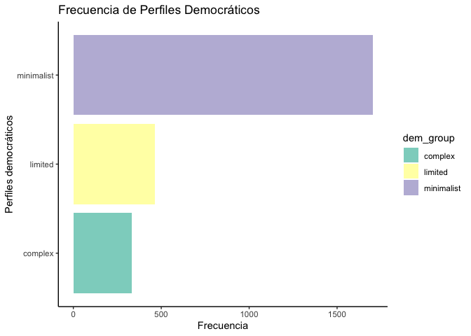<!-- -->

``` r
# -----------------------------------------------
# cambiando orden de los grupos
# -----------------------------------------------

dem_16 %>%
  ggplot(
    aes(
      x= dem_group,
      fill= dem_group)
    ) +
  scale_fill_brewer(palette = "Set3") +
  labs(
    x= "Perfiles democráticos",
    y= "Frecuencia",
    title = "Distribución de Perfiles Democráticos") +
  coord_flip() +
  scale_x_discrete(
    limits = c(
      'complex',
      'minimalist',
      'limited')) +
  theme_classic() 
```

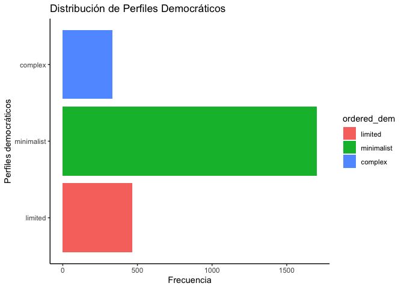<!-- -->

# Variable Ordinal: Niveles de Conocimiento cívico

> Las variables representadas en **Escala Ordinal** son aquellas que
> pueden tomar diferentes valores discretos. Sin embargo, estos valores
> solo incluyen propiedades de igualdad o diferencia entre elementos,
> ademas de orden entre elementos. Los estadísticos interpretables sobre
> este tipo de variables incluyen a: frecuencias, porcentajes, modas, y
> tablas de contigencias (ver Stevens, 1965, Tabla 1).

Los niveles de conocimiento cívico, expresan el nivel sofisticación
política que presentan los estudiantes de 8vo grado de diferentes
países(ver Schulz et al, 2013). Aquellos estudiantes que se encuentran
en **nivel 3 (‘level 3’)** presentan un conocimiento político integrado,
y pueden comprender por ejemplo, la necesidad de contar con leyes sobre
la concentración de medios de comunicación, dado el rol que poseen en la
sociedad los medios de comunicación referente a la presentación de
ideas. Por su parte los estudiantes de **nivel 2 (‘level 2’)** presentan
un conocimiento político general, y comprenden el rol de las
instituciones más comununes de los sistemas de gobierno. Por ejemplo,
estos estudiantes entienden el rol de la separación de poderes, entre el
legislativo y el ejecutivo, para asegurar sistemas democráticos.
Finalmente, estudiantes en **nivel 1 (‘level 1’)** presentan algun grado
de familiaridad con diferentes principios cívicos. Por ejemplo,
estudiantes en este nivel, pueden relacionar la libertad de prensa, con
respecto a la fidelidad con la que se presenta la información al
público. En contraste, los estudiantes bajo el nivel 1, los que aqui
llamaremos **nivel 0 (‘level 0’)** presentan dificultades para realizar
el mismo tipo de juicios que los estudiantes en los niveles superiores.
Es posible que puedan entender la diferencia de poderes del estado, pero
estudiantes tendrían dificultades para relacionar principios y las leyes
que debieran garantizarlos.

## Frecuencias

``` r
# -----------------------------------------------------------------------------
# frecuencias
# -----------------------------------------------------------------------------

# -----------------------------------------------
# tabla de frecuencia con base::table()
# -----------------------------------------------

base::table(dem_16$level_lab) %>%
knitr::kable()
```

| Var1    | Freq |
|:--------|-----:|
| level 0 |  729 |
| level 1 |  745 |
| level 2 |  728 |
| level 3 |  298 |

``` r
# -----------------------------------------------
# tabla de frecuencia con stats::xtabs()
# -----------------------------------------------

stats::xtabs(~ level_lab, data = dem_16)
```

    ## level_lab
    ## level 0 level 1 level 2 level 3 
    ##     729     745     728     298

``` r
# -----------------------------------------------
# tabla de frecuencia dplyr::count()
# -----------------------------------------------

dplyr::count(dem_16, level, level_lab) 
```

    ## # A tibble: 4 x 3
    ##   level level_lab     n
    ##   <dbl> <chr>     <int>
    ## 1     0 level 0     729
    ## 2     1 level 1     745
    ## 3     2 level 2     728
    ## 4     3 level 3     298

## Porcentajes

``` r
# -----------------------------------------------------------------------------
# porcentajes
# -----------------------------------------------------------------------------

# -----------------------------------------------
# tabla de frecuencia con base::table()
# -----------------------------------------------

base::table(dem_16$level_lab) %>%
base::prop.table() %>%
knitr::kable()
```

| Var1    |   Freq |
|:--------|-------:|
| level 0 | 0.2916 |
| level 1 | 0.2980 |
| level 2 | 0.2912 |
| level 3 | 0.1192 |

``` r
# -----------------------------------------------
# tabla de frecuencia con stats::xtabs()
# -----------------------------------------------

stats::xtabs(~ level_lab, data = dem_16) %>%
base::prop.table() %>%
knitr::kable()
```

| level\_lab |   Freq |
|:-----------|-------:|
| level 0    | 0.2916 |
| level 1    | 0.2980 |
| level 2    | 0.2912 |
| level 3    | 0.1192 |

``` r
# -----------------------------------------------
# tabla de frecuencia agregando porcentajes
# -----------------------------------------------

dplyr::count(dem_16, level, level_lab) %>%
mutate(porcentajes = n/sum(n)) %>%
knitr::kable(., digits = 2)
```

| level | level\_lab |   n | porcentajes |
|------:|:-----------|----:|------------:|
|     0 | level 0    | 729 |        0.29 |
|     1 | level 1    | 745 |        0.30 |
|     2 | level 2    | 728 |        0.29 |
|     3 | level 3    | 298 |        0.12 |

## Gráfico de barras

La variable `level_lab` es una variable de tipo discreta, que puede ser
interpretada en orden.

``` r
# -----------------------------------------------------------------------------
# gráfico de barras
# -----------------------------------------------------------------------------

# -----------------------------------------------
# gráfico de barras en horizontal
# -----------------------------------------------

dem_16 %>%
  ggplot(
    aes(
      x= level_lab,
      fill= level_lab)
    ) +
  geom_bar() +
  scale_fill_brewer(palette = "Set3") +
  labs(
    x= 'Niveles de Conocimiento Cívico',
    y= "Frecuencia",
    title = 'Niveles de Conocimiento Cívico') +
  coord_flip() +
  theme_classic()  
```

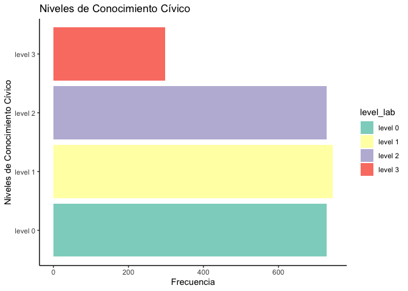<!-- -->

``` r
# -----------------------------------------------
# gráfico de barras en horizontal con porcentajes
# -----------------------------------------------

dem_16 %>%
dplyr::count(level_lab) %>%
mutate(percentage = n/sum(n)) %>%
  ggplot(
    aes(
      x    = level_lab,
      y    = percentage
      )
    ) +
  geom_bar(stat = "identity") +
  scale_fill_brewer(palette = "Set3") +
  labs(
    x= 'Niveles de Conocimiento Cívico',
    y= "Porcentajes",
    title = 'Niveles de Conocimiento Cívico') +
  ylim(0,1) +
  coord_flip() +
  theme_classic()  
```

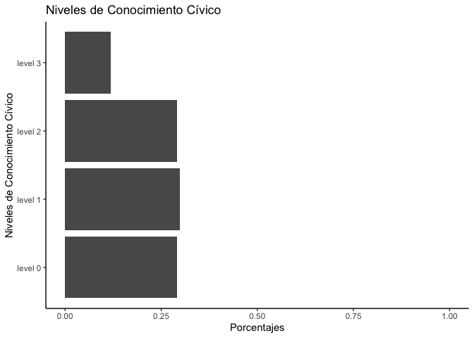<!-- -->

## Tabla de contigencia

``` r
# -----------------------------------------------------------------------------
# porcentajes
# -----------------------------------------------------------------------------

# -----------------------------------------------
# tabla de contigencia
# -----------------------------------------------

stats::xtabs(~ level_lab + dem_group, data = dem_16) %>%
base::prop.table() %>%
knitr::kable(., digits = 2)
```

|         | complex | limited | minimalist |
|:--------|--------:|--------:|-----------:|
| level 0 |    0.01 |    0.08 |       0.20 |
| level 1 |    0.02 |    0.06 |       0.22 |
| level 2 |    0.06 |    0.04 |       0.20 |
| level 3 |    0.05 |    0.00 |       0.06 |

``` r
# -----------------------------------------------
# tabla de contigencia, margenes de filas
# -----------------------------------------------

stats::xtabs(~ level_lab + dem_group, data = dem_16) %>%
base::prop.table(., margin = 1) %>%
knitr::kable(., digits = 2)
```

|         | complex | limited | minimalist |
|:--------|--------:|--------:|-----------:|
| level 0 |    0.02 |    0.28 |       0.70 |
| level 1 |    0.06 |    0.20 |       0.74 |
| level 2 |    0.19 |    0.14 |       0.67 |
| level 3 |    0.45 |    0.03 |       0.52 |

``` r
# -----------------------------------------------
# tabla de contigencia, margenes de columnas
# -----------------------------------------------

stats::xtabs(~ level_lab + dem_group, data = dem_16) %>%
base::prop.table(., margin = 2) %>%
knitr::kable(., digits = 2)
```

|         | complex | limited | minimalist |
|:--------|--------:|--------:|-----------:|
| level 0 |    0.05 |    0.44 |       0.30 |
| level 1 |    0.14 |    0.33 |       0.32 |
| level 2 |    0.42 |    0.21 |       0.29 |
| level 3 |    0.40 |    0.02 |       0.09 |

``` r
# -----------------------------------------------
# tabla de contigencia, margenes de columnas
# -----------------------------------------------

stats::xtabs(~ dem_group + level_lab, data = dem_16) %>%
base::prop.table(., margin = 2) %>%
knitr::kable(., digits = 2)
```

|            | level 0 | level 1 | level 2 | level 3 |
|:-----------|--------:|--------:|--------:|--------:|
| complex    |    0.02 |    0.06 |    0.19 |    0.45 |
| limited    |    0.28 |    0.20 |    0.14 |    0.03 |
| minimalist |    0.70 |    0.74 |    0.67 |    0.52 |

## Gráfico de Mosaico

``` r
# -----------------------------------------------------------------------------
# gráfico de mosaico
# -----------------------------------------------------------------------------

# -----------------------------------------------
# gráfico de mosaico
# -----------------------------------------------

library(ggmosaic)
psi2301::dem_16 %>%
dplyr::select(level_lab, dem_group) %>%
na.omit() %>%
mutate(dem_lab = forcats::as_factor(dem_group)) %>% 
ggplot() +
  geom_mosaic(aes(x = product(dem_lab, level_lab), fill = dem_lab)) +
  theme_mosaic() +
  scale_fill_manual(
      values = c( 'red', 'grey80', 'grey20')
      ) +
  theme(
  axis.ticks = element_blank(),
  legend.title = element_blank(),
  axis.title.x = element_text(margin = unit(c(t = 9, r = 9, b = 9, l = 9), "mm")),
  axis.title.y = element_text(margin = unit(c(t = 9, r = 9, b = 9, l = 9), "mm"))
  ) +
  labs(
    x = 'Political Sophistication levels',
    y = 'Concepts of democracy',
    title = "Concept of democracy by political sophistication"
    )
```

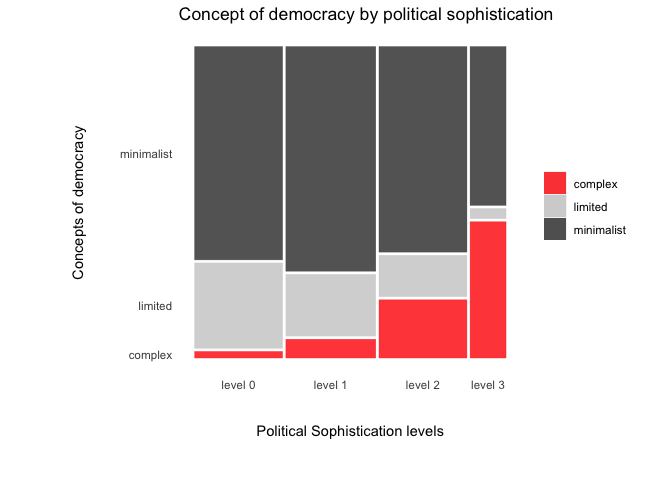<!-- -->

``` r
# -----------------------------------------------
# gráfico de mosaico, reordenando categorias
# -----------------------------------------------

library(ggmosaic)
# llamar datos y prepar datos para generar figura
psi2301::dem_16 %>%
dplyr::select(level_lab, dem_group) %>%
# crear variable con orden deseado
mutate(dem_order = case_when(
  dem_group == 'complex'    ~ 3,
  dem_group == 'minimalist' ~ 2,
  dem_group == 'limited'    ~ 1)
) %>%
# eliminar vacíos
na.omit() %>%
# ordenar datos segun variable creada
arrange(desc(dem_order)) %>%
# crear factor segun orden de la tabla
mutate(dem_lab = forcats::as_factor(dem_group)) %>%
# crear plot de mosaico
ggplot() +
  geom_mosaic(aes(x = product(dem_lab, level_lab), fill = dem_lab)) +
  theme_mosaic() +
# definir colores
  scale_fill_manual(
      values = c( 'red', 'grey80', 'grey20')
      ) +
# definir titulos de ejes y de figura
  labs(
    x = 'Political Sophistication levels',
    y = 'Concepts of democracy',
    title = "Concept of democracy by political sophistication"
    ) +
# definir elementos del template
  theme(
  axis.ticks = element_blank(),
  legend.title = element_blank(),
  axis.title.x = element_text(
    margin = unit(c(t = 9, r = 9, b = 9, l = 9), "mm")),
  axis.title.y = element_text(
    margin = unit(c(t = 9, r = 9, b = 9, l = 9), "mm"))
    )
```

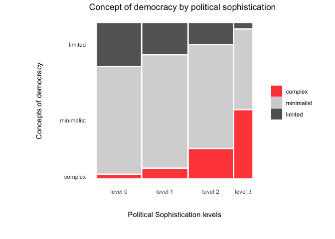<!-- -->

``` r
# Nota: en `margin`
#       t = top
#       b = bottom
#       l = left
#       r = right
```

# Variable Intervalar: Creencias Antidemocráticas

> Las variables representadas en **Escala Intervalar** son aquellas que
> pueden tomar diferentes valores. Las propiedades que incuyen estos
> valores son los de igualdad y diferencia, orden, y distancias. Sin
> embargo, esta escala no posee un cero sustantivo. Por tanto, es
> importante contar con algún punto de referencia para su
> interpretación.

Las creencias antidemocráticas consisten en una serie de diferentes
creencias que sostienen las personas, las cuales se oponen a los
sistemas democráticos. Una de estas creencias son las creencias
autoritarias o tambien llamado autoritarismo. Estas creencias consisten
en diferentes ideas que plantean que las autoridades son
incuestionables. Las personas que presentan un alto apoyo al
autoritarismo, se caracterizan por apoyar autoridades fuertes, y
favorecer la obediencia a-crítica frente a tales autoridades (Duckitt,
Bizumic, Krauss, & Heled, 2010). El estudio ICCS 2016 incluye un
conjunto de preguntas tipo Likert, que permite conformar un puntaje de
apoyo al autoritarismo entre los estudiantes. Este instrumento incluye
las sigiuentes afirmaciones:

-   Las personas que tengan opiniones diferentes al gobierno deben ser
    consideradas como sus enemigos.
-   Es mejor que los líderes del gobierno tomen decisiones sin consultar
    a nadie.
-   Los gobernantes deben hacer valer su autoridad aunque violen los
    derechos de algunos ciudadanos.
-   Es justo que el gobierno no cumpla con las leyes cuando lo crea
    necesario.
-   El gobierno debería cerrar los medios de comunicación que lo
    cri9quen.
-   Si el presidente no está de acuerdo con el congreso, debería
    disolverlo.
-   Los gobernantes pierden su autoridad cuando reconocen sus errores.
-   La opinión más importante del país debe ser la de presidente.
-   La concentración del poder en una sola persona garantiza el orden.

Las respuestas de los estudiantes son modeladas con un modelo de
respuesta de credito parcial, generando un puntaje IRT continuo, de
media 50, y desviación estándar 10, en la muestra agregada de paises de
Latinoamérica que participó en el estudio en 2009.

## Descriptivos

``` r
# -----------------------------------------------------------------------------
# analisis
# -----------------------------------------------------------------------------

# -----------------------------------------------
# análisis descriptivos
# -----------------------------------------------

dem_16 %>%
summarize(
  mean   = mean(aut, na.rm = TRUE),
  sd     = sd(aut, na.rm = TRUE),
  p25    = quantile(aut, probs = .25, na.rm = TRUE),
  p50    = quantile(aut, probs = .50, na.rm = TRUE),
  p75    = quantile(aut, probs = .75, na.rm = TRUE),
  hist   = skimr::inline_hist(aut)
  ) %>%
knitr::kable(.,, digits = 2)
```

|  mean |    sd |   p25 |   p50 |   p75 | hist     |
|------:|------:|------:|------:|------:|:---------|
| 49.41 | 11.47 | 44.48 | 51.06 | 56.63 | ▁▁▃▇▇▃▁▁ |

``` r
# -----------------------------------------------
# análsis por niveles de conocimiento
# -----------------------------------------------

dem_16 %>%
group_by(level_lab) %>%
summarize(
  mean   = mean(aut, na.rm = TRUE),
  sd     = sd(aut, na.rm = TRUE),
  p25    = quantile(aut, probs = .25, na.rm = TRUE),
  p50    = quantile(aut, probs = .50, na.rm = TRUE),
  p75    = quantile(aut, probs = .75, na.rm = TRUE),
  hist   = skimr::inline_hist(aut)
  ) %>%
knitr::kable(.,, digits = 2)
```

| level\_lab |  mean |    sd |   p25 |   p50 |   p75 | hist     |
|:-----------|------:|------:|------:|------:|------:|:---------|
| level 0    | 57.18 |  9.32 | 52.52 | 56.63 | 61.87 | ▁▁▁▃▇▅▁▁ |
| level 1    | 51.23 |  9.20 | 47.94 | 52.52 | 56.63 | ▁▁▂▆▇▂▁▁ |
| level 2    | 44.87 |  9.35 | 40.44 | 46.26 | 51.06 | ▁▁▅▇▃▁▁▁ |
| level 3    | 37.22 | 10.62 | 31.87 | 38.07 | 44.70 | ▅▂▃▇▇▆▂▁ |

## Histogramas

Un histograma representa el número de frecuencias en cada clase o grupo
en forma de rectángulo. La mayoría de los histogramas poseen la misma
estructura: se nombra la base datos y `$` la variable que se quiere
graficar, el nombre de la figura, el xlab (etiqueta eje x) y el ylab
(etiqueta eje y). Luego indicamos corte (`breaks`), el ancho del eje x y
el color.

``` r
# -----------------------------------------------------------------------------
# gráficos
# -----------------------------------------------------------------------------

# -----------------------------------------------
# histograma con base
# -----------------------------------------------

hist(dem_16$aut,
  main = 'Histograma', 
  xlab = 'Apoyo al Autoritarismo',
  ylab = 'frecuencia',
  breaks = 12,
  xlim = c(20, 80))
```

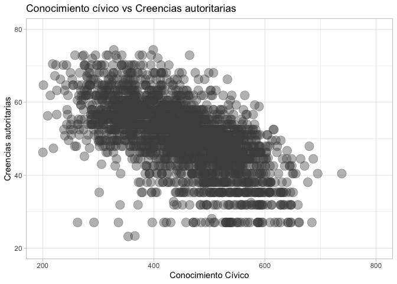<!-- -->

``` r
# -----------------------------------------------
# histograma en ggplot
# -----------------------------------------------

library(ggplot2)
dem_16 %>%
ggplot(., 
  aes(x = aut)
  ) +
  geom_histogram(
  position = "identity", 
  alpha = .8, 
  color = 'grey20',
  fill =  'red',
  binwidth = 5) +
scale_x_continuous(
  name = 'Apoyo al Autoritarismo',
  breaks = seq(20, 80, by = 10), 
  limits = c(20,80)
  ) +  
  theme_light()
```

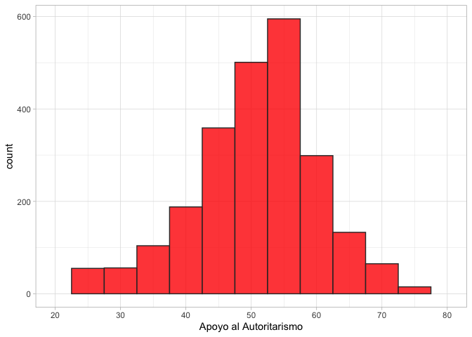<!-- -->

``` r
# Nota: Éste es un plot generado con ggplot2.
#       Este tipo de figuras esta generado mediante
#       la lógica de `grammar of graphics`.
#       Esta es una librería muy versatil, que
#       cuenta con mucha documentación de ejemplos online.


# -----------------------------------------------
# histograma en ggplot por grupos
# -----------------------------------------------

library(ggplot2)
dem_16 %>%
ggplot(., 
  aes(x = aut)
  ) +
  geom_histogram(
  position = "identity", 
  alpha = .8, 
  color = 'grey20',
  fill =  'red',
  binwidth = 5) +
scale_x_continuous(
  name = 'Apoyo al Autoritarismo',
  breaks = seq(20, 80, by = 10), 
  limits = c(20,80)
  ) +  
  facet_grid(dem_group ~ .) +
  theme_light()
```

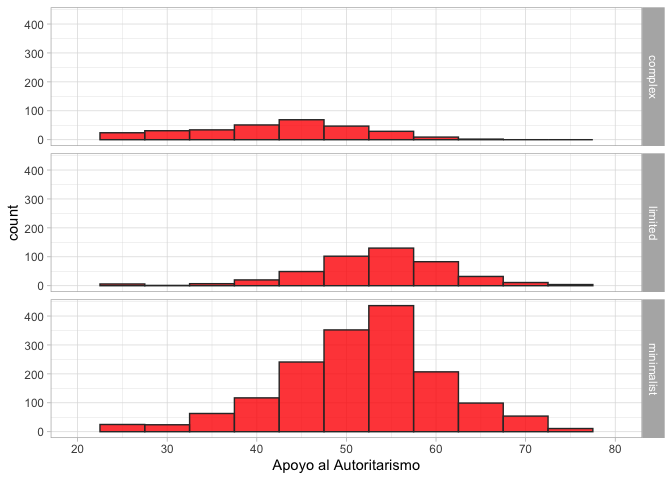<!-- -->

``` r
# -----------------------------------------------
# histograma en ggplot por grupos
# -----------------------------------------------

library(ggplot2)
dem_16 %>%
ggplot(., 
  aes(x = aut)
  ) +
  geom_histogram(
  position = "identity", 
  alpha = .8, 
  color = 'grey20',
  fill =  'red',
  binwidth = 5) +
scale_x_continuous(
  name = 'Apoyo al Autoritarismo',
  breaks = seq(20, 80, by = 10), 
  limits = c(20,80)
  ) +  
  facet_grid(level_lab ~ .) +
  theme_light()
```

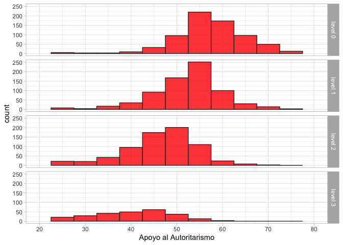<!-- -->

## Dispersiogramas

``` r
# -----------------------------------------------------------------------------
# scatter
# -----------------------------------------------------------------------------

# -----------------------------------------------
# dispersiograma
# -----------------------------------------------

library(ggplot2)
dem_16 %>%
ggplot(
  aes(
    x = civ,
    y = aut)
  ) +
geom_point(
  alpha = 0.4,
  size  = 5,
  color = 'grey30') +
labs(
  title = "Conocimiento cívico vs Creencias autoritarias",
      y = "Creencias autoritarias",
      x = "Conocimiento Cívico") +
xlim(200,800) +
ylim(20,80) +
theme_light()
```

<!-- -->

``` r
# -----------------------------------------------
# dispersiograma
# -----------------------------------------------

library(ggplot2)
dem_16 %>%
ggplot(
  aes(
    x = civ,
    y = aut)
  ) +
geom_point(
  alpha = 0.2,
  size  = 2,
  color = 'grey30') +
labs(
  title = "Conocimiento cívico vs Creencias autoritarias, según Concepto de democracia",
      y = "Creencias autoritarias",
      x = "Conocimiento Cívico") +
xlim(200,800) +
ylim(20,80) +
facet_grid(dem_group ~ .) +
theme_light()
```

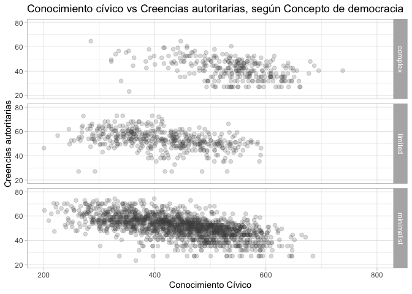<!-- -->

# Ejercicios

-   1.  Genere un dispersiograma que incluya nivel socioeconómico
        (`ses`) y conocimiento cívico (`civ`)

-   2.  ¿Qué país presenta el promedio más alto en Conocimiento cívico?

-   3.  Cuál es el nivel de conocimiento más frecuente en cada perfil de
        concepto de democracia, en Perú.

# Referencias

Duckitt, J., Bizumic, B., Krauss, S. W., & Heled, E. (2010). A
Tripartite Approach to Right-Wing Authoritarianism: The
Authoritarianism-Conservatism-Traditionalism Model. Political
Psychology, 31(5), 685–715.
<https://doi.org/10.1111/j.1467-9221.2010.00781.x>

Quaranta, M. (2019). What makes up democracy? Meanings of democracy and
their correlates among adolescents in 38 countries. Acta Politica,
0123456789. <https://doi.org/10.1057/s41269-019-00129-4>

Schulz, W., Fraillon, J., & Ainley, J. (2013). Measuring young people’s
understanding of civics and citizenship in a cross-national study.
Educational Psychology, 33(3), 327–349.
<https://doi.org/10.1080/01443410.2013.772776>
