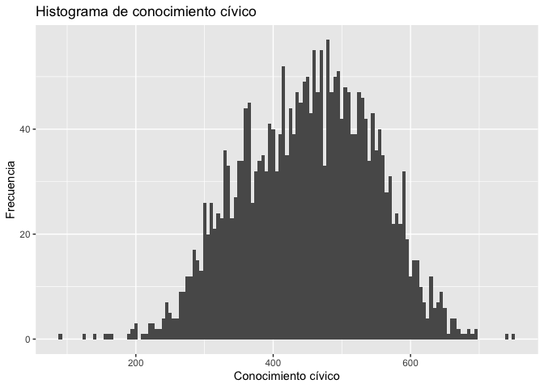
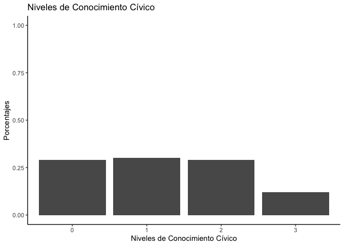
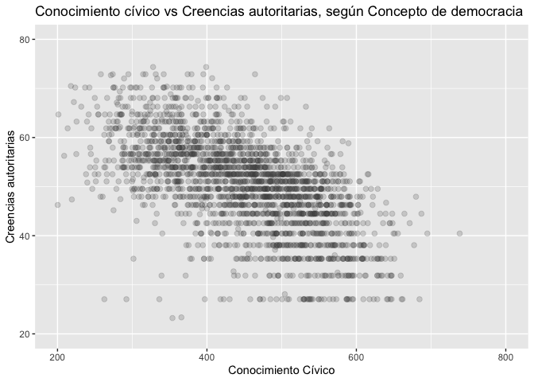

PSI2301: Metodos de investigación cuantitativa
================

En la ayudantía de hoy trabajaremos perfiles de concepciones
democráticas. Estos perfiles se derivan del trabajo de Quaranta (2019),
y han sido propuestos como una forma de evaluar el logro de las
“Sustainable Development Goals” (Sandoval-Hernández & Carrasco, 2020).
Los perfiles de concepciones democráticas presentan las siguientes
características:

-   **complex**: son aquellos estudiantes que consideran constitutivos
    de los sistemas democráticos, un conjunto complejo de
    características. Entre ellas se encuentran las elecciones de
    autoridades políticas, la igualdad ante la ley, y el ejericicio de
    protesta frente a leyes injustas. Además, consideran que la
    concentración de medios de comunicación, el nepotismo en el
    gobierno, y la influencia del ejecutivo sobre los tribunales de
    justicia como amenazas a los sistemas democráticos.

-   **minimalist**: son aquellos estudiantes que consideran
    constitutivos de los sistemas democráticos, un conjunto minimalista
    de características. Esto incluye a las elecciones de autoridades
    políticas, la igualdad ante la ley, y el ejericicio de protesta
    frente a leyes injustas. Sin embargo, este perfil de estudiantes, es
    insensible a la concentración de medios, el nepotismo, y la
    influencia del ejecutivo sobre el poder judicial.

-   **limited**: son aquellos estudiantes que no distinguen de forma
    adecuada las características centrales de los sistemas democráticos.

Para conocer más sobre estos características de los estudiantes que
pertenecen a cada una de estas categorías utilizaremos los resultados
encuesta de ICCS 2016 (Schulz et al, 2018). Esta encuesta fue creada con
el fin de poder investigar las formas en que las/os jóvenes están
preparados para adoptar sus roles como ciudadanos en un mundo en el cuál
la democracia y la participación se encuentran en constante cambio. La
base de datos `dem_16` es una submuestra de este estudio, la cual
incluyen una muestra de 500 casos por país latinoaméricano, llegando a
un total de 2500 casos.

Esta base de datos cuenta con las siguientes variables:

| variable   | descripción                                                                                                        |
|:-----------|:-------------------------------------------------------------------------------------------------------------------|
| id\_i      | id único del caso                                                                                                  |
| ctry       | nombre del país                                                                                                    |
| sex        | sexo del estudiante                                                                                                |
| age        | edad del estudiante en años                                                                                        |
| dem        | perfil de concepciones de las democracia (1 = minimalista, 2 = complejo, 3 = limitado)                             |
| dem\_group | perfil de concepciones de las democracia (en texto)                                                                |
| aut        | creencias antidemocráticas                                                                                         |
| civ        | conocimiento cívico                                                                                                |
| ses        | nivel socioecónomico                                                                                               |
| edu        | educación de los padres (1 = educación universitaria, 0 = otro nivel educativo)                                    |
| level      | niveles de conocimiento cívico (numérico) (3 = alta sofisticación, 2 = medio, 1 = bajo, 0 = muy bajo)              |
| level\_lab | niveles de conocimiento cívico (Level 3 = alta sofisticación, Level 2 = medio, Level 1 = bajo, Level 0 = muy bajo) |

A partir de lo anterior, procederemos a realizar los siguientes
ejercicios:

# Análisis descriptivo

## Pregunta 1

Cargue la base de datos de la encuesta y verifique si el proceso de
lectura fue realizado sin problemas. Para esto, considere la instalación
y/o actualización de las librerías correspondientes. A continuación se
agrega codigo en texto de ayuda.

``` text
# Estas instalaciones solo tendrán que se efectuadas la primera vez
install.packages("tidyverse")
install.packages("remotes")
install.packages("psych")
remotes::install_github("dacarras/psi2301")

# Actualización de librerías
# 
# la librería del curso se está constantemente actualizando por lo que esta 
# deberá actualizarse al comienzo de cada semana
# esta es la única librería que requerirá este proceso

remotes::install_github("dacarras/psi2301", force =TRUE)

# Ahora se procede a la lectura de la base de datos

dem_16 <- psi2301::dem_16


# revisión

dplyr::glimpse(dem_16)
```

> Nota de Ayuda: Para esta sesión se utilizará las librerías de
> `tidyverse`, `dplyr` y `ggplot2`. Ademas se empleará la librería
> `psych`. A continuación se incluyen los comandos para cargar estas
> librerías. Recuerde cargar sus librerías antes de comenzar.


    library(dplyr)
    library(psych)
    library(ggplot2)

## Pregunta 2

La creación de los perfiles de concepciones democráticas corresponde
representa el patrón de respuesta que entregaron los estudiantea una
serie de preguntas, las cuales refierens a cuáles son las
características que una democracia debiera tener. Lo anterior, se
encuentra muy relacionado al conocimiento cívico que poseen los
estudiantes. En la base `dem_16` el conocmiento cívico de los
estudiantes, se encuentra representado por la variable `civ`. El primer
paso de esta ayudantía corresponde a analizar en profundidad esta
variable.

A continuación, calcule y reporte los estadísticos de orden o posición
de la variable conocimiento cívico (mediana, mínimo, máximo, cuartiles).

``` r
# cargar la libreria
library(psi2301)

# cargar los datos
data(dem_16)

# mínimo
min(dem_16$civ)
```

    ## [1] 88.26

``` r
# máximo
max(dem_16$civ)
```

    ## [1] 751.08

``` r
# cuartiles
fivenum(dem_16$civ)
```

    ## [1]  88.260 380.140 455.175 522.275 751.080

``` r
# Nota: en orden aparecen mínimo (percentil 0), 
#       percentil 25, mediana (percentil 50),
#       percentil 75 y máximo.
```

## Pregunta 3

A partir de la información obtenida anteriormente, ¿Qué es posible
identificar a partir de estos elementos?, ¿Cuál es el menor puntaje en
conocimiento cívico obtenido por los estudiantes de ésta sub-muestra?

## Pregunta 4

Utilizando la variable conocimiento cívico, genere y reporte los
estadísticos descriptivos (media, mediana y desviación estándar)

``` r
# solo civ
mean(dem_16$civ)
```

    ## [1] 450.5827

``` r
sd(dem_16$civ)
```

    ## [1] 95.55647

``` r
median(dem_16$civ)
```

    ## [1] 455.175

## Pregunta 5

A partir de la información obtenida anteriormente, ¿Qué es posible
identificar a partir de estos elementos? ¿Cómo diríamos que se
distribuye el conocimiento cívico de los estudiantes?

## Pregunta 6

Utilizando la función `describe` de la librería `psych` genere una tabla
de datos descriptivos del resto de las variables contenidas en la base
de datos.

``` r
# el resto

# al existir variables que no son númericas, el argumento omit permite que el programa las evita
# y no tenga problemas para correrlas
# el argumento quant nos permite obtener los percentiles que queramos
psych::describe(dem_16, omit=TRUE, quant = c(.25,.75))
```

    ##       vars    n     mean       sd   median  trimmed      mad     min      max
    ## id_i     1 2500 35948.02 25602.24 26297.50 34520.14 26213.85 5901.00 77244.00
    ## sex      3 2500     0.49     0.50     0.00     0.49     0.00    0.00     1.00
    ## age      4 2500    14.21     0.94    14.00    14.10     0.62   11.50    19.67
    ## dem      5 2500     1.50     0.79     1.00     1.38     0.00    1.00     3.00
    ## aut      7 2483    49.41    11.47    51.06    50.10     9.76   17.67    85.37
    ## civ      8 2500   450.58    95.56   455.17   451.95   104.45   88.26   751.08
    ## ses      9 2481     0.02     1.00    -0.15    -0.03     1.05   -2.22     2.77
    ## edu     10 2466     0.26     0.44     0.00     0.20     0.00    0.00     1.00
    ## level   11 2500     1.24     1.00     1.00     1.17     1.48    0.00     3.00
    ##          range  skew kurtosis     se    Q0.25    Q0.75
    ## id_i  71343.00  0.41    -1.46 512.04 12295.50 57802.50
    ## sex       1.00  0.02    -2.00   0.01     0.00     1.00
    ## age       8.17  1.34     2.60   0.02    13.58    14.50
    ## dem       2.00  1.12    -0.46   0.02     1.00     2.00
    ## aut      67.70 -0.57     1.13   0.23    44.48    56.63
    ## civ     662.82 -0.15    -0.37   1.91   380.26   522.20
    ## ses       4.99  0.43    -0.55   0.02    -0.74     0.74
    ## edu       1.00  1.07    -0.84   0.01     0.00     1.00
    ## level     3.00  0.22    -1.08   0.02     0.00     2.00

## Pregunta 7

El conocimiento cívico de los estudiantes, se encuentra categorizado en
niveles. Esto son una representación ordinal de los puntajes de `civ`,
con la cual se describen diferentes niveles de logro de conocimiento
civico, o sofisticación política de los estudiantes (Schulz et al.,
2013). En el siguiente ejercicio, revisaremos como se distribuye esta
variable `level`. Para esto genere una tabla de frencuencia y presente
los resultados obtenidos en términos de frecuencia y porcentaje.

``` r
table(dem_16$level)
```

    ## 
    ##   0   1   2   3 
    ## 729 745 728 298

``` r
prop.table(table(dem_16$level))
```

    ## 
    ##      0      1      2      3 
    ## 0.2916 0.2980 0.2912 0.1192

``` r
# para obtener números más pequeños
round(prop.table(table(dem_16$level)),2)
```

    ## 
    ##    0    1    2    3 
    ## 0.29 0.30 0.29 0.12

``` r
# para verlo en términos de porcentajes
round(prop.table(table(dem_16$level)),2)*100
```

    ## 
    ##  0  1  2  3 
    ## 29 30 29 12

## Pregunta 8

Describa los resultados obtenidos. ¿Cuál es el porcentaje de estudiantes
que tienen los niveles más bajos de conocimiento cívico ? y cuál es el
porcentaje de quienes tienen mayores niveles de conocimiento cívico?

## Pregunta 9

Genere una tabla cruzada o de contingencia con las categorías de
conocimiento cívico (variable `level`) y los países participantes de la
submuestra (variable `ctry`).

``` r
table(dem_16$level,cut(dem_16$civ,3))
```

    ##    
    ##     (87.6,309] (309,530] (530,752]
    ##   0        190       539         0
    ##   1          0       745         0
    ##   2          0       474       254
    ##   3          0         0       298

``` r
# tabla de proporciones
tab0 <- prop.table(table(dem_16$ctry,dem_16$level))
tab0
```

    ##                     
    ##                           0      1      2      3
    ##   Chile              0.0412 0.0504 0.0676 0.0408
    ##   Colombia           0.0320 0.0588 0.0764 0.0328
    ##   Dominican Republic 0.1168 0.0556 0.0244 0.0032
    ##   Mexico             0.0384 0.0620 0.0700 0.0296
    ##   Peru               0.0632 0.0712 0.0528 0.0128

``` r
# tabla redondeada 2 dígitos
tab1 <- prop.table(table(dem_16$ctry,dem_16$level))
round(tab1,2)
```

    ##                     
    ##                         0    1    2    3
    ##   Chile              0.04 0.05 0.07 0.04
    ##   Colombia           0.03 0.06 0.08 0.03
    ##   Dominican Republic 0.12 0.06 0.02 0.00
    ##   Mexico             0.04 0.06 0.07 0.03
    ##   Peru               0.06 0.07 0.05 0.01

## Pregunta 10

¿Podemos afirmar que existe una distribución homogénea entre los países?
¿Qué países presentan mayores proporciones de estudiantes con categorías
de logro más altas?

# Visualización de datos

## Pregunta 11

Considerando los resultados, presente los siguientes resultados
utilizando gráficos.

### a. Histograma

Histograma de el puntaje de conocimiento cívico

``` r
# activamos la librería ggplot2 y dplyr
library(ggplot2)
library(dplyr)
```

    ## 
    ## Attaching package: 'dplyr'

    ## The following objects are masked from 'package:stats':
    ## 
    ##     filter, lag

    ## The following objects are masked from 'package:base':
    ## 
    ##     intersect, setdiff, setequal, union

``` r
dem_16 %>%
ggplot(.,
    aes(x = civ))+
    geom_histogram(
      binwidth=5) +
    labs(
      title="Histograma de conocimiento cívico",
      x="Conocimiento cívico",
      y ="Frecuencia")
```

    ## Don't know how to automatically pick scale for object of type haven_labelled. Defaulting to continuous.

<!-- -->

Interprete los resultados, ¿Cómo se distribuye el conocimiento cívico de
los estudiantes en la sub-muestra analizada?

### c. Gráfico de barras

Gráfico de barras (barplot) de categorías de conocimiento cívico

``` r
grafb = as.data.frame(round(prop.table(table(dem_16$level)),2))
colnames(grafb) = c("Cat","Porcent")

grafb %>%
ggplot(.,
    aes(
      x    = Cat,
      y    = Porcent,
      )
    ) +
  geom_bar(stat = "identity") +
  scale_fill_brewer(palette = "Set3") +
  labs(
    x= "Niveles de Conocimiento Cívico",
    y= "Porcentajes",
    title = "Niveles de Conocimiento Cívico") +
  ylim(0,1) +
  theme_classic()  
```

<!-- -->

Interprete los resultados, ¿qué porcentaje de los estudiantes pertenece
a cada grupo de estos distintos niveles de conocimiento cívico?

### e. Dispersograma

Dispersograma entre conocimiento cívico y creencias autoritarias.

``` r
dem_16 %>%
ggplot(
  aes(
    x = civ,
    y = aut)
  ) +
geom_point(
  alpha = 0.2,
  size  = 2,
  color = "grey30") +
labs(
  title = "Conocimiento cívico vs Creencias autoritarias, según Concepto de democracia",
      y = "Creencias autoritarias",
      x = "Conocimiento Cívico") +
xlim(200,800) +
ylim(20,80)
```

    ## Warning: Removed 137 rows containing missing values (geom_point).

<!-- -->

Interprete los resultados, ¿se observa algún tipo de relación entre los
niveles de conocimiento cívico y las creencias autoritarias de los
estudiantes?

# Referencias

Quaranta, M. (2019). What makes up democracy? Meanings of democracy and
their correlates among adolescents in 38 countries. Acta Politica,
0123456789. <https://doi.org/10.1057/s41269-019-00129-4>

Sandoval-Hernández, A., & Carrasco, D. (2020). A Measurement Strategy
for SDG Thematic Indicators 4.7.4 and 4.7.5 Using International Large
Scale Assessments in Education.
<http://tcg.uis.unesco.org/wp-content/uploads/sites/4/2020/06/Measurement-Strategy-for-474-and-475-using-ILSA_20200625.pdf>

Schulz, W., Carstens, R., Losito, B., & Fraillon, J. (2018). ICCS 2016
Technical Report (W. Schulz, R. Carstens, B. Losito, & J. Fraillon
(eds.)). International Association for the Evaluation of Educational
Achievement (IEA).

Schulz, W., Fraillon, J., & Ainley, J. (2013). Measuring young people’s
understanding of civics and citizenship in a cross-national study.
Educational Psychology, 33(3), 327–349.
<https://doi.org/10.1080/01443410.2013.772776>
