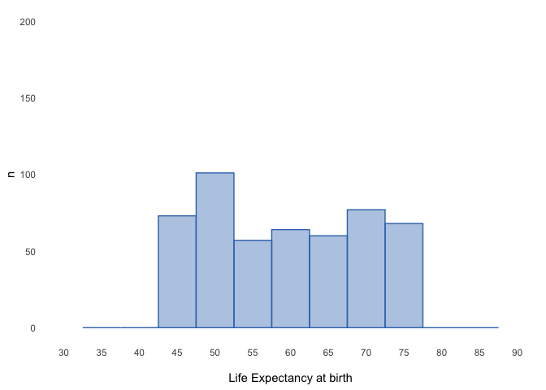

Gráficos
================

<style>
  .main-container {
    max-width: 1600px !important;
  }
  .list-group-item.active, 
  .list-group-item.active:focus, 
  .list-group-item.active:hover {
    background-color: #373334;
  }
</style>

# Carpetas

``` r
#------------------------------------------------------------------------------
# folders
#------------------------------------------------------------------------------

# ---------------------------------------------------------
# get local path from relative path
# ---------------------------------------------------------


local_path <- function(x){
  paste0(tools::file_path_as_absolute('..'),x)
}

# Note: set current directory as working directory

# ---------------------------------------------------------
# folder with data files
# ---------------------------------------------------------

data_folder   <- local_path('/')
save_folder   <- local_path('/')

# ---------------------------------------------------------
# load main library
# ---------------------------------------------------------

library(dplyr)

# ---------------------------------------------------------
# check folder
# ---------------------------------------------------------

list.files(data_folder)
```

    ##  [1] "_prev_r4sda"                  "bar_plot.png"                
    ##  [3] "colmee_2021_lsa"              "dacarras.github.io"          
    ##  [5] "dev"                          "dev_0.1.0.tar.gz"            
    ##  [7] "dev.Rcheck"                   "distribution_left_lines.png" 
    ##  [9] "distribution_left.png"        "distribution_right_lines.png"
    ## [11] "distribution_right.png"       "distribution_sim.png"        
    ## [13] "distributions_names.png"      "distributions.png"           
    ## [15] "edu4046_mlm"                  "erce"                        
    ## [17] "erce_0.1.0.tar.gz"            "erce_2022_lsa"               
    ## [19] "erce.Rcheck"                  "ex_01.png"                   
    ## [21] "ex_02.png"                    "ex_04.png"                   
    ## [23] "ex_08.png"                    "ex_12.png"                   
    ## [25] "ex_cont.png"                  "ex_full.png"                 
    ## [27] "hist_width_01.png"            "hist_width_05.png"           
    ## [29] "invalsi_w1"                   "life_expectancy_plot.png"    
    ## [31] "mosaic.png"                   "psi2301"                     
    ## [33] "psi2301_0.1.0.tar.gz"         "psi2301_examples"            
    ## [35] "psi2301.Rcheck"               "psm5021_examples"            
    ## [37] "r4sda"                        "r4sda_0.1.0.tar.gz"          
    ## [39] "r4sda.Rcheck"                 "scatter.png"                 
    ## [41] "schpp_2022_corr"              "slides_templates"            
    ## [43] "techr"                        "techr_0.1.0.tar.gz"          
    ## [45] "techr.Rcheck"

# Códigos Clase 02

## Abrir y transformar datos

``` r
# -----------------------------------------------
# abrir datos
# -----------------------------------------------

data_life_wide <- readxl::read_xlsx(
                  'life_expectancy_2018.xlsx',
                  sheet = 'plain_data')

# -----------------------------------------------
# transformar datos a long format
# -----------------------------------------------

life_stacked <- data_life_wide %>%
                dplyr::filter(type == 'country') %>%
                tidyr::gather('year', 'life', 
                  -country_name, -country_code, -indicator_name, -indicator_code, 
                  -income_group, -region, -type) %>%
                dplyr::select(country_name, year, life, region, income_group) %>%
                mutate(year_num = as.numeric(year))

# -----------------------------------------------
# tabla de datos
# -----------------------------------------------

r4sda::variables_table(data_life_wide) %>%
knitr::kable()
```

| variable       | type | values                                           | labels                    |
|:---------------|:-----|:-------------------------------------------------|:--------------------------|
| country_name   | chr  | “Afghanistan”, “Angola”, “Albania”, “Andorra”,…  | === no variable label === |
| country_code   | chr  | AFG”, “AGO”, “ALB”, “AND”, “ARB”, “ARE”, “ARG”,… | === no variable label === |
| indicator_name | chr  | pectancy at birth, total (years)“,”Life expect…  | === no variable label === |
| indicator_code | chr  | LE00.IN”, “SP.DYN.LE00.IN”, “SP.DYN.LE00.IN”, “… | === no variable label === |
| 1960           | dbl  | 38, 62, NA, 47, 52, 65, 66, NA, 62, 71, 69, 61,… | === no variable label === |
| 1961           | dbl  | 38, 63, NA, 47, 53, 65, 66, NA, 63, 71, 70, 61,… | === no variable label === |
| 1962           | dbl  | 38, 64, NA, 48, 54, 65, 67, NA, 63, 71, 69, 61,… | === no variable label === |
| 1963           | dbl  | 38, 65, NA, 48, 55, 65, 67, NA, 64, 71, 69, 62,… | === no variable label === |
| 1964           | dbl  | 39, 65, NA, 49, 56, 65, 68, NA, 64, 71, 70, 62,… | === no variable label === |
| 1965           | dbl  | 39, 66, NA, 49, 57, 66, 68, NA, 64, 71, 70, 62,… | === no variable label === |
| 1966           | dbl  | 39, 66, NA, 50, 57, 66, 69, NA, 65, 71, 70, 62,… | === no variable label === |
| 1967           | dbl  | 40, 66, NA, 51, 58, 66, 69, NA, 65, 71, 70, 63,… | === no variable label === |
| 1968           | dbl  | 40, 66, NA, 51, 59, 66, 69, NA, 65, 71, 70, 63,… | === no variable label === |
| 1969           | dbl  | 41, 67, NA, 52, 60, 66, 70, NA, 66, 71, 70, 63,… | === no variable label === |
| 1970           | dbl  | 41, 67, NA, 52, 61, 66, 70, NA, 66, 71, 70, 63,… | === no variable label === |
| 1971           | dbl  | 41, 67, NA, 53, 62, 67, 70, NA, 66, 71, 70, 63,… | === no variable label === |
| 1972           | dbl  | 42, 68, NA, 53, 63, 67, 71, NA, 66, 71, 70, 63,… | === no variable label === |
| 1973           | dbl  | 42, 68, NA, 54, 64, 67, 71, NA, 66, 72, 71, 64,… | === no variable label === |
| 1974           | dbl  | 42, 68, NA, 55, 65, 68, 71, NA, 67, 72, 71, 64,… | === no variable label === |
| 1975           | dbl  | 43, 69, NA, 55, 65, 68, 71, NA, 67, 73, 71, 64,… | === no variable label === |
| 1976           | dbl  | 43, 69, NA, 56, 66, 68, 71, NA, 67, 73, 72, 64,… | === no variable label === |
| 1977           | dbl  | 43, 69, NA, 57, 67, 69, 71, NA, 68, 73, 72, 64,… | === no variable label === |
| 1978           | dbl  | 44, 70, NA, 57, 67, 69, 71, NA, 68, 74, 72, 64,… | === no variable label === |
| 1979           | dbl  | 44, 70, NA, 58, 68, 69, 71, NA, 68, 74, 72, 64,… | === no variable label === |
| 1980           | dbl  | 44, 70, NA, 58, 68, 69, 71, NA, 68, 74, 72, 64,… | === no variable label === |
| 1981           | dbl  | 44, 70, NA, 59, 69, 70, 71, NA, 69, 75, 73, 64,… | === no variable label === |
| 1982           | dbl  | 45, 71, NA, 60, 69, 70, 71, NA, 69, 75, 73, 64,… | === no variable label === |
| 1983           | dbl  | 45, 71, NA, 60, 70, 70, 71, NA, 69, 75, 73, 65,… | === no variable label === |
| 1984           | dbl  | 45, 71, NA, 61, 70, 70, 70, NA, 70, 75, 74, 65,… | === no variable label === |
| 1985           | dbl  | 45, 71, NA, 62, 70, 71, 70, NA, 70, 76, 74, 65,… | === no variable label === |
| 1986           | dbl  | 45, 72, NA, 62, 71, 71, 69, NA, 70, 76, 74, 65,… | === no variable label === |
| 1987           | dbl  | 45, 72, NA, 63, 71, 71, 69, NA, 71, 76, 75, 65,… | === no variable label === |
| 1988           | dbl  | 45, 72, NA, 63, 71, 71, 68, NA, 71, 76, 75, 65,… | === no variable label === |
| 1989           | dbl  | 45, 72, NA, 64, 72, 71, 68, NA, 71, 77, 75, 65,… | === no variable label === |
| 1990           | dbl  | 45, 72, NA, 64, 72, 72, 68, NA, 72, 77, 76, 65,… | === no variable label === |
| 1991           | dbl  | 45, 72, NA, 65, 72, 72, 68, NA, 72, 77, 76, 65,… | === no variable label === |
| 1992           | dbl  | 45, 72, NA, 65, 72, 72, 68, NA, 72, 77, 76, 65,… | === no variable label === |
| 1993           | dbl  | 45, 72, NA, 65, 73, 72, 68, NA, 72, 78, 76, 65,… | === no variable label === |
| 1994           | dbl  | 45, 72, NA, 66, 73, 72, 69, NA, 72, 78, 76, 65,… | === no variable label === |
| 1995           | dbl  | 45, 72, NA, 66, 73, 73, 69, NA, 73, 78, 77, 65,… | === no variable label === |
| 1996           | dbl  | 45, 72, NA, 67, 73, 73, 69, NA, 73, 78, 77, 66,… | === no variable label === |
| 1997           | dbl  | 46, 73, NA, 67, 74, 73, 70, NA, 73, 78, 77, 66,… | === no variable label === |
| 1998           | dbl  | 46, 73, NA, 67, 74, 73, 70, NA, 73, 79, 78, 66,… | === no variable label === |
| 1999           | dbl  | 46, 74, NA, 68, 74, 73, 71, NA, 74, 79, 78, 66,… | === no variable label === |
| 2000           | dbl  | 47, 74, NA, 68, 74, 74, 71, NA, 74, 79, 78, 67,… | === no variable label === |
| 2001           | dbl  | 47, 74, NA, 68, 75, 74, 72, NA, 74, 80, 79, 67,… | === no variable label === |
| 2002           | dbl  | 48, 75, NA, 68, 75, 74, 72, NA, 74, 80, 79, 67,… | === no variable label === |
| 2003           | dbl  | 48, 75, NA, 69, 75, 74, 72, NA, 75, 80, 79, 68,… | === no variable label === |
| 2004           | dbl  | 49, 75, NA, 69, 75, 74, 73, NA, 75, 80, 79, 68,… | === no variable label === |
| 2005           | dbl  | 50, 75, NA, 69, 75, 74, 73, NA, 75, 81, 79, 69,… | === no variable label === |
| 2006           | dbl  | 51, 75, NA, 69, 76, 75, 73, NA, 75, 81, 80, 69,… | === no variable label === |
| 2007           | dbl  | 52, 76, NA, 70, 76, 75, 73, NA, 75, 81, 80, 70,… | === no variable label === |
| 2008           | dbl  | 53, 76, NA, 70, 76, 75, 73, NA, 76, 81, 80, 70,… | === no variable label === |
| 2009           | dbl  | 54, 76, NA, 70, 76, 75, 73, NA, 76, 82, 80, 71,… | === no variable label === |
| 2010           | dbl  | 55, 77, NA, 70, 76, 75, 73, NA, 76, 82, 81, 71,… | === no variable label === |
| 2011           | dbl  | 56, 77, NA, 71, 77, 75, 74, NA, 76, 82, 81, 71,… | === no variable label === |
| 2012           | dbl  | 57, 77, NA, 71, 77, 76, 74, NA, 76, 82, 81, 72,… | === no variable label === |
| 2013           | dbl  | 58, 78, NA, 71, 77, 76, 74, NA, 76, 82, 81, 72,… | === no variable label === |
| 2014           | dbl  | 59, 78, NA, 71, 77, 76, 74, NA, 76, 82, 81, 72,… | === no variable label === |
| 2015           | dbl  | 59, 78, NA, 71, 77, 76, 74, NA, 76, 82, 81, 72,… | === no variable label === |
| 2016           | dbl  | 60, 78, NA, 71, 77, 76, 75, NA, 77, 82, 82, 72,… | === no variable label === |
| 2017           | dbl  | 60, 78, NA, 72, 78, 76, 75, NA, 77, 82, 82, 73,… | === no variable label === |
| 2018           | dbl  | 61, 78, NA, 72, 78, 77, 75, NA, 77, 83, 82, 73,… | === no variable label === |
| income_group   | chr  | come”, “Low income”, “Lower middle income”, “Up… | === no variable label === |
| region         | chr  | merica & Caribbean”, “South Asia”, “Sub-Saharan… | === no variable label === |
| type           | chr  | “,”country”, “country”, “country”, “country”, …  | === no variable label === |

``` r
# -----------------------------------------------
# tabla de datos
# -----------------------------------------------

r4sda::variables_table(life_stacked) %>%
knitr::kable()
```

| variable     | type | values                                           | labels                    |
|:-------------|:-----|:-------------------------------------------------|:--------------------------|
| country_name | chr  | Afghanistan”, “Angola”, “Albania”, “Andorra”, “… | === no variable label === |
| year         | chr  | 960”, “1960”, “1960”, “1960”, “1960”, “1960”, “… | === no variable label === |
| life         | dbl  | , 62, NA, 52, 65, 66, NA, 62, 71, 69, 61, 41, 7… | === no variable label === |
| region       | chr  | rica & Caribbean”, “South Asia”, “Sub-Saharan A… | === no variable label === |
| income_group | chr  | me”, “Low income”, “Lower middle income”, “Uppe… | === no variable label === |
| year_num     | dbl  | , 1960, 1960, 1960, 1960, 1960, 1960, 1960, 196… | === no variable label === |

# Códigos empleados en clases

## Generar plot de slide 01

``` r
# -----------------------------------------------
# generar plot
# -----------------------------------------------

library(ggplot2)
ggplot(data=life_stacked, aes(x=year, y=life, group = country_name)) +
geom_line(linetype = 1, alpha = 0.2) +
theme(
  panel.background = element_blank(),
  panel.grid.minor = element_blank(),
  panel.grid.major = element_blank(),            
  axis.ticks = element_blank()
  )  
```

<!-- -->

## Análisis descriptivos

-   Ver slides 12 a 14

``` r
# -----------------------------------------------
# cantidad de paises
# -----------------------------------------------

data_life_wide %>%
dplyr::filter(type == 'country') %>%
nrow()
```

    ## [1] 217

``` r
# -----------------------------------------------
# rangos por año
# -----------------------------------------------

life_stacked %>%
group_by(year_num) %>%
summarize(
  minimum = min(life, na.rm = TRUE),
  maximum = max(life, na.rm = TRUE)
  ) %>%
mutate(range = maximum - minimum) %>%
dplyr::filter(year_num %in% c(1960, 1970, 1980, 1990, 2000, 2010)) %>%
knitr::kable(., digits = 2)
```

| year_num | minimum | maximum | range |
|---------:|--------:|--------:|------:|
|     1960 |      28 |      74 |    45 |
|     1970 |      32 |      75 |    42 |
|     1980 |      28 |      77 |    49 |
|     1990 |      33 |      79 |    45 |
|     2000 |      39 |      81 |    42 |
|     2010 |      45 |      83 |    38 |

``` r
# -----------------------------------------------
# mediana por año
# -----------------------------------------------

life_stacked %>%
group_by(year_num) %>%
summarize(
  median = median(life, na.rm = TRUE)
  ) %>%
dplyr::filter(year_num %in% c(1960, 1970, 1980, 1990, 2000, 2010)) %>%
knitr::kable(., digits = 2)
```

| year_num | median |
|---------:|-------:|
|     1960 |     55 |
|     1970 |     60 |
|     1980 |     65 |
|     1990 |     68 |
|     2000 |     70 |
|     2010 |     73 |

``` r
# -----------------------------------------------
# mediana por año
# -----------------------------------------------

life_stacked %>%
group_by(year_num) %>%
summarize(
  median = median(life, na.rm = TRUE)
  ) %>%
dplyr::filter(year_num %in% c(1960, 1970, 1980, 1990, 2000, 2010)) %>%
knitr::kable(., digits = 2)
```

| year_num | median |
|---------:|-------:|
|     1960 |     55 |
|     1970 |     60 |
|     1980 |     65 |
|     1990 |     68 |
|     2000 |     70 |
|     2010 |     73 |

## Código 01: cargar datos, transformar datos, y generar plot

``` r
# -----------------------------------------------
# abrir datos
# -----------------------------------------------

data_life_wide <- readxl::read_xlsx(
                  'life_expectancy_2018.xlsx',
                  sheet = 'plain_data')

# -----------------------------------------------
# transformar datos a long format
# -----------------------------------------------

life_stacked <- data_life_wide %>%
                dplyr::filter(type == 'country') %>%
                tidyr::gather('year', 'life', 
                  -country_name, -country_code, -indicator_name, -indicator_code, 
                  -income_group, -region, -type) %>%
                dplyr::select(country_name, year, life, region, income_group) %>%
                mutate(year_num = as.numeric(year))

# -----------------------------------------------
# tabla de datos
# -----------------------------------------------

r4sda::variables_table(data_life_wide) %>%
knitr::kable()
```

| variable       | type | values                                           | labels                    |
|:---------------|:-----|:-------------------------------------------------|:--------------------------|
| country_name   | chr  | “Afghanistan”, “Angola”, “Albania”, “Andorra”,…  | === no variable label === |
| country_code   | chr  | AFG”, “AGO”, “ALB”, “AND”, “ARB”, “ARE”, “ARG”,… | === no variable label === |
| indicator_name | chr  | pectancy at birth, total (years)“,”Life expect…  | === no variable label === |
| indicator_code | chr  | LE00.IN”, “SP.DYN.LE00.IN”, “SP.DYN.LE00.IN”, “… | === no variable label === |
| 1960           | dbl  | 38, 62, NA, 47, 52, 65, 66, NA, 62, 71, 69, 61,… | === no variable label === |
| 1961           | dbl  | 38, 63, NA, 47, 53, 65, 66, NA, 63, 71, 70, 61,… | === no variable label === |
| 1962           | dbl  | 38, 64, NA, 48, 54, 65, 67, NA, 63, 71, 69, 61,… | === no variable label === |
| 1963           | dbl  | 38, 65, NA, 48, 55, 65, 67, NA, 64, 71, 69, 62,… | === no variable label === |
| 1964           | dbl  | 39, 65, NA, 49, 56, 65, 68, NA, 64, 71, 70, 62,… | === no variable label === |
| 1965           | dbl  | 39, 66, NA, 49, 57, 66, 68, NA, 64, 71, 70, 62,… | === no variable label === |
| 1966           | dbl  | 39, 66, NA, 50, 57, 66, 69, NA, 65, 71, 70, 62,… | === no variable label === |
| 1967           | dbl  | 40, 66, NA, 51, 58, 66, 69, NA, 65, 71, 70, 63,… | === no variable label === |
| 1968           | dbl  | 40, 66, NA, 51, 59, 66, 69, NA, 65, 71, 70, 63,… | === no variable label === |
| 1969           | dbl  | 41, 67, NA, 52, 60, 66, 70, NA, 66, 71, 70, 63,… | === no variable label === |
| 1970           | dbl  | 41, 67, NA, 52, 61, 66, 70, NA, 66, 71, 70, 63,… | === no variable label === |
| 1971           | dbl  | 41, 67, NA, 53, 62, 67, 70, NA, 66, 71, 70, 63,… | === no variable label === |
| 1972           | dbl  | 42, 68, NA, 53, 63, 67, 71, NA, 66, 71, 70, 63,… | === no variable label === |
| 1973           | dbl  | 42, 68, NA, 54, 64, 67, 71, NA, 66, 72, 71, 64,… | === no variable label === |
| 1974           | dbl  | 42, 68, NA, 55, 65, 68, 71, NA, 67, 72, 71, 64,… | === no variable label === |
| 1975           | dbl  | 43, 69, NA, 55, 65, 68, 71, NA, 67, 73, 71, 64,… | === no variable label === |
| 1976           | dbl  | 43, 69, NA, 56, 66, 68, 71, NA, 67, 73, 72, 64,… | === no variable label === |
| 1977           | dbl  | 43, 69, NA, 57, 67, 69, 71, NA, 68, 73, 72, 64,… | === no variable label === |
| 1978           | dbl  | 44, 70, NA, 57, 67, 69, 71, NA, 68, 74, 72, 64,… | === no variable label === |
| 1979           | dbl  | 44, 70, NA, 58, 68, 69, 71, NA, 68, 74, 72, 64,… | === no variable label === |
| 1980           | dbl  | 44, 70, NA, 58, 68, 69, 71, NA, 68, 74, 72, 64,… | === no variable label === |
| 1981           | dbl  | 44, 70, NA, 59, 69, 70, 71, NA, 69, 75, 73, 64,… | === no variable label === |
| 1982           | dbl  | 45, 71, NA, 60, 69, 70, 71, NA, 69, 75, 73, 64,… | === no variable label === |
| 1983           | dbl  | 45, 71, NA, 60, 70, 70, 71, NA, 69, 75, 73, 65,… | === no variable label === |
| 1984           | dbl  | 45, 71, NA, 61, 70, 70, 70, NA, 70, 75, 74, 65,… | === no variable label === |
| 1985           | dbl  | 45, 71, NA, 62, 70, 71, 70, NA, 70, 76, 74, 65,… | === no variable label === |
| 1986           | dbl  | 45, 72, NA, 62, 71, 71, 69, NA, 70, 76, 74, 65,… | === no variable label === |
| 1987           | dbl  | 45, 72, NA, 63, 71, 71, 69, NA, 71, 76, 75, 65,… | === no variable label === |
| 1988           | dbl  | 45, 72, NA, 63, 71, 71, 68, NA, 71, 76, 75, 65,… | === no variable label === |
| 1989           | dbl  | 45, 72, NA, 64, 72, 71, 68, NA, 71, 77, 75, 65,… | === no variable label === |
| 1990           | dbl  | 45, 72, NA, 64, 72, 72, 68, NA, 72, 77, 76, 65,… | === no variable label === |
| 1991           | dbl  | 45, 72, NA, 65, 72, 72, 68, NA, 72, 77, 76, 65,… | === no variable label === |
| 1992           | dbl  | 45, 72, NA, 65, 72, 72, 68, NA, 72, 77, 76, 65,… | === no variable label === |
| 1993           | dbl  | 45, 72, NA, 65, 73, 72, 68, NA, 72, 78, 76, 65,… | === no variable label === |
| 1994           | dbl  | 45, 72, NA, 66, 73, 72, 69, NA, 72, 78, 76, 65,… | === no variable label === |
| 1995           | dbl  | 45, 72, NA, 66, 73, 73, 69, NA, 73, 78, 77, 65,… | === no variable label === |
| 1996           | dbl  | 45, 72, NA, 67, 73, 73, 69, NA, 73, 78, 77, 66,… | === no variable label === |
| 1997           | dbl  | 46, 73, NA, 67, 74, 73, 70, NA, 73, 78, 77, 66,… | === no variable label === |
| 1998           | dbl  | 46, 73, NA, 67, 74, 73, 70, NA, 73, 79, 78, 66,… | === no variable label === |
| 1999           | dbl  | 46, 74, NA, 68, 74, 73, 71, NA, 74, 79, 78, 66,… | === no variable label === |
| 2000           | dbl  | 47, 74, NA, 68, 74, 74, 71, NA, 74, 79, 78, 67,… | === no variable label === |
| 2001           | dbl  | 47, 74, NA, 68, 75, 74, 72, NA, 74, 80, 79, 67,… | === no variable label === |
| 2002           | dbl  | 48, 75, NA, 68, 75, 74, 72, NA, 74, 80, 79, 67,… | === no variable label === |
| 2003           | dbl  | 48, 75, NA, 69, 75, 74, 72, NA, 75, 80, 79, 68,… | === no variable label === |
| 2004           | dbl  | 49, 75, NA, 69, 75, 74, 73, NA, 75, 80, 79, 68,… | === no variable label === |
| 2005           | dbl  | 50, 75, NA, 69, 75, 74, 73, NA, 75, 81, 79, 69,… | === no variable label === |
| 2006           | dbl  | 51, 75, NA, 69, 76, 75, 73, NA, 75, 81, 80, 69,… | === no variable label === |
| 2007           | dbl  | 52, 76, NA, 70, 76, 75, 73, NA, 75, 81, 80, 70,… | === no variable label === |
| 2008           | dbl  | 53, 76, NA, 70, 76, 75, 73, NA, 76, 81, 80, 70,… | === no variable label === |
| 2009           | dbl  | 54, 76, NA, 70, 76, 75, 73, NA, 76, 82, 80, 71,… | === no variable label === |
| 2010           | dbl  | 55, 77, NA, 70, 76, 75, 73, NA, 76, 82, 81, 71,… | === no variable label === |
| 2011           | dbl  | 56, 77, NA, 71, 77, 75, 74, NA, 76, 82, 81, 71,… | === no variable label === |
| 2012           | dbl  | 57, 77, NA, 71, 77, 76, 74, NA, 76, 82, 81, 72,… | === no variable label === |
| 2013           | dbl  | 58, 78, NA, 71, 77, 76, 74, NA, 76, 82, 81, 72,… | === no variable label === |
| 2014           | dbl  | 59, 78, NA, 71, 77, 76, 74, NA, 76, 82, 81, 72,… | === no variable label === |
| 2015           | dbl  | 59, 78, NA, 71, 77, 76, 74, NA, 76, 82, 81, 72,… | === no variable label === |
| 2016           | dbl  | 60, 78, NA, 71, 77, 76, 75, NA, 77, 82, 82, 72,… | === no variable label === |
| 2017           | dbl  | 60, 78, NA, 72, 78, 76, 75, NA, 77, 82, 82, 73,… | === no variable label === |
| 2018           | dbl  | 61, 78, NA, 72, 78, 77, 75, NA, 77, 83, 82, 73,… | === no variable label === |
| income_group   | chr  | come”, “Low income”, “Lower middle income”, “Up… | === no variable label === |
| region         | chr  | merica & Caribbean”, “South Asia”, “Sub-Saharan… | === no variable label === |
| type           | chr  | “,”country”, “country”, “country”, “country”, …  | === no variable label === |

``` r
# -----------------------------------------------
# generar plot
# -----------------------------------------------

library(ggplot2)
ggplot(data=life_stacked, aes(x=year_num, y=life, group = country_name)) +
geom_line(linetype = 1, alpha = 0.2) +
theme(
  panel.background = element_blank(),
  panel.grid.minor = element_blank(),
  panel.grid.major = element_blank(),            
  axis.ticks = element_blank()
  ) +
scale_y_continuous(
name = 'age',
breaks = seq(10, 80, by = 10), 
limits = c(10,90)
) +
scale_x_continuous(
name = 'year',
breaks = seq(1960, 2020, by = 10), 
limits = c(1960,2000)
) 
```

<!-- -->

``` r
# -----------------------------------------------
# guardar plot
# -----------------------------------------------

ggsave(paste0(save_folder,'life_expectancy_plot.png'),
     plot   = last_plot(), 
     width  = 16, 
     height = 10, 
     units  = "cm",
     dpi    = 500,
     scale  = 2
     )
```

## Apilado de observaciones

-   Slides 17-23

``` r
# -----------------------------------------------
# list of countries
# -----------------------------------------------

lat_sur <- c(
'Argentina',
'Bolivia',
'Brazil',
'Chile',
'Colombia',
'Ecuador',
'Guatemala',
'Mexico',
'Panama',
'Paraguay',
'Peru',
'Uruguay')

# -----------------------------------------------
# prepare data
# -----------------------------------------------

example_2 <- life_stacked %>%
             dplyr::filter(year %in% c(2000)) %>%
             dplyr::filter(region == 'Latin America & Caribbean') %>%
             dplyr::filter(country_name %in% lat_sur) %>%
             na.omit() %>%
             mutate(age = round(life, 0)) %>%
             mutate(observed = 1) %>%
             group_by(age) %>%
             mutate(count = cumsum(observed)) %>%
             ungroup() %>%
             dplyr::select(country_name, year, age, count) %>%
             rename(n = count) %>%
             print
```

    ## # A tibble: 12 × 4
    ##    country_name year    age     n
    ##    <chr>        <chr> <dbl> <dbl>
    ##  1 Argentina    2000     74     1
    ##  2 Bolivia      2000     62     1
    ##  3 Brazil       2000     70     1
    ##  4 Chile        2000     76     1
    ##  5 Colombia     2000     73     1
    ##  6 Ecuador      2000     73     2
    ##  7 Guatemala    2000     68     1
    ##  8 Mexico       2000     74     2
    ##  9 Panama       2000     75     1
    ## 10 Peru         2000     71     1
    ## 11 Paraguay     2000     71     2
    ## 12 Uruguay      2000     75     2

``` r
# -----------------------------------------------
# plot with n = 1
# -----------------------------------------------

example_2[1:1,] %>%
ggplot(., aes(x = age, y = n)) +
geom_point(size = 5, color = '#3876BA') +
scale_x_continuous(
  name = '\nLife Expectancy at birth',
  breaks = seq(30, 90, by = 1), 
  limits = c(30,90)
  ) +
scale_y_continuous(
  name = 'n',
  breaks = seq(1, 17, by = 1), 
  limits = c(1,17)
  ) +
theme(
  panel.background = element_blank(),
  panel.grid.minor = element_blank(),
  panel.grid.major = element_blank(),            
  axis.ticks = element_blank()
  )
```

<!-- -->

``` r
# -----------------------------------------------
# guardar plot
# -----------------------------------------------

ggsave(paste0(save_folder,'ex_01.png'),
     plot   = last_plot(), 
     width  = 16, 
     height = 10, 
     units  = "cm",
     dpi    = 500,
     scale  = 2
     )


# -----------------------------------------------
# plot with n = 2
# -----------------------------------------------

example_2[1:2,] %>%
ggplot(., aes(x = age, y = n)) +
geom_point(size = 5, color = '#3876BA') +
scale_x_continuous(
  name = '\nLife Expectancy at birth',
  breaks = seq(30, 90, by = 1), 
  limits = c(30,90)
  ) +
scale_y_continuous(
  name = 'n',
  breaks = seq(1, 17, by = 1), 
  limits = c(1,17)
  ) +
theme(
  panel.background = element_blank(),
  panel.grid.minor = element_blank(),
  panel.grid.major = element_blank(),            
  axis.ticks = element_blank()
  )
```

<!-- -->

``` r
# -----------------------------------------------
# guardar plot
# -----------------------------------------------

ggsave(paste0(save_folder,'ex_02.png'),
     plot   = last_plot(), 
     width  = 16, 
     height = 10, 
     units  = "cm",
     dpi    = 500,
     scale  = 2
     )


# -----------------------------------------------
# plot with n = 4
# -----------------------------------------------

example_2[1:4,] %>%
ggplot(., aes(x = age, y = n)) +
geom_point(size = 5, color = '#3876BA') +
scale_x_continuous(
  name = '\nLife Expectancy at birth',
  breaks = seq(30, 90, by = 1), 
  limits = c(30,90)
  ) +
scale_y_continuous(
  name = 'n',
  breaks = seq(1, 17, by = 1), 
  limits = c(1,17)
  ) +
theme(
  panel.background = element_blank(),
  panel.grid.minor = element_blank(),
  panel.grid.major = element_blank(),            
  axis.ticks = element_blank()
  )
```

<!-- -->

``` r
# -----------------------------------------------
# guardar plot
# -----------------------------------------------


ggsave(paste0(save_folder,'ex_04.png'),
     plot   = last_plot(), 
     width  = 16, 
     height = 10, 
     units  = "cm",
     dpi    = 500,
     scale  = 2
     )


# -----------------------------------------------
# plot with n = 8
# -----------------------------------------------

example_2[1:8,] %>%
ggplot(., aes(x = age, y = n)) +
geom_point(size = 5, color = '#3876BA') +
scale_x_continuous(
  name = '\nLife Expectancy at birth',
  breaks = seq(30, 90, by = 1), 
  limits = c(30,90)
  ) +
scale_y_continuous(
  name = 'n',
  breaks = seq(1, 17, by = 1), 
  limits = c(1,17)
  ) +
theme(
  panel.background = element_blank(),
  panel.grid.minor = element_blank(),
  panel.grid.major = element_blank(),            
  axis.ticks = element_blank()
  )
```

<!-- -->

``` r
# -----------------------------------------------
# guardar plot
# -----------------------------------------------


ggsave(paste0(save_folder,'ex_08.png'),
     plot   = last_plot(), 
     width  = 16, 
     height = 10, 
     units  = "cm",
     dpi    = 500,
     scale  = 2
     )


# -----------------------------------------------
# plot with n = 12
# -----------------------------------------------

example_2[1:12,] %>%
ggplot(., aes(x = age, y = n)) +
geom_point(size = 5, color = '#3876BA') +
scale_x_continuous(
  name = '\nLife Expectancy at birth',
  breaks = seq(30, 90, by = 1), 
  limits = c(30,90)
  ) +
scale_y_continuous(
  name = 'n',
  breaks = seq(1, 17, by = 1), 
  limits = c(1,17)
  ) +
theme(
  panel.background = element_blank(),
  panel.grid.minor = element_blank(),
  panel.grid.major = element_blank(),            
  axis.ticks = element_blank()
  )
```

<!-- -->

``` r
# -----------------------------------------------
# guardar plot
# -----------------------------------------------


ggsave(paste0(save_folder,'ex_12.png'),
     plot   = last_plot(), 
     width  = 16, 
     height = 10, 
     units  = "cm",
     dpi    = 500,
     scale  = 2
     )


# -----------------------------------------------
# mostrar todas las tablas
# -----------------------------------------------

example_2[1:1,]
```

    ## # A tibble: 1 × 4
    ##   country_name year    age     n
    ##   <chr>        <chr> <dbl> <dbl>
    ## 1 Argentina    2000     74     1

``` r
example_2[1:2,]
```

    ## # A tibble: 2 × 4
    ##   country_name year    age     n
    ##   <chr>        <chr> <dbl> <dbl>
    ## 1 Argentina    2000     74     1
    ## 2 Bolivia      2000     62     1

``` r
example_2[1:4,]
```

    ## # A tibble: 4 × 4
    ##   country_name year    age     n
    ##   <chr>        <chr> <dbl> <dbl>
    ## 1 Argentina    2000     74     1
    ## 2 Bolivia      2000     62     1
    ## 3 Brazil       2000     70     1
    ## 4 Chile        2000     76     1

``` r
example_2[1:8,]
```

    ## # A tibble: 8 × 4
    ##   country_name year    age     n
    ##   <chr>        <chr> <dbl> <dbl>
    ## 1 Argentina    2000     74     1
    ## 2 Bolivia      2000     62     1
    ## 3 Brazil       2000     70     1
    ## 4 Chile        2000     76     1
    ## 5 Colombia     2000     73     1
    ## 6 Ecuador      2000     73     2
    ## 7 Guatemala    2000     68     1
    ## 8 Mexico       2000     74     2

``` r
example_2[1:12,]
```

    ## # A tibble: 12 × 4
    ##    country_name year    age     n
    ##    <chr>        <chr> <dbl> <dbl>
    ##  1 Argentina    2000     74     1
    ##  2 Bolivia      2000     62     1
    ##  3 Brazil       2000     70     1
    ##  4 Chile        2000     76     1
    ##  5 Colombia     2000     73     1
    ##  6 Ecuador      2000     73     2
    ##  7 Guatemala    2000     68     1
    ##  8 Mexico       2000     74     2
    ##  9 Panama       2000     75     1
    ## 10 Peru         2000     71     1
    ## 11 Paraguay     2000     71     2
    ## 12 Uruguay      2000     75     2

``` r
# -----------------------------------------------
# preparar datos para plot
# -----------------------------------------------

example_3 <- life_stacked %>%
             dplyr::filter(year %in% c(2000)) %>%
             na.omit() %>%
             mutate(age = round(life, 0)) %>%
             mutate(observed = 1) %>%
             group_by(age) %>%
             mutate(count = cumsum(observed)) %>%
             ungroup() %>%
             dplyr::select(country_name, year, age, count) %>%
             rename(n = count) %>%
             print
```

    ## # A tibble: 201 × 4
    ##    country_name         year    age     n
    ##    <chr>                <chr> <dbl> <dbl>
    ##  1 Aruba                2000     74     1
    ##  2 Afghanistan          2000     56     1
    ##  3 Angola               2000     47     1
    ##  4 Albania              2000     74     2
    ##  5 United Arab Emirates 2000     74     3
    ##  6 Argentina            2000     74     4
    ##  7 Armenia              2000     71     1
    ##  8 Antigua and Barbuda  2000     74     5
    ##  9 Australia            2000     79     1
    ## 10 Austria              2000     78     1
    ## # … with 191 more rows

``` r
# -----------------------------------------------
# crear plot
# -----------------------------------------------

example_3 %>%
ggplot(., aes(x = age, y = n)) +
geom_point(size = 5, color = '#3876BA') +
scale_x_continuous(
  name = '\nLife Expectancy at birth',
  breaks = seq(30, 90, by = 1), 
  limits = c(30,90)
  ) +
scale_y_continuous(
  name = 'n',
  breaks = seq(1, 17, by = 1), 
  limits = c(1,17)
  ) +
theme(
  panel.background = element_blank(),
  panel.grid.minor = element_blank(),
  panel.grid.major = element_blank(),            
  axis.ticks = element_blank()
  )
```

<!-- -->

``` r
# -----------------------------------------------
# guardar plot
# -----------------------------------------------

ggsave(paste0(save_folder,'ex_full.png'),
     plot   = last_plot(), 
     width  = 16, 
     height = 10, 
     units  = "cm",
     dpi    = 500,
     scale  = 2
     )

# -----------------------------------------------
# descriptivos: mínimo, máximo y rango
# -----------------------------------------------

example_3 %>%
summarize(
  minimum = min(age, na.rm = TRUE),
  maximum = max(age, na.rm = TRUE)
  ) %>%
mutate(range = maximum - minimum) %>%
knitr::kable(., digits = 2)
```

| minimum | maximum | range |
|--------:|--------:|------:|
|      39 |      81 |    42 |

``` r
# -----------------------------------------------
# preparar datos para plot
# -----------------------------------------------

example_4 <- life_stacked %>%
             dplyr::filter(year %in% c(2000)) %>%
             na.omit() %>%
             mutate(age = round(life, 0)) %>%
             mutate(observed = 1) %>%
             group_by(life) %>%
             mutate(count = cumsum(observed)) %>%
             ungroup() %>%
             dplyr::select(country_name, year, life, count) %>%
             rename(n = count) %>%
             print
```

    ## # A tibble: 201 × 4
    ##    country_name         year   life     n
    ##    <chr>                <chr> <dbl> <dbl>
    ##  1 Aruba                2000   73.8     1
    ##  2 Afghanistan          2000   55.8     1
    ##  3 Angola               2000   46.5     1
    ##  4 Albania              2000   74.0     1
    ##  5 United Arab Emirates 2000   74.3     1
    ##  6 Argentina            2000   73.6     1
    ##  7 Armenia              2000   71.4     1
    ##  8 Antigua and Barbuda  2000   73.9     1
    ##  9 Australia            2000   79.2     1
    ## 10 Austria              2000   78.1     1
    ## # … with 191 more rows

``` r
# -----------------------------------------------
# plot
# -----------------------------------------------

example_4 %>%
ggplot(., aes(x = life, y = n)) +
geom_point(size = 5, color = '#3876BA') +
scale_x_continuous(
  name = '\nLife Expectancy at birth',
  breaks = seq(30, 90, by = 1), 
  limits = c(30,90)
  ) +
scale_y_continuous(
  name = 'n',
  breaks = seq(1, 17, by = 1), 
  limits = c(1,17)
  ) +
theme(
  panel.background = element_blank(),
  panel.grid.minor = element_blank(),
  panel.grid.major = element_blank(),            
  axis.ticks = element_blank()
  )
```

<!-- -->

``` r
# -----------------------------------------------
# guardar plot
# -----------------------------------------------

ggsave(paste0(save_folder,'ex_cont.png'),
     plot   = last_plot(), 
     width  = 16, 
     height = 10, 
     units  = "cm",
     dpi    = 500,
     scale  = 2
     )
```

## Histogramas

-   Ver Slides 27

``` r
#------------------------------------------------------------------------------
# histogram binwidth = 1
#------------------------------------------------------------------------------

library(ggplot2)
ggplot(example_4, aes(x = life)) +
geom_histogram(
  position = "identity", 
  alpha = 0.4, 
  color = '#3876BA',
  fill = '#3876BA',
  binwidth = 1
  ) +
scale_x_continuous(
  name = '\nLife Expectancy at birth',
  breaks = seq(30, 90, by = 1), 
  limits = c(30,90)
  ) +
scale_y_continuous(
  name = 'n',
  breaks = seq(1, 17, by = 1)
  ) +
theme(
  panel.background = element_blank(),
  panel.grid.minor = element_blank(),
  panel.grid.major = element_blank(),            
  axis.ticks = element_blank()
  )
```

<!-- -->

``` r
# -----------------------------------------------
# guardar plot
# -----------------------------------------------

ggsave(paste0(save_folder,'hist_width_01.png'),
     plot   = last_plot(), 
     width  = 16, 
     height = 10, 
     units  = "cm",
     dpi    = 500,
     scale  = 2
     )

#------------------------------------------------------------------------------
# histogram binwidth = 5
#------------------------------------------------------------------------------

library(ggplot2)
ggplot(example_4, aes(x = life)) +
geom_histogram(
  position = "identity", 
  alpha = 0.4, 
  color = '#3876BA',
  fill = '#3876BA',
  binwidth = 5
  ) +
scale_x_continuous(
  name = '\nLife Expectancy at birth',
  breaks = seq(30, 90, by = 1), 
  limits = c(30,90)
  ) +
scale_y_continuous(
  name = 'n'
  ) +
theme(
  panel.background = element_blank(),
  panel.grid.minor = element_blank(),
  panel.grid.major = element_blank(),            
  axis.ticks = element_blank()
  )
```

<!-- -->

``` r
# -----------------------------------------------
# guardar plot
# -----------------------------------------------

ggsave(paste0(save_folder,'hist_width_05.png'),
     plot   = last_plot(), 
     width  = 16, 
     height = 10, 
     units  = "cm",
     dpi    = 500,
     scale  = 2
     )
```

## Histogramas en R base

``` r
#------------------------------------------------------------------------------
# histogramas en R base
#------------------------------------------------------------------------------

# -----------------------------------------------
# histogram binwidth = 5
# -----------------------------------------------
hist(
  example_4$life,     # emplea el vector de datos
  breaks = 5,         # define el ancho del intervalo
  col    = "#397CDA", # define el color
  freq   = TRUE       # emplea frecuencias
  )
```

<!-- -->

``` r
# -----------------------------------------------
# histogram binwidth = 5
# -----------------------------------------------
hist(
  example_4$life,     # emplea el vector de datos
  breaks = 5,         # define el ancho del intervalo
  col    = "#397CDA", # define el color
  freq   = TRUE,      # emplea frecuencias
  main   = 'Histograma de años expectativas de vida',
  xlab   = 'Años de expectativas de vida (2000)'
  )
```

<!-- -->

``` r
# -----------------------------------------------
# histogram binwidth = 8
# -----------------------------------------------
hist(
  example_4$life,     # emplea el vector de datos
  breaks = 8,         # define el ancho del intervalo
  col    = "#397CDA", # define el color
  freq   = TRUE,      # emplea frecuencias
  main   = 'Histograma de años expectativas de vida',
  xlab   = 'Años de expectativas de vida (2000)'
  )
```

<!-- -->

# Distribuciones

## Distribución generada con parámetros observados

-   Ver slides 35 a 42

``` r
#------------------------------------------------------------------------------
# simular distribución
#------------------------------------------------------------------------------

# -----------------------------------------------
# set seed
# -----------------------------------------------

set.seed(12345)

# -----------------------------------------------
# real distribution
# -----------------------------------------------

kurt <- moments::kurtosis(example_4$life)
skew <- moments::skewness(example_4$life)
mean <- mean(example_4$life, na.rm = TRUE)
var  <- var(example_4$life, na.rm = TRUE)

# -----------------------------------------------
# make data
# -----------------------------------------------

library(PearsonDS)
par_00 <- c(mean = mean, variance = var, skewness = skew, kurtosis = kurt)
sim_00 <- data.frame(
          life = PearsonDS::rpearson(500, moments = par_00)
          )

# -----------------------------------------------
# make plot
# -----------------------------------------------

library(ggplot2)
ggplot(sim_00, aes(x = life)) +
geom_histogram(
  position = "identity", 
  alpha = 0.4, 
  color = '#3876BA',
  fill = '#3876BA',
  binwidth = 5
  ) +
scale_x_continuous(
  name = '\nLife Expectancy at birth',
  breaks = seq(30, 90, by = 5),
  limits = c(30,90)
  ) +
scale_y_continuous(
  name = 'n'
  ) +
theme(
  panel.background = element_blank(),
  panel.grid.minor = element_blank(),
  panel.grid.major = element_blank(),            
  axis.ticks = element_blank()
  )
```

<!-- -->

## Distribución simétrica

-   Ver slides 35 a 42

``` r
#------------------------------------------------------------------------------
# simular distribución
#------------------------------------------------------------------------------

# -----------------------------------------------
# set seed
# -----------------------------------------------

set.seed(12345)

# -----------------------------------------------
# simetric
# -----------------------------------------------

kurt <- 4.5
skew <- 0
mean <- 60
var  <- 100

# -----------------------------------------------
# make data
# -----------------------------------------------

library(PearsonDS)
par_01 <- c(mean = mean, variance = var, skewness = skew, kurtosis = kurt)
sim_01 <- data.frame(
          life = PearsonDS::rpearson(500, moments = par_01)
          )

# -----------------------------------------------
# make plot
# -----------------------------------------------

library(ggplot2)
plot_1 <- ggplot(sim_01, aes(x = life)) +
geom_histogram(
  position = "identity", 
  alpha = 0.4, 
  color = '#3876BA',
  fill = '#3876BA',
  binwidth = 5
  ) +
scale_x_continuous(
  name = '\nLife Expectancy at birth',
  breaks = seq(30, 90, by = 5),
  limits = c(30,90)
  ) +
scale_y_continuous(
  name = 'n',
  limits = c(0,200)
  ) +
theme(
  panel.background = element_blank(),
  panel.grid.minor = element_blank(),
  panel.grid.major = element_blank(),            
  axis.ticks = element_blank()
  )

# -----------------------------------------------
# mostrar plot
# -----------------------------------------------

plot_1
```

<!-- -->

``` r
# -----------------------------------------------
# guardar plot
# -----------------------------------------------

ggsave(paste0(save_folder,'distribution_sim.png'),
     plot   = plot_1, 
     width  = 16, 
     height = 10, 
     units  = "cm",
     dpi    = 500,
     scale  = 2
     )
```

## Distribución uniforme

-   Ver slides 35 a 42

``` r
#------------------------------------------------------------------------------
# simular distribución
#------------------------------------------------------------------------------

# -----------------------------------------------
# set seed
# -----------------------------------------------

set.seed(12345)

# -----------------------------------------------
# uniform
# -----------------------------------------------

kurt <- 1.5
skew <- 0
mean <- 60
var  <- 100

# -----------------------------------------------
# make data
# -----------------------------------------------

library(PearsonDS)
moments <- c(mean = mean, variance = var, skewness = skew, kurtosis = kurt)
sim_02 <- data.frame(
          life = PearsonDS::rpearson(500, moments = moments)
          )

# -----------------------------------------------
# make plot
# -----------------------------------------------

library(ggplot2)
plot_2 <- ggplot(sim_02, aes(x = life)) +
geom_histogram(
  position = "identity", 
  alpha = 0.4, 
  color = '#3876BA',
  fill = '#3876BA',
  binwidth = 5
  ) +
scale_x_continuous(
  name = '\nLife Expectancy at birth',
  breaks = seq(30, 90, by = 5),
  limits = c(30,90)
  ) +
scale_y_continuous(
  name = 'n',
  limits = c(0,200)
  ) +
theme(
  panel.background = element_blank(),
  panel.grid.minor = element_blank(),
  panel.grid.major = element_blank(),            
  axis.ticks = element_blank()
  )


# -----------------------------------------------
# mostrar plot
# -----------------------------------------------

plot_2
```

<!-- -->

## Distribución Asimétrica (sesgo a la derecha)

-   Ver slides 35 a 42

``` r
#------------------------------------------------------------------------------
# simular distribución
#------------------------------------------------------------------------------

# -----------------------------------------------
# set seed
# -----------------------------------------------

set.seed(12345)

# -----------------------------------------------
# right bias
# -----------------------------------------------

kurt <- 4.5
skew <- 1.5
mean <- 60
var  <- 100

# -----------------------------------------------
# make data
# -----------------------------------------------

library(PearsonDS)
moments <- c(mean = mean, variance = var, skewness = skew, kurtosis = kurt)
sim_03 <- data.frame(
          life = PearsonDS::rpearson(500, moments = moments)
          )

# -----------------------------------------------
# make plot
# -----------------------------------------------

library(ggplot2)
plot_3 <- ggplot(sim_03, aes(x = life)) +
geom_histogram(
  position = "identity", 
  alpha = 0.4, 
  color = '#3876BA',
  fill = '#3876BA',
  binwidth = 5
  ) +
scale_x_continuous(
  name = '\nLife Expectancy at birth',
  breaks = seq(30, 90, by = 5),
  limits = c(30,90)
  ) +
scale_y_continuous(
  name = 'n',
  limits = c(0,200)
  ) +
theme(
  panel.background = element_blank(),
  panel.grid.minor = element_blank(),
  panel.grid.major = element_blank(),            
  axis.ticks = element_blank()
  )

# -----------------------------------------------
# mostrar plot
# -----------------------------------------------

plot_3
```

<!-- -->

## Distribución Asimétrica (sesgo a la izquierda)

-   Ver slides 35 a 42

``` r
#------------------------------------------------------------------------------
# simular distribución
#------------------------------------------------------------------------------

# -----------------------------------------------
# set seed
# -----------------------------------------------

set.seed(12345)

# -----------------------------------------------
# left bias
# -----------------------------------------------

kurt <- 4.5
skew <- -1.5
mean <- 60
var  <- 100

# -----------------------------------------------
# make data
# -----------------------------------------------

library(PearsonDS)
moments <- c(mean = mean, variance = var, skewness = skew, kurtosis = kurt)
sim_04 <- data.frame(
          life = PearsonDS::rpearson(500, moments = moments)
          )

# -----------------------------------------------
# plot
# -----------------------------------------------

library(ggplot2)
plot_4 <- ggplot(sim_04, aes(x = life)) +
geom_histogram(
  position = "identity", 
  alpha = 0.4, 
  color = '#3876BA',
  fill = '#3876BA',
  binwidth = 5
  ) +
scale_x_continuous(
  name = '\nLife Expectancy at birth',
  breaks = seq(30, 90, by = 5), 
  limits = c(30,90)
  ) +
scale_y_continuous(
  name = 'n',
  limits = c(0,200)
  ) +
theme(
  panel.background = element_blank(),
  panel.grid.minor = element_blank(),
  panel.grid.major = element_blank(),            
  axis.ticks = element_blank()
  )


# -----------------------------------------------
# mostrar plot
# -----------------------------------------------

plot_4
```

<!-- -->

## Distribuciones en un solo plot

-   Ver slides 35 a 42

``` r
#------------------------------------------------------------------------------
# distribuciones simuladas
#------------------------------------------------------------------------------

# -----------------------------------------------
# display plot as grid
# -----------------------------------------------

library(cowplot)
plot_grid(plot_1, plot_3, plot_2, plot_4, ncol=2, nrow=2)
```

<!-- -->

``` r
# -----------------------------------------------
# guardar plot
# -----------------------------------------------

ggsave(paste0(save_folder,'distributions.png'),
     plot   = last_plot(), 
     width  = 16, 
     height = 10, 
     units  = "cm",
     dpi    = 500,
     scale  = 2
     )
```

## Distributions con nombres

-   Ver slides 35 a 42

``` r
#------------------------------------------------------------------------------
# simular distribución
#------------------------------------------------------------------------------

# -----------------------------------------------
# set seed
# -----------------------------------------------

set.seed(1234)


# -----------------------------------------------
# simetric
# -----------------------------------------------

kurt <- 5
skew <- 0
mean <- 60
var  <- 100

# -----------------------------------------------
# make data
# -----------------------------------------------


library(PearsonDS)
par_01 <- c(mean = mean, variance = var, skewness = skew, kurtosis = kurt)
sim_01 <- data.frame(
          life = PearsonDS::rpearson(500, moments = par_01)
          )

# -----------------------------------------------
# plot
# -----------------------------------------------

library(ggplot2)
plot_1 <- ggplot(sim_01, aes(x = life)) +
geom_histogram(
  position = "identity", 
  alpha = 0.4, 
  color = '#3876BA',
  fill = '#3876BA',
  binwidth = 5
  ) +
scale_x_continuous(
  name = '\nDistribución simétrica',
  breaks = seq(30, 90, by = 5),
  limits = c(30,90)
  ) +
scale_y_continuous(
  name = 'n',
  limits = c(0,200)
  ) +
theme(
  panel.background = element_blank(),
  panel.grid.minor = element_blank(),
  panel.grid.major = element_blank(),            
  axis.ticks = element_blank()
  )


# -----------------------------------------------
# uniform
# -----------------------------------------------

kurt <- 1.5
skew <- 0
mean <- 60
var  <- 100

# -----------------------------------------------
# make data
# -----------------------------------------------

library(PearsonDS)
moments <- c(mean = mean, variance = var, skewness = skew, kurtosis = kurt)
sim_02 <- data.frame(
          life = PearsonDS::rpearson(500, moments = moments)
          )


# -----------------------------------------------
# make plot
# -----------------------------------------------

library(ggplot2)
plot_2 <- ggplot(sim_02, aes(x = life)) +
geom_histogram(
  position = "identity", 
  alpha = 0.4, 
  color = '#3876BA',
  fill = '#3876BA',
  binwidth = 5
  ) +
scale_x_continuous(
  name = '\nDistribución uniforme',
  breaks = seq(30, 90, by = 5),
  limits = c(30,90)
  ) +
scale_y_continuous(
  name = 'n',
  limits = c(0,200)
  ) +
theme(
  panel.background = element_blank(),
  panel.grid.minor = element_blank(),
  panel.grid.major = element_blank(),            
  axis.ticks = element_blank()
  )


# -----------------------------------------------
# right bias
# -----------------------------------------------

kurt <- 5
skew <- 1.5
mean <- 60
var  <- 100

# -----------------------------------------------
# make data
# -----------------------------------------------

library(PearsonDS)
moments <- c(mean = mean, variance = var, skewness = skew, kurtosis = kurt)
sim_03 <- data.frame(
          life = PearsonDS::rpearson(500, moments = moments)
          )


# -----------------------------------------------
# make plot
# -----------------------------------------------

library(ggplot2)
plot_3 <- ggplot(sim_03, aes(x = life)) +
geom_histogram(
  position = "identity", 
  alpha = 0.4, 
  color = '#3876BA',
  fill = '#3876BA',
  binwidth = 5
  ) +
scale_x_continuous(
  name = '\nAsimetría a la derecha, sesgo positivo',
  breaks = seq(30, 90, by = 5),
  limits = c(30,90)
  ) +
scale_y_continuous(
  name = 'n',
  limits = c(0,200)
  ) +
theme(
  panel.background = element_blank(),
  panel.grid.minor = element_blank(),
  panel.grid.major = element_blank(),            
  axis.ticks = element_blank()
  )

# -----------------------------------------------
# guardar plot
# -----------------------------------------------


ggsave(paste0(save_folder,'distribution_right.png'),
     plot   = plot_3, 
     width  = 16, 
     height = 10, 
     units  = "cm",
     dpi    = 500,
     scale  = 2
     )


# -----------------------------------------------
# left bias
# -----------------------------------------------

kurt <- 5
skew <- -1.5
mean <- 60
var  <- 100

# -----------------------------------------------
# make data
# -----------------------------------------------

library(PearsonDS)
moments <- c(mean = mean, variance = var, skewness = skew, kurtosis = kurt)
sim_04 <- data.frame(
          life = PearsonDS::rpearson(500, moments = moments)
          )

# -----------------------------------------------
# make plot
# -----------------------------------------------

library(ggplot2)
plot_4 <- ggplot(sim_04, aes(x = life)) +
geom_histogram(
  position = "identity", 
  alpha = 0.4, 
  color = '#3876BA',
  fill = '#3876BA',
  binwidth = 5
  ) +
scale_x_continuous(
  name = '\nAsimetría a la izquieda, sesgo negativo',
  breaks = seq(30, 90, by = 5), 
  limits = c(30,90)
  ) +
scale_y_continuous(
  name = 'n',
  limits = c(0,200)
  ) +
theme(
  panel.background = element_blank(),
  panel.grid.minor = element_blank(),
  panel.grid.major = element_blank(),            
  axis.ticks = element_blank()
  )


# -----------------------------------------------
# guardar plot
# -----------------------------------------------


ggsave(paste0(save_folder,'distribution_left.png'),
     plot   = plot_4, 
     width  = 16, 
     height = 10, 
     units  = "cm",
     dpi    = 500,
     scale  = 2
     )


# -----------------------------------------------
# display plot as grid
# -----------------------------------------------

library(cowplot)
plot_grid(plot_1, plot_3, plot_2, plot_4, ncol=2, nrow=2)
```

<!-- -->

``` r
# -----------------------------------------------
# guardar plot
# -----------------------------------------------

ggsave(paste0(save_folder,'distributions_names.png'),
     plot   = last_plot(), 
     width  = 16, 
     height = 10, 
     units  = "cm",
     dpi    = 500,
     scale  = 2
     )
```

## Distributions without lines

-   Ver slides 35 a 42

``` r
# -----------------------------------------------
# set seed
# -----------------------------------------------

set.seed(1234)

# -----------------------------------------------
# left bias
# -----------------------------------------------

kurt <- 4.5
skew <- -1.5
mean <- 60
var  <- 100

# -----------------------------------------------
# make data
# -----------------------------------------------

library(PearsonDS)
moments <- c(mean = mean, variance = var, skewness = skew, kurtosis = kurt)
sim_04 <- data.frame(
          life = PearsonDS::rpearson(500, moments = moments)
          )

# -----------------------------------------------
# make plot
# -----------------------------------------------

library(ggplot2)
plot_4 <- ggplot(sim_04, aes(x = life)) +
geom_histogram(
  position = "identity", 
  alpha = 0.4, 
  color = '#3876BA',
  fill = '#3876BA',
  binwidth = 5
  ) +
scale_x_continuous(
  name = '\nAsimetría a la izquieda, sesgo negativo',
  breaks = seq(30, 90, by = 5), 
  limits = c(30,90)
  ) +
scale_y_continuous(
  name = 'n',
  limits = c(0,200)
  ) +
theme(
  panel.background = element_blank(),
  panel.grid.minor = element_blank(),
  panel.grid.major = element_blank(),            
  axis.ticks = element_blank()
  )

# -----------------------------------------------
# mostrar plot
# -----------------------------------------------

plot_4
```

<!-- -->

``` r
# -----------------------------------------------
# guardar plot
# -----------------------------------------------

ggsave(paste0(save_folder,'distribution_left.png'),
     plot   = plot_4, 
     width  = 16, 
     height = 10, 
     units  = "cm",
     dpi    = 500,
     scale  = 2
     )


# -----------------------------------------------
# right bias
# -----------------------------------------------

kurt <- 4.5
skew <- 1.5
mean <- 60
var  <- 100

# -----------------------------------------------
# generate data
# -----------------------------------------------

library(PearsonDS)
moments <- c(mean = mean, variance = var, skewness = skew, kurtosis = kurt)
sim_03 <- data.frame(
          life = PearsonDS::rpearson(400, moments = moments)
          )


# -----------------------------------------------
# plot
# -----------------------------------------------

library(ggplot2)
plot_3 <- ggplot(sim_03, aes(x = life)) +
geom_histogram(
  position = "identity", 
  alpha = 0.4, 
  color = '#3876BA',
  fill = '#3876BA',
  binwidth = 5
  ) +
scale_x_continuous(
  name = '\nAsimetría a la derecha, sesgo positivo',
  breaks = seq(30, 90, by = 5),
  limits = c(30,90)
  ) +
scale_y_continuous(
  name = 'n',
  limits = c(0,200)
  ) +
theme(
  panel.background = element_blank(),
  panel.grid.minor = element_blank(),
  panel.grid.major = element_blank(),            
  axis.ticks = element_blank()
  )

# -----------------------------------------------
# mostrar plot
# -----------------------------------------------

plot_3
```

<!-- -->

``` r
# -----------------------------------------------
# guardar plot
# -----------------------------------------------

ggsave(paste0(save_folder,'distribution_right.png'),
     plot   = plot_3, 
     width  = 16, 
     height = 10, 
     units  = "cm",
     dpi    = 500,
     scale  = 2
     )
```

## Distributions with lines

-   Ver slides 35 a 42

``` r
# -----------------------------------------------
# set seed
# -----------------------------------------------

set.seed(1234)

# -----------------------------------------------
# left bias
# -----------------------------------------------

kurt <- 4.5
skew <- -1.5
mean <- 60
var  <- 100

library(PearsonDS)
moments <- c(mean = mean, variance = var, skewness = skew, kurtosis = kurt)
sim_04 <- data.frame(
          life = PearsonDS::rpearson(500, moments = moments)
          )

# -----------------------------------------------
# plot
# -----------------------------------------------

library(ggplot2)
plot_4 <- ggplot(sim_04, aes(x = life)) +
geom_histogram(
  position = "identity", 
  alpha = 0.4, 
  color = '#3876BA',
  fill = '#3876BA',
  binwidth = 5
  ) +
scale_x_continuous(
  name = '\nAsimetría a la izquieda, sesgo negativo',
  breaks = seq(30, 90, by = 5), 
  limits = c(30,90)
  ) +
scale_y_continuous(
  name = 'n',
  limits = c(0,200)
  ) +
theme(
  panel.background = element_blank(),
  panel.grid.minor = element_blank(),
  panel.grid.major = element_blank(),            
  axis.ticks = element_blank()
  ) +
geom_vline(
  xintercept = mean(sim_04$life), 
  linetype="dotted", 
  color = "grey60", 
  size = 1
  ) +
geom_vline(
  xintercept = median(sim_04$life), 
  linetype="dotted", 
  color = "grey40", 
  size = 1
  ) +
geom_vline(
  xintercept = LaplacesDemon::Mode(sim_04$life), 
  linetype="dotted",  
  color = "grey20", 
  size = 1
  )

# -----------------------------------------------
# mostrar plot
# -----------------------------------------------

plot_4
```

<!-- -->

``` r
# -----------------------------------------------
# guardar plot
# -----------------------------------------------

ggsave(paste0(save_folder,'distribution_left_lines.png'),
     plot   = plot_4, 
     width  = 16, 
     height = 10, 
     units  = "cm",
     dpi    = 500,
     scale  = 2
     )


# -----------------------------------------------
# right bias
# -----------------------------------------------

kurt <- 4.5
skew <- 1.5
mean <- 60
var  <- 100

library(PearsonDS)
moments <- c(mean = mean, variance = var, skewness = skew, kurtosis = kurt)
sim_03 <- data.frame(
          life = PearsonDS::rpearson(400, moments = moments)
          )


# -----------------------------------------------
# make plot
# -----------------------------------------------


library(ggplot2)
plot_3 <- ggplot(sim_03, aes(x = life)) +
geom_histogram(
  position = "identity", 
  alpha = 0.4, 
  color = '#3876BA',
  fill = '#3876BA',
  binwidth = 5
  ) +
scale_x_continuous(
  name = '\nAsimetría a la derecha, sesgo positivo',
  breaks = seq(30, 90, by = 5),
  limits = c(30,90)
  ) +
scale_y_continuous(
  name = 'n',
  limits = c(0,200)
  ) +
theme(
  panel.background = element_blank(),
  panel.grid.minor = element_blank(),
  panel.grid.major = element_blank(),            
  axis.ticks = element_blank()
  ) +
geom_vline(
  xintercept = mean(sim_03$life), 
  linetype="dotted", 
  color = "grey60", 
  size = 1
  ) +
geom_vline(
  xintercept = median(sim_03$life), 
  linetype="dotted", 
  color = "grey40", 
  size = 1
  ) +
geom_vline(
  xintercept = LaplacesDemon::Mode(sim_03$life), 
  linetype="dotted",  
  color = "grey20", 
  size = 1
  )

# -----------------------------------------------
# mostrar plot
# -----------------------------------------------

plot_3
```

<!-- -->

``` r
# -----------------------------------------------
# guardar plot
# -----------------------------------------------

ggsave(paste0(save_folder,'distribution_right_lines.png'),
     plot   = plot_3, 
     width  = 16, 
     height = 10, 
     units  = "cm",
     dpi    = 500,
     scale  = 2
     )
```

## Scatter plot

-   Ver slides 44 a 49

``` r
# -----------------------------------------------
# data as stacked
# -----------------------------------------------


income <- readxl::read_xlsx('income_2000.xlsx')


# -----------------------------------------------
# prepare data for plot
# -----------------------------------------------

example_5 <- life_stacked %>%
             dplyr::filter(year %in% c(2000)) %>%
             na.omit() %>%
             mutate(age = round(life, 0)) %>%
             mutate(observed = 1) %>%
             group_by(life) %>%
             mutate(count = cumsum(observed)) %>%
             ungroup() %>%
             dplyr::select(country_name, year, life, count) %>%
             rename(n = count) %>%
             dplyr::left_join(., 
              dplyr::select(income, country_name, income),
              by = 'country_name') %>%
             print
```

    ## # A tibble: 201 × 5
    ##    country_name         year   life     n income
    ##    <chr>                <chr> <dbl> <dbl>  <dbl>
    ##  1 Aruba                2000   73.8     1 20621.
    ##  2 Afghanistan          2000   55.8     1    NA 
    ##  3 Angola               2000   46.5     1   557.
    ##  4 Albania              2000   74.0     1  1127.
    ##  5 United Arab Emirates 2000   74.3     1 33291.
    ##  6 Argentina            2000   73.6     1  7708.
    ##  7 Armenia              2000   71.4     1   623.
    ##  8 Antigua and Barbuda  2000   73.9     1 10871.
    ##  9 Australia            2000   79.2     1 21679.
    ## 10 Austria              2000   78.1     1 24564.
    ## # … with 191 more rows

``` r
# -----------------------------------------------
# plot
# -----------------------------------------------

library(ggplot2)
example_5 %>%
ggplot(aes(x=income, y=life)) +
geom_point(alpha = 0.4, size = 5, color = '#3876BA') +
theme(
  panel.background = element_blank(),
  panel.grid.minor = element_blank(),
  panel.grid.major = element_blank(),            
  axis.ticks = element_blank()
  )  +
scale_y_continuous(
  name = '\nLife expectancy at birth',
  breaks = seq(30, 90, by = 5),
  limits = c(30,90)
  ) +
scale_x_continuous(
  name = '\nGross Domestic Product per capita (GDP)',
  limits = c(0,80000)
  ) 
```

<!-- -->

``` r
# -----------------------------------------------
# guardar plot
# -----------------------------------------------

ggsave(paste0(save_folder,'scatter.png'),
     plot   = last_plot(), 
     width  = 16, 
     height = 10, 
     units  = "cm",
     dpi    = 500,
     scale  = 2
     )
```

## Scatter en R base

``` r
#------------------------------------------------------------------------------
# scatter en R base
#------------------------------------------------------------------------------

# -----------------------------------------------
# scatter
# -----------------------------------------------

plot(
  x = example_5$income, # define variable eje x
  y = example_5$life,   # define variable eje y
  col    = "#397CDA"    # define el color
  )
```

<!-- -->

``` r
# -----------------------------------------------
# scatter con titulos
# -----------------------------------------------

plot(
  x = example_5$income, # define variable eje x
  y = example_5$life,   # define variable eje y
  col    = "#397CDA",   # define el color
  main   = 'Scatter life expectancy at birht by GDP',
  ylab   = 'Life expectancy at birth',
  xlab   = 'Gross Domestic Product per capita (GDP)'
  )
```

<!-- -->

## Mosaic Plot

-   Ver slides 50 a 51

``` r
# -----------------------------------------------
# data as stacked
# -----------------------------------------------


income <- readxl::read_xlsx('income_2000.xlsx')


# -----------------------------------------------
# prepare data for plot
# -----------------------------------------------

example_6 <- life_stacked %>%
             dplyr::filter(year %in% c(2000)) %>%
             na.omit() %>%
             mutate(age = round(life, 0)) %>%
             mutate(observed = 1) %>%
             group_by(life) %>%
             mutate(count = cumsum(observed)) %>%
             ungroup() %>%
             dplyr::select(country_name, year, life, count, income_group) %>%
             rename(n = count) %>%
             dplyr::left_join(., 
              dplyr::select(income, country_name, income),
              by = 'country_name') %>%
             mutate(life_group = case_when(
              between(life, 30,50) ~ '30 - 50 years',
              between(life, 51,70) ~ '51 - 70 years',
              between(life, 71,100) ~'71 or more years',
              )) %>%
             dplyr::select(country_name, life_group, income_group) %>%
             na.omit() %>%
             mutate(income_group = factor(income_group, levels = c(
            'Low income',
            'Lower middle income',
            'Upper middle income',
            'High income'
            ))) %>% print
```

    ## # A tibble: 180 × 3
    ##    country_name         life_group       income_group       
    ##    <chr>                <chr>            <fct>              
    ##  1 Aruba                71 or more years High income        
    ##  2 Afghanistan          51 - 70 years    Low income         
    ##  3 Angola               30 - 50 years    Lower middle income
    ##  4 Albania              71 or more years Upper middle income
    ##  5 United Arab Emirates 71 or more years High income        
    ##  6 Argentina            71 or more years Upper middle income
    ##  7 Armenia              71 or more years Upper middle income
    ##  8 Antigua and Barbuda  71 or more years High income        
    ##  9 Australia            71 or more years High income        
    ## 10 Austria              71 or more years High income        
    ## # … with 170 more rows

``` r
# -----------------------------------------------
# plot
# -----------------------------------------------


library(ggmosaic)
ggplot(data = example_6) +
  geom_mosaic(aes(x = product(income_group), fill=life_group)) +
    scale_fill_manual(
      values = c( 'red', 'grey20', 'grey80'),
  breaks = c('30 - 50 years', '51 - 70 years','71 or more years')) +
  theme_mosaic() +
  theme(
  axis.ticks = element_blank()
  )
```

<!-- -->

``` r
# -----------------------------------------------
# guardar plot
# -----------------------------------------------

ggsave(paste0(save_folder,'mosaic.png'),
     plot   = last_plot(), 
     width  = 16, 
     height = 10, 
     units  = "cm",
     dpi    = 500,
     scale  = 2
     )
```

## Mosaic en R base

``` r
#------------------------------------------------------------------------------
# mosaicplot en R base
#------------------------------------------------------------------------------

# -----------------------------------------------
# mosaicplot
# -----------------------------------------------

cross_table <- table(example_6$income_group, example_6$life_group)
mosaicplot(cross_table)
```

<!-- -->

``` r
# -----------------------------------------------
# mosaicplot con colores
# -----------------------------------------------

mosaicplot(
  cross_table,
  col = c('red','grey80','grey20')
  )
```

<!-- -->

``` r
# -----------------------------------------------
# mosaicplot con ejes
# -----------------------------------------------

mosaicplot(
  cross_table,
  col = c('red','grey80','grey20'),
  main   = 'Mosaic of Life expectancy at birth (ranges) by Income groups',
  ylab   = 'Life expectancy at birth (ranges)',
  xlab   = 'Income groups'
  )
```

<!-- -->

## Bar plot

-   Ver slides 50 a 51

``` r
# -----------------------------------------------
# bar plot
# -----------------------------------------------

example_6 <- life_stacked %>%
             dplyr::filter(year %in% c(2000)) %>%
             na.omit() %>%
             mutate(age = round(life, 0)) %>%
             mutate(observed = 1) %>%
             group_by(life) %>%
             mutate(count = cumsum(observed)) %>%
             ungroup() %>%
             dplyr::select(country_name, year, life, count, income_group) %>%
             rename(n = count) %>%
             dplyr::left_join(., 
              dplyr::select(income, country_name, income),
              by = 'country_name') %>%
             mutate(life_group = case_when(
              between(life, 30,50) ~ '30 - 50 years',
              between(life, 51,70) ~ '51 - 70 years',
              between(life, 71,100) ~'71 or more years',
              )) %>%
             dplyr::select(country_name, life_group, income_group) %>%
             na.omit() %>%
             mutate(income_group = factor(income_group, levels = c(
            'Low income',
            'Lower middle income',
            'Upper middle income',
            'High income'
            ))) %>% print
```

    ## # A tibble: 180 × 3
    ##    country_name         life_group       income_group       
    ##    <chr>                <chr>            <fct>              
    ##  1 Aruba                71 or more years High income        
    ##  2 Afghanistan          51 - 70 years    Low income         
    ##  3 Angola               30 - 50 years    Lower middle income
    ##  4 Albania              71 or more years Upper middle income
    ##  5 United Arab Emirates 71 or more years High income        
    ##  6 Argentina            71 or more years Upper middle income
    ##  7 Armenia              71 or more years Upper middle income
    ##  8 Antigua and Barbuda  71 or more years High income        
    ##  9 Australia            71 or more years High income        
    ## 10 Austria              71 or more years High income        
    ## # … with 170 more rows

``` r
# -----------------------------------------------
# plot
# -----------------------------------------------

library(ggplot2)
ggplot(data = example_6) +
  geom_bar(aes(x = life_group)) +
    scale_fill_manual(
      values = c( 'red', 'grey20', 'grey80'),
  breaks = c('30 - 50 years', '51 - 70 years','71 or more years')) +
ylab('n') +
xlab('\nGrouped Life Expectancy at birth') +
theme(
  panel.background = element_blank(),
  panel.grid.minor = element_blank(),
  panel.grid.major = element_blank(),            
  axis.ticks = element_blank()
  )
```

<!-- -->

``` r
# -----------------------------------------------
# guardar plot
# -----------------------------------------------

ggsave(paste0(save_folder,'bar_plot.png'),
     plot   = last_plot(), 
     width  = 16, 
     height = 10, 
     units  = "cm",
     dpi    = 500,
     scale  = 2
     )
```

## Barplot en R base

``` r
#------------------------------------------------------------------------------
# barplot en R base
#------------------------------------------------------------------------------

# -----------------------------------------------
# barplot
# -----------------------------------------------

data_barplot <- table(example_6$life_group)

barplot(
  data_barplot
  )
```

<!-- -->

``` r
# -----------------------------------------------
# barplot con colores
# -----------------------------------------------

barplot(
  data_barplot,
  col = c('#397CDA')
  )
```

<!-- -->

``` r
# -----------------------------------------------
# barplot con ejes
# -----------------------------------------------

barplot(
  data_barplot,
  col = c('#397CDA'),
  xlab   = 'Grouped Life Expectancy at birth'
  )
```

<!-- -->
