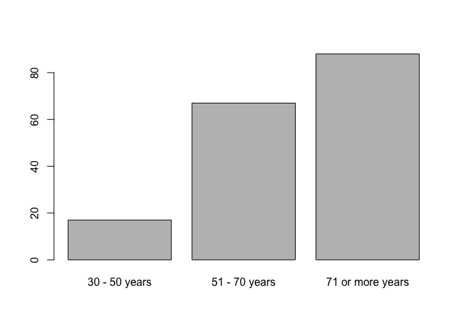

Gráficos
================

# Carpetas

``` r
#------------------------------------------------------------------------------
# folders
#------------------------------------------------------------------------------

# ---------------------------------------------------------
# get local path from relative path
# ---------------------------------------------------------


local_path <- function(x){
  paste0(tools::file_path_as_absolute('..'),x)
}

# Note: set current directory as working directory

# ---------------------------------------------------------
# folder with data files
# ---------------------------------------------------------

data_folder   <- local_path('/')
save_folder   <- local_path('/')

# ---------------------------------------------------------
# load main library
# ---------------------------------------------------------

library(dplyr)

# ---------------------------------------------------------
# check folder
# ---------------------------------------------------------

list.files(data_folder)
```

    ##  [1] "_prev_r4sda"                  "bar_plot.png"                
    ##  [3] "colmee_2021_lsa"              "dacarras.github.io"          
    ##  [5] "dev"                          "dev_0.1.0.tar.gz"            
    ##  [7] "dev.Rcheck"                   "distribution_left_lines.png" 
    ##  [9] "distribution_left.png"        "distribution_right_lines.png"
    ## [11] "distribution_right.png"       "distribution_sim.png"        
    ## [13] "distributions_names.png"      "distributions.png"           
    ## [15] "edu4046_mlm"                  "erce"                        
    ## [17] "erce_0.1.0.tar.gz"            "erce_2022_lsa"               
    ## [19] "erce.Rcheck"                  "ex_01.png"                   
    ## [21] "ex_02.png"                    "ex_04.png"                   
    ## [23] "ex_08.png"                    "ex_12.png"                   
    ## [25] "ex_cont.png"                  "ex_full.png"                 
    ## [27] "hist_width_01.png"            "hist_width_05.png"           
    ## [29] "invalsi_w1"                   "life_expectancy_plot.png"    
    ## [31] "mosaic.png"                   "psi2301"                     
    ## [33] "psi2301_0.1.0.tar.gz"         "psi2301_examples"            
    ## [35] "psi2301.Rcheck"               "psm5021_examples"            
    ## [37] "r4sda"                        "r4sda_0.1.0.tar.gz"          
    ## [39] "r4sda.Rcheck"                 "scatter.png"                 
    ## [41] "schpp_2022_corr"              "slides_templates"            
    ## [43] "techr"                        "techr_0.1.0.tar.gz"          
    ## [45] "techr.Rcheck"

# Instalar librerias

``` r
#------------------------------------------------------------------------------
# librerias
#------------------------------------------------------------------------------

# -----------------------------------------------
# librerias en uso
# -----------------------------------------------

install.packages('tidyverse')

install.packages('devtools')

credentials::set_github_pat()

devtools::install_github(
  'dacarras/psi2301',
  force = TRUE)
```

# Códigos Clase 02

## Abrir datos

``` r
#------------------------------------------------------------------------------
# cargar datos
#------------------------------------------------------------------------------

# -----------------------------------------------
# abrir datos
# -----------------------------------------------

data_life <- psi2301::life_2000

# -----------------------------------------------
# ver structura de datis
# -----------------------------------------------

str(data_life)
```

    ## tibble [172 × 7] (S3: tbl_df/tbl/data.frame)
    ##  $ country_name: chr [1:172] "Aruba" "Angola" "Albania" "United Arab Emirates" ...
    ##  $ year        : chr [1:172] "2000" "2000" "2000" "2000" ...
    ##  $ life        : num [1:172] 73.8 46.5 74 74.3 73.6 ...
    ##  $ n           : num [1:172] 1 1 1 1 1 1 1 1 1 1 ...
    ##  $ income_group: Factor w/ 4 levels "Low income","Lower middle income",..: 4 2 3 4 3 3 4 4 4 3 ...
    ##  $ income      : num [1:172] 20621 557 1127 33291 7708 ...
    ##  $ life_group  : chr [1:172] "71 or more years" "30 - 50 years" "71 or more years" "71 or more years" ...
    ##  - attr(*, "na.action")= 'omit' Named int [1:29] 2 15 25 29 37 38 51 56 69 75 ...
    ##   ..- attr(*, "names")= chr [1:29] "2" "15" "25" "29" ...

``` r
# -----------------------------------------------
# abrir datos de ingresos
# -----------------------------------------------

knitr::kable(data_life)
```

| country_name             | year | life |   n | income_group        | income | life_group       |
|:-------------------------|:-----|-----:|----:|:--------------------|-------:|:-----------------|
| Aruba                    | 2000 |   74 |   1 | High income         |  20621 | 71 or more years |
| Angola                   | 2000 |   47 |   1 | Lower middle income |    557 | 30 - 50 years    |
| Albania                  | 2000 |   74 |   1 | Upper middle income |   1127 | 71 or more years |
| United Arab Emirates     | 2000 |   74 |   1 | High income         |  33291 | 71 or more years |
| Argentina                | 2000 |   74 |   1 | Upper middle income |   7708 | 71 or more years |
| Armenia                  | 2000 |   71 |   1 | Upper middle income |    623 | 71 or more years |
| Antigua and Barbuda      | 2000 |   74 |   1 | High income         |  10871 | 71 or more years |
| Australia                | 2000 |   79 |   1 | High income         |  21679 | 71 or more years |
| Austria                  | 2000 |   78 |   1 | High income         |  24564 | 71 or more years |
| Azerbaijan               | 2000 |   67 |   1 | Upper middle income |    655 | 51 - 70 years    |
| Burundi                  | 2000 |   49 |   1 | Low income          |    136 | 30 - 50 years    |
| Belgium                  | 2000 |   78 |   1 | High income         |  23042 | 71 or more years |
| Benin                    | 2000 |   55 |   1 | Lower middle income |    511 | 51 - 70 years    |
| Bangladesh               | 2000 |   65 |   1 | Lower middle income |    418 | 51 - 70 years    |
| Bulgaria                 | 2000 |   72 |   1 | Upper middle income |   1621 | 71 or more years |
| Bahrain                  | 2000 |   74 |   1 | High income         |  13636 | 71 or more years |
| Bahamas, The             | 2000 |   72 |   1 | High income         |  27098 | 71 or more years |
| Bosnia and Herzegovina   | 2000 |   74 |   1 | Upper middle income |   1468 | 71 or more years |
| Belarus                  | 2000 |   69 |   1 | Upper middle income |   1276 | 51 - 70 years    |
| Belize                   | 2000 |   69 |   1 | Upper middle income |   3364 | 51 - 70 years    |
| Bermuda                  | 2000 |   78 |   1 | High income         |  56284 | 71 or more years |
| Bolivia                  | 2000 |   62 |   1 | Lower middle income |    998 | 51 - 70 years    |
| Barbados                 | 2000 |   77 |   1 | High income         |  11268 | 71 or more years |
| Brunei Darussalam        | 2000 |   73 |   1 | High income         |  18013 | 71 or more years |
| Bhutan                   | 2000 |   61 |   1 | Lower middle income |    718 | 51 - 70 years    |
| Central African Republic | 2000 |   44 |   1 | Low income          |    251 | 30 - 50 years    |
| Canada                   | 2000 |   79 |   1 | High income         |  24190 | 71 or more years |
| Switzerland              | 2000 |   80 |   1 | High income         |  37868 | 71 or more years |
| Channel Islands          | 2000 |   79 |   1 | High income         |  43382 | 71 or more years |
| Chile                    | 2000 |   76 |   1 | High income         |   5075 | 71 or more years |
| China                    | 2000 |   71 |   1 | Upper middle income |    959 | 71 or more years |
| Cote d’Ivoire            | 2000 |   50 |   1 | Lower middle income |    651 | 30 - 50 years    |
| Congo, Rep.              | 2000 |   52 |   1 | Lower middle income |   1030 | 51 - 70 years    |
| Colombia                 | 2000 |   73 |   1 | Upper middle income |   2520 | 71 or more years |
| Comoros                  | 2000 |   59 |   1 | Lower middle income |    646 | 51 - 70 years    |
| Cabo Verde               | 2000 |   69 |   1 | Lower middle income |   1259 | 51 - 70 years    |
| Costa Rica               | 2000 |   77 |   1 | Upper middle income |   3773 | 71 or more years |
| Cuba                     | 2000 |   77 |   1 | Upper middle income |   2747 | 71 or more years |
| Cyprus                   | 2000 |   78 |   1 | High income         |  14388 | 71 or more years |
| Czech Republic           | 2000 |   75 |   1 | High income         |   6029 | 71 or more years |
| Germany                  | 2000 |   78 |   1 | High income         |  23636 | 71 or more years |
| Djibouti                 | 2000 |   57 |   1 | Lower middle income |    768 | 51 - 70 years    |
| Denmark                  | 2000 |   77 |   1 | High income         |  30744 | 71 or more years |
| Dominican Republic       | 2000 |   69 |   1 | Upper middle income |   2869 | 51 - 70 years    |
| Ecuador                  | 2000 |   73 |   1 | Upper middle income |   1445 | 71 or more years |
| Egypt, Arab Rep.         | 2000 |   69 |   1 | Lower middle income |   1450 | 51 - 70 years    |
| Eritrea                  | 2000 |   55 |   1 | Low income          |    308 | 51 - 70 years    |
| Spain                    | 2000 |   79 |   1 | High income         |  14713 | 71 or more years |
| Ethiopia                 | 2000 |   52 |   1 | Low income          |    124 | 51 - 70 years    |
| Finland                  | 2000 |   77 |   1 | High income         |  24285 | 71 or more years |
| Fiji                     | 2000 |   66 |   1 | Upper middle income |   2077 | 51 - 70 years    |
| France                   | 2000 |   79 |   1 | High income         |  22364 | 71 or more years |
| Faroe Islands            | 2000 |   78 |   1 | High income         |  22653 | 71 or more years |
| Micronesia, Fed. Sts.    | 2000 |   65 |   1 | Lower middle income |   2172 | 51 - 70 years    |
| Gabon                    | 2000 |   58 |   1 | Upper middle income |   4126 | 51 - 70 years    |
| United Kingdom           | 2000 |   78 |   1 | High income         |  28150 | 71 or more years |
| Georgia                  | 2000 |   70 |   1 | Upper middle income |    750 | 51 - 70 years    |
| Ghana                    | 2000 |   57 |   1 | Lower middle income |    258 | 51 - 70 years    |
| Guinea                   | 2000 |   51 |   1 | Low income          |    363 | 51 - 70 years    |
| Gambia, The              | 2000 |   56 |   1 | Low income          |    594 | 51 - 70 years    |
| Equatorial Guinea        | 2000 |   53 |   1 | Upper middle income |   1726 | 51 - 70 years    |
| Greece                   | 2000 |   78 |   1 | High income         |  12043 | 71 or more years |
| Grenada                  | 2000 |   73 |   1 | Upper middle income |   5057 | 71 or more years |
| Greenland                | 2000 |   67 |   1 | High income         |  19004 | 51 - 70 years    |
| Guatemala                | 2000 |   68 |   1 | Upper middle income |   1664 | 51 - 70 years    |
| Guyana                   | 2000 |   65 |   1 | Upper middle income |    954 | 51 - 70 years    |
| Hong Kong SAR, China     | 2000 |   81 |   1 | High income         |  25757 | 71 or more years |
| Croatia                  | 2000 |   73 |   1 | High income         |   4842 | 71 or more years |
| Haiti                    | 2000 |   57 |   1 | Low income          |    812 | 51 - 70 years    |
| Hungary                  | 2000 |   71 |   1 | High income         |   4624 | 71 or more years |
| Indonesia                | 2000 |   66 |   1 | Upper middle income |    780 | 51 - 70 years    |
| India                    | 2000 |   63 |   1 | Lower middle income |    443 | 51 - 70 years    |
| Ireland                  | 2000 |   77 |   1 | High income         |  26241 | 71 or more years |
| Iceland                  | 2000 |   80 |   1 | High income         |  32018 | 71 or more years |
| Israel                   | 2000 |   79 |   1 | High income         |  21044 | 71 or more years |
| Italy                    | 2000 |   80 |   1 | High income         |  20088 | 71 or more years |
| Jamaica                  | 2000 |   74 |   1 | Upper middle income |   3385 | 71 or more years |
| Jordan                   | 2000 |   72 |   1 | Upper middle income |   1652 | 71 or more years |
| Japan                    | 2000 |   81 |   1 | High income         |  38532 | 71 or more years |
| Kazakhstan               | 2000 |   66 |   1 | Upper middle income |   1229 | 51 - 70 years    |
| Kyrgyz Republic          | 2000 |   69 |   1 | Lower middle income |    280 | 51 - 70 years    |
| Cambodia                 | 2000 |   58 |   1 | Lower middle income |    303 | 51 - 70 years    |
| Kiribati                 | 2000 |   63 |   1 | Lower middle income |    797 | 51 - 70 years    |
| Korea, Rep.              | 2000 |   76 |   1 | High income         |  12257 | 71 or more years |
| Kuwait                   | 2000 |   73 |   1 | High income         |  18440 | 71 or more years |
| Lao PDR                  | 2000 |   59 |   1 | Lower middle income |    325 | 51 - 70 years    |
| Lebanon                  | 2000 |   75 |   1 | Upper middle income |   4492 | 71 or more years |
| Liberia                  | 2000 |   52 |   1 | Low income          |    307 | 51 - 70 years    |
| St. Lucia                | 2000 |   73 |   1 | Upper middle income |   5950 | 71 or more years |
| Liechtenstein            | 2000 |   77 |   1 | High income         |  74854 | 71 or more years |
| Sri Lanka                | 2000 |   71 |   1 | Lower middle income |    870 | 71 or more years |
| Lesotho                  | 2000 |   48 |   1 | Lower middle income |    436 | 30 - 50 years    |
| Lithuania                | 2000 |   72 |   1 | High income         |   3293 | 71 or more years |
| Luxembourg               | 2000 |   78 |   1 | High income         |  48736 | 71 or more years |
| Macao SAR, China         | 2000 |   80 |   1 | High income         |  15710 | 71 or more years |
| Morocco                  | 2000 |   69 |   1 | Lower middle income |   1335 | 51 - 70 years    |
| Moldova                  | 2000 |   67 |   1 | Lower middle income |    441 | 51 - 70 years    |
| Madagascar               | 2000 |   58 |   1 | Low income          |    294 | 51 - 70 years    |
| Mexico                   | 2000 |   74 |   1 | Upper middle income |   7158 | 71 or more years |
| Marshall Islands         | 2000 |   65 |   1 | Upper middle income |   2273 | 51 - 70 years    |
| North Macedonia          | 2000 |   73 |   1 | Upper middle income |   1854 | 71 or more years |
| Mali                     | 2000 |   48 |   1 | Low income          |    270 | 30 - 50 years    |
| Malta                    | 2000 |   78 |   1 | High income         |  10432 | 71 or more years |
| Myanmar                  | 2000 |   60 |   1 | Lower middle income |    191 | 51 - 70 years    |
| Montenegro               | 2000 |   73 |   1 | Upper middle income |   1627 | 71 or more years |
| Mongolia                 | 2000 |   63 |   1 | Lower middle income |    474 | 51 - 70 years    |
| Mozambique               | 2000 |   49 |   1 | Low income          |    319 | 30 - 50 years    |
| Mauritania               | 2000 |   61 |   1 | Lower middle income |    677 | 51 - 70 years    |
| Mauritius                | 2000 |   72 |   2 | High income         |   3929 | 71 or more years |
| Malawi                   | 2000 |   45 |   1 | Low income          |    156 | 30 - 50 years    |
| Malaysia                 | 2000 |   73 |   1 | Upper middle income |   4044 | 71 or more years |
| Namibia                  | 2000 |   52 |   1 | Upper middle income |   2136 | 51 - 70 years    |
| New Caledonia            | 2000 |   75 |   1 | High income         |  12580 | 71 or more years |
| Niger                    | 2000 |   50 |   1 | Low income          |    197 | 30 - 50 years    |
| Nigeria                  | 2000 |   46 |   1 | Lower middle income |    568 | 30 - 50 years    |
| Nicaragua                | 2000 |   70 |   1 | Lower middle income |   1008 | 51 - 70 years    |
| Netherlands              | 2000 |   78 |   1 | High income         |  26149 | 71 or more years |
| Norway                   | 2000 |   79 |   1 | High income         |  38131 | 71 or more years |
| Nepal                    | 2000 |   62 |   1 | Lower middle income |    229 | 51 - 70 years    |
| New Zealand              | 2000 |   79 |   1 | High income         |  13641 | 71 or more years |
| Oman                     | 2000 |   72 |   1 | High income         |   8601 | 71 or more years |
| Pakistan                 | 2000 |   63 |   1 | Lower middle income |    576 | 51 - 70 years    |
| Panama                   | 2000 |   75 |   1 | High income         |   4060 | 71 or more years |
| Peru                     | 2000 |   71 |   1 | Upper middle income |   1956 | 71 or more years |
| Philippines              | 2000 |   69 |   1 | Lower middle income |   1073 | 51 - 70 years    |
| Papua New Guinea         | 2000 |   59 |   1 | Lower middle income |    602 | 51 - 70 years    |
| Poland                   | 2000 |   74 |   1 | High income         |   4501 | 71 or more years |
| Puerto Rico              | 2000 |   77 |   1 | High income         |  16192 | 71 or more years |
| Portugal                 | 2000 |   76 |   1 | High income         |  11498 | 71 or more years |
| West Bank and Gaza       | 2000 |   71 |   1 | Lower middle income |   1476 | 71 or more years |
| French Polynesia         | 2000 |   72 |   1 | High income         |  14324 | 71 or more years |
| Qatar                    | 2000 |   77 |   1 | High income         |  29976 | 71 or more years |
| Romania                  | 2000 |   71 |   1 | High income         |   1660 | 71 or more years |
| Russian Federation       | 2000 |   65 |   1 | Upper middle income |   1772 | 51 - 70 years    |
| Rwanda                   | 2000 |   49 |   1 | Low income          |    261 | 30 - 50 years    |
| Saudi Arabia             | 2000 |   73 |   1 | High income         |   9171 | 71 or more years |
| Sudan                    | 2000 |   58 |   1 | Low income          |    366 | 51 - 70 years    |
| Senegal                  | 2000 |   58 |   1 | Lower middle income |    605 | 51 - 70 years    |
| Singapore                | 2000 |   78 |   1 | High income         |  23852 | 71 or more years |
| Solomon Islands          | 2000 |   67 |   1 | Lower middle income |   1040 | 51 - 70 years    |
| Sierra Leone             | 2000 |   39 |   1 | Low income          |    139 | 30 - 50 years    |
| El Salvador              | 2000 |   69 |   1 | Lower middle income |   2002 | 51 - 70 years    |
| Serbia                   | 2000 |   72 |   1 | Upper middle income |    915 | 71 or more years |
| Suriname                 | 2000 |   68 |   1 | Upper middle income |   2012 | 51 - 70 years    |
| Slovak Republic          | 2000 |   73 |   1 | High income         |   5413 | 71 or more years |
| Slovenia                 | 2000 |   75 |   1 | High income         |  10201 | 71 or more years |
| Sweden                   | 2000 |   80 |   1 | High income         |  29625 | 71 or more years |
| Eswatini                 | 2000 |   47 |   1 | Lower middle income |   1729 | 30 - 50 years    |
| Seychelles               | 2000 |   73 |   1 | High income         |   7579 | 71 or more years |
| Syrian Arab Republic     | 2000 |   73 |   1 | Low income          |   1178 | 71 or more years |
| Chad                     | 2000 |   48 |   1 | Low income          |    166 | 30 - 50 years    |
| Togo                     | 2000 |   53 |   1 | Low income          |    302 | 51 - 70 years    |
| Tajikistan               | 2000 |   62 |   1 | Low income          |    138 | 51 - 70 years    |
| Turkmenistan             | 2000 |   64 |   1 | Upper middle income |    643 | 51 - 70 years    |
| Timor-Leste              | 2000 |   59 |   1 | Lower middle income |    415 | 51 - 70 years    |
| Tonga                    | 2000 |   70 |   1 | Upper middle income |   2091 | 51 - 70 years    |
| Trinidad and Tobago      | 2000 |   69 |   1 | High income         |   6435 | 51 - 70 years    |
| Tunisia                  | 2000 |   73 |   1 | Lower middle income |   2212 | 71 or more years |
| Uganda                   | 2000 |   46 |   1 | Low income          |    262 | 30 - 50 years    |
| Ukraine                  | 2000 |   68 |   1 | Lower middle income |    636 | 51 - 70 years    |
| Uruguay                  | 2000 |   75 |   1 | High income         |   6875 | 71 or more years |
| United States            | 2000 |   77 |   1 | High income         |  36335 | 71 or more years |
| Uzbekistan               | 2000 |   67 |   1 | Lower middle income |    558 | 51 - 70 years    |
| Venezuela, RB            | 2000 |   72 |   1 | Upper middle income |   4842 | 71 or more years |
| Vietnam                  | 2000 |   73 |   1 | Lower middle income |    390 | 71 or more years |
| Vanuatu                  | 2000 |   67 |   1 | Lower middle income |   1471 | 51 - 70 years    |
| Samoa                    | 2000 |   69 |   1 | Upper middle income |   1542 | 51 - 70 years    |
| Kosovo                   | 2000 |   68 |   1 | Upper middle income |   1088 | 51 - 70 years    |
| Yemen, Rep.              | 2000 |   61 |   1 | Low income          |    554 | 51 - 70 years    |
| South Africa             | 2000 |   56 |   1 | Upper middle income |   3032 | 51 - 70 years    |
| Zambia                   | 2000 |   44 |   1 | Lower middle income |    346 | 30 - 50 years    |
| Zimbabwe                 | 2000 |   45 |   1 | Lower middle income |    563 | 30 - 50 years    |

# Plots en R base

## Histogramas en R base

``` r
#------------------------------------------------------------------------------
# histogramas en R base
#------------------------------------------------------------------------------

# -----------------------------------------------
# histogram binwidth = 5
# -----------------------------------------------
hist(
  data_life$life,     # emplea el vector de datos
  breaks = 5,         # define el ancho del intervalo
  col    = "#397CDA", # define el color
  freq   = TRUE       # emplea frecuencias
  )
```

<!-- -->

``` r
# -----------------------------------------------
# histogram binwidth = 5
# -----------------------------------------------
hist(
  data_life$life,     # emplea el vector de datos
  breaks = 5,         # define el ancho del intervalo
  col    = "#397CDA", # define el color
  freq   = TRUE,      # emplea frecuencias
  main   = 'Histograma de años expectativas de vida',
  xlab   = 'Años de expectativas de vida (2000)'
  )
```

<!-- -->

``` r
# -----------------------------------------------
# histogram binwidth = 8
# -----------------------------------------------
hist(
  data_life$life,     # emplea el vector de datos
  breaks = 8,         # define el ancho del intervalo
  col    = "#397CDA", # define el color
  freq   = TRUE,      # emplea frecuencias
  main   = 'Histograma de años expectativas de vida',
  xlab   = 'Años de expectativas de vida (2000)'
  )
```

<!-- -->

## Scatter en R base

``` r
#------------------------------------------------------------------------------
# scatter en R base
#------------------------------------------------------------------------------

# -----------------------------------------------
# scatter
# -----------------------------------------------

plot(
  x = data_life$income, # define variable eje x
  y = data_life$life,   # define variable eje y
  col    = "#397CDA"    # define el color
  )
```

<!-- -->

``` r
# -----------------------------------------------
# scatter con titulos
# -----------------------------------------------

plot(
  x = data_life$income, # define variable eje x
  y = data_life$life,   # define variable eje y
  col    = "#397CDA",   # define el color
  main   = 'Scatter life expectancy at birth by GDP',
  ylab   = 'Life expectancy at birth',
  xlab   = 'Gross Domestic Product per capita (GDP)'
  )
```

<!-- -->

## Mosaic en R base

``` r
#------------------------------------------------------------------------------
# mosaicplot en R base
#------------------------------------------------------------------------------

# -----------------------------------------------
# mosaicplot
# -----------------------------------------------

cross_table <- table(data_life$income_group, data_life$life_group)

mosaicplot(cross_table)
```

<!-- -->

``` r
# -----------------------------------------------
# mosaicplot con colores
# -----------------------------------------------

mosaicplot(
  cross_table,
  col = c('red','grey80','grey20')
  )
```

<!-- -->

``` r
# -----------------------------------------------
# mosaicplot con ejes
# -----------------------------------------------

mosaicplot(
  cross_table,
  col = c('red','grey80','grey20'),
  main   = 'Mosaic of Life expectancy at birth (ranges) by Income groups',
  ylab   = 'Life expectancy at birth (ranges)',
  xlab   = 'Income groups'
  )
```

<!-- -->

## Barplot en R base

``` r
#------------------------------------------------------------------------------
# barplot en R base
#------------------------------------------------------------------------------

# -----------------------------------------------
# barplot
# -----------------------------------------------

data_barplot <- table(data_life$life_group)

barplot(
  data_barplot
  )
```

<!-- -->

``` r
# -----------------------------------------------
# barplot con colores
# -----------------------------------------------

barplot(
  data_barplot,
  col = c('#397CDA')
  )
```

<!-- -->

``` r
# -----------------------------------------------
# barplot con ejes
# -----------------------------------------------

barplot(
  data_barplot,
  col = c('#397CDA'),
  xlab   = 'Grouped Life Expectancy at birth'
  )
```

<!-- -->
