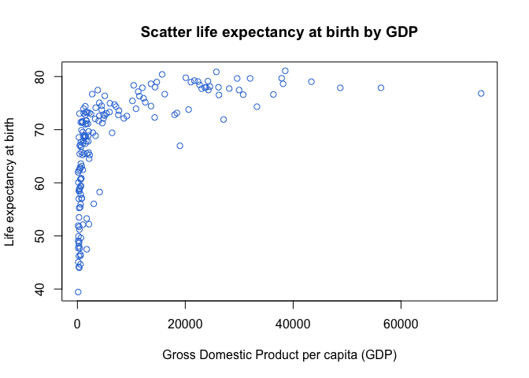
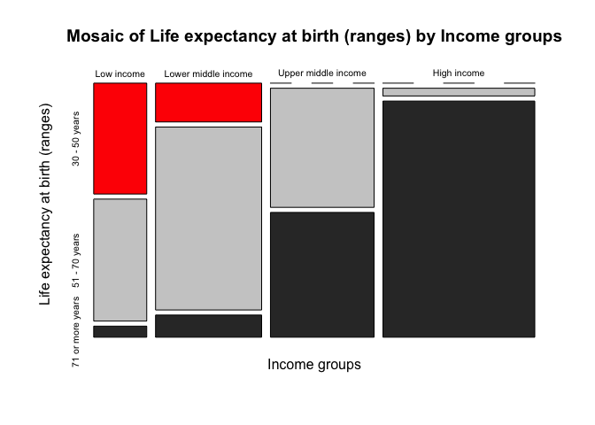

Gráficos
================

# Carpetas

``` r
#------------------------------------------------------------------------------
# folders
#------------------------------------------------------------------------------

# ---------------------------------------------------------
# get local path from relative path
# ---------------------------------------------------------


local_path <- function(x){
  paste0(tools::file_path_as_absolute('..'),x)
}

# Note: set current directory as working directory

# ---------------------------------------------------------
# folder with data files
# ---------------------------------------------------------

data_folder   <- local_path('/')
save_folder   <- local_path('/')

# ---------------------------------------------------------
# load main library
# ---------------------------------------------------------

library(dplyr)

# ---------------------------------------------------------
# check folder
# ---------------------------------------------------------

list.files(data_folder)
```

    ##  [1] "_prev_r4sda"                  "bar_plot.png"                
    ##  [3] "colmee_2021_lsa"              "dacarras.github.io"          
    ##  [5] "dev"                          "dev_0.1.0.tar.gz"            
    ##  [7] "dev.Rcheck"                   "distribution_left_lines.png" 
    ##  [9] "distribution_left.png"        "distribution_right_lines.png"
    ## [11] "distribution_right.png"       "distribution_sim.png"        
    ## [13] "distributions_names.png"      "distributions.png"           
    ## [15] "edu4046_mlm"                  "erce"                        
    ## [17] "erce_0.1.0.tar.gz"            "erce_2022_lsa"               
    ## [19] "erce.Rcheck"                  "ex_01.png"                   
    ## [21] "ex_02.png"                    "ex_04.png"                   
    ## [23] "ex_08.png"                    "ex_12.png"                   
    ## [25] "ex_cont.png"                  "ex_full.png"                 
    ## [27] "hist_width_01.png"            "hist_width_05.png"           
    ## [29] "invalsi_w1"                   "life_expectancy_plot.png"    
    ## [31] "mosaic.png"                   "psi2301"                     
    ## [33] "psi2301_0.1.0.tar.gz"         "psi2301_examples"            
    ## [35] "psi2301.Rcheck"               "psm5021_examples"            
    ## [37] "r4sda"                        "r4sda_0.1.0.tar.gz"          
    ## [39] "r4sda.Rcheck"                 "scatter.png"                 
    ## [41] "schpp_2022_corr"              "slides_templates"            
    ## [43] "techr"                        "techr_0.1.0.tar.gz"          
    ## [45] "techr.Rcheck"

# Códigos Clase 02

## Abrir y transformar datos

``` r
# -----------------------------------------------
# abrir datos
# -----------------------------------------------

data_life_wide <- readxl::read_xlsx(
                  'life_expectancy_2018.xlsx',
                  sheet = 'plain_data')

income <- readxl::read_xlsx('income_2000.xlsx')

# -----------------------------------------------
# transformar datos a long format
# -----------------------------------------------

life_stacked <- data_life_wide %>%
                dplyr::filter(type == 'country') %>%
                tidyr::gather('year', 'life', 
                  -country_name, -country_code, -indicator_name, -indicator_code, 
                  -income_group, -region, -type) %>%
                dplyr::select(country_name, year, life, region, income_group) %>%
                mutate(year_num = as.numeric(year))


# -----------------------------------------------
# tabla de datos
# -----------------------------------------------

str(data_life_wide)
```

    ## tibble [264 × 66] (S3: tbl_df/tbl/data.frame)
    ##  $ country_name  : chr [1:264] "Aruba" "Afghanistan" "Angola" "Albania" ...
    ##  $ country_code  : chr [1:264] "ABW" "AFG" "AGO" "ALB" ...
    ##  $ indicator_name: chr [1:264] "Life expectancy at birth, total (years)" "Life expectancy at birth, total (years)" "Life expectancy at birth, total (years)" "Life expectancy at birth, total (years)" ...
    ##  $ indicator_code: chr [1:264] "SP.DYN.LE00.IN" "SP.DYN.LE00.IN" "SP.DYN.LE00.IN" "SP.DYN.LE00.IN" ...
    ##  $ 1960          : num [1:264] 65.7 32.4 37.5 62.3 NA ...
    ##  $ 1961          : num [1:264] 66.1 33 37.8 63.3 NA ...
    ##  $ 1962          : num [1:264] 66.4 33.5 38.1 64.2 NA ...
    ##  $ 1963          : num [1:264] 66.8 34 38.4 64.9 NA ...
    ##  $ 1964          : num [1:264] 67.1 34.5 38.8 65.5 NA ...
    ##  $ 1965          : num [1:264] 67.4 34.9 39.1 65.8 NA ...
    ##  $ 1966          : num [1:264] 67.8 35.4 39.5 66.1 NA ...
    ##  $ 1967          : num [1:264] 68.1 35.9 39.8 66.3 NA ...
    ##  $ 1968          : num [1:264] 68.4 36.4 40.2 66.5 NA ...
    ##  $ 1969          : num [1:264] 68.8 36.9 40.5 66.7 NA ...
    ##  $ 1970          : num [1:264] 69.1 37.4 40.9 66.9 NA ...
    ##  $ 1971          : num [1:264] 69.5 37.9 41.3 67.2 NA ...
    ##  $ 1972          : num [1:264] 69.9 38.5 41.6 67.6 NA ...
    ##  $ 1973          : num [1:264] 70.2 39 42 68 NA ...
    ##  $ 1974          : num [1:264] 70.5 39.6 42.4 68.3 NA ...
    ##  $ 1975          : num [1:264] 70.8 40.1 42.7 68.7 NA ...
    ##  $ 1976          : num [1:264] 71.1 40.7 43.1 69.1 NA ...
    ##  $ 1977          : num [1:264] 71.4 41.3 43.4 69.4 NA ...
    ##  $ 1978          : num [1:264] 71.7 41.9 43.7 69.7 NA ...
    ##  $ 1979          : num [1:264] 72 42.6 43.9 70 NA ...
    ##  $ 1980          : num [1:264] 72.3 43.2 44.2 70.2 NA ...
    ##  $ 1981          : num [1:264] 72.5 43.9 44.4 70.4 NA ...
    ##  $ 1982          : num [1:264] 72.8 44.6 44.6 70.6 NA ...
    ##  $ 1983          : num [1:264] 72.9 45.3 44.8 70.9 NA ...
    ##  $ 1984          : num [1:264] 73.1 46 45 71.1 NA ...
    ##  $ 1985          : num [1:264] 73.2 46.8 45.1 71.4 NA ...
    ##  $ 1986          : num [1:264] 73.3 47.5 45.2 71.6 NA ...
    ##  $ 1987          : num [1:264] 73.3 48.2 45.3 71.8 NA ...
    ##  $ 1988          : num [1:264] 73.4 48.9 45.3 71.8 NA ...
    ##  $ 1989          : num [1:264] 73.4 49.6 45.3 71.9 NA ...
    ##  $ 1990          : num [1:264] 73.5 50.3 45.3 71.8 NA ...
    ##  $ 1991          : num [1:264] 73.5 51 45.3 71.8 NA ...
    ##  $ 1992          : num [1:264] 73.5 51.6 45.2 71.8 NA ...
    ##  $ 1993          : num [1:264] 73.6 52.3 45.2 71.9 NA ...
    ##  $ 1994          : num [1:264] 73.6 52.8 45.2 72 NA ...
    ##  $ 1995          : num [1:264] 73.6 53.4 45.2 72.2 NA ...
    ##  $ 1996          : num [1:264] 73.6 53.9 45.4 72.5 NA ...
    ##  $ 1997          : num [1:264] 73.7 54.4 45.5 72.8 NA ...
    ##  $ 1998          : num [1:264] 73.7 54.9 45.8 73.2 NA ...
    ##  $ 1999          : num [1:264] 73.7 55.4 46.1 73.6 NA ...
    ##  $ 2000          : num [1:264] 73.8 55.8 46.5 74 NA ...
    ##  $ 2001          : num [1:264] 73.9 56.3 47.1 74.3 NA ...
    ##  $ 2002          : num [1:264] 73.9 56.8 47.7 74.6 NA ...
    ##  $ 2003          : num [1:264] 74 57.3 48.4 74.8 NA ...
    ##  $ 2004          : num [1:264] 74.2 57.8 49.3 75 NA ...
    ##  $ 2005          : num [1:264] 74.3 58.3 50.2 75.2 NA ...
    ##  $ 2006          : num [1:264] 74.4 58.8 51.1 75.4 NA ...
    ##  $ 2007          : num [1:264] 74.6 59.4 52.2 75.6 NA ...
    ##  $ 2008          : num [1:264] 74.7 59.9 53.2 75.9 NA ...
    ##  $ 2009          : num [1:264] 74.9 60.5 54.3 76.2 NA ...
    ##  $ 2010          : num [1:264] 75 61 55.4 76.6 NA ...
    ##  $ 2011          : num [1:264] 75.2 61.6 56.3 76.9 NA ...
    ##  $ 2012          : num [1:264] 75.3 62.1 57.2 77.3 NA ...
    ##  $ 2013          : num [1:264] 75.4 62.5 58.1 77.6 NA ...
    ##  $ 2014          : num [1:264] 75.6 63 58.8 77.8 NA ...
    ##  $ 2015          : num [1:264] 75.7 63.4 59.4 78 NA ...
    ##  $ 2016          : num [1:264] 75.9 63.8 59.9 78.2 NA ...
    ##  $ 2017          : num [1:264] 76 64.1 60.4 78.3 NA ...
    ##  $ 2018          : num [1:264] 76.2 64.5 60.8 78.5 NA ...
    ##  $ income_group  : chr [1:264] "High income" "Low income" "Lower middle income" "Upper middle income" ...
    ##  $ region        : chr [1:264] "Latin America & Caribbean" "South Asia" "Sub-Saharan Africa" "Europe & Central Asia" ...
    ##  $ type          : chr [1:264] "country" "country" "country" "country" ...

``` r
# -----------------------------------------------
# tabla de datos
# -----------------------------------------------

str(life_stacked)
```

    ## tibble [12,803 × 6] (S3: tbl_df/tbl/data.frame)
    ##  $ country_name: chr [1:12803] "Aruba" "Afghanistan" "Angola" "Albania" ...
    ##  $ year        : chr [1:12803] "1960" "1960" "1960" "1960" ...
    ##  $ life        : num [1:12803] 65.7 32.4 37.5 62.3 NA ...
    ##  $ region      : chr [1:12803] "Latin America & Caribbean" "South Asia" "Sub-Saharan Africa" "Europe & Central Asia" ...
    ##  $ income_group: chr [1:12803] "High income" "Low income" "Lower middle income" "Upper middle income" ...
    ##  $ year_num    : num [1:12803] 1960 1960 1960 1960 1960 1960 1960 1960 1960 1960 ...

``` r
# -----------------------------------------------
# preparar datos para histograma
# -----------------------------------------------

example_4 <- life_stacked %>%
             dplyr::filter(year %in% c(2000)) %>%
             na.omit() %>%
             mutate(age = round(life, 0)) %>%
             mutate(observed = 1) %>%
             group_by(life) %>%
             mutate(count = cumsum(observed)) %>%
             ungroup() %>%
             dplyr::select(country_name, year, life, count) %>%
             rename(n = count) %>%
             print
```

    ## # A tibble: 201 × 4
    ##    country_name         year   life     n
    ##    <chr>                <chr> <dbl> <dbl>
    ##  1 Aruba                2000   73.8     1
    ##  2 Afghanistan          2000   55.8     1
    ##  3 Angola               2000   46.5     1
    ##  4 Albania              2000   74.0     1
    ##  5 United Arab Emirates 2000   74.3     1
    ##  6 Argentina            2000   73.6     1
    ##  7 Armenia              2000   71.4     1
    ##  8 Antigua and Barbuda  2000   73.9     1
    ##  9 Australia            2000   79.2     1
    ## 10 Austria              2000   78.1     1
    ## # … with 191 more rows

``` r
# -----------------------------------------------
# preparar datos para scatter
# -----------------------------------------------

example_5 <- life_stacked %>%
             dplyr::filter(year %in% c(2000)) %>%
             na.omit() %>%
             mutate(age = round(life, 0)) %>%
             mutate(observed = 1) %>%
             group_by(life) %>%
             mutate(count = cumsum(observed)) %>%
             ungroup() %>%
             dplyr::select(country_name, year, life, count) %>%
             rename(n = count) %>%
             dplyr::left_join(., 
              dplyr::select(income, country_name, income),
              by = 'country_name') %>%
             print
```

    ## # A tibble: 201 × 5
    ##    country_name         year   life     n income
    ##    <chr>                <chr> <dbl> <dbl>  <dbl>
    ##  1 Aruba                2000   73.8     1 20621.
    ##  2 Afghanistan          2000   55.8     1    NA 
    ##  3 Angola               2000   46.5     1   557.
    ##  4 Albania              2000   74.0     1  1127.
    ##  5 United Arab Emirates 2000   74.3     1 33291.
    ##  6 Argentina            2000   73.6     1  7708.
    ##  7 Armenia              2000   71.4     1   623.
    ##  8 Antigua and Barbuda  2000   73.9     1 10871.
    ##  9 Australia            2000   79.2     1 21679.
    ## 10 Austria              2000   78.1     1 24564.
    ## # … with 191 more rows

``` r
# -----------------------------------------------
# preparar datos para mosaico
# -----------------------------------------------

example_6 <- life_stacked %>%
             dplyr::filter(year %in% c(2000)) %>%
             na.omit() %>%
             mutate(age = round(life, 0)) %>%
             mutate(observed = 1) %>%
             group_by(life) %>%
             mutate(count = cumsum(observed)) %>%
             ungroup() %>%
             dplyr::select(country_name, year, life, count, income_group) %>%
             rename(n = count) %>%
             dplyr::left_join(., 
              dplyr::select(income, country_name, income),
              by = 'country_name') %>%
             mutate(life_group = case_when(
              between(life, 30,50) ~ '30 - 50 years',
              between(life, 51,70) ~ '51 - 70 years',
              between(life, 71,100) ~'71 or more years',
              )) %>%
             dplyr::select(country_name, life_group, income_group) %>%
             na.omit() %>%
             mutate(income_group = factor(income_group, levels = c(
            'Low income',
            'Lower middle income',
            'Upper middle income',
            'High income'
            ))) %>% print
```

    ## # A tibble: 180 × 3
    ##    country_name         life_group       income_group       
    ##    <chr>                <chr>            <fct>              
    ##  1 Aruba                71 or more years High income        
    ##  2 Afghanistan          51 - 70 years    Low income         
    ##  3 Angola               30 - 50 years    Lower middle income
    ##  4 Albania              71 or more years Upper middle income
    ##  5 United Arab Emirates 71 or more years High income        
    ##  6 Argentina            71 or more years Upper middle income
    ##  7 Armenia              71 or more years Upper middle income
    ##  8 Antigua and Barbuda  71 or more years High income        
    ##  9 Australia            71 or more years High income        
    ## 10 Austria              71 or more years High income        
    ## # … with 170 more rows

# Plots en R base

## Histogramas en R base

``` r
#------------------------------------------------------------------------------
# histogramas en R base
#------------------------------------------------------------------------------

# -----------------------------------------------
# histogram binwidth = 5
# -----------------------------------------------
hist(
  example_4$life,     # emplea el vector de datos
  breaks = 5,         # define el ancho del intervalo
  col    = "#397CDA", # define el color
  freq   = TRUE       # emplea frecuencias
  )
```

<!-- -->

``` r
# -----------------------------------------------
# histogram binwidth = 5
# -----------------------------------------------
hist(
  example_4$life,     # emplea el vector de datos
  breaks = 5,         # define el ancho del intervalo
  col    = "#397CDA", # define el color
  freq   = TRUE,      # emplea frecuencias
  main   = 'Histograma de años expectativas de vida',
  xlab   = 'Años de expectativas de vida (2000)'
  )
```

<!-- -->

``` r
# -----------------------------------------------
# histogram binwidth = 8
# -----------------------------------------------
hist(
  example_4$life,     # emplea el vector de datos
  breaks = 8,         # define el ancho del intervalo
  col    = "#397CDA", # define el color
  freq   = TRUE,      # emplea frecuencias
  main   = 'Histograma de años expectativas de vida',
  xlab   = 'Años de expectativas de vida (2000)'
  )
```

<!-- -->

## Scatter en R base

``` r
#------------------------------------------------------------------------------
# scatter en R base
#------------------------------------------------------------------------------

# -----------------------------------------------
# scatter
# -----------------------------------------------

plot(
  x = example_5$income, # define variable eje x
  y = example_5$life,   # define variable eje y
  col    = "#397CDA"    # define el color
  )
```

<!-- -->

``` r
# -----------------------------------------------
# scatter con titulos
# -----------------------------------------------

plot(
  x = example_5$income, # define variable eje x
  y = example_5$life,   # define variable eje y
  col    = "#397CDA",   # define el color
  main   = 'Scatter life expectancy at birht by GDP',
  ylab   = 'Life expectancy at birth',
  xlab   = 'Gross Domestic Product per capita (GDP)'
  )
```

<!-- -->

## Mosaic en R base

``` r
#------------------------------------------------------------------------------
# mosaicplot en R base
#------------------------------------------------------------------------------

# -----------------------------------------------
# mosaicplot
# -----------------------------------------------

cross_table <- table(example_6$income_group, example_6$life_group)

mosaicplot(cross_table)
```

<!-- -->

``` r
# -----------------------------------------------
# mosaicplot con colores
# -----------------------------------------------

mosaicplot(
  cross_table,
  col = c('red','grey80','grey20')
  )
```

<!-- -->

``` r
# -----------------------------------------------
# mosaicplot con ejes
# -----------------------------------------------

mosaicplot(
  cross_table,
  col = c('red','grey80','grey20'),
  main   = 'Mosaic of Life expectancy at birth (ranges) by Income groups',
  ylab   = 'Life expectancy at birth (ranges)',
  xlab   = 'Income groups'
  )
```

<!-- -->

## Barplot en R base

``` r
#------------------------------------------------------------------------------
# barplot en R base
#------------------------------------------------------------------------------

# -----------------------------------------------
# barplot
# -----------------------------------------------

data_barplot <- table(example_6$life_group)

barplot(
  data_barplot
  )
```

<!-- -->

``` r
# -----------------------------------------------
# barplot con colores
# -----------------------------------------------

barplot(
  data_barplot,
  col = c('#397CDA')
  )
```

<!-- -->

``` r
# -----------------------------------------------
# barplot con ejes
# -----------------------------------------------

barplot(
  data_barplot,
  col = c('#397CDA'),
  xlab   = 'Grouped Life Expectancy at birth'
  )
```

<!-- -->
