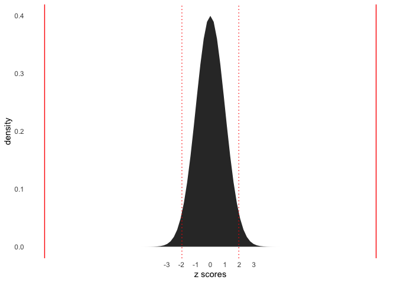
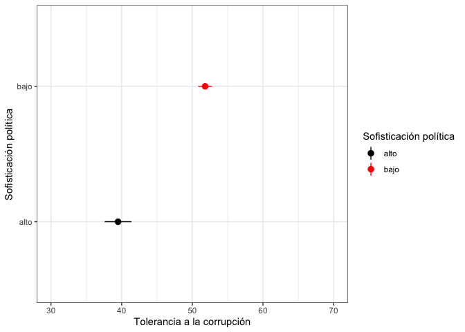

Preguntas foro 20210419
================

# Pregunta 20210419

# Respuesta

> Nota: la **alternativa 1**, debiera ser la forma más intuitiva de
> seguir; la **alternativa 3** tiene la ventaja de ser exportable a
> excel.

## Tabla de estadísticos

``` r
#------------------------------------------------------------------------------
# statistics in tables
#------------------------------------------------------------------------------


url_file  <-'https://raw.github.com/dacarras/psi2301_examples/master/data/corr_chl_16.rds'
data_corr <- readRDS(url(url_file))

# -----------------------------------------------
# variable table
# -----------------------------------------------

library(dplyr)
```

    ## 
    ## Attaching package: 'dplyr'

    ## The following objects are masked from 'package:stats':
    ## 
    ##     filter, lag

    ## The following objects are masked from 'package:base':
    ## 
    ##     intersect, setdiff, setequal, union

``` r
data_corr %>%
r4sda::variables_table() %>%
dplyr::select(variable, type, labels) %>%
knitr::kable(., digits = 2)
```

    ## Loading required package: purrr

    ## Loading required package: stringr

| variable | type | labels                                                                                           |
|:---------|:-----|:-------------------------------------------------------------------------------------------------|
| ctry     | chr  | país (CHL = Chile)                                                                               |
| corr     | dbl  | tolerancia a la corrupción (M = 50, SD = 10)                                                     |
| edu      | dbl  | educación de los padres (numérica) (1 = terciaria, 0 = no terciaria)                             |
| tert     | chr  | educación de los padres (text0) (tertiary, none-tertiary)                                        |
| sof      | dbl  | niveles de conocimiento cívico (numérico) (1 = alta sofisticación, 0 = menor sofisticación)      |
| sof\_l   | chr  | niveles de conocimiento cívico (text) (highest = alta sofisticación, else = menor sofisticación) |

``` r
# -----------------------------------------------
# standard deviation of the population estimate
# -----------------------------------------------

sd_pop <- function(x){
n <- length(na.omit(x))
sqrt((n-1)/n) * sd(x, na.rm = TRUE)
}

# -----------------------------------------------
# descriptives
# -----------------------------------------------

table_null <- data_corr %>%
  summarize(
    mean = mean(corr, na.rm = TRUE),
    sd = sd(corr, na.rm = TRUE),
    n = n(),
    se = sd/sqrt(n),
    ll = mean - 1.96*se,
    ul = mean + 1.96*se
  )

table_groups <- data_corr %>%
  group_by(sof) %>%
  summarize(
    mean = mean(corr, na.rm = TRUE),
    sd = sd(corr, na.rm = TRUE),
    n = n(),
    se = sd/sqrt(n),
    ll = mean - 1.96*se,
    ul = mean + 1.96*se
  )

table_desc <- dplyr::bind_rows(
              table_null, 
              table_groups
              ) %>%
              mutate(groups = c(
                'total',
                'menor',
                'mayor'
                ))

# -----------------------------------------------
# display table
# -----------------------------------------------

table_desc %>%
dplyr::select(groups, mean, sd, n, se, ll, ul) %>%
knitr::kable(., digits = 2)
```

| groups |  mean |    sd |   n |   se |    ll |    ul |
|:-------|------:|------:|----:|-----:|------:|------:|
| total  | 49.89 | 10.92 | 501 | 0.49 | 48.93 | 50.85 |
| menor  | 51.81 | 10.21 | 423 | 0.50 | 50.84 | 52.78 |
| mayor  | 39.49 |  8.52 |  78 | 0.96 | 37.59 | 41.38 |

## Z stat

``` r
#------------------------------------------------------------------------------
# z test for mean differences
#------------------------------------------------------------------------------

# -----------------------------------------------
# get data from tolerance of corruption
# -----------------------------------------------

url_file  <-'https://raw.github.com/dacarras/psi2301_examples/master/data/corr_chl_16.rds'
data_corr <- readRDS(url(url_file))
library(dplyr)


corr_0 <- data_corr %>%
          dplyr::filter(sof == 0) %>%
          dplyr::select(corr) %>%
          na.omit() %>%
          pull()

corr_1 <- data_corr %>%
          dplyr::filter(sof == 1) %>%
          dplyr::select(corr) %>%
          na.omit() %>%
          pull()

# -----------------------------------------------
# standard deviation of the population estimate
# -----------------------------------------------

sd_pop <- function(x){
n <- length(na.omit(x))
sqrt((n-1)/n) * sd(x, na.rm = TRUE)
}

# -----------------------------------------------
# get stats
# -----------------------------------------------

m_0  <- mean(corr_0)
m_1  <- mean(corr_1)
sd_0 <- sd_pop(corr_0)
sd_1 <- sd_pop(corr_1)
n_0  <- length(corr_0)
n_1  <- length(corr_1)

# -----------------------------------------------
# create components
# -----------------------------------------------

mean_exp  <- 0
mean_diff <- m_1 - m_0
se <- sqrt((sd_0^2/n_0) + (sd_1^2/n_1))

# -----------------------------------------------
# compute z critical value
# -----------------------------------------------

z_critic <- qnorm(.975)
z_critic
```

    ## [1] 1.959964

``` r
# -----------------------------------------------
# compute z value
# -----------------------------------------------

z_value <- (mean_diff - mean_exp)/se
z_value
```

    ## [1] -11.41905

``` r
# -----------------------------------------------
# compute p value
# -----------------------------------------------

# options to see more decimals in console
options(scipen = 9999)
options(digits = 5)

# calculate p value
p_value <- 2*pnorm(-abs(z_value))
p_value
```

    ## [1] 0.0000000000000000000000000000033587

``` r
# -----------------------------------------------
# visualization of p value
# -----------------------------------------------

library(ggplot2)
ggplot(data.frame(x = c(-3, 3)), aes(x)) +
  stat_function(fun = dnorm, geom = "area") +
  scale_x_continuous(breaks=seq(-3, 3, 1)) + 
  geom_vline(xintercept = z_value, color = 'red') +
  geom_vline(xintercept = - z_value, color = 'red') +
  geom_vline(xintercept = z_critic, color = 'red', linetype = 'dotted') +
  geom_vline(xintercept = - z_critic, color = 'red', linetype = 'dotted') +
  labs(
    x = 'z scores', 
    y = 'density') +
  theme_minimal() +
  theme(
  panel.background = element_blank(),
  panel.grid.minor = element_blank(),
  panel.grid.major = element_blank()
  )
```

<!-- -->

``` r
# -----------------------------------------------
# effect size
# -----------------------------------------------

psych::cohen.d(data_corr$corr, data_corr$sof,alpha=.05)
```

    ## Call: psych::cohen.d(x = data_corr$corr, group = data_corr$sof, alpha = 0.05)
    ## Cohen d statistic of difference between two means
    ##      lower effect upper
    ## [1,] -1.49  -1.24 -0.98
    ## 
    ## Multivariate (Mahalanobis) distance between groups
    ## [1] 1.2
    ## r equivalent of difference between two means
    ##  data 
    ## -0.41

## t stat

``` r
#------------------------------------------------------------------------------
# z test for mean differences
#------------------------------------------------------------------------------


# -----------------------------------------------
# get data from tolerance of corruption
# -----------------------------------------------

library(dplyr)
url_file  <-'https://raw.github.com/dacarras/psi2301_examples/master/data/corr_n60.rds'
data_corr <- readRDS(url(url_file))

corr_0 <- data_corr %>%
          dplyr::filter(sof == 0) %>%
          dplyr::select(corr) %>%
          na.omit() %>%
          pull()

corr_1 <- data_corr %>%
          dplyr::filter(sof == 1) %>%
          dplyr::select(corr) %>%
          na.omit() %>%
          pull()

# -----------------------------------------------
# compute t critical value
# -----------------------------------------------

t_critic <- qt(.975, df = 60-2)
t_critic
```

    ## [1] 2.0017

``` r
# -----------------------------------------------
# t test for independent samples
# -----------------------------------------------

t.test(x = corr_0,
       y = corr_1,
       alternative = c("two.sided"),
       mu = 0, 
       paired = FALSE, 
       var.equal = FALSE,
       conf.level = 0.95)  
```

    ## 
    ##  Welch Two Sample t-test
    ## 
    ## data:  corr_0 and corr_1
    ## t = 2.09, df = 55.2, p-value = 0.041
    ## alternative hypothesis: true difference in means is not equal to 0
    ## 95 percent confidence interval:
    ##   0.26101 12.50566
    ## sample estimates:
    ## mean of x mean of y 
    ##    48.994    42.610

``` r
# -----------------------------------------------
# critical t for given sample size
# -----------------------------------------------


infer::t_test(
  data_corr, 
  response = corr, 
  explanatory = sof_l, 
  alternative = 'two-sided', 
  order = c('else','highest'),
  conf_level = .95
  )%>%
knitr::kable(., digits = 2)
```

| statistic | t\_df | p\_value | alternative | lower\_ci | upper\_ci |
|----------:|------:|---------:|:------------|----------:|----------:|
|      2.09 | 55.25 |     0.04 | two.sided   |      0.26 |     12.51 |

``` r
# -----------------------------------------------
# critical t for given sample size
# -----------------------------------------------

data.frame(
  n = c(10, 20, 30, 60, 100, 200, 300, 400, 500)
  ) %>%
mutate(t_crit_95 =
  qt(0.975,df=n-2)
  ) %>%
knitr::kable(., digits = 2)
```

|   n | t\_crit\_95 |
|----:|------------:|
|  10 |        2.31 |
|  20 |        2.10 |
|  30 |        2.05 |
|  60 |        2.00 |
| 100 |        1.98 |
| 200 |        1.97 |
| 300 |        1.97 |
| 400 |        1.97 |
| 500 |        1.96 |

``` r
# -----------------------------------------------
# critical t for given sample size
# -----------------------------------------------

dplyr::count(data_corr, sof_l)
```

    ## # A tibble: 2 x 2
    ##   sof_l       n
    ##   <chr>   <int>
    ## 1 else       30
    ## 2 highest    30

``` r
# -----------------------------------------------
# visualization of p value
# -----------------------------------------------

library(ggplot2)
ggplot(data.frame(x = c(-5, 5)), aes(x)) +
  stat_function(fun = dt, args = list(df = 60-2), geom = "area") +
  scale_x_continuous(breaks=seq(-3, 3, 1)) + 
  geom_vline(xintercept = 2.09, color = 'red') +
  geom_vline(xintercept = - 2.09, color = 'red') +
  geom_vline(xintercept = 2, color = 'red', linetype = 'dotted') +
  geom_vline(xintercept = - 2, color = 'red', linetype = 'dotted') +
  labs(
    x = 't scores', 
    y = 'density') +
  theme_minimal() +
  theme(
  panel.background = element_blank(),
  panel.grid.minor = element_blank(),
  panel.grid.major = element_blank()
  )
```

<!-- -->

``` r
# -----------------------------------------------
# effect size
# -----------------------------------------------

psych::cohen.d(data_corr$corr, data_corr$sof,alpha=.05)
```

    ## Call: psych::cohen.d(x = data_corr$corr, group = data_corr$sof, alpha = 0.05)
    ## Cohen d statistic of difference between two means
    ##      lower effect upper
    ## [1,] -1.07  -0.55 -0.02
    ## 
    ## Multivariate (Mahalanobis) distance between groups
    ## [1] 0.55
    ## r equivalent of difference between two means
    ##  data 
    ## -0.26

## Inference with simulation

``` r
#------------------------------------------------------------------------------
# z test for mean differences
#------------------------------------------------------------------------------

library(infer)

data_corr <- data_corr %>%
             mutate(sof_l = case_when(
              sof == 0 ~ 'else',
              sof == 1 ~ 'highest',
              ))

d_hat <- data_corr %>% 
  specify(corr ~ sof_l) %>%
  calculate(stat = 'diff in means', order = c("highest", "else"))


null_distn <- data_corr %>%
specify(corr ~ sof_l) %>%
hypothesize(null = "independence") %>%
generate(reps = 1000, type = 'permute') %>%
calculate(stat = 'diff in means', order = c("highest", "else"))

visualize(null_distn) +
  shade_p_value(obs_stat = d_hat, direction = "two-sided") +
    theme_minimal() +
  theme(
  panel.background = element_blank(),
  panel.grid.minor = element_blank(),
  panel.grid.major = element_blank()
  )
```

<!-- -->

``` r
null_distn %>%
  get_p_value(obs_stat = d_hat, direction = "two-sided")
```

    ## # A tibble: 1 x 1
    ##   p_value
    ##     <dbl>
    ## 1   0.048
