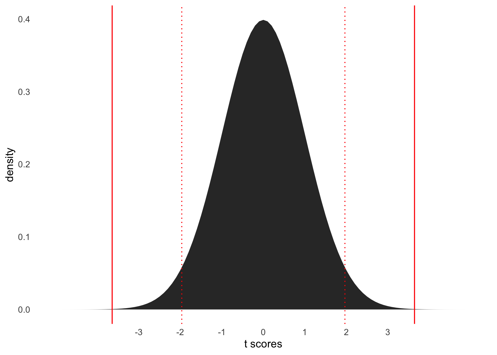
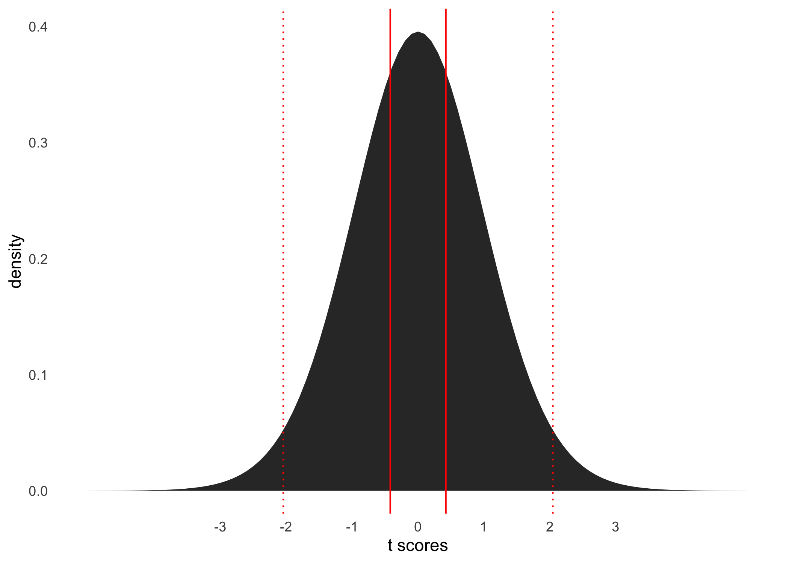
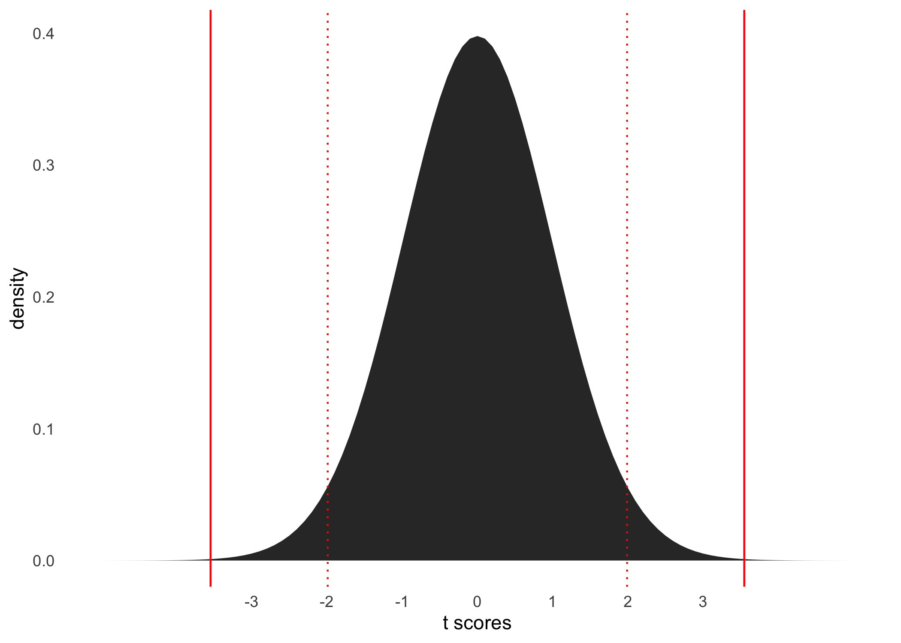

Prueba t
================

## Resumen

En este clase revisamos cuatro ejemplos de comparaciones de medias.
Todos estos ejemplos son realizados empleando prueba t. Los dos primeros
cubren ejemplos de comparaciones de medias de una muestra, en contraste
a una media poblacional. Los siguientes ejemplos corresponden a una
prueba t de muestras independientes, y luego una prueba t para
comparación de muestras dependientes.

> Nota: Cada uno de los códigos incluidos en *chunks*, son redundantes
> entre sí, de modo que cada uno sea reproducible en sí mismo. Lo
> anterior quiere decir que, un usuario puede copiar y pegar todo el
> código de un solo *chunk*, y reproducirlo en su consola o syntax
> propio que quiera generar.

# Pruebas t de una sola muestra

## Prueba t para una muestra (n423)

``` r
#------------------------------------------------------------------------------
# t test for a single sample
#------------------------------------------------------------------------------

# -----------------------------------------------
# get data from tolerance of corruption
# -----------------------------------------------

url_file  <-'https://raw.github.com/dacarras/psi2301_examples/master/data/corr_chl_16.rds'
data_corr <- readRDS(url(url_file))
library(dplyr)

# -----------------------------------------------
# get data from target group
# -----------------------------------------------

corr_0 <- data_corr %>%
          dplyr::filter(sof == 0) %>%
          dplyr::select(corr) %>%
          na.omit() %>%
          pull()


# -----------------------------------------------
# get number of observations
# -----------------------------------------------

n <- length(corr_0)

# -----------------------------------------------
# get degrees of freedom
# -----------------------------------------------

t_df <- n-1

# -----------------------------------------------
# compute t critical value
# -----------------------------------------------

t_critic <- qt(.975, df = t_df)
t_critic
```

    ## [1] 1.965601

``` r
# -----------------------------------------------
# compute t test
# -----------------------------------------------

t.test(x = corr_0,
       alternative = c("two.sided"),
       mu = 50, 
       paired = FALSE, 
       var.equal = FALSE,
       conf.level = 0.95)
```

    ## 
    ##  One Sample t-test
    ## 
    ## data:  corr_0
    ## t = 3.6426, df = 422, p-value = 0.0003035
    ## alternative hypothesis: true mean is not equal to 50
    ## 95 percent confidence interval:
    ##  50.83271 52.78474
    ## sample estimates:
    ## mean of x 
    ##  51.80872

``` r
# -----------------------------------------------
# compute t test
# -----------------------------------------------

t_value <- t.test(x = corr_0,
           alternative = c("two.sided"),
           mu = 50, 
           paired = FALSE, 
           var.equal = FALSE,
           conf.level = 0.95) %>%
           broom::tidy() %>%
           dplyr::select(statistic) %>%
           pull() %>%
           abs() %>%
           as.numeric()

# -----------------------------------------------
# visualization of p value
# -----------------------------------------------

library(ggplot2)
ggplot(data.frame(x = c(-5, 5)), aes(x)) +
  stat_function(fun = dt, args = list(df = t_df), geom = "area") +
  scale_x_continuous(breaks=seq(-3, 3, 1)) + 
  geom_vline(xintercept = t_value, color = 'red') +
  geom_vline(xintercept = - t_value, color = 'red') +
  geom_vline(xintercept = t_critic, color = 'red', linetype = 'dotted') +
  geom_vline(xintercept = - t_critic, color = 'red', linetype = 'dotted') +
  labs(
    x = 't scores', 
    y = 'density') +
  theme_minimal() +
  theme(
  panel.background = element_blank(),
  panel.grid.minor = element_blank(),
  panel.grid.major = element_blank()
  )
```

<!-- -->

``` r
# -----------------------------------------------
# effect size as r coefficient
# -----------------------------------------------

sqrt(t_value^2/(t_value^2+t_df))
```

    ## [1] 0.1745947

## Prueba t para una muestra (n30)

``` r
#------------------------------------------------------------------------------
# t test for a single sample
#------------------------------------------------------------------------------

# -----------------------------------------------
# get data from tolerance of corruption
# -----------------------------------------------

url_file  <-'https://raw.github.com/dacarras/psi2301_examples/master/data/corr_n60.rds'
data_corr_n60 <- readRDS(url(url_file))
library(dplyr)

# -----------------------------------------------
# get data from target group
# -----------------------------------------------

corr_0 <- na.omit(data_corr_n60[data_corr_n60$sof==0,'corr'])$corr %>%
          as.numeric()

# -----------------------------------------------
# get number of observations
# -----------------------------------------------

n <- length(corr_0)

# -----------------------------------------------
# get degrees of freedom
# -----------------------------------------------

t_df <- n-1

# -----------------------------------------------
# compute t critical value
# -----------------------------------------------

t_critic <- qt(.975, df = t_df)
t_critic
```

    ## [1] 2.04523

``` r
# -----------------------------------------------
# compute t test
# -----------------------------------------------

t.test(x = corr_0,
       alternative = c("two.sided"),
       mu = 50, 
       paired = FALSE, 
       var.equal = FALSE,
       conf.level = 0.95)
```

    ## 
    ##  One Sample t-test
    ## 
    ## data:  corr_0
    ## t = -0.42118, df = 29, p-value = 0.6767
    ## alternative hypothesis: true mean is not equal to 50
    ## 95 percent confidence interval:
    ##  44.10700 53.88033
    ## sample estimates:
    ## mean of x 
    ##  48.99367

``` r
# -----------------------------------------------
# compute t test
# -----------------------------------------------

t_value <- t.test(x = corr_0,
           alternative = c("two.sided"),
           mu = 50, 
           paired = FALSE, 
           var.equal = FALSE,
           conf.level = 0.95) %>%
           broom::tidy() %>%
           dplyr::select(statistic) %>%
           pull() %>%
           abs() %>%
           as.numeric()

# -----------------------------------------------
# visualization of p value
# -----------------------------------------------

library(ggplot2)
ggplot(data.frame(x = c(-5, 5)), aes(x)) +
  stat_function(fun = dt, args = list(df = t_df), geom = "area") +
  scale_x_continuous(breaks=seq(-3, 3, 1)) + 
  geom_vline(xintercept = t_value, color = 'red') +
  geom_vline(xintercept = - t_value, color = 'red') +
  geom_vline(xintercept = t_critic, color = 'red', linetype = 'dotted') +
  geom_vline(xintercept = - t_critic, color = 'red', linetype = 'dotted') +
  labs(
    x = 't scores', 
    y = 'density') +
  theme_minimal() +
  theme(
  panel.background = element_blank(),
  panel.grid.minor = element_blank(),
  panel.grid.major = element_blank()
  )
```

<!-- -->

``` r
# -----------------------------------------------
# effect size as r coefficient
# -----------------------------------------------

sqrt(t_value^2/(t_value^2+t_df))
```

    ## [1] 0.07797364

# Pruebas t para dos muestras

## Pruebas t para dos muestras independientes

``` r
#------------------------------------------------------------------------------
# t test for a single sample
#------------------------------------------------------------------------------

# -----------------------------------------------
# get data from tolerance of corruption
# -----------------------------------------------

data_alcohol <- read.table("https://stats.idre.ucla.edu/stat/r/examples/alda/data/alcohol1_pp.txt", 
                header=TRUE, sep=",")
library(dplyr)

# ----------------------------------------------- 
# separate data per wave
# -----------------------------------------------

library(dplyr)
data_alc1 <- data_alcohol %>%
             dplyr::filter(age_14 == 0)

data_alc2 <- data_alcohol %>%
             dplyr::filter(age_14 == 1)

data_alc3 <- data_alcohol %>%
             dplyr::filter(age_14 == 2)

# -----------------------------------------------
# get number of observations
# -----------------------------------------------

n <- nrow(data_alc1)

# -----------------------------------------------
# get degrees of freedom
# -----------------------------------------------

t_df <- n-2

# -----------------------------------------------
# compute t critical value
# -----------------------------------------------

t_critic <- qt(.975, df = t_df)
t_critic
```

    ## [1] 1.990063

``` r
# ----------------------------------------------- 
# separate data per wave
# -----------------------------------------------


t.test(formula = alcuse ~ coa,
       data = data_alc1,
       alternative = c("two.sided"),
       mu = 0, 
       paired = FALSE, 
       var.equal = TRUE,
       conf.level = 0.95)
```

    ## 
    ##  Two Sample t-test
    ## 
    ## data:  alcuse by coa
    ## t = -3.9267, df = 80, p-value = 0.0001815
    ## alternative hypothesis: true difference in means is not equal to 0
    ## 95 percent confidence interval:
    ##  -1.1358802 -0.3717854
    ## sample estimates:
    ## mean in group 0 mean in group 1 
    ##       0.2903221       1.0441549

``` r
# -----------------------------------------------
# compute t test
# -----------------------------------------------

t_value <- t.test(formula = alcuse ~ coa,
           data = data_alc1,
           alternative = c("two.sided"),
           mu = 0, 
           paired = FALSE, 
           var.equal = FALSE,
           conf.level = 0.95) %>%
           broom::tidy() %>%
           dplyr::select(statistic) %>%
           pull() %>%
           abs() %>%
           as.numeric()

# -----------------------------------------------
# visualization of p value
# -----------------------------------------------

library(ggplot2)
ggplot(data.frame(x = c(-5, 5)), aes(x)) +
  stat_function(fun = dt, args = list(df = t_df), geom = "area") +
  scale_x_continuous(breaks=seq(-3, 3, 1)) + 
  geom_vline(xintercept = t_value, color = 'red') +
  geom_vline(xintercept = - t_value, color = 'red') +
  geom_vline(xintercept = t_critic, color = 'red', linetype = 'dotted') +
  geom_vline(xintercept = - t_critic, color = 'red', linetype = 'dotted') +
  labs(
    x = 't scores', 
    y = 'density') +
  theme_minimal() +
  theme(
  panel.background = element_blank(),
  panel.grid.minor = element_blank(),
  panel.grid.major = element_blank()
  )
```

<!-- -->

``` r
# -----------------------------------------------
# effect size as r coefficient
# -----------------------------------------------

sqrt(t_value^2/(t_value^2+t_df))
```

    ## [1] 0.3854077

## Pruebas t para dos muestras dependientes

``` r
#------------------------------------------------------------------------------
# t test for a single sample
#------------------------------------------------------------------------------

# -----------------------------------------------
# get data from tolerance of corruption
# -----------------------------------------------

data_alcohol <- read.table("https://stats.idre.ucla.edu/stat/r/examples/alda/data/alcohol1_pp.txt", 
                header=TRUE, sep=",")
library(dplyr)

# ----------------------------------------------- 
# separate data per wave
# -----------------------------------------------

library(dplyr)
data_alc1 <- data_alcohol %>%
             dplyr::filter(age_14 == 0)

data_alc2 <- data_alcohol %>%
             dplyr::filter(age_14 == 1)

data_alc3 <- data_alcohol %>%
             dplyr::filter(age_14 == 2)

data_paired <- dplyr::bind_rows(data_alc1, data_alc2)

# -----------------------------------------------
# get number of observations
# -----------------------------------------------

n <- nrow(data_paired)

# -----------------------------------------------
# get degrees of freedom
# -----------------------------------------------

t_df <- (n/2)-1

# -----------------------------------------------
# compute t critical value
# -----------------------------------------------

t_critic <- qt(.975, df = t_df)
t_critic
```

    ## [1] 1.989686

``` r
# ----------------------------------------------- 
# separate data per wave
# -----------------------------------------------

t.test(formula = alcuse ~ age_14,
       data = data_paired,
       alternative = c("two.sided"),
       paired = TRUE, 
       var.equal = TRUE,
       conf.level = 0.95)
```

    ## 
    ##  Paired t-test
    ## 
    ## data:  alcuse by age_14
    ## t = -3.5468, df = 81, p-value = 0.0006517
    ## alternative hypothesis: true difference in means is not equal to 0
    ## 95 percent confidence interval:
    ##  -0.5200632 -0.1462634
    ## sample estimates:
    ## mean of the differences 
    ##              -0.3331633

``` r
# -----------------------------------------------
# compared to a regression
# -----------------------------------------------

lm(alcuse ~ age_14, data = data_paired) %>%
broom::tidy() %>%
knitr::kable(., digits = 2)
```

| term        | estimate | std.error | statistic | p.value |
|:------------|---------:|----------:|----------:|--------:|
| (Intercept) |     0.63 |      0.11 |      5.74 |    0.00 |
| age\_14     |     0.33 |      0.16 |      2.14 |    0.03 |

``` r
lm(alcuse ~ age_14, data = data_paired) %>%
broom::glance() %>%
knitr::kable(., digits = 2)
```

| r.squared | adj.r.squared | sigma | statistic | p.value |  df |  logLik |    AIC |    BIC | deviance | df.residual | nobs |
|----------:|--------------:|------:|----------:|--------:|----:|--------:|-------:|-------:|---------:|------------:|-----:|
|      0.03 |          0.02 |  0.99 |       4.6 |    0.03 |   1 | -230.82 | 467.63 | 476.93 |   160.26 |         162 |  164 |

``` r
# -----------------------------------------------
# compute t test
# -----------------------------------------------

data_paired %>%
group_by(age_14) %>%
summarize(
  mean = mean(alcuse, na.rm=TRUE),
  sd   = sd(alcuse, na.rm=TRUE),
  n    = n()
  ) %>%
knitr::kable(., digits = 2)
```

| age\_14 | mean |   sd |   n |
|--------:|-----:|-----:|----:|
|       0 | 0.63 | 0.94 |  82 |
|       1 | 0.96 | 1.05 |  82 |

``` r
# -----------------------------------------------
# compute t test
# -----------------------------------------------

t_value <- t.test(formula = alcuse ~ age_14,
           data = data_paired,
           alternative = c("two.sided"),
           paired = TRUE, 
           var.equal = TRUE,
           conf.level = 0.95) %>%
           broom::tidy() %>%
           dplyr::select(statistic) %>%
           pull() %>%
           abs() %>%
           as.numeric()

# -----------------------------------------------
# visualization of p value
# -----------------------------------------------

library(ggplot2)
ggplot(data.frame(x = c(-5, 5)), aes(x)) +
  stat_function(fun = dt, args = list(df = t_df), geom = "area") +
  scale_x_continuous(breaks=seq(-3, 3, 1)) + 
  geom_vline(xintercept = t_value, color = 'red') +
  geom_vline(xintercept = - t_value, color = 'red') +
  geom_vline(xintercept = t_critic, color = 'red', linetype = 'dotted') +
  geom_vline(xintercept = - t_critic, color = 'red', linetype = 'dotted') +
  labs(
    x = 't scores', 
    y = 'density') +
  theme_minimal() +
  theme(
  panel.background = element_blank(),
  panel.grid.minor = element_blank(),
  panel.grid.major = element_blank()
  )
```

<!-- -->

``` r
# -----------------------------------------------
# effect size as r coefficient
# -----------------------------------------------

sqrt(t_value^2/(t_value^2+t_df))
```

    ## [1] 0.366642
