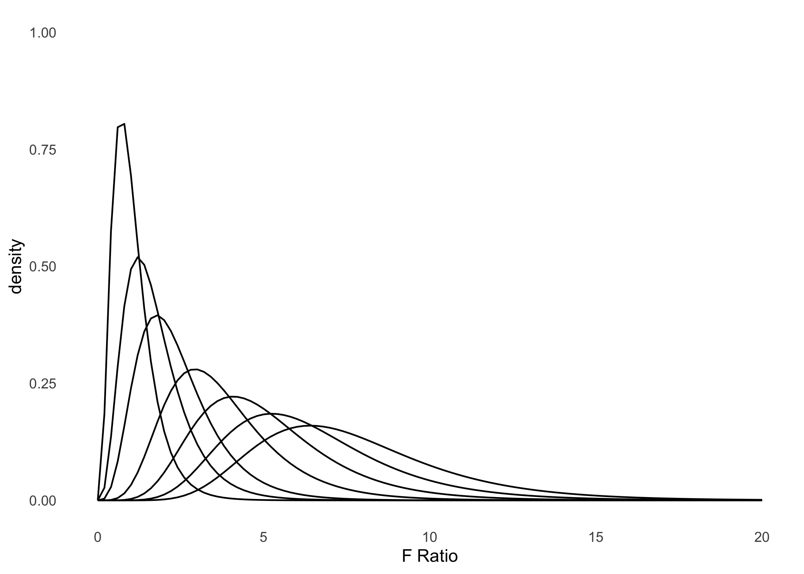

ANOVA comparación de medias de varios grupos
================

## Data example

``` r
#------------------------------------------------------------------------------
# minimal anova example
#------------------------------------------------------------------------------


# -----------------------------------------------
# data example
# -----------------------------------------------

data_anx <- read.table(text = "
id_i      id_j outcome
1      placebo     0.5
2      placebo     0.3
3      placebo     0.1
4     anxifree     0.6
5     anxifree     0.4
6     anxifree     0.2
7     joyzepam     1.4
8     joyzepam     1.7
9     joyzepam     1.3
10     placebo     0.6
11     placebo     0.9
12     placebo     0.3
13    anxifree     1.1
14    anxifree     0.8
15    anxifree     1.2
16    joyzepam     1.8
17    joyzepam     1.3
18    joyzepam     1.4
", header = TRUE)

# -----------------------------------------------
# means with confidence intervals
# -----------------------------------------------

library(dplyr)
```

    ## 
    ## Attaching package: 'dplyr'

    ## The following objects are masked from 'package:stats':
    ## 
    ##     filter, lag

    ## The following objects are masked from 'package:base':
    ## 
    ##     intersect, setdiff, setequal, union

``` r
library(srvyr)
```

    ## 
    ## Attaching package: 'srvyr'

    ## The following object is masked from 'package:stats':
    ## 
    ##     filter

``` r
data_anx_srs <- data_anx %>% 
                as_survey_design(ids = 1)


data_anx_srs %>%
group_by(id_j) %>%
summarize(
  mood = survey_mean(outcome, vartype = "ci")
) %>%
knitr::kable(., digits = 2)
```

| id\_j    | mood | mood\_low | mood\_upp |
|:---------|-----:|----------:|----------:|
| anxifree | 0.72 |      0.40 |      1.03 |
| joyzepam | 1.48 |      1.31 |      1.66 |
| placebo  | 0.45 |      0.22 |      0.68 |

``` r
# -----------------------------------------------
# generic print
# -----------------------------------------------

aov(outcome ~ id_j, data = data_anx)
```

    ## Call:
    ##    aov(formula = outcome ~ id_j, data = data_anx)
    ## 
    ## Terms:
    ##                     id_j Residuals
    ## Sum of Squares  3.453333  1.391667
    ## Deg. of Freedom        2        15
    ## 
    ## Residual standard error: 0.3045944
    ## Estimated effects may be unbalanced

``` r
# -----------------------------------------------
# F table
# -----------------------------------------------

library(dplyr)
aov(outcome ~ id_j, data = data_anx) %>%
summary()
```

    ##             Df Sum Sq Mean Sq F value   Pr(>F)    
    ## id_j         2  3.453  1.7267   18.61 8.65e-05 ***
    ## Residuals   15  1.392  0.0928                     
    ## ---
    ## Signif. codes:  0 '***' 0.001 '**' 0.01 '*' 0.05 '.' 0.1 ' ' 1

``` r
# -----------------------------------------------
# F table as an actual table
# -----------------------------------------------

library(dplyr)
aov(outcome ~ id_j, data = data_anx) %>%
broom::tidy() %>%
knitr::kable(., digits = 2)
```

| term      |  df | sumsq | meansq | statistic | p.value |
|:----------|----:|------:|-------:|----------:|--------:|
| id\_j     |   2 |  3.45 |   1.73 |     18.61 |       0 |
| Residuals |  15 |  1.39 |   0.09 |        NA |      NA |

``` r
# -----------------------------------------------
# effect size
# -----------------------------------------------

anova_example <- aov(outcome ~ id_j, data = data_anx)
lsr::etaSquared( x = anova_example)
```

    ##         eta.sq eta.sq.part
    ## id_j 0.7127623   0.7127623

## Calculando las sumas de cuadrados

``` r
#------------------------------------------------------------------------------
# minimal anova example
#------------------------------------------------------------------------------

# -----------------------------------------------
# data example
# -----------------------------------------------

data_anx <- read.table(text = "
id_i      id_j outcome
1      placebo     0.5
2      placebo     0.3
3      placebo     0.1
4     anxifree     0.6
5     anxifree     0.4
6     anxifree     0.2
7     joyzepam     1.4
8     joyzepam     1.7
9     joyzepam     1.3
10     placebo     0.6
11     placebo     0.9
12     placebo     0.3
13    anxifree     1.1
14    anxifree     0.8
15    anxifree     1.2
16    joyzepam     1.8
17    joyzepam     1.3
18    joyzepam     1.4
", header = TRUE)

# -----------------------------------------------
# data example
# -----------------------------------------------

data_f <- data_anx %>%
          mutate(all = 1) %>%
          mutate(out_g = r4sda::c_mean(outcome, all )) %>%
          mutate(out_c = r4sda::c_mean(outcome, id_j)) %>%
          mutate(out_w = outcome - out_c) %>%
          mutate(out_b = out_c - out_g) %>%
          mutate(s_w = out_w^2) %>%
          mutate(s_b = out_b^2) %>%
          arrange(id_j, outcome)

# -----------------------------------------------
# data example
# -----------------------------------------------

data_f %>%
  knitr::kable()
```

| id\_i | id\_j    | outcome | all |    out\_g |    out\_c |     out\_w |     out\_b |      s\_w |      s\_b |
|------:|:---------|--------:|----:|----------:|----------:|-----------:|-----------:|----------:|----------:|
|     6 | anxifree |     0.2 |   1 | 0.8833333 | 0.7166667 | -0.5166667 | -0.1666667 | 0.2669444 | 0.0277778 |
|     5 | anxifree |     0.4 |   1 | 0.8833333 | 0.7166667 | -0.3166667 | -0.1666667 | 0.1002778 | 0.0277778 |
|     4 | anxifree |     0.6 |   1 | 0.8833333 | 0.7166667 | -0.1166667 | -0.1666667 | 0.0136111 | 0.0277778 |
|    14 | anxifree |     0.8 |   1 | 0.8833333 | 0.7166667 |  0.0833333 | -0.1666667 | 0.0069444 | 0.0277778 |
|    13 | anxifree |     1.1 |   1 | 0.8833333 | 0.7166667 |  0.3833333 | -0.1666667 | 0.1469444 | 0.0277778 |
|    15 | anxifree |     1.2 |   1 | 0.8833333 | 0.7166667 |  0.4833333 | -0.1666667 | 0.2336111 | 0.0277778 |
|     9 | joyzepam |     1.3 |   1 | 0.8833333 | 1.4833333 | -0.1833333 |  0.6000000 | 0.0336111 | 0.3600000 |
|    17 | joyzepam |     1.3 |   1 | 0.8833333 | 1.4833333 | -0.1833333 |  0.6000000 | 0.0336111 | 0.3600000 |
|     7 | joyzepam |     1.4 |   1 | 0.8833333 | 1.4833333 | -0.0833333 |  0.6000000 | 0.0069444 | 0.3600000 |
|    18 | joyzepam |     1.4 |   1 | 0.8833333 | 1.4833333 | -0.0833333 |  0.6000000 | 0.0069444 | 0.3600000 |
|     8 | joyzepam |     1.7 |   1 | 0.8833333 | 1.4833333 |  0.2166667 |  0.6000000 | 0.0469444 | 0.3600000 |
|    16 | joyzepam |     1.8 |   1 | 0.8833333 | 1.4833333 |  0.3166667 |  0.6000000 | 0.1002778 | 0.3600000 |
|     3 | placebo  |     0.1 |   1 | 0.8833333 | 0.4500000 | -0.3500000 | -0.4333333 | 0.1225000 | 0.1877778 |
|     2 | placebo  |     0.3 |   1 | 0.8833333 | 0.4500000 | -0.1500000 | -0.4333333 | 0.0225000 | 0.1877778 |
|    12 | placebo  |     0.3 |   1 | 0.8833333 | 0.4500000 | -0.1500000 | -0.4333333 | 0.0225000 | 0.1877778 |
|     1 | placebo  |     0.5 |   1 | 0.8833333 | 0.4500000 |  0.0500000 | -0.4333333 | 0.0025000 | 0.1877778 |
|    10 | placebo  |     0.6 |   1 | 0.8833333 | 0.4500000 |  0.1500000 | -0.4333333 | 0.0225000 | 0.1877778 |
|    11 | placebo  |     0.9 |   1 | 0.8833333 | 0.4500000 |  0.4500000 | -0.4333333 | 0.2025000 | 0.1877778 |

``` r
# -----------------------------------------------
# data example
# -----------------------------------------------

ss_w <- sum(data_f$s_w)
ss_b <- sum(data_f$s_b)

ss_t <- ss_w + ss_b

# -----------------------------------------------
# effect size as R2 (eta squared)
# -----------------------------------------------

ss_b/ss_t
```

    ## [1] 0.7127623

``` r
# -----------------------------------------------
# effect size as R (eta)
# -----------------------------------------------

sqrt(ss_b/ss_t)
```

    ## [1] 0.8442525

## ANOVA como modelo lineal

``` r
#------------------------------------------------------------------------------
# ANOVA as lineal model
#------------------------------------------------------------------------------

# -----------------------------------------------
# effect size from linear model
# -----------------------------------------------

aov(lm(outcome ~ as.factor(id_j), data = data_anx))
```

    ## Call:
    ##    aov(formula = lm(outcome ~ as.factor(id_j), data = data_anx))
    ## 
    ## Terms:
    ##                 as.factor(id_j) Residuals
    ## Sum of Squares         3.453333  1.391667
    ## Deg. of Freedom               2        15
    ## 
    ## Residual standard error: 0.3045944
    ## Estimated effects may be unbalanced

``` r
# -----------------------------------------------
# effect size from linear model
# -----------------------------------------------

lm(outcome ~ as.factor(id_j), data = data_anx) %>%
  broom::glance()
```

    ## # A tibble: 1 x 12
    ##   r.squared adj.r.squared sigma statistic   p.value    df logLik   AIC   BIC
    ##       <dbl>         <dbl> <dbl>     <dbl>     <dbl> <dbl>  <dbl> <dbl> <dbl>
    ## 1     0.713         0.674 0.305      18.6 0.0000865     2  -2.50  13.0  16.6
    ## # … with 3 more variables: deviance <dbl>, df.residual <int>, nobs <int>

``` r
# -----------------------------------------------
# expected means from lineal model
# -----------------------------------------------

data_anx %>%
mutate(order = case_when(
  id_j == 'placebo'  ~ 1,
  id_j == 'anxifree' ~ 2,
  id_j == 'joyzepam' ~ 3)) %>%
arrange(order, outcome) %>%
mutate(treatment = forcats::as_factor(id_j)) %>%
lm(outcome ~ treatment, data = .) %>%
broom::tidy() %>%
knitr::kable(., digits = 2)
```

| term              | estimate | std.error | statistic | p.value |
|:------------------|---------:|----------:|----------:|--------:|
| (Intercept)       |     0.45 |      0.12 |      3.62 |    0.00 |
| treatmentanxifree |     0.27 |      0.18 |      1.52 |    0.15 |
| treatmentjoyzepam |     1.03 |      0.18 |      5.88 |    0.00 |

## Visualización de valor F

``` r
#------------------------------------------------------------------------------
# minimal anova example
#------------------------------------------------------------------------------

# -----------------------------------------------
# f value
# -----------------------------------------------

f_value <- aov(outcome ~ id_j, data = data_anx) %>%
           broom::tidy() %>%
           dplyr::filter(term == 'id_j') %>%
           dplyr::select(statistic) %>%
           pull() %>%
           as.numeric()

# -----------------------------------------------
# p value
# -----------------------------------------------

pf(f_value, df1 = 2, df2 = 15, lower.tail = FALSE)
```

    ## [1] 8.645912e-05

``` r
# -----------------------------------------------
# f critic
# -----------------------------------------------

f_critic <- qf(.975, df1 = 2, df2 = 15)


# -----------------------------------------------
# visualization
# -----------------------------------------------

library(ggplot2)
ggplot(data.frame(x = c(0, 20)), aes(x)) +
  stat_function(fun = df, args = list(df1 = 2, df2 = 15), geom = "area") +
  geom_vline(xintercept = f_value, color = 'red') +
  geom_vline(xintercept = f_critic, color = 'red', linetype = 'dotted') +
  scale_x_continuous(breaks=seq(0, 20, 1)) + 
  # xlim(0,10) +
  ylim(0,1) +
  labs(
    x = 'F Ratio', 
    y = 'density') +
  theme_minimal() +
  theme(
  panel.background = element_blank(),
  panel.grid.minor = element_blank(),
  panel.grid.major = element_blank()
  )
```

<!-- -->

## Supuestos

``` r
#------------------------------------------------------------------------------
# minimal anova example
#------------------------------------------------------------------------------

# -----------------------------------------------
# data example
# -----------------------------------------------

data_anx <- read.table(text = "
id_i      id_j outcome
1      placebo     0.5
2      placebo     0.3
3      placebo     0.1
4     anxifree     0.6
5     anxifree     0.4
6     anxifree     0.2
7     joyzepam     1.4
8     joyzepam     1.7
9     joyzepam     1.3
10     placebo     0.6
11     placebo     0.9
12     placebo     0.3
13    anxifree     1.1
14    anxifree     0.8
15    anxifree     1.2
16    joyzepam     1.8
17    joyzepam     1.3
18    joyzepam     1.4
", header = TRUE)

# -----------------------------------------------
# normality
# -----------------------------------------------

anova_model <- lm(outcome ~ as.factor(id_j), data = data_anx)
shapiro.test(residuals(anova_model))
```

    ## 
    ##  Shapiro-Wilk normality test
    ## 
    ## data:  residuals(anova_model)
    ## W = 0.96019, p-value = 0.6053

``` r
# -----------------------------------------------
# homocesdasticity
# -----------------------------------------------

car::leveneTest(
  outcome ~ as.factor(id_j), 
  data = data_anx, 
  center = 'mean')
```

    ## Levene's Test for Homogeneity of Variance (center = "mean")
    ##       Df F value Pr(>F)
    ## group  2  1.4497 0.2657
    ##       15

# Anexos

## F distribution plot

``` r
#------------------------------------------------------------------------------
# distribution plot
#------------------------------------------------------------------------------

# -----------------------------------------------
# plot for F Ratio distribution
# -----------------------------------------------

library(ggplot2)
ggplot(data.frame(x = c(0, 50)), aes(x)) +
  stat_function(fun = df, args = list(df1 = 8, df2 = 30), geom = "line") +
  stat_function(fun = df, args = list(df1 = 8, df2 = 30, ncp = 5), geom = "line") +
  stat_function(fun = df, args = list(df1 = 8, df2 = 30, ncp = 10), geom = "line") +
  stat_function(fun = df, args = list(df1 = 8, df2 = 30, ncp = 20), geom = "line") +
  stat_function(fun = df, args = list(df1 = 8, df2 = 30, ncp = 30), geom = "line") +
  stat_function(fun = df, args = list(df1 = 8, df2 = 30, ncp = 40), geom = "line") +
  stat_function(fun = df, args = list(df1 = 8, df2 = 30, ncp = 50), geom = "line") +
  scale_x_continuous(breaks=seq(0, 100, 1)) + 
  xlim(0,20) +
  ylim(0,1) +
  labs(
    x = 'F Ratio', 
    y = 'density') +
  theme_minimal() +
  theme(
  panel.background = element_blank(),
  panel.grid.minor = element_blank(),
  panel.grid.major = element_blank()
  )
```

    ## Scale for 'x' is already present. Adding another scale for 'x', which will
    ## replace the existing scale.

<!-- -->
