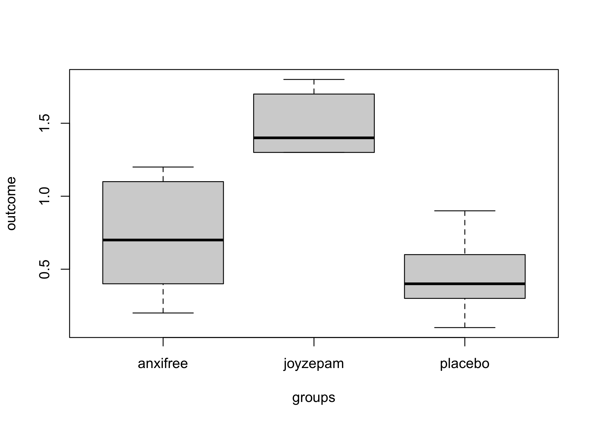
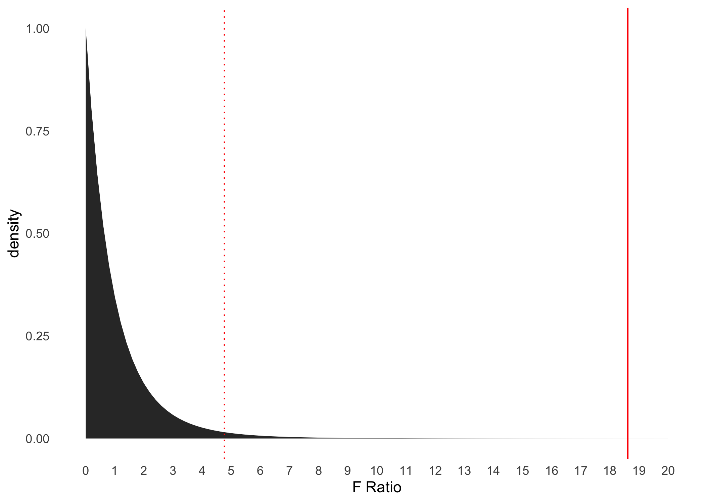
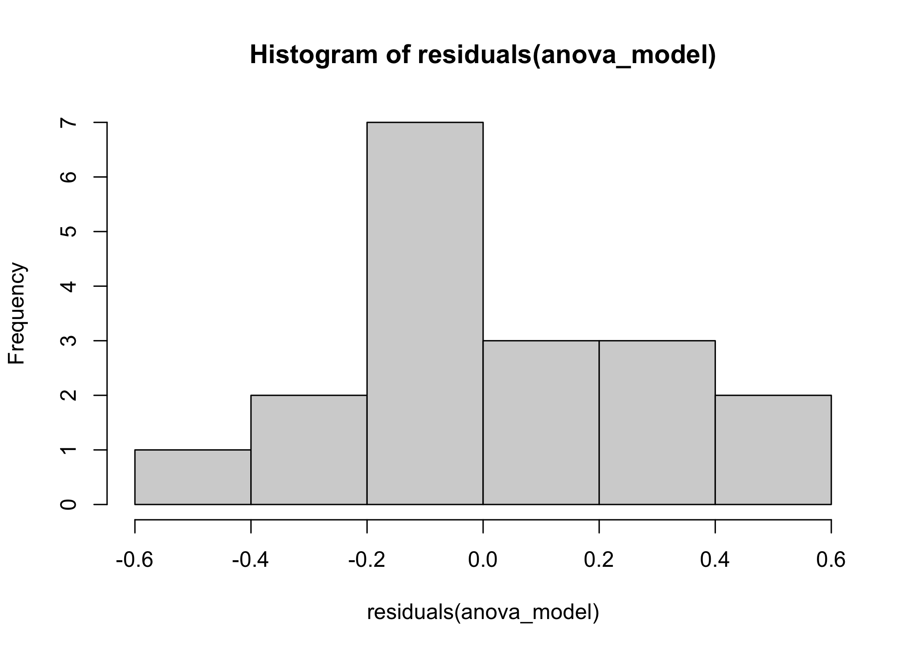
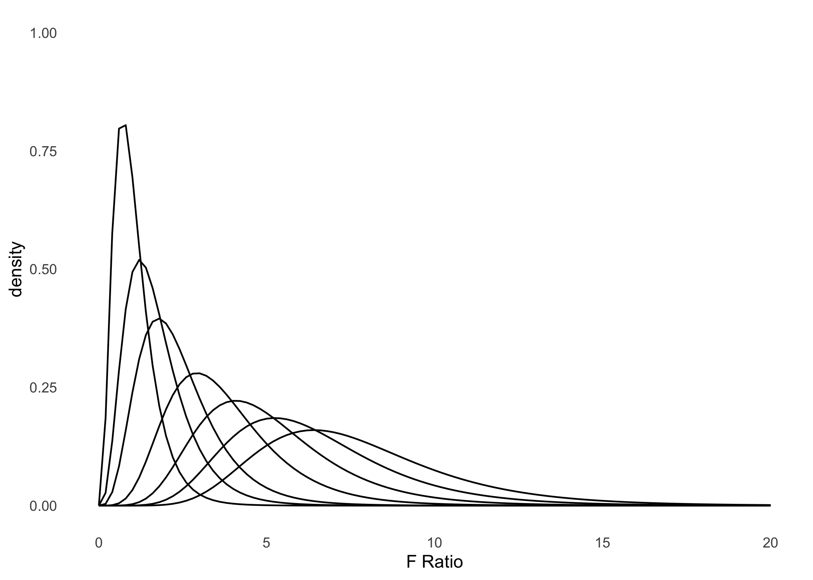

ANOVA comparación de medias de varios grupos
================

# ANOVA de un solo factor

ANOVA es un acrónimo de “Aanalysis of Variance”, el cual en castellano
es traducido como “análisis de varianza”. Esta es una prueba estadística
que sirve para hacer inferencias sobre componentes de varianza.

## Data example

``` r
#------------------------------------------------------------------------------
# minimal anova example
#------------------------------------------------------------------------------


# -----------------------------------------------
# data example
# -----------------------------------------------

data_anx <- read.table(text = "
id_i    groups outcome
1      placebo     0.5
2      placebo     0.3
3      placebo     0.1
4     anxifree     0.6
5     anxifree     0.4
6     anxifree     0.2
7     joyzepam     1.4
8     joyzepam     1.7
9     joyzepam     1.3
10     placebo     0.6
11     placebo     0.9
12     placebo     0.3
13    anxifree     1.1
14    anxifree     0.8
15    anxifree     1.2
16    joyzepam     1.8
17    joyzepam     1.3
18    joyzepam     1.4
", header = TRUE)

# -----------------------------------------------
# means with confidence intervals
# -----------------------------------------------

library(dplyr)
```

    ## 
    ## Attaching package: 'dplyr'

    ## The following objects are masked from 'package:stats':
    ## 
    ##     filter, lag

    ## The following objects are masked from 'package:base':
    ## 
    ##     intersect, setdiff, setequal, union

``` r
library(srvyr)
```

    ## 
    ## Attaching package: 'srvyr'

    ## The following object is masked from 'package:stats':
    ## 
    ##     filter

``` r
data_anx_srs <- data_anx %>% 
                as_survey_design(ids = 1)


data_anx_srs %>%
group_by(groups) %>%
summarize(
  mood = survey_mean(outcome, vartype = c('ci', 'se'))
) %>%
knitr::kable(., digits = 2)
```

| groups   | mood | mood\_low | mood\_upp | mood\_se |
|:---------|-----:|----------:|----------:|---------:|
| anxifree | 0.72 |      0.40 |      1.03 |     0.15 |
| joyzepam | 1.48 |      1.31 |      1.66 |     0.08 |
| placebo  | 0.45 |      0.22 |      0.68 |     0.11 |

``` r
# -----------------------------------------------
# generic print
# -----------------------------------------------

aov(outcome ~ groups, data = data_anx)
```

    ## Call:
    ##    aov(formula = outcome ~ groups, data = data_anx)
    ## 
    ## Terms:
    ##                   groups Residuals
    ## Sum of Squares  3.453333  1.391667
    ## Deg. of Freedom        2        15
    ## 
    ## Residual standard error: 0.3045944
    ## Estimated effects may be unbalanced

``` r
# -----------------------------------------------
# F table
# -----------------------------------------------

library(dplyr)
aov(outcome ~ groups, data = data_anx) %>%
summary()
```

    ##             Df Sum Sq Mean Sq F value   Pr(>F)    
    ## groups       2  3.453  1.7267   18.61 8.65e-05 ***
    ## Residuals   15  1.392  0.0928                     
    ## ---
    ## Signif. codes:  0 '***' 0.001 '**' 0.01 '*' 0.05 '.' 0.1 ' ' 1

``` r
# -----------------------------------------------
# F table as an actual table
# -----------------------------------------------

library(dplyr)
aov(outcome ~ groups, data = data_anx) %>%
broom::tidy() %>%
knitr::kable(., digits = 2)
```

| term      |  df | sumsq | meansq | statistic | p.value |
|:----------|----:|------:|-------:|----------:|--------:|
| groups    |   2 |  3.45 |   1.73 |     18.61 |       0 |
| Residuals |  15 |  1.39 |   0.09 |        NA |      NA |

``` r
# -----------------------------------------------
# effect size
# -----------------------------------------------

anova_example <- aov(outcome ~ groups, data = data_anx)
lsr::etaSquared( x = anova_example)
```

    ##           eta.sq eta.sq.part
    ## groups 0.7127623   0.7127623

## Calculando las sumas de cuadrados

``` r
#------------------------------------------------------------------------------
# minimal anova example
#------------------------------------------------------------------------------

# -----------------------------------------------
# data example
# -----------------------------------------------

data_anx <- read.table(text = "
id_i    groups outcome
1      placebo     0.5
2      placebo     0.3
3      placebo     0.1
4     anxifree     0.6
5     anxifree     0.4
6     anxifree     0.2
7     joyzepam     1.4
8     joyzepam     1.7
9     joyzepam     1.3
10     placebo     0.6
11     placebo     0.9
12     placebo     0.3
13    anxifree     1.1
14    anxifree     0.8
15    anxifree     1.2
16    joyzepam     1.8
17    joyzepam     1.3
18    joyzepam     1.4
", header = TRUE)

# -----------------------------------------------
# data example
# -----------------------------------------------

library(dplyr)
data_f <- data_anx %>%
          mutate(all = 1) %>%
          mutate(out_g = r4sda::c_mean(outcome, all )) %>%
          mutate(out_c = r4sda::c_mean(outcome, groups)) %>%
          mutate(out_w = outcome - out_c) %>%
          mutate(out_b = out_c - out_g) %>%
          mutate(s_w = out_w^2) %>%
          mutate(s_b = out_b^2) %>%
          arrange(groups, outcome)

# -----------------------------------------------
# orthogonal components
# -----------------------------------------------
          
# Nota:
#
# out_g = la gran media
# out_c = la media de cada grupo (son tres medias)
# out_w = distancia relativa de los puntajes, a cada grupo
# out_b = distancia relativa de las medias los grupos, a la gran media
# s_w = los cuadrados (distancias ^ 2) de la variabilidad al interior de los grupos
# s_b = los cuadrados (distancias ^ 2) de la variabilidad entre los grupos

# componentes de varianza
#
# SS_w = sum(data_f$s_w)
# SS_b = sum(data_f$s_b)
# SS_t = sum(data_f$s_w) + sum(data_f$s_b)

# -----------------------------------------------
# orthogonal components
# -----------------------------------------------

cor(data_f$out_w, data_f$out_b) %>%
r4sda::decimal(., 2) %>%
knitr::kable()
```

| x    |
|:-----|
| 0.00 |

``` r
# -----------------------------------------------
# display table
# -----------------------------------------------

data_f %>%
  knitr::kable(., digits = 2)
```

| id\_i | groups   | outcome | all | out\_g | out\_c | out\_w | out\_b | s\_w | s\_b |
|------:|:---------|--------:|----:|-------:|-------:|-------:|-------:|-----:|-----:|
|     6 | anxifree |     0.2 |   1 |   0.88 |   0.72 |  -0.52 |  -0.17 | 0.27 | 0.03 |
|     5 | anxifree |     0.4 |   1 |   0.88 |   0.72 |  -0.32 |  -0.17 | 0.10 | 0.03 |
|     4 | anxifree |     0.6 |   1 |   0.88 |   0.72 |  -0.12 |  -0.17 | 0.01 | 0.03 |
|    14 | anxifree |     0.8 |   1 |   0.88 |   0.72 |   0.08 |  -0.17 | 0.01 | 0.03 |
|    13 | anxifree |     1.1 |   1 |   0.88 |   0.72 |   0.38 |  -0.17 | 0.15 | 0.03 |
|    15 | anxifree |     1.2 |   1 |   0.88 |   0.72 |   0.48 |  -0.17 | 0.23 | 0.03 |
|     9 | joyzepam |     1.3 |   1 |   0.88 |   1.48 |  -0.18 |   0.60 | 0.03 | 0.36 |
|    17 | joyzepam |     1.3 |   1 |   0.88 |   1.48 |  -0.18 |   0.60 | 0.03 | 0.36 |
|     7 | joyzepam |     1.4 |   1 |   0.88 |   1.48 |  -0.08 |   0.60 | 0.01 | 0.36 |
|    18 | joyzepam |     1.4 |   1 |   0.88 |   1.48 |  -0.08 |   0.60 | 0.01 | 0.36 |
|     8 | joyzepam |     1.7 |   1 |   0.88 |   1.48 |   0.22 |   0.60 | 0.05 | 0.36 |
|    16 | joyzepam |     1.8 |   1 |   0.88 |   1.48 |   0.32 |   0.60 | 0.10 | 0.36 |
|     3 | placebo  |     0.1 |   1 |   0.88 |   0.45 |  -0.35 |  -0.43 | 0.12 | 0.19 |
|     2 | placebo  |     0.3 |   1 |   0.88 |   0.45 |  -0.15 |  -0.43 | 0.02 | 0.19 |
|    12 | placebo  |     0.3 |   1 |   0.88 |   0.45 |  -0.15 |  -0.43 | 0.02 | 0.19 |
|     1 | placebo  |     0.5 |   1 |   0.88 |   0.45 |   0.05 |  -0.43 | 0.00 | 0.19 |
|    10 | placebo  |     0.6 |   1 |   0.88 |   0.45 |   0.15 |  -0.43 | 0.02 | 0.19 |
|    11 | placebo  |     0.9 |   1 |   0.88 |   0.45 |   0.45 |  -0.43 | 0.20 | 0.19 |

``` r
# -----------------------------------------------
# sum of squares
# -----------------------------------------------

ss_w <- sum(data_f$s_w)
ss_b <- sum(data_f$s_b)

ss_t <- ss_w + ss_b

# -----------------------------------------------
# effect size as R2 (eta squared)
# -----------------------------------------------

ss_b/ss_t
```

    ## [1] 0.7127623

``` r
# -----------------------------------------------
# effect size as R (eta)
# -----------------------------------------------

sqrt(ss_b/ss_t)
```

    ## [1] 0.8442525

## Visualización de medias por grupo

``` r
#------------------------------------------------------------------------------
# minimal anova example
#------------------------------------------------------------------------------

# -----------------------------------------------
# data example
# -----------------------------------------------

data_anx <- read.table(text = "
id_i    groups outcome
1      placebo     0.5
2      placebo     0.3
3      placebo     0.1
4     anxifree     0.6
5     anxifree     0.4
6     anxifree     0.2
7     joyzepam     1.4
8     joyzepam     1.7
9     joyzepam     1.3
10     placebo     0.6
11     placebo     0.9
12     placebo     0.3
13    anxifree     1.1
14    anxifree     0.8
15    anxifree     1.2
16    joyzepam     1.8
17    joyzepam     1.3
18    joyzepam     1.4
", header = TRUE)

# -----------------------------------------------
# data example
# -----------------------------------------------


boxplot(outcome~groups, data = data_anx)
```

<!-- -->

## ANOVA como modelo lineal

``` r
#------------------------------------------------------------------------------
# ANOVA as lineal model
#------------------------------------------------------------------------------

# -----------------------------------------------
# effect size from linear model
# -----------------------------------------------

aov(lm(outcome ~ as.factor(groups), data = data_anx))
```

    ## Call:
    ##    aov(formula = lm(outcome ~ as.factor(groups), data = data_anx))
    ## 
    ## Terms:
    ##                 as.factor(groups) Residuals
    ## Sum of Squares           3.453333  1.391667
    ## Deg. of Freedom                 2        15
    ## 
    ## Residual standard error: 0.3045944
    ## Estimated effects may be unbalanced

``` r
# -----------------------------------------------
# effect size from linear model
# -----------------------------------------------

lm(outcome ~ as.factor(groups), data = data_anx) %>%
  broom::glance()
```

    ## # A tibble: 1 x 12
    ##   r.squared adj.r.squared sigma statistic   p.value    df logLik   AIC   BIC
    ##       <dbl>         <dbl> <dbl>     <dbl>     <dbl> <dbl>  <dbl> <dbl> <dbl>
    ## 1     0.713         0.674 0.305      18.6 0.0000865     2  -2.50  13.0  16.6
    ## # … with 3 more variables: deviance <dbl>, df.residual <int>, nobs <int>

``` r
# -----------------------------------------------
# expected means from lineal model
# -----------------------------------------------

data_anx %>%
mutate(treatment = factor(groups, levels = c('placebo','anxifree','joyzepam'))) %>%
lm(outcome ~ treatment, data = .) %>%
broom::tidy() %>%
knitr::kable(., digits = 2)
```

| term              | estimate | std.error | statistic | p.value |
|:------------------|---------:|----------:|----------:|--------:|
| (Intercept)       |     0.45 |      0.12 |      3.62 |    0.00 |
| treatmentanxifree |     0.27 |      0.18 |      1.52 |    0.15 |
| treatmentjoyzepam |     1.03 |      0.18 |      5.88 |    0.00 |

## Visualización de valor F

``` r
#------------------------------------------------------------------------------
# minimal anova example
#------------------------------------------------------------------------------

# -----------------------------------------------
# f value
# -----------------------------------------------

f_value <- aov(outcome ~ groups, data = data_anx) %>%
           broom::tidy() %>%
           dplyr::filter(term == 'groups') %>%
           dplyr::select(statistic) %>%
           pull() %>%
           as.numeric()

# -----------------------------------------------
# p value
# -----------------------------------------------

pf(f_value, df1 = 2, df2 = 15, lower.tail = FALSE)
```

    ## [1] 8.645912e-05

``` r
pf(f_value, df1 = 2, df2 = 15, lower.tail = FALSE) %>%
r4sda::decimal(., 2)
```

    ## [1] "0.00"

``` r
# -----------------------------------------------
# f critic
# -----------------------------------------------

f_critic <- qf(.975, df1 = 2, df2 = 15)


# -----------------------------------------------
# visualization
# -----------------------------------------------

library(ggplot2)
ggplot(data.frame(x = c(0, 20)), aes(x)) +
  stat_function(fun = df, args = list(df1 = 2, df2 = 15), geom = "area") +
  geom_vline(xintercept = f_value, color = 'red') +
  geom_vline(xintercept = f_critic, color = 'red', linetype = 'dotted') +
  scale_x_continuous(breaks=seq(0, 20, 1)) + 
  # xlim(0,10) +
  ylim(0,1) +
  labs(
    x = 'F Ratio', 
    y = 'density') +
  theme_minimal() +
  theme(
  panel.background = element_blank(),
  panel.grid.minor = element_blank(),
  panel.grid.major = element_blank()
  )
```

<!-- -->

## Supuestos

``` r
#------------------------------------------------------------------------------
# minimal anova example
#------------------------------------------------------------------------------

# -----------------------------------------------
# data example
# -----------------------------------------------

data_anx <- read.table(text = "
id_i    groups outcome
1      placebo     0.5
2      placebo     0.3
3      placebo     0.1
4     anxifree     0.6
5     anxifree     0.4
6     anxifree     0.2
7     joyzepam     1.4
8     joyzepam     1.7
9     joyzepam     1.3
10     placebo     0.6
11     placebo     0.9
12     placebo     0.3
13    anxifree     1.1
14    anxifree     0.8
15    anxifree     1.2
16    joyzepam     1.8
17    joyzepam     1.3
18    joyzepam     1.4
", header = TRUE)

# -----------------------------------------------
# normality
# -----------------------------------------------

anova_model <- lm(outcome ~ as.factor(groups), data = data_anx)
shapiro.test(residuals(anova_model))
```

    ## 
    ##  Shapiro-Wilk normality test
    ## 
    ## data:  residuals(anova_model)
    ## W = 0.96019, p-value = 0.6053

``` r
# -----------------------------------------------
# visualización de residuales
# -----------------------------------------------

hist(residuals(anova_model))
```

<!-- -->

``` r
# -----------------------------------------------
# homocesdasticity
# -----------------------------------------------

car::leveneTest(
  outcome ~ as.factor(groups), 
  data = data_anx, 
  center = 'mean')
```

    ## Levene's Test for Homogeneity of Variance (center = "mean")
    ##       Df F value Pr(>F)
    ## group  2  1.4497 0.2657
    ##       15

# Comparaciones Múltiples

## Pairwise T-test

``` r
#------------------------------------------------------------------------------
# minimal anova example
#------------------------------------------------------------------------------

# -----------------------------------------------
# data example
# -----------------------------------------------

library(dplyr)
data_anx <- read.table(text = "
id_i    groups outcome
1      placebo     0.5
2      placebo     0.3
3      placebo     0.1
4     anxifree     0.6
5     anxifree     0.4
6     anxifree     0.2
7     joyzepam     1.4
8     joyzepam     1.7
9     joyzepam     1.3
10     placebo     0.6
11     placebo     0.9
12     placebo     0.3
13    anxifree     1.1
14    anxifree     0.8
15    anxifree     1.2
16    joyzepam     1.8
17    joyzepam     1.3
18    joyzepam     1.4
", header = TRUE) %>%
mutate(treatment = as.factor(groups))

# -----------------------------------------------
# Tukey HSD
# -----------------------------------------------

anova_example <- aov(outcome ~ treatment, data = data_anx)
TukeyHSD(anova_example)
```

    ##   Tukey multiple comparisons of means
    ##     95% family-wise confidence level
    ## 
    ## Fit: aov(formula = outcome ~ treatment, data = data_anx)
    ## 
    ## $treatment
    ##                         diff        lwr        upr     p adj
    ## joyzepam-anxifree  0.7666667  0.3098816  1.2234518 0.0015284
    ## placebo-anxifree  -0.2666667 -0.7234518  0.1901184 0.3115006
    ## placebo-joyzepam  -1.0333333 -1.4901184 -0.5765482 0.0000854

``` r
# -----------------------------------------------
# Tukey HSD tidy
# -----------------------------------------------

TukeyHSD(anova_example) %>%
broom::tidy() %>%
knitr::kable(, digits = 2)
```

| term      | contrast          | null.value | estimate | conf.low | conf.high | adj.p.value |
|:----------|:------------------|-----------:|---------:|---------:|----------:|------------:|
| treatment | joyzepam-anxifree |          0 |     0.77 |     0.31 |      1.22 |        0.00 |
| treatment | placebo-anxifree  |          0 |    -0.27 |    -0.72 |      0.19 |        0.31 |
| treatment | placebo-joyzepam  |          0 |    -1.03 |    -1.49 |     -0.58 |        0.00 |

``` r
# -----------------------------------------------
# pairwise
# -----------------------------------------------

pairwise.t.test(
  x = data_anx$outcome, 
  g = data_anx$treatment,
  p.adjust.method = "none"
  )
```

    ## 
    ##  Pairwise comparisons using t tests with pooled SD 
    ## 
    ## data:  data_anx$outcome and data_anx$treatment 
    ## 
    ##          anxifree joyzepam
    ## joyzepam 0.00056  -       
    ## placebo  0.15021  3e-05   
    ## 
    ## P value adjustment method: none

``` r
# -----------------------------------------------
# bonferroni
# -----------------------------------------------

pairwise.t.test(
  x = data_anx$outcome, 
  g = data_anx$treatment,
  p.adjust.method = "bonferroni"
  )
```

    ## 
    ##  Pairwise comparisons using t tests with pooled SD 
    ## 
    ## data:  data_anx$outcome and data_anx$treatment 
    ## 
    ##          anxifree joyzepam
    ## joyzepam 0.0017   -       
    ## placebo  0.4506   9.1e-05 
    ## 
    ## P value adjustment method: bonferroni

``` r
# -----------------------------------------------
# Student-Newman-Keuls
# -----------------------------------------------

anova_example <- aov(outcome ~ treatment, data = data_anx)
agricolae::SNK.test(anova_example, "treatment", console=TRUE)
```

    ## 
    ## Study: anova_example ~ "treatment"
    ## 
    ## Student Newman Keuls Test
    ## for outcome 
    ## 
    ## Mean Square Error:  0.09277778 
    ## 
    ## treatment,  means
    ## 
    ##            outcome       std r Min Max
    ## anxifree 0.7166667 0.3920034 6 0.2 1.2
    ## joyzepam 1.4833333 0.2136976 6 1.3 1.8
    ## placebo  0.4500000 0.2810694 6 0.1 0.9
    ## 
    ## Alpha: 0.05 ; DF Error: 15 
    ## 
    ## Critical Range
    ##         2         3 
    ## 0.3748318 0.4567851 
    ## 
    ## Means with the same letter are not significantly different.
    ## 
    ##            outcome groups
    ## joyzepam 1.4833333      a
    ## anxifree 0.7166667      b
    ## placebo  0.4500000      b

``` r
# -----------------------------------------------
# planned contrast / a priori comparisons
# -----------------------------------------------

data_anx %>%
# joyzepam versus anxifree
mutate(c1 = case_when(
  groups == 'joyzepam' ~  1,
  groups == 'anxifree' ~ -1,
  groups == 'placebo'  ~  0)) %>%
# joyzepam versus placebo
mutate(c2 = case_when(
  groups == 'joyzepam' ~  1,
  groups == 'anxifree' ~  0,
  groups == 'placebo'  ~ -1)) %>%
lm(outcome ~ c1 + c2, data = .) %>%
aov() %>%
broom::tidy() %>%
knitr::kable(., digits = 2)
```

| term      |  df | sumsq | meansq | statistic | p.value |
|:----------|----:|------:|-------:|----------:|--------:|
| c1        |   1 |  1.76 |   1.76 |     19.01 |       0 |
| c2        |   1 |  1.69 |   1.69 |     18.22 |       0 |
| Residuals |  15 |  1.39 |   0.09 |        NA |      NA |

# Anexos

## F distribution plot

``` r
#------------------------------------------------------------------------------
# distribution plot
#------------------------------------------------------------------------------

# -----------------------------------------------
# plot for F Ratio distribution
# -----------------------------------------------

library(ggplot2)
ggplot(data.frame(x = c(0, 50)), aes(x)) +
  stat_function(fun = df, args = list(df1 = 8, df2 = 30), geom = "line") +
  stat_function(fun = df, args = list(df1 = 8, df2 = 30, ncp = 5), geom = "line") +
  stat_function(fun = df, args = list(df1 = 8, df2 = 30, ncp = 10), geom = "line") +
  stat_function(fun = df, args = list(df1 = 8, df2 = 30, ncp = 20), geom = "line") +
  stat_function(fun = df, args = list(df1 = 8, df2 = 30, ncp = 30), geom = "line") +
  stat_function(fun = df, args = list(df1 = 8, df2 = 30, ncp = 40), geom = "line") +
  stat_function(fun = df, args = list(df1 = 8, df2 = 30, ncp = 50), geom = "line") +
  scale_x_continuous(breaks=seq(0, 100, 1)) + 
  xlim(0,20) +
  ylim(0,1) +
  labs(
    x = 'F Ratio', 
    y = 'density') +
  theme_minimal() +
  theme(
  panel.background = element_blank(),
  panel.grid.minor = element_blank(),
  panel.grid.major = element_blank()
  )
```

    ## Scale for 'x' is already present. Adding another scale for 'x', which will
    ## replace the existing scale.

<!-- -->
