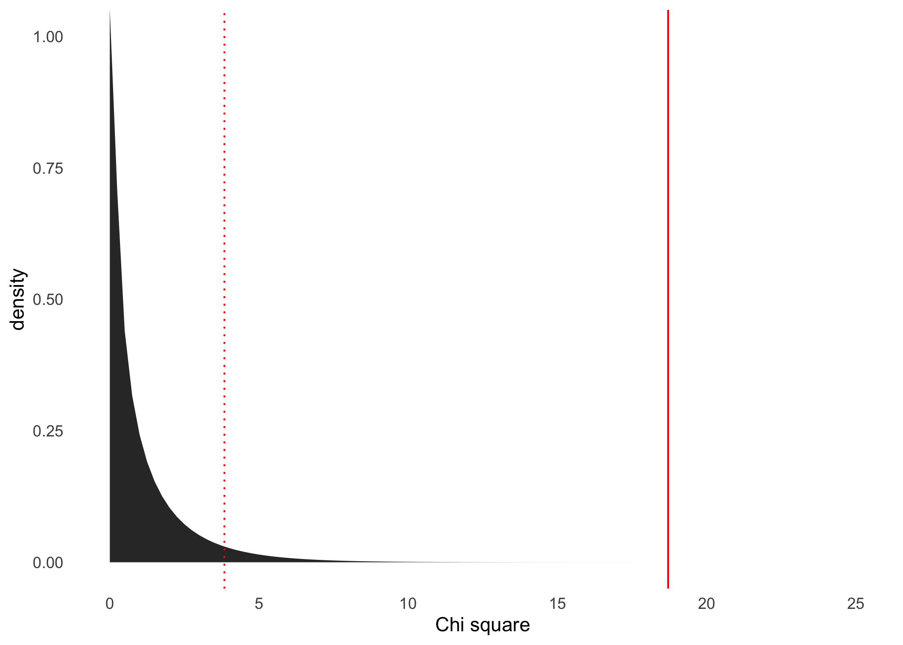
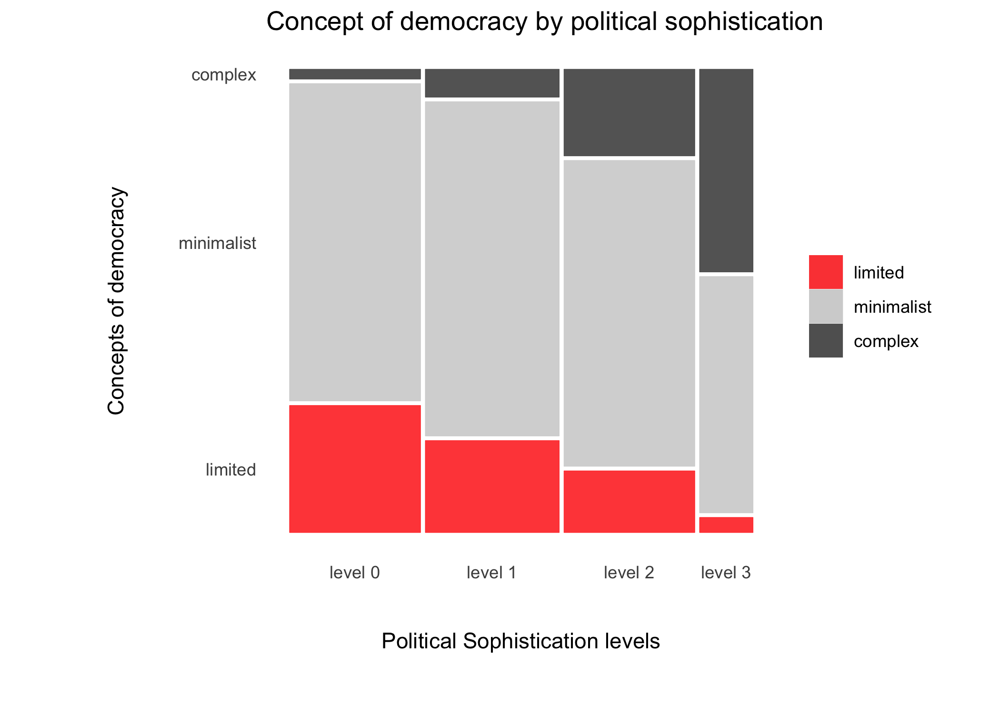
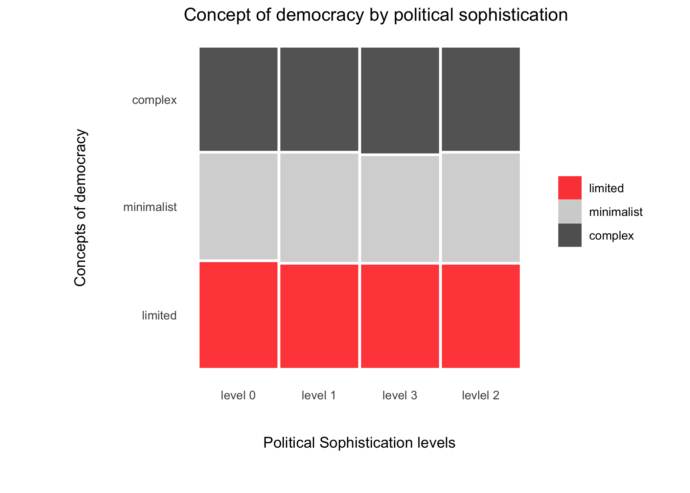
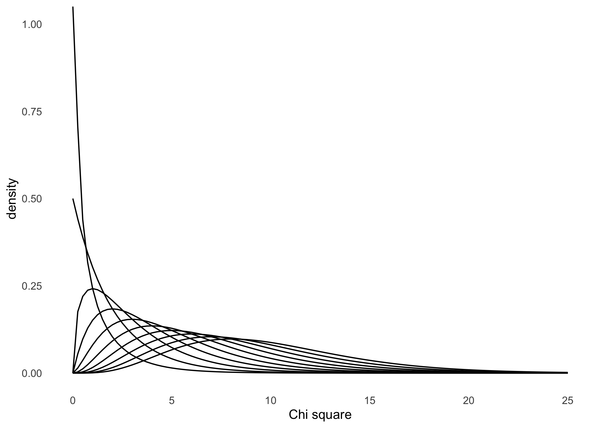

Asociación entre variables
================

# Asociación entre variables

-   Ejemplos de *χ*<sup>2</sup>

## Prueba de *χ*<sup>2</sup> para una sola muestra

``` r
#------------------------------------------------------------------------------
# Sammarco & Konecny (2010) example
#------------------------------------------------------------------------------

# -----------------------------------------------
# data example
# -----------------------------------------------

data_surv <- data.frame(
  ethnic   = c(rep("caucassian", 2+179), rep("latina", 13+84)),
  psych_ill  = c(rep("yes",2),rep("no",179),rep("yes",13),rep("no",84))
    )

# -----------------------------------------------
# show table
# -----------------------------------------------

library(dplyr)
```

    ## 
    ## Attaching package: 'dplyr'

    ## The following objects are masked from 'package:stats':
    ## 
    ##     filter, lag

    ## The following objects are masked from 'package:base':
    ## 
    ##     intersect, setdiff, setequal, union

``` r
data_surv %>%
dplyr::sample_n(20) %>%
knitr::kable()
```

| ethnic     | psych\_ill |
|:-----------|:-----------|
| caucassian | no         |
| caucassian | no         |
| caucassian | no         |
| latina     | no         |
| latina     | no         |
| latina     | no         |
| caucassian | no         |
| latina     | no         |
| latina     | no         |
| caucassian | no         |
| caucassian | no         |
| latina     | no         |
| latina     | no         |
| caucassian | no         |
| caucassian | no         |
| latina     | no         |
| latina     | no         |
| latina     | yes        |
| caucassian | no         |
| latina     | no         |

``` r
# -----------------------------------------------
# observed frequency
# -----------------------------------------------

freq_latina <- data_surv %>%
               dplyr::filter(ethnic == 'latina') %>%
               table()
# -----------------------------------------------
# display table
# -----------------------------------------------

freq_latina
```

    ##         psych_ill
    ## ethnic   no yes
    ##   latina 84  13

``` r
# -----------------------------------------------
# one sample chi square test
# -----------------------------------------------

chisq.test(freq_latina, p = c(0.95, .05), correct = FALSE)
```

    ## Warning in chisq.test(freq_latina, p = c(0.95, 0.05), correct = FALSE): Chi-
    ## squared approximation may be incorrect

    ## 
    ##  Chi-squared test for given probabilities
    ## 
    ## data:  freq_latina
    ## X-squared = 14.416, df = 1, p-value = 0.0001465

## Prueba de *χ*<sup>2</sup> de independiencia

``` r
#------------------------------------------------------------------------------
# Sammarco & Konecny (2010) example
#------------------------------------------------------------------------------


# -----------------------------------------------
# data example
# -----------------------------------------------

data_surv <- data.frame(
  ethnic   = c(rep("caucassian", 2+179), rep("latina", 13+84)),
  psych_ill  = c(rep("yes",2),rep("no",179),rep("yes",13),rep("no",84))
    )

# -----------------------------------------------
# display table
# -----------------------------------------------

xtabs(~ psych_ill + ethnic, data = data_surv)
```

    ##          ethnic
    ## psych_ill caucassian latina
    ##       no         179     84
    ##       yes          2     13

``` r
# -----------------------------------------------
# apply chi square test
# -----------------------------------------------

cross_table <- xtabs(~ psych_ill + ethnic, data = data_surv)
chisq.test(cross_table, correct = FALSE)
```

    ## 
    ##  Pearson's Chi-squared test
    ## 
    ## data:  cross_table
    ## X-squared = 18.709, df = 1, p-value = 1.523e-05

``` r
# -----------------------------------------------
# apply chi square test summary as a table
# -----------------------------------------------

library(dplyr)
cross_table %>%
chisq.test() %>%
broom::tidy() %>%
knitr::kable()
```

| statistic |  p.value | parameter | method                                                       |
|----------:|---------:|----------:|:-------------------------------------------------------------|
|   16.3776 | 5.19e-05 |         1 | Pearson’s Chi-squared test with Yates’ continuity correction |

``` r
# -----------------------------------------------
# chi square obsserved value
# -----------------------------------------------

chi_value  <- cross_table %>%
              chisq.test(., correct = FALSE) %>%
              broom::tidy() %>%
              dplyr::select(statistic) %>%
              pull()

# -----------------------------------------------
# chi square critical value
# -----------------------------------------------

chi_critic <- qchisq(.95, df=1)

# -----------------------------------------------
# plot for Chi square distribution
# -----------------------------------------------

library(ggplot2)
ggplot(data.frame(x = c(0, 50)), aes(x)) +
  stat_function(fun = dchisq, args = list(df = 1), geom = "area") +
  geom_vline(xintercept = chi_value, color = 'red') +
  geom_vline(xintercept = chi_critic, color = 'red', linetype = 'dotted') +  
  scale_x_continuous(breaks=seq(0, 100, 1)) + 
  xlim(0,25) +
  ylim(0,1) +
  labs(
    x = 'Chi square', 
    y = 'density') +
  theme_minimal() +
  theme(
  panel.background = element_blank(),
  panel.grid.minor = element_blank(),
  panel.grid.major = element_blank()
  )
```

    ## Scale for 'x' is already present. Adding another scale for 'x', which will
    ## replace the existing scale.

<!-- -->

``` r
# -----------------------------------------------
# one sample chi square test
# -----------------------------------------------


freq_latina <- data_surv %>%
               dplyr::filter(ethnic == 'latina') %>%
               table()

chisq.test(freq_latina, p = c(0.95, .05), correct = FALSE)
```

    ## Warning in chisq.test(freq_latina, p = c(0.95, 0.05), correct = FALSE): Chi-
    ## squared approximation may be incorrect

    ## 
    ##  Chi-squared test for given probabilities
    ## 
    ## data:  freq_latina
    ## X-squared = 14.416, df = 1, p-value = 0.0001465

## Diferentes tamaños de*χ*<sup>2</sup> como indicadores de discrepancia

``` r
#------------------------------------------------------------------------------
# Sammarco & Konecny (2010) example
#------------------------------------------------------------------------------


# -----------------------------------------------
# data example
# -----------------------------------------------

chisq.test(c(50, 50), p = c(0.50, .50), correct = FALSE)
```

    ## 
    ##  Chi-squared test for given probabilities
    ## 
    ## data:  c(50, 50)
    ## X-squared = 0, df = 1, p-value = 1

``` r
chisq.test(c(55, 45), p = c(0.50, .50), correct = FALSE)
```

    ## 
    ##  Chi-squared test for given probabilities
    ## 
    ## data:  c(55, 45)
    ## X-squared = 1, df = 1, p-value = 0.3173

``` r
chisq.test(c(60, 40), p = c(0.50, .50), correct = FALSE)
```

    ## 
    ##  Chi-squared test for given probabilities
    ## 
    ## data:  c(60, 40)
    ## X-squared = 4, df = 1, p-value = 0.0455

``` r
chisq.test(c(65, 45), p = c(0.50, .50), correct = FALSE)
```

    ## 
    ##  Chi-squared test for given probabilities
    ## 
    ## data:  c(65, 45)
    ## X-squared = 3.6364, df = 1, p-value = 0.05653

``` r
chisq.test(c(70, 30), p = c(0.50, .50), correct = FALSE)
```

    ## 
    ##  Chi-squared test for given probabilities
    ## 
    ## data:  c(70, 30)
    ## X-squared = 16, df = 1, p-value = 6.334e-05

## *χ*<sup>2</sup> como prueba de independencia para más de dos categorias

``` r
#------------------------------------------------------------------------------
# Sandoval & Carrasco (2021)
#------------------------------------------------------------------------------

# -----------------------------------------------
# data example
# -----------------------------------------------

dem_16 <- psi2301::dem_16

# -----------------------------------------------
# check data
# -----------------------------------------------

r4sda::variables_table(dem_16)
```

    ## Loading required package: purrr

    ## Loading required package: stringr

    ## # A tibble: 12 x 4
    ##    variable  type  values                labels                                 
    ##    <chr>     <chr> <chr>                 <chr>                                  
    ##  1 id_i      dbl   "63, 8736, 9067, 969… id único del caso                      
    ##  2 ctry      chr   "e\", \"Chile\", \"C… nombre del país                        
    ##  3 sex       dbl   " 1, 0, 0, 1, 0, 0, … sexo del estudiante (0 = niño, 1 = niñ…
    ##  4 age       dbl   "2, 13.33, 13.92, 13… edad del estudiante en años (media = 1…
    ##  5 dem       dbl   " 1, 1, 2, 3, 2, 1, … perfil de concepciones de las democrac…
    ##  6 dem_group chr   " \"complex\", \"min… perfil de concepciones de las democrac…
    ##  7 aut       dbl   "7, 47.94, 59.24, 51… creencias antidemocráticas (AUTGOV, me…
    ##  8 civ       dbl   "479.65, 556.01, 548… conocimiento cívico (PV1CVI, media =  …
    ##  9 ses       dbl   "7, 1.08, -1.03, -0.… nivel socioecónomico (media = 0, sd = …
    ## 10 edu       dbl   " 0, 0, 1, 0, 1, 1, … educación de los padres (1 = educación…
    ## 11 level     dbl   " 0, 0, 2, 1, 2, 2, … niveles de conocimiento cívico (numéri…
    ## 12 level_lab chr   " \"level 3\", \"lev… niveles de conocimiento cívico (Level …

``` r
# -----------------------------------------------
# prepare data
# -----------------------------------------------

dem_16 <- dem_16 %>%
          mutate(dem_order = case_when(
            dem_group == 'complex' ~ 3,
            dem_group == 'minimalist' ~ 2,
            dem_group == 'limited' ~ 1
            )) %>%
          mutate(dem_lab = forcats::as_factor(dem_group)) %>%
          mutate(dem_lab = forcats::fct_reorder(dem_lab, dem_order)) %>%
          mutate(level_lab = forcats::as_factor(level_lab)) %>%
          mutate(level_lab = forcats::fct_reorder(level_lab, level))

# -----------------------------------------------
# data for plot
# -----------------------------------------------

data_plot <- dem_16 %>%
             dplyr::select(dem_lab, level_lab) %>%
             na.omit()
             
# -----------------------------------------------
# mosaic plot
# -----------------------------------------------
             
library(ggmosaic)
data_plot %>% 
ggplot() +
  geom_mosaic(aes(x = product(dem_lab, level_lab), fill = dem_lab)) +
  theme_mosaic() +
  scale_fill_manual(
      values = c( 'red', 'grey80', 'grey20')
      ) +
  theme(
  axis.ticks = element_blank(),
  legend.title = element_blank(),
  axis.title.x = element_text(margin = unit(c(t = 9, r = 9, b = 9, l = 9), "mm")),
  axis.title.y = element_text(margin = unit(c(t = 9, r = 9, b = 9, l = 9), "mm"))
  ) +
  labs(
    x = 'Political Sophistication levels',
    y = 'Concepts of democracy',
    title = "Concept of democracy by political sophistication"
    )             
```

<!-- -->

``` r
# -----------------------------------------------
# save plot
# -----------------------------------------------

ggplot2::ggsave(
  last_plot(), 
  filename = "dem_by_level.jpg",
  units  = 'cm', 
  scale  = 1.5, 
  width  = 14, 
  height = 14, 
  dpi    = 400
  )

# -----------------------------------------------
# display table
# -----------------------------------------------

xtabs(~ dem_lab + level_lab, data = dem_16) %>%
prop.table(1) %>%
knitr::kable(., digits = 2)
```

|            | level 0 | level 1 | level 2 | level 3 |
|:-----------|--------:|--------:|--------:|--------:|
| limited    |    0.44 |    0.33 |    0.21 |    0.02 |
| minimalist |    0.30 |    0.32 |    0.29 |    0.09 |
| complex    |    0.05 |    0.14 |    0.42 |    0.40 |

``` r
# Nota: filas de porcentajes suman 100%

# -----------------------------------------------
# apply chi square test
# -----------------------------------------------

cross_table <- xtabs(~ dem_lab + level_lab, data = dem_16)
chisq.test(cross_table, correct = FALSE)
```

    ## 
    ##  Pearson's Chi-squared test
    ## 
    ## data:  cross_table
    ## X-squared = 430.64, df = 6, p-value < 2.2e-16

``` r
# -----------------------------------------------
# effect size
# -----------------------------------------------

rcompanion::cramerV(cross_table)
```

    ## Cramer V 
    ##   0.2935

## Cómo serían los resultados, si los datos fueran independientes

``` r
#------------------------------------------------------------------------------
# Sammarco & Konecny (2010) example
#------------------------------------------------------------------------------

# -----------------------------------------------
# data example
# -----------------------------------------------

data_null <- data.frame(
  dem_lab    = c(rep("limited", 165), rep("minimalist", 170), rep("complex", 165)),
  level_lab  = c(
    rep("level 0",41),rep("level 1",41),rep("levlel 2",41),rep("level 3",41),
    rep("level 0",43),rep("level 1",43),rep("levlel 2",43),rep("level 3",43),
    rep("level 0",41),rep("level 1",41),rep("levlel 2",41),rep("level 3",41))
    ) %>%
    mutate(dem_order = case_when(
            dem_lab == 'complex' ~ 3,
            dem_lab == 'minimalist' ~ 2,
            dem_lab == 'limited' ~ 1
            )) %>%
    mutate(level_order = case_when(
            level_lab == 'level 3' ~ 3,
            level_lab == 'level 2' ~ 2,
            level_lab == 'level 1' ~ 1,
            level_lab == 'level 0' ~ 0
            )) %>%
          mutate(dem_lab = forcats::as_factor(dem_lab)) %>%
          mutate(dem_lab = forcats::fct_reorder(dem_lab, dem_order)) %>%
          mutate(level_lab = forcats::as_factor(level_lab)) %>%
          mutate(level_lab = forcats::fct_reorder(level_lab, level_order))

# -----------------------------------------------
# data example
# -----------------------------------------------


library(ggmosaic)
data_null %>% 
ggplot() +
  geom_mosaic(aes(x = product(dem_lab, level_lab), fill = dem_lab)) +
  theme_mosaic() +
  scale_fill_manual(
      values = c( 'red', 'grey80', 'grey20')
      ) +
  theme(
  axis.ticks = element_blank(),
  legend.title = element_blank(),
  axis.title.x = element_text(margin = unit(c(t = 9, r = 9, b = 9, l = 9), "mm")),
  axis.title.y = element_text(margin = unit(c(t = 9, r = 9, b = 9, l = 9), "mm"))
  ) +
  labs(
    x = 'Political Sophistication levels',
    y = 'Concepts of democracy',
    title = "Concept of democracy by political sophistication"
    )      
```

<!-- -->

``` r
# -----------------------------------------------
# display table
# -----------------------------------------------

xtabs(~ dem_lab + level_lab, data = data_null) %>%
prop.table(1) %>%
knitr::kable(., digits = 2)
```

|            | level 0 | level 1 | level 3 | levlel 2 |
|:-----------|--------:|--------:|--------:|---------:|
| limited    |    0.25 |    0.25 |    0.25 |     0.25 |
| minimalist |    0.25 |    0.25 |    0.25 |     0.25 |
| complex    |    0.25 |    0.25 |    0.25 |     0.25 |

``` r
# Nota: filas de porcentajes suman 100%

# -----------------------------------------------
# apply chi square test
# -----------------------------------------------

cross_table <- xtabs(~ dem_lab + level_lab, data = data_null)
chisq.test(cross_table, correct = FALSE)
```

    ## 
    ##  Pearson's Chi-squared test
    ## 
    ## data:  cross_table
    ## X-squared = 0.059893, df = 6, p-value = 1

``` r
# -----------------------------------------------
# effect size
# -----------------------------------------------

rcompanion::cramerV(cross_table)
```

    ## Cramer V 
    ## 0.007739

## Prueba de *χ*<sup>2</sup> de independiencia

``` r
#------------------------------------------------------------------------------
# discrimination example
#------------------------------------------------------------------------------

# -----------------------------------------------
# data example
# -----------------------------------------------

data_hires <- data.frame(
  sex    = c(rep("male", 24+7), rep("female", 16+16)),
  hired  = c(rep("yes",24),rep("no",7),rep("yes",16),rep("no",16))
    )

# -----------------------------------------------
# cross table
# -----------------------------------------------

xtabs(~ hired + sex, data = data_hires)
```

    ##      sex
    ## hired female male
    ##   no      16    7
    ##   yes     16   24

``` r
# -----------------------------------------------
# chi square
# -----------------------------------------------

cross_table <- xtabs(~ hired + sex, data = data_hires)
chisq.test(cross_table, correct = FALSE)
```

    ## 
    ##  Pearson's Chi-squared test
    ## 
    ## data:  cross_table
    ## X-squared = 5.1072, df = 1, p-value = 0.02383

``` r
# -----------------------------------------------
# references
# -----------------------------------------------

# Steinpreis et al. (1999) The impact of gender on the review of the curricula vitae of job applicants and tenure candidates
```

# Anexos

## *χ*<sup>2</sup> distribution plot

``` r
#------------------------------------------------------------------------------
# distribution plot
#------------------------------------------------------------------------------

# -----------------------------------------------
# plot for Chi square distribution
# -----------------------------------------------


library(ggplot2)
ggplot(data.frame(x = c(0, 50)), aes(x)) +
  stat_function(fun = dchisq, args = list(df = 1), geom = "line") +
  stat_function(fun = dchisq, args = list(df = 2), geom = "line") +
  stat_function(fun = dchisq, args = list(df = 3), geom = "line") +
  stat_function(fun = dchisq, args = list(df = 4), geom = "line") +
  stat_function(fun = dchisq, args = list(df = 5), geom = "line") +
  stat_function(fun = dchisq, args = list(df = 6), geom = "line") +
  stat_function(fun = dchisq, args = list(df = 7), geom = "line") +
  stat_function(fun = dchisq, args = list(df = 8), geom = "line") +
  stat_function(fun = dchisq, args = list(df = 9), geom = "line") +
  stat_function(fun = dchisq, args = list(df = 10), geom = "line") +
  scale_x_continuous(breaks=seq(0, 100, 1)) + 
  xlim(0,25) +
  ylim(0,1) +
  labs(
    x = 'Chi square', 
    y = 'density') +
  theme_minimal() +
  theme(
  panel.background = element_blank(),
  panel.grid.minor = element_blank(),
  panel.grid.major = element_blank()
  )
```

    ## Scale for 'x' is already present. Adding another scale for 'x', which will
    ## replace the existing scale.

<!-- -->
