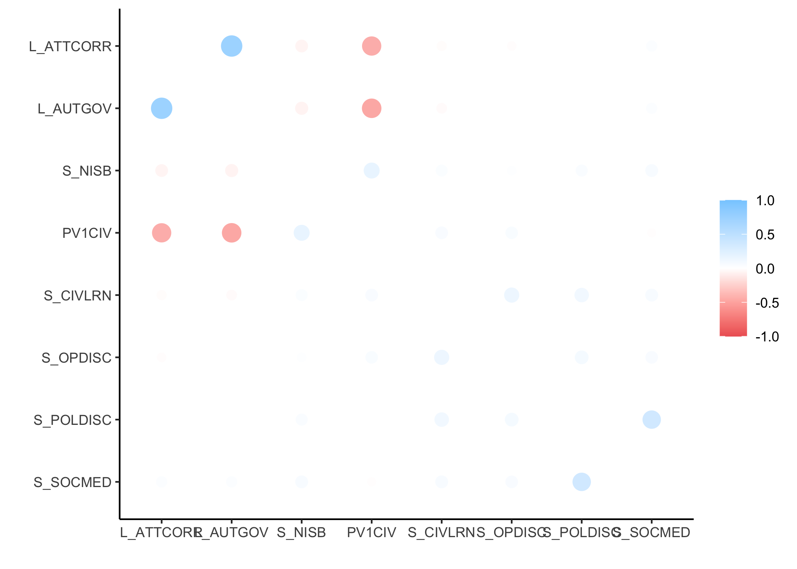
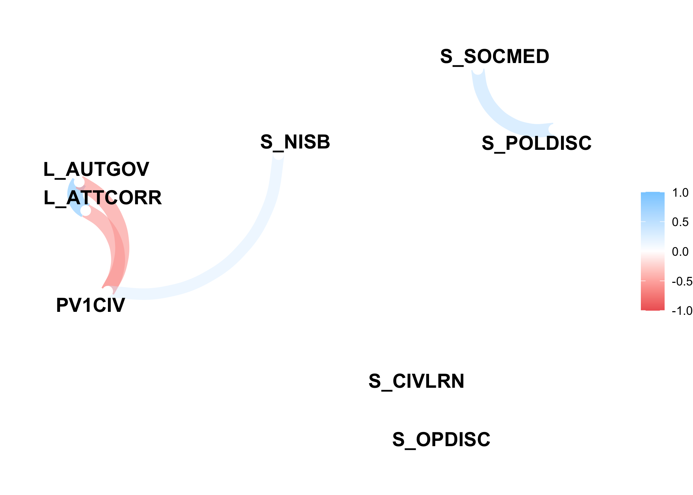
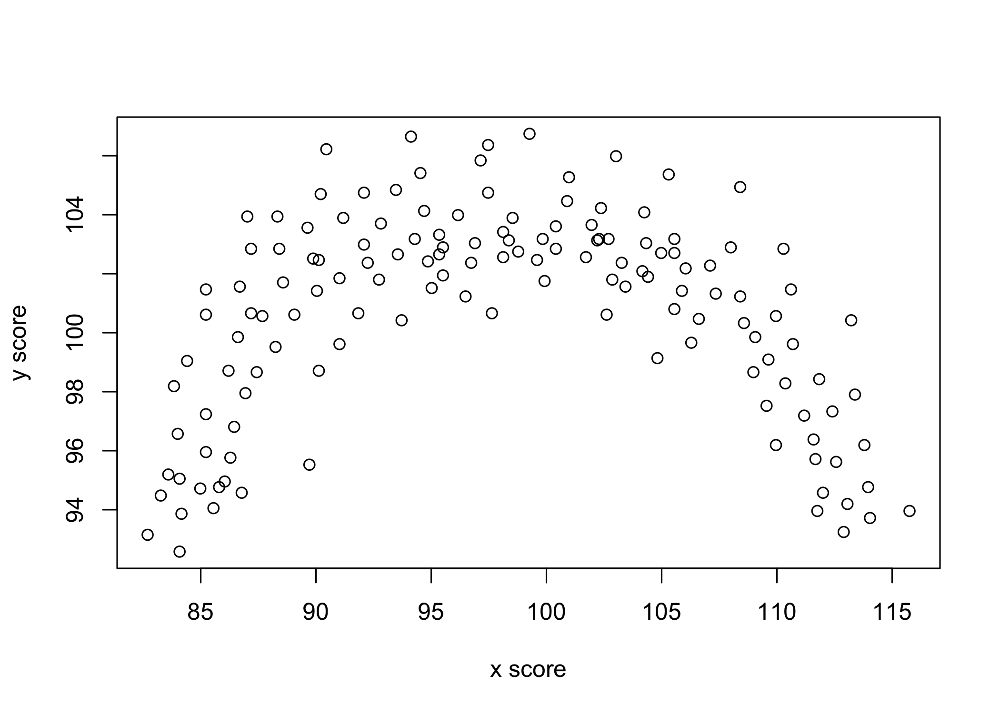

Asociación entre variables
================

# Asociación entre variables

-   Ejemplos de r

## Correlación

-   Calculo de correlación por pasos

``` r
#------------------------------------------------------------------------------
# correlation by steps
#------------------------------------------------------------------------------

# -----------------------------------------------
# load data
# -----------------------------------------------

url_file <- 'https://raw.githubusercontent.com/dacarras/psi2301_examples/master/data/correlation_example.csv'
data_correlation <- readr::read_csv(url_file)
```

    ## 
    ## ── Column specification ─────────────────────────────────────────────────────────────────────────────────────────────────────────────────────────────────────────────────────────────────────────────────────────
    ## cols(
    ##   x = col_double(),
    ##   y = col_double()
    ## )

``` r
# -----------------------------------------------
# display data
# -----------------------------------------------

data_correlation[1:10,] %>%
knitr::kable(., digits = 2)
```

|     x |      y |
|------:|-------:|
| 42.90 | 506.45 |
| 46.79 | 454.08 |
| 64.63 | 612.95 |
| 52.47 | 496.24 |
| 50.67 | 433.61 |
| 35.71 | 607.49 |
| 67.26 | 438.84 |
| 38.79 | 473.49 |
| 59.50 | 440.30 |
| 58.30 | 604.08 |

``` r
# -----------------------------------------------
# generate components: formula 1, based on covariance
# -----------------------------------------------

data_corr <- data_correlation %>%
             # mean of x
             mutate(x_bar = mean(x, na.rm = TRUE)) %>%
             # mean of y
             mutate(y_bar = mean(y, na.rm = TRUE)) %>%
             # deviations from x             
             mutate(x_dev = x - x_bar) %>%
             # deviations from y     
             mutate(y_dev = y - y_bar) %>%
             # cross products of deviations     
             mutate(cross = x_dev*y_dev) %>%
             # square of x_dev             
             mutate(x_var = x_dev^2) %>%
             # square of y_dev           
             mutate(y_var = y_dev^2)

# -----------------------------------------------
# display components
# -----------------------------------------------

data_corr[1:10,] %>%
knitr::kable(., digits = 2)
```

|     x |      y | x\_bar | y\_bar | x\_dev | y\_dev |    cross | x\_var |   y\_var |
|------:|-------:|-------:|-------:|-------:|-------:|---------:|-------:|---------:|
| 42.90 | 506.45 |  50.75 | 500.56 |  -7.85 |   5.89 |   -46.25 |  61.69 |    34.68 |
| 46.79 | 454.08 |  50.75 | 500.56 |  -3.96 | -46.48 |   184.28 |  15.72 |  2160.50 |
| 64.63 | 612.95 |  50.75 | 500.56 |  13.88 | 112.39 |  1559.44 | 192.53 | 12631.24 |
| 52.47 | 496.24 |  50.75 | 500.56 |   1.72 |  -4.32 |    -7.41 |   2.94 |    18.67 |
| 50.67 | 433.61 |  50.75 | 500.56 |  -0.08 | -66.95 |     5.66 |   0.01 |  4482.46 |
| 35.71 | 607.49 |  50.75 | 500.56 | -15.04 | 106.93 | -1608.70 | 226.34 | 11433.77 |
| 67.26 | 438.84 |  50.75 | 500.56 |  16.51 | -61.72 | -1018.73 | 272.43 |  3809.51 |
| 38.79 | 473.49 |  50.75 | 500.56 | -11.96 | -27.07 |   323.90 | 143.15 |   732.85 |
| 59.50 | 440.30 |  50.75 | 500.56 |   8.75 | -60.26 |  -527.01 |  76.48 |  3631.41 |
| 58.30 | 604.08 |  50.75 | 500.56 |   7.55 | 103.52 |   781.09 |  56.93 | 10716.14 |

``` r
# -----------------------------------------------
# terms of correlation formula
# -----------------------------------------------

covariance  <- sum(data_corr$cross)
denominator <- sqrt(sum(data_corr$x_var)*sum(data_corr$y_var))

# -----------------------------------------------
# get correlation
# -----------------------------------------------

covariance/denominator
```

    ## [1] -0.5627226

``` r
# -----------------------------------------------
# get correlation via stats::cor()
# -----------------------------------------------

cor(data_corr$y, data_corr$x)
```

    ## [1] -0.5627226

``` r
# -----------------------------------------------
# generate components: formula 2, based on z score
# -----------------------------------------------

data_corr <- data_correlation %>%
             # mean of x
             mutate(x_bar = mean(x, na.rm = TRUE)) %>%
             # mean of y
             mutate(y_bar = mean(y, na.rm = TRUE)) %>%
             # sd of x
             mutate(x_sd = sd(x, na.rm = TRUE)) %>%
             # sd of y
             mutate(y_sd = sd(y, na.rm = TRUE)) %>%
             # deviations from x             
             mutate(x_dev = x - x_bar) %>%
             # deviations from y     
             mutate(y_dev = y - y_bar) %>%
             # x z_score
             mutate(x_z = x_dev/x_sd) %>%
             # x z_score
             mutate(y_z = y_dev/y_sd) %>%
             # cross products of deviations     
             mutate(cross = x_z*y_z)

# -----------------------------------------------
# display components
# -----------------------------------------------

data_corr[1:10,] %>%
knitr::kable(., digits = 2)
```

|     x |      y | x\_bar | y\_bar | x\_sd |  y\_sd | x\_dev | y\_dev |  x\_z |  y\_z | cross |
|------:|-------:|-------:|-------:|------:|-------:|-------:|-------:|------:|------:|------:|
| 42.90 | 506.45 |  50.75 | 500.56 | 10.02 | 102.16 |  -7.85 |   5.89 | -0.78 |  0.06 | -0.05 |
| 46.79 | 454.08 |  50.75 | 500.56 | 10.02 | 102.16 |  -3.96 | -46.48 | -0.40 | -0.45 |  0.18 |
| 64.63 | 612.95 |  50.75 | 500.56 | 10.02 | 102.16 |  13.88 | 112.39 |  1.38 |  1.10 |  1.52 |
| 52.47 | 496.24 |  50.75 | 500.56 | 10.02 | 102.16 |   1.72 |  -4.32 |  0.17 | -0.04 | -0.01 |
| 50.67 | 433.61 |  50.75 | 500.56 | 10.02 | 102.16 |  -0.08 | -66.95 | -0.01 | -0.66 |  0.01 |
| 35.71 | 607.49 |  50.75 | 500.56 | 10.02 | 102.16 | -15.04 | 106.93 | -1.50 |  1.05 | -1.57 |
| 67.26 | 438.84 |  50.75 | 500.56 | 10.02 | 102.16 |  16.51 | -61.72 |  1.65 | -0.60 | -1.00 |
| 38.79 | 473.49 |  50.75 | 500.56 | 10.02 | 102.16 | -11.96 | -27.07 | -1.19 | -0.26 |  0.32 |
| 59.50 | 440.30 |  50.75 | 500.56 | 10.02 | 102.16 |   8.75 | -60.26 |  0.87 | -0.59 | -0.51 |
| 58.30 | 604.08 |  50.75 | 500.56 | 10.02 | 102.16 |   7.55 | 103.52 |  0.75 |  1.01 |  0.76 |

``` r
# -----------------------------------------------
# terms of correlation formula
# -----------------------------------------------

covariance  <- sum(data_corr$cross)
denominator <- nrow(data_corr) -1

# -----------------------------------------------
# get correlation
# -----------------------------------------------

covariance/denominator
```

    ## [1] -0.5627226

``` r
# -----------------------------------------------
# get correlation via stats::cor()
# -----------------------------------------------

cor(data_corr$y, data_corr$x)
```

    ## [1] -0.5627226

## Correlación entre Conocimiento Cívico y Tolerancia a la Corrupción

``` r
#------------------------------------------------------------------------------
# Carrasco & Pavón (2021)
#------------------------------------------------------------------------------

# -----------------------------------------------
# data example
# -----------------------------------------------

set.seed(12345678)
library(dplyr)
data_tol <- psi2301::iccs_16_lat %>%
            group_by(COUNTRY) %>%
            dplyr::sample_n(100, weights = ws) %>%
            ungroup()


# Nota: tomamos una muestra aleatoria de 100 casos por país
#       de los datos de ICCS 2016, de latinoamérica.

#------------------------------------------------
# correlation via stats::cor()
#------------------------------------------------

cor(x = data_tol$L_ATTCORR, 
    y = data_tol$PV1CIV,
    use = 'complete.obs',
    method = 'pearson')
```

    ## [1] -0.5639312

``` r
#------------------------------------------------
# correlation via stats::cor(), get p value
#------------------------------------------------

cor.test(
    x = data_tol$L_ATTCORR, 
    y = data_tol$PV1CIV,
    use = 'complete.obs',
    method = 'pearson',
    conf.level = .95)
```

    ## 
    ##  Pearson's product-moment correlation
    ## 
    ## data:  data_tol$L_ATTCORR and data_tol$PV1CIV
    ## t = -15.131, df = 491, p-value < 2.2e-16
    ## alternative hypothesis: true correlation is not equal to 0
    ## 95 percent confidence interval:
    ##  -0.6213009 -0.5005478
    ## sample estimates:
    ##        cor 
    ## -0.5639312

``` r
#------------------------------------------------
# get amount of observations
#------------------------------------------------

data_tol %>%
dplyr::select(L_ATTCORR, PV1CIV) %>%
na.omit() %>%
nrow()
```

    ## [1] 493

``` r
#------------------------------------------------
# correlation via corrr::correlate()
#------------------------------------------------

data_tol %>%
dplyr::select(L_ATTCORR, PV1CIV) %>%
r4sda::remove_labels() %>%
corrr::correlate() %>%
knitr::kable(., digits = 2)
```

    ## 
    ## Correlation method: 'pearson'
    ## Missing treated using: 'pairwise.complete.obs'

| term       | L\_ATTCORR | PV1CIV |
|:-----------|-----------:|-------:|
| L\_ATTCORR |         NA |  -0.56 |
| PV1CIV     |      -0.56 |     NA |

## Generación de matrices de correlación

``` r
#------------------------------------------------------------------------------
# Carrasco & Pavón (2021)
#------------------------------------------------------------------------------

# -----------------------------------------------
# data example
# -----------------------------------------------

set.seed(12345678)
library(dplyr)
data_tol <- psi2301::iccs_16_lat %>%
            group_by(COUNTRY) %>%
            dplyr::sample_n(100, weights = ws) %>%
            ungroup()


# Nota: tomamos una muestra aleatoria de 100 casos por país
#       de los datos de ICCS 2016, de latinoamérica.

#------------------------------------------------
# tabla de variables
#------------------------------------------------

data_tol %>%
r4sda::variables_table() %>%
knitr::kable()
```

| variable       | type    | values                        | labels                                                                                                                                        |
|:---------------|:--------|:------------------------------|:----------------------------------------------------------------------------------------------------------------------------------------------|
| COUNTRY        | chr     | CHL“,”CHL“,”CHL“,”CHL“,”…     | Participant Alphanumeric Code                                                                                                                 |
| IDCNTRY        | dbl+lbl | 152, 152, 152, 152, 152, 152… | Participant Code                                                                                                                              |
| IDSTUD         | dbl+lbl | 131, 10210125, 10530204, 105… | STUDENT ID                                                                                                                                    |
| IDSCHOOL       | dbl+lbl | 053, 1058, 1148, 1109, 1173,… | SCHOOL ID                                                                                                                                     |
| IDCLASS        | dbl+lbl | 02101, 105302, 105805, 11480… | CLASS ID                                                                                                                                      |
| IDGRADE        | dbl+lbl | , 8, 8, 8, 8, 8, 8, 8, 8, 8,… | Grade ID                                                                                                                                      |
| IDPOP          | dbl+lbl | , 2, 2, 2, 2, 2, 2, 2, 2, 2,… | Population ID                                                                                                                                 |
| IS3G03         | dbl+lbl | , 1, 1, 1, 1, 1, 1, 1, 1, 2,… | About You/What is the highest level of education you expect to complete                                                                       |
| IS3G03BA       | dbl+lbl | , 1, 1, 1, 1, 1, 1, 1, 1, 1,… | Your Home and your Family/Do any of these people live at home with you most or all of the time/Mother                                         |
| IS3G03BB       | dbl+lbl | 2, NA, 2, NA, 2, 2, 2, …      | Your Home and your Family/Do any of these people live at home with you most or all of the time/Other <female guardian>                        |
| IS3G03BC       | dbl+lbl | , 2, 1, 2, 1, 2, 2, 2, 1, 1,… | Your Home and your Family/Do any of these people live at home with you most or all of the time/Father                                         |
| IS3G03BD       | dbl+lbl | , 1, 2, 1, 2, 2, 1, 2, 2, 2,… | Your Home and your Family/Do any of these people live at home with you most or all of the time/Other <male guardian>                          |
| IS3G03BE       | dbl+lbl | , 1, 1, 1, 1, 1, 1, 2, 1, 1,… | Your Home and your Family/Do any of these people live at home with you most or all of the time/Siblings                                       |
| IS3G03BF       | dbl+lbl | , 2, 2, 1, 1, 1, 2, 1, 2, 2,… | Your Home and your Family/Do any of these people live at home with you most or all of the time/Grandparents                                   |
| IS3G03BG       | dbl+lbl | , 2, 1, 1, 2, 2, 2, 1, 1, 2,… | Your Home and your Family/Do any of these people live at home with you most or all of the time/Others                                         |
| IS3G04A        | dbl+lbl | , 1, 1, 1, 1, 1, 1, 1, 1, 1,… | Your Home and your Family/In what country were you and your parents born/You                                                                  |
| IS3G04B        | dbl+lbl | , 1, 1, 1, 1, 1, 1, 1, 1, 1,… | Your Home and your Family/In what country were you and your parents born/Mother or <female guardian>                                          |
| IS3G04C        | dbl+lbl | , 1, 1, 1, 1, 1, 1, 1, 1, 1,… | Your Home and your Family/In what country were you and your parents born/Father or <male guardian>                                            |
| IS3G05         | dbl+lbl | , 1, 1, 1, 1, 1, 1, 1, 1, 1,… | Your Home and your Family/What language do you speak at home most of the time                                                                 |
| IS3G07         | dbl+lbl | , 3, 3, 2, 3, 3, 3, 3, 1, 3,… | Your Home and your Family/What is the highest level of education completed by your mother or <female guardian>                                |
| IS3G09         | dbl+lbl | , 3, 3, 2, 4, 3, 3, 3, 1, 3,… | Your Home and your Family/What is the highest level of education completed by your father or <male guardian>                                  |
| IS3G10A        | dbl+lbl | , 4, 2, 3, 3, 3, 4, 3, 3, 3,… | Your Home and your Family/How interested in political and social issues/You                                                                   |
| IS3G10B        | dbl+lbl | , 3, 1, 3, 2, 2, 3, 3, 2, 3,… | Your Home and your Family/How interested in political and social issues/Mother or <female guardian>                                           |
| IS3G10C        | dbl+lbl | , 3, 3, 2, 2, 3, 3, 3, 3, 2,… | Your Home and your Family/How interested in political and social issues/Father or <male guardian>                                             |
| IS3G11         | dbl+lbl | , 1, 1, 2, 3, 2, 1, 2, 3, 2,… | Your Home and your Family/About how many books are there in your home                                                                         |
| IS3G12A        | dbl+lbl | 3, 2, 4, 1, 2, 3, 2, …        | Your Home and your Family/How many devices are used regularly/Desktop or portable computers (laptop, notebook or netbook)                     |
| IS3G12B        | dbl+lbl | 3, NA, 2, 2, 1, 4, 3, N…      | Your Home and your Family/How many devices are used regularly/Tablet devices or e-readers (e.g. <iPad> or <Kindle>)                           |
| IS3G12C        | dbl+lbl | 4, NA, 4, 3, 3, 4, 2, N…      | Your Home and your Family/How many devices are used regularly/Mobile phones with internet access (e.g. <smart phones>)                        |
| IS3G13         | dbl+lbl | , 2, 1, 2, 2, 1, 1, 1, 2, 1,… | Your Home and your Family/Do you have an Internet connection at home                                                                          |
| IS3G14A        | dbl+lbl | 4, 1, 1, 1, 2, 1, NA, …       | Your Activities Outside School/How often involved/Talking with your parent(s) about political or social issues                                |
| IS3G14B        | dbl+lbl | 4, 2, 3, 4, 4, 1, NA, …       | Your Activities Outside School/How often involved/Watching television to inform about national and international news                         |
| IS3G14C        | dbl+lbl | , 3, 3, 1, 1, 3, 1, 2, 2, 1,… | Your Activities Outside School/How often involved/Reading newspaper to inform about national and international news                           |
| IS3G14D        | dbl+lbl | 2, NA, 1, 1, 2, 1, 1, …       | Your Activities Outside School/How often involved/Talking with friends about political or social issues                                       |
| IS3G14E        | dbl+lbl | , 3, 3, 2, 2, 2, 1, 2, 3, 1,… | Your Activities Outside School/How often involved/Talking with your parent(s) about what is happening in other countries                      |
| IS3G14F        | dbl+lbl | , 1, 2, 2, 2, 3, 1, 2, 1, 2,… | Your Activities Outside School/How often involved/Talking with friends about what is happening in other countries                             |
| IS3G14G        | dbl+lbl | , 2, 2, 1, 1, 1, 1, 1, 1, 1,… | Your Activities Outside School/How often involved/Using internet to find information about political or social issues                         |
| IS3G14H        | dbl+lbl | , 1, 1, 1, 1, 1, 1, 1, 1, 1,… | Your Activities Outside School/How often involved/Posting a comment or image regarding a political or social issue on the internet            |
| IS3G14I        | dbl+lbl | , 1, 1, 1, 1, 1, 1, 1, 1, 1,… | Your Activities Outside School/How often involved/Sharing or commenting on another person’s online post regarding a political or social issue |
| IS3G15A        | dbl+lbl | , 3, 3, 3, 3, 3, 3, 2, 3, 3,… | Your Activities Outside School/Have you ever been involved/A youth organisation affiliated with political party or union                      |
| IS3G15B        | dbl+lbl | , 3, 2, 2, 2, 3, 3, 1, 3, 3,… | Your Activities Outside School/Have you ever been involved/An environmental action group or organisation                                      |
| IS3G15C        | dbl+lbl | , 3, 2, 2, 2, 3, 3, 2, 3, 3,… | Your Activities Outside School/Have you ever been involved/A Human Rights organisation                                                        |
| IS3G15D        | dbl+lbl | , 2, 2, 2, 3, 2, 3, 1, 3, 3,… | Your Activities Outside School/Have you ever been involved/A voluntary group doing something to help the community                            |
| IS3G15E        | dbl+lbl | , 3, 2, 1, 2, 2, 3, 1, 3, 3,… | Your Activities Outside School/Have you ever been involved/An organisation collecting money for a social cause                                |
| IS3G15F        | dbl+lbl | , 3, 2, 1, 1, 3, 3, 1, 3, 3,… | Your Activities Outside School/Have you ever been involved/A group of young people campaigning for an issue                                   |
| IS3G15G        | dbl+lbl | , 3, 3, 2, 3, 3, 3, 1, 3, 3,… | Your Activities Outside School/Have you ever been involved/An animal rights or animal welfare group                                           |
| IS3G15H        | dbl+lbl | , 3, 3, 2, 3, 3, 3, 2, 1, 3,… | Your Activities Outside School/Have you ever been involved/A religious group or organisation                                                  |
| IS3G15I        | dbl+lbl | 3, 3, 3, 3, 3, 1, 3, …        | Your Activities Outside School/Have you ever been involved/A community youth group (such as &lt;boys/girls scouts, YMCA&gt;)                  |
| IS3G15J        | dbl+lbl | , 3, 1, 1, 1, 1, 3, 1, 3, 1,… | Your Activities Outside School/Have you ever been involved/A sports team                                                                      |
| IS3G16A        | dbl+lbl | , 2, 2, 3, 2, 2, 1, 1, 3, 2,… | Your School/At school, have you ever done/Active participation in an organised debate                                                         |
| IS3G16B        | dbl+lbl | , 2, 1, 1, 1, 2, 1, 1, 1, 1,… | Your School/At school, have you ever done/Voting for <class representative> or <school parliament>                                            |
| IS3G16C        | dbl+lbl | , 3, 1, 1, 3, 2, 3, 1, 3, 3,… | Your School/At school, have you ever done/Taking part in decision-making about how the school is run                                          |
| IS3G16D        | dbl+lbl | , 3, 3, 1, 3, 3, 3, 2, 3, 3,… | Your School/At school, have you ever done/Taking part in discussions at a <student assembly>                                                  |
| IS3G16E        | dbl+lbl | , 3, 2, 3, 2, 2, 2, 1, 2, 3,… | Your School/At school, have you ever done/Becoming a candidate for <class representative> or <school parliament>                              |
| IS3G16F        | dbl+lbl | , 3, 3, 1, 3, 2, 3, 3, 3, 3,… | Your School/At school, have you ever done/Participating in an activity to make school more <environmentally friendly>                         |
| IS3G16G        | dbl+lbl | , 2, 3, 1, 3, 1, 2, 1, 3, 3,… | Your School/At school, have you ever done/Voluntary participation in school based music or drama activities outside of regular classes        |
| IS3G17A        | dbl+lbl | , 3, 4, 4, 4, 3, 2, 3, 4, 1,… | Your School/Discussing issues, how often happen/Teachers encourage students to make up their own minds                                        |
| IS3G17B        | dbl+lbl | , 3, 4, 4, 4, 3, 2, 4, 4, 2,… | Your School/Discussing issues, how often happen/Teachers encourage students to express their opinions                                         |
| IS3G17C        | dbl+lbl | 2, 2, 3, 2, 3, 4, 1, …        | Your School/Discussing issues, how often happen/Students bring up current political events for discussion in class                            |
| IS3G17D        | dbl+lbl | 4, 1, 4, 2, 2, 4, 3, …        | Your School/Discussing issues, how often happen/Students express opinions in class even when opinions are different                           |
| IS3G17E        | dbl+lbl | 2, 1, 4, 3, 3, 4, 2, …        | Your School/Discussing issues, how often happen/Teachers encourage to discuss with people having different opinions                           |
| IS3G17F        | dbl+lbl | , 2, 3, 4, 4, 3, 2, 3, 4, 1,… | Your School/Discussing issues, how often happen/Teachers present several sides of issues when explaining them in class                        |
| IS3G18A        | dbl+lbl | , 2, 1, 2, 4, 2, 3, 1, 1, 4,… | Your School/At school, to what extent have you learned/How citizens can vote in local or national elections                                   |
| IS3G18B        | dbl+lbl | , 3, 1, 2, 3, 2, 3, 1, 1, 4,… | Your School/At school, to what extent have you learned/How laws are introduced and changed in <country of test>                               |
| IS3G18C        | dbl+lbl | , 2, 1, 1, 1, 2, 1, 1, 2, 2,… | Your School/At school, to what extent have you learned/How to protect the environment                                                         |
| IS3G18D        | dbl+lbl | , 2, 1, 1, 1, 2, 3, 1, 3, 4,… | Your School/At school, to what extent have you learned/How to contribute to solving problems in the <local community>                         |
| IS3G18E        | dbl+lbl | , 3, 1, 2, 3, 2, 2, 1, 3, 4,… | Your School/At school, to what extent have you learned/How citizen rights are protected in <country of test>                                  |
| IS3G18F        | dbl+lbl | , 3, 1, 2, 4, 2, 3, 1, 3, 4,… | Your School/At school, to what extent have you learned/Political issues and events in other countries                                         |
| IS3G18G        | dbl+lbl | , 3, 1, 3, 4, 2, 2, 1, 1, 4,… | Your School/At school, to what extent have you learned/How the economy works                                                                  |
| IS3G19A        | dbl+lbl | , 2, 1, 1, 2, 1, 2, 1, 1, 2,… | Your School/Teachers and students at your school/Most of my teachers treat me fairly                                                          |
| IS3G19B        | dbl+lbl | , 3, 3, 1, 2, 2, 2, 1, 1, 2,… | Your School/Teachers and students at your school/Students get along well with most teachers                                                   |
| IS3G19C        | dbl+lbl | , 3, 2, 1, 1, 1, 1, 2, 1, 3,… | Your School/Teachers and students at your school/Most teachers are interested in students’ well-being                                         |
| IS3G19D        | dbl+lbl | , 2, 1, 1, 2, 1, 1, 2, 1, 3,… | Your School/Teachers and students at your school/Most of my teachers listen to what I have to say                                             |
| IS3G19E        | dbl+lbl | , 3, 1, 2, 1, 1, 2, 2, 1, 3,… | Your School/Teachers and students at your school/If I need extra help, I receive it from my teachers                                          |
| IS3G19F        | dbl+lbl | , 3, 1, 1, 1, 1, 2, 4, 1, 2,… | Your School/Teachers and students at your school/Most teachers would stop students from being bullied                                         |
| IS3G19G        | dbl+lbl | , 2, 2, 2, 2, 2, 2, 4, 3, 4,… | Your School/Teachers and students at your school/Most students at my school treat each other with respect                                     |
| IS3G19H        | dbl+lbl | , 2, 3, 1, 3, 2, 2, 4, 3, 3,… | Your School/Teachers and students at your school/Most students at my school get along well with each other                                    |
| IS3G19I        | dbl+lbl | , 2, 1, 1, 3, 2, 2, 4, 3, 1,… | Your School/Teachers and students at your school/My school is a place where students feel safe                                                |
| IS3G19J        | dbl+lbl | , 3, 4, 1, 3, 4, 3, 4, 3, 4,… | Your School/Teachers and students at your school/I am afraid of being bullied by other students                                               |
| IS3G20A        | dbl+lbl | , 1, 1, 3, 1, 1, 4, 4, 1, 2,… | Your School/How often did you experience/A student called you by an offensive nickname                                                        |
| IS3G20B        | dbl+lbl | , 1, 1, 2, 2, 1, 3, 4, 4, 2,… | Your School/How often did you experience/A student said things about you to make others laugh                                                 |
| IS3G20C        | dbl+lbl | , 2, 1, 2, 1, 1, 1, 3, 1, 1,… | Your School/How often did you experience/A student threatened to hurt you                                                                     |
| IS3G20D        | dbl+lbl | , 1, 1, 1, 1, 1, 1, 2, 1, 1,… | Your School/How often did you experience/You were physically attacked by another student                                                      |
| IS3G20E        | dbl+lbl | , 1, 1, 2, 1, 1, 1, 1, 1, 1,… | Your School/How often did you experience/A student broke something belonging to you on purpose                                                |
| IS3G20F        | dbl+lbl | , 1, 1, 1, 1, 1, 1, 2, 1, 1,… | Your School/How often did you experience/A student posted offensive pictures or text about you on the Internet                                |
| IS3G21A        | dbl+lbl | , 2, 1, 1, 2, 1, 1, 2, 3, 2,… | Your School/Student participation/Student participation in how schools are run can make schools better                                        |
| IS3G21B        | dbl+lbl | , 2, 1, 1, 2, 1, 1, 2, 1, 2,… | Your School/Student participation/Lots of positive changes can happen in schools when students work together                                  |
| IS3G21C        | dbl+lbl | , 2, 2, 1, 2, 1, 1, 4, 1, 2,… | Your School/Student participation/Organising groups of students to express their opinions could help solve problems                           |
| IS3G21D        | dbl+lbl | , 2, 1, 2, 2, 1, 2, 2, 1, 2,… | Your School/Student participation/Students can have more influence on what happens in schools if they act together                            |
| IS3G21E        | dbl+lbl | , 3, 3, 2, 3, 1, 2, 4, 1, 2,… | Your School/Student participation/Voting in student elections can make a difference to what happens at schools                                |
| IS3G22A        | dbl+lbl | , 2, 3, 1, 3, 1, 2, 1, 3, 2,… | Citizens and Society/Situations for democracy/Political leaders give government jobs to their family members                                  |
| IS3G22B        | dbl+lbl | , 2, 3, 2, 3, 2, 3, 2, 3, 2,… | Citizens and Society/Situations for democracy/One company or the government owns all newspapers in a country                                  |
| IS3G22C        | dbl+lbl | , 1, 1, 2, 2, 1, 3, 2, 1, 2,… | Citizens and Society/Situations for democracy/People are allowed to publicly criticise the government                                         |
| IS3G22D        | dbl+lbl | , 1, 1, 1, 1, 1, 1, 1, 1, 2,… | Citizens and Society/Situations for democracy/All adult citizens have the right to elect their political leaders                              |
| IS3G22E        | dbl+lbl | , 1, 1, 2, 1, 1, 1, 2, 1, 2,… | Citizens and Society/Situations for democracy/People are able to protest if they think a law is unfair                                        |
| IS3G22F        | dbl+lbl | , 2, 3, 2, 3, 1, 3, 1, 3, 2,… | Citizens and Society/Situations for democracy/The police have right to hold people in jail without trial                                      |
| IS3G22G        | dbl+lbl | , 2, 2, 1, 3, 3, 1, 2, 2, 2,… | Citizens and Society/Situations for democracy/Differences in income between poor and rich people are small                                    |
| IS3G22H        | dbl+lbl | , 2, 3, 2, 3, 3, 2, 2, 3, 2,… | Citizens and Society/Situations for democracy/The government influences decisions by courts of justice                                        |
| IS3G22I        | dbl+lbl | , 2, 1, 2, 1, 1, 1, 2, 1, 2,… | Citizens and Society/Situations for democracy/All <ethnic/racial> groups in the country have the same rights                                  |
| IS3G23A        | dbl+lbl | , 3, 3, 2, 2, 1, 3, 2, 1, 4,… | Citizens and Society/How important behaviours/Voting in every national election                                                               |
| IS3G23B        | dbl+lbl | 2, 4, 3, 3, 3, 2, 3, …        | Citizens and Society/How important behaviours/Joining a political party                                                                       |
| IS3G23C        | dbl+lbl | , 2, 2, 1, 2, 1, 2, 2, 1, 2,… | Citizens and Society/How important behaviours/Learning about the country’s history                                                            |
| IS3G23D        | dbl+lbl | , 2, 3, 2, 3, 2, 3, 2, 4, 1,… | Citizens and Society/How important behaviours/Following political issues in newspaper, on radio, on TV or on Internet                         |
| IS3G23E        | dbl+lbl | , 2, 3, 2, 2, 1, 2, 2, 1, 2,… | Citizens and Society/How important behaviours/Showing respect for government representatives                                                  |
| IS3G23F        | dbl+lbl | , 3, 3, 3, 3, 1, 3, 4, 1, 3,… | Citizens and Society/How important behaviours/Engaging in political discussions                                                               |
| IS3G23G        | dbl+lbl | , 3, 4, 3, 2, 2, 1, 4, 1, 2,… | Citizens and Society/How important behaviours/Participating in peaceful protests against laws believed to be unjust                           |
| IS3G23H        | dbl+lbl | 3, 1, 3, 3, 1, 2, 2, …        | Citizens and Society/How important behaviours/Participating in activities to benefit people in the <local community>                          |
| IS3G23I        | dbl+lbl | , 2, 1, 2, 2, 1, 1, 3, 1, 1,… | Citizens and Society/How important behaviours/Taking part in activities promoting human rights                                                |
| IS3G23J        | dbl+lbl | , 2, 2, 2, 2, 1, 1, 2, 2, 1,… | Citizens and Society/How important behaviours/Taking part in activities to protect the environment                                            |
| IS3G23K        | dbl+lbl | , 2, 1, 2, 2, 1, 3, 2, 1, 2,… | Citizens and Society/How important behaviours/Working hard                                                                                    |
| IS3G23L        | dbl+lbl | , 2, 1, 1, 2, 1, 2, 2, 1, 1,… | Citizens and Society/How important behaviours/Always obeying the law                                                                          |
| IS3G23M        | dbl+lbl | , 2, 1, 1, 2, 1, 1, 2, 1, 1,… | Citizens and Society/How important behaviours/Ensuring the economic welfare of their families                                                 |
| IS3G23N        | dbl+lbl | , 2, 1, 1, 2, 1, 1, 2, 1, 2,… | Citizens and Society/How important behaviours/Making personal efforts to protect natural resources                                            |
| IS3G23O        | dbl+lbl | , 2, 1, 1, 2, 1, 1, 2, 1, 1,… | Citizens and Society/How important behaviours/Respecting the rights of others to have their own opinions                                      |
| IS3G23P        | dbl+lbl | , 2, 1, 1, 2, 1, 1, 2, 2, 1,… | Citizens and Society/How important behaviours/Supporting people who are worse off than you                                                    |
| IS3G23Q        | dbl+lbl | , 3, 2, 1, 2, 1, 2, 3, 3, 1,… | Citizens and Society/How important behaviours/Engaging in activities to help people in less developed countries                               |
| IS3G24A        | dbl+lbl | , 2, 1, 1, 2, 1, 1, 1, 1, 1,… | Rights and Responsibilities/Roles women and men/Men and women should have equal opportunities to take part in government                      |
| IS3G24B        | dbl+lbl | , 1, 1, 1, 2, 1, 1, 2, 1, 1,… | Rights and Responsibilities/Roles women and men/Men and women should have the same rights in every way                                        |
| IS3G24C        | dbl+lbl | 3, 4, 4, NA, 1, 2, 2, …       | Rights and Responsibilities/Roles women and men/Women should stay out of politics                                                             |
| IS3G24D        | dbl+lbl | 4, NA, 4, 3, 2, 1, 2, …       | Rights and Responsibilities/Roles women and men/Not many jobs available, men should have more right to a job than women                       |
| IS3G24E        | dbl+lbl | , 1, 1, 1, 2, 1, 1, 2, 1, 1,… | Rights and Responsibilities/Roles women and men/Men and women should get equal pay when they are doing the same jobs                          |
| IS3G24F        | dbl+lbl | , 3, 3, 2, 2, 1, 4, 4, 1, 4,… | Rights and Responsibilities/Roles women and men/Men are better qualified to be political leaders than women                                   |
| IS3G24G        | dbl+lbl | , 2, 3, 1, 2, 1, 3, 3, 2, 3,… | Rights and Responsibilities/Roles women and men/Women’s first priority should be raising children                                             |
| IS3G25A        | dbl+lbl | , 2, 1, 1, 2, 1, 1, 1, 1, 1,… | Rights and Responsibilities/Rights and responsibilities/Should have equal chance to get good education                                        |
| IS3G25B        | dbl+lbl | , 2, 1, 1, 2, 1, 1, 2, 1, 1,… | Rights and Responsibilities/Rights and responsibilities/Should have an equal chance to get good jobs                                          |
| IS3G25C        | dbl+lbl | , 2, 1, 1, 2, 1, 1, 2, 1, 1,… | Rights and Responsibilities/Rights and responsibilities/Schools should teach students to respect                                              |
| IS3G25D        | dbl+lbl | , 3, 1, 1, 2, 1, 1, 3, 1, 1,… | Rights and Responsibilities/Rights and responsibilities/Should be encouraged to run in elections                                              |
| IS3G25E        | dbl+lbl | , 3, 1, 1, 2, 1, 1, 2, 1, 1,… | Rights and Responsibilities/Rights and responsibilities/Should have same rights and responsibilities                                          |
| IS3G26A        | dbl+lbl | , 3, 3, 2, 2, 1, 2, 2, 3, 2,… | Institutions and Society/Trust groups, institutions or sources of information/<National government> of <country of test>                      |
| IS3G26B        | dbl+lbl | , 3, 3, 2, 2, 2, 2, 2, 3, 2,… | Institutions and Society/Trust groups, institutions or sources of information/<Local government> of your town or city                         |
| IS3G26C        | dbl+lbl | , 2, 3, 2, 2, 2, 2, 3, 3, 3,… | Institutions and Society/Trust groups, institutions or sources of information/Courts of justice                                               |
| IS3G26D        | dbl+lbl | , 2, 2, 1, 2, 2, 2, 2, 3, 1,… | Institutions and Society/Trust groups, institutions or sources of information/The police                                                      |
| IS3G26E        | dbl+lbl | , 2, 3, 2, 2, 2, 3, 4, 4, 3,… | Institutions and Society/Trust groups, institutions or sources of information/Political parties                                               |
| IS3G26F        | dbl+lbl | , 3, 3, 2, 2, 2, 3, 4, 4, 2,… | Institutions and Society/Trust groups, institutions or sources of information/<National Parliament>                                           |
| IS3G26G        | dbl+lbl | , 3, 2, 1, 2, 2, 3, 2, 4, 2,… | Institutions and Society/Trust groups, institutions or sources of information/Media (television, newspapers, radio)                           |
| IS3G26H        | dbl+lbl | , 2, 4, 1, 2, 2, 3, 2, 3, 2,… | Institutions and Society/Trust groups, institutions or sources of information/Social media (e.g. &lt;Twitter, blogs, YouTube&gt;)             |
| IS3G26I        | dbl+lbl | , 2, 3, 1, 2, 1, 3, 1, 1, 1,… | Institutions and Society/Trust groups, institutions or sources of information/<The Armed Forces>                                              |
| IS3G26J        | dbl+lbl | , 2, 1, 1, 2, 1, 3, 3, 1, 2,… | Institutions and Society/Trust groups, institutions or sources of information/Schools                                                         |
| IS3G26K        | dbl+lbl | 3, 3, 1, 3, 2, 2, 2, …        | Institutions and Society/Trust groups, institutions or sources of information/The United Nations                                              |
| IS3G26L        | dbl+lbl | , 3, 3, 1, 2, 2, 3, 3, 4, 3,… | Institutions and Society/Trust groups, institutions or sources of information/People in general                                               |
| IS3G26M        | dbl+lbl | , 2, 4, 1, 2, 2, 3, 3, 4, 2,… | Institutions and Society/Trust groups, institutions or sources of information/<State/Province> government                                     |
| IS3G26N        | dbl+lbl | A, NA, NA, NA, NA, NA, NA, N… | Institutions and Society/Trust groups, institutions or sources of information/European Commission                                             |
| IS3G26O        | dbl+lbl | A, NA, NA, NA, NA, NA, NA, N… | Institutions and Society/Trust groups, institutions or sources of information/European Parliament                                             |
| IS3G27A        | dbl+lbl | , 3, 1, 1, 2, 1, 2, 1, 1, 1,… | Institutions and Society/<Country of test>/The <flag of country of test> is important to me                                                   |
| IS3G27B        | dbl+lbl | , 1, 1, 1, 2, 1, 2, 1, 1, 1,… | Institutions and Society/<Country of test>/I have great respect for <country of test>                                                         |
| IS3G27C        | dbl+lbl | , 1, 1, 1, 2, 1, 2, 1, 1, 1,… | Institutions and Society/<Country of test>/In <country of test> we should be proud of what we have achieved                                   |
| IS3G27D        | dbl+lbl | , 1, 1, 1, 2, 1, 2, 1, 3, 1,… | Institutions and Society/<Country of test>/I am proud to live in <country of test>                                                            |
| IS3G27E        | dbl+lbl | , 2, 2, 2, 2, 1, 3, 1, 4, 2,… | Institutions and Society/<Country of test>/<Country of test> is a better country to live in than most other countries                         |
| IS3G28A        | dbl+lbl | , 1, 1, 1, 1, 1, 1, 1, 1, 1,… | Institutions and Society/The following issues are a threat to the world’s future/Pollution                                                    |
| IS3G28B        | dbl+lbl | , 2, 1, 2, 1, 1, 1, 1, 1, 1,… | Institutions and Society/The following issues are a threat to the world’s future/Energy shortages                                             |
| IS3G28C        | dbl+lbl | , 2, 1, 1, 1, 1, 1, 2, 1, 1,… | Institutions and Society/The following issues are a threat to the world’s future/Global financial crises                                      |
| IS3G28D        | dbl+lbl | , 1, 1, 1, 1, 1, 1, 1, 1, 2,… | Institutions and Society/The following issues are a threat to the world’s future/Crime                                                        |
| IS3G28E        | dbl+lbl | , 2, 2, 1, 1, 1, 1, 1, 1, 1,… | Institutions and Society/The following issues are a threat to the world’s future/Water shortages                                              |
| IS3G28F        | dbl+lbl | , 1, 1, 1, 1, 1, 1, 1, 1, 1,… | Institutions and Society/The following issues are a threat to the world’s future/Violent conflict                                             |
| IS3G28G        | dbl+lbl | , 1, 2, 1, 1, 1, 1, 1, 1, 1,… | Institutions and Society/The following issues are a threat to the world’s future/Poverty                                                      |
| IS3G28H        | dbl+lbl | , 1, 1, 1, 1, 1, 1, 1, 1, 2,… | Institutions and Society/The following issues are a threat to the world’s future/Food shortages                                               |
| IS3G28I        | dbl+lbl | , 2, 2, 2, 2, 1, 1, 2, 1, 1,… | Institutions and Society/The following issues are a threat to the world’s future/Climate change                                               |
| IS3G28J        | dbl+lbl | , 1, 1, 1, 1, 1, 2, 1, 1, 2,… | Institutions and Society/The following issues are a threat to the world’s future/Unemployment                                                 |
| IS3G28K        | dbl+lbl | , 2, 1, 1, 1, 1, 2, 2, 1, 1,… | Institutions and Society/The following issues are a threat to the world’s future/Overpopulation                                               |
| IS3G28L        | dbl+lbl | , 1, 1, 1, 1, 1, 1, 1, 1, 2,… | Institutions and Society/The following issues are a threat to the world’s future/Infectious diseases (e.g. <bird flu>, <AIDS>)                |
| IS3G28M        | dbl+lbl | , 1, 1, 1, 1, 1, 2, 1, 1, 1,… | Institutions and Society/The following issues are a threat to the world’s future/Terrorism                                                    |
| IS3G29A        | dbl+lbl | , 3, 1, 3, 3, 1, 3, 2, 2, 3,… | Participating in Society/How well you would do/Discuss a newspaper article about a conflict between countries                                 |
| IS3G29B        | dbl+lbl | , 3, 1, 3, 2, 1, 3, 2, 2, 2,… | Participating in Society/How well you would do/Argue your point of view about a controversial political or social issue                       |
| IS3G29C        | dbl+lbl | , 3, 1, 2, 2, 1, 3, 2, 1, 2,… | Participating in Society/How well you would do/Stand as a candidate in a <school election>                                                    |
| IS3G29D        | dbl+lbl | , 3, 2, 2, 2, 1, 3, 2, 2, 2,… | Participating in Society/How well you would do/Organise a group of students in order to achieve changes at school                             |
| IS3G29E        | dbl+lbl | , 3, 3, 3, 2, 1, 4, 2, 1, 2,… | Participating in Society/How well you would do/Follow a television debate about a controversial issue                                         |
| IS3G29F        | dbl+lbl | , 3, 1, 2, 2, 1, 4, 2, 2, 2,… | Participating in Society/How well you would do/Write letter or email to a newspaper giving your view on a current issue                       |
| IS3G29G        | dbl+lbl | , 3, 1, 2, 2, 1, 3, 2, 1, 2,… | Participating in Society/How well you would do/Speak in front of your class about a social or political issue                                 |
| IS3G30A        | dbl+lbl | , 3, 4, 2, 3, 1, 3, 2, 1, 2,… | Participating in Society/Take part in activities to express opinion/Talk to others about your views                                           |
| IS3G30B        | dbl+lbl | , 3, 2, 3, 3, 1, 3, 2, 2, 2,… | Participating in Society/Take part in activities to express opinion/Contact an <elected representative>                                       |
| IS3G30C        | dbl+lbl | , 3, 4, 3, 2, 1, 2, 4, 2, 1,… | Participating in Society/Take part in activities to express opinion/Take part in a peaceful march or rally                                    |
| IS3G30D        | dbl+lbl | , 3, 1, 3, 2, 1, 3, 3, 2, 2,… | Participating in Society/Take part in activities to express opinion/Collect signatures for a petition                                         |
| IS3G30E        | dbl+lbl | , 3, 2, 3, 3, 1, 3, 4, 2, 2,… | Participating in Society/Take part in activities to express opinion/Contribute to an online discussion forum                                  |
| IS3G30F        | dbl+lbl | , 3, 3, 3, 3, 1, 3, 4, 2, 1,… | Participating in Society/Take part in activities to express opinion/Organise an online group to take a stance                                 |
| IS3G30G        | dbl+lbl | , 3, 3, 3, 3, 1, 3, 4, 2, 2,… | Participating in Society/Take part in activities to express opinion/Participate in an online campaign                                         |
| IS3G30H        | dbl+lbl | , 3, 3, 3, 2, 1, 3, 2, 2, 1,… | Participating in Society/Take part in activities to express opinion/Choose to buy products in support of social justice                       |
| IS3G30I        | dbl+lbl | 1, 2, 2, 3, 1, 2, 3, …        | Participating in Society/Take part in activities to express opinion/Spray-paint protest slogans on walls                                      |
| IS3G30J        | dbl+lbl | , 3, 2, 2, 3, 1, 2, 4, 2, 4,… | Participating in Society/Take part in activities to express opinion/Stage a protest by blocking traffic                                       |
| IS3G30K        | dbl+lbl | , 3, 3, 2, 3, 1, 3, 4, 2, 4,… | Participating in Society/Take part in activities to express opinion/Occupy public buildings as a sign of protest                              |
| IS3G31A        | dbl+lbl | , 3, 2, 3, 2, 2, 2, 2, 1, 2,… | Participating in Society/When an adult, what do you think you will do/Vote in <local elections>                                               |
| IS3G31B        | dbl+lbl | , 3, 1, 3, 2, 2, 2, 1, 1, 2,… | Participating in Society/When an adult, what do you think you will do/Vote in <national elections>                                            |
| IS3G31C        | dbl+lbl | , 3, 1, 3, 2, 2, 2, 2, 2, 1,… | Participating in Society/When an adult, what do you think you will do/Get information about candidates before voting                          |
| IS3G31D        | dbl+lbl | , 3, 2, 3, 2, 1, 2, 2, 1, 2,… | Participating in Society/When an adult, what do you think you will do/Help a candidate or party during election campaign                      |
| IS3G31E        | dbl+lbl | , 3, 4, 3, 3, 2, 4, 3, 2, 3,… | Participating in Society/When an adult, what do you think you will do/Join a political party                                                  |
| IS3G31F        | dbl+lbl | , 3, 4, 2, 3, 2, 4, 3, 1, 3,… | Participating in Society/When an adult, what do you think you will do/Join a trade union                                                      |
| IS3G31G        | dbl+lbl | , 3, 4, 3, 3, 1, 4, 3, 2, 3,… | Participating in Society/When an adult, what do you think you will do/Stand as a candidate in <local elections>                               |
| IS3G31H        | dbl+lbl | , 3, 4, 3, 3, 2, 4, 3, 1, 2,… | Participating in Society/When an adult, what do you think you will do/Join an organisation for political or social cause                      |
| IS3G31I        | dbl+lbl | , 3, 1, 3, 2, 1, 2, 2, 2, 1,… | Participating in Society/When an adult, what do you think you will do/Volunteer time to help people in <local community>                      |
| IS3G31J        | dbl+lbl | , 3, 1, 3, 2, 2, 2, 2, 1, 1,… | Participating in Society/When an adult, what do you think you will do/Make personal efforts to help the environment                           |
| IS3G31K        | dbl+lbl | , 3, 4, 3, 3, 1, 2, 2, 2, 2,… | Participating in Society/When an adult, what do you think you will do/Vote in &lt;state, province elections&gt;                               |
| IS3G31L        | dbl+lbl | A, NA, NA, NA, NA, NA, NA, N… | Participating in Society/When an adult, what do you think you will do/Vote in European elections                                              |
| IS3G32A        | dbl+lbl | 2, 1, 1, NA, 2, 3, 2, …       | Participating in Society/How likely participate/Vote school election of <class representatives> or <school parliament>                        |
| IS3G32B        | dbl+lbl | 3, 2, 2, NA, 2, 2, 3, …       | Participating in Society/How likely participate/Join a group of students campaigning for an issue you agree with                              |
| IS3G32C        | dbl+lbl | 3, 3, 2, NA, 3, 2, 2, …       | Participating in Society/How likely participate/Become a candidate for <class representative> or <school parliament>                          |
| IS3G32D        | dbl+lbl | 3, 4, 4, NA, 3, 2, 3, N…      | Participating in Society/How likely participate/Take part in discussions in a <student assembly>                                              |
| IS3G32E        | dbl+lbl | 3, 2, 4, NA, 2, 2, 3, …       | Participating in Society/How likely participate/Participate in writing articles for a school newspaper or website                             |
| IS3G33         | dbl+lbl | 0, 1, 1, NA, 1, 1, 1, …       | You and Religion/What is your <religion>                                                                                                      |
| IS3G34         | dbl+lbl | 3, 1, 3, NA, 3, 3, 1, …       | You and Religion/How often do you attend <religious services> outside your home with a group of other people                                  |
| IS3G35A        | dbl+lbl | 3, 4, 4, NA, 4, 2, 3, …       | You and Religion/Religion/Religion is more important to me than what is happening in national politics                                        |
| IS3G35B        | dbl+lbl | 3, 3, 4, NA, 4, 2, 2, …       | You and Religion/Religion/Religion helps me to decide what is right and what is wrong                                                         |
| IS3G35C        | dbl+lbl | 4, 2, 4, NA, 4, 2, 3, …       | You and Religion/Religion/Religious leaders should have more power in society                                                                 |
| IS3G35D        | dbl+lbl | 4, 3, 4, NA, 4, 2, 3, …       | You and Religion/Religion/Religion should influence people’s behaviour towards others                                                         |
| IS3G35E        | dbl+lbl | 4, 4, 4, NA, 4, 2, 2, …       | You and Religion/Religion/Rules of life based on religion are more important than civil laws                                                  |
| IS3G35F        | dbl+lbl | 1, 3, 1, NA, 1, 2, 2, …       | You and Religion/Religion/All people should be free to practice the religion they choose                                                      |
| IS3G35G        | dbl+lbl | 3, 2, 3, NA, 4, 2, 3, …       | You and Religion/Religion/Religious people are better citizens                                                                                |
| IS3G02BN       | dbl+lbl | 3, 15201, 15202, 15201, 1520… | About You/<What best describes you>                                                                                                           |
| IS3G04AN       | dbl+lbl | 1, 15201, 15201, 15201, 1520… | Your Home and your Family/In what country were you and your parents born/You                                                                  |
| IS3G04BN       | dbl+lbl | 1, 15201, 15201, 15201, 1520… | Your Home and your Family/In what country were you and your parents born/Mother or <female guardian>                                          |
| IS3G04CN       | dbl+lbl | 1, 15201, 15201, 15201, 1520… | Your Home and your Family/In what country were you and your parents born/Father or <male guardian>                                            |
| IS3G05N        | dbl+lbl | 1, 15201, 15201, 15201, 1520… | Your Home and your Family/What language do you speak at home most of the time                                                                 |
| IS3G33N        | dbl+lbl | 2, 15202, 15203, 15201, 1520… | You and Religion/What is your <religion>                                                                                                      |
| IDBOOK         | dbl+lbl | , 7, 2, 1, 1, 8, 7, 2, 5, 7,… | BOOKLET ID                                                                                                                                    |
| ITADMINI       | dbl+lbl | , 3, 3, 3, 3, 3, 3, 3, 3, 3,… | Test Administrator Position                                                                                                                   |
| ITLANG         | dbl+lbl | , 2, 2, 2, 2, 2, 2, 2, 2, 2,… | Language of Testing                                                                                                                           |
| ILRELIAB       | dbl+lbl | , 0, 0, 0, 0, 0, 0, 0, 0, 0,… | Reliability Coding Status                                                                                                                     |
| STREAM         | dbl+lbl | A, NA, NA, NA, NA, NA, NA, N… | Stream                                                                                                                                        |
| S\_AGE         | dbl+lbl | 7, 15.25, 14.25, 14.00, 14.5… | Student age                                                                                                                                   |
| S\_FINT        | dbl+lbl | , 1, 1, 2, 2, 1, 1, 1, 1, 2,… | Father’s interest                                                                                                                             |
| S\_FISCED      | dbl+lbl | , 2, 2, 3, 1, 2, 2, 2, 4, 2,… | Father’s highest educational attainment                                                                                                       |
| S\_FISCO       | chr+lbl | 311, 9999, 2511, 7411, 2411,… | ISCO of father                                                                                                                                |
| S\_FISEI       | dbl+lbl | 0, 43, 66, 36, 38, 37, 35, 3… | Father’s occupational status                                                                                                                  |
| S\_GENDER      | dbl+lbl | , 1, 0, 1, 0, 0, 1, 1, 0, 0,… | Student gender                                                                                                                                |
| S\_HINT        | dbl+lbl | , 1, 3, 2, 2, 2, 1, 1, 2, 2,… | Highest parental interest                                                                                                                     |
| S\_HISCED      | dbl+lbl | , 2, 2, 3, 2, 2, 2, 2, 4, 2,… | Highest parental educational level                                                                                                            |
| S\_HISEI       | dbl+lbl | 0, 43, 66, 41, 38, 38, 35, 5… | Highest parental occupational status                                                                                                          |
| S\_HOMLIT      | dbl+lbl | , 0, 0, 1, 2, 1, 0, 1, 2, 1,… | Home literacy resources                                                                                                                       |
| S\_IMMIG       | dbl+lbl | , 1, 1, 1, 1, 1, 1, 1, 1, 1,… | Immigration status                                                                                                                            |
| S\_ISCED       | dbl+lbl | , 3, 3, 3, 3, 3, 3, 3, 3, 2,… | Student’s expected educational attainment                                                                                                     |
| S\_MINT        | dbl+lbl | , 1, 3, 1, 2, 2, 1, 1, 2, 1,… | Mother’s interest                                                                                                                             |
| S\_MISCED      | dbl+lbl | , 2, 2, 3, 2, 2, 2, 2, 4, 2,… | Mother’s highest educational attainment                                                                                                       |
| S\_MISCO       | chr+lbl | 111, 9999, 2511, 9211, 4120,… | ISCO of mother                                                                                                                                |
| S\_MISEI       | dbl+lbl | 0, 16, 42, 41, 32, 38, NA, 5… | Mother’s occupational status                                                                                                                  |
| S\_RELIG       | dbl+lbl | 0, 1, 1, NA, 1, 1, 1, …       | Students’ religious affiliation                                                                                                               |
| S\_RELSER      | dbl+lbl | 2, 0, 2, NA, 2, 2, 0, …       | Students’ attendance of religious services                                                                                                    |
| S\_SINT        | dbl+lbl | , 0, 2, 1, 1, 1, 0, 1, 1, 1,… | Student interest                                                                                                                              |
| S\_TLANG       | dbl+lbl | , 1, 1, 1, 1, 1, 1, 1, 1, 1,… | Test language use at home                                                                                                                     |
| S\_ABUSE       | dbl+lbl | 7, 53.55, 37.04, 50.42, 37.0… | Students’ experiences of physical and verbal abuse at school - WLE                                                                            |
| S\_CNTATT      | dbl+lbl | 7, 49.60, 43.64, 43.64, 64.5… | Students’ positive attitudes toward their country of residence - WLE                                                                          |
| S\_CITCON      | dbl+lbl | 9, 49.65, 62.12, 52.59, 44.0… | Students’ perception of the importance of conventional citizenship - WLE                                                                      |
| S\_CITEFF      | dbl+lbl | 0, 45.10, 43.17, 50.75, 36.9… | Students’ sense of citizenship self-efficacy - WLE                                                                                            |
| S\_CITRESP     | dbl+lbl | 0, 69.02, 46.13, 41.45, 41.4… | Students’ perception of the importance of personal responsibility for citizenship - WLE                                                       |
| S\_CITSOC      | dbl+lbl | 9, 51.30, 40.99, 55.01, 40.9… | Students’ perception of the importance of social movement related citizenship - WLE                                                           |
| S\_CIVLRN      | dbl+lbl | 8, 48.90, 43.68, 36.17, 36.1… | Student reports on civic learning at school - WLE                                                                                             |
| S\_ELECPART    | dbl+lbl | 4, 46.74, 61.51, 46.74, 61.5… | Students’ expected electoral participation - WLE                                                                                              |
| S\_ETHRGHT     | dbl+lbl | 6, 66.36, 40.97, 66.36, 40.9… | Students’ endorsement of equal rights for all ethnic/racial groups - WLE                                                                      |
| S\_GENEQL      | dbl+lbl | 4, 63.94, 55.93, 51.72, 43.6… | Students’ endorsement of gender equality - WLE                                                                                                |
| S\_ILLACT      | dbl+lbl | 4, 39.15, 53.64, 74.12, 53.6… | Students’ expected participation in illegal protest activities - WLE                                                                          |
| S\_INTACT      | dbl+lbl | 8, 39.78, 50.19, 56.63, 68.1… | Students’ perceptions of student interaction at school - WLE                                                                                  |
| S\_INTRUST     | dbl+lbl | 8, 65.22, 47.28, 38.88, 43.0… | Students’ trust in civic institutions - WLE                                                                                                   |
| S\_LEGACT      | dbl+lbl | 9, 20.99, 45.49, 64.41, 47.5… | Students’ expected participation in legal activities - WLE                                                                                    |
| S\_OPDISC      | dbl+lbl | 1, 42.75, 50.75, 53.15, 37.1… | Students’ perception of openness in classroom discussions - WLE                                                                               |
| S\_POLDISC     | dbl+lbl | 1, 51.24, 34.77, 63.03, 52.4… | Students’ discussion of political and social issues outside school - WLE                                                                      |
| S\_POLPART     | dbl+lbl | 9, 43.34, 52.07, 49.29, 49.2… | Students’ expected active political participation - WLE                                                                                       |
| S\_COMPART     | dbl+lbl | 5, 38.11, 38.11, 57.42, 57.4… | Students’ participation in the wider community - WLE                                                                                          |
| S\_SCHPART     | dbl+lbl | 6, 49.45, 42.98, 46.52, 65.0… | Students’ participation at school - WLE                                                                                                       |
| S\_RELINF      | dbl+lbl | 5, 45.75, 56.69, 39.54, 45.7… | Students’ endorsement of the influence of religion in society - WLE                                                                           |
| S\_SCACT       | dbl+lbl | 6, 43.85, 43.85, 43.85, 48.4… | Students’ willingness to participate in school activities - WLE                                                                               |
| S\_SOCMED      | dbl+lbl | 1, 38.90, 38.90, 73.89, 54.6… | Students’ engagement with social media - WLE                                                                                                  |
| S\_STUTREL     | dbl+lbl | 6, 45.48, 56.82, 49.29, 60.3… | Students’ perception of student-teacher relations at school - WLE                                                                             |
| S\_VALPARTS    | dbl+lbl | 6, 50.05, 57.27, 45.66, 34.4… | Students’ perception of the value of participation at school - WLE                                                                            |
| S\_NISB        | dbl+lbl | 3, -0.85, 0.94, 1.17, -0.2…   | National index of socioeconomic background                                                                                                    |
| PV1CIV         | dbl+lbl | 17.31, 484.77, 557.16, 487.9… | Civic knowledge - 1st PV                                                                                                                      |
| PV2CIV         | dbl+lbl | 57.64, 541.60, 580.65, 527.2… | Civic knowledge - 2nd PV                                                                                                                      |
| PV3CIV         | dbl+lbl | 46.08, 604.24, 557.19, 547.0… | Civic knowledge - 3rd PV                                                                                                                      |
| PV4CIV         | dbl+lbl | 86.77, 563.55, 574.95, 538.4… | Civic knowledge - 4th PV                                                                                                                      |
| PV5CIV         | dbl+lbl | 72.87, 516.32, 568.93, 543.2… | Civic knowledge - 5th PV                                                                                                                      |
| INICS16        | dbl+lbl | , 1, 1, 1, 1, 1, 1, 1, 1, 1,… | In ICCS 2016                                                                                                                                  |
| WGTFAC1        | dbl+lbl | 679677, 4.804497, 30.386463…  | School Base Weight                                                                                                                            |
| WGTADJ1S       | dbl+lbl | , 1, 1, 1, 1, 1, 1, 1, 1, 1,… | School Weight Adjustment - Student Study                                                                                                      |
| WGTFAC2S       | dbl+lbl | 1, 1, 6, 1, 4, 2, 4, …        | Class Base Weight                                                                                                                             |
| WGTADJ2S       | dbl+lbl | , 1, 1, 1, 1, 1, 1, 1, 1, 1,… | Class Weight Adjustment                                                                                                                       |
| WGTADJ3S       | dbl+lbl | 000, 1.083333, 1.062500, 1.0… | Student Weight Adjustment                                                                                                                     |
| TOTWGTS        | dbl+lbl | 334, 20.81949, 64.57123, 38.… | Final Student Weight                                                                                                                          |
| JKZONES        | dbl+lbl | 0, 70, 63, 46, 62, 14, 72, 5… | Jackknife Zone - Student Study                                                                                                                |
| JKREPS         | dbl+lbl | , 1, 1, 1, 0, 0, 1, 0, 0, 1,… | Jackknife Replicate Code - Student Study                                                                                                      |
| SRWGT1         | dbl+lbl | 334, 20.81949, 64.57123, 38.… | Student Jackknife Replicate Weight 1                                                                                                          |
| SRWGT2         | dbl+lbl | 334, 20.81949, 64.57123, 38.… | Student Jackknife Replicate Weight 2                                                                                                          |
| SRWGT3         | dbl+lbl | 334, 20.81949, 64.57123, 38.… | Student Jackknife Replicate Weight 3                                                                                                          |
| SRWGT4         | dbl+lbl | 334, 20.81949, 64.57123, 38.… | Student Jackknife Replicate Weight 4                                                                                                          |
| SRWGT5         | dbl+lbl | 334, 20.81949, 64.57123, 38.… | Student Jackknife Replicate Weight 5                                                                                                          |
| SRWGT6         | dbl+lbl | 334, 20.81949, 64.57123, 38.… | Student Jackknife Replicate Weight 6                                                                                                          |
| SRWGT7         | dbl+lbl | 334, 20.81949, 64.57123, 38.… | Student Jackknife Replicate Weight 7                                                                                                          |
| SRWGT8         | dbl+lbl | 334, 20.81949, 64.57123, 38.… | Student Jackknife Replicate Weight 8                                                                                                          |
| SRWGT9         | dbl+lbl | 334, 20.81949, 64.57123, 38.… | Student Jackknife Replicate Weight 9                                                                                                          |
| SRWGT10        | dbl+lbl | 334, 20.81949, 64.57123, 38.… | Student Jackknife Replicate Weight 10                                                                                                         |
| SRWGT11        | dbl+lbl | 334, 20.81949, 64.57123, 38.… | Student Jackknife Replicate Weight 11                                                                                                         |
| SRWGT12        | dbl+lbl | 334, 0.00000, 64.57123, 38.…  | Student Jackknife Replicate Weight 12                                                                                                         |
| SRWGT13        | dbl+lbl | 334, 20.81949, 64.57123, 38.… | Student Jackknife Replicate Weight 13                                                                                                         |
| SRWGT14        | dbl+lbl | 334, 20.81949, 64.57123, 38.… | Student Jackknife Replicate Weight 14                                                                                                         |
| SRWGT15        | dbl+lbl | 334, 20.81949, 64.57123, 38.… | Student Jackknife Replicate Weight 15                                                                                                         |
| SRWGT16        | dbl+lbl | 334, 20.81949, 64.57123, 38.… | Student Jackknife Replicate Weight 16                                                                                                         |
| SRWGT17        | dbl+lbl | 334, 20.81949, 64.57123, 38.… | Student Jackknife Replicate Weight 17                                                                                                         |
| SRWGT18        | dbl+lbl | 334, 20.81949, 64.57123, 38.… | Student Jackknife Replicate Weight 18                                                                                                         |
| SRWGT19        | dbl+lbl | 334, 20.81949, 64.57123, 38.… | Student Jackknife Replicate Weight 19                                                                                                         |
| SRWGT20        | dbl+lbl | 334, 20.81949, 64.57123, 38.… | Student Jackknife Replicate Weight 20                                                                                                         |
| SRWGT21        | dbl+lbl | 334, 20.81949, 64.57123, 38.… | Student Jackknife Replicate Weight 21                                                                                                         |
| SRWGT22        | dbl+lbl | 334, 20.81949, 64.57123, 38.… | Student Jackknife Replicate Weight 22                                                                                                         |
| SRWGT23        | dbl+lbl | .39334, 20.81949, 64.57123…   | Student Jackknife Replicate Weight 23                                                                                                         |
| SRWGT24        | dbl+lbl | 334, 20.81949, 64.57123, 38.… | Student Jackknife Replicate Weight 24                                                                                                         |
| SRWGT25        | dbl+lbl | 334, 20.81949, 64.57123, 38.… | Student Jackknife Replicate Weight 25                                                                                                         |
| SRWGT26        | dbl+lbl | 334, 20.81949, 64.57123, 38.… | Student Jackknife Replicate Weight 26                                                                                                         |
| SRWGT27        | dbl+lbl | 334, 20.81949, 64.57123, 38.… | Student Jackknife Replicate Weight 27                                                                                                         |
| SRWGT28        | dbl+lbl | 334, 20.81949, 64.57123, 38.… | Student Jackknife Replicate Weight 28                                                                                                         |
| SRWGT29        | dbl+lbl | 334, 20.81949, 64.57123, 38.… | Student Jackknife Replicate Weight 29                                                                                                         |
| SRWGT30        | dbl+lbl | 334, 20.81949, 64.57123, 38.… | Student Jackknife Replicate Weight 30                                                                                                         |
| SRWGT31        | dbl+lbl | 334, 20.81949, 64.57123, 38.… | Student Jackknife Replicate Weight 31                                                                                                         |
| SRWGT32        | dbl+lbl | 334, 20.81949, 64.57123, 38.… | Student Jackknife Replicate Weight 32                                                                                                         |
| SRWGT33        | dbl+lbl | 334, 20.81949, 64.57123, 38.… | Student Jackknife Replicate Weight 33                                                                                                         |
| SRWGT34        | dbl+lbl | 334, 20.81949, 64.57123, 38.… | Student Jackknife Replicate Weight 34                                                                                                         |
| SRWGT35        | dbl+lbl | 334, 20.81949, 64.57123, 0.…  | Student Jackknife Replicate Weight 35                                                                                                         |
| SRWGT36        | dbl+lbl | 334, 20.81949, 64.57123, 38.… | Student Jackknife Replicate Weight 36                                                                                                         |
| SRWGT37        | dbl+lbl | .39334, 20.81949, 64.57123…   | Student Jackknife Replicate Weight 37                                                                                                         |
| SRWGT38        | dbl+lbl | 334, 20.81949, 64.57123, 38.… | Student Jackknife Replicate Weight 38                                                                                                         |
| SRWGT39        | dbl+lbl | 334, 20.81949, 64.57123, 38.… | Student Jackknife Replicate Weight 39                                                                                                         |
| SRWGT40        | dbl+lbl | 334, 20.81949, 64.57123, 38.… | Student Jackknife Replicate Weight 40                                                                                                         |
| SRWGT41        | dbl+lbl | 334, 20.81949, 64.57123, 38.… | Student Jackknife Replicate Weight 41                                                                                                         |
| SRWGT42        | dbl+lbl | 334, 20.81949, 64.57123, 38.… | Student Jackknife Replicate Weight 42                                                                                                         |
| SRWGT43        | dbl+lbl | 334, 20.81949, 64.57123, 38.… | Student Jackknife Replicate Weight 43                                                                                                         |
| SRWGT44        | dbl+lbl | 334, 20.81949, 64.57123, 38.… | Student Jackknife Replicate Weight 44                                                                                                         |
| SRWGT45        | dbl+lbl | 334, 20.81949, 64.57123, 38.… | Student Jackknife Replicate Weight 45                                                                                                         |
| SRWGT46        | dbl+lbl | 334, 20.81949, 64.57123, 38.… | Student Jackknife Replicate Weight 46                                                                                                         |
| SRWGT47        | dbl+lbl | 334, 20.81949, 64.57123, 38.… | Student Jackknife Replicate Weight 47                                                                                                         |
| SRWGT48        | dbl+lbl | 334, 20.81949, 64.57123, 38.… | Student Jackknife Replicate Weight 48                                                                                                         |
| SRWGT49        | dbl+lbl | 334, 20.81949, 64.57123, 38.… | Student Jackknife Replicate Weight 49                                                                                                         |
| SRWGT50        | dbl+lbl | 334, 20.81949, 64.57123, 38.… | Student Jackknife Replicate Weight 50                                                                                                         |
| SRWGT51        | dbl+lbl | 334, 20.81949, 64.57123, 38.… | Student Jackknife Replicate Weight 51                                                                                                         |
| SRWGT52        | dbl+lbl | 334, 20.81949, 64.57123, 38.… | Student Jackknife Replicate Weight 52                                                                                                         |
| SRWGT53        | dbl+lbl | 334, 20.81949, 64.57123, 38.… | Student Jackknife Replicate Weight 53                                                                                                         |
| SRWGT54        | dbl+lbl | 334, 20.81949, 64.57123, 38.… | Student Jackknife Replicate Weight 54                                                                                                         |
| SRWGT55        | dbl+lbl | 334, 20.81949, 64.57123, 38.… | Student Jackknife Replicate Weight 55                                                                                                         |
| SRWGT56        | dbl+lbl | 334, 20.81949, 64.57123, 38.… | Student Jackknife Replicate Weight 56                                                                                                         |
| SRWGT57        | dbl+lbl | 334, 20.81949, 64.57123, 38.… | Student Jackknife Replicate Weight 57                                                                                                         |
| SRWGT58        | dbl+lbl | 334, 20.81949, 64.57123, 38.… | Student Jackknife Replicate Weight 58                                                                                                         |
| SRWGT59        | dbl+lbl | 334, 20.81949, 64.57123, 38.… | Student Jackknife Replicate Weight 59                                                                                                         |
| SRWGT60        | dbl+lbl | 334, 20.81949, 0.00000, 38.…  | Student Jackknife Replicate Weight 60                                                                                                         |
| SRWGT61        | dbl+lbl | 334, 20.81949, 64.57123, 38.… | Student Jackknife Replicate Weight 61                                                                                                         |
| SRWGT62        | dbl+lbl | 334, 20.81949, 64.57123, 38.… | Student Jackknife Replicate Weight 62                                                                                                         |
| SRWGT63        | dbl+lbl | 334, 20.81949, 64.57123, 38.… | Student Jackknife Replicate Weight 63                                                                                                         |
| SRWGT64        | dbl+lbl | 000, 20.81949, 64.57123, 38.… | Student Jackknife Replicate Weight 64                                                                                                         |
| SRWGT65        | dbl+lbl | 334, 20.81949, 64.57123, 38.… | Student Jackknife Replicate Weight 65                                                                                                         |
| SRWGT66        | dbl+lbl | 334, 20.81949, 64.57123, 38.… | Student Jackknife Replicate Weight 66                                                                                                         |
| SRWGT67        | dbl+lbl | .39334, 20.81949, 64.57123…   | Student Jackknife Replicate Weight 67                                                                                                         |
| SRWGT68        | dbl+lbl | 334, 20.81949, 64.57123, 38.… | Student Jackknife Replicate Weight 68                                                                                                         |
| SRWGT69        | dbl+lbl | 334, 20.81949, 64.57123, 38.… | Student Jackknife Replicate Weight 69                                                                                                         |
| SRWGT70        | dbl+lbl | 334, 20.81949, 64.57123, 38.… | Student Jackknife Replicate Weight 70                                                                                                         |
| SRWGT71        | dbl+lbl | 334, 20.81949, 64.57123, 38.… | Student Jackknife Replicate Weight 71                                                                                                         |
| SRWGT72        | dbl+lbl | 334, 20.81949, 64.57123, 38.… | Student Jackknife Replicate Weight 72                                                                                                         |
| SRWGT73        | dbl+lbl | 334, 20.81949, 64.57123, 38.… | Student Jackknife Replicate Weight 73                                                                                                         |
| SRWGT74        | dbl+lbl | 334, 20.81949, 64.57123, 38.… | Student Jackknife Replicate Weight 74                                                                                                         |
| SRWGT75        | dbl+lbl | 334, 20.81949, 64.57123, 38.… | Student Jackknife Replicate Weight 75                                                                                                         |
| VERSION        | dbl+lbl | 2, 32, 32, 32, 32, 32, 32, 3… | Version Number                                                                                                                                |
| SCOPE          | dbl+lbl | , 3, 3, 3, 3, 3, 3, 3, 3, 3,… | Scope of the file                                                                                                                             |
| id\_k          | dbl     | 2, 2, 2, 2, 2, 2, 2, 2, 2, …  | unique country code                                                                                                                           |
| id\_s          | dbl     | 270, 270, 263, 246, 262, 21…  | unique strata code                                                                                                                            |
| id\_j          | dbl     | 1053, 21058, 21148, 21109, 2… | unique school code                                                                                                                            |
| id\_i          | dbl     | , 7451, 10085, 8951, 10773, … | unique student code                                                                                                                           |
| IC3G01         | dbl+lbl | 1, 3, 3, 3, NA, 1, NA, …      | General/How long been &lt;the principal, the headteacher, the school head&gt; of this school including the current school year                |
| IC3G02A        | dbl+lbl | 3, 1, 2, 2, 2, 2, NA, …       | The School Environment/Teachers participate/Making useful suggestions for improving school governance                                         |
| IC3G02B        | dbl+lbl | 3, 1, 1, 2, 4, 2, NA, …       | The School Environment/Teachers participate/Supporting good discipline throughout the school                                                  |
| IC3G02C        | dbl+lbl | 2, 1, 1, 2, 3, 2, NA, …       | The School Environment/Teachers participate/Actively taking part in school <development/improvement activities>                               |
| IC3G02D        | dbl+lbl | 3, 2, 1, 2, 3, 2, NA, …       | The School Environment/Teachers participate/Encouraging students’ active participation in school life                                         |
| IC3G02E        | dbl+lbl | 3, 2, 2, 3, 3, 3, NA, …       | The School Environment/Teachers participate/Members of &lt;school council, school governing board&gt; as representatives                      |
| IC3G03A        | dbl+lbl | 1, 1, 1, 1, 1, 1, NA, …       | The School Environment/Statements describe current situation/Teachers have a positive attitude towards the school                             |
| IC3G03B        | dbl+lbl | 1, 1, 1, 1, 1, 1, NA, …       | The School Environment/Statements describe current situation/Teachers feel part of the school community                                       |
| IC3G03C        | dbl+lbl | 2, 1, 1, 1, 1, 1, NA, …       | The School Environment/Statements describe current situation/Teachers work with enthusiasm                                                    |
| IC3G03D        | dbl+lbl | 2, 2, 1, 1, 1, 1, NA, …       | The School Environment/Statements describe current situation/Teachers take pride in this school                                               |
| IC3G03E        | dbl+lbl | 1, 2, 1, 1, 1, 1, NA, …       | The School Environment/Statements describe current situation/Students enjoy being in school                                                   |
| IC3G03F        | dbl+lbl | 3, 2, 1, 1, 3, 1, NA, …       | The School Environment/Statements describe current situation/Students are actively involved in school work                                    |
| IC3G03G        | dbl+lbl | 3, 2, 1, 1, 2, 1, NA, …       | The School Environment/Statements describe current situation/Students take pride in this school                                               |
| IC3G03H        | dbl+lbl | 2, 1, 1, 1, 2, 1, NA, …       | The School Environment/Statements describe current situation/Students feel part of the school community                                       |
| IC3G04A        | dbl+lbl | 4, 2, 3, 3, 3, 3, NA, …       | The School Environment/How many students opportunity to take part/Activities related to environmental sustainability                          |
| IC3G04B        | dbl+lbl | 4, 4, 1, 5, 4, 5, NA, …       | The School Environment/How many students opportunity to take part/Human rights projects                                                       |
| IC3G04C        | dbl+lbl | 3, 2, 1, NA, 4, 2, NA, …      | The School Environment/How many students opportunity to take part/Activities for underprivileged people or groups                             |
| IC3G04D        | dbl+lbl | 2, 2, 1, 2, 4, 2, NA, …       | The School Environment/How many students opportunity to take part/Cultural activities (e.g. theatre, music)                                   |
| IC3G04E        | dbl+lbl | 2, 2, 1, NA, 4, 3, NA, …      | The School Environment/How many students opportunity to take part/Multicultural and intercultural activities                                  |
| IC3G04F        | dbl+lbl | 3, 2, 1, 2, 3, 3, NA, …       | The School Environment/How many students opportunity to take part/Campaigns to raise people’s awareness                                       |
| IC3G04G        | dbl+lbl | 4, 2, 3, NA, 3, 2, NA, …      | The School Environment/How many students opportunity to take part/Activities aimed at protecting the cultural heritage                        |
| IC3G04H        | dbl+lbl | 3, 4, 4, 4, 4, 3, NA, …       | The School Environment/How many students opportunity to take part/Visits to political institutions                                            |
| IC3G04I        | dbl+lbl | 2, 1, 1, 3, 3, 2, NA, …       | The School Environment/How many students opportunity to take part/Sports events                                                               |
| IC3G05A        | dbl+lbl | 1, 1, 1, 1, 1, 2, NA, …       | The School Environment/How many <target grade> students/Elect their class representatives                                                     |
| IC3G05B        | dbl+lbl | 1, 1, 1, 1, 1, 1, NA, …       | The School Environment/How many <target grade> students/Vote in &lt;student council, school parliament&gt; elections                          |
| IC3G06A        | dbl+lbl | 2, 2, 3, 2, 3, 2, NA, …       | The School Environment/How often happen/A student reported aggressive or destructive behaviours by other students                             |
| IC3G06B        | dbl+lbl | 2, 1, 2, 2, 1, 1, NA, …       | The School Environment/How often happen/A student reported that s/he was <bullied> by a teacher                                               |
| IC3G06C        | dbl+lbl | 2, 2, 2, 2, 2, 2, NA, …       | The School Environment/How often happen/A teacher reported that a student was <bullied> by other students                                     |
| IC3G06D        | dbl+lbl | 2, 1, 2, 2, 1, 2, NA, …       | The School Environment/How often happen/A teacher reported that a student helped another student who was being <bullied>                      |
| IC3G06E        | dbl+lbl | 1, 1, 2, 1, 1, 1, NA, …       | The School Environment/How often happen/A teacher reported that s/he was being <bullied> by students                                          |
| IC3G06F        | dbl+lbl | 2, 2, 2, 2, 2, 2, NA, …       | The School Environment/How often happen/A parent reported that his/her son/daughter was <bullied> by other students                           |
| IC3G07A        | dbl+lbl | 1, 1, 1, 1, 2, 2, NA, …       | The School Environment/Activities against <bullying>/Meetings aiming at informing parents about <bullying> at school                          |
| IC3G07B        | dbl+lbl | 1, 2, 1, 1, 2, 2, NA, …       | The School Environment/Activities against <bullying>/Training to provide teachers with knowledge, skills, confidence                          |
| IC3G07C        | dbl+lbl | 1, 2, 1, 2, 2, 2, NA, …       | The School Environment/Activities against <bullying>/Teacher training sessions on safe and responsible internet use                           |
| IC3G07D        | dbl+lbl | 2, 2, 1, 1, 2, 2, NA, …       | The School Environment/Activities against <bullying>/Student training sessions for responsible internet conduct use                           |
| IC3G07E        | dbl+lbl | 2, 2, 1, 1, 2, 2, NA, …       | The School Environment/Activities against <bullying>/Meetings aiming at raising parents’ awareness on <cyber-bullying>                        |
| IC3G07F        | dbl+lbl | 2, 2, 2, 1, 2, 2, NA, …       | The School Environment/Activities against <bullying>/Development of a system to report anonymously incidents                                  |
| IC3G07G        | dbl+lbl | 1, 1, 1, 1, 1, 1, NA, …       | The School Environment/Activities against <bullying>/Classroom activities aiming at raising students’ awareness                               |
| IC3G07H        | dbl+lbl | 1, 2, 1, 2, 1, 2, NA, …       | The School Environment/Activities against <bullying>/<Anti-bullying> conferences held by experts, local authorities                           |
| IC3G08A        | dbl+lbl | 2, 1, 1, 1, 3, 2, NA, …       | The School Environment/Statements apply/Teachers are involved in decision-making processes                                                    |
| IC3G08B        | dbl+lbl | 3, 1, 2, 1, 3, 2, NA, …       | The School Environment/Statements apply/Parents are involved in decision-making processes                                                     |
| IC3G08C        | dbl+lbl | 3, 1, 2, 1, 3, 3, NA, …       | The School Environment/Statements apply/Students’ opinions in decision-making processes                                                       |
| IC3G08D        | dbl+lbl | 2, 1, 1, 1, 1, 2, NA, …       | The School Environment/Statements apply/Rules and regulations are followed                                                                    |
| IC3G08E        | dbl+lbl | 2, 2, 2, 1, 1, 3, NA, …       | The School Environment/Statements apply/Students opportunity to actively participate in school decisions                                      |
| IC3G08F        | dbl+lbl | 1, 1, 1, 1, 1, 2, NA, …       | The School Environment/Statements apply/Parents are provided with information on school and student performance                               |
| IC3G09A        | dbl+lbl | 4, 2, 1, 3, 3, 4, NA, …       | The School Environment/Practices implemented/Differential waste collection                                                                    |
| IC3G09B        | dbl+lbl | 4, 2, 2, 3, 3, 3, NA, …       | The School Environment/Practices implemented/Waste reduction                                                                                  |
| IC3G09C        | dbl+lbl | 4, 2, 1, 4, 3, 3, NA, …       | The School Environment/Practices implemented/Purchasing of environmentally friendly items                                                     |
| IC3G09D        | dbl+lbl | 4, 1, 2, 3, 3, 3, NA, …       | The School Environment/Practices implemented/Energy-saving practices                                                                          |
| IC3G09E        | dbl+lbl | 2, 1, 1, 3, 3, 3, NA, …       | The School Environment/Practices implemented/Posters to encourage students’ environmental-friendly behaviours                                 |
| IC3G10A        | dbl+lbl | 1, 1, 1, 2, 1, 1, NA, …       | The School Environment/Devices with internet access provided to students for learning activities/Desktop computers                            |
| IC3G10B        | dbl+lbl | 2, 1, 1, 1, 2, 2, NA, …       | The School Environment/Devices with internet access provided to students for learning activities/Portable computers                           |
| IC3G10C        | dbl+lbl | 2, 2, 2, 2, 2, 2, NA, …       | The School Environment/Devices with internet access provided to students for learning activities/Tablet devices                               |
| IC3G10D        | dbl+lbl | 2, 2, 2, 2, 2, 2, NA, …       | The School Environment/Devices with internet access provided to students for learning activities/E-readers                                    |
| IC3G10E        | dbl+lbl | 2, 2, 1, 2, 2, 2, NA, …       | The School Environment/Devices with internet access provided to students for learning activities/Interactive whiteboards                      |
| IC3G11A        | dbl+lbl | 1, 2, 2, 2, 2, 1, NA, …       | The Local Community/Resources available in immediate area/Public library                                                                      |
| IC3G11B        | dbl+lbl | 1, 2, 1, 2, 2, 2, NA, …       | The Local Community/Resources available in immediate area/Cinema                                                                              |
| IC3G11C        | dbl+lbl | 1, 2, 1, 2, 2, 2, NA, …       | The Local Community/Resources available in immediate area/Theatre or Concert Hall                                                             |
| IC3G11D        | dbl+lbl | 1, 2, 1, 2, 2, 2, NA, …       | The Local Community/Resources available in immediate area/Language school                                                                     |
| IC3G11E        | dbl+lbl | 1, 2, 2, 2, 2, 2, NA, …       | The Local Community/Resources available in immediate area/Museum or Art Gallery                                                               |
| IC3G11F        | dbl+lbl | 1, 1, 1, 2, 2, 1, NA, …       | The Local Community/Resources available in immediate area/Playground                                                                          |
| IC3G11G        | dbl+lbl | 1, 2, 1, 2, 1, 1, NA, …       | The Local Community/Resources available in immediate area/Public garden or Park                                                               |
| IC3G11H        | dbl+lbl | 1, 1, 1, 1, 1, 1, NA, …       | The Local Community/Resources available in immediate area/Religious centre                                                                    |
| IC3G11I        | dbl+lbl | 1, 1, 1, 1, 2, 1, NA, …       | The Local Community/Resources available in immediate area/Sports facilities                                                                   |
| IC3G11J        | dbl+lbl | 1, 2, 2, 2, 2, 2, NA, …       | The Local Community/Resources available in immediate area/Music schools                                                                       |
| IC3G12A        | dbl+lbl | 1, 4, 4, 3, 3, 4, NA, …       | The Local Community/Source of social tension in the immediate area/Presence of immigrants                                                     |
| IC3G12B        | dbl+lbl | 2, 3, 2, 2, 3, 3, NA, …       | The Local Community/Source of social tension in the immediate area/Poor quality of housing                                                    |
| IC3G12C        | dbl+lbl | 2, 1, 2, 1, 3, 1, NA, …       | The Local Community/Source of social tension in the immediate area/Unemployment                                                               |
| IC3G12D        | dbl+lbl | 4, 3, 4, 3, 3, 3, NA, …       | The Local Community/Source of social tension in the immediate area/Religious intolerance                                                      |
| IC3G12E        | dbl+lbl | 2, 4, 4, 4, 3, 4, NA, …       | The Local Community/Source of social tension in the immediate area/Ethnic conflicts                                                           |
| IC3G12F        | dbl+lbl | 2, 2, 3, 1, 2, 3, NA, …       | The Local Community/Source of social tension in the immediate area/Extensive poverty                                                          |
| IC3G12G        | dbl+lbl | 2, 4, 4, 4, 2, 4, NA, …       | The Local Community/Source of social tension in the immediate area/Organised crime                                                            |
| IC3G12H        | dbl+lbl | 3, 4, 2, 2, 2, 3, NA, …       | The Local Community/Source of social tension in the immediate area/Youth gangs                                                                |
| IC3G12I        | dbl+lbl | 1, 3, 2, 2, 2, 3, NA, …       | The Local Community/Source of social tension in the immediate area/Petty crime                                                                |
| IC3G12J        | dbl+lbl | 3, 3, 3, 3, 3, 4, NA, …       | The Local Community/Source of social tension in the immediate area/Sexual harassment                                                          |
| IC3G12K        | dbl+lbl | 1, 3, 1, 2, 2, 3, NA, …       | The Local Community/Source of social tension in the immediate area/Drug abuse                                                                 |
| IC3G12L        | dbl+lbl | 2, 1, 1, 2, 2, 3, NA, …       | The Local Community/Source of social tension in the immediate area/Alcohol abuse                                                              |
| IC3G13A        | dbl+lbl | 2, 2, 2, 2, 2, 2, NA, …       | Civic and Citizenship Education at School/How taught/Taught as a separate subject by teachers                                                 |
| IC3G13B        | dbl+lbl | 1, 1, 1, 1, 1, 1, NA, …       | Civic and Citizenship Education at School/How taught/Taught by teachers of subjects related to human/social sciences                          |
| IC3G13C        | dbl+lbl | 2, 1, 2, 2, 2, 2, NA, …       | Civic and Citizenship Education at School/How taught/It is integrated into all subjects taught at school                                      |
| IC3G13D        | dbl+lbl | 2, 2, 1, 2, 2, 2, NA, …       | Civic and Citizenship Education at School/How taught/It is an <extra-curricular activity>                                                     |
| IC3G13E        | dbl+lbl | 1, 2, 1, 2, 2, 2, NA, …       | Civic and Citizenship Education at School/How taught/It is considered the result of school experience as a whole                              |
| IC3G14A        | dbl+lbl | 1, 3, 1, 1, 2, 3, NA, …       | Civic and Citizenship Education at School/How much autonomy/Choice of textbooks and teaching materials                                        |
| IC3G14B        | dbl+lbl | 1, 2, 1, 1, 2, 2, NA, …       | Civic and Citizenship Education at School/How much autonomy/Establishing student assessment procedures and tools                              |
| IC3G14C        | dbl+lbl | 1, 1, 1, 2, 2, 2, NA, …       | Civic and Citizenship Education at School/How much autonomy/Curriculum planning                                                               |
| IC3G14D        | dbl+lbl | 1, 1, 1, 3, 3, 3, NA, …       | Civic and Citizenship Education at School/How much autonomy/Determining content of in-service programmes                                      |
| IC3G14E        | dbl+lbl | 1, 2, 1, 2, 2, 3, NA, …       | Civic and Citizenship Education at School/How much autonomy/<Extra-curricular activities>                                                     |
| IC3G14F        | dbl+lbl | 1, 2, 1, 2, 4, 3, NA, …       | Civic and Citizenship Education at School/How much autonomy/Establishing cooperation agreements                                               |
| IC3G14G        | dbl+lbl | 1, 2, 1, 4, 4, 3, NA, …       | Civic and Citizenship Education at School/How much autonomy/Participating in projects in partnership with other schools                       |
| IC3G14H        | dbl+lbl | A, NA, NA, NA, NA, NA, NA, N… | Civic and Citizenship Education at School/How much autonomy/Participating in European projects                                                |
| IC3G15         | dbl+lbl | 3, 4, 1, 4, 4, 4, NA, …       | Civic and Citizenship Education at School/Specific tasks for civic and citizenship education assigned to teachers                             |
| IC3G16A        | dbl+lbl | 2, 2, 2, 1, 1, 2, NA, …       | Civic and Citizenship Education at School/Most important/Promoting knowledge of social, political and civic institutions                      |
| IC3G16B        | dbl+lbl | 2, 1, 2, 2, 2, 1, NA, …       | Civic and Citizenship Education at School/Most important/Promoting respect for and safeguard of the environment                               |
| IC3G16C        | dbl+lbl | 2, 2, 2, 1, 2, 2, NA, …       | Civic and Citizenship Education at School/Most important/Promoting the capacity to defend one’s own point of view                             |
| IC3G16D        | dbl+lbl | 1, 1, 1, 2, 2, 1, NA, …       | Civic and Citizenship Education at School/Most important/Developing students’ skills in conflict resolution                                   |
| IC3G16E        | dbl+lbl | 1, 2, 1, 2, 1, 2, NA, …       | Civic and Citizenship Education at School/Most important/Promoting knowledge of citizens’ rights and responsibilities                         |
| IC3G16F        | dbl+lbl | 2, 2, 2, 2, 2, 2, NA, …       | Civic and Citizenship Education at School/Most important/Promoting students’ participation in the <local community>                           |
| IC3G16G        | dbl+lbl | 2, 1, 2, 1, 1, 1, NA, …       | Civic and Citizenship Education at School/Most important/Promoting students’ critical and independent thinking                                |
| IC3G16H        | dbl+lbl | 1, 2, 2, 2, 2, 2, NA, …       | Civic and Citizenship Education at School/Most important/Promoting students’ participation in school life                                     |
| IC3G16I        | dbl+lbl | 2, 2, 2, 2, 2, 2, NA, …       | Civic and Citizenship Education at School/Most important/Supporting development of effective strategies to reduce racism                      |
| IC3G16J        | dbl+lbl | 2, 2, 1, 2, 2, 2, NA, …       | Civic and Citizenship Education at School/Most important/Preparing students for future political engagement                                   |
| IC3G20         | dbl+lbl | 3, 1, 5, 1, 4, 2, NA, …       | School Size and Resources/Which best describes the immediate area in which this school is located                                             |
| IC3G21A        | dbl+lbl | 4, 1, 4, NA, 1, 2, NA, …      | School Size and Resources/Percentage of students backgrounds/Come from economically affluent homes                                            |
| IC3G21B        | dbl+lbl | 1, 4, 2, 4, 4, 4, NA, …       | School Size and Resources/Percentage of students backgrounds/Come from economically disadvantaged homes                                       |
| C\_COMP        | dbl+lbl | 1, 3, 1, NA, 3, 3, NA, …      | School composition by student background                                                                                                      |
| C\_GENROL\_CAT | dbl+lbl | 1, 1, 3, 1, 2, 1, NA, …       | Number of students enrolled in target grade - categorized                                                                                     |
| C\_SCSIZE\_CAT | dbl+lbl | 2, 1, 4, 3, 4, 2, NA, …       | School size - categorized                                                                                                                     |
| C\_TGPERC      | dbl+lbl | 6, 6.48, NA, 7.83, 6.7…       | Percentage of target grade students at school                                                                                                 |
| C\_URBAN       | dbl+lbl | 0, 0, 1, 0, 1, 0, NA, …       | Urbanicity of school                                                                                                                          |
| C\_AVRESCOM    | dbl+lbl | 3, 60.17, NA, 67.08, 38.8…    | Principals’ reports on the availability of resources in local community - WLE                                                                 |
| C\_BULACT      | dbl+lbl | 5, 69.96, NA, 50.71, 38.1…    | Principals’ report on activities against bullying at school - WLE                                                                             |
| C\_BULSCH      | dbl+lbl | 8, 30.58, NA, 53.85, 46.0…    | Principals’ perceptions of bullying at school - WLE                                                                                           |
| C\_COMCRI      | dbl+lbl | 4, 34.14, NA, 66.39, 55.5…    | Principals’ perceptions of crime in the community - WLE                                                                                       |
| C\_COMETN      | dbl+lbl | 3, 40.03, NA, 67.04, 48.0…    | Principals’ perceptions of social tension due to ethnic differences in the community - WLE                                                    |
| C\_COMPOV      | dbl+lbl | 5, 33.15, NA, 59.27, 59.2…    | Principals’ perceptions of poverty in the community - WLE                                                                                     |
| C\_ENGAGE      | dbl+lbl | 6, 48.22, NA, 37.78, 62.2…    | Principals’ perceptions of engagement of the school community - WLE                                                                           |
| C\_ENPRAC      | dbl+lbl | 8, 39.88, NA, 29.78, 54.0…    | Principals’ reports on environment-friendly practices at school - WLE                                                                         |
| C\_STDCOM      | dbl+lbl | 1, 47.16, NA, 47.78, 57.5…    | Principals’ perceptions of student opportunities to participate in community activities - WLE                                                 |
| C\_STSBELS     | dbl+lbl | 0, 61.00, NA, 30.50, 46.1…    | Principals’ perceptions of students’ sense of belonging to school - WLE                                                                       |
| C\_TCPART      | dbl+lbl | 7, 64.87, NA, 33.14, 60.9…    | Principals’ perceptions of teacher participation in school governance - WLE                                                                   |
| C\_TCSBELS     | dbl+lbl | 3, 59.33, NA, 47.94, 52.4…    | Principals’ perceptions of teachers’ sense of belonging to school - WLE                                                                       |
| WGTADJ1C       | dbl+lbl | 179, 1.200000, 1.164179, …    | School Weight Adjustment - School Study                                                                                                       |
| TOTWGTC        | dbl+lbl | 074847, 5.765396, 35.375285…  | Final School Weight - School Study                                                                                                            |
| JKZONEC        | dbl+lbl | 8, 67, 35, 7, 16, 72, NA, …   | Jackknife Zone - School Study                                                                                                                 |
| JKREPC         | dbl+lbl | 0, 0, 1, 1, 0, 0, NA, …       | Jackknife Replicate Code - School Study                                                                                                       |
| CRWGT1         | dbl+lbl | 074847, 5.765396, 35.375285…  | School Jackknife Replicate Weight 1                                                                                                           |
| CRWGT2         | dbl+lbl | 074847, 5.765396, 35.375285…  | School Jackknife Replicate Weight 2                                                                                                           |
| CRWGT3         | dbl+lbl | 485, 11.53079, 35.37528, …    | School Jackknife Replicate Weight 3                                                                                                           |
| CRWGT4         | dbl+lbl | 074847, 5.765396, 35.375285…  | School Jackknife Replicate Weight 4                                                                                                           |
| CRWGT5         | dbl+lbl | 074847, 5.765396, 35.375285…  | School Jackknife Replicate Weight 5                                                                                                           |
| CRWGT6         | dbl+lbl | 074847, 5.765396, 35.375285…  | School Jackknife Replicate Weight 6                                                                                                           |
| CRWGT7         | dbl+lbl | 074847, 5.765396, 35.375285…  | School Jackknife Replicate Weight 7                                                                                                           |
| CRWGT8         | dbl+lbl | 074847, 5.765396, 35.375285…  | School Jackknife Replicate Weight 8                                                                                                           |
| CRWGT9         | dbl+lbl | 074847, 5.765396, 35.375285…  | School Jackknife Replicate Weight 9                                                                                                           |
| CRWGT10        | dbl+lbl | 074847, 5.765396, 35.375285…  | School Jackknife Replicate Weight 10                                                                                                          |
| CRWGT11        | dbl+lbl | 074847, 5.765396, 35.375285…  | School Jackknife Replicate Weight 11                                                                                                          |
| CRWGT12        | dbl+lbl | 074847, 5.765396, 35.375285…  | School Jackknife Replicate Weight 12                                                                                                          |
| CRWGT13        | dbl+lbl | 074847, 5.765396, 35.375285…  | School Jackknife Replicate Weight 13                                                                                                          |
| CRWGT14        | dbl+lbl | 074847, 5.765396, 35.375285…  | School Jackknife Replicate Weight 14                                                                                                          |
| CRWGT15        | dbl+lbl | 074847, 5.765396, 35.375285…  | School Jackknife Replicate Weight 15                                                                                                          |
| CRWGT16        | dbl+lbl | 074847, 5.765396, 35.375285…  | School Jackknife Replicate Weight 16                                                                                                          |
| CRWGT17        | dbl+lbl | 074847, 5.765396, 35.375285…  | School Jackknife Replicate Weight 17                                                                                                          |
| CRWGT18        | dbl+lbl | 074847, 5.765396, 35.375285…  | School Jackknife Replicate Weight 18                                                                                                          |
| CRWGT19        | dbl+lbl | 074847, 5.765396, 35.375285…  | School Jackknife Replicate Weight 19                                                                                                          |
| CRWGT20        | dbl+lbl | 074847, 5.765396, 35.375285…  | School Jackknife Replicate Weight 20                                                                                                          |
| CRWGT21        | dbl+lbl | 074847, 5.765396, 35.375285…  | School Jackknife Replicate Weight 21                                                                                                          |
| CRWGT22        | dbl+lbl | 074847, 5.765396, 35.375285…  | School Jackknife Replicate Weight 22                                                                                                          |
| CRWGT23        | dbl+lbl | 074847, 5.765396, 35.375285…  | School Jackknife Replicate Weight 23                                                                                                          |
| CRWGT24        | dbl+lbl | 074847, 5.765396, 35.375285…  | School Jackknife Replicate Weight 24                                                                                                          |
| CRWGT25        | dbl+lbl | 074847, 5.765396, 35.375285…  | School Jackknife Replicate Weight 25                                                                                                          |
| CRWGT26        | dbl+lbl | 074847, 5.765396, 35.375285…  | School Jackknife Replicate Weight 26                                                                                                          |
| CRWGT27        | dbl+lbl | 074847, 5.765396, 35.375285…  | School Jackknife Replicate Weight 27                                                                                                          |
| CRWGT28        | dbl+lbl | 074847, 5.765396, 35.375285…  | School Jackknife Replicate Weight 28                                                                                                          |
| CRWGT29        | dbl+lbl | 074847, 5.765396, 35.375285…  | School Jackknife Replicate Weight 29                                                                                                          |
| CRWGT30        | dbl+lbl | 074847, 5.765396, 35.375285…  | School Jackknife Replicate Weight 30                                                                                                          |
| CRWGT31        | dbl+lbl | 074847, 5.765396, 35.375285…  | School Jackknife Replicate Weight 31                                                                                                          |
| CRWGT32        | dbl+lbl | 074847, 5.765396, 35.375285…  | School Jackknife Replicate Weight 32                                                                                                          |
| CRWGT33        | dbl+lbl | 074847, 5.765396, 35.375285…  | School Jackknife Replicate Weight 33                                                                                                          |
| CRWGT34        | dbl+lbl | 074847, 5.765396, 35.375285…  | School Jackknife Replicate Weight 34                                                                                                          |
| CRWGT35        | dbl+lbl | 074847, 5.765396, 35.375285…  | School Jackknife Replicate Weight 35                                                                                                          |
| CRWGT36        | dbl+lbl | 074847, 5.765396, 35.375285…  | School Jackknife Replicate Weight 36                                                                                                          |
| CRWGT37        | dbl+lbl | 074847, 5.765396, 35.375285…  | School Jackknife Replicate Weight 37                                                                                                          |
| CRWGT38        | dbl+lbl | 074847, 5.765396, 35.375285…  | School Jackknife Replicate Weight 38                                                                                                          |
| CRWGT39        | dbl+lbl | 074847, 5.765396, 35.375285…  | School Jackknife Replicate Weight 39                                                                                                          |
| CRWGT40        | dbl+lbl | 074847, 5.765396, 35.375285…  | School Jackknife Replicate Weight 40                                                                                                          |
| CRWGT41        | dbl+lbl | 074847, 5.765396, 35.375285…  | School Jackknife Replicate Weight 41                                                                                                          |
| CRWGT42        | dbl+lbl | 074847, 5.765396, 35.375285…  | School Jackknife Replicate Weight 42                                                                                                          |
| CRWGT43        | dbl+lbl | 074847, 5.765396, 35.375285…  | School Jackknife Replicate Weight 43                                                                                                          |
| CRWGT44        | dbl+lbl | 074847, 5.765396, 35.375285…  | School Jackknife Replicate Weight 44                                                                                                          |
| CRWGT45        | dbl+lbl | 074847, 5.765396, 35.375285…  | School Jackknife Replicate Weight 45                                                                                                          |
| CRWGT46        | dbl+lbl | 074847, 5.765396, 35.375285…  | School Jackknife Replicate Weight 46                                                                                                          |
| CRWGT47        | dbl+lbl | 074847, 5.765396, 35.375285…  | School Jackknife Replicate Weight 47                                                                                                          |
| CRWGT48        | dbl+lbl | 074847, 5.765396, 35.375285…  | School Jackknife Replicate Weight 48                                                                                                          |
| CRWGT49        | dbl+lbl | 074847, 5.765396, 35.375285…  | School Jackknife Replicate Weight 49                                                                                                          |
| CRWGT50        | dbl+lbl | 074847, 5.765396, 35.375285…  | School Jackknife Replicate Weight 50                                                                                                          |
| CRWGT51        | dbl+lbl | 074847, 5.765396, 35.375285…  | School Jackknife Replicate Weight 51                                                                                                          |
| CRWGT52        | dbl+lbl | 074847, 5.765396, 35.375285…  | School Jackknife Replicate Weight 52                                                                                                          |
| CRWGT53        | dbl+lbl | 074847, 5.765396, 35.375285…  | School Jackknife Replicate Weight 53                                                                                                          |
| CRWGT54        | dbl+lbl | 074847, 5.765396, 70.750570…  | School Jackknife Replicate Weight 54                                                                                                          |
| CRWGT55        | dbl+lbl | 074847, 5.765396, 35.375285…  | School Jackknife Replicate Weight 55                                                                                                          |
| CRWGT56        | dbl+lbl | 074847, 5.765396, 35.375285…  | School Jackknife Replicate Weight 56                                                                                                          |
| CRWGT57        | dbl+lbl | 074847, 5.765396, 35.375285…  | School Jackknife Replicate Weight 57                                                                                                          |
| CRWGT58        | dbl+lbl | 000000, 5.765396, 35.375285…  | School Jackknife Replicate Weight 58                                                                                                          |
| CRWGT59        | dbl+lbl | 074847, 5.765396, 35.375285…  | School Jackknife Replicate Weight 59                                                                                                          |
| CRWGT60        | dbl+lbl | 074847, 5.765396, 35.375285…  | School Jackknife Replicate Weight 60                                                                                                          |
| CRWGT61        | dbl+lbl | 074847, 5.765396, 35.375285…  | School Jackknife Replicate Weight 61                                                                                                          |
| CRWGT62        | dbl+lbl | 074847, 5.765396, 35.375285…  | School Jackknife Replicate Weight 62                                                                                                          |
| CRWGT63        | dbl+lbl | 074847, 5.765396, 35.375285…  | School Jackknife Replicate Weight 63                                                                                                          |
| CRWGT64        | dbl+lbl | 074847, 5.765396, 35.375285…  | School Jackknife Replicate Weight 64                                                                                                          |
| CRWGT65        | dbl+lbl | 074847, 5.765396, 35.375285…  | School Jackknife Replicate Weight 65                                                                                                          |
| CRWGT66        | dbl+lbl | 074847, 5.765396, 35.375285…  | School Jackknife Replicate Weight 66                                                                                                          |
| CRWGT67        | dbl+lbl | 074847, 5.765396, 35.375285…  | School Jackknife Replicate Weight 67                                                                                                          |
| CRWGT68        | dbl+lbl | 074847, 5.765396, 35.375285…  | School Jackknife Replicate Weight 68                                                                                                          |
| CRWGT69        | dbl+lbl | 074847, 5.765396, 35.375285…  | School Jackknife Replicate Weight 69                                                                                                          |
| CRWGT70        | dbl+lbl | 074847, 5.765396, 35.375285…  | School Jackknife Replicate Weight 70                                                                                                          |
| CRWGT71        | dbl+lbl | 074847, 5.765396, 35.375285…  | School Jackknife Replicate Weight 71                                                                                                          |
| CRWGT72        | dbl+lbl | 074847, 5.765396, 35.375285…  | School Jackknife Replicate Weight 72                                                                                                          |
| CRWGT73        | dbl+lbl | 074847, 5.765396, 35.375285…  | School Jackknife Replicate Weight 73                                                                                                          |
| CRWGT74        | dbl+lbl | 074847, 5.765396, 35.375285…  | School Jackknife Replicate Weight 74                                                                                                          |
| CRWGT75        | dbl+lbl | 074847, 5.765396, 35.375285…  | School Jackknife Replicate Weight 75                                                                                                          |
| C\_PRIVATE     | dbl+lbl | 1, 0, 1, 0, 0, 0, NA, …       | Private school management                                                                                                                     |
| n\_j           | int     | 2, 7, 14, 5, NA, 9, 8, 10, N… | number of surveyed teachers per school                                                                                                        |
| T\_AGE\_c      | dbl     | 43.26667, 41.76923, NA, NA,…  | Teacher’s age \[aggregated, weighted mean\]                                                                                                   |
| T\_CCESUB\_c   | dbl     | 33, 0.2000000, 0.3076923, NA… | Teacher teaching CCE subject \[aggregated, weighted mean\]                                                                                    |
| T\_GENDER\_c   | dbl     | 00, 0.6000000, 0.5384615, NA… | Teacher’s gender \[aggregated, weighted mean\]                                                                                                |
| T\_TIME\_c     | dbl     | 67, 0.2600000, 0.2846154, NA… | Teacher’s teaching load at school \[aggregated, weighted mean\]                                                                               |
| T\_BULSCH\_c   | dbl     | 43.91867, 38.54077, NA, NA,…  | Teachers’ perceptions of bullying at school - WLE \[aggregated, weighted mean\]                                                               |
| T\_CIVCLAS\_c  | dbl     | 53.15000, 51.63000, NA, NA,…  | Teachers’ reports on civic-related activities in class - WLE \[aggregated, weighted mean\]                                                    |
| T\_PCCLIM\_c   | dbl     | 53.54400, 58.77308, NA, NA,…  | Teachers’ perceptions of classroom climate - WLE \[aggregated, weighted mean\]                                                                |
| T\_PDACCE\_c   | dbl     | 49.96000, 33.96000, NA, NA,…  | Teachers’ PD activities for CCE topics - WLE \[aggregated, weighted mean\]                                                                    |
| T\_PDATCH\_c   | dbl     | 53.57667, 28.94000, NA, NA,…  | Teachers’ PD activities for teaching methods - WLE \[aggregated, weighted mean\]                                                              |
| T\_PROBSC\_c   | dbl     | 43.70267, 28.92231, NA, NA,…  | Teachers’ perceptions of social problems at school - WLE \[aggregated, weighted mean\]                                                        |
| T\_PRPCCE\_c   | dbl     | 48.09000, 50.70000, NA, NA,…  | Teachers’ preparedness for teaching CCE topics - WLE \[aggregated, weighted mean\]                                                            |
| T\_STDCOM\_c   | dbl     | 50.89200, 56.94538, NA, NA,…  | Teachers’ perceptions of student activities in the community - WLE \[aggregated, weighted mean\]                                              |
| T\_STUDB\_c    | dbl     | 54.90600, 60.04769, NA, NA,…  | Teachers’ perception of student behaviour at school - WLE \[aggregated, weighted mean\]                                                       |
| T\_TCHPRT\_c   | dbl     | 47.58333, 54.21231, NA, NA,…  | Teachers’ perception of teacher participation at school - WLE \[aggregated, weighted mean\]                                                   |
| T\_AGE\_m      | dbl     | NA, NA, 55.0, 35.0, 55.0, 3…  | Teacher’s age \[aggregated, weighted median\]                                                                                                 |
| T\_CCESUB\_m   | dbl     | 0, 0, 0, NA, 0, 0, 0, NA, 0,… | Teacher teaching CCE subject \[aggregated, weighted median\]                                                                                  |
| T\_GENDER\_m   | dbl     | NA, NA, 1.00, 0.50, 1.00, 1…  | Teacher’s gender \[aggregated, weighted median\]                                                                                              |
| T\_TIME\_m     | dbl     | 00, 0.3000000, 0.3000000, NA… | Teacher’s teaching load at school \[aggregated, weighted median\]                                                                             |
| T\_BULSCH\_m   | dbl     | .0400, 35.1100, NA, NA, 51.3… | Teachers’ perceptions of bullying at school - WLE \[aggregated, weighted median\]                                                             |
| T\_CIVCLAS\_m  | dbl     | 0, 51.630, NA, NA, 55.250, 4… | Teachers’ reports on civic-related activities in class - WLE \[aggregated, weighted median\]                                                  |
| T\_PCCLIM\_m   | dbl     | .9200, 59.3825, NA, NA, 46.6… | Teachers’ perceptions of classroom climate - WLE \[aggregated, weighted median\]                                                              |
| T\_PDACCE\_m   | dbl     | 49.53000, 33.96000, NA, NA,…  | Teachers’ PD activities for CCE topics - WLE \[aggregated, weighted median\]                                                                  |
| T\_PDATCH\_m   | dbl     | 0, 28.940, NA, NA, 46.770, 3… | Teachers’ PD activities for teaching methods - WLE \[aggregated, weighted median\]                                                            |
| T\_PROBSC\_m   | dbl     | 39.51000, 25.10000, NA, NA,…  | Teachers’ perceptions of social problems at school - WLE \[aggregated, weighted median\]                                                      |
| T\_PRPCCE\_m   | dbl     | 43.73000, 50.70000, NA, NA,…  | Teachers’ preparedness for teaching CCE topics - WLE \[aggregated, weighted median\]                                                          |
| T\_STDCOM\_m   | dbl     | 49.12000, 58.45750, NA, NA,…  | Teachers’ perceptions of student activities in the community - WLE \[aggregated, weighted median\]                                            |
| T\_STUDB\_m    | dbl     | 58.25000, 58.84500, NA, NA,…  | Teachers’ perception of student behaviour at school - WLE \[aggregated, weighted median\]                                                     |
| T\_TCHPRT\_m   | dbl     | 42.33000, 53.37000, NA, NA,…  | Teachers’ perception of teacher participation at school - WLE \[aggregated, weighted median\]                                                 |
| T\_AGE\_d      | dbl     | 10.361099, 8.411038, NA, NA…  | Teacher’s age \[aggregated, weighted deviation\]                                                                                              |
| T\_CCESUB\_d   | dbl     | 78, 0.4140393, 0.4985185, NA… | Teacher teaching CCE subject \[aggregated, weighted deviation\]                                                                               |
| T\_GENDER\_d   | dbl     | 00, 0.5070926, 0.5384615, NA… | Teacher’s gender \[aggregated, weighted deviation\]                                                                                           |
| T\_TIME\_d     | dbl     | 29932, 0.15491933, 0.1329382… | Teacher’s teaching load at school \[aggregated, weighted deviation\]                                                                          |
| T\_BULSCH\_d   | dbl     | 8.061482, 8.690530, NA, NA,…  | Teachers’ perceptions of bullying at school - WLE \[aggregated, weighted deviation\]                                                          |
| T\_CIVCLAS\_d  | dbl     | 5503, 10.219626, NA, NA, 8.6… | Teachers’ reports on civic-related activities in class - WLE \[aggregated, weighted deviation\]                                               |
| T\_PCCLIM\_d   | dbl     | , 9.820527, 6.286779, NA, NA… | Teachers’ perceptions of classroom climate - WLE \[aggregated, weighted deviation\]                                                           |
| T\_PDACCE\_d   | dbl     | 733, 0.000000, NA, NA, 18.01… | Teachers’ PD activities for CCE topics - WLE \[aggregated, weighted deviation\]                                                               |
| T\_PDATCH\_d   | dbl     | 20579, 0.000000, NA, NA, 12.… | Teachers’ PD activities for teaching methods - WLE \[aggregated, weighted deviation\]                                                         |
| T\_PROBSC\_d   | dbl     | , 8.668303, 5.432819, NA, NA… | Teachers’ perceptions of social problems at school - WLE \[aggregated, weighted deviation\]                                                   |
| T\_PRPCCE\_d   | dbl     | 1.846499, NA, NA, 13.632561,… | Teachers’ preparedness for teaching CCE topics - WLE \[aggregated, weighted deviation\]                                                       |
| T\_STDCOM\_d   | dbl     | 6.999699, 8.296600, NA, NA,…  | Teachers’ perceptions of student activities in the community - WLE \[aggregated, weighted deviation\]                                         |
| T\_STUDB\_d    | dbl     | , 10.069237, 7.191496, NA, N… | Teachers’ perception of student behaviour at school - WLE \[aggregated, weighted deviation\]                                                  |
| T\_TCHPRT\_d   | dbl     | , 14.582159, 8.524837, NA, N… | Teachers’ perception of teacher participation at school - WLE \[aggregated, weighted deviation\]                                              |
| T\_AGE\_g      | dbl     | 41.91825, 41.91825, NA, NA,…  | Teacher’s age \[aggregated, weighted mean by country\]                                                                                        |
| T\_CCESUB\_g   | dbl     | 42, 0.2337742, 0.2337742, NA… | Teacher teaching CCE subject \[aggregated, weighted mean by country\]                                                                         |
| T\_GENDER\_g   | dbl     | 11, 0.6348211, 0.6348211, NA… | Teacher’s gender \[aggregated, weighted mean by country\]                                                                                     |
| T\_TIME\_g     | dbl     | 72, 0.2678172, 0.2678172, NA… | Teacher’s teaching load at school \[aggregated, weighted mean by country\]                                                                    |
| T\_BULSCH\_g   | dbl     | 48.77894, 48.77894, NA, NA,…  | Teachers’ perceptions of bullying at school - WLE \[aggregated, weighted mean by country\]                                                    |
| T\_CIVCLAS\_g  | dbl     | 47.59076, 47.59076, NA, NA,…  | Teachers’ reports on civic-related activities in class - WLE \[aggregated, weighted mean by country\]                                         |
| T\_PCCLIM\_g   | dbl     | 50.51232, 50.51232, NA, NA,…  | Teachers’ perceptions of classroom climate - WLE \[aggregated, weighted mean by country\]                                                     |
| T\_PDACCE\_g   | dbl     | 45.23574, 45.23574, NA, NA,…  | Teachers’ PD activities for CCE topics - WLE \[aggregated, weighted mean by country\]                                                         |
| T\_PDATCH\_g   | dbl     | 45.59453, 45.59453, NA, NA,…  | Teachers’ PD activities for teaching methods - WLE \[aggregated, weighted mean by country\]                                                   |
| T\_PROBSC\_g   | dbl     | 46.58707, 46.58707, NA, NA,…  | Teachers’ perceptions of social problems at school - WLE \[aggregated, weighted mean by country\]                                             |
| T\_PRPCCE\_g   | dbl     | 49.51959, 49.51959, NA, NA,…  | Teachers’ preparedness for teaching CCE topics - WLE \[aggregated, weighted mean by country\]                                                 |
| T\_STDCOM\_g   | dbl     | 49.04843, 49.04843, NA, NA,…  | Teachers’ perceptions of student activities in the community - WLE \[aggregated, weighted mean by country\]                                   |
| T\_STUDB\_g    | dbl     | 50.17629, 50.17629, NA, NA,…  | Teachers’ perception of student behaviour at school - WLE \[aggregated, weighted mean by country\]                                            |
| T\_TCHPRT\_g   | dbl     | 47.66303, 47.66303, NA, NA,…  | Teachers’ perception of teacher participation at school - WLE \[aggregated, weighted mean by country\]                                        |
| wt             | dbl     | 20.81949, 64.57123, 38.1037…  | weight, total weight for students                                                                                                             |
| wi             | dbl     | 4.333332, 2.125000, 16.7804…  | weight, within schools                                                                                                                        |
| wj             | dbl     | 77, 4.804497, 30.386463, 2.2… | weight, between schools                                                                                                                       |
| wh             | dbl     | 0, 33, 22, 46, 67, 38, 39, 3… | weight, for histograms                                                                                                                        |
| wa1            | dbl     | 1, 1, 1, 1, 1, 1, 1, 1, 1, …  | weight, within schools, normalized weights (method 2)                                                                                         |
| wa2            | dbl     | 96698, 0.17981529, 1.1372575… | weight, between schools, normalized weights (method 2)                                                                                        |
| wb1            | dbl     | 1, 1, 1, 1, 1, 1, 1, 1, 1, …  | weight, within schools, effective sample size weights (method 1)                                                                              |
| wb2            | dbl     | 96698, 0.17981529, 1.1372575… | weight, between schools, effective sample size weights (method 1)                                                                             |
| ws             | dbl     | 10187, 0.09041295, 0.2804139… | weight, senate weight up to 500 cases                                                                                                         |
| LS3G01A        | dbl     | 4, 3, 3, 4, 3, 3, 4, 4, 4, …  | === no variable label ===                                                                                                                     |
| LS3G01B        | dbl     | 4, 3, 3, 4, 3, 3, 4, 3, 4, …  | === no variable label ===                                                                                                                     |
| LS3G01C        | dbl     | 3, 3, 3, 3, 3, 2, 4, 3, 4, …  | === no variable label ===                                                                                                                     |
| LS3G01D        | dbl     | 4, 4, 3, 4, 4, 3, 4, 3, 4, …  | === no variable label ===                                                                                                                     |
| LS3G01E        | dbl     | 4, 4, 2, 2, 3, 3, 4, 2, 4, …  | === no variable label ===                                                                                                                     |
| LS3G01F        | dbl     | 4, 4, 3, 4, 3, 3, 4, 4, 4, …  | === no variable label ===                                                                                                                     |
| LS3G02A        | dbl     | 4, 3, 3, 1, 2, 3, 4, 2, 4, …  | === no variable label ===                                                                                                                     |
| LS3G02B        | dbl     | 4, 2, 3, 2, 2, 3, 4, 2, 4, …  | === no variable label ===                                                                                                                     |
| LS3G02C        | dbl     | 4, 3, 2, 2, 3, 2, 4, 3, 4, …  | === no variable label ===                                                                                                                     |
| LS3G02D        | dbl     | , 4, 3, 2, 1, 2, 2, 4, 2, 1,… | === no variable label ===                                                                                                                     |
| LS3G02E        | dbl     | 4, 4, 3, 1, 3, 3, 4, 2, 1, …  | === no variable label ===                                                                                                                     |
| LS3G03A        | dbl     | 3, 4, 2, 4, 4, 3, 4, 4, 4, …  | === no variable label ===                                                                                                                     |
| LS3G03B        | dbl     | 4, 4, 3, 4, 3, 3, 4, 4, 4, …  | === no variable label ===                                                                                                                     |
| LS3G03C        | dbl     | 4, 3, 2, 2, 3, 3, 4, 4, 4, …  | === no variable label ===                                                                                                                     |
| LS3G03D        | dbl     | , 4, 3, 2, 2, 3, 3, 4, 4, 4,… | === no variable label ===                                                                                                                     |
| LS3G03E        | dbl     | 3, 3, 2, 2, 3, 2, 1, 3, 4, …  | === no variable label ===                                                                                                                     |
| LS3G03F        | dbl     | 4, 4, 2, 4, 3, 2, 4, 4, 4, …  | === no variable label ===                                                                                                                     |
| LS3G04A        | dbl     | 1, 2, 2, 1, 3, 3, 1, 4, 3, …  | === no variable label ===                                                                                                                     |
| LS3G04B        | dbl     | 4, 2, 3, 1, 3, 2, 1, 4, 4, …  | === no variable label ===                                                                                                                     |
| LS3G04C        | dbl     | 2, 3, 2, 4, 1, 1, 1, 3, 4, …  | === no variable label ===                                                                                                                     |
| LS3G04D        | dbl     | 1, 3, 2, 2, 2, 2, 1, 3, 3, …  | === no variable label ===                                                                                                                     |
| LS3G04E        | dbl     | 1, 1, 2, 2, 1, 2, 1, 4, 2, …  | === no variable label ===                                                                                                                     |
| LS3G04F        | dbl     | 3, 1, 3, 4, 3, 2, 3, 4, 3, …  | === no variable label ===                                                                                                                     |
| LS3G04G        | dbl     | 1, 1, 1, 3, 2, 2, 1, 4, 2, …  | === no variable label ===                                                                                                                     |
| LS3G04H        | dbl     | 4, 3, 3, 3, 3, 3, 3, 4, 3, …  | === no variable label ===                                                                                                                     |
| LS3G04I        | dbl     | 4, 1, 3, 4, 3, 3, 3, 4, 3, …  | === no variable label ===                                                                                                                     |
| LS3G04J        | dbl     | 4, 4, 3, 4, 3, 3, 3, 4, 4, …  | === no variable label ===                                                                                                                     |
| LS3G05A        | dbl     | 4, 2, 2, 4, 3, 2, 4, 3, 4, …  | === no variable label ===                                                                                                                     |
| LS3G05B        | dbl     | 4, 1, 2, 3, 2, 2, 4, 3, 4, …  | === no variable label ===                                                                                                                     |
| LS3G05C        | dbl     | 4, 3, 2, 4, 3, 3, 4, 4, 4, …  | === no variable label ===                                                                                                                     |
| LS3G05D        | dbl     | 4, 3, 2, 4, 4, 3, 4, 4, 4, …  | === no variable label ===                                                                                                                     |
| LS3G05E        | dbl     | 2, 3, 2, 4, 3, 3, 4, 4, 4, …  | === no variable label ===                                                                                                                     |
| LS3G05F        | dbl     | 2, 3, 2, 4, 3, 3, 4, 4, 4, …  | === no variable label ===                                                                                                                     |
| LS3G05G        | dbl     | 1, 3, 2, 2, 3, 3, 4, 3, 4, …  | === no variable label ===                                                                                                                     |
| LS3G05H        | dbl     | 1, 3, 2, 1, 3, 2, 4, 3, 4, …  | === no variable label ===                                                                                                                     |
| LS3G05I        | dbl     | 1, 4, 2, 1, 3, 2, 4, 3, 4, …  | === no variable label ===                                                                                                                     |
| LS3G05J        | dbl     | 4, 4, 3, 4, 3, 2, 4, 4, 4, …  | === no variable label ===                                                                                                                     |
| LS3G06A        | dbl     | 2, 2, 2, 2, 2, 2, 2, 2, 2, …  | === no variable label ===                                                                                                                     |
| LS3G06B        | dbl     | 1, 2, 2, 2, 2, 2, 2, 2, 2, …  | === no variable label ===                                                                                                                     |
| LS3G06C        | dbl     | 2, 2, 2, 2, 2, 2, 2, 2, 2, …  | === no variable label ===                                                                                                                     |
| LS3G06D        | dbl     | 2, 2, 2, 2, 2, 2, 2, 2, 2, …  | === no variable label ===                                                                                                                     |
| LS3G06E        | dbl     | 2, 2, 2, 2, 2, 2, 2, 2, 2, …  | === no variable label ===                                                                                                                     |
| LS3G06F        | dbl     | 2, 2, 2, 2, 2, 2, 2, 2, 2, …  | === no variable label ===                                                                                                                     |
| LS3G06G        | dbl     | 2, 2, 2, 2, 2, 2, 2, 2, 2, …  | === no variable label ===                                                                                                                     |
| LS3G06H        | dbl     | 2, 2, 2, 2, 2, 2, 2, 2, 2, …  | === no variable label ===                                                                                                                     |
| LS3G07A        | dbl     | 2, 2, 3, 2, 3, 1, 1, 3, 3, …  | === no variable label ===                                                                                                                     |
| LS3G07B        | dbl     | 2, 2, 3, 3, 2, 3, 3, 3, 3, …  | === no variable label ===                                                                                                                     |
| LS3G07C        | dbl     | , 1, 3, 3, 3, 3, 3, 3, 3, 3,… | === no variable label ===                                                                                                                     |
| LS3G07D        | dbl     | 1, 3, 3, 3, 3, 3, 3, 3, 3, …  | === no variable label ===                                                                                                                     |
| LS3G07E        | dbl     | 3, 3, 3, 3, 3, 3, 3, 3, 3, …  | === no variable label ===                                                                                                                     |
| LS3G07F        | dbl     | 2, 3, 3, 2, 3, 1, 3, 3, 3, …  | === no variable label ===                                                                                                                     |
| LS3G07G        | dbl     | 3, 3, 3, 2, 3, 3, 3, 3, 3, …  | === no variable label ===                                                                                                                     |
| LS3G07H        | dbl     | 3, 3, 3, 2, 3, 3, 3, 3, 3, …  | === no variable label ===                                                                                                                     |
| LS3G07I        | dbl     | 2, 3, 3, 2, 3, 3, 2, 3, 3, …  | === no variable label ===                                                                                                                     |
| LS3G07J        | dbl     | 2, 3, 3, 2, 3, 3, 2, 3, 2, …  | === no variable label ===                                                                                                                     |
| LS3G07K        | dbl     | 2, 3, 3, 3, 2, 1, 2, 3, 3, …  | === no variable label ===                                                                                                                     |
| LS3G08A        | dbl     | 1, 2, 2, 2, 1, 2, 4, 1, 2, …  | === no variable label ===                                                                                                                     |
| LS3G08B        | dbl     | 1, 2, 2, 2, 1, 2, 4, 1, 2, …  | === no variable label ===                                                                                                                     |
| LS3G08C        | dbl     | 1, 1, 2, 2, 1, 2, 4, 1, 2, …  | === no variable label ===                                                                                                                     |
| LS3G08D        | dbl     | 1, 1, 2, 2, 1, 2, 4, 1, 1, …  | === no variable label ===                                                                                                                     |
| LS3G08E        | dbl     | 1, 1, 2, 2, 1, 2, 4, 1, 1, …  | === no variable label ===                                                                                                                     |
| LS3G09A        | dbl     | 1, 3, 3, 4, 3, 2, 4, 2, 1, …  | === no variable label ===                                                                                                                     |
| LS3G09B        | dbl     | 3, 2, 1, 4, 3, 2, 4, 2, 1, …  | === no variable label ===                                                                                                                     |
| LS3G09C        | dbl     | , 1, 1, 1, 3, 1, 1, 1, 1, 1,… | === no variable label ===                                                                                                                     |
| LS3G09D        | dbl     | 3, 1, 1, 3, 3, 2, 4, 2, 2, …  | === no variable label ===                                                                                                                     |
| LS3G09E        | dbl     | 1, 1, 2, 3, 2, 2, 4, 2, 1, …  | === no variable label ===                                                                                                                     |
| LS3G09F        | dbl     | 1, 2, 3, 3, 2, 2, 4, 2, 1, …  | === no variable label ===                                                                                                                     |
| LS3G09G        | dbl     | 3, 3, 3, 3, 2, 3, 4, 2, 1, …  | === no variable label ===                                                                                                                     |
| LS3G09H        | dbl     | 1, 2, 1, 3, 2, 1, 4, 2, 1, …  | === no variable label ===                                                                                                                     |
| LS3G09I        | dbl     | 4, 2, 3, 4, 3, 3, 4, 3, 2, …  | === no variable label ===                                                                                                                     |
| LS3G09J        | dbl     | 1, 3, 1, 3, 3, 1, 4, 2, 1, …  | === no variable label ===                                                                                                                     |
| LS3G09K        | dbl     | 4, 3, 3, 3, 2, 1, 4, 2, 1, …  | === no variable label ===                                                                                                                     |
| L\_ATTCORR     | dbl     | 6.12, 47.20, 47.20, 51.18, 5… | === no variable label ===                                                                                                                     |
| L\_ATTDIV      | dbl     | 5.65, 55.65, 55.65, 55.65, 5… | === no variable label ===                                                                                                                     |
| L\_ATTHS       | dbl     | 6.50, 42.76, 65.57, 47.45, 6… | === no variable label ===                                                                                                                     |
| L\_ATTVIOL     | dbl     | 8.65, 51.23, 55.60, 60.39, 5… | === no variable label ===                                                                                                                     |
| L\_AUTGOV      | dbl     | 7.67, 27.06, 40.44, 55.30, 4… | === no variable label ===                                                                                                                     |
| L\_DISLAW      | dbl     | 4.65, 42.56, 42.56, 51.16, 3… | === no variable label ===                                                                                                                     |
| L\_EMPCLAS     | dbl     | 2.71, 48.27, 41.19, 36.95, 5… | === no variable label ===                                                                                                                     |

``` r
#------------------------------------------------
# variables elegidas
#------------------------------------------------

# L_ATTCORR = Tolerancia a la corrupción (M = 50, SD = 10)
# L_AUTGOV = Autoritarismo (M = 50, SD = 10)
# S_NISB = Nivel Socioeconómico (M = 0, SD = 1)
# PV1CIV = Conocimiento Cívico (M = 500, SD = 100)

# S_OPDISC  = Apertura a la discusión en la sala de clases (M = 50, SD = 10)
# S_CIVLRN  = Educación Cívica (M = 50, SD = 10)
# S_POLDISC = Discusión Política  (M = 50, SD = 10)
# S_SOCMED  = Frecuencia de uso de redes sociales para compartir contenidos políticos (M = 50, SD = 10)


#------------------------------------------------
# matriz general
#------------------------------------------------

data_tol %>%
dplyr::select(
  L_ATTCORR, L_AUTGOV, S_NISB, PV1CIV, 
  S_CIVLRN, S_OPDISC, S_POLDISC, S_SOCMED
  ) %>%
r4sda::remove_labels() %>%
corrr::correlate() %>%
knitr::kable(., digits = 2)
```

    ## 
    ## Correlation method: 'pearson'
    ## Missing treated using: 'pairwise.complete.obs'

| term       | L\_ATTCORR | L\_AUTGOV | S\_NISB | PV1CIV | S\_CIVLRN | S\_OPDISC | S\_POLDISC | S\_SOCMED |
|:-----------|-----------:|----------:|--------:|-------:|----------:|----------:|-----------:|----------:|
| L\_ATTCORR |         NA |      0.73 |   -0.18 |  -0.56 |     -0.09 |     -0.07 |       0.00 |      0.12 |
| L\_AUTGOV  |       0.73 |        NA |   -0.19 |  -0.58 |     -0.10 |      0.00 |      -0.02 |      0.12 |
| S\_NISB    |      -0.18 |     -0.19 |      NA |   0.34 |      0.15 |      0.07 |       0.15 |      0.18 |
| PV1CIV     |      -0.56 |     -0.58 |    0.34 |     NA |      0.18 |      0.17 |       0.00 |     -0.06 |
| S\_CIVLRN  |      -0.09 |     -0.10 |    0.15 |   0.18 |        NA |      0.30 |       0.26 |      0.18 |
| S\_OPDISC  |      -0.07 |      0.00 |    0.07 |   0.17 |      0.30 |        NA |       0.22 |      0.17 |
| S\_POLDISC |       0.00 |     -0.02 |    0.15 |   0.00 |      0.26 |      0.22 |         NA |      0.50 |
| S\_SOCMED  |       0.12 |      0.12 |    0.18 |  -0.06 |      0.18 |      0.17 |       0.50 |        NA |

``` r
#------------------------------------------------
# matriz general, diagonal
#------------------------------------------------

data_tol %>%
dplyr::select(
  L_ATTCORR, L_AUTGOV, S_NISB, PV1CIV, 
  S_CIVLRN, S_OPDISC, S_POLDISC, S_SOCMED
  ) %>%
r4sda::remove_labels() %>%
corrr::correlate() %>%
corrr::shave() %>%
knitr::kable(., digits = 2)
```

    ## 
    ## Correlation method: 'pearson'
    ## Missing treated using: 'pairwise.complete.obs'

| term       | L\_ATTCORR | L\_AUTGOV | S\_NISB | PV1CIV | S\_CIVLRN | S\_OPDISC | S\_POLDISC | S\_SOCMED |
|:-----------|-----------:|----------:|--------:|-------:|----------:|----------:|-----------:|----------:|
| L\_ATTCORR |         NA |        NA |      NA |     NA |        NA |        NA |         NA |        NA |
| L\_AUTGOV  |       0.73 |        NA |      NA |     NA |        NA |        NA |         NA |        NA |
| S\_NISB    |      -0.18 |     -0.19 |      NA |     NA |        NA |        NA |         NA |        NA |
| PV1CIV     |      -0.56 |     -0.58 |    0.34 |     NA |        NA |        NA |         NA |        NA |
| S\_CIVLRN  |      -0.09 |     -0.10 |    0.15 |   0.18 |        NA |        NA |         NA |        NA |
| S\_OPDISC  |      -0.07 |      0.00 |    0.07 |   0.17 |      0.30 |        NA |         NA |        NA |
| S\_POLDISC |       0.00 |     -0.02 |    0.15 |   0.00 |      0.26 |      0.22 |         NA |        NA |
| S\_SOCMED  |       0.12 |      0.12 |    0.18 |  -0.06 |      0.18 |      0.17 |        0.5 |        NA |

``` r
#------------------------------------------------
# matriz general, pares de correlaciones
#------------------------------------------------

data_tol %>%
dplyr::select(
  L_ATTCORR, L_AUTGOV, S_NISB, PV1CIV, 
  S_CIVLRN, S_OPDISC, S_POLDISC, S_SOCMED
  ) %>%
r4sda::remove_labels() %>%
corrr::correlate() %>%
corrr::stretch() %>%
knitr::kable(., digits = 2)
```

    ## 
    ## Correlation method: 'pearson'
    ## Missing treated using: 'pairwise.complete.obs'

| x          | y          |     r |
|:-----------|:-----------|------:|
| L\_ATTCORR | L\_ATTCORR |    NA |
| L\_ATTCORR | L\_AUTGOV  |  0.73 |
| L\_ATTCORR | S\_NISB    | -0.18 |
| L\_ATTCORR | PV1CIV     | -0.56 |
| L\_ATTCORR | S\_CIVLRN  | -0.09 |
| L\_ATTCORR | S\_OPDISC  | -0.07 |
| L\_ATTCORR | S\_POLDISC |  0.00 |
| L\_ATTCORR | S\_SOCMED  |  0.12 |
| L\_AUTGOV  | L\_ATTCORR |  0.73 |
| L\_AUTGOV  | L\_AUTGOV  |    NA |
| L\_AUTGOV  | S\_NISB    | -0.19 |
| L\_AUTGOV  | PV1CIV     | -0.58 |
| L\_AUTGOV  | S\_CIVLRN  | -0.10 |
| L\_AUTGOV  | S\_OPDISC  |  0.00 |
| L\_AUTGOV  | S\_POLDISC | -0.02 |
| L\_AUTGOV  | S\_SOCMED  |  0.12 |
| S\_NISB    | L\_ATTCORR | -0.18 |
| S\_NISB    | L\_AUTGOV  | -0.19 |
| S\_NISB    | S\_NISB    |    NA |
| S\_NISB    | PV1CIV     |  0.34 |
| S\_NISB    | S\_CIVLRN  |  0.15 |
| S\_NISB    | S\_OPDISC  |  0.07 |
| S\_NISB    | S\_POLDISC |  0.15 |
| S\_NISB    | S\_SOCMED  |  0.18 |
| PV1CIV     | L\_ATTCORR | -0.56 |
| PV1CIV     | L\_AUTGOV  | -0.58 |
| PV1CIV     | S\_NISB    |  0.34 |
| PV1CIV     | PV1CIV     |    NA |
| PV1CIV     | S\_CIVLRN  |  0.18 |
| PV1CIV     | S\_OPDISC  |  0.17 |
| PV1CIV     | S\_POLDISC |  0.00 |
| PV1CIV     | S\_SOCMED  | -0.06 |
| S\_CIVLRN  | L\_ATTCORR | -0.09 |
| S\_CIVLRN  | L\_AUTGOV  | -0.10 |
| S\_CIVLRN  | S\_NISB    |  0.15 |
| S\_CIVLRN  | PV1CIV     |  0.18 |
| S\_CIVLRN  | S\_CIVLRN  |    NA |
| S\_CIVLRN  | S\_OPDISC  |  0.30 |
| S\_CIVLRN  | S\_POLDISC |  0.26 |
| S\_CIVLRN  | S\_SOCMED  |  0.18 |
| S\_OPDISC  | L\_ATTCORR | -0.07 |
| S\_OPDISC  | L\_AUTGOV  |  0.00 |
| S\_OPDISC  | S\_NISB    |  0.07 |
| S\_OPDISC  | PV1CIV     |  0.17 |
| S\_OPDISC  | S\_CIVLRN  |  0.30 |
| S\_OPDISC  | S\_OPDISC  |    NA |
| S\_OPDISC  | S\_POLDISC |  0.22 |
| S\_OPDISC  | S\_SOCMED  |  0.17 |
| S\_POLDISC | L\_ATTCORR |  0.00 |
| S\_POLDISC | L\_AUTGOV  | -0.02 |
| S\_POLDISC | S\_NISB    |  0.15 |
| S\_POLDISC | PV1CIV     |  0.00 |
| S\_POLDISC | S\_CIVLRN  |  0.26 |
| S\_POLDISC | S\_OPDISC  |  0.22 |
| S\_POLDISC | S\_POLDISC |    NA |
| S\_POLDISC | S\_SOCMED  |  0.50 |
| S\_SOCMED  | L\_ATTCORR |  0.12 |
| S\_SOCMED  | L\_AUTGOV  |  0.12 |
| S\_SOCMED  | S\_NISB    |  0.18 |
| S\_SOCMED  | PV1CIV     | -0.06 |
| S\_SOCMED  | S\_CIVLRN  |  0.18 |
| S\_SOCMED  | S\_OPDISC  |  0.17 |
| S\_SOCMED  | S\_POLDISC |  0.50 |
| S\_SOCMED  | S\_SOCMED  |    NA |

``` r
#------------------------------------------------
# matriz general, pares de correlaciones
#------------------------------------------------

data_tol %>%
dplyr::select(
  L_ATTCORR, L_AUTGOV, S_NISB, PV1CIV, 
  S_CIVLRN, S_OPDISC, S_POLDISC, S_SOCMED
  ) %>%
r4sda::remove_labels() %>%
corrr::correlate() %>%
corrr::rplot()
```

    ## 
    ## Correlation method: 'pearson'
    ## Missing treated using: 'pairwise.complete.obs'

    ## Don't know how to automatically pick scale for object of type noquote. Defaulting to continuous.

<!-- -->

``` r
#------------------------------------------------
# matriz general, pares de correlaciones
#------------------------------------------------

data_tol %>%
dplyr::select(
  L_ATTCORR, L_AUTGOV, S_NISB, PV1CIV, 
  S_CIVLRN, S_OPDISC, S_POLDISC, S_SOCMED
  ) %>%
r4sda::remove_labels() %>%
corrr::correlate() %>%
corrr::network_plot()
```

    ## 
    ## Correlation method: 'pearson'
    ## Missing treated using: 'pairwise.complete.obs'

<!-- -->

# Anexos

## Ejemplo de relación No lineal

``` r
#------------------------------------------------------------------------------
# curve relation
#------------------------------------------------------------------------------


# -----------------------------------------------
# load data
# -----------------------------------------------

url_file <- 'https://raw.githubusercontent.com/dacarras/psi2301_examples/master/data/curved_y_x.csv'
data_curved <- readr::read_csv(url_file)
```

    ## 
    ## ── Column specification ─────────────────────────────────────────────────────────────────────────────────────────────────────────────────────────────────────────────────────────────────────────────────────────
    ## cols(
    ##   x = col_double(),
    ##   y = col_double()
    ## )

``` r
# -----------------------------------------------
# scatter plot
# -----------------------------------------------

plot(data_curved$x, data_curved$y,
  ylab = 'y score',
  xlab = 'x score')
```

<!-- -->

``` r
# -----------------------------------------------
# correlation
# -----------------------------------------------

cor(data_curved$x, data_curved$y)
```

    ## [1] 0.001739082

``` r
# -----------------------------------------------
# linear model
# -----------------------------------------------

# estimates
data_curved %>%
mutate(x1 = psi2301::z_score(x)) %>%
lm(y ~ x1, data = .) %>%
broom::tidy() %>%
knitr::kable(., digits = 2)
```

| term        | estimate | std.error | statistic | p.value |
|:------------|---------:|----------:|----------:|--------:|
| (Intercept) |   100.61 |       0.3 |    340.76 |    0.00 |
| x1          |     0.01 |       0.3 |      0.02 |    0.98 |

``` r
# model fit
data_curved %>%
mutate(x1 = psi2301::z_score(x)) %>%
lm(y ~ x1, data = .) %>%
broom::glance() %>%
knitr::kable(., digits = 2)
```

| r.squared | adj.r.squared | sigma | statistic | p.value |  df |  logLik |    AIC |    BIC | deviance | df.residual | nobs |
|----------:|--------------:|------:|----------:|--------:|----:|--------:|-------:|-------:|---------:|------------:|-----:|
|         0 |         -0.01 |  3.52 |         0 |    0.98 |   1 | -379.12 | 764.24 | 773.11 |  1733.14 |         140 |  142 |

``` r
# -----------------------------------------------
# linear model with quadratic and cubir effects
# -----------------------------------------------

# estimates
data_curved %>%
mutate(x1 = psi2301::z_score(x)) %>%
mutate(x2 = x1*x1) %>%
mutate(x3 = x1*x1*x1) %>%
lm(y ~ x1 + x2 + x3, data = .) %>%
broom::tidy() %>%
knitr::kable(., digits = 2)
```

| term        | estimate | std.error | statistic | p.value |
|:------------|---------:|----------:|----------:|--------:|
| (Intercept) |   103.95 |      0.27 |    389.01 |    0.00 |
| x1          |    -0.10 |      0.45 |     -0.23 |    0.82 |
| x2          |    -3.38 |      0.21 |    -16.15 |    0.00 |
| x3          |     0.25 |      0.24 |      1.04 |    0.30 |

``` r
# model fit
data_curved %>%
mutate(x1 = psi2301::z_score(x)) %>%
mutate(x2 = x1*x1) %>%
mutate(x3 = x1*x1*x1) %>%
lm(y ~ x1 + x2 + x3, data = .) %>%
broom::glance() %>%
knitr::kable(., digits = 2)
```

| r.squared | adj.r.squared | sigma | statistic | p.value |  df |  logLik |    AIC |    BIC | deviance | df.residual | nobs |
|----------:|--------------:|------:|----------:|--------:|----:|--------:|-------:|-------:|---------:|------------:|-----:|
|      0.66 |          0.65 |  2.06 |     90.02 |       0 |   3 | -302.15 | 614.29 | 629.07 |   586.13 |         138 |  142 |

# Referencias

Carrasco, D., & Pavón, A. (2021). Tolerance of corruption among students
in Latin America. In E. Treviño, D. Carrasco, E. Claes, & K. Kennedy
(Eds.), Good Citizenship for the Next Generation. A Global Perspective
Using IEA ICCS 2016 Data. Springer International.
