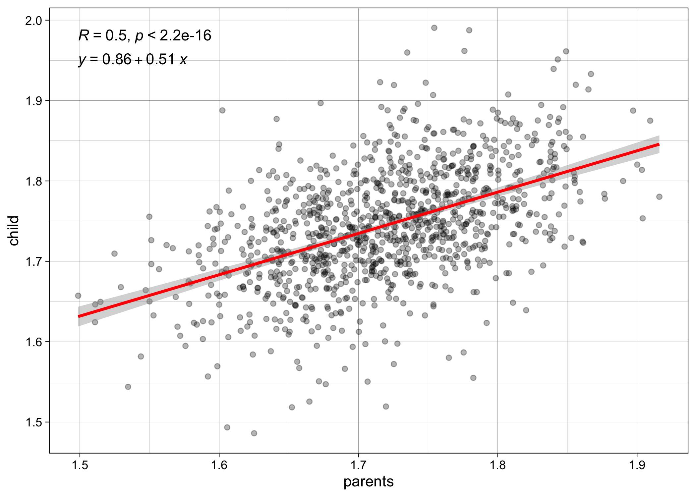

Modelos lineales
================

# Regresión

-   Modelos lineales

## Altura de padres e hijos

-   Empleamos los datos de Pearson & Lee (1903), los cuales contienen
    1078 observaciones de alturas de pares de padres e hijos.
    -   Originalmente, los datos se encuentran en pulgadas
    -   Los vamos a transformar a metros, de modo de interpretar los
        resultados en un métrica más común a la empleada en Chile.
    -   Los datos los obtenemos desde el R packege `library(UsingR)`,
        con el comando `UsingR::father.son`

## Preparar datos

``` r
# -----------------------------------------------------------------------------
# child and parents height
# -----------------------------------------------------------------------------

# -----------------------------------------------
# install package
# -----------------------------------------------

# install.packages("UsingR")


# -----------------------------------------------
# load data
# -----------------------------------------------

data_alt <- UsingR::father.son

# -----------------------------------------------
# variables
# -----------------------------------------------

library(dplyr)
r4sda::variables_table(data_alt) %>%
knitr::kable()
```

| variable | type | values                                                | labels                    |
|:---------|:-----|:------------------------------------------------------|:--------------------------|
| fheight  | dbl  | 63.25094, 64.95532, 65.75250, 61.13723, 63.02254, 65… | === no variable label === |
| sheight  | dbl  | 63.21404, 63.34242, 62.79238, 64.28113, 64.24221, 64… | === no variable label === |

``` r
# -----------------------------------------------
# data description
# -----------------------------------------------

# ? UsingR::UsingR::father.son

# Description:
# 
#      1078 measurements of a father's height and his son's height.
# 
# Usage:
# 
#      data(father.son)
#      
# Format:
# 
#      A data frame with 1078 observations on the following 2 variables.
# 
#      fheight Father's height in inches
# 
#      sheight Son's height in inches
# 
# Details:
# 
#      Data set used by Pearson & Lee (1903) to investigate regression. See data set
#      ‘galton’ for data set used by Galton.
# 

# Note: metric in inches (1 inch is 2.54 cms)

# -----------------------------------------------
# get descriptives
# -----------------------------------------------

data_alt %>%
r4sda::get_desc() %>%
knitr::kable(., digits = 2)
```

| var     | missing | complete |    n |  mean |   sd |   min |   p25 | median |   p75 |   max |  skew | kurt | hist     |
|:--------|--------:|---------:|-----:|------:|-----:|------:|------:|-------:|------:|------:|------:|-----:|:---------|
| fheight |       0 |        1 | 1078 | 67.69 | 2.74 | 59.01 | 65.79 |  67.77 | 69.60 | 75.43 | -0.09 | 2.84 | ▁▁▃▇▇▆▂▁ |
| sheight |       0 |        1 | 1078 | 68.68 | 2.81 | 58.51 | 66.93 |  68.62 | 70.47 | 78.36 | -0.04 | 3.53 | ▁▁▃▇▇▅▁▁ |

``` r
# -----------------------------------------------
# prepare data
# -----------------------------------------------

data_alt <- data_alt %>%
            mutate(parent = (fheight*2.54)/100) %>%
            mutate(child = (sheight*2.54)/100) %>%
            dplyr::glimpse()
```

    ## Rows: 1,078
    ## Columns: 4
    ## $ fheight <dbl> 65.04851, 63.25094, 64.95532, 65.75250, 61.13723, 63.02254, 65…
    ## $ sheight <dbl> 59.77827, 63.21404, 63.34242, 62.79238, 64.28113, 64.24221, 64…
    ## $ parent  <dbl> 1.652232, 1.606574, 1.649865, 1.670114, 1.552886, 1.600773, 1.…
    ## $ child   <dbl> 1.518368, 1.605637, 1.608897, 1.594926, 1.632741, 1.631752, 1.…

## Explorar datos

``` r
# -----------------------------------------------------------------------------
# child and parents height
# -----------------------------------------------------------------------------

# -----------------------------------------------
# install package
# -----------------------------------------------

# -----------------------------------------------
# get descriptives
# -----------------------------------------------

data_alt %>%
r4sda::get_desc() %>%
knitr::kable(., digits = 2)
```

| var     | missing | complete |    n |  mean |   sd |   min |   p25 | median |   p75 |   max |  skew | kurt | hist     |
|:--------|--------:|---------:|-----:|------:|-----:|------:|------:|-------:|------:|------:|------:|-----:|:---------|
| fheight |       0 |        1 | 1078 | 67.69 | 2.74 | 59.01 | 65.79 |  67.77 | 69.60 | 75.43 | -0.09 | 2.84 | ▁▁▃▇▇▆▂▁ |
| sheight |       0 |        1 | 1078 | 68.68 | 2.81 | 58.51 | 66.93 |  68.62 | 70.47 | 78.36 | -0.04 | 3.53 | ▁▁▃▇▇▅▁▁ |
| parent  |       0 |        1 | 1078 |  1.72 | 0.07 |  1.50 |  1.67 |   1.72 |  1.77 |  1.92 | -0.09 | 2.84 | ▁▁▃▇▇▆▂▁ |
| child   |       0 |        1 | 1078 |  1.74 | 0.07 |  1.49 |  1.70 |   1.74 |  1.79 |  1.99 | -0.04 | 3.53 | ▁▁▃▇▇▅▁▁ |

``` r
# -----------------------------------------------
# correlations
# -----------------------------------------------

data_alt %>%
corrr::correlate() %>%
corrr::shave() %>%
knitr::kable(., digits = 2)
```

    ## 
    ## Correlation method: 'pearson'
    ## Missing treated using: 'pairwise.complete.obs'

| term    | fheight | sheight | parent | child |
|:--------|--------:|--------:|-------:|------:|
| fheight |      NA |      NA |     NA |    NA |
| sheight |     0.5 |      NA |     NA |    NA |
| parent  |     1.0 |     0.5 |     NA |    NA |
| child   |     0.5 |     1.0 |    0.5 |    NA |

``` r
# -----------------------------------------------
# inspect with a scatter plot (plain)
# -----------------------------------------------

library(ggplot2)
data_alt %>%
ggplot(., aes(y = child, x = parent)) + 
geom_point(alpha = .3) + 
labs(x = "parents", y = "child") +
theme_linedraw()
```

<!-- -->

## Linea de regresión sobre figuras

``` r
# -----------------------------------------------------------------------------
# child and parents height
# -----------------------------------------------------------------------------

# -----------------------------------------------
# inspect with a scatter plot (regression line)
# -----------------------------------------------

library(ggplot2)
data_alt %>%
ggplot(., aes(y = child, x = parent)) + 
geom_point(alpha = .3) + 
geom_smooth(method = "lm", colour = "Red") +
labs(
  y = "childs' height (mts)",
  x = "parents' height (mts)",   
  ) +
theme_linedraw()
```

    ## `geom_smooth()` using formula 'y ~ x'

<!-- -->

``` r
ggplot2::ggsave('regression_01.png',
     plot = last_plot(), 
     width=10, 
     height=10, 
     units="cm",
     bg = "transparent",
     dpi = 400,
     scale= 2)
```

    ## `geom_smooth()` using formula 'y ~ x'

``` r
# -----------------------------------------------
# inspect with a scatter plot (with correlation)
# -----------------------------------------------

library(ggplot2)
data_alt %>%
ggplot(., aes(y = child, x = parent)) + 
geom_point(alpha = .3) + 
geom_smooth(method = "lm", colour = "Red") +
labs(x = "parents", y = "child") +
ggpubr::stat_cor(method="pearson", label.y = 1.98) +
ggpubr::stat_cor(method="pearson") +
theme_linedraw()
```

    ## `geom_smooth()` using formula 'y ~ x'

<!-- -->

``` r
# -----------------------------------------------
# inspect with a scatter plot (with regression equation)
# -----------------------------------------------

library(ggplot2)
data_alt %>%
ggplot(., aes(y = child, x = parent)) + 
geom_point(alpha = .3) + 
geom_smooth(method = "lm", colour = "Red") +
labs(x = "parents", y = "child") +
ggpubr::stat_cor(method="pearson", label.y = 1.98) +
ggpubr::stat_regline_equation(label.y = 1.95) +
theme_linedraw()
```

    ## `geom_smooth()` using formula 'y ~ x'

<!-- -->

## Ajustar regressiones

``` r
# -----------------------------------------------------------------------------
# child and parents height
# -----------------------------------------------------------------------------

# -----------------------------------------------------------------------------
# using inches
# -----------------------------------------------------------------------------

# -----------------------------------------------
# regression as in Pearson & Lee (1903)
# -----------------------------------------------


lm(sheight ~ + 1 + fheight, data = data_alt) %>%
summary()
```

    ## 
    ## Call:
    ## lm(formula = sheight ~ +1 + fheight, data = data_alt)
    ## 
    ## Residuals:
    ##     Min      1Q  Median      3Q     Max 
    ## -8.8772 -1.5144 -0.0079  1.6285  8.9685 
    ## 
    ## Coefficients:
    ##             Estimate Std. Error t value Pr(>|t|)    
    ## (Intercept) 33.88660    1.83235   18.49   <2e-16 ***
    ## fheight      0.51409    0.02705   19.01   <2e-16 ***
    ## ---
    ## Signif. codes:  0 '***' 0.001 '**' 0.01 '*' 0.05 '.' 0.1 ' ' 1
    ## 
    ## Residual standard error: 2.437 on 1076 degrees of freedom
    ## Multiple R-squared:  0.2513, Adjusted R-squared:  0.2506 
    ## F-statistic: 361.2 on 1 and 1076 DF,  p-value: < 2.2e-16

``` r
# -----------------------------------------------
# regression output with tidy table
# -----------------------------------------------

lm(sheight ~ + 1 + fheight, data = data_alt) %>%
broom::tidy() %>%
knitr::kable(., digits = 2)
```

| term        | estimate | std.error | statistic | p.value |
|:------------|---------:|----------:|----------:|--------:|
| (Intercept) |    33.89 |      1.83 |     18.49 |       0 |
| fheight     |     0.51 |      0.03 |     19.01 |       0 |

``` r
# -----------------------------------------------------------------------------
# using meters
# -----------------------------------------------------------------------------

# -----------------------------------------------
# regression model summary using mts
# -----------------------------------------------

lm(child ~ + 1 + parent, data = data_alt) %>%
summary()
```

    ## 
    ## Call:
    ## lm(formula = child ~ +1 + parent, data = data_alt)
    ## 
    ## Residuals:
    ##       Min        1Q    Median        3Q       Max 
    ## -0.225480 -0.038466 -0.000201  0.041364  0.227799 
    ## 
    ## Coefficients:
    ##             Estimate Std. Error t value Pr(>|t|)    
    ## (Intercept)  0.86072    0.04654   18.49   <2e-16 ***
    ## parent       0.51409    0.02705   19.01   <2e-16 ***
    ## ---
    ## Signif. codes:  0 '***' 0.001 '**' 0.01 '*' 0.05 '.' 0.1 ' ' 1
    ## 
    ## Residual standard error: 0.06189 on 1076 degrees of freedom
    ## Multiple R-squared:  0.2513, Adjusted R-squared:  0.2506 
    ## F-statistic: 361.2 on 1 and 1076 DF,  p-value: < 2.2e-16

``` r
# -----------------------------------------------
# regression output with tidy table
# -----------------------------------------------

lm(child ~ + 1 + parent, data = data_alt) %>%
broom::tidy() %>%
knitr::kable(., digits = 2)
```

| term        | estimate | std.error | statistic | p.value |
|:------------|---------:|----------:|----------:|--------:|
| (Intercept) |     0.86 |      0.05 |     18.49 |       0 |
| parent      |     0.51 |      0.03 |     19.01 |       0 |

``` r
# -----------------------------------------------
# r-square
# -----------------------------------------------

lm(child ~ + 1 + parent, data = data_alt) %>%
broom::glance() %>%
knitr::kable(., digits = 2)
```

| r.squared | adj.r.squared | sigma | statistic | p.value |  df |  logLik |      AIC |      BIC | deviance | df.residual | nobs |
|----------:|--------------:|------:|----------:|--------:|----:|--------:|---------:|---------:|---------:|------------:|-----:|
|      0.25 |          0.25 |  0.06 |    361.23 |       0 |   1 | 1470.83 | -2935.67 | -2920.72 |     4.12 |        1076 | 1078 |

``` r
# -----------------------------------------------------------------------------
# using inches with  lavaan
# -----------------------------------------------------------------------------

# -----------------------------------------------
# regression model with lavaan
# -----------------------------------------------

reg_model <- '
sheight ~ b0*1       # intercept
sheight ~ b1*fheight # slope
'

# -----------------------------------------------
# fit model
# -----------------------------------------------

fit_reg <- lavaan::sem(reg_model, data = data_alt, 
             mimic="Mplus", estimator = "ML")

# -----------------------------------------------
# display results
# -----------------------------------------------

lavaan::summary(fit_reg,
  standardized=TRUE, 
  fit.measures=TRUE, 
  rsquare=TRUE)
```

    ## lavaan 0.6-8 ended normally after 15 iterations
    ## 
    ##   Estimator                                         ML
    ##   Optimization method                           NLMINB
    ##   Number of model parameters                         3
    ##                                                       
    ##   Number of observations                          1078
    ##   Number of missing patterns                         1
    ##                                                       
    ## Model Test User Model:
    ##                                                       
    ##   Test statistic                                 0.000
    ##   Degrees of freedom                                 0
    ## 
    ## Model Test Baseline Model:
    ## 
    ##   Test statistic                               312.049
    ##   Degrees of freedom                                 1
    ##   P-value                                        0.000
    ## 
    ## User Model versus Baseline Model:
    ## 
    ##   Comparative Fit Index (CFI)                    1.000
    ##   Tucker-Lewis Index (TLI)                       1.000
    ## 
    ## Loglikelihood and Information Criteria:
    ## 
    ##   Loglikelihood user model (H0)              -2488.666
    ##   Loglikelihood unrestricted model (H1)      -2488.666
    ##                                                       
    ##   Akaike (AIC)                                4983.332
    ##   Bayesian (BIC)                              4998.281
    ##   Sample-size adjusted Bayesian (BIC)         4988.752
    ## 
    ## Root Mean Square Error of Approximation:
    ## 
    ##   RMSEA                                          0.000
    ##   90 Percent confidence interval - lower         0.000
    ##   90 Percent confidence interval - upper         0.000
    ##   P-value RMSEA <= 0.05                             NA
    ## 
    ## Standardized Root Mean Square Residual:
    ## 
    ##   SRMR                                           0.000
    ## 
    ## Parameter Estimates:
    ## 
    ##   Standard errors                             Standard
    ##   Information                                 Observed
    ##   Observed information based on                Hessian
    ## 
    ## Regressions:
    ##                    Estimate  Std.Err  z-value  P(>|z|)   Std.lv  Std.all
    ##   sheight ~                                                             
    ##     fheight   (b1)    0.514    0.027   19.024    0.000    0.514    0.501
    ## 
    ## Intercepts:
    ##                    Estimate  Std.Err  z-value  P(>|z|)   Std.lv  Std.all
    ##    .sheight   (b0)   33.887    1.831   18.511    0.000   33.887   12.045
    ## 
    ## Variances:
    ##                    Estimate  Std.Err  z-value  P(>|z|)   Std.lv  Std.all
    ##    .sheight           5.926    0.255   23.216    0.000    5.926    0.749
    ## 
    ## R-Square:
    ##                    Estimate
    ##     sheight           0.251

``` r
# -----------------------------------------------------------------------------
# using meters with  lavaan
# -----------------------------------------------------------------------------

# -----------------------------------------------
# regression model with lavaan
# -----------------------------------------------

reg_model <- '
child ~ b0*1      # intercept
child ~ b1*parent # slope
'

# -----------------------------------------------
# fit model
# -----------------------------------------------

fit_reg <- lavaan::sem(reg_model, data = data_alt, 
             mimic="Mplus", estimator = "ML")

# -----------------------------------------------
# display results
# -----------------------------------------------

lavaan::summary(fit_reg,
  standardized=TRUE, 
  fit.measures=TRUE, 
  rsquare=TRUE)
```

    ## lavaan 0.6-8 ended normally after 16 iterations
    ## 
    ##   Estimator                                         ML
    ##   Optimization method                           NLMINB
    ##   Number of model parameters                         3
    ##                                                       
    ##   Number of observations                          1078
    ##   Number of missing patterns                         1
    ##                                                       
    ## Model Test User Model:
    ##                                                       
    ##   Test statistic                                 0.000
    ##   Degrees of freedom                                 0
    ## 
    ## Model Test Baseline Model:
    ## 
    ##   Test statistic                               312.049
    ##   Degrees of freedom                                 1
    ##   P-value                                        0.000
    ## 
    ## User Model versus Baseline Model:
    ## 
    ##   Comparative Fit Index (CFI)                    1.000
    ##   Tucker-Lewis Index (TLI)                       1.000
    ## 
    ## Loglikelihood and Information Criteria:
    ## 
    ##   Loglikelihood user model (H0)               1470.835
    ##   Loglikelihood unrestricted model (H1)       1470.835
    ##                                                       
    ##   Akaike (AIC)                               -2935.669
    ##   Bayesian (BIC)                             -2920.721
    ##   Sample-size adjusted Bayesian (BIC)        -2930.249
    ## 
    ## Root Mean Square Error of Approximation:
    ## 
    ##   RMSEA                                          0.000
    ##   90 Percent confidence interval - lower         0.000
    ##   90 Percent confidence interval - upper         0.000
    ##   P-value RMSEA <= 0.05                             NA
    ## 
    ## Standardized Root Mean Square Residual:
    ## 
    ##   SRMR                                           0.000
    ## 
    ## Parameter Estimates:
    ## 
    ##   Standard errors                             Standard
    ##   Information                                 Observed
    ##   Observed information based on                Hessian
    ## 
    ## Regressions:
    ##                    Estimate  Std.Err  z-value  P(>|z|)   Std.lv  Std.all
    ##   child ~                                                               
    ##     parent    (b1)    0.514    0.027   19.024    0.000    0.514    0.501
    ## 
    ## Intercepts:
    ##                    Estimate  Std.Err  z-value  P(>|z|)   Std.lv  Std.all
    ##    .child     (b0)    0.861    0.046   18.511    0.000    0.861   12.045
    ## 
    ## Variances:
    ##                    Estimate  Std.Err  z-value  P(>|z|)   Std.lv  Std.all
    ##    .child             0.004    0.000   23.216    0.000    0.004    0.749
    ## 
    ## R-Square:
    ##                    Estimate
    ##     child             0.251

## Chequeo de supuestos

``` r
# -----------------------------------------------------------------------------
# normaility of errors
# -----------------------------------------------------------------------------

# -----------------------------------------------
# normality assumption of errors (Shapiro Wilk)
# -----------------------------------------------

lm(child ~ + 1 + parent, data = data_alt) %>%
residuals() %>%
shapiro.test()
```

    ## 
    ##  Shapiro-Wilk normality test
    ## 
    ## data:  .
    ## W = 0.99295, p-value = 5.312e-05

``` r
# -----------------------------------------------
# normality assumption of errors (Kolmogorov Smirnoff)
# -----------------------------------------------

residual_values <- residuals(lm(child ~ + 1 + parent, data = data_alt))
fitted_values   <- predict(lm(child ~ + 1 + parent, data = data_alt))

data_hom <- data_alt %>%
            mutate(fit = fitted_values) %>%
            mutate(errors = residual_values)


ks.test(data_hom$errors, 
  "pnorm", 
  mean=mean(data_hom$errors), 
  sd=sd(data_hom$errors)
  )
```

    ## 
    ##  One-sample Kolmogorov-Smirnov test
    ## 
    ## data:  data_hom$errors
    ## D = 0.021968, p-value = 0.6756
    ## alternative hypothesis: two-sided

``` r
# -----------------------------------------------
# normality plot of errors
# -----------------------------------------------

error_mean <- mean(data_hom$errors, na.rm = TRUE)
error_sd <- sd(data_hom$errors, na.rm = TRUE)
error_n  <- nrow(data_hom$errors)
binwidth <- 0.01

data_hom %>%
ggplot(., aes(x = errors, mean = error_mean, sd = error_sd, binwidth = binwidth, n = error_n)) +
    theme_linedraw() +
    geom_histogram(
        aes(y =..density..),
        binwidth = binwidth, 
        colour = "white", 
        fill = "grey60", 
        size = 0.1) +
stat_function(fun = dnorm, args = list(mean = error_mean, sd = error_sd), geom = "line")
```

<!-- -->

``` r
# -----------------------------------------------
# normality of residuals, qqplot
# -----------------------------------------------


residual_values <- residuals(lm(child ~ + 1 + parent, data = data_alt))

data_residual <- data_alt %>%
                 mutate(errors = residual_values)


ggplot(data_residual, aes(sample = errors)) +
  stat_qq(alpha = .5) +
  labs(y = "residuals") +
theme_linedraw()
```

<!-- -->

``` r
# -----------------------------------------------
# homocesdasticiy plot
# -----------------------------------------------

residual_values <- residuals(lm(child ~ + 1 + parent, data = data_alt))
fitted_values   <- predict(lm(child ~ + 1 + parent, data = data_alt))

data_hom <- data_alt %>%
            mutate(fit = fitted_values) %>%
            mutate(errors = residual_values)


data_hom %>%
ggplot(., aes(y = errors, x = fit)) + 
geom_point(alpha = .3, col = 'grey20') + 
# geom_segment(aes(xend = parent, yend = fit), alpha = .4, col = 'red') + 
# geom_point(aes(y = fit), col = 'grey25', alpha = .5) + 
xlab('Fitted Values') +
ylab('Residuals') + 
ggtitle('Residual Dispersion') +
geom_hline(yintercept = 0, linetype=2)+
theme_linedraw()
```

<!-- -->

``` r
# -----------------------------------------------
# homocesdasticiy Breusch-Pagan Test
# -----------------------------------------------

lm(child ~ + 1 + parent, data = data_alt) %>%
lmtest::bptest()
```

    ## 
    ##  studentized Breusch-Pagan test
    ## 
    ## data:  .
    ## BP = 0.0025216, df = 1, p-value = 0.96

# Anexos

## Plots empleados en clases

``` r
# -----------------------------------------------------------------------------
# child and parents height
# -----------------------------------------------------------------------------

# -----------------------------------------------
# install package
# -----------------------------------------------

# install.packages("UsingR")

# -----------------------------------------------
# load data
# -----------------------------------------------

data_alt <- UsingR::father.son

# -----------------------------------------------
# prepare data
# -----------------------------------------------

data_alt <- data_alt %>%
            mutate(parent = (fheight*2.54)/100) %>%
            mutate(child = (sheight*2.54)/100) %>%
            dplyr::glimpse()
```

    ## Rows: 1,078
    ## Columns: 4
    ## $ fheight <dbl> 65.04851, 63.25094, 64.95532, 65.75250, 61.13723, 63.02254, 65…
    ## $ sheight <dbl> 59.77827, 63.21404, 63.34242, 62.79238, 64.28113, 64.24221, 64…
    ## $ parent  <dbl> 1.652232, 1.606574, 1.649865, 1.670114, 1.552886, 1.600773, 1.…
    ## $ child   <dbl> 1.518368, 1.605637, 1.608897, 1.594926, 1.632741, 1.631752, 1.…

``` r
# -----------------------------------------------
# inspect with a scatter plot (regression line)
# -----------------------------------------------

library(ggplot2)
data_alt %>%
ggplot(., aes(y = sheight, x = fheight)) + 
geom_point(alpha = .3) + 
geom_smooth(method = "lm", colour = "Red") +
labs(x = "parents", y = "child") +
ggpubr::stat_regline_equation(label.y = 80.00) +
theme_linedraw()
```

    ## `geom_smooth()` using formula 'y ~ x'

<!-- -->

``` r
ggplot2::ggsave('regression_01_original.png',
     plot = last_plot(), 
     width=10, 
     height=10, 
     units="cm",
     bg = "transparent",
     dpi = 400,
     scale= 2)
```

    ## `geom_smooth()` using formula 'y ~ x'

``` r
# -----------------------------------------------
# regression as in Pearson & Lee (1903)
# -----------------------------------------------

lm(sheight ~ + 1 + fheight, data = data_alt) %>%
broom::tidy() %>%
knitr::kable(., digits = 2)
```

| term        | estimate | std.error | statistic | p.value |
|:------------|---------:|----------:|----------:|--------:|
| (Intercept) |    33.89 |      1.83 |     18.49 |       0 |
| fheight     |     0.51 |      0.03 |     19.01 |       0 |

``` r
# -----------------------------------------------
# regression line in mts
# -----------------------------------------------

library(ggplot2)
data_alt %>%
ggplot(., aes(y = child, x = parent)) + 
geom_point(alpha = .3) + 
geom_smooth(method = "lm", colour = "Red") +
labs(
  y = "childs' height (mts)",
  x = "parents' height (mts)",   
  ) +
theme_linedraw()
```

    ## `geom_smooth()` using formula 'y ~ x'

<!-- -->

``` r
ggplot2::ggsave('regression_01_mts.png',
     plot = last_plot(), 
     width=10, 
     height=10, 
     units="cm",
     bg = "transparent",
     dpi = 400,
     scale= 2)
```

    ## `geom_smooth()` using formula 'y ~ x'

``` r
# -----------------------------------------------
# plot with full axis
# -----------------------------------------------

library(ggplot2)
data_alt %>%
ggplot(., aes(y = sheight, x = fheight)) + 
geom_point(alpha = .1) + 
geom_smooth(method = "lm", colour = "Red") +
labs(x = "parents", y = "child") +
ggpubr::stat_regline_equation(label.y = 80.00) +
xlim(0,80) +
ylim(0,80) +
theme_linedraw()
```

    ## `geom_smooth()` using formula 'y ~ x'

<!-- -->

``` r
ggplot2::ggsave('regression_01_full_axis.png',
     plot = last_plot(), 
     width=10, 
     height=10, 
     units="cm",
     bg = "transparent",
     dpi = 400,
     scale= 2)
```

    ## `geom_smooth()` using formula 'y ~ x'

``` r
lm(sheight ~ + 1 + fheight, data = data_alt) %>%
broom::tidy() %>%
knitr::kable(., digits = 2)
```

| term        | estimate | std.error | statistic | p.value |
|:------------|---------:|----------:|----------:|--------:|
| (Intercept) |    33.89 |      1.83 |     18.49 |       0 |
| fheight     |     0.51 |      0.03 |     19.01 |       0 |

``` r
# -----------------------------------------------
# plot with full axis
# -----------------------------------------------

fheight_mean <- mean(data_alt$fheight, na.rm = TRUE)

library(ggplot2)
data_alt %>%
mutate(fheight_centered = fheight - fheight_mean) %>%
ggplot(., aes(y = sheight, x = fheight_centered)) + 
geom_point(alpha = .1) + 
geom_smooth(method = "lm", colour = "Red") +
labs(x = "parents", y = "child") +
ylim(60,80) +
xlim(-10,10) +
ggpubr::stat_regline_equation(label.y = 80.00) +
theme_linedraw()
```

    ## `geom_smooth()` using formula 'y ~ x'

<!-- -->

``` r
ggplot2::ggsave('regression_01_centered.png',
     plot = last_plot(), 
     width=10, 
     height=10, 
     units="cm",
     bg = "transparent",
     dpi = 400,
     scale= 2)
```

    ## `geom_smooth()` using formula 'y ~ x'

``` r
data_alt %>%
mutate(fheight_centered = fheight - fheight_mean) %>%
lm(sheight ~ + 1 + fheight_centered, data = .) %>%
broom::tidy() %>%
knitr::kable(., digits = 2)
```

| term              | estimate | std.error | statistic | p.value |
|:------------------|---------:|----------:|----------:|--------:|
| (Intercept)       |    68.68 |      0.07 |    925.53 |       0 |
| fheight\_centered |     0.51 |      0.03 |     19.01 |       0 |

``` r
# -----------------------------------------------
# residuals in comparison to the model
# -----------------------------------------------


fitted_values <- predict(lm(sheight ~ + 1 + fheight, data = data_alt))

data_fitted <- data_alt %>%
               mutate(fit = fitted_values)

data_fitted %>%
ggplot(., aes(y = sheight, x = fheight)) + 
geom_point(alpha = .3, col = 'grey20') + 
geom_segment(aes(xend = fheight, yend = fit), alpha = .4, col = 'red') + 
geom_point(aes(y = fit), col = 'grey25', alpha = .5) + 
xlab('Height of Father') +
ylab('Height of Sons') + 
ggtitle('Residual Distance from the Model') +
theme_linedraw()
```

<!-- -->

``` r
ggplot2::ggsave('regression_01_residuals.png',
     plot = last_plot(), 
     width=10, 
     height=10, 
     units="cm",
     bg = "transparent",
     dpi = 400,
     scale= 2)


# -----------------------------------------------
# normality assumption of errors (Kolmogorov Smirnoff)
# -----------------------------------------------

residual_values <- residuals(lm(child ~ + 1 + parent, data = data_alt))
fitted_values   <- predict(lm(child ~ + 1 + parent, data = data_alt))

data_hom <- data_alt %>%
            mutate(fit = fitted_values) %>%
            mutate(errors = residual_values)


ks.test(data_hom$errors, 
  "pnorm", 
  mean=mean(data_hom$errors), 
  sd=sd(data_hom$errors)
  )
```

    ## 
    ##  One-sample Kolmogorov-Smirnov test
    ## 
    ## data:  data_hom$errors
    ## D = 0.021968, p-value = 0.6756
    ## alternative hypothesis: two-sided

``` r
# -----------------------------------------------
# normality plot of errors
# -----------------------------------------------

residual_values <- residuals(lm(child ~ + 1 + parent, data = data_alt))
fitted_values   <- predict(lm(child ~ + 1 + parent, data = data_alt))

data_hom <- data_alt %>%
            mutate(fit = fitted_values) %>%
            mutate(errors = residual_values)

error_mean <- mean(data_hom$errors, na.rm = TRUE)
error_sd <- sd(data_hom$errors, na.rm = TRUE)
error_n  <- nrow(data_hom$errors)
binwidth <- 0.01

data_hom %>%
ggplot(., aes(x = errors, mean = error_mean, sd = error_sd, binwidth = binwidth, n = error_n)) +
    theme_linedraw() +
    geom_histogram(
        aes(y =..density..),
        binwidth = binwidth, 
        colour = "white", 
        fill = "grey60", 
        size = 0.1) +
stat_function(fun = dnorm, args = list(mean = error_mean, sd = error_sd), geom = "line")
```

<!-- -->

``` r
ggplot2::ggsave('regression_04_normality.png',
     plot = last_plot(), 
     width=10, 
     height=10, 
     units="cm",
     bg = "transparent",
     dpi = 400,
     scale= 2)


# -----------------------------------------------
# homocesdasticiy plot
# -----------------------------------------------

residual_values <- residuals(lm(child ~ + 1 + parent, data = data_alt))
fitted_values   <- predict(lm(child ~ + 1 + parent, data = data_alt))

data_hom <- data_alt %>%
            mutate(fit = fitted_values) %>%
            mutate(errors = residual_values)


data_hom %>%
ggplot(., aes(y = errors, x = fit)) + 
geom_point(alpha = .3, col = 'grey20') + 
# geom_segment(aes(xend = parent, yend = fit), alpha = .4, col = 'red') + 
# geom_point(aes(y = fit), col = 'grey25', alpha = .5) + 
xlab('Fitted Values') +
ylab('Residuals') + 
ggtitle('Residual Dispersion') +
geom_hline(yintercept = 0, linetype=2)+
theme_linedraw()
```

<!-- -->

``` r
ggplot2::ggsave('regression_05_homocedasticity.png',
     plot = last_plot(), 
     width=10, 
     height=10, 
     units="cm",
     bg = "transparent",
     dpi = 400,
     scale= 2)
```
