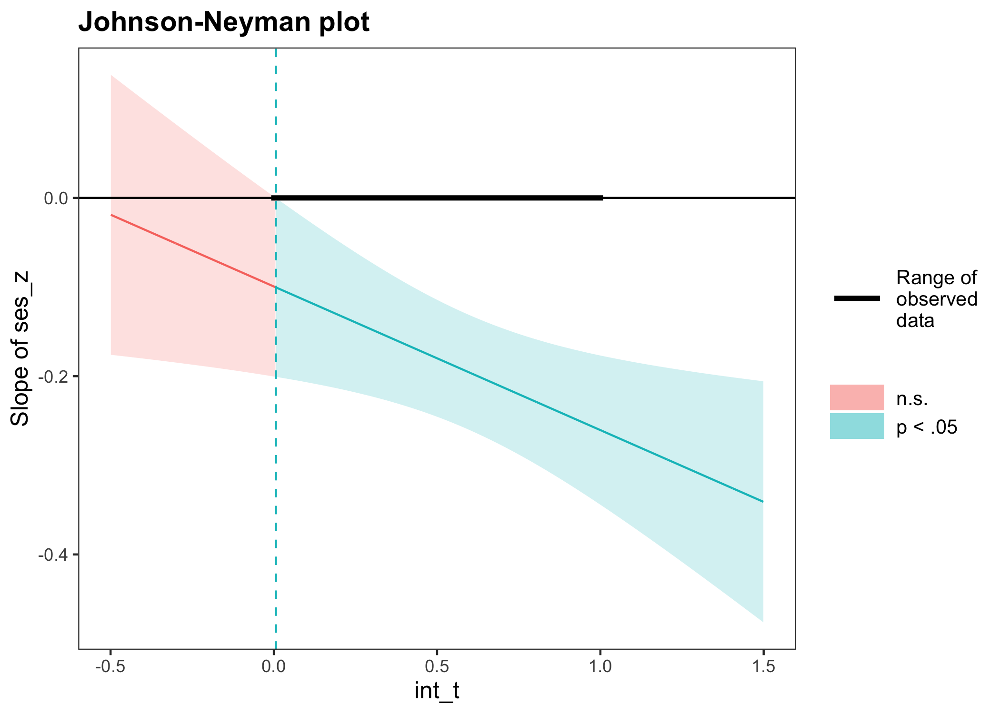
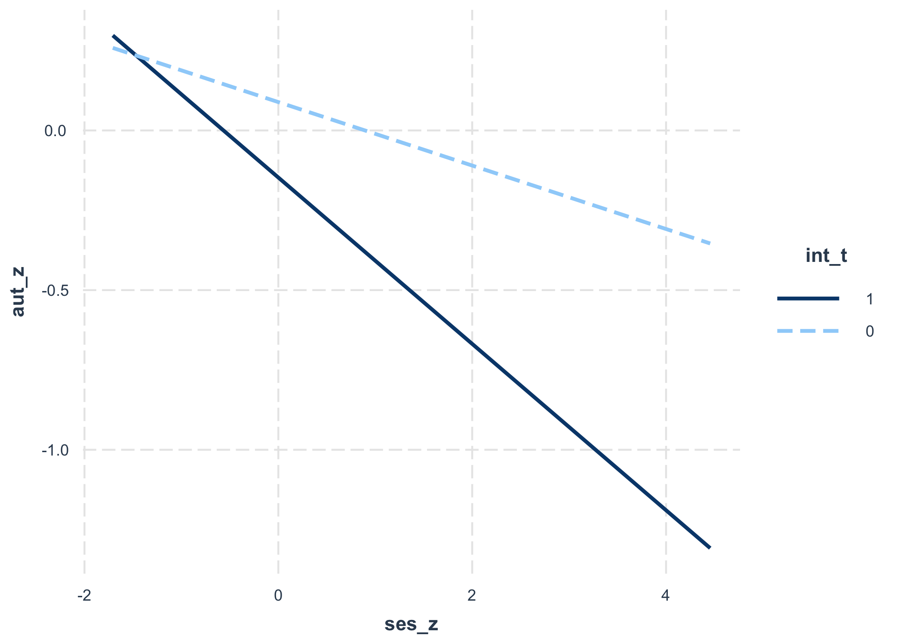

Modelos lineales
================

# Regresión

-   En el presente código se revisan diferentes casos de regresión,
    donde variamos el tipo de covariable incluida.
    -   variable dicotómica
    -   variable de más de una categoría
    -   variable continua
    -   interacción entre variables

# Caso 1: variable dicotómica

## Preparar datos

``` r
# -----------------------------------------------------------------------------
# ICCS 2016 random sample of 500 cases
# -----------------------------------------------------------------------------

# -----------------------------------------------
# load data
# -----------------------------------------------

data_dem <- psi2301::dem_16

# -----------------------------------------------
# variables
# -----------------------------------------------

library(dplyr)
r4sda::variables_table(data_dem) %>%
knitr::kable()
```

| variable   | type    | values                                                 | labels                                                                                                            |
|:-----------|:--------|:-------------------------------------------------------|:------------------------------------------------------------------------------------------------------------------|
| id\_i      | dbl     | 243, 7484, 7187, 9208, 6863, 8736, 9067, 9691, 7096, … | id único del caso                                                                                                 |
| ctry       | chr     | , “Chile”, “Chile”, “Chile”, “Chile”, “Chile”, "Chile… | nombre del país                                                                                                   |
| sex        | dbl     | , 0, 1, 1, 0, 1, 0, 1, 0, 1, 0, 0, 1, 0, 0, 1, 1, 1, … | sexo del estudiante (0 = niño, 1 = niña)                                                                          |
| age        | dbl+lbl | 50, 13.83, 14.17, 14.50, 13.42, 13.33, 13.92, 13.42, … | edad del estudiante en años (media = 14.25, sd = .99                                                              |
| dem        | dbl     | , 2, 1, 2, 3, 2, 3, 1, 1, 1, 1, 2, 3, 2, 1, 2, 2, 2, … | perfil de concepciones de las democracia (1 = minimalista, 2 = complejo, 3 = limitado)                            |
| dem\_group | chr     | x“,”limited“,”limited“,”complex“,”minimalist“,”c…      | perfil de concepciones de las democracia (en texto)                                                               |
| aut        | dbl     | 57.94, 17.67, 17.67, 38.07, 47.94, 59.24, 51.06, 27.0… | creencias antidemocráticas (AUTGOV, media = 50, sd = 10)                                                          |
| civ        | dbl+lbl | .89, 334.68, 527.46, 612.81, 479.65, 556.01, 548.08, … | conocimiento cívico (PV1CVI, media = 500, sd = 100)                                                               |
| ses        | dbl+lbl | 19, -0.56, -0.23, -0.81, -0.17, 1.08, -1.03, -0.54, …  | nivel socioecónomico (media = 0, sd = 1, en cada país                                                             |
| edu        | dbl     | , 0, 0, 1, 0, 0, 0, 0, 0, 0, 0, 1, 0, 1, 1, 0, 0, 1, … | educación de los padres (1 = educación universitaria, 0 = otro nivel educativo                                    |
| level      | dbl     | , 3, 2, 2, 2, 0, 2, 2, 1, 0, 0, 2, 1, 2, 2, 3, 2, 3, … | niveles de conocimiento cívico (numérico) (3 = alta sofisticación, 2 = medio, 1 = bajo, 0 = muy bajo              |
| level\_lab | chr     | 2“,”level 0“,”level 2“,”level 3“,”level 2“,”leve…      | niveles de conocimiento cívico (Level 3 = alta sofisticación, Level 2 = medio, Level 1 = bajo, Level 0 = muy bajo |

``` r
# -----------------------------------------------
# data description
# -----------------------------------------------

# ? psi2301::dem_16

# Description:
# 
#      Datos del Estudio Internacional sobre Educación Cívica y Ciudadana
#      (ICCS). Esta tabla de datos, incluye las observaciones del módulo
#      internacional, y del modulo latino americano. Estos datos inlcuyen
#      500 casos de cada país, ademas de variables tales como: sexo,
#      edad, perfil de concepciones de la democracia, creencias
#      antidemocraticas, conocimiento cívico, nivel socioeconómico, y
#      educacion de los padres, y niveles de conocimiento cívico.
# 
# Usage:
# 
#      data(dem_16)
#      
# Format:
# 
#      Objeto clase ‘"cross"’; ver ‘read.cross’.
# 
# Source:
# 
#      IEA, <https://www.iea.nl/index.php/data-tools/repository/iccs>
# 
# References:
# 
#      Schulz, W., Carstens, R., Losito, B., & Fraillon, J. (2018). ICCS
#      2016 Technical Report (W. Schulz, R. Carstens, B. Losito, & J.
#      Fraillon (eds.)). International Association for the Evaluation of
#      Educational Achievement (IEA).
# 
# Examples:
# 
#      data(dem_16)
#      dplyr::glimpse(dem_16)

# -----------------------------------------------
# get descriptives
# -----------------------------------------------

data_dem %>%
dplyr::select(aut, edu) %>%
r4sda::get_desc() %>%
knitr::kable(., digits = 2)
```

| var | missing | complete |    n |  mean |    sd |   min |   p25 | median |   p75 |   max |  skew | kurt | hist     |
|:----|--------:|---------:|-----:|------:|------:|------:|------:|-------:|------:|------:|------:|-----:|:---------|
| aut |    0.01 |     0.99 | 2500 | 49.41 | 11.47 | 17.67 | 44.48 |  51.06 | 56.63 | 85.37 | -0.57 | 4.14 | ▁▁▃▇▇▃▁▁ |
| edu |    0.01 |     0.99 | 2500 |  0.26 |  0.44 |  0.00 |  0.00 |   0.00 |  1.00 |  1.00 |  1.08 | 2.16 | ▇▁▁▁▁▁▁▃ |

## Ajusta modelo de regresión

``` r
# -----------------------------------------------------------------------------
# conventional regression
# -----------------------------------------------------------------------------

# -----------------------------------------------
# caso 1
# -----------------------------------------------

lm(aut ~ 1 + edu, data = data_dem)
```

    ## 
    ## Call:
    ## lm(formula = aut ~ 1 + edu, data = data_dem)
    ## 
    ## Coefficients:
    ## (Intercept)          edu  
    ##       50.18        -2.86

``` r
# -----------------------------------------------
# request summary
# -----------------------------------------------

lm(aut ~ 1 + edu, data = data_dem) %>%
summary()
```

    ## 
    ## Call:
    ## lm(formula = aut ~ 1 + edu, data = data_dem)
    ## 
    ## Residuals:
    ##     Min      1Q  Median      3Q     Max 
    ## -32.514  -5.704   0.876   6.606  38.046 
    ## 
    ## Coefficients:
    ##             Estimate Std. Error t value Pr(>|t|)    
    ## (Intercept)  50.1842     0.2671 187.851  < 2e-16 ***
    ## edu          -2.8600     0.5206  -5.494 4.34e-08 ***
    ## ---
    ## Signif. codes:  0 '***' 0.001 '**' 0.01 '*' 0.05 '.' 0.1 ' ' 1
    ## 
    ## Residual standard error: 11.36 on 2451 degrees of freedom
    ##   (47 observations deleted due to missingness)
    ## Multiple R-squared:  0.01216,    Adjusted R-squared:  0.01176 
    ## F-statistic: 30.18 on 1 and 2451 DF,  p-value: 4.339e-08

## Obtener estimados en formato tabla

``` r
# -----------------------------------------------------------------------------
# tidy output
# -----------------------------------------------------------------------------

# -----------------------------------------------
# get estimates in a table
# -----------------------------------------------

lm(aut ~ 1 + edu, data = data_dem) %>%
broom::tidy() %>%
knitr::kable(., digits = 2)
```

| term        | estimate | std.error | statistic | p.value |
|:------------|---------:|----------:|----------:|--------:|
| (Intercept) |    50.18 |      0.27 |    187.85 |       0 |
| edu         |    -2.86 |      0.52 |     -5.49 |       0 |

``` r
# -----------------------------------------------
# get fit indexes
# -----------------------------------------------

lm(aut ~ 1 + edu, data = data_dem) %>%
broom::glance() %>%
knitr::kable(., digits = 2)
```

| r.squared | adj.r.squared | sigma | statistic | p.value |  df |   logLik |      AIC |      BIC | deviance | df.residual | nobs |
|----------:|--------------:|------:|----------:|--------:|----:|---------:|---------:|---------:|---------:|------------:|-----:|
|      0.01 |          0.01 | 11.36 |     30.18 |       0 |   1 | -9439.86 | 18885.73 | 18903.14 | 316088.5 |        2451 | 2453 |

## Ajustar modelos en pasos

``` r
# -----------------------------------------------------------------------------
# regression in steps
# -----------------------------------------------------------------------------

# -----------------------------------------------
# regression in steps
# -----------------------------------------------

m00 <- as.formula('aut ~ 1')
m01 <- as.formula('aut ~ 1 + edu')

fit_00 <- lm(m00, data = data_dem)
fit_01 <- lm(m01, data = data_dem)

texreg::screenreg(
    list(fit_00, fit_01),
    star.symbol = "*", 
    center = TRUE, 
    doctype = FALSE,
    dcolumn = TRUE, 
    booktabs = TRUE,
    single.row = FALSE
    )
```

    ## 
    ## =====================================
    ##              Model 1      Model 2    
    ## -------------------------------------
    ## (Intercept)    49.41 ***    50.18 ***
    ##                (0.23)       (0.27)   
    ## edu                         -2.86 ***
    ##                             (0.52)   
    ## -------------------------------------
    ## R^2             0.00         0.01    
    ## Adj. R^2        0.00         0.01    
    ## Num. obs.    2483         2453       
    ## =====================================
    ## *** p < 0.001; ** p < 0.01; * p < 0.05

``` r
# -----------------------------------------------
# anova
# -----------------------------------------------

# anova(fit_00, fit_01)

# Note: error producto de que los modelos no estan anidados.

# -----------------------------------------------
# regression in steps, with not ommitted
# -----------------------------------------------

data_dem_edu <- dplyr::select(data_dem, aut, edu) %>% na.omit()

m00 <- as.formula('aut ~ 1')
m01 <- as.formula('aut ~ 1 + edu')


fit_00 <- lm(m00, data = data_dem_edu)
fit_01 <- lm(m01, data = data_dem_edu)

texreg::screenreg(
    list(fit_00, fit_01),
    star.symbol = "*", 
    center = TRUE, 
    doctype = FALSE,
    dcolumn = TRUE, 
    booktabs = TRUE,
    single.row = FALSE
    )
```

    ## 
    ## =====================================
    ##              Model 1      Model 2    
    ## -------------------------------------
    ## (Intercept)    49.43 ***    50.18 ***
    ##                (0.23)       (0.27)   
    ## edu                         -2.86 ***
    ##                             (0.52)   
    ## -------------------------------------
    ## R^2             0.00         0.01    
    ## Adj. R^2        0.00         0.01    
    ## Num. obs.    2453         2453       
    ## =====================================
    ## *** p < 0.001; ** p < 0.01; * p < 0.05

``` r
# -----------------------------------------------
# anova
# -----------------------------------------------

anova(fit_00, fit_01)
```

    ## Analysis of Variance Table
    ## 
    ## Model 1: aut ~ 1
    ## Model 2: aut ~ 1 + edu
    ##   Res.Df    RSS Df Sum of Sq      F    Pr(>F)    
    ## 1   2452 319981                                  
    ## 2   2451 316089  1    3892.4 30.182 4.339e-08 ***
    ## ---
    ## Signif. codes:  0 '***' 0.001 '**' 0.01 '*' 0.05 '.' 0.1 ' ' 1

## Estimados estandarizados

``` r
# -----------------------------------------------------------------------------
# regression in lavaan
# -----------------------------------------------------------------------------

# -----------------------------------------------
# regression model with lavaan
# -----------------------------------------------

reg_model <- '

aut ~ 1     # intercept
aut ~ edu   # slope

'

# -----------------------------------------------
# fit model
# -----------------------------------------------

fit_reg <- lavaan::sem(reg_model, data = data_dem, 
             mimic="Mplus", estimator = "ML")

# -----------------------------------------------
# display results
# -----------------------------------------------

lavaan::summary(fit_reg,
  standardized=TRUE, 
  fit.measures=TRUE, 
  rsquare=TRUE)
```

    ## lavaan 0.6-8 ended normally after 21 iterations
    ## 
    ##   Estimator                                         ML
    ##   Optimization method                           NLMINB
    ##   Number of model parameters                         3
    ##                                                       
    ##                                                   Used       Total
    ##   Number of observations                          2466        2500
    ##   Number of missing patterns                         2            
    ##                                                                   
    ## Model Test User Model:
    ##                                                       
    ##   Test statistic                                 0.000
    ##   Degrees of freedom                                 0
    ## 
    ## Model Test Baseline Model:
    ## 
    ##   Test statistic                                30.022
    ##   Degrees of freedom                                 1
    ##   P-value                                        0.000
    ## 
    ## User Model versus Baseline Model:
    ## 
    ##   Comparative Fit Index (CFI)                    1.000
    ##   Tucker-Lewis Index (TLI)                       1.000
    ## 
    ## Loglikelihood and Information Criteria:
    ## 
    ##   Loglikelihood user model (H0)              -9439.865
    ##   Loglikelihood unrestricted model (H1)      -9439.865
    ##                                                       
    ##   Akaike (AIC)                               18885.729
    ##   Bayesian (BIC)                             18903.160
    ##   Sample-size adjusted Bayesian (BIC)        18893.629
    ## 
    ## Root Mean Square Error of Approximation:
    ## 
    ##   RMSEA                                          0.000
    ##   90 Percent confidence interval - lower         0.000
    ##   90 Percent confidence interval - upper         0.000
    ##   P-value RMSEA <= 0.05                             NA
    ## 
    ## Standardized Root Mean Square Residual:
    ## 
    ##   SRMR                                           0.000
    ## 
    ## Parameter Estimates:
    ## 
    ##   Standard errors                             Standard
    ##   Information                                 Observed
    ##   Observed information based on                Hessian
    ## 
    ## Regressions:
    ##                    Estimate  Std.Err  z-value  P(>|z|)   Std.lv  Std.all
    ##   aut ~                                                                 
    ##     edu              -2.860    0.520   -5.496    0.000   -2.860   -0.110
    ## 
    ## Intercepts:
    ##                    Estimate  Std.Err  z-value  P(>|z|)   Std.lv  Std.all
    ##    .aut              50.184    0.267  187.928    0.000   50.184    4.394
    ## 
    ## Variances:
    ##                    Estimate  Std.Err  z-value  P(>|z|)   Std.lv  Std.all
    ##    .aut             128.858    3.679   35.021    0.000  128.858    0.988
    ## 
    ## R-Square:
    ##                    Estimate
    ##     aut               0.012

## Medias esperadas

``` r
# -----------------------------------------------------------------------------
# expected means
# -----------------------------------------------------------------------------

# -----------------------------------------------
# comparison of results with t test
# -----------------------------------------------

t.test(aut ~ edu, 
    var.equal = TRUE,
    data = data_dem)
```

    ## 
    ##  Two Sample t-test
    ## 
    ## data:  aut by edu
    ## t = 5.4938, df = 2451, p-value = 4.339e-08
    ## alternative hypothesis: true difference in means is not equal to 0
    ## 95 percent confidence interval:
    ##  1.839152 3.880790
    ## sample estimates:
    ## mean in group 0 mean in group 1 
    ##        50.18423        47.32426

``` r
# -----------------------------------------------
# t test statistics
# -----------------------------------------------

t.test(aut ~ edu, 
    var.equal = TRUE,
    data = data_dem) %>%
broom::tidy() %>%
knitr::kable(., digits = 2)
```

| estimate | estimate1 | estimate2 | statistic | p.value | parameter | conf.low | conf.high | method            | alternative |
|---------:|----------:|----------:|----------:|--------:|----------:|---------:|----------:|:------------------|:------------|
|     2.86 |     50.18 |     47.32 |      5.49 |       0 |      2451 |     1.84 |      3.88 | Two Sample t-test | two.sided   |

``` r
# -----------------------------------------------
# get expected means
# -----------------------------------------------

alpha <- lm(aut ~ 1 + edu, data = data_dem) %>%
         broom::tidy() %>%
         dplyr::filter(term =='(Intercept)') %>%
         dplyr::select(estimate) %>%
         dplyr::pull()

beta <- lm(aut ~ 1 + edu, data = data_dem) %>%
         broom::tidy() %>%
         dplyr::filter(term =='edu') %>%
         dplyr::select(estimate) %>%
         dplyr::pull()

mean_0 <- alpha
mean_1 <- alpha + beta

data.frame(
    group = c(
        'Sin Educacion Terciaria', 
        'Con Educación terciaria'),
    medias = c(mean_0, mean_1)
    ) %>%
knitr::kable(., digits = 2)
```

| group                   | medias |
|:------------------------|-------:|
| Sin Educacion Terciaria |  50.18 |
| Con Educación terciaria |  47.32 |

## Reparametrización de dummy

-   Reparametrizar el modelo, consiste en cambiar la codificación de la
    variable dummy, de modo que el coeficiente y el intercepto del
    modelo tome otro significado.

``` r
# -----------------------------------------------------------------------------
# model reparametrization
# -----------------------------------------------------------------------------

# -----------------------------------------------
# check dummy 
# -----------------------------------------------

dplyr::count(data_dem, edu)
```

    ## # A tibble: 3 x 2
    ##     edu     n
    ##   <dbl> <int>
    ## 1     0  1817
    ## 2     1   649
    ## 3    NA    34

``` r
# -----------------------------------------------
# add reparametrized variables
# -----------------------------------------------

data_dem <- psi2301::dem_16 %>%
            mutate(edu_1 = edu) %>%
            mutate(edu_0 = case_when(
                edu == 0 ~ 1,
                edu == 1 ~ 0
                )) %>%
            mutate(edu_d = case_when(
                edu == 0 ~ -1,
                edu == 1 ~  1
                )) %>%
            mutate(edu_g = mean(edu, na.rm = TRUE)) %>%
            mutate(edu_m = edu - edu_g) %>%
            dplyr::glimpse()
```

    ## Rows: 2,500
    ## Columns: 17
    ## $ id_i      <dbl> 8093, 9243, 7484, 7187, 9208, 6863, 8736, 9067, 9691, 7096, …
    ## $ ctry      <chr> "Chile", "Chile", "Chile", "Chile", "Chile", "Chile", "Chile…
    ## $ sex       <dbl> 1, 0, 0, 0, 1, 1, 0, 1, 0, 1, 0, 1, 0, 0, 1, 0, 0, 1, 1, 1, …
    ## $ age       <dbl+lbl> 13.50, 13.83, 14.17, 14.50, 13.42, 13.33, 13.92, 13.42, …
    ## $ dem       <dbl> 2, 3, 3, 2, 1, 2, 3, 2, 3, 1, 1, 1, 1, 2, 3, 2, 1, 2, 2, 2, …
    ## $ dem_group <chr> "complex", "limited", "limited", "complex", "minimalist", "c…
    ## $ aut       <dbl> 42.55, 57.94, 17.67, 17.67, 38.07, 47.94, 59.24, 51.06, 27.0…
    ## $ civ       <dbl+lbl> 514.89, 334.68, 527.46, 612.81, 479.65, 556.01, 548.08, …
    ## $ ses       <dbl+lbl> -0.19, -0.56, -0.23, -0.81, -0.17,  1.08, -1.03, -0.54, …
    ## $ edu       <dbl> 0, 0, 0, 0, 0, 1, 0, 0, 0, 0, 0, 0, 0, 1, 0, 1, 1, 0, 0, 1, …
    ## $ level     <dbl> 2, 0, 2, 3, 2, 2, 2, 0, 2, 2, 1, 0, 0, 2, 1, 2, 2, 3, 2, 3, …
    ## $ level_lab <chr> "level 2", "level 0", "level 2", "level 3", "level 2", "leve…
    ## $ edu_1     <dbl> 0, 0, 0, 0, 0, 1, 0, 0, 0, 0, 0, 0, 0, 1, 0, 1, 1, 0, 0, 1, …
    ## $ edu_0     <dbl> 1, 1, 1, 1, 1, 0, 1, 1, 1, 1, 1, 1, 1, 0, 1, 0, 0, 1, 1, 0, …
    ## $ edu_d     <dbl> -1, -1, -1, -1, -1, 1, -1, -1, -1, -1, -1, -1, -1, 1, -1, 1,…
    ## $ edu_g     <dbl> 0.2631792, 0.2631792, 0.2631792, 0.2631792, 0.2631792, 0.263…
    ## $ edu_m     <dbl> -0.2631792, -0.2631792, -0.2631792, -0.2631792, -0.2631792, …

``` r
# -----------------------------------------------
# models with different parametrizations
# -----------------------------------------------


e00 <- as.formula('aut ~ 1')
e01 <- as.formula('aut ~ 1 + edu')
e02 <- as.formula('aut ~ 1 + edu_1')
e03 <- as.formula('aut ~ 1 + edu_0')
e04 <- as.formula('aut ~ 1 + edu_d')
e05 <- as.formula('aut ~ 1 + edu_m')

c00 <- lm(e00, data = data_dem)
c01 <- lm(e01, data = data_dem)
c02 <- lm(e02, data = data_dem)
c03 <- lm(e03, data = data_dem)
c04 <- lm(e04, data = data_dem)
c05 <- lm(e05, data = data_dem)

texreg::screenreg(
    list(c00, c01, c02, c03, c04, c05),
    star.symbol = "*", 
    center = TRUE, 
    doctype = FALSE,
    dcolumn = TRUE, 
    booktabs = TRUE,
    single.row = FALSE
    )
```

    ## 
    ## =========================================================================================
    ##              Model 1      Model 2      Model 3      Model 4      Model 5      Model 6    
    ## -----------------------------------------------------------------------------------------
    ## (Intercept)    49.41 ***    50.18 ***    50.18 ***    47.32 ***    48.75 ***    49.43 ***
    ##                (0.23)       (0.27)       (0.27)       (0.45)       (0.26)       (0.23)   
    ## edu                         -2.86 ***                                                    
    ##                             (0.52)                                                       
    ## edu_1                                    -2.86 ***                                       
    ##                                          (0.52)                                          
    ## edu_0                                                  2.86 ***                          
    ##                                                       (0.52)                             
    ## edu_d                                                              -1.43 ***             
    ##                                                                    (0.26)                
    ## edu_m                                                                           -2.86 ***
    ##                                                                                 (0.52)   
    ## -----------------------------------------------------------------------------------------
    ## R^2             0.00         0.01         0.01         0.01         0.01         0.01    
    ## Adj. R^2        0.00         0.01         0.01         0.01         0.01         0.01    
    ## Num. obs.    2483         2453         2453         2453         2453         2453       
    ## =========================================================================================
    ## *** p < 0.001; ** p < 0.01; * p < 0.05

``` r
# -----------------------------------------------
# results
# -----------------------------------------------

# =========================================================================================
#              Model 1      Model 2      Model 3      Model 4      Model 5      Model 6    
# -----------------------------------------------------------------------------------------
# (Intercept)    49.41 ***    50.18 ***    50.18 ***    47.32 ***    48.75 ***    49.43 ***
#                (0.23)       (0.27)       (0.27)       (0.45)       (0.26)       (0.23)   
# edu                         -2.86 ***                                                    
#                             (0.52)                                                       
# edu_1                                    -2.86 ***                                       
#                                          (0.52)                                          
# edu_0                                                  2.86 ***                          
#                                                       (0.52)                             
# edu_d                                                              -1.43 ***             
#                                                                    (0.26)                
# edu_m                                                                           -2.86 ***
#                                                                                 (0.52)   
# -----------------------------------------------------------------------------------------
# R^2             0.00         0.01         0.01         0.01         0.01         0.01    
# Adj. R^2        0.00         0.01         0.01         0.01         0.01         0.01    
# Num. obs.    2483         2453         2453         2453         2453         2453       
# =========================================================================================
# *** p < 0.001; ** p < 0.01; * p < 0.05
```

-   Notas
    -   Model 1: intercepto es la gran media
    -   Model 2: intercepto es media del grupo de estudiantes de padres
        sin educación terciaria
    -   Model 3: intercepto es media del grupo de estudiantes de padres
        sin educación terciaria
    -   Model 4: intercepto es media del grupo de estudiantes de padres
        con educación terciaria
    -   Model 5: intercepto es el promedio de ambos grupos (con y sin
        educación terciaria)
    -   Model 6: intercepto es la gran media, a niveles medios de
        escolaridad de los padres

# Caso 2: variable categorica con más de dos categorías

## Preparar datos

``` r
# -----------------------------------------------------------------------------
# ICCS 2016 random sample of 500 cases
# -----------------------------------------------------------------------------

# -----------------------------------------------
# load data
# -----------------------------------------------

data_dem <- psi2301::dem_16

# -----------------------------------------------
# ordinal covariate
# -----------------------------------------------

dplyr::count(data_dem, level)
```

    ## # A tibble: 4 x 2
    ##   level     n
    ##   <dbl> <int>
    ## 1     0   729
    ## 2     1   745
    ## 3     2   728
    ## 4     3   298

``` r
# -----------------------------------------------
# generate dummy
# -----------------------------------------------

data_dem <- psi2301::dem_16 %>%
            mutate(level_0 = case_when(
                level == 0 ~ 1,
                level == 1 ~ 0,
                level == 2 ~ 0,
                level == 3 ~ 0
                )) %>%
            mutate(level_1 = case_when(
                level == 0 ~ 0,
                level == 1 ~ 1,
                level == 2 ~ 0,
                level == 3 ~ 0
                )) %>%
            mutate(level_2 = case_when(
                level == 0 ~ 0,
                level == 1 ~ 0,
                level == 2 ~ 1,
                level == 3 ~ 0
                )) %>%
            mutate(level_3 = case_when(
                level == 0 ~ 0,
                level == 1 ~ 0,
                level == 2 ~ 0,
                level == 3 ~ 1
                )) %>%
            dplyr::glimpse()
```

    ## Rows: 2,500
    ## Columns: 16
    ## $ id_i      <dbl> 8093, 9243, 7484, 7187, 9208, 6863, 8736, 9067, 9691, 7096, …
    ## $ ctry      <chr> "Chile", "Chile", "Chile", "Chile", "Chile", "Chile", "Chile…
    ## $ sex       <dbl> 1, 0, 0, 0, 1, 1, 0, 1, 0, 1, 0, 1, 0, 0, 1, 0, 0, 1, 1, 1, …
    ## $ age       <dbl+lbl> 13.50, 13.83, 14.17, 14.50, 13.42, 13.33, 13.92, 13.42, …
    ## $ dem       <dbl> 2, 3, 3, 2, 1, 2, 3, 2, 3, 1, 1, 1, 1, 2, 3, 2, 1, 2, 2, 2, …
    ## $ dem_group <chr> "complex", "limited", "limited", "complex", "minimalist", "c…
    ## $ aut       <dbl> 42.55, 57.94, 17.67, 17.67, 38.07, 47.94, 59.24, 51.06, 27.0…
    ## $ civ       <dbl+lbl> 514.89, 334.68, 527.46, 612.81, 479.65, 556.01, 548.08, …
    ## $ ses       <dbl+lbl> -0.19, -0.56, -0.23, -0.81, -0.17,  1.08, -1.03, -0.54, …
    ## $ edu       <dbl> 0, 0, 0, 0, 0, 1, 0, 0, 0, 0, 0, 0, 0, 1, 0, 1, 1, 0, 0, 1, …
    ## $ level     <dbl> 2, 0, 2, 3, 2, 2, 2, 0, 2, 2, 1, 0, 0, 2, 1, 2, 2, 3, 2, 3, …
    ## $ level_lab <chr> "level 2", "level 0", "level 2", "level 3", "level 2", "leve…
    ## $ level_0   <dbl> 0, 1, 0, 0, 0, 0, 0, 1, 0, 0, 0, 1, 1, 0, 0, 0, 0, 0, 0, 0, …
    ## $ level_1   <dbl> 0, 0, 0, 0, 0, 0, 0, 0, 0, 0, 1, 0, 0, 0, 1, 0, 0, 0, 0, 0, …
    ## $ level_2   <dbl> 1, 0, 1, 0, 1, 1, 1, 0, 1, 1, 0, 0, 0, 1, 0, 1, 1, 0, 1, 0, …
    ## $ level_3   <dbl> 0, 0, 0, 1, 0, 0, 0, 0, 0, 0, 0, 0, 0, 0, 0, 0, 0, 1, 0, 1, …

## Ajustar regresion

``` r
# -----------------------------------------------------------------------------
# ICCS 2016 random sample of 500 cases
# -----------------------------------------------------------------------------

# -----------------------------------------------
# regression in steps
# -----------------------------------------------

m00 <- as.formula('aut ~ 1')
m01 <- as.formula('aut ~ 1 + level_1 + level_2 + level_3')


fit_00 <- lm(m00, data = data_dem)
fit_01 <- lm(m01, data = data_dem)

texreg::screenreg(
    list(fit_00, fit_01),
    star.symbol = "*", 
    center = TRUE, 
    doctype = FALSE,
    dcolumn = TRUE, 
    booktabs = TRUE,
    single.row = FALSE
    )
```

    ## 
    ## =====================================
    ##              Model 1      Model 2    
    ## -------------------------------------
    ## (Intercept)    49.41 ***    57.18 ***
    ##                (0.23)       (0.35)   
    ## level_1                     -5.95 ***
    ##                             (0.50)   
    ## level_2                    -12.30 ***
    ##                             (0.50)   
    ## level_3                    -19.96 ***
    ##                             (0.65)   
    ## -------------------------------------
    ## R^2             0.00         0.32    
    ## Adj. R^2        0.00         0.32    
    ## Num. obs.    2483         2483       
    ## =====================================
    ## *** p < 0.001; ** p < 0.01; * p < 0.05

``` r
# -----------------------------------------------
# descriptive means
# -----------------------------------------------

data_dem %>%
group_by(level_lab) %>%
summarize(
    aut_mean = mean(aut, na.rm = TRUE)) %>%
knitr::kable(., digits = 2)
```

| level\_lab | aut\_mean |
|:-----------|----------:|
| level 0    |     57.18 |
| level 1    |     51.23 |
| level 2    |     44.87 |
| level 3    |     37.22 |

``` r
# -----------------------------------------------
# get expected means
# -----------------------------------------------

alpha <- fit_01 %>%
         broom::tidy() %>%
         dplyr::filter(term =='(Intercept)') %>%
         dplyr::select(estimate) %>%
         dplyr::pull()

beta_1 <-  fit_01 %>%
           broom::tidy() %>%
           dplyr::filter(term =='level_1') %>%
           dplyr::select(estimate) %>%
           dplyr::pull()

beta_2 <-  fit_01 %>%
           broom::tidy() %>%
           dplyr::filter(term =='level_2') %>%
           dplyr::select(estimate) %>%
           dplyr::pull()

beta_3 <-  fit_01 %>%
           broom::tidy() %>%
           dplyr::filter(term =='level_3') %>%
           dplyr::select(estimate) %>%
           dplyr::pull()


mean_0 <- alpha
mean_1 <- alpha + beta_1
mean_2 <- alpha + beta_2
mean_3 <- alpha + beta_3


data.frame(
    group = c(
        'level 0', 
        'level 1',
        'level 2',
        'level 3'
        ),
    medias = c(
        mean_0, 
        mean_1,
        mean_2,
        mean_3
        )
    ) %>%
knitr::kable(., digits = 2)
```

| group   | medias |
|:--------|-------:|
| level 0 |  57.18 |
| level 1 |  51.23 |
| level 2 |  44.87 |
| level 3 |  37.22 |

# Caso 3: variable continua

## Preparar datos

``` r
# -----------------------------------------------------------------------------
# ICCS 2016 random sample of 500 cases
# -----------------------------------------------------------------------------

# -----------------------------------------------
# load data
# -----------------------------------------------

data_dem <- psi2301::dem_16

# -----------------------------------------------
# ordinal covariate
# -----------------------------------------------

data_dem %>%
dplyr::select(aut, civ) %>%
r4sda::get_desc() %>%
knitr::kable(., digits = 2)
```

| var | missing | complete |    n |   mean |    sd |   min |    p25 | median |    p75 |    max |  skew | kurt | hist     |
|:----|--------:|---------:|-----:|-------:|------:|------:|-------:|-------:|-------:|-------:|------:|-----:|:---------|
| aut |    0.01 |     0.99 | 2500 |  49.41 | 11.47 | 17.67 |  44.48 |  51.06 |  56.63 |  85.37 | -0.57 | 4.14 | ▁▁▃▇▇▃▁▁ |
| civ |    0.00 |     1.00 | 2500 | 450.58 | 95.56 | 88.26 | 380.26 | 455.17 | 522.20 | 751.08 | -0.15 | 2.63 | ▁▁▃▆▇▆▂▁ |

``` r
# -----------------------------------------------
# centering variables
# -----------------------------------------------

data_dem <- psi2301::dem_16 %>%
            mutate(civ_u = civ) %>%
            mutate(civ_m = civ - mean(civ, na.rm = TRUE)) %>%
            mutate(civ_z = r4sda::z_score(civ)) %>%
            mutate(aut_z = r4sda::z_score(aut)) %>%
            dplyr::glimpse()
```

    ## Rows: 2,500
    ## Columns: 16
    ## $ id_i      <dbl> 8093, 9243, 7484, 7187, 9208, 6863, 8736, 9067, 9691, 7096, …
    ## $ ctry      <chr> "Chile", "Chile", "Chile", "Chile", "Chile", "Chile", "Chile…
    ## $ sex       <dbl> 1, 0, 0, 0, 1, 1, 0, 1, 0, 1, 0, 1, 0, 0, 1, 0, 0, 1, 1, 1, …
    ## $ age       <dbl+lbl> 13.50, 13.83, 14.17, 14.50, 13.42, 13.33, 13.92, 13.42, …
    ## $ dem       <dbl> 2, 3, 3, 2, 1, 2, 3, 2, 3, 1, 1, 1, 1, 2, 3, 2, 1, 2, 2, 2, …
    ## $ dem_group <chr> "complex", "limited", "limited", "complex", "minimalist", "c…
    ## $ aut       <dbl> 42.55, 57.94, 17.67, 17.67, 38.07, 47.94, 59.24, 51.06, 27.0…
    ## $ civ       <dbl+lbl> 514.89, 334.68, 527.46, 612.81, 479.65, 556.01, 548.08, …
    ## $ ses       <dbl+lbl> -0.19, -0.56, -0.23, -0.81, -0.17,  1.08, -1.03, -0.54, …
    ## $ edu       <dbl> 0, 0, 0, 0, 0, 1, 0, 0, 0, 0, 0, 0, 0, 1, 0, 1, 1, 0, 0, 1, …
    ## $ level     <dbl> 2, 0, 2, 3, 2, 2, 2, 0, 2, 2, 1, 0, 0, 2, 1, 2, 2, 3, 2, 3, …
    ## $ level_lab <chr> "level 2", "level 0", "level 2", "level 3", "level 2", "leve…
    ## $ civ_u     <dbl+lbl> 514.89, 334.68, 527.46, 612.81, 479.65, 556.01, 548.08, …
    ## $ civ_m     <dbl+lbl>   64.3073, -115.9027,   76.8773,  162.2273,   29.0673,  …
    ## $ civ_z     <dbl> 0.6729769, -1.2129236, 0.8045221, 1.6977112, 0.3041897, 1.10…
    ## $ aut_z     <dbl> -0.5983410, 0.7432916, -2.7672700, -2.7672700, -0.9888877, -…

## Ajustar regresion

``` r
# -----------------------------------------------------------------------------
# ICCS 2016 random sample of 500 cases
# -----------------------------------------------------------------------------

# -----------------------------------------------
# models with different parametrizations
# -----------------------------------------------


e00 <- as.formula('aut ~ 1')
e01 <- as.formula('aut ~ 1 + civ_u')
e02 <- as.formula('aut ~ 1 + civ_m')
e03 <- as.formula('aut ~ 1 + civ_z')
e04 <- as.formula('aut_z ~ 1 + civ_z')

c00 <- lm(e00, data = data_dem)
c01 <- lm(e01, data = data_dem)
c02 <- lm(e02, data = data_dem)
c03 <- lm(e03, data = data_dem)
c04 <- lm(e04, data = data_dem)

texreg::screenreg(
    list(c00, c01, c02, c03, c04),
    star.symbol = "*", 
    center = TRUE, 
    doctype = FALSE,
    dcolumn = TRUE, 
    booktabs = TRUE,
    single.row = FALSE
    )
```

    ## 
    ## ============================================================================
    ##              Model 1      Model 2      Model 3      Model 4      Model 5    
    ## ----------------------------------------------------------------------------
    ## (Intercept)    49.41 ***    81.06 ***    49.45 ***    49.45 ***     0.00    
    ##                (0.23)       (0.91)       (0.19)       (0.19)       (0.02)   
    ## civ_u                       -0.07 ***                                       
    ##                             (0.00)                                          
    ## civ_m                                    -0.07 ***                          
    ##                                          (0.00)                             
    ## civ_z                                                 -6.70 ***    -0.58 ***
    ##                                                       (0.19)       (0.02)   
    ## ----------------------------------------------------------------------------
    ## R^2             0.00         0.34         0.34         0.34         0.34    
    ## Adj. R^2        0.00         0.34         0.34         0.34         0.34    
    ## Num. obs.    2483         2483         2483         2483         2483       
    ## ============================================================================
    ## *** p < 0.001; ** p < 0.01; * p < 0.05

``` r
# -----------------------------------------------------------------------------
# regression in lavaan
# -----------------------------------------------------------------------------

# -----------------------------------------------
# regression model with lavaan
# -----------------------------------------------

reg_model <- '

aut ~ 1     # intercept
aut ~ civ   # slope

'

# -----------------------------------------------
# fit model
# -----------------------------------------------

fit_reg <- lavaan::sem(reg_model, data = data_dem, 
             mimic="Mplus", estimator = "ML")

# -----------------------------------------------
# display results
# -----------------------------------------------

lavaan::summary(fit_reg,
  standardized=TRUE, 
  fit.measures=TRUE, 
  rsquare=TRUE)
```

    ## lavaan 0.6-8 ended normally after 12 iterations
    ## 
    ##   Estimator                                         ML
    ##   Optimization method                           NLMINB
    ##   Number of model parameters                         3
    ##                                                       
    ##   Number of observations                          2500
    ##   Number of missing patterns                         2
    ##                                                       
    ## Model Test User Model:
    ##                                                       
    ##   Test statistic                                 0.000
    ##   Degrees of freedom                                 0
    ## 
    ## Model Test Baseline Model:
    ## 
    ##   Test statistic                              1030.332
    ##   Degrees of freedom                                 1
    ##   P-value                                        0.000
    ## 
    ## User Model versus Baseline Model:
    ## 
    ##   Comparative Fit Index (CFI)                    1.000
    ##   Tucker-Lewis Index (TLI)                       1.000
    ## 
    ## Loglikelihood and Information Criteria:
    ## 
    ##   Loglikelihood user model (H0)              -9065.658
    ##   Loglikelihood unrestricted model (H1)             NA
    ##                                                       
    ##   Akaike (AIC)                               18137.316
    ##   Bayesian (BIC)                             18154.788
    ##   Sample-size adjusted Bayesian (BIC)        18145.256
    ## 
    ## Root Mean Square Error of Approximation:
    ## 
    ##   RMSEA                                          0.000
    ##   90 Percent confidence interval - lower         0.000
    ##   90 Percent confidence interval - upper         0.000
    ##   P-value RMSEA <= 0.05                             NA
    ## 
    ## Standardized Root Mean Square Residual:
    ## 
    ##   SRMR                                           0.000
    ## 
    ## Parameter Estimates:
    ## 
    ##   Standard errors                             Standard
    ##   Information                                 Observed
    ##   Observed information based on                Hessian
    ## 
    ## Regressions:
    ##                    Estimate  Std.Err  z-value  P(>|z|)   Std.lv  Std.all
    ##   aut ~                                                                 
    ##     civ              -0.070    0.002  -35.735    0.000   -0.070   -0.584
    ## 
    ## Intercepts:
    ##                    Estimate  Std.Err  z-value  P(>|z|)   Std.lv  Std.all
    ##    .aut              81.064    0.905   89.551    0.000   81.064    7.061
    ## 
    ## Variances:
    ##                    Estimate  Std.Err  z-value  P(>|z|)   Std.lv  Std.all
    ##    .aut              86.861    2.465   35.235    0.000   86.861    0.659
    ## 
    ## R-Square:
    ##                    Estimate
    ##     aut               0.341

# Caso 4: interaccion

## Preparar datos

``` r
# -----------------------------------------------------------------------------
# ICCS 2016 random sample of 500 cases
# -----------------------------------------------------------------------------

# -----------------------------------------------
# countries
# -----------------------------------------------

psi2301::iccs_09_lat %>%
dplyr::count(COUNTRY)
```

    ## # A tibble: 6 x 2
    ##   COUNTRY     n
    ##   <chr>   <int>
    ## 1 CHL      5192
    ## 2 COL      6204
    ## 3 DOM      4589
    ## 4 GTM      4002
    ## 5 MEX      6576
    ## 6 PRY      3399

``` r
# -----------------------------------------------
# moderator
# -----------------------------------------------


psi2301::iccs_09_lat %>%
dplyr::count(PARINT)
```

    ## # A tibble: 5 x 2
    ##   PARINT         n
    ##   <labelled> <int>
    ## 1  0          1700
    ## 2  1         12635
    ## 3  2          7055
    ## 4  3          7664
    ## 5 NA           908

``` r
# -----------------------------------------------
# selected variables
# -----------------------------------------------

psi2301::iccs_09_lat %>%
dplyr::select(PV1CIV, NISB, PARINT) %>%
r4sda::get_desc() %>%
knitr::kable(., digits = 2)
```

| var    | missing | complete |     n |   mean |    sd |   min |    p25 | median |    p75 |    max | skew | kurt | hist     |
|:-------|--------:|---------:|------:|-------:|------:|------:|-------:|-------:|-------:|-------:|-----:|-----:|:---------|
| PV1CIV |    0.00 |     1.00 | 29962 | 446.81 | 88.30 | 91.02 | 383.34 | 443.27 | 508.47 | 790.27 | 0.15 | 2.71 | ▁▁▃▇▇▃▁▁ |
| NISB   |    0.00 |     1.00 | 29962 |   0.06 |  1.00 | -3.06 |  -0.64 |  -0.07 |   0.71 |   4.73 | 0.57 | 3.35 | ▁▂▇▇▃▁▁▁ |
| PARINT |    0.03 |     0.97 | 29962 |   1.71 |  0.92 |  0.00 |   1.00 |   2.00 |   3.00 |   3.00 | 0.15 | 1.86 | ▁▁▇▁▁▅▁▅ |

``` r
# -----------------------------------------------
# centering variables
# -----------------------------------------------

set.seed(12345)
data_par <- psi2301::iccs_09_lat %>%
            dplyr::filter(COUNTRY == 'PRY') %>%
            mutate(aut_u = AUTGOV) %>%
            mutate(aut_z = r4sda::z_score(aut_u)) %>%
            mutate(ses_z = r4sda::z_score(NISB)) %>%
            mutate(int_z = r4sda::z_score(INTPOLS)) %>%
            mutate(eff_z = r4sda::z_score(CITEFF)) %>%
            mutate(civ_u = PV1CIV) %>%
            mutate(civ_z = r4sda::z_score(civ_u)) %>%
            mutate(civ_c = r4sda::c_mean(civ_z, id_j)) %>%
            mutate(civ_g = r4sda::c_mean(civ_z, id_k)) %>%
            mutate(civ_m = civ_z - civ_g) %>%
            mutate(civ_w = civ_z - civ_c) %>%
            mutate(civ_b = civ_c - civ_g) %>%
            mutate(opd_z = r4sda::z_score(OPDISC)) %>%
            mutate(opd_c = r4sda::c_mean(opd_z, id_j)) %>%
            mutate(opd_g = r4sda::c_mean(opd_z, id_k)) %>%
            mutate(opd_m = opd_z - opd_g) %>%
            mutate(opd_w = opd_z - opd_c) %>%
            mutate(opd_b = opd_c - opd_g) %>%
            mutate(edu_t = case_when(
                 HISCED == 5 ~ 1,
                 HISCED == 4 ~ 0,
                 HISCED == 3 ~ 0,  
                 HISCED == 2 ~ 0,
                 HISCED == 1 ~ 0,
                 HISCED == 0 ~ 0)) %>%
            mutate(exe_t = case_when(
                 SISCED == 4 ~ 1,
                 SISCED == 3 ~ 0,  
                 SISCED == 2 ~ 0,
                 SISCED == 1 ~ 0,
                 SISCED == 0 ~ 0)) %>%    
            mutate(int_t = case_when(
                 PARINT == 3 ~ 1,  
                 PARINT == 2 ~ 1,
                 PARINT == 1 ~ 0,
                 PARINT == 0 ~ 0)) %>%                             
            mutate(int_s = ses_z*int_t) %>%
            # random selection
            dplyr::sample_n(1000, weights = ws) %>%
            dplyr::glimpse()
```

    ## Rows: 1,000
    ## Columns: 575
    ## $ IDCNTRY  <dbl> 600, 600, 600, 600, 600, 600, 600, 600, 600, 600, 600, 600, 6…
    ## $ COUNTRY  <chr> "PRY", "PRY", "PRY", "PRY", "PRY", "PRY", "PRY", "PRY", "PRY"…
    ## $ IDSTUD   <dbl> 10830141, 10020301, 10220107, 10220117, 10400209, 11040110, 1…
    ## $ IDCLASS  <labelled> 108301, 100203, 102201, 102201, 104002, 110401, 102501, …
    ## $ IDSCHOOL <labelled> 1083, 1002, 1022, 1022, 1040, 1104, 1025, 1017, 1100, 10…
    ## $ IS2G03   <labelled> 1, 1, 1, 3, 1, 1, 1, 1, 1, 1, 3, 3, 1, 3, 1, 1, 3, 2, 1,…
    ## $ IS2G04A  <labelled> 1, 1, 1, 1, 1, 1, 1, 1, 1, 1, 1, 1, 1, 1, 1, 1, 1, 1, 1,…
    ## $ IS2G04B  <labelled> 1, 1, 1, 1, 1, 0, 1, 1, 1, 1, 1, 1, 1, 1, 1, 1, 1, 0, 1,…
    ## $ IS2G04C  <labelled> 1, 1, 1, 1, 1, 1, 1, 1, 1, 1, 1, 1, 1, 1, 1, 1, 1, 0, 1,…
    ## $ IS2G05   <labelled> 1, 1, 0, 0, 1, 1, 1, 1, 0, 1, 1, 0, 1, 1, 1, 1, 0, 0, 1,…
    ## $ IS2G07   <labelled> 5, 2, 1, 3, 1, 5, 1, 4, 6, 3, 5, 5, 4, 5, 2, 4, 5, 5, 5,…
    ## $ IS2G09   <labelled> 4, 1, 1, 6, 5, 3, 2, 3, 6, 3, 6, 5, 3, 1, 2, 4, 5, 5, 1,…
    ## $ IS2G10A  <labelled> 3, NA, 1, 2, 3, 2, 1, 3, 4, 1, 3, 4, NA, 3, 3, 2, 3, 3, …
    ## $ IS2G10B  <labelled> 3, NA, 1, 2, 1, 3, 1, 3, 4, 1, 3, 3, NA, 3, 3, 2, 3, 3, …
    ## $ IS2G11   <labelled> 2, 4, NA, 1, 3, 2, 3, 2, 2, 4, 2, 1, 3, 1, 4, 2, 2, 1, 3…
    ## $ IS2G11A  <labelled> 1, 1, 1, 1, 2, 2, 1, 1, 1, 2, 1, 1, 1, 1, 2, 1, 1, 1, 1,…
    ## $ IS2G11B  <labelled> 2, 2, 2, 2, 1, 2, 2, 2, 2, 2, 2, 2, 2, 2, 2, 2, 2, 2, 2,…
    ## $ IS2G11C  <labelled> 1, 2, 2, 1, 2, 2, 2, 2, 1, 1, 1, 1, 2, 2, 2, 1, 1, 1, 1,…
    ## $ IS2G11D  <labelled> 2, 2, 2, 2, 1, 2, 2, 2, 2, 2, 2, 2, 2, 1, 2, 2, 2, 2, 2,…
    ## $ IS2G11E  <labelled> 1, 1, 2, 2, 2, 2, 1, 1, 1, 1, 1, NA, 2, 1, 2, 1, 1, 1, 1…
    ## $ IS2G11F  <labelled> 2, 2, 2, 2, 2, 1, 1, 2, 1, 2, 1, 2, 2, 2, 2, 2, 2, 2, 2,…
    ## $ IS2G11G  <labelled> 2, 2, 2, 1, 1, 2, 2, 2, 2, 2, 1, 2, 2, 2, 1, 2, 2, 2, 2,…
    ## $ IS2G12A  <labelled> 5, 3, NA, 4, 4, 3, 3, 3, 1, 5, 2, 2, 3, 2, 2, 3, 2, 2, 5…
    ## $ IS2G12B  <labelled> 4, 4, 1, 5, 2, 4, 4, 4, 3, 4, 4, 5, 4, 4, 4, 3, 5, 4, 5,…
    ## $ IS2G12C  <labelled> NA, 5, NA, 1, 2, 3, 1, 1, NA, 3, 2, 1, 3, 1, 4, 4, 3, 3,…
    ## $ IS2G12D  <labelled> NA, 3, NA, 5, 1, 3, 4, 2, 2, 2, 2, 2, 4, 3, 2, 3, 4, 1, …
    ## $ IS2G12E  <labelled> 5, 5, NA, 1, 4, 5, 1, 2, 1, 5, 4, 1, 5, 2, 4, 5, 3, 3, 3…
    ## $ IS2G12F  <labelled> 5, 5, NA, 1, 5, 4, 1, 4, 2, 4, 3, 3, 4, 2, 5, 5, 5, 4, 4…
    ## $ IS2G13A  <labelled> 1, 1, NA, 1, 1, 1, 4, 1, 3, 3, 1, 1, 3, 2, 1, 4, 3, 2, 4…
    ## $ IS2G13B  <labelled> 1, 3, NA, 4, 3, 4, 4, 4, 1, 4, 4, 3, 3, 4, 1, 4, 3, 4, 4…
    ## $ IS2G13C  <labelled> 2, 1, 1, 3, 3, 2, 4, 4, 3, 2, 4, 1, 3, 3, 3, 3, 3, 2, 3,…
    ## $ IS2G13D  <labelled> 2, 1, NA, 1, 1, 1, 3, 1, NA, 1, 3, 4, 1, 1, 1, 4, 1, 2, …
    ## $ IS2G13E  <labelled> 2, 1, NA, 1, 2, 1, 1, 3, 3, 2, 4, 1, 1, 1, 1, 4, 2, 3, 2…
    ## $ IS2G13F  <labelled> 1, 4, NA, 4, 2, 1, 4, 2, 1, 3, 4, 2, 4, 3, 2, 4, 2, 2, 4…
    ## $ IS2G13G  <labelled> 1, 1, NA, 4, 2, 2, 3, 1, 1, 3, 3, 1, 3, 1, 1, 4, 3, 2, 3…
    ## $ IS2G13H  <labelled> 3, 1, NA, 1, 1, 1, 1, 1, 2, 2, 2, 1, 3, 1, 3, 3, 3, 3, 3…
    ## $ IS2P14A  <labelled> 3, 3, NA, 3, 3, 3, 3, 3, 1, 3, 3, 3, 3, 3, 3, 3, 3, 3, 2…
    ## $ IS2P14B  <labelled> 3, 3, NA, 3, 3, 3, 3, 3, 1, 1, 1, 2, 3, 2, 3, 2, 1, 2, 1…
    ## $ IS2P14C  <labelled> 3, 3, NA, 3, 3, 3, 3, 3, 2, 2, 1, 1, 3, 3, 2, 3, 1, 2, 3…
    ## $ IS2P14D  <labelled> 3, 1, 1, 3, 3, 2, 2, 2, 3, 1, 2, NA, 2, 1, 2, 1, 2, 2, 1…
    ## $ IS2P14E  <labelled> 3, 1, NA, 3, 3, 2, 2, 3, 1, 1, 3, 3, 2, 1, 3, 2, 2, 3, 2…
    ## $ IS2P14F  <labelled> 3, 3, NA, 3, 3, 3, 3, 3, 2, 3, 3, 3, 3, 3, 3, 2, 1, NA, …
    ## $ IS2P14G  <labelled> 3, 3, NA, 3, 3, 3, 2, 3, 1, 1, 1, 3, 1, 3, 1, 2, 1, 2, 1…
    ## $ IS2P14H  <labelled> 3, 3, NA, 2, 2, 3, 3, 3, 1, 1, 1, 3, 3, 3, 1, 1, 1, 2, 1…
    ## $ IS2G15A  <labelled> 1, 3, NA, 3, 2, 3, 2, 1, 1, 3, 1, 3, 1, 1, 2, 2, 1, 2, 1…
    ## $ IS2G15B  <labelled> 3, 3, 1, 3, 3, 3, 2, 3, 3, 1, 2, 3, 1, 2, 2, 1, 2, 3, 1,…
    ## $ IS2G15C  <labelled> 1, 1, NA, 3, 2, 1, 1, 1, 3, 1, 1, 3, 1, 1, 1, 1, 1, 1, 1…
    ## $ IS2G15D  <labelled> 3, 1, NA, 3, 2, 3, 1, 1, 3, 1, 3, 1, 2, 1, 1, 2, 1, 2, 3…
    ## $ IS2G15E  <labelled> 1, 3, NA, 3, 3, 2, 1, 3, 3, 1, 2, 2, 3, 3, 2, 3, 2, 3, 1…
    ## $ IS2G15F  <labelled> 3, 3, NA, 3, 3, 3, 1, 1, 2, 1, 1, NA, 3, 1, 1, 1, 1, 2, …
    ## $ IS2G16A  <labelled> 3, 4, NA, 3, 2, 3, 3, 1, 3, 4, 2, 1, 3, 3, 4, 3, 2, 3, 3…
    ## $ IS2G16B  <labelled> 2, 1, 1, 2, 2, 4, 2, 2, 2, 4, 4, 3, 3, 3, 3, 3, 4, 4, 4,…
    ## $ IS2G16C  <labelled> 3, 4, NA, 3, 3, NA, 1, 3, 3, 4, 2, 4, 4, 4, 3, 2, 4, 4, …
    ## $ IS2G16D  <labelled> 4, 1, NA, 3, 1, 2, 1, 1, 2, 2, 1, 1, 1, 3, 2, 3, 3, 3, 3…
    ## $ IS2G16E  <labelled> 4, 4, NA, 2, 4, 3, 2, 1, 3, 3, 3, 2, 4, 3, 2, 2, 4, 2, 4…
    ## $ IS2G16F  <labelled> 3, 3, NA, 3, 1, 3, 3, 1, 1, 4, 2, 2, 3, 4, 1, 3, 1, 2, 4…
    ## $ IS2G16G  <labelled> 2, 1, NA, 2, 4, 4, 3, 1, 3, 4, 3, 2, 3, 4, 3, 3, 4, 3, 3…
    ## $ IS2G17A  <labelled> 2, 3, NA, 1, 1, 3, 4, 4, 1, 2, 2, 3, 2, 1, 2, 3, 2, 1, 4…
    ## $ IS2G17B  <labelled> 3, 4, 1, 1, 2, 2, 2, 1, 1, 2, 1, NA, 2, 1, 3, 3, 1, 1, 3…
    ## $ IS2G17C  <labelled> 2, 1, NA, 3, 3, 3, 1, 3, 1, 1, 1, 2, 2, 2, 2, 2, 2, 2, 1…
    ## $ IS2G17D  <labelled> 3, 1, NA, 2, 2, 2, 1, 1, 4, 1, 3, 4, 1, 1, 2, 3, 1, 2, 3…
    ## $ IS2G17E  <labelled> 4, 1, NA, 1, 3, 1, 1, 1, 1, 2, 1, 1, 3, 1, 2, 1, 1, 2, 3…
    ## $ IS2G17F  <labelled> 1, 1, NA, 1, 1, 1, 1, 1, 4, 3, 4, 3, 2, 1, 1, 1, 1, 1, 3…
    ## $ IS2G17G  <labelled> 3, 4, NA, 3, 4, 2, 1, 4, 3, 1, 3, 3, 3, 2, 3, 2, 2, 3, 2…
    ## $ IS2G18A  <labelled> 1, 2, NA, 1, 1, 2, 2, 2, 1, 1, 1, 1, 2, 2, 2, 1, 1, 2, 1…
    ## $ IS2G18B  <labelled> 1, 2, NA, 1, 3, 2, 3, 1, 2, 2, 4, 2, 2, 2, 2, 2, 1, 2, 1…
    ## $ IS2G18C  <labelled> 2, 2, 1, 1, 2, 1, 2, 1, NA, 1, 2, NA, 2, 1, 2, NA, 2, 2,…
    ## $ IS2G18D  <labelled> 4, 4, NA, 4, 4, 4, 1, 4, 2, 4, 3, 3, 4, 4, 3, 4, 4, 1, 4…
    ## $ IS2G18E  <labelled> 1, 3, NA, 1, 2, 2, 1, 2, 1, 1, 2, 2, 1, 2, 4, 2, 1, 2, 1…
    ## $ IS2G18F  <labelled> 3, 3, NA, 1, 1, 2, 2, 1, 1, 1, 1, 2, 2, 1, 2, 2, 1, 2, 1…
    ## $ IS2G18G  <labelled> 2, 4, NA, 2, 4, 3, 3, 2, 2, 4, 4, 4, 3, 4, 3, 3, 1, 1, 4…
    ## $ IS2P19A  <labelled> 2, 3, NA, 4, 2, 1, 2, 2, 2, 2, 3, 2, 1, 1, 2, 2, 2, 2, 1…
    ## $ IS2P19B  <labelled> 2, 1, 1, 1, 2, 1, 1, 2, 1, 1, 2, 1, 2, 1, 1, 2, 1, 2, 1,…
    ## $ IS2P19C  <labelled> 2, 1, NA, 1, 4, 2, 1, 2, 2, 1, 1, 3, 2, 1, 2, 2, 2, 2, 1…
    ## $ IS2P19D  <labelled> 1, 1, NA, 1, 2, 2, 1, 2, 2, 1, 1, 4, 2, 2, 2, 1, 2, 2, 2…
    ## $ IS2P19E  <labelled> 2, 1, NA, 1, 1, 2, 1, 2, 2, 1, 1, 1, 2, 1, 2, 1, 1, 2, 1…
    ## $ IS2P20A  <labelled> 1, 1, NA, 1, 1, 1, 1, 1, 1, 1, 2, 2, 2, 1, 1, 2, 1, 2, 1…
    ## $ IS2P20B  <labelled> 3, 1, NA, 4, 3, 3, 1, 2, 1, 1, 3, 3, 2, 3, 2, 2, 3, 2, 2…
    ## $ IS2P20C  <labelled> 3, 1, 1, 3, 4, 2, 1, 2, NA, 1, 3, 4, 2, 2, 2, 1, 3, 3, 1…
    ## $ IS2P20D  <labelled> 2, 1, NA, 1, 4, 4, 1, 2, NA, 1, 3, 1, 3, 4, 3, 4, 3, 3, …
    ## $ IS2P20E  <labelled> 1, 1, NA, 1, 1, 1, 1, 2, NA, 1, 1, 1, 1, 1, 2, 1, 1, 2, …
    ## $ IS2P20F  <labelled> 2, 1, NA, 3, 1, 2, 1, 1, NA, 1, 2, 1, 2, 2, 2, 1, 1, 2, …
    ## $ IS2P20G  <labelled> 2, 3, NA, 4, 2, 1, 1, 2, NA, 2, 2, 2, 3, 2, 2, 3, 1, 2, …
    ## $ IS2P20H  <labelled> 1, 1, 1, 3, 1, 1, 1, 1, NA, 1, 2, 1, 1, 1, 1, 1, 3, 2, 1…
    ## $ IS2P20I  <labelled> 1, 1, NA, 1, 1, 2, 1, 1, NA, 1, 3, 3, 2, 1, 1, 2, 1, 3, …
    ## $ IS2P20J  <labelled> 3, 1, NA, 1, 2, NA, 1, 1, NA, 1, 2, NA, 1, 1, 3, 1, 1, 2…
    ## $ IS2P20K  <labelled> 4, 1, NA, 4, 2, 1, 1, 1, NA, 2, 4, 4, 2, 3, 3, 1, 3, 2, …
    ## $ IS2P20L  <labelled> 1, 1, NA, 2, 2, 2, 1, 2, NA, 2, 3, 2, 3, 1, 3, 2, 1, 2, …
    ## $ IS2P21A  <labelled> 1, 1, NA, 3, 4, 1, 1, 3, NA, 1, 3, 4, 2, 3, 1, 1, 1, 1, …
    ## $ IS2P21B  <labelled> 1, 3, NA, 3, 4, 2, 1, 3, NA, 2, 1, 1, 4, 3, 3, 3, 2, 1, …
    ## $ IS2P21C  <labelled> 2, 2, 1, 2, 2, 2, 1, 1, NA, 1, 1, 3, 1, 1, 2, 1, 1, 1, 1…
    ## $ IS2P21D  <labelled> 2, 3, NA, 3, 2, 1, 1, 1, NA, 2, 2, 3, 3, 3, 3, 2, 3, 1, …
    ## $ IS2P21E  <labelled> 2, 2, NA, 3, 2, 2, 1, 1, NA, 2, 2, 2, 1, 1, 1, 2, 1, 1, …
    ## $ IS2P21F  <labelled> 3, 4, NA, 3, 3, 3, 1, 3, NA, 3, 3, NA, 3, 3, 4, 1, 3, 1,…
    ## $ IS2P21G  <labelled> 3, 4, NA, 3, 1, 1, 3, 1, NA, 2, 1, 2, 2, 4, 3, 2, NA, 1,…
    ## $ IS2P21H  <labelled> 1, 2, NA, 2, 2, 1, 3, 1, NA, 2, 2, 2, 1, 2, 1, 1, 1, 1, …
    ## $ IS2P21I  <labelled> 1, 1, NA, 2, 3, 1, 1, 1, NA, 1, 3, 2, 2, 1, 1, 1, 1, 1, …
    ## $ IS2P21J  <labelled> 1, 2, NA, 4, 1, 1, 1, 1, NA, 1, 2, 2, 1, 2, 2, 1, 2, 1, …
    ## $ IS2P21K  <labelled> 1, 2, NA, 2, 3, 3, 2, 1, NA, 2, 2, 3, 2, 2, 3, 1, 2, 1, …
    ## $ IS2P21L  <labelled> 2, 2, NA, 2, 1, 2, 3, 1, NA, 1, 1, 2, 2, 1, 3, 1, 2, 1, …
    ## $ IS2P22A  <labelled> 3, 3, NA, 3, 3, 3, 2, 4, NA, 2, 1, 3, 3, 3, 4, 3, 4, 1, …
    ## $ IS2P22B  <labelled> 2, 3, NA, 3, 3, 2, 1, 4, NA, 2, 2, 1, 2, 1, 3, 2, 3, 1, …
    ## $ IS2P22C  <labelled> 2, 2, NA, 3, 3, 2, 1, 4, NA, 1, 1, 2, 2, 3, 3, 2, 3, 1, …
    ## $ IS2P22D  <labelled> 2, 4, NA, 3, 4, 3, 1, 3, NA, 2, 3, 4, 3, 3, 4, 2, 4, 3, …
    ## $ IS2P22E  <labelled> 2, 4, NA, 3, 4, 1, 1, 3, NA, 2, 1, 3, 3, 3, 4, 2, 3, 1, …
    ## $ IS2P22F  <labelled> 1, 3, 1, 4, 3, 1, 1, 1, NA, 1, 2, 3, 2, 3, 3, 1, 1, 1, 1…
    ## $ IS2P22G  <labelled> NA, NA, NA, NA, NA, NA, NA, NA, NA, NA, NA, NA, NA, NA, …
    ## $ IS2P23A  <labelled> 3, 4, NA, 3, 4, 3, 2, 4, NA, 4, 4, 3, 3, 3, 3, 2, 3, 2, …
    ## $ IS2P23B  <labelled> 2, 4, NA, NA, 4, 3, 2, 4, NA, 2, 2, 2, 3, 2, 2, 1, 2, 3,…
    ## $ IS2P23C  <labelled> 3, 2, NA, 3, 4, 4, 2, 4, NA, 2, 3, 1, 3, 2, 3, 2, 1, 3, …
    ## $ IS2P23D  <labelled> 2, 3, NA, 2, 3, 4, 1, 4, NA, 2, 2, 4, 3, 1, 3, 1, 2, 2, …
    ## $ IS2P23E  <labelled> 3, 4, NA, NA, 4, 2, 1, 4, NA, 2, 1, 3, 2, 1, 2, 1, 2, 2,…
    ## $ IS2P23F  <labelled> 3, 3, NA, 2, 4, 2, 1, 4, NA, 2, 2, 3, 2, 2, 3, 1, 2, 2, …
    ## $ IS2P24A  <labelled> NA, 1, NA, 4, 1, 1, 1, 2, NA, 1, 2, 3, 2, 1, 2, 1, 1, 2,…
    ## $ IS2P24B  <labelled> NA, 1, NA, 1, 1, 2, 1, 2, NA, 1, 3, 4, 2, 1, 2, 2, 1, 2,…
    ## $ IS2P24C  <labelled> NA, 4, NA, NA, 4, 3, 4, 2, NA, 4, 3, 3, 4, 4, 3, 4, 3, 3…
    ## $ IS2P24D  <labelled> NA, 4, NA, 3, 1, 2, 4, 1, NA, 4, 2, 1, 3, 4, 3, 4, 3, 3,…
    ## $ IS2P24E  <labelled> NA, 1, NA, 2, 1, 1, 1, 1, NA, 1, 2, 1, 2, 1, 2, 1, 1, 2,…
    ## $ IS2P24F  <labelled> NA, 3, NA, 3, 3, 3, 4, 2, NA, 4, 3, 2, 3, 4, 3, 4, 3, 2,…
    ## $ IS2P24G  <labelled> NA, 3, NA, 3, 1, 1, 1, 1, NA, 1, 1, 2, 1, 1, 2, 1, 1, 2,…
    ## $ IS2P25A  <labelled> 1, 1, NA, 4, 1, 1, 1, 1, NA, 2, 3, 2, 2, 1, 1, 1, 1, 2, …
    ## $ IS2P25B  <labelled> 1, 1, 1, 2, 2, 2, 1, 2, NA, 2, 1, 3, 2, 1, 1, 1, 1, 2, 1…
    ## $ IS2P25C  <labelled> 1, 3, NA, 4, 1, 2, 1, 2, NA, 2, 2, 1, 1, 2, 2, 1, 1, 2, …
    ## $ IS2P25D  <labelled> 3, 3, NA, 1, 3, 3, 1, 3, NA, 2, 3, 4, 2, 2, 3, 3, 2, 2, …
    ## $ IS2P25E  <labelled> 2, 1, NA, 3, 2, 3, 1, 2, NA, 2, 2, 1, 3, 1, 2, 2, 1, 2, …
    ## $ IS2P26A  <labelled> 1, 2, NA, NA, 2, 1, 1, 2, NA, 2, 3, 4, 2, 2, 2, 1, 1, 2,…
    ## $ IS2P26B  <labelled> 1, 1, 1, NA, 2, 1, 1, 2, NA, 1, 3, NA, 1, 1, 2, 1, 1, 2,…
    ## $ IS2P26C  <labelled> 2, 3, 2, NA, 2, 1, 1, 2, NA, 3, 3, NA, 2, 2, 2, 3, 1, 2,…
    ## $ IS2P26D  <labelled> 2, 2, NA, NA, 1, 2, 2, 2, NA, 2, 2, 2, 2, 2, 3, 1, 1, 2,…
    ## $ IS2P26E  <labelled> 2, 1, NA, NA, 1, 1, 1, 2, NA, 3, 2, 1, 2, 1, 2, 2, 1, 2,…
    ## $ IS2P26F  <labelled> 1, 2, NA, NA, 3, 2, 2, 2, NA, 2, 3, 2, 3, 2, 3, 4, 3, 2,…
    ## $ IS2P27A  <labelled> 1, 3, 1, 1, 3, 2, 3, 3, NA, 3, 1, 1, 2, 1, 3, 2, 1, 2, 2…
    ## $ IS2P27B  <labelled> 1, 3, 2, 2, 3, 1, 3, 3, NA, 2, 1, 3, 3, 2, 3, 2, 3, 2, 2…
    ## $ IS2P27C  <labelled> 3, 3, NA, NA, 2, 2, 3, 3, NA, 2, 1, 2, 2, 3, 3, 3, 1, 2,…
    ## $ IS2P27D  <labelled> 3, 3, NA, 3, 3, 3, 3, 3, NA, 3, 2, 4, 4, 3, 3, 3, 2, 2, …
    ## $ IS2P27E  <labelled> 3, 3, NA, 2, 3, 3, 3, 3, NA, 3, 3, 3, 3, 4, NA, 3, 3, 2,…
    ## $ IS2P27F  <labelled> 3, 2, NA, 3, 2, 2, 2, 3, NA, 2, 1, 2, 2, 3, 4, 2, 3, 2, …
    ## $ IS2P27G  <labelled> 1, 2, NA, 2, 1, 1, 1, 2, NA, 2, 2, 2, 2, 2, 3, 2, 1, 2, …
    ## $ IS2P27H  <labelled> 3, 3, NA, 3, 2, 3, 2, 3, NA, 2, 3, 2, 2, 3, 2, 2, 1, 2, …
    ## $ IS2P27I  <labelled> 3, 2, NA, 2, 1, 1, 1, 2, NA, 2, 2, 2, 2, 1, 2, 2, 1, 2, …
    ## $ IS2P27J  <labelled> 1, 2, NA, 3, 3, 4, 1, 3, NA, 1, 3, 3, 2, 3, 2, 2, 3, 2, …
    ## $ IS2P27K  <labelled> 3, 2, NA, 3, 3, 1, 3, 3, NA, 2, 3, 2, 3, 2, 3, 3, 1, 2, …
    ## $ IS2P27L  <labelled> NA, NA, NA, NA, NA, NA, NA, NA, NA, NA, NA, NA, NA, NA, …
    ## $ IS2P27M  <labelled> NA, NA, NA, NA, NA, NA, NA, NA, NA, NA, NA, NA, NA, NA, …
    ## $ IS2P27N  <labelled> 1, 3, NA, 3, 2, 1, 3, 3, NA, 2, 3, 2, 3, 3, 3, 2, 2, 2, …
    ## $ IS2P28A  <labelled> 1, 1, 1, 1, 1, 1, 1, 1, NA, 1, 1, 1, 1, 1, 2, 1, 1, 2, 1…
    ## $ IS2P28B  <labelled> 3, 3, NA, 1, 2, 2, 2, 3, NA, 3, 2, 3, 3, 2, 3, 2, 2, 2, …
    ## $ IS2P28C  <labelled> 1, 2, 1, 1, 1, 1, 1, 1, NA, 1, 1, 2, 1, 1, 2, 1, 1, 2, 1…
    ## $ IS2P28D  <labelled> 1, 2, NA, 1, 1, 2, 2, 2, NA, 2, 1, 2, 2, 1, 1, 1, 1, 2, …
    ## $ IS2P28E  <labelled> 1, 1, NA, 2, 4, 1, 2, 3, NA, 4, 4, 4, 4, 4, 3, 2, 3, 2, …
    ## $ IS2P28F  <labelled> 2, 2, NA, 1, 1, 1, 3, 2, NA, 1, 1, NA, 2, 1, 1, 1, 1, 2,…
    ## $ IS2P28G  <labelled> 4, 2, NA, 1, 4, 2, 3, 2, NA, 3, 2, 1, 3, 3, 2, 3, 1, 2, …
    ## $ IS2P28H  <labelled> 4, 3, NA, 1, 3, 3, 3, 2, NA, 3, 2, 1, 2, 2, 2, 2, 2, 2, …
    ## $ IS2P29A  <labelled> 2, 2, 1, 2, 2, 1, 2, 2, NA, 2, 1, 1, 2, 1, 2, 1, 1, 1, 2…
    ## $ IS2P29B  <labelled> NA, NA, 1, NA, NA, 2, NA, NA, NA, NA, 2, 2, NA, 2, NA, 3…
    ## $ IS2P30A  <labelled> 3, 2, NA, 2, 4, 3, 1, 4, NA, 2, 3, 4, 2, 3, 3, 2, 3, 1, …
    ## $ IS2P30B  <labelled> 3, 3, NA, 1, 3, 4, 1, 4, NA, 2, 1, 3, 3, 1, 3, 1, 3, 1, …
    ## $ IS2P30C  <labelled> 3, 3, 2, 1, 4, 2, 1, 4, NA, 2, 4, 1, 2, 1, 1, 1, 3, 1, 2…
    ## $ IS2P30D  <labelled> 1, 2, 1, 2, 4, 2, 1, 1, NA, 1, 2, 2, 2, 3, 1, 1, 2, 1, 2…
    ## $ IS2P30E  <labelled> 3, 3, NA, 1, 4, 4, 1, 3, NA, 2, 3, 3, 3, 3, 3, 2, 2, 1, …
    ## $ IS2P30F  <labelled> 1, 3, NA, 2, 3, 3, 1, 3, NA, 3, 3, 3, 2, 1, 3, 2, 2, 1, …
    ## $ IS2P30G  <labelled> 2, 2, NA, 2, 4, 4, 1, 3, NA, 1, 1, 3, 1, 2, 3, 2, 2, 1, …
    ## $ IS2P31A  <labelled> 1, 3, NA, 1, 3, 2, 1, 3, NA, 3, 1, 2, 2, 2, 3, 2, 2, 1, …
    ## $ IS2P31B  <labelled> 3, 3, NA, NA, 4, 2, 1, 3, NA, 2, 3, 4, 3, 3, 2, 2, 2, 1,…
    ## $ IS2P31C  <labelled> 3, 3, 1, 2, 4, 3, 1, 3, NA, 2, 1, 3, 2, 2, 2, 2, 1, 1, 2…
    ## $ IS2P31D  <labelled> 2, 3, NA, NA, 4, 3, 2, 3, NA, 2, 3, 2, 3, 4, 4, 2, 2, 1,…
    ## $ IS2P31E  <labelled> 2, 2, NA, 1, 3, 3, 1, 3, NA, 1, 1, 3, 1, 3, 2, 2, 1, 1, …
    ## $ IS2P31F  <labelled> 3, 2, NA, 1, 4, 4, 2, 3, NA, 1, 3, 1, 2, 2, 2, 2, 3, 1, …
    ## $ IS2P31G  <labelled> 4, 3, NA, 1, 2, 4, 2, 3, NA, 2, 4, 2, 3, 4, 4, 3, 2, 1, …
    ## $ IS2P31H  <labelled> 4, 4, NA, 2, 4, 3, 1, 3, NA, 4, 3, 3, 3, 2, 4, 3, 3, 1, …
    ## $ IS2P31I  <labelled> 4, 4, NA, 1, 4, 3, 3, 3, NA, 3, 1, 3, 2, 3, 4, 3, 3, 1, …
    ## $ IS2P32A  <labelled> 1, 2, NA, NA, 4, 1, 2, 3, NA, 1, 1, 1, 2, 2, 2, 1, 3, 1,…
    ## $ IS2P32B  <labelled> 1, 1, NA, NA, 4, 1, 2, 3, NA, 1, 1, 2, 1, 2, 2, 1, 1, 1,…
    ## $ IS2P32C  <labelled> 2, 1, 1, NA, 4, 2, 1, 3, NA, 1, 3, 3, 1, 1, 2, 2, 1, 1, …
    ## $ IS2P32D  <labelled> 3, 3, NA, NA, 4, 3, 2, 3, NA, 3, 1, 4, 3, 3, 3, 3, 3, 1,…
    ## $ IS2P32E  <labelled> 4, 2, NA, NA, 4, 2, 1, 3, NA, 2, 2, 3, 4, 3, 2, 2, 1, 1,…
    ## $ IS2P32F  <labelled> 4, NA, NA, NA, 4, 3, 1, 3, NA, 2, 1, 3, 3, 3, 3, 2, 2, 1…
    ## $ IS2P32G  <labelled> 4, 4, NA, NA, 4, 3, 1, 3, NA, 4, 1, 3, 3, 3, 4, 3, 3, 1,…
    ## $ IS2P32H  <labelled> NA, NA, NA, NA, NA, NA, NA, NA, NA, NA, NA, NA, NA, NA, …
    ## $ IS2P32I  <labelled> NA, NA, NA, NA, NA, NA, NA, NA, NA, NA, NA, NA, NA, NA, …
    ## $ IS2P33A  <labelled> 3, 2, NA, 1, 2, 2, 2, 2, NA, 2, 1, 2, 2, 1, 2, 1, 1, 1, …
    ## $ IS2P33B  <labelled> 3, 4, 1, 2, 3, 2, 1, 3, NA, 2, 1, 3, 2, 2, 2, 2, 2, 1, 1…
    ## $ IS2P33C  <labelled> 3, 3, NA, 2, 4, 3, 1, 3, NA, 3, 1, 1, 3, 3, 3, 2, 1, 1, …
    ## $ IS2P33D  <labelled> 3, 3, NA, 1, 4, 4, 1, 3, NA, 3, 2, 4, 4, 2, 3, 2, 3, 1, …
    ## $ IS2P33E  <labelled> 3, 3, NA, 1, 4, 2, 1, 3, NA, 3, 3, 3, 3, 2, 3, 2, 3, 1, …
    ## $ IS2P34   <labelled> 1, 1, 1, 1, 1, 1, 1, 0, NA, 1, 1, 1, 1, 1, 1, 1, 1, 1, 1…
    ## $ IS2P35   <labelled> 5, 4, 3, 1, 5, 5, 1, 5, NA, 4, 5, 1, 5, 5, 5, 3, 5, 5, 5…
    ## $ IS2P36A  <labelled> 1, 2, 1, 1, 1, 3, 2, 4, NA, 1, 2, 3, 2, 2, 3, 1, 1, 1, 3…
    ## $ IS2P36B  <labelled> 3, 2, NA, NA, 2, 3, 2, 2, NA, 2, 3, 2, 1, 3, 3, 2, 1, 1,…
    ## $ IS2P36C  <labelled> 3, 3, NA, 2, 1, 3, 3, 3, NA, 1, NA, 4, NA, 4, 3, 2, 2, 1…
    ## $ IS2P36D  <labelled> 3, 2, NA, 1, 3, 2, 1, 2, NA, 1, 3, 1, NA, 2, 2, 1, 1, 1,…
    ## $ IS2P36E  <labelled> 2, 2, NA, 3, 3, 4, 1, 3, NA, 2, 3, 2, NA, 3, 3, 2, 2, 1,…
    ## $ IS2P36F  <labelled> 3, 2, NA, 1, 3, 2, 1, 3, NA, 4, 3, 3, NA, 3, 2, 4, 3, 1,…
    ## $ IS2G02BN <labelled> 60001, 60001, 60001, 60001, 60001, 60001, 60001, 60001, …
    ## $ IS2G04AN <labelled> 60001, 60001, 60001, 60001, 60001, 60001, 60001, 60001, …
    ## $ IS2G04BN <labelled> 60001, 60001, 60001, 60001, 60001, 60004, 60001, 60001, …
    ## $ IS2G04CN <labelled> 60001, 60001, 60001, 60001, 60001, 60001, 60001, 60001, …
    ## $ IS2G05N  <labelled> 60001, 60001, 60002, 60002, 60001, 60001, 60001, 60001, …
    ## $ IS2P34N  <labelled> 60002, 60002, 60002, 60002, 60002, 60002, 60002, 60001, …
    ## $ SSYSTEM  <labelled> 2186, 51, 719, 729, 1241, 2708, 825, 604, 2631, 2260, 17…
    ## $ SPART    <labelled> 3, 3, 3, 3, 3, 3, 3, 3, 3, 3, 3, 3, 3, 3, 3, 3, 3, 3, 3,…
    ## $ IDPOP    <labelled> 2, 2, 2, 2, 2, 2, 2, 2, 2, 2, 2, 2, 2, 2, 2, 2, 2, 2, 2,…
    ## $ IDSTRATE <labelled> 3, 1, 1, 1, 1, 4, 1, 1, 4, 3, 1, 4, 1, 1, 1, 1, 1, 1, 1,…
    ## $ IDSTRATI <labelled> 1, 1, 1, 1, 1, 1, 1, 1, 1, 1, 1, 1, 1, 1, 1, 1, 1, 1, 1,…
    ## $ INICS09  <labelled> 1, 1, 1, 1, 1, 1, 1, 1, 1, 1, 1, 1, 1, 1, 1, 1, 1, 1, 1,…
    ## $ WGTFAC1  <labelled> 7.576140, 2.219176, 7.564289, 7.564289, 12.128946, 17.91…
    ## $ WGTADJ1S <labelled> 1.00, 1.00, 1.00, 1.00, 1.00, 1.02, 1.00, 1.00, 1.02, 1.…
    ## $ WGTFAC2S <labelled> 2, 6, 2, 2, 1, 1, 2, 2, 2, 2, 1, 1, 6, 2, 2, 2, 1, 2, 2,…
    ## $ WGTADJ2S <labelled> 1, 1, 1, 1, 1, 1, 1, 1, 1, 1, 1, 1, 1, 1, 1, 1, 1, 1, 1,…
    ## $ WGTADJ3S <labelled> 1.046512, 1.000000, 1.033333, 1.033333, 1.000000, 1.0344…
    ## $ TOTWGTS  <labelled> 15.85704, 13.31506, 15.63286, 15.63286, 12.12895, 18.907…
    ## $ JKZONES  <labelled> 43, 1, 11, 11, 20, 54, 13, 9, 52, 44, 33, 70, 1, 17, 28,…
    ## $ JKREPS   <labelled> 0, 0, 1, 1, 0, 0, 0, 0, 1, 1, 0, 1, 0, 0, 1, 0, 0, 1, 0,…
    ## $ SENWGTS  <labelled> 0.08975437, 0.07536619, 0.08848550, 0.08848550, 0.068652…
    ## $ IDGRADE  <labelled> 9, 9, 9, 9, 9, 9, 9, 9, 9, 9, 9, 9, 9, 9, 9, 9, 9, 9, 9,…
    ## $ STREAM   <labelled> NA, NA, NA, NA, NA, NA, NA, NA, NA, NA, NA, NA, NA, NA, …
    ## $ VERSION  <labelled> 32, 32, 32, 32, 32, 32, 32, 32, 32, 32, 32, 32, 32, 32, …
    ## $ DPCDATE  <labelled> 20110609, 20110609, 20110609, 20110609, 20110609, 201106…
    ## $ ITEXCLUD <labelled> NA, NA, NA, NA, NA, NA, NA, NA, NA, NA, NA, NA, NA, NA, …
    ## $ ITPART1  <labelled> 3, 3, 3, 3, 3, 3, 3, 3, 3, 3, 3, 3, 3, 3, 3, 3, 3, 3, 3,…
    ## $ ITPART2  <labelled> 3, 3, 3, 3, 3, 3, 3, 3, 3, 3, 3, 3, 3, 3, 3, 3, 3, 3, 3,…
    ## $ ITADMINI <labelled> 1, 1, 1, 1, 1, 1, 1, 1, 1, 1, 1, 1, 1, 1, 1, 1, 1, 1, 1,…
    ## $ ITDATEM  <labelled> 5, 5, 5, 5, 5, 5, 5, 5, 5, 5, 5, 5, 5, 5, 5, 5, 5, 5, 5,…
    ## $ ITDATEY  <labelled> 2009, 2009, 2009, 2009, 2009, 2009, 2009, 2009, 2009, 20…
    ## $ ITPARTR  <labelled> 3, 3, 3, 3, 3, 3, 3, 3, 3, 3, 3, 3, 3, 3, 3, 3, 3, 3, 3,…
    ## $ ITRM     <labelled> 2, 2, 2, 2, 2, 2, 2, 2, 2, 2, 2, 2, 2, 2, 2, 2, 2, 2, 2,…
    ## $ RELBOOK  <labelled> 0, 0, 0, 0, 1, 0, 0, 0, 0, 0, 0, 1, 0, 0, 0, 1, 0, 1, 1,…
    ## $ SUPPART  <labelled> 0, 0, 3, 0, 0, 2, 0, 0, NA, 0, 2, 2, 0, 2, 0, 1, 2, 3, 0…
    ## $ MISCO88  <labelled> 9322, 2320, NA, 9501, 2331, 9131, 2320, 9501, 9501, 2331…
    ## $ FISCO88  <labelled> 5169, 2421, 6114, 6114, 7231, 7137, 7137, 9504, 6114, 52…
    ## $ IDBOOK   <dbl> 3, 6, 6, 2, 4, 5, 6, 4, 2, 3, 7, 4, 2, 1, 7, 2, 1, 6, 3, 5, 2…
    ## $ SAGE     <labelled> 13.92, 14.50, 15.58, 17.25, 14.67, 14.92, 13.92, 14.17, …
    ## $ SGENDER  <labelled> 1, 1, 1, 1, 1, 1, 1, 1, 1, 1, 1, 0, 1, 1, 1, 1, 1, 0, 1,…
    ## $ SISCED   <labelled> 4, 4, 4, 2, 4, 4, 4, 4, 4, 4, 2, 2, 4, 2, 4, 4, 2, 3, 4,…
    ## $ IMMIG    <labelled> 1, 1, 1, 1, 1, 1, 1, 1, 1, 1, 1, 1, 1, 1, 1, 1, 1, 2, 1,…
    ## $ TESTLANG <labelled> 1, 1, 0, 0, 1, 1, 1, 1, 0, 1, 1, 0, 1, 1, 1, 1, 0, 0, 1,…
    ## $ MSEI     <labelled> 24, 69, NA, NA, 66, 16, 69, NA, NA, 66, NA, NA, 43, NA, …
    ## $ MISCED   <labelled> 1, 4, 5, 3, 5, 1, 5, 2, 0, 3, 1, 1, 2, 1, 4, 2, 1, 1, 1,…
    ## $ FSEI     <labelled> 40, 85, 23, 23, 34, 37, 37, NA, 23, 43, 29, 23, 29, 34, …
    ## $ HISEI    <labelled> 40, 85, 23, 23, 66, 37, 69, NA, 23, 66, 29, 23, 43, 34, …
    ## $ FISCED   <labelled> 2, 5, 5, 0, 1, 3, 4, 3, 0, 3, 0, 1, 3, 5, 4, 2, 1, 1, 5,…
    ## $ MINT     <labelled> 1, NA, 3, 2, 1, 2, 3, 1, 0, 3, 1, 0, NA, 1, 1, 2, 1, 1, …
    ## $ FINT     <labelled> 1, NA, 3, 2, 3, 1, 3, 1, 0, 3, 1, 1, NA, 1, 1, 2, 1, 1, …
    ## $ PARINT   <labelled> 1, NA, 3, 2, 3, 2, 3, 1, 0, 3, 1, 1, NA, 1, 1, 2, 1, 1, …
    ## $ HOMELIT  <labelled> 1, 3, NA, 0, 2, 1, 2, 1, 1, 3, 1, 0, 2, 0, 3, 1, 1, 0, 2…
    ## $ FAMSTRUC <labelled> 2, 1, 1, 2, 3, NA, 1, 1, 2, 1, 2, 2, 1, 3, NA, 2, 2, 2, …
    ## $ RELIG    <labelled> 1, 1, 1, 1, 1, 1, 1, 0, NA, 1, 1, 1, 1, 1, 1, 1, 1, 1, 1…
    ## $ RELPART  <labelled> 4, 3, 2, 0, 4, 4, 0, 4, NA, 3, 4, 0, 4, 4, 4, 2, 4, 4, 4…
    ## $ HISCED   <labelled> 2, 5, 5, 3, 5, 3, 5, 3, 0, 3, 1, 1, 3, 5, 4, 2, 1, 1, 5,…
    ## $ KNOWLMLE <labelled> NA, NA, NA, NA, NA, NA, NA, NA, NA, NA, NA, NA, NA, NA, …
    ## $ NWLCIV   <labelled> 152.4577, 159.5983, 146.5677, 137.0314, 154.9101, 150.96…
    ## $ PV1CIV   <labelled> 428.5519, 532.6513, 337.0706, 263.4650, 447.4790, 457.99…
    ## $ PV2CIV   <labelled> 414.8823, 508.4666, 370.7189, 366.5129, 508.4666, 464.30…
    ## $ PV3CIV   <labelled> 422.2428, 496.9000, 381.2340, 268.7226, 424.3459, 447.47…
    ## $ PV4CIV   <labelled> 418.0368, 443.2730, 341.2767, 303.4224, 432.7579, 459.04…
    ## $ PV5CIV   <labelled> 421.1913, 489.5394, 386.4915, 320.2465, 457.9941, 476.92…
    ## $ POLDISC  <labelled> 42.15606, 50.63299, NA, 58.44250, 47.08574, 42.15606, 69…
    ## $ PARTCOM  <labelled> 38.67932, 57.71153, NA, 47.63647, 47.63647, 52.01849, 52…
    ## $ PARTSCHL <labelled> 54.44859, 49.34330, NA, 28.22704, 46.32310, 46.32310, 65…
    ## $ OPDISC   <labelled> 51.04582, 42.92246, NA, 44.83306, 44.83306, 55.23215, 39…
    ## $ STUDINF  <labelled> 49.76038, 55.76122, NA, 59.87609, 54.09109, 54.09109, 57…
    ## $ STUTREL  <labelled> 57.31199, 42.39794, NA, 73.53361, 53.44988, 53.44988, 49…
    ## $ VALPARTS <labelled> 48.34425, 56.51784, NA, 52.40202, 40.84424, 52.40202, 61…
    ## $ DEMVAL   <labelled> 57.51119, 67.33847, NA, 43.46179, 67.33847, 51.87498, 67…
    ## $ CITCON   <labelled> 55.65605, 44.16004, NA, 38.90758, 38.90758, 55.65605, 81…
    ## $ CITSOC   <labelled> 55.39708, 44.21193, NA, 37.87172, 51.41339, 68.61751, 47…
    ## $ INTPOLS  <labelled> 55.72598, 42.48998, NA, 45.39271, 39.58839, 55.72598, 67…
    ## $ INPOLEF  <labelled> 49.06288, 39.54849, NA, 51.77728, 30.10118, 44.37999, 65…
    ## $ GENEQL   <labelled> NA, 56.43377, NA, 40.54384, 46.68417, 44.57740, 64.56244…
    ## $ ETHRGHT  <labelled> 50.92581, 47.67108, NA, 34.23818, 47.67108, 40.80636, 65…
    ## $ IMMRGHT  <labelled> 52.96108, 49.47705, 52.72591, NA, 52.96108, 61.15525, 61…
    ## $ INTRUST  <labelled> 49.52531, 43.02158, 61.43222, 51.85943, 45.11584, 51.899…
    ## $ ATTCNT   <labelled> 42.96889, 44.90802, 60.56980, 74.83446, 49.19148, 51.592…
    ## $ CITEFF   <labelled> 50.64752, 46.83381, 60.09100, 61.23138, 28.42687, 38.940…
    ## $ LEGPROT  <labelled> 51.55690, 47.45713, NA, 67.91895, 32.44779, 45.37243, 66…
    ## $ ILLPROT  <labelled> 37.64304, 44.49898, NA, 67.35034, 49.11306, 49.11306, 62…
    ## $ ELECPART <labelled> 55.91281, 55.91281, NA, NA, 23.84895, 55.91281, 51.21496…
    ## $ POLPART  <labelled> 37.27301, 49.55854, NA, NA, 29.84740, 52.73373, 68.95791…
    ## $ INFPART  <labelled> 46.01000, 42.20167, NA, 64.27761, 34.36444, 49.81258, 74…
    ## $ RELINF   <labelled> 52.07263, 54.15911, NA, 59.24745, 56.20515, 45.24638, 58…
    ## $ EXPEDYRS <labelled> 8, 8, 8, 4, 8, 8, 8, 8, 8, 8, 4, 4, 8, 4, 8, 8, 4, 8, 8,…
    ## $ PAREDYRS <labelled> 9, 16, 16, 12, 16, 12, 16, 12, 2, 12, 6, 6, 12, 16, 16, …
    ## $ NISB     <labelled> -0.27452031, 2.14611645, 0.11722945, -0.46098794, 1.2851…
    ## $ IC2G01A  <labelled> 18, 13, 1, 1, 13, 6, 5, 1, 12, 7, 9, 16, 13, 18, 6, 5, 9…
    ## $ IC2G01B  <labelled> 15, 13, 1, 1, 13, 2, 5, 1, 12, 5, 9, 14, 13, 18, 6, 5, 9…
    ## $ IC2G04A  <labelled> 2, NA, 1, 1, 1, 4, 1, 1, 2, 3, 1, 1, NA, 2, 1, 1, 1, 2, …
    ## $ IC2G04B  <labelled> 2, NA, 1, 1, 1, 2, 1, 1, 2, 3, 1, 2, NA, 2, 1, 1, 1, 2, …
    ## $ IC2G04C  <labelled> 1, 2, 2, 2, 2, 2, 2, 2, 2, 2, 1, 2, 2, 2, 2, 2, 1, 2, 2,…
    ## $ IC2G04D  <labelled> 1, 4, 3, 3, 4, 4, 1, 4, 2, 2, 4, 2, 4, 3, 4, 1, 4, 3, 3,…
    ## $ IC2G04E  <labelled> 1, 4, 3, 3, 4, 4, 3, 4, 1, 2, 4, NA, 4, 3, 4, 3, 4, 3, 3…
    ## $ IC2G04F  <labelled> 1, 4, 1, 1, 2, 1, 2, 2, 2, 3, 4, NA, 4, 3, 3, 2, 4, 1, 3…
    ## $ IC2G04G  <labelled> 1, NA, 1, 1, 3, 4, 2, 4, 2, 3, 4, 2, NA, 3, 2, 2, 4, 2, …
    ## $ IC2G04H  <labelled> 1, 4, 1, 1, 3, 2, 2, 4, 2, 2, 1, NA, 4, 3, 1, 2, 1, 1, 3…
    ## $ IC2G04I  <labelled> 4, NA, 2, 2, 3, 4, 1, 3, 2, 2, 1, NA, NA, 2, 4, 1, 1, 2,…
    ## $ IC2G04J  <labelled> 1, 2, 1, 1, 1, NA, 1, 1, 2, 2, 1, NA, 2, 2, 2, 1, 1, 1, …
    ## $ IC2G04K  <labelled> 1, 3, 1, 1, 2, 1, 1, 2, 2, 2, 1, NA, 3, 2, 1, 1, 1, 2, 2…
    ## $ IC2G04L  <labelled> 4, 4, 3, 3, 4, 4, 4, 4, 4, 2, 4, NA, 4, 4, 4, 4, 4, 4, 4…
    ## $ IC2G05A  <labelled> 2, 3, 1, 1, 2, 1, 1, 2, 2, 3, 1, 3, 3, 1, 1, 1, 1, 1, 1,…
    ## $ IC2G05B  <labelled> 2, 3, 1, 1, 2, 3, 2, 2, 2, 2, 1, 3, 3, 2, 2, 2, 1, 1, 2,…
    ## $ IC2G05C  <labelled> 2, 3, 1, 1, 2, 2, 2, 1, 2, 2, 1, 3, 3, 2, 2, 2, 1, 1, 2,…
    ## $ IC2G05D  <labelled> 2, 4, 1, 1, 3, 3, 3, 2, 3, 3, 1, 4, 4, 2, 3, 3, 1, 2, 2,…
    ## $ IC2G05E  <labelled> 2, 3, 1, 1, 3, 2, 2, 1, 2, 2, 1, 3, 3, 3, 2, 2, 1, 1, 3,…
    ## $ IC2G05F  <labelled> 1, 3, 1, 1, 3, 2, 2, 2, 2, 2, 1, 2, 3, 2, 1, 2, 1, 2, 2,…
    ## $ IC2G05G  <labelled> 1, 3, 2, 2, 2, 1, 2, 3, 2, 2, 1, 2, 3, 2, 2, 2, 1, 2, 2,…
    ## $ IC2G05H  <labelled> 1, 3, 1, 1, 2, 1, 2, 2, 2, 3, 1, 3, 3, 2, 1, 2, 1, 2, 2,…
    ## $ IC2G05I  <labelled> 1, 3, 2, 2, 2, 1, 2, 2, 2, 2, 1, 2, 3, 1, 2, 2, 1, 1, 1,…
    ## $ IC2G06A  <labelled> 1, 2, 2, 2, 3, 3, 2, 2, 2, 1, 2, 4, 2, 1, 2, 2, 2, 1, 1,…
    ## $ IC2G06B  <labelled> 1, 2, 3, 3, 3, 5, 2, 3, 2, 3, 2, 5, 2, 1, 2, 2, 2, 2, 1,…
    ## $ IC2G06C  <labelled> 1, 2, 3, 3, 2, 2, 4, 3, 2, 1, 2, 5, 2, 3, 3, 4, 2, 2, 3,…
    ## $ IC2G06D  <labelled> 1, 2, 5, 5, 1, 3, 2, 2, 2, 1, 1, 3, 2, 1, 1, 2, 1, 3, 1,…
    ## $ IC2G06E  <labelled> 1, 3, 2, 2, 2, 4, 2, 2, 3, 2, 1, 5, 3, 3, 1, 2, 1, 3, 3,…
    ## $ IC2G06F  <labelled> 1, 2, 1, 1, 3, 3, 3, 1, 2, 3, 1, 5, 2, 1, 1, 3, 1, 2, 1,…
    ## $ IC2G06G  <labelled> 1, 3, 2, 2, 3, 2, 5, 1, 2, 3, 2, 5, 3, 3, 3, 5, 2, 2, 3,…
    ## $ IC2G06H  <labelled> 2, 3, 1, 1, 1, 1, 2, 2, 2, 2, 1, 2, 3, 1, 1, 2, 1, 2, 1,…
    ## $ IC2G07A  <labelled> 1, 1, 1, 1, 1, 1, 1, 1, 5, 1, 1, 2, 1, 1, 1, 1, 1, 1, 1,…
    ## $ IC2G07B  <labelled> 5, 1, 2, 2, 5, 5, 5, 4, 5, 1, 1, 2, 1, 1, 5, 5, 1, 1, 1,…
    ## $ IC2G08A  <labelled> NA, 3, 2, 2, 3, 3, 2, 3, 2, 3, 3, 2, 3, 3, 1, 2, 3, 3, 3…
    ## $ IC2G08B  <labelled> NA, 3, 2, 2, 3, 3, 2, 3, 2, 3, 2, 2, 3, 2, 2, 2, 2, 3, 2…
    ## $ IC2G08C  <labelled> NA, 2, 1, 1, 2, 1, 2, 2, 2, 4, 1, 3, 2, 2, 2, 2, 1, 2, 2…
    ## $ IC2G08D  <labelled> NA, 3, 1, 1, 3, 2, 2, 2, 2, 3, 1, 2, 3, 3, 3, 2, 1, 3, 3…
    ## $ IC2G08E  <labelled> NA, 1, 1, 1, 3, 2, 2, 1, 2, 3, 2, 2, 1, 2, 3, 2, 2, 3, 2…
    ## $ IC2G09A  <labelled> 2, 3, 1, 1, 1, 1, 1, 1, 2, 2, 1, 2, 3, 1, 1, 1, 1, 1, 1,…
    ## $ IC2G09B  <labelled> 2, NA, 1, 1, 2, 2, 2, 2, 2, 1, 1, 4, NA, 2, 2, 2, 1, 1, …
    ## $ IC2G09C  <labelled> 2, NA, 2, 2, 3, 3, 2, 2, 2, 3, 3, 3, NA, 2, 1, 2, 3, 2, …
    ## $ IC2G09D  <labelled> 2, 2, 2, 2, 1, 3, 1, 2, 2, 3, 2, 2, 2, 1, 2, 1, 2, 2, 1,…
    ## $ IC2G09E  <labelled> 2, 3, 2, 2, 2, 4, 1, 2, 5, 3, 5, 4, 3, 1, 1, 1, 5, 2, 1,…
    ## $ IC2G09F  <labelled> 2, 3, 1, 1, 3, 4, 3, 2, 3, 4, 5, 3, 3, 2, 2, 3, 5, 2, 2,…
    ## $ IC2G10A  <labelled> 1, 3, 2, 2, 3, 1, 2, 3, 2, 2, 2, 3, 3, 2, 2, 2, 2, 2, 2,…
    ## $ IC2G10B  <labelled> 2, 4, 2, 2, 2, 3, 2, 4, 2, 3, 2, 1, 4, 2, 4, 2, 2, 2, 2,…
    ## $ IC2G10C  <labelled> 1, 2, 1, 1, 1, 2, 1, 2, 2, 2, 1, 2, 2, 1, 4, 1, 1, 1, 1,…
    ## $ IC2G10D  <labelled> 2, 2, 1, 1, 2, 2, 1, 2, 2, 3, 1, 2, 2, 2, 4, 1, 1, 2, 2,…
    ## $ IC2G10E  <labelled> 1, 2, 2, 2, 1, 2, 1, 2, 2, 1, 1, 2, 2, 2, 2, 1, 1, 2, 2,…
    ## $ IC2G11A  <labelled> 2, 2, 2, 2, 1, 1, 2, 2, 2, 1, 3, 2, 2, 2, 1, 2, 3, 2, 2,…
    ## $ IC2G11B  <labelled> 2, 2, 2, 2, 2, 1, 2, 2, 2, 2, 2, 2, 2, 1, 1, 2, 2, 2, 1,…
    ## $ IC2G11C  <labelled> 2, 2, 2, 2, 3, 1, 2, 2, 2, 2, 1, 2, 2, 1, 1, 2, 1, 2, 1,…
    ## $ IC2G11D  <labelled> 2, 2, 2, 2, 1, 2, 2, 2, 2, 1, 2, 2, 2, 1, 2, 2, 2, 2, 1,…
    ## $ IC2G12A  <labelled> 1, 2, 1, 1, 1, 4, 2, 1, 1, 1, 2, 1, 2, 2, 1, 2, 2, 1, 2,…
    ## $ IC2G12B  <labelled> 1, 2, 1, 1, 2, 1, 2, 1, 2, 1, 2, 2, 2, 2, 1, 2, 2, 1, 2,…
    ## $ IC2G12C  <labelled> 1, 2, 1, 1, 2, 4, 1, 1, 2, 1, 2, 1, 2, 1, 1, 1, 2, 1, 1,…
    ## $ IC2G12D  <labelled> 1, 1, 1, 1, 1, 4, 1, 1, 1, 1, 1, 1, 1, 1, 1, 1, 1, 1, 1,…
    ## $ IC2G12E  <labelled> 1, 2, 2, 2, 1, 1, 1, 1, 1, 1, 2, 1, 2, 1, 1, 1, 2, 1, 1,…
    ## $ IC2G12F  <labelled> 1, 2, 2, 2, 1, 1, 1, 1, 2, 2, 2, 1, 2, 1, 1, 1, 2, 1, 1,…
    ## $ IC2G12G  <labelled> 1, 2, 1, 1, 1, 1, 1, 1, 1, 1, 1, 1, 2, 1, 1, 1, 1, 1, 1,…
    ## $ IC2G12H  <labelled> 1, 2, 1, 1, 1, 1, 1, 1, 1, 2, 1, 1, 2, 1, 1, 1, 1, 2, 1,…
    ## $ IC2G12I  <labelled> 1, 3, 1, 1, 1, 1, 1, 1, 2, 2, 1, 2, 3, 1, 1, 1, 1, 1, 1,…
    ## $ IC2G12J  <labelled> 1, 3, 1, 1, 2, 2, 2, 1, 2, 2, 1, 1, 3, 1, 1, 2, 1, 2, 1,…
    ## $ IC2G12K  <labelled> 1, 2, 1, 1, 2, 1, 1, 1, 2, 2, 1, 2, 2, 1, 1, 1, 1, 2, 1,…
    ## $ IC2G12L  <labelled> 1, 3, 1, 1, 1, 1, 1, 1, 2, 2, 1, 2, 3, 1, 1, 1, 1, 1, 1,…
    ## $ IC2G13A  <labelled> 1, 1, 2, 2, 2, 2, 1, 1, 2, 1, 1, 2, 1, 1, 1, 1, 1, 1, 1,…
    ## $ IC2G13B  <labelled> 2, 1, 2, 2, 2, 2, 2, 2, 2, 2, 2, 2, 1, 2, 1, 2, 2, 2, 2,…
    ## $ IC2G13C  <labelled> 2, 2, 2, 2, 2, 2, 2, 1, 2, 1, 2, 2, 2, 2, 1, 2, 2, 2, 2,…
    ## $ IC2G13D  <labelled> 1, 1, 2, 2, 2, 2, 2, 1, 2, 1, 2, 2, 1, 2, 1, 2, 2, 1, 2,…
    ## $ IC2G13E  <labelled> 2, 1, 2, 2, 2, 2, 2, 2, 2, 1, 1, 2, 1, 1, 1, 2, 1, 2, 1,…
    ## $ IC2G13F  <labelled> 1, 1, 1, 1, 1, 1, 1, 1, 1, 1, 1, 1, 1, 1, 1, 1, 1, 1, 1,…
    ## $ IC2G13G  <labelled> 1, 1, 1, 1, 1, 1, 1, 1, 2, 1, 2, 1, 1, 1, 1, 1, 2, 1, 1,…
    ## $ IC2G13H  <labelled> 1, 1, 1, 1, 1, 1, 1, 1, 1, 1, 1, 1, 1, 1, 1, 1, 1, 1, 1,…
    ## $ IC2G13I  <labelled> 1, 1, 1, 1, 1, 1, 1, 1, 1, 1, 1, 1, 1, 1, 1, 1, 1, 1, 1,…
    ## $ IC2G14A  <labelled> 1, 2, 2, 2, 1, 3, 2, 2, 2, 3, 4, 3, 2, 2, 1, 2, 4, 3, 2,…
    ## $ IC2G14B  <labelled> 3, 4, 2, 2, 2, 2, 2, 3, 2, 3, 1, 3, 4, 2, 3, 2, 1, 3, 2,…
    ## $ IC2G14C  <labelled> 3, 3, 1, 1, 1, 1, 2, 1, 1, 3, 1, 1, 3, 2, 2, 2, 1, 2, 2,…
    ## $ IC2G14D  <labelled> 4, 4, 3, 3, 3, 4, 2, 3, 2, 3, 4, 3, 4, 4, 4, 2, 4, 4, 4,…
    ## $ IC2G14E  <labelled> 4, 4, 4, 4, 4, 4, NA, 4, 4, 4, 4, 4, 4, 4, 4, NA, 4, 4, …
    ## $ IC2G14F  <labelled> 2, 3, 1, 1, 1, 2, 2, 2, 1, 2, 1, 3, 3, 3, 2, 2, 1, 2, 3,…
    ## $ IC2G14G  <labelled> 4, 4, 4, 4, 2, 4, 2, 4, 4, 3, 4, 4, 4, 3, 1, 2, 4, 4, 3,…
    ## $ IC2G14H  <labelled> 2, 3, 3, 3, 4, 2, 2, 3, 4, 3, 3, 4, 3, 2, 1, 2, 3, 4, 2,…
    ## $ IC2G14I  <labelled> 2, 3, 3, 3, 2, 2, 2, 3, 4, 3, 1, 3, 3, 2, 1, 2, 1, 3, 2,…
    ## $ IC2G14J  <labelled> 3, 4, 3, 3, 3, 2, 3, 3, 4, 3, 4, 3, 4, 3, 3, 3, 4, 4, 3,…
    ## $ IC2G14K  <labelled> 3, 3, 3, 3, 2, 3, 2, 3, 4, 3, 3, 3, 3, 2, 1, 2, 3, 3, 2,…
    ## $ IC2G14L  <labelled> 3, 3, 2, 2, 2, 2, 2, 2, 4, 3, 3, 3, 3, 2, 2, 2, 3, 3, 2,…
    ## $ IC2G15A  <labelled> 2, 2, 1, 1, 2, 1, 2, 1, 1, 1, 1, 1, 2, 1, 1, 2, 1, 1, 1,…
    ## $ IC2G15B  <labelled> 2, 1, 2, 2, 2, 2, 2, 2, 2, 2, 2, 3, 1, 2, 1, 2, 2, 2, 2,…
    ## $ IC2G15C  <labelled> 2, 1, 1, 1, 1, 1, 1, 1, 1, 1, 1, 2, 1, 1, 1, 1, 1, 1, 1,…
    ## $ IC2G15D  <labelled> 1, 1, 1, 1, 1, 1, 2, 1, 1, 1, 1, 1, 1, 1, 1, 2, 1, 1, 1,…
    ## $ IC2G15E  <labelled> 2, 1, 1, 1, 2, 1, 2, 1, 1, 1, 1, 1, 1, 1, 2, 2, 1, 1, 1,…
    ## $ IC2G15F  <labelled> 2, 2, 2, 2, 2, 1, 2, 2, 1, 2, 2, 1, 2, 2, 2, 2, 2, 2, 2,…
    ## $ IC2G15G  <labelled> 1, 1, 1, 1, 2, 2, 1, 1, 1, 1, 1, 2, 1, 1, 1, 1, 1, 1, 1,…
    ## $ IC2G15H  <labelled> 1, 1, 1, 1, 2, 1, 1, 1, 1, 1, 1, 1, 1, 2, 1, 1, 1, 1, 2,…
    ## $ IC2G15I  <labelled> 1, 1, 2, 2, 2, 1, 1, 1, 1, 2, 1, 1, 1, 2, 1, 1, 1, 1, 2,…
    ## $ IC2G16A  <labelled> 1, 1, 2, 2, 1, 2, 1, 1, 2, 1, 1, 2, 1, 1, 1, 1, 1, 2, 1,…
    ## $ IC2G16B  <labelled> 1, 2, 1, 1, 1, 1, 1, 1, 1, 1, 1, 1, 2, 1, 1, 1, 1, 1, 1,…
    ## $ IC2G16C  <labelled> 1, 1, 2, 2, 2, 1, 1, 2, 1, 2, 2, 1, 1, 1, 1, 1, 2, 1, 1,…
    ## $ IC2G16D  <labelled> 2, 2, 2, 2, 2, 2, 1, 2, 2, 2, 2, 2, 2, 2, 2, 1, 2, 2, 2,…
    ## $ IC2G16E  <labelled> 2, 1, 1, 1, 2, 1, 1, 2, 1, 1, 1, 1, 1, 2, 1, 1, 1, 1, 2,…
    ## $ IC2G16F  <labelled> 2, 2, 1, 1, 2, 1, 2, 2, 1, 2, 1, 1, 2, 2, 2, 2, 1, 1, 2,…
    ## $ IC2G17A  <labelled> 2, 2, 2, 2, 1, 2, 2, 2, 1, 2, 1, 1, 2, 1, 2, 2, 1, 1, 1,…
    ## $ IC2G17B  <labelled> 1, 2, 1, 1, 2, 1, 2, 1, 2, 1, 2, 1, 2, 1, 2, 2, 2, 2, 1,…
    ## $ IC2G17C  <labelled> 2, 2, 1, 1, 2, 2, 2, 1, 2, 2, 2, 2, 2, 2, 2, 2, 2, 2, 2,…
    ## $ IC2G17D  <labelled> 2, 2, 2, 2, 2, 2, 1, 2, 2, 2, 1, 2, 2, 2, 1, 1, 1, 1, 2,…
    ## $ IC2G17E  <labelled> 1, 1, 2, 2, 1, 1, 1, 1, 2, 2, 2, 2, 1, 2, 1, 1, 2, 2, 2,…
    ## $ IC2G17F  <labelled> 2, 2, 2, 2, 2, 2, 2, 2, 1, 1, 2, 2, 2, 2, 2, 2, 2, 2, 2,…
    ## $ IC2G17G  <labelled> 1, 1, 1, 1, 1, 1, 2, 2, 1, 2, 1, 1, 1, 1, 1, 2, 1, 1, 1,…
    ## $ IC2G17H  <labelled> 2, 1, 2, 2, 2, 2, 1, 2, 2, 1, 2, 2, 1, 2, 2, 1, 2, 2, 2,…
    ## $ IC2G17I  <labelled> 2, 2, 2, 2, 2, 2, 2, 2, 2, 2, 2, 2, 2, 2, 2, 2, 2, 2, 2,…
    ## $ IC2G17J  <labelled> 2, 2, 2, 2, 2, 2, 2, 2, 2, 2, 2, 2, 2, 2, 2, 2, 2, 2, 2,…
    ## $ IC2G18   <labelled> 1, 2, 2, 2, 1, 2, 2, 2, 2, 2, 2, 1, 2, 1, 1, 2, 2, 1, 1,…
    ## $ IC2G19   <labelled> 2, 1, 1, 1, 1, 1, 1, 1, 1, 2, 1, 1, 1, 1, 1, 1, 1, 1, 1,…
    ## $ IC2G20A  <labelled> 403, 1019, 248, 248, 117, 214, 575, 318, 90, 478, 195, 7…
    ## $ IC2G20B  <labelled> 380, 967, 241, 241, 149, 246, 465, 326, 80, 384, 180, 63…
    ## $ IC2G21A  <labelled> 39, 102, 25, 25, 15, 14, 53, 49, 35, 46, 12, 5, 102, 34,…
    ## $ IC2G21B  <labelled> 41, 111, 46, 46, 25, 17, 35, 31, 20, 23, 12, 7, 111, 42,…
    ## $ IC2G22A  <labelled> 7, 25, 11, 11, 15, 9, 22, 15, 11, 14, 5, 7, 25, 12, 17, …
    ## $ IC2G22B  <labelled> 19, 75, 23, 23, 29, 29, 55, 63, 20, 55, 19, 18, 75, 33, …
    ## $ IC2G23   <labelled> 3, 3, 2, 2, 3, 1, 4, 2, 3, 3, 3, 3, 3, 4, 4, 4, 3, 2, 4,…
    ## $ WGTADJ1C <labelled> 1.00, 1.00, 1.00, 1.00, 1.00, 1.02, 1.00, 1.00, 1.02, 1.…
    ## $ TOTWGTC  <labelled> 7.576140, 2.219176, 7.564289, 7.564289, 12.128946, 18.27…
    ## $ JKZONEC  <labelled> 43, 1, 11, 11, 20, 54, 13, 9, 52, 44, 33, 70, 1, 17, 28,…
    ## $ JKREPC   <labelled> 0, 0, 1, 1, 0, 0, 0, 0, 1, 1, 0, 1, 0, 0, 1, 0, 0, 1, 0,…
    ## $ CSYSTEM  <labelled> 29, 67, 16, 16, 39, 49, 132, 12, 110, 21, 62, 28, 67, 79…
    ## $ CPART    <labelled> 3, 3, 3, 3, 3, 3, 3, 3, 3, 3, 3, 3, 3, 3, 3, 3, 3, 3, 3,…
    ## $ ITMODE   <labelled> 2, 2, 2, 2, 2, 2, 2, 2, 2, 2, 2, 2, 2, 2, 2, 2, 2, 2, 2,…
    ## $ ITMODEW  <labelled> 2, 2, 2, 2, 2, 2, 2, 2, 2, 2, 2, 2, 2, 2, 2, 2, 2, 2, 2,…
    ## $ ITMODET  <labelled> 2, 2, 2, 2, 2, 2, 2, 2, 2, 2, 2, 2, 2, 2, 2, 2, 2, 2, 2,…
    ## $ PAGE     <labelled> 45, 45, 45, 45, 45, 35, 35, 45, 35, 45, 45, 45, 45, 45, …
    ## $ PGENDER  <labelled> 1, 1, 1, 1, 0, 1, 1, 1, 0, 0, 1, 0, 1, 0, 1, 1, 1, 0, 0,…
    ## $ PRIVATE  <labelled> 1, 0, 0, 0, 0, 0, 0, 0, 0, 1, 0, 0, 0, 0, 0, 0, 0, 0, 0,…
    ## $ SCHLSIZE <labelled> 783, 1986, 489, 489, 266, 460, 1040, 644, 170, 862, 375,…
    ## $ GRENROL  <labelled> 80, 213, 71, 71, 40, 31, 88, 80, 55, 69, 24, 12, 213, 76…
    ## $ GSTRATIO <labelled> 11.428571, 8.520000, 6.454545, 6.454545, 2.666667, 3.444…
    ## $ CSTRATIO <labelled> 41.210526, 26.480000, 21.260870, 21.260870, 9.172414, 15…
    ## $ SCAUTON  <labelled> 55.07115, 34.81270, 55.07115, 55.07115, 44.65522, 40.892…
    ## $ SCTCPART <labelled> 60.37718, 32.07514, 63.02058, 63.02058, 46.35511, 55.833…
    ## $ SCSTUDOP <labelled> 84.04455, 53.80686, 52.16542, 52.16542, 52.16542, 45.125…
    ## $ SCPARACT <labelled> NA, 52.49564, 67.81050, 67.81050, 45.66601, 55.51045, 58…
    ## $ CSTUDINF <labelled> 61.51841, 43.82741, 61.51841, 61.51841, 53.77549, 53.775…
    ## $ CSTUDBEH <labelled> 47.88057, 47.88057, 47.88057, 47.88057, 52.99010, 59.434…
    ## $ TSCSBEL  <labelled> 59.06417, 43.48082, 59.06417, 59.06417, 47.96450, 23.721…
    ## $ SSCSBEL  <labelled> 63.80790, 42.25099, 52.05810, 52.05810, 63.80790, 63.807…
    ## $ NSCSBEL  <labelled> 59.30711, 25.41681, 59.30711, 59.30711, 49.87770, 53.580…
    ## $ RESCOM   <labelled> 50.07517, 57.89503, 39.62450, 39.62450, 39.62450, 39.624…
    ## $ COMSOCT  <labelled> 55.89116, 48.48461, 58.91954, 58.91954, 62.70117, 58.919…
    ## $ CSCPROB  <labelled> 49.90696, 38.08899, 42.43991, 42.43991, 56.20154, 38.088…
    ## $ TGPERC   <labelled> 36.84211, 33.33333, 47.82609, 47.82609, 51.72414, 31.034…
    ## $ LS2T01   <dbl> 2, 2, 2, 4, 1, 1, 4, 2, 2, 4, 4, 2, 2, 4, 2, 4, 3, 2, 4, 4, 2…
    ## $ LS2T02   <dbl> 4, 1, 1, 1, 1, 1, 1, 1, 1, 1, 2, 2, 1, 1, 1, 1, 1, 3, 1, 1, 3…
    ## $ LS2T03   <dbl> 3, 3, 1, 4, 1, 3, 3, 3, 1, 3, 1, 2, 3, 3, 1, 3, 3, 3, 3, 3, 3…
    ## $ LS2T04   <dbl> 4, 4, 1, 2, 4, 4, 4, 4, 2, 4, 3, 4, 4, 4, 4, 1, 4, 4, 4, 4, 2…
    ## $ LS2T05   <dbl> 1, 1, 1, 4, 3, 1, 3, 3, 2, 1, 3, 3, 1, 1, 1, 1, 3, 1, 1, 4, 1…
    ## $ LS2T06   <dbl> 4, 2, 1, 1, 1, 2, 2, 4, 1, 1, 4, 3, 2, 3, 1, 4, 3, 4, 1, NA, …
    ## $ LS2T07   <dbl> 4, 3, 1, 3, 1, 3, 3, 3, 1, 3, 3, 4, 3, 4, 3, 3, 3, 2, 2, NA, …
    ## $ LS2T08   <dbl> 2, 3, 3, 2, 4, 3, 3, 2, 1, 3, 2, 2, 3, 3, 3, 3, 2, 1, 3, 3, 2…
    ## $ LS2T09   <dbl> 4, 4, 1, 4, 4, 2, 4, 1, 4, 2, 2, 2, 2, 4, 2, 2, 4, 4, 2, 3, 1…
    ## $ LS2T10   <dbl> 4, 4, 1, 4, 4, 2, 4, 4, 3, 1, 3, 1, 4, 1, 1, 1, 4, 4, 1, 1, 3…
    ## $ LS2T11   <dbl> 4, 2, 2, 2, 1, 1, 2, 2, 2, 1, 2, 2, 1, 4, 2, 1, 1, 3, 1, 1, 2…
    ## $ LS2T12   <dbl> 1, 4, 2, 3, 4, 1, 1, 1, 1, 1, 1, 2, 2, 1, 1, 4, 1, 3, 2, 4, 1…
    ## $ LS2T13   <dbl> 4, 3, 2, 3, 4, 2, 4, 2, 4, 2, 2, 3, 1, 1, 1, 2, 2, 2, 2, 2, 3…
    ## $ LS2T14   <dbl> 2, 1, 1, 4, 1, 3, 1, 4, 1, 4, 2, 4, 1, 1, 2, 1, 2, 3, 1, 1, 1…
    ## $ LS2T15   <dbl> 4, 4, 1, 2, 4, 4, 4, 4, 4, 4, 4, 1, 4, 4, 1, 4, 4, 1, 4, 4, 1…
    ## $ LS2T16   <dbl> 2, 2, 1, 2, 2, 2, 4, 4, 3, 2, 3, 4, 4, 2, 3, 2, 4, 4, 2, 2, 3…
    ## $ LS2P01A  <dbl> 2, 2, 2, 1, 2, 2, 1, 2, 2, 2, 3, 2, 2, 3, 2, 1, 2, 2, 1, 2, 2…
    ## $ LS2P01B  <dbl> 3, 2, 4, 3, 3, 2, 1, 2, 3, 2, 2, 4, 2, 2, 2, 1, 2, 2, 1, 2, 2…
    ## $ LS2P01C  <dbl> 3, 2, 4, 1, 2, 1, 1, 3, 2, 2, 2, 3, 3, 2, 3, 1, 3, 2, 1, 2, 2…
    ## $ LS2P01D  <dbl> 2, 3, 4, 2, 4, 1, 1, 2, 4, 2, 3, 1, 4, 2, 2, 3, 1, 2, 2, 1, 1…
    ## $ LS2P01E  <dbl> 3, 2, 4, 3, 2, 2, 1, 2, 2, 3, 3, NA, 3, 3, 2, 2, 1, 2, 2, 1, …
    ## $ LS2P02A  <dbl> 3, 3, NA, 4, 3, 3, 4, 3, 3, 4, 3, 4, 3, 3, 4, 4, 3, 2, 4, 3, …
    ## $ LS2P02B  <dbl> 3, 4, 1, 3, 3, 4, 4, 3, 3, 4, 3, 3, 4, 4, 3, 4, 3, 3, 4, 3, N…
    ## $ LS2P02C  <dbl> 4, 3, 2, 2, 3, 3, 4, 2, 1, 4, 2, 2, 4, 3, 3, 4, 2, 2, 4, 4, N…
    ## $ LS2P02D  <dbl> 4, 4, NA, 2, 3, 4, 4, 3, 4, 4, 3, 1, 4, 4, 3, 4, 3, 3, 4, 4, …
    ## $ LS2P02E  <dbl> 2, 3, 2, 1, 2, 3, 3, 2, 2, 3, 2, NA, 3, 2, 4, 2, 1, 2, 3, 2, …
    ## $ LS2P02F  <dbl> 2, 3, NA, 2, 4, 1, 2, 3, 3, 4, 3, NA, 4, 2, 3, 4, 4, 3, 4, 2,…
    ## $ LS2P03A  <dbl> 2, 3, 2, 1, 3, 2, 3, 2, 2, 2, 2, 2, 3, 2, 2, 3, 3, 2, 4, 2, 1…
    ## $ LS2P03B  <dbl> 3, 3, 2, 2, 3, 3, 4, 3, 2, 3, 3, 1, 3, 3, 3, 4, 3, 3, 4, 3, N…
    ## $ LS2P03C  <dbl> 3, 3, 2, 2, 3, 3, 4, 2, 3, 3, 3, 4, 3, 2, 3, 4, 4, 2, 4, 4, N…
    ## $ LS2P03D  <dbl> 2, 2, 2, 1, 2, 3, 3, 2, 2, 3, 2, NA, 2, 1, 3, 2, 2, 2, 4, 4, …
    ## $ LS2P03E  <dbl> 2, 2, 2, 2, 2, 1, 2, 2, 3, 3, 2, 3, 2, 1, 3, 1, 1, 2, 4, 4, N…
    ## $ LS2P04A  <dbl> 3, 3, 2, 4, 3, 3, 3, 4, 1, 3, 3, 4, 4, 3, 3, 4, 4, 2, 4, 4, N…
    ## $ LS2P04B  <dbl> 2, 3, 2, 3, 3, 3, 4, 3, 2, 3, 3, 3, 2, 4, 4, 4, 1, 2, 4, 4, 1…
    ## $ LS2P04C  <dbl> 4, 3, 3, 2, 3, 3, 4, 3, 2, 4, 3, 2, 2, 4, 3, 4, 3, 2, 4, 4, N…
    ## $ LS2P04D  <dbl> 2, 3, 2, NA, 2, 4, 3, 3, 3, 3, 3, NA, 3, 4, 4, 4, 1, 2, 4, 4,…
    ## $ LS2P04E  <dbl> 3, 4, 2, 2, 2, 1, 3, 3, 2, 3, 2, 1, 3, 1, 4, 4, 3, 2, 4, 3, N…
    ## $ LS2P04F  <dbl> 3, 4, 2, 2, 3, 3, 2, 3, 3, 2, 3, NA, 3, 2, 3, 4, 3, 2, 4, 4, …
    ## $ LS2P04G  <dbl> 1, 2, 2, 1, 3, 1, 1, 2, NA, 1, 2, NA, 2, 2, 2, 1, 1, 2, 1, 1,…
    ## $ LS2P04H  <dbl> 1, 2, NA, 2, 3, 3, 1, 2, 2, 1, 2, NA, NA, 3, 2, 1, 1, 2, 1, 1…
    ## $ LS2P05A  <dbl> 1, 2, 1, 2, 2, 3, 1, 3, 2, 3, 3, 2, 3, 2, 2, 4, 3, 2, 3, 3, N…
    ## $ LS2P05B  <dbl> 1, 1, 1, 2, 2, 2, 1, 2, 2, 3, 2, 1, 3, 1, 2, 4, 3, 2, 3, 3, 1…
    ## $ LS2P05C  <dbl> 3, 2, 4, 4, 3, 3, 1, 3, 2, 3, 2, 4, 4, 3, 3, 4, 1, 2, 3, 3, N…
    ## $ LS2P05D  <dbl> 2, 3, 2, NA, 2, 3, 3, 3, 2, 3, 2, 3, 4, 3, 3, 4, 2, 3, 3, 4, …
    ## $ LS2P05E  <dbl> 1, 3, 2, 3, 3, 4, 1, 3, 1, 2, 3, NA, 4, 4, 3, 4, 2, 2, 3, 3, …
    ## $ LS2P05F  <dbl> 3, 3, 4, 2, 3, 3, 3, 3, 2, 3, 3, NA, 3, 3, 3, 4, 3, 3, 3, 4, …
    ## $ LS2P05G  <dbl> 1, 2, 4, 1, 2, 2, 1, 2, 2, 1, 4, NA, 2, 1, 2, 2, 3, 2, 3, 3, …
    ## $ LS2P05H  <dbl> 3, 3, 1, 2, 2, 2, 3, 2, 1, 3, 2, NA, 3, 2, 2, 4, 4, 2, 3, 3, …
    ## $ LS2P05I  <dbl> 3, 2, 1, NA, 2, 3, 1, 2, 1, 3, 1, NA, 3, 2, 2, 3, 2, 2, 3, 3,…
    ## $ LS2P05J  <dbl> 3, 2, 4, 4, 3, 1, 3, 2, NA, 3, 3, NA, 1, 2, 3, 3, 3, 3, 3, 2,…
    ## $ LS2P05K  <dbl> 1, 3, 4, 3, 3, 3, 1, 3, NA, 2, 2, NA, 3, 3, 3, 3, 4, 2, 3, 3,…
    ## $ LS2P05L  <dbl> 3, 3, 4, 2, 3, 4, 3, 3, NA, 3, 3, NA, 3, 2, 4, 4, 4, 3, 3, 3,…
    ## $ LS2P06A  <dbl> 2, 2, 2, 2, 2, 1, 1, 2, 2, 1, 2, 1, 2, 2, 2, 2, 1, 1, 1, 1, N…
    ## $ LS2P06B  <dbl> 2, 2, 1, 3, 3, 2, 1, 2, 2, 2, 2, 2, 2, 2, 2, 2, 2, 1, 1, 1, 1…
    ## $ LS2P06C  <dbl> 2, 2, 2, 2, 2, 1, 1, 2, 2, 1, 3, 3, 2, 1, 2, 2, 2, 1, 1, 2, N…
    ## $ LS2P06D  <dbl> 2, 2, 2, 2, 2, 2, 1, 3, 3, 2, 3, NA, 3, 3, 1, 3, 1, 3, 1, 2, …
    ## $ LS2P06E  <dbl> 2, 2, 1, 2, 2, 2, 1, 2, 1, 1, 3, NA, 1, 1, 2, 2, 2, 1, 1, 2, …
    ## $ LS2P06F  <dbl> 2, 2, 2, 2, 2, 1, 1, 2, 2, 1, 1, NA, 2, 2, 2, 2, 2, 1, 1, 1, …
    ## $ LS2P06G  <dbl> 2, 2, 2, 3, 2, 1, 1, 3, 2, 1, 3, NA, 2, 3, 2, 2, 1, 1, 1, 2, …
    ## $ LS2P06H  <dbl> 2, 2, 2, 2, 2, 1, 1, 1, 2, 1, 2, NA, 1, 1, 2, 1, 2, 1, 1, 1, …
    ## $ LS2P06I  <dbl> 2, 3, 2, 2, 2, 1, 1, 3, 3, 2, 3, NA, 2, 2, 3, 3, 1, 3, 1, 2, …
    ## $ LS2P06J  <dbl> 2, 2, 2, 2, 2, 2, 1, 2, 2, 1, 1, NA, 2, 1, 2, 2, 1, 3, 1, 1, …
    ## $ LS2P07A  <dbl> 3, 2, 1, 3, 2, 3, 1, 1, 3, 2, 3, 4, 2, 1, 2, 2, 3, 2, 1, 1, 1…
    ## $ LS2P07B  <dbl> 3, 2, 2, 3, 2, 3, 2, 3, 4, 2, 3, 1, 2, 2, 3, 2, 3, 2, 1, 2, N…
    ## $ LS2P07C  <dbl> 4, 2, 3, 4, 2, 3, 2, 3, 2, 1, 2, 3, 3, 3, 2, 2, 1, 2, 3, 3, N…
    ## $ LS2P07D  <dbl> 4, 3, 2, 2, 3, 3, 2, 3, 3, 3, 3, 2, 3, 4, 3, 4, 1, 3, 4, 3, N…
    ## $ LS2P08A  <dbl> 3, 2, 2, 4, 3, 3, 3, 3, 3, 4, 2, 2, 3, 3, 2, 2, 2, 3, 3, 2, 1…
    ## $ LS2P08B  <dbl> 3, 2, 2, 2, 3, 4, 4, 3, 4, 4, 3, 3, 4, 4, 3, 3, 3, 2, 3, 2, N…
    ## $ LS2P08C  <dbl> 3, 1, 2, 3, 3, 3, 4, 3, 4, 4, 2, 4, 3, 3, 2, 3, 4, 3, 3, 3, N…
    ## $ LS2P08D  <dbl> 3, 4, 2, 3, 3, 3, 4, 3, 4, 3, 3, 1, 4, 4, 3, 3, 4, 3, 3, 4, N…
    ## $ LS2P09A  <dbl> 2, 3, 3, 3, 3, 3, 3, 3, 3, 3, 3, 3, 3, 3, 2, 2, 2, 3, 3, 2, N…
    ## $ LS2P09B  <dbl> 3, 3, 2, 3, 3, 3, 3, 3, 3, 3, 3, 1, 3, 3, 3, 2, 3, 3, 3, 3, N…
    ## $ LS2P09C  <dbl> 2, 3, 3, 3, 3, 3, 3, 3, 3, 3, 3, 3, 3, 3, 3, 3, 3, 3, 3, 3, N…
    ## $ LS2P09D  <dbl> 3, 3, 3, 3, 3, 3, 3, 3, 3, 3, 3, NA, 3, 3, 3, 3, 3, 3, 3, 3, …
    ## $ LS2P09E  <dbl> 3, 3, 3, 3, 2, 3, 3, 3, 3, 3, 3, 2, 3, 3, 3, 3, 3, 3, 3, 3, 3…
    ## $ LS2P09F  <dbl> 2, 1, 3, 3, 3, 3, 3, 3, 3, 3, 3, NA, 3, 3, 3, 3, 3, 3, 3, 3, …
    ## $ LS2P09G  <dbl> 3, 3, 3, 3, 3, 3, 3, 3, 3, 3, 3, NA, 3, 3, 3, 3, 3, 3, 3, 3, …
    ## $ LS2P09H  <dbl> 3, 3, 3, 3, 3, 2, 3, 3, 3, 3, 3, NA, 3, 3, 3, 2, 2, 2, 3, 2, …
    ## $ LS2P09I  <dbl> 2, 2, 3, 3, 2, 2, 3, 3, 3, 2, 2, NA, 2, 3, 3, 2, 2, 2, 3, 2, …
    ## $ LS2P09J  <dbl> 3, 2, 3, 3, 3, 2, 3, 3, 2, 3, 3, NA, 2, 3, 1, 2, 3, 3, 3, 2, …
    ## $ LS2P10A  <dbl> 4, NA, 1, 1, 1, 4, 2, 1, 1, 3, 1, 1, 1, 1, 1, 4, 1, 2, 1, 1, …
    ## $ LS2P10B  <dbl> 3, NA, 1, 1, 1, 4, 2, 1, 1, 1, 4, 2, 1, 2, 2, 4, 1, 2, 1, 3, …
    ## $ LS2P10C  <dbl> 2, NA, 1, 2, 1, 4, 1, 1, 1, 1, 2, 2, 1, 4, 2, 1, 2, 2, 1, 1, …
    ## $ LS2P10D  <dbl> 1, NA, 1, 2, 1, 2, 2, 2, 1, 1, 3, 1, 1, 1, 1, 3, 1, 1, 1, 1, …
    ## $ LS2P10E  <dbl> 1, NA, 1, 2, 3, 3, 1, 1, 1, 1, 4, NA, 1, 2, 1, 4, 2, 2, 1, 1,…
    ## $ LS2P11A  <dbl> 2, NA, 3, 3, 2, 1, 2, 2, 4, 2, 3, 3, 4, 2, 3, 3, 2, 3, 2, 2, …
    ## $ LS2P11B  <dbl> 2, NA, 3, 2, 2, 3, 4, 1, 3, 3, 3, 4, 2, 2, 2, 4, 3, 2, 4, 4, …
    ## $ LS2P11C  <dbl> 1, NA, 3, 2, 2, 2, 1, 2, NA, 2, 2, 2, 3, 2, 2, 2, 1, 2, 1, 1,…
    ## $ LS2P11D  <dbl> 3, NA, 3, 2, 3, 3, 4, 1, 3, 3, 3, 1, 2, 3, 3, 3, 4, 3, 4, 4, …
    ## $ LS2P11E  <dbl> 4, NA, 3, 2, 2, 3, 4, 3, 3, 3, 3, NA, 1, 4, 3, 4, 4, 2, 4, 4,…
    ## $ LS2P12A  <dbl> 1, 3, 3, 2, 3, 3, 4, 4, NA, 4, 2, 1, 3, 2, 3, 3, 4, 3, 4, 4, …
    ## $ LS2P12B  <dbl> 1, 3, 1, 1, 3, 2, 4, 1, NA, 3, 1, 1, 2, 4, 4, 4, 4, 1, 4, 4, …
    ## $ LS2P12C  <dbl> 1, 3, 1, 3, 3, 2, 4, 1, NA, 4, 1, 2, 2, 3, 1, 2, 3, 1, 3, 4, …
    ## $ LS2P12D  <dbl> 1, 3, 2, 2, 2, 3, 4, 3, NA, 4, 2, 3, 1, 2, 1, 2, 4, 2, 3, 4, …
    ## $ LS2P12E  <dbl> 1, 1, 1, 2, 2, 3, 1, 2, NA, 3, 3, NA, 2, 2, 2, 4, 3, 2, 3, 4,…
    ## $ LS2P12F  <dbl> 1, 3, 4, 3, 3, 3, 2, 2, NA, 4, 3, NA, 2, 3, 1, 4, 4, 3, 3, 3,…
    ## $ LS2P12G  <dbl> 1, 4, 4, 2, 4, 4, 4, 3, NA, 4, 4, NA, 4, 3, 2, 4, 4, 3, 4, 3,…
    ## $ LS2P12H  <dbl> 1, 2, 1, 1, 2, 3, 1, 2, NA, 3, 3, NA, 3, 4, 3, 4, 4, 2, 3, 4,…
    ## $ LS2P12I  <dbl> 1, 2, 1, 1, 3, 4, 1, 3, NA, 4, 1, NA, 3, 4, 2, 4, 4, 1, 4, 4,…
    ## $ LAIDENT  <dbl> 39.62577, 45.35811, 23.86563, 48.56573, 39.62577, 56.20633, 7…
    ## $ AUTGOV   <dbl> 49.59246, 44.38310, 61.29234, 59.40482, 47.96235, 49.59246, 3…
    ## $ ATTCORR  <dbl> 51.11780, 44.59162, 58.05833, 53.46452, 52.98519, 51.11780, 4…
    ## $ DISLAW   <dbl> 54.75135, 50.67793, 49.29500, 47.32255, 49.29500, 45.01371, 5…
    ## $ ATTDIFF  <dbl> 44.50009, 42.15490, 48.88881, 39.68938, 42.15490, 57.86202, 7…
    ## $ ATTVIOL  <dbl> 50.36444, 58.84054, 61.06661, 50.36444, 50.36444, 46.32893, 3…
    ## $ EMPATH   <dbl> 46.77114, 46.77114, 56.28964, 64.03104, 52.09581, 49.12354, 6…
    ## $ EXPAGG   <dbl> 42.08142, NA, 65.57889, 48.07273, 51.00423, 31.57672, 48.0727…
    ## $ SCHDISC  <dbl> 16.25657, 48.19742, 42.07406, 40.94210, 49.24793, 51.50694, 4…
    ## $ id_k     <dbl> 28, 28, 28, 28, 28, 28, 28, 28, 28, 28, 28, 28, 28, 28, 28, 2…
    ## $ id_s     <dbl> 2843, 2801, 2811, 2811, 2820, 2854, 2813, 2809, 2852, 2844, 2…
    ## $ id_j     <dbl> 281083, 281002, 281022, 281022, 281040, 281104, 281025, 28101…
    ## $ id_i     <dbl> 115212, 113073, 113742, 113752, 114266, 115734, 113848, 11362…
    ## $ wt       <dbl> 15.85704, 13.31506, 15.63286, 15.63286, 12.12895, 18.90769, 1…
    ## $ wi       <dbl> 2.093023, 6.000000, 2.066667, 2.066667, 1.000000, 1.034483, 2…
    ## $ wj       <dbl> 7.576140, 2.219176, 7.564289, 7.564289, 12.128946, 18.277436,…
    ## $ wh       <dbl> 16, 13, 16, 16, 12, 19, 16, 13, 29, 21, 35, 47, 13, 20, 40, 1…
    ## $ wa1      <dbl> 1, 1, 1, 1, 1, 1, 1, 1, 1, 1, 1, 1, 1, 1, 1, 1, 1, 1, 1, 1, 1…
    ## $ wa2      <dbl> 0.4499643, 0.1318019, 0.4492604, 0.4492604, 0.7203659, 1.0855…
    ## $ wb1      <dbl> 1, 1, 1, 1, 1, 1, 1, 1, 1, 1, 1, 1, 1, 1, 1, 1, 1, 1, 1, 1, 1…
    ## $ wb2      <dbl> 0.4499643, 0.1318019, 0.4492604, 0.4492604, 0.7203659, 1.0855…
    ## $ ws       <dbl> 0.08975437, 0.07536619, 0.08848550, 0.08848550, 0.06865254, 0…
    ## $ aut_u    <dbl> 49.59246, 44.38310, 61.29234, 59.40482, 47.96235, 49.59246, 3…
    ## $ aut_z    <dbl> -0.04920997, -0.62083100, 1.23461201, 1.02749604, -0.22808169…
    ## $ ses_z    <dbl> -0.33087743, 2.09607961, 0.06189520, -0.51783192, 1.23290640,…
    ## $ int_z    <dbl> 0.3988678, -1.0661342, NA, -0.7448511, -1.3872911, 0.3988678,…
    ## $ eff_z    <dbl> -0.08314241, -0.46413632, 0.86027111, 0.97419612, -2.30300892…
    ## $ civ_u    <labelled> 428.5519, 532.6513, 337.0706, 263.4650, 447.4790, 457.99…
    ## $ civ_z    <dbl> 0.002388489, 1.186083769, -1.037828575, -1.874784833, 0.21760…
    ## $ civ_c    <dbl> 0.33383429, 0.64374838, -0.80786488, -0.80786488, 0.00364707,…
    ## $ civ_g    <dbl> 9.042042e-17, 9.042042e-17, 9.042042e-17, 9.042042e-17, 9.042…
    ## $ civ_m    <dbl> 0.002388489, 1.186083769, -1.037828575, -1.874784833, 0.21760…
    ## $ civ_w    <dbl> -0.33144580, 0.54233539, -0.22996370, -1.06691995, 0.21395874…
    ## $ civ_b    <dbl> 0.33383429, 0.64374838, -0.80786488, -0.80786488, 0.00364707,…
    ## $ opd_z    <dbl> 0.17583650, -0.77869473, NA, -0.55419069, -0.55419069, 0.6677…
    ## $ opd_c    <dbl> 0.09998186, 0.24455529, -0.61612633, -0.61612633, -0.07270602…
    ## $ opd_g    <dbl> 9.199665e-17, 9.199665e-17, 9.199665e-17, 9.199665e-17, 9.199…
    ## $ opd_m    <dbl> 0.17583650, -0.77869473, NA, -0.55419069, -0.55419069, 0.6677…
    ## $ opd_w    <dbl> 0.07585464, -1.02325002, NA, 0.06193564, -0.48148468, 1.32688…
    ## $ opd_b    <dbl> 0.09998186, 0.24455529, -0.61612633, -0.61612633, -0.07270602…
    ## $ edu_t    <dbl> 0, 1, 1, 0, 1, 0, 1, 0, 0, 0, 0, 0, 0, 1, 0, 0, 0, 0, 1, 1, 1…
    ## $ exe_t    <dbl> 1, 1, 1, 0, 1, 1, 1, 1, 1, 1, 0, 0, 1, 0, 1, 1, 0, 0, 1, 1, 0…
    ## $ int_t    <dbl> 0, NA, 1, 1, 1, 1, 1, 0, 0, 1, 0, 0, NA, 0, 0, 1, 0, 0, 1, 1,…
    ## $ int_s    <dbl> 0.00000000, NA, 0.06189520, -0.51783192, 1.23290640, -0.10458…

## Ajustar regresion con conocimiento cívico

``` r
# -----------------------------------------------------------------------------
# ICCS 2016 random sample of 500 cases
# -----------------------------------------------------------------------------

# -----------------------------------------------
# models with different parametrizations
# -----------------------------------------------


e00 <- as.formula('civ_z ~ 1')
e01 <- as.formula('civ_z ~ 1 + ses_z')
e02 <- as.formula('civ_z ~ 1 + ses_z + int_t')
e03 <- as.formula('civ_z ~ 1 + ses_z + int_t + int_s')


c00 <- lm(e00, data = data_par)
c01 <- lm(e01, data = data_par)
c02 <- lm(e02, data = data_par)
c03 <- lm(e03, data = data_par)

texreg::screenreg(
    list(c00, c01, c02, c03),
    star.symbol = "*", 
    center = TRUE, 
    doctype = FALSE,
    dcolumn = TRUE, 
    booktabs = TRUE,
    single.row = FALSE
    )
```

    ## 
    ## =========================================================
    ##              Model 1   Model 2     Model 3     Model 4   
    ## ---------------------------------------------------------
    ## (Intercept)     0.05     0.04       -0.00       -0.02    
    ##                (0.03)   (0.03)      (0.04)      (0.04)   
    ## ses_z                    0.43 ***    0.43 ***    0.33 ***
    ##                         (0.03)      (0.03)      (0.05)   
    ## int_t                                0.12 *      0.12 *  
    ##                                     (0.06)      (0.06)   
    ## int_s                                            0.17 ** 
    ##                                                 (0.06)   
    ## ---------------------------------------------------------
    ## R^2             0.00     0.18        0.19        0.20    
    ## Adj. R^2        0.00     0.18        0.19        0.20    
    ## Num. obs.    1000      995         957         957       
    ## =========================================================
    ## *** p < 0.001; ** p < 0.01; * p < 0.05

``` r
# -----------------------------------------------------------------------------
# interaction plot
# -----------------------------------------------------------------------------


interaction_model <- lm(civ_z ~ ses_z*int_t, data = data_par)
interactions::johnson_neyman(interaction_model, pred = ses_z, modx = int_t)
```

    ## JOHNSON-NEYMAN INTERVAL 
    ## 
    ## When int_t is OUTSIDE the interval [-7.73, -0.85], the slope of ses_z is p
    ## < .05.
    ## 
    ## Note: The range of observed values of int_t is [0.00, 1.00]

<!-- -->

``` r
interactions::probe_interaction(interaction_model, pred = ses_z, modx = int_t)
```

    ## JOHNSON-NEYMAN INTERVAL 
    ## 
    ## When int_t is OUTSIDE the interval [-7.73, -0.85], the slope of ses_z is p
    ## < .05.
    ## 
    ## Note: The range of observed values of int_t is [0.00, 1.00]
    ## 
    ## SIMPLE SLOPES ANALYSIS 
    ## 
    ## Slope of ses_z when int_t = 0.00 (0): 
    ## 
    ##   Est.   S.E.   t val.      p
    ## ------ ------ -------- ------
    ##   0.33   0.05     6.98   0.00
    ## 
    ## Slope of ses_z when int_t = 1.00 (1): 
    ## 
    ##   Est.   S.E.   t val.      p
    ## ------ ------ -------- ------
    ##   0.50   0.04    12.75   0.00

<!-- -->

## Ajustar regresion con autoritarismo

``` r
# -----------------------------------------------------------------------------
# ICCS 2016 random sample of 500 cases
# -----------------------------------------------------------------------------

# -----------------------------------------------
# models with different parametrizations
# -----------------------------------------------


e00 <- as.formula('aut_z ~ 1')
e01 <- as.formula('aut_z ~ 1 + ses_z')
e02 <- as.formula('aut_z ~ 1 + ses_z + int_t')
e03 <- as.formula('aut_z ~ 1 + ses_z + int_t + int_s')


c00 <- lm(e00, data = data_par)
c01 <- lm(e01, data = data_par)
c02 <- lm(e02, data = data_par)
c03 <- lm(e03, data = data_par)

texreg::screenreg(
    list(c00, c01, c02, c03),
    star.symbol = "*", 
    center = TRUE, 
    doctype = FALSE,
    dcolumn = TRUE, 
    booktabs = TRUE,
    single.row = FALSE
    )
```

    ## 
    ## ========================================================
    ##              Model 1  Model 2     Model 3     Model 4   
    ## --------------------------------------------------------
    ## (Intercept)   -0.03    -0.03        0.07        0.09 *  
    ##               (0.03)   (0.03)      (0.04)      (0.04)   
    ## ses_z                  -0.21 ***   -0.19 ***   -0.10    
    ##                        (0.03)      (0.03)      (0.05)   
    ## int_t                              -0.24 ***   -0.24 ***
    ##                                    (0.06)      (0.06)   
    ## int_s                                          -0.16 *  
    ##                                                (0.07)   
    ## --------------------------------------------------------
    ## R^2            0.00     0.04        0.06        0.07    
    ## Adj. R^2       0.00     0.04        0.06        0.06    
    ## Num. obs.    986      981         944         944       
    ## ========================================================
    ## *** p < 0.001; ** p < 0.01; * p < 0.05

``` r
# -----------------------------------------------------------------------------
# interaction plot
# -----------------------------------------------------------------------------


interaction_model <- lm(aut_z ~ ses_z*int_t, data = data_par)
interactions::johnson_neyman(interaction_model, pred = ses_z, modx = int_t)
```

    ## JOHNSON-NEYMAN INTERVAL 
    ## 
    ## When int_t is OUTSIDE the interval [-5.99, 0.01], the slope of ses_z is p <
    ## .05.
    ## 
    ## Note: The range of observed values of int_t is [0.00, 1.00]

<!-- -->

``` r
interactions::probe_interaction(interaction_model, pred = ses_z, modx = int_t)
```

    ## JOHNSON-NEYMAN INTERVAL 
    ## 
    ## When int_t is OUTSIDE the interval [-5.99, 0.01], the slope of ses_z is p <
    ## .05.
    ## 
    ## Note: The range of observed values of int_t is [0.00, 1.00]
    ## 
    ## SIMPLE SLOPES ANALYSIS 
    ## 
    ## Slope of ses_z when int_t = 0.00 (0): 
    ## 
    ##    Est.   S.E.   t val.      p
    ## ------- ------ -------- ------
    ##   -0.10   0.05    -1.93   0.05
    ## 
    ## Slope of ses_z when int_t = 1.00 (1): 
    ## 
    ##    Est.   S.E.   t val.      p
    ## ------- ------ -------- ------
    ##   -0.26   0.04    -6.11   0.00

<!-- -->

# Anexos

## Population Average Model

``` r
# -------------------------------------------------------------------
# lavaan
# -------------------------------------------------------------------

# -----------------------------------------------
# prep data
# -----------------------------------------------

set.seed(12345)
data_lav <- psi2301::iccs_09_lat %>%
            dplyr::filter(COUNTRY == 'PRY') %>%
            mutate(aut_u = AUTGOV) %>%
            mutate(aut_z = r4sda::z_score(aut_u)) %>%
            mutate(ses_z = r4sda::z_score(NISB)) %>%
            mutate(int_z = r4sda::z_score(INTPOLS)) %>%
            mutate(eff_z = r4sda::z_score(CITEFF)) %>%
            mutate(civ_u = PV1CIV) %>%
            mutate(civ_z = r4sda::z_score(civ_u)) %>%
            mutate(civ_c = r4sda::c_mean(civ_z, id_j)) %>%
            mutate(civ_g = r4sda::c_mean(civ_z, id_k)) %>%
            mutate(civ_m = civ_z - civ_g) %>%
            mutate(civ_w = civ_z - civ_c) %>%
            mutate(civ_b = civ_c - civ_g) %>%
            mutate(opd_z = r4sda::z_score(OPDISC)) %>%
            mutate(opd_c = r4sda::c_mean(opd_z, id_j)) %>%
            mutate(opd_g = r4sda::c_mean(opd_z, id_k)) %>%
            mutate(opd_m = opd_z - opd_g) %>%
            mutate(opd_w = opd_z - opd_c) %>%
            mutate(opd_b = opd_c - opd_g) %>%
            mutate(edu_t = case_when(
                 HISCED == 5 ~ 1,
                 HISCED == 4 ~ 0,
                 HISCED == 3 ~ 0,  
                 HISCED == 2 ~ 0,
                 HISCED == 1 ~ 0,
                 HISCED == 0 ~ 0)) %>%
            mutate(exe_t = case_when(
                 SISCED == 4 ~ 1,
                 SISCED == 3 ~ 0,  
                 SISCED == 2 ~ 0,
                 SISCED == 1 ~ 0,
                 SISCED == 0 ~ 0)) %>%    
            mutate(int_t = case_when(
                 PARINT == 3 ~ 1,  
                 PARINT == 2 ~ 1,
                 PARINT == 1 ~ 0,
                 PARINT == 0 ~ 0)) %>%                             
            mutate(int_s = ses_z*int_t) %>%
            dplyr::glimpse()
```

    ## Rows: 3,399
    ## Columns: 575
    ## $ IDCNTRY  <dbl> 600, 600, 600, 600, 600, 600, 600, 600, 600, 600, 600, 600, 6…
    ## $ COUNTRY  <chr> "PRY", "PRY", "PRY", "PRY", "PRY", "PRY", "PRY", "PRY", "PRY"…
    ## $ IDSTUD   <dbl> 10010301, 10010302, 10010303, 10010304, 10010305, 10010306, 1…
    ## $ IDCLASS  <labelled> 100103, 100103, 100103, 100103, 100103, 100103, 100103, …
    ## $ IDSCHOOL <labelled> 1001, 1001, 1001, 1001, 1001, 1001, 1001, 1001, 1001, 10…
    ## $ IS2G03   <labelled> 2, 2, 1, 3, 1, 1, 1, NA, 1, 3, 1, 1, 1, 1, 1, 1, 1, 3, 1…
    ## $ IS2G04A  <labelled> 1, 1, 1, 1, 1, 0, 1, 1, 1, 1, 1, 1, 1, 1, 1, 1, 1, 1, 1,…
    ## $ IS2G04B  <labelled> 1, 1, 1, 1, 1, 1, 1, 1, 1, 1, 1, 1, 1, 1, 1, 1, 1, 1, 1,…
    ## $ IS2G04C  <labelled> 1, NA, 1, 1, 1, 0, 1, 1, 1, 1, 1, 1, 1, 1, 1, 1, 1, 1, 0…
    ## $ IS2G05   <labelled> 1, 1, 1, 1, 1, 1, 1, 1, 1, 1, 1, 1, 1, 1, 1, 1, 1, 1, 1,…
    ## $ IS2G07   <labelled> 5, 4, 4, 2, 4, 4, 5, NA, 3, 6, 3, 1, 2, NA, 3, 5, 3, 1, …
    ## $ IS2G09   <labelled> 5, 4, 4, NA, 3, 1, 3, NA, 3, 3, 2, 1, 1, 3, 3, 3, 3, 3, …
    ## $ IS2G10A  <labelled> 3, 4, 1, 3, 4, 2, 3, 3, 1, 1, 4, 2, 3, 1, 3, 3, 1, 3, 3,…
    ## $ IS2G10B  <labelled> 3, 4, 1, 3, 3, 2, 3, 3, 1, 1, 4, 2, 3, 3, 3, 3, 1, 4, 2,…
    ## $ IS2G11   <labelled> 2, 2, 3, 1, 4, 3, 1, 4, 4, NA, 4, 4, 4, 1, 3, 3, 2, 1, 1…
    ## $ IS2G11A  <labelled> 1, 1, 1, 1, 1, 1, 1, 1, 1, 1, 1, 2, 2, 1, 1, 2, 1, 2, 1,…
    ## $ IS2G11B  <labelled> 2, 2, 2, 2, 2, 2, 2, 2, 2, 2, 2, 2, 2, 2, 2, 2, 2, 2, 2,…
    ## $ IS2G11C  <labelled> 1, 2, 1, 1, 1, 1, 2, 2, 1, 1, 1, 1, 2, 2, 2, 2, 1, 2, 2,…
    ## $ IS2G11D  <labelled> 2, 2, 2, 2, 2, 2, 2, 2, 2, 2, 2, 2, 2, 2, 2, 2, 2, 2, 2,…
    ## $ IS2G11E  <labelled> 1, 2, 1, 1, 1, 1, 1, 2, 1, 1, 1, 1, 1, 1, 1, 1, 1, 2, 2,…
    ## $ IS2G11F  <labelled> 1, 2, 2, 2, 2, 2, 2, 2, 1, 2, 1, 1, 2, 1, 2, 2, 2, 1, 1,…
    ## $ IS2G11G  <labelled> 2, 2, 2, 2, 2, 2, 2, 2, 1, 2, 2, 2, 2, 1, 2, 2, 2, 2, 1,…
    ## $ IS2G12A  <labelled> 2, 3, 1, 3, 2, 4, 4, 2, 4, 4, 3, 5, 2, 4, 2, 2, 2, 2, 5,…
    ## $ IS2G12B  <labelled> 5, 3, 3, 3, 3, 5, 2, 3, 4, 3, 4, 3, 4, 2, 4, 3, 4, 4, 4,…
    ## $ IS2G12C  <labelled> 3, 1, 3, 1, 2, 3, 2, 3, 3, 3, 2, 4, 4, 2, 2, NA, 2, 2, 4…
    ## $ IS2G12D  <labelled> 4, 2, 4, 2, 2, 4, 1, NA, 2, 2, 2, 2, 3, 2, 2, 4, 3, 2, 2…
    ## $ IS2G12E  <labelled> 2, 3, 2, 1, 1, 3, 2, 5, 5, 3, 3, 5, 5, 2, 4, 2, 3, 5, 4,…
    ## $ IS2G12F  <labelled> 5, 5, 5, 4, 3, 3, 1, NA, 4, 5, 5, 4, 3, 2, 5, 5, 4, 1, 2…
    ## $ IS2G13A  <labelled> 3, 1, 3, 1, 1, 3, 3, NA, 2, 1, 1, 1, 1, 1, 2, 1, 3, 1, 1…
    ## $ IS2G13B  <labelled> 4, 2, 3, 3, 3, 4, 4, 4, 4, 1, 4, 3, 4, 2, 4, 4, 4, 4, 3,…
    ## $ IS2G13C  <labelled> 3, 3, 3, 3, 3, 4, 1, NA, 4, 1, 1, 2, 3, 1, 4, 3, 4, 4, 3…
    ## $ IS2G13D  <labelled> 1, 1, 1, 1, 1, 1, 1, NA, 3, 3, 1, 1, 1, 1, 2, 2, 3, 1, 1…
    ## $ IS2G13E  <labelled> 2, 1, 3, 1, 2, 3, 1, NA, 1, 1, 1, 1, 2, 1, 3, NA, 3, 3, …
    ## $ IS2G13F  <labelled> 4, 2, 4, 1, 3, 3, 1, NA, 4, 3, 3, 1, 1, 1, 3, 3, 3, 3, 2…
    ## $ IS2G13G  <labelled> 4, 2, 2, 1, 4, 3, 1, NA, 1, 3, 2, 1, 1, 1, 3, 2, 3, 1, 1…
    ## $ IS2G13H  <labelled> 3, 3, 1, 1, 1, 1, 1, NA, 4, 1, 1, 1, 1, 2, 3, 4, 4, 1, 4…
    ## $ IS2P14A  <labelled> 3, 3, 3, 3, 3, 3, 3, NA, 2, 3, 3, 3, 3, 3, 3, 3, 3, 3, 3…
    ## $ IS2P14B  <labelled> 3, 1, 1, 3, 3, 3, 3, NA, 1, 3, 3, 3, 2, 3, 2, 3, 3, 3, 3…
    ## $ IS2P14C  <labelled> 2, 3, NA, 3, 3, 3, 3, NA, 1, 3, 3, 3, 3, 3, 3, 3, 3, 3, …
    ## $ IS2P14D  <labelled> 2, 3, 1, 2, 1, 3, 3, NA, 1, 3, 3, 3, 3, 3, 1, 1, 2, 2, 3…
    ## $ IS2P14E  <labelled> 1, 1, 3, 3, 1, 3, 3, NA, 2, 3, 2, 3, 1, 3, 1, 1, 2, 2, 3…
    ## $ IS2P14F  <labelled> 2, 3, NA, 3, 2, 3, 3, NA, 3, 3, 3, 3, 3, 3, 3, 3, 3, 3, …
    ## $ IS2P14G  <labelled> 1, 3, 1, 3, 1, 3, 2, NA, 1, 1, 1, 3, 2, 1, 2, 1, 3, 3, 3…
    ## $ IS2P14H  <labelled> 2, 3, 3, 3, 3, 3, 3, NA, 1, 1, 3, 3, 3, 3, 3, 1, 3, 3, 3…
    ## $ IS2G15A  <labelled> 1, 1, 1, 2, 3, 2, 3, 2, 1, NA, 2, 2, 1, 3, 1, 2, 1, 3, 2…
    ## $ IS2G15B  <labelled> 1, 3, 3, 3, 3, 3, 3, 3, 3, NA, 3, 3, 2, 3, 2, 3, 2, 3, 3…
    ## $ IS2G15C  <labelled> 1, 1, 1, 2, 1, 1, 1, 3, 1, 2, 1, 2, 1, 1, 1, 1, 1, 1, 1,…
    ## $ IS2G15D  <labelled> 2, 3, 3, 3, 2, 3, 3, 3, 2, 3, 2, 3, 3, 3, 3, 2, 2, 3, 3,…
    ## $ IS2G15E  <labelled> 3, 3, 1, 3, 3, 3, 2, 3, 2, 3, 3, 3, 3, 3, 2, 3, 1, 3, 3,…
    ## $ IS2G15F  <labelled> 2, 3, 3, 3, 3, 3, 3, 3, 3, 2, 3, 3, 2, 3, 1, 3, 1, 3, 3,…
    ## $ IS2G16A  <labelled> 2, 4, 4, 1, 3, 3, 3, NA, 3, 1, 3, 2, 3, 3, 3, 2, 4, 2, 3…
    ## $ IS2G16B  <labelled> 3, 4, 3, 1, 3, 2, 1, NA, 3, 2, 2, 2, 3, 2, 2, 3, 4, 1, 3…
    ## $ IS2G16C  <labelled> 4, 4, 2, 3, 3, 4, 1, NA, 4, 3, 2, 3, 4, 3, 4, 4, 4, 2, 4…
    ## $ IS2G16D  <labelled> 2, 2, 2, 1, 2, 2, 1, NA, 3, 2, 1, 1, 4, 1, 2, 3, 2, 2, 1…
    ## $ IS2G16E  <labelled> 3, 3, 4, 2, 2, 4, 2, NA, 3, 3, 3, 2, 3, 1, 3, 2, 4, 3, 1…
    ## $ IS2G16F  <labelled> 1, 3, 4, 1, 2, 4, 1, NA, 3, 1, 4, 2, 2, 2, 1, 1, 4, 1, 1…
    ## $ IS2G16G  <labelled> 2, 4, 3, 1, 3, 4, 3, NA, 2, 3, 3, 2, 2, 1, 3, 4, 3, 3, 4…
    ## $ IS2G17A  <labelled> 2, 1, 4, 2, 2, 1, 3, NA, 2, 2, 2, 3, 2, 3, 2, NA, 4, 1, …
    ## $ IS2G17B  <labelled> 1, 1, 3, 4, 2, 1, 3, NA, 1, 1, 3, 3, 4, 2, 1, NA, 4, 1, …
    ## $ IS2G17C  <labelled> 3, 3, 3, 4, 3, 2, 2, NA, 2, 3, 1, 3, 3, 3, NA, NA, 4, 1,…
    ## $ IS2G17D  <labelled> 2, 2, 2, 4, 2, 1, 4, NA, 2, 1, 3, 2, 2, 3, NA, NA, 4, 1,…
    ## $ IS2G17E  <labelled> 1, 1, 2, 4, 3, 1, 4, NA, 2, 2, 1, 3, 4, 3, NA, NA, 1, 2,…
    ## $ IS2G17F  <labelled> 1, 4, 2, 4, 3, 1, 4, NA, 1, 2, 2, 3, 4, 3, NA, NA, 1, 3,…
    ## $ IS2G17G  <labelled> 3, 4, 2, 4, 3, NA, 4, NA, 3, 2, 4, 3, 3, 2, NA, NA, 1, 3…
    ## $ IS2G18A  <labelled> 2, 1, 1, 2, 2, 2, 2, 1, 2, 2, 1, 2, 2, 2, 2, 1, 2, 1, 2,…
    ## $ IS2G18B  <labelled> 1, 2, 1, 2, 2, 1, 3, 2, 2, 2, 3, 2, 3, 2, 2, 1, 3, 1, 3,…
    ## $ IS2G18C  <labelled> 2, 1, 3, 2, 1, 1, 3, 1, 2, 2, 1, 2, 2, 2, 2, 1, 1, 1, 2,…
    ## $ IS2G18D  <labelled> 3, 4, 4, 4, 3, 4, 2, 4, 4, 3, 4, 3, 4, 3, 1, 4, 4, 1, 4,…
    ## $ IS2G18E  <labelled> 3, 2, 1, 2, 2, 2, 4, 1, 2, 2, 2, 2, 3, 2, 2, 1, 1, 2, 2,…
    ## $ IS2G18F  <labelled> 1, 2, 4, 2, 2, 1, 4, 1, 2, 2, 1, 2, 3, 2, 2, 1, 2, 2, 2,…
    ## $ IS2G18G  <labelled> 2, 3, 4, 4, 3, 4, 3, NA, 4, 3, 4, 3, 4, 3, 1, 4, 2, 1, 4…
    ## $ IS2P19A  <labelled> 2, 2, 1, 3, 2, 2, 2, NA, 2, 2, 2, 3, 2, 2, 2, 1, 2, 1, 2…
    ## $ IS2P19B  <labelled> 1, 1, 1, 2, 2, 1, 1, 1, 1, 2, 1, 2, 1, 2, 1, 1, 2, 2, 1,…
    ## $ IS2P19C  <labelled> 1, 2, 1, 2, 2, 2, 2, NA, 2, 2, 2, 2, 2, 2, 2, 1, 2, 1, 2…
    ## $ IS2P19D  <labelled> 1, 1, 1, 2, 1, 1, 2, 2, 1, 2, 1, 2, 1, 2, 2, 1, 2, 1, 2,…
    ## $ IS2P19E  <labelled> 2, 1, 1, 2, 1, 2, 2, NA, 1, 2, 1, 2, 2, 2, 1, 1, 2, 2, 3…
    ## $ IS2P20A  <labelled> 1, 1, 1, 2, 1, 1, 2, 2, 1, 1, 1, 1, 1, 2, 1, 1, 1, 1, 1,…
    ## $ IS2P20B  <labelled> 2, 3, 4, 2, 2, 2, 1, 1, 1, 3, 1, 1, 1, 3, 3, 1, 2, 4, 2,…
    ## $ IS2P20C  <labelled> 2, 1, 4, 2, 2, 2, 2, 2, 2, 2, 1, 1, 2, 2, 2, 2, 1, 1, 2,…
    ## $ IS2P20D  <labelled> 3, 2, 1, 2, 1, 1, 4, 1, 2, 3, 3, 1, 3, 3, 3, 2, 3, 2, 2,…
    ## $ IS2P20E  <labelled> 1, 1, 2, 2, 1, 1, 1, 1, 1, 1, 1, 1, 1, 2, 1, 1, 1, 2, 1,…
    ## $ IS2P20F  <labelled> 2, 2, 1, 2, 1, 1, 3, 2, 2, 1, 2, 2, 2, 2, 2, 1, 1, 1, 1,…
    ## $ IS2P20G  <labelled> 1, 3, 1, 2, 1, 2, 3, 1, 3, 2, 4, 2, 3, 2, 2, 1, 2, 1, 2,…
    ## $ IS2P20H  <labelled> 2, 1, 1, 2, 1, 2, 1, 1, 2, 1, 1, 1, 1, 2, 1, 1, 1, 2, 1,…
    ## $ IS2P20I  <labelled> 1, 1, 1, 2, 1, 2, 1, 1, 1, 1, 1, 1, 1, 2, 3, 1, 1, 2, 1,…
    ## $ IS2P20J  <labelled> 2, 2, 1, 2, 2, 2, 1, 1, 2, 1, 3, 1, 1, 2, 2, 1, 1, 2, 1,…
    ## $ IS2P20K  <labelled> 1, 3, 1, 2, 1, 2, 1, NA, 2, 1, 1, 1, 2, 2, 3, 1, 1, 1, 1…
    ## $ IS2P20L  <labelled> 2, 2, 1, 2, 1, 2, 2, 2, 2, 2, 1, 1, 1, 3, 2, 1, 1, 2, 2,…
    ## $ IS2P21A  <labelled> 3, 2, 1, 1, 2, 1, 1, 2, 1, 2, 2, 2, 2, 2, 1, 2, 3, 1, 2,…
    ## $ IS2P21B  <labelled> 3, 3, 3, 1, 2, 2, 3, 2, 3, 1, 3, 2, 3, 2, 1, 1, 3, 3, 3,…
    ## $ IS2P21C  <labelled> 1, 1, 2, 1, 2, 1, 2, 1, 2, 2, 1, 2, 1, 3, 1, 1, 1, 1, 3,…
    ## $ IS2P21D  <labelled> 1, 2, 1, 1, 2, 2, 4, 2, 3, 1, 2, 1, 3, 3, 3, 1, 3, 1, 3,…
    ## $ IS2P21E  <labelled> 2, 1, 3, 1, 2, 2, 1, 1, 1, 2, 1, 2, 1, 2, 3, 1, 2, 1, 3,…
    ## $ IS2P21F  <labelled> 4, 3, 2, 4, 2, 3, 4, NA, 3, 3, 4, 2, 4, 3, 4, 3, 2, 3, 3…
    ## $ IS2P21G  <labelled> 4, 2, 1, 1, 2, 3, 1, 2, 3, 2, 3, 2, 3, 1, 3, 2, 2, 3, 2,…
    ## $ IS2P21H  <labelled> 1, 1, 1, 1, 1, 2, 1, NA, 1, 1, 1, 2, 2, 2, 1, 1, 2, 1, 1…
    ## $ IS2P21I  <labelled> 2, 2, 1, 1, 2, 2, 1, 1, 2, 2, 2, 2, 1, 1, 1, 1, 1, 1, 1,…
    ## $ IS2P21J  <labelled> 2, 1, 2, 1, 1, 2, 1, 1, 1, 2, 1, 2, 1, 1, 1, 1, 1, 2, 1,…
    ## $ IS2P21K  <labelled> 1, 1, 3, 1, 1, 1, 1, 2, 1, 2, 1, 1, 2, 1, 2, 1, 2, 1, 3,…
    ## $ IS2P21L  <labelled> 1, 1, 1, 1, 1, 1, 1, 2, 1, 2, 2, 1, 1, 2, 2, 1, 1, 2, 1,…
    ## $ IS2P22A  <labelled> 3, 4, 3, 3, 3, 3, 4, 3, 1, 1, 3, 3, 4, 2, 3, 2, 3, 3, 3,…
    ## $ IS2P22B  <labelled> 1, 4, 3, 3, 2, 2, 4, 2, 1, 1, 2, 3, 4, 2, 1, 1, 2, 3, 3,…
    ## $ IS2P22C  <labelled> 1, 4, 1, 2, 2, 2, 4, 2, 1, 1, 3, 3, 2, 2, 3, 2, 2, 3, 2,…
    ## $ IS2P22D  <labelled> 2, 4, 3, 4, 2, 3, 4, 3, 3, 3, 4, 3, 4, 2, 1, 3, 3, 3, 3,…
    ## $ IS2P22E  <labelled> 1, 4, 3, 4, 2, 2, 4, 2, 3, 1, 3, 3, 4, 2, 3, 3, 3, 3, 3,…
    ## $ IS2P22F  <labelled> 2, 2, 1, 2, 1, 3, 1, 2, 1, 2, 2, 2, 1, 2, 1, 1, 1, 1, 2,…
    ## $ IS2P22G  <labelled> NA, NA, NA, NA, NA, NA, NA, NA, NA, NA, NA, NA, NA, NA, …
    ## $ IS2P23A  <labelled> 4, 3, 4, 3, 3, 3, 3, NA, 2, 2, 4, 1, 4, 3, 2, 3, 3, 2, 3…
    ## $ IS2P23B  <labelled> 3, 3, 4, 3, 3, 3, 4, 2, 2, 2, 4, 2, 4, 3, 2, 1, 3, 2, 3,…
    ## $ IS2P23C  <labelled> 3, 3, 4, 3, 3, 3, 3, NA, 2, 3, 4, 1, 3, 4, 2, 2, 2, 2, 3…
    ## $ IS2P23D  <labelled> 2, 3, 1, 3, 3, 3, 2, 1, 2, 2, 4, 1, 3, 3, 1, 2, 2, 3, 3,…
    ## $ IS2P23E  <labelled> 3, 3, 3, 3, 2, 3, 2, 2, 2, 1, 4, 2, 4, 2, 2, 4, 2, 3, 2,…
    ## $ IS2P23F  <labelled> 1, 3, 4, 3, 3, 3, 3, 2, 2, 1, 4, 2, 3, 3, 3, 3, 2, 3, 3,…
    ## $ IS2P24A  <labelled> 1, 2, 1, 2, 2, 2, 1, 1, 1, 1, 1, 1, 1, 2, 1, 1, 1, 3, 1,…
    ## $ IS2P24B  <labelled> 1, 3, 1, 2, 2, 2, 1, 1, 1, 1, 1, 1, 1, 2, 1, 1, 1, 3, 1,…
    ## $ IS2P24C  <labelled> 3, 3, 4, 3, 3, 3, 4, 3, 3, 3, 1, 4, 4, 3, 4, 4, 4, 3, 4,…
    ## $ IS2P24D  <labelled> 3, 2, 4, 3, 3, 3, 4, 3, 3, 3, 4, 4, 4, 3, 4, 4, 1, 2, 2,…
    ## $ IS2P24E  <labelled> 1, 2, 1, 2, 2, 2, 1, 1, 2, 1, 1, 1, 1, 2, 1, 1, 1, 1, 1,…
    ## $ IS2P24F  <labelled> 3, 2, 2, 3, 2, 3, 4, 3, 3, 2, 2, 4, 4, 3, 3, 4, 4, 2, 3,…
    ## $ IS2P24G  <labelled> 2, 1, 1, 2, 2, 3, 4, 2, 2, 1, 3, 4, 3, 2, 3, 2, 2, 1, 2,…
    ## $ IS2P25A  <labelled> 1, 1, 1, 2, 2, 2, 2, 2, 1, 1, 1, 1, 1, 2, 2, 1, 1, 1, 1,…
    ## $ IS2P25B  <labelled> 2, 1, 1, 2, 1, 2, 2, 2, 2, 1, 1, 1, 1, 2, 2, 1, 1, 1, 1,…
    ## $ IS2P25C  <labelled> 1, 1, 1, 2, 2, 2, 2, 2, 1, 2, 1, 1, 1, 2, 2, 1, 2, 1, 2,…
    ## $ IS2P25D  <labelled> 3, 2, 1, 2, 2, 2, 1, NA, 2, 2, 2, 2, 2, 3, 3, 1, 2, 1, 3…
    ## $ IS2P25E  <labelled> 2, 2, 1, 2, 2, 2, 1, 2, 1, 1, 1, 1, 1, 2, 2, 1, 1, 1, 2,…
    ## $ IS2P26A  <labelled> 1, 1, 1, 2, 2, 2, 2, 1, 2, 2, 2, 1, 2, 3, 2, 1, 1, 3, 1,…
    ## $ IS2P26B  <labelled> 1, 1, 1, 2, 2, 2, 1, 1, 1, 1, 1, 2, 1, 2, 1, 1, 1, 3, 1,…
    ## $ IS2P26C  <labelled> 3, 1, 1, 2, 2, 3, 1, 1, 3, 2, 3, 2, 2, 2, 3, 2, 2, 3, 2,…
    ## $ IS2P26D  <labelled> 2, 1, 1, 2, 2, 2, NA, 1, 2, 2, 1, 1, 2, 3, 1, 2, 1, 1, 1…
    ## $ IS2P26E  <labelled> 2, 1, 1, 2, 2, 2, 1, 1, 1, 1, 1, 1, 1, 2, 2, 2, 1, 1, 1,…
    ## $ IS2P26F  <labelled> 2, 2, 1, 2, 3, 2, 4, 2, 2, 2, 1, 2, 3, 2, 2, 4, 4, 2, 2,…
    ## $ IS2P27A  <labelled> 2, 1, 3, 2, 2, 2, 2, 2, 3, 1, NA, 3, 2, 3, 3, 2, 3, 1, 3…
    ## $ IS2P27B  <labelled> 2, 1, 3, 2, 2, 2, 2, 2, 3, 1, 3, 3, 2, 3, 1, 1, 3, 2, 2,…
    ## $ IS2P27C  <labelled> NA, 1, 3, 2, 3, 3, 3, 2, 3, 3, 2, 3, 3, 3, 3, 3, 3, 2, 3…
    ## $ IS2P27D  <labelled> 3, 1, 3, 3, 2, 3, 3, 2, 3, 3, 3, 3, 3, 3, 2, 4, 1, 3, 3,…
    ## $ IS2P27E  <labelled> 3, 1, 3, 3, 3, 3, 3, 2, 2, 2, 2, 3, 4, 3, 4, 4, 3, 1, 3,…
    ## $ IS2P27F  <labelled> 2, 1, 3, 2, 2, 2, 3, 2, 3, 3, 2, 3, 3, 3, 2, 2, 2, 2, 2,…
    ## $ IS2P27G  <labelled> 1, 1, 3, 3, 2, 2, 2, 2, 3, 4, 4, 3, 3, 3, 1, 1, 2, 2, 2,…
    ## $ IS2P27H  <labelled> 2, 1, 4, 2, 2, 3, 2, 2, 2, 3, 2, 3, 1, 3, 3, 2, 2, 1, 2,…
    ## $ IS2P27I  <labelled> 1, 1, 2, 2, 2, 2, 2, 2, 2, 4, 1, 3, 2, 3, 1, 1, 2, 2, 2,…
    ## $ IS2P27J  <labelled> 2, 1, 3, 2, 2, 3, 3, 2, 2, 4, 2, 2, 1, 3, 2, 1, 2, 2, 2,…
    ## $ IS2P27K  <labelled> 1, 1, 1, 3, 2, 3, 3, 2, 2, 4, 3, 4, 2, 3, 3, 2, 2, 3, 2,…
    ## $ IS2P27L  <labelled> NA, NA, NA, NA, NA, NA, NA, NA, NA, NA, NA, NA, NA, NA, …
    ## $ IS2P27M  <labelled> NA, NA, NA, NA, NA, NA, NA, NA, NA, NA, NA, NA, NA, NA, …
    ## $ IS2P27N  <labelled> 2, 1, 3, 2, 3, 2, 3, 2, 2, 1, 2, 3, 3, 3, 2, 3, 3, 3, 3,…
    ## $ IS2P28A  <labelled> 1, 1, 1, 1, 2, 1, 1, 1, 1, 1, 1, 2, 1, 2, 1, 1, 1, 1, 2,…
    ## $ IS2P28B  <labelled> 2, 1, 3, 3, 2, 2, 3, 2, 2, 2, 2, 2, 2, 3, 2, 2, 4, 1, 3,…
    ## $ IS2P28C  <labelled> 1, 1, 1, 1, 2, 1, 1, 1, 1, 1, 1, 2, 1, 3, 1, 1, 1, 1, 2,…
    ## $ IS2P28D  <labelled> 1, 1, 1, 2, 1, 1, 1, 1, 1, 1, 1, 2, 2, 2, 1, 1, 1, 2, 3,…
    ## $ IS2P28E  <labelled> 3, 4, 1, 4, 3, 3, 4, NA, 3, 3, 4, 3, 3, 2, 4, 4, 4, 2, 2…
    ## $ IS2P28F  <labelled> 2, 1, 1, 1, 2, 1, 1, 1, 1, 1, 1, 2, 2, 3, 1, 1, 2, 2, 3,…
    ## $ IS2P28G  <labelled> 3, 3, 3, 3, 3, 3, 3, 4, 2, 3, 2, 2, 3, 3, 2, 2, 4, 1, 4,…
    ## $ IS2P28H  <labelled> 2, 2, 3, 2, 3, 2, 2, 2, 2, 2, 1, 2, 3, 3, 3, 2, 3, 2, 4,…
    ## $ IS2P29A  <labelled> 1, 1, 2, 2, 1, 2, 2, 2, 1, 2, 2, 2, 2, 2, 1, 1, 1, 2, 2,…
    ## $ IS2P29B  <labelled> 2, 2, NA, NA, 2, NA, NA, NA, 1, NA, NA, NA, NA, NA, 2, 3…
    ## $ IS2P30A  <labelled> 3, 3, 1, 3, 2, 2, 3, 2, 1, NA, 3, 2, 2, NA, 3, 2, 1, 2, …
    ## $ IS2P30B  <labelled> 3, 4, 1, 3, 2, 3, 3, 2, 1, NA, 3, 3, 3, NA, 4, 2, 1, 1, …
    ## $ IS2P30C  <labelled> 4, 4, 1, 3, 3, 3, 4, 2, 1, NA, 4, 3, 2, NA, 1, 1, 3, 2, …
    ## $ IS2P30D  <labelled> 2, 4, 1, 3, 1, 2, 4, 2, 1, NA, 3, 3, 1, NA, 1, 1, 1, 2, …
    ## $ IS2P30E  <labelled> 2, 4, 1, 3, 2, 2, 4, NA, 3, NA, 4, 2, 3, NA, 1, 2, 3, 2,…
    ## $ IS2P30F  <labelled> 1, 4, 1, 3, 2, 2, 3, 2, 3, NA, 2, 2, 1, NA, 3, 1, 1, 1, …
    ## $ IS2P30G  <labelled> 2, 4, 1, 3, 1, 4, 3, 3, 3, NA, 3, 3, 1, NA, 1, 2, 1, 1, …
    ## $ IS2P31A  <labelled> 3, 3, 1, 4, 2, 3, 3, 2, 1, NA, 3, 2, 2, NA, 2, 1, 2, 1, …
    ## $ IS2P31B  <labelled> 2, 3, 1, 3, 1, 3, 3, 2, 1, NA, 2, 2, 3, NA, 2, 1, 2, 3, …
    ## $ IS2P31C  <labelled> 3, 4, 1, 3, 3, 4, 3, 4, 2, NA, 3, 3, 3, NA, 2, 1, 2, 2, …
    ## $ IS2P31D  <labelled> 2, 4, 1, 2, 2, 4, 2, 3, 2, NA, 4, 3, 4, NA, 1, 2, 3, 2, …
    ## $ IS2P31E  <labelled> 1, 4, 1, 3, 1, 3, 1, 2, 2, NA, 2, 3, 1, NA, 1, 2, 2, 1, …
    ## $ IS2P31F  <labelled> 3, 3, 1, 2, 2, 2, 2, NA, 2, NA, 1, 2, 1, NA, 2, 2, 3, 2,…
    ## $ IS2P31G  <labelled> 3, 3, 1, 3, 3, 3, NA, 3, 2, NA, 4, 2, 1, NA, 2, 4, 3, 1,…
    ## $ IS2P31H  <labelled> 4, 3, 1, 3, 4, 3, NA, 3, 3, NA, 4, 3, 3, NA, 3, 4, 3, 2,…
    ## $ IS2P31I  <labelled> 4, 2, 1, 3, 3, 3, NA, 3, 3, NA, 4, 3, 4, NA, 4, 4, 3, 2,…
    ## $ IS2P32A  <labelled> 2, 1, 1, 2, 2, 3, NA, 2, 1, NA, 1, 2, 2, NA, 1, 2, 2, 2,…
    ## $ IS2P32B  <labelled> 2, 1, 1, 2, 1, 3, NA, 1, 1, NA, 1, 2, 1, NA, 2, 1, 2, 2,…
    ## $ IS2P32C  <labelled> 3, 1, 1, 2, 2, 3, NA, 1, 1, NA, 2, 2, 1, NA, 1, 1, 1, 1,…
    ## $ IS2P32D  <labelled> 3, 2, 1, 3, 2, 3, NA, 2, 2, NA, 3, 4, 3, NA, 3, 2, 1, 1,…
    ## $ IS2P32E  <labelled> 2, 2, 1, 3, 2, 4, NA, 2, 2, NA, 3, 2, 3, NA, 1, 1, 3, 2,…
    ## $ IS2P32F  <labelled> 3, 2, 1, 3, 2, 4, NA, 2, 2, NA, 4, 3, 3, NA, 1, 1, 3, 2,…
    ## $ IS2P32G  <labelled> 3, 3, 1, 3, 2, 4, NA, 2, 2, NA, 4, 4, 4, NA, 1, 4, 3, 1,…
    ## $ IS2P32H  <labelled> NA, NA, NA, NA, NA, NA, NA, NA, NA, NA, NA, NA, NA, NA, …
    ## $ IS2P32I  <labelled> NA, NA, NA, NA, NA, NA, NA, NA, NA, NA, NA, NA, NA, NA, …
    ## $ IS2P33A  <labelled> 1, 2, 1, 3, 1, 2, NA, 1, 1, NA, 2, 2, 2, NA, 2, 1, 2, 1,…
    ## $ IS2P33B  <labelled> 2, 3, 1, 3, 2, 2, NA, 2, 1, NA, 1, 3, 3, NA, 1, 2, 2, 1,…
    ## $ IS2P33C  <labelled> 2, 3, 1, 3, 3, 3, NA, 2, 2, NA, 3, 3, 3, NA, 2, 3, 3, 2,…
    ## $ IS2P33D  <labelled> 2, 3, 1, 3, 3, 3, NA, 2, 1, NA, 2, 3, 4, NA, 4, 4, 3, 2,…
    ## $ IS2P33E  <labelled> 3, 3, 1, 3, 2, 3, NA, 3, 2, NA, 4, 3, 4, NA, 1, 2, 3, 1,…
    ## $ IS2P34   <labelled> 1, 0, 1, 1, 1, 1, NA, 1, 1, NA, 1, 1, 1, NA, NA, 1, 1, 1…
    ## $ IS2P35   <labelled> NA, 3, 5, 3, 5, 5, NA, 5, 5, NA, 5, 4, 1, NA, NA, 5, 5, …
    ## $ IS2P36A  <labelled> NA, 1, 3, 3, 1, 2, NA, NA, 1, NA, 3, 1, 4, NA, NA, 2, 1,…
    ## $ IS2P36B  <labelled> NA, 2, 1, 2, 1, 3, NA, NA, 1, NA, 1, 1, 4, NA, NA, 3, 2,…
    ## $ IS2P36C  <labelled> NA, 2, 4, 3, 2, 3, NA, NA, 2, NA, 3, 2, 4, NA, NA, 4, 2,…
    ## $ IS2P36D  <labelled> NA, 2, 4, 3, 1, 2, NA, NA, 1, NA, 1, 2, 3, NA, NA, 1, 3,…
    ## $ IS2P36E  <labelled> NA, 2, 1, 3, 2, 3, NA, NA, 2, NA, 2, 2, 3, NA, NA, 2, 1,…
    ## $ IS2P36F  <labelled> NA, 4, 4, 3, 2, 3, NA, NA, 3, NA, 1, 2, 1, NA, NA, 4, 2,…
    ## $ IS2G02BN <labelled> 60001, 60003, 60001, 60001, 60001, 60003, 60001, 60001, …
    ## $ IS2G04AN <labelled> 60001, 60001, 60001, 60001, 60001, 60002, 60001, 60001, …
    ## $ IS2G04BN <labelled> 60001, 60001, 60001, 60001, 60001, 60001, 60001, 60001, …
    ## $ IS2G04CN <labelled> 60001, NA, 60001, 60001, 60001, 60002, 60001, 60001, 600…
    ## $ IS2G05N  <labelled> 60001, 60001, 60001, 60001, 60001, 60001, 60001, 60001, …
    ## $ IS2P34N  <labelled> 60002, 60001, 60002, 60003, 60002, 60002, NA, 60002, 600…
    ## $ SSYSTEM  <labelled> 1, 2, 3, 4, 5, 6, 7, 8, 9, 10, 11, 12, 13, 14, 15, 16, 1…
    ## $ SPART    <labelled> 3, 3, 3, 3, 3, 3, 3, 3, 3, 3, 3, 3, 3, 3, 3, 3, 3, 3, 3,…
    ## $ IDPOP    <labelled> 2, 2, 2, 2, 2, 2, 2, 2, 2, 2, 2, 2, 2, 2, 2, 2, 2, 2, 2,…
    ## $ IDSTRATE <labelled> 1, 1, 1, 1, 1, 1, 1, 1, 1, 1, 1, 1, 1, 1, 1, 1, 1, 1, 1,…
    ## $ IDSTRATI <labelled> 1, 1, 1, 1, 1, 1, 1, 1, 1, 1, 1, 1, 1, 1, 1, 1, 1, 1, 1,…
    ## $ INICS09  <labelled> 1, 1, 1, 1, 1, 1, 1, 1, 1, 1, 1, 1, 1, 1, 1, 1, 1, 1, 1,…
    ## $ WGTFAC1  <labelled> 1.667012, 1.667012, 1.667012, 1.667012, 1.667012, 1.6670…
    ## $ WGTADJ1S <labelled> 1, 1, 1, 1, 1, 1, 1, 1, 1, 1, 1, 1, 1, 1, 1, 1, 1, 1, 1,…
    ## $ WGTFAC2S <labelled> 8, 8, 8, 8, 8, 8, 8, 8, 8, 8, 8, 8, 8, 8, 8, 8, 8, 8, 8,…
    ## $ WGTADJ2S <labelled> 1, 1, 1, 1, 1, 1, 1, 1, 1, 1, 1, 1, 1, 1, 1, 1, 1, 1, 1,…
    ## $ WGTADJ3S <labelled> 1.02, 1.02, 1.02, 1.02, 1.02, 1.02, 1.02, 1.02, 1.02, 1.…
    ## $ TOTWGTS  <labelled> 13.60282, 13.60282, 13.60282, 13.60282, 13.60282, 13.602…
    ## $ JKZONES  <labelled> 1, 1, 1, 1, 1, 1, 1, 1, 1, 1, 1, 1, 1, 1, 1, 1, 1, 1, 1,…
    ## $ JKREPS   <labelled> 1, 1, 1, 1, 1, 1, 1, 1, 1, 1, 1, 1, 1, 1, 1, 1, 1, 1, 1,…
    ## $ SENWGTS  <labelled> 0.07699499, 0.07699499, 0.07699499, 0.07699499, 0.076994…
    ## $ IDGRADE  <labelled> 9, 9, 9, 9, 9, 9, 9, 9, 9, 9, 9, 9, 9, 9, 9, 9, 9, 9, 9,…
    ## $ STREAM   <labelled> NA, NA, NA, NA, NA, NA, NA, NA, NA, NA, NA, NA, NA, NA, …
    ## $ VERSION  <labelled> 32, 32, 32, 32, 32, 32, 32, 32, 32, 32, 32, 32, 32, 32, …
    ## $ DPCDATE  <labelled> 20110609, 20110609, 20110609, 20110609, 20110609, 201106…
    ## $ ITEXCLUD <labelled> NA, NA, NA, NA, NA, NA, NA, NA, NA, NA, NA, NA, NA, NA, …
    ## $ ITPART1  <labelled> 3, 3, 3, 3, 3, 3, 3, 3, 3, 3, 3, 3, 3, 3, 3, 3, 3, 3, 3,…
    ## $ ITPART2  <labelled> 3, 3, 3, 3, 3, 3, 3, 3, 3, 3, 3, 3, 3, 3, 3, 3, 3, 3, 3,…
    ## $ ITADMINI <labelled> 1, 1, 1, 1, 1, 1, 1, 1, 1, 1, 1, 1, 1, 1, 1, 1, 1, 1, 1,…
    ## $ ITDATEM  <labelled> 5, 5, 5, 5, 5, 5, 5, 5, 5, 5, 5, 5, 5, 5, 5, 5, 5, 5, 5,…
    ## $ ITDATEY  <labelled> 2009, 2009, 2009, 2009, 2009, 2009, 2009, 2009, 2009, 20…
    ## $ ITPARTR  <labelled> 3, 3, 3, 3, 3, 3, 3, 3, 3, 3, 3, 3, 3, 3, 3, 3, 3, 3, 3,…
    ## $ ITRM     <labelled> 2, 2, 2, 2, 2, 2, 2, 2, 2, 2, 2, 2, 2, 2, 2, 2, 2, 2, 2,…
    ## $ RELBOOK  <labelled> 0, 0, 0, 0, 0, 0, 0, 0, 0, 0, 0, 0, 0, 1, 0, 0, 0, 0, 0,…
    ## $ SUPPART  <labelled> 2, 2, 0, 0, 2, 0, 0, 0, 3, 0, 0, 0, 0, 0, 2, 1, 1, 0, 0,…
    ## $ MISCO88  <labelled> 7433, 8269, 7436, 3340, 9501, 9501, 7433, NA, 9501, 9501…
    ## $ FISCO88  <labelled> 7442, 7231, 1229, 5220, 1229, 1319, 7231, 4131, 8340, 52…
    ## $ IDBOOK   <dbl> 7, 1, 2, 3, 4, 5, 6, 7, 1, 2, 3, 4, 5, 6, 7, 1, 2, 3, 4, 5, 6…
    ## $ SAGE     <labelled> 14.17, 14.42, 14.33, 14.17, 14.67, 14.08, 14.25, 14.83, …
    ## $ SGENDER  <labelled> 1, 0, 1, 0, 0, 0, 1, 1, 0, 0, 0, 0, 1, 0, 0, 0, 1, 0, 1,…
    ## $ SISCED   <labelled> 3, 3, 4, 2, 4, 4, 4, NA, 4, 2, 4, 4, 4, 4, 4, 4, 4, 2, 4…
    ## $ IMMIG    <labelled> 1, 1, 1, 1, 1, 1, 1, 1, 1, 1, 1, 1, 1, 1, 1, 1, 1, 1, 1,…
    ## $ TESTLANG <labelled> 1, 1, 1, 1, 1, 1, 1, 1, 1, 1, 1, 1, 1, 1, 1, 1, 1, 1, 1,…
    ## $ MSEI     <labelled> 45, 32, 33, 38, NA, NA, 45, NA, NA, NA, 53, 88, 52, NA, …
    ## $ MISCED   <labelled> 1, 2, 2, 4, 2, 2, 1, NA, 3, 0, 3, 5, 4, NA, 3, 1, 3, 5, …
    ## $ FSEI     <labelled> 31, 34, 67, 43, 67, 51, 34, 32, 32, 43, 34, 69, 69, 34, …
    ## $ HISEI    <labelled> 45, 34, 67, 43, 67, 51, 45, 32, 32, 43, 53, 88, 69, 34, …
    ## $ FISCED   <labelled> 1, 2, 2, NA, 3, 5, 3, NA, 3, 3, 4, 5, 5, 3, 3, 3, 3, 3, …
    ## $ MINT     <labelled> 1, 0, 3, 1, 0, 2, 1, 1, 3, 3, 0, 2, 1, 3, 1, 1, 3, 1, 1,…
    ## $ FINT     <labelled> 1, 0, 3, 1, 1, 2, 1, 1, 3, 3, 0, 2, 1, 1, 1, 1, 3, 0, 2,…
    ## $ PARINT   <labelled> 1, 0, 3, 1, 1, 2, 1, 1, 3, 3, 0, 2, 1, 3, 1, 1, 3, 1, 2,…
    ## $ HOMELIT  <labelled> 1, 1, 2, 0, 3, 2, 0, 3, 3, NA, 3, 3, 3, 0, 2, 2, 1, 0, 0…
    ## $ FAMSTRUC <labelled> 2, 1, 2, 2, 2, 2, 1, 1, 2, 2, 2, 1, NA, 1, 1, NA, 2, NA,…
    ## $ RELIG    <labelled> 1, 0, 1, 1, 1, 1, NA, 1, 1, NA, 1, 1, 1, NA, NA, 1, 1, 1…
    ## $ RELPART  <labelled> NA, 2, 4, 2, 4, 4, NA, 4, 4, NA, 4, 3, 0, NA, NA, 4, 4, …
    ## $ HISCED   <labelled> 1, 2, 2, 4, 3, 5, 3, NA, 3, 3, 4, 5, 5, 3, 3, 3, 3, 5, 4…
    ## $ KNOWLMLE <labelled> NA, NA, NA, NA, NA, NA, NA, NA, NA, NA, NA, NA, NA, NA, …
    ## $ NWLCIV   <labelled> 152.9607, 149.7859, 156.2925, 160.9939, 152.6166, 150.96…
    ## $ PV1CIV   <labelled> 433.8094, 381.2340, 488.4879, 491.6424, 461.1487, 426.44…
    ## $ PV2CIV   <labelled> 388.5946, 419.0883, 507.4150, 452.7366, 463.2517, 460.09…
    ## $ PV3CIV   <labelled> 431.7064, 434.8609, 548.4239, 483.2303, 431.7064, 423.29…
    ## $ PV4CIV   <labelled> 452.7366, 382.2855, 506.3635, 460.0972, 480.0758, 428.55…
    ## $ PV5CIV   <labelled> 429.6034, 405.4187, 488.4879, 534.7543, 479.0243, 426.44…
    ## $ POLDISC  <labelled> 63.22943, 47.08574, 58.44250, 32.62341, 56.06582, 58.442…
    ## $ PARTCOM  <labelled> 62.04616, 57.71153, 59.42092, 47.63647, 59.96729, 38.679…
    ## $ PARTSCHL <labelled> 59.28168, 49.34330, 54.44859, 42.66245, 46.32310, 46.323…
    ## $ OPDISC   <labelled> 44.83306, 56.14565, 51.04582, 32.21884, 44.83306, 56.145…
    ## $ STUDINF  <labelled> 57.65326, 54.09109, 48.38966, 37.58907, 49.76038, 66.459…
    ## $ STUTREL  <labelled> 53.44988, 57.31199, 49.30859, 49.30859, 53.44988, 61.159…
    ## $ VALPARTS <labelled> 56.51784, 56.51784, 69.82877, 40.84424, 52.40202, 52.402…
    ## $ DEMVAL   <labelled> 51.87498, 57.51119, 57.51119, 39.97370, 67.33847, 51.874…
    ## $ CITCON   <labelled> 46.89943, 52.64613, 52.64613, 62.21780, 52.64613, 55.656…
    ## $ CITSOC   <labelled> 44.21193, 55.39708, 60.24203, 68.61751, 55.39708, 44.211…
    ## $ INTPOLS  <labelled> 62.23543, 26.57977, 50.94738, 42.48998, 55.72598, 53.430…
    ## $ INPOLEF  <labelled> 49.06288, 44.37999, 39.54849, 44.37999, 46.72905, 44.379…
    ## $ GENEQL   <labelled> 49.14743, 37.83163, 52.20111, 42.70310, 40.98569, 42.703…
    ## $ ETHRGHT  <labelled> 47.67108, 54.34027, 65.87701, 44.20952, 47.67108, 44.209…
    ## $ IMMRGHT  <labelled> 49.47705, 68.88688, 68.88688, 46.16911, 46.16911, 43.230…
    ## $ INTRUST  <labelled> 49.06728, 77.34542, 40.93950, 49.52531, 49.52531, 47.270…
    ## $ ATTCNT   <labelled> 51.59287, 57.32013, 49.19148, 49.19148, 44.90802, 54.256…
    ## $ CITEFF   <labelled> 48.73410, 24.00942, 79.87917, 41.00756, 56.66850, 46.833…
    ## $ LEGPROT  <labelled> 51.55690, 35.76213, 79.44594, 45.37243, 57.97565, 40.960…
    ## $ ILLPROT  <labelled> 44.49898, 57.16254, 72.74571, 53.59430, 49.11306, 53.594…
    ## $ ELECPART <labelled> 42.70103, 63.05257, 63.05257, 46.70845, 51.21496, 36.654…
    ## $ POLPART  <labelled> 52.73373, 58.09295, 75.47091, 49.37719, 60.43663, 37.273…
    ## $ INFPART  <labelled> 56.06908, 46.01000, 74.09353, 46.01000, 53.15638, 49.812…
    ## $ RELINF   <labelled> NA, 58.27761, 49.89654, 47.60913, 62.95549, 49.89654, NA…
    ## $ EXPEDYRS <labelled> 8, 8, 8, 4, 8, 8, 8, NA, 8, 4, 8, 8, 8, 8, 8, 8, 8, 4, 8…
    ## $ PAREDYRS <labelled> 6, 9, 9, 16, 12, 16, 12, NA, 12, 12, 16, 16, 16, 12, 12,…
    ## $ NISB     <labelled> -0.449299896, -0.427284653, 0.605791048, 0.451004116, 1.…
    ## $ IC2G01A  <labelled> 19, 19, 19, 19, 19, 19, 19, 19, 19, 19, 19, 19, 19, 19, …
    ## $ IC2G01B  <labelled> 19, 19, 19, 19, 19, 19, 19, 19, 19, 19, 19, 19, 19, 19, …
    ## $ IC2G04A  <labelled> 2, 2, 2, 2, 2, 2, 2, 2, 2, 2, 2, 2, 2, 2, 2, 2, 2, 2, 2,…
    ## $ IC2G04B  <labelled> 2, 2, 2, 2, 2, 2, 2, 2, 2, 2, 2, 2, 2, 2, 2, 2, 2, 2, 2,…
    ## $ IC2G04C  <labelled> 1, 1, 1, 1, 1, 1, 1, 1, 1, 1, 1, 1, 1, 1, 1, 1, 1, 1, 1,…
    ## $ IC2G04D  <labelled> 4, 4, 4, 4, 4, 4, 4, 4, 4, 4, 4, 4, 4, 4, 4, 4, 4, 4, 4,…
    ## $ IC2G04E  <labelled> 4, 4, 4, 4, 4, 4, 4, 4, 4, 4, 4, 4, 4, 4, 4, 4, 4, 4, 4,…
    ## $ IC2G04F  <labelled> 2, 2, 2, 2, 2, 2, 2, 2, 2, 2, 2, 2, 2, 2, 2, 2, 2, 2, 2,…
    ## $ IC2G04G  <labelled> 2, 2, 2, 2, 2, 2, 2, 2, 2, 2, 2, 2, 2, 2, 2, 2, 2, 2, 2,…
    ## $ IC2G04H  <labelled> 1, 1, 1, 1, 1, 1, 1, 1, 1, 1, 1, 1, 1, 1, 1, 1, 1, 1, 1,…
    ## $ IC2G04I  <labelled> 4, 4, 4, 4, 4, 4, 4, 4, 4, 4, 4, 4, 4, 4, 4, 4, 4, 4, 4,…
    ## $ IC2G04J  <labelled> 1, 1, 1, 1, 1, 1, 1, 1, 1, 1, 1, 1, 1, 1, 1, 1, 1, 1, 1,…
    ## $ IC2G04K  <labelled> 2, 2, 2, 2, 2, 2, 2, 2, 2, 2, 2, 2, 2, 2, 2, 2, 2, 2, 2,…
    ## $ IC2G04L  <labelled> 4, 4, 4, 4, 4, 4, 4, 4, 4, 4, 4, 4, 4, 4, 4, 4, 4, 4, 4,…
    ## $ IC2G05A  <labelled> 3, 3, 3, 3, 3, 3, 3, 3, 3, 3, 3, 3, 3, 3, 3, 3, 3, 3, 3,…
    ## $ IC2G05B  <labelled> 3, 3, 3, 3, 3, 3, 3, 3, 3, 3, 3, 3, 3, 3, 3, 3, 3, 3, 3,…
    ## $ IC2G05C  <labelled> 3, 3, 3, 3, 3, 3, 3, 3, 3, 3, 3, 3, 3, 3, 3, 3, 3, 3, 3,…
    ## $ IC2G05D  <labelled> 3, 3, 3, 3, 3, 3, 3, 3, 3, 3, 3, 3, 3, 3, 3, 3, 3, 3, 3,…
    ## $ IC2G05E  <labelled> 3, 3, 3, 3, 3, 3, 3, 3, 3, 3, 3, 3, 3, 3, 3, 3, 3, 3, 3,…
    ## $ IC2G05F  <labelled> 4, 4, 4, 4, 4, 4, 4, 4, 4, 4, 4, 4, 4, 4, 4, 4, 4, 4, 4,…
    ## $ IC2G05G  <labelled> 4, 4, 4, 4, 4, 4, 4, 4, 4, 4, 4, 4, 4, 4, 4, 4, 4, 4, 4,…
    ## $ IC2G05H  <labelled> 3, 3, 3, 3, 3, 3, 3, 3, 3, 3, 3, 3, 3, 3, 3, 3, 3, 3, 3,…
    ## $ IC2G05I  <labelled> 3, 3, 3, 3, 3, 3, 3, 3, 3, 3, 3, 3, 3, 3, 3, 3, 3, 3, 3,…
    ## $ IC2G06A  <labelled> 3, 3, 3, 3, 3, 3, 3, 3, 3, 3, 3, 3, 3, 3, 3, 3, 3, 3, 3,…
    ## $ IC2G06B  <labelled> 3, 3, 3, 3, 3, 3, 3, 3, 3, 3, 3, 3, 3, 3, 3, 3, 3, 3, 3,…
    ## $ IC2G06C  <labelled> 1, 1, 1, 1, 1, 1, 1, 1, 1, 1, 1, 1, 1, 1, 1, 1, 1, 1, 1,…
    ## $ IC2G06D  <labelled> 2, 2, 2, 2, 2, 2, 2, 2, 2, 2, 2, 2, 2, 2, 2, 2, 2, 2, 2,…
    ## $ IC2G06E  <labelled> 2, 2, 2, 2, 2, 2, 2, 2, 2, 2, 2, 2, 2, 2, 2, 2, 2, 2, 2,…
    ## $ IC2G06F  <labelled> 2, 2, 2, 2, 2, 2, 2, 2, 2, 2, 2, 2, 2, 2, 2, 2, 2, 2, 2,…
    ## $ IC2G06G  <labelled> 3, 3, 3, 3, 3, 3, 3, 3, 3, 3, 3, 3, 3, 3, 3, 3, 3, 3, 3,…
    ## $ IC2G06H  <labelled> 1, 1, 1, 1, 1, 1, 1, 1, 1, 1, 1, 1, 1, 1, 1, 1, 1, 1, 1,…
    ## $ IC2G07A  <labelled> 1, 1, 1, 1, 1, 1, 1, 1, 1, 1, 1, 1, 1, 1, 1, 1, 1, 1, 1,…
    ## $ IC2G07B  <labelled> 1, 1, 1, 1, 1, 1, 1, 1, 1, 1, 1, 1, 1, 1, 1, 1, 1, 1, 1,…
    ## $ IC2G08A  <labelled> 3, 3, 3, 3, 3, 3, 3, 3, 3, 3, 3, 3, 3, 3, 3, 3, 3, 3, 3,…
    ## $ IC2G08B  <labelled> 3, 3, 3, 3, 3, 3, 3, 3, 3, 3, 3, 3, 3, 3, 3, 3, 3, 3, 3,…
    ## $ IC2G08C  <labelled> 3, 3, 3, 3, 3, 3, 3, 3, 3, 3, 3, 3, 3, 3, 3, 3, 3, 3, 3,…
    ## $ IC2G08D  <labelled> 3, 3, 3, 3, 3, 3, 3, 3, 3, 3, 3, 3, 3, 3, 3, 3, 3, 3, 3,…
    ## $ IC2G08E  <labelled> 2, 2, 2, 2, 2, 2, 2, 2, 2, 2, 2, 2, 2, 2, 2, 2, 2, 2, 2,…
    ## $ IC2G09A  <labelled> 2, 2, 2, 2, 2, 2, 2, 2, 2, 2, 2, 2, 2, 2, 2, 2, 2, 2, 2,…
    ## $ IC2G09B  <labelled> 2, 2, 2, 2, 2, 2, 2, 2, 2, 2, 2, 2, 2, 2, 2, 2, 2, 2, 2,…
    ## $ IC2G09C  <labelled> 3, 3, 3, 3, 3, 3, 3, 3, 3, 3, 3, 3, 3, 3, 3, 3, 3, 3, 3,…
    ## $ IC2G09D  <labelled> 3, 3, 3, 3, 3, 3, 3, 3, 3, 3, 3, 3, 3, 3, 3, 3, 3, 3, 3,…
    ## $ IC2G09E  <labelled> 3, 3, 3, 3, 3, 3, 3, 3, 3, 3, 3, 3, 3, 3, 3, 3, 3, 3, 3,…
    ## $ IC2G09F  <labelled> 4, 4, 4, 4, 4, 4, 4, 4, 4, 4, 4, 4, 4, 4, 4, 4, 4, 4, 4,…
    ## $ IC2G10A  <labelled> 2, 2, 2, 2, 2, 2, 2, 2, 2, 2, 2, 2, 2, 2, 2, 2, 2, 2, 2,…
    ## $ IC2G10B  <labelled> 2, 2, 2, 2, 2, 2, 2, 2, 2, 2, 2, 2, 2, 2, 2, 2, 2, 2, 2,…
    ## $ IC2G10C  <labelled> 2, 2, 2, 2, 2, 2, 2, 2, 2, 2, 2, 2, 2, 2, 2, 2, 2, 2, 2,…
    ## $ IC2G10D  <labelled> 2, 2, 2, 2, 2, 2, 2, 2, 2, 2, 2, 2, 2, 2, 2, 2, 2, 2, 2,…
    ## $ IC2G10E  <labelled> 1, 1, 1, 1, 1, 1, 1, 1, 1, 1, 1, 1, 1, 1, 1, 1, 1, 1, 1,…
    ## $ IC2G11A  <labelled> 2, 2, 2, 2, 2, 2, 2, 2, 2, 2, 2, 2, 2, 2, 2, 2, 2, 2, 2,…
    ## $ IC2G11B  <labelled> 2, 2, 2, 2, 2, 2, 2, 2, 2, 2, 2, 2, 2, 2, 2, 2, 2, 2, 2,…
    ## $ IC2G11C  <labelled> 2, 2, 2, 2, 2, 2, 2, 2, 2, 2, 2, 2, 2, 2, 2, 2, 2, 2, 2,…
    ## $ IC2G11D  <labelled> 1, 1, 1, 1, 1, 1, 1, 1, 1, 1, 1, 1, 1, 1, 1, 1, 1, 1, 1,…
    ## $ IC2G12A  <labelled> 2, 2, 2, 2, 2, 2, 2, 2, 2, 2, 2, 2, 2, 2, 2, 2, 2, 2, 2,…
    ## $ IC2G12B  <labelled> 2, 2, 2, 2, 2, 2, 2, 2, 2, 2, 2, 2, 2, 2, 2, 2, 2, 2, 2,…
    ## $ IC2G12C  <labelled> 2, 2, 2, 2, 2, 2, 2, 2, 2, 2, 2, 2, 2, 2, 2, 2, 2, 2, 2,…
    ## $ IC2G12D  <labelled> 2, 2, 2, 2, 2, 2, 2, 2, 2, 2, 2, 2, 2, 2, 2, 2, 2, 2, 2,…
    ## $ IC2G12E  <labelled> 1, 1, 1, 1, 1, 1, 1, 1, 1, 1, 1, 1, 1, 1, 1, 1, 1, 1, 1,…
    ## $ IC2G12F  <labelled> 2, 2, 2, 2, 2, 2, 2, 2, 2, 2, 2, 2, 2, 2, 2, 2, 2, 2, 2,…
    ## $ IC2G12G  <labelled> 1, 1, 1, 1, 1, 1, 1, 1, 1, 1, 1, 1, 1, 1, 1, 1, 1, 1, 1,…
    ## $ IC2G12H  <labelled> 1, 1, 1, 1, 1, 1, 1, 1, 1, 1, 1, 1, 1, 1, 1, 1, 1, 1, 1,…
    ## $ IC2G12I  <labelled> 2, 2, 2, 2, 2, 2, 2, 2, 2, 2, 2, 2, 2, 2, 2, 2, 2, 2, 2,…
    ## $ IC2G12J  <labelled> 2, 2, 2, 2, 2, 2, 2, 2, 2, 2, 2, 2, 2, 2, 2, 2, 2, 2, 2,…
    ## $ IC2G12K  <labelled> 2, 2, 2, 2, 2, 2, 2, 2, 2, 2, 2, 2, 2, 2, 2, 2, 2, 2, 2,…
    ## $ IC2G12L  <labelled> 2, 2, 2, 2, 2, 2, 2, 2, 2, 2, 2, 2, 2, 2, 2, 2, 2, 2, 2,…
    ## $ IC2G13A  <labelled> 2, 2, 2, 2, 2, 2, 2, 2, 2, 2, 2, 2, 2, 2, 2, 2, 2, 2, 2,…
    ## $ IC2G13B  <labelled> 2, 2, 2, 2, 2, 2, 2, 2, 2, 2, 2, 2, 2, 2, 2, 2, 2, 2, 2,…
    ## $ IC2G13C  <labelled> 1, 1, 1, 1, 1, 1, 1, 1, 1, 1, 1, 1, 1, 1, 1, 1, 1, 1, 1,…
    ## $ IC2G13D  <labelled> 1, 1, 1, 1, 1, 1, 1, 1, 1, 1, 1, 1, 1, 1, 1, 1, 1, 1, 1,…
    ## $ IC2G13E  <labelled> 2, 2, 2, 2, 2, 2, 2, 2, 2, 2, 2, 2, 2, 2, 2, 2, 2, 2, 2,…
    ## $ IC2G13F  <labelled> 1, 1, 1, 1, 1, 1, 1, 1, 1, 1, 1, 1, 1, 1, 1, 1, 1, 1, 1,…
    ## $ IC2G13G  <labelled> 1, 1, 1, 1, 1, 1, 1, 1, 1, 1, 1, 1, 1, 1, 1, 1, 1, 1, 1,…
    ## $ IC2G13H  <labelled> 1, 1, 1, 1, 1, 1, 1, 1, 1, 1, 1, 1, 1, 1, 1, 1, 1, 1, 1,…
    ## $ IC2G13I  <labelled> 1, 1, 1, 1, 1, 1, 1, 1, 1, 1, 1, 1, 1, 1, 1, 1, 1, 1, 1,…
    ## $ IC2G14A  <labelled> 2, 2, 2, 2, 2, 2, 2, 2, 2, 2, 2, 2, 2, 2, 2, 2, 2, 2, 2,…
    ## $ IC2G14B  <labelled> 3, 3, 3, 3, 3, 3, 3, 3, 3, 3, 3, 3, 3, 3, 3, 3, 3, 3, 3,…
    ## $ IC2G14C  <labelled> 2, 2, 2, 2, 2, 2, 2, 2, 2, 2, 2, 2, 2, 2, 2, 2, 2, 2, 2,…
    ## $ IC2G14D  <labelled> 4, 4, 4, 4, 4, 4, 4, 4, 4, 4, 4, 4, 4, 4, 4, 4, 4, 4, 4,…
    ## $ IC2G14E  <labelled> 4, 4, 4, 4, 4, 4, 4, 4, 4, 4, 4, 4, 4, 4, 4, 4, 4, 4, 4,…
    ## $ IC2G14F  <labelled> 2, 2, 2, 2, 2, 2, 2, 2, 2, 2, 2, 2, 2, 2, 2, 2, 2, 2, 2,…
    ## $ IC2G14G  <labelled> 4, 4, 4, 4, 4, 4, 4, 4, 4, 4, 4, 4, 4, 4, 4, 4, 4, 4, 4,…
    ## $ IC2G14H  <labelled> 4, 4, 4, 4, 4, 4, 4, 4, 4, 4, 4, 4, 4, 4, 4, 4, 4, 4, 4,…
    ## $ IC2G14I  <labelled> 3, 3, 3, 3, 3, 3, 3, 3, 3, 3, 3, 3, 3, 3, 3, 3, 3, 3, 3,…
    ## $ IC2G14J  <labelled> 3, 3, 3, 3, 3, 3, 3, 3, 3, 3, 3, 3, 3, 3, 3, 3, 3, 3, 3,…
    ## $ IC2G14K  <labelled> 2, 2, 2, 2, 2, 2, 2, 2, 2, 2, 2, 2, 2, 2, 2, 2, 2, 2, 2,…
    ## $ IC2G14L  <labelled> 2, 2, 2, 2, 2, 2, 2, 2, 2, 2, 2, 2, 2, 2, 2, 2, 2, 2, 2,…
    ## $ IC2G15A  <labelled> 2, 2, 2, 2, 2, 2, 2, 2, 2, 2, 2, 2, 2, 2, 2, 2, 2, 2, 2,…
    ## $ IC2G15B  <labelled> 2, 2, 2, 2, 2, 2, 2, 2, 2, 2, 2, 2, 2, 2, 2, 2, 2, 2, 2,…
    ## $ IC2G15C  <labelled> 1, 1, 1, 1, 1, 1, 1, 1, 1, 1, 1, 1, 1, 1, 1, 1, 1, 1, 1,…
    ## $ IC2G15D  <labelled> 1, 1, 1, 1, 1, 1, 1, 1, 1, 1, 1, 1, 1, 1, 1, 1, 1, 1, 1,…
    ## $ IC2G15E  <labelled> 2, 2, 2, 2, 2, 2, 2, 2, 2, 2, 2, 2, 2, 2, 2, 2, 2, 2, 2,…
    ## $ IC2G15F  <labelled> 2, 2, 2, 2, 2, 2, 2, 2, 2, 2, 2, 2, 2, 2, 2, 2, 2, 2, 2,…
    ## $ IC2G15G  <labelled> 2, 2, 2, 2, 2, 2, 2, 2, 2, 2, 2, 2, 2, 2, 2, 2, 2, 2, 2,…
    ## $ IC2G15H  <labelled> 2, 2, 2, 2, 2, 2, 2, 2, 2, 2, 2, 2, 2, 2, 2, 2, 2, 2, 2,…
    ## $ IC2G15I  <labelled> 2, 2, 2, 2, 2, 2, 2, 2, 2, 2, 2, 2, 2, 2, 2, 2, 2, 2, 2,…
    ## $ IC2G16A  <labelled> 1, 1, 1, 1, 1, 1, 1, 1, 1, 1, 1, 1, 1, 1, 1, 1, 1, 1, 1,…
    ## $ IC2G16B  <labelled> 1, 1, 1, 1, 1, 1, 1, 1, 1, 1, 1, 1, 1, 1, 1, 1, 1, 1, 1,…
    ## $ IC2G16C  <labelled> 1, 1, 1, 1, 1, 1, 1, 1, 1, 1, 1, 1, 1, 1, 1, 1, 1, 1, 1,…
    ## $ IC2G16D  <labelled> 2, 2, 2, 2, 2, 2, 2, 2, 2, 2, 2, 2, 2, 2, 2, 2, 2, 2, 2,…
    ## $ IC2G16E  <labelled> 1, 1, 1, 1, 1, 1, 1, 1, 1, 1, 1, 1, 1, 1, 1, 1, 1, 1, 1,…
    ## $ IC2G16F  <labelled> 2, 2, 2, 2, 2, 2, 2, 2, 2, 2, 2, 2, 2, 2, 2, 2, 2, 2, 2,…
    ## $ IC2G17A  <labelled> 1, 1, 1, 1, 1, 1, 1, 1, 1, 1, 1, 1, 1, 1, 1, 1, 1, 1, 1,…
    ## $ IC2G17B  <labelled> 2, 2, 2, 2, 2, 2, 2, 2, 2, 2, 2, 2, 2, 2, 2, 2, 2, 2, 2,…
    ## $ IC2G17C  <labelled> 2, 2, 2, 2, 2, 2, 2, 2, 2, 2, 2, 2, 2, 2, 2, 2, 2, 2, 2,…
    ## $ IC2G17D  <labelled> 2, 2, 2, 2, 2, 2, 2, 2, 2, 2, 2, 2, 2, 2, 2, 2, 2, 2, 2,…
    ## $ IC2G17E  <labelled> 1, 1, 1, 1, 1, 1, 1, 1, 1, 1, 1, 1, 1, 1, 1, 1, 1, 1, 1,…
    ## $ IC2G17F  <labelled> 2, 2, 2, 2, 2, 2, 2, 2, 2, 2, 2, 2, 2, 2, 2, 2, 2, 2, 2,…
    ## $ IC2G17G  <labelled> 1, 1, 1, 1, 1, 1, 1, 1, 1, 1, 1, 1, 1, 1, 1, 1, 1, 1, 1,…
    ## $ IC2G17H  <labelled> 2, 2, 2, 2, 2, 2, 2, 2, 2, 2, 2, 2, 2, 2, 2, 2, 2, 2, 2,…
    ## $ IC2G17I  <labelled> 2, 2, 2, 2, 2, 2, 2, 2, 2, 2, 2, 2, 2, 2, 2, 2, 2, 2, 2,…
    ## $ IC2G17J  <labelled> 2, 2, 2, 2, 2, 2, 2, 2, 2, 2, 2, 2, 2, 2, 2, 2, 2, 2, 2,…
    ## $ IC2G18   <labelled> 2, 2, 2, 2, 2, 2, 2, 2, 2, 2, 2, 2, 2, 2, 2, 2, 2, 2, 2,…
    ## $ IC2G19   <labelled> 1, 1, 1, 1, 1, 1, 1, 1, 1, 1, 1, 1, 1, 1, 1, 1, 1, 1, 1,…
    ## $ IC2G20A  <labelled> 282, 282, 282, 282, 282, 282, 282, 282, 282, 282, 282, 2…
    ## $ IC2G20B  <labelled> 320, 320, 320, 320, 320, 320, 320, 320, 320, 320, 320, 3…
    ## $ IC2G21A  <labelled> 195, 195, 195, 195, 195, 195, 195, 195, 195, 195, 195, 1…
    ## $ IC2G21B  <labelled> 185, 185, 185, 185, 185, 185, 185, 185, 185, 185, 185, 1…
    ## $ IC2G22A  <labelled> 38, 38, 38, 38, 38, 38, 38, 38, 38, 38, 38, 38, 38, 38, …
    ## $ IC2G22B  <labelled> 228, 228, 228, 228, 228, 228, 228, 228, 228, 228, 228, 2…
    ## $ IC2G23   <labelled> 4, 4, 4, 4, 4, 4, 4, 4, 4, 4, 4, 4, 4, 4, 4, 4, 4, 4, 4,…
    ## $ WGTADJ1C <labelled> 1, 1, 1, 1, 1, 1, 1, 1, 1, 1, 1, 1, 1, 1, 1, 1, 1, 1, 1,…
    ## $ TOTWGTC  <labelled> 1.667012, 1.667012, 1.667012, 1.667012, 1.667012, 1.6670…
    ## $ JKZONEC  <labelled> 1, 1, 1, 1, 1, 1, 1, 1, 1, 1, 1, 1, 1, 1, 1, 1, 1, 1, 1,…
    ## $ JKREPC   <labelled> 1, 1, 1, 1, 1, 1, 1, 1, 1, 1, 1, 1, 1, 1, 1, 1, 1, 1, 1,…
    ## $ CSYSTEM  <labelled> 148, 148, 148, 148, 148, 148, 148, 148, 148, 148, 148, 1…
    ## $ CPART    <labelled> 3, 3, 3, 3, 3, 3, 3, 3, 3, 3, 3, 3, 3, 3, 3, 3, 3, 3, 3,…
    ## $ ITMODE   <labelled> 2, 2, 2, 2, 2, 2, 2, 2, 2, 2, 2, 2, 2, 2, 2, 2, 2, 2, 2,…
    ## $ ITMODEW  <labelled> 2, 2, 2, 2, 2, 2, 2, 2, 2, 2, 2, 2, 2, 2, 2, 2, 2, 2, 2,…
    ## $ ITMODET  <labelled> 2, 2, 2, 2, 2, 2, 2, 2, 2, 2, 2, 2, 2, 2, 2, 2, 2, 2, 2,…
    ## $ PAGE     <labelled> 55, 55, 55, 55, 55, 55, 55, 55, 55, 55, 55, 55, 55, 55, …
    ## $ PGENDER  <labelled> 0, 0, 0, 0, 0, 0, 0, 0, 0, 0, 0, 0, 0, 0, 0, 0, 0, 0, 0,…
    ## $ PRIVATE  <labelled> 0, 0, 0, 0, 0, 0, 0, 0, 0, 0, 0, 0, 0, 0, 0, 0, 0, 0, 0,…
    ## $ SCHLSIZE <labelled> 602, 602, 602, 602, 602, 602, 602, 602, 602, 602, 602, 6…
    ## $ GRENROL  <labelled> 380, 380, 380, 380, 380, 380, 380, 380, 380, 380, 380, 3…
    ## $ GSTRATIO <labelled> 10, 10, 10, 10, 10, 10, 10, 10, 10, 10, 10, 10, 10, 10, …
    ## $ CSTRATIO <labelled> 2.640351, 2.640351, 2.640351, 2.640351, 2.640351, 2.6403…
    ## $ SCAUTON  <labelled> 45.58432, 45.58432, 45.58432, 45.58432, 45.58432, 45.584…
    ## $ SCTCPART <labelled> 24.90422, 24.90422, 24.90422, 24.90422, 24.90422, 24.904…
    ## $ SCSTUDOP <labelled> 53.80686, 53.80686, 53.80686, 53.80686, 53.80686, 53.806…
    ## $ SCPARACT <labelled> 45.66601, 45.66601, 45.66601, 45.66601, 45.66601, 45.666…
    ## $ CSTUDINF <labelled> 53.77549, 53.77549, 53.77549, 53.77549, 53.77549, 53.775…
    ## $ CSTUDBEH <labelled> 52.9901, 52.9901, 52.9901, 52.9901, 52.9901, 52.9901, 52…
    ## $ TSCSBEL  <labelled> 35.49947, 35.49947, 35.49947, 35.49947, 35.49947, 35.499…
    ## $ SSCSBEL  <labelled> 56.7051, 56.7051, 56.7051, 56.7051, 56.7051, 56.7051, 56…
    ## $ NSCSBEL  <labelled> 39.67015, 39.67015, 39.67015, 39.67015, 39.67015, 39.670…
    ## $ RESCOM   <labelled> 50.07517, 50.07517, 50.07517, 50.07517, 50.07517, 50.075…
    ## $ COMSOCT  <labelled> 54.81255, 54.81255, 54.81255, 54.81255, 54.81255, 54.812…
    ## $ CSCPROB  <labelled> 56.20154, 56.20154, 56.20154, 56.20154, 56.20154, 56.201…
    ## $ TGPERC   <labelled> 16.66667, 16.66667, 16.66667, 16.66667, 16.66667, 16.666…
    ## $ LS2T01   <dbl> 3, 3, 1, 4, 2, 4, 4, 2, 2, 4, 2, 1, 2, 4, 4, 4, 4, 2, 2, 4, 2…
    ## $ LS2T02   <dbl> 1, 1, 1, 3, 1, 1, 3, 1, 1, 2, 1, 1, 1, 3, 1, 1, 1, 1, 1, 3, 1…
    ## $ LS2T03   <dbl> 3, 3, 3, 3, 3, 3, 3, 3, 3, 4, 3, 2, 3, 4, 3, 3, 3, 3, 3, 3, 3…
    ## $ LS2T04   <dbl> 4, 4, 4, 4, 2, 4, 4, 4, 4, 4, 4, 4, 4, 4, 4, 2, 4, 4, 4, 4, 4…
    ## $ LS2T05   <dbl> 4, 1, 1, 1, 1, 1, 1, 4, 1, 1, 1, 2, 1, 1, 1, 1, 4, 1, 1, 3, 2…
    ## $ LS2T06   <dbl> 2, 3, 2, 1, 1, 1, 1, NA, 1, 1, 4, 1, 4, 3, 4, 1, 3, 4, 3, 2, …
    ## $ LS2T07   <dbl> 2, 4, 3, 1, 3, 2, 2, 3, 3, 2, 3, 4, 3, 3, 2, 3, 3, 3, 3, 4, 2…
    ## $ LS2T08   <dbl> 3, 3, 3, 3, 2, 3, 3, 3, 2, 3, 3, 4, 3, 2, 3, 3, 3, 3, 3, 3, 2…
    ## $ LS2T09   <dbl> 1, 1, 4, 4, 4, 2, 2, NA, 4, 2, 4, 2, 2, 2, 2, 4, 1, 1, 2, 1, …
    ## $ LS2T10   <dbl> 3, 3, 1, 4, 2, 4, 1, NA, 1, 4, 3, 1, 1, 2, 1, 1, 1, 4, 1, 4, …
    ## $ LS2T11   <dbl> 4, 3, 1, 3, 1, 2, 4, NA, 1, 2, 2, 4, 1, 1, 2, 2, 1, 1, 2, 1, …
    ## $ LS2T12   <dbl> 3, 2, 1, 4, 4, 2, 2, 1, 1, 3, 4, 4, 4, 3, 1, 3, 4, 3, 4, 1, 2…
    ## $ LS2T13   <dbl> 2, 4, 1, 4, 4, 2, 2, 4, 2, 4, 1, 2, 2, 1, 2, 1, 3, 1, 2, 1, 2…
    ## $ LS2T14   <dbl> 1, 1, 1, 3, 1, 1, 1, 1, 1, 1, 2, 1, 1, 1, 1, 1, 1, 1, 1, 2, 4…
    ## $ LS2T15   <dbl> NA, 4, 1, 4, 4, 4, 4, 4, 4, 3, 4, 4, 4, 4, 4, 4, 4, 4, 4, 2, …
    ## $ LS2T16   <dbl> NA, 4, 2, 4, 4, 1, 2, 2, 3, 1, 2, 4, 2, 4, 2, 4, 2, 4, 2, 2, …
    ## $ LS2P01A  <dbl> 3, 1, 1, 2, 2, 2, 1, 2, 2, 2, 1, 3, 2, 2, 2, 2, 2, 2, 2, 2, 2…
    ## $ LS2P01B  <dbl> 3, 2, 1, 2, 2, 3, 2, 2, 2, 3, 1, 2, 2, 2, 2, 2, 2, 2, 2, 3, 2…
    ## $ LS2P01C  <dbl> 2, 2, 1, 2, 2, 3, 2, 2, 2, 2, 3, 3, 2, 2, 2, 2, 2, 2, 3, 2, 3…
    ## $ LS2P01D  <dbl> 1, 1, 3, 2, 3, 2, 3, 2, 2, 3, 1, 3, 3, 3, 1, 1, 2, 1, 2, 3, 2…
    ## $ LS2P01E  <dbl> 3, 1, 1, 2, 2, 2, 2, 2, 2, 3, 1, 3, 3, 3, 1, 2, 2, 2, 2, 3, 2…
    ## $ LS2P02A  <dbl> 3, 3, 3, 3, 3, 4, 4, 4, 3, 3, 3, 3, 4, 3, 4, 4, 3, 1, 3, 2, 4…
    ## $ LS2P02B  <dbl> 3, 3, 3, 3, 3, 2, 4, 4, 3, 2, 3, 4, 3, 4, 4, 4, 3, 2, 4, 3, 4…
    ## $ LS2P02C  <dbl> 2, 2, 3, 3, 2, 3, 4, 2, 3, 2, 4, 3, 4, 2, 3, 4, 3, 3, 3, 2, 4…
    ## $ LS2P02D  <dbl> 3, 3, 3, 3, 3, 3, 4, 3, 3, 3, 3, 4, 4, 3, 4, 4, 3, 2, 3, 2, 4…
    ## $ LS2P02E  <dbl> 2, 1, 3, 3, 2, 2, 1, NA, 2, 2, 1, 3, 3, 2, 3, 2, 2, 2, 3, 3, …
    ## $ LS2P02F  <dbl> 3, 3, 3, 3, 2, 3, 4, 3, 3, 3, 4, 4, 4, 3, 4, 1, 3, 1, 4, 2, 4…
    ## $ LS2P03A  <dbl> 2, 2, 2, 2, 2, 3, 3, 2, 2, 3, 2, 3, 3, 3, 3, 3, 2, 2, 3, 3, 2…
    ## $ LS2P03B  <dbl> 3, 3, 3, 3, 3, 3, 4, 3, 3, 3, 3, 4, 3, 3, 4, 4, 3, 3, 4, 2, 4…
    ## $ LS2P03C  <dbl> 3, 3, 1, 3, 2, 2, 4, NA, 2, 3, 3, 4, 3, 3, 4, 2, 3, 3, 4, 2, …
    ## $ LS2P03D  <dbl> 2, 2, 3, 3, 2, 2, 3, 2, 2, 2, 1, 2, 4, 2, 3, 2, 2, 2, 3, 3, 2…
    ## $ LS2P03E  <dbl> 2, 2, 1, 2, 2, 2, 3, 2, 2, 3, 1, 2, 4, 2, 4, 2, 2, 2, 3, 3, 3…
    ## $ LS2P04A  <dbl> 3, 4, 3, 3, 3, 4, 4, 3, 4, 3, 4, 4, 4, 3, 4, 4, 3, 3, 4, 2, 4…
    ## $ LS2P04B  <dbl> 3, 4, 3, 3, 3, 3, 4, 3, 3, 2, 4, 4, 4, 3, 3, 4, 3, 3, 3, 2, 2…
    ## $ LS2P04C  <dbl> 4, 4, 3, 3, 2, 3, 4, NA, 2, 3, 3, 4, 4, 2, 4, 4, 3, 3, 3, 2, …
    ## $ LS2P04D  <dbl> 3, 4, 3, 3, 2, 3, 4, 3, 4, 3, 3, 4, 4, 3, 3, 4, 3, 2, 3, 2, 2…
    ## $ LS2P04E  <dbl> 3, 1, 3, 3, 3, 4, 4, 3, 3, 1, 3, 4, 4, 2, 3, 4, 2, 2, 3, 2, 2…
    ## $ LS2P04F  <dbl> 2, 2, 4, 3, 3, 3, 4, 3, 3, 3, 4, 4, 4, 2, 3, 4, 3, 3, 3, 3, 2…
    ## $ LS2P04G  <dbl> 3, 2, 1, 2, 2, 2, 1, 2, 2, 3, 1, 2, 1, 2, 2, 1, 2, 2, 1, 3, 2…
    ## $ LS2P04H  <dbl> 2, 2, 3, 2, 2, 2, 1, 2, 2, 3, 1, 2, 1, 2, 1, 2, 3, 2, 1, 2, 2…
    ## $ LS2P05A  <dbl> 2, 2, 1, 3, 2, 2, 2, 2, 2, 2, 3, 4, 2, 2, 3, 4, 2, 3, 3, 3, 1…
    ## $ LS2P05B  <dbl> 1, 2, 1, 3, 2, 2, 3, 3, 3, 2, 2, 4, 3, 2, 2, 2, 2, 3, 2, 2, 2…
    ## $ LS2P05C  <dbl> 2, 2, 1, 3, 3, 3, 4, 2, 3, 3, 3, 4, 3, 2, 4, 4, 2, 3, 3, 2, 2…
    ## $ LS2P05D  <dbl> 2, 2, 3, 3, 3, 3, 4, 3, 3, 3, 4, 4, 3, 3, 4, 4, 3, 3, 3, 2, 2…
    ## $ LS2P05E  <dbl> 3, 2, 1, 3, 3, 2, 4, 3, 2, 3, 3, 4, 3, 3, 3, 4, 3, 3, 3, 2, 2…
    ## $ LS2P05F  <dbl> 3, 3, 3, 3, 3, 3, 4, 3, 3, 2, 4, 4, 3, 3, 3, 4, 3, 3, 4, 2, 3…
    ## $ LS2P05G  <dbl> 3, 1, 3, 3, 2, 3, 4, 2, 4, 2, 3, 4, 2, 2, 2, 2, 2, 2, 1, 2, 3…
    ## $ LS2P05H  <dbl> 2, 2, 3, 3, 3, 2, 4, 3, 3, 2, 4, 4, 2, 3, 3, 4, 3, 3, 2, 2, 2…
    ## $ LS2P05I  <dbl> 1, 2, 3, 3, 3, 3, 4, 3, 3, 2, 3, 4, 3, 2, 2, 3, 2, 3, 3, 3, 2…
    ## $ LS2P05J  <dbl> 4, 1, 3, 3, 2, 2, 2, 3, 3, 3, 2, 4, 3, 2, 2, 4, 2, 3, 4, 3, 2…
    ## $ LS2P05K  <dbl> 3, 2, 4, 3, 3, 3, 2, NA, 3, 2, 2, 4, 3, 2, 3, 4, 3, 3, 2, 2, …
    ## $ LS2P05L  <dbl> 4, 2, 4, 3, 3, 4, 4, 3, 3, 2, 4, 4, 3, 3, 4, 4, 3, 3, 4, 2, 2…
    ## $ LS2P06A  <dbl> 2, 1, 1, 2, 1, 2, 2, 2, 1, 1, 2, 1, 2, 2, 1, 1, 1, 2, 2, 2, 2…
    ## $ LS2P06B  <dbl> 2, 1, 1, 2, 1, 3, 2, 2, 2, 1, 2, 2, 2, 2, 2, 1, 1, 2, 2, 2, 2…
    ## $ LS2P06C  <dbl> 2, 2, 1, 2, 2, 2, 2, 2, 1, 2, 2, 1, 2, 3, 2, 1, 1, 2, 2, 3, 2…
    ## $ LS2P06D  <dbl> 2, 3, 1, 3, 2, 2, 2, 2, 2, 2, 2, 2, 3, 3, 2, 3, 3, 3, 2, 3, 3…
    ## $ LS2P06E  <dbl> 1, 1, 1, 2, 1, 2, 1, 2, 1, 1, 1, 1, 1, 2, 1, 1, 1, 2, 1, 1, 2…
    ## $ LS2P06F  <dbl> 2, 2, 1, 2, 1, 2, 1, 2, 2, 2, 2, 1, 2, 2, 2, 1, 2, 2, 2, 2, 2…
    ## $ LS2P06G  <dbl> 2, 2, 1, 3, 1, 2, 3, 2, 2, 2, 2, 2, 3, 3, 3, 1, 2, 2, 2, 2, 2…
    ## $ LS2P06H  <dbl> 2, 1, 1, 2, 1, 2, 1, 2, 2, 1, 1, 1, 1, 2, 1, 1, 1, 2, 1, 2, 2…
    ## $ LS2P06I  <dbl> 3, 3, 3, 2, 1, 3, 2, 2, 2, 3, 2, 2, 3, 3, 3, 1, 3, 2, 2, 3, 3…
    ## $ LS2P06J  <dbl> 2, 2, 2, 2, 1, 2, 3, 2, 2, 2, 1, 2, 2, 3, 2, 1, 1, 2, 2, 1, 3…
    ## $ LS2P07A  <dbl> 1, 1, 2, 2, 1, 2, 2, 3, 1, NA, 1, 4, 1, 2, 1, 1, 2, 1, 2, 2, …
    ## $ LS2P07B  <dbl> 2, 2, 2, 2, 2, 2, NA, 3, 2, NA, 2, 3, 2, 2, 2, 1, 3, 3, 3, 2,…
    ## $ LS2P07C  <dbl> 2, 1, 3, 2, 2, 4, 4, 2, 3, NA, 2, 3, 2, 2, 3, 1, 2, 3, 2, 2, …
    ## $ LS2P07D  <dbl> 3, 1, 3, 2, 1, 3, 4, 3, 3, NA, 3, 3, 3, 2, 1, 2, 2, 4, 3, 2, …
    ## $ LS2P08A  <dbl> 3, 1, 3, 2, 2, 3, 2, 3, 3, NA, 3, 3, 2, 3, 2, 2, 3, 1, 2, 2, …
    ## $ LS2P08B  <dbl> 3, 1, 3, 3, 3, 4, 2, 3, 3, NA, 3, 3, 3, 2, 2, 4, 3, 1, 3, 2, …
    ## $ LS2P08C  <dbl> 4, 1, 1, 3, 3, 4, 2, 3, 3, NA, 3, 3, 3, 3, 1, 4, 3, 3, 2, 3, …
    ## $ LS2P08D  <dbl> 1, 1, 3, 3, 3, 4, 3, 3, 3, NA, 3, 3, 3, 3, 2, 4, 3, 3, 3, 2, …
    ## $ LS2P09A  <dbl> 2, 1, 3, 3, 3, 2, 2, 2, 3, NA, 2, 2, 2, 2, 1, 3, 2, 1, 2, 3, …
    ## $ LS2P09B  <dbl> 3, 3, 3, 3, 3, 3, 3, 3, 3, NA, 3, 2, 3, 2, 3, 3, 3, 3, 3, 2, …
    ## $ LS2P09C  <dbl> 3, 3, 3, 3, 3, 3, 3, 3, 3, NA, 2, 2, 3, 3, 3, 3, 3, 3, 3, 3, …
    ## $ LS2P09D  <dbl> 3, 3, 3, 3, 3, 3, 3, 3, 3, NA, 3, 2, 3, 3, 3, 3, 3, 3, 3, 3, …
    ## $ LS2P09E  <dbl> 3, 3, 3, 3, 3, 3, 2, 3, 3, NA, 3, 3, 2, 2, 3, 3, 3, 3, 3, 2, …
    ## $ LS2P09F  <dbl> 3, 2, 3, 3, 3, 3, 2, 3, 3, NA, 3, 3, 2, 2, 3, 3, 3, 2, 2, 2, …
    ## $ LS2P09G  <dbl> 2, 3, 3, 3, 3, 3, 2, 3, 3, NA, 3, 3, 2, 2, 3, 3, 3, 2, 2, 3, …
    ## $ LS2P09H  <dbl> 3, 2, 3, 3, 3, 3, 2, NA, 3, NA, 3, 2, 2, 2, 2, 3, 3, 2, 2, 3,…
    ## $ LS2P09I  <dbl> 2, 2, 3, 3, 3, 2, 2, 2, 2, NA, 3, 2, 2, 2, 2, 2, 3, 2, 2, 2, …
    ## $ LS2P09J  <dbl> 2, 3, 3, 3, 3, 3, 2, NA, 3, NA, 2, 2, 2, 3, 3, 3, 3, 3, 2, 3,…
    ## $ LS2P10A  <dbl> 1, 3, 1, 1, 1, 4, 1, 1, 1, NA, 3, 2, 1, 1, 4, 1, 1, 1, 1, 1, …
    ## $ LS2P10B  <dbl> 2, 2, 3, 1, 1, 3, NA, 2, 1, NA, 4, 1, 4, 4, 3, 1, 1, 1, 1, 2,…
    ## $ LS2P10C  <dbl> 1, 4, 1, 1, 1, 2, NA, 1, 3, NA, 4, 1, 1, 3, NA, 1, 1, 1, 1, 1…
    ## $ LS2P10D  <dbl> 3, 1, 1, 1, 1, 1, NA, 1, 1, NA, 1, 1, 1, 3, 2, 1, 1, 1, 1, 2,…
    ## $ LS2P10E  <dbl> 1, 1, 1, 1, 1, 2, NA, 1, 1, NA, 1, 1, 1, 3, 1, 2, 1, 2, 1, 1,…
    ## $ LS2P11A  <dbl> 2, 4, 1, 2, 3, 3, NA, NA, 2, NA, 2, 2, 4, 3, 4, NA, 2, 1, 2, …
    ## $ LS2P11B  <dbl> 1, 4, 1, 3, 3, 3, NA, NA, 3, NA, 2, 4, 2, 2, 3, NA, 3, 1, 3, …
    ## $ LS2P11C  <dbl> 2, 2, 1, 2, 3, 2, NA, NA, 1, NA, 3, 1, 2, 3, 2, NA, 2, 1, 2, …
    ## $ LS2P11D  <dbl> 2, 4, 1, 3, 2, 3, NA, NA, 3, NA, 3, 4, 3, 2, 3, NA, 3, 1, 3, …
    ## $ LS2P11E  <dbl> 3, 3, 1, 3, 3, 3, NA, NA, 4, NA, 3, 4, 3, 2, 1, NA, 3, 1, 3, …
    ## $ LS2P12A  <dbl> 3, 3, 2, 1, 3, 3, NA, NA, 3, NA, 4, 3, 3, NA, 3, 3, 4, 2, 3, …
    ## $ LS2P12B  <dbl> 4, 1, 3, 1, 3, 3, NA, NA, 3, NA, 4, 3, 4, NA, 4, 4, 4, 1, 4, …
    ## $ LS2P12C  <dbl> 3, 2, 3, 1, 3, 3, NA, NA, 3, NA, 2, 2, 2, NA, 2, 4, 4, 3, 2, …
    ## $ LS2P12D  <dbl> 3, 2, 3, 1, 2, 3, NA, NA, 3, NA, 2, 2, 2, NA, 4, 3, 3, 2, 2, …
    ## $ LS2P12E  <dbl> 2, 2, 3, 1, 3, 3, NA, NA, 3, NA, 3, 1, 3, NA, 2, 4, 3, 2, 2, …
    ## $ LS2P12F  <dbl> 1, 2, 3, 1, 3, 3, NA, NA, 2, NA, 2, 2, 4, NA, 2, 2, 3, 2, 3, …
    ## $ LS2P12G  <dbl> 4, 3, 3, 1, 2, 2, NA, NA, 2, NA, 1, 2, 3, NA, 3, 3, 4, 2, 2, …
    ## $ LS2P12H  <dbl> 4, 3, 3, 1, 3, 2, NA, NA, 2, NA, 1, 2, 2, NA, 3, 4, 4, 3, 2, …
    ## $ LS2P12I  <dbl> 3, 2, 3, 1, 2, 2, NA, NA, 2, NA, 1, 3, 3, NA, 3, 4, 4, 1, 3, …
    ## $ LAIDENT  <dbl> 42.42259, 60.89522, 60.89522, 48.56573, 45.35811, 42.42259, 4…
    ## $ AUTGOV   <dbl> 52.62044, 54.04438, 52.62044, 49.59246, 55.42316, 51.13989, 3…
    ## $ ATTCORR  <dbl> 49.11665, 46.95493, 46.95493, 49.11665, 52.98519, 44.59162, 2…
    ## $ DISLAW   <dbl> 50.677926, 57.466578, 50.677926, 42.011362, 46.465585, 47.891…
    ## $ ATTDIFF  <dbl> 44.50009, 48.88881, 60.61480, 39.68938, 63.92778, 39.68938, 4…
    ## $ ATTVIOL  <dbl> 53.70926, 75.51931, 56.45283, 53.70926, 53.70926, 36.59237, 5…
    ## $ EMPATH   <dbl> 46.77114, 44.78408, 64.03104, 64.03104, 64.03104, 52.09581, 4…
    ## $ EXPAGG   <dbl> 48.07273, 42.08142, 51.00423, 65.57889, 65.57889, 40.41899, N…
    ## $ SCHDISC  <dbl> 51.50694, 44.17414, 50.34459, 16.25657, 48.19742, 48.19742, N…
    ## $ id_k     <dbl> 28, 28, 28, 28, 28, 28, 28, 28, 28, 28, 28, 28, 28, 28, 28, 2…
    ## $ id_s     <dbl> 2801, 2801, 2801, 2801, 2801, 2801, 2801, 2801, 2801, 2801, 2…
    ## $ id_j     <dbl> 281001, 281001, 281001, 281001, 281001, 281001, 281001, 28100…
    ## $ id_i     <dbl> 113023, 113024, 113025, 113026, 113027, 113028, 113029, 11303…
    ## $ wt       <dbl> 13.60282, 13.60282, 13.60282, 13.60282, 13.60282, 13.60282, 1…
    ## $ wi       <dbl> 8.16, 8.16, 8.16, 8.16, 8.16, 8.16, 8.16, 8.16, 8.16, 8.16, 8…
    ## $ wj       <dbl> 1.667012, 1.667012, 1.667012, 1.667012, 1.667012, 1.667012, 1…
    ## $ wh       <dbl> 14, 14, 14, 14, 14, 14, 14, 14, 14, 14, 14, 14, 14, 14, 14, 1…
    ## $ wa1      <dbl> 1, 1, 1, 1, 1, 1, 1, 1, 1, 1, 1, 1, 1, 1, 1, 1, 1, 1, 1, 1, 1…
    ## $ wa2      <dbl> 0.09900766, 0.09900766, 0.09900766, 0.09900766, 0.09900766, 0…
    ## $ wb1      <dbl> 1, 1, 1, 1, 1, 1, 1, 1, 1, 1, 1, 1, 1, 1, 1, 1, 1, 1, 1, 1, 1…
    ## $ wb2      <dbl> 0.09900766, 0.09900766, 0.09900766, 0.09900766, 0.09900766, 0…
    ## $ ws       <dbl> 0.07699499, 0.07699499, 0.07699499, 0.07699499, 0.07699499, 0…
    ## $ aut_u    <dbl> 52.62044, 54.04438, 52.62044, 49.59246, 55.42316, 51.13989, 3…
    ## $ aut_z    <dbl> 0.28304876, 0.43929647, 0.28304876, -0.04920997, 0.59058920, …
    ## $ ses_z    <dbl> -0.506113356, -0.484040631, 0.551732422, 0.396541343, 1.23276…
    ## $ int_z    <dbl> 1.1193532, -2.8271254, -0.1300431, -1.0661342, 0.3988678, 0.1…
    ## $ eff_z    <dbl> -0.27429462, -2.74431652, 2.83713035, -1.04618415, 0.51835995…
    ## $ civ_u    <labelled> 433.8094, 381.2340, 488.4879, 491.6424, 461.1487, 426.44…
    ## $ civ_z    <dbl> 0.06217108, -0.53565482, 0.68391001, 0.71977957, 0.37304055, …
    ## $ civ_c    <dbl> 0.4753883, 0.4753883, 0.4753883, 0.4753883, 0.4753883, 0.4753…
    ## $ civ_g    <dbl> 9.042042e-17, 9.042042e-17, 9.042042e-17, 9.042042e-17, 9.042…
    ## $ civ_m    <dbl> 0.06217108, -0.53565482, 0.68391001, 0.71977957, 0.37304055, …
    ## $ civ_w    <dbl> -0.41321726, -1.01104316, 0.20852167, 0.24439123, -0.10234779…
    ## $ civ_b    <dbl> 0.4753883, 0.4753883, 0.4753883, 0.4753883, 0.4753883, 0.4753…
    ## $ opd_z    <dbl> -0.55419069, 0.77508908, 0.17583650, -2.03641675, -0.55419069…
    ## $ opd_c    <dbl> -0.4779838, -0.4779838, -0.4779838, -0.4779838, -0.4779838, -…
    ## $ opd_g    <dbl> 9.199665e-17, 9.199665e-17, 9.199665e-17, 9.199665e-17, 9.199…
    ## $ opd_m    <dbl> -0.55419069, 0.77508908, 0.17583650, -2.03641675, -0.55419069…
    ## $ opd_w    <dbl> -0.07620694, 1.25307283, 0.65382026, -1.55843300, -0.07620694…
    ## $ opd_b    <dbl> -0.4779838, -0.4779838, -0.4779838, -0.4779838, -0.4779838, -…
    ## $ edu_t    <dbl> 0, 0, 0, 0, 0, 1, 0, NA, 0, 0, 0, 1, 1, 0, 0, 0, 0, 1, 0, 0, …
    ## $ exe_t    <dbl> 0, 0, 1, 0, 1, 1, 1, NA, 1, 0, 1, 1, 1, 1, 1, 1, 1, 0, 1, 0, …
    ## $ int_t    <dbl> 0, 0, 1, 0, 0, 1, 0, 0, 1, 1, 0, 1, 0, 1, 0, 0, 1, 0, 1, 0, 1…
    ## $ int_s    <dbl> 0.00000000, 0.00000000, 0.55173242, 0.00000000, 0.00000000, 0…

``` r
# -----------------------------------------------
# define model
# -----------------------------------------------

# create survey object
library(srvyr)
data_svy_par <- data_lav %>%
                as_survey_design(
                weights = ws,
                strata = id_s, 
                ids = id_j, 
                nest = TRUE)

# Note: necesary for single clusters wihin strata
library(survey)
options(survey.lonely.psu="adjust")


# -----------------------------------------------
# fit model
# -----------------------------------------------

e03 <- as.formula('aut_z ~ 1 + ses_z + int_t + int_s')
svy_01 <- survey::svyglm(e03, design = data_svy_par)


# -----------------------------------------------
# display summary
# -----------------------------------------------

svy_01 %>%
broom::tidy() %>%
knitr::kable(., digits = 2)
```

| term        | estimate | std.error | statistic | p.value |
|:------------|---------:|----------:|----------:|--------:|
| (Intercept) |     0.05 |      0.04 |      1.22 |    0.23 |
| ses\_z      |    -0.15 |      0.03 |     -4.83 |    0.00 |
| int\_t      |    -0.05 |      0.06 |     -0.95 |    0.34 |
| int\_s      |    -0.10 |      0.05 |     -2.00 |    0.05 |

``` r
# -----------------------------------------------
# fit model
# -----------------------------------------------

e03 <- as.formula('civ_z ~ 1 + ses_z + int_t + int_s')
svy_01 <- survey::svyglm(e03, design = data_svy_par)


# -----------------------------------------------
# display summary
# -----------------------------------------------

svy_01 %>%
broom::tidy() %>%
knitr::kable(., digits = 2)
```

| term        | estimate | std.error | statistic | p.value |
|:------------|---------:|----------:|----------:|--------:|
| (Intercept) |    -0.03 |      0.05 |     -0.61 |    0.55 |
| ses\_z      |     0.36 |      0.04 |      9.90 |    0.00 |
| int\_t      |     0.03 |      0.06 |      0.47 |    0.64 |
| int\_s      |     0.06 |      0.06 |      1.14 |    0.26 |
