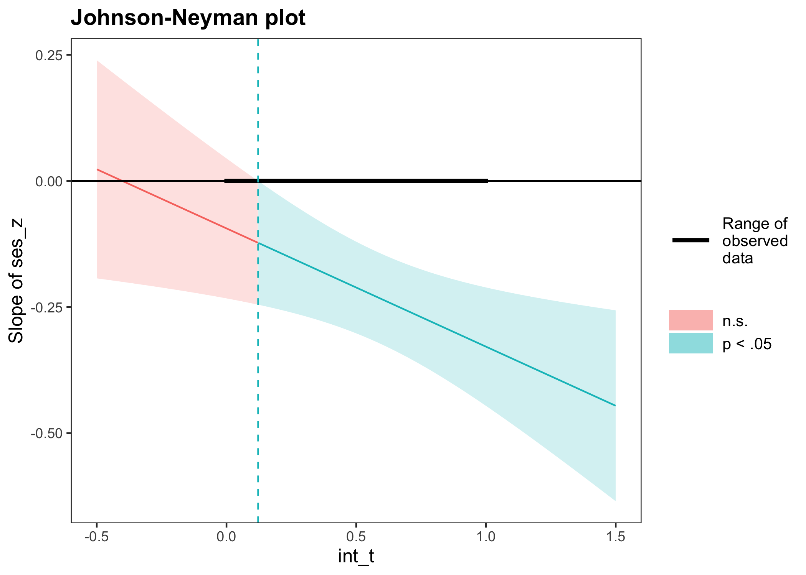
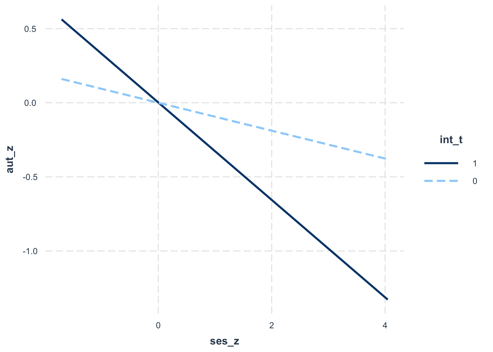

Modelos lineales
================

# Regresión

-   En el presente código se revisan diferentes casos de regresión,
    donde variamos el tipo de covariable incluida.
    -   variable dicotómica
    -   variable de más de una categoría
    -   variable continua
    -   interacción entre variables

# Caso 1: variable dicotómica

## Preparar datos

``` r
# -----------------------------------------------------------------------------
# ICCS 2016 random sample of 500 cases
# -----------------------------------------------------------------------------

# -----------------------------------------------
# load data
# -----------------------------------------------

data_dem <- psi2301::dem_16

# -----------------------------------------------
# variables
# -----------------------------------------------

library(dplyr)
r4sda::variables_table(data_dem) %>%
knitr::kable()
```

    ## Loading required package: purrr

    ## Loading required package: stringr

| variable   | type    | values                                                 | labels                                                                                                            |
|:-----------|:--------|:-------------------------------------------------------|:------------------------------------------------------------------------------------------------------------------|
| id\_i      | dbl     | 243, 7484, 7187, 9208, 6863, 8736, 9067, 9691, 7096, … | id único del caso                                                                                                 |
| ctry       | chr     | , “Chile”, “Chile”, “Chile”, “Chile”, “Chile”, "Chile… | nombre del país                                                                                                   |
| sex        | dbl     | , 0, 1, 1, 0, 1, 0, 1, 0, 1, 0, 0, 1, 0, 0, 1, 1, 1, … | sexo del estudiante (0 = niño, 1 = niña)                                                                          |
| age        | dbl+lbl | 50, 13.83, 14.17, 14.50, 13.42, 13.33, 13.92, 13.42, … | edad del estudiante en años (media = 14.25, sd = .99                                                              |
| dem        | dbl     | , 2, 1, 2, 3, 2, 3, 1, 1, 1, 1, 2, 3, 2, 1, 2, 2, 2, … | perfil de concepciones de las democracia (1 = minimalista, 2 = complejo, 3 = limitado)                            |
| dem\_group | chr     | x“,”limited“,”limited“,”complex“,”minimalist“,”c…      | perfil de concepciones de las democracia (en texto)                                                               |
| aut        | dbl     | 57.94, 17.67, 17.67, 38.07, 47.94, 59.24, 51.06, 27.0… | creencias antidemocráticas (AUTGOV, media = 50, sd = 10)                                                          |
| civ        | dbl+lbl | .89, 334.68, 527.46, 612.81, 479.65, 556.01, 548.08, … | conocimiento cívico (PV1CVI, media = 500, sd = 100)                                                               |
| ses        | dbl+lbl | 19, -0.56, -0.23, -0.81, -0.17, 1.08, -1.03, -0.54, …  | nivel socioecónomico (media = 0, sd = 1, en cada país                                                             |
| edu        | dbl     | , 0, 0, 1, 0, 0, 0, 0, 0, 0, 0, 1, 0, 1, 1, 0, 0, 1, … | educación de los padres (1 = educación universitaria, 0 = otro nivel educativo                                    |
| level      | dbl     | , 3, 2, 2, 2, 0, 2, 2, 1, 0, 0, 2, 1, 2, 2, 3, 2, 3, … | niveles de conocimiento cívico (numérico) (3 = alta sofisticación, 2 = medio, 1 = bajo, 0 = muy bajo              |
| level\_lab | chr     | 2“,”level 0“,”level 2“,”level 3“,”level 2“,”leve…      | niveles de conocimiento cívico (Level 3 = alta sofisticación, Level 2 = medio, Level 1 = bajo, Level 0 = muy bajo |

``` r
# -----------------------------------------------
# data description
# -----------------------------------------------

# ? psi2301::dem_16

# Description:
# 
#      Datos del Estudio Internacional sobre Educación Cívica y Ciudadana
#      (ICCS). Esta tabla de datos, incluye las observaciones del módulo
#      internacional, y del modulo latino americano. Estos datos inlcuyen
#      500 casos de cada país, ademas de variables tales como: sexo,
#      edad, perfil de concepciones de la democracia, creencias
#      antidemocraticas, conocimiento cívico, nivel socioeconómico, y
#      educacion de los padres, y niveles de conocimiento cívico.
# 
# Usage:
# 
#      data(dem_16)
#      
# Format:
# 
#      Objeto clase ‘"cross"’; ver ‘read.cross’.
# 
# Source:
# 
#      IEA, <https://www.iea.nl/index.php/data-tools/repository/iccs>
# 
# References:
# 
#      Schulz, W., Carstens, R., Losito, B., & Fraillon, J. (2018). ICCS
#      2016 Technical Report (W. Schulz, R. Carstens, B. Losito, & J.
#      Fraillon (eds.)). International Association for the Evaluation of
#      Educational Achievement (IEA).
# 
# Examples:
# 
#      data(dem_16)
#      dplyr::glimpse(dem_16)

# -----------------------------------------------
# get descriptives
# -----------------------------------------------

data_dem %>%
dplyr::select(aut, edu) %>%
r4sda::get_desc() %>%
knitr::kable(., digits = 2)
```

| var | missing | complete |    n |  mean |    sd |   min |   p25 | median |   p75 |   max |  skew | kurt | hist     |
|:----|--------:|---------:|-----:|------:|------:|------:|------:|-------:|------:|------:|------:|-----:|:---------|
| aut |    0.01 |     0.99 | 2500 | 49.41 | 11.47 | 17.67 | 44.48 |  51.06 | 56.63 | 85.37 | -0.57 | 4.14 | ▁▁▃▇▇▃▁▁ |
| edu |    0.01 |     0.99 | 2500 |  0.26 |  0.44 |  0.00 |  0.00 |   0.00 |  1.00 |  1.00 |  1.08 | 2.16 | ▇▁▁▁▁▁▁▃ |

## Ajusta modelo de regresión

``` r
# -----------------------------------------------------------------------------
# conventional regression
# -----------------------------------------------------------------------------

# -----------------------------------------------
# caso 1
# -----------------------------------------------

lm(aut ~ 1 + edu, data = data_dem)
```

    ## 
    ## Call:
    ## lm(formula = aut ~ 1 + edu, data = data_dem)
    ## 
    ## Coefficients:
    ## (Intercept)          edu  
    ##       50.18        -2.86

``` r
# -----------------------------------------------
# request summary
# -----------------------------------------------

lm(aut ~ 1 + edu, data = data_dem) %>%
summary()
```

    ## 
    ## Call:
    ## lm(formula = aut ~ 1 + edu, data = data_dem)
    ## 
    ## Residuals:
    ##     Min      1Q  Median      3Q     Max 
    ## -32.514  -5.704   0.876   6.606  38.046 
    ## 
    ## Coefficients:
    ##             Estimate Std. Error t value Pr(>|t|)    
    ## (Intercept)  50.1842     0.2671 187.851  < 2e-16 ***
    ## edu          -2.8600     0.5206  -5.494 4.34e-08 ***
    ## ---
    ## Signif. codes:  0 '***' 0.001 '**' 0.01 '*' 0.05 '.' 0.1 ' ' 1
    ## 
    ## Residual standard error: 11.36 on 2451 degrees of freedom
    ##   (47 observations deleted due to missingness)
    ## Multiple R-squared:  0.01216,    Adjusted R-squared:  0.01176 
    ## F-statistic: 30.18 on 1 and 2451 DF,  p-value: 4.339e-08

## Obtener estimados en formato tabla

``` r
# -----------------------------------------------------------------------------
# tidy output
# -----------------------------------------------------------------------------

# -----------------------------------------------
# get estimates in a table
# -----------------------------------------------

lm(aut ~ 1 + edu, data = data_dem) %>%
broom::tidy() %>%
knitr::kable(., digits = 2)
```

    ## Registered S3 methods overwritten by 'broom':
    ##   method            from  
    ##   tidy.glht         jtools
    ##   tidy.summary.glht jtools

| term        | estimate | std.error | statistic | p.value |
|:------------|---------:|----------:|----------:|--------:|
| (Intercept) |    50.18 |      0.27 |    187.85 |       0 |
| edu         |    -2.86 |      0.52 |     -5.49 |       0 |

``` r
# -----------------------------------------------
# get fit indexes
# -----------------------------------------------

lm(aut ~ 1 + edu, data = data_dem) %>%
broom::glance() %>%
knitr::kable(., digits = 2)
```

| r.squared | adj.r.squared | sigma | statistic | p.value |  df |   logLik |      AIC |      BIC | deviance | df.residual | nobs |
|----------:|--------------:|------:|----------:|--------:|----:|---------:|---------:|---------:|---------:|------------:|-----:|
|      0.01 |          0.01 | 11.36 |     30.18 |       0 |   1 | -9439.86 | 18885.73 | 18903.14 | 316088.5 |        2451 | 2453 |

## Ajustar modelos en pasos

``` r
# -----------------------------------------------------------------------------
# regression in steps
# -----------------------------------------------------------------------------

# -----------------------------------------------
# regression in steps
# -----------------------------------------------

m00 <- as.formula('aut ~ 1')
m01 <- as.formula('aut ~ 1 + edu')

fit_00 <- lm(m00, data = data_dem)
fit_01 <- lm(m01, data = data_dem)

texreg::screenreg(
    list(fit_00, fit_01),
    star.symbol = "*", 
    center = TRUE, 
    doctype = FALSE,
    dcolumn = TRUE, 
    booktabs = TRUE,
    single.row = FALSE
    )
```

    ## 
    ## =====================================
    ##              Model 1      Model 2    
    ## -------------------------------------
    ## (Intercept)    49.41 ***    50.18 ***
    ##                (0.23)       (0.27)   
    ## edu                         -2.86 ***
    ##                             (0.52)   
    ## -------------------------------------
    ## R^2             0.00         0.01    
    ## Adj. R^2        0.00         0.01    
    ## Num. obs.    2483         2453       
    ## =====================================
    ## *** p < 0.001; ** p < 0.01; * p < 0.05

``` r
# -----------------------------------------------
# anova
# -----------------------------------------------

# anova(fit_00, fit_01)

# Note: error producto de que los modelos no estan anidados.

# -----------------------------------------------
# regression in steps, with not ommitted
# -----------------------------------------------

data_dem_edu <- dplyr::select(data_dem, aut, edu) %>% na.omit()

m00 <- as.formula('aut ~ 1')
m01 <- as.formula('aut ~ 1 + edu')


fit_00 <- lm(m00, data = data_dem_edu)
fit_01 <- lm(m01, data = data_dem_edu)

texreg::screenreg(
    list(fit_00, fit_01),
    star.symbol = "*", 
    center = TRUE, 
    doctype = FALSE,
    dcolumn = TRUE, 
    booktabs = TRUE,
    single.row = FALSE
    )
```

    ## 
    ## =====================================
    ##              Model 1      Model 2    
    ## -------------------------------------
    ## (Intercept)    49.43 ***    50.18 ***
    ##                (0.23)       (0.27)   
    ## edu                         -2.86 ***
    ##                             (0.52)   
    ## -------------------------------------
    ## R^2             0.00         0.01    
    ## Adj. R^2        0.00         0.01    
    ## Num. obs.    2453         2453       
    ## =====================================
    ## *** p < 0.001; ** p < 0.01; * p < 0.05

``` r
# -----------------------------------------------
# anova
# -----------------------------------------------

anova(fit_00, fit_01)
```

    ## Analysis of Variance Table
    ## 
    ## Model 1: aut ~ 1
    ## Model 2: aut ~ 1 + edu
    ##   Res.Df    RSS Df Sum of Sq      F    Pr(>F)    
    ## 1   2452 319981                                  
    ## 2   2451 316089  1    3892.4 30.182 4.339e-08 ***
    ## ---
    ## Signif. codes:  0 '***' 0.001 '**' 0.01 '*' 0.05 '.' 0.1 ' ' 1

## Estimados estandarizados

``` r
# -----------------------------------------------------------------------------
# regression in lavaan
# -----------------------------------------------------------------------------

# -----------------------------------------------
# regression model with lavaan
# -----------------------------------------------

reg_model <- '

aut ~ 1     # intercept
aut ~ edu   # slope

'

# -----------------------------------------------
# fit model
# -----------------------------------------------

fit_reg <- lavaan::sem(reg_model, data = data_dem, 
             mimic="Mplus", estimator = "ML")

# -----------------------------------------------
# display results
# -----------------------------------------------

lavaan::summary(fit_reg,
  standardized=TRUE, 
  fit.measures=TRUE, 
  rsquare=TRUE)
```

    ## lavaan 0.6-8 ended normally after 21 iterations
    ## 
    ##   Estimator                                         ML
    ##   Optimization method                           NLMINB
    ##   Number of model parameters                         3
    ##                                                       
    ##                                                   Used       Total
    ##   Number of observations                          2466        2500
    ##   Number of missing patterns                         2            
    ##                                                                   
    ## Model Test User Model:
    ##                                                       
    ##   Test statistic                                 0.000
    ##   Degrees of freedom                                 0
    ## 
    ## Model Test Baseline Model:
    ## 
    ##   Test statistic                                30.022
    ##   Degrees of freedom                                 1
    ##   P-value                                        0.000
    ## 
    ## User Model versus Baseline Model:
    ## 
    ##   Comparative Fit Index (CFI)                    1.000
    ##   Tucker-Lewis Index (TLI)                       1.000
    ## 
    ## Loglikelihood and Information Criteria:
    ## 
    ##   Loglikelihood user model (H0)              -9439.865
    ##   Loglikelihood unrestricted model (H1)      -9439.865
    ##                                                       
    ##   Akaike (AIC)                               18885.729
    ##   Bayesian (BIC)                             18903.160
    ##   Sample-size adjusted Bayesian (BIC)        18893.629
    ## 
    ## Root Mean Square Error of Approximation:
    ## 
    ##   RMSEA                                          0.000
    ##   90 Percent confidence interval - lower         0.000
    ##   90 Percent confidence interval - upper         0.000
    ##   P-value RMSEA <= 0.05                             NA
    ## 
    ## Standardized Root Mean Square Residual:
    ## 
    ##   SRMR                                           0.000
    ## 
    ## Parameter Estimates:
    ## 
    ##   Standard errors                             Standard
    ##   Information                                 Observed
    ##   Observed information based on                Hessian
    ## 
    ## Regressions:
    ##                    Estimate  Std.Err  z-value  P(>|z|)   Std.lv  Std.all
    ##   aut ~                                                                 
    ##     edu              -2.860    0.520   -5.496    0.000   -2.860   -0.110
    ## 
    ## Intercepts:
    ##                    Estimate  Std.Err  z-value  P(>|z|)   Std.lv  Std.all
    ##    .aut              50.184    0.267  187.928    0.000   50.184    4.394
    ## 
    ## Variances:
    ##                    Estimate  Std.Err  z-value  P(>|z|)   Std.lv  Std.all
    ##    .aut             128.858    3.679   35.021    0.000  128.858    0.988
    ## 
    ## R-Square:
    ##                    Estimate
    ##     aut               0.012

## Medias esperadas

``` r
# -----------------------------------------------------------------------------
# expected means
# -----------------------------------------------------------------------------

# -----------------------------------------------
# comparison of results with t test
# -----------------------------------------------

t.test(aut ~ edu, 
    var.equal = TRUE,
    data = data_dem)
```

    ## 
    ##  Two Sample t-test
    ## 
    ## data:  aut by edu
    ## t = 5.4938, df = 2451, p-value = 4.339e-08
    ## alternative hypothesis: true difference in means is not equal to 0
    ## 95 percent confidence interval:
    ##  1.839152 3.880790
    ## sample estimates:
    ## mean in group 0 mean in group 1 
    ##        50.18423        47.32426

``` r
# -----------------------------------------------
# t test statistics
# -----------------------------------------------

t.test(aut ~ edu, 
    var.equal = TRUE,
    data = data_dem) %>%
broom::tidy() %>%
knitr::kable(., digits = 2)
```

| estimate | estimate1 | estimate2 | statistic | p.value | parameter | conf.low | conf.high | method            | alternative |
|---------:|----------:|----------:|----------:|--------:|----------:|---------:|----------:|:------------------|:------------|
|     2.86 |     50.18 |     47.32 |      5.49 |       0 |      2451 |     1.84 |      3.88 | Two Sample t-test | two.sided   |

``` r
# -----------------------------------------------
# get expected means
# -----------------------------------------------

alpha <- lm(aut ~ 1 + edu, data = data_dem) %>%
         broom::tidy() %>%
         dplyr::filter(term =='(Intercept)') %>%
         dplyr::select(estimate) %>%
         dplyr::pull()

beta <- lm(aut ~ 1 + edu, data = data_dem) %>%
         broom::tidy() %>%
         dplyr::filter(term =='edu') %>%
         dplyr::select(estimate) %>%
         dplyr::pull()

mean_0 <- alpha
mean_1 <- alpha + beta

data.frame(
    group = c(
        'Sin Educacion Terciaria', 
        'Con Educación terciaria'),
    medias = c(mean_0, mean_1)
    ) %>%
knitr::kable(., digits = 2)
```

| group                   | medias |
|:------------------------|-------:|
| Sin Educacion Terciaria |  50.18 |
| Con Educación terciaria |  47.32 |

## Reparametrización de dummy

-   Reparametrizar el modelo, consiste en cambiar la codificación de la
    variable dummy, de modo que el coeficiente y el intercepto del
    modelo tome otro significado.

``` r
# -----------------------------------------------------------------------------
# model reparametrization
# -----------------------------------------------------------------------------

# -----------------------------------------------
# check dummy 
# -----------------------------------------------

dplyr::count(data_dem, edu)
```

    ## # A tibble: 3 x 2
    ##     edu     n
    ##   <dbl> <int>
    ## 1     0  1817
    ## 2     1   649
    ## 3    NA    34

``` r
# -----------------------------------------------
# add reparametrized variables
# -----------------------------------------------

data_dem <- psi2301::dem_16 %>%
            mutate(edu_1 = edu) %>%
            mutate(edu_0 = case_when(
                edu == 0 ~ 1,
                edu == 1 ~ 0
                )) %>%
            mutate(edu_d = case_when(
                edu == 0 ~ -1,
                edu == 1 ~  1
                )) %>%
            mutate(edu_g = mean(edu, na.rm = TRUE)) %>%
            mutate(edu_m = edu - edu_g) %>%
            dplyr::glimpse()
```

    ## Rows: 2,500
    ## Columns: 17
    ## $ id_i      <dbl> 8093, 9243, 7484, 7187, 9208, 6863, 8736, 9067, 9691, 7096, …
    ## $ ctry      <chr> "Chile", "Chile", "Chile", "Chile", "Chile", "Chile", "Chile…
    ## $ sex       <dbl> 1, 0, 0, 0, 1, 1, 0, 1, 0, 1, 0, 1, 0, 0, 1, 0, 0, 1, 1, 1, …
    ## $ age       <dbl+lbl> 13.50, 13.83, 14.17, 14.50, 13.42, 13.33, 13.92, 13.42, …
    ## $ dem       <dbl> 2, 3, 3, 2, 1, 2, 3, 2, 3, 1, 1, 1, 1, 2, 3, 2, 1, 2, 2, 2, …
    ## $ dem_group <chr> "complex", "limited", "limited", "complex", "minimalist", "c…
    ## $ aut       <dbl> 42.55, 57.94, 17.67, 17.67, 38.07, 47.94, 59.24, 51.06, 27.0…
    ## $ civ       <dbl+lbl> 514.89, 334.68, 527.46, 612.81, 479.65, 556.01, 548.08, …
    ## $ ses       <dbl+lbl> -0.19, -0.56, -0.23, -0.81, -0.17,  1.08, -1.03, -0.54, …
    ## $ edu       <dbl> 0, 0, 0, 0, 0, 1, 0, 0, 0, 0, 0, 0, 0, 1, 0, 1, 1, 0, 0, 1, …
    ## $ level     <dbl> 2, 0, 2, 3, 2, 2, 2, 0, 2, 2, 1, 0, 0, 2, 1, 2, 2, 3, 2, 3, …
    ## $ level_lab <chr> "level 2", "level 0", "level 2", "level 3", "level 2", "leve…
    ## $ edu_1     <dbl> 0, 0, 0, 0, 0, 1, 0, 0, 0, 0, 0, 0, 0, 1, 0, 1, 1, 0, 0, 1, …
    ## $ edu_0     <dbl> 1, 1, 1, 1, 1, 0, 1, 1, 1, 1, 1, 1, 1, 0, 1, 0, 0, 1, 1, 0, …
    ## $ edu_d     <dbl> -1, -1, -1, -1, -1, 1, -1, -1, -1, -1, -1, -1, -1, 1, -1, 1,…
    ## $ edu_g     <dbl> 0.2631792, 0.2631792, 0.2631792, 0.2631792, 0.2631792, 0.263…
    ## $ edu_m     <dbl> -0.2631792, -0.2631792, -0.2631792, -0.2631792, -0.2631792, …

``` r
# -----------------------------------------------
# models with different parametrizations
# -----------------------------------------------


e00 <- as.formula('aut ~ 1')
e01 <- as.formula('aut ~ 1 + edu')
e02 <- as.formula('aut ~ 1 + edu_1')
e03 <- as.formula('aut ~ 1 + edu_0')
e04 <- as.formula('aut ~ 1 + edu_d')
e05 <- as.formula('aut ~ 1 + edu_m')

c00 <- lm(e00, data = data_dem)
c01 <- lm(e01, data = data_dem)
c02 <- lm(e02, data = data_dem)
c03 <- lm(e03, data = data_dem)
c04 <- lm(e04, data = data_dem)
c05 <- lm(e05, data = data_dem)

texreg::screenreg(
    list(c00, c01, c02, c03, c04, c05),
    star.symbol = "*", 
    center = TRUE, 
    doctype = FALSE,
    dcolumn = TRUE, 
    booktabs = TRUE,
    single.row = FALSE
    )
```

    ## 
    ## =========================================================================================
    ##              Model 1      Model 2      Model 3      Model 4      Model 5      Model 6    
    ## -----------------------------------------------------------------------------------------
    ## (Intercept)    49.41 ***    50.18 ***    50.18 ***    47.32 ***    48.75 ***    49.43 ***
    ##                (0.23)       (0.27)       (0.27)       (0.45)       (0.26)       (0.23)   
    ## edu                         -2.86 ***                                                    
    ##                             (0.52)                                                       
    ## edu_1                                    -2.86 ***                                       
    ##                                          (0.52)                                          
    ## edu_0                                                  2.86 ***                          
    ##                                                       (0.52)                             
    ## edu_d                                                              -1.43 ***             
    ##                                                                    (0.26)                
    ## edu_m                                                                           -2.86 ***
    ##                                                                                 (0.52)   
    ## -----------------------------------------------------------------------------------------
    ## R^2             0.00         0.01         0.01         0.01         0.01         0.01    
    ## Adj. R^2        0.00         0.01         0.01         0.01         0.01         0.01    
    ## Num. obs.    2483         2453         2453         2453         2453         2453       
    ## =========================================================================================
    ## *** p < 0.001; ** p < 0.01; * p < 0.05

``` r
# -----------------------------------------------
# results
# -----------------------------------------------

# =========================================================================================
#              Model 1      Model 2      Model 3      Model 4      Model 5      Model 6    
# -----------------------------------------------------------------------------------------
# (Intercept)    49.41 ***    50.18 ***    50.18 ***    47.32 ***    48.75 ***    49.43 ***
#                (0.23)       (0.27)       (0.27)       (0.45)       (0.26)       (0.23)   
# edu                         -2.86 ***                                                    
#                             (0.52)                                                       
# edu_1                                    -2.86 ***                                       
#                                          (0.52)                                          
# edu_0                                                  2.86 ***                          
#                                                       (0.52)                             
# edu_d                                                              -1.43 ***             
#                                                                    (0.26)                
# edu_m                                                                           -2.86 ***
#                                                                                 (0.52)   
# -----------------------------------------------------------------------------------------
# R^2             0.00         0.01         0.01         0.01         0.01         0.01    
# Adj. R^2        0.00         0.01         0.01         0.01         0.01         0.01    
# Num. obs.    2483         2453         2453         2453         2453         2453       
# =========================================================================================
# *** p < 0.001; ** p < 0.01; * p < 0.05
```

-   Notas
    -   Model 1: intercepto es la gran media
    -   Model 2: intercepto es media del grupo de estudiantes de padres
        sin educación terciaria
    -   Model 3: intercepto es media del grupo de estudiantes de padres
        sin educación terciaria
    -   Model 4: intercepto es media del grupo de estudiantes de padres
        con educación terciaria
    -   Model 5: intercepto es el promedio de ambos grupos (con y sin
        educación terciaria)
    -   Model 6: intercepto es la gran media, a niveles medios de
        escolaridad de los padres

# Caso 2: variable categorica con más de dos categorías

## Preparar datos

``` r
# -----------------------------------------------------------------------------
# ICCS 2016 random sample of 500 cases
# -----------------------------------------------------------------------------

# -----------------------------------------------
# load data
# -----------------------------------------------

data_dem <- psi2301::dem_16

# -----------------------------------------------
# ordinal covariate
# -----------------------------------------------

dplyr::count(data_dem, level)
```

    ## # A tibble: 4 x 2
    ##   level     n
    ##   <dbl> <int>
    ## 1     0   729
    ## 2     1   745
    ## 3     2   728
    ## 4     3   298

``` r
# -----------------------------------------------
# generate dummy
# -----------------------------------------------

data_dem <- psi2301::dem_16 %>%
            mutate(level_0 = case_when(
                level == 0 ~ 1,
                level == 1 ~ 0,
                level == 2 ~ 0,
                level == 3 ~ 0
                )) %>%
            mutate(level_1 = case_when(
                level == 0 ~ 0,
                level == 1 ~ 1,
                level == 2 ~ 0,
                level == 3 ~ 0
                )) %>%
            mutate(level_2 = case_when(
                level == 0 ~ 0,
                level == 1 ~ 0,
                level == 2 ~ 1,
                level == 3 ~ 0
                )) %>%
            mutate(level_3 = case_when(
                level == 0 ~ 0,
                level == 1 ~ 0,
                level == 2 ~ 0,
                level == 3 ~ 1
                )) %>%
            dplyr::glimpse()
```

    ## Rows: 2,500
    ## Columns: 16
    ## $ id_i      <dbl> 8093, 9243, 7484, 7187, 9208, 6863, 8736, 9067, 9691, 7096, …
    ## $ ctry      <chr> "Chile", "Chile", "Chile", "Chile", "Chile", "Chile", "Chile…
    ## $ sex       <dbl> 1, 0, 0, 0, 1, 1, 0, 1, 0, 1, 0, 1, 0, 0, 1, 0, 0, 1, 1, 1, …
    ## $ age       <dbl+lbl> 13.50, 13.83, 14.17, 14.50, 13.42, 13.33, 13.92, 13.42, …
    ## $ dem       <dbl> 2, 3, 3, 2, 1, 2, 3, 2, 3, 1, 1, 1, 1, 2, 3, 2, 1, 2, 2, 2, …
    ## $ dem_group <chr> "complex", "limited", "limited", "complex", "minimalist", "c…
    ## $ aut       <dbl> 42.55, 57.94, 17.67, 17.67, 38.07, 47.94, 59.24, 51.06, 27.0…
    ## $ civ       <dbl+lbl> 514.89, 334.68, 527.46, 612.81, 479.65, 556.01, 548.08, …
    ## $ ses       <dbl+lbl> -0.19, -0.56, -0.23, -0.81, -0.17,  1.08, -1.03, -0.54, …
    ## $ edu       <dbl> 0, 0, 0, 0, 0, 1, 0, 0, 0, 0, 0, 0, 0, 1, 0, 1, 1, 0, 0, 1, …
    ## $ level     <dbl> 2, 0, 2, 3, 2, 2, 2, 0, 2, 2, 1, 0, 0, 2, 1, 2, 2, 3, 2, 3, …
    ## $ level_lab <chr> "level 2", "level 0", "level 2", "level 3", "level 2", "leve…
    ## $ level_0   <dbl> 0, 1, 0, 0, 0, 0, 0, 1, 0, 0, 0, 1, 1, 0, 0, 0, 0, 0, 0, 0, …
    ## $ level_1   <dbl> 0, 0, 0, 0, 0, 0, 0, 0, 0, 0, 1, 0, 0, 0, 1, 0, 0, 0, 0, 0, …
    ## $ level_2   <dbl> 1, 0, 1, 0, 1, 1, 1, 0, 1, 1, 0, 0, 0, 1, 0, 1, 1, 0, 1, 0, …
    ## $ level_3   <dbl> 0, 0, 0, 1, 0, 0, 0, 0, 0, 0, 0, 0, 0, 0, 0, 0, 0, 1, 0, 1, …

## Ajustar regresion

``` r
# -----------------------------------------------------------------------------
# ICCS 2016 random sample of 500 cases
# -----------------------------------------------------------------------------

# -----------------------------------------------
# regression in steps
# -----------------------------------------------

m00 <- as.formula('aut ~ 1')
m01 <- as.formula('aut ~ 1 + level_1 + level_2 + level_3')


fit_00 <- lm(m00, data = data_dem)
fit_01 <- lm(m01, data = data_dem)

texreg::screenreg(
    list(fit_00, fit_01),
    star.symbol = "*", 
    center = TRUE, 
    doctype = FALSE,
    dcolumn = TRUE, 
    booktabs = TRUE,
    single.row = FALSE
    )
```

    ## 
    ## =====================================
    ##              Model 1      Model 2    
    ## -------------------------------------
    ## (Intercept)    49.41 ***    57.18 ***
    ##                (0.23)       (0.35)   
    ## level_1                     -5.95 ***
    ##                             (0.50)   
    ## level_2                    -12.30 ***
    ##                             (0.50)   
    ## level_3                    -19.96 ***
    ##                             (0.65)   
    ## -------------------------------------
    ## R^2             0.00         0.32    
    ## Adj. R^2        0.00         0.32    
    ## Num. obs.    2483         2483       
    ## =====================================
    ## *** p < 0.001; ** p < 0.01; * p < 0.05

``` r
# -----------------------------------------------
# descriptive means
# -----------------------------------------------

data_dem %>%
group_by(level_lab) %>%
summarize(
    aut_mean = mean(aut, na.rm = TRUE)) %>%
knitr::kable(., digits = 2)
```

| level\_lab | aut\_mean |
|:-----------|----------:|
| level 0    |     57.18 |
| level 1    |     51.23 |
| level 2    |     44.87 |
| level 3    |     37.22 |

``` r
# -----------------------------------------------
# get expected means
# -----------------------------------------------

alpha <- fit_01 %>%
         broom::tidy() %>%
         dplyr::filter(term =='(Intercept)') %>%
         dplyr::select(estimate) %>%
         dplyr::pull()

beta_1 <-  fit_01 %>%
           broom::tidy() %>%
           dplyr::filter(term =='level_1') %>%
           dplyr::select(estimate) %>%
           dplyr::pull()

beta_2 <-  fit_01 %>%
           broom::tidy() %>%
           dplyr::filter(term =='level_2') %>%
           dplyr::select(estimate) %>%
           dplyr::pull()

beta_3 <-  fit_01 %>%
           broom::tidy() %>%
           dplyr::filter(term =='level_3') %>%
           dplyr::select(estimate) %>%
           dplyr::pull()


mean_0 <- alpha
mean_1 <- alpha + beta_1
mean_2 <- alpha + beta_2
mean_3 <- alpha + beta_3


data.frame(
    group = c(
        'level 0', 
        'level 1',
        'level 2',
        'level 3'
        ),
    medias = c(
        mean_0, 
        mean_1,
        mean_2,
        mean_3
        )
    ) %>%
knitr::kable(., digits = 2)
```

| group   | medias |
|:--------|-------:|
| level 0 |  57.18 |
| level 1 |  51.23 |
| level 2 |  44.87 |
| level 3 |  37.22 |

# Caso 3: variable continua

## Preparar datos

``` r
# -----------------------------------------------------------------------------
# ICCS 2016 random sample of 500 cases
# -----------------------------------------------------------------------------

# -----------------------------------------------
# load data
# -----------------------------------------------

data_dem <- psi2301::dem_16

# -----------------------------------------------
# ordinal covariate
# -----------------------------------------------

data_dem %>%
dplyr::select(aut, civ) %>%
r4sda::get_desc() %>%
knitr::kable(., digits = 2)
```

| var | missing | complete |    n |   mean |    sd |   min |    p25 | median |    p75 |    max |  skew | kurt | hist     |
|:----|--------:|---------:|-----:|-------:|------:|------:|-------:|-------:|-------:|-------:|------:|-----:|:---------|
| aut |    0.01 |     0.99 | 2500 |  49.41 | 11.47 | 17.67 |  44.48 |  51.06 |  56.63 |  85.37 | -0.57 | 4.14 | ▁▁▃▇▇▃▁▁ |
| civ |    0.00 |     1.00 | 2500 | 450.58 | 95.56 | 88.26 | 380.26 | 455.17 | 522.20 | 751.08 | -0.15 | 2.63 | ▁▁▃▆▇▆▂▁ |

``` r
# -----------------------------------------------
# centering variables
# -----------------------------------------------

data_dem <- psi2301::dem_16 %>%
            mutate(civ_u = civ) %>%
            mutate(civ_m = civ - mean(civ, na.rm = TRUE)) %>%
            mutate(civ_z = r4sda::z_score(civ)) %>%
            mutate(aut_z = r4sda::z_score(aut)) %>%
            dplyr::glimpse()
```

    ## Rows: 2,500
    ## Columns: 16
    ## $ id_i      <dbl> 8093, 9243, 7484, 7187, 9208, 6863, 8736, 9067, 9691, 7096, …
    ## $ ctry      <chr> "Chile", "Chile", "Chile", "Chile", "Chile", "Chile", "Chile…
    ## $ sex       <dbl> 1, 0, 0, 0, 1, 1, 0, 1, 0, 1, 0, 1, 0, 0, 1, 0, 0, 1, 1, 1, …
    ## $ age       <dbl+lbl> 13.50, 13.83, 14.17, 14.50, 13.42, 13.33, 13.92, 13.42, …
    ## $ dem       <dbl> 2, 3, 3, 2, 1, 2, 3, 2, 3, 1, 1, 1, 1, 2, 3, 2, 1, 2, 2, 2, …
    ## $ dem_group <chr> "complex", "limited", "limited", "complex", "minimalist", "c…
    ## $ aut       <dbl> 42.55, 57.94, 17.67, 17.67, 38.07, 47.94, 59.24, 51.06, 27.0…
    ## $ civ       <dbl+lbl> 514.89, 334.68, 527.46, 612.81, 479.65, 556.01, 548.08, …
    ## $ ses       <dbl+lbl> -0.19, -0.56, -0.23, -0.81, -0.17,  1.08, -1.03, -0.54, …
    ## $ edu       <dbl> 0, 0, 0, 0, 0, 1, 0, 0, 0, 0, 0, 0, 0, 1, 0, 1, 1, 0, 0, 1, …
    ## $ level     <dbl> 2, 0, 2, 3, 2, 2, 2, 0, 2, 2, 1, 0, 0, 2, 1, 2, 2, 3, 2, 3, …
    ## $ level_lab <chr> "level 2", "level 0", "level 2", "level 3", "level 2", "leve…
    ## $ civ_u     <dbl+lbl> 514.89, 334.68, 527.46, 612.81, 479.65, 556.01, 548.08, …
    ## $ civ_m     <dbl+lbl>   64.3073, -115.9027,   76.8773,  162.2273,   29.0673,  …
    ## $ civ_z     <dbl> 0.6729769, -1.2129236, 0.8045221, 1.6977112, 0.3041897, 1.10…
    ## $ aut_z     <dbl> -0.5983410, 0.7432916, -2.7672700, -2.7672700, -0.9888877, -…

## Ajustar regresion

``` r
# -----------------------------------------------------------------------------
# ICCS 2016 random sample of 500 cases
# -----------------------------------------------------------------------------

# -----------------------------------------------
# models with different parametrizations
# -----------------------------------------------


e00 <- as.formula('aut ~ 1')
e01 <- as.formula('aut ~ 1 + civ_u')
e02 <- as.formula('aut ~ 1 + civ_m')
e03 <- as.formula('aut ~ 1 + civ_z')
e04 <- as.formula('aut_z ~ 1 + civ_z')

c00 <- lm(e00, data = data_dem)
c01 <- lm(e01, data = data_dem)
c02 <- lm(e02, data = data_dem)
c03 <- lm(e03, data = data_dem)
c04 <- lm(e04, data = data_dem)

texreg::screenreg(
    list(c00, c01, c02, c03, c04),
    star.symbol = "*", 
    center = TRUE, 
    doctype = FALSE,
    dcolumn = TRUE, 
    booktabs = TRUE,
    single.row = FALSE
    )
```

    ## 
    ## ============================================================================
    ##              Model 1      Model 2      Model 3      Model 4      Model 5    
    ## ----------------------------------------------------------------------------
    ## (Intercept)    49.41 ***    81.06 ***    49.45 ***    49.45 ***     0.00    
    ##                (0.23)       (0.91)       (0.19)       (0.19)       (0.02)   
    ## civ_u                       -0.07 ***                                       
    ##                             (0.00)                                          
    ## civ_m                                    -0.07 ***                          
    ##                                          (0.00)                             
    ## civ_z                                                 -6.70 ***    -0.58 ***
    ##                                                       (0.19)       (0.02)   
    ## ----------------------------------------------------------------------------
    ## R^2             0.00         0.34         0.34         0.34         0.34    
    ## Adj. R^2        0.00         0.34         0.34         0.34         0.34    
    ## Num. obs.    2483         2483         2483         2483         2483       
    ## ============================================================================
    ## *** p < 0.001; ** p < 0.01; * p < 0.05

``` r
# -----------------------------------------------------------------------------
# regression in lavaan
# -----------------------------------------------------------------------------

# -----------------------------------------------
# regression model with lavaan
# -----------------------------------------------

reg_model <- '

aut ~ 1     # intercept
aut ~ civ   # slope

'

# -----------------------------------------------
# fit model
# -----------------------------------------------

fit_reg <- lavaan::sem(reg_model, data = data_dem, 
             mimic="Mplus", estimator = "ML")

# -----------------------------------------------
# display results
# -----------------------------------------------

lavaan::summary(fit_reg,
  standardized=TRUE, 
  fit.measures=TRUE, 
  rsquare=TRUE)
```

    ## lavaan 0.6-8 ended normally after 12 iterations
    ## 
    ##   Estimator                                         ML
    ##   Optimization method                           NLMINB
    ##   Number of model parameters                         3
    ##                                                       
    ##   Number of observations                          2500
    ##   Number of missing patterns                         2
    ##                                                       
    ## Model Test User Model:
    ##                                                       
    ##   Test statistic                                 0.000
    ##   Degrees of freedom                                 0
    ## 
    ## Model Test Baseline Model:
    ## 
    ##   Test statistic                              1030.332
    ##   Degrees of freedom                                 1
    ##   P-value                                        0.000
    ## 
    ## User Model versus Baseline Model:
    ## 
    ##   Comparative Fit Index (CFI)                    1.000
    ##   Tucker-Lewis Index (TLI)                       1.000
    ## 
    ## Loglikelihood and Information Criteria:
    ## 
    ##   Loglikelihood user model (H0)              -9065.658
    ##   Loglikelihood unrestricted model (H1)             NA
    ##                                                       
    ##   Akaike (AIC)                               18137.316
    ##   Bayesian (BIC)                             18154.788
    ##   Sample-size adjusted Bayesian (BIC)        18145.256
    ## 
    ## Root Mean Square Error of Approximation:
    ## 
    ##   RMSEA                                          0.000
    ##   90 Percent confidence interval - lower         0.000
    ##   90 Percent confidence interval - upper         0.000
    ##   P-value RMSEA <= 0.05                             NA
    ## 
    ## Standardized Root Mean Square Residual:
    ## 
    ##   SRMR                                           0.000
    ## 
    ## Parameter Estimates:
    ## 
    ##   Standard errors                             Standard
    ##   Information                                 Observed
    ##   Observed information based on                Hessian
    ## 
    ## Regressions:
    ##                    Estimate  Std.Err  z-value  P(>|z|)   Std.lv  Std.all
    ##   aut ~                                                                 
    ##     civ              -0.070    0.002  -35.735    0.000   -0.070   -0.584
    ## 
    ## Intercepts:
    ##                    Estimate  Std.Err  z-value  P(>|z|)   Std.lv  Std.all
    ##    .aut              81.064    0.905   89.551    0.000   81.064    7.061
    ## 
    ## Variances:
    ##                    Estimate  Std.Err  z-value  P(>|z|)   Std.lv  Std.all
    ##    .aut              86.861    2.465   35.235    0.000   86.861    0.659
    ## 
    ## R-Square:
    ##                    Estimate
    ##     aut               0.341

# Caso 4: interaccion

## Preparar datos

``` r
# -----------------------------------------------------------------------------
# ICCS 2016 random sample of 500 cases
# -----------------------------------------------------------------------------

# -----------------------------------------------
# countries
# -----------------------------------------------

psi2301::iccs_09_lat %>%
dplyr::count(COUNTRY)
```

    ## # A tibble: 6 x 2
    ##   COUNTRY     n
    ##   <chr>   <int>
    ## 1 CHL      5192
    ## 2 COL      6204
    ## 3 DOM      4589
    ## 4 GTM      4002
    ## 5 MEX      6576
    ## 6 PRY      3399

``` r
# -----------------------------------------------
# moderator
# -----------------------------------------------


psi2301::iccs_09_lat %>%
dplyr::count(PARINT)
```

    ## # A tibble: 5 x 2
    ##   PARINT         n
    ##   <labelled> <int>
    ## 1  0          1700
    ## 2  1         12635
    ## 3  2          7055
    ## 4  3          7664
    ## 5 NA           908

``` r
# -----------------------------------------------
# selected variables
# -----------------------------------------------

psi2301::iccs_09_lat %>%
dplyr::select(PV1CIV, NISB, PARINT) %>%
r4sda::get_desc() %>%
knitr::kable(., digits = 2)
```

| var    | missing | complete |     n |   mean |    sd |   min |    p25 | median |    p75 |    max | skew | kurt | hist     |
|:-------|--------:|---------:|------:|-------:|------:|------:|-------:|-------:|-------:|-------:|-----:|-----:|:---------|
| PV1CIV |    0.00 |     1.00 | 29962 | 446.81 | 88.30 | 91.02 | 383.34 | 443.27 | 508.47 | 790.27 | 0.15 | 2.71 | ▁▁▃▇▇▃▁▁ |
| NISB   |    0.00 |     1.00 | 29962 |   0.06 |  1.00 | -3.06 |  -0.64 |  -0.07 |   0.71 |   4.73 | 0.57 | 3.35 | ▁▂▇▇▃▁▁▁ |
| PARINT |    0.03 |     0.97 | 29962 |   1.71 |  0.92 |  0.00 |   1.00 |   2.00 |   3.00 |   3.00 | 0.15 | 1.86 | ▁▁▇▁▁▅▁▅ |

``` r
# -----------------------------------------------
# centering variables
# -----------------------------------------------

data_par <- psi2301::iccs_09_lat %>%
            dplyr::filter(COUNTRY == 'PRY') %>%
            mutate(aut_u = AUTGOV) %>%
            mutate(aut_z = r4sda::z_score(aut_u)) %>%
            mutate(ses_z = r4sda::z_score(NISB)) %>%
            mutate(int_z = r4sda::z_score(INTPOLS)) %>%
            mutate(eff_z = r4sda::z_score(CITEFF)) %>%
            mutate(civ_u = PV1CIV) %>%
            mutate(civ_z = r4sda::z_score(civ_u)) %>%
            mutate(civ_c = r4sda::c_mean(civ_z, id_j)) %>%
            mutate(civ_g = r4sda::c_mean(civ_z, id_k)) %>%
            mutate(civ_m = civ_z - civ_g) %>%
            mutate(civ_w = civ_z - civ_c) %>%
            mutate(civ_b = civ_c - civ_g) %>%
            mutate(opd_z = r4sda::z_score(OPDISC)) %>%
            mutate(opd_c = r4sda::c_mean(opd_z, id_j)) %>%
            mutate(opd_g = r4sda::c_mean(opd_z, id_k)) %>%
            mutate(opd_m = opd_z - opd_g) %>%
            mutate(opd_w = opd_z - opd_c) %>%
            mutate(opd_b = opd_c - opd_g) %>%
            mutate(edu_t = case_when(
                 HISCED == 5 ~ 1,
                 HISCED == 4 ~ 0,
                 HISCED == 3 ~ 0,  
                 HISCED == 2 ~ 0,
                 HISCED == 1 ~ 0,
                 HISCED == 0 ~ 0)) %>%
            mutate(exe_t = case_when(
                 SISCED == 4 ~ 1,
                 SISCED == 3 ~ 0,  
                 SISCED == 2 ~ 0,
                 SISCED == 1 ~ 0,
                 SISCED == 0 ~ 0)) %>%    
            mutate(int_t = case_when(
                 PARINT == 3 ~ 1,  
                 PARINT == 2 ~ 1,
                 PARINT == 1 ~ 0,
                 PARINT == 0 ~ 0)) %>%                             
            mutate(int_s = ses_z*int_t) %>%
            # random selection
            dplyr::sample_n(500, weights = ws) %>%
            dplyr::glimpse()
```

    ## Rows: 500
    ## Columns: 575
    ## $ IDCNTRY  <dbl> 600, 600, 600, 600, 600, 600, 600, 600, 600, 600, 600, 600, 6…
    ## $ COUNTRY  <chr> "PRY", "PRY", "PRY", "PRY", "PRY", "PRY", "PRY", "PRY", "PRY"…
    ## $ IDSTUD   <dbl> 11450102, 10420225, 10330101, 10160109, 10420210, 10520109, 1…
    ## $ IDCLASS  <labelled> 114501, 104202, 103301, 101601, 104202, 105201, 108301, …
    ## $ IDSCHOOL <labelled> 1145, 1042, 1033, 1016, 1042, 1052, 1083, 1085, 1082, 10…
    ## $ IS2G03   <labelled> 3, 1, 1, 2, 2, 3, 1, 3, 1, 1, 1, 2, 1, 3, 1, 1, 2, 2, 2,…
    ## $ IS2G04A  <labelled> 1, 1, 1, 1, 1, 1, 1, 1, 1, 1, 1, 1, 1, 1, 1, 1, 1, 1, 1,…
    ## $ IS2G04B  <labelled> 1, 1, 1, 1, 1, 1, 1, 1, 1, 0, 1, 1, 1, 1, 1, 1, 1, 1, 1,…
    ## $ IS2G04C  <labelled> 1, 1, 1, 1, 1, 0, 1, 1, 1, 0, 1, 1, 1, 1, 1, 1, 1, 1, 1,…
    ## $ IS2G05   <labelled> 0, 0, 1, 0, 1, 1, 1, 1, 1, 0, 1, 1, 1, 0, 1, 1, 1, 0, 1,…
    ## $ IS2G07   <labelled> 5, NA, 4, 4, 4, 3, 3, 1, 2, 1, 3, 4, 2, 1, 1, 2, 4, 6, 4…
    ## $ IS2G09   <labelled> 5, 3, 4, 6, 4, 3, 3, 2, 1, 1, 5, 5, 2, 4, 1, 3, 5, 2, 3,…
    ## $ IS2G10A  <labelled> 3, 3, 3, 2, NA, 2, 3, 3, 3, 2, 2, 4, 1, 3, 2, 3, 3, 1, 3…
    ## $ IS2G10B  <labelled> 1, 3, 2, 2, NA, NA, 2, 2, 2, 1, 2, 3, 2, 2, 2, 3, 2, 1, …
    ## $ IS2G11   <labelled> 2, 2, 3, 1, 1, 3, 2, 3, 4, 4, 3, 1, 2, 1, 4, 4, 3, 2, 1,…
    ## $ IS2G11A  <labelled> 1, 1, 2, 1, 1, 1, 2, 1, 1, 1, 2, 1, 1, 1, 1, 1, 1, 1, 1,…
    ## $ IS2G11B  <labelled> 2, 2, 1, 2, 2, 2, 1, 2, 2, 2, 2, 2, 2, 2, 1, 2, 2, 2, 2,…
    ## $ IS2G11C  <labelled> 1, 2, 1, 1, 1, 2, 1, 2, 1, 1, 1, 1, 1, 1, 1, 1, 1, 1, 1,…
    ## $ IS2G11D  <labelled> 2, 2, 2, 2, 2, 2, 2, 1, 2, 2, 2, 2, 2, 2, 2, 2, 2, 2, 2,…
    ## $ IS2G11E  <labelled> 1, 2, 1, 1, 2, 1, 2, 2, 1, 1, 2, 2, 2, 1, 1, 1, 2, 1, 2,…
    ## $ IS2G11F  <labelled> 1, 2, 2, 2, 2, 2, 1, 2, 2, 2, 2, 2, 2, 2, 2, 2, 2, 2, 2,…
    ## $ IS2G11G  <labelled> 2, 2, 1, 2, 2, 1, 2, 2, 2, 2, 2, 2, 2, 2, 2, 2, 2, 2, 2,…
    ## $ IS2G12A  <labelled> 2, 4, 4, 3, 5, 1, 3, 3, 2, 4, 5, 4, 3, 2, 4, 4, 5, 1, 5,…
    ## $ IS2G12B  <labelled> 4, 5, 3, 3, 4, 4, 2, 4, 3, 4, 3, 3, 5, 5, 5, 5, 3, 5, 4,…
    ## $ IS2G12C  <labelled> 3, 3, 1, 1, 1, 1, 2, 4, 3, 2, 4, 1, 1, 2, 3, 5, NA, 1, 1…
    ## $ IS2G12D  <labelled> 5, 2, 3, 2, 4, 2, 2, 3, 2, 3, 3, 3, 3, 3, 3, 4, NA, 3, 1…
    ## $ IS2G12E  <labelled> 1, 3, 4, 2, 4, 5, 1, 3, 2, 4, 5, 4, 2, 2, 5, 4, 4, 4, 2,…
    ## $ IS2G12F  <labelled> 2, 5, 5, 4, 2, 4, 5, 5, 4, 5, 5, 5, 3, 5, 5, 5, NA, 2, 5…
    ## $ IS2G13A  <labelled> 3, 2, 1, 1, 3, 3, 1, 3, 4, 3, 1, 3, 4, 4, 2, 4, 3, 3, 1,…
    ## $ IS2G13B  <labelled> 2, 3, 2, 3, NA, 4, 3, 4, 4, 4, 4, 4, 4, 4, 2, 4, 4, 2, 1…
    ## $ IS2G13C  <labelled> 4, 4, 4, 2, 3, 3, 3, 2, 3, 3, 4, 4, 3, 3, 3, 4, 4, 2, 1,…
    ## $ IS2G13D  <labelled> 1, 2, 1, 1, 3, 1, 1, 1, 4, 2, 1, 1, 3, 4, 1, 3, 1, 3, 1,…
    ## $ IS2G13E  <labelled> 1, 1, 1, 1, 3, 1, 1, 1, 3, 3, 4, 1, 1, 3, 2, 4, 2, 1, 1,…
    ## $ IS2G13F  <labelled> 3, 2, 2, 2, 3, 4, 1, 3, 3, 3, 3, 4, 4, 4, 3, 4, 2, 2, 4,…
    ## $ IS2G13G  <labelled> 3, 3, 4, 2, 3, 1, 2, 1, 4, 3, 3, 3, 3, 3, 1, 3, 1, 3, 1,…
    ## $ IS2G13H  <labelled> 4, 2, 1, 1, 3, 1, 2, 1, 3, 3, 3, 1, 3, 4, 2, 1, 3, 4, 3,…
    ## $ IS2P14A  <labelled> 1, 3, 3, 3, 3, 3, 3, 3, 3, 3, 1, 3, 3, 3, 3, 3, 3, 3, 3,…
    ## $ IS2P14B  <labelled> 3, 2, 3, 2, 3, 1, 3, 3, 3, 3, 1, 3, 1, 1, 2, 3, 2, 2, 3,…
    ## $ IS2P14C  <labelled> 3, 3, 3, 3, 3, 3, 3, 3, 3, 3, 1, 3, 3, 1, 3, 3, NA, 1, 3…
    ## $ IS2P14D  <labelled> 1, 2, 3, 3, 3, 3, 3, 3, 2, 2, 1, 1, 1, 3, 2, 1, 2, 2, 3,…
    ## $ IS2P14E  <labelled> 3, 1, 1, 3, 3, 3, 3, 2, 3, 1, 1, 1, 3, 3, 3, 1, 3, 1, 2,…
    ## $ IS2P14F  <labelled> 3, 3, 3, 3, 3, 3, 3, 3, 3, 3, 2, 3, 1, 3, 3, 3, 1, 2, 3,…
    ## $ IS2P14G  <labelled> 1, 1, 1, 1, 3, 3, 2, 2, 1, 1, 2, 1, 3, 1, 2, 1, 1, 2, 2,…
    ## $ IS2P14H  <labelled> 2, 3, 3, 2, 3, 3, 3, 2, 3, 1, 1, 1, 1, 1, 2, 3, 1, 1, 3,…
    ## $ IS2G15A  <labelled> 1, 1, 2, 1, 2, 1, 1, 1, 2, 2, 1, 3, 2, 1, 1, 1, 2, 3, 3,…
    ## $ IS2G15B  <labelled> 1, 2, 3, 3, 3, 3, 3, 3, 2, 1, 1, 3, 3, 3, 1, 2, 1, 3, 3,…
    ## $ IS2G15C  <labelled> 1, 1, 1, 1, 3, 1, 1, 2, 1, 2, 1, 1, 1, 3, 1, 1, 1, 1, 1,…
    ## $ IS2G15D  <labelled> 1, 3, 3, 3, 3, 1, 3, 2, 3, 3, 1, 1, 1, 3, 1, 1, 3, 2, 2,…
    ## $ IS2G15E  <labelled> 1, 3, 3, 2, 3, 3, 3, 3, 1, 2, 3, 1, 1, 1, 2, 1, 1, 1, 3,…
    ## $ IS2G15F  <labelled> 1, 1, 3, 3, 3, 1, 3, 3, 2, 2, 1, 1, 2, 3, 1, 1, 1, 2, 2,…
    ## $ IS2G16A  <labelled> 1, 2, 3, 2, 2, 4, 2, 2, 4, 4, 4, 2, 3, 3, 3, 3, 3, 3, 1,…
    ## $ IS2G16B  <labelled> 2, 3, 4, 3, 2, 3, 3, 1, 4, 3, 3, 1, 4, 3, 3, 4, 3, 3, 4,…
    ## $ IS2G16C  <labelled> 4, 4, 4, 3, 2, 4, 4, 3, 4, 3, 3, 3, NA, 3, 4, 4, 4, 4, 4…
    ## $ IS2G16D  <labelled> 2, 3, 3, 2, 2, 1, 1, 2, 2, 2, 4, 3, 3, 1, 2, 3, 2, 1, 1,…
    ## $ IS2G16E  <labelled> 2, 2, 3, 2, 2, 3, 4, 2, 3, 2, 4, 4, 4, 3, 3, 4, 3, 3, 4,…
    ## $ IS2G16F  <labelled> 4, 1, 4, 2, 2, 2, 1, 3, 4, 2, 4, 1, 3, 3, 3, 4, 2, 1, 4,…
    ## $ IS2G16G  <labelled> 3, 3, 4, 2, 2, 4, 1, 3, 4, 2, 4, 1, 2, 4, 3, 4, 4, 2, 3,…
    ## $ IS2G17A  <labelled> 1, 2, 2, 3, 3, 2, 2, 2, 2, 3, 2, 1, 1, 1, 3, 2, 3, 1, 1,…
    ## $ IS2G17B  <labelled> 1, 1, 1, 2, 2, 3, 3, 3, 2, 3, 1, 1, 2, 1, 2, 2, 1, 1, 1,…
    ## $ IS2G17C  <labelled> 3, 2, 1, 2, 4, 1, 2, 2, 2, 2, 2, 2, 3, 2, 2, 2, 1, 2, 1,…
    ## $ IS2G17D  <labelled> 2, 4, 3, 1, 2, 2, 3, 3, 3, 2, 2, 2, 1, 1, 2, 2, 1, 4, 1,…
    ## $ IS2G17E  <labelled> 2, 1, 2, 1, 2, 3, 4, 3, 2, 2, 3, 1, 1, 1, 3, 2, 3, 4, 2,…
    ## $ IS2G17F  <labelled> 3, 1, 2, 2, 2, 1, 4, 4, 3, 3, 2, 1, 1, 1, 3, 2, 3, 1, 2,…
    ## $ IS2G17G  <labelled> 4, 2, 2, 3, 3, 4, 3, 3, 2, 3, 1, 1, 3, 3, 2, 2, 3, 3, 4,…
    ## $ IS2G18A  <labelled> 1, 2, 1, 2, 2, 2, 2, 2, 1, 1, 1, 2, 2, 1, 2, 1, 3, 1, 1,…
    ## $ IS2G18B  <labelled> 1, 2, 1, 1, 2, 2, 2, 2, 3, 2, 2, 2, 2, 1, 2, 1, 1, 2, 2,…
    ## $ IS2G18C  <labelled> 1, 1, 1, 1, 2, 1, 2, 2, 2, 1, 1, 1, 1, 1, 1, 1, 4, 2, 2,…
    ## $ IS2G18D  <labelled> 3, 3, 2, 2, 3, 4, 3, 3, 4, 3, 3, 4, 2, 2, 4, 4, 4, 3, 3,…
    ## $ IS2G18E  <labelled> 2, 2, 1, 2, 2, 2, 3, 3, 2, 1, 2, 1, 2, 1, 2, 1, 1, 1, 2,…
    ## $ IS2G18F  <labelled> 1, 1, 2, 2, 2, 1, 2, 2, 2, 2, 2, 1, 2, 2, 3, 1, 1, 1, 2,…
    ## $ IS2G18G  <labelled> 4, 3, 2, 3, 3, 3, 3, 3, 3, 4, 4, 3, 4, 2, 4, 4, 3, 2, 2,…
    ## $ IS2P19A  <labelled> 1, 1, 2, 2, 2, 3, 2, 2, 2, 2, 1, 2, 2, 1, 1, 2, 2, 1, 1,…
    ## $ IS2P19B  <labelled> 1, 1, 2, 2, 2, 1, 2, 2, 1, 1, 1, 1, 2, 2, 1, 1, 1, 2, 2,…
    ## $ IS2P19C  <labelled> 2, 2, 1, 2, 2, 2, 2, 2, 1, 2, 1, 1, 1, 2, 1, 1, 2, 1, 2,…
    ## $ IS2P19D  <labelled> 2, 2, 2, 2, 2, 1, 3, 2, 1, 2, 1, 1, 1, 1, 1, 1, 1, 2, 2,…
    ## $ IS2P19E  <labelled> 1, 2, 2, 2, 2, 2, 2, 2, 1, 2, 1, 1, 1, 1, 1, 1, 1, 2, 2,…
    ## $ IS2P20A  <labelled> 1, 1, 1, 1, 1, 1, 1, 2, 1, 1, 1, 1, 1, 1, 1, 1, 1, 1, 1,…
    ## $ IS2P20B  <labelled> 2, 3, 3, 2, 4, 4, 3, 2, 3, 3, 3, 4, 3, 1, 2, 2, 1, 2, 2,…
    ## $ IS2P20C  <labelled> 2, 3, 3, 2, 2, 2, 1, 2, 3, 1, 2, 4, 2, 2, 2, 1, 1, 2, 2,…
    ## $ IS2P20D  <labelled> 3, 3, 1, 2, 3, 3, 4, 3, 4, 1, 3, 3, 2, 2, 2, 1, 1, 3, 3,…
    ## $ IS2P20E  <labelled> 1, 2, 1, 1, 2, 1, 2, 1, 2, 1, 1, 1, 1, 1, 1, 1, 1, 1, 2,…
    ## $ IS2P20F  <labelled> 2, 2, 1, 1, 3, 3, 2, 1, 2, 2, 2, 1, 1, 1, 2, 2, 1, 4, 2,…
    ## $ IS2P20G  <labelled> 2, 3, 3, 2, 2, 2, 2, 2, 1, 2, 1, 3, 1, 1, 1, 2, 1, 4, 2,…
    ## $ IS2P20H  <labelled> 1, 2, 1, 1, 2, 1, 2, 1, 1, 1, 1, 1, 1, 1, 1, 1, 1, 1, 2,…
    ## $ IS2P20I  <labelled> 2, 1, 1, 1, 2, 2, 2, 2, 2, 2, 1, 1, 1, 2, 1, 1, 1, 3, 3,…
    ## $ IS2P20J  <labelled> 2, 1, 3, 1, 2, NA, 1, 1, 1, 1, 1, 1, 1, 2, 1, 1, 1, 2, 2…
    ## $ IS2P20K  <labelled> 2, 2, 2, 2, 3, 4, 1, 1, 1, 3, 1, 1, 1, 1, 1, 2, 1, 3, 2,…
    ## $ IS2P20L  <labelled> 1, 1, 1, 3, 2, 2, 3, 2, 4, 2, 1, 1, 1, 2, 3, 2, 1, 4, 2,…
    ## $ IS2P21A  <labelled> 1, 2, 1, 1, 4, 2, 2, 2, 2, 1, 1, 1, 1, 2, 1, 1, 3, 3, 3,…
    ## $ IS2P21B  <labelled> 3, 1, 1, 1, 4, 1, 3, 3, 3, 2, 2, 1, 2, 1, 3, 3, 1, 4, 3,…
    ## $ IS2P21C  <labelled> 1, 1, 2, 1, 2, 2, 2, 1, 2, 2, 1, 1, 2, 2, 1, 1, 2, 1, 3,…
    ## $ IS2P21D  <labelled> 3, 3, 1, 1, 4, 1, 3, 3, 2, 2, 2, 1, 2, 2, 1, 1, 3, 1, 1,…
    ## $ IS2P21E  <labelled> 1, 3, 1, 1, 4, 1, 2, 2, 1, 2, 3, 2, 3, 2, 2, 1, 2, 1, 1,…
    ## $ IS2P21F  <labelled> 4, 4, 3, 3, 4, 4, 4, 3, 3, 2, 2, 3, 1, 1, 2, 3, 4, 4, 4,…
    ## $ IS2P21G  <labelled> 3, 2, 1, 3, 3, 2, 2, 2, 3, 2, 2, 1, 1, 2, 1, 1, 1, 2, 1,…
    ## $ IS2P21H  <labelled> 3, 1, 2, 2, 3, 3, 2, 1, 1, 2, 1, 1, 2, 1, 1, 2, 1, 2, 1,…
    ## $ IS2P21I  <labelled> 1, 3, 2, 1, 1, 1, 1, 1, 2, 2, 1, 2, 1, 2, 1, 1, 1, 3, 1,…
    ## $ IS2P21J  <labelled> 1, 1, 2, 1, 2, 1, 1, 1, 2, 1, 1, NA, 1, 2, 1, 1, 2, 1, 2…
    ## $ IS2P21K  <labelled> 2, 4, 2, 1, 2, 1, 2, 2, 1, 1, 1, 2, 1, 1, 1, 1, 1, 1, 2,…
    ## $ IS2P21L  <labelled> 1, 2, 3, 1, 3, 1, 1, 1, 1, 1, 2, 1, 2, 2, 1, 1, 2, 1, 2,…
    ## $ IS2P22A  <labelled> 3, 3, 4, 3, 3, 3, 3, 3, 2, 2, 3, 3, 2, 2, 2, 3, 3, 3, 4,…
    ## $ IS2P22B  <labelled> 3, 3, 3, 2, 3, 2, 3, 2, 2, 2, 2, 3, 1, 1, 2, 2, 3, 2, 3,…
    ## $ IS2P22C  <labelled> 3, 1, 3, 2, 3, 3, 3, 2, 1, 2, 2, 3, 1, 2, 3, 2, 3, 2, 3,…
    ## $ IS2P22D  <labelled> 3, 4, 3, 4, 3, 4, 2, 3, 3, 2, 3, 1, 2, 2, 3, 1, 3, 1, 4,…
    ## $ IS2P22E  <labelled> 3, 3, 3, 3, 2, 3, 3, 3, 3, 2, 1, 2, 2, 2, 3, 1, 3, 1, 4,…
    ## $ IS2P22F  <labelled> 1, 2, 1, 2, 1, 1, 2, 2, 1, 2, 1, 4, 1, 1, 1, 1, 2, 1, 1,…
    ## $ IS2P22G  <labelled> NA, NA, NA, NA, NA, NA, NA, NA, NA, NA, NA, NA, NA, NA, …
    ## $ IS2P23A  <labelled> 2, 3, 4, 3, 4, 4, 4, 3, 3, 1, 3, 3, 2, 3, 4, 3, 4, 1, 4,…
    ## $ IS2P23B  <labelled> 3, 3, 4, 3, 4, 2, 4, 3, 2, 1, 2, 3, 2, 4, 3, 2, 3, 2, 2,…
    ## $ IS2P23C  <labelled> 2, 3, 2, 3, 2, 3, 4, 2, 2, 1, 2, 3, 1, 1, 2, 2, 2, 3, 4,…
    ## $ IS2P23D  <labelled> 3, 4, 4, 3, 2, 2, 3, 2, 2, 2, 3, 2, 1, 2, 2, 2, 3, 1, 4,…
    ## $ IS2P23E  <labelled> 2, 2, 4, 2, 2, 1, 3, 3, 2, 2, 2, 3, 1, 1, 2, 2, 2, 2, 3,…
    ## $ IS2P23F  <labelled> 1, 3, 4, 3, 2, 4, 3, 2, 1, 2, 2, 1, 1, 2, 2, 2, 3, 1, 3,…
    ## $ IS2P24A  <labelled> 2, 1, 1, 2, 2, 1, 1, 1, 1, 1, 1, 1, 1, 1, 1, 1, 1, 1, 2,…
    ## $ IS2P24B  <labelled> 1, 1, 1, 2, 1, 3, 1, 2, 1, 1, 1, 2, 1, NA, 1, 1, 1, 2, 2…
    ## $ IS2P24C  <labelled> 2, 3, 3, 3, 3, 2, 4, 3, 4, 4, 4, 1, 4, NA, 4, 4, 4, 3, 3…
    ## $ IS2P24D  <labelled> 2, 2, 3, 1, 3, 4, 4, 3, 4, 4, 4, 1, 2, 3, 1, 4, 4, 1, 3,…
    ## $ IS2P24E  <labelled> 1, 2, 1, 1, 2, 1, 2, 2, 1, 1, 1, 1, 1, 1, 1, 1, 1, 4, 2,…
    ## $ IS2P24F  <labelled> 2, 1, 3, 2, 3, 3, 3, 3, 4, 4, 4, 1, 4, 1, 4, 4, 3, 1, 3,…
    ## $ IS2P24G  <labelled> 1, 1, 1, 1, 2, 2, 3, 2, 3, 2, 1, 1, 2, 1, 3, 1, 1, 1, 2,…
    ## $ IS2P25A  <labelled> 1, 2, 1, 2, 2, 2, 1, 1, 1, 2, 1, 1, 2, 1, 1, 1, 1, 1, 2,…
    ## $ IS2P25B  <labelled> 2, 1, 1, 1, 2, 2, 1, 1, 1, 2, 1, 1, 1, 2, 1, 1, 1, 1, 2,…
    ## $ IS2P25C  <labelled> 3, 2, 1, 1, 2, 2, 1, 1, 1, 2, 1, 3, 2, 1, 2, 1, 1, 1, 2,…
    ## $ IS2P25D  <labelled> 3, 3, 2, 2, 3, 4, 2, 2, 2, 2, 2, 1, 1, 2, 2, 1, 1, 2, 2,…
    ## $ IS2P25E  <labelled> 1, 2, 1, 1, 2, 2, 2, 1, 1, 2, 2, 1, 2, 1, 2, 1, 1, 1, 2,…
    ## $ IS2P26A  <labelled> 3, 1, 1, 2, 3, 2, 2, 1, 1, 2, 1, 1, 2, 1, 2, 1, 1, 1, 2,…
    ## $ IS2P26B  <labelled> 2, 1, 1, 2, 2, 2, 2, 2, 1, 2, 1, 1, 1, 1, 1, 1, 1, 2, 1,…
    ## $ IS2P26C  <labelled> 2, 2, 2, 1, 2, 2, 2, 2, 1, 2, 2, 2, 2, 2, 2, 2, 1, 2, 3,…
    ## $ IS2P26D  <labelled> 3, 2, 1, 2, 2, 2, 2, 2, 1, 2, 2, NA, 1, 1, 1, 1, 1, 1, 2…
    ## $ IS2P26E  <labelled> 3, 2, 1, 2, 2, 2, 2, 2, 1, 1, 1, 1, 2, 1, 1, 1, 2, 3, 1,…
    ## $ IS2P26F  <labelled> 3, 2, 3, 2, 2, 3, 3, 2, 2, 4, 1, 3, 2, 2, 2, 3, 3, 1, 3,…
    ## $ IS2P27A  <labelled> 3, 3, 1, 2, 3, 2, 3, 2, 2, 2, 2, 1, 3, 2, 2, 2, 3, 1, 3,…
    ## $ IS2P27B  <labelled> 2, 2, 3, 2, 3, 3, 2, 2, 2, 2, 3, 1, 2, 2, 2, 2, 2, 1, 3,…
    ## $ IS2P27C  <labelled> 3, 3, 3, 3, 3, 4, 4, 3, 3, 2, 2, 3, 4, 1, 2, 2, 3, 2, 3,…
    ## $ IS2P27D  <labelled> 3, 3, 1, 2, 3, 2, 3, 3, 3, 3, 2, 3, 3, 1, 3, 3, 3, 3, 2,…
    ## $ IS2P27E  <labelled> 3, 2, 3, 2, 3, 3, 4, 3, 3, 2, 2, 3, 4, 2, 3, 2, 3, 3, 3,…
    ## $ IS2P27F  <labelled> 2, 2, 3, 2, 3, 3, 2, NA, 2, 2, 2, 4, 3, 1, 2, 2, 3, 4, 3…
    ## $ IS2P27G  <labelled> 3, 3, 1, 3, 3, 2, 1, 3, 2, 2, 1, 3, 2, 2, 2, 3, 2, 1, 3,…
    ## $ IS2P27H  <labelled> 3, 3, 1, 3, 3, 3, 3, 2, 2, 2, 1, 3, 2, 1, 2, 3, 3, 4, 2,…
    ## $ IS2P27I  <labelled> 2, 2, 1, 1, 3, 4, 2, 2, 2, 2, 1, 2, 2, 2, 1, 2, 2, 1, 4,…
    ## $ IS2P27J  <labelled> 2, 2, 1, 1, 3, 4, 1, 2, 1, 2, 1, 1, 2, 2, 2, 1, 3, 2, 3,…
    ## $ IS2P27K  <labelled> 3, 3, 3, 2, 3, 3, 2, 3, 3, 3, 1, 2, 2, 1, 1, 3, 3, 3, 2,…
    ## $ IS2P27L  <labelled> NA, NA, NA, NA, NA, NA, NA, NA, NA, NA, NA, NA, NA, NA, …
    ## $ IS2P27M  <labelled> NA, NA, NA, NA, NA, NA, NA, NA, NA, NA, NA, NA, NA, NA, …
    ## $ IS2P27N  <labelled> 2, NA, 3, 1, 3, 4, 3, 3, 3, 3, 1, 3, 2, 2, 2, 2, 3, 1, 3…
    ## $ IS2P28A  <labelled> 1, 1, 1, 1, 2, 3, 2, 2, 1, 1, 1, 3, 1, 1, 2, 1, 1, 1, 1,…
    ## $ IS2P28B  <labelled> 3, 3, 3, 2, 3, 4, 3, 3, 3, 2, 3, 1, 4, 2, 2, 3, 4, 2, 3,…
    ## $ IS2P28C  <labelled> 1, 2, 1, 1, 2, 2, 2, 2, 1, 1, 1, 3, 2, 1, 2, 2, 1, 1, 1,…
    ## $ IS2P28D  <labelled> 1, 2, 1, 1, 2, 2, 2, 2, 2, 1, 1, 1, 2, 1, 1, 1, 1, 1, 1,…
    ## $ IS2P28E  <labelled> 3, 3, 2, 3, 3, 3, 3, 3, 3, 3, 1, 2, 3, 3, 3, 1, 1, 2, 4,…
    ## $ IS2P28F  <labelled> 1, 2, 1, 1, 2, 2, 2, 2, 1, 2, 1, 2, 2, 1, 2, 3, 2, 3, 1,…
    ## $ IS2P28G  <labelled> 3, 2, 1, 1, 3, 4, 4, 3, 4, 3, 3, 2, 3, 1, NA, 3, 3, 2, 3…
    ## $ IS2P28H  <labelled> 2, 2, 3, 1, 2, 2, 3, 3, 3, 3, 2, 4, 3, 2, 2, 3, 3, 1, 2,…
    ## $ IS2P29A  <labelled> 2, 1, 2, 2, 1, 2, 1, 2, 2, 1, 1, 2, 1, 2, 2, 1, 1, 1, 2,…
    ## $ IS2P29B  <labelled> NA, 2, NA, NA, 2, NA, 2, NA, NA, 2, 2, NA, 2, NA, NA, 2,…
    ## $ IS2P30A  <labelled> 1, 3, 4, 2, 4, 3, 3, 2, 2, 2, 1, 3, 2, 3, 2, 2, 3, 3, 4,…
    ## $ IS2P30B  <labelled> 1, 2, 3, 2, 3, 3, 4, 2, 2, 2, 2, 3, 2, 1, 2, 2, 4, 2, 1,…
    ## $ IS2P30C  <labelled> 2, 1, 4, 2, 3, 4, 3, 3, 1, 2, 2, 2, 1, 2, 2, 2, 2, 1, 1,…
    ## $ IS2P30D  <labelled> 1, 2, 4, 3, 2, 1, 4, 3, 2, 2, 2, 2, 1, 2, 2, 2, 4, 1, 2,…
    ## $ IS2P30E  <labelled> 3, 3, 4, 3, 2, 3, 4, 2, 2, 2, 2, 3, 1, 3, 2, 3, 4, 3, 3,…
    ## $ IS2P30F  <labelled> 1, 2, 1, 3, 3, 2, 3, 2, 2, 2, 2, 1, 2, 2, 3, 2, 2, 2, 1,…
    ## $ IS2P30G  <labelled> 3, 3, 4, 2, 4, 4, 4, 3, 3, 2, 2, 3, 2, 2, 2, 2, 1, 1, 3,…
    ## $ IS2P31A  <labelled> 2, 2, 2, 3, 4, 3, 3, 2, 2, 2, 1, 1, 2, 1, 3, 1, 1, 2, 4,…
    ## $ IS2P31B  <labelled> 3, 2, 4, 3, 3, 4, 3, 2, 2, 3, 4, 2, 2, 2, 2, 1, 3, 1, 4,…
    ## $ IS2P31C  <labelled> 2, 2, 2, 2, 2, 4, 3, 3, 3, 3, 2, 2, 3, 1, 3, 2, 2, 2, 2,…
    ## $ IS2P31D  <labelled> 1, 2, 4, 3, NA, 4, 2, 2, 2, 3, 1, 3, 2, 3, 1, 1, 2, 3, 3…
    ## $ IS2P31E  <labelled> 2, 2, 3, 2, NA, 4, 1, 2, 2, 3, 1, 3, 2, 1, 1, 1, 2, 2, 3…
    ## $ IS2P31F  <labelled> 1, 2, 2, 2, NA, 2, 2, 2, 3, 2, 3, 2, 1, 1, 2, 1, 2, 1, 3…
    ## $ IS2P31G  <labelled> 1, 2, 3, 2, NA, 3, 2, 2, 3, 3, 2, 2, 3, 1, 3, 2, 3, 4, 3…
    ## $ IS2P31H  <labelled> 2, 2, 4, 1, NA, 4, 3, 3, 3, 4, 3, 2, 3, 1, 2, 4, 3, 3, 4…
    ## $ IS2P31I  <labelled> 1, 3, 4, 2, NA, 4, 2, 3, 3, 4, 1, 3, 3, 2, 2, 4, 3, 1, 4…
    ## $ IS2P32A  <labelled> 1, 2, 2, 2, NA, 4, 2, 2, 1, 1, 1, 1, 1, 1, 1, 1, 2, 1, 1…
    ## $ IS2P32B  <labelled> 2, 1, 1, 1, NA, 2, 1, 1, 1, 1, 1, 1, 1, 2, 1, 1, 2, 1, 1…
    ## $ IS2P32C  <labelled> 2, NA, 1, 2, NA, 3, 1, 1, 1, 1, 1, 1, 1, 1, 1, 1, 2, 2, …
    ## $ IS2P32D  <labelled> 1, NA, 3, 2, NA, 4, 3, 3, 3, 2, 1, 2, 2, 2, 2, 4, 2, 1, …
    ## $ IS2P32E  <labelled> 2, NA, 2, 1, NA, 4, 3, 3, 3, 2, 1, 3, 2, 1, 2, 4, 2, 3, …
    ## $ IS2P32F  <labelled> 1, NA, 2, 2, NA, 4, 3, 3, 3, 2, 1, 2, 2, 1, 3, 4, 1, 4, …
    ## $ IS2P32G  <labelled> 1, NA, 4, 2, NA, 4, 4, 3, 4, 2, 3, 3, 1, 3, 3, 3, 1, 1, …
    ## $ IS2P32H  <labelled> NA, NA, NA, NA, NA, NA, NA, NA, NA, NA, NA, NA, NA, NA, …
    ## $ IS2P32I  <labelled> NA, NA, NA, NA, NA, NA, NA, NA, NA, NA, NA, NA, NA, NA, …
    ## $ IS2P33A  <labelled> 2, NA, 2, 2, NA, 2, 2, 2, 2, 2, 2, 1, 2, 1, 1, 2, 1, 1, …
    ## $ IS2P33B  <labelled> 2, NA, 2, 2, NA, 4, 3, 1, 2, 2, 2, 1, 1, 2, 2, 1, 2, 2, …
    ## $ IS2P33C  <labelled> 2, NA, 3, 2, NA, 4, 3, 2, 2, 2, 2, 2, 2, 1, 3, 1, 3, 1, …
    ## $ IS2P33D  <labelled> 3, NA, 3, 2, NA, 4, 4, 2, 2, 3, 2, 3, 2, 2, 2, 1, 3, 3, …
    ## $ IS2P33E  <labelled> 2, NA, 2, 2, NA, 4, 4, 3, 2, 3, 2, 3, 2, 2, 2, 2, 3, 1, …
    ## $ IS2P34   <labelled> 1, NA, 1, 1, NA, 1, 1, 1, 1, 1, 1, 1, 1, 0, 1, 1, 1, NA,…
    ## $ IS2P35   <labelled> 2, NA, 5, 5, NA, 5, 3, 4, 4, 5, 5, 4, 3, 4, 3, 4, 5, NA,…
    ## $ IS2P36A  <labelled> 2, NA, 2, 3, NA, 2, 2, 2, 2, 1, 3, 1, 3, 1, 3, 2, 2, NA,…
    ## $ IS2P36B  <labelled> 2, NA, 2, 1, NA, 1, 3, 2, 2, 1, 3, 1, NA, 2, 2, 2, 1, NA…
    ## $ IS2P36C  <labelled> 3, NA, 2, 2, NA, 4, 3, 2, 3, 2, 2, 3, 2, 1, 3, 2, 2, NA,…
    ## $ IS2P36D  <labelled> 3, NA, 2, 2, NA, 1, 3, 2, 2, 1, 2, 2, 1, 1, 3, 2, 2, NA,…
    ## $ IS2P36E  <labelled> 3, NA, 2, 2, NA, 3, 3, 3, 1, 2, 2, 2, 2, 2, 3, 2, 3, NA,…
    ## $ IS2P36F  <labelled> 3, NA, 4, 3, NA, 4, 2, 3, 3, 4, 3, 3, 2, 3, 4, 3, 3, NA,…
    ## $ IS2G02BN <labelled> 60001, 60001, 60001, 60001, 60001, 60004, 60001, 60001, …
    ## $ IS2G04AN <labelled> 60001, 60001, 60001, 60001, 60001, 60001, 60001, 60001, …
    ## $ IS2G04BN <labelled> 60001, 60001, 60001, 60001, 60001, 60001, 60001, 60001, …
    ## $ IS2G04CN <labelled> 60001, 60001, 60001, 60001, 60001, 60004, 60001, 60001, …
    ## $ IS2G05N  <labelled> 60002, 60002, 60001, 60002, 60001, 60001, 60001, 60001, …
    ## $ IS2P34N  <labelled> 60005, NA, 60002, 60002, NA, 60006, 60002, 60002, 60002,…
    ## $ SSYSTEM  <labelled> 3192, 1320, 1039, 553, 1306, 1511, 2171, 2243, 2119, 252…
    ## $ SPART    <labelled> 3, 3, 3, 3, 3, 3, 3, 3, 3, 3, 3, 3, 3, 3, 3, 3, 3, 3, 3,…
    ## $ IDPOP    <labelled> 2, 2, 2, 2, 2, 2, 2, 2, 2, 2, 2, 2, 2, 2, 2, 2, 2, 2, 2,…
    ## $ IDSTRATE <labelled> 4, 1, 1, 1, 1, 1, 3, 3, 3, 3, 1, 1, 1, 4, 1, 3, 1, 4, 1,…
    ## $ IDSTRATI <labelled> 1, 1, 1, 1, 1, 1, 1, 1, 1, 1, 1, 1, 1, 1, 1, 1, 1, 1, 1,…
    ## $ INICS09  <labelled> 1, 1, 1, 1, 1, 1, 1, 1, 1, 1, 1, 1, 1, 1, 1, 1, 1, 1, 1,…
    ## $ WGTFAC1  <labelled> 46.296600, 12.790525, 10.195346, 5.719340, 12.790525, 17…
    ## $ WGTADJ1S <labelled> 1.02, 1.00, 1.00, 1.00, 1.00, 1.00, 1.00, 1.00, 1.00, 1.…
    ## $ WGTFAC2S <labelled> 1, 2, 2, 3, 2, 1, 2, 2, 3, 1, 5, 1, 6, 1, 6, 3, 5, 1, 2,…
    ## $ WGTADJ2S <labelled> 1, 1, 1, 1, 1, 1, 1, 1, 1, 1, 1, 1, 1, 1, 1, 1, 1, 1, 1,…
    ## $ WGTADJ3S <labelled> 1.000000, 1.037037, 1.000000, 1.060606, 1.037037, 1.0000…
    ## $ TOTWGTS  <labelled> 47.22253, 26.52850, 20.39069, 18.19790, 26.52850, 17.586…
    ## $ JKZONES  <labelled> 74, 21, 17, 8, 21, 26, 43, 44, 42, 49, 3, 27, 2, 56, 2, …
    ## $ JKREPS   <labelled> 1, 1, 0, 1, 1, 0, 0, 0, 1, 0, 1, 0, 0, 1, 0, 1, 1, 0, 0,…
    ## $ SENWGTS  <labelled> 0.26729007, 0.15015721, 0.11541587, 0.10300418, 0.150157…
    ## $ IDGRADE  <labelled> 9, 9, 9, 9, 9, 9, 9, 9, 9, 9, 9, 9, 9, 9, 9, 9, 9, 9, 9,…
    ## $ STREAM   <labelled> NA, NA, NA, NA, NA, NA, NA, NA, NA, NA, NA, NA, NA, NA, …
    ## $ VERSION  <labelled> 32, 32, 32, 32, 32, 32, 32, 32, 32, 32, 32, 32, 32, 32, …
    ## $ DPCDATE  <labelled> 20110609, 20110609, 20110609, 20110609, 20110609, 201106…
    ## $ ITEXCLUD <labelled> NA, NA, NA, NA, NA, NA, NA, NA, NA, NA, NA, NA, NA, NA, …
    ## $ ITPART1  <labelled> 3, 3, 3, 3, 3, 3, 3, 3, 3, 3, 3, 3, 3, 3, 3, 3, 3, 3, 3,…
    ## $ ITPART2  <labelled> 3, 3, 3, 3, 3, 3, 3, 3, 3, 3, 3, 3, 3, 3, 3, 3, 3, 3, 3,…
    ## $ ITADMINI <labelled> 1, 1, 1, 1, 1, 1, 1, 1, 1, 1, 1, 1, 1, 1, 1, 1, 1, 1, 1,…
    ## $ ITDATEM  <labelled> 5, 5, 5, 5, 5, 5, 5, 5, 5, 5, 5, 5, 5, 5, 5, 5, 5, 5, 5,…
    ## $ ITDATEY  <labelled> 2009, 2009, 2009, 2009, 2009, 2009, 2009, 2009, 2009, 20…
    ## $ ITPARTR  <labelled> 3, 3, 3, 3, 3, 3, 3, 3, 3, 3, 3, 3, 3, 3, 3, 3, 3, 3, 3,…
    ## $ ITRM     <labelled> 2, 2, 2, 2, 2, 2, 2, 2, 2, 2, 2, 2, 2, 2, 2, 2, 2, 2, 2,…
    ## $ RELBOOK  <labelled> 0, 0, 0, 0, 0, 1, 0, 0, 0, 0, 0, 0, 1, 0, 0, 1, 0, 1, 0,…
    ## $ SUPPART  <labelled> 0, 2, 0, 0, 2, 0, 2, 0, 0, 2, 2, 0, 2, 0, 0, 2, 3, 1, 0,…
    ## $ MISCO88  <labelled> 9501, 5220, 7433, 5220, 9501, 5220, 2230, 2411, 5230, NA…
    ## $ FISCO88  <labelled> 9312, 4213, 7141, 5169, 9111, 3415, 2230, 7124, 3212, NA…
    ## $ IDBOOK   <dbl> 1, 5, 1, 6, 4, 6, 7, 7, 4, 5, 6, 7, 3, 7, 4, 2, 7, 5, 3, 5, 4…
    ## $ SAGE     <labelled> 14.25, 17.42, 16.33, 13.50, 17.50, 14.83, 15.00, 14.33, …
    ## $ SGENDER  <labelled> 0, 0, 1, 0, 1, 1, 0, 1, 0, 0, 1, 0, 1, 0, 1, 1, 1, 1, 1,…
    ## $ SISCED   <labelled> 2, 4, 4, 3, 3, 2, 4, 2, 4, 4, 4, 3, 4, 2, 4, 4, 3, 3, 3,…
    ## $ IMMIG    <labelled> 1, 1, 1, 1, 1, 1, 1, 1, 1, 2, 1, 1, 1, 1, 1, 1, 1, 1, 1,…
    ## $ TESTLANG <labelled> 0, 0, 1, 0, 1, 1, 1, 1, 1, 0, 1, 1, 1, 0, 1, 1, 1, 0, 1,…
    ## $ MSEI     <labelled> NA, 43, 45, 43, NA, 43, 43, 69, 37, NA, 45, NA, 69, NA, …
    ## $ MISCED   <labelled> 1, NA, 2, 2, 2, 3, 3, 5, 4, 5, 3, 2, 4, 5, 5, 4, 2, 0, 2…
    ## $ FSEI     <labelled> 21, 40, 29, 40, 29, 56, 43, 29, 50, NA, 23, 38, 37, 16, …
    ## $ HISEI    <labelled> 21, 43, 45, 43, 29, 56, 43, 69, 50, NA, 45, 38, 69, 16, …
    ## $ FISCED   <labelled> 1, 3, 2, 0, 2, 3, 3, 4, 5, 5, 1, 1, 4, 2, 5, 3, 1, 4, 3,…
    ## $ MINT     <labelled> 1, 1, 1, 2, NA, 2, 1, 1, 1, 2, 2, 0, 3, 1, 2, 1, 1, 3, 1…
    ## $ FINT     <labelled> 3, 1, 2, 2, NA, NA, 2, 2, 2, 3, 2, 1, 2, 2, 2, 1, 2, 3, …
    ## $ PARINT   <labelled> 3, 1, 2, 2, NA, 2, 2, 2, 2, 3, 2, 1, 3, 2, 2, 1, 2, 3, 1…
    ## $ HOMELIT  <labelled> 1, 1, 2, 0, 0, 2, 1, 2, 3, 3, 2, 0, 1, 0, 3, 3, 2, 1, 0,…
    ## $ FAMSTRUC <labelled> 2, 1, 3, 2, 2, 1, 3, 3, 2, 2, 1, 2, 2, 2, 4, 2, 2, 2, 2,…
    ## $ RELIG    <labelled> 1, NA, 1, 1, NA, 1, 1, 1, 1, 1, 1, 1, 1, 0, 1, 1, 1, NA,…
    ## $ RELPART  <labelled> 1, NA, 4, 4, NA, 4, 2, 3, 3, 4, 4, 3, 2, 3, 2, 3, 4, NA,…
    ## $ HISCED   <labelled> 1, 3, 2, 2, 2, 3, 3, 5, 5, 5, 3, 2, 4, 5, 5, 4, 2, 4, 3,…
    ## $ KNOWLMLE <labelled> NA, NA, NA, NA, NA, NA, NA, NA, NA, NA, NA, NA, NA, NA, …
    ## $ NWLCIV   <labelled> 146.6876, 135.8409, 149.7859, 144.0040, 136.2198, 155.98…
    ## $ PV1CIV   <labelled> 449.5821, 332.8646, 371.7704, 363.3584, 322.3495, 490.59…
    ## $ PV2CIV   <labelled> 449.5821, 332.8646, 486.3849, 386.4915, 373.8734, 527.39…
    ## $ PV3CIV   <labelled> 391.7491, 332.8646, 385.4400, 404.3672, 352.8433, 474.81…
    ## $ PV4CIV   <labelled> 432.7579, 336.0191, 462.2002, 352.8433, 305.5254, 470.61…
    ## $ PV5CIV   <labelled> 414.8823, 314.9890, 414.8823, 344.4312, 370.7189, 470.61…
    ## $ POLDISC  <labelled> 58.44250, 56.06582, 53.52238, 47.08574, 63.22943, 56.065…
    ## $ PARTCOM  <labelled> 59.96729, 57.71153, 52.01849, 52.01849, 38.67932, 52.018…
    ## $ PARTSCHL <labelled> 78.47015, 56.83417, 46.32310, 51.99555, 37.71095, 59.281…
    ## $ OPDISC   <labelled> 48.84946, 46.79400, 63.16709, 42.92246, 39.07834, 48.849…
    ## $ STUDINF  <labelled> 54.09109, 55.76122, 55.76122, 55.76122, 49.76038, 54.091…
    ## $ STUTREL  <labelled> 65.70611, 57.31199, 65.70611, 57.31199, 49.30859, 57.311…
    ## $ VALPARTS <labelled> 56.51784, 52.40202, 48.34425, 44.28094, 44.28094, 48.344…
    ## $ DEMVAL   <labelled> 51.87498, 47.39432, 67.33847, 67.33847, 39.97370, 47.394…
    ## $ CITCON   <labelled> 49.73022, 46.89943, 62.21780, 66.17973, 23.86643, 55.656…
    ## $ CITSOC   <labelled> 47.72574, 51.41339, 51.41339, 51.41339, 44.21193, 51.413…
    ## $ INTPOLS  <labelled> 45.39271, 48.25256, 42.48998, 48.25256, 48.25256, 45.392…
    ## $ INPOLEF  <labelled> 56.17909, 44.37999, 33.96803, 46.72905, 49.06288, 49.062…
    ## $ GENEQL   <labelled> 40.98569, 40.98569, 49.14743, 39.37434, 44.57740, 44.577…
    ## $ ETHRGHT  <labelled> 44.20952, 44.20952, 58.61706, 54.34027, 40.80636, 38.096…
    ## $ IMMRGHT  <labelled> 38.51879, 52.96108, 61.15525, 49.47705, 43.23079, 46.169…
    ## $ INTRUST  <labelled> 45.11584, 47.27059, 49.52531, 51.89968, 40.93950, 43.021…
    ## $ ATTCNT   <labelled> 51.59287, 46.97573, 54.25642, 65.99579, 42.96889, 37.795…
    ## $ CITEFF   <labelled> 58.86075, 50.64752, 34.36456, 48.73410, 41.00756, 42.993…
    ## $ LEGPROT  <labelled> 57.97565, 55.75070, 45.37243, 49.50969, 44.07837, 35.762…
    ## $ ILLPROT  <labelled> 67.35034, 59.79857, 44.49898, 64.44755, NA, 44.49898, 59…
    ## $ ELECPART <labelled> 51.21496, 52.56815, 55.91281, 51.21496, NA, 36.65436, 55…
    ## $ POLPART  <labelled> 68.95791, NA, 52.73373, 62.81613, NA, 29.84740, 45.67355…
    ## $ INFPART  <labelled> 56.06908, NA, 53.15638, 58.75889, NA, 27.57481, 38.51508…
    ## $ RELINF   <labelled> 49.89654, NA, 56.20515, 56.20515, NA, 54.15911, 47.60913…
    ## $ EXPEDYRS <labelled> 4, 8, 8, 8, 8, 4, 8, 4, 8, 8, 8, 8, 8, 4, 8, 8, 8, 8, 8,…
    ## $ PAREDYRS <labelled> 6, 12, 9, 9, 9, 12, 12, 16, 16, 16, 12, 9, 16, 16, 16, 1…
    ## $ NISB     <labelled> -1.06035725, 0.10394505, 0.04565514, -0.25385668, -0.610…
    ## $ IC2G01A  <labelled> 19, 10, 18, 11, 10, 1, 18, 1, 3, 12, 19, 17, 11, 10, 11,…
    ## $ IC2G01B  <labelled> 19, 1, 18, 11, 1, 1, 15, 1, 3, 8, 1, 17, 11, 10, 11, 5, …
    ## $ IC2G04A  <labelled> 1, 2, 2, 1, 2, 2, 2, 1, 2, 1, 1, 1, 4, 3, 4, 1, 1, 2, 1,…
    ## $ IC2G04B  <labelled> 2, 2, 2, 1, 2, 2, 2, 1, 2, 1, 1, 1, 1, 3, 1, 1, 1, 3, 1,…
    ## $ IC2G04C  <labelled> 2, 1, 2, 1, 1, 1, 1, 1, 2, 2, 1, 2, 1, 1, 1, 1, 1, 3, 2,…
    ## $ IC2G04D  <labelled> 1, 4, 3, 4, 4, 4, 1, 2, 1, 2, 4, 3, 4, 4, 4, 2, 4, 3, 3,…
    ## $ IC2G04E  <labelled> 4, 3, 3, 4, 3, 4, 1, 2, 2, 1, 4, 4, 4, 4, 4, 2, 4, NA, 3…
    ## $ IC2G04F  <labelled> 1, 2, 3, 2, 2, 2, 1, 1, 2, 1, 4, 4, 3, 3, 3, 2, 4, 3, 2,…
    ## $ IC2G04G  <labelled> 1, 2, 3, 3, 2, 2, 1, 1, 2, 1, 3, 4, 4, 4, 4, 1, 3, 3, 1,…
    ## $ IC2G04H  <labelled> 2, 1, 3, 1, 1, 1, 1, 1, 2, 2, 4, 2, 1, 3, 1, 1, 4, 3, 1,…
    ## $ IC2G04I  <labelled> 1, 2, 2, 3, 2, 4, 4, 2, 1, 1, 4, 4, 4, 4, 4, 1, 4, 3, 3,…
    ## $ IC2G04J  <labelled> 2, 2, 2, 1, 2, 1, 1, 2, 2, 2, 1, 2, 2, 1, 2, 1, 1, 2, 1,…
    ## $ IC2G04K  <labelled> 2, 2, 2, 1, 2, 1, 1, 1, 1, 3, 1, 2, 2, 1, 2, 2, 1, 2, 2,…
    ## $ IC2G04L  <labelled> 1, 4, 4, 4, 4, 4, 4, 2, 1, 3, 4, 4, 4, 4, 4, 1, 4, 4, 3,…
    ## $ IC2G05A  <labelled> 1, 2, 1, 2, 2, 1, 2, 4, 2, 3, 3, 1, 4, 2, 4, 2, 3, 2, 2,…
    ## $ IC2G05B  <labelled> 3, 2, 2, 2, 2, 1, 2, 2, 2, 2, 3, 2, 2, 2, 2, 2, 3, 2, 1,…
    ## $ IC2G05C  <labelled> 3, 2, 2, 2, 2, 1, 2, 2, 2, 2, 3, 1, 1, 1, 1, 2, 3, 3, 1,…
    ## $ IC2G05D  <labelled> 3, 3, 2, 2, 3, 2, 2, 2, 3, 2, 4, 3, 2, 3, 2, 2, 4, 3, 2,…
    ## $ IC2G05E  <labelled> 3, 2, 3, 2, 2, 2, 2, 2, 1, 2, 4, 2, 2, 2, 2, 2, 4, 2, 2,…
    ## $ IC2G05F  <labelled> 2, 1, 2, 2, 1, 2, 1, 2, 2, 1, 3, 1, 1, 1, 1, 2, 3, 3, 1,…
    ## $ IC2G05G  <labelled> 2, 1, 2, 2, 1, 1, 1, 2, 1, 2, 3, 2, 1, 2, 1, 2, 3, 2, 1,…
    ## $ IC2G05H  <labelled> 3, 1, 2, 2, 1, 2, 1, 2, 2, 1, 3, 1, 1, 2, 1, 2, 3, 2, 1,…
    ## $ IC2G05I  <labelled> 3, 2, 1, 2, 2, 2, 1, 2, 2, 1, 2, 1, 1, 2, 1, 2, 2, 3, 1,…
    ## $ IC2G06A  <labelled> 5, 2, 1, 1, 2, 3, 1, 4, 2, 2, 2, 2, 1, 2, 1, 1, 2, 5, 1,…
    ## $ IC2G06B  <labelled> 5, 2, 1, 3, 2, 2, 1, 4, 2, 4, 3, 5, 1, 4, 1, 2, 3, 5, 3,…
    ## $ IC2G06C  <labelled> 5, 3, 3, 3, 3, 1, 1, 3, 2, 3, 3, 4, 1, 2, 1, 1, 3, 5, 2,…
    ## $ IC2G06D  <labelled> 3, 1, 1, 1, 1, 1, 1, 1, 2, 2, 2, 1, 1, 3, 1, 1, 2, 4, 1,…
    ## $ IC2G06E  <labelled> 3, 3, 3, 1, 3, 1, 1, 1, 3, 2, 2, 3, 1, 5, 1, 1, 2, 4, 3,…
    ## $ IC2G06F  <labelled> 5, 3, 1, 1, 3, 1, 1, 2, 2, 2, 2, 1, 1, 4, 1, 2, 2, 4, 3,…
    ## $ IC2G06G  <labelled> 5, 3, 3, 1, 3, 5, 1, 4, 3, 2, 1, 1, 1, 4, 1, 3, 1, 4, 1,…
    ## $ IC2G06H  <labelled> 1, 1, 1, 1, 1, 1, 2, 2, 1, 2, 2, 1, 1, 1, 1, 1, 2, 2, 2,…
    ## $ IC2G07A  <labelled> 1, 1, 1, 1, 1, 1, 1, 1, 1, 2, 1, 1, 1, 1, 1, 1, 1, 3, 1,…
    ## $ IC2G07B  <labelled> 1, 5, 1, 1, 5, 1, 5, 1, 1, 2, 1, 5, 1, 5, 1, 5, 1, 5, 3,…
    ## $ IC2G08A  <labelled> 2, 3, 3, 2, 3, 3, NA, 3, 2, 2, 3, 2, 3, 3, 3, 3, 3, 3, 2…
    ## $ IC2G08B  <labelled> 1, 2, 2, 2, 2, 3, NA, 3, 3, 2, 4, 2, 3, 4, 3, 4, 4, 4, 3…
    ## $ IC2G08C  <labelled> 1, 2, 2, 2, 2, 1, NA, 3, 1, 2, 2, 2, 3, 2, 3, 2, 2, 3, 1…
    ## $ IC2G08D  <labelled> 2, 3, 3, 2, 3, 3, NA, 2, 2, 1, 3, 3, 4, 2, 4, 3, 3, 2, 2…
    ## $ IC2G08E  <labelled> 2, 2, 2, 1, 2, 2, NA, 2, 2, 1, 2, 2, 3, 2, 3, 2, 2, 2, 2…
    ## $ IC2G09A  <labelled> 2, 1, 1, 1, 1, 1, 2, 2, 2, 2, 2, 1, 2, 1, 2, 2, 2, 2, 2,…
    ## $ IC2G09B  <labelled> 2, 5, 2, 1, 5, 1, 2, 1, 1, 1, 2, 1, 2, 2, 2, 1, 2, 5, 1,…
    ## $ IC2G09C  <labelled> 2, 2, 2, 1, 2, 2, 2, 2, 2, 1, 2, 3, 3, 1, 3, 2, 2, 3, 2,…
    ## $ IC2G09D  <labelled> 2, 2, 1, 1, 2, 1, 2, 2, 2, 1, 3, 2, 3, 2, 3, 3, 3, 3, 2,…
    ## $ IC2G09E  <labelled> 2, 2, 1, 1, 2, 5, 2, 2, 2, 2, 3, 5, 3, 3, 3, 1, 3, 5, 2,…
    ## $ IC2G09F  <labelled> 2, 3, 2, 1, 3, 2, 2, 3, 2, 1, 3, 3, 3, 2, 3, 3, 3, 3, 3,…
    ## $ IC2G10A  <labelled> 2, 2, 2, 1, 2, 2, 1, 2, 2, 3, 2, 3, 3, 2, 3, 3, 2, 3, 3,…
    ## $ IC2G10B  <labelled> 1, 2, 2, 2, 2, 2, 2, 2, 3, 1, 2, 3, 4, 3, 4, 4, 2, 2, 3,…
    ## $ IC2G10C  <labelled> 2, 2, 1, 2, 2, 2, 1, 1, 1, 1, 2, 2, 2, 1, 2, 2, 2, 2, 3,…
    ## $ IC2G10D  <labelled> 1, 2, 2, 1, 2, 2, 2, 4, 2, 2, 2, 3, 4, 1, 4, 4, 2, 2, 2,…
    ## $ IC2G10E  <labelled> 2, 3, 2, 1, 3, 2, 1, 2, 1, 1, 2, 2, 4, 2, 4, 2, 2, 2, 1,…
    ## $ IC2G11A  <labelled> 1, 2, 2, 1, 2, 2, 2, 2, 2, 2, 1, 2, 1, 2, 1, 2, 1, 2, 1,…
    ## $ IC2G11B  <labelled> 1, 2, 1, 2, 2, 2, 2, 2, 2, 2, 1, 2, 2, 1, 2, 2, 1, 3, 2,…
    ## $ IC2G11C  <labelled> 2, 2, 1, 2, 2, 2, 2, 2, 2, 2, 2, 2, 1, 2, 1, 2, 2, 3, 2,…
    ## $ IC2G11D  <labelled> 2, 3, 1, 1, 3, 2, 2, 2, 2, 2, 2, 1, 1, 1, 1, 2, 2, 2, 2,…
    ## $ IC2G12A  <labelled> 1, 1, 2, 1, 1, 1, 1, 1, 1, 1, 2, 1, 1, 1, 1, 1, 2, 2, 1,…
    ## $ IC2G12B  <labelled> 2, 1, 2, 1, 1, 2, 1, 2, 1, 1, 2, 1, 2, 1, 2, 1, 2, 2, 1,…
    ## $ IC2G12C  <labelled> 1, 1, 1, 1, 1, 1, 1, 1, 1, 1, 2, 1, 2, 2, 2, 2, 2, 2, 1,…
    ## $ IC2G12D  <labelled> 1, 1, 1, 1, 1, 1, 1, 1, 1, 1, 2, 1, 1, 1, 1, 1, 2, 1, 1,…
    ## $ IC2G12E  <labelled> 1, 1, 1, 2, 1, 1, 1, 2, 1, 1, 2, 1, 2, 2, 2, 1, 2, 1, 1,…
    ## $ IC2G12F  <labelled> 1, 2, 1, 2, 2, 1, 1, 2, 1, 1, 2, 1, 1, 2, 1, 2, 2, 2, 2,…
    ## $ IC2G12G  <labelled> 1, 2, 1, 1, 2, 1, 1, 1, 1, 1, 2, 1, 1, 1, 1, 1, 2, 2, 1,…
    ## $ IC2G12H  <labelled> 1, 2, 1, 1, 2, 1, 1, 1, 1, 1, 2, 1, 1, 1, 1, 1, 2, 2, 1,…
    ## $ IC2G12I  <labelled> 2, 1, 1, 1, 1, 2, 1, 2, 1, 1, 2, 1, 2, 1, 2, 1, 2, NA, 1…
    ## $ IC2G12J  <labelled> 2, 1, 1, 1, 1, 2, 1, 2, 2, 1, 2, 2, 2, 1, 2, 1, 2, NA, 1…
    ## $ IC2G12K  <labelled> 2, 1, 1, 1, 1, 1, 1, 2, 2, 1, 2, 1, 2, 1, 2, 2, 2, NA, 1…
    ## $ IC2G12L  <labelled> 1, 1, 1, 1, 1, 1, 1, 2, 2, 1, 2, 1, 2, 1, 2, 1, 2, NA, 1…
    ## $ IC2G13A  <labelled> 2, 2, 1, 1, 2, 1, 1, 2, 1, 2, 1, 2, 2, 2, 2, 2, 1, 2, 1,…
    ## $ IC2G13B  <labelled> 2, 2, 2, 2, 2, 2, 2, 2, 1, 2, 2, 2, 2, 2, 2, 2, 2, 2, 2,…
    ## $ IC2G13C  <labelled> 2, 2, 2, 2, 2, 2, 2, 1, 1, 2, 1, 2, 2, 2, 2, 1, 1, 2, 2,…
    ## $ IC2G13D  <labelled> 2, 2, 2, 2, 2, 2, 1, 1, 1, 2, 1, 2, 1, 2, 1, 2, 1, 2, 2,…
    ## $ IC2G13E  <labelled> 2, 2, 1, 2, 2, 2, 2, 1, 1, 1, 1, 2, 2, 2, 2, 1, 1, 2, 1,…
    ## $ IC2G13F  <labelled> 1, 1, 1, 1, 1, 1, 1, 1, 1, 2, 1, 1, 1, 2, 1, 1, 1, 2, 1,…
    ## $ IC2G13G  <labelled> 2, 1, 1, 1, 1, 1, 1, 1, 1, 1, 1, 2, 1, 2, 1, 1, 1, 2, 1,…
    ## $ IC2G13H  <labelled> 1, 1, 1, 1, 1, 1, 1, 1, 1, 1, 1, 2, 1, 1, 1, 1, 1, 1, 1,…
    ## $ IC2G13I  <labelled> 1, 1, 1, 1, 1, 1, 1, 2, 1, 1, 1, 1, 1, 1, 1, 1, 1, 2, 1,…
    ## $ IC2G14A  <labelled> 2, 2, 2, 1, 2, 4, 1, 2, 3, 1, 4, 1, 4, 2, 4, 4, 4, 2, 1,…
    ## $ IC2G14B  <labelled> 3, 3, 2, 1, 3, 3, 3, 2, 3, 2, 2, 1, 3, 3, 3, 4, 2, 2, 3,…
    ## $ IC2G14C  <labelled> 1, 2, 2, 1, 2, 3, 3, 1, 3, 1, 2, 1, 2, 1, 2, 3, 2, 2, 2,…
    ## $ IC2G14D  <labelled> 3, 3, 4, 3, 3, 4, 4, 3, 4, 3, 4, 4, 4, 4, 4, 4, 4, 2, 4,…
    ## $ IC2G14E  <labelled> 3, 4, 4, 3, 4, 4, 4, 4, 4, 4, 4, 4, 4, 4, 4, 4, 4, 4, 4,…
    ## $ IC2G14F  <labelled> 1, 3, 3, 1, 3, 3, 2, 2, 3, 2, 3, 1, 2, 2, 2, 3, 3, 2, 3,…
    ## $ IC2G14G  <labelled> 4, 4, 3, 2, 4, 4, 4, 3, 4, 4, 3, 4, 3, 2, 3, 4, 3, 2, 4,…
    ## $ IC2G14H  <labelled> 4, 3, 2, 2, 3, 4, 2, 2, 3, 3, 2, 3, 3, 3, 3, 2, 2, 3, 3,…
    ## $ IC2G14I  <labelled> 4, 3, 2, NA, 3, 3, 2, 1, 3, 3, 2, 3, 3, 3, 3, 3, 2, 3, 2…
    ## $ IC2G14J  <labelled> 4, 4, 3, 1, 4, 4, 3, 3, 3, 4, 2, 3, 2, 3, 2, 4, 2, 3, 4,…
    ## $ IC2G14K  <labelled> 4, 4, 2, 1, 4, 3, 3, 3, 3, 4, 2, 3, 2, 3, 2, 3, 2, 3, 3,…
    ## $ IC2G14L  <labelled> 3, 3, 2, 1, 3, 3, 3, 3, 3, 4, 2, 3, 2, 3, 2, 3, 2, 3, 2,…
    ## $ IC2G15A  <labelled> 1, 2, 1, 1, 2, 1, 2, 2, 1, 1, 2, 2, 1, 1, 1, 1, 2, 2, 1,…
    ## $ IC2G15B  <labelled> 2, 2, 2, 2, 2, 2, 2, 1, 2, 2, 3, 2, 2, 2, 2, 2, 3, 2, 2,…
    ## $ IC2G15C  <labelled> 1, 1, 1, 1, 1, 1, 2, 1, 1, 1, 1, 1, 1, 1, 1, 1, 1, 1, 1,…
    ## $ IC2G15D  <labelled> 1, 1, 1, 1, 1, 1, 1, 1, 1, 1, 1, 1, 1, 1, 1, 1, 1, 1, 1,…
    ## $ IC2G15E  <labelled> 1, 1, 1, 1, 1, 1, 2, 1, 1, 1, 1, 2, 2, 1, 2, 1, 1, 1, 1,…
    ## $ IC2G15F  <labelled> 1, 2, 2, 1, 2, 1, 2, 2, 2, 1, 2, 2, 3, 1, 3, 2, 2, 1, 2,…
    ## $ IC2G15G  <labelled> 1, 1, 1, 1, 1, 1, 1, 1, 1, 1, 2, 1, 1, 1, 1, 1, 2, 1, 1,…
    ## $ IC2G15H  <labelled> 1, 1, 2, 1, 1, 1, 1, 1, 2, 1, 2, 1, 2, 1, 2, 1, 2, 1, 1,…
    ## $ IC2G15I  <labelled> 1, 1, 2, 1, 1, 1, 1, 1, 2, 1, 2, 1, 2, 1, 2, 1, 2, 1, 1,…
    ## $ IC2G16A  <labelled> 1, 1, 1, 1, 1, 1, 1, 1, 1, 1, 1, 1, 1, 1, 1, 1, 1, 1, 1,…
    ## $ IC2G16B  <labelled> 1, 1, 1, 1, 1, 1, 1, 1, 1, 1, 2, 1, 1, 1, 1, 1, 2, 2, 1,…
    ## $ IC2G16C  <labelled> 2, 2, 1, 1, 2, 1, 1, 2, 1, 1, 1, 2, 2, 2, 2, 1, 1, 1, 1,…
    ## $ IC2G16D  <labelled> 2, 2, 2, 2, 2, 2, 2, 2, 2, 2, 2, 2, 2, 2, 2, 2, 2, 2, 2,…
    ## $ IC2G16E  <labelled> 1, 2, 2, 2, 2, 1, 2, 2, 1, 1, 2, 2, 2, 2, 2, 1, 2, 1, 1,…
    ## $ IC2G16F  <labelled> 2, 2, 2, 2, 2, 2, 2, 2, 2, 2, 2, 2, 2, 2, 2, 2, 2, 2, 2,…
    ## $ IC2G17A  <labelled> 2, NA, 1, 1, NA, 2, 2, 1, 1, 1, 2, 2, 2, 1, 2, 2, 2, 2, …
    ## $ IC2G17B  <labelled> 2, NA, 1, 2, NA, 2, 1, 1, 2, 2, 2, 2, 2, 2, 2, 1, 2, 1, …
    ## $ IC2G17C  <labelled> 1, NA, 2, 2, NA, 2, 2, 2, 2, 1, 2, 2, 2, 2, 2, 2, 2, 2, …
    ## $ IC2G17D  <labelled> 2, NA, 2, 2, NA, 2, 2, 1, 1, 2, 2, 1, 1, 1, 1, 2, 2, 2, …
    ## $ IC2G17E  <labelled> 1, NA, 2, 1, NA, 1, 1, 2, 2, 1, 1, 1, 1, 2, 1, 1, 1, 1, …
    ## $ IC2G17F  <labelled> 2, NA, 2, 2, NA, 2, 2, 2, 2, 2, 2, 2, 2, 2, 2, 2, 2, 2, …
    ## $ IC2G17G  <labelled> 1, NA, 1, 1, NA, 1, 1, 2, 1, 2, 1, 1, 1, 1, 1, 1, 1, 1, …
    ## $ IC2G17H  <labelled> 2, NA, 2, 2, NA, 1, 2, 2, 2, 2, 2, 2, 2, 2, 2, 2, 2, 2, …
    ## $ IC2G17I  <labelled> 2, NA, 2, 2, NA, 2, 2, 2, 2, 2, 2, 2, 2, 2, 2, 2, 2, 2, …
    ## $ IC2G17J  <labelled> 2, NA, 2, 2, NA, 2, 2, 2, 2, 2, 1, 2, 2, 2, 2, 2, 1, 2, …
    ## $ IC2G18   <labelled> 2, 1, 1, 1, 1, 2, 1, 2, 2, 1, 1, 1, 1, 2, 1, 2, 1, 2, 1,…
    ## $ IC2G19   <labelled> 1, 1, 1, 1, 1, 1, 2, 2, 2, 2, 1, 1, 1, 1, 1, 2, 1, 1, 2,…
    ## $ IC2G20A  <labelled> 57, 420, 554, 280, 420, 195, 403, 389, 484, 103, 1235, 3…
    ## $ IC2G20B  <labelled> 59, 450, 576, 280, 450, 213, 380, 457, 520, 101, 1184, 2…
    ## $ IC2G21A  <labelled> 4, 34, 34, 36, 34, 7, 39, 32, 49, 7, 130, 25, 100, 15, 1…
    ## $ IC2G21B  <labelled> 5, 31, 42, 47, 31, 10, 41, 35, 52, 3, 127, 13, 117, 7, 1…
    ## $ IC2G22A  <labelled> 5, 8, 12, 24, 8, 9, 7, 21, 14, 7, 42, 8, 40, 5, 40, 22, …
    ## $ IC2G22B  <labelled> 12, 58, 33, 69, 58, 22, 19, 45, 55, 13, 137, 32, 120, 9,…
    ## $ IC2G23   <labelled> 1, 4, 4, 3, 4, 2, 3, 4, 4, 2, 4, 4, 5, 2, 5, 4, 4, 1, 3,…
    ## $ WGTADJ1C <labelled> 1.02, 1.00, 1.00, 1.00, 1.00, 1.00, 1.00, 1.00, 1.00, 1.…
    ## $ TOTWGTC  <labelled> 47.222532, 12.790525, 10.195346, 5.719340, 12.790525, 17…
    ## $ JKZONEC  <labelled> 74, 21, 17, 8, 21, 26, 43, 44, 42, 49, 3, 27, 2, 56, 2, …
    ## $ JKREPC   <labelled> 1, 1, 0, 1, 1, 0, 0, 0, 1, 1, 1, 0, 0, 1, 0, 1, 1, 0, 0,…
    ## $ CSYSTEM  <labelled> 47, 149, 79, 99, 149, 53, 29, 86, 61, 13, 63, 40, 26, 12…
    ## $ CPART    <labelled> 3, 3, 3, 3, 3, 3, 3, 3, 3, 3, 3, 3, 3, 3, 3, 3, 3, 3, 3,…
    ## $ ITMODE   <labelled> 2, 2, 2, 2, 2, 2, 2, 2, 2, 2, 2, 2, 2, 2, 2, 2, 2, 2, 2,…
    ## $ ITMODEW  <labelled> 2, 2, 2, 2, 2, 2, 2, 2, 2, 2, 2, 2, 2, 2, 2, 2, 2, 2, 2,…
    ## $ ITMODET  <labelled> 2, 2, 2, 2, 2, 2, 2, 2, 2, 2, 2, 2, 2, 2, 2, 2, 2, 2, 2,…
    ## $ PAGE     <labelled> 45, 45, 45, 45, 45, 45, 45, 45, 45, 45, 45, 45, 55, 45, …
    ## $ PGENDER  <labelled> 0, 0, 0, 1, 0, 1, 1, 1, 0, 1, 0, 1, 1, 0, 1, 1, 0, 0, 1,…
    ## $ PRIVATE  <labelled> 0, 0, 0, 0, 0, 0, 1, 1, 1, 1, 0, 0, 0, 0, 0, 1, 0, 0, 1,…
    ## $ SCHLSIZE <labelled> 116, 870, 1130, 560, 870, 408, 783, 846, 1004, 204, 2419…
    ## $ GRENROL  <labelled> 9, 65, 76, 83, 65, 17, 80, 67, 101, 10, 257, 38, 217, 22…
    ## $ GSTRATIO <labelled> 1.800000, 8.125000, 6.333333, 3.458333, 8.125000, 1.8888…
    ## $ CSTRATIO <labelled> 9.666667, 15.000000, 34.242424, 8.115942, 15.000000, 18.…
    ## $ SCAUTON  <labelled> 55.07115, 47.46478, 43.72465, 48.43066, 47.46478, 46.518…
    ## $ SCTCPART <labelled> 38.61297, 58.05073, 51.28673, 51.28673, 58.05073, 58.050…
    ## $ SCSTUDOP <labelled> 30.50209, 52.16542, 58.93198, 63.00566, 52.16542, 58.931…
    ## $ SCPARACT <labelled> 64.34567, 52.49564, 52.49564, 61.29334, 52.49564, 52.495…
    ## $ CSTUDINF <labelled> 61.51841, 53.77549, 57.39551, 61.51841, 53.77549, 53.775…
    ## $ CSTUDBEH <labelled> 56.23142, 24.32074, 59.43467, 56.23142, 24.32074, 47.880…
    ## $ TSCSBEL  <labelled> 52.48668, 59.06417, 47.96450, 59.06417, 59.06417, 52.486…
    ## $ SSCSBEL  <labelled> 63.80790, 48.15975, 63.80790, 52.05810, 48.15975, 63.807…
    ## $ NSCSBEL  <labelled> 46.21333, 59.30711, 59.30711, 59.30711, 59.30711, 49.877…
    ## $ RESCOM   <labelled> 32.23138, 39.62450, 50.07517, 45.31289, 39.62450, 45.312…
    ## $ COMSOCT  <labelled> 53.68661, 51.25198, 58.91954, 71.50123, 51.25198, 45.215…
    ## $ CSCPROB  <labelled> 32.67397, 42.43991, 46.33918, 32.67397, 42.43991, 32.673…
    ## $ TGPERC   <labelled> 41.66667, 13.79310, 36.36364, 34.78261, 13.79310, 40.909…
    ## $ LS2T01   <dbl> 4, 4, 2, 4, 2, 4, 4, 2, 4, 4, 4, 4, 3, 3, 4, 4, 4, 2, 4, 4, 4…
    ## $ LS2T02   <dbl> 1, 3, 3, 3, 1, 1, 1, 1, 1, 1, 3, 1, 1, 3, 1, 1, 1, 1, 4, 1, 2…
    ## $ LS2T03   <dbl> 4, 4, 3, 3, 4, 3, 3, 3, 3, 3, 3, 3, 1, 4, 3, 3, 3, 3, 1, 1, 3…
    ## $ LS2T04   <dbl> 4, 4, 4, 4, 4, 4, 4, 4, 4, 4, 4, 4, 4, 1, 4, 4, 4, 2, 4, NA, …
    ## $ LS2T05   <dbl> 1, 1, 3, 4, 3, 1, 1, 1, 3, 1, 4, 3, 1, 2, 1, 1, 1, 3, 1, 2, 1…
    ## $ LS2T06   <dbl> 2, 4, 2, 3, 4, 3, 4, 1, 4, 4, 4, 4, 4, 4, 1, 3, 4, 3, 4, 3, 1…
    ## $ LS2T07   <dbl> 3, 3, 1, 4, 1, 3, 3, 3, 3, 2, 4, 2, 2, 4, 3, 3, 2, 4, 2, 2, 1…
    ## $ LS2T08   <dbl> 3, 2, 3, 3, 2, 4, 3, 3, 3, 3, 2, 1, 3, 4, 3, 3, 3, 2, 2, 2, 1…
    ## $ LS2T09   <dbl> 1, 4, 2, 2, 1, 2, 2, 2, 2, 2, 2, 1, 2, 4, 1, 2, 3, 1, 4, 3, 4…
    ## $ LS2T10   <dbl> 3, 4, 2, 3, 1, 4, 1, 1, 1, 1, 2, 1, 3, 4, 1, 1, 1, 1, 1, 3, 1…
    ## $ LS2T11   <dbl> 4, 4, 2, 4, 4, 4, 1, 1, 4, 1, 1, 2, 3, 3, 1, 1, 4, 1, 1, 3, 1…
    ## $ LS2T12   <dbl> 2, 2, 1, 1, 2, 2, 3, NA, 3, 4, 3, 2, 1, 3, 4, 4, 2, 4, 4, 1, …
    ## $ LS2T13   <dbl> 4, 3, 4, 1, 2, 4, 2, 2, 2, 1, 2, 2, 3, 4, 2, 1, 2, 1, 1, NA, …
    ## $ LS2T14   <dbl> 1, 1, 1, 2, 1, 1, 2, 2, 1, 1, 4, 1, 2, 1, 1, 1, 1, NA, 4, 2, …
    ## $ LS2T15   <dbl> 1, 4, 4, 4, NA, 4, 4, 4, 4, 4, 4, 4, 3, 4, 4, 4, 4, NA, 4, 3,…
    ## $ LS2T16   <dbl> 1, 2, 2, 4, NA, 4, 2, 3, 4, 2, 4, 2, 1, 1, 2, 2, 2, NA, 2, 1,…
    ## $ LS2P01A  <dbl> 2, 2, 1, 1, 2, 2, 2, 2, 2, 2, 3, 2, 2, 2, 2, 1, 2, 1, 2, 1, 2…
    ## $ LS2P01B  <dbl> 1, 2, 2, 2, 2, 1, 2, 2, 2, 2, 3, 1, 2, 1, 2, 1, 2, 2, 3, 2, 2…
    ## $ LS2P01C  <dbl> 2, 2, 1, 2, 3, 2, 2, 2, 2, 1, 3, 2, 2, 2, 2, 1, 2, 4, 2, 2, 3…
    ## $ LS2P01D  <dbl> 3, 1, 2, 2, 4, 3, 1, 3, 3, 1, 2, 2, 2, 1, 2, 1, 1, 2, 3, 4, 2…
    ## $ LS2P01E  <dbl> 3, 2, 2, 1, 2, 2, 2, 3, 4, 1, 3, 1, 2, 2, 1, 1, 1, 1, 2, 3, 2…
    ## $ LS2P02A  <dbl> 2, 3, 4, 3, 4, 3, 4, 3, 4, 3, 3, 3, 4, 3, 4, 4, 3, 4, 4, 2, 4…
    ## $ LS2P02B  <dbl> 2, 3, 4, 4, 4, 3, 4, 3, 4, 3, 3, 2, 3, 1, 4, 4, 3, 4, 3, 4, 4…
    ## $ LS2P02C  <dbl> 1, 2, 2, 1, 4, 2, 3, 3, 3, 3, 3, 3, 2, 1, 4, 4, 2, 2, 3, 1, 2…
    ## $ LS2P02D  <dbl> 3, 3, 4, 4, 4, 3, 4, 3, 4, 3, 3, 3, 3, 3, 4, 3, 3, 2, 3, 1, 4…
    ## $ LS2P02E  <dbl> 3, 1, 2, 2, 2, 4, 3, 2, 2, 2, 2, 3, 2, 1, 4, 3, 3, 3, 2, 3, 2…
    ## $ LS2P02F  <dbl> 3, 3, 4, 4, 2, 1, 4, 3, 4, 3, 3, 2, 3, 1, 4, 3, 3, 1, 1, 2, 1…
    ## $ LS2P03A  <dbl> 2, 2, 2, 2, 3, 2, 3, 2, 3, 3, 2, 2, 2, 2, 4, 3, 2, 2, 3, 2, 3…
    ## $ LS2P03B  <dbl> 3, 3, 3, 2, 3, 3, 4, 3, 4, 4, 2, 3, 4, 3, 4, 3, 3, 3, 3, 3, 4…
    ## $ LS2P03C  <dbl> 2, 2, 2, 3, 2, 3, 3, 3, 4, 3, 1, 2, 4, 1, 4, 3, 2, 1, 2, 2, 2…
    ## $ LS2P03D  <dbl> 3, 2, 3, 3, 3, 2, 2, 3, 4, 4, 1, 2, 2, 1, 2, 3, 2, 1, 2, 1, 4…
    ## $ LS2P03E  <dbl> 2, 2, 2, 3, 3, 3, 2, 3, 4, 4, 1, 3, 2, 2, 2, 3, 2, 2, 3, 3, 3…
    ## $ LS2P04A  <dbl> 3, 3, 4, 4, 4, 4, 4, 3, 4, 4, 3, 3, 3, 3, 4, 4, 4, 4, 4, 1, 4…
    ## $ LS2P04B  <dbl> 2, 3, 4, 4, 4, 4, 4, 3, 4, 4, 3, 3, 3, 1, 4, 4, 4, 3, 4, 2, 2…
    ## $ LS2P04C  <dbl> 2, 2, 4, 3, 4, 3, 3, 3, 4, 2, 2, 2, 2, 1, 4, 4, 3, 4, 3, 4, 2…
    ## $ LS2P04D  <dbl> 3, 2, 4, 4, 4, 3, 3, 3, 4, 3, 4, 3, 4, 3, 4, 4, 4, 3, 3, 2, 3…
    ## $ LS2P04E  <dbl> 3, 3, 2, 2, 2, 3, 3, 2, 4, 2, 2, 4, 3, 1, 3, 4, 3, 3, 2, 1, 1…
    ## $ LS2P04F  <dbl> 2, 3, 4, 2, 4, 4, 3, 3, 4, 3, 3, 1, 2, 3, 4, 4, 3, 3, 3, 3, 3…
    ## $ LS2P04G  <dbl> 2, 2, 2, 2, 2, 1, 2, 2, 1, 2, 2, 2, 1, 1, 2, 1, 2, 1, 2, 1, 3…
    ## $ LS2P04H  <dbl> 1, 2, 1, 1, 2, 2, 3, 3, 3, 2, 1, 1, 2, 1, 2, 1, 2, 2, 2, 1, 2…
    ## $ LS2P05A  <dbl> 2, 3, 1, 2, 3, 3, 3, 3, 3, 3, 2, 2, NA, 2, 3, 3, 2, 4, 2, 1, …
    ## $ LS2P05B  <dbl> 1, 3, 1, 2, 2, 4, 2, 3, 3, 3, 2, 1, NA, 1, 3, 3, 2, 3, 2, 2, …
    ## $ LS2P05C  <dbl> 3, 3, 3, 3, 4, 3, 3, 2, 3, 3, 2, 3, NA, 2, 3, 3, 3, 4, 2, 3, …
    ## $ LS2P05D  <dbl> 3, 3, 2, 3, 4, 3, 3, 3, 4, 3, 3, 3, NA, 1, 3, 3, 3, 3, 3, 3, …
    ## $ LS2P05E  <dbl> 2, 2, 2, 3, 4, 4, 3, 2, 4, 3, 3, 2, NA, 3, 3, 2, 3, 3, 3, 1, …
    ## $ LS2P05F  <dbl> 1, 3, 4, 3, 3, 4, 3, 3, 4, 3, 3, 4, NA, 1, 3, 3, 3, 4, 4, 2, …
    ## $ LS2P05G  <dbl> 2, 2, 1, 2, 2, 2, 2, 1, 4, 3, 2, 1, NA, 1, 2, 2, 2, 1, 3, 3, …
    ## $ LS2P05H  <dbl> 1, 2, 1, 2, 2, 3, 2, 3, 4, 3, 2, 1, NA, 1, 2, 2, 3, 1, 2, 4, …
    ## $ LS2P05I  <dbl> 2, 2, 1, 2, 2, NA, 2, 2, 4, 3, 1, 3, NA, 2, 2, 2, 2, 2, 2, 3,…
    ## $ LS2P05J  <dbl> 2, 2, 2, 2, 2, 3, 3, 2, 4, 3, 3, 1, NA, 1, 3, 3, 2, 2, 1, 1, …
    ## $ LS2P05K  <dbl> 1, 1, 1, 3, 2, 2, 3, 2, 4, 3, 2, 2, NA, 1, 3, 2, 3, 3, 2, 2, …
    ## $ LS2P05L  <dbl> 2, 4, 4, 3, 4, 3, 3, 3, 4, 3, 4, 3, NA, 2, 3, 4, 3, 3, 2, 2, …
    ## $ LS2P06A  <dbl> 2, 2, 2, 1, 1, 2, 2, 2, 2, 2, 2, 1, 1, 1, 1, 2, 1, 2, 2, 2, 2…
    ## $ LS2P06B  <dbl> 1, 2, 2, 1, 1, 3, 2, 2, 2, 2, 1, 1, 1, 2, 1, 2, 2, 3, 2, 2, 2…
    ## $ LS2P06C  <dbl> 3, 2, 2, 2, 1, 2, 2, 2, 2, 2, 2, 1, 2, 1, 1, 2, 2, 2, 2, 2, 2…
    ## $ LS2P06D  <dbl> 3, 2, 2, 3, 2, 3, 2, 3, 2, 3, 3, 3, 3, 2, 2, 2, 2, 3, 3, 3, 2…
    ## $ LS2P06E  <dbl> 2, 1, 2, 2, 3, 1, 1, 1, 2, 2, 2, 2, 1, 2, 1, 2, 1, 1, 1, 2, 1…
    ## $ LS2P06F  <dbl> 2, 2, 2, 1, 2, 2, 2, 2, 2, 2, 2, 2, 1, 1, 1, 2, 2, 2, 2, 2, 2…
    ## $ LS2P06G  <dbl> 3, 3, 2, 2, 3, 3, 3, 2, 2, 2, 2, 2, 1, 3, 1, 2, 2, 2, 2, 2, 2…
    ## $ LS2P06H  <dbl> 2, 2, 1, 1, 3, 1, 1, 1, 2, 2, 1, 1, NA, 2, 1, 2, 2, 2, 2, 1, …
    ## $ LS2P06I  <dbl> 3, 3, 2, 2, 3, 3, 2, 2, 2, 2, 3, 2, NA, 3, 1, 2, 2, 3, 3, 3, …
    ## $ LS2P06J  <dbl> 2, 2, 2, 2, 2, 3, 2, 2, 2, 2, 2, 1, 1, 3, 1, 2, 2, 2, 2, 3, 2…
    ## $ LS2P07A  <dbl> 3, 3, 1, 3, 2, 4, 1, 2, 1, 2, 4, 1, 1, 2, 2, 2, 1, 3, 1, 2, 2…
    ## $ LS2P07B  <dbl> 2, 2, 1, 2, 3, 3, 2, 2, 3, 2, 3, 1, 2, 1, 2, 2, 2, 2, 3, 1, 2…
    ## $ LS2P07C  <dbl> 1, 2, 4, 3, 4, 2, 3, 3, 4, 2, 1, 2, 2, 1, 2, 2, 2, 1, 3, 3, 1…
    ## $ LS2P07D  <dbl> 1, 3, 4, 3, 4, 4, 3, 2, 3, 3, 2, 3, 3, 2, 3, 3, 3, 3, 4, 3, 1…
    ## $ LS2P08A  <dbl> 2, 2, 1, 2, 4, 3, 2, 2, 3, 3, 1, 3, 3, 3, 4, 3, 2, 4, 4, 3, 3…
    ## $ LS2P08B  <dbl> 3, 3, 4, 3, 4, 4, 3, 3, 3, 3, 2, 3, 4, 3, 4, 4, 3, 2, 3, 2, 2…
    ## $ LS2P08C  <dbl> 2, 2, 3, 2, 4, 2, 2, 3, 3, 4, 1, 4, 3, 2, 4, 4, 3, 2, 3, 3, 2…
    ## $ LS2P08D  <dbl> 3, 3, 2, 3, 4, 4, 3, 3, 4, 4, 3, 3, 4, 4, 3, 4, 2, 4, 3, 3, 2…
    ## $ LS2P09A  <dbl> 3, 3, 2, 2, 3, 3, 2, 2, 3, 1, 2, 2, 2, 3, 3, 3, 3, 1, 2, 3, 1…
    ## $ LS2P09B  <dbl> 3, 3, 3, 3, 3, 3, 3, 2, 3, 3, 2, 3, 3, 3, 3, 3, 3, 3, 3, 3, 3…
    ## $ LS2P09C  <dbl> 3, 3, 3, 3, 3, 3, 3, 1, 3, 3, 3, 3, 3, 3, 3, 3, 3, 3, 3, 3, 3…
    ## $ LS2P09D  <dbl> 3, 3, 3, 3, 3, 3, 3, 2, 3, 3, 3, 2, 3, 3, 3, 3, 3, 3, 3, 2, 3…
    ## $ LS2P09E  <dbl> 3, 3, 2, 3, 3, 3, 2, 2, 3, 3, 3, 2, 3, 3, 3, 3, 3, 3, 3, 3, 3…
    ## $ LS2P09F  <dbl> 3, 3, 3, 2, 3, 3, 3, 1, 3, 3, 3, 3, 2, 3, 3, 3, 3, 3, 3, 3, 3…
    ## $ LS2P09G  <dbl> 3, 3, 2, 2, 3, 3, 2, 2, 3, 3, 3, 3, 3, 3, 3, 3, 3, 3, 3, 1, 3…
    ## $ LS2P09H  <dbl> 2, 3, 3, 3, 3, 3, 3, 2, 3, 3, 3, 2, 2, 3, 3, 3, 3, 3, 3, 2, 3…
    ## $ LS2P09I  <dbl> 2, 2, 2, 2, 3, 3, 2, 2, 3, 3, 2, 2, 3, 2, 2, 3, 2, 3, 2, 1, 2…
    ## $ LS2P09J  <dbl> 2, 2, 2, 3, 3, 3, 2, 3, 3, 3, 3, 2, 3, 3, 3, 3, 3, 3, 3, 2, 3…
    ## $ LS2P10A  <dbl> 1, 3, 1, 1, 1, 1, 2, 2, 1, 1, 1, 3, 2, 1, 1, 1, 1, 1, 1, 1, 2…
    ## $ LS2P10B  <dbl> 2, 4, 1, 3, 3, 1, 1, 4, 2, 1, 2, 4, 2, 1, 1, 2, 3, 1, 2, 1, 1…
    ## $ LS2P10C  <dbl> 1, 3, 3, 3, 1, 1, 1, 1, 1, 1, 1, 1, NA, 1, 1, 1, 1, 1, 2, 1, …
    ## $ LS2P10D  <dbl> 1, 2, 1, 1, 2, 2, 1, 3, 1, 1, 1, 1, 1, 1, 1, 1, 1, 2, 1, 3, 1…
    ## $ LS2P10E  <dbl> 2, 1, 1, 3, 1, 1, 1, 2, 1, 1, 1, 3, 2, 1, 1, 1, 2, 1, 1, 1, 1…
    ## $ LS2P11A  <dbl> 3, 4, 2, 4, 2, 3, 3, 3, 3, 4, 2, 4, 3, 4, 1, 2, 2, 4, 3, 3, 2…
    ## $ LS2P11B  <dbl> 2, 2, 3, 3, 3, 4, 3, 2, 4, 4, 2, 3, 3, 3, 4, 3, 3, 4, 3, 3, 2…
    ## $ LS2P11C  <dbl> 2, 1, 1, 3, 2, 2, 2, 2, 3, 2, 2, 1, 2, 1, 1, 1, 2, 3, 2, 2, 2…
    ## $ LS2P11D  <dbl> 2, 1, 3, 3, 4, 3, 3, 3, 3, 3, 3, 1, 3, 3, 4, 4, 3, 3, 3, 4, 2…
    ## $ LS2P11E  <dbl> 1, 1, 2, 1, 4, 3, 2, 2, 4, 4, 3, 4, 3, 3, 1, 3, 3, 4, 3, 4, N…
    ## $ LS2P12A  <dbl> 4, 2, 3, 3, 3, 4, 3, 2, 3, 3, 4, 3, 3, 2, 3, 3, 3, 4, 1, 1, 4…
    ## $ LS2P12B  <dbl> 3, 1, 4, 3, 4, 3, 4, 2, 4, 3, 3, 4, 4, 1, 4, 3, 4, 1, 4, 2, 1…
    ## $ LS2P12C  <dbl> 2, 3, 2, 2, 4, 2, 3, 4, 2, 3, 4, 3, 2, 1, 3, 4, 4, 2, 3, 2, 1…
    ## $ LS2P12D  <dbl> 4, 2, 2, 2, 4, 3, 1, 3, 2, 2, 4, 1, 3, 1, 3, 4, 4, 4, 4, 1, 2…
    ## $ LS2P12E  <dbl> 3, 3, 2, 3, 3, 1, 1, 2, 2, 2, 4, 3, 3, 4, 2, 4, 2, 1, 2, 1, N…
    ## $ LS2P12F  <dbl> 4, 1, 3, 2, 4, 3, 2, 3, 3, 3, 3, 3, 2, 4, 3, 4, 3, 1, 3, 2, 3…
    ## $ LS2P12G  <dbl> 4, 4, 3, 3, 4, 2, 1, 4, 4, 3, 3, 4, 3, 4, 3, 3, 4, NA, 4, 2, …
    ## $ LS2P12H  <dbl> 3, 1, 3, 2, 4, 4, 2, 3, 2, 3, 3, 3, 3, 4, 2, 3, 3, NA, 2, 1, …
    ## $ LS2P12I  <dbl> 4, 1, 3, 3, 4, 3, 3, 3, 2, 3, 2, 2, 4, 1, 3, 3, 3, NA, 3, 1, …
    ## $ LAIDENT  <dbl> 45.35811, 52.15581, 56.20633, 56.20633, 39.62577, 48.56573, 5…
    ## $ AUTGOV   <dbl> 56.76793, 55.42316, 47.96235, 51.13989, 46.23368, 52.62044, 3…
    ## $ ATTCORR  <dbl> 54.74175, 52.98519, 38.73563, 46.95493, 38.73563, 41.92770, 4…
    ## $ DISLAW   <dbl> 60.28217, 49.29500, 57.46658, 49.29500, 43.53136, 38.90571, 4…
    ## $ ATTDIFF  <dbl> 37.13663, 42.15490, 46.73274, 51.01644, 42.15490, 37.13663, 4…
    ## $ ATTVIOL  <dbl> 56.45283, 56.45283, 56.45283, 56.45283, 28.01848, 46.32893, 5…
    ## $ EMPATH   <dbl> 49.12354, 52.09581, 44.78408, 46.77114, 64.03104, 64.03104, 4…
    ## $ EXPAGG   <dbl> 51.00423, 38.80044, 51.00423, 42.08142, 48.07273, 55.46562, 5…
    ## $ SCHDISC  <dbl> 57.36149, 42.07406, 49.24793, 47.17853, 65.08655, 49.24793, 4…
    ## $ id_k     <dbl> 28, 28, 28, 28, 28, 28, 28, 28, 28, 28, 28, 28, 28, 28, 28, 2…
    ## $ id_s     <dbl> 2874, 2821, 2817, 2808, 2821, 2826, 2843, 2844, 2842, 2849, 2…
    ## $ id_j     <dbl> 281145, 281042, 281033, 281016, 281042, 281052, 281083, 28108…
    ## $ id_i     <dbl> 116219, 114345, 114063, 113576, 114331, 114536, 115197, 11526…
    ## $ wt       <dbl> 47.22253, 26.52850, 20.39069, 18.19790, 26.52850, 17.58697, 1…
    ## $ wi       <dbl> 1.000000, 2.074074, 2.000000, 3.181818, 2.074074, 1.000000, 2…
    ## $ wj       <dbl> 47.222532, 12.790525, 10.195346, 5.719340, 12.790525, 17.5869…
    ## $ wh       <dbl> 47, 27, 20, 18, 27, 18, 16, 22, 21, 36, 14, 18, 16, 22, 16, 2…
    ## $ wa1      <dbl> 1, 1, 1, 1, 1, 1, 1, 1, 1, 1, 1, 1, 1, 1, 1, 1, 1, 1, 1, 1, 1…
    ## $ wa2      <dbl> 2.8046542, 0.7596585, 0.6055249, 0.3396847, 0.7596585, 1.0445…
    ## $ wb1      <dbl> 1, 1, 1, 1, 1, 1, 1, 1, 1, 1, 1, 1, 1, 1, 1, 1, 1, 1, 1, 1, 1…
    ## $ wb2      <dbl> 2.8046542, 0.7596585, 0.6055249, 0.3396847, 0.7596585, 1.0445…
    ## $ ws       <dbl> 0.26729007, 0.15015721, 0.11541587, 0.10300418, 0.15015721, 0…
    ## $ aut_u    <dbl> 56.76793, 55.42316, 47.96235, 51.13989, 46.23368, 52.62044, 3…
    ## $ aut_z    <dbl> 0.73815078, 0.59058920, -0.22808169, 0.12058828, -0.41776842,…
    ## $ ses_z    <dbl> -1.118766175, 0.048576110, -0.009865995, -0.310159836, -0.667…
    ## $ int_z    <dbl> -0.7448511, -0.4283133, -1.0661342, -0.4283133, -0.4283133, -…
    ## $ eff_z    <dbl> 0.73736766, -0.08314241, -1.70982712, -0.27429462, -1.0461841…
    ## $ civ_u    <labelled> 449.5821, 332.8646, 371.7704, 363.3584, 322.3495, 490.59…
    ## $ civ_z    <dbl> 0.24151885, -1.08565465, -0.64326348, -0.73891563, -1.2052198…
    ## $ civ_c    <dbl> 0.2760599, -0.3151235, 0.3385944, 0.2049247, -0.3151235, 0.54…
    ## $ civ_g    <dbl> 9.042042e-17, 9.042042e-17, 9.042042e-17, 9.042042e-17, 9.042…
    ## $ civ_m    <dbl> 0.24151885, -1.08565465, -0.64326348, -0.73891563, -1.2052198…
    ## $ civ_w    <dbl> -0.03454105, -0.77053116, -0.98185787, -0.94384028, -0.890096…
    ## $ civ_b    <dbl> 0.2760599, -0.3151235, 0.3385944, 0.2049247, -0.3151235, 0.54…
    ## $ opd_z    <dbl> -0.08224587, -0.32377121, 1.60014026, -0.77869473, -1.2303959…
    ## $ opd_c    <dbl> 0.18530671, -0.28494473, 0.51743601, -0.08916581, -0.28494473…
    ## $ opd_g    <dbl> 9.199665e-17, 9.199665e-17, 9.199665e-17, 9.199665e-17, 9.199…
    ## $ opd_m    <dbl> -0.08224587, -0.32377121, 1.60014026, -0.77869473, -1.2303959…
    ## $ opd_w    <dbl> -0.267552588, -0.038826479, 1.082704252, -0.689528925, -0.945…
    ## $ opd_b    <dbl> 0.18530671, -0.28494473, 0.51743601, -0.08916581, -0.28494473…
    ## $ edu_t    <dbl> 0, 0, 0, 0, 0, 0, 0, 1, 1, 1, 0, 0, 0, 1, 1, 0, 0, 0, 0, 0, 0…
    ## $ exe_t    <dbl> 0, 1, 1, 0, 0, 0, 1, 0, 1, 1, 1, 0, 1, 0, 1, 1, 0, 0, 0, 0, 0…
    ## $ int_t    <dbl> 1, 0, 1, 1, NA, 1, 1, 1, 1, 1, 1, 0, 1, 1, 1, 0, 1, 1, 0, 0, …
    ## $ int_s    <dbl> -1.118766175, 0.000000000, -0.009865995, -0.310159836, NA, 0.…

## Ajustar regresion

``` r
# -----------------------------------------------------------------------------
# ICCS 2016 random sample of 500 cases
# -----------------------------------------------------------------------------

# -----------------------------------------------
# models with different parametrizations
# -----------------------------------------------


e00 <- as.formula('aut_z ~ 1')
e01 <- as.formula('aut_z ~ 1 + ses_z')
e02 <- as.formula('aut_z ~ 1 + ses_z + int_t')
e03 <- as.formula('aut_z ~ 1 + ses_z + int_t + int_s')


c00 <- lm(e00, data = data_par)
c01 <- lm(e01, data = data_par)
c02 <- lm(e02, data = data_par)
c03 <- lm(e03, data = data_par)

texreg::screenreg(
    list(c00, c01, c02, c03),
    star.symbol = "*", 
    center = TRUE, 
    doctype = FALSE,
    dcolumn = TRUE, 
    booktabs = TRUE,
    single.row = FALSE
    )
```

    ## 
    ## ======================================================
    ##              Model 1  Model 2     Model 3     Model 4 
    ## ------------------------------------------------------
    ## (Intercept)   -0.00    -0.01       -0.03       -0.00  
    ##               (0.04)   (0.04)      (0.06)      (0.06) 
    ## ses_z                  -0.22 ***   -0.23 ***   -0.09  
    ##                        (0.04)      (0.05)      (0.07) 
    ## int_t                               0.02        0.00  
    ##                                    (0.09)      (0.09) 
    ## int_s                                          -0.23 *
    ##                                                (0.09) 
    ## ------------------------------------------------------
    ## R^2            0.00     0.05        0.05        0.06  
    ## Adj. R^2       0.00     0.05        0.05        0.06  
    ## Num. obs.    493      488         473         473     
    ## ======================================================
    ## *** p < 0.001; ** p < 0.01; * p < 0.05

``` r
# -----------------------------------------------------------------------------
# interaction plot
# -----------------------------------------------------------------------------


interaction_model <- lm(aut_z ~ ses_z*int_t, data = data_par)
interactions::johnson_neyman(interaction_model, pred = ses_z, modx = int_t)
```

    ## JOHNSON-NEYMAN INTERVAL 
    ## 
    ## When int_t is OUTSIDE the interval [-3.89, 0.12], the slope of ses_z is p <
    ## .05.
    ## 
    ## Note: The range of observed values of int_t is [0.00, 1.00]

<!-- -->

``` r
interactions::probe_interaction(interaction_model, pred = ses_z, modx = int_t)
```

    ## JOHNSON-NEYMAN INTERVAL 
    ## 
    ## When int_t is OUTSIDE the interval [-3.89, 0.12], the slope of ses_z is p <
    ## .05.
    ## 
    ## Note: The range of observed values of int_t is [0.00, 1.00]
    ## 
    ## SIMPLE SLOPES ANALYSIS 
    ## 
    ## Slope of ses_z when int_t = 0.00 (0): 
    ## 
    ##    Est.   S.E.   t val.      p
    ## ------- ------ -------- ------
    ##   -0.09   0.07    -1.33   0.18
    ## 
    ## Slope of ses_z when int_t = 1.00 (1): 
    ## 
    ##    Est.   S.E.   t val.      p
    ## ------- ------ -------- ------
    ##   -0.33   0.06    -5.50   0.00

<!-- -->
