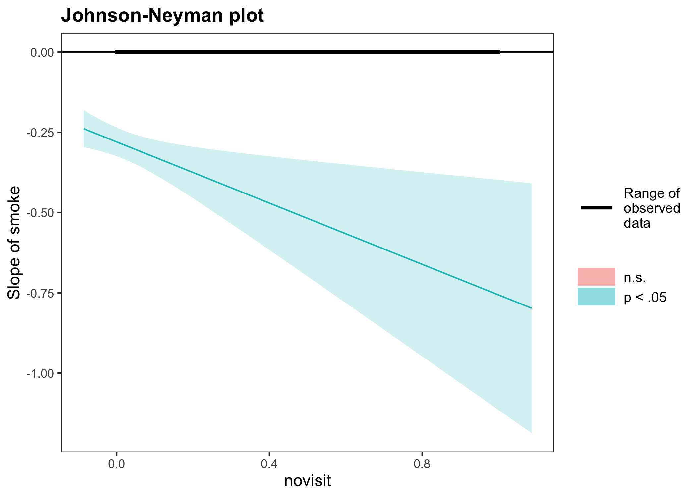
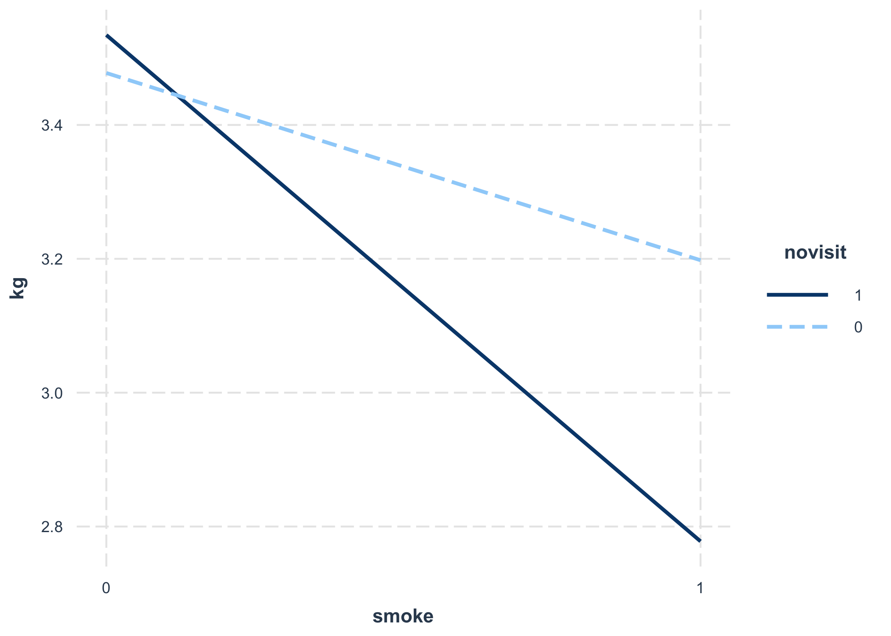
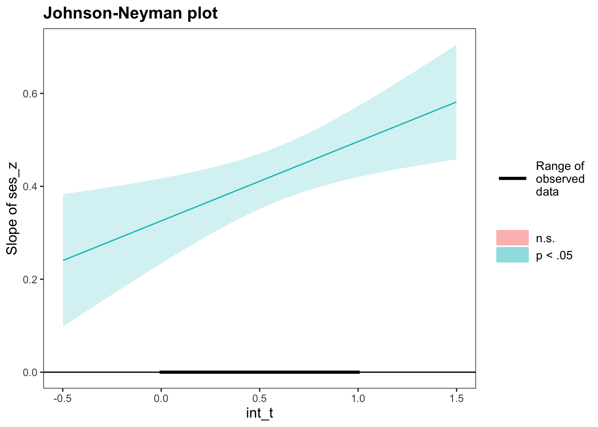
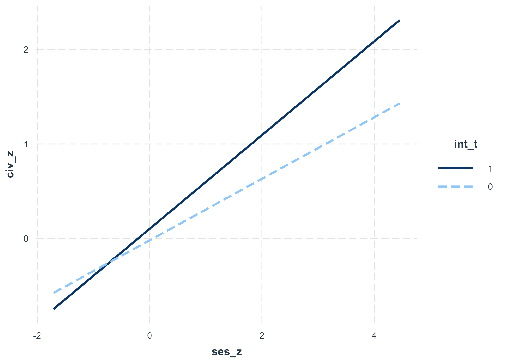
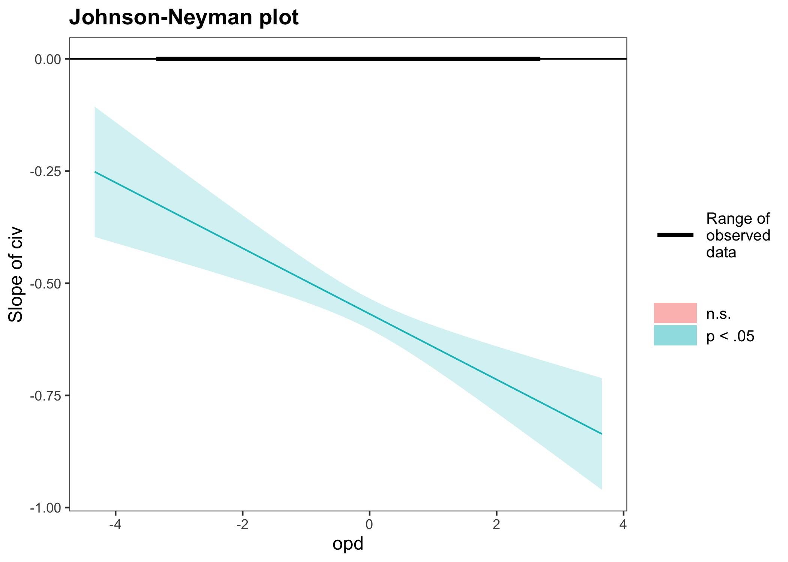
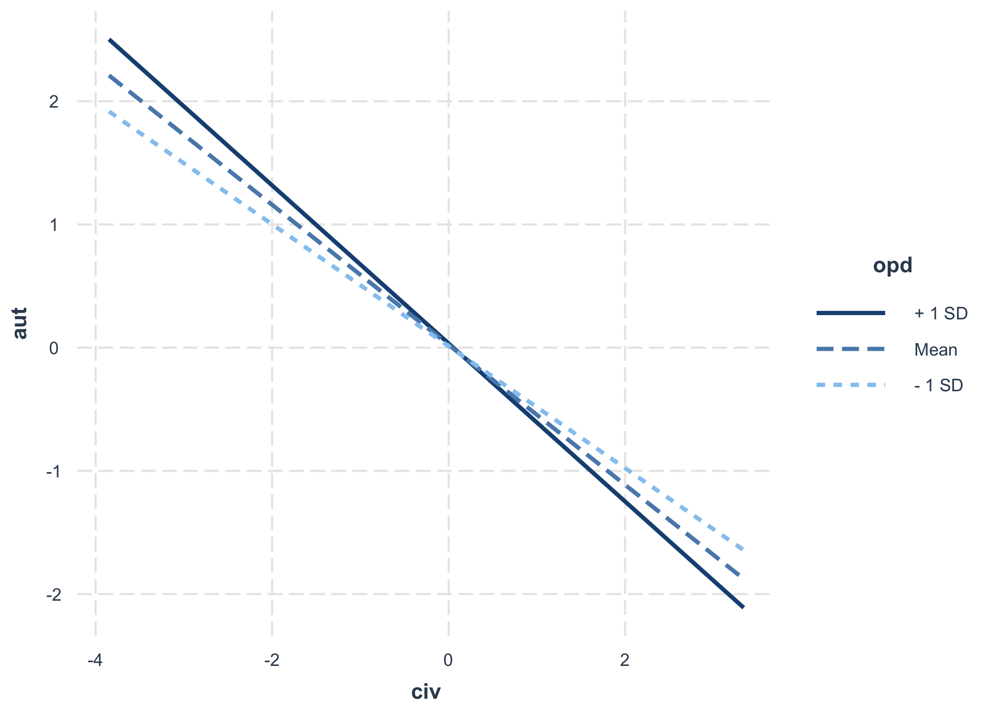

Modelos lineales
================

# Regresión

-   En el presente código se revisan diferentes casos de regresión.
    -   Interacción entre variables dicotómicas
    -   Interacción entre variable dicotómica y continua
    -   Interacción entre variables continuas
    -   Ejemplos de evaluación de varias hipótesis

# Caso 1: Interacción entre variables dicotómicas

``` r
# -----------------------------------------------------------------------------
# Abrevaya (2006)
# -----------------------------------------------------------------------------

#------------------------------------------------
# datos peso al nacer
#------------------------------------------------

data_birth <- psi2301::smoking

#------------------------------------------------
# data description
#------------------------------------------------


# ? psi2301::smoking


# Description:
# 
#      Estudio panel con el peso de recien nacidos, y antecedentes de las
#      madres, incluyendo edad al nacer, consumo de cigarrillos por parte
#      de la madre, educación de la madres, entre otros indicadores
#      (Abrevaya, 2006).
#  
# Details:
# 
#      Estos datos son empleados en Rabe-Hesketh & Skrondal (2012), y
#      contienen un 10 de los registros originales (una muestra al azar).
#      Son datos de 8604 nacidos, de 3978 madres.
# 
#      Listado de variables:
# 
#      momid: mother identifier
# 
#      birwt: birthweight (in grams)
# 
#      mage: mother’s age at the birth of the child (in years)
# 
#      smoke: dummy variable for mother smoking during pregnancy (1:
#      smoking; 0: not smoking)
# 
#      male: dummy variable for baby being male (1: male; 0: female)
# 
#      married: dummy variable for mother being married (1: married; 0:
#      unmarried)
# 
#      hsgrad: dummy variable for mother having graduated from high
#      school (1: graduated; 0: did not graduate)
# 
#      somecoll: dummy variable for mother having some college education,
#      but no degree (1: some college; 0: no college)
# 
#      collgrad: dummy variable for mother having graduated from college
#      (1: graduated; 0: did not graduate)
# 
#      black: dummy variable for mother being black (1: black; 0: white)
# 
#      kessner2: dummy variable for Kessner index = 2, or intermediate
#      prenatal care (1: index=2; 0: otherwise)
# 
#      kessner3: dummy variable for Kessner index = 3, or inadequate
#      prenatal care (1:index=3; 0: otherwise)
# 
#      novisit: dummy variable for no prenatal care visit (1: no visit;
#      0: at least 1 visit)
# 
#      pretri2: dummy variable for first prenatal care visit having
#      occurred in second trimester (1: yes; 0: no)
# 
#      pretri3: dummy variable for first prenatal care visit having
#      occurred in third trimester (1: yes; 0: no)
# 
#      Notes: Smoking status was determined from the answer to the
#      question asked on the birth certificate whether there was tobacco
#      use during pregnancy. The dummy variables for mother’s
#      education—hsgrad, somecoll, and collgrad—were derived from the
#      years of education given on the birth certificate. The Kessner
#      index is a measure of the adequacy of prenatal care (1: adequate;
#      2: intermediate; 3: inadequate) based on the timing of the first
#      prenatal visit and the number of prenatal visits, taking into
#      account the gestational age of the fetus.
# 
# Source:
# 
#      https://www.stata-press.com/data/mlmus3.html
# 
# References:
# 
#      Abrevaya, J. 2006. Estimating the effect of smoking on birth
#      outcomes using a matched panel data approach. Journal of Applied
#      Econometrics 21: 489–519.
# 
# Examples:
# 
#      data(smoking)
#      dplyr::glimpse((smoking)


#------------------------------------------------
# preparar datos
#------------------------------------------------

library(dplyr)
data_first <- psi2301::smoking %>%
              r4sda::remove_labels() %>%
              dplyr::filter(idx == 1) %>%
              mutate(kg = birwt/1000)

# Nota: seleccionamos los datos del primer nacido.
#       esto nos garantiza de que tengamos datos independientes.
#       De lo contrario, tendriamos nacidos que provienen de las mismas
#       madres.

#------------------------------------------------
# descriptivos
#------------------------------------------------

data_first %>%
dplyr::select(
    kg,        # peso al nacer en kilogramos
    mage,      # edad de la madre al nacimiento del recien nacido
    hsgrad,    # escolaridad: terminó educación formal
    somecoll,  # escolaridad: cuenta con algunos años de escolaridad terciaria
    collgrad,  # escolaridad: cuenta con estudios terciarios finalizados
    black,     # madre de color
    novisit,   # sin visita de control prenatal (1 = sin visitas, 0 = con visitas)
    smoke      # fuma
    ) %>%
r4sda:::get_desc() %>%
knitr::kable(., digits = 2)
```

| var      | missing | complete |    n |  mean |   sd |   min |   p25 | median |   p75 |   max |  skew |   kurt | hist     |
|:---------|--------:|---------:|-----:|------:|-----:|------:|------:|-------:|------:|------:|------:|-------:|:---------|
| kg       |       0 |        1 | 3978 |  3.44 | 0.51 |  0.94 |  3.12 |   3.43 |  3.76 |  5.24 | -0.24 |   3.98 | ▁▁▁▃▇▅▁▁ |
| mage     |       0 |        1 | 3978 | 27.36 | 5.31 | 14.00 | 23.00 |  28.00 | 31.00 | 43.00 | -0.01 |   2.34 | ▁▅▅▇▇▃▂▁ |
| hsgrad   |       0 |        1 | 3978 |  0.29 | 0.45 |  0.00 |  0.00 |   0.00 |  1.00 |  1.00 |  0.93 |   1.87 | ▇▁▁▁▁▁▁▃ |
| somecoll |       0 |        1 | 3978 |  0.24 | 0.42 |  0.00 |  0.00 |   0.00 |  0.00 |  1.00 |  1.25 |   2.56 | ▇▁▁▁▁▁▁▂ |
| collgrad |       0 |        1 | 3978 |  0.36 | 0.48 |  0.00 |  0.00 |   0.00 |  1.00 |  1.00 |  0.59 |   1.34 | ▇▁▁▁▁▁▁▅ |
| black    |       0 |        1 | 3978 |  0.07 | 0.26 |  0.00 |  0.00 |   0.00 |  0.00 |  1.00 |  3.33 |  12.08 | ▇▁▁▁▁▁▁▁ |
| novisit  |       0 |        1 | 3978 |  0.01 | 0.09 |  0.00 |  0.00 |   0.00 |  0.00 |  1.00 | 11.38 | 130.61 | ▇▁▁▁▁▁▁▁ |
| smoke    |       0 |        1 | 3978 |  0.14 | 0.35 |  0.00 |  0.00 |   0.00 |  0.00 |  1.00 |  2.06 |   5.26 | ▇▁▁▁▁▁▁▁ |

``` r
#------------------------------------------------
# preparar datos
#------------------------------------------------

library(dplyr)
data_first <- psi2301::smoking %>%
              r4sda::remove_labels() %>%
              dplyr::filter(idx == 1) %>%
              mutate(kg = birwt/1000) %>%
              mutate(mage_g = mean(mage, na.rm = TRUE)) %>%
              mutate(mage_m = mage - mage_g)
              


#------------------------------------------------
# descriptivos
#------------------------------------------------

data_first %>%
dplyr::select(
    kg,        # peso al nacer en kilogramos
    mage_m,    # edad de la madre al nacimiento 
               #      del recien nacido (centrada a la gran media)
    hsgrad,    # escolaridad: terminó educación formal
    somecoll,  # escolaridad: cuenta con algunos años de escolaridad terciaria
    collgrad,  # escolaridad: cuenta con estudios terciarios finalizados
    black,     # madre de color
    novisit,   # sin visita de control prenatal (1 = sin visitas, 0 = con visitas)
    smoke      # fuma
    ) %>%
r4sda:::get_desc() %>%
knitr::kable(., digits = 2)
```

| var      | missing | complete |    n | mean |   sd |    min |   p25 | median |  p75 |   max |  skew |   kurt | hist     |
|:---------|--------:|---------:|-----:|-----:|-----:|-------:|------:|-------:|-----:|------:|------:|-------:|:---------|
| kg       |       0 |        1 | 3978 | 3.44 | 0.51 |   0.94 |  3.12 |   3.43 | 3.76 |  5.24 | -0.24 |   3.98 | ▁▁▁▃▇▅▁▁ |
| mage\_m  |       0 |        1 | 3978 | 0.00 | 5.31 | -13.36 | -4.36 |   0.64 | 3.64 | 15.64 | -0.01 |   2.34 | ▁▅▅▇▇▃▂▁ |
| hsgrad   |       0 |        1 | 3978 | 0.29 | 0.45 |   0.00 |  0.00 |   0.00 | 1.00 |  1.00 |  0.93 |   1.87 | ▇▁▁▁▁▁▁▃ |
| somecoll |       0 |        1 | 3978 | 0.24 | 0.42 |   0.00 |  0.00 |   0.00 | 0.00 |  1.00 |  1.25 |   2.56 | ▇▁▁▁▁▁▁▂ |
| collgrad |       0 |        1 | 3978 | 0.36 | 0.48 |   0.00 |  0.00 |   0.00 | 1.00 |  1.00 |  0.59 |   1.34 | ▇▁▁▁▁▁▁▅ |
| black    |       0 |        1 | 3978 | 0.07 | 0.26 |   0.00 |  0.00 |   0.00 | 0.00 |  1.00 |  3.33 |  12.08 | ▇▁▁▁▁▁▁▁ |
| novisit  |       0 |        1 | 3978 | 0.01 | 0.09 |   0.00 |  0.00 |   0.00 | 0.00 |  1.00 | 11.38 | 130.61 | ▇▁▁▁▁▁▁▁ |
| smoke    |       0 |        1 | 3978 | 0.14 | 0.35 |   0.00 |  0.00 |   0.00 | 0.00 |  1.00 |  2.06 |   5.26 | ▇▁▁▁▁▁▁▁ |

``` r
# -----------------------------------------------
# regression in steps
# -----------------------------------------------

m00 <- as.formula('kg ~ 1')
m01 <- as.formula('kg ~ 1 + smoke')
m02 <- as.formula('kg ~ 1 + novisit')
m03 <- as.formula('kg ~ 1 + smoke + novisit')
m04 <- as.formula('kg ~ 1 + novisit*smoke')

f00 <- lm(m00, data = data_first)
f01 <- lm(m01, data = data_first)
f02 <- lm(m02, data = data_first)
f03 <- lm(m03, data = data_first)
f04 <- lm(m04, data = data_first)

texreg::screenreg(
    list(f00, f01, f02, f03, f04),
    star.symbol = "*", 
    center = TRUE, 
    doctype = FALSE,
    dcolumn = TRUE, 
    booktabs = TRUE,
    single.row = FALSE
    )
```

    ## 
    ## ==============================================================================
    ##                Model 1      Model 2      Model 3      Model 4      Model 5    
    ## ------------------------------------------------------------------------------
    ## (Intercept)       3.44 ***     3.48 ***     3.44 ***     3.48 ***     3.48 ***
    ##                  (0.01)       (0.01)       (0.01)       (0.01)       (0.01)   
    ## smoke                         -0.29 ***                 -0.29 ***    -0.28 ***
    ##                               (0.02)                    (0.02)       (0.02)   
    ## novisit                                    -0.23 *      -0.15         0.06    
    ##                                            (0.09)       (0.09)       (0.12)   
    ## novisit:smoke                                                        -0.48 ** 
    ##                                                                      (0.18)   
    ## ------------------------------------------------------------------------------
    ## R^2               0.00         0.04         0.00         0.04         0.04    
    ## Adj. R^2          0.00         0.04         0.00         0.04         0.04    
    ## Num. obs.      3978         3978         3978         3978         3978       
    ## ==============================================================================
    ## *** p < 0.001; ** p < 0.01; * p < 0.05

``` r
# -----------------------------------------------
# ANOVA para interaccion
# -----------------------------------------------

survey::regTermTest(f04,c('smoke:novisit'))
```

    ## Wald test for smoke:novisit
    ##  in lm(formula = m04, data = data_first)
    ## F =  6.696573  on  1  and  3974  df: p= 0.009695

``` r
# -----------------------------------------------
# ANOVA para comparar modelos
# -----------------------------------------------


anova(f03, f04)
```

    ## Analysis of Variance Table
    ## 
    ## Model 1: kg ~ 1 + smoke + novisit
    ## Model 2: kg ~ 1 + novisit * smoke
    ##   Res.Df    RSS Df Sum of Sq      F   Pr(>F)   
    ## 1   3975 979.73                                
    ## 2   3974 978.08  1    1.6482 6.6966 0.009695 **
    ## ---
    ## Signif. codes:  0 '***' 0.001 '**' 0.01 '*' 0.05 '.' 0.1 ' ' 1

``` r
# -----------------------------------------------
# summary traditional
# -----------------------------------------------

summary(f04)
```

    ## 
    ## Call:
    ## lm(formula = m04, data = data_first)
    ## 
    ## Residuals:
    ##      Min       1Q   Median       3Q      Max 
    ## -2.52762 -0.30262  0.00938  0.32138  1.79213 
    ## 
    ## Coefficients:
    ##                Estimate Std. Error t value Pr(>|t|)    
    ## (Intercept)    3.477620   0.008508 408.741   <2e-16 ***
    ## novisit        0.056733   0.120623   0.470   0.6381    
    ## smoke         -0.279750   0.022837 -12.250   <2e-16 ***
    ## novisit:smoke -0.476680   0.184205  -2.588   0.0097 ** 
    ## ---
    ## Signif. codes:  0 '***' 0.001 '**' 0.01 '*' 0.05 '.' 0.1 ' ' 1
    ## 
    ## Residual standard error: 0.4961 on 3974 degrees of freedom
    ## Multiple R-squared:  0.04188,    Adjusted R-squared:  0.04116 
    ## F-statistic:  57.9 on 3 and 3974 DF,  p-value: < 2.2e-16

``` r
# -----------------------------------------------
# summary with broom
# -----------------------------------------------

broom::glance(f03) %>%
knitr::kable(., digits = 2)
```

| r.squared | adj.r.squared | sigma | statistic | p.value |  df |   logLik |     AIC |     BIC | deviance | df.residual | nobs |
|----------:|--------------:|------:|----------:|--------:|----:|---------:|--------:|--------:|---------:|------------:|-----:|
|      0.04 |          0.04 |   0.5 |     83.39 |       0 |   2 | -2857.43 | 5722.86 | 5748.02 |   979.73 |        3975 | 3978 |

``` r
broom::glance(f04) %>%
knitr::kable(., digits = 2)
```

| r.squared | adj.r.squared | sigma | statistic | p.value |  df |   logLik |     AIC |     BIC | deviance | df.residual | nobs |
|----------:|--------------:|------:|----------:|--------:|----:|---------:|--------:|--------:|---------:|------------:|-----:|
|      0.04 |          0.04 |   0.5 |      57.9 |       0 |   3 | -2854.08 | 5718.16 | 5749.61 |   978.08 |        3974 | 3978 |

``` r
# -----------------------------------------------
# codigos para obtener interacciones
# -----------------------------------------------

# codigo 1
interaction_model <- lm(kg ~ smoke + novisit + novisit:smoke, 
    data = data_first)

summary(interaction_model)
```

    ## 
    ## Call:
    ## lm(formula = kg ~ smoke + novisit + novisit:smoke, data = data_first)
    ## 
    ## Residuals:
    ##      Min       1Q   Median       3Q      Max 
    ## -2.52762 -0.30262  0.00938  0.32138  1.79213 
    ## 
    ## Coefficients:
    ##                Estimate Std. Error t value Pr(>|t|)    
    ## (Intercept)    3.477620   0.008508 408.741   <2e-16 ***
    ## smoke         -0.279750   0.022837 -12.250   <2e-16 ***
    ## novisit        0.056733   0.120623   0.470   0.6381    
    ## smoke:novisit -0.476680   0.184205  -2.588   0.0097 ** 
    ## ---
    ## Signif. codes:  0 '***' 0.001 '**' 0.01 '*' 0.05 '.' 0.1 ' ' 1
    ## 
    ## Residual standard error: 0.4961 on 3974 degrees of freedom
    ## Multiple R-squared:  0.04188,    Adjusted R-squared:  0.04116 
    ## F-statistic:  57.9 on 3 and 3974 DF,  p-value: < 2.2e-16

``` r
# codigo 2
interaction_model <- lm(kg ~ smoke + novisit + novisit*smoke, 
    data = data_first)

summary(interaction_model)
```

    ## 
    ## Call:
    ## lm(formula = kg ~ smoke + novisit + novisit * smoke, data = data_first)
    ## 
    ## Residuals:
    ##      Min       1Q   Median       3Q      Max 
    ## -2.52762 -0.30262  0.00938  0.32138  1.79213 
    ## 
    ## Coefficients:
    ##                Estimate Std. Error t value Pr(>|t|)    
    ## (Intercept)    3.477620   0.008508 408.741   <2e-16 ***
    ## smoke         -0.279750   0.022837 -12.250   <2e-16 ***
    ## novisit        0.056733   0.120623   0.470   0.6381    
    ## smoke:novisit -0.476680   0.184205  -2.588   0.0097 ** 
    ## ---
    ## Signif. codes:  0 '***' 0.001 '**' 0.01 '*' 0.05 '.' 0.1 ' ' 1
    ## 
    ## Residual standard error: 0.4961 on 3974 degrees of freedom
    ## Multiple R-squared:  0.04188,    Adjusted R-squared:  0.04116 
    ## F-statistic:  57.9 on 3 and 3974 DF,  p-value: < 2.2e-16

``` r
# codigo 3
library(dplyr)
data_first <- psi2301::smoking %>%
              r4sda::remove_labels() %>%
              dplyr::filter(idx == 1) %>%
              mutate(kg = birwt/1000) %>%
              mutate(mage_g = mean(mage, na.rm = TRUE)) %>%
              mutate(mage_m = mage - mage_g) %>%
              mutate(int = smoke*novisit)
              

data_first %>%
dplyr::select(kg, smoke, novisit, int) %>%
dplyr::sample_n(50) %>%
knitr::kable()
```

|    kg | smoke | novisit | int |
|------:|------:|--------:|----:|
| 3.459 |     1 |       0 |   0 |
| 4.132 |     0 |       0 |   0 |
| 3.490 |     0 |       0 |   0 |
| 3.394 |     0 |       0 |   0 |
| 2.466 |     0 |       0 |   0 |
| 3.771 |     0 |       0 |   0 |
| 3.515 |     1 |       0 |   0 |
| 3.345 |     0 |       0 |   0 |
| 1.814 |     0 |       0 |   0 |
| 3.742 |     0 |       0 |   0 |
| 4.240 |     0 |       0 |   0 |
| 3.440 |     0 |       0 |   0 |
| 3.402 |     0 |       0 |   0 |
| 3.657 |     0 |       0 |   0 |
| 3.204 |     0 |       0 |   0 |
| 3.090 |     0 |       0 |   0 |
| 3.770 |     0 |       0 |   0 |
| 3.402 |     0 |       0 |   0 |
| 3.425 |     0 |       0 |   0 |
| 4.479 |     0 |       0 |   0 |
| 3.544 |     0 |       0 |   0 |
| 3.402 |     0 |       0 |   0 |
| 3.100 |     0 |       0 |   0 |
| 3.430 |     1 |       0 |   0 |
| 3.923 |     0 |       0 |   0 |
| 3.345 |     0 |       0 |   0 |
| 3.000 |     0 |       0 |   0 |
| 4.139 |     0 |       0 |   0 |
| 4.139 |     0 |       0 |   0 |
| 3.770 |     0 |       0 |   0 |
| 3.856 |     0 |       0 |   0 |
| 2.910 |     0 |       0 |   0 |
| 3.280 |     0 |       0 |   0 |
| 4.479 |     0 |       0 |   0 |
| 3.544 |     0 |       0 |   0 |
| 3.415 |     0 |       0 |   0 |
| 3.853 |     0 |       0 |   0 |
| 3.629 |     1 |       0 |   0 |
| 3.912 |     0 |       0 |   0 |
| 3.686 |     0 |       0 |   0 |
| 4.000 |     0 |       0 |   0 |
| 3.720 |     0 |       0 |   0 |
| 2.637 |     1 |       0 |   0 |
| 3.487 |     0 |       0 |   0 |
| 3.997 |     0 |       0 |   0 |
| 3.572 |     0 |       0 |   0 |
| 4.196 |     0 |       0 |   0 |
| 4.678 |     1 |       0 |   0 |
| 4.082 |     0 |       0 |   0 |
| 3.629 |     0 |       0 |   0 |

``` r
interaction_model <- lm(kg ~ smoke + novisit + int, 
    data = data_first)

summary(interaction_model)
```

    ## 
    ## Call:
    ## lm(formula = kg ~ smoke + novisit + int, data = data_first)
    ## 
    ## Residuals:
    ##      Min       1Q   Median       3Q      Max 
    ## -2.52762 -0.30262  0.00938  0.32138  1.79213 
    ## 
    ## Coefficients:
    ##              Estimate Std. Error t value Pr(>|t|)    
    ## (Intercept)  3.477620   0.008508 408.741   <2e-16 ***
    ## smoke       -0.279750   0.022837 -12.250   <2e-16 ***
    ## novisit      0.056733   0.120623   0.470   0.6381    
    ## int         -0.476680   0.184205  -2.588   0.0097 ** 
    ## ---
    ## Signif. codes:  0 '***' 0.001 '**' 0.01 '*' 0.05 '.' 0.1 ' ' 1
    ## 
    ## Residual standard error: 0.4961 on 3974 degrees of freedom
    ## Multiple R-squared:  0.04188,    Adjusted R-squared:  0.04116 
    ## F-statistic:  57.9 on 3 and 3974 DF,  p-value: < 2.2e-16

``` r
# -----------------------------------------------
# interaction visualization
# -----------------------------------------------

# codigo 1
interaction_model <- lm(kg ~ smoke + novisit + novisit:smoke, 
    data = data_first)

summary(interaction_model)
```

    ## 
    ## Call:
    ## lm(formula = kg ~ smoke + novisit + novisit:smoke, data = data_first)
    ## 
    ## Residuals:
    ##      Min       1Q   Median       3Q      Max 
    ## -2.52762 -0.30262  0.00938  0.32138  1.79213 
    ## 
    ## Coefficients:
    ##                Estimate Std. Error t value Pr(>|t|)    
    ## (Intercept)    3.477620   0.008508 408.741   <2e-16 ***
    ## smoke         -0.279750   0.022837 -12.250   <2e-16 ***
    ## novisit        0.056733   0.120623   0.470   0.6381    
    ## smoke:novisit -0.476680   0.184205  -2.588   0.0097 ** 
    ## ---
    ## Signif. codes:  0 '***' 0.001 '**' 0.01 '*' 0.05 '.' 0.1 ' ' 1
    ## 
    ## Residual standard error: 0.4961 on 3974 degrees of freedom
    ## Multiple R-squared:  0.04188,    Adjusted R-squared:  0.04116 
    ## F-statistic:  57.9 on 3 and 3974 DF,  p-value: < 2.2e-16

``` r
interactions::johnson_neyman(
    interaction_model, 
    pred = smoke, 
    modx = novisit
    )
```

    ## JOHNSON-NEYMAN INTERVAL 
    ## 
    ## When novisit is OUTSIDE the interval [-2.48, -0.32], the slope of smoke is
    ## p < .05.
    ## 
    ## Note: The range of observed values of novisit is [0.00, 1.00]

<!-- -->

``` r
interactions::probe_interaction(
    interaction_model, 
    pred = smoke, 
    modx = novisit
    )
```

    ## JOHNSON-NEYMAN INTERVAL 
    ## 
    ## When novisit is OUTSIDE the interval [-2.48, -0.32], the slope of smoke is
    ## p < .05.
    ## 
    ## Note: The range of observed values of novisit is [0.00, 1.00]
    ## 
    ## SIMPLE SLOPES ANALYSIS 
    ## 
    ## Slope of smoke when novisit = 0.00 (0): 
    ## 
    ##    Est.   S.E.   t val.      p
    ## ------- ------ -------- ------
    ##   -0.28   0.02   -12.25   0.00
    ## 
    ## Slope of smoke when novisit = 1.00 (1): 
    ## 
    ##    Est.   S.E.   t val.      p
    ## ------- ------ -------- ------
    ##   -0.76   0.18    -4.14   0.00

<!-- -->

``` r
# -----------------------------------------------
# ANOVA per term
# -----------------------------------------------

survey::regTermTest(f04,c('novisit','smoke'))
```

    ## Wald test for novisit smoke
    ##  in lm(formula = m04, data = data_first)
    ## F =  75.34579  on  2  and  3974  df: p= < 2.22e-16

``` r
survey::regTermTest(f04,c('novisit'))
```

    ## Wald test for novisit
    ##  in lm(formula = m04, data = data_first)
    ## F =  0.2212113  on  1  and  3974  df: p= 0.63814

``` r
survey::regTermTest(f04,c('smoke'))
```

    ## Wald test for smoke
    ##  in lm(formula = m04, data = data_first)
    ## F =  150.0635  on  1  and  3974  df: p= < 2.22e-16

``` r
survey::regTermTest(f04,c('smoke:novisit'))
```

    ## Wald test for smoke:novisit
    ##  in lm(formula = m04, data = data_first)
    ## F =  6.696573  on  1  and  3974  df: p= 0.009695

# Caso 2: interaccion dicotómica y continua

``` r
# -----------------------------------------------------------------------------
# ICCS 2009 random sample of 500 cases
# -----------------------------------------------------------------------------

# -----------------------------------------------
# countries
# -----------------------------------------------

psi2301::iccs_09_lat %>%
dplyr::count(COUNTRY)
```

    ## # A tibble: 6 x 2
    ##   COUNTRY     n
    ##   <chr>   <int>
    ## 1 CHL      5192
    ## 2 COL      6204
    ## 3 DOM      4589
    ## 4 GTM      4002
    ## 5 MEX      6576
    ## 6 PRY      3399

``` r
# -----------------------------------------------
# data
# -----------------------------------------------

#
# ? psi2301::iccs_09_lat
# 
# 
# ICCS 2009 lat
# 
# Description:
# 
#      Datos del Estudio Internacional sobre Educación Cívica y Ciudadana
#      (ICCS). Esta tabla de datos, incluye las observaciones del módulo
#      latino americano. Estos datos inlcuyen muestras representativas de
#      estudiantes de octavo grado, de Chile, Colombia, México, República
#      Dominicana, Guatemala, Mexico y Paraguay
# 
# Usage:
# 
#      data(iccs_09_lat)
#      
# Format:
# 
#      Objeto clase ‘"cross"’; ver ‘read.cross’.
# 
# Source:
# 
#      IEA, <https://www.iea.nl/index.php/data-tools/repository/iccs>
# 
# References:
# 
#      Schulz, W., Ainley, J., & Fraillon, J. (2011). ICCS 2009 Technical
#      Report (W. Schulz, J. Ainley, & J. Fraillon (eds.)). International
#      Association for the Evaluation of Educational Achievement (IEA).
#      http://www.iea.nl/fileadmin/user_upload/Publications/Electronic_versions/ICCS_2009_Technical_Report.pdf
#  
#  Examples:
#  
#       data(iccs_09_lat)
#       dplyr::glimpse(iccs_09_lat)
#  

# -----------------------------------------------
# moderator
# -----------------------------------------------


psi2301::iccs_09_lat %>%
dplyr::count(PARINT)
```

    ## # A tibble: 5 x 2
    ##   PARINT         n
    ##   <labelled> <int>
    ## 1  0          1700
    ## 2  1         12635
    ## 3  2          7055
    ## 4  3          7664
    ## 5 NA           908

``` r
# -----------------------------------------------
# selected variables
# -----------------------------------------------

psi2301::iccs_09_lat %>%
dplyr::select(PV1CIV, NISB, PARINT) %>%
r4sda::get_desc() %>%
knitr::kable(., digits = 2)
```

| var    | missing | complete |     n |   mean |    sd |   min |    p25 | median |    p75 |    max | skew | kurt | hist     |
|:-------|--------:|---------:|------:|-------:|------:|------:|-------:|-------:|-------:|-------:|-----:|-----:|:---------|
| PV1CIV |    0.00 |     1.00 | 29962 | 446.81 | 88.30 | 91.02 | 383.34 | 443.27 | 508.47 | 790.27 | 0.15 | 2.71 | ▁▁▃▇▇▃▁▁ |
| NISB   |    0.00 |     1.00 | 29962 |   0.06 |  1.00 | -3.06 |  -0.64 |  -0.07 |   0.71 |   4.73 | 0.57 | 3.35 | ▁▂▇▇▃▁▁▁ |
| PARINT |    0.03 |     0.97 | 29962 |   1.71 |  0.92 |  0.00 |   1.00 |   2.00 |   3.00 |   3.00 | 0.15 | 1.86 | ▁▁▇▁▁▅▁▅ |

``` r
# -----------------------------------------------
# centering variables
# -----------------------------------------------

set.seed(12345)
data_par <- psi2301::iccs_09_lat %>%
            dplyr::filter(COUNTRY == 'PRY') %>%
            # autoritarismo en bruto
            mutate(aut_u = AUTGOV) %>%
            # diferentes variables estandarizadas
            mutate(aut_z = r4sda::z_score(aut_u)) %>%
            mutate(ses_z = r4sda::z_score(NISB)) %>%
            mutate(int_z = r4sda::z_score(INTPOLS)) %>%
            mutate(eff_z = r4sda::z_score(CITEFF)) %>%
            # puntajes de conocimiento civico
            mutate(civ_u = PV1CIV) %>%
            mutate(civ_z = r4sda::z_score(civ_u)) %>%
            mutate(civ_c = r4sda::c_mean(civ_z, id_j)) %>%
            mutate(civ_g = r4sda::c_mean(civ_z, id_k)) %>%
            mutate(civ_m = civ_z - civ_g) %>%
            mutate(civ_w = civ_z - civ_c) %>%
            mutate(civ_b = civ_c - civ_g) %>%
            # puntajes de apertura a la discusion
            mutate(opd_z = r4sda::z_score(OPDISC)) %>%
            mutate(opd_c = r4sda::c_mean(opd_z, id_j)) %>%
            mutate(opd_g = r4sda::c_mean(opd_z, id_k)) %>%
            mutate(opd_m = opd_z - opd_g) %>%
            mutate(opd_w = opd_z - opd_c) %>%
            mutate(opd_b = opd_c - opd_g) %>%
            # educación de los padres
            mutate(edu_t = case_when(
                 HISCED == 5 ~ 1,
                 HISCED == 4 ~ 0,
                 HISCED == 3 ~ 0,  
                 HISCED == 2 ~ 0,
                 HISCED == 1 ~ 0,
                 HISCED == 0 ~ 0)) %>%
            # expectativas educativas de los estudiantes
            mutate(exe_t = case_when(
                 SISCED == 4 ~ 1,
                 SISCED == 3 ~ 0,  
                 SISCED == 2 ~ 0,
                 SISCED == 1 ~ 0,
                 SISCED == 0 ~ 0)) %>%    
            # interes politico de los padres
            mutate(int_t = case_when(
                 PARINT == 3 ~ 1,  
                 PARINT == 2 ~ 1,
                 PARINT == 1 ~ 0,
                 PARINT == 0 ~ 0)) %>%                             
            mutate(int_s = ses_z*int_t) %>%
            # random selection
            dplyr::sample_n(1000, weights = ws) %>%
            dplyr::glimpse()
```

    ## Rows: 1,000
    ## Columns: 575
    ## $ IDCNTRY  <dbl> 600, 600, 600, 600, 600, 600, 600, 600, 600, 600, 600, 600, 6…
    ## $ COUNTRY  <chr> "PRY", "PRY", "PRY", "PRY", "PRY", "PRY", "PRY", "PRY", "PRY"…
    ## $ IDSTUD   <dbl> 10830141, 10020301, 10220107, 10220117, 10400209, 11040110, 1…
    ## $ IDCLASS  <labelled> 108301, 100203, 102201, 102201, 104002, 110401, 102501, …
    ## $ IDSCHOOL <labelled> 1083, 1002, 1022, 1022, 1040, 1104, 1025, 1017, 1100, 10…
    ## $ IS2G03   <labelled> 1, 1, 1, 3, 1, 1, 1, 1, 1, 1, 3, 3, 1, 3, 1, 1, 3, 2, 1,…
    ## $ IS2G04A  <labelled> 1, 1, 1, 1, 1, 1, 1, 1, 1, 1, 1, 1, 1, 1, 1, 1, 1, 1, 1,…
    ## $ IS2G04B  <labelled> 1, 1, 1, 1, 1, 0, 1, 1, 1, 1, 1, 1, 1, 1, 1, 1, 1, 0, 1,…
    ## $ IS2G04C  <labelled> 1, 1, 1, 1, 1, 1, 1, 1, 1, 1, 1, 1, 1, 1, 1, 1, 1, 0, 1,…
    ## $ IS2G05   <labelled> 1, 1, 0, 0, 1, 1, 1, 1, 0, 1, 1, 0, 1, 1, 1, 1, 0, 0, 1,…
    ## $ IS2G07   <labelled> 5, 2, 1, 3, 1, 5, 1, 4, 6, 3, 5, 5, 4, 5, 2, 4, 5, 5, 5,…
    ## $ IS2G09   <labelled> 4, 1, 1, 6, 5, 3, 2, 3, 6, 3, 6, 5, 3, 1, 2, 4, 5, 5, 1,…
    ## $ IS2G10A  <labelled> 3, NA, 1, 2, 3, 2, 1, 3, 4, 1, 3, 4, NA, 3, 3, 2, 3, 3, …
    ## $ IS2G10B  <labelled> 3, NA, 1, 2, 1, 3, 1, 3, 4, 1, 3, 3, NA, 3, 3, 2, 3, 3, …
    ## $ IS2G11   <labelled> 2, 4, NA, 1, 3, 2, 3, 2, 2, 4, 2, 1, 3, 1, 4, 2, 2, 1, 3…
    ## $ IS2G11A  <labelled> 1, 1, 1, 1, 2, 2, 1, 1, 1, 2, 1, 1, 1, 1, 2, 1, 1, 1, 1,…
    ## $ IS2G11B  <labelled> 2, 2, 2, 2, 1, 2, 2, 2, 2, 2, 2, 2, 2, 2, 2, 2, 2, 2, 2,…
    ## $ IS2G11C  <labelled> 1, 2, 2, 1, 2, 2, 2, 2, 1, 1, 1, 1, 2, 2, 2, 1, 1, 1, 1,…
    ## $ IS2G11D  <labelled> 2, 2, 2, 2, 1, 2, 2, 2, 2, 2, 2, 2, 2, 1, 2, 2, 2, 2, 2,…
    ## $ IS2G11E  <labelled> 1, 1, 2, 2, 2, 2, 1, 1, 1, 1, 1, NA, 2, 1, 2, 1, 1, 1, 1…
    ## $ IS2G11F  <labelled> 2, 2, 2, 2, 2, 1, 1, 2, 1, 2, 1, 2, 2, 2, 2, 2, 2, 2, 2,…
    ## $ IS2G11G  <labelled> 2, 2, 2, 1, 1, 2, 2, 2, 2, 2, 1, 2, 2, 2, 1, 2, 2, 2, 2,…
    ## $ IS2G12A  <labelled> 5, 3, NA, 4, 4, 3, 3, 3, 1, 5, 2, 2, 3, 2, 2, 3, 2, 2, 5…
    ## $ IS2G12B  <labelled> 4, 4, 1, 5, 2, 4, 4, 4, 3, 4, 4, 5, 4, 4, 4, 3, 5, 4, 5,…
    ## $ IS2G12C  <labelled> NA, 5, NA, 1, 2, 3, 1, 1, NA, 3, 2, 1, 3, 1, 4, 4, 3, 3,…
    ## $ IS2G12D  <labelled> NA, 3, NA, 5, 1, 3, 4, 2, 2, 2, 2, 2, 4, 3, 2, 3, 4, 1, …
    ## $ IS2G12E  <labelled> 5, 5, NA, 1, 4, 5, 1, 2, 1, 5, 4, 1, 5, 2, 4, 5, 3, 3, 3…
    ## $ IS2G12F  <labelled> 5, 5, NA, 1, 5, 4, 1, 4, 2, 4, 3, 3, 4, 2, 5, 5, 5, 4, 4…
    ## $ IS2G13A  <labelled> 1, 1, NA, 1, 1, 1, 4, 1, 3, 3, 1, 1, 3, 2, 1, 4, 3, 2, 4…
    ## $ IS2G13B  <labelled> 1, 3, NA, 4, 3, 4, 4, 4, 1, 4, 4, 3, 3, 4, 1, 4, 3, 4, 4…
    ## $ IS2G13C  <labelled> 2, 1, 1, 3, 3, 2, 4, 4, 3, 2, 4, 1, 3, 3, 3, 3, 3, 2, 3,…
    ## $ IS2G13D  <labelled> 2, 1, NA, 1, 1, 1, 3, 1, NA, 1, 3, 4, 1, 1, 1, 4, 1, 2, …
    ## $ IS2G13E  <labelled> 2, 1, NA, 1, 2, 1, 1, 3, 3, 2, 4, 1, 1, 1, 1, 4, 2, 3, 2…
    ## $ IS2G13F  <labelled> 1, 4, NA, 4, 2, 1, 4, 2, 1, 3, 4, 2, 4, 3, 2, 4, 2, 2, 4…
    ## $ IS2G13G  <labelled> 1, 1, NA, 4, 2, 2, 3, 1, 1, 3, 3, 1, 3, 1, 1, 4, 3, 2, 3…
    ## $ IS2G13H  <labelled> 3, 1, NA, 1, 1, 1, 1, 1, 2, 2, 2, 1, 3, 1, 3, 3, 3, 3, 3…
    ## $ IS2P14A  <labelled> 3, 3, NA, 3, 3, 3, 3, 3, 1, 3, 3, 3, 3, 3, 3, 3, 3, 3, 2…
    ## $ IS2P14B  <labelled> 3, 3, NA, 3, 3, 3, 3, 3, 1, 1, 1, 2, 3, 2, 3, 2, 1, 2, 1…
    ## $ IS2P14C  <labelled> 3, 3, NA, 3, 3, 3, 3, 3, 2, 2, 1, 1, 3, 3, 2, 3, 1, 2, 3…
    ## $ IS2P14D  <labelled> 3, 1, 1, 3, 3, 2, 2, 2, 3, 1, 2, NA, 2, 1, 2, 1, 2, 2, 1…
    ## $ IS2P14E  <labelled> 3, 1, NA, 3, 3, 2, 2, 3, 1, 1, 3, 3, 2, 1, 3, 2, 2, 3, 2…
    ## $ IS2P14F  <labelled> 3, 3, NA, 3, 3, 3, 3, 3, 2, 3, 3, 3, 3, 3, 3, 2, 1, NA, …
    ## $ IS2P14G  <labelled> 3, 3, NA, 3, 3, 3, 2, 3, 1, 1, 1, 3, 1, 3, 1, 2, 1, 2, 1…
    ## $ IS2P14H  <labelled> 3, 3, NA, 2, 2, 3, 3, 3, 1, 1, 1, 3, 3, 3, 1, 1, 1, 2, 1…
    ## $ IS2G15A  <labelled> 1, 3, NA, 3, 2, 3, 2, 1, 1, 3, 1, 3, 1, 1, 2, 2, 1, 2, 1…
    ## $ IS2G15B  <labelled> 3, 3, 1, 3, 3, 3, 2, 3, 3, 1, 2, 3, 1, 2, 2, 1, 2, 3, 1,…
    ## $ IS2G15C  <labelled> 1, 1, NA, 3, 2, 1, 1, 1, 3, 1, 1, 3, 1, 1, 1, 1, 1, 1, 1…
    ## $ IS2G15D  <labelled> 3, 1, NA, 3, 2, 3, 1, 1, 3, 1, 3, 1, 2, 1, 1, 2, 1, 2, 3…
    ## $ IS2G15E  <labelled> 1, 3, NA, 3, 3, 2, 1, 3, 3, 1, 2, 2, 3, 3, 2, 3, 2, 3, 1…
    ## $ IS2G15F  <labelled> 3, 3, NA, 3, 3, 3, 1, 1, 2, 1, 1, NA, 3, 1, 1, 1, 1, 2, …
    ## $ IS2G16A  <labelled> 3, 4, NA, 3, 2, 3, 3, 1, 3, 4, 2, 1, 3, 3, 4, 3, 2, 3, 3…
    ## $ IS2G16B  <labelled> 2, 1, 1, 2, 2, 4, 2, 2, 2, 4, 4, 3, 3, 3, 3, 3, 4, 4, 4,…
    ## $ IS2G16C  <labelled> 3, 4, NA, 3, 3, NA, 1, 3, 3, 4, 2, 4, 4, 4, 3, 2, 4, 4, …
    ## $ IS2G16D  <labelled> 4, 1, NA, 3, 1, 2, 1, 1, 2, 2, 1, 1, 1, 3, 2, 3, 3, 3, 3…
    ## $ IS2G16E  <labelled> 4, 4, NA, 2, 4, 3, 2, 1, 3, 3, 3, 2, 4, 3, 2, 2, 4, 2, 4…
    ## $ IS2G16F  <labelled> 3, 3, NA, 3, 1, 3, 3, 1, 1, 4, 2, 2, 3, 4, 1, 3, 1, 2, 4…
    ## $ IS2G16G  <labelled> 2, 1, NA, 2, 4, 4, 3, 1, 3, 4, 3, 2, 3, 4, 3, 3, 4, 3, 3…
    ## $ IS2G17A  <labelled> 2, 3, NA, 1, 1, 3, 4, 4, 1, 2, 2, 3, 2, 1, 2, 3, 2, 1, 4…
    ## $ IS2G17B  <labelled> 3, 4, 1, 1, 2, 2, 2, 1, 1, 2, 1, NA, 2, 1, 3, 3, 1, 1, 3…
    ## $ IS2G17C  <labelled> 2, 1, NA, 3, 3, 3, 1, 3, 1, 1, 1, 2, 2, 2, 2, 2, 2, 2, 1…
    ## $ IS2G17D  <labelled> 3, 1, NA, 2, 2, 2, 1, 1, 4, 1, 3, 4, 1, 1, 2, 3, 1, 2, 3…
    ## $ IS2G17E  <labelled> 4, 1, NA, 1, 3, 1, 1, 1, 1, 2, 1, 1, 3, 1, 2, 1, 1, 2, 3…
    ## $ IS2G17F  <labelled> 1, 1, NA, 1, 1, 1, 1, 1, 4, 3, 4, 3, 2, 1, 1, 1, 1, 1, 3…
    ## $ IS2G17G  <labelled> 3, 4, NA, 3, 4, 2, 1, 4, 3, 1, 3, 3, 3, 2, 3, 2, 2, 3, 2…
    ## $ IS2G18A  <labelled> 1, 2, NA, 1, 1, 2, 2, 2, 1, 1, 1, 1, 2, 2, 2, 1, 1, 2, 1…
    ## $ IS2G18B  <labelled> 1, 2, NA, 1, 3, 2, 3, 1, 2, 2, 4, 2, 2, 2, 2, 2, 1, 2, 1…
    ## $ IS2G18C  <labelled> 2, 2, 1, 1, 2, 1, 2, 1, NA, 1, 2, NA, 2, 1, 2, NA, 2, 2,…
    ## $ IS2G18D  <labelled> 4, 4, NA, 4, 4, 4, 1, 4, 2, 4, 3, 3, 4, 4, 3, 4, 4, 1, 4…
    ## $ IS2G18E  <labelled> 1, 3, NA, 1, 2, 2, 1, 2, 1, 1, 2, 2, 1, 2, 4, 2, 1, 2, 1…
    ## $ IS2G18F  <labelled> 3, 3, NA, 1, 1, 2, 2, 1, 1, 1, 1, 2, 2, 1, 2, 2, 1, 2, 1…
    ## $ IS2G18G  <labelled> 2, 4, NA, 2, 4, 3, 3, 2, 2, 4, 4, 4, 3, 4, 3, 3, 1, 1, 4…
    ## $ IS2P19A  <labelled> 2, 3, NA, 4, 2, 1, 2, 2, 2, 2, 3, 2, 1, 1, 2, 2, 2, 2, 1…
    ## $ IS2P19B  <labelled> 2, 1, 1, 1, 2, 1, 1, 2, 1, 1, 2, 1, 2, 1, 1, 2, 1, 2, 1,…
    ## $ IS2P19C  <labelled> 2, 1, NA, 1, 4, 2, 1, 2, 2, 1, 1, 3, 2, 1, 2, 2, 2, 2, 1…
    ## $ IS2P19D  <labelled> 1, 1, NA, 1, 2, 2, 1, 2, 2, 1, 1, 4, 2, 2, 2, 1, 2, 2, 2…
    ## $ IS2P19E  <labelled> 2, 1, NA, 1, 1, 2, 1, 2, 2, 1, 1, 1, 2, 1, 2, 1, 1, 2, 1…
    ## $ IS2P20A  <labelled> 1, 1, NA, 1, 1, 1, 1, 1, 1, 1, 2, 2, 2, 1, 1, 2, 1, 2, 1…
    ## $ IS2P20B  <labelled> 3, 1, NA, 4, 3, 3, 1, 2, 1, 1, 3, 3, 2, 3, 2, 2, 3, 2, 2…
    ## $ IS2P20C  <labelled> 3, 1, 1, 3, 4, 2, 1, 2, NA, 1, 3, 4, 2, 2, 2, 1, 3, 3, 1…
    ## $ IS2P20D  <labelled> 2, 1, NA, 1, 4, 4, 1, 2, NA, 1, 3, 1, 3, 4, 3, 4, 3, 3, …
    ## $ IS2P20E  <labelled> 1, 1, NA, 1, 1, 1, 1, 2, NA, 1, 1, 1, 1, 1, 2, 1, 1, 2, …
    ## $ IS2P20F  <labelled> 2, 1, NA, 3, 1, 2, 1, 1, NA, 1, 2, 1, 2, 2, 2, 1, 1, 2, …
    ## $ IS2P20G  <labelled> 2, 3, NA, 4, 2, 1, 1, 2, NA, 2, 2, 2, 3, 2, 2, 3, 1, 2, …
    ## $ IS2P20H  <labelled> 1, 1, 1, 3, 1, 1, 1, 1, NA, 1, 2, 1, 1, 1, 1, 1, 3, 2, 1…
    ## $ IS2P20I  <labelled> 1, 1, NA, 1, 1, 2, 1, 1, NA, 1, 3, 3, 2, 1, 1, 2, 1, 3, …
    ## $ IS2P20J  <labelled> 3, 1, NA, 1, 2, NA, 1, 1, NA, 1, 2, NA, 1, 1, 3, 1, 1, 2…
    ## $ IS2P20K  <labelled> 4, 1, NA, 4, 2, 1, 1, 1, NA, 2, 4, 4, 2, 3, 3, 1, 3, 2, …
    ## $ IS2P20L  <labelled> 1, 1, NA, 2, 2, 2, 1, 2, NA, 2, 3, 2, 3, 1, 3, 2, 1, 2, …
    ## $ IS2P21A  <labelled> 1, 1, NA, 3, 4, 1, 1, 3, NA, 1, 3, 4, 2, 3, 1, 1, 1, 1, …
    ## $ IS2P21B  <labelled> 1, 3, NA, 3, 4, 2, 1, 3, NA, 2, 1, 1, 4, 3, 3, 3, 2, 1, …
    ## $ IS2P21C  <labelled> 2, 2, 1, 2, 2, 2, 1, 1, NA, 1, 1, 3, 1, 1, 2, 1, 1, 1, 1…
    ## $ IS2P21D  <labelled> 2, 3, NA, 3, 2, 1, 1, 1, NA, 2, 2, 3, 3, 3, 3, 2, 3, 1, …
    ## $ IS2P21E  <labelled> 2, 2, NA, 3, 2, 2, 1, 1, NA, 2, 2, 2, 1, 1, 1, 2, 1, 1, …
    ## $ IS2P21F  <labelled> 3, 4, NA, 3, 3, 3, 1, 3, NA, 3, 3, NA, 3, 3, 4, 1, 3, 1,…
    ## $ IS2P21G  <labelled> 3, 4, NA, 3, 1, 1, 3, 1, NA, 2, 1, 2, 2, 4, 3, 2, NA, 1,…
    ## $ IS2P21H  <labelled> 1, 2, NA, 2, 2, 1, 3, 1, NA, 2, 2, 2, 1, 2, 1, 1, 1, 1, …
    ## $ IS2P21I  <labelled> 1, 1, NA, 2, 3, 1, 1, 1, NA, 1, 3, 2, 2, 1, 1, 1, 1, 1, …
    ## $ IS2P21J  <labelled> 1, 2, NA, 4, 1, 1, 1, 1, NA, 1, 2, 2, 1, 2, 2, 1, 2, 1, …
    ## $ IS2P21K  <labelled> 1, 2, NA, 2, 3, 3, 2, 1, NA, 2, 2, 3, 2, 2, 3, 1, 2, 1, …
    ## $ IS2P21L  <labelled> 2, 2, NA, 2, 1, 2, 3, 1, NA, 1, 1, 2, 2, 1, 3, 1, 2, 1, …
    ## $ IS2P22A  <labelled> 3, 3, NA, 3, 3, 3, 2, 4, NA, 2, 1, 3, 3, 3, 4, 3, 4, 1, …
    ## $ IS2P22B  <labelled> 2, 3, NA, 3, 3, 2, 1, 4, NA, 2, 2, 1, 2, 1, 3, 2, 3, 1, …
    ## $ IS2P22C  <labelled> 2, 2, NA, 3, 3, 2, 1, 4, NA, 1, 1, 2, 2, 3, 3, 2, 3, 1, …
    ## $ IS2P22D  <labelled> 2, 4, NA, 3, 4, 3, 1, 3, NA, 2, 3, 4, 3, 3, 4, 2, 4, 3, …
    ## $ IS2P22E  <labelled> 2, 4, NA, 3, 4, 1, 1, 3, NA, 2, 1, 3, 3, 3, 4, 2, 3, 1, …
    ## $ IS2P22F  <labelled> 1, 3, 1, 4, 3, 1, 1, 1, NA, 1, 2, 3, 2, 3, 3, 1, 1, 1, 1…
    ## $ IS2P22G  <labelled> NA, NA, NA, NA, NA, NA, NA, NA, NA, NA, NA, NA, NA, NA, …
    ## $ IS2P23A  <labelled> 3, 4, NA, 3, 4, 3, 2, 4, NA, 4, 4, 3, 3, 3, 3, 2, 3, 2, …
    ## $ IS2P23B  <labelled> 2, 4, NA, NA, 4, 3, 2, 4, NA, 2, 2, 2, 3, 2, 2, 1, 2, 3,…
    ## $ IS2P23C  <labelled> 3, 2, NA, 3, 4, 4, 2, 4, NA, 2, 3, 1, 3, 2, 3, 2, 1, 3, …
    ## $ IS2P23D  <labelled> 2, 3, NA, 2, 3, 4, 1, 4, NA, 2, 2, 4, 3, 1, 3, 1, 2, 2, …
    ## $ IS2P23E  <labelled> 3, 4, NA, NA, 4, 2, 1, 4, NA, 2, 1, 3, 2, 1, 2, 1, 2, 2,…
    ## $ IS2P23F  <labelled> 3, 3, NA, 2, 4, 2, 1, 4, NA, 2, 2, 3, 2, 2, 3, 1, 2, 2, …
    ## $ IS2P24A  <labelled> NA, 1, NA, 4, 1, 1, 1, 2, NA, 1, 2, 3, 2, 1, 2, 1, 1, 2,…
    ## $ IS2P24B  <labelled> NA, 1, NA, 1, 1, 2, 1, 2, NA, 1, 3, 4, 2, 1, 2, 2, 1, 2,…
    ## $ IS2P24C  <labelled> NA, 4, NA, NA, 4, 3, 4, 2, NA, 4, 3, 3, 4, 4, 3, 4, 3, 3…
    ## $ IS2P24D  <labelled> NA, 4, NA, 3, 1, 2, 4, 1, NA, 4, 2, 1, 3, 4, 3, 4, 3, 3,…
    ## $ IS2P24E  <labelled> NA, 1, NA, 2, 1, 1, 1, 1, NA, 1, 2, 1, 2, 1, 2, 1, 1, 2,…
    ## $ IS2P24F  <labelled> NA, 3, NA, 3, 3, 3, 4, 2, NA, 4, 3, 2, 3, 4, 3, 4, 3, 2,…
    ## $ IS2P24G  <labelled> NA, 3, NA, 3, 1, 1, 1, 1, NA, 1, 1, 2, 1, 1, 2, 1, 1, 2,…
    ## $ IS2P25A  <labelled> 1, 1, NA, 4, 1, 1, 1, 1, NA, 2, 3, 2, 2, 1, 1, 1, 1, 2, …
    ## $ IS2P25B  <labelled> 1, 1, 1, 2, 2, 2, 1, 2, NA, 2, 1, 3, 2, 1, 1, 1, 1, 2, 1…
    ## $ IS2P25C  <labelled> 1, 3, NA, 4, 1, 2, 1, 2, NA, 2, 2, 1, 1, 2, 2, 1, 1, 2, …
    ## $ IS2P25D  <labelled> 3, 3, NA, 1, 3, 3, 1, 3, NA, 2, 3, 4, 2, 2, 3, 3, 2, 2, …
    ## $ IS2P25E  <labelled> 2, 1, NA, 3, 2, 3, 1, 2, NA, 2, 2, 1, 3, 1, 2, 2, 1, 2, …
    ## $ IS2P26A  <labelled> 1, 2, NA, NA, 2, 1, 1, 2, NA, 2, 3, 4, 2, 2, 2, 1, 1, 2,…
    ## $ IS2P26B  <labelled> 1, 1, 1, NA, 2, 1, 1, 2, NA, 1, 3, NA, 1, 1, 2, 1, 1, 2,…
    ## $ IS2P26C  <labelled> 2, 3, 2, NA, 2, 1, 1, 2, NA, 3, 3, NA, 2, 2, 2, 3, 1, 2,…
    ## $ IS2P26D  <labelled> 2, 2, NA, NA, 1, 2, 2, 2, NA, 2, 2, 2, 2, 2, 3, 1, 1, 2,…
    ## $ IS2P26E  <labelled> 2, 1, NA, NA, 1, 1, 1, 2, NA, 3, 2, 1, 2, 1, 2, 2, 1, 2,…
    ## $ IS2P26F  <labelled> 1, 2, NA, NA, 3, 2, 2, 2, NA, 2, 3, 2, 3, 2, 3, 4, 3, 2,…
    ## $ IS2P27A  <labelled> 1, 3, 1, 1, 3, 2, 3, 3, NA, 3, 1, 1, 2, 1, 3, 2, 1, 2, 2…
    ## $ IS2P27B  <labelled> 1, 3, 2, 2, 3, 1, 3, 3, NA, 2, 1, 3, 3, 2, 3, 2, 3, 2, 2…
    ## $ IS2P27C  <labelled> 3, 3, NA, NA, 2, 2, 3, 3, NA, 2, 1, 2, 2, 3, 3, 3, 1, 2,…
    ## $ IS2P27D  <labelled> 3, 3, NA, 3, 3, 3, 3, 3, NA, 3, 2, 4, 4, 3, 3, 3, 2, 2, …
    ## $ IS2P27E  <labelled> 3, 3, NA, 2, 3, 3, 3, 3, NA, 3, 3, 3, 3, 4, NA, 3, 3, 2,…
    ## $ IS2P27F  <labelled> 3, 2, NA, 3, 2, 2, 2, 3, NA, 2, 1, 2, 2, 3, 4, 2, 3, 2, …
    ## $ IS2P27G  <labelled> 1, 2, NA, 2, 1, 1, 1, 2, NA, 2, 2, 2, 2, 2, 3, 2, 1, 2, …
    ## $ IS2P27H  <labelled> 3, 3, NA, 3, 2, 3, 2, 3, NA, 2, 3, 2, 2, 3, 2, 2, 1, 2, …
    ## $ IS2P27I  <labelled> 3, 2, NA, 2, 1, 1, 1, 2, NA, 2, 2, 2, 2, 1, 2, 2, 1, 2, …
    ## $ IS2P27J  <labelled> 1, 2, NA, 3, 3, 4, 1, 3, NA, 1, 3, 3, 2, 3, 2, 2, 3, 2, …
    ## $ IS2P27K  <labelled> 3, 2, NA, 3, 3, 1, 3, 3, NA, 2, 3, 2, 3, 2, 3, 3, 1, 2, …
    ## $ IS2P27L  <labelled> NA, NA, NA, NA, NA, NA, NA, NA, NA, NA, NA, NA, NA, NA, …
    ## $ IS2P27M  <labelled> NA, NA, NA, NA, NA, NA, NA, NA, NA, NA, NA, NA, NA, NA, …
    ## $ IS2P27N  <labelled> 1, 3, NA, 3, 2, 1, 3, 3, NA, 2, 3, 2, 3, 3, 3, 2, 2, 2, …
    ## $ IS2P28A  <labelled> 1, 1, 1, 1, 1, 1, 1, 1, NA, 1, 1, 1, 1, 1, 2, 1, 1, 2, 1…
    ## $ IS2P28B  <labelled> 3, 3, NA, 1, 2, 2, 2, 3, NA, 3, 2, 3, 3, 2, 3, 2, 2, 2, …
    ## $ IS2P28C  <labelled> 1, 2, 1, 1, 1, 1, 1, 1, NA, 1, 1, 2, 1, 1, 2, 1, 1, 2, 1…
    ## $ IS2P28D  <labelled> 1, 2, NA, 1, 1, 2, 2, 2, NA, 2, 1, 2, 2, 1, 1, 1, 1, 2, …
    ## $ IS2P28E  <labelled> 1, 1, NA, 2, 4, 1, 2, 3, NA, 4, 4, 4, 4, 4, 3, 2, 3, 2, …
    ## $ IS2P28F  <labelled> 2, 2, NA, 1, 1, 1, 3, 2, NA, 1, 1, NA, 2, 1, 1, 1, 1, 2,…
    ## $ IS2P28G  <labelled> 4, 2, NA, 1, 4, 2, 3, 2, NA, 3, 2, 1, 3, 3, 2, 3, 1, 2, …
    ## $ IS2P28H  <labelled> 4, 3, NA, 1, 3, 3, 3, 2, NA, 3, 2, 1, 2, 2, 2, 2, 2, 2, …
    ## $ IS2P29A  <labelled> 2, 2, 1, 2, 2, 1, 2, 2, NA, 2, 1, 1, 2, 1, 2, 1, 1, 1, 2…
    ## $ IS2P29B  <labelled> NA, NA, 1, NA, NA, 2, NA, NA, NA, NA, 2, 2, NA, 2, NA, 3…
    ## $ IS2P30A  <labelled> 3, 2, NA, 2, 4, 3, 1, 4, NA, 2, 3, 4, 2, 3, 3, 2, 3, 1, …
    ## $ IS2P30B  <labelled> 3, 3, NA, 1, 3, 4, 1, 4, NA, 2, 1, 3, 3, 1, 3, 1, 3, 1, …
    ## $ IS2P30C  <labelled> 3, 3, 2, 1, 4, 2, 1, 4, NA, 2, 4, 1, 2, 1, 1, 1, 3, 1, 2…
    ## $ IS2P30D  <labelled> 1, 2, 1, 2, 4, 2, 1, 1, NA, 1, 2, 2, 2, 3, 1, 1, 2, 1, 2…
    ## $ IS2P30E  <labelled> 3, 3, NA, 1, 4, 4, 1, 3, NA, 2, 3, 3, 3, 3, 3, 2, 2, 1, …
    ## $ IS2P30F  <labelled> 1, 3, NA, 2, 3, 3, 1, 3, NA, 3, 3, 3, 2, 1, 3, 2, 2, 1, …
    ## $ IS2P30G  <labelled> 2, 2, NA, 2, 4, 4, 1, 3, NA, 1, 1, 3, 1, 2, 3, 2, 2, 1, …
    ## $ IS2P31A  <labelled> 1, 3, NA, 1, 3, 2, 1, 3, NA, 3, 1, 2, 2, 2, 3, 2, 2, 1, …
    ## $ IS2P31B  <labelled> 3, 3, NA, NA, 4, 2, 1, 3, NA, 2, 3, 4, 3, 3, 2, 2, 2, 1,…
    ## $ IS2P31C  <labelled> 3, 3, 1, 2, 4, 3, 1, 3, NA, 2, 1, 3, 2, 2, 2, 2, 1, 1, 2…
    ## $ IS2P31D  <labelled> 2, 3, NA, NA, 4, 3, 2, 3, NA, 2, 3, 2, 3, 4, 4, 2, 2, 1,…
    ## $ IS2P31E  <labelled> 2, 2, NA, 1, 3, 3, 1, 3, NA, 1, 1, 3, 1, 3, 2, 2, 1, 1, …
    ## $ IS2P31F  <labelled> 3, 2, NA, 1, 4, 4, 2, 3, NA, 1, 3, 1, 2, 2, 2, 2, 3, 1, …
    ## $ IS2P31G  <labelled> 4, 3, NA, 1, 2, 4, 2, 3, NA, 2, 4, 2, 3, 4, 4, 3, 2, 1, …
    ## $ IS2P31H  <labelled> 4, 4, NA, 2, 4, 3, 1, 3, NA, 4, 3, 3, 3, 2, 4, 3, 3, 1, …
    ## $ IS2P31I  <labelled> 4, 4, NA, 1, 4, 3, 3, 3, NA, 3, 1, 3, 2, 3, 4, 3, 3, 1, …
    ## $ IS2P32A  <labelled> 1, 2, NA, NA, 4, 1, 2, 3, NA, 1, 1, 1, 2, 2, 2, 1, 3, 1,…
    ## $ IS2P32B  <labelled> 1, 1, NA, NA, 4, 1, 2, 3, NA, 1, 1, 2, 1, 2, 2, 1, 1, 1,…
    ## $ IS2P32C  <labelled> 2, 1, 1, NA, 4, 2, 1, 3, NA, 1, 3, 3, 1, 1, 2, 2, 1, 1, …
    ## $ IS2P32D  <labelled> 3, 3, NA, NA, 4, 3, 2, 3, NA, 3, 1, 4, 3, 3, 3, 3, 3, 1,…
    ## $ IS2P32E  <labelled> 4, 2, NA, NA, 4, 2, 1, 3, NA, 2, 2, 3, 4, 3, 2, 2, 1, 1,…
    ## $ IS2P32F  <labelled> 4, NA, NA, NA, 4, 3, 1, 3, NA, 2, 1, 3, 3, 3, 3, 2, 2, 1…
    ## $ IS2P32G  <labelled> 4, 4, NA, NA, 4, 3, 1, 3, NA, 4, 1, 3, 3, 3, 4, 3, 3, 1,…
    ## $ IS2P32H  <labelled> NA, NA, NA, NA, NA, NA, NA, NA, NA, NA, NA, NA, NA, NA, …
    ## $ IS2P32I  <labelled> NA, NA, NA, NA, NA, NA, NA, NA, NA, NA, NA, NA, NA, NA, …
    ## $ IS2P33A  <labelled> 3, 2, NA, 1, 2, 2, 2, 2, NA, 2, 1, 2, 2, 1, 2, 1, 1, 1, …
    ## $ IS2P33B  <labelled> 3, 4, 1, 2, 3, 2, 1, 3, NA, 2, 1, 3, 2, 2, 2, 2, 2, 1, 1…
    ## $ IS2P33C  <labelled> 3, 3, NA, 2, 4, 3, 1, 3, NA, 3, 1, 1, 3, 3, 3, 2, 1, 1, …
    ## $ IS2P33D  <labelled> 3, 3, NA, 1, 4, 4, 1, 3, NA, 3, 2, 4, 4, 2, 3, 2, 3, 1, …
    ## $ IS2P33E  <labelled> 3, 3, NA, 1, 4, 2, 1, 3, NA, 3, 3, 3, 3, 2, 3, 2, 3, 1, …
    ## $ IS2P34   <labelled> 1, 1, 1, 1, 1, 1, 1, 0, NA, 1, 1, 1, 1, 1, 1, 1, 1, 1, 1…
    ## $ IS2P35   <labelled> 5, 4, 3, 1, 5, 5, 1, 5, NA, 4, 5, 1, 5, 5, 5, 3, 5, 5, 5…
    ## $ IS2P36A  <labelled> 1, 2, 1, 1, 1, 3, 2, 4, NA, 1, 2, 3, 2, 2, 3, 1, 1, 1, 3…
    ## $ IS2P36B  <labelled> 3, 2, NA, NA, 2, 3, 2, 2, NA, 2, 3, 2, 1, 3, 3, 2, 1, 1,…
    ## $ IS2P36C  <labelled> 3, 3, NA, 2, 1, 3, 3, 3, NA, 1, NA, 4, NA, 4, 3, 2, 2, 1…
    ## $ IS2P36D  <labelled> 3, 2, NA, 1, 3, 2, 1, 2, NA, 1, 3, 1, NA, 2, 2, 1, 1, 1,…
    ## $ IS2P36E  <labelled> 2, 2, NA, 3, 3, 4, 1, 3, NA, 2, 3, 2, NA, 3, 3, 2, 2, 1,…
    ## $ IS2P36F  <labelled> 3, 2, NA, 1, 3, 2, 1, 3, NA, 4, 3, 3, NA, 3, 2, 4, 3, 1,…
    ## $ IS2G02BN <labelled> 60001, 60001, 60001, 60001, 60001, 60001, 60001, 60001, …
    ## $ IS2G04AN <labelled> 60001, 60001, 60001, 60001, 60001, 60001, 60001, 60001, …
    ## $ IS2G04BN <labelled> 60001, 60001, 60001, 60001, 60001, 60004, 60001, 60001, …
    ## $ IS2G04CN <labelled> 60001, 60001, 60001, 60001, 60001, 60001, 60001, 60001, …
    ## $ IS2G05N  <labelled> 60001, 60001, 60002, 60002, 60001, 60001, 60001, 60001, …
    ## $ IS2P34N  <labelled> 60002, 60002, 60002, 60002, 60002, 60002, 60002, 60001, …
    ## $ SSYSTEM  <labelled> 2186, 51, 719, 729, 1241, 2708, 825, 604, 2631, 2260, 17…
    ## $ SPART    <labelled> 3, 3, 3, 3, 3, 3, 3, 3, 3, 3, 3, 3, 3, 3, 3, 3, 3, 3, 3,…
    ## $ IDPOP    <labelled> 2, 2, 2, 2, 2, 2, 2, 2, 2, 2, 2, 2, 2, 2, 2, 2, 2, 2, 2,…
    ## $ IDSTRATE <labelled> 3, 1, 1, 1, 1, 4, 1, 1, 4, 3, 1, 4, 1, 1, 1, 1, 1, 1, 1,…
    ## $ IDSTRATI <labelled> 1, 1, 1, 1, 1, 1, 1, 1, 1, 1, 1, 1, 1, 1, 1, 1, 1, 1, 1,…
    ## $ INICS09  <labelled> 1, 1, 1, 1, 1, 1, 1, 1, 1, 1, 1, 1, 1, 1, 1, 1, 1, 1, 1,…
    ## $ WGTFAC1  <labelled> 7.576140, 2.219176, 7.564289, 7.564289, 12.128946, 17.91…
    ## $ WGTADJ1S <labelled> 1.00, 1.00, 1.00, 1.00, 1.00, 1.02, 1.00, 1.00, 1.02, 1.…
    ## $ WGTFAC2S <labelled> 2, 6, 2, 2, 1, 1, 2, 2, 2, 2, 1, 1, 6, 2, 2, 2, 1, 2, 2,…
    ## $ WGTADJ2S <labelled> 1, 1, 1, 1, 1, 1, 1, 1, 1, 1, 1, 1, 1, 1, 1, 1, 1, 1, 1,…
    ## $ WGTADJ3S <labelled> 1.046512, 1.000000, 1.033333, 1.033333, 1.000000, 1.0344…
    ## $ TOTWGTS  <labelled> 15.85704, 13.31506, 15.63286, 15.63286, 12.12895, 18.907…
    ## $ JKZONES  <labelled> 43, 1, 11, 11, 20, 54, 13, 9, 52, 44, 33, 70, 1, 17, 28,…
    ## $ JKREPS   <labelled> 0, 0, 1, 1, 0, 0, 0, 0, 1, 1, 0, 1, 0, 0, 1, 0, 0, 1, 0,…
    ## $ SENWGTS  <labelled> 0.08975437, 0.07536619, 0.08848550, 0.08848550, 0.068652…
    ## $ IDGRADE  <labelled> 9, 9, 9, 9, 9, 9, 9, 9, 9, 9, 9, 9, 9, 9, 9, 9, 9, 9, 9,…
    ## $ STREAM   <labelled> NA, NA, NA, NA, NA, NA, NA, NA, NA, NA, NA, NA, NA, NA, …
    ## $ VERSION  <labelled> 32, 32, 32, 32, 32, 32, 32, 32, 32, 32, 32, 32, 32, 32, …
    ## $ DPCDATE  <labelled> 20110609, 20110609, 20110609, 20110609, 20110609, 201106…
    ## $ ITEXCLUD <labelled> NA, NA, NA, NA, NA, NA, NA, NA, NA, NA, NA, NA, NA, NA, …
    ## $ ITPART1  <labelled> 3, 3, 3, 3, 3, 3, 3, 3, 3, 3, 3, 3, 3, 3, 3, 3, 3, 3, 3,…
    ## $ ITPART2  <labelled> 3, 3, 3, 3, 3, 3, 3, 3, 3, 3, 3, 3, 3, 3, 3, 3, 3, 3, 3,…
    ## $ ITADMINI <labelled> 1, 1, 1, 1, 1, 1, 1, 1, 1, 1, 1, 1, 1, 1, 1, 1, 1, 1, 1,…
    ## $ ITDATEM  <labelled> 5, 5, 5, 5, 5, 5, 5, 5, 5, 5, 5, 5, 5, 5, 5, 5, 5, 5, 5,…
    ## $ ITDATEY  <labelled> 2009, 2009, 2009, 2009, 2009, 2009, 2009, 2009, 2009, 20…
    ## $ ITPARTR  <labelled> 3, 3, 3, 3, 3, 3, 3, 3, 3, 3, 3, 3, 3, 3, 3, 3, 3, 3, 3,…
    ## $ ITRM     <labelled> 2, 2, 2, 2, 2, 2, 2, 2, 2, 2, 2, 2, 2, 2, 2, 2, 2, 2, 2,…
    ## $ RELBOOK  <labelled> 0, 0, 0, 0, 1, 0, 0, 0, 0, 0, 0, 1, 0, 0, 0, 1, 0, 1, 1,…
    ## $ SUPPART  <labelled> 0, 0, 3, 0, 0, 2, 0, 0, NA, 0, 2, 2, 0, 2, 0, 1, 2, 3, 0…
    ## $ MISCO88  <labelled> 9322, 2320, NA, 9501, 2331, 9131, 2320, 9501, 9501, 2331…
    ## $ FISCO88  <labelled> 5169, 2421, 6114, 6114, 7231, 7137, 7137, 9504, 6114, 52…
    ## $ IDBOOK   <dbl> 3, 6, 6, 2, 4, 5, 6, 4, 2, 3, 7, 4, 2, 1, 7, 2, 1, 6, 3, 5, 2…
    ## $ SAGE     <labelled> 13.92, 14.50, 15.58, 17.25, 14.67, 14.92, 13.92, 14.17, …
    ## $ SGENDER  <labelled> 1, 1, 1, 1, 1, 1, 1, 1, 1, 1, 1, 0, 1, 1, 1, 1, 1, 0, 1,…
    ## $ SISCED   <labelled> 4, 4, 4, 2, 4, 4, 4, 4, 4, 4, 2, 2, 4, 2, 4, 4, 2, 3, 4,…
    ## $ IMMIG    <labelled> 1, 1, 1, 1, 1, 1, 1, 1, 1, 1, 1, 1, 1, 1, 1, 1, 1, 2, 1,…
    ## $ TESTLANG <labelled> 1, 1, 0, 0, 1, 1, 1, 1, 0, 1, 1, 0, 1, 1, 1, 1, 0, 0, 1,…
    ## $ MSEI     <labelled> 24, 69, NA, NA, 66, 16, 69, NA, NA, 66, NA, NA, 43, NA, …
    ## $ MISCED   <labelled> 1, 4, 5, 3, 5, 1, 5, 2, 0, 3, 1, 1, 2, 1, 4, 2, 1, 1, 1,…
    ## $ FSEI     <labelled> 40, 85, 23, 23, 34, 37, 37, NA, 23, 43, 29, 23, 29, 34, …
    ## $ HISEI    <labelled> 40, 85, 23, 23, 66, 37, 69, NA, 23, 66, 29, 23, 43, 34, …
    ## $ FISCED   <labelled> 2, 5, 5, 0, 1, 3, 4, 3, 0, 3, 0, 1, 3, 5, 4, 2, 1, 1, 5,…
    ## $ MINT     <labelled> 1, NA, 3, 2, 1, 2, 3, 1, 0, 3, 1, 0, NA, 1, 1, 2, 1, 1, …
    ## $ FINT     <labelled> 1, NA, 3, 2, 3, 1, 3, 1, 0, 3, 1, 1, NA, 1, 1, 2, 1, 1, …
    ## $ PARINT   <labelled> 1, NA, 3, 2, 3, 2, 3, 1, 0, 3, 1, 1, NA, 1, 1, 2, 1, 1, …
    ## $ HOMELIT  <labelled> 1, 3, NA, 0, 2, 1, 2, 1, 1, 3, 1, 0, 2, 0, 3, 1, 1, 0, 2…
    ## $ FAMSTRUC <labelled> 2, 1, 1, 2, 3, NA, 1, 1, 2, 1, 2, 2, 1, 3, NA, 2, 2, 2, …
    ## $ RELIG    <labelled> 1, 1, 1, 1, 1, 1, 1, 0, NA, 1, 1, 1, 1, 1, 1, 1, 1, 1, 1…
    ## $ RELPART  <labelled> 4, 3, 2, 0, 4, 4, 0, 4, NA, 3, 4, 0, 4, 4, 4, 2, 4, 4, 4…
    ## $ HISCED   <labelled> 2, 5, 5, 3, 5, 3, 5, 3, 0, 3, 1, 1, 3, 5, 4, 2, 1, 1, 5,…
    ## $ KNOWLMLE <labelled> NA, NA, NA, NA, NA, NA, NA, NA, NA, NA, NA, NA, NA, NA, …
    ## $ NWLCIV   <labelled> 152.4577, 159.5983, 146.5677, 137.0314, 154.9101, 150.96…
    ## $ PV1CIV   <labelled> 428.5519, 532.6513, 337.0706, 263.4650, 447.4790, 457.99…
    ## $ PV2CIV   <labelled> 414.8823, 508.4666, 370.7189, 366.5129, 508.4666, 464.30…
    ## $ PV3CIV   <labelled> 422.2428, 496.9000, 381.2340, 268.7226, 424.3459, 447.47…
    ## $ PV4CIV   <labelled> 418.0368, 443.2730, 341.2767, 303.4224, 432.7579, 459.04…
    ## $ PV5CIV   <labelled> 421.1913, 489.5394, 386.4915, 320.2465, 457.9941, 476.92…
    ## $ POLDISC  <labelled> 42.15606, 50.63299, NA, 58.44250, 47.08574, 42.15606, 69…
    ## $ PARTCOM  <labelled> 38.67932, 57.71153, NA, 47.63647, 47.63647, 52.01849, 52…
    ## $ PARTSCHL <labelled> 54.44859, 49.34330, NA, 28.22704, 46.32310, 46.32310, 65…
    ## $ OPDISC   <labelled> 51.04582, 42.92246, NA, 44.83306, 44.83306, 55.23215, 39…
    ## $ STUDINF  <labelled> 49.76038, 55.76122, NA, 59.87609, 54.09109, 54.09109, 57…
    ## $ STUTREL  <labelled> 57.31199, 42.39794, NA, 73.53361, 53.44988, 53.44988, 49…
    ## $ VALPARTS <labelled> 48.34425, 56.51784, NA, 52.40202, 40.84424, 52.40202, 61…
    ## $ DEMVAL   <labelled> 57.51119, 67.33847, NA, 43.46179, 67.33847, 51.87498, 67…
    ## $ CITCON   <labelled> 55.65605, 44.16004, NA, 38.90758, 38.90758, 55.65605, 81…
    ## $ CITSOC   <labelled> 55.39708, 44.21193, NA, 37.87172, 51.41339, 68.61751, 47…
    ## $ INTPOLS  <labelled> 55.72598, 42.48998, NA, 45.39271, 39.58839, 55.72598, 67…
    ## $ INPOLEF  <labelled> 49.06288, 39.54849, NA, 51.77728, 30.10118, 44.37999, 65…
    ## $ GENEQL   <labelled> NA, 56.43377, NA, 40.54384, 46.68417, 44.57740, 64.56244…
    ## $ ETHRGHT  <labelled> 50.92581, 47.67108, NA, 34.23818, 47.67108, 40.80636, 65…
    ## $ IMMRGHT  <labelled> 52.96108, 49.47705, 52.72591, NA, 52.96108, 61.15525, 61…
    ## $ INTRUST  <labelled> 49.52531, 43.02158, 61.43222, 51.85943, 45.11584, 51.899…
    ## $ ATTCNT   <labelled> 42.96889, 44.90802, 60.56980, 74.83446, 49.19148, 51.592…
    ## $ CITEFF   <labelled> 50.64752, 46.83381, 60.09100, 61.23138, 28.42687, 38.940…
    ## $ LEGPROT  <labelled> 51.55690, 47.45713, NA, 67.91895, 32.44779, 45.37243, 66…
    ## $ ILLPROT  <labelled> 37.64304, 44.49898, NA, 67.35034, 49.11306, 49.11306, 62…
    ## $ ELECPART <labelled> 55.91281, 55.91281, NA, NA, 23.84895, 55.91281, 51.21496…
    ## $ POLPART  <labelled> 37.27301, 49.55854, NA, NA, 29.84740, 52.73373, 68.95791…
    ## $ INFPART  <labelled> 46.01000, 42.20167, NA, 64.27761, 34.36444, 49.81258, 74…
    ## $ RELINF   <labelled> 52.07263, 54.15911, NA, 59.24745, 56.20515, 45.24638, 58…
    ## $ EXPEDYRS <labelled> 8, 8, 8, 4, 8, 8, 8, 8, 8, 8, 4, 4, 8, 4, 8, 8, 4, 8, 8,…
    ## $ PAREDYRS <labelled> 9, 16, 16, 12, 16, 12, 16, 12, 2, 12, 6, 6, 12, 16, 16, …
    ## $ NISB     <labelled> -0.27452031, 2.14611645, 0.11722945, -0.46098794, 1.2851…
    ## $ IC2G01A  <labelled> 18, 13, 1, 1, 13, 6, 5, 1, 12, 7, 9, 16, 13, 18, 6, 5, 9…
    ## $ IC2G01B  <labelled> 15, 13, 1, 1, 13, 2, 5, 1, 12, 5, 9, 14, 13, 18, 6, 5, 9…
    ## $ IC2G04A  <labelled> 2, NA, 1, 1, 1, 4, 1, 1, 2, 3, 1, 1, NA, 2, 1, 1, 1, 2, …
    ## $ IC2G04B  <labelled> 2, NA, 1, 1, 1, 2, 1, 1, 2, 3, 1, 2, NA, 2, 1, 1, 1, 2, …
    ## $ IC2G04C  <labelled> 1, 2, 2, 2, 2, 2, 2, 2, 2, 2, 1, 2, 2, 2, 2, 2, 1, 2, 2,…
    ## $ IC2G04D  <labelled> 1, 4, 3, 3, 4, 4, 1, 4, 2, 2, 4, 2, 4, 3, 4, 1, 4, 3, 3,…
    ## $ IC2G04E  <labelled> 1, 4, 3, 3, 4, 4, 3, 4, 1, 2, 4, NA, 4, 3, 4, 3, 4, 3, 3…
    ## $ IC2G04F  <labelled> 1, 4, 1, 1, 2, 1, 2, 2, 2, 3, 4, NA, 4, 3, 3, 2, 4, 1, 3…
    ## $ IC2G04G  <labelled> 1, NA, 1, 1, 3, 4, 2, 4, 2, 3, 4, 2, NA, 3, 2, 2, 4, 2, …
    ## $ IC2G04H  <labelled> 1, 4, 1, 1, 3, 2, 2, 4, 2, 2, 1, NA, 4, 3, 1, 2, 1, 1, 3…
    ## $ IC2G04I  <labelled> 4, NA, 2, 2, 3, 4, 1, 3, 2, 2, 1, NA, NA, 2, 4, 1, 1, 2,…
    ## $ IC2G04J  <labelled> 1, 2, 1, 1, 1, NA, 1, 1, 2, 2, 1, NA, 2, 2, 2, 1, 1, 1, …
    ## $ IC2G04K  <labelled> 1, 3, 1, 1, 2, 1, 1, 2, 2, 2, 1, NA, 3, 2, 1, 1, 1, 2, 2…
    ## $ IC2G04L  <labelled> 4, 4, 3, 3, 4, 4, 4, 4, 4, 2, 4, NA, 4, 4, 4, 4, 4, 4, 4…
    ## $ IC2G05A  <labelled> 2, 3, 1, 1, 2, 1, 1, 2, 2, 3, 1, 3, 3, 1, 1, 1, 1, 1, 1,…
    ## $ IC2G05B  <labelled> 2, 3, 1, 1, 2, 3, 2, 2, 2, 2, 1, 3, 3, 2, 2, 2, 1, 1, 2,…
    ## $ IC2G05C  <labelled> 2, 3, 1, 1, 2, 2, 2, 1, 2, 2, 1, 3, 3, 2, 2, 2, 1, 1, 2,…
    ## $ IC2G05D  <labelled> 2, 4, 1, 1, 3, 3, 3, 2, 3, 3, 1, 4, 4, 2, 3, 3, 1, 2, 2,…
    ## $ IC2G05E  <labelled> 2, 3, 1, 1, 3, 2, 2, 1, 2, 2, 1, 3, 3, 3, 2, 2, 1, 1, 3,…
    ## $ IC2G05F  <labelled> 1, 3, 1, 1, 3, 2, 2, 2, 2, 2, 1, 2, 3, 2, 1, 2, 1, 2, 2,…
    ## $ IC2G05G  <labelled> 1, 3, 2, 2, 2, 1, 2, 3, 2, 2, 1, 2, 3, 2, 2, 2, 1, 2, 2,…
    ## $ IC2G05H  <labelled> 1, 3, 1, 1, 2, 1, 2, 2, 2, 3, 1, 3, 3, 2, 1, 2, 1, 2, 2,…
    ## $ IC2G05I  <labelled> 1, 3, 2, 2, 2, 1, 2, 2, 2, 2, 1, 2, 3, 1, 2, 2, 1, 1, 1,…
    ## $ IC2G06A  <labelled> 1, 2, 2, 2, 3, 3, 2, 2, 2, 1, 2, 4, 2, 1, 2, 2, 2, 1, 1,…
    ## $ IC2G06B  <labelled> 1, 2, 3, 3, 3, 5, 2, 3, 2, 3, 2, 5, 2, 1, 2, 2, 2, 2, 1,…
    ## $ IC2G06C  <labelled> 1, 2, 3, 3, 2, 2, 4, 3, 2, 1, 2, 5, 2, 3, 3, 4, 2, 2, 3,…
    ## $ IC2G06D  <labelled> 1, 2, 5, 5, 1, 3, 2, 2, 2, 1, 1, 3, 2, 1, 1, 2, 1, 3, 1,…
    ## $ IC2G06E  <labelled> 1, 3, 2, 2, 2, 4, 2, 2, 3, 2, 1, 5, 3, 3, 1, 2, 1, 3, 3,…
    ## $ IC2G06F  <labelled> 1, 2, 1, 1, 3, 3, 3, 1, 2, 3, 1, 5, 2, 1, 1, 3, 1, 2, 1,…
    ## $ IC2G06G  <labelled> 1, 3, 2, 2, 3, 2, 5, 1, 2, 3, 2, 5, 3, 3, 3, 5, 2, 2, 3,…
    ## $ IC2G06H  <labelled> 2, 3, 1, 1, 1, 1, 2, 2, 2, 2, 1, 2, 3, 1, 1, 2, 1, 2, 1,…
    ## $ IC2G07A  <labelled> 1, 1, 1, 1, 1, 1, 1, 1, 5, 1, 1, 2, 1, 1, 1, 1, 1, 1, 1,…
    ## $ IC2G07B  <labelled> 5, 1, 2, 2, 5, 5, 5, 4, 5, 1, 1, 2, 1, 1, 5, 5, 1, 1, 1,…
    ## $ IC2G08A  <labelled> NA, 3, 2, 2, 3, 3, 2, 3, 2, 3, 3, 2, 3, 3, 1, 2, 3, 3, 3…
    ## $ IC2G08B  <labelled> NA, 3, 2, 2, 3, 3, 2, 3, 2, 3, 2, 2, 3, 2, 2, 2, 2, 3, 2…
    ## $ IC2G08C  <labelled> NA, 2, 1, 1, 2, 1, 2, 2, 2, 4, 1, 3, 2, 2, 2, 2, 1, 2, 2…
    ## $ IC2G08D  <labelled> NA, 3, 1, 1, 3, 2, 2, 2, 2, 3, 1, 2, 3, 3, 3, 2, 1, 3, 3…
    ## $ IC2G08E  <labelled> NA, 1, 1, 1, 3, 2, 2, 1, 2, 3, 2, 2, 1, 2, 3, 2, 2, 3, 2…
    ## $ IC2G09A  <labelled> 2, 3, 1, 1, 1, 1, 1, 1, 2, 2, 1, 2, 3, 1, 1, 1, 1, 1, 1,…
    ## $ IC2G09B  <labelled> 2, NA, 1, 1, 2, 2, 2, 2, 2, 1, 1, 4, NA, 2, 2, 2, 1, 1, …
    ## $ IC2G09C  <labelled> 2, NA, 2, 2, 3, 3, 2, 2, 2, 3, 3, 3, NA, 2, 1, 2, 3, 2, …
    ## $ IC2G09D  <labelled> 2, 2, 2, 2, 1, 3, 1, 2, 2, 3, 2, 2, 2, 1, 2, 1, 2, 2, 1,…
    ## $ IC2G09E  <labelled> 2, 3, 2, 2, 2, 4, 1, 2, 5, 3, 5, 4, 3, 1, 1, 1, 5, 2, 1,…
    ## $ IC2G09F  <labelled> 2, 3, 1, 1, 3, 4, 3, 2, 3, 4, 5, 3, 3, 2, 2, 3, 5, 2, 2,…
    ## $ IC2G10A  <labelled> 1, 3, 2, 2, 3, 1, 2, 3, 2, 2, 2, 3, 3, 2, 2, 2, 2, 2, 2,…
    ## $ IC2G10B  <labelled> 2, 4, 2, 2, 2, 3, 2, 4, 2, 3, 2, 1, 4, 2, 4, 2, 2, 2, 2,…
    ## $ IC2G10C  <labelled> 1, 2, 1, 1, 1, 2, 1, 2, 2, 2, 1, 2, 2, 1, 4, 1, 1, 1, 1,…
    ## $ IC2G10D  <labelled> 2, 2, 1, 1, 2, 2, 1, 2, 2, 3, 1, 2, 2, 2, 4, 1, 1, 2, 2,…
    ## $ IC2G10E  <labelled> 1, 2, 2, 2, 1, 2, 1, 2, 2, 1, 1, 2, 2, 2, 2, 1, 1, 2, 2,…
    ## $ IC2G11A  <labelled> 2, 2, 2, 2, 1, 1, 2, 2, 2, 1, 3, 2, 2, 2, 1, 2, 3, 2, 2,…
    ## $ IC2G11B  <labelled> 2, 2, 2, 2, 2, 1, 2, 2, 2, 2, 2, 2, 2, 1, 1, 2, 2, 2, 1,…
    ## $ IC2G11C  <labelled> 2, 2, 2, 2, 3, 1, 2, 2, 2, 2, 1, 2, 2, 1, 1, 2, 1, 2, 1,…
    ## $ IC2G11D  <labelled> 2, 2, 2, 2, 1, 2, 2, 2, 2, 1, 2, 2, 2, 1, 2, 2, 2, 2, 1,…
    ## $ IC2G12A  <labelled> 1, 2, 1, 1, 1, 4, 2, 1, 1, 1, 2, 1, 2, 2, 1, 2, 2, 1, 2,…
    ## $ IC2G12B  <labelled> 1, 2, 1, 1, 2, 1, 2, 1, 2, 1, 2, 2, 2, 2, 1, 2, 2, 1, 2,…
    ## $ IC2G12C  <labelled> 1, 2, 1, 1, 2, 4, 1, 1, 2, 1, 2, 1, 2, 1, 1, 1, 2, 1, 1,…
    ## $ IC2G12D  <labelled> 1, 1, 1, 1, 1, 4, 1, 1, 1, 1, 1, 1, 1, 1, 1, 1, 1, 1, 1,…
    ## $ IC2G12E  <labelled> 1, 2, 2, 2, 1, 1, 1, 1, 1, 1, 2, 1, 2, 1, 1, 1, 2, 1, 1,…
    ## $ IC2G12F  <labelled> 1, 2, 2, 2, 1, 1, 1, 1, 2, 2, 2, 1, 2, 1, 1, 1, 2, 1, 1,…
    ## $ IC2G12G  <labelled> 1, 2, 1, 1, 1, 1, 1, 1, 1, 1, 1, 1, 2, 1, 1, 1, 1, 1, 1,…
    ## $ IC2G12H  <labelled> 1, 2, 1, 1, 1, 1, 1, 1, 1, 2, 1, 1, 2, 1, 1, 1, 1, 2, 1,…
    ## $ IC2G12I  <labelled> 1, 3, 1, 1, 1, 1, 1, 1, 2, 2, 1, 2, 3, 1, 1, 1, 1, 1, 1,…
    ## $ IC2G12J  <labelled> 1, 3, 1, 1, 2, 2, 2, 1, 2, 2, 1, 1, 3, 1, 1, 2, 1, 2, 1,…
    ## $ IC2G12K  <labelled> 1, 2, 1, 1, 2, 1, 1, 1, 2, 2, 1, 2, 2, 1, 1, 1, 1, 2, 1,…
    ## $ IC2G12L  <labelled> 1, 3, 1, 1, 1, 1, 1, 1, 2, 2, 1, 2, 3, 1, 1, 1, 1, 1, 1,…
    ## $ IC2G13A  <labelled> 1, 1, 2, 2, 2, 2, 1, 1, 2, 1, 1, 2, 1, 1, 1, 1, 1, 1, 1,…
    ## $ IC2G13B  <labelled> 2, 1, 2, 2, 2, 2, 2, 2, 2, 2, 2, 2, 1, 2, 1, 2, 2, 2, 2,…
    ## $ IC2G13C  <labelled> 2, 2, 2, 2, 2, 2, 2, 1, 2, 1, 2, 2, 2, 2, 1, 2, 2, 2, 2,…
    ## $ IC2G13D  <labelled> 1, 1, 2, 2, 2, 2, 2, 1, 2, 1, 2, 2, 1, 2, 1, 2, 2, 1, 2,…
    ## $ IC2G13E  <labelled> 2, 1, 2, 2, 2, 2, 2, 2, 2, 1, 1, 2, 1, 1, 1, 2, 1, 2, 1,…
    ## $ IC2G13F  <labelled> 1, 1, 1, 1, 1, 1, 1, 1, 1, 1, 1, 1, 1, 1, 1, 1, 1, 1, 1,…
    ## $ IC2G13G  <labelled> 1, 1, 1, 1, 1, 1, 1, 1, 2, 1, 2, 1, 1, 1, 1, 1, 2, 1, 1,…
    ## $ IC2G13H  <labelled> 1, 1, 1, 1, 1, 1, 1, 1, 1, 1, 1, 1, 1, 1, 1, 1, 1, 1, 1,…
    ## $ IC2G13I  <labelled> 1, 1, 1, 1, 1, 1, 1, 1, 1, 1, 1, 1, 1, 1, 1, 1, 1, 1, 1,…
    ## $ IC2G14A  <labelled> 1, 2, 2, 2, 1, 3, 2, 2, 2, 3, 4, 3, 2, 2, 1, 2, 4, 3, 2,…
    ## $ IC2G14B  <labelled> 3, 4, 2, 2, 2, 2, 2, 3, 2, 3, 1, 3, 4, 2, 3, 2, 1, 3, 2,…
    ## $ IC2G14C  <labelled> 3, 3, 1, 1, 1, 1, 2, 1, 1, 3, 1, 1, 3, 2, 2, 2, 1, 2, 2,…
    ## $ IC2G14D  <labelled> 4, 4, 3, 3, 3, 4, 2, 3, 2, 3, 4, 3, 4, 4, 4, 2, 4, 4, 4,…
    ## $ IC2G14E  <labelled> 4, 4, 4, 4, 4, 4, NA, 4, 4, 4, 4, 4, 4, 4, 4, NA, 4, 4, …
    ## $ IC2G14F  <labelled> 2, 3, 1, 1, 1, 2, 2, 2, 1, 2, 1, 3, 3, 3, 2, 2, 1, 2, 3,…
    ## $ IC2G14G  <labelled> 4, 4, 4, 4, 2, 4, 2, 4, 4, 3, 4, 4, 4, 3, 1, 2, 4, 4, 3,…
    ## $ IC2G14H  <labelled> 2, 3, 3, 3, 4, 2, 2, 3, 4, 3, 3, 4, 3, 2, 1, 2, 3, 4, 2,…
    ## $ IC2G14I  <labelled> 2, 3, 3, 3, 2, 2, 2, 3, 4, 3, 1, 3, 3, 2, 1, 2, 1, 3, 2,…
    ## $ IC2G14J  <labelled> 3, 4, 3, 3, 3, 2, 3, 3, 4, 3, 4, 3, 4, 3, 3, 3, 4, 4, 3,…
    ## $ IC2G14K  <labelled> 3, 3, 3, 3, 2, 3, 2, 3, 4, 3, 3, 3, 3, 2, 1, 2, 3, 3, 2,…
    ## $ IC2G14L  <labelled> 3, 3, 2, 2, 2, 2, 2, 2, 4, 3, 3, 3, 3, 2, 2, 2, 3, 3, 2,…
    ## $ IC2G15A  <labelled> 2, 2, 1, 1, 2, 1, 2, 1, 1, 1, 1, 1, 2, 1, 1, 2, 1, 1, 1,…
    ## $ IC2G15B  <labelled> 2, 1, 2, 2, 2, 2, 2, 2, 2, 2, 2, 3, 1, 2, 1, 2, 2, 2, 2,…
    ## $ IC2G15C  <labelled> 2, 1, 1, 1, 1, 1, 1, 1, 1, 1, 1, 2, 1, 1, 1, 1, 1, 1, 1,…
    ## $ IC2G15D  <labelled> 1, 1, 1, 1, 1, 1, 2, 1, 1, 1, 1, 1, 1, 1, 1, 2, 1, 1, 1,…
    ## $ IC2G15E  <labelled> 2, 1, 1, 1, 2, 1, 2, 1, 1, 1, 1, 1, 1, 1, 2, 2, 1, 1, 1,…
    ## $ IC2G15F  <labelled> 2, 2, 2, 2, 2, 1, 2, 2, 1, 2, 2, 1, 2, 2, 2, 2, 2, 2, 2,…
    ## $ IC2G15G  <labelled> 1, 1, 1, 1, 2, 2, 1, 1, 1, 1, 1, 2, 1, 1, 1, 1, 1, 1, 1,…
    ## $ IC2G15H  <labelled> 1, 1, 1, 1, 2, 1, 1, 1, 1, 1, 1, 1, 1, 2, 1, 1, 1, 1, 2,…
    ## $ IC2G15I  <labelled> 1, 1, 2, 2, 2, 1, 1, 1, 1, 2, 1, 1, 1, 2, 1, 1, 1, 1, 2,…
    ## $ IC2G16A  <labelled> 1, 1, 2, 2, 1, 2, 1, 1, 2, 1, 1, 2, 1, 1, 1, 1, 1, 2, 1,…
    ## $ IC2G16B  <labelled> 1, 2, 1, 1, 1, 1, 1, 1, 1, 1, 1, 1, 2, 1, 1, 1, 1, 1, 1,…
    ## $ IC2G16C  <labelled> 1, 1, 2, 2, 2, 1, 1, 2, 1, 2, 2, 1, 1, 1, 1, 1, 2, 1, 1,…
    ## $ IC2G16D  <labelled> 2, 2, 2, 2, 2, 2, 1, 2, 2, 2, 2, 2, 2, 2, 2, 1, 2, 2, 2,…
    ## $ IC2G16E  <labelled> 2, 1, 1, 1, 2, 1, 1, 2, 1, 1, 1, 1, 1, 2, 1, 1, 1, 1, 2,…
    ## $ IC2G16F  <labelled> 2, 2, 1, 1, 2, 1, 2, 2, 1, 2, 1, 1, 2, 2, 2, 2, 1, 1, 2,…
    ## $ IC2G17A  <labelled> 2, 2, 2, 2, 1, 2, 2, 2, 1, 2, 1, 1, 2, 1, 2, 2, 1, 1, 1,…
    ## $ IC2G17B  <labelled> 1, 2, 1, 1, 2, 1, 2, 1, 2, 1, 2, 1, 2, 1, 2, 2, 2, 2, 1,…
    ## $ IC2G17C  <labelled> 2, 2, 1, 1, 2, 2, 2, 1, 2, 2, 2, 2, 2, 2, 2, 2, 2, 2, 2,…
    ## $ IC2G17D  <labelled> 2, 2, 2, 2, 2, 2, 1, 2, 2, 2, 1, 2, 2, 2, 1, 1, 1, 1, 2,…
    ## $ IC2G17E  <labelled> 1, 1, 2, 2, 1, 1, 1, 1, 2, 2, 2, 2, 1, 2, 1, 1, 2, 2, 2,…
    ## $ IC2G17F  <labelled> 2, 2, 2, 2, 2, 2, 2, 2, 1, 1, 2, 2, 2, 2, 2, 2, 2, 2, 2,…
    ## $ IC2G17G  <labelled> 1, 1, 1, 1, 1, 1, 2, 2, 1, 2, 1, 1, 1, 1, 1, 2, 1, 1, 1,…
    ## $ IC2G17H  <labelled> 2, 1, 2, 2, 2, 2, 1, 2, 2, 1, 2, 2, 1, 2, 2, 1, 2, 2, 2,…
    ## $ IC2G17I  <labelled> 2, 2, 2, 2, 2, 2, 2, 2, 2, 2, 2, 2, 2, 2, 2, 2, 2, 2, 2,…
    ## $ IC2G17J  <labelled> 2, 2, 2, 2, 2, 2, 2, 2, 2, 2, 2, 2, 2, 2, 2, 2, 2, 2, 2,…
    ## $ IC2G18   <labelled> 1, 2, 2, 2, 1, 2, 2, 2, 2, 2, 2, 1, 2, 1, 1, 2, 2, 1, 1,…
    ## $ IC2G19   <labelled> 2, 1, 1, 1, 1, 1, 1, 1, 1, 2, 1, 1, 1, 1, 1, 1, 1, 1, 1,…
    ## $ IC2G20A  <labelled> 403, 1019, 248, 248, 117, 214, 575, 318, 90, 478, 195, 7…
    ## $ IC2G20B  <labelled> 380, 967, 241, 241, 149, 246, 465, 326, 80, 384, 180, 63…
    ## $ IC2G21A  <labelled> 39, 102, 25, 25, 15, 14, 53, 49, 35, 46, 12, 5, 102, 34,…
    ## $ IC2G21B  <labelled> 41, 111, 46, 46, 25, 17, 35, 31, 20, 23, 12, 7, 111, 42,…
    ## $ IC2G22A  <labelled> 7, 25, 11, 11, 15, 9, 22, 15, 11, 14, 5, 7, 25, 12, 17, …
    ## $ IC2G22B  <labelled> 19, 75, 23, 23, 29, 29, 55, 63, 20, 55, 19, 18, 75, 33, …
    ## $ IC2G23   <labelled> 3, 3, 2, 2, 3, 1, 4, 2, 3, 3, 3, 3, 3, 4, 4, 4, 3, 2, 4,…
    ## $ WGTADJ1C <labelled> 1.00, 1.00, 1.00, 1.00, 1.00, 1.02, 1.00, 1.00, 1.02, 1.…
    ## $ TOTWGTC  <labelled> 7.576140, 2.219176, 7.564289, 7.564289, 12.128946, 18.27…
    ## $ JKZONEC  <labelled> 43, 1, 11, 11, 20, 54, 13, 9, 52, 44, 33, 70, 1, 17, 28,…
    ## $ JKREPC   <labelled> 0, 0, 1, 1, 0, 0, 0, 0, 1, 1, 0, 1, 0, 0, 1, 0, 0, 1, 0,…
    ## $ CSYSTEM  <labelled> 29, 67, 16, 16, 39, 49, 132, 12, 110, 21, 62, 28, 67, 79…
    ## $ CPART    <labelled> 3, 3, 3, 3, 3, 3, 3, 3, 3, 3, 3, 3, 3, 3, 3, 3, 3, 3, 3,…
    ## $ ITMODE   <labelled> 2, 2, 2, 2, 2, 2, 2, 2, 2, 2, 2, 2, 2, 2, 2, 2, 2, 2, 2,…
    ## $ ITMODEW  <labelled> 2, 2, 2, 2, 2, 2, 2, 2, 2, 2, 2, 2, 2, 2, 2, 2, 2, 2, 2,…
    ## $ ITMODET  <labelled> 2, 2, 2, 2, 2, 2, 2, 2, 2, 2, 2, 2, 2, 2, 2, 2, 2, 2, 2,…
    ## $ PAGE     <labelled> 45, 45, 45, 45, 45, 35, 35, 45, 35, 45, 45, 45, 45, 45, …
    ## $ PGENDER  <labelled> 1, 1, 1, 1, 0, 1, 1, 1, 0, 0, 1, 0, 1, 0, 1, 1, 1, 0, 0,…
    ## $ PRIVATE  <labelled> 1, 0, 0, 0, 0, 0, 0, 0, 0, 1, 0, 0, 0, 0, 0, 0, 0, 0, 0,…
    ## $ SCHLSIZE <labelled> 783, 1986, 489, 489, 266, 460, 1040, 644, 170, 862, 375,…
    ## $ GRENROL  <labelled> 80, 213, 71, 71, 40, 31, 88, 80, 55, 69, 24, 12, 213, 76…
    ## $ GSTRATIO <labelled> 11.428571, 8.520000, 6.454545, 6.454545, 2.666667, 3.444…
    ## $ CSTRATIO <labelled> 41.210526, 26.480000, 21.260870, 21.260870, 9.172414, 15…
    ## $ SCAUTON  <labelled> 55.07115, 34.81270, 55.07115, 55.07115, 44.65522, 40.892…
    ## $ SCTCPART <labelled> 60.37718, 32.07514, 63.02058, 63.02058, 46.35511, 55.833…
    ## $ SCSTUDOP <labelled> 84.04455, 53.80686, 52.16542, 52.16542, 52.16542, 45.125…
    ## $ SCPARACT <labelled> NA, 52.49564, 67.81050, 67.81050, 45.66601, 55.51045, 58…
    ## $ CSTUDINF <labelled> 61.51841, 43.82741, 61.51841, 61.51841, 53.77549, 53.775…
    ## $ CSTUDBEH <labelled> 47.88057, 47.88057, 47.88057, 47.88057, 52.99010, 59.434…
    ## $ TSCSBEL  <labelled> 59.06417, 43.48082, 59.06417, 59.06417, 47.96450, 23.721…
    ## $ SSCSBEL  <labelled> 63.80790, 42.25099, 52.05810, 52.05810, 63.80790, 63.807…
    ## $ NSCSBEL  <labelled> 59.30711, 25.41681, 59.30711, 59.30711, 49.87770, 53.580…
    ## $ RESCOM   <labelled> 50.07517, 57.89503, 39.62450, 39.62450, 39.62450, 39.624…
    ## $ COMSOCT  <labelled> 55.89116, 48.48461, 58.91954, 58.91954, 62.70117, 58.919…
    ## $ CSCPROB  <labelled> 49.90696, 38.08899, 42.43991, 42.43991, 56.20154, 38.088…
    ## $ TGPERC   <labelled> 36.84211, 33.33333, 47.82609, 47.82609, 51.72414, 31.034…
    ## $ LS2T01   <dbl> 2, 2, 2, 4, 1, 1, 4, 2, 2, 4, 4, 2, 2, 4, 2, 4, 3, 2, 4, 4, 2…
    ## $ LS2T02   <dbl> 4, 1, 1, 1, 1, 1, 1, 1, 1, 1, 2, 2, 1, 1, 1, 1, 1, 3, 1, 1, 3…
    ## $ LS2T03   <dbl> 3, 3, 1, 4, 1, 3, 3, 3, 1, 3, 1, 2, 3, 3, 1, 3, 3, 3, 3, 3, 3…
    ## $ LS2T04   <dbl> 4, 4, 1, 2, 4, 4, 4, 4, 2, 4, 3, 4, 4, 4, 4, 1, 4, 4, 4, 4, 2…
    ## $ LS2T05   <dbl> 1, 1, 1, 4, 3, 1, 3, 3, 2, 1, 3, 3, 1, 1, 1, 1, 3, 1, 1, 4, 1…
    ## $ LS2T06   <dbl> 4, 2, 1, 1, 1, 2, 2, 4, 1, 1, 4, 3, 2, 3, 1, 4, 3, 4, 1, NA, …
    ## $ LS2T07   <dbl> 4, 3, 1, 3, 1, 3, 3, 3, 1, 3, 3, 4, 3, 4, 3, 3, 3, 2, 2, NA, …
    ## $ LS2T08   <dbl> 2, 3, 3, 2, 4, 3, 3, 2, 1, 3, 2, 2, 3, 3, 3, 3, 2, 1, 3, 3, 2…
    ## $ LS2T09   <dbl> 4, 4, 1, 4, 4, 2, 4, 1, 4, 2, 2, 2, 2, 4, 2, 2, 4, 4, 2, 3, 1…
    ## $ LS2T10   <dbl> 4, 4, 1, 4, 4, 2, 4, 4, 3, 1, 3, 1, 4, 1, 1, 1, 4, 4, 1, 1, 3…
    ## $ LS2T11   <dbl> 4, 2, 2, 2, 1, 1, 2, 2, 2, 1, 2, 2, 1, 4, 2, 1, 1, 3, 1, 1, 2…
    ## $ LS2T12   <dbl> 1, 4, 2, 3, 4, 1, 1, 1, 1, 1, 1, 2, 2, 1, 1, 4, 1, 3, 2, 4, 1…
    ## $ LS2T13   <dbl> 4, 3, 2, 3, 4, 2, 4, 2, 4, 2, 2, 3, 1, 1, 1, 2, 2, 2, 2, 2, 3…
    ## $ LS2T14   <dbl> 2, 1, 1, 4, 1, 3, 1, 4, 1, 4, 2, 4, 1, 1, 2, 1, 2, 3, 1, 1, 1…
    ## $ LS2T15   <dbl> 4, 4, 1, 2, 4, 4, 4, 4, 4, 4, 4, 1, 4, 4, 1, 4, 4, 1, 4, 4, 1…
    ## $ LS2T16   <dbl> 2, 2, 1, 2, 2, 2, 4, 4, 3, 2, 3, 4, 4, 2, 3, 2, 4, 4, 2, 2, 3…
    ## $ LS2P01A  <dbl> 2, 2, 2, 1, 2, 2, 1, 2, 2, 2, 3, 2, 2, 3, 2, 1, 2, 2, 1, 2, 2…
    ## $ LS2P01B  <dbl> 3, 2, 4, 3, 3, 2, 1, 2, 3, 2, 2, 4, 2, 2, 2, 1, 2, 2, 1, 2, 2…
    ## $ LS2P01C  <dbl> 3, 2, 4, 1, 2, 1, 1, 3, 2, 2, 2, 3, 3, 2, 3, 1, 3, 2, 1, 2, 2…
    ## $ LS2P01D  <dbl> 2, 3, 4, 2, 4, 1, 1, 2, 4, 2, 3, 1, 4, 2, 2, 3, 1, 2, 2, 1, 1…
    ## $ LS2P01E  <dbl> 3, 2, 4, 3, 2, 2, 1, 2, 2, 3, 3, NA, 3, 3, 2, 2, 1, 2, 2, 1, …
    ## $ LS2P02A  <dbl> 3, 3, NA, 4, 3, 3, 4, 3, 3, 4, 3, 4, 3, 3, 4, 4, 3, 2, 4, 3, …
    ## $ LS2P02B  <dbl> 3, 4, 1, 3, 3, 4, 4, 3, 3, 4, 3, 3, 4, 4, 3, 4, 3, 3, 4, 3, N…
    ## $ LS2P02C  <dbl> 4, 3, 2, 2, 3, 3, 4, 2, 1, 4, 2, 2, 4, 3, 3, 4, 2, 2, 4, 4, N…
    ## $ LS2P02D  <dbl> 4, 4, NA, 2, 3, 4, 4, 3, 4, 4, 3, 1, 4, 4, 3, 4, 3, 3, 4, 4, …
    ## $ LS2P02E  <dbl> 2, 3, 2, 1, 2, 3, 3, 2, 2, 3, 2, NA, 3, 2, 4, 2, 1, 2, 3, 2, …
    ## $ LS2P02F  <dbl> 2, 3, NA, 2, 4, 1, 2, 3, 3, 4, 3, NA, 4, 2, 3, 4, 4, 3, 4, 2,…
    ## $ LS2P03A  <dbl> 2, 3, 2, 1, 3, 2, 3, 2, 2, 2, 2, 2, 3, 2, 2, 3, 3, 2, 4, 2, 1…
    ## $ LS2P03B  <dbl> 3, 3, 2, 2, 3, 3, 4, 3, 2, 3, 3, 1, 3, 3, 3, 4, 3, 3, 4, 3, N…
    ## $ LS2P03C  <dbl> 3, 3, 2, 2, 3, 3, 4, 2, 3, 3, 3, 4, 3, 2, 3, 4, 4, 2, 4, 4, N…
    ## $ LS2P03D  <dbl> 2, 2, 2, 1, 2, 3, 3, 2, 2, 3, 2, NA, 2, 1, 3, 2, 2, 2, 4, 4, …
    ## $ LS2P03E  <dbl> 2, 2, 2, 2, 2, 1, 2, 2, 3, 3, 2, 3, 2, 1, 3, 1, 1, 2, 4, 4, N…
    ## $ LS2P04A  <dbl> 3, 3, 2, 4, 3, 3, 3, 4, 1, 3, 3, 4, 4, 3, 3, 4, 4, 2, 4, 4, N…
    ## $ LS2P04B  <dbl> 2, 3, 2, 3, 3, 3, 4, 3, 2, 3, 3, 3, 2, 4, 4, 4, 1, 2, 4, 4, 1…
    ## $ LS2P04C  <dbl> 4, 3, 3, 2, 3, 3, 4, 3, 2, 4, 3, 2, 2, 4, 3, 4, 3, 2, 4, 4, N…
    ## $ LS2P04D  <dbl> 2, 3, 2, NA, 2, 4, 3, 3, 3, 3, 3, NA, 3, 4, 4, 4, 1, 2, 4, 4,…
    ## $ LS2P04E  <dbl> 3, 4, 2, 2, 2, 1, 3, 3, 2, 3, 2, 1, 3, 1, 4, 4, 3, 2, 4, 3, N…
    ## $ LS2P04F  <dbl> 3, 4, 2, 2, 3, 3, 2, 3, 3, 2, 3, NA, 3, 2, 3, 4, 3, 2, 4, 4, …
    ## $ LS2P04G  <dbl> 1, 2, 2, 1, 3, 1, 1, 2, NA, 1, 2, NA, 2, 2, 2, 1, 1, 2, 1, 1,…
    ## $ LS2P04H  <dbl> 1, 2, NA, 2, 3, 3, 1, 2, 2, 1, 2, NA, NA, 3, 2, 1, 1, 2, 1, 1…
    ## $ LS2P05A  <dbl> 1, 2, 1, 2, 2, 3, 1, 3, 2, 3, 3, 2, 3, 2, 2, 4, 3, 2, 3, 3, N…
    ## $ LS2P05B  <dbl> 1, 1, 1, 2, 2, 2, 1, 2, 2, 3, 2, 1, 3, 1, 2, 4, 3, 2, 3, 3, 1…
    ## $ LS2P05C  <dbl> 3, 2, 4, 4, 3, 3, 1, 3, 2, 3, 2, 4, 4, 3, 3, 4, 1, 2, 3, 3, N…
    ## $ LS2P05D  <dbl> 2, 3, 2, NA, 2, 3, 3, 3, 2, 3, 2, 3, 4, 3, 3, 4, 2, 3, 3, 4, …
    ## $ LS2P05E  <dbl> 1, 3, 2, 3, 3, 4, 1, 3, 1, 2, 3, NA, 4, 4, 3, 4, 2, 2, 3, 3, …
    ## $ LS2P05F  <dbl> 3, 3, 4, 2, 3, 3, 3, 3, 2, 3, 3, NA, 3, 3, 3, 4, 3, 3, 3, 4, …
    ## $ LS2P05G  <dbl> 1, 2, 4, 1, 2, 2, 1, 2, 2, 1, 4, NA, 2, 1, 2, 2, 3, 2, 3, 3, …
    ## $ LS2P05H  <dbl> 3, 3, 1, 2, 2, 2, 3, 2, 1, 3, 2, NA, 3, 2, 2, 4, 4, 2, 3, 3, …
    ## $ LS2P05I  <dbl> 3, 2, 1, NA, 2, 3, 1, 2, 1, 3, 1, NA, 3, 2, 2, 3, 2, 2, 3, 3,…
    ## $ LS2P05J  <dbl> 3, 2, 4, 4, 3, 1, 3, 2, NA, 3, 3, NA, 1, 2, 3, 3, 3, 3, 3, 2,…
    ## $ LS2P05K  <dbl> 1, 3, 4, 3, 3, 3, 1, 3, NA, 2, 2, NA, 3, 3, 3, 3, 4, 2, 3, 3,…
    ## $ LS2P05L  <dbl> 3, 3, 4, 2, 3, 4, 3, 3, NA, 3, 3, NA, 3, 2, 4, 4, 4, 3, 3, 3,…
    ## $ LS2P06A  <dbl> 2, 2, 2, 2, 2, 1, 1, 2, 2, 1, 2, 1, 2, 2, 2, 2, 1, 1, 1, 1, N…
    ## $ LS2P06B  <dbl> 2, 2, 1, 3, 3, 2, 1, 2, 2, 2, 2, 2, 2, 2, 2, 2, 2, 1, 1, 1, 1…
    ## $ LS2P06C  <dbl> 2, 2, 2, 2, 2, 1, 1, 2, 2, 1, 3, 3, 2, 1, 2, 2, 2, 1, 1, 2, N…
    ## $ LS2P06D  <dbl> 2, 2, 2, 2, 2, 2, 1, 3, 3, 2, 3, NA, 3, 3, 1, 3, 1, 3, 1, 2, …
    ## $ LS2P06E  <dbl> 2, 2, 1, 2, 2, 2, 1, 2, 1, 1, 3, NA, 1, 1, 2, 2, 2, 1, 1, 2, …
    ## $ LS2P06F  <dbl> 2, 2, 2, 2, 2, 1, 1, 2, 2, 1, 1, NA, 2, 2, 2, 2, 2, 1, 1, 1, …
    ## $ LS2P06G  <dbl> 2, 2, 2, 3, 2, 1, 1, 3, 2, 1, 3, NA, 2, 3, 2, 2, 1, 1, 1, 2, …
    ## $ LS2P06H  <dbl> 2, 2, 2, 2, 2, 1, 1, 1, 2, 1, 2, NA, 1, 1, 2, 1, 2, 1, 1, 1, …
    ## $ LS2P06I  <dbl> 2, 3, 2, 2, 2, 1, 1, 3, 3, 2, 3, NA, 2, 2, 3, 3, 1, 3, 1, 2, …
    ## $ LS2P06J  <dbl> 2, 2, 2, 2, 2, 2, 1, 2, 2, 1, 1, NA, 2, 1, 2, 2, 1, 3, 1, 1, …
    ## $ LS2P07A  <dbl> 3, 2, 1, 3, 2, 3, 1, 1, 3, 2, 3, 4, 2, 1, 2, 2, 3, 2, 1, 1, 1…
    ## $ LS2P07B  <dbl> 3, 2, 2, 3, 2, 3, 2, 3, 4, 2, 3, 1, 2, 2, 3, 2, 3, 2, 1, 2, N…
    ## $ LS2P07C  <dbl> 4, 2, 3, 4, 2, 3, 2, 3, 2, 1, 2, 3, 3, 3, 2, 2, 1, 2, 3, 3, N…
    ## $ LS2P07D  <dbl> 4, 3, 2, 2, 3, 3, 2, 3, 3, 3, 3, 2, 3, 4, 3, 4, 1, 3, 4, 3, N…
    ## $ LS2P08A  <dbl> 3, 2, 2, 4, 3, 3, 3, 3, 3, 4, 2, 2, 3, 3, 2, 2, 2, 3, 3, 2, 1…
    ## $ LS2P08B  <dbl> 3, 2, 2, 2, 3, 4, 4, 3, 4, 4, 3, 3, 4, 4, 3, 3, 3, 2, 3, 2, N…
    ## $ LS2P08C  <dbl> 3, 1, 2, 3, 3, 3, 4, 3, 4, 4, 2, 4, 3, 3, 2, 3, 4, 3, 3, 3, N…
    ## $ LS2P08D  <dbl> 3, 4, 2, 3, 3, 3, 4, 3, 4, 3, 3, 1, 4, 4, 3, 3, 4, 3, 3, 4, N…
    ## $ LS2P09A  <dbl> 2, 3, 3, 3, 3, 3, 3, 3, 3, 3, 3, 3, 3, 3, 2, 2, 2, 3, 3, 2, N…
    ## $ LS2P09B  <dbl> 3, 3, 2, 3, 3, 3, 3, 3, 3, 3, 3, 1, 3, 3, 3, 2, 3, 3, 3, 3, N…
    ## $ LS2P09C  <dbl> 2, 3, 3, 3, 3, 3, 3, 3, 3, 3, 3, 3, 3, 3, 3, 3, 3, 3, 3, 3, N…
    ## $ LS2P09D  <dbl> 3, 3, 3, 3, 3, 3, 3, 3, 3, 3, 3, NA, 3, 3, 3, 3, 3, 3, 3, 3, …
    ## $ LS2P09E  <dbl> 3, 3, 3, 3, 2, 3, 3, 3, 3, 3, 3, 2, 3, 3, 3, 3, 3, 3, 3, 3, 3…
    ## $ LS2P09F  <dbl> 2, 1, 3, 3, 3, 3, 3, 3, 3, 3, 3, NA, 3, 3, 3, 3, 3, 3, 3, 3, …
    ## $ LS2P09G  <dbl> 3, 3, 3, 3, 3, 3, 3, 3, 3, 3, 3, NA, 3, 3, 3, 3, 3, 3, 3, 3, …
    ## $ LS2P09H  <dbl> 3, 3, 3, 3, 3, 2, 3, 3, 3, 3, 3, NA, 3, 3, 3, 2, 2, 2, 3, 2, …
    ## $ LS2P09I  <dbl> 2, 2, 3, 3, 2, 2, 3, 3, 3, 2, 2, NA, 2, 3, 3, 2, 2, 2, 3, 2, …
    ## $ LS2P09J  <dbl> 3, 2, 3, 3, 3, 2, 3, 3, 2, 3, 3, NA, 2, 3, 1, 2, 3, 3, 3, 2, …
    ## $ LS2P10A  <dbl> 4, NA, 1, 1, 1, 4, 2, 1, 1, 3, 1, 1, 1, 1, 1, 4, 1, 2, 1, 1, …
    ## $ LS2P10B  <dbl> 3, NA, 1, 1, 1, 4, 2, 1, 1, 1, 4, 2, 1, 2, 2, 4, 1, 2, 1, 3, …
    ## $ LS2P10C  <dbl> 2, NA, 1, 2, 1, 4, 1, 1, 1, 1, 2, 2, 1, 4, 2, 1, 2, 2, 1, 1, …
    ## $ LS2P10D  <dbl> 1, NA, 1, 2, 1, 2, 2, 2, 1, 1, 3, 1, 1, 1, 1, 3, 1, 1, 1, 1, …
    ## $ LS2P10E  <dbl> 1, NA, 1, 2, 3, 3, 1, 1, 1, 1, 4, NA, 1, 2, 1, 4, 2, 2, 1, 1,…
    ## $ LS2P11A  <dbl> 2, NA, 3, 3, 2, 1, 2, 2, 4, 2, 3, 3, 4, 2, 3, 3, 2, 3, 2, 2, …
    ## $ LS2P11B  <dbl> 2, NA, 3, 2, 2, 3, 4, 1, 3, 3, 3, 4, 2, 2, 2, 4, 3, 2, 4, 4, …
    ## $ LS2P11C  <dbl> 1, NA, 3, 2, 2, 2, 1, 2, NA, 2, 2, 2, 3, 2, 2, 2, 1, 2, 1, 1,…
    ## $ LS2P11D  <dbl> 3, NA, 3, 2, 3, 3, 4, 1, 3, 3, 3, 1, 2, 3, 3, 3, 4, 3, 4, 4, …
    ## $ LS2P11E  <dbl> 4, NA, 3, 2, 2, 3, 4, 3, 3, 3, 3, NA, 1, 4, 3, 4, 4, 2, 4, 4,…
    ## $ LS2P12A  <dbl> 1, 3, 3, 2, 3, 3, 4, 4, NA, 4, 2, 1, 3, 2, 3, 3, 4, 3, 4, 4, …
    ## $ LS2P12B  <dbl> 1, 3, 1, 1, 3, 2, 4, 1, NA, 3, 1, 1, 2, 4, 4, 4, 4, 1, 4, 4, …
    ## $ LS2P12C  <dbl> 1, 3, 1, 3, 3, 2, 4, 1, NA, 4, 1, 2, 2, 3, 1, 2, 3, 1, 3, 4, …
    ## $ LS2P12D  <dbl> 1, 3, 2, 2, 2, 3, 4, 3, NA, 4, 2, 3, 1, 2, 1, 2, 4, 2, 3, 4, …
    ## $ LS2P12E  <dbl> 1, 1, 1, 2, 2, 3, 1, 2, NA, 3, 3, NA, 2, 2, 2, 4, 3, 2, 3, 4,…
    ## $ LS2P12F  <dbl> 1, 3, 4, 3, 3, 3, 2, 2, NA, 4, 3, NA, 2, 3, 1, 4, 4, 3, 3, 3,…
    ## $ LS2P12G  <dbl> 1, 4, 4, 2, 4, 4, 4, 3, NA, 4, 4, NA, 4, 3, 2, 4, 4, 3, 4, 3,…
    ## $ LS2P12H  <dbl> 1, 2, 1, 1, 2, 3, 1, 2, NA, 3, 3, NA, 3, 4, 3, 4, 4, 2, 3, 4,…
    ## $ LS2P12I  <dbl> 1, 2, 1, 1, 3, 4, 1, 3, NA, 4, 1, NA, 3, 4, 2, 4, 4, 1, 4, 4,…
    ## $ LAIDENT  <dbl> 39.62577, 45.35811, 23.86563, 48.56573, 39.62577, 56.20633, 7…
    ## $ AUTGOV   <dbl> 49.59246, 44.38310, 61.29234, 59.40482, 47.96235, 49.59246, 3…
    ## $ ATTCORR  <dbl> 51.11780, 44.59162, 58.05833, 53.46452, 52.98519, 51.11780, 4…
    ## $ DISLAW   <dbl> 54.75135, 50.67793, 49.29500, 47.32255, 49.29500, 45.01371, 5…
    ## $ ATTDIFF  <dbl> 44.50009, 42.15490, 48.88881, 39.68938, 42.15490, 57.86202, 7…
    ## $ ATTVIOL  <dbl> 50.36444, 58.84054, 61.06661, 50.36444, 50.36444, 46.32893, 3…
    ## $ EMPATH   <dbl> 46.77114, 46.77114, 56.28964, 64.03104, 52.09581, 49.12354, 6…
    ## $ EXPAGG   <dbl> 42.08142, NA, 65.57889, 48.07273, 51.00423, 31.57672, 48.0727…
    ## $ SCHDISC  <dbl> 16.25657, 48.19742, 42.07406, 40.94210, 49.24793, 51.50694, 4…
    ## $ id_k     <dbl> 28, 28, 28, 28, 28, 28, 28, 28, 28, 28, 28, 28, 28, 28, 28, 2…
    ## $ id_s     <dbl> 2843, 2801, 2811, 2811, 2820, 2854, 2813, 2809, 2852, 2844, 2…
    ## $ id_j     <dbl> 281083, 281002, 281022, 281022, 281040, 281104, 281025, 28101…
    ## $ id_i     <dbl> 115212, 113073, 113742, 113752, 114266, 115734, 113848, 11362…
    ## $ wt       <dbl> 15.85704, 13.31506, 15.63286, 15.63286, 12.12895, 18.90769, 1…
    ## $ wi       <dbl> 2.093023, 6.000000, 2.066667, 2.066667, 1.000000, 1.034483, 2…
    ## $ wj       <dbl> 7.576140, 2.219176, 7.564289, 7.564289, 12.128946, 18.277436,…
    ## $ wh       <dbl> 16, 13, 16, 16, 12, 19, 16, 13, 29, 21, 35, 47, 13, 20, 40, 1…
    ## $ wa1      <dbl> 1, 1, 1, 1, 1, 1, 1, 1, 1, 1, 1, 1, 1, 1, 1, 1, 1, 1, 1, 1, 1…
    ## $ wa2      <dbl> 0.4499643, 0.1318019, 0.4492604, 0.4492604, 0.7203659, 1.0855…
    ## $ wb1      <dbl> 1, 1, 1, 1, 1, 1, 1, 1, 1, 1, 1, 1, 1, 1, 1, 1, 1, 1, 1, 1, 1…
    ## $ wb2      <dbl> 0.4499643, 0.1318019, 0.4492604, 0.4492604, 0.7203659, 1.0855…
    ## $ ws       <dbl> 0.08975437, 0.07536619, 0.08848550, 0.08848550, 0.06865254, 0…
    ## $ aut_u    <dbl> 49.59246, 44.38310, 61.29234, 59.40482, 47.96235, 49.59246, 3…
    ## $ aut_z    <dbl> -0.04920997, -0.62083100, 1.23461201, 1.02749604, -0.22808169…
    ## $ ses_z    <dbl> -0.33087743, 2.09607961, 0.06189520, -0.51783192, 1.23290640,…
    ## $ int_z    <dbl> 0.3988678, -1.0661342, NA, -0.7448511, -1.3872911, 0.3988678,…
    ## $ eff_z    <dbl> -0.08314241, -0.46413632, 0.86027111, 0.97419612, -2.30300892…
    ## $ civ_u    <labelled> 428.5519, 532.6513, 337.0706, 263.4650, 447.4790, 457.99…
    ## $ civ_z    <dbl> 0.002388489, 1.186083769, -1.037828575, -1.874784833, 0.21760…
    ## $ civ_c    <dbl> 0.33383429, 0.64374838, -0.80786488, -0.80786488, 0.00364707,…
    ## $ civ_g    <dbl> 9.042042e-17, 9.042042e-17, 9.042042e-17, 9.042042e-17, 9.042…
    ## $ civ_m    <dbl> 0.002388489, 1.186083769, -1.037828575, -1.874784833, 0.21760…
    ## $ civ_w    <dbl> -0.33144580, 0.54233539, -0.22996370, -1.06691995, 0.21395874…
    ## $ civ_b    <dbl> 0.33383429, 0.64374838, -0.80786488, -0.80786488, 0.00364707,…
    ## $ opd_z    <dbl> 0.17583650, -0.77869473, NA, -0.55419069, -0.55419069, 0.6677…
    ## $ opd_c    <dbl> 0.09998186, 0.24455529, -0.61612633, -0.61612633, -0.07270602…
    ## $ opd_g    <dbl> 9.199665e-17, 9.199665e-17, 9.199665e-17, 9.199665e-17, 9.199…
    ## $ opd_m    <dbl> 0.17583650, -0.77869473, NA, -0.55419069, -0.55419069, 0.6677…
    ## $ opd_w    <dbl> 0.07585464, -1.02325002, NA, 0.06193564, -0.48148468, 1.32688…
    ## $ opd_b    <dbl> 0.09998186, 0.24455529, -0.61612633, -0.61612633, -0.07270602…
    ## $ edu_t    <dbl> 0, 1, 1, 0, 1, 0, 1, 0, 0, 0, 0, 0, 0, 1, 0, 0, 0, 0, 1, 1, 1…
    ## $ exe_t    <dbl> 1, 1, 1, 0, 1, 1, 1, 1, 1, 1, 0, 0, 1, 0, 1, 1, 0, 0, 1, 1, 0…
    ## $ int_t    <dbl> 0, NA, 1, 1, 1, 1, 1, 0, 0, 1, 0, 0, NA, 0, 0, 1, 0, 0, 1, 1,…
    ## $ int_s    <dbl> 0.00000000, NA, 0.06189520, -0.51783192, 1.23290640, -0.10458…

``` r
# -----------------------------------------------
# models with different parametrizations
# -----------------------------------------------


e00 <- as.formula('civ_z ~ 1')
e01 <- as.formula('civ_z ~ 1 + ses_z')
e02 <- as.formula('civ_z ~ 1 + ses_z + int_t')
e03 <- as.formula('civ_z ~ 1 + ses_z + int_t + int_s')


c00 <- lm(e00, data = data_par)
c01 <- lm(e01, data = data_par)
c02 <- lm(e02, data = data_par)
c03 <- lm(e03, data = data_par)

texreg::screenreg(
    list(c00, c01, c02, c03),
    star.symbol = "*", 
    center = TRUE, 
    doctype = FALSE,
    dcolumn = TRUE, 
    booktabs = TRUE,
    single.row = FALSE
    )
```

    ## 
    ## =========================================================
    ##              Model 1   Model 2     Model 3     Model 4   
    ## ---------------------------------------------------------
    ## (Intercept)     0.05     0.04       -0.00       -0.02    
    ##                (0.03)   (0.03)      (0.04)      (0.04)   
    ## ses_z                    0.43 ***    0.43 ***    0.33 ***
    ##                         (0.03)      (0.03)      (0.05)   
    ## int_t                                0.12 *      0.12 *  
    ##                                     (0.06)      (0.06)   
    ## int_s                                            0.17 ** 
    ##                                                 (0.06)   
    ## ---------------------------------------------------------
    ## R^2             0.00     0.18        0.19        0.20    
    ## Adj. R^2        0.00     0.18        0.19        0.20    
    ## Num. obs.    1000      995         957         957       
    ## =========================================================
    ## *** p < 0.001; ** p < 0.01; * p < 0.05

``` r
# -----------------------------------------------------------------------------
# interaction plot
# -----------------------------------------------------------------------------


interaction_model <- lm(civ_z ~ ses_z*int_t, data = data_par)
interactions::johnson_neyman(interaction_model, pred = ses_z, modx = int_t)
```

    ## JOHNSON-NEYMAN INTERVAL 
    ## 
    ## When int_t is OUTSIDE the interval [-7.73, -0.85], the slope of ses_z is p
    ## < .05.
    ## 
    ## Note: The range of observed values of int_t is [0.00, 1.00]

<!-- -->

``` r
interactions::probe_interaction(interaction_model, pred = ses_z, modx = int_t)
```

    ## JOHNSON-NEYMAN INTERVAL 
    ## 
    ## When int_t is OUTSIDE the interval [-7.73, -0.85], the slope of ses_z is p
    ## < .05.
    ## 
    ## Note: The range of observed values of int_t is [0.00, 1.00]
    ## 
    ## SIMPLE SLOPES ANALYSIS 
    ## 
    ## Slope of ses_z when int_t = 0.00 (0): 
    ## 
    ##   Est.   S.E.   t val.      p
    ## ------ ------ -------- ------
    ##   0.33   0.05     6.98   0.00
    ## 
    ## Slope of ses_z when int_t = 1.00 (1): 
    ## 
    ##   Est.   S.E.   t val.      p
    ## ------ ------ -------- ------
    ##   0.50   0.04    12.75   0.00

<!-- -->

# Caso 3: interacción entre continuas

``` r
# -----------------------------------------------------------------------------
# ICCS 2016 random sample of 500 cases
# -----------------------------------------------------------------------------

# -----------------------------------------------
# load data
# -----------------------------------------------

data_16 <- psi2301::iccs_16_lat %>%
           group_by(COUNTRY) %>%
           dplyr::sample_n(500, weights = ws) %>%
           ungroup()

# -----------------------------------------------
# variables
# -----------------------------------------------

library(dplyr)
r4sda::variables_table(data_16) %>%
knitr::kable()
```

| variable       | type    | values                        | labels                                                                                                                                        |
|:---------------|:--------|:------------------------------|:----------------------------------------------------------------------------------------------------------------------------------------------|
| COUNTRY        | chr     | CHL“,”CHL“,”CHL“,”CHL“,”…     | Participant Alphanumeric Code                                                                                                                 |
| IDCNTRY        | dbl+lbl | 152, 152, 152, 152, 152, 152… | Participant Code                                                                                                                              |
| IDSTUD         | dbl+lbl | 108, 10300238, 11680114, 110… | STUDENT ID                                                                                                                                    |
| IDSCHOOL       | dbl+lbl | 168, 1101, 1101, 1145, 1030,… | SCHOOL ID                                                                                                                                     |
| IDCLASS        | dbl+lbl | 03002, 116801, 110104, 11010… | CLASS ID                                                                                                                                      |
| IDGRADE        | dbl+lbl | , 8, 8, 8, 8, 8, 8, 8, 8, 8,… | Grade ID                                                                                                                                      |
| IDPOP          | dbl+lbl | , 2, 2, 2, 2, 2, 2, 2, 2, 2,… | Population ID                                                                                                                                 |
| IS3G03         | dbl+lbl | , 3, 1, 1, 1, 1, 1, 1, 1, 1,… | About You/What is the highest level of education you expect to complete                                                                       |
| IS3G03BA       | dbl+lbl | , 1, 1, 1, 1, 1, 1, 1, 1, 2,… | Your Home and your Family/Do any of these people live at home with you most or all of the time/Mother                                         |
| IS3G03BB       | dbl+lbl | 2, 2, 2, 2, NA, 2, 2, …       | Your Home and your Family/Do any of these people live at home with you most or all of the time/Other <female guardian>                        |
| IS3G03BC       | dbl+lbl | , 1, 2, 1, 1, 1, 1, 1, 2, 1,… | Your Home and your Family/Do any of these people live at home with you most or all of the time/Father                                         |
| IS3G03BD       | dbl+lbl | , 2, 1, 2, 2, 2, 2, 2, 1, 2,… | Your Home and your Family/Do any of these people live at home with you most or all of the time/Other <male guardian>                          |
| IS3G03BE       | dbl+lbl | , 1, 1, 1, 1, 1, 1, 1, 2, 2,… | Your Home and your Family/Do any of these people live at home with you most or all of the time/Siblings                                       |
| IS3G03BF       | dbl+lbl | , 2, 2, 2, 2, 2, 2, 1, 1, 2,… | Your Home and your Family/Do any of these people live at home with you most or all of the time/Grandparents                                   |
| IS3G03BG       | dbl+lbl | 2, 2, 2, 2, NA, 2, 2, …       | Your Home and your Family/Do any of these people live at home with you most or all of the time/Others                                         |
| IS3G04A        | dbl+lbl | , 1, 1, 1, 1, 1, 1, 1, 1, 1,… | Your Home and your Family/In what country were you and your parents born/You                                                                  |
| IS3G04B        | dbl+lbl | A, 1, 1, 1, 1, 1, 1, …        | Your Home and your Family/In what country were you and your parents born/Mother or <female guardian>                                          |
| IS3G04C        | dbl+lbl | A, 1, 1, 1, 1, 1, 1, …        | Your Home and your Family/In what country were you and your parents born/Father or <male guardian>                                            |
| IS3G05         | dbl+lbl | , 1, 1, 1, 1, 1, 1, 1, 1, 1,… | Your Home and your Family/What language do you speak at home most of the time                                                                 |
| IS3G07         | dbl+lbl | , 5, 2, 3, 3, 1, 3, 3, 3, 3,… | Your Home and your Family/What is the highest level of education completed by your mother or <female guardian>                                |
| IS3G09         | dbl+lbl | , 4, 1, 3, 3, 3, 4, 3, 3, 4,… | Your Home and your Family/What is the highest level of education completed by your father or <male guardian>                                  |
| IS3G10A        | dbl+lbl | A, 3, 3, 4, 4, 3, 3, …        | Your Home and your Family/How interested in political and social issues/You                                                                   |
| IS3G10B        | dbl+lbl | , 3, 3, 3, 2, 3, 1, 2, 2, 3,… | Your Home and your Family/How interested in political and social issues/Mother or <female guardian>                                           |
| IS3G10C        | dbl+lbl | A, 2, 2, 3, 3, 3, 2, …        | Your Home and your Family/How interested in political and social issues/Father or <male guardian>                                             |
| IS3G11         | dbl+lbl | , 3, 3, 1, 3, 2, 3, 1, 2, 5,… | Your Home and your Family/About how many books are there in your home                                                                         |
| IS3G12A        | dbl+lbl | , 1, 3, 4, 3, 2, 2, 3, 3, 4,… | Your Home and your Family/How many devices are used regularly/Desktop or portable computers (laptop, notebook or netbook)                     |
| IS3G12B        | dbl+lbl | 3, 4, 2, 1, 3, 1, 1, …        | Your Home and your Family/How many devices are used regularly/Tablet devices or e-readers (e.g. <iPad> or <Kindle>)                           |
| IS3G12C        | dbl+lbl | 4, 4, 3, 4, 4, 4, 4, …        | Your Home and your Family/How many devices are used regularly/Mobile phones with internet access (e.g. <smart phones>)                        |
| IS3G13         | dbl+lbl | , 1, 1, 1, 1, 1, 1, 1, 1, 1,… | Your Home and your Family/Do you have an Internet connection at home                                                                          |
| IS3G14A        | dbl+lbl | , 1, 3, 2, 1, 1, 3, 1, 1, 1,… | Your Activities Outside School/How often involved/Talking with your parent(s) about political or social issues                                |
| IS3G14B        | dbl+lbl | , 4, 4, 4, 1, 4, 4, 3, 4, 4,… | Your Activities Outside School/How often involved/Watching television to inform about national and international news                         |
| IS3G14C        | dbl+lbl | , 1, 1, 3, 1, 1, 3, 2, 2, 4,… | Your Activities Outside School/How often involved/Reading newspaper to inform about national and international news                           |
| IS3G14D        | dbl+lbl | , 1, 1, 1, 1, 1, 2, 1, 1, 1,… | Your Activities Outside School/How often involved/Talking with friends about political or social issues                                       |
| IS3G14E        | dbl+lbl | , 1, 2, 3, 2, 1, 3, 2, 2, 3,… | Your Activities Outside School/How often involved/Talking with your parent(s) about what is happening in other countries                      |
| IS3G14F        | dbl+lbl | , 1, 1, 1, 2, 1, 3, 2, 1, 1,… | Your Activities Outside School/How often involved/Talking with friends about what is happening in other countries                             |
| IS3G14G        | dbl+lbl | , 2, 1, 2, 1, 1, 2, 2, 1, 3,… | Your Activities Outside School/How often involved/Using internet to find information about political or social issues                         |
| IS3G14H        | dbl+lbl | , 1, 1, 1, 1, 1, 2, 1, 1, 1,… | Your Activities Outside School/How often involved/Posting a comment or image regarding a political or social issue on the internet            |
| IS3G14I        | dbl+lbl | , 1, 1, 1, 1, 1, 1, 1, 1, 1,… | Your Activities Outside School/How often involved/Sharing or commenting on another person’s online post regarding a political or social issue |
| IS3G15A        | dbl+lbl | 3, 3, 3, 3, NA, 3, 3, …       | Your Activities Outside School/Have you ever been involved/A youth organisation affiliated with political party or union                      |
| IS3G15B        | dbl+lbl | 2, 2, 3, 3, NA, 3, 3, …       | Your Activities Outside School/Have you ever been involved/An environmental action group or organisation                                      |
| IS3G15C        | dbl+lbl | 3, 3, 3, 3, NA, 3, 3, …       | Your Activities Outside School/Have you ever been involved/A Human Rights organisation                                                        |
| IS3G15D        | dbl+lbl | 2, 2, 3, 3, NA, 3, 3, …       | Your Activities Outside School/Have you ever been involved/A voluntary group doing something to help the community                            |
| IS3G15E        | dbl+lbl | 2, 1, 3, 3, NA, 1, 2, …       | Your Activities Outside School/Have you ever been involved/An organisation collecting money for a social cause                                |
| IS3G15F        | dbl+lbl | 2, 1, 3, 3, NA, 3, 3, …       | Your Activities Outside School/Have you ever been involved/A group of young people campaigning for an issue                                   |
| IS3G15G        | dbl+lbl | 3, 2, 3, 3, NA, 3, 3, …       | Your Activities Outside School/Have you ever been involved/An animal rights or animal welfare group                                           |
| IS3G15H        | dbl+lbl | 3, 3, 3, 1, NA, 2, 3, …       | Your Activities Outside School/Have you ever been involved/A religious group or organisation                                                  |
| IS3G15I        | dbl+lbl | 3, 3, 3, 3, NA, 3, 3, …       | Your Activities Outside School/Have you ever been involved/A community youth group (such as &lt;boys/girls scouts, YMCA&gt;)                  |
| IS3G15J        | dbl+lbl | 2, 1, 3, 3, NA, 1, 2, …       | Your Activities Outside School/Have you ever been involved/A sports team                                                                      |
| IS3G16A        | dbl+lbl | 2, 2, 1, 3, NA, 1, 3, …       | Your School/At school, have you ever done/Active participation in an organised debate                                                         |
| IS3G16B        | dbl+lbl | 1, 1, 1, 1, NA, 1, 3, …       | Your School/At school, have you ever done/Voting for <class representative> or <school parliament>                                            |
| IS3G16C        | dbl+lbl | 1, 2, 1, 3, NA, 3, 3, …       | Your School/At school, have you ever done/Taking part in decision-making about how the school is run                                          |
| IS3G16D        | dbl+lbl | 2, 2, 1, 3, NA, 3, 3, …       | Your School/At school, have you ever done/Taking part in discussions at a <student assembly>                                                  |
| IS3G16E        | dbl+lbl | 2, 1, 1, 3, NA, 1, 3, …       | Your School/At school, have you ever done/Becoming a candidate for <class representative> or <school parliament>                              |
| IS3G16F        | dbl+lbl | 2, 2, 1, 3, NA, 2, 3, …       | Your School/At school, have you ever done/Participating in an activity to make school more <environmentally friendly>                         |
| IS3G16G        | dbl+lbl | 2, 2, 1, 3, NA, 1, 2, …       | Your School/At school, have you ever done/Voluntary participation in school based music or drama activities outside of regular classes        |
| IS3G17A        | dbl+lbl | 3, 4, 3, 3, NA, 4, 2, …       | Your School/Discussing issues, how often happen/Teachers encourage students to make up their own minds                                        |
| IS3G17B        | dbl+lbl | 3, 4, 3, 3, NA, 4, 3, …       | Your School/Discussing issues, how often happen/Teachers encourage students to express their opinions                                         |
| IS3G17C        | dbl+lbl | 3, 2, 3, 2, NA, 3, 3, …       | Your School/Discussing issues, how often happen/Students bring up current political events for discussion in class                            |
| IS3G17D        | dbl+lbl | 4, 4, 3, 2, NA, 3, 3, …       | Your School/Discussing issues, how often happen/Students express opinions in class even when opinions are different                           |
| IS3G17E        | dbl+lbl | 2, 4, 3, 3, NA, 3, 2, …       | Your School/Discussing issues, how often happen/Teachers encourage to discuss with people having different opinions                           |
| IS3G17F        | dbl+lbl | 3, 4, 3, 2, NA, 3, 3, …       | Your School/Discussing issues, how often happen/Teachers present several sides of issues when explaining them in class                        |
| IS3G18A        | dbl+lbl | , 2, 3, 1, 3, 3, 1, 1, 3, 2,… | Your School/At school, to what extent have you learned/How citizens can vote in local or national elections                                   |
| IS3G18B        | dbl+lbl | , 3, 4, 2, 2, 4, 1, 2, 2, 2,… | Your School/At school, to what extent have you learned/How laws are introduced and changed in <country of test>                               |
| IS3G18C        | dbl+lbl | , 1, 2, 1, 2, 3, 1, 2, 1, 2,… | Your School/At school, to what extent have you learned/How to protect the environment                                                         |
| IS3G18D        | dbl+lbl | , 2, 3, 1, 2, 3, 1, 1, 2, 3,… | Your School/At school, to what extent have you learned/How to contribute to solving problems in the <local community>                         |
| IS3G18E        | dbl+lbl | , 2, 4, 2, 2, 4, 1, 3, 3, 3,… | Your School/At school, to what extent have you learned/How citizen rights are protected in <country of test>                                  |
| IS3G18F        | dbl+lbl | , 4, 4, 2, 2, 4, 2, 4, 4, 3,… | Your School/At school, to what extent have you learned/Political issues and events in other countries                                         |
| IS3G18G        | dbl+lbl | , 2, 4, 1, 1, 4, 2, 3, 4, 3,… | Your School/At school, to what extent have you learned/How the economy works                                                                  |
| IS3G19A        | dbl+lbl | , 2, 1, 2, 2, 3, 1, 1, 2, 2,… | Your School/Teachers and students at your school/Most of my teachers treat me fairly                                                          |
| IS3G19B        | dbl+lbl | , 2, 2, 2, 2, 4, 1, 2, 3, 2,… | Your School/Teachers and students at your school/Students get along well with most teachers                                                   |
| IS3G19C        | dbl+lbl | , 2, 1, 2, 2, 3, 1, 2, 2, 2,… | Your School/Teachers and students at your school/Most teachers are interested in students’ well-being                                         |
| IS3G19D        | dbl+lbl | , 3, 1, 2, 3, 4, 1, 1, 2, 2,… | Your School/Teachers and students at your school/Most of my teachers listen to what I have to say                                             |
| IS3G19E        | dbl+lbl | , 2, 1, 2, 2, 3, 1, 4, 3, 2,… | Your School/Teachers and students at your school/If I need extra help, I receive it from my teachers                                          |
| IS3G19F        | dbl+lbl | , 2, 1, 1, 2, 2, 1, 2, 1, 1,… | Your School/Teachers and students at your school/Most teachers would stop students from being bullied                                         |
| IS3G19G        | dbl+lbl | , 3, 2, 2, 3, 3, 1, 3, 3, 2,… | Your School/Teachers and students at your school/Most students at my school treat each other with respect                                     |
| IS3G19H        | dbl+lbl | 2, NA, 2, 2, 2, 2, 2, …       | Your School/Teachers and students at your school/Most students at my school get along well with each other                                    |
| IS3G19I        | dbl+lbl | , 2, 3, 2, 2, 3, 1, 3, 2, 2,… | Your School/Teachers and students at your school/My school is a place where students feel safe                                                |
| IS3G19J        | dbl+lbl | , 3, 2, 4, 4, 1, 4, 2, 4, 4,… | Your School/Teachers and students at your school/I am afraid of being bullied by other students                                               |
| IS3G20A        | dbl+lbl | , 2, 1, 1, 1, 2, 1, 1, 2, 2,… | Your School/How often did you experience/A student called you by an offensive nickname                                                        |
| IS3G20B        | dbl+lbl | , 2, 1, 2, 1, 1, 1, 1, 1, 2,… | Your School/How often did you experience/A student said things about you to make others laugh                                                 |
| IS3G20C        | dbl+lbl | , 1, 1, 1, 1, 1, 1, 2, 1, 1,… | Your School/How often did you experience/A student threatened to hurt you                                                                     |
| IS3G20D        | dbl+lbl | , 1, 1, 1, 1, 1, 1, 1, 1, 2,… | Your School/How often did you experience/You were physically attacked by another student                                                      |
| IS3G20E        | dbl+lbl | , 1, 1, 1, 1, 1, 1, 2, 1, 1,… | Your School/How often did you experience/A student broke something belonging to you on purpose                                                |
| IS3G20F        | dbl+lbl | , 1, 1, 1, 1, 1, 1, 4, 1, 1,… | Your School/How often did you experience/A student posted offensive pictures or text about you on the Internet                                |
| IS3G21A        | dbl+lbl | , 2, 1, 2, 2, 2, 1, 1, 2, 1,… | Your School/Student participation/Student participation in how schools are run can make schools better                                        |
| IS3G21B        | dbl+lbl | , 2, 1, 2, 1, 1, 1, 2, 2, 1,… | Your School/Student participation/Lots of positive changes can happen in schools when students work together                                  |
| IS3G21C        | dbl+lbl | , 2, 2, 2, 2, 1, 1, 1, 2, 1,… | Your School/Student participation/Organising groups of students to express their opinions could help solve problems                           |
| IS3G21D        | dbl+lbl | , 2, 1, 2, 2, 1, 1, 4, 2, 3,… | Your School/Student participation/Students can have more influence on what happens in schools if they act together                            |
| IS3G21E        | dbl+lbl | , 2, 1, 2, 2, 1, 1, 2, 2, 1,… | Your School/Student participation/Voting in student elections can make a difference to what happens at schools                                |
| IS3G22A        | dbl+lbl | , 2, 2, 2, 2, 2, 3, 1, 2, 2,… | Citizens and Society/Situations for democracy/Political leaders give government jobs to their family members                                  |
| IS3G22B        | dbl+lbl | , 2, 2, 2, 2, 2, 3, 1, 2, 2,… | Citizens and Society/Situations for democracy/One company or the government owns all newspapers in a country                                  |
| IS3G22C        | dbl+lbl | , 2, 2, 2, 2, 3, 2, 3, 2, 1,… | Citizens and Society/Situations for democracy/People are allowed to publicly criticise the government                                         |
| IS3G22D        | dbl+lbl | , 2, 2, 1, 1, 1, 1, 2, 2, 1,… | Citizens and Society/Situations for democracy/All adult citizens have the right to elect their political leaders                              |
| IS3G22E        | dbl+lbl | , 2, 3, 1, 1, 1, 1, 1, 2, 1,… | Citizens and Society/Situations for democracy/People are able to protest if they think a law is unfair                                        |
| IS3G22F        | dbl+lbl | 2, 3, 2, 1, 3, 2, 3, …        | Citizens and Society/Situations for democracy/The police have right to hold people in jail without trial                                      |
| IS3G22G        | dbl+lbl | , 2, 3, 2, 3, 2, 1, 3, 1, 2,… | Citizens and Society/Situations for democracy/Differences in income between poor and rich people are small                                    |
| IS3G22H        | dbl+lbl | 2, 3, 2, 2, 2, 2, 3, …        | Citizens and Society/Situations for democracy/The government influences decisions by courts of justice                                        |
| IS3G22I        | dbl+lbl | , 2, 1, 2, 2, 1, 1, 2, 2, 2,… | Citizens and Society/Situations for democracy/All <ethnic/racial> groups in the country have the same rights                                  |
| IS3G23A        | dbl+lbl | , 2, 2, 1, 1, 1, 1, 1, 4, 1,… | Citizens and Society/How important behaviours/Voting in every national election                                                               |
| IS3G23B        | dbl+lbl | , 3, 3, 2, 3, 3, 2, 1, 4, 3,… | Citizens and Society/How important behaviours/Joining a political party                                                                       |
| IS3G23C        | dbl+lbl | , 2, 2, 1, 2, 3, 1, 2, 4, 1,… | Citizens and Society/How important behaviours/Learning about the country’s history                                                            |
| IS3G23D        | dbl+lbl | , 3, 2, 2, 2, 3, 1, 1, 4, 2,… | Citizens and Society/How important behaviours/Following political issues in newspaper, on radio, on TV or on Internet                         |
| IS3G23E        | dbl+lbl | , 2, 2, 2, 2, 2, 1, 3, 4, 2,… | Citizens and Society/How important behaviours/Showing respect for government representatives                                                  |
| IS3G23F        | dbl+lbl | , 3, 3, 2, 3, 3, 3, 4, 4, 2,… | Citizens and Society/How important behaviours/Engaging in political discussions                                                               |
| IS3G23G        | dbl+lbl | , 2, 3, 1, 3, 1, 2, 3, 4, 1,… | Citizens and Society/How important behaviours/Participating in peaceful protests against laws believed to be unjust                           |
| IS3G23H        | dbl+lbl | , 2, 1, 1, 2, 1, 2, 3, 4, 1,… | Citizens and Society/How important behaviours/Participating in activities to benefit people in the <local community>                          |
| IS3G23I        | dbl+lbl | , 2, 1, 1, 3, 1, 1, 2, 4, 1,… | Citizens and Society/How important behaviours/Taking part in activities promoting human rights                                                |
| IS3G23J        | dbl+lbl | 2, 2, 3, 2, 1, 1, 2, …        | Citizens and Society/How important behaviours/Taking part in activities to protect the environment                                            |
| IS3G23K        | dbl+lbl | , 2, 2, 2, 2, 2, 2, 2, 4, 1,… | Citizens and Society/How important behaviours/Working hard                                                                                    |
| IS3G23L        | dbl+lbl | , 2, 1, 2, 2, 2, 1, 2, 4, 2,… | Citizens and Society/How important behaviours/Always obeying the law                                                                          |
| IS3G23M        | dbl+lbl | , 2, 1, 2, 2, 2, 1, 4, 4, 1,… | Citizens and Society/How important behaviours/Ensuring the economic welfare of their families                                                 |
| IS3G23N        | dbl+lbl | , 2, 1, 1, 1, 1, 1, 1, 4, 1,… | Citizens and Society/How important behaviours/Making personal efforts to protect natural resources                                            |
| IS3G23O        | dbl+lbl | , 2, 1, 1, 2, 1, 1, 2, 4, 1,… | Citizens and Society/How important behaviours/Respecting the rights of others to have their own opinions                                      |
| IS3G23P        | dbl+lbl | , 2, 1, 1, 3, 1, 1, 1, 4, 2,… | Citizens and Society/How important behaviours/Supporting people who are worse off than you                                                    |
| IS3G23Q        | dbl+lbl | , 2, 1, 2, 2, 1, 2, 4, 4, 2,… | Citizens and Society/How important behaviours/Engaging in activities to help people in less developed countries                               |
| IS3G24A        | dbl+lbl | 1, 1, 1, 1, 2, 1, 2, …        | Rights and Responsibilities/Roles women and men/Men and women should have equal opportunities to take part in government                      |
| IS3G24B        | dbl+lbl | 1, 1, 1, 1, 2, 1, 2, …        | Rights and Responsibilities/Roles women and men/Men and women should have the same rights in every way                                        |
| IS3G24C        | dbl+lbl | 2, 4, 1, 3, 4, 4, 3, …        | Rights and Responsibilities/Roles women and men/Women should stay out of politics                                                             |
| IS3G24D        | dbl+lbl | 2, 4, 1, 2, 3, 3, 2, …        | Rights and Responsibilities/Roles women and men/Not many jobs available, men should have more right to a job than women                       |
| IS3G24E        | dbl+lbl | 1, 1, 1, 1, 1, 1, 2, …        | Rights and Responsibilities/Roles women and men/Men and women should get equal pay when they are doing the same jobs                          |
| IS3G24F        | dbl+lbl | 3, 4, 1, 3, 4, 3, 2, …        | Rights and Responsibilities/Roles women and men/Men are better qualified to be political leaders than women                                   |
| IS3G24G        | dbl+lbl | 4, 3, 1, 2, 4, 2, 3, …        | Rights and Responsibilities/Roles women and men/Women’s first priority should be raising children                                             |
| IS3G25A        | dbl+lbl | 2, 1, 2, 1, 1, 1, 2, …        | Rights and Responsibilities/Rights and responsibilities/Should have equal chance to get good education                                        |
| IS3G25B        | dbl+lbl | 2, 1, 2, 1, 1, 1, 3, …        | Rights and Responsibilities/Rights and responsibilities/Should have an equal chance to get good jobs                                          |
| IS3G25C        | dbl+lbl | 2, 1, 2, 1, 1, 1, 2, …        | Rights and Responsibilities/Rights and responsibilities/Schools should teach students to respect                                              |
| IS3G25D        | dbl+lbl | 2, 1, 2, 2, 2, 1, 4, …        | Rights and Responsibilities/Rights and responsibilities/Should be encouraged to run in elections                                              |
| IS3G25E        | dbl+lbl | 2, 1, 2, 1, 1, 1, 2, …        | Rights and Responsibilities/Rights and responsibilities/Should have same rights and responsibilities                                          |
| IS3G26A        | dbl+lbl | 2, 3, 1, 3, 4, 2, 3, …        | Institutions and Society/Trust groups, institutions or sources of information/<National government> of <country of test>                      |
| IS3G26B        | dbl+lbl | 2, 2, 1, 3, 4, 1, 3, …        | Institutions and Society/Trust groups, institutions or sources of information/<Local government> of your town or city                         |
| IS3G26C        | dbl+lbl | 2, 3, 1, 2, 2, 2, 2, …        | Institutions and Society/Trust groups, institutions or sources of information/Courts of justice                                               |
| IS3G26D        | dbl+lbl | 2, 2, 2, 2, 1, 2, 3, …        | Institutions and Society/Trust groups, institutions or sources of information/The police                                                      |
| IS3G26E        | dbl+lbl | 2, 4, 2, 3, 4, 2, 3, …        | Institutions and Society/Trust groups, institutions or sources of information/Political parties                                               |
| IS3G26F        | dbl+lbl | 2, 3, 2, 3, 4, 2, 3, …        | Institutions and Society/Trust groups, institutions or sources of information/<National Parliament>                                           |
| IS3G26G        | dbl+lbl | 2, 2, 2, 2, 3, 1, 2, …        | Institutions and Society/Trust groups, institutions or sources of information/Media (television, newspapers, radio)                           |
| IS3G26H        | dbl+lbl | 3, 3, 2, 2, 2, 1, 3, …        | Institutions and Society/Trust groups, institutions or sources of information/Social media (e.g. &lt;Twitter, blogs, YouTube&gt;)             |
| IS3G26I        | dbl+lbl | 1, 2, 2, 2, 1, 1, 3, …        | Institutions and Society/Trust groups, institutions or sources of information/<The Armed Forces>                                              |
| IS3G26J        | dbl+lbl | 2, 2, 2, 2, 1, 1, 2, …        | Institutions and Society/Trust groups, institutions or sources of information/Schools                                                         |
| IS3G26K        | dbl+lbl | 2, 3, 2, 3, 1, 2, 2, …        | Institutions and Society/Trust groups, institutions or sources of information/The United Nations                                              |
| IS3G26L        | dbl+lbl | 3, 3, 2, 2, NA, 2, 3, …       | Institutions and Society/Trust groups, institutions or sources of information/People in general                                               |
| IS3G26M        | dbl+lbl | 2, 2, 2, 3, 4, 2, 3, …        | Institutions and Society/Trust groups, institutions or sources of information/<State/Province> government                                     |
| IS3G26N        | dbl+lbl | A, NA, NA, NA, NA, NA, NA, N… | Institutions and Society/Trust groups, institutions or sources of information/European Commission                                             |
| IS3G26O        | dbl+lbl | A, NA, NA, NA, NA, NA, NA, N… | Institutions and Society/Trust groups, institutions or sources of information/European Parliament                                             |
| IS3G27A        | dbl+lbl | 1, 1, 1, 2, 2, 1, 1, …        | Institutions and Society/<Country of test>/The <flag of country of test> is important to me                                                   |
| IS3G27B        | dbl+lbl | 1, 1, 1, 2, NA, 1, 2, …       | Institutions and Society/<Country of test>/I have great respect for <country of test>                                                         |
| IS3G27C        | dbl+lbl | 1, 1, 1, 2, 2, 1, 2, …        | Institutions and Society/<Country of test>/In <country of test> we should be proud of what we have achieved                                   |
| IS3G27D        | dbl+lbl | 1, 1, 1, 2, 1, 1, 2, …        | Institutions and Society/<Country of test>/I am proud to live in <country of test>                                                            |
| IS3G27E        | dbl+lbl | 1, 1, 1, 2, 3, 2, 2, …        | Institutions and Society/<Country of test>/<Country of test> is a better country to live in than most other countries                         |
| IS3G28A        | dbl+lbl | , 1, 1, 1, 2, 1, 1, 1, 1, 1,… | Institutions and Society/The following issues are a threat to the world’s future/Pollution                                                    |
| IS3G28B        | dbl+lbl | , 2, 1, 1, 2, 1, 1, 2, 1, 1,… | Institutions and Society/The following issues are a threat to the world’s future/Energy shortages                                             |
| IS3G28C        | dbl+lbl | , 1, 1, 1, 2, 1, 2, 2, 1, 2,… | Institutions and Society/The following issues are a threat to the world’s future/Global financial crises                                      |
| IS3G28D        | dbl+lbl | , 1, 1, 1, 1, 1, 1, 1, 1, 1,… | Institutions and Society/The following issues are a threat to the world’s future/Crime                                                        |
| IS3G28E        | dbl+lbl | , 1, 1, 1, 1, 1, 1, 2, 1, 1,… | Institutions and Society/The following issues are a threat to the world’s future/Water shortages                                              |
| IS3G28F        | dbl+lbl | , 2, 2, 1, 2, 1, 1, 2, 1, 2,… | Institutions and Society/The following issues are a threat to the world’s future/Violent conflict                                             |
| IS3G28G        | dbl+lbl | , 1, 1, 1, 2, 3, 1, 1, 1, 1,… | Institutions and Society/The following issues are a threat to the world’s future/Poverty                                                      |
| IS3G28H        | dbl+lbl | , 1, 1, 1, 1, 1, 1, 1, 1, 1,… | Institutions and Society/The following issues are a threat to the world’s future/Food shortages                                               |
| IS3G28I        | dbl+lbl | , 2, 2, 1, 2, 3, 2, 1, 2, 1,… | Institutions and Society/The following issues are a threat to the world’s future/Climate change                                               |
| IS3G28J        | dbl+lbl | , 1, 1, 1, 2, 2, 1, 1, 1, 2,… | Institutions and Society/The following issues are a threat to the world’s future/Unemployment                                                 |
| IS3G28K        | dbl+lbl | , 3, 1, 1, 2, 2, 1, 2, 2, 2,… | Institutions and Society/The following issues are a threat to the world’s future/Overpopulation                                               |
| IS3G28L        | dbl+lbl | , 3, 1, 1, 3, 1, 1, 1, 1, 1,… | Institutions and Society/The following issues are a threat to the world’s future/Infectious diseases (e.g. <bird flu>, <AIDS>)                |
| IS3G28M        | dbl+lbl | , 1, 1, 1, 1, 1, 1, 1, 2, 2,… | Institutions and Society/The following issues are a threat to the world’s future/Terrorism                                                    |
| IS3G29A        | dbl+lbl | , 2, 3, 2, 3, 3, 2, 1, 2, 2,… | Participating in Society/How well you would do/Discuss a newspaper article about a conflict between countries                                 |
| IS3G29B        | dbl+lbl | , 2, 2, 1, 3, 3, 2, 2, 2, 2,… | Participating in Society/How well you would do/Argue your point of view about a controversial political or social issue                       |
| IS3G29C        | dbl+lbl | , 2, 2, 2, 2, 2, 1, 1, 1, 1,… | Participating in Society/How well you would do/Stand as a candidate in a <school election>                                                    |
| IS3G29D        | dbl+lbl | , 2, 2, 1, 3, 2, 1, 4, 2, 1,… | Participating in Society/How well you would do/Organise a group of students in order to achieve changes at school                             |
| IS3G29E        | dbl+lbl | , 3, 2, 2, 3, 3, 2, 4, 3, 2,… | Participating in Society/How well you would do/Follow a television debate about a controversial issue                                         |
| IS3G29F        | dbl+lbl | , 3, 2, 2, 3, 2, 1, 2, 4, 1,… | Participating in Society/How well you would do/Write letter or email to a newspaper giving your view on a current issue                       |
| IS3G29G        | dbl+lbl | , 3, 3, 2, 3, 3, 2, 3, 3, 2,… | Participating in Society/How well you would do/Speak in front of your class about a social or political issue                                 |
| IS3G30A        | dbl+lbl | , 3, 2, 2, 2, 3, 2, 1, 2, 2,… | Participating in Society/Take part in activities to express opinion/Talk to others about your views                                           |
| IS3G30B        | dbl+lbl | , 3, 4, 2, 3, 2, 3, 1, 1, 2,… | Participating in Society/Take part in activities to express opinion/Contact an <elected representative>                                       |
| IS3G30C        | dbl+lbl | , 3, 3, 1, 2, 4, 3, 2, 3, 2,… | Participating in Society/Take part in activities to express opinion/Take part in a peaceful march or rally                                    |
| IS3G30D        | dbl+lbl | 2, 2, 2, 3, 2, NA, 4, …       | Participating in Society/Take part in activities to express opinion/Collect signatures for a petition                                         |
| IS3G30E        | dbl+lbl | , 3, 4, 2, 3, 4, 3, 4, 4, 2,… | Participating in Society/Take part in activities to express opinion/Contribute to an online discussion forum                                  |
| IS3G30F        | dbl+lbl | , 3, 4, 2, 3, 4, 3, 2, 4, 2,… | Participating in Society/Take part in activities to express opinion/Organise an online group to take a stance                                 |
| IS3G30G        | dbl+lbl | , 3, 2, 2, 2, 2, 3, 3, 4, 1,… | Participating in Society/Take part in activities to express opinion/Participate in an online campaign                                         |
| IS3G30H        | dbl+lbl | , 3, 4, 2, 3, 2, 2, 1, 4, 3,… | Participating in Society/Take part in activities to express opinion/Choose to buy products in support of social justice                       |
| IS3G30I        | dbl+lbl | , 2, 4, 2, 4, 2, 4, 2, 4, 2,… | Participating in Society/Take part in activities to express opinion/Spray-paint protest slogans on walls                                      |
| IS3G30J        | dbl+lbl | , 3, 4, 3, 3, 3, 4, 1, 4, 1,… | Participating in Society/Take part in activities to express opinion/Stage a protest by blocking traffic                                       |
| IS3G30K        | dbl+lbl | , 3, 4, 3, 4, 4, 4, 2, 4, 2,… | Participating in Society/Take part in activities to express opinion/Occupy public buildings as a sign of protest                              |
| IS3G31A        | dbl+lbl | , 2, 3, 1, 2, 1, 1, 1, 4, 2,… | Participating in Society/When an adult, what do you think you will do/Vote in <local elections>                                               |
| IS3G31B        | dbl+lbl | , 2, 2, 1, 2, 1, 1, 1, 3, 2,… | Participating in Society/When an adult, what do you think you will do/Vote in <national elections>                                            |
| IS3G31C        | dbl+lbl | , 2, 2, 1, 2, 1, 1, 2, 4, 2,… | Participating in Society/When an adult, what do you think you will do/Get information about candidates before voting                          |
| IS3G31D        | dbl+lbl | , 3, 3, 3, 3, 3, 2, 4, 4, 2,… | Participating in Society/When an adult, what do you think you will do/Help a candidate or party during election campaign                      |
| IS3G31E        | dbl+lbl | , 3, 4, 3, 3, 3, 3, 4, 4, 2,… | Participating in Society/When an adult, what do you think you will do/Join a political party                                                  |
| IS3G31F        | dbl+lbl | , 3, 4, 3, 3, 3, 3, 3, 4, 2,… | Participating in Society/When an adult, what do you think you will do/Join a trade union                                                      |
| IS3G31G        | dbl+lbl | , 3, 4, 3, 2, 3, 3, 2, 4, 2,… | Participating in Society/When an adult, what do you think you will do/Stand as a candidate in <local elections>                               |
| IS3G31H        | dbl+lbl | , 3, 4, 3, 3, 3, 2, 2, 4, 1,… | Participating in Society/When an adult, what do you think you will do/Join an organisation for political or social cause                      |
| IS3G31I        | dbl+lbl | , 3, 4, 1, 3, 1, 2, 3, 4, 1,… | Participating in Society/When an adult, what do you think you will do/Volunteer time to help people in <local community>                      |
| IS3G31J        | dbl+lbl | , 2, 2, 1, 2, 1, 1, 3, 4, 1,… | Participating in Society/When an adult, what do you think you will do/Make personal efforts to help the environment                           |
| IS3G31K        | dbl+lbl | , 3, 4, 1, 2, 1, 3, 2, 4, 2,… | Participating in Society/When an adult, what do you think you will do/Vote in &lt;state, province elections&gt;                               |
| IS3G31L        | dbl+lbl | A, NA, NA, NA, NA, NA, NA, N… | Participating in Society/When an adult, what do you think you will do/Vote in European elections                                              |
| IS3G32A        | dbl+lbl | , 3, 1, 1, 1, 1, 1, 1, 2, 1,… | Participating in Society/How likely participate/Vote school election of <class representatives> or <school parliament>                        |
| IS3G32B        | dbl+lbl | , 3, 2, 1, 2, 1, 1, 2, 4, 1,… | Participating in Society/How likely participate/Join a group of students campaigning for an issue you agree with                              |
| IS3G32C        | dbl+lbl | , 3, 1, 1, 2, 3, 1, 1, 4, 1,… | Participating in Society/How likely participate/Become a candidate for <class representative> or <school parliament>                          |
| IS3G32D        | dbl+lbl | 2, 1, 1, 3, 2, 1, 2, …        | Participating in Society/How likely participate/Take part in discussions in a <student assembly>                                              |
| IS3G32E        | dbl+lbl | , 3, 3, 2, 1, 1, 3, 4, 4, 2,… | Participating in Society/How likely participate/Participate in writing articles for a school newspaper or website                             |
| IS3G33         | dbl+lbl | , 1, 0, 1, 1, 1, 1, 0, 1, 1,… | You and Religion/What is your <religion>                                                                                                      |
| IS3G34         | dbl+lbl | , 3, 3, 3, 3, 5, 5, 1, 5, 4,… | You and Religion/How often do you attend <religious services> outside your home with a group of other people                                  |
| IS3G35A        | dbl+lbl | , 2, 4, 3, 2, 1, 1, 1, 3, 3,… | You and Religion/Religion/Religion is more important to me than what is happening in national politics                                        |
| IS3G35B        | dbl+lbl | 2, 3, 1, 3, 4, 2, 2, …        | You and Religion/Religion/Religion helps me to decide what is right and what is wrong                                                         |
| IS3G35C        | dbl+lbl | , 2, 3, 3, 2, 3, 3, 2, 3, 4,… | You and Religion/Religion/Religious leaders should have more power in society                                                                 |
| IS3G35D        | dbl+lbl | , 2, 4, 3, 2, 1, 3, 1, 4, 4,… | You and Religion/Religion/Religion should influence people’s behaviour towards others                                                         |
| IS3G35E        | dbl+lbl | , 3, 4, 3, 2, 1, 2, 1, 4, 4,… | You and Religion/Religion/Rules of life based on religion are more important than civil laws                                                  |
| IS3G35F        | dbl+lbl | , 1, 1, 1, 4, 1, 1, 4, 1, 1,… | You and Religion/Religion/All people should be free to practice the religion they choose                                                      |
| IS3G35G        | dbl+lbl | , 3, 4, 2, 3, 3, 2, 3, 3, 1,… | You and Religion/Religion/Religious people are better citizens                                                                                |
| IS3G02BN       | dbl+lbl | A, 15201, 15202, 15201, 1520… | About You/<What best describes you>                                                                                                           |
| IS3G04AN       | dbl+lbl | 1, 15201, 15201, 15201, 1520… | Your Home and your Family/In what country were you and your parents born/You                                                                  |
| IS3G04BN       | dbl+lbl | 1, 15201, 15201, NA, 1520…    | Your Home and your Family/In what country were you and your parents born/Mother or <female guardian>                                          |
| IS3G04CN       | dbl+lbl | 1, 15201, 15201, NA, 1520…    | Your Home and your Family/In what country were you and your parents born/Father or <male guardian>                                            |
| IS3G05N        | dbl+lbl | 1, 15201, 15201, 15201, 1520… | Your Home and your Family/What language do you speak at home most of the time                                                                 |
| IS3G33N        | dbl+lbl | 2, 15201, 15202, 15202, 1520… | You and Religion/What is your <religion>                                                                                                      |
| IDBOOK         | dbl+lbl | , 2, 4, 3, 5, 6, 1, 2, 7, 7,… | BOOKLET ID                                                                                                                                    |
| ITADMINI       | dbl+lbl | , 3, 3, 3, 3, 3, 3, 3, 3, 3,… | Test Administrator Position                                                                                                                   |
| ITLANG         | dbl+lbl | , 2, 2, 2, 2, 2, 2, 2, 2, 2,… | Language of Testing                                                                                                                           |
| ILRELIAB       | dbl+lbl | , 0, 0, 0, 0, 0, 0, 0, 0, 0,… | Reliability Coding Status                                                                                                                     |
| STREAM         | dbl+lbl | A, NA, NA, NA, NA, NA, NA, N… | Stream                                                                                                                                        |
| S\_AGE         | dbl+lbl | 7, 15.42, 13.50, 13.92, 14.7… | Student age                                                                                                                                   |
| S\_FINT        | dbl+lbl | A, 2, 2, 1, 1, 1, 2, …        | Father’s interest                                                                                                                             |
| S\_FISCED      | dbl+lbl | , 1, 4, 2, 2, 2, 1, 2, 2, 1,… | Father’s highest educational attainment                                                                                                       |
| S\_FISCO       | chr+lbl | 212, 7131, 7321, 2261, 9321,… | ISCO of father                                                                                                                                |
| S\_FISEI       | dbl+lbl | 8, 86, 23, 16, 36, 32, 53, 4… | Father’s occupational status                                                                                                                  |
| S\_GENDER      | dbl+lbl | , 1, 1, 1, 0, 1, 1, 1, 1, 1,… | Student gender                                                                                                                                |
| S\_HINT        | dbl+lbl | , 1, 1, 1, 2, 1, 3, 2, 2, 1,… | Highest parental interest                                                                                                                     |
| S\_HISCED      | dbl+lbl | , 1, 4, 2, 2, 4, 2, 2, 2, 2,… | Highest parental educational level                                                                                                            |
| S\_HISEI       | dbl+lbl | 8, 86, 23, 17, 36, 32, 60, 6… | Highest parental occupational status                                                                                                          |
| S\_HOMLIT      | dbl+lbl | , 2, 2, 0, 2, 1, 2, 0, 1, 4,… | Home literacy resources                                                                                                                       |
| S\_IMMIG       | dbl+lbl | A, 1, 1, 1, 1, 1, 1, …        | Immigration status                                                                                                                            |
| S\_ISCED       | dbl+lbl | , 1, 3, 3, 3, 3, 3, 3, 3, 3,… | Student’s expected educational attainment                                                                                                     |
| S\_MINT        | dbl+lbl | , 1, 1, 1, 2, 1, 3, 2, 2, 1,… | Mother’s interest                                                                                                                             |
| S\_MISCED      | dbl+lbl | , 0, 3, 2, 2, 4, 2, 2, 2, 2,… | Mother’s highest educational attainment                                                                                                       |
| S\_MISCO       | chr+lbl | 183, 5230, 9701, 9702, 9112,… | ISCO of mother                                                                                                                                |
| S\_MISEI       | dbl+lbl | A, NA, 16, 17, NA, NA, 60, 6… | Mother’s occupational status                                                                                                                  |
| S\_RELIG       | dbl+lbl | , 1, 0, 1, 1, 1, 1, 0, 1, 1,… | Students’ religious affiliation                                                                                                               |
| S\_RELSER      | dbl+lbl | , 2, 2, 2, 2, 4, 4, 0, 4, 3,… | Students’ attendance of religious services                                                                                                    |
| S\_SINT        | dbl+lbl | A, 1, 1, 0, 0, 1, 1, …        | Student interest                                                                                                                              |
| S\_TLANG       | dbl+lbl | , 1, 1, 1, 1, 1, 1, 1, 1, 1,… | Test language use at home                                                                                                                     |
| S\_ABUSE       | dbl+lbl | 4, 37.04, 37.04, 37.04, 53.5… | Students’ experiences of physical and verbal abuse at school - WLE                                                                            |
| S\_CNTATT      | dbl+lbl | 3, 64.53, 64.53, 64.53, 64.5… | Students’ positive attitudes toward their country of residence - WLE                                                                          |
| S\_CITCON      | dbl+lbl | 1, 36.26, 80.81, 58.75, 65.9… | Students’ perception of the importance of conventional citizenship - WLE                                                                      |
| S\_CITEFF      | dbl+lbl | 5, 41.18, 52.65, 63.48, 58.6… | Students’ sense of citizenship self-efficacy - WLE                                                                                            |
| S\_CITRESP     | dbl+lbl | 2, 46.13, 69.02, 55.38, 69.0… | Students’ perception of the importance of personal responsibility for citizenship - WLE                                                       |
| S\_CITSOC      | dbl+lbl | 8, 17.60, 59.44, 47.78, 47.7… | Students’ perception of the importance of social movement related citizenship - WLE                                                           |
| S\_CIVLRN      | dbl+lbl | 1, 56.72, 52.58, 65.21, 52.5… | Student reports on civic learning at school - WLE                                                                                             |
| S\_ELECPART    | dbl+lbl | 1, 25.18, 39.40, 46.74, 61.5… | Students’ expected electoral participation - WLE                                                                                              |
| S\_ETHRGHT     | dbl+lbl | 6, 58.62, 66.36, 44.25, 66.3… | Students’ endorsement of equal rights for all ethnic/racial groups - WLE                                                                      |
| S\_GENEQL      | dbl+lbl | 5, 51.72, 63.94, 44.37, 63.9… | Students’ endorsement of gender equality - WLE                                                                                                |
| S\_ILLACT      | dbl+lbl | 4, 39.15, 39.15, 53.64, 44.9… | Students’ expected participation in illegal protest activities - WLE                                                                          |
| S\_INTACT      | dbl+lbl | 9, 39.78, 68.18, 50.19, 58.8… | Students’ perceptions of student interaction at school - WLE                                                                                  |
| S\_INTRUST     | dbl+lbl | 8, 34.37, 65.22, 54.36, 43.0… | Students’ trust in civic institutions - WLE                                                                                                   |
| S\_LEGACT      | dbl+lbl | 8, 20.99, 77.34, 49.47, 62.2… | Students’ expected participation in legal activities - WLE                                                                                    |
| S\_OPDISC      | dbl+lbl | 6, 42.75, 55.84, 50.75, 62.8… | Students’ perception of openness in classroom discussions - WLE                                                                               |
| S\_POLDISC     | dbl+lbl | 7, 34.77, 34.77, 63.03, 56.4… | Students’ discussion of political and social issues outside school - WLE                                                                      |
| S\_POLPART     | dbl+lbl | 5, 29.89, 60.38, 60.38, 49.2… | Students’ expected active political participation - WLE                                                                                       |
| S\_COMPART     | dbl+lbl | 1, 47.28, 51.73, 57.42, 63.6… | Students’ participation in the wider community - WLE                                                                                          |
| S\_SCHPART     | dbl+lbl | 2, 38.18, 56.82, 59.25, 59.2… | Students’ participation at school - WLE                                                                                                       |
| S\_RELINF      | dbl+lbl | 3, 28.26, 67.29, 53.32, 43.7… | Students’ endorsement of the influence of religion in society - WLE                                                                           |
| S\_SCACT       | dbl+lbl | 7, 41.42, 60.19, 52.84, 57.4… | Students’ willingness to participate in school activities - WLE                                                                               |
| S\_SOCMED      | dbl+lbl | 6, 38.90, 49.01, 67.16, 49.0… | Students’ engagement with social media - WLE                                                                                                  |
| S\_STUTREL     | dbl+lbl | 4, 64.54, 71.68, 56.82, 71.6… | Students’ perception of student-teacher relations at school - WLE                                                                             |
| S\_VALPARTS    | dbl+lbl | 7, 41.65, 68.37, 50.05, 68.3… | Students’ perception of the value of participation at school - WLE                                                                            |
| S\_NISB        | dbl+lbl | 0, -0.87, -0.98, 0.16, 2.4…   | National index of socioeconomic background                                                                                                    |
| PV1CIV         | dbl+lbl | 31.74, 396.08, 464.44, 382.3… | Civic knowledge - 1st PV                                                                                                                      |
| PV2CIV         | dbl+lbl | 28.39, 394.61, 463.69, 441.5… | Civic knowledge - 2nd PV                                                                                                                      |
| PV3CIV         | dbl+lbl | 23.81, 410.48, 467.28, 433.5… | Civic knowledge - 3rd PV                                                                                                                      |
| PV4CIV         | dbl+lbl | 34.21, 381.00, 449.68, 474.7… | Civic knowledge - 4th PV                                                                                                                      |
| PV5CIV         | dbl+lbl | 68.29, 423.15, 460.14, 477.3… | Civic knowledge - 5th PV                                                                                                                      |
| INICS16        | dbl+lbl | , 1, 1, 1, 1, 1, 1, 1, 1, 1,… | In ICCS 2016                                                                                                                                  |
| WGTFAC1        | dbl+lbl | 105501, 18.390019, 36.315529… | School Base Weight                                                                                                                            |
| WGTADJ1S       | dbl+lbl | , 1, 1, 1, 1, 1, 1, 1, 1, 1,… | School Weight Adjustment - Student Study                                                                                                      |
| WGTFAC2S       | dbl+lbl | , 3, 2, 2, 2, 2, 3, 2, 1, 1,… | Class Base Weight                                                                                                                             |
| WGTADJ2S       | dbl+lbl | , 1, 1, 1, 1, 1, 1, 1, 1, 1,… | Class Weight Adjustment                                                                                                                       |
| WGTADJ3S       | dbl+lbl | 516, 1.050000, 1.078947, 1.0… | Student Weight Adjustment                                                                                                                     |
| TOTWGTS        | dbl+lbl | 876, 38.61904, 39.18254, 62.… | Final Student Weight                                                                                                                          |
| JKZONES        | dbl+lbl | 8, 23, 35, 75, 4, 33, 19, 4…  | Jackknife Zone - Student Study                                                                                                                |
| JKREPS         | dbl+lbl | , 1, 0, 1, 0, 1, 1, 0, 1, 0,… | Jackknife Replicate Code - Student Study                                                                                                      |
| SRWGT1         | dbl+lbl | 876, 38.61904, 39.18254, 62.… | Student Jackknife Replicate Weight 1                                                                                                          |
| SRWGT2         | dbl+lbl | 876, 38.61904, 39.18254, 62.… | Student Jackknife Replicate Weight 2                                                                                                          |
| SRWGT3         | dbl+lbl | .91876, 38.61904, 39.18254…   | Student Jackknife Replicate Weight 3                                                                                                          |
| SRWGT4         | dbl+lbl | 876, 38.61904, 39.18254, 62.… | Student Jackknife Replicate Weight 4                                                                                                          |
| SRWGT5         | dbl+lbl | 876, 38.61904, 39.18254, 62.… | Student Jackknife Replicate Weight 5                                                                                                          |
| SRWGT6         | dbl+lbl | 876, 38.61904, 39.18254, 62.… | Student Jackknife Replicate Weight 6                                                                                                          |
| SRWGT7         | dbl+lbl | 876, 38.61904, 39.18254, 62.… | Student Jackknife Replicate Weight 7                                                                                                          |
| SRWGT8         | dbl+lbl | 876, 38.61904, 39.18254, 62.… | Student Jackknife Replicate Weight 8                                                                                                          |
| SRWGT9         | dbl+lbl | 876, 38.61904, 39.18254, 62.… | Student Jackknife Replicate Weight 9                                                                                                          |
| SRWGT10        | dbl+lbl | 876, 38.61904, 39.18254, 62.… | Student Jackknife Replicate Weight 10                                                                                                         |
| SRWGT11        | dbl+lbl | 876, 38.61904, 39.18254, 62.… | Student Jackknife Replicate Weight 11                                                                                                         |
| SRWGT12        | dbl+lbl | 876, 38.61904, 39.18254, 62.… | Student Jackknife Replicate Weight 12                                                                                                         |
| SRWGT13        | dbl+lbl | 876, 38.61904, 39.18254, 62.… | Student Jackknife Replicate Weight 13                                                                                                         |
| SRWGT14        | dbl+lbl | 876, 38.61904, 39.18254, 62.… | Student Jackknife Replicate Weight 14                                                                                                         |
| SRWGT15        | dbl+lbl | 876, 38.61904, 39.18254, 62.… | Student Jackknife Replicate Weight 15                                                                                                         |
| SRWGT16        | dbl+lbl | 876, 38.61904, 39.18254, 62.… | Student Jackknife Replicate Weight 16                                                                                                         |
| SRWGT17        | dbl+lbl | 876, 77.23808, 39.18254, 62.… | Student Jackknife Replicate Weight 17                                                                                                         |
| SRWGT18        | dbl+lbl | 876, 38.61904, 39.18254, 62.… | Student Jackknife Replicate Weight 18                                                                                                         |
| SRWGT19        | dbl+lbl | 876, 38.61904, 39.18254, 62.… | Student Jackknife Replicate Weight 19                                                                                                         |
| SRWGT20        | dbl+lbl | 876, 38.61904, 39.18254, 62.… | Student Jackknife Replicate Weight 20                                                                                                         |
| SRWGT21        | dbl+lbl | 876, 38.61904, 39.18254, 62.… | Student Jackknife Replicate Weight 21                                                                                                         |
| SRWGT22        | dbl+lbl | 000, 38.61904, 39.18254, 62.… | Student Jackknife Replicate Weight 22                                                                                                         |
| SRWGT23        | dbl+lbl | 876, 38.61904, 39.18254, 62.… | Student Jackknife Replicate Weight 23                                                                                                         |
| SRWGT24        | dbl+lbl | 876, 38.61904, 39.18254, 62.… | Student Jackknife Replicate Weight 24                                                                                                         |
| SRWGT25        | dbl+lbl | 876, 38.61904, 39.18254, 62.… | Student Jackknife Replicate Weight 25                                                                                                         |
| SRWGT26        | dbl+lbl | 876, 38.61904, 39.18254, 62.… | Student Jackknife Replicate Weight 26                                                                                                         |
| SRWGT27        | dbl+lbl | 876, 38.61904, 39.18254, 62.… | Student Jackknife Replicate Weight 27                                                                                                         |
| SRWGT28        | dbl+lbl | 876, 38.61904, 39.18254, 62.… | Student Jackknife Replicate Weight 28                                                                                                         |
| SRWGT29        | dbl+lbl | 876, 38.61904, 39.18254, 62.… | Student Jackknife Replicate Weight 29                                                                                                         |
| SRWGT30        | dbl+lbl | 876, 38.61904, 39.18254, 62.… | Student Jackknife Replicate Weight 30                                                                                                         |
| SRWGT31        | dbl+lbl | 876, 38.61904, 39.18254, 62.… | Student Jackknife Replicate Weight 31                                                                                                         |
| SRWGT32        | dbl+lbl | 876, 38.61904, 39.18254, 62.… | Student Jackknife Replicate Weight 32                                                                                                         |
| SRWGT33        | dbl+lbl | 876, 38.61904, 39.18254, 62.… | Student Jackknife Replicate Weight 33                                                                                                         |
| SRWGT34        | dbl+lbl | 876, 38.61904, 39.18254, 62.… | Student Jackknife Replicate Weight 34                                                                                                         |
| SRWGT35        | dbl+lbl | 876, 38.61904, 39.18254, 62.… | Student Jackknife Replicate Weight 35                                                                                                         |
| SRWGT36        | dbl+lbl | 876, 38.61904, 39.18254, 62.… | Student Jackknife Replicate Weight 36                                                                                                         |
| SRWGT37        | dbl+lbl | 876, 38.61904, 39.18254, 62.… | Student Jackknife Replicate Weight 37                                                                                                         |
| SRWGT38        | dbl+lbl | 876, 38.61904, 39.18254, 62.… | Student Jackknife Replicate Weight 38                                                                                                         |
| SRWGT39        | dbl+lbl | 876, 38.61904, 39.18254, 62.… | Student Jackknife Replicate Weight 39                                                                                                         |
| SRWGT40        | dbl+lbl | 876, 38.61904, 39.18254, 62.… | Student Jackknife Replicate Weight 40                                                                                                         |
| SRWGT41        | dbl+lbl | 876, 38.61904, 39.18254, 62.… | Student Jackknife Replicate Weight 41                                                                                                         |
| SRWGT42        | dbl+lbl | 876, 38.61904, 39.18254, 0.…  | Student Jackknife Replicate Weight 42                                                                                                         |
| SRWGT43        | dbl+lbl | 876, 38.61904, 39.18254, 62.… | Student Jackknife Replicate Weight 43                                                                                                         |
| SRWGT44        | dbl+lbl | 876, 38.61904, 39.18254, 62.… | Student Jackknife Replicate Weight 44                                                                                                         |
| SRWGT45        | dbl+lbl | 876, 38.61904, 39.18254, 62.… | Student Jackknife Replicate Weight 45                                                                                                         |
| SRWGT46        | dbl+lbl | 876, 38.61904, 39.18254, 62.… | Student Jackknife Replicate Weight 46                                                                                                         |
| SRWGT47        | dbl+lbl | 876, 38.61904, 39.18254, 62.… | Student Jackknife Replicate Weight 47                                                                                                         |
| SRWGT48        | dbl+lbl | 876, 38.61904, 39.18254, 62.… | Student Jackknife Replicate Weight 48                                                                                                         |
| SRWGT49        | dbl+lbl | 876, 38.61904, 78.36509, 62.… | Student Jackknife Replicate Weight 49                                                                                                         |
| SRWGT50        | dbl+lbl | 876, 38.61904, 39.18254, 62.… | Student Jackknife Replicate Weight 50                                                                                                         |
| SRWGT51        | dbl+lbl | 876, 38.61904, 39.18254, 62.… | Student Jackknife Replicate Weight 51                                                                                                         |
| SRWGT52        | dbl+lbl | 876, 38.61904, 39.18254, 62.… | Student Jackknife Replicate Weight 52                                                                                                         |
| SRWGT53        | dbl+lbl | 876, 38.61904, 39.18254, 62.… | Student Jackknife Replicate Weight 53                                                                                                         |
| SRWGT54        | dbl+lbl | 876, 38.61904, 39.18254, 62.… | Student Jackknife Replicate Weight 54                                                                                                         |
| SRWGT55        | dbl+lbl | 876, 38.61904, 39.18254, 62.… | Student Jackknife Replicate Weight 55                                                                                                         |
| SRWGT56        | dbl+lbl | 876, 38.61904, 39.18254, 62.… | Student Jackknife Replicate Weight 56                                                                                                         |
| SRWGT57        | dbl+lbl | 876, 38.61904, 39.18254, 62.… | Student Jackknife Replicate Weight 57                                                                                                         |
| SRWGT58        | dbl+lbl | .91876, 38.61904, 39.18254…   | Student Jackknife Replicate Weight 58                                                                                                         |
| SRWGT59        | dbl+lbl | 876, 38.61904, 39.18254, 62.… | Student Jackknife Replicate Weight 59                                                                                                         |
| SRWGT60        | dbl+lbl | 876, 38.61904, 39.18254, 62.… | Student Jackknife Replicate Weight 60                                                                                                         |
| SRWGT61        | dbl+lbl | 876, 38.61904, 39.18254, 62.… | Student Jackknife Replicate Weight 61                                                                                                         |
| SRWGT62        | dbl+lbl | 876, 38.61904, 39.18254, 62.… | Student Jackknife Replicate Weight 62                                                                                                         |
| SRWGT63        | dbl+lbl | 876, 38.61904, 39.18254, 62.… | Student Jackknife Replicate Weight 63                                                                                                         |
| SRWGT64        | dbl+lbl | 876, 38.61904, 39.18254, 62.… | Student Jackknife Replicate Weight 64                                                                                                         |
| SRWGT65        | dbl+lbl | 876, 38.61904, 39.18254, 62.… | Student Jackknife Replicate Weight 65                                                                                                         |
| SRWGT66        | dbl+lbl | 876, 38.61904, 39.18254, 62.… | Student Jackknife Replicate Weight 66                                                                                                         |
| SRWGT67        | dbl+lbl | 876, 38.61904, 39.18254, 62.… | Student Jackknife Replicate Weight 67                                                                                                         |
| SRWGT68        | dbl+lbl | 876, 38.61904, 39.18254, 62.… | Student Jackknife Replicate Weight 68                                                                                                         |
| SRWGT69        | dbl+lbl | 876, 38.61904, 39.18254, 62.… | Student Jackknife Replicate Weight 69                                                                                                         |
| SRWGT70        | dbl+lbl | 876, 38.61904, 39.18254, 62.… | Student Jackknife Replicate Weight 70                                                                                                         |
| SRWGT71        | dbl+lbl | 876, 38.61904, 39.18254, 62.… | Student Jackknife Replicate Weight 71                                                                                                         |
| SRWGT72        | dbl+lbl | 876, 38.61904, 39.18254, 62.… | Student Jackknife Replicate Weight 72                                                                                                         |
| SRWGT73        | dbl+lbl | 876, 38.61904, 39.18254, 62.… | Student Jackknife Replicate Weight 73                                                                                                         |
| SRWGT74        | dbl+lbl | 876, 38.61904, 39.18254, 62.… | Student Jackknife Replicate Weight 74                                                                                                         |
| SRWGT75        | dbl+lbl | 876, 38.61904, 39.18254, 62.… | Student Jackknife Replicate Weight 75                                                                                                         |
| VERSION        | dbl+lbl | 2, 32, 32, 32, 32, 32, 32, 3… | Version Number                                                                                                                                |
| SCOPE          | dbl+lbl | , 3, 3, 3, 3, 3, 3, 3, 3, 3,… | Scope of the file                                                                                                                             |
| id\_k          | dbl     | 2, 2, 2, 2, 2, 2, 2, 2, 2, …  | unique country code                                                                                                                           |
| id\_s          | dbl     | 218, 223, 235, 275, 204, 23…  | unique strata code                                                                                                                            |
| id\_j          | dbl     | 1168, 21101, 21101, 21145, 2… | unique school code                                                                                                                            |
| id\_i          | dbl     | , 8752, 8742, 10011, 6764, 1… | unique student code                                                                                                                           |
| IC3G01         | dbl+lbl | 3, 2, 3, 3, 1, 3, 3, …        | General/How long been &lt;the principal, the headteacher, the school head&gt; of this school including the current school year                |
| IC3G02A        | dbl+lbl | 3, 3, 2, 2, 3, 3, 2, …        | The School Environment/Teachers participate/Making useful suggestions for improving school governance                                         |
| IC3G02B        | dbl+lbl | 3, 1, 1, 2, 2, 2, 1, …        | The School Environment/Teachers participate/Supporting good discipline throughout the school                                                  |
| IC3G02C        | dbl+lbl | 3, 3, 1, 2, 3, 2, 1, …        | The School Environment/Teachers participate/Actively taking part in school <development/improvement activities>                               |
| IC3G02D        | dbl+lbl | 3, 1, 1, 3, 1, 2, 1, …        | The School Environment/Teachers participate/Encouraging students’ active participation in school life                                         |
| IC3G02E        | dbl+lbl | 2, 3, 3, 3, 3, 1, 1, …        | The School Environment/Teachers participate/Members of &lt;school council, school governing board&gt; as representatives                      |
| IC3G03A        | dbl+lbl | 2, 1, 1, 2, 3, 2, 1, …        | The School Environment/Statements describe current situation/Teachers have a positive attitude towards the school                             |
| IC3G03B        | dbl+lbl | 2, 1, 1, 2, 2, 1, 1, …        | The School Environment/Statements describe current situation/Teachers feel part of the school community                                       |
| IC3G03C        | dbl+lbl | 3, 1, 1, 2, 2, 2, 1, …        | The School Environment/Statements describe current situation/Teachers work with enthusiasm                                                    |
| IC3G03D        | dbl+lbl | 2, 1, 1, 2, 2, 2, 1, …        | The School Environment/Statements describe current situation/Teachers take pride in this school                                               |
| IC3G03E        | dbl+lbl | 1, 1, 2, 1, 1, 1, 1, …        | The School Environment/Statements describe current situation/Students enjoy being in school                                                   |
| IC3G03F        | dbl+lbl | 2, 1, 2, 2, 1, 2, 2, …        | The School Environment/Statements describe current situation/Students are actively involved in school work                                    |
| IC3G03G        | dbl+lbl | 1, 1, 1, 2, 2, 1, 2, …        | The School Environment/Statements describe current situation/Students take pride in this school                                               |
| IC3G03H        | dbl+lbl | 1, 1, 1, 2, 1, 1, 1, …        | The School Environment/Statements describe current situation/Students feel part of the school community                                       |
| IC3G04A        | dbl+lbl | 4, 3, NA, 2, 3, 5, 5, …       | The School Environment/How many students opportunity to take part/Activities related to environmental sustainability                          |
| IC3G04B        | dbl+lbl | 3, 4, NA, 3, 4, 5, 5, …       | The School Environment/How many students opportunity to take part/Human rights projects                                                       |
| IC3G04C        | dbl+lbl | 3, 2, NA, 2, 2, 3, 4, …       | The School Environment/How many students opportunity to take part/Activities for underprivileged people or groups                             |
| IC3G04D        | dbl+lbl | 3, 2, NA, 2, 3, 1, 2, …       | The School Environment/How many students opportunity to take part/Cultural activities (e.g. theatre, music)                                   |
| IC3G04E        | dbl+lbl | 3, 2, NA, 2, 4, 1, 3, …       | The School Environment/How many students opportunity to take part/Multicultural and intercultural activities                                  |
| IC3G04F        | dbl+lbl | 3, 3, NA, 3, 4, 3, 5, …       | The School Environment/How many students opportunity to take part/Campaigns to raise people’s awareness                                       |
| IC3G04G        | dbl+lbl | 5, 3, NA, 3, 4, 5, 5, …       | The School Environment/How many students opportunity to take part/Activities aimed at protecting the cultural heritage                        |
| IC3G04H        | dbl+lbl | 3, 1, NA, 3, 4, 3, 3, …       | The School Environment/How many students opportunity to take part/Visits to political institutions                                            |
| IC3G04I        | dbl+lbl | 3, 2, NA, 2, 3, 3, 2, …       | The School Environment/How many students opportunity to take part/Sports events                                                               |
| IC3G05A        | dbl+lbl | 1, 1, 1, 1, 1, 1, 2, …        | The School Environment/How many <target grade> students/Elect their class representatives                                                     |
| IC3G05B        | dbl+lbl | 5, 1, 1, 1, 1, 1, 5, …        | The School Environment/How many <target grade> students/Vote in &lt;student council, school parliament&gt; elections                          |
| IC3G06A        | dbl+lbl | 2, 2, 2, 3, 2, 2, 2, …        | The School Environment/How often happen/A student reported aggressive or destructive behaviours by other students                             |
| IC3G06B        | dbl+lbl | 2, 2, 1, 2, 2, 2, 1, …        | The School Environment/How often happen/A student reported that s/he was <bullied> by a teacher                                               |
| IC3G06C        | dbl+lbl | 2, 2, 1, 3, 2, 2, 1, …        | The School Environment/How often happen/A teacher reported that a student was <bullied> by other students                                     |
| IC3G06D        | dbl+lbl | 2, 2, 1, 3, 2, 1, 1, …        | The School Environment/How often happen/A teacher reported that a student helped another student who was being <bullied>                      |
| IC3G06E        | dbl+lbl | 1, 1, 1, 2, 1, 2, 1, …        | The School Environment/How often happen/A teacher reported that s/he was being <bullied> by students                                          |
| IC3G06F        | dbl+lbl | 2, 2, 1, 3, 1, 2, 2, …        | The School Environment/How often happen/A parent reported that his/her son/daughter was <bullied> by other students                           |
| IC3G07A        | dbl+lbl | 1, 2, 1, 1, 1, 1, 2, …        | The School Environment/Activities against <bullying>/Meetings aiming at informing parents about <bullying> at school                          |
| IC3G07B        | dbl+lbl | 1, 2, 1, 2, 1, 2, 2, …        | The School Environment/Activities against <bullying>/Training to provide teachers with knowledge, skills, confidence                          |
| IC3G07C        | dbl+lbl | 2, 2, 1, 1, 1, 2, 2, …        | The School Environment/Activities against <bullying>/Teacher training sessions on safe and responsible internet use                           |
| IC3G07D        | dbl+lbl | 2, 1, 1, 1, 1, 2, 1, …        | The School Environment/Activities against <bullying>/Student training sessions for responsible internet conduct use                           |
| IC3G07E        | dbl+lbl | 1, 1, 2, 1, 2, 2, 2, …        | The School Environment/Activities against <bullying>/Meetings aiming at raising parents’ awareness on <cyber-bullying>                        |
| IC3G07F        | dbl+lbl | 2, 2, 2, 1, 2, 2, 2, …        | The School Environment/Activities against <bullying>/Development of a system to report anonymously incidents                                  |
| IC3G07G        | dbl+lbl | 2, 1, 1, 1, 1, 1, 1, …        | The School Environment/Activities against <bullying>/Classroom activities aiming at raising students’ awareness                               |
| IC3G07H        | dbl+lbl | 1, 2, 1, 1, 2, 2, 2, …        | The School Environment/Activities against <bullying>/<Anti-bullying> conferences held by experts, local authorities                           |
| IC3G08A        | dbl+lbl | 2, 3, 2, 1, 2, 2, 1, …        | The School Environment/Statements apply/Teachers are involved in decision-making processes                                                    |
| IC3G08B        | dbl+lbl | 3, 3, 2, 2, 3, 3, 3, …        | The School Environment/Statements apply/Parents are involved in decision-making processes                                                     |
| IC3G08C        | dbl+lbl | 2, 2, 2, 2, 3, 3, 2, …        | The School Environment/Statements apply/Students’ opinions in decision-making processes                                                       |
| IC3G08D        | dbl+lbl | 1, 1, 1, 1, 2, 1, 1, …        | The School Environment/Statements apply/Rules and regulations are followed                                                                    |
| IC3G08E        | dbl+lbl | 3, 4, 2, 2, 3, 1, 2, …        | The School Environment/Statements apply/Students opportunity to actively participate in school decisions                                      |
| IC3G08F        | dbl+lbl | 1, 1, 1, 1, 1, 1, 1, …        | The School Environment/Statements apply/Parents are provided with information on school and student performance                               |
| IC3G09A        | dbl+lbl | 3, 4, 1, 3, 4, 4, 4, …        | The School Environment/Practices implemented/Differential waste collection                                                                    |
| IC3G09B        | dbl+lbl | 3, 4, 2, 4, 3, 4, 3, …        | The School Environment/Practices implemented/Waste reduction                                                                                  |
| IC3G09C        | dbl+lbl | 3, 4, 2, 2, 4, 4, 3, …        | The School Environment/Practices implemented/Purchasing of environmentally friendly items                                                     |
| IC3G09D        | dbl+lbl | 2, 4, 3, 2, 3, 4, 2, …        | The School Environment/Practices implemented/Energy-saving practices                                                                          |
| IC3G09E        | dbl+lbl | 2, 4, 3, 2, 3, 4, 3, …        | The School Environment/Practices implemented/Posters to encourage students’ environmental-friendly behaviours                                 |
| IC3G10A        | dbl+lbl | 1, 2, 1, 1, 1, 1, 1, …        | The School Environment/Devices with internet access provided to students for learning activities/Desktop computers                            |
| IC3G10B        | dbl+lbl | 2, 2, 2, 1, 1, 2, 1, …        | The School Environment/Devices with internet access provided to students for learning activities/Portable computers                           |
| IC3G10C        | dbl+lbl | 2, 2, 2, 1, 2, 2, 2, …        | The School Environment/Devices with internet access provided to students for learning activities/Tablet devices                               |
| IC3G10D        | dbl+lbl | 2, 2, 2, 2, 2, 2, 2, …        | The School Environment/Devices with internet access provided to students for learning activities/E-readers                                    |
| IC3G10E        | dbl+lbl | 2, 2, 2, 1, 1, 2, 1, …        | The School Environment/Devices with internet access provided to students for learning activities/Interactive whiteboards                      |
| IC3G11A        | dbl+lbl | 2, 1, 2, 1, 1, 2, 1, …        | The Local Community/Resources available in immediate area/Public library                                                                      |
| IC3G11B        | dbl+lbl | 2, 1, 2, 2, 1, 2, 1, …        | The Local Community/Resources available in immediate area/Cinema                                                                              |
| IC3G11C        | dbl+lbl | 2, 1, 2, 2, 1, 2, 1, …        | The Local Community/Resources available in immediate area/Theatre or Concert Hall                                                             |
| IC3G11D        | dbl+lbl | 2, 2, 2, 2, 2, 2, 1, …        | The Local Community/Resources available in immediate area/Language school                                                                     |
| IC3G11E        | dbl+lbl | 2, 2, 2, 1, 1, 2, 1, …        | The Local Community/Resources available in immediate area/Museum or Art Gallery                                                               |
| IC3G11F        | dbl+lbl | 1, 1, 2, 1, 1, 2, 1, …        | The Local Community/Resources available in immediate area/Playground                                                                          |
| IC3G11G        | dbl+lbl | 1, 1, 2, 1, 1, 1, 1, …        | The Local Community/Resources available in immediate area/Public garden or Park                                                               |
| IC3G11H        | dbl+lbl | 1, 1, 1, 1, 1, 2, 1, …        | The Local Community/Resources available in immediate area/Religious centre                                                                    |
| IC3G11I        | dbl+lbl | 2, 1, 1, 1, 2, 1, 2, …        | The Local Community/Resources available in immediate area/Sports facilities                                                                   |
| IC3G11J        | dbl+lbl | 2, 2, 2, 2, 2, 2, 2, …        | The Local Community/Resources available in immediate area/Music schools                                                                       |
| IC3G12A        | dbl+lbl | 3, 4, 3, 1, 3, 4, 3, …        | The Local Community/Source of social tension in the immediate area/Presence of immigrants                                                     |
| IC3G12B        | dbl+lbl | 2, 4, 1, 1, 3, 2, 4, …        | The Local Community/Source of social tension in the immediate area/Poor quality of housing                                                    |
| IC3G12C        | dbl+lbl | 1, 2, 2, 1, 3, 2, 3, …        | The Local Community/Source of social tension in the immediate area/Unemployment                                                               |
| IC3G12D        | dbl+lbl | 3, 4, 3, 2, 4, 4, 4, …        | The Local Community/Source of social tension in the immediate area/Religious intolerance                                                      |
| IC3G12E        | dbl+lbl | 3, 4, 3, 2, 4, 4, 4, …        | The Local Community/Source of social tension in the immediate area/Ethnic conflicts                                                           |
| IC3G12F        | dbl+lbl | 1, 3, 1, 1, 2, 1, 4, …        | The Local Community/Source of social tension in the immediate area/Extensive poverty                                                          |
| IC3G12G        | dbl+lbl | 2, 4, 3, 2, 2, 4, 4, …        | The Local Community/Source of social tension in the immediate area/Organised crime                                                            |
| IC3G12H        | dbl+lbl | 1, 3, 3, 1, 2, 4, 3, …        | The Local Community/Source of social tension in the immediate area/Youth gangs                                                                |
| IC3G12I        | dbl+lbl | 1, 2, 1, 1, 2, 2, 2, …        | The Local Community/Source of social tension in the immediate area/Petty crime                                                                |
| IC3G12J        | dbl+lbl | 1, 4, 3, 1, 3, 4, 3, …        | The Local Community/Source of social tension in the immediate area/Sexual harassment                                                          |
| IC3G12K        | dbl+lbl | 1, 3, 2, 1, 2, 2, 2, …        | The Local Community/Source of social tension in the immediate area/Drug abuse                                                                 |
| IC3G12L        | dbl+lbl | 1, 3, 1, 1, 2, 1, 2, …        | The Local Community/Source of social tension in the immediate area/Alcohol abuse                                                              |
| IC3G13A        | dbl+lbl | 2, 2, 2, 1, 2, 2, 2, …        | Civic and Citizenship Education at School/How taught/Taught as a separate subject by teachers                                                 |
| IC3G13B        | dbl+lbl | 1, 1, 1, 1, 1, 1, 1, …        | Civic and Citizenship Education at School/How taught/Taught by teachers of subjects related to human/social sciences                          |
| IC3G13C        | dbl+lbl | 2, 2, 2, 2, 2, 2, 2, …        | Civic and Citizenship Education at School/How taught/It is integrated into all subjects taught at school                                      |
| IC3G13D        | dbl+lbl | 2, 2, 2, 2, 2, 2, 2, …        | Civic and Citizenship Education at School/How taught/It is an <extra-curricular activity>                                                     |
| IC3G13E        | dbl+lbl | 1, 1, 2, 1, 2, 2, 2, …        | Civic and Citizenship Education at School/How taught/It is considered the result of school experience as a whole                              |
| IC3G14A        | dbl+lbl | 2, 2, 1, 2, 3, 2, 2, …        | Civic and Citizenship Education at School/How much autonomy/Choice of textbooks and teaching materials                                        |
| IC3G14B        | dbl+lbl | 2, 2, 1, 1, 3, 1, 1, …        | Civic and Citizenship Education at School/How much autonomy/Establishing student assessment procedures and tools                              |
| IC3G14C        | dbl+lbl | 2, 2, 2, 1, 3, 1, 1, …        | Civic and Citizenship Education at School/How much autonomy/Curriculum planning                                                               |
| IC3G14D        | dbl+lbl | 2, 2, 3, 2, 3, 1, 1, …        | Civic and Citizenship Education at School/How much autonomy/Determining content of in-service programmes                                      |
| IC3G14E        | dbl+lbl | 2, 2, 2, 1, 1, 1, 1, …        | Civic and Citizenship Education at School/How much autonomy/<Extra-curricular activities>                                                     |
| IC3G14F        | dbl+lbl | 3, 2, 2, 3, 1, 2, 1, …        | Civic and Citizenship Education at School/How much autonomy/Establishing cooperation agreements                                               |
| IC3G14G        | dbl+lbl | 2, 2, 2, 3, 1, 2, 1, …        | Civic and Citizenship Education at School/How much autonomy/Participating in projects in partnership with other schools                       |
| IC3G14H        | dbl+lbl | A, NA, NA, NA, NA, NA, NA, N… | Civic and Citizenship Education at School/How much autonomy/Participating in European projects                                                |
| IC3G15         | dbl+lbl | 3, 4, 4, 3, 4, 4, 4, …        | Civic and Citizenship Education at School/Specific tasks for civic and citizenship education assigned to teachers                             |
| IC3G16A        | dbl+lbl | 2, 1, 1, 2, 1, 2, 1, …        | Civic and Citizenship Education at School/Most important/Promoting knowledge of social, political and civic institutions                      |
| IC3G16B        | dbl+lbl | 2, 2, 2, 1, 1, 1, 2, …        | Civic and Citizenship Education at School/Most important/Promoting respect for and safeguard of the environment                               |
| IC3G16C        | dbl+lbl | 2, 2, 2, 2, 2, 2, 2, …        | Civic and Citizenship Education at School/Most important/Promoting the capacity to defend one’s own point of view                             |
| IC3G16D        | dbl+lbl | 2, 2, 2, 1, 2, 1, 2, …        | Civic and Citizenship Education at School/Most important/Developing students’ skills in conflict resolution                                   |
| IC3G16E        | dbl+lbl | 1, 1, 1, 2, 2, 1, 1, …        | Civic and Citizenship Education at School/Most important/Promoting knowledge of citizens’ rights and responsibilities                         |
| IC3G16F        | dbl+lbl | 1, 1, 2, 2, 1, 2, 1, …        | Civic and Citizenship Education at School/Most important/Promoting students’ participation in the <local community>                           |
| IC3G16G        | dbl+lbl | 2, 2, 1, 1, 2, 2, 2, …        | Civic and Citizenship Education at School/Most important/Promoting students’ critical and independent thinking                                |
| IC3G16H        | dbl+lbl | 1, 2, 2, 2, 2, 2, 2, …        | Civic and Citizenship Education at School/Most important/Promoting students’ participation in school life                                     |
| IC3G16I        | dbl+lbl | 2, 2, 2, 2, 2, 2, 2, …        | Civic and Citizenship Education at School/Most important/Supporting development of effective strategies to reduce racism                      |
| IC3G16J        | dbl+lbl | 2, 2, 2, 2, 2, 2, 2, …        | Civic and Citizenship Education at School/Most important/Preparing students for future political engagement                                   |
| IC3G20         | dbl+lbl | 5, 2, 4, 4, 4, 3, 5, …        | School Size and Resources/Which best describes the immediate area in which this school is located                                             |
| IC3G21A        | dbl+lbl | 1, 4, 1, NA, 1, 1, 3, …       | School Size and Resources/Percentage of students backgrounds/Come from economically affluent homes                                            |
| IC3G21B        | dbl+lbl | 4, 1, 4, 4, 4, 4, 2, …        | School Size and Resources/Percentage of students backgrounds/Come from economically disadvantaged homes                                       |
| C\_COMP        | dbl+lbl | 3, 1, 3, NA, 3, 3, 1, …       | School composition by student background                                                                                                      |
| C\_GENROL\_CAT | dbl+lbl | 2, 1, 1, 2, 1, 1, 1, …        | Number of students enrolled in target grade - categorized                                                                                     |
| C\_SCSIZE\_CAT | dbl+lbl | 4, 3, 3, 3, 4, 4, 3, …        | School size - categorized                                                                                                                     |
| C\_TGPERC      | dbl+lbl | 2, 6.16, 11.51, 11.51, 6.9…   | Percentage of target grade students at school                                                                                                 |
| C\_URBAN       | dbl+lbl | 1, 0, 1, 1, 1, 0, 1, …        | Urbanicity of school                                                                                                                          |
| C\_AVRESCOM    | dbl+lbl | 7, 42.23, 38.89, 38.89, 52.6… | Principals’ reports on the availability of resources in local community - WLE                                                                 |
| C\_BULACT      | dbl+lbl | 1, 46.74, 46.74, 46.74, 42.7… | Principals’ report on activities against bullying at school - WLE                                                                             |
| C\_BULSCH      | dbl+lbl | 8, 66.49, 53.85, 53.85, 53.8… | Principals’ perceptions of bullying at school - WLE                                                                                           |
| C\_COMCRI      | dbl+lbl | 9, 76.24, 76.24, 76.24, 53.1… | Principals’ perceptions of crime in the community - WLE                                                                                       |
| C\_COMETN      | dbl+lbl | 7, 78.55, 58.37, 58.37, 40.0… | Principals’ perceptions of social tension due to ethnic differences in the community - WLE                                                    |
| C\_COMPOV      | dbl+lbl | 1, 72.27, 66.31, 66.31, 48.8… | Principals’ perceptions of poverty in the community - WLE                                                                                     |
| C\_ENGAGE      | dbl+lbl | 2, 37.78, 41.21, 41.21, 37.7… | Principals’ perceptions of engagement of the school community - WLE                                                                           |
| C\_ENPRAC      | dbl+lbl | 5, 29.78, 41.99, 41.99, 17.6… | Principals’ reports on environment-friendly practices at school - WLE                                                                         |
| C\_STDCOM      | dbl+lbl | A, 36.13, 43.99, 43.99, 52.5… | Principals’ perceptions of student opportunities to participate in community activities - WLE                                                 |
| C\_STSBELS     | dbl+lbl | 7, 38.43, 54.46, 54.46, 61.0… | Principals’ perceptions of students’ sense of belonging to school - WLE                                                                       |
| C\_TCPART      | dbl+lbl | 7, 25.15, 33.14, 33.14, 47.8… | Principals’ perceptions of teacher participation in school governance - WLE                                                                   |
| C\_TCSBELS     | dbl+lbl | 3, 12.79, 27.87, 27.87, 59.3… | Principals’ perceptions of teachers’ sense of belonging to school - WLE                                                                       |
| WGTADJ1C       | dbl+lbl | 606, 1.060606, 1.164179, 1.1… | School Weight Adjustment - School Study                                                                                                       |
| TOTWGTC        | dbl+lbl | 808864, 19.504565, 42.277780… | Final School Weight - School Study                                                                                                            |
| JKZONEC        | dbl+lbl | 8, 51, 6, 61, 28, 40, 69, 1…  | Jackknife Zone - School Study                                                                                                                 |
| JKREPC         | dbl+lbl | 0, 0, 0, 1, 0, 0, 1, …        | Jackknife Replicate Code - School Study                                                                                                       |
| CRWGT1         | dbl+lbl | 808864, 19.504565, 42.277780… | School Jackknife Replicate Weight 1                                                                                                           |
| CRWGT2         | dbl+lbl | 808864, 19.504565, 42.277780… | School Jackknife Replicate Weight 2                                                                                                           |
| CRWGT3         | dbl+lbl | 29.808864, 19.504565, 42.2…   | School Jackknife Replicate Weight 3                                                                                                           |
| CRWGT4         | dbl+lbl | 808864, 19.504565, 42.277780… | School Jackknife Replicate Weight 4                                                                                                           |
| CRWGT5         | dbl+lbl | 808864, 19.504565, 42.277780… | School Jackknife Replicate Weight 5                                                                                                           |
| CRWGT6         | dbl+lbl | 808864, 19.504565, 42.277780… | School Jackknife Replicate Weight 6                                                                                                           |
| CRWGT7         | dbl+lbl | 808864, 19.504565, 42.277780… | School Jackknife Replicate Weight 7                                                                                                           |
| CRWGT8         | dbl+lbl | 808864, 19.504565, 42.277780… | School Jackknife Replicate Weight 8                                                                                                           |
| CRWGT9         | dbl+lbl | 808864, 19.504565, 42.277780… | School Jackknife Replicate Weight 9                                                                                                           |
| CRWGT10        | dbl+lbl | 808864, 19.504565, 42.277780… | School Jackknife Replicate Weight 10                                                                                                          |
| CRWGT11        | dbl+lbl | 808864, 19.504565, 42.277780… | School Jackknife Replicate Weight 11                                                                                                          |
| CRWGT12        | dbl+lbl | 808864, 19.504565, 42.277780… | School Jackknife Replicate Weight 12                                                                                                          |
| CRWGT13        | dbl+lbl | 808864, 19.504565, 42.277780… | School Jackknife Replicate Weight 13                                                                                                          |
| CRWGT14        | dbl+lbl | 808864, 19.504565, 42.277780… | School Jackknife Replicate Weight 14                                                                                                          |
| CRWGT15        | dbl+lbl | 808864, 19.504565, 42.277780… | School Jackknife Replicate Weight 15                                                                                                          |
| CRWGT16        | dbl+lbl | 808864, 0.000000, 42.277780…  | School Jackknife Replicate Weight 16                                                                                                          |
| CRWGT17        | dbl+lbl | 808864, 19.504565, 42.277780… | School Jackknife Replicate Weight 17                                                                                                          |
| CRWGT18        | dbl+lbl | 808864, 19.504565, 42.277780… | School Jackknife Replicate Weight 18                                                                                                          |
| CRWGT19        | dbl+lbl | 808864, 19.504565, 42.277780… | School Jackknife Replicate Weight 19                                                                                                          |
| CRWGT20        | dbl+lbl | 808864, 19.504565, 42.277780… | School Jackknife Replicate Weight 20                                                                                                          |
| CRWGT21        | dbl+lbl | 000000, 19.504565, 42.277780… | School Jackknife Replicate Weight 21                                                                                                          |
| CRWGT22        | dbl+lbl | 808864, 19.504565, 42.277780… | School Jackknife Replicate Weight 22                                                                                                          |
| CRWGT23        | dbl+lbl | 808864, 19.504565, 42.277780… | School Jackknife Replicate Weight 23                                                                                                          |
| CRWGT24        | dbl+lbl | 808864, 19.504565, 42.277780… | School Jackknife Replicate Weight 24                                                                                                          |
| CRWGT25        | dbl+lbl | 808864, 19.504565, 42.277780… | School Jackknife Replicate Weight 25                                                                                                          |
| CRWGT26        | dbl+lbl | 808864, 19.504565, 42.277780… | School Jackknife Replicate Weight 26                                                                                                          |
| CRWGT27        | dbl+lbl | 808864, 19.504565, 42.277780… | School Jackknife Replicate Weight 27                                                                                                          |
| CRWGT28        | dbl+lbl | 808864, 19.504565, 42.277780… | School Jackknife Replicate Weight 28                                                                                                          |
| CRWGT29        | dbl+lbl | 808864, 19.504565, 42.277780… | School Jackknife Replicate Weight 29                                                                                                          |
| CRWGT30        | dbl+lbl | 808864, 19.504565, 42.277780… | School Jackknife Replicate Weight 30                                                                                                          |
| CRWGT31        | dbl+lbl | 808864, 19.504565, 42.277780… | School Jackknife Replicate Weight 31                                                                                                          |
| CRWGT32        | dbl+lbl | 808864, 19.504565, 42.277780… | School Jackknife Replicate Weight 32                                                                                                          |
| CRWGT33        | dbl+lbl | 808864, 19.504565, 42.277780… | School Jackknife Replicate Weight 33                                                                                                          |
| CRWGT34        | dbl+lbl | 808864, 19.504565, 42.277780… | School Jackknife Replicate Weight 34                                                                                                          |
| CRWGT35        | dbl+lbl | 808864, 19.504565, 42.277780… | School Jackknife Replicate Weight 35                                                                                                          |
| CRWGT36        | dbl+lbl | 808864, 19.504565, 42.277780… | School Jackknife Replicate Weight 36                                                                                                          |
| CRWGT37        | dbl+lbl | 808864, 19.504565, 42.277780… | School Jackknife Replicate Weight 37                                                                                                          |
| CRWGT38        | dbl+lbl | 808864, 19.504565, 42.277780… | School Jackknife Replicate Weight 38                                                                                                          |
| CRWGT39        | dbl+lbl | 808864, 19.504565, 42.277780… | School Jackknife Replicate Weight 39                                                                                                          |
| CRWGT40        | dbl+lbl | 808864, 19.504565, 42.277780… | School Jackknife Replicate Weight 40                                                                                                          |
| CRWGT41        | dbl+lbl | 808864, 19.504565, 42.277780… | School Jackknife Replicate Weight 41                                                                                                          |
| CRWGT42        | dbl+lbl | 808864, 19.504565, 42.277780… | School Jackknife Replicate Weight 42                                                                                                          |
| CRWGT43        | dbl+lbl | 808864, 19.504565, 42.277780… | School Jackknife Replicate Weight 43                                                                                                          |
| CRWGT44        | dbl+lbl | 808864, 19.504565, 42.277780… | School Jackknife Replicate Weight 44                                                                                                          |
| CRWGT45        | dbl+lbl | 808864, 19.504565, 42.277780… | School Jackknife Replicate Weight 45                                                                                                          |
| CRWGT46        | dbl+lbl | 808864, 19.504565, 0.000000…  | School Jackknife Replicate Weight 46                                                                                                          |
| CRWGT47        | dbl+lbl | 808864, 19.504565, 42.277780… | School Jackknife Replicate Weight 47                                                                                                          |
| CRWGT48        | dbl+lbl | 808864, 19.504565, 42.277780… | School Jackknife Replicate Weight 48                                                                                                          |
| CRWGT49        | dbl+lbl | 808864, 19.504565, 42.277780… | School Jackknife Replicate Weight 49                                                                                                          |
| CRWGT50        | dbl+lbl | 808864, 19.504565, 42.277780… | School Jackknife Replicate Weight 50                                                                                                          |
| CRWGT51        | dbl+lbl | 29.808864, 19.504565, 42.2…   | School Jackknife Replicate Weight 51                                                                                                          |
| CRWGT52        | dbl+lbl | 808864, 19.504565, 42.277780… | School Jackknife Replicate Weight 52                                                                                                          |
| CRWGT53        | dbl+lbl | 808864, 19.504565, 42.277780… | School Jackknife Replicate Weight 53                                                                                                          |
| CRWGT54        | dbl+lbl | 808864, 19.504565, 42.277780… | School Jackknife Replicate Weight 54                                                                                                          |
| CRWGT55        | dbl+lbl | 808864, 19.504565, 42.277780… | School Jackknife Replicate Weight 55                                                                                                          |
| CRWGT56        | dbl+lbl | 808864, 19.504565, 42.277780… | School Jackknife Replicate Weight 56                                                                                                          |
| CRWGT57        | dbl+lbl | 808864, 19.504565, 42.277780… | School Jackknife Replicate Weight 57                                                                                                          |
| CRWGT58        | dbl+lbl | 808864, 19.504565, 42.277780… | School Jackknife Replicate Weight 58                                                                                                          |
| CRWGT59        | dbl+lbl | 808864, 19.504565, 42.277780… | School Jackknife Replicate Weight 59                                                                                                          |
| CRWGT60        | dbl+lbl | 808864, 19.504565, 42.277780… | School Jackknife Replicate Weight 60                                                                                                          |
| CRWGT61        | dbl+lbl | 808864, 19.504565, 42.277780… | School Jackknife Replicate Weight 61                                                                                                          |
| CRWGT62        | dbl+lbl | 808864, 19.504565, 42.277780… | School Jackknife Replicate Weight 62                                                                                                          |
| CRWGT63        | dbl+lbl | 808864, 19.504565, 42.277780… | School Jackknife Replicate Weight 63                                                                                                          |
| CRWGT64        | dbl+lbl | 808864, 19.504565, 42.277780… | School Jackknife Replicate Weight 64                                                                                                          |
| CRWGT65        | dbl+lbl | 808864, 19.504565, 42.277780… | School Jackknife Replicate Weight 65                                                                                                          |
| CRWGT66        | dbl+lbl | 808864, 19.504565, 42.277780… | School Jackknife Replicate Weight 66                                                                                                          |
| CRWGT67        | dbl+lbl | 808864, 19.504565, 42.277780… | School Jackknife Replicate Weight 67                                                                                                          |
| CRWGT68        | dbl+lbl | 808864, 19.504565, 42.277780… | School Jackknife Replicate Weight 68                                                                                                          |
| CRWGT69        | dbl+lbl | 808864, 19.504565, 42.277780… | School Jackknife Replicate Weight 69                                                                                                          |
| CRWGT70        | dbl+lbl | 808864, 19.504565, 42.277780… | School Jackknife Replicate Weight 70                                                                                                          |
| CRWGT71        | dbl+lbl | 808864, 19.504565, 42.277780… | School Jackknife Replicate Weight 71                                                                                                          |
| CRWGT72        | dbl+lbl | 808864, 19.504565, 42.277780… | School Jackknife Replicate Weight 72                                                                                                          |
| CRWGT73        | dbl+lbl | 808864, 19.504565, 42.277780… | School Jackknife Replicate Weight 73                                                                                                          |
| CRWGT74        | dbl+lbl | 808864, 19.504565, 42.277780… | School Jackknife Replicate Weight 74                                                                                                          |
| CRWGT75        | dbl+lbl | 808864, 19.504565, 42.277780… | School Jackknife Replicate Weight 75                                                                                                          |
| C\_PRIVATE     | dbl+lbl | 1, 1, 0, 0, 1, 1, 1, …        | Private school management                                                                                                                     |
| n\_j           | int     | 8, 6, 13, 7, 8, 12, 11, 4, …  | number of surveyed teachers per school                                                                                                        |
| T\_AGE\_c      | dbl     | 55.00000, 40.45455, 49.0000…  | Teacher’s age \[aggregated, weighted mean\]                                                                                                   |
| T\_CCESUB\_c   | dbl     | 71, 1.0000000, 0.2727273, 0.… | Teacher teaching CCE subject \[aggregated, weighted mean\]                                                                                    |
| T\_GENDER\_c   | dbl     | 29, 0.5000000, 0.5454545, 0.… | Teacher’s gender \[aggregated, weighted mean\]                                                                                                |
| T\_TIME\_c     | dbl     | 29, 0.6000000, 0.1545455, 0.… | Teacher’s teaching load at school \[aggregated, weighted mean\]                                                                               |
| T\_BULSCH\_c   | dbl     | 38.57500, 57.51000, 49.1270…  | Teachers’ perceptions of bullying at school - WLE \[aggregated, weighted mean\]                                                               |
| T\_CIVCLAS\_c  | dbl     | 5, 44.720, 49.190, 49.190, 4… | Teachers’ reports on civic-related activities in class - WLE \[aggregated, weighted mean\]                                                    |
| T\_PCCLIM\_c   | dbl     | 53.36000, 43.55545, 59.8020…  | Teachers’ perceptions of classroom climate - WLE \[aggregated, weighted mean\]                                                                |
| T\_PDACCE\_c   | dbl     | 43.28000, 42.77000, 44.9760…  | Teachers’ PD activities for CCE topics - WLE \[aggregated, weighted mean\]                                                                    |
| T\_PDATCH\_c   | dbl     | .7000, 35.9800, 35.6440, 35.… | Teachers’ PD activities for teaching methods - WLE \[aggregated, weighted mean\]                                                              |
| T\_PROBSC\_c   | dbl     | 49.42000, 62.75273, 46.2870…  | Teachers’ perceptions of social problems at school - WLE \[aggregated, weighted mean\]                                                        |
| T\_PRPCCE\_c   | dbl     | 49.49500, 52.44000, 45.8540…  | Teachers’ preparedness for teaching CCE topics - WLE \[aggregated, weighted mean\]                                                            |
| T\_STDCOM\_c   | dbl     | 35.46000, 43.86909, 47.2260…  | Teachers’ perceptions of student activities in the community - WLE \[aggregated, weighted mean\]                                              |
| T\_STUDB\_c    | dbl     | 47.58500, 34.14182, 55.3010…  | Teachers’ perception of student behaviour at school - WLE \[aggregated, weighted mean\]                                                       |
| T\_TCHPRT\_c   | dbl     | 42.11500, 47.79545, 51.8910…  | Teachers’ perception of teacher participation at school - WLE \[aggregated, weighted mean\]                                                   |
| T\_AGE\_m      | dbl     | 55.00000, 35.00000, 55.0000…  | Teacher’s age \[aggregated, weighted median\]                                                                                                 |
| T\_CCESUB\_m   | dbl     | 0.50, 0.50, 0.00, 1.00, 0.7…  | Teacher teaching CCE subject \[aggregated, weighted median\]                                                                                  |
| T\_GENDER\_m   | dbl     | 1.00, 1.00, 1.00, 0.50, 0.2…  | Teacher’s gender \[aggregated, weighted median\]                                                                                              |
| T\_TIME\_m     | dbl     | 0.40, 0.40, 0.30, 0.60, 0.2…  | Teacher’s teaching load at school \[aggregated, weighted median\]                                                                             |
| T\_BULSCH\_m   | dbl     | .5750, 57.4100, 50.6650, 50.… | Teachers’ perceptions of bullying at school - WLE \[aggregated, weighted median\]                                                             |
| T\_CIVCLAS\_m  | dbl     | 5, 44.720, 47.530, 47.530, 4… | Teachers’ reports on civic-related activities in class - WLE \[aggregated, weighted median\]                                                  |
| T\_PCCLIM\_m   | dbl     | .3600, 42.9500, 61.9800, 61.… | Teachers’ perceptions of classroom climate - WLE \[aggregated, weighted median\]                                                              |
| T\_PDACCE\_m   | dbl     | 0, 42.770, 44.370, 44.370, 5… | Teachers’ PD activities for CCE topics - WLE \[aggregated, weighted median\]                                                                  |
| T\_PDATCH\_m   | dbl     | .7000, 35.9800, 28.9400, 28.… | Teachers’ PD activities for teaching methods - WLE \[aggregated, weighted median\]                                                            |
| T\_PROBSC\_m   | dbl     | 49.42000, 64.85750, 47.8600…  | Teachers’ perceptions of social problems at school - WLE \[aggregated, weighted median\]                                                      |
| T\_PRPCCE\_m   | dbl     | 5, 52.440, 48.710, 48.710, 4… | Teachers’ preparedness for teaching CCE topics - WLE \[aggregated, weighted median\]                                                          |
| T\_STDCOM\_m   | dbl     | 35.46000, 45.77000, 50.7200…  | Teachers’ perceptions of student activities in the community - WLE \[aggregated, weighted median\]                                            |
| T\_STUDB\_m    | dbl     | 47.58500, 33.78500, 55.6400…  | Teachers’ perception of student behaviour at school - WLE \[aggregated, weighted median\]                                                     |
| T\_TCHPRT\_m   | dbl     | 42.11500, 48.59000, 54.0500…  | Teachers’ perception of teacher participation at school - WLE \[aggregated, weighted median\]                                                 |
| T\_AGE\_d      | dbl     | 7, 0.000000, 8.566705, 10.99… | Teacher’s age \[aggregated, weighted deviation\]                                                                                              |
| T\_CCESUB\_d   | dbl     | 45, 0.0000000, 0.4878694, 0.… | Teacher teaching CCE subject \[aggregated, weighted deviation\]                                                                               |
| T\_GENDER\_d   | dbl     | 45, 0.7071068, 0.5454545, 0.… | Teacher’s gender \[aggregated, weighted deviation\]                                                                                           |
| T\_TIME\_d     | dbl     | 59001, 0.42426407, 0.0975738… | Teacher’s teaching load at school \[aggregated, weighted deviation\]                                                                          |
| T\_BULSCH\_d   | dbl     | , 4.900250, 3.877594, 8.2559… | Teachers’ perceptions of bullying at school - WLE \[aggregated, weighted deviation\]                                                          |
| T\_CIVCLAS\_d  | dbl     | 3.674755, 6.194324, 6.194324… | Teachers’ reports on civic-related activities in class - WLE \[aggregated, weighted deviation\]                                               |
| T\_PCCLIM\_d   | dbl     | 14.721963, 6.940165, 6.4126…  | Teachers’ perceptions of classroom climate - WLE \[aggregated, weighted deviation\]                                                           |
| T\_PDACCE\_d   | dbl     | .665120, 2.707689, 2.707689,… | Teachers’ PD activities for CCE topics - WLE \[aggregated, weighted deviation\]                                                               |
| T\_PDATCH\_d   | dbl     | 5.965219, 9.683702, 9.683702… | Teachers’ PD activities for teaching methods - WLE \[aggregated, weighted deviation\]                                                         |
| T\_PROBSC\_d   | dbl     | 14.014856, 8.904725, 8.6075…  | Teachers’ perceptions of social problems at school - WLE \[aggregated, weighted deviation\]                                                   |
| T\_PRPCCE\_d   | dbl     | 1.201927, 7.763062, 7.763062… | Teachers’ preparedness for teaching CCE topics - WLE \[aggregated, weighted deviation\]                                                       |
| T\_STDCOM\_d   | dbl     | , 9.248957, 9.133821, 8.4309… | Teachers’ perceptions of student activities in the community - WLE \[aggregated, weighted deviation\]                                         |
| T\_STUDB\_d    | dbl     | 15.082588, 7.977785, 9.3885…  | Teachers’ perception of student behaviour at school - WLE \[aggregated, weighted deviation\]                                                  |
| T\_TCHPRT\_d   | dbl     | , 16.878639, 10.507597, 9.97… | Teachers’ perception of teacher participation at school - WLE \[aggregated, weighted deviation\]                                              |
| T\_AGE\_g      | dbl     | 41.91825, 41.91825, 41.9182…  | Teacher’s age \[aggregated, weighted mean by country\]                                                                                        |
| T\_CCESUB\_g   | dbl     | 42, 0.2337742, 0.2337742, 0.… | Teacher teaching CCE subject \[aggregated, weighted mean by country\]                                                                         |
| T\_GENDER\_g   | dbl     | 11, 0.6348211, 0.6348211, 0.… | Teacher’s gender \[aggregated, weighted mean by country\]                                                                                     |
| T\_TIME\_g     | dbl     | 72, 0.2678172, 0.2678172, 0.… | Teacher’s teaching load at school \[aggregated, weighted mean by country\]                                                                    |
| T\_BULSCH\_g   | dbl     | 48.77894, 48.77894, 48.7789…  | Teachers’ perceptions of bullying at school - WLE \[aggregated, weighted mean by country\]                                                    |
| T\_CIVCLAS\_g  | dbl     | 47.59076, 47.59076, 47.5907…  | Teachers’ reports on civic-related activities in class - WLE \[aggregated, weighted mean by country\]                                         |
| T\_PCCLIM\_g   | dbl     | 50.51232, 50.51232, 50.5123…  | Teachers’ perceptions of classroom climate - WLE \[aggregated, weighted mean by country\]                                                     |
| T\_PDACCE\_g   | dbl     | 45.23574, 45.23574, 45.2357…  | Teachers’ PD activities for CCE topics - WLE \[aggregated, weighted mean by country\]                                                         |
| T\_PDATCH\_g   | dbl     | 45.59453, 45.59453, 45.5945…  | Teachers’ PD activities for teaching methods - WLE \[aggregated, weighted mean by country\]                                                   |
| T\_PROBSC\_g   | dbl     | 46.58707, 46.58707, 46.5870…  | Teachers’ perceptions of social problems at school - WLE \[aggregated, weighted mean by country\]                                             |
| T\_PRPCCE\_g   | dbl     | 49.51959, 49.51959, 49.5195…  | Teachers’ preparedness for teaching CCE topics - WLE \[aggregated, weighted mean by country\]                                                 |
| T\_STDCOM\_g   | dbl     | 49.04843, 49.04843, 49.0484…  | Teachers’ perceptions of student activities in the community - WLE \[aggregated, weighted mean by country\]                                   |
| T\_STUDB\_g    | dbl     | 50.17629, 50.17629, 50.1762…  | Teachers’ perception of student behaviour at school - WLE \[aggregated, weighted mean by country\]                                            |
| T\_TCHPRT\_g   | dbl     | 47.66303, 47.66303, 47.6630…  | Teachers’ perception of teacher participation at school - WLE \[aggregated, weighted mean by country\]                                        |
| wt             | dbl     | 38.61904, 39.18254, 62.6920…  | weight, total weight for students                                                                                                             |
| wi             | dbl     | 2.100000, 1.078947, 4.00000…  | weight, within schools                                                                                                                        |
| wj             | dbl     | 01, 18.390019, 36.315529, 15… | weight, between schools                                                                                                                       |
| wh             | dbl     | 4, 39, 40, 42, 50, 40, 37, 3… | weight, for histograms                                                                                                                        |
| wa1            | dbl     | 1, 1, 1, 1, 1, 1, 1, 1, 1, …  | weight, within schools, normalized weights (method 2)                                                                                         |
| wa2            | dbl     | 92, 0.6882732, 1.3591615, 0.… | weight, between schools, normalized weights (method 2)                                                                                        |
| wb1            | dbl     | 1, 1, 1, 1, 1, 1, 1, 1, 1, …  | weight, within schools, effective sample size weights (method 1)                                                                              |
| wb2            | dbl     | 92, 0.6882732, 1.3591615, 0.… | weight, between schools, effective sample size weights (method 1)                                                                             |
| ws             | dbl     | 92842, 0.16771120, 0.1701583… | weight, senate weight up to 500 cases                                                                                                         |
| LS3G01A        | dbl     | 4, 4, 3, 4, 4, 1, 3, NA, 4,…  | === no variable label ===                                                                                                                     |
| LS3G01B        | dbl     | 4, 3, 3, 3, 4, 2, 2, NA, 1,…  | === no variable label ===                                                                                                                     |
| LS3G01C        | dbl     | 4, 2, 2, 3, 4, 1, 3, NA, 1,…  | === no variable label ===                                                                                                                     |
| LS3G01D        | dbl     | 4, 3, 2, 4, 4, 1, 2, 2, 4, …  | === no variable label ===                                                                                                                     |
| LS3G01E        | dbl     | 4, 2, 3, 4, 4, 4, 2, NA, 4,…  | === no variable label ===                                                                                                                     |
| LS3G01F        | dbl     | 4, 3, 3, 4, 4, 3, 1, NA, 4,…  | === no variable label ===                                                                                                                     |
| LS3G02A        | dbl     | 4, 2, 2, 2, 2, 1, 2, 3, 1, …  | === no variable label ===                                                                                                                     |
| LS3G02B        | dbl     | 4, 3, 3, 4, 4, 2, 2, 4, 4, …  | === no variable label ===                                                                                                                     |
| LS3G02C        | dbl     | NA, 3, 2, 3, 4, 1, 2, 3, 1,…  | === no variable label ===                                                                                                                     |
| LS3G02D        | dbl     | NA, 2, 3, 2, 4, 1, 2, 3, 1,…  | === no variable label ===                                                                                                                     |
| LS3G02E        | dbl     | NA, 2, 2, 2, 4, 2, 2, 3, 1,…  | === no variable label ===                                                                                                                     |
| LS3G03A        | dbl     | 4, 4, 3, 4, 4, 1, 2, 4, 1, …  | === no variable label ===                                                                                                                     |
| LS3G03B        | dbl     | 4, 2, 3, 4, 4, 1, 3, 3, 4, …  | === no variable label ===                                                                                                                     |
| LS3G03C        | dbl     | 4, 2, 2, 4, 4, 2, 3, 4, 1, …  | === no variable label ===                                                                                                                     |
| LS3G03D        | dbl     | 4, 2, 3, 4, 4, 2, 3, 4, 1, …  | === no variable label ===                                                                                                                     |
| LS3G03E        | dbl     | 4, 2, 2, 2, 4, 1, 2, 4, 1, …  | === no variable label ===                                                                                                                     |
| LS3G03F        | dbl     | 4, 2, 3, 2, 4, 4, 3, 4, 1, …  | === no variable label ===                                                                                                                     |
| LS3G04A        | dbl     | 3, 2, 3, 3, 4, 1, 4, 3, 1, …  | === no variable label ===                                                                                                                     |
| LS3G04B        | dbl     | 3, 2, 3, 3, 4, 3, 2, 3, 1, …  | === no variable label ===                                                                                                                     |
| LS3G04C        | dbl     | 3, 2, 2, 2, 4, 4, 1, 3, 1, …  | === no variable label ===                                                                                                                     |
| LS3G04D        | dbl     | 4, 3, 2, 2, 4, 3, 1, 3, 1, …  | === no variable label ===                                                                                                                     |
| LS3G04E        | dbl     | 4, 2, 2, 3, 4, 2, 3, 4, 1, …  | === no variable label ===                                                                                                                     |
| LS3G04F        | dbl     | 4, 3, 3, 3, 4, 2, 3, 3, 4, …  | === no variable label ===                                                                                                                     |
| LS3G04G        | dbl     | 4, 3, 2, 2, 4, 3, 2, 4, 4, …  | === no variable label ===                                                                                                                     |
| LS3G04H        | dbl     | 4, 3, 3, 3, 4, 1, 3, 4, 4, …  | === no variable label ===                                                                                                                     |
| LS3G04I        | dbl     | 4, 2, 2, 4, 4, 1, 3, 4, 1, …  | === no variable label ===                                                                                                                     |
| LS3G04J        | dbl     | 4, 3, 3, 4, 4, 3, 4, 4, 4, …  | === no variable label ===                                                                                                                     |
| LS3G05A        | dbl     | 4, 3, 2, 2, 4, 1, 1, 2, 2, …  | === no variable label ===                                                                                                                     |
| LS3G05B        | dbl     | 4, 3, 3, 2, 2, 1, 1, 3, 1, …  | === no variable label ===                                                                                                                     |
| LS3G05C        | dbl     | 4, 3, 2, 2, 4, 2, 4, 3, 4, …  | === no variable label ===                                                                                                                     |
| LS3G05D        | dbl     | 4, 3, 2, 3, 4, 1, 4, 4, 1, …  | === no variable label ===                                                                                                                     |
| LS3G05E        | dbl     | 4, 3, 3, 3, 4, 1, 2, 3, 1, …  | === no variable label ===                                                                                                                     |
| LS3G05F        | dbl     | 4, 3, 2, 4, 4, 4, 3, 4, 4, …  | === no variable label ===                                                                                                                     |
| LS3G05G        | dbl     | 4, 3, 3, 2, 4, 3, 1, 4, 4, …  | === no variable label ===                                                                                                                     |
| LS3G05H        | dbl     | 4, 2, 2, 2, 4, 3, 1, 2, 1, …  | === no variable label ===                                                                                                                     |
| LS3G05I        | dbl     | 4, 2, 2, 2, 4, 2, 1, 2, 1, …  | === no variable label ===                                                                                                                     |
| LS3G05J        | dbl     | 4, 3, 2, 4, 4, 2, 4, 4, 4, …  | === no variable label ===                                                                                                                     |
| LS3G06A        | dbl     | 2, 2, 2, 2, 2, 2, 2, 2, 2, …  | === no variable label ===                                                                                                                     |
| LS3G06B        | dbl     | 2, 2, 2, 2, 2, 2, 2, 2, 2, …  | === no variable label ===                                                                                                                     |
| LS3G06C        | dbl     | 2, 2, 2, 2, 2, 2, 2, 2, 2, …  | === no variable label ===                                                                                                                     |
| LS3G06D        | dbl     | 2, 2, 2, 2, 2, 2, 2, 2, 2, …  | === no variable label ===                                                                                                                     |
| LS3G06E        | dbl     | 2, 2, 2, 2, 2, 2, 2, 2, 2, …  | === no variable label ===                                                                                                                     |
| LS3G06F        | dbl     | 2, 2, 2, 2, 2, 2, 1, 2, 1, …  | === no variable label ===                                                                                                                     |
| LS3G06G        | dbl     | 2, 2, 2, 2, 2, 2, 1, 2, 2, …  | === no variable label ===                                                                                                                     |
| LS3G06H        | dbl     | 2, 2, 2, 2, 2, 2, 2, 2, 2, …  | === no variable label ===                                                                                                                     |
| LS3G07A        | dbl     | 2, 3, 1, 3, 3, 1, 3, 2, 2, …  | === no variable label ===                                                                                                                     |
| LS3G07B        | dbl     | 3, 3, 3, 3, 3, 1, 3, 3, 3, …  | === no variable label ===                                                                                                                     |
| LS3G07C        | dbl     | 2, 2, 3, 3, 3, 2, 2, 3, 3, …  | === no variable label ===                                                                                                                     |
| LS3G07D        | dbl     | 2, 2, 3, 3, 3, 2, 2, 3, 3, …  | === no variable label ===                                                                                                                     |
| LS3G07E        | dbl     | 3, 2, 3, 2, 3, 3, 2, 2, 3, …  | === no variable label ===                                                                                                                     |
| LS3G07F        | dbl     | 3, 2, 2, 3, 3, 2, 2, 3, 3, …  | === no variable label ===                                                                                                                     |
| LS3G07G        | dbl     | 2, 2, 3, 3, 3, 1, 2, 3, 3, …  | === no variable label ===                                                                                                                     |
| LS3G07H        | dbl     | 3, 3, 2, 3, 3, 1, 2, 2, 3, …  | === no variable label ===                                                                                                                     |
| LS3G07I        | dbl     | 2, 3, 2, 3, 3, 2, 2, 2, 3, …  | === no variable label ===                                                                                                                     |
| LS3G07J        | dbl     | 2, 3, 2, 3, 3, 1, 3, 3, 3, …  | === no variable label ===                                                                                                                     |
| LS3G07K        | dbl     | 3, 2, 3, 3, 3, 2, 1, 2, 3, …  | === no variable label ===                                                                                                                     |
| LS3G08A        | dbl     | 1, 1, 2, 3, 1, 1, 2, 1, 1, …  | === no variable label ===                                                                                                                     |
| LS3G08B        | dbl     | 1, 1, 2, 2, 1, 2, 4, 1, 1, …  | === no variable label ===                                                                                                                     |
| LS3G08C        | dbl     | 1, 1, 2, 2, 1, 2, 4, 1, 1, …  | === no variable label ===                                                                                                                     |
| LS3G08D        | dbl     | 1, 1, 2, 1, 1, 1, 2, 1, 1, …  | === no variable label ===                                                                                                                     |
| LS3G08E        | dbl     | 1, 1, 2, 2, 1, 2, 4, 1, 1, …  | === no variable label ===                                                                                                                     |
| LS3G09A        | dbl     | 2, 1, 2, 2, 2, 1, 4, 3, 3, …  | === no variable label ===                                                                                                                     |
| LS3G09B        | dbl     | 3, 3, 2, 3, 3, 1, 4, 3, 3, …  | === no variable label ===                                                                                                                     |
| LS3G09C        | dbl     | 1, 1, 1, 1, 1, 2, 2, 2, 2, …  | === no variable label ===                                                                                                                     |
| LS3G09D        | dbl     | 3, 2, 3, 3, 4, 2, 4, 4, 4, …  | === no variable label ===                                                                                                                     |
| LS3G09E        | dbl     | 2, 1, 3, 1, 3, 4, 3, 4, 1, …  | === no variable label ===                                                                                                                     |
| LS3G09F        | dbl     | 3, 2, 3, 1, 2, 2, 2, 4, 2, …  | === no variable label ===                                                                                                                     |
| LS3G09G        | dbl     | 3, 3, 3, 2, 3, 2, 3, 4, 2, …  | === no variable label ===                                                                                                                     |
| LS3G09H        | dbl     | 1, 1, 2, 1, 2, 1, 3, 4, 1, …  | === no variable label ===                                                                                                                     |
| LS3G09I        | dbl     | 1, 3, 2, 1, 3, 2, 3, 4, 4, …  | === no variable label ===                                                                                                                     |
| LS3G09J        | dbl     | 2, 3, 3, 1, 2, 3, 2, 4, 2, …  | === no variable label ===                                                                                                                     |
| LS3G09K        | dbl     | 2, 2, 2, 1, 3, 2, 3, 4, 2, …  | === no variable label ===                                                                                                                     |
| L\_ATTCORR     | dbl     | 9.49, 49.25, 59.49, 45.02, 5… | === no variable label ===                                                                                                                     |
| L\_ATTDIV      | dbl     | 5.65, 55.65, 55.65, 55.65, 5… | === no variable label ===                                                                                                                     |
| L\_ATTHS       | dbl     | 5.57, 65.57, 49.38, 47.45, 5… | === no variable label ===                                                                                                                     |
| L\_ATTVIOL     | dbl     | 0.39, 28.12, 51.23, 51.23, 6… | === no variable label ===                                                                                                                     |
| L\_AUTGOV      | dbl     | 5.30, 35.30, 56.63, 31.87, 6… | === no variable label ===                                                                                                                     |
| L\_DISLAW      | dbl     | 0.38, 47.85, 46.13, 47.85, 4… | === no variable label ===                                                                                                                     |
| L\_EMPCLAS     | dbl     | 8.27, 61.55, 44.35, 61.55, 6… | === no variable label ===                                                                                                                     |

``` r
# -----------------------------------------------
# data description
# -----------------------------------------------

# ? psi2301::iccs_16_lat

# Description:
# 
#      Datos del Estudio Internacional sobre Educación Cívica y Ciudadana
#      (ICCS). Esta tabla de datos, incluye las observaciones del módulo
#      latino americano. Estos datos inlcuyen muestras representativas de
#      estudiantes de octavo grado, de Chile, Colombia, México, República
#      Dominicana, y Perú.
# 
# Usage:
# 
#      data(iccs_16_lat)
#      
# Format:
# 
#      Objeto clase ‘"cross"’; ver ‘read.cross’.
# 
# Source:
# 
#      IEA, <https://www.iea.nl/index.php/data-tools/repository/iccs>
# 
# References:
# 
#      Schulz, W., Carstens, R., Losito, B., & Fraillon, J. (2018). ICCS
#      2016 Technical Report (W. Schulz, R. Carstens, B. Losito, & J.
#      Fraillon (eds.)). International Association for the Evaluation of
#      Educational Achievement (IEA).
# 
# Examples:
# 
#      data(iccs_16_lat)
#      dplyr::glimpse(iccs_16_lat)


# -----------------------------------------------
# get descriptives
# -----------------------------------------------

data_cor <- data_16 %>%
mutate(ses   = psi2301::z_score(S_NISB)) %>%
mutate(cor   = psi2301::z_score(L_ATTCORR)) %>%
mutate(civ   = psi2301::z_score(PV1CIV)) %>%
mutate(aut   = psi2301::z_score(L_AUTGOV)) %>%
mutate(cln   = psi2301::z_score(S_CIVLRN)) %>%
mutate(opd   = psi2301::z_score(S_OPDISC)) %>%
mutate(int   = civ*opd)


interaction_model <- lm(aut ~ 1 + civ + civ*opd, data = data_cor)
interactions::johnson_neyman(interaction_model, pred = civ, modx = opd)
```

    ## JOHNSON-NEYMAN INTERVAL 
    ## 
    ## When opd is OUTSIDE the interval [-14.06, -5.34], the slope of civ is p <
    ## .05.
    ## 
    ## Note: The range of observed values of opd is [-3.33, 2.66]

<!-- -->

``` r
interactions::probe_interaction(interaction_model, pred = civ, modx = opd)
```

    ## JOHNSON-NEYMAN INTERVAL 
    ## 
    ## When opd is OUTSIDE the interval [-14.06, -5.34], the slope of civ is p <
    ## .05.
    ## 
    ## Note: The range of observed values of opd is [-3.33, 2.66]
    ## 
    ## SIMPLE SLOPES ANALYSIS 
    ## 
    ## Slope of civ when opd = -1.00 (- 1 SD): 
    ## 
    ##    Est.   S.E.   t val.      p
    ## ------- ------ -------- ------
    ##   -0.49   0.02   -20.53   0.00
    ## 
    ## Slope of civ when opd = -0.00 (Mean): 
    ## 
    ##    Est.   S.E.   t val.      p
    ## ------- ------ -------- ------
    ##   -0.57   0.02   -32.40   0.00
    ## 
    ## Slope of civ when opd =  1.00 (+ 1 SD): 
    ## 
    ##    Est.   S.E.   t val.      p
    ## ------- ------ -------- ------
    ##   -0.64   0.02   -26.40   0.00

<!-- -->

``` r
# -----------------------------------------------
# models with different parametrizations
# -----------------------------------------------


e00 <- as.formula('aut ~ 1')
e01 <- as.formula('aut ~ 1 + civ')
e02 <- as.formula('aut ~ 1 + opd')
e03 <- as.formula('aut ~ 1 + civ + opd')
e04 <- as.formula('aut ~ 1 + civ + opd + int')


c00 <- lm(e00, data = data_cor)
c01 <- lm(e01, data = data_cor)
c02 <- lm(e02, data = data_cor)
c03 <- lm(e03, data = data_cor)
c04 <- lm(e04, data = data_cor)

texreg::screenreg(
    list(c00, c01, c02, c03, c04),
    star.symbol = "*", 
    center = TRUE, 
    doctype = FALSE,
    dcolumn = TRUE, 
    booktabs = TRUE,
    single.row = FALSE
    )
```

    ## 
    ## =========================================================================
    ##              Model 1   Model 2      Model 3      Model 4      Model 5    
    ## -------------------------------------------------------------------------
    ## (Intercept)     0.00      0.00        -0.01         0.00         0.02    
    ##                (0.02)    (0.02)       (0.02)       (0.02)       (0.02)   
    ## civ                      -0.56 ***                 -0.57 ***    -0.57 ***
    ##                          (0.02)                    (0.02)       (0.02)   
    ## opd                                   -0.14 ***     0.01         0.01    
    ##                                       (0.02)       (0.02)       (0.02)   
    ## int                                                             -0.07 ***
    ##                                                                 (0.02)   
    ## -------------------------------------------------------------------------
    ## R^2             0.00      0.31         0.02         0.31         0.32    
    ## Adj. R^2        0.00      0.31         0.02         0.31         0.32    
    ## Num. obs.    2478      2478         2427         2427         2427       
    ## =========================================================================
    ## *** p < 0.001; ** p < 0.01; * p < 0.05

# Caso 4: varias hipótesis en secuencia

``` r
# -----------------------------------------------------------------------------
# conventional regression
# -----------------------------------------------------------------------------

# -----------------------------------------------
# select data
# -----------------------------------------------

data_16 <- psi2301::iccs_16_lat %>%
           group_by(COUNTRY) %>%
           dplyr::sample_n(500, weights = ws) %>%
           ungroup()

# -----------------------------------------------
# hipotesis: ses gradients
# -----------------------------------------------

lm(PV1CIV ~ 1 + S_NISB, data = data_16) %>%
summary()
```

    ## 
    ## Call:
    ## lm(formula = PV1CIV ~ 1 + S_NISB, data = data_16)
    ## 
    ## Residuals:
    ##      Min       1Q   Median       3Q      Max 
    ## -275.811  -62.784    4.597   63.879  253.279 
    ## 
    ## Coefficients:
    ##             Estimate Std. Error t value Pr(>|t|)    
    ## (Intercept)  451.536      1.785  252.95   <2e-16 ***
    ## S_NISB        30.693      1.743   17.61   <2e-16 ***
    ## ---
    ## Signif. codes:  0 '***' 0.001 '**' 0.01 '*' 0.05 '.' 0.1 ' ' 1
    ## 
    ## Residual standard error: 88.81 on 2483 degrees of freedom
    ##   (15 observations deleted due to missingness)
    ## Multiple R-squared:  0.111,  Adjusted R-squared:  0.1107 
    ## F-statistic: 310.1 on 1 and 2483 DF,  p-value: < 2.2e-16

``` r
# -----------------------------------------------
# hipotesis: diminishing returns
# -----------------------------------------------

data_16 %>%
mutate(civ = PV1CIV) %>%
mutate(ses = S_NISB) %>%
mutate(ses_q = S_NISB^2) %>%
lm(civ ~ 1 + ses + ses_q, data = .) %>%
summary()
```

    ## 
    ## Call:
    ## lm(formula = civ ~ 1 + ses + ses_q, data = .)
    ## 
    ## Residuals:
    ##     Min      1Q  Median      3Q     Max 
    ## -276.18  -62.63    4.57   63.59  253.30 
    ## 
    ## Coefficients:
    ##             Estimate Std. Error t value Pr(>|t|)    
    ## (Intercept) 451.8822     2.3953 188.655   <2e-16 ***
    ## ses          30.8584     1.9037  16.210   <2e-16 ***
    ## ses_q        -0.3399     1.5689  -0.217    0.828    
    ## ---
    ## Signif. codes:  0 '***' 0.001 '**' 0.01 '*' 0.05 '.' 0.1 ' ' 1
    ## 
    ## Residual standard error: 88.83 on 2482 degrees of freedom
    ##   (15 observations deleted due to missingness)
    ## Multiple R-squared:  0.1111, Adjusted R-squared:  0.1103 
    ## F-statistic:   155 on 2 and 2482 DF,  p-value: < 2.2e-16

``` r
# -----------------------------------------------
# hipotesis: parent interaction
# -----------------------------------------------

data_int <- data_16 %>%
mutate(civ = PV1CIV) %>%
mutate(ses = S_NISB) %>%
mutate(ses_q = S_NISB^2) %>%
mutate(int = case_when(
    S_HINT == 3  ~ 1,
    S_HINT == 2  ~ 1,
    S_HINT == 1  ~ 0,
    S_HINT == 0  ~ 0
    )) %>%
mutate(ses_int = int*S_NISB)


dplyr::count(data_int, S_HINT, int)
```

    ## # A tibble: 5 x 3
    ##                       S_HINT   int     n
    ##                    <dbl+lbl> <dbl> <int>
    ## 1  0 [Not interested at all]     0   118
    ## 2  1 [Not very interested]       0   693
    ## 3  2 [Quite interested]          1   873
    ## 4  3 [Very interested]           1   718
    ## 5 NA                            NA    98

``` r
lm(civ ~ 1 + ses + int + ses_int, data = data_int) %>%
summary()
```

    ## 
    ## Call:
    ## lm(formula = civ ~ 1 + ses + int + ses_int, data = data_int)
    ## 
    ## Residuals:
    ##     Min      1Q  Median      3Q     Max 
    ## -279.12  -61.17    5.47   62.63  248.88 
    ## 
    ## Coefficients:
    ##             Estimate Std. Error t value Pr(>|t|)    
    ## (Intercept)  451.897      3.182 142.011   <2e-16 ***
    ## ses           26.535      3.197   8.301   <2e-16 ***
    ## int            3.928      3.902   1.007    0.314    
    ## ses_int        4.019      3.857   1.042    0.297    
    ## ---
    ## Signif. codes:  0 '***' 0.001 '**' 0.01 '*' 0.05 '.' 0.1 ' ' 1
    ## 
    ## Residual standard error: 87.54 on 2392 degrees of freedom
    ##   (104 observations deleted due to missingness)
    ## Multiple R-squared:  0.1087, Adjusted R-squared:  0.1076 
    ## F-statistic: 97.26 on 3 and 2392 DF,  p-value: < 2.2e-16

``` r
# -----------------------------------------------
# hipotesis: role of cultural capital
# -----------------------------------------------

data_16 %>%
mutate(civ = PV1CIV) %>%
lm(civ ~ 1 + as.factor(S_HISCED) + as.factor(S_HOMLIT), data = .) %>%
broom::tidy() %>%
knitr::kable(., digits = 2)
```

| term                  | estimate | std.error | statistic | p.value |
|:----------------------|---------:|----------:|----------:|--------:|
| (Intercept)           |   402.62 |      5.86 |     68.76 |    0.00 |
| as.factor(S\_HISCED)1 |    15.12 |      7.12 |      2.12 |    0.03 |
| as.factor(S\_HISCED)2 |    17.78 |      6.32 |      2.82 |    0.00 |
| as.factor(S\_HISCED)3 |    56.22 |      7.37 |      7.63 |    0.00 |
| as.factor(S\_HISCED)4 |    55.57 |      6.59 |      8.43 |    0.00 |
| as.factor(S\_HOMLIT)1 |    12.81 |      4.45 |      2.88 |    0.00 |
| as.factor(S\_HOMLIT)2 |    45.09 |      5.05 |      8.93 |    0.00 |
| as.factor(S\_HOMLIT)3 |    40.93 |      8.02 |      5.11 |    0.00 |
| as.factor(S\_HOMLIT)4 |    48.13 |      9.36 |      5.14 |    0.00 |

``` r
# -----------------------------------------------
# hipotesis: double jeopardy
# -----------------------------------------------

data_16 %>%
mutate(civ = PV1CIV) %>%
mutate(ses   = psi2301::z_score(S_NISB)) %>%
mutate(ses_c = r4sda::c_mean(ses, id_j)) %>%
mutate(ses_g = r4sda::c_mean(ses, id_k)) %>%
mutate(ses_w = ses   - ses_c) %>%
mutate(ses_b = ses_c - ses_g) %>%
lm(civ ~ 1 + ses_w + ses_b, data = .) %>%
broom::tidy() %>%
knitr::kable(., digits = 2)
```

| term        | estimate | std.error | statistic | p.value |
|:------------|---------:|----------:|----------:|--------:|
| (Intercept) |   453.51 |      1.76 |    258.13 |       0 |
| ses\_w      |    14.16 |      2.62 |      5.40 |       0 |
| ses\_b      |    44.99 |      2.37 |     19.00 |       0 |

``` r
model <- data_16 %>%
mutate(civ = PV1CIV) %>%
mutate(ses   = psi2301::z_score(S_NISB)) %>%
mutate(ses_c = r4sda::c_mean(ses, id_j)) %>%
mutate(ses_g = r4sda::c_mean(ses, id_k)) %>%
mutate(ses_w = ses   - ses_c) %>%
mutate(ses_b = ses_c - ses_g) %>%
lm(civ ~ 1 + ses_w + ses_b, data = .)

multcomp::glht(model, linfct = c("ses_b - ses_w = 0")) %>%
summary()
```

    ## 
    ##   Simultaneous Tests for General Linear Hypotheses
    ## 
    ## Fit: lm(formula = civ ~ 1 + ses_w + ses_b, data = .)
    ## 
    ## Linear Hypotheses:
    ##                    Estimate Std. Error t value Pr(>|t|)    
    ## ses_b - ses_w == 0   30.830      3.533   8.726   <2e-16 ***
    ## ---
    ## Signif. codes:  0 '***' 0.001 '**' 0.01 '*' 0.05 '.' 0.1 ' ' 1
    ## (Adjusted p values reported -- single-step method)
