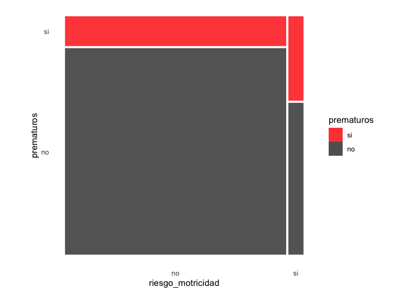
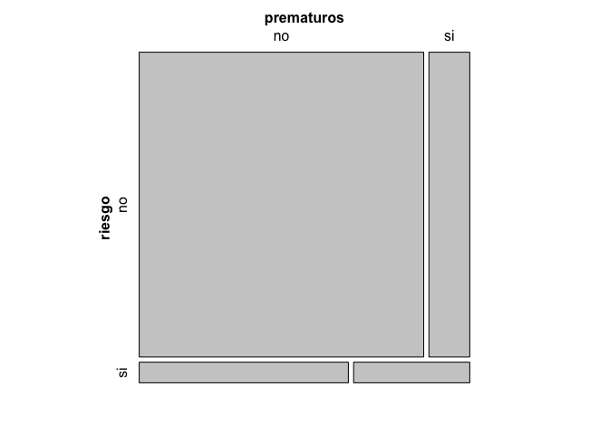

# Resumen

En el presente código empleamos los datos "Desarollo Psicomotor" para ilustrar como preparar datos, y producir diferentes resultados descriptivos. Empleamos estos datos, ya que contienen una serie de características que no son obvias de resolver sin revisar documentación acerca del estudio del cual estos datos provienen.


# Problema

El problema generar que intenta resolver este código, es producir tablas de descriptivos para más de un grupo. Sin embargo, como la base de datos de origen, es una base de datos real, esta posee diferentes problemas que se deben resolver antes de producir la tabla de descriptivos. Entre estos problemas previos, se incluye:

- items invertidos
- generación de puntajes
- interpretación de puntajes según una norma

# Como fue preguntado esto en el foro

## Pregunta: como generar una tabla de descriptivos por grupo

>Hola, espero que todxs estén bien. Vengo a preguntar la duda que salió en la ayudantía, sobre las tablas de cruce de las variables, incluyendo sus MTC y de dispersión. Al parecer, hay varios grupos que tuvimos problemas al hacer/entender la tabla y/o encontrar el código que permitiera hacer una tabla buena (visiblemente hablando) con los datos que se piden. Se agradecería mucho si nos pudieran aclarar y ayudar, por favor.

## Respuesta

Hola Paula, con los siguientes códigos vamos a generar tablas de descriptivos empleando los datos de "desarollo_psicomotor". Hemos incluido ahora las bases de datos de los trabajos, al interior de la libreria `psi2301` de modo que sea más fácil producir ejemplos. En este ejemplo, primer vamos a:

- abrir los datos
- inspeccionar los datos
- preparar los datos
  - emplear nombres en minuscula para facilitar la escritura de codigo
  - invertir los items que se encuentran en reverso
    - revisar la inversion de items
  - crear puntajes como sumas de respuestas
- crear tablas de descriptivos
  - empleando `summarize()`, y generando tablas de n, medias y sd.
- interpretar puntajes segun una norma

# Preparar datos

## Abrir datos


```r
# -----------------------------------------------------------------------------
# abrir dplyr y los datos
# -----------------------------------------------------------------------------

# -----------------------------------------------
# abrir datos
# -----------------------------------------------

library(dplyr)
datos_desarollo <- psi2301::desarollo_psicomotor
```

## Cambiar nombres de variables

- Volvemos todos los nombres de variables a minusculas, de modo que se más fácil escribir código con estos.


```r
# -----------------------------------------------------------------------------
# preparar los datos
# -----------------------------------------------------------------------------

# -----------------------------------------------
# cambiar todas las variables a minusculas
# -----------------------------------------------

datos_desarollo <- datos_desarollo %>%
                   rename_all(tolower) %>%
                   dplyr::glimpse()
```

```
## Rows: 250
## Columns: 40
## $ nse        <dbl> 3, 3, 1, 3, 1, 3, 3, 2, 3, 1, 2, 3, 1, 2, 3, 2, 3, 1, 2, 2,…
## $ sex        <dbl> 2, 1, 1, 2, 2, 2, 2, 2, 2, 1, 1, 2, 1, 1, 1, 1, 1, 1, 2, 1,…
## $ edad_gest  <dbl> 37, 38, 40, NA, 42, 39, 34, 38, 35, 31, 39, 28, 38, 42, 38,…
## $ peso_nac   <dbl> 3195, 3470, 4360, NA, 3696, 3000, 1916, 2325, 2800, 1990, 3…
## $ edad_emb_n <dbl> 30, 31, 24, NA, 23, 31, 31, 41, 16, 28, 21, 29, 19, 22, 30,…
## $ pad_alim   <dbl> 3, 4, 1, 2, 4, 1, 2, 3, 3, 3, 5, 1, 3, 5, 2, 5, 2, 4, 2, 3,…
## $ pad_jugar  <dbl> 5, 4, 2, 5, 5, 3, 2, 4, 5, 5, 5, 5, 5, 5, 5, 5, 2, 4, 4, 5,…
## $ pad_dormir <dbl> 5, 5, 1, 3, 4, 2, 2, 3, 4, 5, 4, 5, 1, 4, 4, 3, 2, 4, 5, 5,…
## $ pad_mudar  <dbl> 5, 1, 4, 2, 4, 4, 4, 5, 2, 5, 2, 3, 1, 3, 3, 5, 4, 3, 5, 5,…
## $ pad_med    <dbl> 4, 3, 1, 1, 3, 1, 4, 5, 1, 1, 4, 4, 1, 5, 1, 2, 2, 4, 2, 3,…
## $ a8com1     <dbl> 10, 10, 10, 10, 10, 10, 10, 10, 10, 10, 10, 10, 10, 10, 10,…
## $ a8com2     <dbl> 10, 5, 10, 10, 10, 10, 10, 10, 10, 10, 10, 10, 10, 10, 10, …
## $ a8com3     <dbl> 10, 10, 10, 10, 10, 5, 5, 5, 5, 5, 5, 10, 10, 10, 10, 10, 0…
## $ a8com4     <dbl> 10, 5, 10, 10, 10, 10, 10, 10, 10, 10, 5, 10, 10, 10, 10, 1…
## $ a8com5     <dbl> 10, 10, 10, 10, 10, 10, 10, 0, 5, 10, 0, 10, 10, 5, 10, 5, …
## $ a8com6     <dbl> 10, 10, 10, 10, 10, 10, 10, 10, 10, 5, 5, 10, 10, 10, 10, 1…
## $ a8mamp1    <dbl> 10, 10, 10, 10, 10, 10, 10, 5, 0, 10, 10, 10, 10, 10, 10, 0…
## $ a8mamp2    <dbl> 10, 5, 10, 10, 10, 10, 10, 10, 10, 10, 10, 10, 10, 10, 10, …
## $ a8mamp3    <dbl> 10, 5, 10, 0, 10, 0, 0, 10, 0, 0, 10, 10, 0, 10, 10, 0, 10,…
## $ a8mamp4    <dbl> 10, 10, 10, 5, 10, 10, 10, 0, 10, 10, 10, 10, 10, 10, 5, 10…
## $ a8mamp5    <dbl> 10, 10, 10, 10, 10, 10, 10, 10, 10, 10, 10, 10, 5, 10, 10, …
## $ a8mamp6    <dbl> 5, 10, 10, 0, 5, 0, 10, 0, 0, 10, 10, 10, 0, 10, 10, 0, 10,…
## $ a8mfin1    <dbl> 10, 10, 10, 10, 10, 10, 10, 0, 10, 10, 10, 10, 10, 10, 10, …
## $ a8mfin2    <dbl> 0, 0, 0, 0, 0, 0, 0, 0, 0, 0, 0, 0, 0, 0, 0, 0, 0, 0, 0, 0,…
## $ a8mfin3    <dbl> 5, 10, 0, 10, 10, 10, 10, 0, 10, 10, 10, 10, 10, 10, 10, 10…
## $ a8mfin4    <dbl> 10, 10, 10, 10, 10, 10, 10, 10, 10, 10, 10, 10, 10, 10, 10,…
## $ a8mfin5    <dbl> 5, 10, 0, 10, 10, 10, 10, 0, 10, 10, 10, 10, 10, 10, 5, 10,…
## $ a8mfin6    <dbl> 5, 10, 5, 10, 10, 10, 10, 10, 5, 5, 10, 10, 5, 10, 5, 10, 5…
## $ a8rp1      <dbl> 10, 10, 10, 10, 10, 10, 10, 5, 5, 10, 10, 10, 10, 10, 10, 1…
## $ a8rp2      <dbl> 5, 10, 5, 10, 10, 10, 10, 0, 10, 10, 10, 10, 10, 10, 10, 10…
## $ a8rp3      <dbl> 10, 10, 10, 10, 10, 10, 10, 0, 10, 10, 10, 10, 10, 10, 5, 1…
## $ a8rp4      <dbl> 5, 10, 10, 10, 10, 10, 10, 5, 0, 5, 10, 10, 10, 5, 10, 5, 1…
## $ a8rp5      <dbl> 10, 5, 0, 10, 5, 10, 5, 5, 10, 10, 10, 10, 5, 10, 10, 5, 0,…
## $ a8rp6      <dbl> 10, 10, 5, 10, 10, 10, 0, 0, 0, 10, 10, 10, 10, 5, 5, 10, 0…
## $ a8si1      <dbl> 5, 0, 0, 0, 0, 0, 0, 0, 0, 0, 0, 0, 0, 0, 0, 0, 10, 0, 10, …
## $ a8si2      <dbl> 10, 10, 10, 10, 10, 10, 10, 10, 0, 5, 5, 10, 5, 10, NA, 10,…
## $ a8si3      <dbl> 10, 10, 10, 10, 10, 10, 10, 5, 5, 10, 10, 10, 10, 10, 10, 1…
## $ a8si4      <dbl> 10, 5, 10, 10, 10, 10, 10, 10, 10, 10, 5, 10, 10, 10, 10, 1…
## $ a8si5      <dbl> 5, 10, 10, 0, 10, 10, 5, 0, 10, 10, 10, 10, 10, 10, 5, 10, …
## $ a8si6      <dbl> 10, 10, 10, 0, 10, 0, 10, 0, 10, 10, 10, 10, 5, 10, NA, 10,…
```


## Items invertidos

- Los datos de "Desarollo Psicomotor" contienen items invertidos.
- Esto significa que hay items que poseen respuestas inversas, las cuales deben ser transformadas.
- Esta transformación de los indicadores, es necesaria antes de emplear sus respuestas para crear puntajes sinteticos, como promedios o sumas de respuestas.
- De lo contrario, si estos items invertidos no son transformados, corremos el riesgo de generar puntajes poco interpretables.


```r
# -----------------------------------------------------------------------------
# items invertidos
# -----------------------------------------------------------------------------

# -----------------------------------------------
# identificar items invertidos
# -----------------------------------------------

datos_desarollo %>%
  dplyr::select(a8com1:a8si6) %>%
  r4sda::wide_resp() %>%
  knitr::kable(., digits = 2)
```


|variable |   00|   05|   10|   NA|hist     |
|:--------|----:|----:|----:|----:|:--------|
|a8com1   |   NA| 0.06| 0.94|   NA|▁▁▁▁▁▁▁▇ |
|a8com2   |   NA| 0.09| 0.90| 0.00|▁▁▁▁▁▁▁▇ |
|a8com3   | 0.06| 0.30| 0.64| 0.00|▁▁▁▃▁▁▁▇ |
|a8com4   | 0.07| 0.09| 0.84|   NA|▁▁▁▁▁▁▁▇ |
|a8com5   | 0.06| 0.20| 0.74| 0.00|▁▁▁▂▁▁▁▇ |
|a8com6   | 0.07| 0.08| 0.84| 0.00|▁▁▁▁▁▁▁▇ |
|a8mamp1  | 0.09| 0.10| 0.82|   NA|▁▁▁▁▁▁▁▇ |
|a8mamp2  | 0.12| 0.12| 0.76| 0.01|▁▁▁▁▁▁▁▇ |
|a8mamp3  | 0.50| 0.14| 0.36| 0.00|▇▁▁▂▁▁▁▆ |
|a8mamp4  | 0.10| 0.11| 0.79|   NA|▁▁▁▁▁▁▁▇ |
|a8mamp5  | 0.09| 0.12| 0.79|   NA|▁▁▁▁▁▁▁▇ |
|a8mamp6  | 0.36| 0.19| 0.45| 0.00|▆▁▁▃▁▁▁▇ |
|a8mfin1  | 0.02| 0.05| 0.93|   NA|▁▁▁▁▁▁▁▇ |
|a8mfin2  | 0.94| 0.05| 0.01| 0.00|▇▁▁▁▁▁▁▁ |
|a8mfin3  | 0.07| 0.10| 0.84|   NA|▁▁▁▁▁▁▁▇ |
|a8mfin4  | 0.01| 0.05| 0.94|   NA|▁▁▁▁▁▁▁▇ |
|a8mfin5  | 0.08| 0.15| 0.77| 0.00|▁▁▁▂▁▁▁▇ |
|a8mfin6  | 0.11| 0.20| 0.69|   NA|▁▁▁▂▁▁▁▇ |
|a8rp1    | 0.00| 0.04| 0.96|   NA|▁▁▁▁▁▁▁▇ |
|a8rp2    | 0.04| 0.09| 0.86| 0.01|▁▁▁▁▁▁▁▇ |
|a8rp3    | 0.04| 0.05| 0.92|   NA|▁▁▁▁▁▁▁▇ |
|a8rp4    | 0.05| 0.10| 0.85|   NA|▁▁▁▁▁▁▁▇ |
|a8rp5    | 0.10| 0.22| 0.68|   NA|▁▁▁▂▁▁▁▇ |
|a8rp6    | 0.14| 0.18| 0.68| 0.00|▂▁▁▂▁▁▁▇ |
|a8si1    | 0.91| 0.05| 0.04|   NA|▇▁▁▁▁▁▁▁ |
|a8si2    | 0.06| 0.07| 0.87| 0.00|▁▁▁▁▁▁▁▇ |
|a8si3    | 0.06| 0.07| 0.88|   NA|▁▁▁▁▁▁▁▇ |
|a8si4    | 0.08| 0.12| 0.80| 0.00|▁▁▁▁▁▁▁▇ |
|a8si5    | 0.15| 0.08| 0.75| 0.02|▂▁▁▁▁▁▁▇ |
|a8si6    | 0.21| 0.06| 0.71| 0.02|▂▁▁▁▁▁▁▇ |

```r
# Nota: items invertidos `a8mfin2` y `a8si1`. 
#       Para identificarlos, ver los porcentaje de respuesta de la 
#       primera columna.

# -----------------------------------------------
# invertir items
# -----------------------------------------------

datos_desarollo <- datos_desarollo %>%
                   mutate(a8mfin2_raw = a8mfin2) %>%
                   mutate(a8mfin2 = case_when(
                     a8mfin2 ==  0 ~ 10,
                     a8mfin2 ==  5 ~ 5,
                     a8mfin2 == 10 ~ 0
                   )) %>% 
                   mutate(a8si1_raw = a8si1) %>%
                   mutate(a8si1 = case_when(
                     a8si1 ==  0 ~ 10,
                     a8si1 ==  5 ~ 5,
                     a8si1 == 10 ~ 0
                   ))

# -----------------------------------------------
# revisar items invertidos
# -----------------------------------------------

dplyr::count(datos_desarollo, a8mfin2_raw, a8mfin2)
```

```
## # A tibble: 4 x 3
##   a8mfin2_raw a8mfin2     n
##         <dbl>   <dbl> <int>
## 1           0      10   234
## 2           5       5    13
## 3          10       0     2
## 4          NA      NA     1
```

```r
dplyr::count(datos_desarollo, a8si1_raw, a8si1)
```

```
## # A tibble: 3 x 3
##   a8si1_raw a8si1     n
##       <dbl> <dbl> <int>
## 1         0    10   227
## 2         5     5    13
## 3        10     0    10
```

## Crear puntajes

- En general, en diferentes estudios de ciencias sociales, los articulos emplean puntajes para representar atributos o constructos teóricos en base a respuestas a diferentes preguntas.
- Estos puntajes pueden ser generados por diferentes metodos tales como: promedios de respuestas, sumas de respuestas, o el empleo de un modelo de respuesta (e.g., *confirmatory factor analysis*, *item response theory models*).
- Los datos contenidos en "Desarollo Psicomotor" provienen de la aplicación de un instrumento llamado "Ages and Stages Questionnaire". Este cuestionario recoge una serie de respuestas producidas por los padres de niños de menos de un año (7 a 9 meses), acerca de diferentes capacidades que presentan sus hijos.
- Las respuestas de los padres se encuentran en un espacio de respuesta ordinal de tres categorías:
  - Sí 
  - A veces
  - No aún
- Cada una de estas categorias recibe 10 puntos (Sí), 5 puntos (A veces) y 0 puntos (No aún), correspondientemente.
- Con las respuestas originales a los 30 items incluidos en el cuestionario, se generan 5 puntajes diferentes, como la suma de las repsuestas frente a todos los items (ver Armijo et al, 2015).
- Los constructos representados con estos puntajes son:
  - Comunicación
  - Movimientos Amplios
  - Movimientos Finos
  - Resolución de problemas
  - Socio-Individual
- En el siguiente codigo se generan los puntajes de cada constructo, como la suma de respuestas.
- Los puntajes generados, pueden variar de 0 a 60 puntos.


```r
# -----------------------------------------------------------------------------
# crear suma de puntajes
# -----------------------------------------------------------------------------

# -----------------------------------------------
# aislar matrices de respuesta por constructo
# -----------------------------------------------

com_items <- dplyr::select(datos_desarollo, a8com1:a8com6)
amp_items <- dplyr::select(datos_desarollo, a8mamp1:a8mamp6)
fin_items <- dplyr::select(datos_desarollo, a8mfin1:a8mfin6)
pro_items <- dplyr::select(datos_desarollo, a8rp1:a8rp6)
soc_items <- dplyr::select(datos_desarollo, a8si1:a8si6)

# -----------------------------------------------
# tabla de confiabilidad de puntajes
# -----------------------------------------------

data.frame(
scales = c(
  'Comunicación',
  'Movimientos Amplios',
  'Movimientos Finos',
  'Resolución de problemas',
  'Socio-Individual'
),
alpha = 
  c(
psych::alpha(com_items)$total$raw_alpha,
psych::alpha(amp_items)$total$raw_alpha,
psych::alpha(fin_items)$total$raw_alpha,
psych::alpha(pro_items)$total$raw_alpha,
psych::alpha(soc_items)$total$raw_alpha
  )
) %>%
knitr::kable(., digits = 2)
```


|scales                  | alpha|
|:-----------------------|-----:|
|Comunicación            |  0.58|
|Movimientos Amplios     |  0.73|
|Movimientos Finos       |  0.71|
|Resolución de problemas |  0.66|
|Socio-Individual        |  0.57|

```r
# Nota: la generación de puntajes en base a respuestas o 
#       valores de diferentes indicadores, se evaluan en base
#       a indicadores de confiabilidad. Estos indicadores
#       de confiabilidad, como el "Alpha de Cronbach" nos
#       nos indican que tanta precision tienen los puntajes
#       generados, para poder distinguir entre las personas
#       o unidades representadas con los puntajes. En general,
#       valores cercanos a .70 son deseables.

# -----------------------------------------------
# crear sumas de puntajes
# -----------------------------------------------

datos_desarollo <- datos_desarollo %>%
                   mutate(com = psi2301::sum_score(com_items)) %>%
                   mutate(amp = psi2301::sum_score(amp_items)) %>%
                   mutate(fin = psi2301::sum_score(fin_items)) %>%
                   mutate(pro = psi2301::sum_score(pro_items)) %>%
                   mutate(soc = psi2301::sum_score(soc_items))

# -----------------------------------------------
# inspeccionar base de datos creada
# -----------------------------------------------

datos_desarollo %>%
r4sda::variables_table() %>%
knitr::kable()
```


|variable    |type |values                        |labels                    |
|:-----------|:----|:-----------------------------|:-------------------------|
|nse         |dbl  |2, 3, 1, 2, 3, 2, 3, 1, 2, 2… |=== no variable label === |
|sex         |dbl  |1, 2, 1, 1, 1, 1, 1, 1, 2, 1… |=== no variable label === |
|edad_gest   |dbl  |, 35, 31, 39, 28, 38, 42, 38… |=== no variable label === |
|peso_nac    |dbl  |00, 1916, 2325, 2800, 1990, … |=== no variable label === |
|edad_emb_n  |dbl  |, 16, 28, 21, 29, 19, 22, 30… |=== no variable label === |
|pad_alim    |dbl  |5, 1, 3, 5, 2, 5, 2, 4, 2, 3… |=== no variable label === |
|pad_jugar   |dbl  |5, 5, 5, 5, 5, 5, 2, 4, 4, 5… |=== no variable label === |
|pad_dormir  |dbl  |4, 5, 1, 4, 4, 3, 2, 4, 5, 5… |=== no variable label === |
|pad_mudar   |dbl  |2, 3, 1, 3, 3, 5, 4, 3, 5, 5… |=== no variable label === |
|pad_med     |dbl  |4, 4, 1, 5, 1, 2, 2, 4, 2, 3… |=== no variable label === |
|a8com1      |dbl  |, 10, 10, 10, 10, 10, 10, 10… |=== no variable label === |
|a8com2      |dbl  |10, 10, 10, 10, 10, 10, 10,…  |=== no variable label === |
|a8com3      |dbl  |, 5, 5, 10, 10, 10, 10, 10, … |=== no variable label === |
|a8com4      |dbl  |10, 10, 5, 10, 10, 10, 10, …  |=== no variable label === |
|a8com5      |dbl  |5, 10, 0, 10, 10, 5, 10, 5,…  |=== no variable label === |
|a8com6      |dbl  |, 10, 5, 5, 10, 10, 10, 10, … |=== no variable label === |
|a8mamp1     |dbl  |0, 10, 10, 10, 10, 10, 10, …  |=== no variable label === |
|a8mamp2     |dbl  |10, 10, 10, 10, 10, 10, 10,…  |=== no variable label === |
|a8mamp3     |dbl  |0, 10, 10, 0, 10, 10, 0, 10…  |=== no variable label === |
|a8mamp4     |dbl  |10, 10, 10, 10, 10, 10, 5, 1… |=== no variable label === |
|a8mamp5     |dbl  |, 10, 10, 10, 10, 5, 10, 10,… |=== no variable label === |
|a8mamp6     |dbl  |10, 10, 10, 0, 10, 10, 0, 10… |=== no variable label === |
|a8mfin1     |dbl  |10, 10, 10, 10, 10, 10, 10,…  |=== no variable label === |
|a8mfin2     |dbl  |, 10, 10, 10, 10, 10, 10, 10… |=== no variable label === |
|a8mfin3     |dbl  |0, 10, 10, 10, 10, 10, 10, 1… |=== no variable label === |
|a8mfin4     |dbl  |, 10, 10, 10, 10, 10, 10, 10… |=== no variable label === |
|a8mfin5     |dbl  |0, 10, 10, 10, 10, 10, 5, 10… |=== no variable label === |
|a8mfin6     |dbl  |5, 5, 10, 10, 5, 10, 5, 10, … |=== no variable label === |
|a8rp1       |dbl  |5, 10, 10, 10, 10, 10, 10, …  |=== no variable label === |
|a8rp2       |dbl  |0, 10, 10, 10, 10, 10, 10, 1… |=== no variable label === |
|a8rp3       |dbl  |10, 10, 10, 10, 10, 10, 5, …  |=== no variable label === |
|a8rp4       |dbl  |0, 5, 10, 10, 10, 5, 10, 5, … |=== no variable label === |
|a8rp5       |dbl  |10, 10, 10, 5, 10, 10, 5, 0…  |=== no variable label === |
|a8rp6       |dbl  |, 10, 10, 10, 10, 5, 5, 10, … |=== no variable label === |
|a8si1       |dbl  |10, 10, 10, 10, 10, 10, 10,…  |=== no variable label === |
|a8si2       |dbl  |, 0, 5, 5, 10, 5, 10, NA, 10… |=== no variable label === |
|a8si3       |dbl  |5, 10, 10, 10, 10, 10, 10, …  |=== no variable label === |
|a8si4       |dbl  |10, 10, 5, 10, 10, 10, 10, …  |=== no variable label === |
|a8si5       |dbl  |, 10, 10, 10, 10, 10, 5, 10,… |=== no variable label === |
|a8si6       |dbl  |0, 10, 10, 10, 5, 10, NA, 10… |=== no variable label === |
|a8mfin2_raw |dbl  |0, 0, 0, 0, 0, 0, 0, 0, 0, 0… |=== no variable label === |
|a8si1_raw   |dbl  |0, 0, 0, 0, 0, 0, 10, 0, 10,… |=== no variable label === |
|com         |dbl  |, 50, 50, 35, 60, 60, 55, 60… |=== no variable label === |
|amp         |dbl  |, 30, 50, 60, 60, 35, 60, 55… |=== no variable label === |
|fin         |dbl  |, 55, 55, 60, 60, 55, 60, 50… |=== no variable label === |
|pro         |dbl  |, 35, 55, 60, 60, 55, 50, 50… |=== no variable label === |
|soc         |dbl  |, 45, 55, 50, 60, 50, 60, 35… |=== no variable label === |

## Clasificar casos en riesgo

- Los datos generados con el instrumento "Ages and Stages Questionnaire" tiene una interpretación normativa.
- Esto quiere decir que, aquellos casos que se encuentran bajo un puntaje determinado, son casos considerados en riesgo.
- En este caso, se refiere a riesgo de problemas de desarollo.


```r
# -----------------------------------------------------------------------------
# puntajes de riesgo
# -----------------------------------------------------------------------------

# -----------------------------------------------
# normas
# -----------------------------------------------

com_norm <- 37.9
amp_norm <- 19.5
fin_norm <- 39.1
pro_norm <- 40.4
soc_norm <- 33.8

# Nota: puntos criticos de riesgo vienen de Armijo et al (2015, p 674)

# -----------------------------------------------
# clasificar casos
# -----------------------------------------------

datos_desarollo <- datos_desarollo %>%
                   mutate(com_r = dplyr::if_else(com < com_norm, 1, 0)) %>%
                   mutate(amp_r = dplyr::if_else(amp < amp_norm, 1, 0)) %>%
                   mutate(fin_r = dplyr::if_else(fin < fin_norm, 1, 0)) %>%
                   mutate(pro_r = dplyr::if_else(pro < pro_norm, 1, 0)) %>%
                   mutate(soc_r = dplyr::if_else(soc < soc_norm, 1, 0)) %>%
                   dplyr::glimpse()
```

```
## Rows: 250
## Columns: 52
## $ nse         <dbl> 3, 3, 1, 3, 1, 3, 3, 2, 3, 1, 2, 3, 1, 2, 3, 2, 3, 1, 2, 2…
## $ sex         <dbl> 2, 1, 1, 2, 2, 2, 2, 2, 2, 1, 1, 2, 1, 1, 1, 1, 1, 1, 2, 1…
## $ edad_gest   <dbl> 37, 38, 40, NA, 42, 39, 34, 38, 35, 31, 39, 28, 38, 42, 38…
## $ peso_nac    <dbl> 3195, 3470, 4360, NA, 3696, 3000, 1916, 2325, 2800, 1990, …
## $ edad_emb_n  <dbl> 30, 31, 24, NA, 23, 31, 31, 41, 16, 28, 21, 29, 19, 22, 30…
## $ pad_alim    <dbl> 3, 4, 1, 2, 4, 1, 2, 3, 3, 3, 5, 1, 3, 5, 2, 5, 2, 4, 2, 3…
## $ pad_jugar   <dbl> 5, 4, 2, 5, 5, 3, 2, 4, 5, 5, 5, 5, 5, 5, 5, 5, 2, 4, 4, 5…
## $ pad_dormir  <dbl> 5, 5, 1, 3, 4, 2, 2, 3, 4, 5, 4, 5, 1, 4, 4, 3, 2, 4, 5, 5…
## $ pad_mudar   <dbl> 5, 1, 4, 2, 4, 4, 4, 5, 2, 5, 2, 3, 1, 3, 3, 5, 4, 3, 5, 5…
## $ pad_med     <dbl> 4, 3, 1, 1, 3, 1, 4, 5, 1, 1, 4, 4, 1, 5, 1, 2, 2, 4, 2, 3…
## $ a8com1      <dbl> 10, 10, 10, 10, 10, 10, 10, 10, 10, 10, 10, 10, 10, 10, 10…
## $ a8com2      <dbl> 10, 5, 10, 10, 10, 10, 10, 10, 10, 10, 10, 10, 10, 10, 10,…
## $ a8com3      <dbl> 10, 10, 10, 10, 10, 5, 5, 5, 5, 5, 5, 10, 10, 10, 10, 10, …
## $ a8com4      <dbl> 10, 5, 10, 10, 10, 10, 10, 10, 10, 10, 5, 10, 10, 10, 10, …
## $ a8com5      <dbl> 10, 10, 10, 10, 10, 10, 10, 0, 5, 10, 0, 10, 10, 5, 10, 5,…
## $ a8com6      <dbl> 10, 10, 10, 10, 10, 10, 10, 10, 10, 5, 5, 10, 10, 10, 10, …
## $ a8mamp1     <dbl> 10, 10, 10, 10, 10, 10, 10, 5, 0, 10, 10, 10, 10, 10, 10, …
## $ a8mamp2     <dbl> 10, 5, 10, 10, 10, 10, 10, 10, 10, 10, 10, 10, 10, 10, 10,…
## $ a8mamp3     <dbl> 10, 5, 10, 0, 10, 0, 0, 10, 0, 0, 10, 10, 0, 10, 10, 0, 10…
## $ a8mamp4     <dbl> 10, 10, 10, 5, 10, 10, 10, 0, 10, 10, 10, 10, 10, 10, 5, 1…
## $ a8mamp5     <dbl> 10, 10, 10, 10, 10, 10, 10, 10, 10, 10, 10, 10, 5, 10, 10,…
## $ a8mamp6     <dbl> 5, 10, 10, 0, 5, 0, 10, 0, 0, 10, 10, 10, 0, 10, 10, 0, 10…
## $ a8mfin1     <dbl> 10, 10, 10, 10, 10, 10, 10, 0, 10, 10, 10, 10, 10, 10, 10,…
## $ a8mfin2     <dbl> 10, 10, 10, 10, 10, 10, 10, 10, 10, 10, 10, 10, 10, 10, 10…
## $ a8mfin3     <dbl> 5, 10, 0, 10, 10, 10, 10, 0, 10, 10, 10, 10, 10, 10, 10, 1…
## $ a8mfin4     <dbl> 10, 10, 10, 10, 10, 10, 10, 10, 10, 10, 10, 10, 10, 10, 10…
## $ a8mfin5     <dbl> 5, 10, 0, 10, 10, 10, 10, 0, 10, 10, 10, 10, 10, 10, 5, 10…
## $ a8mfin6     <dbl> 5, 10, 5, 10, 10, 10, 10, 10, 5, 5, 10, 10, 5, 10, 5, 10, …
## $ a8rp1       <dbl> 10, 10, 10, 10, 10, 10, 10, 5, 5, 10, 10, 10, 10, 10, 10, …
## $ a8rp2       <dbl> 5, 10, 5, 10, 10, 10, 10, 0, 10, 10, 10, 10, 10, 10, 10, 1…
## $ a8rp3       <dbl> 10, 10, 10, 10, 10, 10, 10, 0, 10, 10, 10, 10, 10, 10, 5, …
## $ a8rp4       <dbl> 5, 10, 10, 10, 10, 10, 10, 5, 0, 5, 10, 10, 10, 5, 10, 5, …
## $ a8rp5       <dbl> 10, 5, 0, 10, 5, 10, 5, 5, 10, 10, 10, 10, 5, 10, 10, 5, 0…
## $ a8rp6       <dbl> 10, 10, 5, 10, 10, 10, 0, 0, 0, 10, 10, 10, 10, 5, 5, 10, …
## $ a8si1       <dbl> 5, 10, 10, 10, 10, 10, 10, 10, 10, 10, 10, 10, 10, 10, 10,…
## $ a8si2       <dbl> 10, 10, 10, 10, 10, 10, 10, 10, 0, 5, 5, 10, 5, 10, NA, 10…
## $ a8si3       <dbl> 10, 10, 10, 10, 10, 10, 10, 5, 5, 10, 10, 10, 10, 10, 10, …
## $ a8si4       <dbl> 10, 5, 10, 10, 10, 10, 10, 10, 10, 10, 5, 10, 10, 10, 10, …
## $ a8si5       <dbl> 5, 10, 10, 0, 10, 10, 5, 0, 10, 10, 10, 10, 10, 10, 5, 10,…
## $ a8si6       <dbl> 10, 10, 10, 0, 10, 0, 10, 0, 10, 10, 10, 10, 5, 10, NA, 10…
## $ a8mfin2_raw <dbl> 0, 0, 0, 0, 0, 0, 0, 0, 0, 0, 0, 0, 0, 0, 0, 0, 0, 0, 0, 0…
## $ a8si1_raw   <dbl> 5, 0, 0, 0, 0, 0, 0, 0, 0, 0, 0, 0, 0, 0, 0, 0, 10, 0, 10,…
## $ com         <dbl> 60, 50, 60, 60, 60, 55, 55, 45, 50, 50, 35, 60, 60, 55, 60…
## $ amp         <dbl> 55, 50, 60, 35, 55, 40, 50, 35, 30, 50, 60, 60, 35, 60, 55…
## $ fin         <dbl> 45, 60, 35, 60, 60, 60, 60, 30, 55, 55, 60, 60, 55, 60, 50…
## $ pro         <dbl> 50, 55, 40, 60, 55, 60, 45, 15, 35, 55, 60, 60, 55, 50, 50…
## $ soc         <dbl> 50, 55, 60, 40, 60, 50, 55, 35, 45, 55, 50, 60, 50, 60, 35…
## $ com_r       <dbl> 0, 0, 0, 0, 0, 0, 0, 0, 0, 0, 1, 0, 0, 0, 0, 0, 1, 0, 0, 0…
## $ amp_r       <dbl> 0, 0, 0, 0, 0, 0, 0, 0, 0, 0, 0, 0, 0, 0, 0, 0, 0, 0, 0, 0…
## $ fin_r       <dbl> 0, 0, 1, 0, 0, 0, 0, 1, 0, 0, 0, 0, 0, 0, 0, 0, 0, 0, 0, 0…
## $ pro_r       <dbl> 0, 0, 1, 0, 0, 0, 0, 1, 1, 0, 0, 0, 0, 0, 0, 0, 1, 0, 0, 0…
## $ soc_r       <dbl> 0, 0, 0, 0, 0, 0, 0, 0, 0, 0, 0, 0, 0, 0, 0, 0, 1, 0, 0, 0…
```

## Nacimiento prematuro

- Los niños incluidos presentan diferentes edades de gestación, de 24 a 42 semanas.
- Convencionalmente, se considera que los nacidos con menos de 32 semanas de gestación, son nacidos prematuros.
- Los nacidos de forma prematura, se espera que presenten retrasos o desarollos tardios.
- Es decir, que se esperan diferencias en las diferentes dimensiones de desarollo psicomotor entre los nacidos con más de 32 semanas, y los niños con menos semanas de gestación.


```r
# -----------------------------------------------------------------------------
# gestación prematura
# -----------------------------------------------------------------------------

# -----------------------------------------------
# normas
# -----------------------------------------------

premature <- 32 # weeks

# Nota: puntos criticos de riesgo vienen de Armijo et al (2015, p 675)

# -----------------------------------------------
# clasificar casos
# -----------------------------------------------

datos_desarollo <- datos_desarollo %>%
                   mutate(prem = dplyr::if_else(edad_gest < premature, 1, 0)) %>%
                   dplyr::glimpse()
```

```
## Rows: 250
## Columns: 53
## $ nse         <dbl> 3, 3, 1, 3, 1, 3, 3, 2, 3, 1, 2, 3, 1, 2, 3, 2, 3, 1, 2, 2…
## $ sex         <dbl> 2, 1, 1, 2, 2, 2, 2, 2, 2, 1, 1, 2, 1, 1, 1, 1, 1, 1, 2, 1…
## $ edad_gest   <dbl> 37, 38, 40, NA, 42, 39, 34, 38, 35, 31, 39, 28, 38, 42, 38…
## $ peso_nac    <dbl> 3195, 3470, 4360, NA, 3696, 3000, 1916, 2325, 2800, 1990, …
## $ edad_emb_n  <dbl> 30, 31, 24, NA, 23, 31, 31, 41, 16, 28, 21, 29, 19, 22, 30…
## $ pad_alim    <dbl> 3, 4, 1, 2, 4, 1, 2, 3, 3, 3, 5, 1, 3, 5, 2, 5, 2, 4, 2, 3…
## $ pad_jugar   <dbl> 5, 4, 2, 5, 5, 3, 2, 4, 5, 5, 5, 5, 5, 5, 5, 5, 2, 4, 4, 5…
## $ pad_dormir  <dbl> 5, 5, 1, 3, 4, 2, 2, 3, 4, 5, 4, 5, 1, 4, 4, 3, 2, 4, 5, 5…
## $ pad_mudar   <dbl> 5, 1, 4, 2, 4, 4, 4, 5, 2, 5, 2, 3, 1, 3, 3, 5, 4, 3, 5, 5…
## $ pad_med     <dbl> 4, 3, 1, 1, 3, 1, 4, 5, 1, 1, 4, 4, 1, 5, 1, 2, 2, 4, 2, 3…
## $ a8com1      <dbl> 10, 10, 10, 10, 10, 10, 10, 10, 10, 10, 10, 10, 10, 10, 10…
## $ a8com2      <dbl> 10, 5, 10, 10, 10, 10, 10, 10, 10, 10, 10, 10, 10, 10, 10,…
## $ a8com3      <dbl> 10, 10, 10, 10, 10, 5, 5, 5, 5, 5, 5, 10, 10, 10, 10, 10, …
## $ a8com4      <dbl> 10, 5, 10, 10, 10, 10, 10, 10, 10, 10, 5, 10, 10, 10, 10, …
## $ a8com5      <dbl> 10, 10, 10, 10, 10, 10, 10, 0, 5, 10, 0, 10, 10, 5, 10, 5,…
## $ a8com6      <dbl> 10, 10, 10, 10, 10, 10, 10, 10, 10, 5, 5, 10, 10, 10, 10, …
## $ a8mamp1     <dbl> 10, 10, 10, 10, 10, 10, 10, 5, 0, 10, 10, 10, 10, 10, 10, …
## $ a8mamp2     <dbl> 10, 5, 10, 10, 10, 10, 10, 10, 10, 10, 10, 10, 10, 10, 10,…
## $ a8mamp3     <dbl> 10, 5, 10, 0, 10, 0, 0, 10, 0, 0, 10, 10, 0, 10, 10, 0, 10…
## $ a8mamp4     <dbl> 10, 10, 10, 5, 10, 10, 10, 0, 10, 10, 10, 10, 10, 10, 5, 1…
## $ a8mamp5     <dbl> 10, 10, 10, 10, 10, 10, 10, 10, 10, 10, 10, 10, 5, 10, 10,…
## $ a8mamp6     <dbl> 5, 10, 10, 0, 5, 0, 10, 0, 0, 10, 10, 10, 0, 10, 10, 0, 10…
## $ a8mfin1     <dbl> 10, 10, 10, 10, 10, 10, 10, 0, 10, 10, 10, 10, 10, 10, 10,…
## $ a8mfin2     <dbl> 10, 10, 10, 10, 10, 10, 10, 10, 10, 10, 10, 10, 10, 10, 10…
## $ a8mfin3     <dbl> 5, 10, 0, 10, 10, 10, 10, 0, 10, 10, 10, 10, 10, 10, 10, 1…
## $ a8mfin4     <dbl> 10, 10, 10, 10, 10, 10, 10, 10, 10, 10, 10, 10, 10, 10, 10…
## $ a8mfin5     <dbl> 5, 10, 0, 10, 10, 10, 10, 0, 10, 10, 10, 10, 10, 10, 5, 10…
## $ a8mfin6     <dbl> 5, 10, 5, 10, 10, 10, 10, 10, 5, 5, 10, 10, 5, 10, 5, 10, …
## $ a8rp1       <dbl> 10, 10, 10, 10, 10, 10, 10, 5, 5, 10, 10, 10, 10, 10, 10, …
## $ a8rp2       <dbl> 5, 10, 5, 10, 10, 10, 10, 0, 10, 10, 10, 10, 10, 10, 10, 1…
## $ a8rp3       <dbl> 10, 10, 10, 10, 10, 10, 10, 0, 10, 10, 10, 10, 10, 10, 5, …
## $ a8rp4       <dbl> 5, 10, 10, 10, 10, 10, 10, 5, 0, 5, 10, 10, 10, 5, 10, 5, …
## $ a8rp5       <dbl> 10, 5, 0, 10, 5, 10, 5, 5, 10, 10, 10, 10, 5, 10, 10, 5, 0…
## $ a8rp6       <dbl> 10, 10, 5, 10, 10, 10, 0, 0, 0, 10, 10, 10, 10, 5, 5, 10, …
## $ a8si1       <dbl> 5, 10, 10, 10, 10, 10, 10, 10, 10, 10, 10, 10, 10, 10, 10,…
## $ a8si2       <dbl> 10, 10, 10, 10, 10, 10, 10, 10, 0, 5, 5, 10, 5, 10, NA, 10…
## $ a8si3       <dbl> 10, 10, 10, 10, 10, 10, 10, 5, 5, 10, 10, 10, 10, 10, 10, …
## $ a8si4       <dbl> 10, 5, 10, 10, 10, 10, 10, 10, 10, 10, 5, 10, 10, 10, 10, …
## $ a8si5       <dbl> 5, 10, 10, 0, 10, 10, 5, 0, 10, 10, 10, 10, 10, 10, 5, 10,…
## $ a8si6       <dbl> 10, 10, 10, 0, 10, 0, 10, 0, 10, 10, 10, 10, 5, 10, NA, 10…
## $ a8mfin2_raw <dbl> 0, 0, 0, 0, 0, 0, 0, 0, 0, 0, 0, 0, 0, 0, 0, 0, 0, 0, 0, 0…
## $ a8si1_raw   <dbl> 5, 0, 0, 0, 0, 0, 0, 0, 0, 0, 0, 0, 0, 0, 0, 0, 10, 0, 10,…
## $ com         <dbl> 60, 50, 60, 60, 60, 55, 55, 45, 50, 50, 35, 60, 60, 55, 60…
## $ amp         <dbl> 55, 50, 60, 35, 55, 40, 50, 35, 30, 50, 60, 60, 35, 60, 55…
## $ fin         <dbl> 45, 60, 35, 60, 60, 60, 60, 30, 55, 55, 60, 60, 55, 60, 50…
## $ pro         <dbl> 50, 55, 40, 60, 55, 60, 45, 15, 35, 55, 60, 60, 55, 50, 50…
## $ soc         <dbl> 50, 55, 60, 40, 60, 50, 55, 35, 45, 55, 50, 60, 50, 60, 35…
## $ com_r       <dbl> 0, 0, 0, 0, 0, 0, 0, 0, 0, 0, 1, 0, 0, 0, 0, 0, 1, 0, 0, 0…
## $ amp_r       <dbl> 0, 0, 0, 0, 0, 0, 0, 0, 0, 0, 0, 0, 0, 0, 0, 0, 0, 0, 0, 0…
## $ fin_r       <dbl> 0, 0, 1, 0, 0, 0, 0, 1, 0, 0, 0, 0, 0, 0, 0, 0, 0, 0, 0, 0…
## $ pro_r       <dbl> 0, 0, 1, 0, 0, 0, 0, 1, 1, 0, 0, 0, 0, 0, 0, 0, 1, 0, 0, 0…
## $ soc_r       <dbl> 0, 0, 0, 0, 0, 0, 0, 0, 0, 0, 0, 0, 0, 0, 0, 0, 1, 0, 0, 0…
## $ prem        <dbl> 0, 0, 0, NA, 0, 0, 0, 0, 0, 1, 0, 1, 0, 0, 0, 0, 0, NA, 0,…
```

# Análisis de datos

## Descriptivos por grupos


```r
# -----------------------------------------------------------------------------
# crear tabla de descriptivos (medias y sd) para diferentes grupos
# -----------------------------------------------------------------------------

# -----------------------------------------------
# crear nse con valores interpretable para tabla
# -----------------------------------------------


datos_desarollo <- datos_desarollo %>%
                   mutate(nse_group = case_when(
                     nse == 1 ~ 'alto',
                     nse == 2 ~ 'medio',
                     nse == 3 ~ 'bajo'
                     )
                   )

# -----------------------------------------------
# crear tabla para comunicación
# -----------------------------------------------

table_com <- datos_desarollo %>%
               group_by(nse_group) %>%
               summarize(
                 n = sum(!is.na(com)),
                 media = mean(com, na.rm = TRUE),
                 desviacion = sd(com, na.rm = TRUE)
                 ) %>%
               mutate(variable = 'comunicación') %>%
               dplyr::select(nse_group, variable, n, media, desviacion)

# -----------------------------------------------
# crear tabla de motricidad gruesa
# -----------------------------------------------

table_amp <- datos_desarollo %>%
               group_by(nse_group) %>%
               summarize(
                 n = sum(!is.na(com)),
                 media = mean(amp, na.rm = TRUE),
                 desviacion = sd(amp, na.rm = TRUE)
                 ) %>%
               mutate(variable = 'movimientos amplios') %>%
               dplyr::select(nse_group, variable, n, media, desviacion)

# -----------------------------------------------
# unir tablas
# -----------------------------------------------

table_descriptives <- dplyr::bind_rows(table_com, table_amp)

# -----------------------------------------------
# mostrar tabla
# -----------------------------------------------

knitr::kable(table_descriptives, digits = 2)
```


|nse_group |variable            |   n| media| desviacion|
|:---------|:-------------------|---:|-----:|----------:|
|alto      |comunicación        |  50| 55.60|       6.60|
|bajo      |comunicación        | 100| 53.25|       7.08|
|medio     |comunicación        | 100| 51.80|      10.31|
|alto      |movimientos amplios |  50| 45.00|      13.67|
|bajo      |movimientos amplios | 100| 44.35|      13.21|
|medio     |movimientos amplios | 100| 41.90|      15.90|

```r
# -----------------------------------------------
# guardar tabla en carpeta de trabajo
# -----------------------------------------------

openxlsx::write.xlsx(table_descriptives, 'tabla_descriptivos_1.xlsx')

# -----------------------------------------------
# guardar tabla en una carpeta definida
# -----------------------------------------------

desktop_folder <- '/Users/d/Desktop/'

openxlsx::write.xlsx(table_descriptives, paste0(desktop_folder, 'tabla_descriptivos_1.xlsx'))
```


## Tabla de descriptivos

- Tabla de descriptivos:
  - n = cantidad de casos con observaciones validas en la variable
  - media = promedio de variables
  - desviacion = desviación estandar de variables
- Cada uno de los descriptivos se produce para los diferentes grupos socioeconómicos (nse) presentes en el estudio.


Table: Tabla 1: Descriptivos de comunicación y movimientos amplios por cada grupo socioeconómico (nse_group)

|nse_group |variable            |   n| media| desviacion|
|:---------|:-------------------|---:|-----:|----------:|
|alto      |comunicación        |  50| 55.60|       6.60|
|bajo      |comunicación        | 100| 53.25|       7.08|
|medio     |comunicación        | 100| 51.80|      10.31|
|alto      |movimientos amplios |  50| 45.00|      13.67|
|bajo      |movimientos amplios | 100| 44.35|      13.21|
|medio     |movimientos amplios | 100| 41.90|      15.90|


# Ejercicios

## Completar tabla de descriptivos

En el código anterior, generamos descriptivos por NSE para las variables de comunicación y de movimientos amplios. Genere una tabla de descriptivos, para todas las dimensiones de desarollo psicomotor: comunciacion, movimientos amplios, movimientos finos, resolución de problemas y socio-invidudal. Guarde esta tabla, en su escritorio, es un archivo excel llamado 'tabla_descriptivos_1_completa.xlsx'.


## Descriptivos de prematuros y no prematuros

En el código anterior, clasificamos a los niños, entre aquellos con más de 32 semanas de gestación, y aquellos con más de dos semanas de gestación. Genere tablas de descriptivos para estos grupos para motricidad fina, motricidad gruesa, comunicación, resolucion de problemas, y la dimensional social individual. Adicionalmente, genere histogramas de comparacion para cada dimension distingiendo a cada grupo. Finalmente, genere graficos de mosaico para cada dimensión. A continuación, se incluyen algunos ejemplos.


```r
# -----------------------------------------------------------------------------
# graficos de mosaico
# -----------------------------------------------------------------------------

# -----------------------------------------------
# mosaico con library(ggmosaic)
# -----------------------------------------------

library(ggmosaic)
datos_desarollo %>%
mutate(prematuros = case_when(
  prem == 1 ~ 'si',
  prem == 0 ~ 'no')) %>%
mutate(riesgo_motricidad = case_when(
  soc_r == 1 ~ 'si',
  soc_r == 0 ~ 'no')) %>%
na.omit() %>%
ggplot(data = .) +
  geom_mosaic(aes(x = product(riesgo_motricidad), fill=prematuros)) +
    scale_fill_manual( 
    values = c('red', 'grey20'),
    breaks = c('si', 'no')
    ) +
  theme_mosaic() +
  theme(
  axis.ticks = element_blank()
  )
```

<!-- -->

```r
# -----------------------------------------------
# mosaico con library(vcd)
# -----------------------------------------------

library(vcd)
datos_desarollo %>%
mutate(prematuros = case_when(
  prem == 1 ~ 'si',
  prem == 0 ~ 'no')) %>%
mutate(riesgo = case_when(
  soc_r == 1 ~ 'si',
  soc_r == 0 ~ 'no')) %>%
na.omit() %>%
vcd::mosaic( ~ riesgo + prematuros, data = .)
```

<!-- -->


## Bajo peso al nacer

Los datos originales poseen información respecto al peso de los niños al nacer. Convencionalmente, hay criterios que indican que menos de una X cantidad de kilos, un recien nacido se considera "bajo peso". Este bajo peso es un factor de riesgo de desarollo.
¿Cual es ese peso? Busque ese criterio, e incluya la referencia encontrara. Genere una variable dicotomica de riesgo (1 = bajo peso, 0 = peso esperado), empleando la referencia encontrada. Luego, compare los resultados de desarollo psicomotor, para motricidad fina entre ambos grupos empleando un histograma, y una tabla de descriptivos por cada grupo.


# Referencias

Armijo, I., Schonhaut, L., & Cordero, M. (2015). Validation of the Chilean version of the Ages and Stages Questionnaire (ASQ-CL) in Community Health Settings. Early Human Development, 91(12), 671–676. https://doi.org/10.1016/j.earlhumdev.2015.10.001

