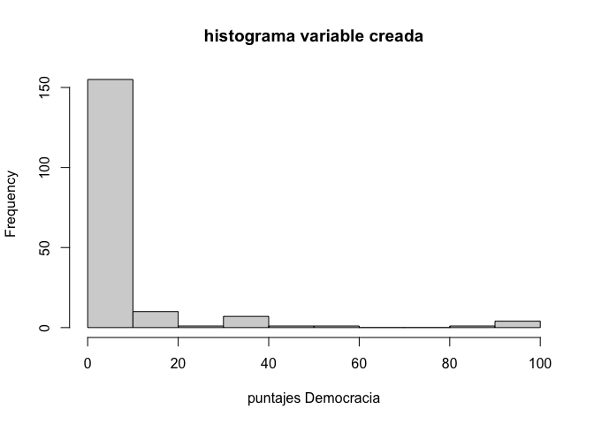
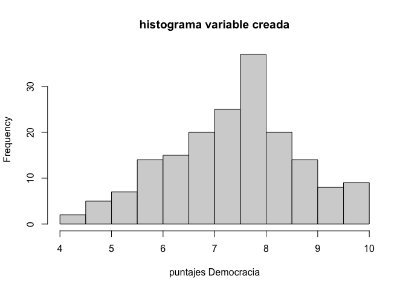
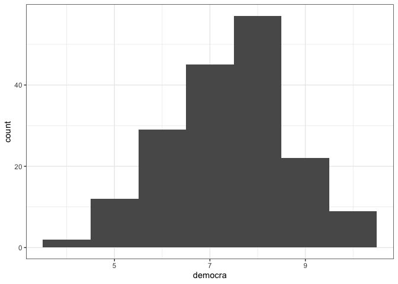
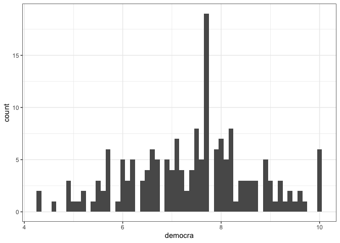
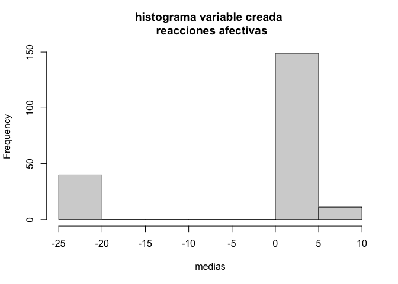
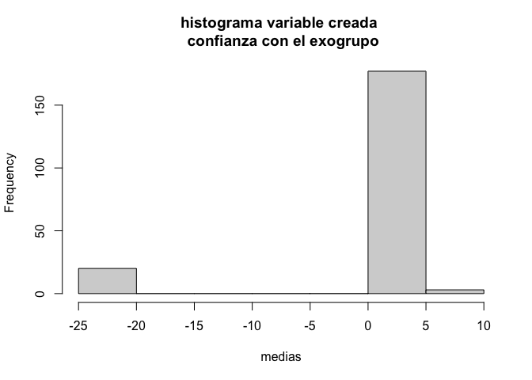

Preguntas foro 20210417
================

# Pregunta 20210417\_1

> Muchas gracias por su respuesta, pero el problema que tenemos es otro
> :( Lo que pasa es que creamos una variable con múltiples preguntas la
> cual designamos con el nombre de “democracia” . Esta variable se
> encuentra en la escala 2 (Formas de expresión), que mide los grados de
> acuerdo y desacuerdo en torno a diferentes preguntas, una de ellas:
> “cada ciudadano tiene el derecho de llevar sus convicciones…”. Al
> crear esta variable construida, con el siguiente código 

> INJUV$DEMOCRACIA=with(INJUV,rowMeans(cbind(I13\_1,I13\_2,I13\_3,I13\_4,I13\_5,I13\_6,I13\_7,I13\_8),na.rm
> = TRUE)) intentamos calcular la frecuencia con este código:
> stats::xtabs(\~ DEMOCRACIA, data = INJUV) %&gt;% knitr::kable() pero
> la tabla nos arroja números decimales (tal como se ve en la foto del
> mail anterior)… ese es el problema… Por lo mismo nos preguntamos si
> ocurre un problema con la base o si nos estamos equivocando con
> nuestros códigos. Avíseme si me explico más por favor, muchisimas
> gracias!

``` r
# abrir dplyr
library(dplyr)
```

    ## 
    ## Attaching package: 'dplyr'

    ## The following objects are masked from 'package:stats':
    ## 
    ##     filter, lag

    ## The following objects are masked from 'package:base':
    ## 
    ##     intersect, setdiff, setequal, union

``` r
# abrir datos
INJUV <- readr::read_csv("data/Injuv 2012.csv")
```

    ## 
    ## ── Column specification ────────────────────────────────────────────────────────
    ## cols(
    ##   .default = col_double()
    ## )
    ## ℹ Use `spec()` for the full column specifications.

``` r
# crear medias
INJUV$DEMOCRACIA=with(INJUV,rowMeans(cbind(I13_1,I13_2,I13_3,I13_4,I13_5,I13_6,I13_7,I13_8),na.rm = TRUE))

# inspeccionar
dplyr::glimpse(INJUV)
```

    ## Rows: 180
    ## Columns: 71
    ## $ SEXO        <dbl> 2, 1, 2, 1, 1, 2, 1, 2, 2, 2, 1, 2, 2, 2, 1, 2, 1, 2, 1, 2…
    ## $ EDAD_EXACTA <dbl> 15, 15, 15, 15, 15, 15, 15, 15, 15, 15, 15, 15, 15, 15, 15…
    ## $ GSE         <dbl> 2, 2, 2, 3, 3, 3, 3, 3, 3, 4, 4, 4, 4, 4, 4, 4, 4, 4, 4, 4…
    ## $ E9_1        <dbl> 4, 4, 4, 3, 5, 5, 5, 2, 4, 5, 4, 5, 5, 4, 2, 5, 2, 5, 5, 4…
    ## $ E9_2        <dbl> 4, 4, 4, 4, 5, 5, 4, 3, 2, 3, 3, 5, 4, 3, 3, 3, 4, 4, 2, 4…
    ## $ E9_3        <dbl> 3, 3, 4, 99, 1, 5, 4, 3, 2, 5, 4, 99, 1, 4, 3, 3, 4, 2, 2,…
    ## $ E9_4        <dbl> 2, 1, 2, 99, 1, 99, 3, 1, 4, 1, 3, 4, 2, 1, 3, 3, 1, 2, 4,…
    ## $ E9_5        <dbl> 4, 3, 3, 2, 5, 99, 4, 1, 2, 3, 2, 5, 5, 2, 3, 3, 5, 1, 4, …
    ## $ F1_1        <dbl> 4, 4, 4, 5, 5, 5, 5, 5, 5, 5, 4, 5, 4, 4, 4, 5, 4, 5, 5, 4…
    ## $ F1_2        <dbl> 3, 3, 4, 3, 5, 5, 5, 4, 4, 5, 3, 5, 4, 3, 4, 5, 4, 3, 4, 4…
    ## $ F1_3        <dbl> 3, 3, 4, 99, 3, 1, 5, 3, 99, 3, 3, 99, 3, 3, 3, 99, 5, 4, …
    ## $ F1_4        <dbl> 4, 3, 4, 4, 5, 3, 5, 1, 3, 4, 2, 1, 4, 4, 4, 1, 4, 4, 2, 4…
    ## $ F1_5        <dbl> 3, 3, 4, 4, 1, 3, 3, 1, 99, 99, 4, 99, 2, 3, 3, 1, 5, 4, 4…
    ## $ F1_6        <dbl> 3, 4, 4, 3, 3, 99, 2, 3, 4, 4, 4, 99, 3, 5, 3, 99, 5, 4, 4…
    ## $ F2_1        <dbl> 4, 3, 2, 4, 5, 5, 4, 4, 4, 2, 4, 99, 5, 5, 4, 5, 2, 5, 4, …
    ## $ F2_2        <dbl> 2, 3, 2, 4, 1, 5, 4, 4, 4, 5, 5, 99, 4, 5, 4, 5, 4, 5, 4, …
    ## $ F2_3        <dbl> 4, 3, 2, 4, 3, 99, 99, 3, 3, 2, 4, 99, 5, 3, 3, 3, 4, 2, 4…
    ## $ F6_1        <dbl> 1, 99, 1, 2, 2, 1, 1, 2, 2, 1, 2, 2, 2, 2, 2, 2, 2, 1, 2, …
    ## $ F6_2        <dbl> 1, 99, 1, 2, 2, 1, 2, 2, 2, 1, 2, 2, 2, 2, 2, 1, 2, 2, 2, …
    ## $ F6_3        <dbl> 1, 99, 2, 2, 2, 1, 1, 2, 2, 1, 2, 2, 1, 2, 2, 2, 2, 2, 2, …
    ## $ I1          <dbl> 2, 1, 3, 2, 1, 3, 1, 1, 1, 2, 1, 1, 1, 1, 1, 1, 3, 2, 2, 1…
    ## $ I10         <dbl> 3, 99, 3, 3, 1, 2, 3, 99, 3, 3, 2, 99, 3, 3, 3, 99, 3, 1, …
    ## $ I11         <dbl> 5, 99, 9, 10, 4, 10, 10, 99, 99, 6, 10, 99, 7, 7, 7, 99, 7…
    ## $ I12         <dbl> 4, 99, 2, 7, 6, 7, 4, 99, 99, 4, 5, 99, 10, 8, 5, 99, 5, 6…
    ## $ I13_1       <dbl> 6, 99, 6, 10, 10, 7, 1, 3, 99, 99, 10, 5, 7, 10, 7, 10, 10…
    ## $ I13_2       <dbl> 8, 99, 5, 10, 10, 10, 10, 8, 10, 10, 10, 5, 7, 10, 5, 10, …
    ## $ I13_3       <dbl> 7, 99, 5, 10, 10, 7, 10, 8, 10, 9, 10, 5, 10, 10, 8, 10, 1…
    ## $ I13_4       <dbl> 3, 99, 3, 10, 1, 1, 99, 1, 99, 1, 2, 99, 7, 1, 2, 1, 5, 7,…
    ## $ I13_5       <dbl> 5, 99, 3, 10, 10, 10, 7, 9, 99, 10, 99, 10, 6, 9, 6, 10, 7…
    ## $ I13_6       <dbl> 7, 99, 5, 10, 10, 99, 10, 9, 10, 10, 5, 99, 6, 99, 8, 8, 1…
    ## $ I13_7       <dbl> 3, 99, 3, 10, 1, 99, 6, 4, 10, 8, 2, 10, 2, 10, 6, 4, 1, 8…
    ## $ I13_8       <dbl> 8, 99, 9, 10, 10, 10, 10, 10, 10, 10, 10, 10, 10, 10, 8, 1…
    ## $ C1_1        <dbl> 4, 4, 5, 5, 5, 8, 8, 4, 4, 6, 7, 5, 3, 5, 5, 9, 5, 5, 6, 1…
    ## $ C1_2        <dbl> 3, 99, 3, 6, 2, 6, 2, 3, 4, 1, 1, 5, 6, 5, 3, 1, 7, 4, 4, …
    ## $ C1_3        <dbl> 3, 99, 1, 3, 2, 5, 1, 4, 3, 1, 6, 4, 6, 3, 2, 4, 4, 1, 4, …
    ## $ C1_4        <dbl> 3, 99, 2, 5, 1, 4, 2, 1, 4, 1, 2, 4, 5, 8, 4, 3, 8, 6, 6, …
    ## $ C1_5        <dbl> 3, 99, 1, 5, 1, 5, 1, 3, 3, 1, 5, 4, 5, 7, 2, 3, 6, 3, 5, …
    ## $ C1_6        <dbl> 5, 5, 1, 6, 4, 5, 5, 5, 5, 7, 3, 8, 10, 6, 5, 10, 9, 5, 8,…
    ## $ C1_7        <dbl> 5, 5, 2, 7, 6, 5, 5, 6, 5, 2, 4, 8, 6, 5, 5, 5, 8, 4, 8, 1…
    ## $ C1_8        <dbl> 5, 4, 1, 5, 8, 9, 6, 8, 4, 4, 4, 5, 3, 8, 4, 10, 5, 4, 10,…
    ## $ C1_9        <dbl> 4, 4, 2, 6, 4, 9, 7, 8, 4, 4, 5, 5, 6, 8, 4, 10, 6, 5, 9, …
    ## $ T1          <dbl> 3, 99, 3, 2, 4, 5, 3, 5, 4, 5, 5, 99, 3, 5, 5, 4, 5, 4, 4,…
    ## $ T3_1        <dbl> 4, 99, 5, 2, 5, 3, 4, 4, 3, 99, 5, 3, 4, 4, 3, 5, 99, 4, 5…
    ## $ T3_2        <dbl> 4, 99, 5, 2, 3, 3, 4, 5, 2, 99, 5, 3, 4, 4, 3, 5, 99, 4, 4…
    ## $ T3_3        <dbl> 3, 99, 2, 3, 3, 3, 4, 5, 2, 99, 4, 4, 4, 3, 3, 5, 99, 4, 4…
    ## $ T3_4        <dbl> 4, 99, 5, 2, 4, 99, 5, 5, 2, 99, 5, 5, 4, 4, 3, 4, 99, 2, …
    ## $ T3_5        <dbl> 4, 99, 5, 4, 4, 5, 1, 3, 5, 4, 5, 5, 3, 4, 1, 5, 99, 4, 4,…
    ## $ T3_6        <dbl> 4, 99, 5, 4, 3, 3, 2, 2, 5, 99, 5, 5, 3, 2, 4, 5, 99, 4, 4…
    ## $ T3_7        <dbl> 4, 99, 5, 4, 4, 3, 2, 2, 5, 4, 4, 5, 4, 5, 4, 5, 99, 4, 4,…
    ## $ Z1          <dbl> 1, 1, 1, 1, 1, 1, 1, 1, 1, 1, 1, 1, 1, 1, 1, 1, 1, 1, 1, 1…
    ## $ Z2          <dbl> 2, 1, 1, 1, 1, 3, 1, 1, 1, 1, 1, 1, 3, 1, 1, 1, 1, 1, 1, 1…
    ## $ Z5          <dbl> 1, 1, 1, 1, 1, 1, 2, 1, 1, 1, 1, 1, 1, 1, 1, 1, 1, 1, 1, 1…
    ## $ Z8          <dbl> 3, 2, 2, 2, 1, 2, 2, 2, 1, 3, 3, 2, NA, 2, 1, 2, 3, 2, 1, …
    ## $ Z10         <dbl> NA, NA, NA, NA, NA, NA, NA, NA, NA, NA, NA, NA, 2, NA, NA,…
    ## $ Z12_1       <dbl> 2, 3, 2, 3, 5, 3, 2, 3, 5, 3, 3, 3, 3, 3, 3, 2, 3, 2, 5, 3…
    ## $ Z12_2       <dbl> 99, 4, 4, 4, 99, 4, 4, 4, 99, 4, 3, 99, 4, 3, 99, 2, 3, 99…
    ## $ Z20_1       <dbl> 99, 5, 5, 99, 5, 5, 5, 2, 5, 4, 5, 4, 4, 5, 4, 4, 4, 4, 4,…
    ## $ Z20_2       <dbl> 4, 4, 5, 4, 5, 5, 4, 4, 3, 4, 5, 4, 2, 5, 4, 4, 5, 4, 4, 4…
    ## $ Z20_3       <dbl> 1, 2, 2, 1, 4, 3, 3, 2, 2, 4, 4, 4, 2, 4, 2, 4, 1, 4, 4, 1…
    ## $ Z20_4       <dbl> 1, 1, 4, 5, 5, 5, 4, 3, 4, 4, 5, 4, 4, 5, 4, 4, 3, 4, 1, 4…
    ## $ Z20_5       <dbl> 2, 5, 4, 4, 5, 5, 4, 4, 4, 2, 5, 3, 2, 5, 2, 4, 4, 4, 2, 1…
    ## $ Z20_6       <dbl> 5, 5, 5, 5, 5, 4, 5, 4, 4, 4, 5, 4, 4, 5, 4, 4, 4, 4, 1, 4…
    ## $ Z20_7       <dbl> 2, 5, 4, 1, 5, 1, 5, 3, 2, 1, 1, 3, 1, 1, 1, 3, 2, 1, 1, 1…
    ## $ Z20_8       <dbl> 1, 1, 2, 1, 1, 5, 3, 1, 1, 1, 1, 1, 1, 1, 1, 1, 1, 4, 1, 1…
    ## $ Z20_9       <dbl> 4, 1, 2, 3, 1, 1, 2, 1, 2, 5, 4, 1, 2, 5, 1, 1, 2, 3, 1, 1…
    ## $ Z20_10      <dbl> 1, 1, 4, 1, 1, 5, 1, 1, 2, 2, 2, 1, 1, 1, 1, 1, 1, 2, 1, 4…
    ## $ Z20_11      <dbl> 99, 5, 5, 99, 5, 5, 5, 2, 5, 4, 5, 4, 4, 5, 4, 4, 4, 4, 4,…
    ## $ Z22         <dbl> 1, 1, 1, 1, 5, 1, 1, 1, NA, 2, 1, NA, 2, 1, 1, NA, 1, 9, 1…
    ## $ W3          <dbl> 3, 3, 2, 3, 2, 3, 3, 2, 3, 2, 3, 3, 3, 3, 3, 3, 3, 2, 3, 2…
    ## $ W13         <dbl> 2, 2, 2, 2, 2, 2, 1, 2, 2, 2, 2, 99, 2, 2, 2, 2, 2, 1, 2, …
    ## $ DEMOCRACIA  <dbl> 5.875, 99.000, 4.875, 10.000, 7.750, 30.375, 19.125, 6.500…

``` r
# ver descriptivos
INJUV %>%
  dplyr::select(DEMOCRACIA) %>%
  r4sda::get_desc() %>%
  knitr::kable(., digits = 2)
```

    ## Loading required package: moments

    ## Loading required package: skimr

    ## Loading required package: haven

    ## Loading required package: labelled

    ## Loading required package: sjlabelled

    ## 
    ## Attaching package: 'sjlabelled'

    ## The following objects are masked from 'package:labelled':
    ## 
    ##     copy_labels, remove_labels, to_character, to_factor, val_labels

    ## The following objects are masked from 'package:haven':
    ## 
    ##     as_factor, read_sas, read_spss, read_stata, write_sas, zap_labels

    ## The following object is masked from 'package:dplyr':
    ## 
    ##     as_label

| var        | missing | complete |   n |  mean |   sd |  min |  p25 | median |  p75 | max | skew |  kurt | hist     |
|:-----------|--------:|---------:|----:|------:|-----:|-----:|-----:|-------:|-----:|----:|-----:|------:|:---------|
| DEMOCRACIA |       0 |        1 | 180 | 11.92 | 15.9 | 4.25 | 6.62 |   7.75 | 8.78 |  99 | 4.47 | 23.56 | ▇▁▁▁▁▁▁▁ |

``` r
# vert histograma
hist(INJUV$DEMOCRACIA, 
     main = 'histograma variable creada',
     xlab = 'puntajes Democracia')
```

<!-- -->

El problema esta en los valores de las respuestas no válidas. Estas
poseen 99 (ver Anexos). Estos valores deben ser convertidos a NA, de
modo que R pueda tratarlos como valores perdidos. Voy a repetir todo el
código desde el inicio:

-   abrir datos
-   convertir 99 a NA
-   verificar los datos convertidos
-   crear el puntaje promedio
-   revisar descriptivo del puntaje promedio creado
-   generar histograma

``` r
# abrir dplyr
library(dplyr)

# abrir datos
data_injuv <- readr::read_csv("data/Injuv 2012.csv")
```

    ## 
    ## ── Column specification ────────────────────────────────────────────────────────
    ## cols(
    ##   .default = col_double()
    ## )
    ## ℹ Use `spec()` for the full column specifications.

``` r
# convertir 99 a NA
data_dem <- data_injuv %>%
            dplyr::select(I13_1:I13_8) %>%
            dplyr::na_if(., 99)
  
# ver valores
data_injuv %>%
  dplyr::select(I13_1:I13_8) %>%
  r4sda::wide_resp() %>%
  knitr::kable(., digits = 2)
```

| variable |   01 |   02 |   03 |   04 |   05 |   06 |   07 |   08 |   09 |   10 |   99 | hist     |
|:---------|-----:|-----:|-----:|-----:|-----:|-----:|-----:|-----:|-----:|-----:|-----:|:---------|
| I13\_1   | 0.03 | 0.01 | 0.02 | 0.03 | 0.11 | 0.07 | 0.11 | 0.12 | 0.09 | 0.36 | 0.05 | ▇▁▁▁▁▁▁▁ |
| I13\_2   |   NA |   NA | 0.01 | 0.02 | 0.07 | 0.07 | 0.05 | 0.13 | 0.11 | 0.51 | 0.04 | ▇▁▁▁▁▁▁▁ |
| I13\_3   | 0.01 |   NA | 0.02 | 0.02 | 0.09 | 0.09 | 0.09 | 0.13 | 0.09 | 0.43 | 0.03 | ▇▁▁▁▁▁▁▁ |
| I13\_4   | 0.33 | 0.08 | 0.09 | 0.05 | 0.07 | 0.08 | 0.08 | 0.06 | 0.02 | 0.07 | 0.07 | ▇▁▁▁▁▁▁▁ |
| I13\_5   | 0.02 | 0.02 | 0.03 | 0.01 | 0.14 | 0.10 | 0.12 | 0.08 | 0.07 | 0.32 | 0.09 | ▇▁▁▁▁▁▁▁ |
| I13\_6   | 0.05 |   NA | 0.02 | 0.03 | 0.13 | 0.11 | 0.07 | 0.11 | 0.12 | 0.33 | 0.05 | ▇▁▁▁▁▁▁▁ |
| I13\_7   | 0.06 | 0.04 | 0.06 | 0.04 | 0.14 | 0.13 | 0.14 | 0.11 | 0.04 | 0.19 | 0.03 | ▇▁▁▁▁▁▁▁ |
| I13\_8   |   NA |   NA | 0.01 | 0.01 | 0.04 | 0.04 | 0.03 | 0.11 | 0.06 | 0.68 | 0.02 | ▇▁▁▁▁▁▁▁ |

``` r
# crear medias
data_injuv$democra <- with(data_dem,
                        rowMeans(
                          cbind(
                            I13_1,I13_2,I13_3,I13_4,
                            I13_5,I13_6,I13_7,I13_8
                            ),
                          na.rm = TRUE))

# Nota: se edita el codidgo para que sea visible.

# inspeccionar
dplyr::glimpse(data_injuv)
```

    ## Rows: 180
    ## Columns: 71
    ## $ SEXO        <dbl> 2, 1, 2, 1, 1, 2, 1, 2, 2, 2, 1, 2, 2, 2, 1, 2, 1, 2, 1, 2…
    ## $ EDAD_EXACTA <dbl> 15, 15, 15, 15, 15, 15, 15, 15, 15, 15, 15, 15, 15, 15, 15…
    ## $ GSE         <dbl> 2, 2, 2, 3, 3, 3, 3, 3, 3, 4, 4, 4, 4, 4, 4, 4, 4, 4, 4, 4…
    ## $ E9_1        <dbl> 4, 4, 4, 3, 5, 5, 5, 2, 4, 5, 4, 5, 5, 4, 2, 5, 2, 5, 5, 4…
    ## $ E9_2        <dbl> 4, 4, 4, 4, 5, 5, 4, 3, 2, 3, 3, 5, 4, 3, 3, 3, 4, 4, 2, 4…
    ## $ E9_3        <dbl> 3, 3, 4, 99, 1, 5, 4, 3, 2, 5, 4, 99, 1, 4, 3, 3, 4, 2, 2,…
    ## $ E9_4        <dbl> 2, 1, 2, 99, 1, 99, 3, 1, 4, 1, 3, 4, 2, 1, 3, 3, 1, 2, 4,…
    ## $ E9_5        <dbl> 4, 3, 3, 2, 5, 99, 4, 1, 2, 3, 2, 5, 5, 2, 3, 3, 5, 1, 4, …
    ## $ F1_1        <dbl> 4, 4, 4, 5, 5, 5, 5, 5, 5, 5, 4, 5, 4, 4, 4, 5, 4, 5, 5, 4…
    ## $ F1_2        <dbl> 3, 3, 4, 3, 5, 5, 5, 4, 4, 5, 3, 5, 4, 3, 4, 5, 4, 3, 4, 4…
    ## $ F1_3        <dbl> 3, 3, 4, 99, 3, 1, 5, 3, 99, 3, 3, 99, 3, 3, 3, 99, 5, 4, …
    ## $ F1_4        <dbl> 4, 3, 4, 4, 5, 3, 5, 1, 3, 4, 2, 1, 4, 4, 4, 1, 4, 4, 2, 4…
    ## $ F1_5        <dbl> 3, 3, 4, 4, 1, 3, 3, 1, 99, 99, 4, 99, 2, 3, 3, 1, 5, 4, 4…
    ## $ F1_6        <dbl> 3, 4, 4, 3, 3, 99, 2, 3, 4, 4, 4, 99, 3, 5, 3, 99, 5, 4, 4…
    ## $ F2_1        <dbl> 4, 3, 2, 4, 5, 5, 4, 4, 4, 2, 4, 99, 5, 5, 4, 5, 2, 5, 4, …
    ## $ F2_2        <dbl> 2, 3, 2, 4, 1, 5, 4, 4, 4, 5, 5, 99, 4, 5, 4, 5, 4, 5, 4, …
    ## $ F2_3        <dbl> 4, 3, 2, 4, 3, 99, 99, 3, 3, 2, 4, 99, 5, 3, 3, 3, 4, 2, 4…
    ## $ F6_1        <dbl> 1, 99, 1, 2, 2, 1, 1, 2, 2, 1, 2, 2, 2, 2, 2, 2, 2, 1, 2, …
    ## $ F6_2        <dbl> 1, 99, 1, 2, 2, 1, 2, 2, 2, 1, 2, 2, 2, 2, 2, 1, 2, 2, 2, …
    ## $ F6_3        <dbl> 1, 99, 2, 2, 2, 1, 1, 2, 2, 1, 2, 2, 1, 2, 2, 2, 2, 2, 2, …
    ## $ I1          <dbl> 2, 1, 3, 2, 1, 3, 1, 1, 1, 2, 1, 1, 1, 1, 1, 1, 3, 2, 2, 1…
    ## $ I10         <dbl> 3, 99, 3, 3, 1, 2, 3, 99, 3, 3, 2, 99, 3, 3, 3, 99, 3, 1, …
    ## $ I11         <dbl> 5, 99, 9, 10, 4, 10, 10, 99, 99, 6, 10, 99, 7, 7, 7, 99, 7…
    ## $ I12         <dbl> 4, 99, 2, 7, 6, 7, 4, 99, 99, 4, 5, 99, 10, 8, 5, 99, 5, 6…
    ## $ I13_1       <dbl> 6, 99, 6, 10, 10, 7, 1, 3, 99, 99, 10, 5, 7, 10, 7, 10, 10…
    ## $ I13_2       <dbl> 8, 99, 5, 10, 10, 10, 10, 8, 10, 10, 10, 5, 7, 10, 5, 10, …
    ## $ I13_3       <dbl> 7, 99, 5, 10, 10, 7, 10, 8, 10, 9, 10, 5, 10, 10, 8, 10, 1…
    ## $ I13_4       <dbl> 3, 99, 3, 10, 1, 1, 99, 1, 99, 1, 2, 99, 7, 1, 2, 1, 5, 7,…
    ## $ I13_5       <dbl> 5, 99, 3, 10, 10, 10, 7, 9, 99, 10, 99, 10, 6, 9, 6, 10, 7…
    ## $ I13_6       <dbl> 7, 99, 5, 10, 10, 99, 10, 9, 10, 10, 5, 99, 6, 99, 8, 8, 1…
    ## $ I13_7       <dbl> 3, 99, 3, 10, 1, 99, 6, 4, 10, 8, 2, 10, 2, 10, 6, 4, 1, 8…
    ## $ I13_8       <dbl> 8, 99, 9, 10, 10, 10, 10, 10, 10, 10, 10, 10, 10, 10, 8, 1…
    ## $ C1_1        <dbl> 4, 4, 5, 5, 5, 8, 8, 4, 4, 6, 7, 5, 3, 5, 5, 9, 5, 5, 6, 1…
    ## $ C1_2        <dbl> 3, 99, 3, 6, 2, 6, 2, 3, 4, 1, 1, 5, 6, 5, 3, 1, 7, 4, 4, …
    ## $ C1_3        <dbl> 3, 99, 1, 3, 2, 5, 1, 4, 3, 1, 6, 4, 6, 3, 2, 4, 4, 1, 4, …
    ## $ C1_4        <dbl> 3, 99, 2, 5, 1, 4, 2, 1, 4, 1, 2, 4, 5, 8, 4, 3, 8, 6, 6, …
    ## $ C1_5        <dbl> 3, 99, 1, 5, 1, 5, 1, 3, 3, 1, 5, 4, 5, 7, 2, 3, 6, 3, 5, …
    ## $ C1_6        <dbl> 5, 5, 1, 6, 4, 5, 5, 5, 5, 7, 3, 8, 10, 6, 5, 10, 9, 5, 8,…
    ## $ C1_7        <dbl> 5, 5, 2, 7, 6, 5, 5, 6, 5, 2, 4, 8, 6, 5, 5, 5, 8, 4, 8, 1…
    ## $ C1_8        <dbl> 5, 4, 1, 5, 8, 9, 6, 8, 4, 4, 4, 5, 3, 8, 4, 10, 5, 4, 10,…
    ## $ C1_9        <dbl> 4, 4, 2, 6, 4, 9, 7, 8, 4, 4, 5, 5, 6, 8, 4, 10, 6, 5, 9, …
    ## $ T1          <dbl> 3, 99, 3, 2, 4, 5, 3, 5, 4, 5, 5, 99, 3, 5, 5, 4, 5, 4, 4,…
    ## $ T3_1        <dbl> 4, 99, 5, 2, 5, 3, 4, 4, 3, 99, 5, 3, 4, 4, 3, 5, 99, 4, 5…
    ## $ T3_2        <dbl> 4, 99, 5, 2, 3, 3, 4, 5, 2, 99, 5, 3, 4, 4, 3, 5, 99, 4, 4…
    ## $ T3_3        <dbl> 3, 99, 2, 3, 3, 3, 4, 5, 2, 99, 4, 4, 4, 3, 3, 5, 99, 4, 4…
    ## $ T3_4        <dbl> 4, 99, 5, 2, 4, 99, 5, 5, 2, 99, 5, 5, 4, 4, 3, 4, 99, 2, …
    ## $ T3_5        <dbl> 4, 99, 5, 4, 4, 5, 1, 3, 5, 4, 5, 5, 3, 4, 1, 5, 99, 4, 4,…
    ## $ T3_6        <dbl> 4, 99, 5, 4, 3, 3, 2, 2, 5, 99, 5, 5, 3, 2, 4, 5, 99, 4, 4…
    ## $ T3_7        <dbl> 4, 99, 5, 4, 4, 3, 2, 2, 5, 4, 4, 5, 4, 5, 4, 5, 99, 4, 4,…
    ## $ Z1          <dbl> 1, 1, 1, 1, 1, 1, 1, 1, 1, 1, 1, 1, 1, 1, 1, 1, 1, 1, 1, 1…
    ## $ Z2          <dbl> 2, 1, 1, 1, 1, 3, 1, 1, 1, 1, 1, 1, 3, 1, 1, 1, 1, 1, 1, 1…
    ## $ Z5          <dbl> 1, 1, 1, 1, 1, 1, 2, 1, 1, 1, 1, 1, 1, 1, 1, 1, 1, 1, 1, 1…
    ## $ Z8          <dbl> 3, 2, 2, 2, 1, 2, 2, 2, 1, 3, 3, 2, NA, 2, 1, 2, 3, 2, 1, …
    ## $ Z10         <dbl> NA, NA, NA, NA, NA, NA, NA, NA, NA, NA, NA, NA, 2, NA, NA,…
    ## $ Z12_1       <dbl> 2, 3, 2, 3, 5, 3, 2, 3, 5, 3, 3, 3, 3, 3, 3, 2, 3, 2, 5, 3…
    ## $ Z12_2       <dbl> 99, 4, 4, 4, 99, 4, 4, 4, 99, 4, 3, 99, 4, 3, 99, 2, 3, 99…
    ## $ Z20_1       <dbl> 99, 5, 5, 99, 5, 5, 5, 2, 5, 4, 5, 4, 4, 5, 4, 4, 4, 4, 4,…
    ## $ Z20_2       <dbl> 4, 4, 5, 4, 5, 5, 4, 4, 3, 4, 5, 4, 2, 5, 4, 4, 5, 4, 4, 4…
    ## $ Z20_3       <dbl> 1, 2, 2, 1, 4, 3, 3, 2, 2, 4, 4, 4, 2, 4, 2, 4, 1, 4, 4, 1…
    ## $ Z20_4       <dbl> 1, 1, 4, 5, 5, 5, 4, 3, 4, 4, 5, 4, 4, 5, 4, 4, 3, 4, 1, 4…
    ## $ Z20_5       <dbl> 2, 5, 4, 4, 5, 5, 4, 4, 4, 2, 5, 3, 2, 5, 2, 4, 4, 4, 2, 1…
    ## $ Z20_6       <dbl> 5, 5, 5, 5, 5, 4, 5, 4, 4, 4, 5, 4, 4, 5, 4, 4, 4, 4, 1, 4…
    ## $ Z20_7       <dbl> 2, 5, 4, 1, 5, 1, 5, 3, 2, 1, 1, 3, 1, 1, 1, 3, 2, 1, 1, 1…
    ## $ Z20_8       <dbl> 1, 1, 2, 1, 1, 5, 3, 1, 1, 1, 1, 1, 1, 1, 1, 1, 1, 4, 1, 1…
    ## $ Z20_9       <dbl> 4, 1, 2, 3, 1, 1, 2, 1, 2, 5, 4, 1, 2, 5, 1, 1, 2, 3, 1, 1…
    ## $ Z20_10      <dbl> 1, 1, 4, 1, 1, 5, 1, 1, 2, 2, 2, 1, 1, 1, 1, 1, 1, 2, 1, 4…
    ## $ Z20_11      <dbl> 99, 5, 5, 99, 5, 5, 5, 2, 5, 4, 5, 4, 4, 5, 4, 4, 4, 4, 4,…
    ## $ Z22         <dbl> 1, 1, 1, 1, 5, 1, 1, 1, NA, 2, 1, NA, 2, 1, 1, NA, 1, 9, 1…
    ## $ W3          <dbl> 3, 3, 2, 3, 2, 3, 3, 2, 3, 2, 3, 3, 3, 3, 3, 3, 3, 2, 3, 2…
    ## $ W13         <dbl> 2, 2, 2, 2, 2, 2, 1, 2, 2, 2, 2, 99, 2, 2, 2, 2, 2, 1, 2, …
    ## $ democra     <dbl> 5.875000, NaN, 4.875000, 10.000000, 7.750000, 7.500000, 7.…

``` r
# ver descriptivos
data_injuv %>%
  dplyr::select(democra) %>%
  r4sda::get_desc() %>%
  knitr::kable(., digits = 2)
```

| var     | missing | complete |   n | mean |   sd |  min |  p25 | median |  p75 | max |  skew | kurt | hist     |
|:--------|--------:|---------:|----:|-----:|-----:|-----:|-----:|-------:|-----:|----:|------:|-----:|:---------|
| democra |    0.02 |     0.98 | 180 | 7.42 | 1.26 | 4.25 | 6.62 |   7.56 | 8.25 |  10 | -0.15 | 2.71 | ▁▂▅▆▇▆▃▂ |

``` r
# vert histograma
hist(data_injuv$democra, 
     main = 'histograma variable creada',
     xlab = 'puntajes Democracia')


# vert histograma con intervalos gruesos
library(ggplot2)
```

<!-- -->

``` r
ggplot(data_injuv, aes(x=democra)) + 
geom_histogram(binwidth=1) + 
  theme_bw()
```

<!-- -->

``` r
# vert histograma con intervalos delgados
library(ggplot2)
ggplot(data_injuv, aes(x=democra)) + 
  geom_histogram(binwidth=.1) + 
  theme_bw()
```

<!-- -->

# Anexos

-   Los items I13\_1 a I13\_8 poseen valores válidos de 1 a 10, donde
    99, es respuesta vacía. Ver:
    <https://www.injuv.gob.cl/sites/default/files/cuestionario_7ma_enj_cara_a_cara.pdf>

# Pregunta 20210417\_2

> Hola! espero que estén bien :) escribo como parte del grupo 8 y
> tenemos una duda que no nos deja avanzar con el análisis (puse este
> mismo mensaje en el foro por si prefieren responder ahí). Estamos
> trabajando con la base de datos “Amistad Intergrupal” y tenemos
> problemas precisamente con la variable de reacciones afectivas y
> confianza hacia el exogrupo, ya que como son variables construidas las
> agrupamos para poder calcular las medidas de tendencia central y de
> dispersión, y además poder cruzarla con otras variables categóricas.
> Estas variables incluían (dentro de la misma) 3 preguntas que se
> responden de 1-7. Sin embargo, al agrupar los 3 ítems en una sola gran
> variable, el rango pasa a ser de 1.0-5.5, entonces no sabemos como
> interpretar tanto los descriptivos como los gráficos que muestran la
> distribución de la variable.

> El código que utilizamos en R es el siguiente, y nos basamos en el
> código publicado previamente con el ayudante:

``` text
data_informe$reacciones_afectivas=with(data_informe,rowMeans(cbind(affo1,affo2,affo3,na.rm=TRUE)))
data_informe$confianza_exogrupo=with(data_informe,rowMeans(cbind(outt1,outt2,outt3,na.rm=TRUE)))
```

> Esperamos su respuesta :( gracias!

Hola Josefa, primero vamos a replicar el codigo empleado, y ver si puedo
reproducir los mismos resultados.

``` r
# abrir dplyr
library(dplyr)

# abrir datos
data_informe <- readr::read_csv("data/Amistad intergrupal.csv")
```

    ## 
    ## ── Column specification ────────────────────────────────────────────────────────
    ## cols(
    ##   .default = col_double(),
    ##   ethnia = col_character()
    ## )
    ## ℹ Use `spec()` for the full column specifications.

``` r
# crear medias
data_informe$reacciones_afectivas=with(data_informe,rowMeans(cbind(affo1,affo2,affo3,na.rm=TRUE)))
data_informe$confianza_exogrupo=with(data_informe,rowMeans(cbind(outt1,outt2,outt3,na.rm=TRUE)))

# ver descriptivos
data_informe %>%
  dplyr::select(reacciones_afectivas, confianza_exogrupo) %>%
  r4sda::get_desc() %>%
  knitr::kable(., digits = 2)
```

| var                   | missing | complete |   n |  mean |    sd | min |  p25 | median |  p75 | max |  skew | kurt | hist     |
|:----------------------|--------:|---------:|----:|------:|------:|----:|-----:|-------:|-----:|----:|------:|-----:|:---------|
| reacciones\_afectivas |       0 |        1 | 200 | -1.46 | 10.42 | -24 | 1.75 |   3.50 | 4.50 | 5.5 | -1.47 | 3.23 | ▂▁▁▁▁▁▁▇ |
| confianza\_exogrupo   |       0 |        1 | 200 |  0.66 |  7.75 | -24 | 2.50 |   3.25 | 3.75 | 5.5 | -2.62 | 7.98 | ▁▁▁▁▁▁▁▇ |

``` r
# vert histograma
hist(data_informe$reacciones_afectivas, 
     main = 'histograma variable creada \n reacciones afectivas',
     xlab = 'medias')
```

<!-- -->

``` r
# vert histograma
hist(data_informe$confianza_exogrupo, 
     main = 'histograma variable creada \n confianza con el exogrupo',
     xlab = 'medias')
```

<!-- -->

Creo que la razón la por cual no se obtienen rangos, en las variables
creadas, similares a los esperados es debido a la presencia de valores
-99. Además, es posible que esto se produce por como esta escrita la
funcion de “rowMeans”. En el siguiente codigo voy a incluir diferentes
formas de crear el puntaje promedio, y compararla con el codigo
original. Para simplifcar el ejemplo, solo haremos el ejericio con los
items aff1, aff2 e aff3. Vamos a convertir estos valores a “NA”, de modo
que R los interprete como valores perdidos, y luego calcularemos
descriptivos con las variables creadas.

Al igual que en el caso anterior, repetiremos todos los pasos de forma
explícita:

-   cargar los datos en sesión
-   convertir `-99` a `NA`
-   verificar los datos convertidos
-   crear el puntaje promedio
-   revisar los promedios generado para 4 casos.

``` r
# -----------------------------------------------------------------------------
# comparación de generacion de mean scores
# -----------------------------------------------------------------------------

# -----------------------------------------------
# abrir dplyr
# -----------------------------------------------
library(dplyr)

# -----------------------------------------------
# abrir los datos
# -----------------------------------------------

data_amistad <- readr::read_csv("data/Amistad intergrupal.csv")
```

    ## 
    ## ── Column specification ────────────────────────────────────────────────────────
    ## cols(
    ##   .default = col_double(),
    ##   ethnia = col_character()
    ## )
    ## ℹ Use `spec()` for the full column specifications.

``` r
# -----------------------------------------------
# revisar la tabla de variables
# -----------------------------------------------

data_amistad %>%
  r4sda::variables_table() %>%
  knitr::kable()
```

    ## Loading required package: purrr

    ## Loading required package: stringr

| variable | type | values                        | labels                    |
|:---------|:-----|:------------------------------|:--------------------------|
| ID       | dbl  | 12, 13, 14, 15, 16, 17, 18, … | === no variable label === |
| affo1    | dbl  | , 6, 4, 6, 2, 5, 5, 4, 6, 6,… | === no variable label === |
| affo2    | dbl  | 7, 7, -99, 4, 6, 7, 7, -99,…  | === no variable label === |
| affo3    | dbl  | 7, 5, 1, 2, 5, 5, 1, 4, 4, …  | === no variable label === |
| outt1    | dbl  | 4, 6, 1, 5, 1, 4, 3, 4, 2, …  | === no variable label === |
| outt2    | dbl  | 1, 1, 4, 3, 2, 3, 1, 4, 5, …  | === no variable label === |
| outt3    | dbl  | 7, 7, 1, 5, 3, 3, 2, 4, 4, …  | === no variable label === |
| famn1    | dbl  | 4, 6, 4, 3, 4, 4, 7, 5, 4, …  | === no variable label === |
| famn2    | dbl  | 4, 6, 4, 3, -99, 4, 7, 5, 4…  | === no variable label === |
| famn3    | dbl  | 4, 4, 1, 3, 4, 5, 7, -99, -…  | === no variable label === |
| clan1    | dbl  | 4, 3, 1, 3, 6, 7, 4, 2, 5, …  | === no variable label === |
| clan2    | dbl  | 4, 4, 1, 3, 5, 4, 4, 4, 4, …  | === no variable label === |
| clan3    | dbl  | 4, 4, 6, 3, 5, 4, 4, 4, 5, …  | === no variable label === |
| natic1   | dbl  | 4, 7, -99, 2, 4, 4, 7, 4, 4…  | === no variable label === |
| natic2   | dbl  | , 5, 4, 7, 3, 3, -99, 4, 7, … | === no variable label === |
| natic3   | dbl  | , 7, 7, 7, 4, 7, 6, 4, 7, 7,… | === no variable label === |
| idma1    | dbl  | 1, 7, 1, 2, 2, 2, 7, 1, 4, …  | === no variable label === |
| idma2    | dbl  | 4, -99, 5, -99, 1, 5, -99, 7… | === no variable label === |
| idma3    | dbl  | 4, 1, 6, 1, 2, -99, 4, 7, 1,… | === no variable label === |
| qous1    | dbl  | 2, 5, 1, 1, 4, 3, 5, 5, 4, …  | === no variable label === |
| qous2    | dbl  | 2, 5, 1, -99, 6, 3, 5, 4, 4…  | === no variable label === |
| qous3    | dbl  | -99, 2, 5, 1, 2, 7, 3, 6, 4,… | === no variable label === |
| qous4    | dbl  | 2, 4, 1, 2, 6, 3, 5, 3, 4, …  | === no variable label === |
| qous5    | dbl  | 6, 3, 4, 1, 2, 7, 4, 7, 2, 5… | === no variable label === |
| goufr    | dbl  | 10, 3, 2, 1, 2, 2, 7, 0, 10,… | === no variable label === |
| ethnia   | chr  | “CHI”, “CHI”, “CHI”, “CHI”, … | === no variable label === |
| sex      | dbl  | 2, 1, 1, 2, 2, 2, 1, 1, 2, …  | === no variable label === |
| region   | dbl  | 1, 1, 2, 2, 2, 1, 2, 2, 1, …  | === no variable label === |
| age      | dbl  | 14, 14, 15, 16, 17, 14, 15,…  | === no variable label === |

``` r
# -----------------------------------------------
# revisar los valores digitados en todas las variables de pocas categorias
# -----------------------------------------------

data_amistad %>%
  dplyr::select(-ethnia, -ID, -age) %>%
r4sda::wide_resp() %>%
  knitr::kable()
```

| variable |   -99 |    00 |    01 |    02 |    03 |    04 |    05 |    06 |    07 |    08 |   09 |    10 | hist     |
|:---------|------:|------:|------:|------:|------:|------:|------:|------:|------:|------:|-----:|------:|:---------|
| affo1    | 0.045 |    NA | 0.020 | 0.025 | 0.040 | 0.175 | 0.175 | 0.290 | 0.230 |    NA |   NA |    NA | ▁▁▁▁▁▁▁▇ |
| affo2    | 0.095 |    NA | 0.130 | 0.040 | 0.115 | 0.205 | 0.160 | 0.130 | 0.125 |    NA |   NA |    NA | ▁▁▁▁▁▁▁▇ |
| affo3    | 0.060 |    NA | 0.080 | 0.070 | 0.115 | 0.235 | 0.210 | 0.145 | 0.085 |    NA |   NA |    NA | ▁▁▁▁▁▁▁▇ |
| outt1    | 0.020 |    NA | 0.105 | 0.045 | 0.115 | 0.245 | 0.210 | 0.160 | 0.100 |    NA |   NA |    NA | ▁▁▁▁▁▁▁▇ |
| outt2    | 0.045 |    NA | 0.260 | 0.130 | 0.100 | 0.155 | 0.130 | 0.125 | 0.055 |    NA |   NA |    NA | ▁▁▁▁▁▁▁▇ |
| outt3    | 0.035 |    NA | 0.105 | 0.070 | 0.115 | 0.245 | 0.185 | 0.130 | 0.115 |    NA |   NA |    NA | ▁▁▁▁▁▁▁▇ |
| famn1    | 0.030 |    NA | 0.080 | 0.045 | 0.090 | 0.170 | 0.170 | 0.205 | 0.210 |    NA |   NA |    NA | ▁▁▁▁▁▁▁▇ |
| famn2    | 0.070 |    NA | 0.055 | 0.060 | 0.090 | 0.185 | 0.205 | 0.165 | 0.170 |    NA |   NA |    NA | ▁▁▁▁▁▁▁▇ |
| famn3    | 0.020 |    NA | 0.090 | 0.065 | 0.085 | 0.270 | 0.160 | 0.160 | 0.150 |    NA |   NA |    NA | ▁▁▁▁▁▁▁▇ |
| clan1    | 0.005 |    NA | 0.090 | 0.055 | 0.145 | 0.295 | 0.135 | 0.150 | 0.125 |    NA |   NA |    NA | ▁▁▁▁▁▁▁▇ |
| clan2    | 0.075 |    NA | 0.080 | 0.055 | 0.155 | 0.255 | 0.130 | 0.155 | 0.095 |    NA |   NA |    NA | ▁▁▁▁▁▁▁▇ |
| clan3    | 0.015 |    NA | 0.090 | 0.075 | 0.140 | 0.250 | 0.215 | 0.135 | 0.080 |    NA |   NA |    NA | ▁▁▁▁▁▁▁▇ |
| natic1   | 0.095 |    NA | 0.045 | 0.085 | 0.060 | 0.170 | 0.160 | 0.170 | 0.215 |    NA |   NA |    NA | ▁▁▁▁▁▁▁▇ |
| natic2   | 0.085 |    NA | 0.050 | 0.040 | 0.070 | 0.125 | 0.190 | 0.180 | 0.260 |    NA |   NA |    NA | ▁▁▁▁▁▁▁▇ |
| natic3   | 0.020 |    NA | 0.035 | 0.040 | 0.050 | 0.115 | 0.080 | 0.150 | 0.510 |    NA |   NA |    NA | ▁▁▁▁▁▁▁▇ |
| idma1    | 0.065 |    NA | 0.190 | 0.130 | 0.070 | 0.155 | 0.110 | 0.070 | 0.210 |    NA |   NA |    NA | ▁▁▁▁▁▁▁▇ |
| idma2    | 0.085 |    NA | 0.210 | 0.110 | 0.110 | 0.150 | 0.130 | 0.080 | 0.125 |    NA |   NA |    NA | ▁▁▁▁▁▁▁▇ |
| idma3    | 0.075 |    NA | 0.245 | 0.105 | 0.075 | 0.125 | 0.125 | 0.075 | 0.175 |    NA |   NA |    NA | ▁▁▁▁▁▁▁▇ |
| qous1    | 0.065 |    NA | 0.090 | 0.070 | 0.120 | 0.250 | 0.175 | 0.095 | 0.135 |    NA |   NA |    NA | ▁▁▁▁▁▁▁▇ |
| qous2    | 0.015 |    NA | 0.035 | 0.090 | 0.090 | 0.215 | 0.185 | 0.185 | 0.185 |    NA |   NA |    NA | ▁▁▁▁▁▁▁▇ |
| qous3    | 0.060 |    NA | 0.045 | 0.085 | 0.075 | 0.160 | 0.155 | 0.170 | 0.250 |    NA |   NA |    NA | ▁▁▁▁▁▁▁▇ |
| qous4    | 0.085 |    NA | 0.040 | 0.045 | 0.110 | 0.190 | 0.150 | 0.170 | 0.210 |    NA |   NA |    NA | ▁▁▁▁▁▁▁▇ |
| qous5    | 0.085 |    NA | 0.045 | 0.045 | 0.080 | 0.190 | 0.140 | 0.175 | 0.240 |    NA |   NA |    NA | ▁▁▁▁▁▁▁▇ |
| goufr    | 0.080 | 0.045 | 0.065 | 0.085 | 0.070 | 0.055 | 0.045 | 0.040 | 0.035 | 0.035 | 0.03 | 0.415 | ▁▁▁▁▁▁▁▇ |
| sex      |    NA |    NA | 0.520 | 0.480 |    NA |    NA |    NA |    NA |    NA |    NA |   NA |    NA | ▇▁▁▁▁▁▁▇ |
| region   |    NA |    NA | 0.195 | 0.805 |    NA |    NA |    NA |    NA |    NA |    NA |   NA |    NA | ▂▁▁▁▁▁▁▇ |

``` r
# -----------------------------------------------
# convertir todos los -99 a NA
# -----------------------------------------------

data_amistad <- data_amistad %>%
                dplyr::na_if(-99)

# -----------------------------------------------
# revisar la conversion
# -----------------------------------------------

data_amistad %>%
  dplyr::select(-ethnia, -ID, -age) %>%
r4sda::wide_resp() %>%
  knitr::kable()
```

| variable |    00 |    01 |    02 |    03 |    04 |    05 |    06 |    07 |    08 |   09 |    10 |    NA | hist     |
|:---------|------:|------:|------:|------:|------:|------:|------:|------:|------:|-----:|------:|------:|:---------|
| affo1    |    NA | 0.020 | 0.025 | 0.040 | 0.175 | 0.175 | 0.290 | 0.230 |    NA |   NA |    NA | 0.045 | ▁▁▁▅▁▅▇▆ |
| affo2    |    NA | 0.130 | 0.040 | 0.115 | 0.205 | 0.160 | 0.130 | 0.125 |    NA |   NA |    NA | 0.095 | ▅▂▅▇▁▆▅▅ |
| affo3    |    NA | 0.080 | 0.070 | 0.115 | 0.235 | 0.210 | 0.145 | 0.085 |    NA |   NA |    NA | 0.060 | ▃▂▃▇▁▇▅▃ |
| outt1    |    NA | 0.105 | 0.045 | 0.115 | 0.245 | 0.210 | 0.160 | 0.100 |    NA |   NA |    NA | 0.020 | ▃▂▃▇▁▇▅▃ |
| outt2    |    NA | 0.260 | 0.130 | 0.100 | 0.155 | 0.130 | 0.125 | 0.055 |    NA |   NA |    NA | 0.045 | ▇▃▃▅▁▃▃▂ |
| outt3    |    NA | 0.105 | 0.070 | 0.115 | 0.245 | 0.185 | 0.130 | 0.115 |    NA |   NA |    NA | 0.035 | ▃▂▃▇▁▆▅▃ |
| famn1    |    NA | 0.080 | 0.045 | 0.090 | 0.170 | 0.170 | 0.205 | 0.210 |    NA |   NA |    NA | 0.030 | ▃▂▃▆▁▆▇▇ |
| famn2    |    NA | 0.055 | 0.060 | 0.090 | 0.185 | 0.205 | 0.165 | 0.170 |    NA |   NA |    NA | 0.070 | ▂▂▃▇▁▇▆▆ |
| famn3    |    NA | 0.090 | 0.065 | 0.085 | 0.270 | 0.160 | 0.160 | 0.150 |    NA |   NA |    NA | 0.020 | ▂▂▂▇▁▅▅▅ |
| clan1    |    NA | 0.090 | 0.055 | 0.145 | 0.295 | 0.135 | 0.150 | 0.125 |    NA |   NA |    NA | 0.005 | ▂▂▃▇▁▃▅▃ |
| clan2    |    NA | 0.080 | 0.055 | 0.155 | 0.255 | 0.130 | 0.155 | 0.095 |    NA |   NA |    NA | 0.075 | ▂▂▅▇▁▅▅▃ |
| clan3    |    NA | 0.090 | 0.075 | 0.140 | 0.250 | 0.215 | 0.135 | 0.080 |    NA |   NA |    NA | 0.015 | ▃▂▅▇▁▇▅▂ |
| natic1   |    NA | 0.045 | 0.085 | 0.060 | 0.170 | 0.160 | 0.170 | 0.215 |    NA |   NA |    NA | 0.095 | ▂▃▂▆▁▆▆▇ |
| natic2   |    NA | 0.050 | 0.040 | 0.070 | 0.125 | 0.190 | 0.180 | 0.260 |    NA |   NA |    NA | 0.085 | ▂▁▂▃▁▆▆▇ |
| natic3   |    NA | 0.035 | 0.040 | 0.050 | 0.115 | 0.080 | 0.150 | 0.510 |    NA |   NA |    NA | 0.020 | ▁▁▁▂▁▁▂▇ |
| idma1    |    NA | 0.190 | 0.130 | 0.070 | 0.155 | 0.110 | 0.070 | 0.210 |    NA |   NA |    NA | 0.065 | ▇▅▂▆▁▅▂▇ |
| idma2    |    NA | 0.210 | 0.110 | 0.110 | 0.150 | 0.130 | 0.080 | 0.125 |    NA |   NA |    NA | 0.085 | ▇▅▅▆▁▅▃▅ |
| idma3    |    NA | 0.245 | 0.105 | 0.075 | 0.125 | 0.125 | 0.075 | 0.175 |    NA |   NA |    NA | 0.075 | ▇▃▂▅▁▅▂▆ |
| qous1    |    NA | 0.090 | 0.070 | 0.120 | 0.250 | 0.175 | 0.095 | 0.135 |    NA |   NA |    NA | 0.065 | ▃▂▃▇▁▆▃▅ |
| qous2    |    NA | 0.035 | 0.090 | 0.090 | 0.215 | 0.185 | 0.185 | 0.185 |    NA |   NA |    NA | 0.015 | ▁▃▃▇▁▇▇▇ |
| qous3    |    NA | 0.045 | 0.085 | 0.075 | 0.160 | 0.155 | 0.170 | 0.250 |    NA |   NA |    NA | 0.060 | ▂▃▂▅▁▅▆▇ |
| qous4    |    NA | 0.040 | 0.045 | 0.110 | 0.190 | 0.150 | 0.170 | 0.210 |    NA |   NA |    NA | 0.085 | ▂▂▅▇▁▆▆▇ |
| qous5    |    NA | 0.045 | 0.045 | 0.080 | 0.190 | 0.140 | 0.175 | 0.240 |    NA |   NA |    NA | 0.085 | ▂▂▂▆▁▅▆▇ |
| goufr    | 0.045 | 0.065 | 0.085 | 0.070 | 0.055 | 0.045 | 0.040 | 0.035 | 0.035 | 0.03 | 0.415 | 0.080 | ▂▂▁▂▁▁▁▇ |
| sex      |    NA | 0.520 | 0.480 |    NA |    NA |    NA |    NA |    NA |    NA |   NA |    NA |    NA | ▇▁▁▁▁▁▁▇ |
| region   |    NA | 0.195 | 0.805 |    NA |    NA |    NA |    NA |    NA |    NA |   NA |    NA |    NA | ▂▁▁▁▁▁▁▇ |

``` r
# -----------------------------------------------
# revisar la conversion sobre los items de interes
# -----------------------------------------------

data_amistad %>%
  dplyr::select(affo1:outt3) %>%
r4sda::wide_resp() %>%
  knitr::kable()
```

| variable |    01 |    02 |    03 |    04 |    05 |    06 |    07 |    NA | hist     |
|:---------|------:|------:|------:|------:|------:|------:|------:|------:|:---------|
| affo1    | 0.020 | 0.025 | 0.040 | 0.175 | 0.175 | 0.290 | 0.230 | 0.045 | ▁▁▁▅▁▅▇▆ |
| affo2    | 0.130 | 0.040 | 0.115 | 0.205 | 0.160 | 0.130 | 0.125 | 0.095 | ▅▂▅▇▁▆▅▅ |
| affo3    | 0.080 | 0.070 | 0.115 | 0.235 | 0.210 | 0.145 | 0.085 | 0.060 | ▃▂▃▇▁▇▅▃ |
| outt1    | 0.105 | 0.045 | 0.115 | 0.245 | 0.210 | 0.160 | 0.100 | 0.020 | ▃▂▃▇▁▇▅▃ |
| outt2    | 0.260 | 0.130 | 0.100 | 0.155 | 0.130 | 0.125 | 0.055 | 0.045 | ▇▃▃▅▁▃▃▂ |
| outt3    | 0.105 | 0.070 | 0.115 | 0.245 | 0.185 | 0.130 | 0.115 | 0.035 | ▃▂▃▇▁▆▅▃ |

``` r
# -----------------------------------------------
# crear los puntajes de medias, con diferentes codigos
# -----------------------------------------------
data_amistad <- data_amistad %>%
               mutate(aff_1 = r4sda::mean_score(affo1, affo2, affo3)) %>%
               mutate(aff_2 = rowMeans(dplyr::select(., affo1, affo2, affo3))) %>%
               mutate(aff_3 = with(data_informe,rowMeans(cbind(affo1,affo2,affo3),na.rm=TRUE)))

# -----------------------------------------------
# codigo original, donde cbind no esta cerrado
# -----------------------------------------------

data_amistad$aff_4=with(data_amistad,rowMeans(cbind(affo1,affo2,affo3,na.rm=TRUE)))


# -----------------------------------------------
# ejemplo de las medias generadas para 4 casos
# -----------------------------------------------

data_amistad %>%
  dplyr::filter(ID %in% 1:4) %>%
  dplyr::select(affo1:affo3, aff_1, aff_2, aff_3, aff_4) %>%
  knitr::kable(., digits = 2)
```

| affo1 | affo2 | affo3 | aff\_1 | aff\_2 | aff\_3 | aff\_4 |
|------:|------:|------:|-------:|-------:|-------:|-------:|
|     7 |     3 |     7 |   5.67 |   5.67 |   5.67 |   4.50 |
|     6 |     7 |     7 |   6.67 |   6.67 |   6.67 |   5.25 |
|     5 |     4 |     5 |   4.67 |   4.67 |   4.67 |   3.75 |
|     4 |     4 |     4 |   4.00 |   4.00 |   4.00 |   3.25 |

``` r
# -----------------------------------------------
# revision del primer caso
# -----------------------------------------------

mean(c(7,3,7))
```

    ## [1] 5.666667

El problema generado, esta en la forma en que se escribe el codigo de
cbind. Este no esta cerrado, y el argumento “na.rm=TRUE” esta generando
una distorsión en el calculo de los promedios de items.
