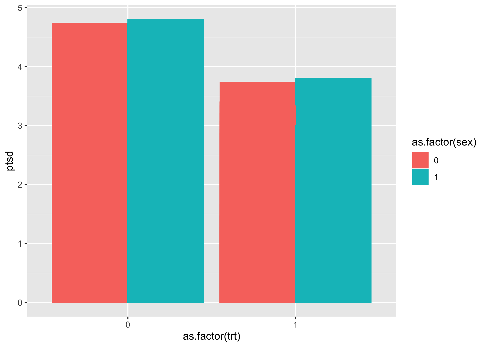

Paper: Rehabilitating civilian victims of war
================

# Paper

-   Title: “Rehabilitating civilian victims of war through psychosocial
    intervention in Sierra Leone”

-   References

Mughal, U., Carrasco, D., Brown, R., & Ayers, S. (2015). Rehabilitating
civilian victims of war through psychosocial intervention in Sierra
Leone. Journal of Applied Social Psychology, 45(11), 593–601.
<https://doi.org/10.1111/jasp.12322>

# Agregar puntajes de escalas

``` r
# -----------------------------------------------------------------------------
# mean scores
# -----------------------------------------------------------------------------

# -----------------------------------------------
# mean_score functiion
# -----------------------------------------------

mean_score <- function (..., na.rm = TRUE) {
    rowMeans(cbind(...), na.rm = na.rm)
}


# -----------------------------------------------
# reverse function
# -----------------------------------------------

reverse <- function (var) {
    var <- labelled::remove_labels(var)
    var <- haven::zap_labels(var)
    max <- max(var, na.rm = TRUE)
    min <- min(var, na.rm = TRUE)
    return(max + min - var)
}

# -----------------------------------------------
# load data from url
# -----------------------------------------------

# ptsd
data_ptsd <- read.csv(
  url(
'https://raw.githubusercontent.com/dacarras/psi2301_examples/master/data/ptsd_data.csv'
  )
)

# -----------------------------------------------
# add measures presented in the paper
# -----------------------------------------------

library(dplyr)
data_ptsd <- data_ptsd %>%
              # PTSD
              mutate(ptsd = mean_score(
              ie01, # Any reminder brought back feelings about it
              ie02, # I had trouble staying asleep
              ie03, # Other things kept making me think about it
              ie04, # I felt irritable and angry
              ie05, # I avoided letting myself get upset when I thought about it or was reminded of it
              ie06, # I thought about it when I didn't mean to
              ie07, # I felt as if it hadn't happened or wasn't real.
              ie08, # Pictures about it popped into my head
              ie09, # I was jumpy and easily startled
              ie10, # I was aware that I still had a lot of feelings about it, but I didn't deal with them
              ie11, # I found myself acting or feeling like I was back at that time
              ie12, # I had waves of strong feelings about it
              ie14, # I had trouble concentrating
              ie15, # Reminders of it caused me to have physical reactions such as sweating, trouble breathing, nausea or a pounding heart
              ie16  # I felt watchful and on-guard
                )) %>%
              # Intergroup anxiety
              ## create reverse scores
              mutate(anx1_r = reverse(anx1)) %>%
              mutate(anx4_r = reverse(anx4)) %>%
              ## mean score
              mutate(anxi = mean_score(
              anx1_r  ,  # [R] Relaxed
              anx2    ,  # Threatened
              anx3    ,  # Awkward
              anx4_r  ,  # [R] Safe
              anx5    ,  # Nervous
              anx6       # Anxious
              )) %>%
              # Out-group blame
              mutate(outb = mean_score(
              noe6,      # I think that the rebels are entirely to blame for what they have done during the war 
              noe7       # I think that the rebels are responsible for everything they did
              )) %>%
              # Intergroup forgiveness
              mutate(ifor = mean_score(
              for6,  # I think my group should reach out to the rebels and forgive them what they have done
              for5   # I should forgive the rebels their misdeeds              
              )) %>%
              # In-group (National) Identification
              mutate(iden = mean_score(
              ide1,  # I am proud to be a Sierra Leonine
              ide2   # I have very strong ties with Sierra Leone
              )) %>%
              # Out-group contact
              mutate(cont = con) %>%
              # Personal War Trauma Experience
              mutate(wart = mean_score(
              war2,  # I have seen dead people
              war3,  # I have lost people of my family in the war
              war4,  # I was attacked
              war5,  # I have seen how people were killed
              war6   # I have been fighting                
              )) %>%
              # dummy variables
              ## sex
              mutate(sex_original = sex) %>%
              dplyr::select(-sex) %>%
              mutate(sex = case_when(
                sex_original == 1 ~ 1, # male
                sex_original == 2 ~ 0  # female
                )) %>%
              ## employment
              mutate(emp_original = emp) %>%
              dplyr::select(-emp) %>%
              mutate(emp = case_when(
                emp_original == 1 ~ 0, # unemployed
                emp_original == 2 ~ 1  # employed
                )) %>%
              ## marital status
              mutate(mar_original = mar) %>%
              dplyr::select(-mar) %>%
              mutate(mar = case_when(
                mar_original == 1 ~ 1, # married
                mar_original == 2 ~ 0  # not married
                )) %>%
              ## religion
              mutate(rel_original = rel) %>%
              dplyr::select(-rel) %>%
              mutate(rel = case_when(
                rel_original == 1 ~ 0, # muslim
                TRUE ~ 1               # non-muslim
                )) %>%
              ## treated
              mutate(trt = case_when(
                cond == 'c1' ~ 0, # delayed control
                cond == 't1' ~ 1  # treated
                )) %>%
              dplyr::glimpse()
```

    ## Rows: 100
    ## Columns: 76
    ## $ id_i         <int> 1, 2, 3, 4, 5, 6, 7, 8, 9, 10, 11, 12, 13, 14, 15, 16, 17…
    ## $ cond         <chr> "c1", "c1", "c1", "c1", "c1", "c1", "c1", "c1", "c1", "c1…
    ## $ ie01         <int> 4, 4, 4, 5, 5, 5, 5, 5, 5, 5, 5, 5, 5, 3, 4, 5, 5, 5, 5, …
    ## $ ie02         <int> 5, 4, 2, 5, 5, 5, 1, 1, 4, 5, 1, 5, 3, 4, 4, 5, 1, 2, 4, …
    ## $ ie03         <int> 4, 3, 4, 5, 5, 5, 4, 4, 3, 5, 5, 5, 5, 3, 4, 5, 5, 5, 5, …
    ## $ ie04         <int> 5, 4, 4, 5, 3, 5, 3, 3, 4, 5, 5, 5, 5, 5, 5, 4, 5, 5, 5, …
    ## $ ie05         <int> 4, 4, 5, 5, 5, 5, 4, 4, 3, 5, 5, 1, 1, 2, 3, 4, 5, 5, 4, …
    ## $ ie06         <int> 4, 4, 5, 5, 5, 2, 3, 4, 4, 5, 4, 3, 5, 3, 5, 4, 3, 5, 4, …
    ## $ ie07         <int> 5, 4, 4, 1, 3, 4, 5, 3, 4, 5, 5, 3, 5, 1, 1, 1, 3, 1, 5, …
    ## $ ie08         <int> 5, 4, 1, 5, 5, 5, 4, 2, 3, 5, 5, 4, 3, 5, 5, 3, 5, 5, 4, …
    ## $ ie09         <int> 5, 5, 2, 5, 5, 5, 3, 3, 2, 5, 5, 4, 3, 5, 5, 1, 5, 3, 2, …
    ## $ ie10         <int> 4, 3, 2, 1, 4, 4, 1, 4, 4, 2, 1, 4, 3, 5, 5, 5, 5, 2, 3, …
    ## $ ie11         <int> 4, 4, 2, 5, 5, 4, 1, 2, 1, 5, 5, 4, 1, 2, 1, 3, 1, 4, 1, …
    ## $ ie12         <int> 5, 3, 2, 5, 3, 5, 5, 5, 4, 5, 5, 4, 5, 5, 5, 5, 5, 4, 3, …
    ## $ ie13         <int> 3, 4, 5, 3, 2, 5, 3, 4, 3, 1, 1, 2, 4, 4, 5, 4, 4, 4, 4, …
    ## $ ie14         <int> 4, 3, 1, 5, 3, 5, 1, 1, 1, 5, 5, 5, 4, 2, 1, 4, 2, 4, 3, …
    ## $ ie15         <int> 5, 3, 1, 5, 4, 5, 3, 2, 3, 1, 5, 4, 4, 2, 3, 3, 2, 5, 4, …
    ## $ ie16         <int> 4, 4, 1, 5, 4, 5, 2, 4, 4, 5, 5, 5, 4, 3, 5, 4, 2, 5, 3, …
    ## $ ie17         <int> 4, 3, 1, 1, 4, 5, 4, 5, 3, 1, 1, 2, 4, 5, 5, 5, 5, 5, 3, …
    ## $ ptc1         <int> 3, 3, 1, 2, 4, 1, 3, 3, 4, 4, 1, 4, 2, 5, 1, 2, 5, 2, 4, …
    ## $ ptc2         <int> 2, 4, 1, 1, 4, 2, 3, 4, 5, 1, 5, 4, 4, 1, 1, 1, 2, 2, 5, …
    ## $ ide1         <int> 5, 5, 5, 5, 5, 5, 5, 5, 5, 5, 1, 1, 5, 5, 5, 1, 5, 5, 2, …
    ## $ ide2         <int> 5, 5, 5, 5, 5, 5, 5, 5, 5, 5, 5, 1, 5, 5, 5, 5, 5, 5, 4, …
    ## $ noe1         <int> 5, 5, 5, 5, 5, 2, 4, 5, 3, 1, 5, 5, 5, 5, 5, 5, 4, 5, 2, …
    ## $ noe2         <int> 5, 4, 5, 4, 5, 5, 3, 3, 1, 1, 5, 5, 5, 5, 5, 5, 3, 5, 1, …
    ## $ for1         <int> 4, 4, 5, 4, 3, 1, 4, 4, 3, 1, 1, 4, 4, 1, 3, 5, 3, 4, 3, …
    ## $ for2         <int> 3, 4, 5, 5, 3, 1, 2, 5, 4, 5, 1, 4, 2, 1, 3, 5, 4, 2, 5, …
    ## $ for3         <int> 3, 4, 2, 3, 3, 1, 4, 5, 3, 1, 5, 4, 4, 1, 3, 3, 4, 2, 4, …
    ## $ for4         <int> 3, 4, 1, 3, 4, 1, 4, 3, 4, 5, 2, 1, 2, 4, 4, 2, 4, 4, 3, …
    ## $ for5         <int> 3, 5, 1, 4, 4, 1, 4, 3, 4, 5, 2, 1, 4, 4, 4, 2, 4, 4, 2, …
    ## $ con          <int> 3, 5, 1, 3, 3, 1, 3, 3, 3, 5, 1, 1, 4, 1, 1, 2, 3, 1, 1, …
    ## $ noe3         <int> 3, 4, 1, 3, 4, 2, 3, 4, 3, 5, 5, 5, 4, 5, 1, 2, 1, 5, 3, …
    ## $ noe4         <int> 4, 3, 5, 4, 4, 5, 4, 2, 4, 5, 5, 5, 3, 2, 1, 1, 1, 4, 5, …
    ## $ noe5         <int> 4, 3, 1, 1, 5, 5, 3, 3, 1, 1, 5, 5, 4, 4, 5, 1, 3, 5, 5, …
    ## $ for6         <int> 4, 3, 1, 4, 5, 5, 2, 3, 3, 5, 5, 1, 4, 4, 4, 1, 4, 4, 3, …
    ## $ noe6         <int> 5, 5, 1, 5, 4, 1, 3, 5, 3, 5, 1, 5, 4, 4, 1, 1, 2, 4, 2, …
    ## $ noe7         <int> 5, 5, 1, 5, 5, 1, 2, 5, 4, 5, 1, 5, 4, 1, 1, 5, 4, 5, 4, …
    ## $ noe8         <int> 2, 3, 3, 4, 2, 4, 4, 2, 5, 1, 1, 5, 1, 1, 3, 2, 3, 1, 3, …
    ## $ anx1         <int> 2, 4, 5, 3, 4, 1, 4, 2, 1, 5, 1, 1, 4, 5, 3, 2, 5, 1, 4, …
    ## $ anx2         <int> 4, 2, 1, 1, 2, 5, 1, 5, 1, 1, 5, 5, 1, 1, 3, 4, 1, 5, 4, …
    ## $ anx3         <int> 4, 3, 3, 1, 4, 5, 3, 5, 2, 1, 5, 5, 1, 1, 1, 5, 1, 1, 2, …
    ## $ anx4         <int> 3, 4, 3, 5, 4, 1, 4, 2, 4, 5, 1, 1, 1, 1, 3, 1, 5, 5, 3, …
    ## $ anx5         <int> 4, 2, 4, 2, 4, 5, 1, 5, 1, 1, 5, 5, 5, 5, 1, 1, 1, 1, 5, …
    ## $ anx6         <int> 5, 1, 1, 4, 4, 5, 1, 2, 5, 1, 5, 1, 5, 1, 1, 5, 5, 1, 4, …
    ## $ war1         <int> 0, 0, 0, 0, 0, 0, 0, 0, 0, 0, 0, 0, 0, 0, 0, 0, 0, 0, 0, …
    ## $ war2         <int> 1, 1, 1, 1, 1, 1, 0, 1, 1, 0, 0, 1, 0, 1, 1, 1, 1, 0, 1, …
    ## $ war3         <int> 1, 1, 1, 0, 0, 0, 0, 0, 1, 0, 0, 0, 0, 1, 1, 1, 1, 0, 0, …
    ## $ war4         <int> 0, 1, 1, 1, 1, 0, 0, 0, 0, 0, 0, 1, 0, 1, 1, 1, 1, 0, 1, …
    ## $ war5         <int> 0, 1, 1, 1, 0, 0, 0, 0, 1, 0, 1, 1, 1, 1, 0, 1, 1, 0, 1, …
    ## $ war6         <int> 0, 1, 1, 1, 1, 0, 0, 1, 1, 0, 1, 1, 1, 1, 1, 1, 1, 0, 0, …
    ## $ war7         <int> 1, 1, 1, 0, 0, 0, 1, 0, 0, 1, 1, 0, 0, 0, 1, 0, 1, 1, 0, …
    ## $ war8         <int> 0, 1, 1, 0, 1, 0, 1, 0, 0, 0, 0, 1, 0, 0, 0, 0, 0, 0, 0, …
    ## $ ie18         <int> 2, 1, 2, 4, 3, 4, 3, 5, 3, 1, 3, 3, 3, 2, 3, 1, 3, 2, 3, …
    ## $ fut1         <int> 2, 2, 1, 2, 2, 2, 1, 2, 2, 1, 1, 1, 1, 1, 1, 1, 1, 1, 2, …
    ## $ fut2         <int> 3, 5, 5, 4, 2, 4, 5, 3, 5, 5, 5, 5, 4, 5, 5, 1, 5, 4, 2, …
    ## $ age          <int> 47, 38, 34, 65, 28, 37, 43, 45, 27, 22, 15, 18, 27, 25, 3…
    ## $ nat          <chr> "TAM", "MAK", "SLE", "MAP", "MAK", "MAK", "SLE", "MAK", "…
    ## $ ski          <int> 1, 1, 2, 1, 2, 2, 2, 2, 2, 1, 1, 1, 2, 2, 2, 1, 2, 2, 2, …
    ## $ ptsd         <dbl> 4.466666667, 3.733333333, 2.666666667, 4.466666667, 4.266…
    ## $ anx1_r       <int> 4, 2, 1, 3, 2, 5, 2, 4, 5, 1, 5, 5, 2, 1, 3, 4, 1, 5, 2, …
    ## $ anx4_r       <int> 3, 2, 3, 1, 2, 5, 2, 4, 2, 1, 5, 5, 5, 5, 3, 5, 1, 1, 3, …
    ## $ anxi         <dbl> 4.000000000, 2.000000000, 2.166666667, 2.000000000, 3.000…
    ## $ outb         <dbl> 5.0, 5.0, 1.0, 5.0, 4.5, 1.0, 2.5, 5.0, 3.5, 5.0, 1.0, 5.…
    ## $ ifor         <dbl> 3.5, 4.0, 1.0, 4.0, 4.5, 3.0, 3.0, 3.0, 3.5, 5.0, 3.5, 1.…
    ## $ iden         <dbl> 5.0, 5.0, 5.0, 5.0, 5.0, 5.0, 5.0, 5.0, 5.0, 5.0, 3.0, 1.…
    ## $ cont         <int> 3, 5, 1, 3, 3, 1, 3, 3, 3, 5, 1, 1, 4, 1, 1, 2, 3, 1, 1, …
    ## $ wart         <dbl> 0.4, 1.0, 1.0, 0.8, 0.6, 0.2, 0.0, 0.4, 0.8, 0.0, 0.4, 0.…
    ## $ sex_original <int> 1, 1, 1, 1, 1, 1, 1, 2, 2, 1, 1, 2, 1, 2, 2, 2, 1, 1, 2, …
    ## $ sex          <dbl> 1, 1, 1, 1, 1, 1, 1, 0, 0, 1, 1, 0, 1, 0, 0, 0, 1, 1, 0, …
    ## $ emp_original <int> 2, 2, 2, 1, 1, 1, 2, 1, 1, 1, 1, 1, 1, 2, 2, 1, 2, 1, 1, …
    ## $ emp          <dbl> 1, 1, 1, 0, 0, 0, 1, 0, 0, 0, 0, 0, 0, 1, 1, 0, 1, 0, 0, …
    ## $ mar_original <int> 1, 1, 1, 1, 1, 1, 1, 1, 2, 2, 2, 2, 2, 2, 1, 2, 2, 1, 1, …
    ## $ mar          <dbl> 1, 1, 1, 1, 1, 1, 1, 1, 0, 0, 0, 0, 0, 0, 1, 0, 0, 1, 1, …
    ## $ rel_original <int> 2, 2, 2, 2, 2, 1, 2, 2, 2, 2, 1, 1, 2, 1, 1, 1, 2, 1, 1, …
    ## $ rel          <dbl> 1, 1, 1, 1, 1, 0, 1, 1, 1, 1, 0, 0, 1, 0, 0, 0, 1, 0, 0, …
    ## $ trt          <dbl> 0, 0, 0, 0, 0, 0, 0, 0, 0, 0, 0, 0, 0, 0, 0, 0, 0, 0, 0, …

``` r
# -----------------------------------------------
# add labels (optional code)
# -----------------------------------------------

data_ptsd <- data_ptsd %>%
labelled::set_variable_labels(
ptsd   = 'post traumatic stress disorder',
anx1_r = '[R] Relaxed',
anx4_r = '[R] Safe',
anxi   = 'Anxiety',
outb   = 'Outgroup blame',
ifor   = 'Intergroup forgiveness',
iden   = 'Ingroup (national) identification',
cont   = 'Outgroup contact',
wart   = 'War trauma',
sex    = 'Sex (1 = male, 0 = female)',
emp    = 'Employment Status (1 = employed, 0 = unemployed)',
mar    = 'Marital Status (1 = married, 0 = not married',
rel    = 'Religion (1 = not muslim, 0 = muslim)',
trt    = 'Treated (1 = treated, 0 = not treated'
)


# -----------------------------------------------
# check value labels
# -----------------------------------------------

data_ptsd %>%
labelled::look_for() %>%
labelled::lookfor_to_long_format() %>%
tibble::as_tibble() %>%
knitr::kable()
```

| pos | variable     | label                                            | col_type | levels | value_labels |
|----:|:-------------|:-------------------------------------------------|:---------|:-------|:-------------|
|   1 | id_i         |                                                  | int      |        |              |
|   2 | cond         |                                                  | chr      |        |              |
|   3 | ie01         |                                                  | int      |        |              |
|   4 | ie02         |                                                  | int      |        |              |
|   5 | ie03         |                                                  | int      |        |              |
|   6 | ie04         |                                                  | int      |        |              |
|   7 | ie05         |                                                  | int      |        |              |
|   8 | ie06         |                                                  | int      |        |              |
|   9 | ie07         |                                                  | int      |        |              |
|  10 | ie08         |                                                  | int      |        |              |
|  11 | ie09         |                                                  | int      |        |              |
|  12 | ie10         |                                                  | int      |        |              |
|  13 | ie11         |                                                  | int      |        |              |
|  14 | ie12         |                                                  | int      |        |              |
|  15 | ie13         |                                                  | int      |        |              |
|  16 | ie14         |                                                  | int      |        |              |
|  17 | ie15         |                                                  | int      |        |              |
|  18 | ie16         |                                                  | int      |        |              |
|  19 | ie17         |                                                  | int      |        |              |
|  20 | ptc1         |                                                  | int      |        |              |
|  21 | ptc2         |                                                  | int      |        |              |
|  22 | ide1         |                                                  | int      |        |              |
|  23 | ide2         |                                                  | int      |        |              |
|  24 | noe1         |                                                  | int      |        |              |
|  25 | noe2         |                                                  | int      |        |              |
|  26 | for1         |                                                  | int      |        |              |
|  27 | for2         |                                                  | int      |        |              |
|  28 | for3         |                                                  | int      |        |              |
|  29 | for4         |                                                  | int      |        |              |
|  30 | for5         |                                                  | int      |        |              |
|  31 | con          |                                                  | int      |        |              |
|  32 | noe3         |                                                  | int      |        |              |
|  33 | noe4         |                                                  | int      |        |              |
|  34 | noe5         |                                                  | int      |        |              |
|  35 | for6         |                                                  | int      |        |              |
|  36 | noe6         |                                                  | int      |        |              |
|  37 | noe7         |                                                  | int      |        |              |
|  38 | noe8         |                                                  | int      |        |              |
|  39 | anx1         |                                                  | int      |        |              |
|  40 | anx2         |                                                  | int      |        |              |
|  41 | anx3         |                                                  | int      |        |              |
|  42 | anx4         |                                                  | int      |        |              |
|  43 | anx5         |                                                  | int      |        |              |
|  44 | anx6         |                                                  | int      |        |              |
|  45 | war1         |                                                  | int      |        |              |
|  46 | war2         |                                                  | int      |        |              |
|  47 | war3         |                                                  | int      |        |              |
|  48 | war4         |                                                  | int      |        |              |
|  49 | war5         |                                                  | int      |        |              |
|  50 | war6         |                                                  | int      |        |              |
|  51 | war7         |                                                  | int      |        |              |
|  52 | war8         |                                                  | int      |        |              |
|  53 | ie18         |                                                  | int      |        |              |
|  54 | fut1         |                                                  | int      |        |              |
|  55 | fut2         |                                                  | int      |        |              |
|  56 | age          |                                                  | int      |        |              |
|  57 | nat          |                                                  | chr      |        |              |
|  58 | ski          |                                                  | int      |        |              |
|  59 | ptsd         | post traumatic stress disorder                   | dbl      |        |              |
|  60 | anx1_r       | \[R\] Relaxed                                    | int      |        |              |
|  61 | anx4_r       | \[R\] Safe                                       | int      |        |              |
|  62 | anxi         | Anxiety                                          | dbl      |        |              |
|  63 | outb         | Outgroup blame                                   | dbl      |        |              |
|  64 | ifor         | Intergroup forgiveness                           | dbl      |        |              |
|  65 | iden         | Ingroup (national) identification                | dbl      |        |              |
|  66 | cont         | Outgroup contact                                 | int      |        |              |
|  67 | wart         | War trauma                                       | dbl      |        |              |
|  68 | sex_original |                                                  | int      |        |              |
|  69 | sex          | Sex (1 = male, 0 = female)                       | dbl      |        |              |
|  70 | emp_original |                                                  | int      |        |              |
|  71 | emp          | Employment Status (1 = employed, 0 = unemployed) | dbl      |        |              |
|  72 | mar_original |                                                  | int      |        |              |
|  73 | mar          | Marital Status (1 = married, 0 = not married     | dbl      |        |              |
|  74 | rel_original |                                                  | int      |        |              |
|  75 | rel          | Religion (1 = not muslim, 0 = muslim)            | dbl      |        |              |
|  76 | trt          | Treated (1 = treated, 0 = not treated            | dbl      |        |              |

# ANOVA de dos factores

``` r
# -----------------------------------------------------------------------------
# anova de dos factores
# -----------------------------------------------------------------------------

# -----------------------------------------------
# anova
# -----------------------------------------------

aov(ptsd  ~ as.factor(sex) + as.factor(trt), data = data_ptsd) %>%
summary()
```

    ##                Df   Sum Sq  Mean Sq  F value                 Pr(>F)    
    ## as.factor(sex)  1  0.20764  0.20764  0.45900                 0.4997    
    ## as.factor(trt)  1 41.95745 41.95745 92.74807 0.00000000000000084183 ***
    ## Residuals      97 43.88095  0.45238                                    
    ## ---
    ## Signif. codes:  0 '***' 0.001 '**' 0.01 '*' 0.05 '.' 0.1 ' ' 1

``` r
# -----------------------------------------------
# plot de medas
# -----------------------------------------------


library(ggplot2)
ggplot(data_ptsd, 
  aes(
    x = as.factor(trt), 
    y = ptsd, 
    fill = as.factor(sex), 
    colour = as.factor(sex))
  ) + 
  geom_bar(stat = "identity", position = "dodge")
```

<!-- -->

``` r
# -----------------------------------------------
# post hoc tukey
# -----------------------------------------------

# metodo 1
aov(ptsd  ~ as.factor(sex) + as.factor(trt), data = data_ptsd) %>%
TukeyHSD()
```

    ##   Tukey multiple comparisons of means
    ##     95% family-wise confidence level
    ## 
    ## Fit: aov(formula = ptsd ~ as.factor(sex) + as.factor(trt), data = data_ptsd)
    ## 
    ## $`as.factor(sex)`
    ##               diff           lwr          upr        p adj
    ## 1-0 -0.09690939243 -0.3808043605 0.1869855756 0.4997026891
    ## 
    ## $`as.factor(trt)`
    ##             diff          lwr          upr        p adj
    ## 1-0 -1.292852103 -1.559834152 -1.025870054 0.0000000004

``` r
# metodo 2
anova_2 <- aov(ptsd  ~ as.factor(sex) + as.factor(trt), data = data_ptsd)
TukeyHSD(anova_2)
```

    ##   Tukey multiple comparisons of means
    ##     95% family-wise confidence level
    ## 
    ## Fit: aov(formula = ptsd ~ as.factor(sex) + as.factor(trt), data = data_ptsd)
    ## 
    ## $`as.factor(sex)`
    ##               diff           lwr          upr        p adj
    ## 1-0 -0.09690939243 -0.3808043605 0.1869855756 0.4997026891
    ## 
    ## $`as.factor(trt)`
    ##             diff          lwr          upr        p adj
    ## 1-0 -1.292852103 -1.559834152 -1.025870054 0.0000000004
